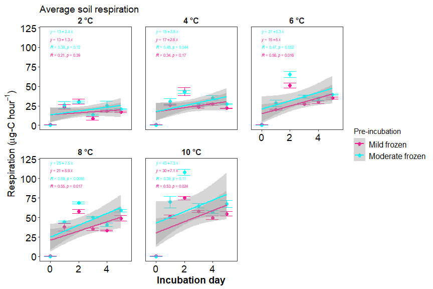
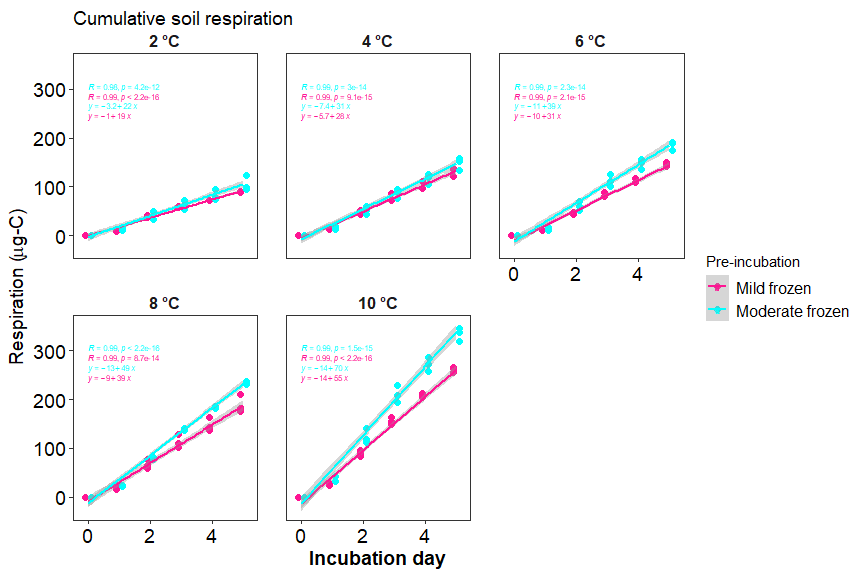
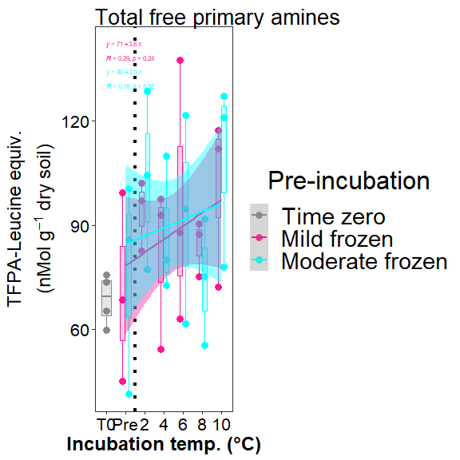
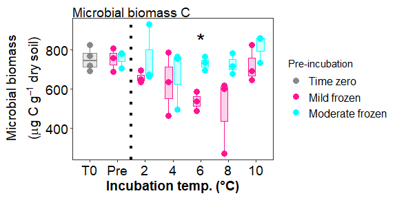
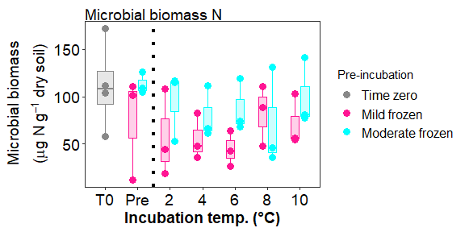

Antecedent temperature experiment
================

## sample summary

click to open

Soils from northwest Alaska were homogenized and pre-incubated at -2 and
-6 degrees Celsius for three months after which they were incubated at
2,4,6,8,10 degrees Celsius for one week. After the week long incubation
soils were extracted using 0.5M K2SO4, and chloroform extracted to
measure microbial biomass and nutrient concentrations. Sub-samples were
also sent to PNNL for more comprehensive analysis of organic matter
using FTICR, NMR, GC-MS and LC-MS techniques. Lipidomics were also
performed to ascertain if there were any significant shifts lipids.

| Replicate | Pre.incubation | Incubation.ID | Incubation.temperauture | ID              | UUID                                 | X   |
|----------:|---------------:|:--------------|------------------------:|:----------------|:-------------------------------------|:----|
|         1 |             -2 | A             |                       2 | A-2-1           | 8656c258-a0e4-4755-81ed-f1d862112621 | NA  |
|         2 |             -2 | A             |                       2 | A-2-2           | 04cbe581-cd60-44ff-8322-e3c9d0f83b9b | NA  |
|         3 |             -2 | A             |                       2 | A-2-3           | 5476356e-c64f-4057-80c1-f75c811fd36e | NA  |
|         1 |             -6 | A             |                       2 | A-6-1           | 23e00139-06b9-4e24-9999-02f36c313389 | NA  |
|         2 |             -6 | A             |                       2 | A-6-2           | 0377bae3-d808-4dde-a8a3-9b68d5ef26de | NA  |
|         3 |             -6 | A             |                       2 | A-6-3           | 537028bc-b721-4650-9b07-7e9a120a86d5 | NA  |
|         1 |             -2 | B             |                       4 | B-2-1           | 440dba45-293d-4a1b-bd7e-25ab39357fa2 | NA  |
|         2 |             -2 | B             |                       4 | B-2-2           | 8245ad28-be7f-4252-a46d-5fd861c420f5 | NA  |
|         3 |             -2 | B             |                       4 | B-2-3           | 1d3baff5-e4c8-4a89-a6c1-8cff831fec47 | NA  |
|         1 |             -6 | B             |                       4 | B-6-1           | a045cdb7-4657-4366-ab08-a49b9c9780ae | NA  |
|         2 |             -6 | B             |                       4 | B-6-2           | ed8616cf-0423-43c6-a1dd-ec97431309c9 | NA  |
|         3 |             -6 | B             |                       4 | B-6-3           | 44e660ac-df81-410a-b264-e345291f1872 | NA  |
|         1 |             -2 | C             |                       6 | C-2-1           | dd528c4e-3d60-40c8-b3a6-accce911cbf9 | NA  |
|         2 |             -2 | C             |                       6 | C-2-2           | 3efde34c-2e51-4560-bfcb-164de36e563e | NA  |
|         3 |             -2 | C             |                       6 | C-2-3           | 96d60bed-37ab-4d96-818d-e43353b81425 | NA  |
|         1 |             -6 | C             |                       6 | C-6-1           | d8d73f99-589b-4559-97b6-107d71c0688c | NA  |
|         2 |             -6 | C             |                       6 | C-6-2           | fce12027-06e4-41d8-9c98-645c90cdf058 | NA  |
|         3 |             -6 | C             |                       6 | C-6-3           | 580e2f97-ae86-4b45-ae91-5f8be28d57f1 | NA  |
|         1 |             -2 | D             |                       8 | D-2-1           | a3edfe91-4286-4ded-9d74-6e59008a0f0b | NA  |
|         2 |             -2 | D             |                       8 | D-2-2           | 587708ea-5a51-49ee-b7b2-aaff43016145 | NA  |
|         3 |             -2 | D             |                       8 | D-2-3           | 571d8331-5027-49c6-9ee0-362ed7654dc5 | NA  |
|         1 |             -6 | D             |                       8 | D-6-1           | 48c5aae9-6684-4f19-bea2-28698eed6d5b | NA  |
|         2 |             -6 | D             |                       8 | D-6-2           | dc8d0e75-f57d-4236-9ef5-523c6bd7e2e1 | NA  |
|         3 |             -6 | D             |                       8 | D-6-3           | da4b7b0d-51ea-43e9-9db0-768352f0dc52 | NA  |
|         1 |             -2 | E             |                      10 | E-2-1           | 51bdcfb0-b98e-4b6d-9271-f857553c99ee | NA  |
|         2 |             -2 | E             |                      10 | E-2-2           | 1c00ea1c-ab85-41b9-9713-7f74f1aaa2fb | NA  |
|         3 |             -2 | E             |                      10 | E-2-3           | 4270be4e-67fc-4f42-811c-bb85d271bf86 | NA  |
|         1 |             -6 | E             |                      10 | E-6-1           | a5f82baa-555e-48ef-bc79-8febae160345 | NA  |
|         2 |             -6 | E             |                      10 | E-6-2           | 3bac6092-7564-4731-8411-8b5f2df33f3f | NA  |
|         3 |             -6 | E             |                      10 | E-6-3           | cefe1d73-c95e-430f-a38a-130e61f11fc9 | NA  |
|         1 |             -2 | Pre           |                      -2 | Pre-2-1         | 0301b210-e061-4847-8236-55b4604e86b9 | NA  |
|         2 |             -2 | Pre           |                      -2 | Pre-2-2         | d07b9001-0b93-4a1a-92b7-70b238a58a2c | NA  |
|         3 |             -2 | Pre           |                      -2 | Pre-2-3         | 392fb7a7-e664-482e-90e7-87a2b5fbaa6e | NA  |
|         1 |             -6 | Pre           |                      -6 | Pre-6-1         | 504ecbd1-d7bc-4c8f-9ec9-1d345bff218d | NA  |
|         2 |             -6 | Pre           |                      -6 | Pre-6-2         | a389c91b-9593-4b0f-84e7-b911e099c3e3 | NA  |
|         3 |             -6 | Pre           |                      -6 | Pre-6-3         | dec78bde-1a26-4368-a537-5b480888b90b | NA  |
|        NA |             NA |               |                      NA | Source material | e6b98a07-c63b-47a7-b872-e99320205b34 | NA  |

------------------------------------------------------------------------

## Respiration results

click to open

Respiration measurements were taken daily during the incubation using a
Li-850 bench top respiration unit. Below are the respiration rates for
each sample, as well as the calculates accumulative respiration
rates.linear models are also drawn in represented color, with 95%
confidence interval.

<!-- --><!-- --><!-- --><!-- -->

------------------------------------------------------------------------

## Soil Nutrients

click to open

Soil K2SO4 extracts were utilized to measure ammonium, Nitrate, Total
free primary amines, phosphate, Total reducing sugars. Below are the
concentration data. An asterisks indicates a significant (p\<= 0.05)
difference in pre-incubation temperature.

<!-- --><!-- --><!-- --><!-- --><!-- --><!-- -->

------------------------------------------------------------------------

## Microbial biomass

click to open

Soil K2SO4 extracts were utilized to measure ammonium, Nitrate, Total
free primary amines, phosphate, Total reducing sugars. Below is the
concentration data.An asterisks indicates a significant (p\<= 0.05)
difference in pre-incubation temperature.

<!-- --><!-- --><!-- -->

------------------------------------------------------------------------

## Stats Table

click to open

Respiration rates were assessed using a Linear Mixed-Effects Models (lme
function from package nlme). Incubation day, incubation temperature, and
preincubation temperature were all shown to be significant. See table
below for p-values. Microbial biomass, TRS, and nutrients from terminal
extractions were assessed for incubation temperatures using an anova
analysis with interaction effects. TRS showed significant variation with
Incubation temperature, pre-incubation temperature, and interaction.
Microbial biomass carbon also showed significant variation with
pre-incubation temperature, but not incubation temperature. All
nutrients had no significant variation.

    ## $`Respiration statistics: anova(lme(Res ~ JD2 + Inc_temp + pre_inc,random = ~1|Sample_ID))`
    ## 
    ## 
    ##                numDF   denDF      F-value     p-value
    ## ------------  ------  ------  -----------  ----------
    ## (Intercept)        1     149   673.355930   0.0000000
    ## JD2                1     149    40.135389   0.0000000
    ## Inc_temp           1      27    91.448720   0.0000000
    ## pre_inc            1      27     6.956082   0.0136884
    ## 
    ## $`ANOVA Nutrients and Microbial biomass: aov(conc ~ pre_inc*Inc_temp)`
    ## 
    ## 
    ## analyte   term                df          sumsq         meansq    statistic     p.value  asterisk 
    ## --------  -----------------  ---  -------------  -------------  -----------  ----------  ---------
    ## FTN       pre_inc              2   1.374035e+04   6.870176e+03    6.4166775   0.0061033  *        
    ## FTN       Inc_temp             5   4.117262e+03   8.234524e+02    0.7690965   0.5816130  NA       
    ## FTN       pre_inc:Inc_temp     5   1.826049e+03   3.652098e+02    0.3411024   0.8826260  NA       
    ## FTN       Residuals           23   2.462552e+04   1.070675e+03           NA          NA  NA       
    ## FTOC      pre_inc              2   7.359999e+04   3.680000e+04    4.7447137   0.0188294  *        
    ## FTOC      Inc_temp             5   1.137154e+05   2.274309e+04    2.9323218   0.0343222  *        
    ## FTOC      pre_inc:Inc_temp     5   3.894616e+04   7.789231e+03    1.0042847   0.4374559  NA       
    ## FTOC      Residuals           23   1.783880e+05   7.755999e+03           NA          NA  NA       
    ## MBC       pre_inc              2   1.202135e+05   6.010674e+04    5.1910967   0.0137863  *        
    ## MBC       Inc_temp             5   1.371886e+05   2.743773e+04    2.3696491   0.0712674  NA       
    ## MBC       pre_inc:Inc_temp     5   5.070313e+04   1.014063e+04    0.8757914   0.5126424  NA       
    ## MBC       Residuals           23   2.663127e+05   1.157881e+04           NA          NA  NA       
    ## MBN       pre_inc              2   7.126838e+03   3.563419e+03    2.8206592   0.0802510  NA       
    ## MBN       Inc_temp             5   2.074324e+03   4.148649e+02    0.3283903   0.8906130  NA       
    ## MBN       pre_inc:Inc_temp     5   3.892345e+03   7.784691e+02    0.6162048   0.6886524  NA       
    ## MBN       Residuals           23   2.905655e+04   1.263328e+03           NA          NA  NA       
    ## NH4       pre_inc              2   2.146117e+00   1.073059e+00    0.9493991   0.4016231  NA       
    ## NH4       Inc_temp             5   4.072849e+00   8.145698e-01    0.7206986   0.6146177  NA       
    ## NH4       pre_inc:Inc_temp     5   9.671207e-01   1.934241e-01    0.1711339   0.9706936  NA       
    ## NH4       Residuals           23   2.599576e+01   1.130250e+00           NA          NA  NA       
    ## NO3       pre_inc              2   2.242756e+02   1.121378e+02    2.9983485   0.0696405  NA       
    ## NO3       Inc_temp             5   2.223114e+02   4.446229e+01    1.1888359   0.3452741  NA       
    ## NO3       pre_inc:Inc_temp     5   6.752124e+01   1.350425e+01    0.3610776   0.8697562  NA       
    ## NO3       Residuals           23   8.601966e+02   3.739985e+01           NA          NA  NA       
    ## PO4       pre_inc              2   2.504600e-03   1.252300e-03    0.0597511   0.9421447  NA       
    ## PO4       Inc_temp             5   9.523150e-02   1.904630e-02    0.9087411   0.4925102  NA       
    ## PO4       pre_inc:Inc_temp     5   3.795490e-02   7.591000e-03    0.3621820   0.8690340  NA       
    ## PO4       Residuals           23   4.820571e-01   2.095900e-02           NA          NA  NA       
    ## TFPA      pre_inc              2   4.188969e+02   2.094485e+02    0.3780633   0.6893668  NA       
    ## TFPA      Inc_temp             5   6.149137e+03   1.229827e+03    2.2198899   0.0869289  NA       
    ## TFPA      pre_inc:Inc_temp     5   4.486744e+02   8.973488e+01    0.1619752   0.9739754  NA       
    ## TFPA      Residuals           23   1.274209e+04   5.540037e+02           NA          NA  NA       
    ## TN        pre_inc              2   9.744179e+03   4.872089e+03   23.0230379   0.0000032  *        
    ## TN        Inc_temp             5   5.353449e+02   1.070690e+02    0.5059540   0.7687186  NA       
    ## TN        pre_inc:Inc_temp     5   1.340024e+03   2.680048e+02    1.2664557   0.3118854  NA       
    ## TN        Residuals           23   4.867214e+03   2.116180e+02           NA          NA  NA       
    ## TOC       pre_inc              2   1.379211e+04   6.896054e+03    2.4475263   0.1087195  NA       
    ## TOC       Inc_temp             5   6.146780e+03   1.229356e+03    0.4363193   0.8185354  NA       
    ## TOC       pre_inc:Inc_temp     5   2.361653e+04   4.723305e+03    1.6763810   0.1803319  NA       
    ## TOC       Residuals           23   6.480389e+04   2.817561e+03           NA          NA  NA       
    ## TRS       pre_inc              2   1.448907e-01   7.244540e-02   42.0381109   0.0000000  *        
    ## TRS       Inc_temp             5   1.822171e-01   3.644340e-02   21.1471412   0.0000001  *        
    ## TRS       pre_inc:Inc_temp     5   1.165281e-01   2.330560e-02   13.5236326   0.0000033  *        
    ## TRS       Residuals           23   3.963650e-02   1.723300e-03           NA          NA  NA       
    ## 
    ## $diffres
    ## 
    ## 
    ## Table: Difference in cumulative respiration between pre incubation temperatures
    ## 
    ##  Inc_temp         -6          -2       Diff
    ## ---------  ---------  ----------  ---------
    ##         2   105.8210    90.26896   15.55202
    ##         4   148.5354   131.09775   17.43764
    ##         6   184.5535   146.32651   38.22700
    ##         8   233.7851   188.78486   45.00021
    ##        10   333.6863   261.20783   72.47846
    ## 
    ## $Dunnett_label_all
    ## 
    ## 
    ## Table: Dunnett test results comparing T0 group to all
    ## 
    ## analyte   pre_inc     Incubation.ID   pre 
    ## --------  ----------  --------------  ----
    ## FTN       -2 vs pre   A                   
    ## FTN       -2 vs pre   B                   
    ## FTN       -2 vs pre   C                   
    ## FTN       -2 vs pre   D                   
    ## FTN       -2 vs pre   E                   
    ## FTN       -6 vs pre   A                   
    ## FTN       -6 vs pre   B                   
    ## FTN       -6 vs pre   C                   
    ## FTN       -6 vs pre   D                   
    ## FTN       -6 vs pre   E                   
    ## FTOC      -2 vs pre   A                   
    ## FTOC      -2 vs pre   B                   
    ## FTOC      -2 vs pre   C               *   
    ## FTOC      -2 vs pre   D                   
    ## FTOC      -2 vs pre   E                   
    ## FTOC      -6 vs pre   A                   
    ## FTOC      -6 vs pre   B                   
    ## FTOC      -6 vs pre   C                   
    ## FTOC      -6 vs pre   D                   
    ## FTOC      -6 vs pre   E                   
    ## MBC       -2 vs pre   A                   
    ## MBC       -2 vs pre   B                   
    ## MBC       -2 vs pre   C                   
    ## MBC       -2 vs pre   D                   
    ## MBC       -2 vs pre   E                   
    ## MBC       -6 vs pre   A                   
    ## MBC       -6 vs pre   B                   
    ## MBC       -6 vs pre   C                   
    ## MBC       -6 vs pre   D                   
    ## MBC       -6 vs pre   E                   
    ## MBN       -2 vs pre   A                   
    ## MBN       -2 vs pre   B                   
    ## MBN       -2 vs pre   C                   
    ## MBN       -2 vs pre   D                   
    ## MBN       -2 vs pre   E                   
    ## MBN       -6 vs pre   A                   
    ## MBN       -6 vs pre   B                   
    ## MBN       -6 vs pre   C                   
    ## MBN       -6 vs pre   D                   
    ## MBN       -6 vs pre   E                   
    ## NH4       -2 vs pre   A                   
    ## NH4       -2 vs pre   B                   
    ## NH4       -2 vs pre   C                   
    ## NH4       -2 vs pre   D                   
    ## NH4       -2 vs pre   E                   
    ## NH4       -6 vs pre   A                   
    ## NH4       -6 vs pre   B                   
    ## NH4       -6 vs pre   C                   
    ## NH4       -6 vs pre   D                   
    ## NH4       -6 vs pre   E                   
    ## NO3       -2 vs pre   A                   
    ## NO3       -2 vs pre   B                   
    ## NO3       -2 vs pre   C                   
    ## NO3       -2 vs pre   D                   
    ## NO3       -2 vs pre   E                   
    ## NO3       -6 vs pre   A                   
    ## NO3       -6 vs pre   B                   
    ## NO3       -6 vs pre   C                   
    ## NO3       -6 vs pre   D                   
    ## NO3       -6 vs pre   E                   
    ## PO4       -2 vs pre   A                   
    ## PO4       -2 vs pre   B                   
    ## PO4       -2 vs pre   C                   
    ## PO4       -2 vs pre   D                   
    ## PO4       -2 vs pre   E                   
    ## PO4       -6 vs pre   A                   
    ## PO4       -6 vs pre   B                   
    ## PO4       -6 vs pre   C                   
    ## PO4       -6 vs pre   D                   
    ## PO4       -6 vs pre   E                   
    ## TFPA      -2 vs pre   A                   
    ## TFPA      -2 vs pre   B                   
    ## TFPA      -2 vs pre   C                   
    ## TFPA      -2 vs pre   D                   
    ## TFPA      -2 vs pre   E                   
    ## TFPA      -6 vs pre   A                   
    ## TFPA      -6 vs pre   B                   
    ## TFPA      -6 vs pre   C                   
    ## TFPA      -6 vs pre   D                   
    ## TFPA      -6 vs pre   E                   
    ## TN        -2 vs pre   A                   
    ## TN        -2 vs pre   B                   
    ## TN        -2 vs pre   C                   
    ## TN        -2 vs pre   D                   
    ## TN        -2 vs pre   E                   
    ## TN        -6 vs pre   A                   
    ## TN        -6 vs pre   B                   
    ## TN        -6 vs pre   C                   
    ## TN        -6 vs pre   D                   
    ## TN        -6 vs pre   E                   
    ## TOC       -2 vs pre   A                   
    ## TOC       -2 vs pre   B                   
    ## TOC       -2 vs pre   C                   
    ## TOC       -2 vs pre   D                   
    ## TOC       -2 vs pre   E                   
    ## TOC       -6 vs pre   A                   
    ## TOC       -6 vs pre   B                   
    ## TOC       -6 vs pre   C                   
    ## TOC       -6 vs pre   D                   
    ## TOC       -6 vs pre   E                   
    ## TRS       -2 vs pre   A                   
    ## TRS       -2 vs pre   B                   
    ## TRS       -2 vs pre   C                   
    ## TRS       -2 vs pre   D                   
    ## TRS       -2 vs pre   E                   
    ## TRS       -6 vs pre   A               *   
    ## TRS       -6 vs pre   B               *   
    ## TRS       -6 vs pre   C               *   
    ## TRS       -6 vs pre   D               *   
    ## TRS       -6 vs pre   E               *   
    ## FTN       -2 vs T0    A               *   
    ## FTN       -2 vs T0    B               *   
    ## FTN       -2 vs T0    C               *   
    ## FTN       -2 vs T0    D               *   
    ## FTN       -2 vs T0    E               *   
    ## FTN       -2 vs T0    Pre             *   
    ## FTOC      -2 vs T0    A                   
    ## FTOC      -2 vs T0    B                   
    ## FTOC      -2 vs T0    C                   
    ## FTOC      -2 vs T0    D                   
    ## FTOC      -2 vs T0    E                   
    ## FTOC      -2 vs T0    Pre                 
    ## MBC       -2 vs T0    A                   
    ## MBC       -2 vs T0    B                   
    ## MBC       -2 vs T0    C                   
    ## MBC       -2 vs T0    D                   
    ## MBC       -2 vs T0    E                   
    ## MBC       -2 vs T0    Pre                 
    ## MBN       -2 vs T0    A                   
    ## MBN       -2 vs T0    B                   
    ## MBN       -2 vs T0    C                   
    ## MBN       -2 vs T0    D                   
    ## MBN       -2 vs T0    E                   
    ## MBN       -2 vs T0    Pre                 
    ## NH4       -2 vs T0    A                   
    ## NH4       -2 vs T0    B                   
    ## NH4       -2 vs T0    C                   
    ## NH4       -2 vs T0    D                   
    ## NH4       -2 vs T0    E                   
    ## NH4       -2 vs T0    Pre                 
    ## NO3       -2 vs T0    A                   
    ## NO3       -2 vs T0    B                   
    ## NO3       -2 vs T0    C                   
    ## NO3       -2 vs T0    D                   
    ## NO3       -2 vs T0    E                   
    ## NO3       -2 vs T0    Pre                 
    ## PO4       -2 vs T0    A                   
    ## PO4       -2 vs T0    B                   
    ## PO4       -2 vs T0    C                   
    ## PO4       -2 vs T0    D                   
    ## PO4       -2 vs T0    E                   
    ## PO4       -2 vs T0    Pre                 
    ## TFPA      -2 vs T0    A                   
    ## TFPA      -2 vs T0    B                   
    ## TFPA      -2 vs T0    C                   
    ## TFPA      -2 vs T0    D                   
    ## TFPA      -2 vs T0    E                   
    ## TFPA      -2 vs T0    Pre                 
    ## TN        -2 vs T0    A               *   
    ## TN        -2 vs T0    B               *   
    ## TN        -2 vs T0    C               *   
    ## TN        -2 vs T0    D               *   
    ## TN        -2 vs T0    E               *   
    ## TN        -2 vs T0    Pre             *   
    ## TOC       -2 vs T0    A                   
    ## TOC       -2 vs T0    B                   
    ## TOC       -2 vs T0    C                   
    ## TOC       -2 vs T0    D                   
    ## TOC       -2 vs T0    E                   
    ## TOC       -2 vs T0    Pre                 
    ## TRS       -2 vs T0    A               *   
    ## TRS       -2 vs T0    B               *   
    ## TRS       -2 vs T0    C               *   
    ## TRS       -2 vs T0    D               *   
    ## TRS       -2 vs T0    E               *   
    ## TRS       -2 vs T0    Pre                 
    ## FTN       -6 vs T0    A               *   
    ## FTN       -6 vs T0    B               *   
    ## FTN       -6 vs T0    C               *   
    ## FTN       -6 vs T0    D               *   
    ## FTN       -6 vs T0    E               *   
    ## FTN       -6 vs T0    Pre             *   
    ## FTOC      -6 vs T0    A                   
    ## FTOC      -6 vs T0    B                   
    ## FTOC      -6 vs T0    C                   
    ## FTOC      -6 vs T0    D                   
    ## FTOC      -6 vs T0    E                   
    ## FTOC      -6 vs T0    Pre                 
    ## MBC       -6 vs T0    A                   
    ## MBC       -6 vs T0    B                   
    ## MBC       -6 vs T0    C                   
    ## MBC       -6 vs T0    D                   
    ## MBC       -6 vs T0    E                   
    ## MBC       -6 vs T0    Pre                 
    ## MBN       -6 vs T0    A                   
    ## MBN       -6 vs T0    B                   
    ## MBN       -6 vs T0    C                   
    ## MBN       -6 vs T0    D                   
    ## MBN       -6 vs T0    E                   
    ## MBN       -6 vs T0    Pre                 
    ## NH4       -6 vs T0    A                   
    ## NH4       -6 vs T0    B                   
    ## NH4       -6 vs T0    C                   
    ## NH4       -6 vs T0    D                   
    ## NH4       -6 vs T0    E                   
    ## NH4       -6 vs T0    Pre                 
    ## NO3       -6 vs T0    A                   
    ## NO3       -6 vs T0    B                   
    ## NO3       -6 vs T0    C                   
    ## NO3       -6 vs T0    D                   
    ## NO3       -6 vs T0    E                   
    ## NO3       -6 vs T0    Pre                 
    ## PO4       -6 vs T0    A                   
    ## PO4       -6 vs T0    B                   
    ## PO4       -6 vs T0    C                   
    ## PO4       -6 vs T0    D                   
    ## PO4       -6 vs T0    E                   
    ## PO4       -6 vs T0    Pre                 
    ## TFPA      -6 vs T0    A                   
    ## TFPA      -6 vs T0    B                   
    ## TFPA      -6 vs T0    C                   
    ## TFPA      -6 vs T0    D                   
    ## TFPA      -6 vs T0    E                   
    ## TFPA      -6 vs T0    Pre                 
    ## TN        -6 vs T0    A               *   
    ## TN        -6 vs T0    B               *   
    ## TN        -6 vs T0    C               *   
    ## TN        -6 vs T0    D               *   
    ## TN        -6 vs T0    E               *   
    ## TN        -6 vs T0    Pre             *   
    ## TOC       -6 vs T0    A                   
    ## TOC       -6 vs T0    B                   
    ## TOC       -6 vs T0    C                   
    ## TOC       -6 vs T0    D                   
    ## TOC       -6 vs T0    E                   
    ## TOC       -6 vs T0    Pre                 
    ## TRS       -6 vs T0    A               *   
    ## TRS       -6 vs T0    B               *   
    ## TRS       -6 vs T0    C               *   
    ## TRS       -6 vs T0    D               *   
    ## TRS       -6 vs T0    E               *   
    ## TRS       -6 vs T0    Pre

------------------------------------------------------------------------

## Session Info

Session Info

Date run: 2023-03-15

    ## R version 4.2.2 (2022-10-31 ucrt)
    ## Platform: x86_64-w64-mingw32/x64 (64-bit)
    ## Running under: Windows 10 x64 (build 19045)
    ## 
    ## Matrix products: default
    ## 
    ## locale:
    ## [1] LC_COLLATE=English_United States.utf8 
    ## [2] LC_CTYPE=English_United States.utf8   
    ## [3] LC_MONETARY=English_United States.utf8
    ## [4] LC_NUMERIC=C                          
    ## [5] LC_TIME=English_United States.utf8    
    ## 
    ## attached base packages:
    ## [1] grid      stats     graphics  grDevices utils     datasets  methods  
    ## [8] base     
    ## 
    ## other attached packages:
    ##  [1] agricolae_1.3-5   knitr_1.41        nlme_3.1-162      cowplot_1.1.1    
    ##  [5] ggpubr_0.5.0      janitor_2.1.0     pracma_2.4.2      reshape2_1.4.4   
    ##  [9] ggbiplot_0.55     scales_1.2.1      plyr_1.8.8        vegan_2.6-4      
    ## [13] lattice_0.20-45   permute_0.9-7     forcats_0.5.2     stringr_1.5.0    
    ## [17] dplyr_1.0.10      purrr_1.0.0       readr_2.1.3       tidyr_1.2.1      
    ## [21] tibble_3.1.8      ggplot2_3.4.0     tidyverse_1.3.2   tarchetypes_0.7.4
    ## [25] targets_0.14.2   
    ## 
    ## loaded via a namespace (and not attached):
    ##   [1] googledrive_2.0.0   colorspace_2.0-3    ggsignif_0.6.4     
    ##   [4] class_7.3-20        ellipsis_0.3.2      snakecase_0.11.0   
    ##   [7] fs_1.5.2            gld_2.6.6           proxy_0.4-27       
    ##  [10] rstudioapi_0.14     farver_2.1.1        listenv_0.9.0      
    ##  [13] furrr_0.3.1         mvtnorm_1.1-3       fansi_1.0.3        
    ##  [16] lubridate_1.9.0     xml2_1.3.3          codetools_0.2-18   
    ##  [19] splines_4.2.2       rootSolve_1.8.2.3   polynom_1.4-1      
    ##  [22] jsonlite_1.8.4      broom_1.0.2         cluster_2.1.4      
    ##  [25] dbplyr_2.2.1        shiny_1.7.4         compiler_4.2.2     
    ##  [28] httr_1.4.4          backports_1.4.1     assertthat_0.2.1   
    ##  [31] Matrix_1.5-1        fastmap_1.1.0       gargle_1.2.1       
    ##  [34] cli_3.6.0           later_1.3.0         htmltools_0.5.4    
    ##  [37] tools_4.2.2         igraph_1.3.5        lmom_2.9           
    ##  [40] gtable_0.3.1        glue_1.6.2          Rcpp_1.0.9         
    ##  [43] carData_3.0-5       cellranger_1.1.0    vctrs_0.5.1        
    ##  [46] xfun_0.36           globals_0.16.2      ps_1.7.2           
    ##  [49] rvest_1.0.3         mime_0.12           timechange_0.1.1   
    ##  [52] miniUI_0.1.1.1      lifecycle_1.0.3     rstatix_0.7.2      
    ##  [55] googlesheets4_1.0.1 future_1.30.0       MASS_7.3-58.1      
    ##  [58] hms_1.1.2           promises_1.2.0.1    parallel_4.2.2     
    ##  [61] expm_0.999-7        Exact_3.2           yaml_2.3.6         
    ##  [64] labelled_2.10.0     stringi_1.7.8       AlgDesign_1.2.1    
    ##  [67] highr_0.10          klaR_1.7-1          e1071_1.7-13       
    ##  [70] boot_1.3-28         rlang_1.0.6         pkgconfig_2.0.3    
    ##  [73] evaluate_0.19       labeling_0.4.2      processx_3.8.0     
    ##  [76] tidyselect_1.2.0    parallelly_1.34.0   magrittr_2.0.3     
    ##  [79] R6_2.5.1            DescTools_0.99.48   generics_0.1.3     
    ##  [82] base64url_1.4       combinat_0.0-8      DBI_1.1.3          
    ##  [85] pillar_1.8.1        haven_2.5.1         withr_2.5.0        
    ##  [88] mgcv_1.8-41         abind_1.4-5         modelr_0.1.10      
    ##  [91] crayon_1.5.2        car_3.1-1           questionr_0.7.8    
    ##  [94] utf8_1.2.2          rmarkdown_2.19      tzdb_0.3.0         
    ##  [97] future.callr_0.8.1  readxl_1.4.1        data.table_1.14.6  
    ## [100] callr_3.7.3         reprex_2.0.2        digest_0.6.31      
    ## [103] xtable_1.8-4        httpuv_1.6.7        munsell_0.5.0

