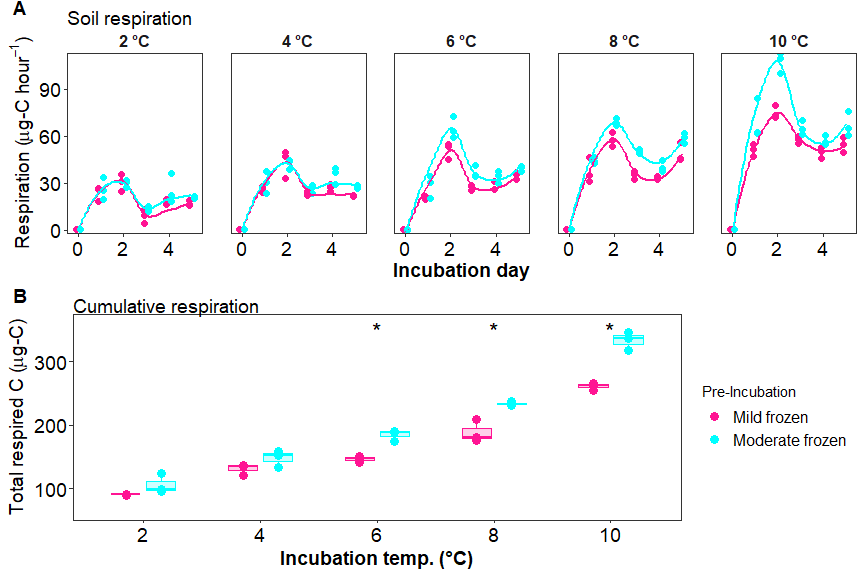

Antecedent temperature
================

## sample summary

click to open

| Replicate | Pre.incubation | Incubation.ID | Incubation.temperauture | ID              | UUID                                 | X   |
|----------:|---------------:|:--------------|------------------------:|:----------------|:-------------------------------------|:----|
|         1 |             -2 | A             |                       2 | A-2-1           | 8656c258-a0e4-4755-81ed-f1d862112621 | NA  |
|         2 |             -2 | A             |                       2 | A-2-2           | 04cbe581-cd60-44ff-8322-e3c9d0f83b9b | NA  |
|         3 |             -2 | A             |                       2 | A-2-3           | 5476356e-c64f-4057-80c1-f75c811fd36e | NA  |
|         1 |             -6 | A             |                       2 | A-6-1           | 23e00139-06b9-4e24-9999-02f36c313389 | NA  |
|         2 |             -6 | A             |                       2 | A-6-2           | 0377bae3-d808-4dde-a8a3-9b68d5ef26de | NA  |
|         3 |             -6 | A             |                       2 | A-6-3           | 537028bc-b721-4650-9b07-7e9a120a86d5 | NA  |
|         1 |             -2 | B             |                       4 | B-2-1           | 440dba45-293d-4a1b-bd7e-25ab39357fa2 | NA  |
|         2 |             -2 | B             |                       4 | B-2-2           | 8245ad28-be7f-4252-a46d-5fd861c420f5 | NA  |
|         3 |             -2 | B             |                       4 | B-2-3           | 1d3baff5-e4c8-4a89-a6c1-8cff831fec47 | NA  |
|         1 |             -6 | B             |                       4 | B-6-1           | a045cdb7-4657-4366-ab08-a49b9c9780ae | NA  |
|         2 |             -6 | B             |                       4 | B-6-2           | ed8616cf-0423-43c6-a1dd-ec97431309c9 | NA  |
|         3 |             -6 | B             |                       4 | B-6-3           | 44e660ac-df81-410a-b264-e345291f1872 | NA  |
|         1 |             -2 | C             |                       6 | C-2-1           | dd528c4e-3d60-40c8-b3a6-accce911cbf9 | NA  |
|         2 |             -2 | C             |                       6 | C-2-2           | 3efde34c-2e51-4560-bfcb-164de36e563e | NA  |
|         3 |             -2 | C             |                       6 | C-2-3           | 96d60bed-37ab-4d96-818d-e43353b81425 | NA  |
|         1 |             -6 | C             |                       6 | C-6-1           | d8d73f99-589b-4559-97b6-107d71c0688c | NA  |
|         2 |             -6 | C             |                       6 | C-6-2           | fce12027-06e4-41d8-9c98-645c90cdf058 | NA  |
|         3 |             -6 | C             |                       6 | C-6-3           | 580e2f97-ae86-4b45-ae91-5f8be28d57f1 | NA  |
|         1 |             -2 | D             |                       8 | D-2-1           | a3edfe91-4286-4ded-9d74-6e59008a0f0b | NA  |
|         2 |             -2 | D             |                       8 | D-2-2           | 587708ea-5a51-49ee-b7b2-aaff43016145 | NA  |
|         3 |             -2 | D             |                       8 | D-2-3           | 571d8331-5027-49c6-9ee0-362ed7654dc5 | NA  |
|         1 |             -6 | D             |                       8 | D-6-1           | 48c5aae9-6684-4f19-bea2-28698eed6d5b | NA  |
|         2 |             -6 | D             |                       8 | D-6-2           | dc8d0e75-f57d-4236-9ef5-523c6bd7e2e1 | NA  |
|         3 |             -6 | D             |                       8 | D-6-3           | da4b7b0d-51ea-43e9-9db0-768352f0dc52 | NA  |
|         1 |             -2 | E             |                      10 | E-2-1           | 51bdcfb0-b98e-4b6d-9271-f857553c99ee | NA  |
|         2 |             -2 | E             |                      10 | E-2-2           | 1c00ea1c-ab85-41b9-9713-7f74f1aaa2fb | NA  |
|         3 |             -2 | E             |                      10 | E-2-3           | 4270be4e-67fc-4f42-811c-bb85d271bf86 | NA  |
|         1 |             -6 | E             |                      10 | E-6-1           | a5f82baa-555e-48ef-bc79-8febae160345 | NA  |
|         2 |             -6 | E             |                      10 | E-6-2           | 3bac6092-7564-4731-8411-8b5f2df33f3f | NA  |
|         3 |             -6 | E             |                      10 | E-6-3           | cefe1d73-c95e-430f-a38a-130e61f11fc9 | NA  |
|         1 |             -2 | Pre           |                      -2 | Pre-2-1         | 0301b210-e061-4847-8236-55b4604e86b9 | NA  |
|         2 |             -2 | Pre           |                      -2 | Pre-2-2         | d07b9001-0b93-4a1a-92b7-70b238a58a2c | NA  |
|         3 |             -2 | Pre           |                      -2 | Pre-2-3         | 392fb7a7-e664-482e-90e7-87a2b5fbaa6e | NA  |
|         1 |             -6 | Pre           |                      -6 | Pre-6-1         | 504ecbd1-d7bc-4c8f-9ec9-1d345bff218d | NA  |
|         2 |             -6 | Pre           |                      -6 | Pre-6-2         | a389c91b-9593-4b0f-84e7-b911e099c3e3 | NA  |
|         3 |             -6 | Pre           |                      -6 | Pre-6-3         | dec78bde-1a26-4368-a537-5b480888b90b | NA  |
|        NA |             NA |               |                      NA | Source material | e6b98a07-c63b-47a7-b872-e99320205b34 | NA  |

------------------------------------------------------------------------

## Respiration results

click to open

    ## $gg_res

<!-- -->

    ## 
    ## $gg_cumres

<!-- -->

------------------------------------------------------------------------

## Session Info

Session Info

Date run: 2023-01-18

    ## R version 4.2.1 (2022-06-23)
    ## Platform: x86_64-apple-darwin17.0 (64-bit)
    ## Running under: macOS Big Sur ... 10.16
    ## 
    ## Matrix products: default
    ## BLAS:   /Library/Frameworks/R.framework/Versions/4.2/Resources/lib/libRblas.0.dylib
    ## LAPACK: /Library/Frameworks/R.framework/Versions/4.2/Resources/lib/libRlapack.dylib
    ## 
    ## locale:
    ## [1] en_US.UTF-8/en_US.UTF-8/en_US.UTF-8/C/en_US.UTF-8/en_US.UTF-8
    ## 
    ## attached base packages:
    ## [1] stats     graphics  grDevices utils     datasets  methods   base     
    ## 
    ## other attached packages:
    ##  [1] janitor_2.1.0     pracma_2.4.2      reshape2_1.4.4    ggbiplot_0.55    
    ##  [5] vegan_2.6-4       lattice_0.20-45   permute_0.9-7     forcats_0.5.2    
    ##  [9] stringr_1.4.1     dplyr_1.0.10      purrr_0.3.4       readr_2.1.3      
    ## [13] tidyr_1.2.1       tibble_3.1.8      ggplot2_3.3.6     tidyverse_1.3.2  
    ## [17] tarchetypes_0.7.2 targets_0.14.0   
    ## 
    ## loaded via a namespace (and not attached):
    ##  [1] httr_1.4.4          jsonlite_1.8.0      splines_4.2.1      
    ##  [4] modelr_0.1.9        assertthat_0.2.1    highr_0.9          
    ##  [7] base64url_1.4       googlesheets4_1.0.1 cellranger_1.1.0   
    ## [10] yaml_2.3.5          pillar_1.8.1        backports_1.4.1    
    ## [13] glue_1.6.2          digest_0.6.29       rvest_1.0.3        
    ## [16] snakecase_0.11.0    colorspace_2.0-3    htmltools_0.5.3    
    ## [19] Matrix_1.5-1        plyr_1.8.7          pkgconfig_2.0.3    
    ## [22] broom_1.0.0         haven_2.5.1         scales_1.2.1       
    ## [25] processx_3.7.0      tzdb_0.3.0          googledrive_2.0.0  
    ## [28] mgcv_1.8-40         farver_2.1.1        generics_0.1.3     
    ## [31] ellipsis_0.3.2      withr_2.5.0         cli_3.3.0          
    ## [34] magrittr_2.0.3      crayon_1.5.1        readxl_1.4.1       
    ## [37] evaluate_0.16       ps_1.7.1            fs_1.5.2           
    ## [40] fansi_1.0.3         nlme_3.1-160        MASS_7.3-57        
    ## [43] xml2_1.3.3          tools_4.2.1         data.table_1.14.4  
    ## [46] hms_1.1.2           gargle_1.2.0        lifecycle_1.0.1    
    ## [49] munsell_0.5.0       reprex_2.0.2        cluster_2.1.3      
    ## [52] callr_3.7.2         compiler_4.2.1      rlang_1.0.5        
    ## [55] grid_4.2.1          rstudioapi_0.14     igraph_1.3.4       
    ## [58] labeling_0.4.2      rmarkdown_2.16      gtable_0.3.0       
    ## [61] codetools_0.2-18    DBI_1.1.3           R6_2.5.1           
    ## [64] lubridate_1.8.0     knitr_1.40          fastmap_1.1.0      
    ## [67] utf8_1.2.2          stringi_1.7.8       parallel_4.2.1     
    ## [70] Rcpp_1.0.9          vctrs_0.4.1         dbplyr_2.2.1       
    ## [73] tidyselect_1.1.2    xfun_0.32

