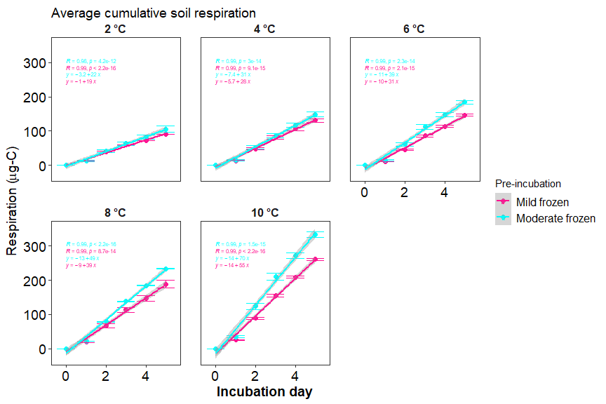
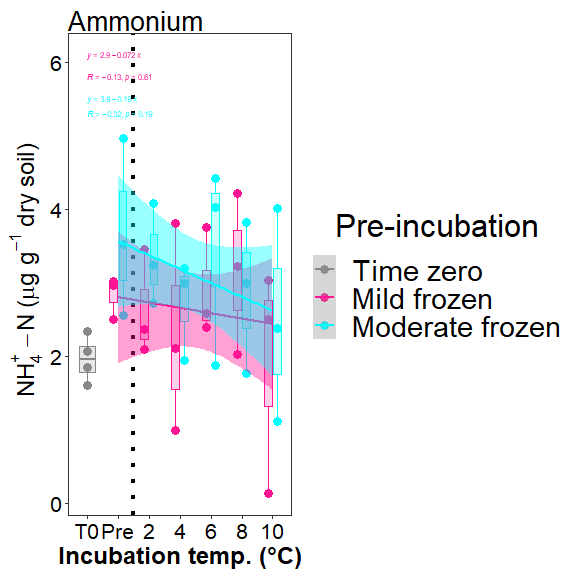
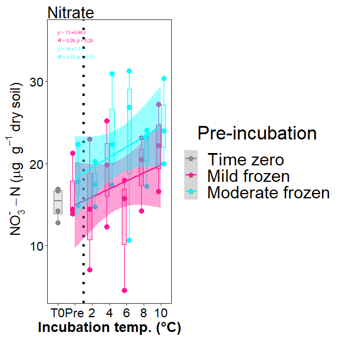
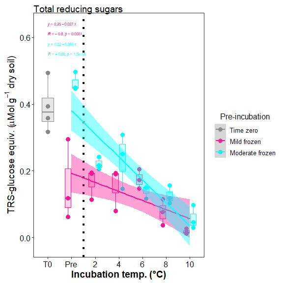
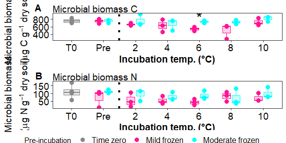

Antecedent temperature experiment
================

## Sample Summary

click to open

Soils from northwest Alaska were homogenized and pre-incubated at -2 and
-6 degrees Celsius for three months after which they were incubated at
2,4,6,8,10 degrees Celsius for one week. After the week long incubation
soils were extracted using 0.5M K2SO4, and chloroform extracted to
measure microbial biomass and nutrient concentrations. Sub-samples were
also sent to PNNL for more comprehensive analysis of organic matter
using FTICR, NMR, GC-MS and LC-MS techniques. Lipidomics were also
performed to ascertain if there were any significant shifts lipids.

| Replicate | Date       | Pre.incubation | Incubation.ID | Incubation.temperauture | ID              | UUID                                 |
|----------:|:-----------|---------------:|:--------------|:------------------------|:----------------|:-------------------------------------|
|         1 | 11/18/2022 |             -2 | A             | 2                       | A-2-1           | 8656c258-a0e4-4755-81ed-f1d862112621 |
|         2 | 11/18/2022 |             -2 | A             | 2                       | A-2-2           | 04cbe581-cd60-44ff-8322-e3c9d0f83b9b |
|         3 | 11/18/2022 |             -2 | A             | 2                       | A-2-3           | 5476356e-c64f-4057-80c1-f75c811fd36e |
|         1 | 11/18/2022 |             -6 | A             | 2                       | A-6-1           | 23e00139-06b9-4e24-9999-02f36c313389 |
|         2 | 11/18/2022 |             -6 | A             | 2                       | A-6-2           | 0377bae3-d808-4dde-a8a3-9b68d5ef26de |
|         3 | 11/18/2022 |             -6 | A             | 2                       | A-6-3           | 537028bc-b721-4650-9b07-7e9a120a86d5 |
|         1 | 11/18/2022 |             -2 | B             | 4                       | B-2-1           | 440dba45-293d-4a1b-bd7e-25ab39357fa2 |
|         2 | 11/18/2022 |             -2 | B             | 4                       | B-2-2           | 8245ad28-be7f-4252-a46d-5fd861c420f5 |
|         3 | 11/18/2022 |             -2 | B             | 4                       | B-2-3           | 1d3baff5-e4c8-4a89-a6c1-8cff831fec47 |
|         1 | 11/18/2022 |             -6 | B             | 4                       | B-6-1           | a045cdb7-4657-4366-ab08-a49b9c9780ae |
|         2 | 11/18/2022 |             -6 | B             | 4                       | B-6-2           | ed8616cf-0423-43c6-a1dd-ec97431309c9 |
|         3 | 11/18/2022 |             -6 | B             | 4                       | B-6-3           | 44e660ac-df81-410a-b264-e345291f1872 |
|         1 | 11/18/2022 |             -2 | C             | 6                       | C-2-1           | dd528c4e-3d60-40c8-b3a6-accce911cbf9 |
|         2 | 11/18/2022 |             -2 | C             | 6                       | C-2-2           | 3efde34c-2e51-4560-bfcb-164de36e563e |
|         3 | 11/18/2022 |             -2 | C             | 6                       | C-2-3           | 96d60bed-37ab-4d96-818d-e43353b81425 |
|         1 | 11/18/2022 |             -6 | C             | 6                       | C-6-1           | d8d73f99-589b-4559-97b6-107d71c0688c |
|         2 | 11/18/2022 |             -6 | C             | 6                       | C-6-2           | fce12027-06e4-41d8-9c98-645c90cdf058 |
|         3 | 11/18/2022 |             -6 | C             | 6                       | C-6-3           | 580e2f97-ae86-4b45-ae91-5f8be28d57f1 |
|         1 | 11/18/2022 |             -2 | D             | 8                       | D-2-1           | a3edfe91-4286-4ded-9d74-6e59008a0f0b |
|         2 | 11/18/2022 |             -2 | D             | 8                       | D-2-2           | 587708ea-5a51-49ee-b7b2-aaff43016145 |
|         3 | 11/18/2022 |             -2 | D             | 8                       | D-2-3           | 571d8331-5027-49c6-9ee0-362ed7654dc5 |
|         1 | 11/18/2022 |             -6 | D             | 8                       | D-6-1           | 48c5aae9-6684-4f19-bea2-28698eed6d5b |
|         2 | 11/18/2022 |             -6 | D             | 8                       | D-6-2           | dc8d0e75-f57d-4236-9ef5-523c6bd7e2e1 |
|         3 | 11/18/2022 |             -6 | D             | 8                       | D-6-3           | da4b7b0d-51ea-43e9-9db0-768352f0dc52 |
|         1 | 11/18/2022 |             -2 | E             | 10                      | E-2-1           | 51bdcfb0-b98e-4b6d-9271-f857553c99ee |
|         2 | 11/18/2022 |             -2 | E             | 10                      | E-2-2           | 1c00ea1c-ab85-41b9-9713-7f74f1aaa2fb |
|         3 | 11/18/2022 |             -2 | E             | 10                      | E-2-3           | 4270be4e-67fc-4f42-811c-bb85d271bf86 |
|         1 | 11/18/2022 |             -6 | E             | 10                      | E-6-1           | a5f82baa-555e-48ef-bc79-8febae160345 |
|         2 | 11/18/2022 |             -6 | E             | 10                      | E-6-2           | 3bac6092-7564-4731-8411-8b5f2df33f3f |
|         3 | 11/18/2022 |             -6 | E             | 10                      | E-6-3           | cefe1d73-c95e-430f-a38a-130e61f11fc9 |
|         1 | 11/13/2022 |             -2 | Pre           | Pre                     | Pre-2-1         | 0301b210-e061-4847-8236-55b4604e86b9 |
|         2 | 11/13/2022 |             -2 | Pre           | Pre                     | Pre-2-2         | d07b9001-0b93-4a1a-92b7-70b238a58a2c |
|         3 | 11/13/2022 |             -2 | Pre           | Pre                     | Pre-2-3         | 392fb7a7-e664-482e-90e7-87a2b5fbaa6e |
|         1 | 11/13/2022 |             -6 | Pre           | Pre                     | Pre-6-1         | 504ecbd1-d7bc-4c8f-9ec9-1d345bff218d |
|         2 | 11/13/2022 |             -6 | Pre           | Pre                     | Pre-6-2         | a389c91b-9593-4b0f-84e7-b911e099c3e3 |
|         3 | 11/13/2022 |             -6 | Pre           | Pre                     | Pre-6-3         | dec78bde-1a26-4368-a537-5b480888b90b |
|        NA |            |             NA |               |                         | Source material | e6b98a07-c63b-47a7-b872-e99320205b34 |

------------------------------------------------------------------------

## Respiration Results

click to open

Respiration measurements were taken daily during the incubation using a
Li-850 bench top respiration unit. Below are the respiration rates for
each sample, as well as the calculates accumulative respiration
rates.linear models are also drawn in represented color, with 95%
confidence interval.

<!-- --><!-- --><!-- --><!-- -->

------------------------------------------------------------------------

## Soil Nutrients

click to open

Soil K2SO4 extracts were utilized to measure ammonium, Nitrate, Total
free primary amines, phosphate, Total reducing sugars. Below are the
concentration data. An asterisks indicates a significant (p\<= 0.05)
difference in pre-incubation temperature.

<!-- --><!-- --><!-- --><!-- --><!-- --><!-- --><!-- -->

------------------------------------------------------------------------

## Microbial Biomass

click to open

Soil K2SO4 extracts were utilized to measure ammonium, Nitrate, Total
free primary amines, phosphate, Total reducing sugars. Below is the
concentration data.An asterisks indicates a significant (p\<= 0.05)
difference in pre-incubation temperature.

<!-- --><!-- --><!-- -->

------------------------------------------------------------------------

## Stats Table

click to open

Respiration rates were assessed using a Linear Mixed-Effects Models (lme
function from package nlme). Incubation day, incubation temperature, and
preincubation temperature were all shown to be significant. See table
below for p-values. Microbial biomass, TRS, and nutrients from terminal
extractions were assessed for incubation temperatures using an anova
analysis with interaction effects. TRS showed significant variation with
Incubation temperature, pre-incubation temperature, and interaction.
Microbial biomass carbon also showed significant variation with
pre-incubation temperature, but not incubation temperature. All
nutrients had no significant variation.

    ## $`Respiration statistics: anova(lme(Res ~ JD2 + Inc_temp + pre_inc,random = ~1|Sample_ID))`
    ## 
    ## 
    ##                numDF   denDF      F-value     p-value
    ## ------------  ------  ------  -----------  ----------
    ## (Intercept)        1     149   673.355930   0.0000000
    ## JD2                1     149    40.135389   0.0000000
    ## Inc_temp           1      27    91.448720   0.0000000
    ## pre_inc            1      27     6.956082   0.0136884
    ## 
    ## $diffres
    ## 
    ## 
    ## Table: Difference in cumulative respiration between pre incubation temperatures
    ## 
    ##  Inc_temp         -6          -2       Diff
    ## ---------  ---------  ----------  ---------
    ##         2   105.8210    90.26896   15.55202
    ##         4   148.5354   131.09775   17.43764
    ##         6   184.5535   146.32651   38.22700
    ##         8   233.7851   188.78486   45.00021
    ##        10   333.6863   261.20783   72.47846
    ## 
    ## $LastRES_aov
    ##             Df Sum Sq Mean Sq F value   Pr(>F)    
    ## pre_inc      1  10682   10682   22.84 5.51e-05 ***
    ## Inc_temp     1 132694  132694  283.75 7.53e-16 ***
    ## Residuals   27  12627     468                     
    ## ---
    ## Signif. codes:  0 '***' 0.001 '**' 0.01 '*' 0.05 '.' 0.1 ' ' 1
    ## 
    ## $`ANOVA Nutrients and Microbial biomass: aov(conc ~ pre_inc*Inc_temp)`
    ## 
    ## 
    ## Table: Extraction ANOVA results
    ## 
    ## analyte   term                df          sumsq         meansq    statistic     p.value  asterisk 
    ## --------  -----------------  ---  -------------  -------------  -----------  ----------  ---------
    ## FTN       pre_inc              2   1.374035e+04   6.870176e+03    6.4166775   0.0061033  *        
    ## FTN       Inc_temp             5   4.117262e+03   8.234524e+02    0.7690965   0.5816130  NA       
    ## FTN       pre_inc:Inc_temp     5   1.826049e+03   3.652098e+02    0.3411024   0.8826260  NA       
    ## FTN       Residuals           23   2.462552e+04   1.070675e+03           NA          NA  NA       
    ## FTOC      pre_inc              2   7.359999e+04   3.680000e+04    4.7447137   0.0188294  *        
    ## FTOC      Inc_temp             5   1.137154e+05   2.274309e+04    2.9323218   0.0343222  *        
    ## FTOC      pre_inc:Inc_temp     5   3.894616e+04   7.789231e+03    1.0042847   0.4374559  NA       
    ## FTOC      Residuals           23   1.783880e+05   7.755999e+03           NA          NA  NA       
    ## MBC       pre_inc              2   1.202135e+05   6.010674e+04    5.1910967   0.0137863  *        
    ## MBC       Inc_temp             5   1.371886e+05   2.743773e+04    2.3696491   0.0712674  NA       
    ## MBC       pre_inc:Inc_temp     5   5.070313e+04   1.014063e+04    0.8757914   0.5126424  NA       
    ## MBC       Residuals           23   2.663127e+05   1.157881e+04           NA          NA  NA       
    ## MBN       pre_inc              2   7.126838e+03   3.563419e+03    2.8206592   0.0802510  NA       
    ## MBN       Inc_temp             5   2.074324e+03   4.148649e+02    0.3283903   0.8906130  NA       
    ## MBN       pre_inc:Inc_temp     5   3.892345e+03   7.784691e+02    0.6162048   0.6886524  NA       
    ## MBN       Residuals           23   2.905655e+04   1.263328e+03           NA          NA  NA       
    ## NH4       pre_inc              2   2.146117e+00   1.073059e+00    0.9493991   0.4016231  NA       
    ## NH4       Inc_temp             5   4.072849e+00   8.145698e-01    0.7206986   0.6146177  NA       
    ## NH4       pre_inc:Inc_temp     5   9.671207e-01   1.934241e-01    0.1711339   0.9706936  NA       
    ## NH4       Residuals           23   2.599576e+01   1.130250e+00           NA          NA  NA       
    ## NO3       pre_inc              2   2.242756e+02   1.121378e+02    2.9983485   0.0696405  NA       
    ## NO3       Inc_temp             5   2.223114e+02   4.446229e+01    1.1888359   0.3452741  NA       
    ## NO3       pre_inc:Inc_temp     5   6.752124e+01   1.350425e+01    0.3610776   0.8697562  NA       
    ## NO3       Residuals           23   8.601966e+02   3.739985e+01           NA          NA  NA       
    ## PO4       pre_inc              2   2.504600e-03   1.252300e-03    0.0597511   0.9421447  NA       
    ## PO4       Inc_temp             5   9.523150e-02   1.904630e-02    0.9087411   0.4925102  NA       
    ## PO4       pre_inc:Inc_temp     5   3.795490e-02   7.591000e-03    0.3621820   0.8690340  NA       
    ## PO4       Residuals           23   4.820571e-01   2.095900e-02           NA          NA  NA       
    ## TFPA      pre_inc              2   4.188969e+02   2.094485e+02    0.3780633   0.6893668  NA       
    ## TFPA      Inc_temp             5   6.149137e+03   1.229827e+03    2.2198899   0.0869289  NA       
    ## TFPA      pre_inc:Inc_temp     5   4.486744e+02   8.973488e+01    0.1619752   0.9739754  NA       
    ## TFPA      Residuals           23   1.274209e+04   5.540037e+02           NA          NA  NA       
    ## TN        pre_inc              2   9.744179e+03   4.872089e+03   23.0230379   0.0000032  *        
    ## TN        Inc_temp             5   5.353449e+02   1.070690e+02    0.5059540   0.7687186  NA       
    ## TN        pre_inc:Inc_temp     5   1.340024e+03   2.680048e+02    1.2664557   0.3118854  NA       
    ## TN        Residuals           23   4.867214e+03   2.116180e+02           NA          NA  NA       
    ## TOC       pre_inc              2   1.379211e+04   6.896054e+03    2.4475263   0.1087195  NA       
    ## TOC       Inc_temp             5   6.146780e+03   1.229356e+03    0.4363193   0.8185354  NA       
    ## TOC       pre_inc:Inc_temp     5   2.361653e+04   4.723305e+03    1.6763810   0.1803319  NA       
    ## TOC       Residuals           23   6.480389e+04   2.817561e+03           NA          NA  NA       
    ## TRS       pre_inc              2   1.448907e-01   7.244540e-02   42.0381109   0.0000000  *        
    ## TRS       Inc_temp             5   1.822171e-01   3.644340e-02   21.1471412   0.0000001  *        
    ## TRS       pre_inc:Inc_temp     5   1.165281e-01   2.330560e-02   13.5236326   0.0000033  *        
    ## TRS       Residuals           23   3.963650e-02   1.723300e-03           NA          NA  NA       
    ## 
    ## $all_aov
    ## 
    ## 
    ## Table: ANOVA
    ## 
    ## analyte   Inc_temp   term       df          sumsq         meansq    statistic     p.value  asterisk   pre_inc 
    ## --------  ---------  --------  ---  -------------  -------------  -----------  ----------  ---------  --------
    ## FTN       10         pre_inc     1   9.704188e+02   9.704188e+02    1.0086673   0.3720485  NA         -2      
    ## FTN       2          pre_inc     1   5.529072e+01   5.529072e+01    0.0396834   0.8518172  NA         -2      
    ## FTN       4          pre_inc     1   2.986152e+02   2.986152e+02    0.2928154   0.6171500  NA         -2      
    ## FTN       6          pre_inc     1   1.113389e+03   1.113389e+03    1.1433392   0.3451813  NA         -2      
    ## FTN       8          pre_inc     1   1.696253e+01   1.696253e+01    0.0109344   0.9217523  NA         -2      
    ## FTN       Pre        pre_inc     1   1.127396e+03   1.127396e+03    2.3056970   0.2035151  NA         -2      
    ## FTOC      10         pre_inc     1   1.920856e+04   1.920856e+04    5.4031229   0.0807406  NA         -2      
    ## FTOC      2          pre_inc     1   6.554433e+03   6.554433e+03    3.2794098   0.1443938  NA         -2      
    ## FTOC      4          pre_inc     1   1.325938e+03   1.325938e+03    0.0680030   0.8071419  NA         -2      
    ## FTOC      6          pre_inc     1   4.974039e+04   4.974039e+04   15.9326006   0.0162437  *          -2      
    ## FTOC      8          pre_inc     1   1.637648e+04   1.637648e+04    1.1453960   0.3447969  NA         -2      
    ## FTOC      Pre        pre_inc     1   3.756575e+02   3.756575e+02    0.2937685   0.6165971  NA         -2      
    ## MBC       10         pre_inc     1   1.389823e+04   1.389823e+04    1.9848722   0.2316627  NA         -2      
    ## MBC       2          pre_inc     1   1.363457e+04   1.363457e+04    1.1527277   0.3434327  NA         -2      
    ## MBC       4          pre_inc     1   2.841043e+03   2.841043e+03    0.1145369   0.7520553  NA         -2      
    ## MBC       6          pre_inc     1   5.573124e+04   5.573124e+04   29.6434496   0.0055263  *          -2      
    ## MBC       8          pre_inc     1   7.862607e+04   7.862607e+04    3.8526903   0.1211613  NA         -2      
    ## MBC       Pre        pre_inc     1   3.431506e+01   3.431506e+01    0.0123831   0.9167550  NA         -2      
    ## MBN       10         pre_inc     1   1.233809e+03   1.233809e+03    1.2071428   0.3335874  NA         -2      
    ## MBN       2          pre_inc     1   2.139296e+03   2.139296e+03    1.2370392   0.3283795  NA         -2      
    ## MBN       4          pre_inc     1   8.822089e+02   8.822089e+02    1.2989685   0.3180166  NA         -2      
    ## MBN       6          pre_inc     1   2.730024e+03   2.730024e+03    4.7993456   0.0936146  NA         -2      
    ## MBN       8          pre_inc     1   1.983172e+02   1.983172e+02    0.1055512   0.7615490  NA         -2      
    ## MBN       Pre        pre_inc     1   2.234213e+03   2.234213e+03    1.4646347   0.2928175  NA         -2      
    ## NH4       10         pre_inc     1   5.683342e-01   5.683342e-01    0.2529979   0.6414052  NA         -2      
    ## NH4       2          pre_inc     1   7.612635e-01   7.612635e-01    1.5405192   0.2823559  NA         -2      
    ## NH4       4          pre_inc     1   2.492229e-01   2.492229e-01    0.2016086   0.6766778  NA         -2      
    ## NH4       6          pre_inc     1   4.177801e-01   4.177801e-01    0.3469364   0.5875093  NA         -2      
    ## NH4       8          pre_inc     1   1.263096e-01   1.263096e-01    0.1111304   0.7556028  NA         -2      
    ## NH4       Pre        pre_inc     1   1.099181e+00   1.099181e+00    1.4060443   0.3013391  NA         -2      
    ## NO3       10         pre_inc     1   1.141018e+01   1.141018e+01    0.4077239   0.5578544  NA         -2      
    ## NO3       2          pre_inc     1   1.038974e+01   1.038974e+01    0.2907553   0.6183494  NA         -2      
    ## NO3       4          pre_inc     1   2.983945e+01   2.983945e+01    0.6729559   0.4580939  NA         -2      
    ## NO3       6          pre_inc     1   1.554907e+02   1.554907e+02    1.8269956   0.2478633  NA         -2      
    ## NO3       8          pre_inc     1   7.607999e+00   7.607999e+00    0.4375319   0.5444752  NA         -2      
    ## NO3       Pre        pre_inc     1   4.723382e+00   4.723382e+00    0.3050063   0.6101664  NA         -2      
    ## PO4       10         pre_inc     1   1.171390e-02   1.171390e-02    0.3990182   0.5618972  NA         -2      
    ## PO4       2          pre_inc     1   9.147100e-03   9.147100e-03    0.2682536   0.6318337  NA         -2      
    ## PO4       4          pre_inc     1   2.241500e-03   2.241500e-03    0.2457036   0.6461146  NA         -2      
    ## PO4       6          pre_inc     1   5.686900e-03   5.686900e-03    0.4691925   0.5309901  NA         -2      
    ## PO4       8          pre_inc     1   8.714200e-03   8.714200e-03    0.2531989   0.6412767  NA         -2      
    ## PO4       Pre        pre_inc     1   4.029000e-03   4.029000e-03    0.2752604   0.6275571  NA         -2      
    ## TFPA      10         pre_inc     1   1.002549e+02   1.002549e+02    0.1521958   0.7163292  NA         -2      
    ## TFPA      2          pre_inc     1   1.354703e+02   1.354703e+02    0.3576545   0.5820257  NA         -2      
    ## TFPA      4          pre_inc     1   5.460927e+01   5.460927e+01    0.1153671   0.7511998  NA         -2      
    ## TFPA      6          pre_inc     1   1.749194e+01   1.749194e+01    0.0150410   0.9083058  NA         -2      
    ## TFPA      8          pre_inc     1   1.527346e+02   1.527346e+02    0.7731629   0.4288928  NA         -2      
    ## TFPA      Pre        pre_inc     1   3.533799e+01   3.533799e+01    0.0420384   0.8475575  NA         -2      
    ## TN        10         pre_inc     1   1.579319e+01   1.579319e+01    0.1152980   0.7512709  NA         -2      
    ## TN        2          pre_inc     1   1.506740e+03   1.506740e+03   48.1175133   0.0022680  *          -2      
    ## TN        4          pre_inc     1   1.542940e+02   1.542940e+02    1.8952615   0.2406422  NA         -2      
    ## TN        6          pre_inc     1   3.565357e+02   3.565357e+02    0.9268975   0.3901903  NA         -2      
    ## TN        8          pre_inc     1   9.928019e+01   9.928019e+01    1.1578896   0.3424777  NA         -2      
    ## TN        Pre        pre_inc     1   1.874366e+02   1.874366e+02    0.5665436   0.4935086  NA         -2      
    ## TOC       10         pre_inc     1   4.286625e+02   4.286625e+02    0.1547583   0.7140965  NA         -2      
    ## TOC       2          pre_inc     1   1.282193e+03   1.282193e+03    0.2382082   0.6510487  NA         -2      
    ## TOC       4          pre_inc     1   8.048758e+03   8.048758e+03    3.0385624   0.1562622  NA         -2      
    ## TOC       6          pre_inc     1   1.702795e+02   1.702795e+02    0.0639856   0.8127719  NA         -2      
    ## TOC       8          pre_inc     1   2.323575e+04   2.323575e+04   12.0526479   0.0255442  *          -2      
    ## TOC       Pre        pre_inc     1   1.828979e+02   1.828979e+02    0.1837768   0.6902250  NA         -2      
    ## TRS       10         pre_inc     1   2.307700e-03   2.307700e-03    3.5962040   0.1307860  NA         -2      
    ## TRS       2          pre_inc     1   4.489800e-03   4.489800e-03    3.6300889   0.1294484  NA         -2      
    ## TRS       4          pre_inc     1   9.825300e-03   9.825300e-03    1.7912618   0.2517831  NA         -2      
    ## TRS       6          pre_inc     1   1.962000e-03   1.962000e-03    3.2171051   0.1473268  NA         -2      
    ## TRS       8          pre_inc     1   3.718600e-03   3.718600e-03    3.3399134   0.1416310  NA         -2      
    ## TRS       Pre        pre_inc     1   1.403133e-01   1.403133e-01   18.1841703   0.0130091  *          -2      
    ## 
    ## $Dunnett_label_all
    ## 
    ## 
    ## Table: Dunnett test results comparing T0 and pre incubations to all
    ## 
    ## analyte   pre_inc     Incubation.ID         pval  pre   Inc_temp 
    ## --------  ----------  --------------  ----------  ----  ---------
    ## FTN       -2 vs pre   A                0.9979413        2        
    ## FTN       -2 vs pre   B                0.7681905        4        
    ## FTN       -2 vs pre   C                0.6760819        6        
    ## FTN       -2 vs pre   D                0.9965021        8        
    ## FTN       -2 vs pre   E                0.9980328        10       
    ## FTN       -6 vs pre   A                0.6560239        2        
    ## FTN       -6 vs pre   B                0.3715264        4        
    ## FTN       -6 vs pre   C                0.5832674        6        
    ## FTN       -6 vs pre   D                0.4015405        8        
    ## FTN       -6 vs pre   E                0.9914342        10       
    ## FTN       -2 vs T0    A                0.0011579  *     2        
    ## FTN       -2 vs T0    B                0.0001090  *     4        
    ## FTN       -2 vs T0    C                0.0001265  *     6        
    ## FTN       -2 vs T0    D                0.0005455  *     8        
    ## FTN       -2 vs T0    E                0.0043965  *     10       
    ## FTN       -2 vs T0    Pre              0.0153008  *     Pre      
    ## FTN       -6 vs T0    A                0.0010798  *     2        
    ## FTN       -6 vs T0    B                0.0001303  *     4        
    ## FTN       -6 vs T0    C                0.0001549  *     6        
    ## FTN       -6 vs T0    D                0.0004764  *     8        
    ## FTN       -6 vs T0    E                0.0044290  *     10       
    ## FTN       -6 vs T0    Pre              0.0153128  *     Pre      
    ## FTOC      -2 vs pre   A                0.7962177        2        
    ## FTOC      -2 vs pre   B                0.8238421        4        
    ## FTOC      -2 vs pre   C                0.0440257  *     6        
    ## FTOC      -2 vs pre   D                0.1579983        8        
    ## FTOC      -2 vs pre   E                0.9916722        10       
    ## FTOC      -6 vs pre   A                0.9987342        2        
    ## FTOC      -6 vs pre   B                0.3868210        4        
    ## FTOC      -6 vs pre   C                0.9369373        6        
    ## FTOC      -6 vs pre   D                0.7574021        8        
    ## FTOC      -6 vs pre   E                0.7739932        10       
    ## FTOC      -2 vs T0    A                0.7717669        2        
    ## FTOC      -2 vs T0    B                0.2918679        4        
    ## FTOC      -2 vs T0    C                0.0793810        6        
    ## FTOC      -2 vs T0    D                0.1314621        8        
    ## FTOC      -2 vs T0    E                1.0000000        10       
    ## FTOC      -2 vs T0    Pre              0.9994284        Pre      
    ## FTOC      -6 vs T0    A                0.7717901        2        
    ## FTOC      -6 vs T0    B                0.2922484        4        
    ## FTOC      -6 vs T0    C                0.0793801        6        
    ## FTOC      -6 vs T0    D                0.1314310        8        
    ## FTOC      -6 vs T0    E                1.0000000        10       
    ## FTOC      -6 vs T0    Pre              0.9994286        Pre      
    ## MBC       -2 vs pre   A                0.7994171        2        
    ## MBC       -2 vs pre   B                0.5890417        4        
    ## MBC       -2 vs pre   C                0.1497852        6        
    ## MBC       -2 vs pre   D                0.0716158        8        
    ## MBC       -2 vs pre   E                0.9972871        10       
    ## MBC       -6 vs pre   A                1.0000000        2        
    ## MBC       -6 vs pre   B                0.7529607        4        
    ## MBC       -6 vs pre   C                0.9976522        6        
    ## MBC       -6 vs pre   D                0.9946301        8        
    ## MBC       -6 vs pre   E                0.8993364        10       
    ## MBC       -2 vs T0    A                0.9736075        2        
    ## MBC       -2 vs T0    B                0.5470266        4        
    ## MBC       -2 vs T0    C                0.4042268        6        
    ## MBC       -2 vs T0    D                0.2480643        8        
    ## MBC       -2 vs T0    E                0.9998140        10       
    ## MBC       -2 vs T0    Pre              1.0000000        Pre      
    ## MBC       -6 vs T0    A                0.9736156        2        
    ## MBC       -6 vs T0    B                0.5469190        4        
    ## MBC       -6 vs T0    C                0.4043105        6        
    ## MBC       -6 vs T0    D                0.2483009        8        
    ## MBC       -6 vs T0    E                0.9998143        10       
    ## MBC       -6 vs T0    Pre              1.0000000        Pre      
    ## MBN       -2 vs pre   A                0.9603288        2        
    ## MBN       -2 vs pre   B                0.9438618        4        
    ## MBN       -2 vs pre   C                0.7635565        6        
    ## MBN       -2 vs pre   D                0.9987577        8        
    ## MBN       -2 vs pre   E                0.9999821        10       
    ## MBN       -6 vs pre   A                0.9424309        2        
    ## MBN       -6 vs pre   B                0.6471013        4        
    ## MBN       -6 vs pre   C                0.8185986        6        
    ## MBN       -6 vs pre   D                0.4536713        8        
    ## MBN       -6 vs pre   E                0.9842675        10       
    ## MBN       -2 vs T0    A                0.4547279        2        
    ## MBN       -2 vs T0    B                0.2636467        4        
    ## MBN       -2 vs T0    C                0.2357440        6        
    ## MBN       -2 vs T0    D                0.4766521        8        
    ## MBN       -2 vs T0    E                0.7313977        10       
    ## MBN       -2 vs T0    Pre              0.9286402        Pre      
    ## MBN       -6 vs T0    A                0.4547370        2        
    ## MBN       -6 vs T0    B                0.2639751        4        
    ## MBN       -6 vs T0    C                0.2359799        6        
    ## MBN       -6 vs T0    D                0.4765882        8        
    ## MBN       -6 vs T0    E                0.7314265        10       
    ## MBN       -6 vs T0    Pre              0.9286234        Pre      
    ## NH4       -2 vs pre   A                0.9995384        2        
    ## NH4       -2 vs pre   B                0.9581902        4        
    ## NH4       -2 vs pre   C                0.9999902        6        
    ## NH4       -2 vs pre   D                0.9942139        8        
    ## NH4       -2 vs pre   E                0.7215188        10       
    ## NH4       -6 vs pre   A                0.9948835        2        
    ## NH4       -6 vs pre   B                0.7334408        4        
    ## NH4       -6 vs pre   C                0.9988618        6        
    ## NH4       -6 vs pre   D                0.8326838        8        
    ## NH4       -6 vs pre   E                0.5844485        10       
    ## NH4       -2 vs T0    A                0.3653934        2        
    ## NH4       -2 vs T0    B                0.8657237        4        
    ## NH4       -2 vs T0    C                0.2262959        6        
    ## NH4       -2 vs T0    D                0.3523098        8        
    ## NH4       -2 vs T0    E                0.9973346        10       
    ## NH4       -2 vs T0    Pre              0.1816059        Pre      
    ## NH4       -6 vs T0    A                0.3657852        2        
    ## NH4       -6 vs T0    B                0.8657226        4        
    ## NH4       -6 vs T0    C                0.2262874        6        
    ## NH4       -6 vs T0    D                0.3523428        8        
    ## NH4       -6 vs T0    E                0.9973352        10       
    ## NH4       -6 vs T0    Pre              0.1816166        Pre      
    ## NO3       -2 vs pre   A                0.9962806        2        
    ## NO3       -2 vs pre   B                0.9779561        4        
    ## NO3       -2 vs pre   C                0.9033214        6        
    ## NO3       -2 vs pre   D                0.9714382        8        
    ## NO3       -2 vs pre   E                0.7132988        10       
    ## NO3       -6 vs pre   A                0.9998735        2        
    ## NO3       -6 vs pre   B                0.7489561        4        
    ## NO3       -6 vs pre   C                0.8231929        6        
    ## NO3       -6 vs pre   D                0.9486330        8        
    ## NO3       -6 vs pre   E                0.5939799        10       
    ## NO3       -2 vs T0    A                0.9995940        2        
    ## NO3       -2 vs T0    B                0.3616761        4        
    ## NO3       -2 vs T0    C                0.9353890        6        
    ## NO3       -2 vs T0    D                0.5144187        8        
    ## NO3       -2 vs T0    E                0.1398577        10       
    ## NO3       -2 vs T0    Pre              0.9690962        Pre      
    ## NO3       -6 vs T0    A                0.9995935        2        
    ## NO3       -6 vs T0    B                0.3614356        4        
    ## NO3       -6 vs T0    C                0.9353961        6        
    ## NO3       -6 vs T0    D                0.5143105        8        
    ## NO3       -6 vs T0    E                0.1399355        10       
    ## NO3       -6 vs T0    Pre              0.9690942        Pre      
    ## PO4       -2 vs pre   A                0.9598565        2        
    ## PO4       -2 vs pre   B                0.9577298        4        
    ## PO4       -2 vs pre   C                0.9999999        6        
    ## PO4       -2 vs pre   D                0.9962457        8        
    ## PO4       -2 vs pre   E                0.9040593        10       
    ## PO4       -6 vs pre   A                0.9896203        2        
    ## PO4       -6 vs pre   B                0.4902208        4        
    ## PO4       -6 vs pre   C                0.8111585        6        
    ## PO4       -6 vs pre   D                0.9164301        8        
    ## PO4       -6 vs pre   E                0.9771024        10       
    ## PO4       -2 vs T0    A                0.8712547        2        
    ## PO4       -2 vs T0    B                0.9999761        4        
    ## PO4       -2 vs T0    C                0.7960811        6        
    ## PO4       -2 vs T0    D                0.5392562        8        
    ## PO4       -2 vs T0    E                0.9486926        10       
    ## PO4       -2 vs T0    Pre              0.3888164        Pre      
    ## PO4       -6 vs T0    A                0.8711275        2        
    ## PO4       -6 vs T0    B                0.9999761        4        
    ## PO4       -6 vs T0    C                0.7961329        6        
    ## PO4       -6 vs T0    D                0.5390815        8        
    ## PO4       -6 vs T0    E                0.9486882        10       
    ## PO4       -6 vs T0    Pre              0.3891995        Pre      
    ## TFPA      -2 vs pre   A                0.6773760        2        
    ## TFPA      -2 vs pre   B                0.9748824        4        
    ## TFPA      -2 vs pre   C                0.6027642        6        
    ## TFPA      -2 vs pre   D                0.9379049        8        
    ## TFPA      -2 vs pre   E                0.4642096        10       
    ## TFPA      -6 vs pre   A                0.5750847        2        
    ## TFPA      -6 vs pre   B                0.9694025        4        
    ## TFPA      -6 vs pre   C                0.8846922        6        
    ## TFPA      -6 vs pre   D                0.9999960        8        
    ## TFPA      -6 vs pre   E                0.4214289        10       
    ## TFPA      -2 vs T0    A                0.1496490        2        
    ## TFPA      -2 vs T0    B                0.6860061        4        
    ## TFPA      -2 vs T0    C                0.2578813        6        
    ## TFPA      -2 vs T0    D                0.9163924        8        
    ## TFPA      -2 vs T0    E                0.0619437        10       
    ## TFPA      -2 vs T0    Pre              0.9980040        Pre      
    ## TFPA      -6 vs T0    A                0.1496100        2        
    ## TFPA      -6 vs T0    B                0.6860304        4        
    ## TFPA      -6 vs T0    C                0.2580943        6        
    ## TFPA      -6 vs T0    D                0.9163631        8        
    ## TFPA      -6 vs T0    E                0.0619279        10       
    ## TFPA      -6 vs T0    Pre              0.9980049        Pre      
    ## TN        -2 vs pre   A                0.9259280        2        
    ## TN        -2 vs pre   B                0.9209413        4        
    ## TN        -2 vs pre   C                0.9997501        6        
    ## TN        -2 vs pre   D                0.5477260        8        
    ## TN        -2 vs pre   E                0.9931486        10       
    ## TN        -6 vs pre   A                0.5232559        2        
    ## TN        -6 vs pre   B                0.7784432        4        
    ## TN        -6 vs pre   C                0.8763919        6        
    ## TN        -6 vs pre   D                0.9994300        8        
    ## TN        -6 vs pre   E                0.9958018        10       
    ## TN        -2 vs T0    A                0.0010009  *     2        
    ## TN        -2 vs T0    B                0.0001245  *     4        
    ## TN        -2 vs T0    C                0.0003673  *     6        
    ## TN        -2 vs T0    D                0.0001178  *     8        
    ## TN        -2 vs T0    E                0.0009335  *     10       
    ## TN        -2 vs T0    Pre              0.0012234  *     Pre      
    ## TN        -6 vs T0    A                0.0008672  *     2        
    ## TN        -6 vs T0    B                0.0001464  *     4        
    ## TN        -6 vs T0    C                0.0003350  *     6        
    ## TN        -6 vs T0    D                0.0002123  *     8        
    ## TN        -6 vs T0    E                0.0011472  *     10       
    ## TN        -6 vs T0    Pre              0.0011630  *     Pre      
    ## TOC       -2 vs pre   A                0.9813098        2        
    ## TOC       -2 vs pre   B                0.5937603        4        
    ## TOC       -2 vs pre   C                1.0000000        6        
    ## TOC       -2 vs pre   D                0.1714814        8        
    ## TOC       -2 vs pre   E                1.0000000        10       
    ## TOC       -6 vs pre   A                0.9874485        2        
    ## TOC       -6 vs pre   B                0.9344477        4        
    ## TOC       -6 vs pre   C                0.9792103        6        
    ## TOC       -6 vs pre   D                0.7923686        8        
    ## TOC       -6 vs pre   E                0.9998896        10       
    ## TOC       -2 vs T0    A                0.9924591        2        
    ## TOC       -2 vs T0    B                0.9999973        4        
    ## TOC       -2 vs T0    C                0.9138902        6        
    ## TOC       -2 vs T0    D                0.9996461        8        
    ## TOC       -2 vs T0    E                0.9966912        10       
    ## TOC       -2 vs T0    Pre              0.9884523        Pre      
    ## TOC       -6 vs T0    A                0.9924580        2        
    ## TOC       -6 vs T0    B                0.9999973        4        
    ## TOC       -6 vs T0    C                0.9138572        6        
    ## TOC       -6 vs T0    D                0.9996463        8        
    ## TOC       -6 vs T0    E                0.9966866        10       
    ## TOC       -6 vs T0    Pre              0.9884551        Pre      
    ## TRS       -2 vs pre   A                0.9999005        2        
    ## TRS       -2 vs pre   B                0.9999962        4        
    ## TRS       -2 vs pre   C                0.9970319        6        
    ## TRS       -2 vs pre   D                0.3957445        8        
    ## TRS       -2 vs pre   E                0.0646227        10       
    ## TRS       -6 vs pre   A                0.0000222  *     2        
    ## TRS       -6 vs pre   B                0.0000685  *     4        
    ## TRS       -6 vs pre   C                0.0000028  *     6        
    ## TRS       -6 vs pre   D                0.0000001  *     8        
    ## TRS       -6 vs pre   E                0.0000000  *     10       
    ## TRS       -2 vs T0    A                0.0063099  *     2        
    ## TRS       -2 vs T0    B                0.0063384  *     4        
    ## TRS       -2 vs T0    C                0.0010625  *     6        
    ## TRS       -2 vs T0    D                0.0000725  *     8        
    ## TRS       -2 vs T0    E                0.0000011  *     10       
    ## TRS       -2 vs T0    Pre              0.4923386        Pre      
    ## TRS       -6 vs T0    A                0.0062211  *     2        
    ## TRS       -6 vs T0    B                0.0065978  *     4        
    ## TRS       -6 vs T0    C                0.0010270  *     6        
    ## TRS       -6 vs T0    D                0.0000558  *     8        
    ## TRS       -6 vs T0    E                0.0000007  *     10       
    ## TRS       -6 vs T0    Pre              0.4925597        Pre      
    ## 
    ## $all_aov3
    ## 
    ## 
    ## Table: Extraction ANOVA results nutrients and TRS
    ## 
    ## analyte   term                df          sumsq         meansq    statistic     p.value  asterisk 
    ## --------  -----------------  ---  -------------  -------------  -----------  ----------  ---------
    ## NH4       pre_inc              2   2.146117e+00      1.0730587    0.9493991   0.4016231  NA       
    ## NH4       Inc_temp             5   4.072849e+00      0.8145698    0.7206986   0.6146177  NA       
    ## NH4       pre_inc:Inc_temp     5   9.671207e-01      0.1934241    0.1711339   0.9706936  NA       
    ## NH4       Residuals           23   2.599576e+01      1.1302503           NA          NA  NA       
    ## NO3       pre_inc              2   2.242756e+02    112.1377965    2.9983485   0.0696405  NA       
    ## NO3       Inc_temp             5   2.223114e+02     44.4622878    1.1888359   0.3452741  NA       
    ## NO3       pre_inc:Inc_temp     5   6.752124e+01     13.5042488    0.3610776   0.8697562  NA       
    ## NO3       Residuals           23   8.601966e+02     37.3998535           NA          NA  NA       
    ## PO4       pre_inc              2   2.504600e-03      0.0012523    0.0597511   0.9421447  NA       
    ## PO4       Inc_temp             5   9.523150e-02      0.0190463    0.9087411   0.4925102  NA       
    ## PO4       pre_inc:Inc_temp     5   3.795490e-02      0.0075910    0.3621820   0.8690340  NA       
    ## PO4       Residuals           23   4.820571e-01      0.0209590           NA          NA  NA       
    ## TFPA      pre_inc              2   4.188969e+02    209.4484748    0.3780633   0.6893668  NA       
    ## TFPA      Inc_temp             5   6.149137e+03   1229.8273211    2.2198899   0.0869289  NA       
    ## TFPA      pre_inc:Inc_temp     5   4.486744e+02     89.7348786    0.1619752   0.9739754  NA       
    ## TFPA      Residuals           23   1.274209e+04    554.0037414           NA          NA  NA       
    ## TRS       pre_inc              2   1.448907e-01      0.0724454   42.0381109   0.0000000  *        
    ## TRS       Inc_temp             5   1.822171e-01      0.0364434   21.1471412   0.0000001  *        
    ## TRS       pre_inc:Inc_temp     5   1.165281e-01      0.0233056   13.5236326   0.0000033  *        
    ## TRS       Residuals           23   3.963650e-02      0.0017233           NA          NA  NA       
    ## 
    ## $all_aov4
    ## 
    ## 
    ## Table: Extraction ANOVA results microbial biomass
    ## 
    ## analyte   term                df        sumsq       meansq   statistic     p.value  asterisk 
    ## --------  -----------------  ---  -----------  -----------  ----------  ----------  ---------
    ## MBC       pre_inc              2   120213.484   60106.7422   5.1910967   0.0137863  *        
    ## MBC       Inc_temp             5   137188.626   27437.7252   2.3696491   0.0712674  NA       
    ## MBC       pre_inc:Inc_temp     5    50703.129   10140.6258   0.8757914   0.5126424  NA       
    ## MBC       Residuals           23   266312.717   11578.8138          NA          NA  NA       
    ## MBN       pre_inc              2     7126.838    3563.4189   2.8206592   0.0802510  NA       
    ## MBN       Inc_temp             5     2074.324     414.8649   0.3283903   0.8906130  NA       
    ## MBN       pre_inc:Inc_temp     5     3892.345     778.4691   0.6162048   0.6886524  NA       
    ## MBN       Residuals           23    29056.553    1263.3284          NA          NA  NA

------------------------------------------------------------------------

## Session Info

Session Info

Date run: 2024-05-30

    ## R version 4.3.2 (2023-10-31 ucrt)
    ## Platform: x86_64-w64-mingw32/x64 (64-bit)
    ## Running under: Windows 11 x64 (build 22631)
    ## 
    ## Matrix products: default
    ## 
    ## 
    ## locale:
    ## [1] LC_COLLATE=English_United States.utf8 
    ## [2] LC_CTYPE=English_United States.utf8   
    ## [3] LC_MONETARY=English_United States.utf8
    ## [4] LC_NUMERIC=C                          
    ## [5] LC_TIME=English_United States.utf8    
    ## 
    ## time zone: America/Los_Angeles
    ## tzcode source: internal
    ## 
    ## attached base packages:
    ## [1] grid      stats     graphics  grDevices utils     datasets  methods  
    ## [8] base     
    ## 
    ## other attached packages:
    ##  [1] ropls_1.34.0        trelliscopejs_0.2.6 pmartR_2.4.1       
    ##  [4] agricolae_1.3-7     knitr_1.45          nlme_3.1-163       
    ##  [7] cowplot_1.1.1       ggpubr_0.6.0        janitor_2.2.0      
    ## [10] pracma_2.4.4        reshape2_1.4.4      ggbiplot_0.55      
    ## [13] scales_1.3.0        vegan_2.6-4         lattice_0.21-9     
    ## [16] permute_0.9-7       lubridate_1.9.3     forcats_1.0.0      
    ## [19] stringr_1.5.1       purrr_1.0.2         readr_2.1.4        
    ## [22] tidyr_1.3.0         tibble_3.2.1        ggplot2_3.4.4      
    ## [25] tidyverse_2.0.0     dplyr_1.1.4         plyr_1.8.9         
    ## [28] tarchetypes_0.7.9   targets_1.3.2      
    ## 
    ## loaded via a namespace (and not attached):
    ##   [1] rstudioapi_0.15.0           jsonlite_1.8.8             
    ##   [3] MultiAssayExperiment_1.28.0 magrittr_2.0.3             
    ##   [5] PNWColors_0.1.0             farver_2.1.1               
    ##   [7] rmarkdown_2.25              ragg_1.2.6                 
    ##   [9] fs_1.6.3                    zlibbioc_1.48.0            
    ##  [11] vctrs_0.6.4                 RCurl_1.98-1.14            
    ##  [13] MultiDataSet_1.30.0         base64enc_0.1-3            
    ##  [15] rstatix_0.7.2               webshot_0.5.5              
    ##  [17] polynom_1.4-1               htmltools_0.5.7            
    ##  [19] S4Arrays_1.2.0              progress_1.2.2             
    ##  [21] broom_1.0.5                 cellranger_1.1.0           
    ##  [23] SparseArray_1.2.3           rootSolve_1.8.2.4          
    ##  [25] qqman_0.1.9                 igraph_1.5.1               
    ##  [27] lifecycle_1.0.4             iterators_1.0.14           
    ##  [29] pkgconfig_2.0.3             Matrix_1.6-1.1             
    ##  [31] R6_2.5.1                    fastmap_1.1.1              
    ##  [33] GenomeInfoDbData_1.2.11     MatrixGenerics_1.14.0      
    ##  [35] snakecase_0.11.1            digest_0.6.33              
    ##  [37] Exact_3.2                   colorspace_2.1-0           
    ##  [39] S4Vectors_0.40.2            ps_1.7.5                   
    ##  [41] textshaping_0.3.7           GenomicRanges_1.54.1       
    ##  [43] base64url_1.4               labeling_0.4.3             
    ##  [45] fansi_1.0.5                 timechange_0.2.0           
    ##  [47] httr_1.4.7                  abind_1.4-5                
    ##  [49] mgcv_1.9-0                  compiler_4.3.2             
    ##  [51] proxy_0.4-27                withr_2.5.2                
    ##  [53] backports_1.4.1             carData_3.0-5              
    ##  [55] highr_0.10                  ggsignif_0.6.4             
    ##  [57] MASS_7.3-60                 DelayedArray_0.28.0        
    ##  [59] gld_2.6.6                   tools_4.3.2                
    ##  [61] glue_1.6.2                  callr_3.7.3                
    ##  [63] checkmate_2.3.0             cluster_2.1.4              
    ##  [65] generics_0.1.3              gtable_0.3.4               
    ##  [67] tzdb_0.4.0                  class_7.3-22               
    ##  [69] data.table_1.14.8           lmom_3.0                   
    ##  [71] hms_1.1.3                   car_3.1-2                  
    ##  [73] utf8_1.2.4                  XVector_0.42.0             
    ##  [75] BiocGenerics_0.48.1         foreach_1.5.2              
    ##  [77] pillar_1.9.0                limma_3.58.1               
    ##  [79] splines_4.3.2               AlgDesign_1.2.1            
    ##  [81] tidyselect_1.2.0            IRanges_2.36.0             
    ##  [83] SummarizedExperiment_1.32.0 stats4_4.3.2               
    ##  [85] xfun_0.41                   expm_0.999-8               
    ##  [87] Biobase_2.62.0              statmod_1.5.0              
    ##  [89] matrixStats_1.2.0           stringi_1.8.2              
    ##  [91] yaml_2.3.7                  boot_1.3-28.1              
    ##  [93] evaluate_0.23               codetools_0.2-19           
    ##  [95] DistributionUtils_0.6-1     cli_3.6.1                  
    ##  [97] systemfonts_1.0.5           DescTools_0.99.52          
    ##  [99] munsell_0.5.0               processx_3.8.2             
    ## [101] readxl_1.4.3                Rcpp_1.0.11                
    ## [103] GenomeInfoDb_1.38.5         parallel_4.3.2             
    ## [105] autocogs_0.1.4              prettyunits_1.2.0          
    ## [107] mclust_6.0.1                calibrate_1.7.7            
    ## [109] bitops_1.0-7                mvtnorm_1.2-4              
    ## [111] e1071_1.7-14                crayon_1.5.2               
    ## [113] rlang_1.1.2

