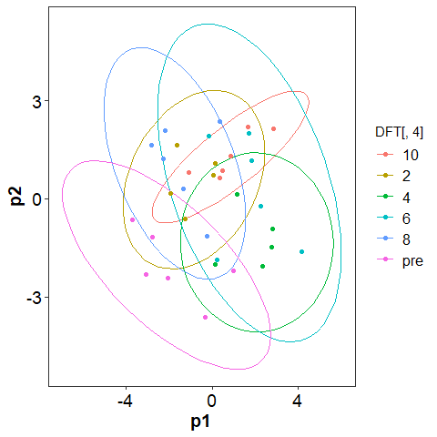
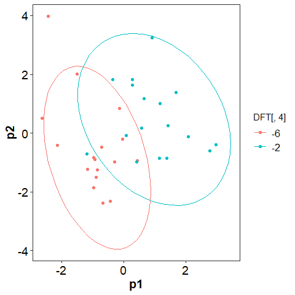
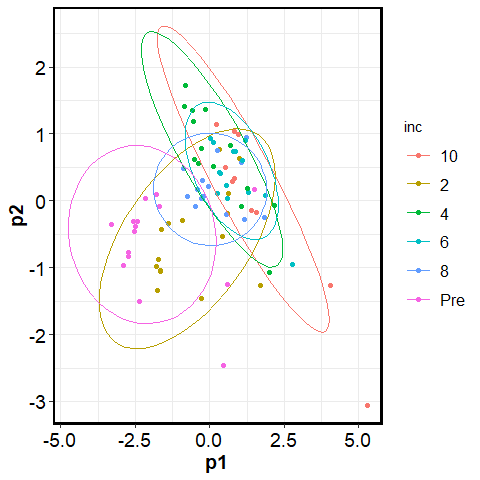
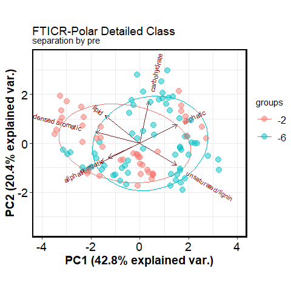
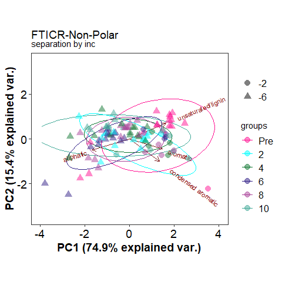
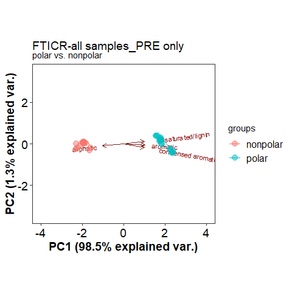
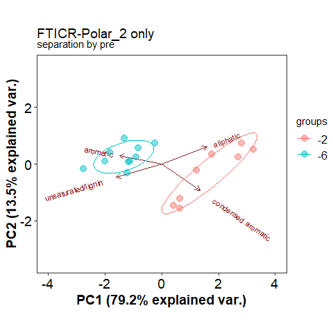
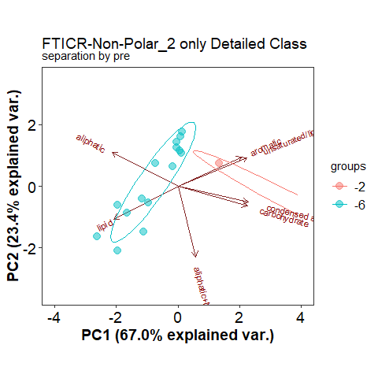

PCA filtered and detailed
================
2023-05-03

## Volcano

click to open

#### GC:

#### LC:

## PCA vs PLS GC

click to open

#### Pre:

#### INC:

## PCA vs PLS LC

click to open

#### Pre:

#### INC:

## PCA vs PLS Lipid

click to open

#### Pre:

#### INC:

## PCA vs PLS FTICR

click to open

#### -2:

#### -6:

## NOSC by polar and non polar

click to open

#### NOSC:

<!-- -->

## FTICR PCA Class vs Detailed class

click to open

#### PCA-Class vs Detailed Class:

## FTICR PCA seperated pre incubation temps

click to open

#### PCA -2:

#### PCA -6:

## FTICR PCA seperated incubation temp

### DO NOT OPEN

click to open

#### PCA-Pre:

#### PCA-2:

#### PCA-4:

#### PCA-6:

#### PCA-8:

#### PCA-10:

------------------------------------------------------------------------

## Session Info

Session Info

Date run: 2023-06-15

    ## R version 4.2.3 (2023-03-15 ucrt)
    ## Platform: x86_64-w64-mingw32/x64 (64-bit)
    ## Running under: Windows 10 x64 (build 19045)
    ## 
    ## Matrix products: default
    ## 
    ## locale:
    ## [1] LC_COLLATE=English_United States.utf8 
    ## [2] LC_CTYPE=English_United States.utf8   
    ## [3] LC_MONETARY=English_United States.utf8
    ## [4] LC_NUMERIC=C                          
    ## [5] LC_TIME=English_United States.utf8    
    ## 
    ## attached base packages:
    ## [1] grid      stats     graphics  grDevices utils     datasets  methods  
    ## [8] base     
    ## 
    ## other attached packages:
    ##  [1] trelliscopejs_0.2.6 pmartR_2.3.0        agricolae_1.3-5    
    ##  [4] knitr_1.42          nlme_3.1-162        cowplot_1.1.1      
    ##  [7] ggpubr_0.6.0        janitor_2.2.0       pracma_2.4.2       
    ## [10] reshape2_1.4.4      ggbiplot_0.55       scales_1.2.1.9000  
    ## [13] plyr_1.8.8          vegan_2.6-4         lattice_0.20-45    
    ## [16] permute_0.9-7       lubridate_1.9.2     forcats_1.0.0      
    ## [19] stringr_1.5.0       dplyr_1.1.1         purrr_1.0.1        
    ## [22] readr_2.1.4         tidyr_1.3.0         tibble_3.2.1       
    ## [25] ggplot2_3.4.1       tidyverse_2.0.0     tarchetypes_0.7.6  
    ## [28] targets_0.14.3     
    ## 
    ## loaded via a namespace (and not attached):
    ##   [1] backports_1.4.1             qqman_0.1.8                
    ##   [3] igraph_1.4.1                lazyeval_0.2.2             
    ##   [5] splines_4.2.3               AlgDesign_1.2.1            
    ##   [7] crosstalk_1.2.0             listenv_0.9.0              
    ##   [9] GenomeInfoDb_1.34.9         digest_0.6.31              
    ##  [11] foreach_1.5.2               htmltools_0.5.4            
    ##  [13] fansi_1.0.4                 magrittr_2.0.3             
    ##  [15] checkmate_2.2.0             base64url_1.4              
    ##  [17] cluster_2.1.4               limma_3.54.2               
    ##  [19] tzdb_0.3.0                  globals_0.16.2             
    ##  [21] matrixStats_0.63.0          timechange_0.2.0           
    ##  [23] prettyunits_1.1.1           colorspace_2.1-0           
    ##  [25] rrcov_1.7-2                 haven_2.5.2                
    ##  [27] xfun_0.38                   RCurl_1.98-1.12            
    ##  [29] callr_3.7.3                 crayon_1.5.2               
    ##  [31] jsonlite_1.8.4              iterators_1.0.14           
    ##  [33] glue_1.6.2                  gtable_0.3.3               
    ##  [35] zlibbioc_1.44.0             XVector_0.38.0             
    ##  [37] webshot_0.5.4               DelayedArray_0.24.0        
    ##  [39] questionr_0.7.8             car_3.1-2                  
    ##  [41] BiocGenerics_0.44.0         DEoptimR_1.0-13            
    ##  [43] abind_1.4-5                 mvtnorm_1.1-3              
    ##  [45] rstatix_0.7.2               miniUI_0.1.1.1             
    ##  [47] Rcpp_1.0.10                 MultiDataSet_1.26.0        
    ##  [49] viridisLite_0.4.2           xtable_1.8-4               
    ##  [51] progress_1.2.2              ropls_1.30.0               
    ##  [53] proxy_0.4-27                mclust_6.0.0               
    ##  [55] stats4_4.2.3                htmlwidgets_1.6.2          
    ##  [57] httr_1.4.6                  calibrate_1.7.7            
    ##  [59] ellipsis_0.3.2              farver_2.1.1               
    ##  [61] pkgconfig_2.0.3             utf8_1.2.3                 
    ##  [63] tidyselect_1.2.0            labeling_0.4.2             
    ##  [65] rlang_1.1.0                 later_1.3.0                
    ##  [67] munsell_0.5.0               tools_4.2.3                
    ##  [69] cli_3.6.0                   generics_0.1.3             
    ##  [71] broom_1.0.4                 evaluate_0.21              
    ##  [73] fastmap_1.1.1               yaml_2.3.7                 
    ##  [75] processx_3.8.0              fs_1.6.2                   
    ##  [77] robustbase_0.95-1           future.callr_0.8.1         
    ##  [79] future_1.32.0               mime_0.12                  
    ##  [81] compiler_4.2.3              rstudioapi_0.14            
    ##  [83] plotly_4.10.1               e1071_1.7-13               
    ##  [85] ggsignif_0.6.4              klaR_1.7-2                 
    ##  [87] pcaPP_2.0-3                 stringi_1.7.12             
    ##  [89] highr_0.10                  ps_1.7.2                   
    ##  [91] Matrix_1.5-4                vctrs_0.6.0                
    ##  [93] pillar_1.9.0                lifecycle_1.0.3            
    ##  [95] furrr_0.3.1                 combinat_0.0-8             
    ##  [97] bitops_1.0-7                data.table_1.14.8          
    ##  [99] GenomicRanges_1.50.2        httpuv_1.6.9               
    ## [101] R6_2.5.1                    promises_1.2.0.1           
    ## [103] IRanges_2.32.0              parallelly_1.35.0          
    ## [105] codetools_0.2-19            MASS_7.3-60                
    ## [107] SummarizedExperiment_1.28.0 withr_2.5.0                
    ## [109] GenomeInfoDbData_1.2.9      S4Vectors_0.36.2           
    ## [111] autocogs_0.1.4              MultiAssayExperiment_1.24.0
    ## [113] mgcv_1.8-42                 parallel_4.2.3             
    ## [115] hms_1.1.3                   labelled_2.11.0            
    ## [117] class_7.3-22                rmarkdown_2.21             
    ## [119] snakecase_0.11.0            MatrixGenerics_1.10.0      
    ## [121] carData_3.0-5               DistributionUtils_0.6-0    
    ## [123] Biobase_2.58.0              shiny_1.7.4                
    ## [125] base64enc_0.1-3

