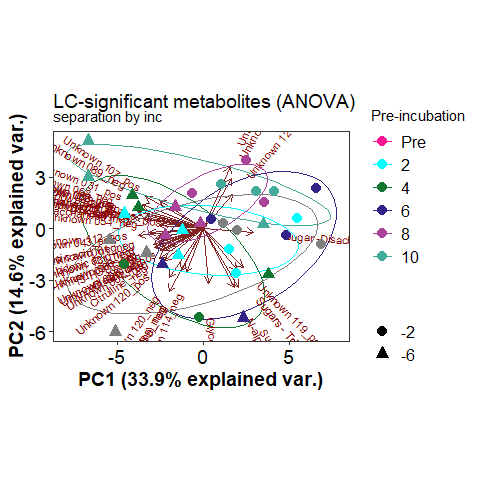
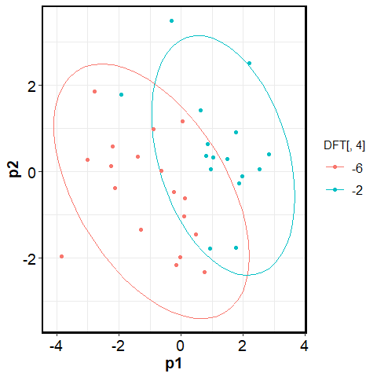
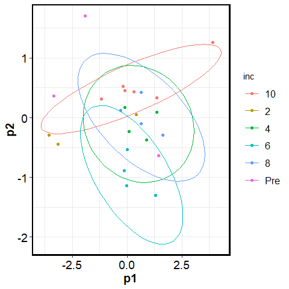

PCA filtered and detailed
================
2023-05-03

## NOSC by polar and non polar

click to open

#### NOSC:

<!-- -->

## FTICR PCA Class vs Detailed class

click to open

#### PCA-Class vs Detailed Class:

## FTICR PCA seperated pre incubation temps

click to open

#### PCA -2:

#### PCA -6:

## FTICR PCA seperated incubation temp

### DO NOT OPEN

click to open

#### PCA-Pre:

#### PCA-2:

#### PCA-4:

#### PCA-6:

#### PCA-8:

#### PCA-10:

------------------------------------------------------------------------

## Session Info

Session Info

Date run: 2023-06-13

    ## R version 4.2.3 (2023-03-15 ucrt)
    ## Platform: x86_64-w64-mingw32/x64 (64-bit)
    ## Running under: Windows 10 x64 (build 19045)
    ## 
    ## Matrix products: default
    ## 
    ## locale:
    ## [1] LC_COLLATE=English_United States.utf8 
    ## [2] LC_CTYPE=English_United States.utf8   
    ## [3] LC_MONETARY=English_United States.utf8
    ## [4] LC_NUMERIC=C                          
    ## [5] LC_TIME=English_United States.utf8    
    ## 
    ## attached base packages:
    ## [1] grid      stats     graphics  grDevices utils     datasets  methods  
    ## [8] base     
    ## 
    ## other attached packages:
    ##  [1] trelliscopejs_0.2.6 pmartR_2.3.0        agricolae_1.3-5    
    ##  [4] knitr_1.42          nlme_3.1-162        cowplot_1.1.1      
    ##  [7] ggpubr_0.6.0        janitor_2.2.0       pracma_2.4.2       
    ## [10] reshape2_1.4.4      ggbiplot_0.55       scales_1.2.1.9000  
    ## [13] plyr_1.8.8          vegan_2.6-4         lattice_0.20-45    
    ## [16] permute_0.9-7       lubridate_1.9.2     forcats_1.0.0      
    ## [19] stringr_1.5.0       dplyr_1.1.1         purrr_1.0.1        
    ## [22] readr_2.1.4         tidyr_1.3.0         tibble_3.2.1       
    ## [25] ggplot2_3.4.1       tidyverse_2.0.0     tarchetypes_0.7.6  
    ## [28] targets_0.14.3     
    ## 
    ## loaded via a namespace (and not attached):
    ##  [1] colorspace_2.1-0        ggsignif_0.6.4          ellipsis_0.3.2         
    ##  [4] mclust_6.0.0            snakecase_0.11.0        base64enc_0.1-3        
    ##  [7] fs_1.6.2                rstudioapi_0.14         farver_2.1.1           
    ## [10] listenv_0.9.0           furrr_0.3.1             fansi_1.0.4            
    ## [13] codetools_0.2-19        splines_4.2.3           jsonlite_1.8.4         
    ## [16] broom_1.0.4             cluster_2.1.4           shiny_1.7.4            
    ## [19] compiler_4.2.3          backports_1.4.1         Matrix_1.5-4           
    ## [22] fastmap_1.1.1           cli_3.6.0               later_1.3.0            
    ## [25] htmltools_0.5.4         prettyunits_1.1.1       tools_4.2.3            
    ## [28] igraph_1.4.1            gtable_0.3.3            glue_1.6.2             
    ## [31] Rcpp_1.0.10             carData_3.0-5           vctrs_0.6.0            
    ## [34] iterators_1.0.14        autocogs_0.1.4          xfun_0.38              
    ## [37] globals_0.16.2          ps_1.7.2                timechange_0.2.0       
    ## [40] mime_0.12               miniUI_0.1.1.1          lifecycle_1.0.3        
    ## [43] rstatix_0.7.2           future_1.32.0           MASS_7.3-60            
    ## [46] DistributionUtils_0.6-0 hms_1.1.3               promises_1.2.0.1       
    ## [49] parallel_4.2.3          yaml_2.3.7              labelled_2.11.0        
    ## [52] stringi_1.7.12          highr_0.10              klaR_1.7-2             
    ## [55] AlgDesign_1.2.1         foreach_1.5.2           checkmate_2.2.0        
    ## [58] rlang_1.1.0             pkgconfig_2.0.3         evaluate_0.21          
    ## [61] labeling_0.4.2          processx_3.8.0          tidyselect_1.2.0       
    ## [64] parallelly_1.35.0       magrittr_2.0.3          R6_2.5.1               
    ## [67] generics_0.1.3          base64url_1.4           combinat_0.0-8         
    ## [70] pillar_1.9.0            haven_2.5.2             withr_2.5.0            
    ## [73] mgcv_1.8-42             abind_1.4-5             crayon_1.5.2           
    ## [76] car_3.1-2               questionr_0.7.8         utf8_1.2.3             
    ## [79] rmarkdown_2.21          tzdb_0.3.0              future.callr_0.8.1     
    ## [82] progress_1.2.2          data.table_1.14.8       callr_3.7.3            
    ## [85] webshot_0.5.4           digest_0.6.31           xtable_1.8-4           
    ## [88] httpuv_1.6.9            munsell_0.5.0

