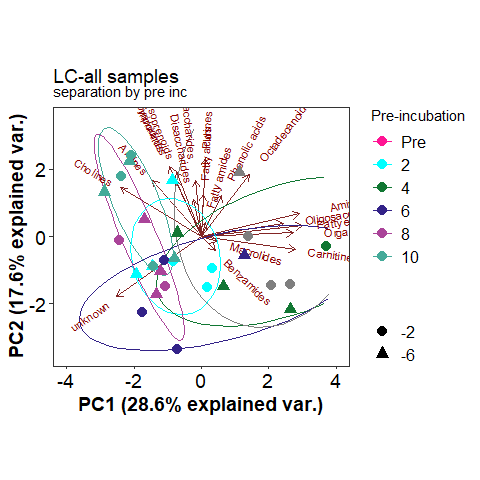
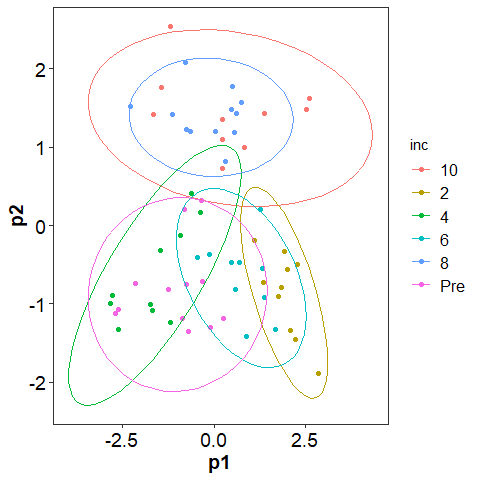
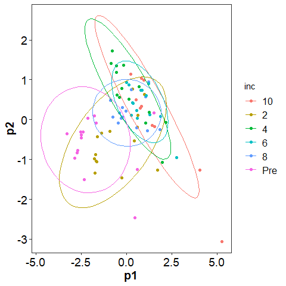
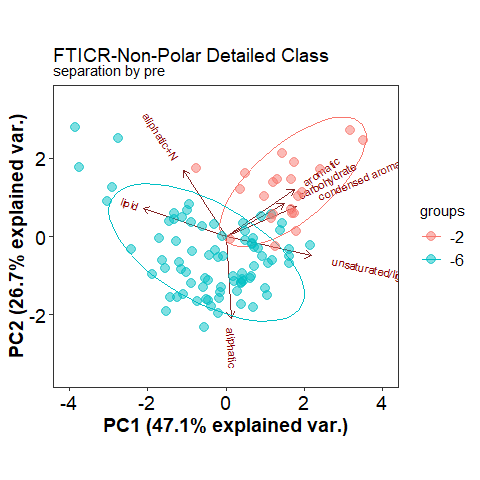
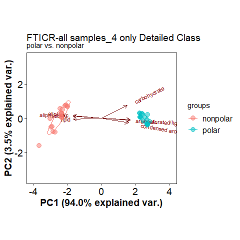
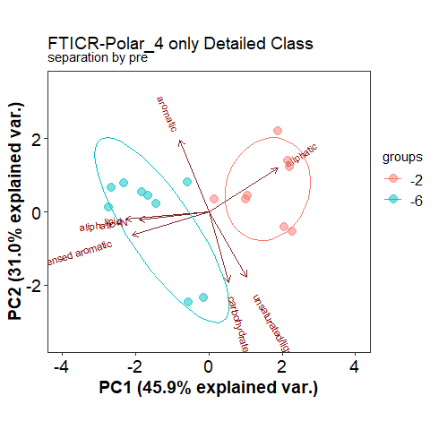
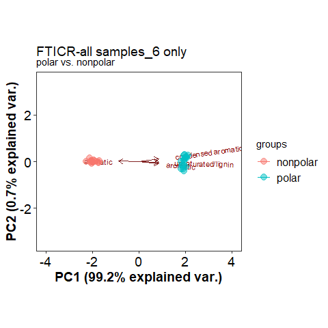
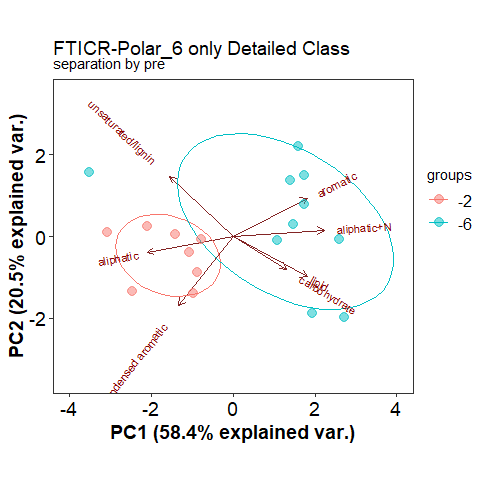
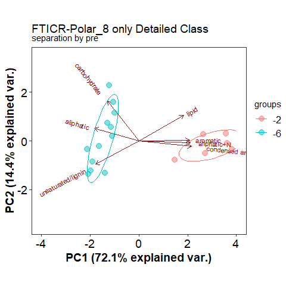

PCA filtered and detailed
================
2023-05-03

## Anova significant metabolites PCA

click to open

#### GC:

    ## NULL

#### LC:

|          |  Df |  SumOfSqs |        R2 |        F | Pr(\>F) |
|:---------|----:|----------:|----------:|---------:|--------:|
| pre      |   1 | 0.0025136 | 0.1534787 | 7.235920 |   0.001 |
| inc      |   5 | 0.0032903 | 0.2009044 | 1.894371 |   0.015 |
| pre:inc  |   5 | 0.0025839 | 0.1577713 | 1.487660 |   0.098 |
| Residual |  23 | 0.0079896 | 0.4878455 |       NA |      NA |
| Total    |  34 | 0.0163774 | 1.0000000 |       NA |      NA |

Permanova results significant compounds only

## Volcano

click to open

#### GC:

#### LC:

## PCA vs PLS GC

click to open

#### Pre:

#### INC:

## PCA vs PLS LC

click to open

#### Pre:

#### INC:

## PCA vs PLS Lipid

click to open

#### Pre:

#### INC:

## PCA vs PLS FTICR

click to open

#### -2:

#### -6:

## NOSC by polar and non polar

click to open

#### NOSC:

<!-- -->

## FTICR PCA Class vs Detailed class

click to open

#### PCA-Class vs Detailed Class:

## FTICR PCA seperated pre incubation temps

click to open

#### PCA -2:

#### PCA -6:

## FTICR PCA seperated incubation temp

### DO NOT OPEN

click to open

#### PCA-Pre:

#### PCA-2:

#### PCA-4:

#### PCA-6:

#### PCA-8:

#### PCA-10:

------------------------------------------------------------------------

## Session Info

Session Info

Date run: 2023-07-13

    ## R version 4.2.3 (2023-03-15 ucrt)
    ## Platform: x86_64-w64-mingw32/x64 (64-bit)
    ## Running under: Windows 10 x64 (build 19045)
    ## 
    ## Matrix products: default
    ## 
    ## locale:
    ## [1] LC_COLLATE=English_United States.utf8 
    ## [2] LC_CTYPE=English_United States.utf8   
    ## [3] LC_MONETARY=English_United States.utf8
    ## [4] LC_NUMERIC=C                          
    ## [5] LC_TIME=English_United States.utf8    
    ## 
    ## attached base packages:
    ## [1] grid      stats     graphics  grDevices utils     datasets  methods  
    ## [8] base     
    ## 
    ## other attached packages:
    ##  [1] ropls_1.30.0        trelliscopejs_0.2.6 pmartR_2.4.0       
    ##  [4] agricolae_1.3-6     knitr_1.43          nlme_3.1-162       
    ##  [7] cowplot_1.1.1       ggpubr_0.6.0        janitor_2.2.0      
    ## [10] pracma_2.4.2        reshape2_1.4.4      ggbiplot_0.55      
    ## [13] scales_1.2.1        plyr_1.8.8          vegan_2.6-4        
    ## [16] lattice_0.20-45     permute_0.9-7       lubridate_1.9.2    
    ## [19] forcats_1.0.0       stringr_1.5.0       dplyr_1.1.2        
    ## [22] purrr_1.0.1         readr_2.1.4         tidyr_1.3.0        
    ## [25] tibble_3.2.1        ggplot2_3.4.1       tidyverse_2.0.0    
    ## [28] tarchetypes_0.7.7   targets_1.2.0      
    ## 
    ## loaded via a namespace (and not attached):
    ##   [1] backports_1.4.1             qqman_0.1.8                
    ##   [3] igraph_1.5.0                lazyeval_0.2.2             
    ##   [5] splines_4.2.3               AlgDesign_1.2.1            
    ##   [7] listenv_0.9.0               GenomeInfoDb_1.34.9        
    ##   [9] digest_0.6.33               foreach_1.5.2              
    ##  [11] htmltools_0.5.5             fansi_1.0.4                
    ##  [13] magrittr_2.0.3              checkmate_2.2.0            
    ##  [15] base64url_1.4               cluster_2.1.4              
    ##  [17] tzdb_0.4.0                  limma_3.54.2               
    ##  [19] globals_0.16.2              matrixStats_1.0.0          
    ##  [21] timechange_0.2.0            prettyunits_1.1.1          
    ##  [23] colorspace_2.1-0            haven_2.5.3                
    ##  [25] xfun_0.39                   callr_3.7.3                
    ##  [27] crayon_1.5.2                RCurl_1.98-1.12            
    ##  [29] jsonlite_1.8.7              iterators_1.0.14           
    ##  [31] glue_1.6.2                  gtable_0.3.3               
    ##  [33] zlibbioc_1.44.0             XVector_0.38.0             
    ##  [35] webshot_0.5.5               DelayedArray_0.24.0        
    ##  [37] questionr_0.7.8             car_3.1-2                  
    ##  [39] BiocGenerics_0.44.0         abind_1.4-5                
    ##  [41] rstatix_0.7.2               miniUI_0.1.1.1             
    ##  [43] Rcpp_1.0.11                 MultiDataSet_1.26.0        
    ##  [45] viridisLite_0.4.2           xtable_1.8-4               
    ##  [47] progress_1.2.2              mclust_6.0.0               
    ##  [49] stats4_4.2.3                httr_1.4.6                 
    ##  [51] htmlwidgets_1.6.2           calibrate_1.7.7            
    ##  [53] ellipsis_0.3.2              farver_2.1.1               
    ##  [55] pkgconfig_2.0.3             utf8_1.2.3                 
    ##  [57] labeling_0.4.2              tidyselect_1.2.0           
    ##  [59] rlang_1.1.1                 later_1.3.1                
    ##  [61] munsell_0.5.0               tools_4.2.3                
    ##  [63] cli_3.6.1                   generics_0.1.3             
    ##  [65] broom_1.0.5                 evaluate_0.21              
    ##  [67] fastmap_1.1.1               yaml_2.3.7                 
    ##  [69] processx_3.8.2              fs_1.6.2                   
    ##  [71] future.callr_0.8.1          future_1.33.0              
    ##  [73] mime_0.12                   ggExtra_0.10.0             
    ##  [75] compiler_4.2.3              rstudioapi_0.15.0          
    ##  [77] plotly_4.10.2               ggsignif_0.6.4             
    ##  [79] klaR_1.7-2                  stringi_1.7.12             
    ##  [81] highr_0.10                  ps_1.7.5                   
    ##  [83] Matrix_1.6-0                vctrs_0.6.3                
    ##  [85] pillar_1.9.0                lifecycle_1.0.3            
    ##  [87] furrr_0.3.1                 combinat_0.0-8             
    ##  [89] data.table_1.14.8           bitops_1.0-7               
    ##  [91] httpuv_1.6.11               GenomicRanges_1.50.2       
    ##  [93] R6_2.5.1                    promises_1.2.0.1           
    ##  [95] IRanges_2.32.0              parallelly_1.36.0          
    ##  [97] codetools_0.2-19            MASS_7.3-58.2              
    ##  [99] SummarizedExperiment_1.28.0 withr_2.5.0                
    ## [101] S4Vectors_0.36.2            autocogs_0.1.4             
    ## [103] GenomeInfoDbData_1.2.9      mgcv_1.8-42                
    ## [105] parallel_4.2.3              hms_1.1.3                  
    ## [107] MultiAssayExperiment_1.24.0 labelled_2.12.0            
    ## [109] rmarkdown_2.23              snakecase_0.11.0           
    ## [111] MatrixGenerics_1.10.0       carData_3.0-5              
    ## [113] DistributionUtils_0.6-0     Biobase_2.58.0             
    ## [115] shiny_1.7.4.1               base64enc_0.1-3            
    ## [117] tinytex_0.45

