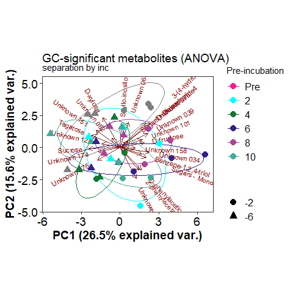
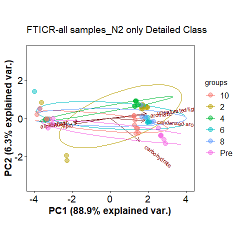
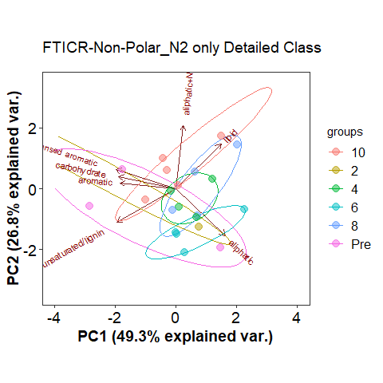
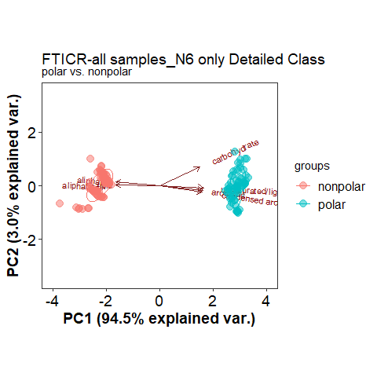
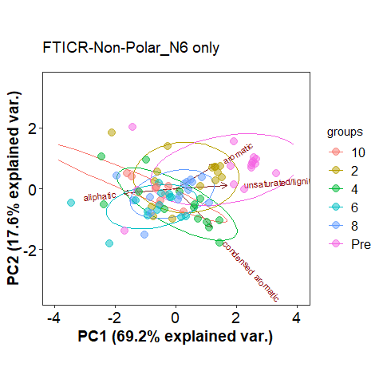
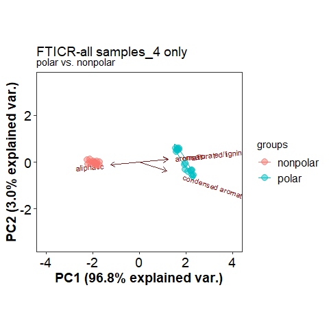
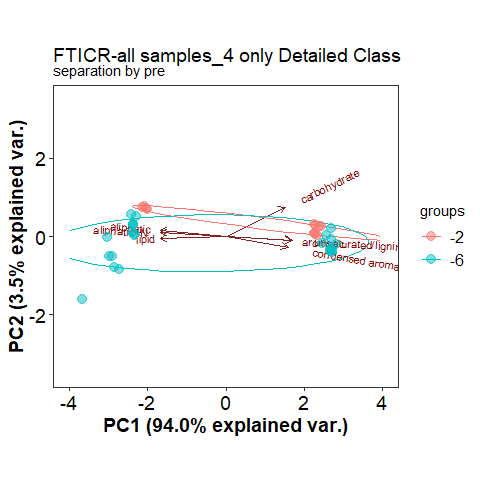
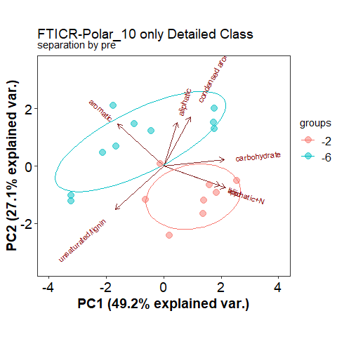

PCA filtered and detailed
================
2023-05-03

## Anova significant metabolites PCA

click to open

#### GC:

    ## NULL

#### LC:

|          |  Df |  SumOfSqs |        R2 |        F | Pr(\>F) |
|:---------|----:|----------:|----------:|---------:|--------:|
| pre      |   1 | 0.0025800 | 0.1596463 | 7.557022 |   0.001 |
| inc      |   5 | 0.0032469 | 0.2009156 | 1.902109 |   0.018 |
| pre:inc  |   5 | 0.0028229 | 0.1746759 | 1.653693 |   0.059 |
| Residual |  22 | 0.0075109 | 0.4647622 |       NA |      NA |
| Total    |  33 | 0.0161607 | 1.0000000 |       NA |      NA |

Permanova results significant compounds only

## Volcano

click to open

#### GC:

#### LC:

## PCA vs PLS GC

click to open

#### Pre:

#### INC:

## PCA vs PLS LC

click to open

#### Pre:

#### INC:

## PCA vs PLS Lipid

click to open

#### Pre:

#### INC:

## PCA vs PLS FTICR

click to open

#### -2:

#### -6:

## NOSC by polar and non polar

click to open

#### NOSC:

<!-- -->

## FTICR PCA Class vs Detailed class

click to open

#### PCA-Class vs Detailed Class:

## FTICR PCA seperated pre incubation temps

click to open

#### PCA -2:

#### PCA -6:

## FTICR PCA seperated incubation temp

### DO NOT OPEN

click to open

#### PCA-Pre:

#### PCA-2:

#### PCA-4:

#### PCA-6:

#### PCA-8:

#### PCA-10:

------------------------------------------------------------------------

## Session Info

Session Info

Date run: 2024-05-30

    ## R version 4.3.2 (2023-10-31 ucrt)
    ## Platform: x86_64-w64-mingw32/x64 (64-bit)
    ## Running under: Windows 11 x64 (build 22631)
    ## 
    ## Matrix products: default
    ## 
    ## 
    ## locale:
    ## [1] LC_COLLATE=English_United States.utf8 
    ## [2] LC_CTYPE=English_United States.utf8   
    ## [3] LC_MONETARY=English_United States.utf8
    ## [4] LC_NUMERIC=C                          
    ## [5] LC_TIME=English_United States.utf8    
    ## 
    ## time zone: America/Los_Angeles
    ## tzcode source: internal
    ## 
    ## attached base packages:
    ## [1] grid      stats     graphics  grDevices utils     datasets  methods  
    ## [8] base     
    ## 
    ## other attached packages:
    ##  [1] ropls_1.34.0        trelliscopejs_0.2.6 pmartR_2.4.1       
    ##  [4] agricolae_1.3-7     knitr_1.45          nlme_3.1-163       
    ##  [7] cowplot_1.1.1       ggpubr_0.6.0        janitor_2.2.0      
    ## [10] pracma_2.4.4        reshape2_1.4.4      ggbiplot_0.55      
    ## [13] scales_1.3.0        vegan_2.6-4         lattice_0.21-9     
    ## [16] permute_0.9-7       lubridate_1.9.3     forcats_1.0.0      
    ## [19] stringr_1.5.1       purrr_1.0.2         readr_2.1.4        
    ## [22] tidyr_1.3.0         tibble_3.2.1        ggplot2_3.4.4      
    ## [25] tidyverse_2.0.0     dplyr_1.1.4         plyr_1.8.9         
    ## [28] tarchetypes_0.7.9   targets_1.3.2      
    ## 
    ## loaded via a namespace (and not attached):
    ##   [1] rstudioapi_0.15.0           jsonlite_1.8.8             
    ##   [3] MultiAssayExperiment_1.28.0 magrittr_2.0.3             
    ##   [5] PNWColors_0.1.0             farver_2.1.1               
    ##   [7] rmarkdown_2.25              ragg_1.2.6                 
    ##   [9] fs_1.6.3                    zlibbioc_1.48.0            
    ##  [11] vctrs_0.6.4                 RCurl_1.98-1.14            
    ##  [13] MultiDataSet_1.30.0         base64enc_0.1-3            
    ##  [15] rstatix_0.7.2               webshot_0.5.5              
    ##  [17] polynom_1.4-1               htmltools_0.5.7            
    ##  [19] S4Arrays_1.2.0              progress_1.2.2             
    ##  [21] broom_1.0.5                 cellranger_1.1.0           
    ##  [23] SparseArray_1.2.3           htmlwidgets_1.6.4          
    ##  [25] plotly_4.10.3               rootSolve_1.8.2.4          
    ##  [27] qqman_0.1.9                 igraph_1.5.1               
    ##  [29] mime_0.12                   lifecycle_1.0.4            
    ##  [31] iterators_1.0.14            pkgconfig_2.0.3            
    ##  [33] Matrix_1.6-1.1              R6_2.5.1                   
    ##  [35] fastmap_1.1.1               shiny_1.8.0                
    ##  [37] GenomeInfoDbData_1.2.11     MatrixGenerics_1.14.0      
    ##  [39] snakecase_0.11.1            digest_0.6.33              
    ##  [41] Exact_3.2                   colorspace_2.1-0           
    ##  [43] S4Vectors_0.40.2            ps_1.7.5                   
    ##  [45] textshaping_0.3.7           GenomicRanges_1.54.1       
    ##  [47] base64url_1.4               labeling_0.4.3             
    ##  [49] fansi_1.0.5                 timechange_0.2.0           
    ##  [51] httr_1.4.7                  abind_1.4-5                
    ##  [53] mgcv_1.9-0                  compiler_4.3.2             
    ##  [55] proxy_0.4-27                withr_2.5.2                
    ##  [57] backports_1.4.1             carData_3.0-5              
    ##  [59] highr_0.10                  ggsignif_0.6.4             
    ##  [61] MASS_7.3-60                 DelayedArray_0.28.0        
    ##  [63] gld_2.6.6                   tools_4.3.2                
    ##  [65] httpuv_1.6.12               glue_1.6.2                 
    ##  [67] callr_3.7.3                 promises_1.2.1             
    ##  [69] checkmate_2.3.0             cluster_2.1.4              
    ##  [71] generics_0.1.3              gtable_0.3.4               
    ##  [73] tzdb_0.4.0                  class_7.3-22               
    ##  [75] data.table_1.14.8           lmom_3.0                   
    ##  [77] hms_1.1.3                   car_3.1-2                  
    ##  [79] utf8_1.2.4                  XVector_0.42.0             
    ##  [81] BiocGenerics_0.48.1         foreach_1.5.2              
    ##  [83] pillar_1.9.0                ggExtra_0.10.1             
    ##  [85] limma_3.58.1                later_1.3.1                
    ##  [87] splines_4.3.2               AlgDesign_1.2.1            
    ##  [89] tidyselect_1.2.0            miniUI_0.1.1.1             
    ##  [91] IRanges_2.36.0              SummarizedExperiment_1.32.0
    ##  [93] stats4_4.3.2                xfun_0.41                  
    ##  [95] expm_0.999-8                Biobase_2.62.0             
    ##  [97] statmod_1.5.0               matrixStats_1.2.0          
    ##  [99] stringi_1.8.2               lazyeval_0.2.2             
    ## [101] yaml_2.3.7                  boot_1.3-28.1              
    ## [103] evaluate_0.23               codetools_0.2-19           
    ## [105] DistributionUtils_0.6-1     cli_3.6.1                  
    ## [107] xtable_1.8-4                systemfonts_1.0.5          
    ## [109] DescTools_0.99.52           munsell_0.5.0              
    ## [111] processx_3.8.2              readxl_1.4.3               
    ## [113] Rcpp_1.0.11                 GenomeInfoDb_1.38.5        
    ## [115] parallel_4.3.2              ellipsis_0.3.2             
    ## [117] autocogs_0.1.4              prettyunits_1.2.0          
    ## [119] mclust_6.0.1                calibrate_1.7.7            
    ## [121] bitops_1.0-7                viridisLite_0.4.2          
    ## [123] mvtnorm_1.2-4               e1071_1.7-14               
    ## [125] crayon_1.5.2                rlang_1.1.2

