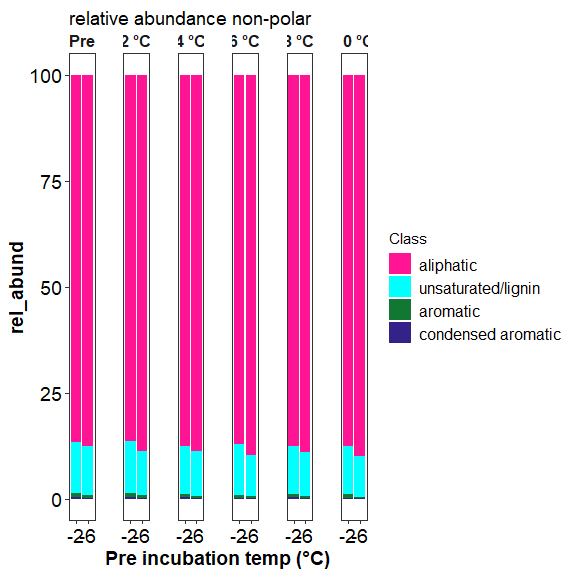

FTICR
================
2023-05-02

## FT-MS (FT-ICR)

click to open

### FTICR Van krevelen diagrams:

click to open

<!-- -->

<!-- --><!-- --><!-- -->

### FTICR Common vs unique peaks by treatment:

click to open

click to open

<!-- --><!-- -->

| Class              |  -2 |  -6 |
|:-------------------|----:|----:|
| aliphatic          | 439 | 202 |
| aromatic           |  24 |  31 |
| condensed aromatic |  16 |  11 |
| unsaturated/lignin |  87 | 137 |

<!-- -->

| Class              | Pre |   2 |   4 |   6 |   8 |  10 |
|:-------------------|----:|----:|----:|----:|----:|----:|
| aliphatic          |  47 |  53 |  16 |   9 |  14 |   9 |
| aromatic           |  12 |   2 |   2 |   1 |   2 |  NA |
| condensed aromatic |   2 |   4 |  NA |  NA |   4 |  NA |
| unsaturated/lignin |  31 |  10 |   7 |   3 |   7 |   1 |

<!-- -->

    ## NULL

| Class              | -2_Pre | -6_Pre | -2_2 | -6_2 | -2_4 | -6_4 | -2_6 | -6_6 | -2_8 | -6_8 | -2_10 | -6_10 |
|:-------------------|-------:|-------:|-----:|-----:|-----:|-----:|-----:|-----:|-----:|-----:|------:|------:|
| aliphatic          |     34 |      7 |   51 |    2 |   16 |   NA |    9 |   NA |   13 |    1 |     9 |    NA |
| aromatic           |      9 |      3 |    2 |   NA |    1 |    1 |   NA |    1 |    2 |   NA |    NA |    NA |
| condensed aromatic |      2 |     NA |    4 |   NA |   NA |   NA |   NA |   NA |    4 |   NA |    NA |    NA |
| unsaturated/lignin |     20 |      5 |    9 |    1 |    6 |    1 |    2 |    1 |    6 |    1 |    NA |     1 |

click to open

<!-- --><!-- -->

| Class              |  -2 |  -6 |
|:-------------------|----:|----:|
| aliphatic          | 145 | 123 |
| aromatic           |  13 |  30 |
| condensed aromatic |   8 |   9 |
| unsaturated/lignin |  72 | 112 |

<!-- -->

| Class              | Pre |   2 |   4 |   6 |   8 |  10 |
|:-------------------|----:|----:|----:|----:|----:|----:|
| aliphatic          |  26 |   6 |   6 |   3 |  10 |   1 |
| aromatic           |  10 |  NA |   1 |   1 |   2 |  NA |
| condensed aromatic |   1 |  NA |  NA |  NA |   4 |  NA |
| unsaturated/lignin |  27 |   2 |   7 |   3 |   6 |   1 |

<!-- -->

    ## NULL

| Class              | -2_Pre | -6_Pre | -2_2 | -6_2 | -2_4 | -6_4 | -2_6 | -6_6 | -2_8 | -6_8 | -6_10 |
|:-------------------|-------:|-------:|-----:|-----:|-----:|-----:|-----:|-----:|-----:|-----:|------:|
| aliphatic          |     13 |     10 |    3 |    3 |    6 |   NA |    2 |    1 |    9 |    1 |     1 |
| aromatic           |      7 |      3 |   NA |   NA |   NA |    1 |   NA |    1 |    2 |   NA |    NA |
| condensed aromatic |      1 |     NA |   NA |   NA |   NA |   NA |   NA |   NA |    4 |   NA |    NA |
| unsaturated/lignin |     15 |      6 |    1 |    1 |    7 |   NA |    2 |    1 |    5 |    1 |     1 |

click to open

<!-- --><!-- -->
<table>
<thead>
<tr>
<th style="text-align:left;">
Class
</th>
<th style="text-align:right;">
-2
</th>
<th style="text-align:right;">
-6
</th>
</tr>
</thead>
<tbody>
<tr>
<td style="text-align:left;">
aliphatic
</td>
<td style="text-align:right;">
405
</td>
<td style="text-align:right;">
196
</td>
</tr>
<tr>
<td style="text-align:left;">
aromatic
</td>
<td style="text-align:right;">
21
</td>
<td style="text-align:right;">
3
</td>
</tr>
<tr>
<td style="text-align:left;">
condensed aromatic
</td>
<td style="text-align:right;">
16
</td>
<td style="text-align:right;">
3
</td>
</tr>
<tr>
<td style="text-align:left;">
unsaturated/lignin
</td>
<td style="text-align:right;">
76
</td>
<td style="text-align:right;">
59
</td>
</tr>
</tbody>
</table>
<!-- -->
<table>
<thead>
<tr>
<th style="text-align:left;">
Class
</th>
<th style="text-align:right;">
Pre
</th>
<th style="text-align:right;">
2
</th>
<th style="text-align:right;">
4
</th>
<th style="text-align:right;">
6
</th>
<th style="text-align:right;">
8
</th>
<th style="text-align:right;">
10
</th>
</tr>
</thead>
<tbody>
<tr>
<td style="text-align:left;">
aliphatic
</td>
<td style="text-align:right;">
27
</td>
<td style="text-align:right;">
57
</td>
<td style="text-align:right;">
14
</td>
<td style="text-align:right;">
9
</td>
<td style="text-align:right;">
12
</td>
<td style="text-align:right;">
9
</td>
</tr>
<tr>
<td style="text-align:left;">
aromatic
</td>
<td style="text-align:right;">
7
</td>
<td style="text-align:right;">
3
</td>
<td style="text-align:right;">
1
</td>
<td style="text-align:right;">
NA
</td>
<td style="text-align:right;">
1
</td>
<td style="text-align:right;">
NA
</td>
</tr>
<tr>
<td style="text-align:left;">
condensed aromatic
</td>
<td style="text-align:right;">
3
</td>
<td style="text-align:right;">
6
</td>
<td style="text-align:right;">
NA
</td>
<td style="text-align:right;">
NA
</td>
<td style="text-align:right;">
NA
</td>
<td style="text-align:right;">
NA
</td>
</tr>
<tr>
<td style="text-align:left;">
unsaturated/lignin
</td>
<td style="text-align:right;">
14
</td>
<td style="text-align:right;">
19
</td>
<td style="text-align:right;">
3
</td>
<td style="text-align:right;">
1
</td>
<td style="text-align:right;">
2
</td>
<td style="text-align:right;">
2
</td>
</tr>
</tbody>
</table>

<!-- -->

    ## NULL

<table>
<thead>
<tr>
<th style="text-align:left;">
Class
</th>
<th style="text-align:right;">
-2_Pre
</th>
<th style="text-align:right;">
-6_Pre
</th>
<th style="text-align:right;">
-2_2
</th>
<th style="text-align:right;">
-6_2
</th>
<th style="text-align:right;">
-2_4
</th>
<th style="text-align:right;">
-6_4
</th>
<th style="text-align:right;">
-2_6
</th>
<th style="text-align:right;">
-2_8
</th>
<th style="text-align:right;">
-2_10
</th>
</tr>
</thead>
<tbody>
<tr>
<td style="text-align:left;">
aliphatic
</td>
<td style="text-align:right;">
23
</td>
<td style="text-align:right;">
1
</td>
<td style="text-align:right;">
56
</td>
<td style="text-align:right;">
1
</td>
<td style="text-align:right;">
14
</td>
<td style="text-align:right;">
NA
</td>
<td style="text-align:right;">
9
</td>
<td style="text-align:right;">
12
</td>
<td style="text-align:right;">
9
</td>
</tr>
<tr>
<td style="text-align:left;">
aromatic
</td>
<td style="text-align:right;">
6
</td>
<td style="text-align:right;">
1
</td>
<td style="text-align:right;">
3
</td>
<td style="text-align:right;">
NA
</td>
<td style="text-align:right;">
1
</td>
<td style="text-align:right;">
NA
</td>
<td style="text-align:right;">
NA
</td>
<td style="text-align:right;">
1
</td>
<td style="text-align:right;">
NA
</td>
</tr>
<tr>
<td style="text-align:left;">
condensed aromatic
</td>
<td style="text-align:right;">
3
</td>
<td style="text-align:right;">
NA
</td>
<td style="text-align:right;">
6
</td>
<td style="text-align:right;">
NA
</td>
<td style="text-align:right;">
NA
</td>
<td style="text-align:right;">
NA
</td>
<td style="text-align:right;">
NA
</td>
<td style="text-align:right;">
NA
</td>
<td style="text-align:right;">
NA
</td>
</tr>
<tr>
<td style="text-align:left;">
unsaturated/lignin
</td>
<td style="text-align:right;">
9
</td>
<td style="text-align:right;">
2
</td>
<td style="text-align:right;">
19
</td>
<td style="text-align:right;">
NA
</td>
<td style="text-align:right;">
1
</td>
<td style="text-align:right;">
2
</td>
<td style="text-align:right;">
1
</td>
<td style="text-align:right;">
2
</td>
<td style="text-align:right;">
2
</td>
</tr>
</tbody>
</table>

### FTICR Permanova results and PCAs:

#### relative abundance

click to open

<!-- --><!-- --><!-- -->

#### PCA results:

click to open

<!-- --><!-- --><!-- -->
<table>
<caption>
Permanova results: axis class all
</caption>
<thead>
<tr>
<th style="text-align:left;">
</th>
<th style="text-align:right;">
Df
</th>
<th style="text-align:right;">
SumOfSqs
</th>
<th style="text-align:right;">
R2
</th>
<th style="text-align:right;">
F
</th>
<th style="text-align:right;">
Pr(\>F)
</th>
</tr>
</thead>
<tbody>
<tr>
<td style="text-align:left;">
pre
</td>
<td style="text-align:right;">
1
</td>
<td style="text-align:right;">
0.2991305
</td>
<td style="text-align:right;">
0.0437799
</td>
<td style="text-align:right;">
9.3601645
</td>
<td style="text-align:right;">
0.002
</td>
</tr>
<tr>
<td style="text-align:left;">
inc
</td>
<td style="text-align:right;">
5
</td>
<td style="text-align:right;">
0.0098561
</td>
<td style="text-align:right;">
0.0014425
</td>
<td style="text-align:right;">
0.0616820
</td>
<td style="text-align:right;">
0.995
</td>
</tr>
<tr>
<td style="text-align:left;">
pre:inc
</td>
<td style="text-align:right;">
5
</td>
<td style="text-align:right;">
0.0361773
</td>
<td style="text-align:right;">
0.0052948
</td>
<td style="text-align:right;">
0.2264067
</td>
<td style="text-align:right;">
0.952
</td>
</tr>
<tr>
<td style="text-align:left;">
Residual
</td>
<td style="text-align:right;">
203
</td>
<td style="text-align:right;">
6.4874389
</td>
<td style="text-align:right;">
0.9494828
</td>
<td style="text-align:right;">
NA
</td>
<td style="text-align:right;">
NA
</td>
</tr>
<tr>
<td style="text-align:left;">
Total
</td>
<td style="text-align:right;">
214
</td>
<td style="text-align:right;">
6.8326028
</td>
<td style="text-align:right;">
1.0000000
</td>
<td style="text-align:right;">
NA
</td>
<td style="text-align:right;">
NA
</td>
</tr>
</tbody>
</table>
<!-- --><!-- -->
<table>
<caption>
Permanova results: Axis class Polar only
</caption>
<thead>
<tr>
<th style="text-align:left;">
</th>
<th style="text-align:right;">
Df
</th>
<th style="text-align:right;">
SumOfSqs
</th>
<th style="text-align:right;">
R2
</th>
<th style="text-align:right;">
F
</th>
<th style="text-align:right;">
Pr(\>F)
</th>
</tr>
</thead>
<tbody>
<tr>
<td style="text-align:left;">
pre
</td>
<td style="text-align:right;">
1
</td>
<td style="text-align:right;">
0.0004596
</td>
<td style="text-align:right;">
0.0321579
</td>
<td style="text-align:right;">
10.58298
</td>
<td style="text-align:right;">
0.001
</td>
</tr>
<tr>
<td style="text-align:left;">
inc
</td>
<td style="text-align:right;">
5
</td>
<td style="text-align:right;">
0.0066832
</td>
<td style="text-align:right;">
0.4676090
</td>
<td style="text-align:right;">
30.77754
</td>
<td style="text-align:right;">
0.001
</td>
</tr>
<tr>
<td style="text-align:left;">
pre:inc
</td>
<td style="text-align:right;">
5
</td>
<td style="text-align:right;">
0.0029803
</td>
<td style="text-align:right;">
0.2085238
</td>
<td style="text-align:right;">
13.72482
</td>
<td style="text-align:right;">
0.001
</td>
</tr>
<tr>
<td style="text-align:left;">
Residual
</td>
<td style="text-align:right;">
96
</td>
<td style="text-align:right;">
0.0041692
</td>
<td style="text-align:right;">
0.2917093
</td>
<td style="text-align:right;">
NA
</td>
<td style="text-align:right;">
NA
</td>
</tr>
<tr>
<td style="text-align:left;">
Total
</td>
<td style="text-align:right;">
107
</td>
<td style="text-align:right;">
0.0142922
</td>
<td style="text-align:right;">
1.0000000
</td>
<td style="text-align:right;">
NA
</td>
<td style="text-align:right;">
NA
</td>
</tr>
</tbody>
</table>
<!-- --><!-- -->
<table>
<caption>
Permanova results: Axis class Non-Polar only
</caption>
<thead>
<tr>
<th style="text-align:left;">
</th>
<th style="text-align:right;">
Df
</th>
<th style="text-align:right;">
SumOfSqs
</th>
<th style="text-align:right;">
R2
</th>
<th style="text-align:right;">
F
</th>
<th style="text-align:right;">
Pr(\>F)
</th>
</tr>
</thead>
<tbody>
<tr>
<td style="text-align:left;">
pre
</td>
<td style="text-align:right;">
1
</td>
<td style="text-align:right;">
0.0050061
</td>
<td style="text-align:right;">
0.1717359
</td>
<td style="text-align:right;">
26.4653827
</td>
<td style="text-align:right;">
0.001
</td>
</tr>
<tr>
<td style="text-align:left;">
inc
</td>
<td style="text-align:right;">
5
</td>
<td style="text-align:right;">
0.0052433
</td>
<td style="text-align:right;">
0.1798715
</td>
<td style="text-align:right;">
5.5438239
</td>
<td style="text-align:right;">
0.001
</td>
</tr>
<tr>
<td style="text-align:left;">
pre:inc
</td>
<td style="text-align:right;">
5
</td>
<td style="text-align:right;">
0.0009308
</td>
<td style="text-align:right;">
0.0319305
</td>
<td style="text-align:right;">
0.9841303
</td>
<td style="text-align:right;">
0.429
</td>
</tr>
<tr>
<td style="text-align:left;">
Residual
</td>
<td style="text-align:right;">
95
</td>
<td style="text-align:right;">
0.0179699
</td>
<td style="text-align:right;">
0.6164622
</td>
<td style="text-align:right;">
NA
</td>
<td style="text-align:right;">
NA
</td>
</tr>
<tr>
<td style="text-align:left;">
Total
</td>
<td style="text-align:right;">
106
</td>
<td style="text-align:right;">
0.0291500
</td>
<td style="text-align:right;">
1.0000000
</td>
<td style="text-align:right;">
NA
</td>
<td style="text-align:right;">
NA
</td>
</tr>
</tbody>
</table>

## Session Info

Session Info

Date run: 2023-05-31

    ## R version 4.2.3 (2023-03-15 ucrt)
    ## Platform: x86_64-w64-mingw32/x64 (64-bit)
    ## Running under: Windows 10 x64 (build 19045)
    ## 
    ## Matrix products: default
    ## 
    ## locale:
    ## [1] LC_COLLATE=English_United States.utf8 
    ## [2] LC_CTYPE=English_United States.utf8   
    ## [3] LC_MONETARY=English_United States.utf8
    ## [4] LC_NUMERIC=C                          
    ## [5] LC_TIME=English_United States.utf8    
    ## 
    ## attached base packages:
    ## [1] grid      stats     graphics  grDevices utils     datasets  methods  
    ## [8] base     
    ## 
    ## other attached packages:
    ##  [1] trelliscopejs_0.2.6 pmartR_2.3.0        agricolae_1.3-5    
    ##  [4] knitr_1.42          nlme_3.1-162        cowplot_1.1.1      
    ##  [7] ggpubr_0.6.0        janitor_2.2.0       pracma_2.4.2       
    ## [10] reshape2_1.4.4      ggbiplot_0.55       scales_1.2.1.9000  
    ## [13] plyr_1.8.8          vegan_2.6-4         lattice_0.20-45    
    ## [16] permute_0.9-7       lubridate_1.9.2     forcats_1.0.0      
    ## [19] stringr_1.5.0       dplyr_1.1.1         purrr_1.0.1        
    ## [22] readr_2.1.4         tidyr_1.3.0         tibble_3.2.1       
    ## [25] ggplot2_3.4.1       tidyverse_2.0.0     tarchetypes_0.7.6  
    ## [28] targets_0.14.3     
    ## 
    ## loaded via a namespace (and not attached):
    ##  [1] colorspace_2.1-0        ggsignif_0.6.4          ellipsis_0.3.2         
    ##  [4] mclust_6.0.0            snakecase_0.11.0        base64enc_0.1-3        
    ##  [7] fs_1.6.2                rstudioapi_0.14         farver_2.1.1           
    ## [10] listenv_0.9.0           furrr_0.3.1             fansi_1.0.4            
    ## [13] codetools_0.2-19        splines_4.2.3           jsonlite_1.8.4         
    ## [16] broom_1.0.4             cluster_2.1.4           shiny_1.7.4            
    ## [19] compiler_4.2.3          backports_1.4.1         Matrix_1.5-4           
    ## [22] fastmap_1.1.1           cli_3.6.0               later_1.3.0            
    ## [25] htmltools_0.5.4         prettyunits_1.1.1       tools_4.2.3            
    ## [28] igraph_1.4.1            gtable_0.3.3            glue_1.6.2             
    ## [31] Rcpp_1.0.10             carData_3.0-5           vctrs_0.6.0            
    ## [34] iterators_1.0.14        autocogs_0.1.4          xfun_0.38              
    ## [37] globals_0.16.2          ps_1.7.2                timechange_0.2.0       
    ## [40] mime_0.12               miniUI_0.1.1.1          lifecycle_1.0.3        
    ## [43] rstatix_0.7.2           future_1.32.0           MASS_7.3-60            
    ## [46] DistributionUtils_0.6-0 hms_1.1.3               promises_1.2.0.1       
    ## [49] parallel_4.2.3          yaml_2.3.7              labelled_2.11.0        
    ## [52] ggExtra_0.10.0          stringi_1.7.12          highr_0.10             
    ## [55] klaR_1.7-2              AlgDesign_1.2.1         foreach_1.5.2          
    ## [58] checkmate_2.2.0         rlang_1.1.0             pkgconfig_2.0.3        
    ## [61] evaluate_0.21           labeling_0.4.2          processx_3.8.0         
    ## [64] tidyselect_1.2.0        parallelly_1.35.0       magrittr_2.0.3         
    ## [67] R6_2.5.1                generics_0.1.3          base64url_1.4          
    ## [70] combinat_0.0-8          pillar_1.9.0            haven_2.5.2            
    ## [73] withr_2.5.0             mgcv_1.8-42             abind_1.4-5            
    ## [76] crayon_1.5.2            car_3.1-2               questionr_0.7.8        
    ## [79] utf8_1.2.3              rmarkdown_2.21          tzdb_0.3.0             
    ## [82] future.callr_0.8.1      progress_1.2.2          data.table_1.14.8      
    ## [85] callr_3.7.3             webshot_0.5.4           digest_0.6.31          
    ## [88] xtable_1.8-4            httpuv_1.6.9            munsell_0.5.0

