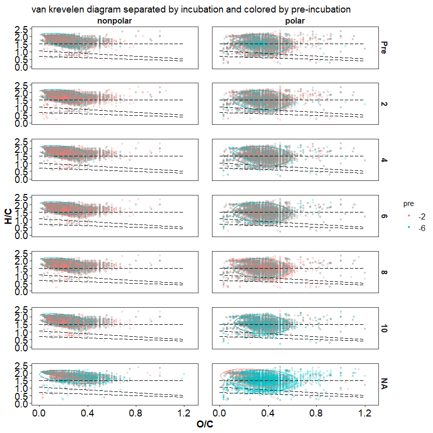
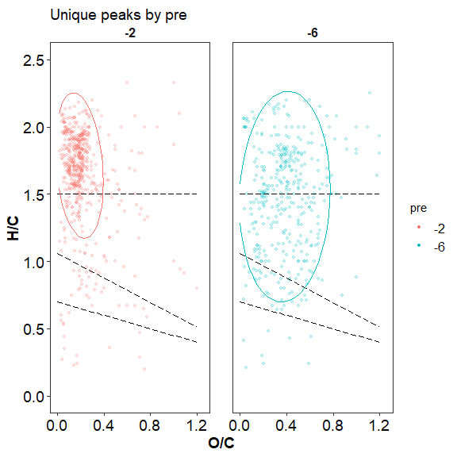
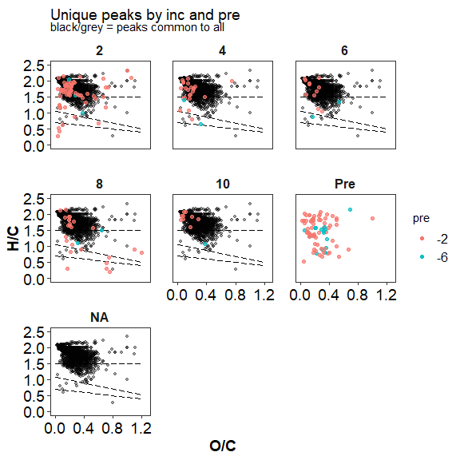
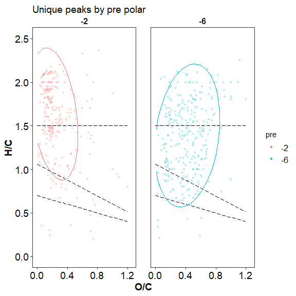
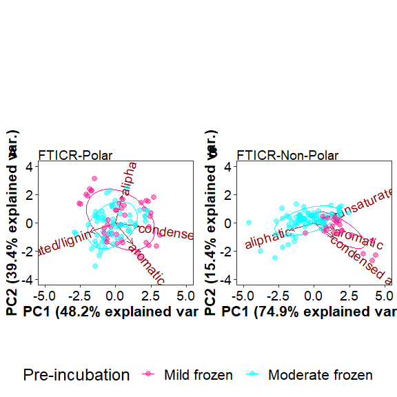

FTICR
================
2023-05-02

## FT-MS (FT-ICR)

click to open

### FTICR Van krevelen diagrams:

click to open

<!-- -->

<!-- --><!-- --><!-- -->

### FTICR Common vs unique peaks by treatment:

click to open

click to open

<!-- --><!-- -->

| Class              |  -2 |  -6 |
|:-------------------|----:|----:|
| aliphatic          | 439 | 202 |
| aromatic           |  24 |  31 |
| condensed aromatic |  16 |  11 |
| unsaturated/lignin |  87 | 137 |

<!-- -->

| Class              | Pre |   2 |   4 |   6 |   8 |  10 |
|:-------------------|----:|----:|----:|----:|----:|----:|
| aliphatic          |  47 |  53 |  16 |   9 |  14 |   9 |
| aromatic           |  12 |   2 |   2 |   1 |   2 |  NA |
| condensed aromatic |   2 |   4 |  NA |  NA |   4 |  NA |
| unsaturated/lignin |  31 |  10 |   7 |   3 |   7 |   1 |

<!-- -->

    ## NULL

| Class              | -2_Pre | -6_Pre | -2_2 | -6_2 | -2_4 | -6_4 | -2_6 | -6_6 | -2_8 | -6_8 | -2_10 | -6_10 |
|:-------------------|-------:|-------:|-----:|-----:|-----:|-----:|-----:|-----:|-----:|-----:|------:|------:|
| aliphatic          |     34 |      7 |   51 |    2 |   16 |   NA |    9 |   NA |   13 |    1 |     9 |    NA |
| aromatic           |      9 |      3 |    2 |   NA |    1 |    1 |   NA |    1 |    2 |   NA |    NA |    NA |
| condensed aromatic |      2 |     NA |    4 |   NA |   NA |   NA |   NA |   NA |    4 |   NA |    NA |    NA |
| unsaturated/lignin |     20 |      5 |    9 |    1 |    6 |    1 |    2 |    1 |    6 |    1 |    NA |     1 |

click to open

<!-- --><!-- -->

| Class              |  -2 |  -6 |
|:-------------------|----:|----:|
| aliphatic          | 145 | 123 |
| aromatic           |  13 |  30 |
| condensed aromatic |   8 |   9 |
| unsaturated/lignin |  72 | 112 |

<!-- -->

| Class              | Pre |   2 |   4 |   6 |   8 |  10 |
|:-------------------|----:|----:|----:|----:|----:|----:|
| aliphatic          |  26 |   6 |   6 |   3 |  10 |   1 |
| aromatic           |  10 |  NA |   1 |   1 |   2 |  NA |
| condensed aromatic |   1 |  NA |  NA |  NA |   4 |  NA |
| unsaturated/lignin |  27 |   2 |   7 |   3 |   6 |   1 |

<!-- -->

    ## NULL

| Class              | -2_Pre | -6_Pre | -2_2 | -6_2 | -2_4 | -6_4 | -2_6 | -6_6 | -2_8 | -6_8 | -6_10 |
|:-------------------|-------:|-------:|-----:|-----:|-----:|-----:|-----:|-----:|-----:|-----:|------:|
| aliphatic          |     13 |     10 |    3 |    3 |    6 |   NA |    2 |    1 |    9 |    1 |     1 |
| aromatic           |      7 |      3 |   NA |   NA |   NA |    1 |   NA |    1 |    2 |   NA |    NA |
| condensed aromatic |      1 |     NA |   NA |   NA |   NA |   NA |   NA |   NA |    4 |   NA |    NA |
| unsaturated/lignin |     15 |      6 |    1 |    1 |    7 |   NA |    2 |    1 |    5 |    1 |     1 |

click to open

<!-- --><!-- -->

| Class              |  -2 |  -6 |
|:-------------------|----:|----:|
| aliphatic          | 405 | 196 |
| aromatic           |  21 |   3 |
| condensed aromatic |  16 |   3 |
| unsaturated/lignin |  76 |  59 |

<!-- -->

| Class              | Pre |   2 |   4 |   6 |   8 |  10 |
|:-------------------|----:|----:|----:|----:|----:|----:|
| aliphatic          |  27 |  57 |  14 |   9 |  12 |   9 |
| aromatic           |   7 |   3 |   1 |  NA |   1 |  NA |
| condensed aromatic |   3 |   6 |  NA |  NA |  NA |  NA |
| unsaturated/lignin |  14 |  19 |   3 |   1 |   2 |   2 |

<!-- -->

    ## NULL

| Class              | -2_Pre | -6_Pre | -2_2 | -6_2 | -2_4 | -6_4 | -2_6 | -2_8 | -2_10 |
|:-------------------|-------:|-------:|-----:|-----:|-----:|-----:|-----:|-----:|------:|
| aliphatic          |     23 |      1 |   56 |    1 |   14 |   NA |    9 |   12 |     9 |
| aromatic           |      6 |      1 |    3 |   NA |    1 |   NA |   NA |    1 |    NA |
| condensed aromatic |      3 |     NA |    6 |   NA |   NA |   NA |   NA |   NA |    NA |
| unsaturated/lignin |      9 |      2 |   19 |   NA |    1 |    2 |    1 |    2 |     2 |

### FTICR Permanova results and PCAs:

#### relative abundance

click to open

<!-- --><!-- --><!-- -->

#### PCA results:

click to open

<!-- --><!-- --><!-- -->

|          |  Df |  SumOfSqs |        R2 |         F | Pr(\>F) |
|:---------|----:|----------:|----------:|----------:|--------:|
| pre      |   1 | 0.2991305 | 0.0437799 | 9.3601645 |   0.002 |
| inc      |   5 | 0.0098561 | 0.0014425 | 0.0616820 |   0.995 |
| pre:inc  |   5 | 0.0361773 | 0.0052948 | 0.2264067 |   0.952 |
| Residual | 203 | 6.4874389 | 0.9494828 |        NA |      NA |
| Total    | 214 | 6.8326028 | 1.0000000 |        NA |      NA |

Permanova results: axis class all

<!-- --><!-- -->

|          |  Df |  SumOfSqs |        R2 |        F | Pr(\>F) |
|:---------|----:|----------:|----------:|---------:|--------:|
| pre      |   1 | 0.0004596 | 0.0321579 | 10.58298 |   0.001 |
| inc      |   5 | 0.0066832 | 0.4676090 | 30.77754 |   0.001 |
| pre:inc  |   5 | 0.0029803 | 0.2085238 | 13.72482 |   0.001 |
| Residual |  96 | 0.0041692 | 0.2917093 |       NA |      NA |
| Total    | 107 | 0.0142922 | 1.0000000 |       NA |      NA |

Permanova results: Axis class Polar only

<!-- --><!-- -->

|          |  Df |  SumOfSqs |        R2 |          F | Pr(\>F) |
|:---------|----:|----------:|----------:|-----------:|--------:|
| pre      |   1 | 0.0050061 | 0.1717359 | 26.4653827 |   0.001 |
| inc      |   5 | 0.0052433 | 0.1798715 |  5.5438239 |   0.001 |
| pre:inc  |   5 | 0.0009308 | 0.0319305 |  0.9841303 |   0.429 |
| Residual |  95 | 0.0179699 | 0.6164622 |         NA |      NA |
| Total    | 106 | 0.0291500 | 1.0000000 |         NA |      NA |

Permanova results: Axis class Non-Polar only

<!-- -->

## Session Info

Session Info

Date run: 2024-05-30

    ## R version 4.3.2 (2023-10-31 ucrt)
    ## Platform: x86_64-w64-mingw32/x64 (64-bit)
    ## Running under: Windows 11 x64 (build 22631)
    ## 
    ## Matrix products: default
    ## 
    ## 
    ## locale:
    ## [1] LC_COLLATE=English_United States.utf8 
    ## [2] LC_CTYPE=English_United States.utf8   
    ## [3] LC_MONETARY=English_United States.utf8
    ## [4] LC_NUMERIC=C                          
    ## [5] LC_TIME=English_United States.utf8    
    ## 
    ## time zone: America/Los_Angeles
    ## tzcode source: internal
    ## 
    ## attached base packages:
    ## [1] grid      stats     graphics  grDevices utils     datasets  methods  
    ## [8] base     
    ## 
    ## other attached packages:
    ##  [1] ropls_1.34.0        trelliscopejs_0.2.6 pmartR_2.4.1       
    ##  [4] agricolae_1.3-7     knitr_1.45          nlme_3.1-163       
    ##  [7] cowplot_1.1.1       ggpubr_0.6.0        janitor_2.2.0      
    ## [10] pracma_2.4.4        reshape2_1.4.4      ggbiplot_0.55      
    ## [13] scales_1.3.0        vegan_2.6-4         lattice_0.21-9     
    ## [16] permute_0.9-7       lubridate_1.9.3     forcats_1.0.0      
    ## [19] stringr_1.5.1       purrr_1.0.2         readr_2.1.4        
    ## [22] tidyr_1.3.0         tibble_3.2.1        ggplot2_3.4.4      
    ## [25] tidyverse_2.0.0     dplyr_1.1.4         plyr_1.8.9         
    ## [28] tarchetypes_0.7.9   targets_1.3.2      
    ## 
    ## loaded via a namespace (and not attached):
    ##   [1] rstudioapi_0.15.0           jsonlite_1.8.8             
    ##   [3] MultiAssayExperiment_1.28.0 magrittr_2.0.3             
    ##   [5] PNWColors_0.1.0             farver_2.1.1               
    ##   [7] rmarkdown_2.25              ragg_1.2.6                 
    ##   [9] fs_1.6.3                    zlibbioc_1.48.0            
    ##  [11] vctrs_0.6.4                 RCurl_1.98-1.14            
    ##  [13] MultiDataSet_1.30.0         base64enc_0.1-3            
    ##  [15] rstatix_0.7.2               webshot_0.5.5              
    ##  [17] polynom_1.4-1               htmltools_0.5.7            
    ##  [19] S4Arrays_1.2.0              progress_1.2.2             
    ##  [21] broom_1.0.5                 cellranger_1.1.0           
    ##  [23] SparseArray_1.2.3           rootSolve_1.8.2.4          
    ##  [25] qqman_0.1.9                 igraph_1.5.1               
    ##  [27] mime_0.12                   lifecycle_1.0.4            
    ##  [29] iterators_1.0.14            pkgconfig_2.0.3            
    ##  [31] Matrix_1.6-1.1              R6_2.5.1                   
    ##  [33] fastmap_1.1.1               shiny_1.8.0                
    ##  [35] GenomeInfoDbData_1.2.11     MatrixGenerics_1.14.0      
    ##  [37] snakecase_0.11.1            digest_0.6.33              
    ##  [39] Exact_3.2                   colorspace_2.1-0           
    ##  [41] S4Vectors_0.40.2            ps_1.7.5                   
    ##  [43] textshaping_0.3.7           GenomicRanges_1.54.1       
    ##  [45] base64url_1.4               labeling_0.4.3             
    ##  [47] fansi_1.0.5                 timechange_0.2.0           
    ##  [49] httr_1.4.7                  abind_1.4-5                
    ##  [51] mgcv_1.9-0                  compiler_4.3.2             
    ##  [53] proxy_0.4-27                withr_2.5.2                
    ##  [55] backports_1.4.1             carData_3.0-5              
    ##  [57] highr_0.10                  ggsignif_0.6.4             
    ##  [59] MASS_7.3-60                 DelayedArray_0.28.0        
    ##  [61] gld_2.6.6                   tools_4.3.2                
    ##  [63] httpuv_1.6.12               glue_1.6.2                 
    ##  [65] callr_3.7.3                 promises_1.2.1             
    ##  [67] checkmate_2.3.0             cluster_2.1.4              
    ##  [69] generics_0.1.3              gtable_0.3.4               
    ##  [71] tzdb_0.4.0                  class_7.3-22               
    ##  [73] data.table_1.14.8           lmom_3.0                   
    ##  [75] hms_1.1.3                   car_3.1-2                  
    ##  [77] utf8_1.2.4                  XVector_0.42.0             
    ##  [79] BiocGenerics_0.48.1         foreach_1.5.2              
    ##  [81] pillar_1.9.0                ggExtra_0.10.1             
    ##  [83] limma_3.58.1                later_1.3.1                
    ##  [85] splines_4.3.2               AlgDesign_1.2.1            
    ##  [87] tidyselect_1.2.0            miniUI_0.1.1.1             
    ##  [89] IRanges_2.36.0              SummarizedExperiment_1.32.0
    ##  [91] stats4_4.3.2                xfun_0.41                  
    ##  [93] expm_0.999-8                Biobase_2.62.0             
    ##  [95] statmod_1.5.0               matrixStats_1.2.0          
    ##  [97] stringi_1.8.2               yaml_2.3.7                 
    ##  [99] boot_1.3-28.1               evaluate_0.23              
    ## [101] codetools_0.2-19            DistributionUtils_0.6-1    
    ## [103] cli_3.6.1                   xtable_1.8-4               
    ## [105] systemfonts_1.0.5           DescTools_0.99.52          
    ## [107] munsell_0.5.0               processx_3.8.2             
    ## [109] readxl_1.4.3                Rcpp_1.0.11                
    ## [111] GenomeInfoDb_1.38.5         parallel_4.3.2             
    ## [113] ellipsis_0.3.2              autocogs_0.1.4             
    ## [115] prettyunits_1.2.0           mclust_6.0.1               
    ## [117] calibrate_1.7.7             bitops_1.0-7               
    ## [119] mvtnorm_1.2-4               e1071_1.7-14               
    ## [121] crayon_1.5.2                rlang_1.1.2

