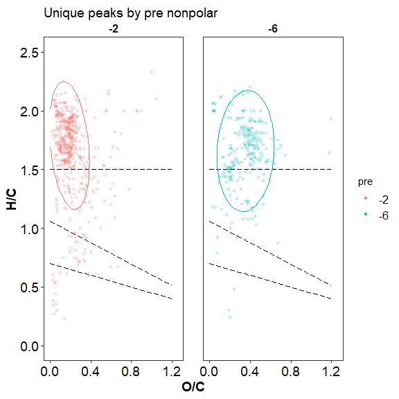
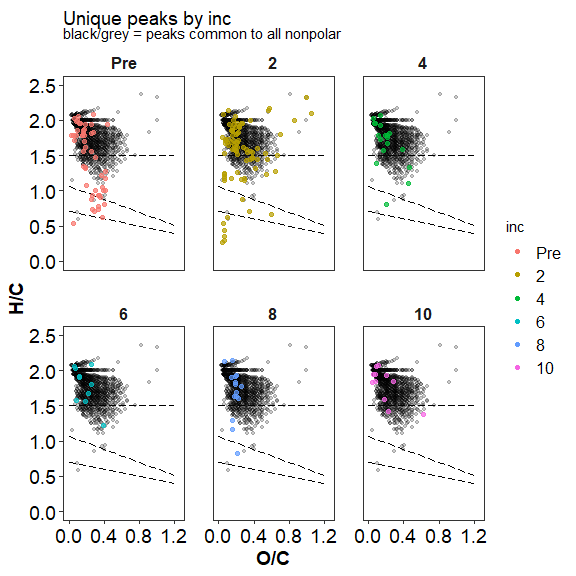
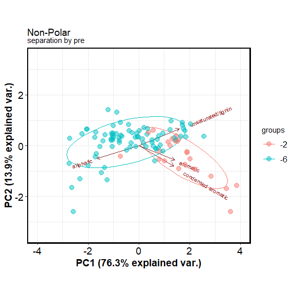

FTICR
================
2023-05-02

## FTICR Van krevalin diagrams:

click to open

<!-- -->

<!-- --><!-- --><!-- --><!-- -->

## FTICR Common vs unique peaks by treatment:

click to open

<!-- --><!-- -->

| Class              |  -2 |  -6 |
|:-------------------|----:|----:|
| aliphatic          | 465 | 230 |
| aromatic           |  29 |  33 |
| condensed aromatic |  16 |  12 |
| unsaturated/lignin | 103 | 166 |

<!-- -->

| Class              | Pre |   2 |   4 |   6 |   8 |  10 |
|:-------------------|----:|----:|----:|----:|----:|----:|
| aliphatic          |  55 |  57 |  17 |  10 |  14 |  11 |
| unsaturated/lignin |  39 |  11 |   8 |   4 |  10 |   2 |
| aromatic           |  14 |   2 |   3 |   1 |   2 |  NA |
| condensed aromatic |   2 |   4 |  NA |  NA |   4 |  NA |

<!-- -->

| Class              | -2_Pre | -6_Pre | -2_2 | -6_2 | -2_4 | -6_4 | -2_6 | -6_6 | -2_8 | -6_8 | -2_10 | -6_10 |
|:-------------------|-------:|-------:|-----:|-----:|-----:|-----:|-----:|-----:|-----:|-----:|------:|------:|
| aliphatic          |     38 |     10 |   54 |    3 |   17 |   NA |   10 |   NA |   13 |    1 |    11 |    NA |
| unsaturated/lignin |     25 |      8 |    9 |    2 |    7 |    1 |    3 |    1 |    8 |    2 |    NA |     2 |
| aromatic           |     11 |      3 |    2 |   NA |    1 |    2 |   NA |    1 |    2 |   NA |    NA |    NA |
| condensed aromatic |      2 |     NA |    4 |   NA |   NA |   NA |   NA |   NA |    4 |   NA |    NA |    NA |

## FTICR Permanova results and PCAs:

click to open

#### Permanova results:

<!-- -->

|          |  Df |  SumOfSqs |        R2 |         F | Pr(\>F) |
|:---------|----:|----------:|----------:|----------:|--------:|
| pre      |   1 | 0.2906302 | 0.0458303 | 9.8161099 |   0.005 |
| inc      |   5 | 0.0082554 | 0.0013018 | 0.0557657 |   0.998 |
| pre:inc  |   5 | 0.0322426 | 0.0050844 | 0.2178001 |   0.956 |
| Residual | 203 | 6.0103176 | 0.9477835 |        NA |      NA |
| Total    | 214 | 6.3414458 | 1.0000000 |        NA |      NA |

Permanova results: All

|          |  Df |  SumOfSqs |        R2 |         F | Pr(\>F) |
|:---------|----:|----------:|----------:|----------:|--------:|
| pre      |   1 | 0.0001709 | 0.0163378 |  4.023551 |   0.024 |
| inc      |   5 | 0.0046123 | 0.4408260 | 21.712725 |   0.001 |
| pre:inc  |   5 | 0.0016011 | 0.1530252 |  7.537202 |   0.001 |
| Residual |  96 | 0.0040785 | 0.3898110 |        NA |      NA |
| Total    | 107 | 0.0104629 | 1.0000000 |        NA |      NA |

Permanova results: Polar only

|          |  Df |  SumOfSqs |        R2 |          F | Pr(\>F) |
|:---------|----:|----------:|----------:|-----------:|--------:|
| pre      |   1 | 0.0066753 | 0.1654780 | 24.5398933 |   0.001 |
| inc      |   5 | 0.0066012 | 0.1636400 |  4.8534640 |   0.002 |
| pre:inc  |   5 | 0.0012213 | 0.0302756 |  0.8979562 |   0.479 |
| Residual |  95 | 0.0258419 | 0.6406064 |         NA |      NA |
| Total    | 106 | 0.0403397 | 1.0000000 |         NA |      NA |

Permanova results: Non-Polar only

#### PCA results:

<!-- --><!-- --><!-- --><!-- --><!-- --><!-- --><!-- -->

## Session Info

Session Info

Date run: 2023-05-05

    ## R version 4.2.3 (2023-03-15 ucrt)
    ## Platform: x86_64-w64-mingw32/x64 (64-bit)
    ## Running under: Windows 10 x64 (build 19045)
    ## 
    ## Matrix products: default
    ## 
    ## locale:
    ## [1] LC_COLLATE=English_United States.utf8 
    ## [2] LC_CTYPE=English_United States.utf8   
    ## [3] LC_MONETARY=English_United States.utf8
    ## [4] LC_NUMERIC=C                          
    ## [5] LC_TIME=English_United States.utf8    
    ## 
    ## attached base packages:
    ## [1] grid      stats     graphics  grDevices utils     datasets  methods  
    ## [8] base     
    ## 
    ## other attached packages:
    ##  [1] pmartR_2.3.0      agricolae_1.3-5   knitr_1.42        nlme_3.1-162     
    ##  [5] cowplot_1.1.1     ggpubr_0.6.0      janitor_2.2.0     pracma_2.4.2     
    ##  [9] reshape2_1.4.4    ggbiplot_0.55     scales_1.2.1      plyr_1.8.8       
    ## [13] vegan_2.6-4       lattice_0.20-45   permute_0.9-7     lubridate_1.9.2  
    ## [17] forcats_1.0.0     stringr_1.5.0     dplyr_1.1.1       purrr_1.0.1      
    ## [21] readr_2.1.4       tidyr_1.3.0       tibble_3.2.1      ggplot2_3.4.2    
    ## [25] tidyverse_2.0.0   tarchetypes_0.7.5 targets_0.14.3   
    ## 
    ## loaded via a namespace (and not attached):
    ##  [1] fs_1.6.1           future.callr_0.8.1 tools_4.2.3        backports_1.4.1   
    ##  [5] utf8_1.2.3         R6_2.5.1           AlgDesign_1.2.1    mgcv_1.8-42       
    ##  [9] questionr_0.7.8    colorspace_2.1-0   withr_2.5.0        tidyselect_1.2.0  
    ## [13] processx_3.8.0     klaR_1.7-1         compiler_4.2.3     cli_3.6.0         
    ## [17] labeling_0.4.2     callr_3.7.3        digest_0.6.31      rmarkdown_2.21    
    ## [21] pkgconfig_2.0.3    htmltools_0.5.4    parallelly_1.35.0  labelled_2.10.0   
    ## [25] highr_0.10         fastmap_1.1.1      rlang_1.1.0        rstudioapi_0.14   
    ## [29] shiny_1.7.4        farver_2.1.1       generics_0.1.3     combinat_0.0-8    
    ## [33] car_3.1-1          magrittr_2.0.3     Matrix_1.5-3       Rcpp_1.0.10       
    ## [37] munsell_0.5.0      fansi_1.0.4        abind_1.4-5        lifecycle_1.0.3   
    ## [41] furrr_0.3.1        stringi_1.7.12     yaml_2.3.7         snakecase_0.11.0  
    ## [45] carData_3.0-5      MASS_7.3-58.2      promises_1.2.0.1   parallel_4.2.3    
    ## [49] listenv_0.9.0      miniUI_0.1.1.1     haven_2.5.2        splines_4.2.3     
    ## [53] hms_1.1.2          ps_1.7.2           pillar_1.9.0       igraph_1.4.1      
    ## [57] ggsignif_0.6.4     base64url_1.4      codetools_0.2-19   glue_1.6.2        
    ## [61] evaluate_0.20      data.table_1.14.8  foreach_1.5.2      httpuv_1.6.9      
    ## [65] vctrs_0.6.0        tzdb_0.3.0         gtable_0.3.3       future_1.32.0     
    ## [69] ggExtra_0.10.0     xfun_0.38          mime_0.12          xtable_1.8-4      
    ## [73] broom_1.0.4        later_1.3.0        rstatix_0.7.2      iterators_1.0.14  
    ## [77] cluster_2.1.4      timechange_0.2.0   globals_0.16.2     ellipsis_0.3.2

