GC_LC_Lipids
================
2023-04-25

## GC

click to open

    ## $Stat_plot

<!-- -->

    ## 
    ## $GC

<!-- -->

    ## 
    ## $GC_sac

<!-- -->

    ## 
    ## $GC_unkown

<!-- -->

    ## 
    ## $StatsGC
    ## 
    ## 
    ## |Metabolites                                                                              | Count_-2_4| Count_-6_pre| Count_-6_6| Count_-6_8| Count_-2_10| Count_-6_10| Count_-2_8| Count_-2_6| Count_-6_2| Count_-6_4| Count_-2_pre| Count_-2_2| Mean_-2_4| Mean_-6_pre| Mean_-6_6| Mean_-6_8| Mean_-2_10| Mean_-6_10| Mean_-2_8| Mean_-2_6| Mean_-6_2| Mean_-6_4| Mean_-2_pre| Mean_-2_2| P_value_A_-2_4_vs_-6_4| P_value_A_-6_pre_vs_-2_pre| P_value_A_-6_6_vs_-2_6| P_value_A_-6_8_vs_-2_8| P_value_A_-2_10_vs_-6_10| P_value_A_-6_2_vs_-2_2| Flag_A_-2_4_vs_-6_4| Flag_A_-6_pre_vs_-2_pre| Flag_A_-6_6_vs_-2_6| Flag_A_-6_8_vs_-2_8| Flag_A_-2_10_vs_-6_10| Flag_A_-6_2_vs_-2_2|
    ## |:----------------------------------------------------------------------------------------|----------:|------------:|----------:|----------:|-----------:|-----------:|----------:|----------:|----------:|----------:|------------:|----------:|---------:|-----------:|---------:|---------:|----------:|----------:|---------:|---------:|---------:|---------:|-----------:|---------:|----------------------:|--------------------------:|----------------------:|----------------------:|------------------------:|----------------------:|-------------------:|-----------------------:|-------------------:|-------------------:|---------------------:|-------------------:|
    ## |1-hexadecanol                                                                            |          2|            3|          3|          3|           3|           3|          3|          3|          3|          3|            3|          2|  12.82688|    12.73994|  13.22996|  13.09522|  13.173065|   12.56111|  13.59367|  13.28994|  13.42159|  13.20033|    13.43485| 13.286321|              0.2831971|                  0.0320738|              0.8452216|              0.1148983|                0.0562394|              0.6941402|                   0|                      -1|                   0|                   0|                     0|                   0|
    ## |2-furoic acid                                                                            |          2|            3|          3|          3|           3|           3|          3|          3|          3|          3|            3|          2|  14.07959|    15.05207|  14.30400|  15.25427|  15.589588|   15.67322|  15.98288|  15.92840|  14.99955|  14.23008|    13.35880| 15.222577|              0.8801254|                  0.0680019|              0.0791030|              0.4177311|                0.9253294|              0.8231957|                   0|                       0|                   0|                   0|                     0|                   0|
    ## |2-phenylacetamide                                                                        |          2|            3|          3|          3|           3|           3|          3|          3|          3|          3|            3|          2|  16.46605|    16.19755|  16.27929|  16.29786|  16.514059|   16.32734|  16.57398|  16.53958|  16.32143|  16.40534|    16.11793| 16.494332|              0.7145936|                  0.5924709|              0.0895890|              0.0728654|                0.2159900|              0.3028285|                   0|                       0|                   0|                   0|                     0|                   0|
    ## |2-phenylacetic acid                                                                      |          2|            3|          3|          3|           3|           3|          3|          3|          3|          3|            3|          2|  14.07667|    13.85288|  14.07899|  13.99845|  14.177359|   13.83437|  14.20499|  14.22215|  14.00362|  14.08181|    13.98364| 14.244859|              0.9718592|                  0.3219967|              0.2793125|              0.1238018|                0.0143817|              0.1087273|                   0|                       0|                   0|                   0|                     1|                   0|
    ## |3-hydroxybutyric acid                                                                    |          2|            3|          3|          3|           3|           3|          3|          3|          3|          3|            3|          2|  17.02740|    17.42942|  17.02950|  16.73623|  16.786563|   16.96513|  16.55766|  16.85093|  16.96690|  17.20596|    17.25086| 16.788335|              0.5228903|                  0.4755541|              0.4755541|              0.4755541|                0.4755541|              0.5228903|                   0|                       0|                   0|                   0|                     0|                   0|
    ## |3-hydroxypentanoic acid                                                                  |          2|            3|          3|          3|           3|           3|          3|          3|          3|          3|            3|          2|  14.09349|    14.60380|  14.61006|  14.30529|  14.208155|   14.22941|  12.47551|  13.81196|  13.99127|  14.31794|    14.58725| 14.199742|              0.7117814|                  0.9756584|              0.1509680|              0.0025029|                0.9687530|              0.7314189|                   0|                       0|                   0|                   1|                     0|                   0|
    ## |4-aminobutyric acid (GABA)                                                               |          2|            3|          3|          3|           3|           3|          3|          3|          3|          3|            3|          2|  15.52310|    15.85651|  15.80402|  15.48070|  15.518614|   15.53562|  15.49476|  14.64091|  15.57674|  15.84206|    16.07108| 15.422327|              0.2734626|                  0.4073176|              0.0001465|              0.9563564|                0.9472339|              0.5920629|                   0|                       0|                   1|                   0|                     0|                   0|
    ## |4-hydroxy-3-methoxybenzoic acid (isovanillic acid)                                       |          2|            3|          3|          3|           3|           3|          3|          3|          3|          3|            3|          2|  14.26542|    13.66602|  14.12016|  14.60494|  13.809438|   13.71046|  14.49884|  14.32944|  14.46206|  14.48139|    14.28706| 13.896654|              0.5353996|                  0.0552320|              0.5022162|              0.7327474|                0.7500051|              0.1134593|                   0|                       0|                   0|                   0|                     0|                   0|
    ## |4-hydroxybenzoic acid (p-salicylic acid)                                                 |          2|            3|          3|          3|           3|           3|          3|          3|          3|          3|            3|          2|  13.70856|    14.64701|  14.47116|  14.49558|  14.566097|   14.42280|  14.77753|  14.43734|  14.50415|  14.55729|    14.83615| 14.618420|              0.0006924|                  0.3365356|              0.8621330|              0.1571819|                0.4645393|              0.6007812|                  -1|                       0|                   0|                   0|                     0|                   0|
    ## |Arachidic acid                                                                           |          2|            3|          3|          3|           3|           3|          3|          3|          3|          3|            3|          2|  15.53270|    15.44821|  15.62911|  15.49211|  15.633213|   15.52775|  15.59758|  15.73458|  15.53801|  15.42723|    15.55368| 15.643476|              0.6006057|                  0.5586403|              0.5586403|              0.5586403|                0.5586403|              0.6006057|                   0|                       0|                   0|                   0|                     0|                   0|
    ## |Arbutin                                                                                  |          2|            3|          3|          3|           3|           3|          3|          3|          3|          3|            3|          2|  17.53413|    16.85870|  16.08974|  16.75370|  15.991368|   16.32749|  16.14983|  15.94903|  15.97179|  16.45849|    16.45428| 15.832055|              0.1755652|                  0.5622872|              0.8396848|              0.3891583|                0.6296870|              0.8573874|                   0|                       0|                   0|                   0|                     0|                   0|
    ## |behenic acid                                                                             |          2|            3|          3|          3|           3|           3|          3|          3|          3|          3|            3|          2|  17.36295|    17.43168|  17.80346|  17.47156|  17.774088|   17.46309|  17.53367|  17.74320|  17.47522|  17.60910|    17.62025| 17.748724|              0.3297048|                  0.4024363|              0.7875180|              0.7811664|                0.1730896|              0.2800190|                   0|                       0|                   0|                   0|                     0|                   0|
    ## |Benzene-1,2,4-triol                                                                      |          2|            3|          3|          3|           3|           2|          3|          3|          3|          3|            3|          2|  13.44700|    13.38284|  12.49475|  12.72954|  14.222527|   13.46412|  13.90935|  14.42046|  12.52155|  13.09745|    13.64025| 13.981960|              0.6148571|                  0.6783872|              0.0048785|              0.0675729|                0.2803331|              0.0448077|                   0|                       0|                  -1|                   0|                     0|                  -1|
    ## |Campesterol                                                                              |          2|            3|          3|          3|           3|           3|          3|          3|          3|          3|            3|          2|  17.54339|    17.35698|  17.60360|  17.44406|  17.513306|   17.39195|  17.50723|  17.46184|  17.44003|  17.45720|    17.36300| 17.296930|              0.5288737|                  0.9606076|              0.2519705|              0.6053524|                0.3248192|              0.2996611|                   0|                       0|                   0|                   0|                     0|                   0|
    ## |Capric acid                                                                              |          2|            3|          3|          3|           3|           3|          3|          3|          3|          3|            3|          2|  14.04075|    14.06161|  14.30012|  14.29006|  14.186775|   14.11842|  14.15378|  14.08577|  14.44696|  14.17254|    14.37115| 14.321160|              0.4563045|                  0.0590025|              0.1817548|              0.3900998|                0.6644175|              0.4767998|                   0|                       0|                   0|                   0|                     0|                   0|
    ## |Caprylic acid                                                                            |          2|            3|          3|          3|           3|           3|          3|          3|          3|          3|            3|          2|  13.21355|    13.46609|  13.55123|  13.71471|  13.410917|   13.53408|  14.03674|  13.58715|  13.75163|  13.45298|    13.56810| 13.539368|              0.4533107|                  0.7195903|              0.8992758|              0.2633009|                0.6648846|              0.5055755|                   0|                       0|                   0|                   0|                     0|                   0|
    ## |Carbonate ion                                                                            |          2|            3|          3|          3|           3|           3|          3|          3|          3|          3|            3|          2|  19.98323|    20.06430|  19.52901|  20.22754|  20.045780|   20.20815|  20.55711|  20.10672|  20.19320|  19.66409|    19.86825| 20.148214|              0.4065686|                  0.5670472|              0.1008580|              0.3392101|                0.6350425|              0.9061426|                   0|                       0|                   0|                   0|                     0|                   0|
    ## |D-arabitol                                                                               |          1|            3|          2|          2|           1|           2|          3|          2|          3|          2|            3|          2|  13.40335|    14.69966|  13.47893|  12.45367|  10.181692|   11.84022|  13.29977|  12.20678|  13.59903|  12.69972|    14.03775| 13.406121|              0.4504730|                  0.2918042|              0.1076305|              0.2309216|                0.0886368|              0.7793994|                   0|                       0|                   0|                   0|                     0|                   0|
    ## |D-fructose                                                                               |          2|            3|          3|          3|           3|           3|          3|          3|          3|          3|            3|          2|  16.65081|    16.65963|  16.89242|  16.86070|  16.875894|   17.00826|  17.15417|  17.06668|  16.86055|  16.79564|    17.10221| 17.077366|              0.3793871|                  0.0056712|              0.2403491|              0.0543671|                0.3692645|              0.1929759|                   0|                      -1|                   0|                   0|                     0|                   0|
    ## |D-galactose                                                                              |          2|            3|          3|          3|           3|           3|          3|          3|          3|          3|            3|          2|  15.78733|    15.88762|  15.67174|  16.43627|  16.253238|   16.66960|  16.01992|  15.25538|  16.56348|  16.20369|    15.47126| 16.147124|              0.5963208|                  0.5540227|              0.5540227|              0.5540227|                0.5540227|              0.5963208|                   0|                       0|                   0|                   0|                     0|                   0|
    ## |D-glucose                                                                                |          2|            3|          3|          3|           3|           3|          3|          3|          3|          3|            3|          2|  19.63778|    19.44239|  18.69770|  18.92708|  18.156181|   20.07239|  19.33095|  18.34191|  18.98170|  19.22826|    19.34089| 18.332695|              0.5314986|                  0.8617710|              0.5432117|              0.4906584|                0.0030673|              0.3246256|                   0|                       0|                   0|                   0|                    -1|                   0|
    ## |D-mannitol                                                                               |          2|            3|          3|          3|           3|           3|          3|          3|          3|          3|            3|          2|  18.00991|    18.91320|  17.77157|  18.03746|  17.274895|   18.63199|  18.45905|  17.94640|  18.45687|  17.95844|    19.86032| 18.159409|              0.9105617|                  0.0288817|              0.6702460|              0.3093157|                0.0028962|              0.5181347|                   0|                      -1|                   0|                   0|                    -1|                   0|
    ## |D-xylose                                                                                 |          2|            3|          3|          3|           3|           3|          3|          3|          3|          3|            3|          2|  12.89459|    13.84748|  13.35295|  13.29890|  12.898207|   13.34154|  13.23507|  12.04521|  13.48572|  12.92901|    13.63837| 12.125313|              0.9339697|                  0.5749096|              0.0017509|              0.8636152|                0.2402595|              0.0031650|                   0|                       0|                   1|                   0|                     0|                   1|
    ## |Ethanolamine                                                                             |          2|            3|          3|          3|           3|           3|          3|          3|          3|          3|            3|          2|  14.43709|    14.85197|  14.89962|  15.32381|  14.544063|   15.34527|  15.08947|  15.24922|  15.23549|  15.07906|    15.20141| 15.190491|              0.0917565|                  0.2948811|              0.2946641|              0.4793452|                0.0222058|              0.9027629|                   0|                       0|                   0|                   0|                    -1|                   0|
    ## |Fumaric acid                                                                             |          2|            3|          3|          3|           3|           3|          3|          3|          3|          3|            3|          2|  14.28938|    14.06507|  13.06217|  14.04508|  13.932339|   13.76877|  14.20865|  13.22574|  13.77728|  14.12581|    14.22864| 13.940852|              0.8231533|                  0.8027153|              0.8027153|              0.8027153|                0.8027153|              0.8231533|                   0|                       0|                   0|                   0|                     0|                   0|
    ## |Gerulic acid                                                                             |          1|            3|          3|          3|           3|           3|          3|          3|          3|          3|            3|          2|  13.03233|    14.35575|  14.59225|  14.33821|  14.728340|   14.84148|  14.24303|  14.15780|  14.03928|  14.37105|    14.27026| 14.072553|              0.0084128|                  0.7954078|              0.1963082|              0.7728620|                0.7316246|              0.9280216|                  -1|                       0|                   0|                   0|                     0|                   0|
    ## |Glucosamine-1-phosphate                                                                  |          2|            3|          3|          3|           3|           3|          3|          3|          3|          3|            3|          2|  17.51291|    16.79818|  17.58437|  17.63624|  17.573243|   17.49137|  17.94603|  17.76086|  17.72394|  17.45426|    17.77996| 17.727300|              0.8796091|                  0.0089346|              0.6112839|              0.3752605|                0.8131883|              0.9930783|                   0|                      -1|                   0|                   0|                     0|                   0|
    ## |Glycerol                                                                                 |          2|            3|          3|          3|           3|           3|          3|          3|          3|          3|            3|          2|  19.38678|    19.51639|  19.19861|  19.28168|  19.450906|   19.16110|  19.51772|  18.78085|  19.14256|  19.04162|    19.23266| 18.742428|              0.4408950|                  0.4782888|              0.2997082|              0.5545582|                0.4690326|              0.3727429|                   0|                       0|                   0|                   0|                     0|                   0|
    ## |Glycerol 3-phosphate                                                                     |          2|            3|          3|          3|           3|           3|          3|          3|          3|          3|            3|          2|  14.82612|    14.13503|  14.62292|  14.02117|  15.153862|   14.04272|  14.30671|  15.12270|  14.28838|  14.92411|    13.79372| 15.014268|              0.8362359|                  0.4240344|              0.2456419|              0.5026562|                0.0145625|              0.1355118|                   0|                       0|                   0|                   0|                     1|                   0|
    ## |Glycolic acid                                                                            |          2|            3|          3|          3|           3|           3|          3|          3|          3|          3|            3|          2|  13.65960|    13.76304|  13.75533|  13.80941|  13.797363|   14.01896|  14.04975|  14.03559|  13.87290|  13.84126|    14.17640| 13.965565|              0.3395628|                  0.0211097|              0.1063497|              0.1628261|                0.1966858|              0.6234401|                   0|                      -1|                   0|                   0|                     0|                   0|
    ## |Heptadecanoic acid                                                                       |          2|            3|          3|          3|           3|           3|          3|          3|          3|          3|            3|          2|  14.81200|    15.00440|  14.93330|  15.02784|  14.913141|   15.07714|  15.16599|  15.02929|  14.99071|  14.88593|    15.21171| 15.050520|              0.6465192|                  0.1589925|              0.5066826|              0.3418416|                0.2611798|              0.7103793|                   0|                       0|                   0|                   0|                     0|                   0|
    ## |Isomaltose                                                                               |          2|            3|          3|          2|           3|           3|          3|          3|          3|          3|            3|          2|  12.57748|    14.85402|  13.55944|  13.96739|  13.988531|   10.96110|  13.54725|  13.58892|  13.27910|  12.29705|    14.19309| 14.131649|              0.8249598|                  0.5614135|              0.9792530|              0.7405652|                0.0133197|              0.5034129|                   0|                       0|                   0|                   0|                     1|                   0|
    ## |Lactic acid                                                                              |          2|            3|          3|          3|           3|           3|          3|          3|          3|          3|            3|          2|  15.93201|    15.98827|  15.86145|  15.40133|  15.616433|   15.49737|  15.42967|  15.91818|  15.24507|  15.08842|    16.04741| 16.025918|              0.0369763|                  0.8633987|              0.8689276|              0.9342748|                0.7293445|              0.0518818|                   1|                       0|                   0|                   0|                     0|                   0|
    ## |Lauric acid                                                                              |          2|            3|          3|          3|           3|           3|          3|          3|          3|          3|            3|          2|  14.35213|    14.29322|  14.45442|  14.48491|  14.391385|   14.28973|  14.46013|  14.60812|  14.71077|  14.59393|    14.57700| 14.743734|              0.1837453|                  0.0854539|              0.3399943|              0.8764716|                0.5255263|              0.8533092|                   0|                       0|                   0|                   0|                     0|                   0|
    ## |L-glutamic acid                                                                          |          2|            3|          3|          3|           3|           3|          3|          3|          3|          3|            3|          2|  16.18518|    16.63525|  16.49492|  16.38307|  16.582421|   17.06290|  16.63415|  16.42771|  16.29824|  16.24492|    17.16689| 16.601172|              0.8576133|                  0.0845916|              0.8214875|              0.4028391|                0.1168329|              0.3672857|                   0|                       0|                   0|                   0|                     0|                   0|
    ## |Linoleic acid                                                                            |          2|            3|          3|          3|           3|           3|          3|          3|          3|          3|            3|          2|  16.54238|    17.31334|  16.72047|  16.71962|  16.621648|   17.20072|  16.83550|  17.03105|  17.03280|  16.98700|    17.03823| 17.125042|              0.1295696|                  0.2877671|              0.2317261|              0.6508301|                0.0317690|              0.7469732|                   0|                       0|                   0|                   0|                    -1|                   0|
    ## |L-pyroglutamic acid                                                                      |          2|            3|          3|          3|           3|           3|          3|          3|          3|          3|            3|          2|  12.83771|    13.14068|  13.02528|  12.89987|  12.784649|   12.87396|  12.81057|  12.93598|  13.09419|  12.92701|    13.05138| 13.004886|              0.8247936|                  0.8045372|              0.8045372|              0.8045372|                0.8045372|              0.8247936|                   0|                       0|                   0|                   0|                     0|                   0|
    ## |L-Sorbose                                                                                |          2|            3|          3|          3|           2|           2|          3|          2|          3|          3|            3|          2|  11.42776|    14.28305|  11.72711|  12.29790|   9.592334|   12.83690|  13.06597|  10.66278|  12.50166|  12.11315|    13.65435| 10.560469|              0.5447487|                  0.5346236|              0.3502574|              0.4492234|                0.0152988|              0.0968447|                   0|                       0|                   0|                   0|                    -1|                   0|
    ## |Maltose                                                                                  |          2|            2|          3|          3|           3|           3|          3|          3|          3|          3|            3|          2|  12.13866|    12.96250|  13.09834|  13.44326|  13.197108|   13.68597|  12.95440|  12.60948|  12.87277|  12.62751|    12.47364| 12.383913|              0.6851914|                  0.6851914|              0.6505388|              0.6505388|                0.6505388|              0.6851914|                   0|                       0|                   0|                   0|                     0|                   0|
    ## |Myo-inositol                                                                             |          2|            3|          3|          3|           3|           3|          3|          3|          3|          3|            3|          2|  17.53232|    18.01905|  17.71954|  17.76019|  17.522355|   17.64339|  18.13988|  17.83398|  17.76023|  17.47666|    18.20901| 17.655912|              0.8397150|                  0.4431496|              0.6426434|              0.1327901|                0.6236893|              0.7049646|                   0|                       0|                   0|                   0|                     0|                   0|
    ## |Myristic acid                                                                            |          2|            3|          3|          3|           3|           3|          3|          3|          3|          3|            3|          2|  14.63296|    14.28135|  13.74555|  15.99816|  15.733916|   15.54075|  17.03381|  16.06510|  15.55042|  14.86961|    16.82569| 15.502845|              0.8896058|                  0.1055560|              0.1381169|              0.4992312|                0.8991999|              0.9777355|                   0|                       0|                   0|                   0|                     0|                   0|
    ## |nonanoic acid                                                                            |          2|            3|          3|          3|           3|           3|          3|          3|          3|          3|            3|          2|  18.62376|    18.38980|  18.49954|  18.65800|  18.510183|   18.69829|  18.80245|  18.85339|  18.62063|  18.57269|    18.81332| 18.572270|              0.7527989|                  0.0072879|              0.0217248|              0.3242058|                0.2026338|              0.7654980|                   0|                      -1|                  -1|                   0|                     0|                   0|
    ## |Oleic acid                                                                               |          2|            3|          3|          3|           3|           3|          3|          3|          3|          3|            3|          2|  15.75788|    16.09146|  15.97214|  15.85674|  15.780334|   16.09360|  16.08332|  16.11647|  15.95510|  16.08356|    16.09915| 16.115758|              0.1106851|                  0.9654137|              0.4190723|              0.2095054|                0.0876558|              0.4210809|                   0|                       0|                   0|                   0|                     0|                   0|
    ## |Palatinitol                                                                              |          1|            3|          3|          3|           3|           3|          3|          3|          3|          3|            3|          2|  13.63171|    13.73931|  13.91686|  13.55373|  11.837114|   12.92205|  14.96817|  15.15549|  13.97993|  12.17638|    14.07754| 13.724127|              0.3532615|                  0.7581059|              0.2660549|              0.2060774|                0.3282944|              0.8348708|                   0|                       0|                   0|                   0|                     0|                   0|
    ## |Palatinose                                                                               |          2|            3|          3|          3|           3|           3|          3|          3|          3|          3|            3|          2|  14.29071|    14.35489|  14.20713|  14.66383|  14.597887|   14.84864|  14.41308|  13.95638|  13.78385|  14.54146|    14.10414| 13.533094|              0.6514709|                  0.6137408|              0.6137408|              0.6137408|                0.6137408|              0.6514709|                   0|                       0|                   0|                   0|                     0|                   0|
    ## |Palmitic acid                                                                            |          2|            3|          3|          3|           3|           3|          3|          3|          3|          3|            3|          2|  22.02768|    22.23373|  22.17584|  21.99381|  22.110136|   21.91042|  22.10881|  22.08279|  21.83657|  22.11519|    22.55795| 21.884203|              0.6448843|                  0.0658757|              0.5841433|              0.4995384|                0.2458495|              0.8015997|                   0|                       0|                   0|                   0|                     0|                   0|
    ## |Palmitoleic acid                                                                         |          2|            3|          3|          3|           3|           3|          3|          3|          3|          3|            3|          2|  14.07632|    14.37051|  14.30868|  14.30725|  14.335113|   14.44642|  14.45491|  14.56507|  14.41705|  14.31657|    14.54968| 14.537438|              0.1450217|                  0.2209299|              0.0851267|              0.3104293|                0.4421705|              0.4570037|                   0|                       0|                   0|                   0|                     0|                   0|
    ## |pentasiloxane                                                                            |          2|            3|          3|          3|           3|           3|          3|          3|          3|          3|            3|          2|  16.19847|    17.90290|  16.72434|  17.54218|  17.451543|   17.84004|  17.15369|  16.33585|  16.86442|  16.58696|    17.51441| 16.475928|              0.6082578|                  0.5668964|              0.5668964|              0.5668964|                0.5668964|              0.6082578|                   0|                       0|                   0|                   0|                     0|                   0|
    ## |Porphine                                                                                 |          2|            3|          3|          3|           3|           3|          3|          3|          3|          3|            3|          2|  17.55151|    18.05814|  17.69951|  18.22694|  18.349812|   18.41038|  18.65414|  18.70971|  18.76923|  17.41375|    18.22935| 18.536098|              0.7873720|                  0.7080260|              0.0356213|              0.3540830|                0.8944410|              0.6485543|                   0|                       0|                  -1|                   0|                     0|                   0|
    ## |Scyllo-inositol                                                                          |          2|            3|          3|          3|           3|           3|          3|          3|          3|          3|            3|          2|  12.57288|    14.49879|  14.33443|  13.53875|  12.570950|   13.05362|  13.33884|  13.11199|  14.48007|  14.06740|    14.37225| 14.108974|              0.0628721|                  0.8545506|              0.0869412|              0.7722626|                0.4867094|              0.6314242|                   0|                       0|                   0|                   0|                     0|                   0|
    ## |Stearic acid                                                                             |          2|            3|          3|          3|           3|           3|          3|          3|          3|          3|            3|          2|  22.28713|    22.31623|  22.24692|  21.86694|  22.051354|   21.68421|  21.88581|  22.00768|  21.59333|  22.06179|    22.48549| 21.648028|              0.3288662|                  0.4107193|              0.2485477|              0.9263434|                0.0825480|              0.8107334|                   0|                       0|                   0|                   0|                     0|                   0|
    ## |Succinic acid                                                                            |          2|            3|          3|          3|           3|           3|          3|          3|          3|          3|            3|          2|  16.45281|    16.57563|  16.67863|  16.62985|  16.710913|   16.59900|  16.73425|  16.53914|  16.80556|  16.74352|    16.97256| 16.794269|              0.1917426|                  0.0518352|              0.4775752|              0.5941131|                0.5680108|              0.9587373|                   0|                       0|                   0|                   0|                     0|                   0|
    ## |Sucrose                                                                                  |          2|            3|          3|          3|           3|           3|          3|          3|          3|          3|            3|          2|  19.32792|    18.84315|  19.23976|  19.02584|  18.221507|   20.04924|  18.36606|  17.67406|  19.01915|  19.46683|    17.71477| 18.151408|              0.8283829|                  0.0588892|              0.0113101|              0.2565200|                0.0038757|              0.1843904|                   0|                       0|                   1|                   0|                    -1|                   0|
    ## |Tagatose                                                                                 |          2|            3|          3|          3|           3|           3|          3|          3|          3|          3|            3|          2|  17.67840|    18.19161|  16.99421|  17.04021|  15.709555|   17.95674|  17.15087|  15.99127|  16.96248|  17.35076|    17.15900| 16.549462|              0.6265720|                  0.0960428|              0.1053702|              0.8538852|                0.0010198|              0.5403003|                   0|                       0|                   0|                   0|                    -1|                   0|
    ## |Trehalose                                                                                |          2|            3|          3|          3|           3|           3|          3|          3|          3|          3|            3|          2|  25.01130|    25.03314|  24.91477|  25.00267|  24.945494|   24.76655|  25.18162|  25.09372|  24.96335|  24.83236|    25.21208| 25.142300|              0.3865246|                  0.3340044|              0.3340044|              0.3340044|                0.3340044|              0.3865246|                   0|                       0|                   0|                   0|                     0|                   0|
    ## |Turanose                                                                                 |          2|            3|          3|          3|           3|           3|          3|          3|          3|          3|            3|          2|  13.94455|    13.97495|  13.21516|  13.93825|  13.911280|   13.55079|  14.06486|  13.63621|  14.01337|  12.49829|    13.21185| 14.796607|              0.1736661|                  0.4157408|              0.6516769|              0.8917942|                0.6989435|              0.4544564|                   0|                       0|                   0|                   0|                     0|                   0|
    ## |Ursolic acid                                                                             |          2|            3|          3|          3|           3|           3|          3|          3|          3|          3|            3|          2|  17.19556|    16.46094|  16.67353|  16.35639|  16.039675|   16.26433|  15.96179|  16.65055|  16.31677|  16.42818|    16.25403| 16.561925|              0.0661669|                  0.5659401|              0.9489659|              0.2783607|                0.5333973|              0.5431629|                   0|                       0|                   0|                   0|                     0|                   0|
    ## |1-Octadecanol                                                                            |          2|            3|          3|          3|           3|           3|          3|          3|          3|          3|            3|          2|  15.37544|    15.19929|  15.53243|  15.61376|  15.424369|   15.64108|  15.70279|  15.39244|  15.45978|  15.55656|    15.73924| 15.616738|              0.2776108|                  0.0012185|              0.3464786|              0.5469188|                0.1506143|              0.3451520|                   0|                      -1|                   0|                   0|                     0|                   0|
    ## |3-Methoxy-4-hydroxyphenol 1-O-?-D-glucopyranoside                                        |          2|            3|          3|          3|           3|           2|          3|          3|          3|          3|            3|          2|  13.98307|    13.78354|  11.84490|  13.07656|  12.210318|   14.65164|  12.43128|  12.20978|  12.77905|  12.97622|    13.37024| 13.237711|              0.5315845|                  0.7732035|              0.7991217|              0.6532178|                0.1379223|              0.7748329|                   0|                       0|                   0|                   0|                     0|                   0|
    ## |4-Diphenylphosphinoyl-5-methylhex-2-enyl tert-butyl(dimethyl)silyl ether                 |          2|            3|          3|          3|           3|           3|          3|          3|          3|          3|            3|          2|  15.18220|    14.92203|  15.04152|  15.19698|  14.841220|   14.92748|  14.94870|  14.59121|  14.94760|  15.19605|    15.24537| 14.961766|              0.9646503|                  0.2546218|              0.1175380|              0.3788168|                0.7579218|              0.9638564|                   0|                       0|                   0|                   0|                     0|                   0|
    ## |Azelaic acid                                                                             |          2|            3|          3|          3|           3|           3|          3|          3|          3|          3|            3|          2|  14.17861|    14.21299|  14.44008|  14.57947|  14.521870|   14.77317|  14.78725|  15.18692|  14.82954|  14.94603|    14.92118| 15.101748|              0.0625826|                  0.0552954|              0.0442062|              0.5586967|                0.4802027|              0.4938450|                   0|                       0|                  -1|                   0|                     0|                   0|
    ## |Lignoceric acid                                                                          |          2|            3|          3|          3|           3|           3|          3|          3|          3|          3|            3|          2|  15.32847|    15.49623|  15.67294|  15.11142|  16.526043|   15.86104|  15.52327|  14.62081|  15.50245|  15.38627|    15.00123| 15.569774|              0.9478863|                  0.5332382|              0.1921609|              0.6036768|                0.4042375|              0.9393173|                   0|                       0|                   0|                   0|                     0|                   0|
    ## |Monomethyl succinic acid                                                                 |          2|            3|          3|          3|           3|           3|          3|          3|          3|          3|            3|          2|  14.47381|    14.93287|  14.42376|  14.52354|  14.722324|   14.48053|  14.76534|  14.66555|  14.16620|  14.23201|    15.17466| 14.407992|              0.6403547|                  0.6016563|              0.6016563|              0.6016563|                0.6016563|              0.6403547|                   0|                       0|                   0|                   0|                     0|                   0|
    ## |Sugars - Disaccharide1                                                                   |          2|            3|          3|          3|           3|           3|          3|          3|          3|          3|            3|          2|  15.48928|    15.36982|  14.24856|  15.31659|  16.023724|   14.90070|  15.74044|  14.92543|  15.68679|  14.39308|    14.78959| 15.492197|              0.1713006|                  0.4116467|              0.3395329|              0.5472386|                0.1195206|              0.8041076|                   0|                       0|                   0|                   0|                     0|                   0|
    ## |Sugars - Disaccharide2                                                                   |          2|            3|          3|          3|           3|           3|          3|          3|          3|          3|            3|          2|  14.77667|    14.62396|  13.60016|  14.53847|  15.235437|   14.00486|  14.97787|  14.17084|  14.95199|  13.80072|    14.03880| 14.759182|              0.2321416|                  0.4189428|              0.4303837|              0.5425833|                0.0972315|              0.8104484|                   0|                       0|                   0|                   0|                     0|                   0|
    ## |Sugars - Disaccharide3                                                                   |          2|            3|          3|          3|           3|           3|          3|          3|          3|          3|            3|          2|  13.12867|    13.34085|  12.84819|  12.89944|  12.202209|   12.82110|  12.78270|  12.53897|  12.85000|  12.59684|    12.64611| 12.871991|              0.1760392|                  0.0533369|              0.3733033|              0.7347710|                0.0825639|              0.9544196|                   0|                       0|                   0|                   0|                     0|                   0|
    ## |Sugars - Disaccharide4                                                                   |          2|            3|          3|          3|           3|           3|          3|          3|          3|          3|            3|          2|  14.52534|    13.67662|  13.74938|  13.60959|  14.005566|   13.80154|  14.22833|  13.45900|  13.14006|  13.32003|    14.14670| 14.026375|              0.0770403|                  0.4272527|              0.6222708|              0.2985646|                0.7288683|              0.1863312|                   0|                       0|                   0|                   0|                     0|                   0|
    ## |Sugars - Disaccharide5                                                                   |          2|            3|          3|          3|           3|           3|          3|          3|          3|          3|            3|          2|  17.26253|    17.00119|  16.93976|  17.27567|  17.312869|   17.21724|  17.22789|  17.28004|  17.25522|  17.11607|    17.51938| 17.218340|              0.6167106|                  0.0570446|              0.2007973|              0.8547882|                0.7144759|              0.8994457|                   0|                       0|                   0|                   0|                     0|                   0|
    ## |Sugars - Disaccharide6                                                                   |          2|            3|          3|          3|           3|           3|          3|          3|          3|          3|            3|          2|  16.39126|    15.85125|  15.82538|  15.96524|  15.584335|   15.90173|  16.23963|  16.29810|  15.99132|  15.89954|    16.05003| 16.129638|              0.2423086|                  0.5925403|              0.2099379|              0.4614092|                0.3952273|              0.7385741|                   0|                       0|                   0|                   0|                     0|                   0|
    ## |Sugars - Monosaccharide - Deoxy                                                          |          2|            3|          3|          3|           3|           3|          3|          3|          3|          3|            3|          2|  13.85485|    13.76963|  13.00399|  13.55904|  12.997459|   13.71242|  13.65910|  13.71002|  13.49596|  13.61542|    13.70176| 13.307119|              0.6719581|                  0.8930445|              0.1710861|              0.8429150|                0.1659633|              0.7381988|                   0|                       0|                   0|                   0|                     0|                   0|
    ## |Sugars - Monosaccharide - Phosphate                                                      |          2|            3|          3|          3|           3|           3|          3|          3|          3|          3|            3|          2|  14.53295|    13.72629|  14.24942|  13.98768|  14.225605|   13.78719|  14.42610|  14.68783|  14.18515|  14.09453|    14.16471| 14.623568|              0.3765514|                  0.3239164|              0.3239164|              0.3239164|                0.3239164|              0.3765514|                   0|                       0|                   0|                   0|                     0|                   0|
    ## |Sugars - Monosaccharide Hexose1                                                          |          2|            3|          3|          3|           3|           3|          3|          3|          3|          3|            3|          2|  14.08698|    14.73102|  14.27078|  14.19668|  13.586000|   13.73796|  14.04471|  14.11882|  14.31286|  14.23895|    14.57906| 14.160892|              0.7024681|                  0.6694529|              0.6694529|              0.6694529|                0.6694529|              0.7024681|                   0|                       0|                   0|                   0|                     0|                   0|
    ## |Sugars - Monosaccharide Hexose2                                                          |          2|            3|          3|          3|           3|           3|          3|          3|          3|          3|            3|          2|  13.58027|    14.33328|  12.87402|  13.65740|  12.712230|   13.47886|  14.41899|  13.35291|  13.40628|  13.55062|    14.46500| 13.860188|              0.9702626|                  0.8531824|              0.5031346|              0.2907063|                0.2876067|              0.5697239|                   0|                       0|                   0|                   0|                     0|                   0|
    ## |Sugars - Monosaccharide Hexose3                                                          |          2|            3|          3|          3|           3|           3|          3|          3|          3|          3|            3|          2|  13.34578|    13.96441|  12.40782|  13.29003|  11.890492|   13.46549|  13.82827|  12.57421|  12.75688|  13.11113|    14.25714| 13.674348|              0.7257303|                  0.6251139|              0.7808069|              0.3720529|                0.0141006|              0.1786602|                   0|                       0|                   0|                   0|                    -1|                   0|
    ## |Sugars - Trisaccharide1                                                                  |          2|            3|          3|          3|           3|           3|          3|          3|          3|          3|            3|          2|  18.51146|    19.14805|  18.68715|  18.78265|  19.018644|   18.59522|  19.20607|  19.11057|  18.74519|  18.08804|    19.57146| 19.168608|              0.5403464|                  0.4940868|              0.4940868|              0.4940868|                0.4940868|              0.5403464|                   0|                       0|                   0|                   0|                     0|                   0|
    ## |Sugars - Trisaccharide2                                                                  |          2|            3|          3|          3|           3|           3|          3|          3|          3|          3|            3|          2|  19.26729|    18.85180|  19.47962|  18.35199|  19.392417|   18.89840|  18.22975|  18.63023|  18.68436|  19.29938|    17.73114| 17.598662|              0.9674428|                  0.1212043|              0.2347012|              0.8620226|                0.4847793|              0.1763831|                   0|                       0|                   0|                   0|                     0|                   0|
    ## |Sugars - Trisaccharide3                                                                  |          2|            3|          3|          3|           3|           3|          3|          3|          3|          3|            3|          2|  16.23882|    17.01286|  16.77132|  16.56149|  15.044090|   16.89928|  16.82523|  16.02079|  17.01742|  16.70407|    17.11773| 17.280560|              0.3622498|                  0.8167768|              0.1074805|              0.5614040|                0.0004203|              0.6039854|                   0|                       0|                   0|                   0|                    -1|                   0|
    ## |Corosolic acid                                                                           |          2|            3|          3|          3|           3|           3|          3|          3|          3|          3|            3|          2|  19.92228|    19.41567|  19.66443|  19.38224|  19.165612|   19.35436|  18.99836|  19.42071|  19.13410|  19.40852|    19.20799| 19.354538|              0.1145557|                  0.4655592|              0.3928780|              0.1836718|                0.5067527|              0.4881779|                   0|                       0|                   0|                   0|                     0|                   0|
    ## |1-(4-(4'-chlorophenyl)-2-thiazolyl)-3-(2-hydroxy-phenyl)-5-(2-butyl-4-chloro-1H-imidazol |          2|            3|          3|          3|           3|           3|          2|          3|          2|          1|            3|          1|  12.82168|    12.53384|  12.51913|  11.75627|  12.152861|   11.99511|  10.45652|  12.94564|  12.44177|  12.93770|    10.98885|  8.235702|              0.9450221|                  0.1801241|              0.7043624|              0.3075956|                0.8881808|              0.0212688|                   0|                       0|                   0|                   0|                     0|                   1|
    ## |1,2-cyclohexanedione                                                                     |          2|            3|          3|          3|           3|           3|          3|          3|          3|          3|            3|          2|  12.43647|    12.20258|  11.85529|  13.48109|  12.817596|   13.39093|  13.78114|  13.59749|  13.46904|  12.08309|    13.42658| 13.042599|              0.6806896|                  0.1205617|              0.0313918|              0.6959930|                0.4573824|              0.6197789|                   0|                       0|                  -1|                   0|                     0|                   0|
    ## |3-(4-hydroxyphenyl)propionic acid (phloretic acid)                                       |          2|            3|          3|          3|           3|           3|          3|          3|          3|          3|            3|          2|  13.44933|    13.58344|  13.43307|  13.66084|  13.626301|   13.64601|  13.93351|  13.83165|  13.69667|  13.46967|    14.24516| 13.806779|              0.9420184|                  0.0137791|              0.1211623|              0.2819583|                0.9371666|              0.6941980|                   0|                      -1|                   0|                   0|                     0|                   0|
    ## |Alizarin                                                                                 |          2|            3|          3|          3|           3|           3|          3|          3|          3|          3|            3|          2|  13.03926|    12.95113|  13.42510|  13.51973|  13.630120|   12.93897|  13.05093|  12.46956|  12.42860|  13.33172|    12.25020| 13.363635|              0.7379295|                  0.3737378|              0.2288447|              0.5498926|                0.3803224|              0.2903831|                   0|                       0|                   0|                   0|                     0|                   0|
    ## |Ciliatine                                                                                |          2|            3|          3|          3|           3|           3|          3|          3|          3|          3|            3|          2|  14.23659|    14.22870|  14.38221|  13.86826|  13.790891|   15.19581|  14.34336|  13.95024|  14.52289|  14.54554|    14.40546| 14.642570|              0.4756624|                  0.6470476|              0.2688089|              0.2252495|                0.0012817|              0.7812448|                   0|                       0|                   0|                   0|                    -1|                   0|
    ## |L-dithiothreitol                                                                         |          2|            3|          3|          3|           3|           3|          3|          3|          3|          3|            3|          2|  10.20087|    11.53823|  11.65364|  12.67984|  12.436695|   11.25918|  12.72529|  12.44740|  13.12414|  12.68804|    12.98102| 12.538279|              0.0014864|                  0.0279629|              0.2088755|              0.9415831|                0.0678453|              0.4019517|                  -1|                      -1|                   0|                   0|                     0|                   0|
    ## |Possible Sterol                                                                          |          2|            3|          3|          3|           3|           3|          3|          3|          3|          3|            3|          2|  13.85932|    14.22039|  15.29238|  15.45617|  14.815477|   14.36344|  13.35451|  14.84416|  13.50096|  15.01000|    13.91924| 14.437960|              0.3034207|                  0.7607233|              0.6507892|              0.0426459|                0.6480267|              0.4000915|                   0|                       0|                   0|                   1|                     0|                   0|
    ## |Unknown - Similarity to Oleic acid                                                       |          2|            3|          3|          3|           3|           3|          3|          3|          3|          3|            3|          2|  14.95727|    15.34031|  15.14967|  15.14415|  14.859005|   15.13748|  15.39174|  15.38890|  15.04679|  15.14264|    15.39470| 15.038100|              0.3775894|                  0.7704312|              0.2072450|              0.1923874|                0.1446189|              0.9667100|                   0|                       0|                   0|                   0|                     0|                   0|
    ## |Unknown 001                                                                              |          2|            3|          3|          3|           3|           3|          3|          3|          3|          3|            3|          2|  14.99914|    15.82639|  14.66192|  15.42665|  14.408569|   14.06522|  14.20958|  14.11503|  14.15097|  13.92148|    14.14919| 14.080056|              0.2827243|                  0.0684411|              0.5385460|              0.1783113|                0.6986508|              0.9428931|                   0|                       0|                   0|                   0|                     0|                   0|
    ## |Unknown 002                                                                              |          2|            3|          3|          3|           3|           3|          3|          3|          3|          3|            3|          2|  20.19605|    20.18756|  20.15211|  20.24361|  20.147730|   20.23672|  20.35387|  20.42008|  20.30757|  20.46305|    20.36372| 20.434612|              0.0453621|                  0.1318255|              0.0263612|              0.3379293|                0.4376036|              0.3237046|                  -1|                       0|                  -1|                   0|                     0|                   0|
    ## |Unknown 003                                                                              |          2|            3|          3|          3|           3|           3|          3|          3|          3|          3|            3|          2|  14.08767|    14.24809|  14.44062|  14.36899|  14.312446|   14.42195|  14.39218|  14.17383|  15.13657|  14.09534|    14.67992| 14.240046|              0.9842399|                  0.2217235|              0.4454538|              0.9467694|                0.7528084|              0.0290520|                   0|                       0|                   0|                   0|                     0|                   1|
    ## |Unknown 004                                                                              |          2|            3|          3|          3|           3|           3|          3|          3|          3|          3|            3|          2|  18.52356|    17.77118|  16.46505|  16.42728|  16.026107|   17.83869|  16.20933|  17.85627|  17.00221|  16.26195|    16.66568| 17.794229|              0.0882840|                  0.3402687|              0.2328999|              0.8493646|                0.1242531|              0.5386375|                   0|                       0|                   0|                   0|                     0|                   0|
    ## |Unknown 005                                                                              |          2|            3|          3|          3|           3|           3|          3|          3|          3|          3|            3|          2|  13.31240|    13.65636|  13.82526|  13.83902|  13.656487|   13.84170|  13.94688|  13.65119|  13.91045|  13.66109|    14.23958| 13.685191|              0.1421992|                  0.0093837|              0.4046730|              0.6038416|                0.3757836|              0.3361064|                   0|                      -1|                   0|                   0|                     0|                   0|
    ## |Unknown 006                                                                              |          2|            3|          3|          3|           3|           3|          3|          3|          3|          3|            3|          2|  13.43933|    14.17412|  13.69204|  13.54718|  13.780091|   14.03497|  13.99707|  14.59442|  14.99483|  13.71622|    15.80313| 13.465414|              0.8136997|                  0.1309679|              0.3942198|              0.6690433|                0.8083796|              0.2012654|                   0|                       0|                   0|                   0|                     0|                   0|
    ## |Unknown 007                                                                              |          2|            3|          3|          3|           3|           3|          3|          3|          3|          3|            3|          2|  11.75606|    13.15704|  14.13144|  13.98536|  13.725366|   14.47386|  13.69912|  14.39054|  13.57490|  12.74274|    14.36514| 14.016262|              0.2875011|                  0.1498634|              0.7519693|              0.7270459|                0.3652620|              0.6306673|                   0|                       0|                   0|                   0|                     0|                   0|
    ## |Unknown 008                                                                              |          2|            3|          3|          3|           3|           3|          3|          3|          3|          3|            3|          2|  14.60726|    14.77395|  15.10381|  15.03170|  15.251957|   15.23050|  15.44426|  15.06165|  15.09915|  14.91343|    15.24763| 15.099518|              0.3418049|                  0.1069901|              0.8824570|              0.1574028|                0.9400098|              0.9990746|                   0|                       0|                   0|                   0|                     0|                   0|
    ## |Unknown 009                                                                              |          2|            3|          3|          3|           3|           3|          3|          3|          3|          3|            3|          2|  16.12539|    15.94424|  15.68185|  15.99953|  15.977539|   16.11241|  16.50352|  15.99917|  16.01228|  15.53881|    15.90716| 15.775162|              0.0603147|                  0.8899617|              0.2437753|              0.0703035|                0.6157772|              0.4319821|                   0|                       0|                   0|                   0|                     0|                   0|
    ## |Unknown 010                                                                              |          2|            3|          3|          3|           3|           3|          3|          3|          3|          3|            3|          2|  20.08903|    20.17035|  20.60911|  20.19984|  20.362199|   20.18565|  20.03870|  19.77722|  20.45743|  20.46366|    20.68047| 20.342009|              0.3027761|                  0.1224392|              0.0156460|              0.6169069|                0.5838495|              0.7481836|                   0|                       0|                   1|                   0|                     0|                   0|
    ## |Unknown 011                                                                              |          2|            3|          3|          3|           3|           3|          3|          3|          3|          3|            3|          2|  16.72468|    16.64966|  16.71526|  16.89386|  16.715042|   16.91709|  17.04404|  17.03377|  16.92238|  16.62454|    17.04369| 16.839132|              0.5228930|                  0.0091833|              0.0307408|              0.2881199|                0.1571913|              0.5948266|                   0|                      -1|                  -1|                   0|                     0|                   0|
    ## |Unknown 012                                                                              |          2|            3|          3|          3|           3|           3|          3|          3|          3|          3|            3|          2|  13.93309|    14.01952|  14.02576|  14.17197|  14.078416|   14.11186|  14.40425|  14.50050|  14.22220|  13.99649|    14.28600| 13.916532|              0.7744007|                  0.1865143|              0.0237567|              0.2473003|                0.8656788|              0.1757798|                   0|                       0|                  -1|                   0|                     0|                   0|
    ## |Unknown 013                                                                              |          2|            3|          3|          3|           3|           3|          3|          3|          3|          3|            3|          2|  16.51479|    16.23024|  16.47444|  16.37174|  16.368155|   16.36810|  16.41730|  16.58010|  16.34679|  16.13860|    16.29526| 16.179597|              0.0492778|                  0.6914512|              0.5201946|              0.7807683|                0.9997445|              0.3650317|                   1|                       0|                   0|                   0|                     0|                   0|
    ## |Unknown 014                                                                              |          2|            3|          3|          3|           3|           3|          3|          3|          3|          3|            3|          2|  15.69832|    15.82313|  15.84196|  15.92220|  15.760287|   16.05945|  16.24521|  16.19340|  16.09285|  16.04019|    16.20666| 16.164522|              0.0851463|                  0.0339794|              0.0501922|              0.0700298|                0.0916611|              0.7090894|                   0|                      -1|                   0|                   0|                     0|                   0|
    ## |Unknown 015                                                                              |          2|            3|          3|          3|           3|           3|          3|          3|          3|          3|            3|          2|  14.38662|    14.20086|  14.49567|  14.29803|  14.255318|   14.27395|  14.35323|  14.45619|  14.47426|  14.56663|    14.82318| 14.660150|              0.5978300|                  0.0505007|              0.8967610|              0.8560678|                0.9511576|              0.5860025|                   0|                       0|                   0|                   0|                     0|                   0|
    ## |Unknown 016                                                                              |          2|            3|          3|          3|           3|           3|          3|          3|          3|          3|            3|          2|  13.96560|    13.78503|  14.81500|  14.05046|  14.367997|   13.73866|  13.76757|  13.88383|  14.47777|  14.19230|    14.42859| 14.123115|              0.7049753|                  0.2363476|              0.0920514|              0.5979220|                0.2465386|              0.5545972|                   0|                       0|                   0|                   0|                     0|                   0|
    ## |Unknown 017                                                                              |          2|            3|          3|          3|           3|           3|          3|          3|          3|          3|            3|          2|  13.72001|    14.27582|  14.35745|  14.71142|  14.168822|   14.02233|  13.64573|  14.93866|  15.26281|  14.56959|    14.37899| 15.108220|              0.2975902|                  0.8861467|              0.4232400|              0.1488001|                0.8389365|              0.8478499|                   0|                       0|                   0|                   0|                     0|                   0|
    ## |Unknown 018                                                                              |          2|            3|          3|          3|           3|           3|          3|          3|          3|          3|            3|          2|  13.25828|    14.79383|  13.84678|  15.06001|  12.975375|   13.33806|  14.69732|  13.48409|  13.17704|  13.62096|    14.43114| 12.814362|              0.7961229|                  0.7727279|              0.7727279|              0.7727279|                0.7727279|              0.7961229|                   0|                       0|                   0|                   0|                     0|                   0|
    ## |Unknown 019                                                                              |          2|            3|          3|          2|           3|           3|          3|          3|          3|          3|            2|          2|  12.99100|    12.97206|  13.01534|  13.34686|  13.774993|   13.44867|  13.67318|  13.34166|  13.48426|  12.66468|    13.29838| 13.810577|              0.7239277|                  0.7239277|              0.6930281|              0.7239277|                0.6930281|              0.7239277|                   0|                       0|                   0|                   0|                     0|                   0|
    ## |Unknown 020                                                                              |          2|            3|          3|          3|           3|           3|          3|          3|          3|          3|            3|          2|  14.97375|    14.93935|  14.92805|  15.18678|  14.988739|   15.22843|  15.34188|  15.32522|  15.20767|  15.03307|    15.40831| 15.135296|              0.7351881|                  0.0061865|              0.0176967|              0.3275711|                0.1360237|              0.6800865|                   0|                      -1|                  -1|                   0|                     0|                   0|
    ## |Unknown 021                                                                              |          2|            3|          3|          3|           3|           3|          3|          3|          3|          3|            3|          2|  15.22632|    15.45879|  15.43586|  15.82072|  15.237860|   14.65349|  15.68566|  14.80738|  15.57110|  15.00910|    15.49911| 14.891007|              0.6628470|                  0.9277589|              0.1668797|              0.7615654|                0.1973815|              0.1803334|                   0|                       0|                   0|                   0|                     0|                   0|
    ## |Unknown 022                                                                              |          2|            3|          3|          3|           3|           3|          3|          3|          3|          3|            3|          2|  13.93025|    13.57802|  13.01410|  13.28124|  13.956910|   13.90044|  13.79694|  13.75567|  13.83428|  13.20559|    13.84660| 13.178567|              0.2152433|                  0.6022675|              0.1584381|              0.3210181|                0.9124854|              0.2606306|                   0|                       0|                   0|                   0|                     0|                   0|
    ## |Unknown 023                                                                              |          2|            3|          3|          3|           3|           3|          3|          3|          3|          3|            3|          2|  18.41574|    18.33836|  18.68697|  18.39075|  18.594568|   18.38546|  18.45518|  18.09417|  18.78619|  18.56102|    18.83529| 18.564481|              0.6992245|                  0.1486010|              0.0879210|              0.8478808|                0.5352164|              0.5563394|                   0|                       0|                   0|                   0|                     0|                   0|
    ## |Unknown 024                                                                              |          2|            3|          3|          3|           3|           3|          3|          3|          3|          3|            3|          2|  14.11464|    14.12435|  14.02411|  14.12145|  14.027501|   14.27375|  14.29077|  14.41118|  13.91168|  14.03245|    14.15007| 14.115588|              0.7488333|                  0.9107107|              0.1018873|              0.4631188|                0.2892426|              0.4298115|                   0|                       0|                   0|                   0|                     0|                   0|
    ## |Unknown 025                                                                              |          2|            3|          3|          3|           3|           3|          3|          3|          3|          3|            3|          2|  14.08616|    14.47510|  14.25565|  14.73696|  14.573539|   14.47729|  14.83321|  14.35190|  13.81576|  13.98991|    14.57135| 13.912003|              0.8539703|                  0.8369787|              0.8369787|              0.8369787|                0.8369787|              0.8539703|                   0|                       0|                   0|                   0|                     0|                   0|
    ## |Unknown 026                                                                              |          2|            3|          3|          3|           3|           3|          3|          3|          3|          3|            3|          2|  13.21754|    13.08403|  11.98276|  13.05026|  11.515796|   11.82602|  13.12398|  12.03386|  11.35592|  12.38659|    13.10332| 12.597932|              0.2316964|                  0.9748219|              0.9333670|              0.9040107|                0.6127861|              0.0795383|                   0|                       0|                   0|                   0|                     0|                   0|
    ## |Unknown 027                                                                              |          2|            3|          3|          3|           3|           3|          3|          3|          3|          3|            3|          2|  14.59343|    13.89928|  12.86449|  14.36679|  14.139235|   14.34088|  14.16514|  12.66285|  13.35349|  14.79507|    13.69763| 13.151843|              0.7675360|                  0.7410926|              0.7410926|              0.7410926|                0.7410926|              0.7675360|                   0|                       0|                   0|                   0|                     0|                   0|
    ## |Unknown 028                                                                              |          2|            3|          3|          3|           3|           3|          3|          3|          3|          3|            3|          2|  15.14741|    15.50997|  15.49976|  15.54900|  15.148494|   15.82685|  15.70051|  15.78658|  15.63744|  15.80119|    16.06339| 15.825706|              0.0422181|                  0.0534110|              0.3015841|              0.5819372|                0.0202807|              0.5409288|                  -1|                       0|                   0|                   0|                    -1|                   0|
    ## |Unknown 029                                                                              |          2|            3|          3|          3|           3|           3|          3|          3|          3|          3|            3|          2|  13.65387|    13.27953|  13.62869|  13.71816|  13.494869|   13.93535|  13.61507|  13.76289|  13.77820|  13.81215|    13.58124| 14.042553|              0.5222107|                  0.1796414|              0.5438952|              0.6404791|                0.0553397|              0.2891548|                   0|                       0|                   0|                   0|                     0|                   0|
    ## |Unknown 030                                                                              |          2|            3|          3|          3|           3|           3|          3|          3|          3|          3|            3|          2|  13.02734|    14.21509|  13.88076|  13.93408|  13.891868|   13.82562|  14.00033|  13.94701|  13.26813|  12.96110|    14.28133| 13.334380|              0.9028870|                  0.8914961|              0.8914961|              0.8914961|                0.8914961|              0.9028870|                   0|                       0|                   0|                   0|                     0|                   0|
    ## |Unknown 031                                                                              |          2|            3|          3|          3|           3|           3|          3|          3|          3|          3|            3|          2|  14.38475|    14.27854|  14.56673|  14.70782|  14.656404|   14.29427|  14.70825|  14.19381|  14.51180|  14.35218|    14.69324| 14.233335|              0.8929113|                  0.0654091|              0.0951479|              0.9984313|                0.1044931|              0.2566279|                   0|                       0|                   0|                   0|                     0|                   0|
    ## |Unknown 032                                                                              |          2|            3|          3|          3|           3|           3|          3|          3|          3|          3|            3|          2|  18.68021|    18.53240|  18.63327|  18.74289|  18.591298|   18.74355|  18.89155|  18.86310|  18.73946|  18.60580|    18.88499| 18.721656|              0.6387066|                  0.0193995|              0.1143668|              0.2991081|                0.2878664|              0.9103336|                   0|                      -1|                   0|                   0|                     0|                   0|
    ## |Unknown 033                                                                              |          2|            3|          3|          3|           3|           3|          3|          3|          3|          3|            3|          2|  17.90350|    17.51231|  18.07644|  17.51443|  17.667524|   17.43217|  17.40041|  17.39958|  18.11758|  17.86291|    18.33329| 17.852440|              0.9212214|                  0.0338785|              0.0755251|              0.7563040|                0.5232943|              0.5201633|                   0|                      -1|                   0|                   0|                     0|                   0|
    ## |Unknown 034                                                                              |          2|            3|          3|          3|           3|           3|          3|          3|          3|          3|            3|          2|  16.44646|    15.96793|  16.21381|  16.37704|  16.513217|   16.22444|  16.66581|  16.50258|  16.51723|  16.15769|    16.25670| 16.806005|              0.2684008|                  0.2175332|              0.2175332|              0.2175332|                0.2175332|              0.2684008|                   0|                       0|                   0|                   0|                     0|                   0|
    ## |Unknown 035                                                                              |          2|            3|          3|          3|           3|           3|          3|          3|          3|          3|            3|          2|  15.87919|    16.05537|  14.52506|  14.92033|  14.585397|   15.19317|  16.05016|  16.13150|  16.28156|  15.83882|    15.38597| 16.195867|              0.9712675|                  0.5065095|              0.1193384|              0.2666144|                0.5460660|              0.9390643|                   0|                       0|                   0|                   0|                     0|                   0|
    ## |Unknown 036                                                                              |          2|            3|          3|          3|           3|           3|          3|          3|          3|          3|            3|          2|  15.35921|    13.64137|  15.24551|  14.02811|  15.523335|   15.26183|  14.58720|  15.54375|  16.38920|  14.84090|    15.62523| 15.323609|              0.7049316|                  0.1148708|              0.8073504|              0.6481459|                0.8306644|              0.4386967|                   0|                       0|                   0|                   0|                     0|                   0|
    ## |Unknown 037                                                                              |          2|            3|          3|          3|           3|           3|          3|          3|          3|          3|            3|          2|  13.54038|    13.40449|  13.44424|  13.49402|  13.568322|   13.68521|  13.77560|  13.94463|  13.73184|  13.60636|    13.79867| 13.832609|              0.8318311|                  0.1652258|              0.0820427|              0.3163183|                0.6744980|              0.7458505|                   0|                       0|                   0|                   0|                     0|                   0|
    ## |Unknown 038                                                                              |          2|            3|          3|          3|           3|           3|          3|          3|          3|          3|            3|          2|  14.64013|    14.84342|  14.81088|  14.86282|  14.860419|   14.99525|  14.89419|  15.14314|  15.26757|  14.47071|    15.14537| 14.795379|              0.6428970|                  0.3590313|              0.3138245|              0.9233576|                0.6797658|              0.2036099|                   0|                       0|                   0|                   0|                     0|                   0|
    ## |Unknown 039                                                                              |          2|            3|          3|          3|           3|           3|          3|          3|          3|          3|            3|          2|  15.47508|    15.45982|  15.54262|  15.63597|  15.596062|   15.52720|  15.75073|  15.85801|  15.57744|  15.39400|    15.76135| 15.541165|              0.6004717|                  0.0378488|              0.0305839|              0.4094407|                0.6188762|              0.8142835|                   0|                      -1|                  -1|                   0|                     0|                   0|
    ## |Unknown 040                                                                              |          2|            3|          3|          3|           3|           3|          3|          3|          3|          3|            3|          2|  15.41406|    16.39743|  16.03753|  16.63954|  16.283555|   15.77128|  16.44657|  15.76806|  16.24412|  15.67776|    16.11561| 15.744316|              0.5967081|                  0.5277886|              0.5458821|              0.6647381|                0.2560276|              0.3198971|                   0|                       0|                   0|                   0|                     0|                   0|
    ## |Unknown 041                                                                              |          2|            3|          3|          3|           3|           3|          3|          3|          3|          3|            3|          2|  15.11113|    15.14585|  15.17980|  14.76458|  15.151726|   14.67151|  14.67787|  14.48289|  14.64885|  14.73375|    14.62988| 14.542986|              0.4193863|                  0.2215929|              0.1034045|              0.8345194|                0.2542174|              0.8195595|                   0|                       0|                   0|                   0|                     0|                   0|
    ## |Unknown 042                                                                              |          2|            3|          3|          3|           3|           3|          3|          3|          3|          3|            3|          2|  15.40922|    15.42068|  15.68268|  15.88716|  15.229311|   14.93779|  16.17868|  15.97420|  15.52184|  15.11770|    15.71220| 15.813356|              0.7605455|                  0.7333703|              0.7333703|              0.7333703|                0.7333703|              0.7605455|                   0|                       0|                   0|                   0|                     0|                   0|
    ## |Unknown 043                                                                              |          2|            3|          3|          3|           3|           3|          3|          3|          3|          3|            3|          2|  13.56911|    13.63985|  13.47897|  13.54384|  13.476751|   13.44954|  13.57105|  13.50619|  13.52865|  13.54190|    13.66707| 13.555867|              0.8783063|                  0.8640838|              0.8640838|              0.8640838|                0.8640838|              0.8783063|                   0|                       0|                   0|                   0|                     0|                   0|
    ## |Unknown 044                                                                              |          2|            3|          3|          3|           3|           3|          3|          3|          3|          3|            3|          2|  13.85622|    13.10261|  13.31004|  13.45618|  13.449346|   13.39377|  13.51175|  13.36561|  13.66090|  13.80064|    13.15819| 13.716480|              0.9140934|                  0.9040032|              0.9040032|              0.9040032|                0.9040032|              0.9140934|                   0|                       0|                   0|                   0|                     0|                   0|
    ## |Unknown 045                                                                              |          2|            3|          3|          3|           3|           3|          3|          3|          3|          3|            3|          2|  14.25456|    13.17689|  13.18929|  13.73195|  14.227175|   14.58545|  14.57564|  13.96549|  15.57651|  13.54150|    14.11154| 13.822248|              0.4308492|                  0.2521518|              0.3393539|              0.2999427|                0.6565447|              0.0610336|                   0|                       0|                   0|                   0|                     0|                   0|
    ## |Unknown 046                                                                              |          2|            3|          3|          3|           3|           3|          3|          3|          3|          3|            3|          2|  11.06183|    12.24017|  12.01384|  11.91173|  12.226573|   11.97509|  12.34724|  12.01590|  11.52038|  12.00296|    12.11643| 11.808627|              0.1114823|                  0.8096919|              0.9967975|              0.4002064|                0.6252425|              0.6166068|                   0|                       0|                   0|                   0|                     0|                   0|
    ## |Unknown 047                                                                              |          2|            3|          3|          3|           3|           3|          3|          3|          3|          3|            3|          2|  16.32614|    16.19367|  16.13706|  15.83720|  16.092893|   16.44325|  16.17866|  16.21306|  16.13550|  16.22061|    16.28478| 16.354999|              0.7680368|                  0.7758771|              0.8122385|              0.2917472|                0.2796781|              0.5409372|                   0|                       0|                   0|                   0|                     0|                   0|
    ## |Unknown 048                                                                              |          2|            3|          3|          3|           3|           3|          3|          3|          3|          3|            3|          2|  13.99846|    13.61629|  14.08744|  13.99221|  14.755596|   14.34424|  14.40357|  14.49880|  14.38522|  13.58710|    14.02765| 14.796575|              0.5848670|                  0.5416989|              0.5416989|              0.5416989|                0.5416989|              0.5848670|                   0|                       0|                   0|                   0|                     0|                   0|
    ## |Unknown 049                                                                              |          2|            3|          3|          3|           3|           3|          3|          3|          3|          3|            3|          2|  15.67471|    15.57887|  15.45434|  15.59168|  15.411216|   15.95722|  14.56552|  16.12530|  15.82532|  16.16219|    15.61496| 16.054205|              0.3671801|                  0.9399323|              0.1705306|              0.0413411|                0.2612895|              0.6697349|                   0|                       0|                   0|                   1|                     0|                   0|
    ## |Unknown 050                                                                              |          2|            3|          3|          3|           3|           3|          3|          3|          3|          3|            3|          2|  13.50508|    13.46180|  13.40333|  13.55124|  13.755258|   13.76454|  14.23168|  13.56162|  13.68809|  13.45823|    13.85460| 13.698585|              0.9026209|                  0.2583333|              0.6446658|              0.0568373|                0.9783837|              0.9781233|                   0|                       0|                   0|                   0|                     0|                   0|
    ## |Unknown 051                                                                              |          2|            3|          3|          3|           3|           3|          3|          3|          3|          3|            3|          2|  14.05784|    13.82438|  13.90797|  14.42655|  15.116409|   14.65339|  14.41835|  15.34567|  14.15043|  14.16268|    14.70868| 12.866800|              0.8794307|                  0.1619483|              0.0279847|              0.9894150|                0.4566444|              0.0735682|                   0|                       0|                  -1|                   0|                     0|                   0|
    ## |Unknown 052                                                                              |          2|            3|          3|          3|           3|           3|          3|          3|          3|          3|            3|          2|  14.33047|    13.57671|  12.73098|  13.96859|  13.556133|   14.03165|  13.85355|  14.07822|  14.03192|  14.19835|    14.41681| 14.185931|              0.8248574|                  0.1256137|              0.0181202|              0.8294207|                0.3772335|              0.7964613|                   0|                       0|                  -1|                   0|                     0|                   0|
    ## |Unknown 053                                                                              |          2|            3|          3|          3|           3|           3|          3|          3|          3|          3|            3|          2|  12.31744|    14.33614|  14.64691|  14.35783|  13.986145|   14.94618|  14.47019|  14.82058|  13.52794|  14.29558|    14.62760| 15.246802|              0.0043223|                  0.6055254|              0.7578165|              0.8417707|                0.0983709|              0.0113235|                  -1|                       0|                   0|                   0|                     0|                  -1|
    ## |Unknown 054                                                                              |          2|            3|          3|          3|           3|           3|          3|          3|          3|          3|            3|          2|  21.12768|    20.79349|  20.95499|  20.58422|  20.764679|   20.80405|  19.85295|  20.94249|  20.63366|  21.58717|    20.60858| 21.152418|              0.4136948|                  0.7113423|              0.9800095|              0.1523944|                0.9370990|              0.3571071|                   0|                       0|                   0|                   0|                     0|                   0|
    ## |Unknown 055                                                                              |          2|            3|          3|          3|           3|           3|          3|          3|          3|          3|            3|          2|  16.44632|    16.61569|  16.60725|  16.80852|  16.746247|   16.42851|  16.36319|  16.98360|  16.91264|  16.74591|    16.40165| 16.804865|              0.5497253|                  0.6322836|              0.4027045|              0.3236381|                0.4788851|              0.8290145|                   0|                       0|                   0|                   0|                     0|                   0|
    ## |Unknown 056                                                                              |          2|            3|          3|          3|           3|           3|          3|          3|          3|          3|            3|          2|  12.81668|    13.69101|  13.55278|  13.79967|  13.752549|   13.82158|  13.98081|  14.38711|  13.90956|  14.21728|    14.37748| 14.527013|              0.0070831|                  0.1179752|              0.0606503|              0.6718694|                0.8715311|              0.2040604|                  -1|                       0|                   0|                   0|                     0|                   0|
    ## |Unknown 057                                                                              |          2|            3|          3|          3|           3|           3|          3|          3|          3|          3|            3|          2|  15.39859|    15.16330|  15.25321|  15.32359|  15.227989|   15.37846|  15.41869|  15.65200|  15.23833|  15.25731|    15.52920| 15.108613|              0.4750694|                  0.0470178|              0.0317532|              0.5899579|                0.3962134|              0.5115837|                   0|                      -1|                  -1|                   0|                     0|                   0|
    ## |Unknown 058                                                                              |          2|            3|          3|          3|           3|           3|          3|          3|          3|          3|            3|          2|  14.64590|    14.69082|  14.74229|  15.08584|  14.449881|   14.70704|  14.88863|  14.86841|  14.75987|  14.81425|    15.10155| 14.089776|              0.5080990|                  0.0800356|              0.5787791|              0.3877741|                0.2628952|              0.0137425|                   0|                       0|                   0|                   0|                     0|                   1|
    ## |Unknown 059                                                                              |          2|            3|          3|          3|           3|           3|          3|          3|          3|          3|            3|          2|  10.67206|    12.69705|  13.39404|  13.57021|  12.425852|   13.26973|  13.71436|  13.53607|  13.14715|  13.90227|    13.12489| 13.569837|              0.0004444|                  0.5475517|              0.8411638|              0.8388288|                0.2410501|              0.5947643|                  -1|                       0|                   0|                   0|                     0|                   0|
    ## |Unknown 060                                                                              |          2|            3|          3|          3|           3|           3|          3|          3|          3|          3|            3|          2|  14.00673|    13.75710|  13.58919|  14.05480|  13.781271|   13.96051|  14.03653|  14.31893|  13.88972|  14.10161|    14.09302| 13.707273|              0.7761620|                  0.2667707|              0.0214923|              0.9511429|                0.5494066|              0.5854824|                   0|                       0|                  -1|                   0|                     0|                   0|
    ## |Unknown 061                                                                              |          2|            3|          3|          3|           3|           3|          3|          3|          3|          3|            3|          2|  14.68905|    14.10841|  14.51644|  14.19979|  14.688532|   14.42211|  14.08893|  15.58213|  14.49836|  14.91377|    15.36907| 14.408539|              0.7648428|                  0.0706849|              0.1225917|              0.8688603|                0.6919724|              0.9047533|                   0|                       0|                   0|                   0|                     0|                   0|
    ## |Unknown 062                                                                              |          2|            3|          3|          3|           3|           3|          3|          3|          3|          3|            3|          2|  12.45001|    13.20159|  12.84657|  12.95098|  12.821171|   13.03251|  12.86097|  13.49752|  13.57827|  13.21059|    13.55941| 13.355437|              0.1561791|                  0.4481502|              0.1739920|              0.8477564|                0.6527649|              0.6712521|                   0|                       0|                   0|                   0|                     0|                   0|
    ## |Unknown 063                                                                              |          2|            3|          3|          3|           3|           3|          3|          3|          3|          3|            3|          2|  12.52923|    13.11013|  12.92267|  13.32580|  13.657355|   14.04914|  14.22676|  14.15312|  13.76057|  13.47362|    13.75357| 14.008433|              0.1192456|                  0.2299075|              0.0274762|              0.0978034|                0.4600776|              0.6746251|                   0|                       0|                  -1|                   0|                     0|                   0|
    ## |Unknown 064                                                                              |          1|            3|          3|          3|           3|           3|          3|          3|          3|          3|            3|          1|  12.97356|    12.26072|  10.40265|  13.46726|  13.044237|   13.49302|  13.77100|  13.48533|  13.38829|  11.29724|    13.65361| 13.606285|              0.0860475|                  0.0465369|              0.0001387|              0.6485879|                0.5020431|              0.8167398|                   0|                      -1|                  -1|                   0|                     0|                   0|
    ## |Unknown 065                                                                              |          2|            3|          3|          3|           3|           3|          3|          3|          3|          3|            3|          2|  14.69175|    14.46845|  14.92463|  14.23267|  14.755490|   14.25704|  13.74933|  14.44235|  14.28590|  15.14369|    14.50251| 14.678682|              0.2131927|                  0.9149706|              0.1403818|              0.1395563|                0.1281937|              0.2772322|                   0|                       0|                   0|                   0|                     0|                   0|
    ## |Unknown 066                                                                              |          2|            3|          3|          3|           3|           3|          3|          3|          3|          3|            3|          2|  14.19582|    14.20985|  14.40660|  14.37778|  14.752276|   14.49407|  14.63599|  14.66482|  13.67242|  13.93761|    14.46806| 13.930635|              0.8193379|                  0.7984785|              0.7984785|              0.7984785|                0.7984785|              0.8193379|                   0|                       0|                   0|                   0|                     0|                   0|
    ## |Unknown 067                                                                              |          2|            3|          3|          3|           3|           3|          3|          3|          3|          3|            3|          2|  15.02546|    14.08307|  14.02753|  13.26411|  13.748318|   13.86988|  14.68581|  14.39869|  13.68618|  13.32925|    14.77659| 11.711562|              0.1321188|                  0.4822055|              0.7056909|              0.1569344|                0.9014222|              0.0823068|                   0|                       0|                   0|                   0|                     0|                   0|
    ## |Unknown 068                                                                              |          2|            3|          3|          3|           3|           3|          3|          3|          3|          3|            3|          2|  15.65144|    14.70374|  15.23762|  15.60397|  14.498296|   14.16633|  14.17166|  15.03734|  14.66551|  14.28134|    15.39980| 15.623362|              0.3225555|                  0.5712589|              0.8701524|              0.2495188|                0.7865363|              0.4866987|                   0|                       0|                   0|                   0|                     0|                   0|
    ## |Unknown 069                                                                              |          2|            3|          3|          3|           3|           3|          3|          3|          3|          3|            3|          2|  16.18064|    15.38868|  16.14973|  16.53936|  15.849144|   14.18305|  15.04959|  13.56438|  15.97996|  15.23951|    14.39326| 16.472188|              0.4848070|                  0.4097858|              0.0400372|              0.2217225|                0.1735599|              0.7137093|                   0|                       0|                   1|                   0|                     0|                   0|
    ## |Unknown 070                                                                              |          2|            3|          3|          3|           3|           3|          3|          3|          3|          3|            3|          2|  14.26383|    13.59362|  13.94568|  13.00424|  13.836071|   13.26761|  12.68190|  13.09293|  13.00485|  14.41127|    13.08316| 13.847807|              0.8120040|                  0.3615771|              0.1338436|              0.5622659|                0.3107103|              0.1825962|                   0|                       0|                   0|                   0|                     0|                   0|
    ## |Unknown 071                                                                              |          2|            3|          3|          3|           3|           3|          3|          3|          3|          3|            3|          2|  16.52058|    17.04259|  16.66941|  15.99053|  16.215204|   16.65822|  15.89813|  16.70337|  16.45612|  17.91315|    16.75399| 16.453578|              0.0248175|                  0.5823791|              0.9482318|              0.8598071|                0.4008036|              0.9965297|                  -1|                       0|                   0|                   0|                     0|                   0|
    ## |Unknown 072                                                                              |          2|            3|          3|          3|           3|           3|          3|          3|          3|          3|            3|          2|  13.96938|    15.44025|  15.59831|  15.32175|  14.244414|   16.15885|  14.95547|  16.22141|  14.59389|  15.11052|    14.33225| 15.814035|              0.2286699|                  0.1925762|              0.4577099|              0.6611139|                0.0298466|              0.1990980|                   0|                       0|                   0|                   0|                    -1|                   0|
    ## |Unknown 073                                                                              |          2|            3|          3|          3|           3|           3|          3|          3|          3|          3|            3|          2|  14.94241|    15.02273|  15.52103|  15.30219|  14.977315|   14.45044|  15.35973|  15.41555|  15.23132|  13.69593|    14.56360| 15.774258|              0.1337065|                  0.5279765|              0.8842200|              0.9366783|                0.4695800|              0.5046767|                   0|                       0|                   0|                   0|                     0|                   0|
    ## |Unknown 074                                                                              |          2|            3|          3|          3|           3|           3|          3|          3|          3|          3|            3|          2|  15.19394|    15.11843|  15.36881|  15.32675|  15.607787|   15.19156|  15.47963|  15.25502|  15.43129|  15.26107|    15.52514| 15.398866|              0.8380601|                  0.1751923|              0.6988805|              0.6037413|                0.1657234|              0.9213427|                   0|                       0|                   0|                   0|                     0|                   0|
    ## |Unknown 075                                                                              |          2|            3|          3|          3|           3|           3|          3|          3|          3|          3|            3|          2|  15.48436|    15.46953|  15.80925|  15.43934|  15.561293|   15.47192|  15.34046|  15.10035|  15.84872|  15.87797|    15.15470| 15.844673|              0.0999091|                  0.1387851|              0.0022348|              0.6342442|                0.6670686|              0.9860676|                   0|                       0|                   1|                   0|                     0|                   0|
    ## |Unknown 076                                                                              |          2|            3|          3|          3|           3|           3|          3|          3|          3|          3|            3|          2|  16.01039|    15.78383|  15.89717|  16.05445|  15.889024|   16.06924|  16.16589|  16.24629|  16.01461|  16.00100|    16.23976| 16.013322|              0.9509752|                  0.0027083|              0.0168318|              0.4178566|                0.1954275|              0.9932694|                   0|                      -1|                  -1|                   0|                     0|                   0|
    ## |Unknown 077                                                                              |          2|            3|          3|          3|           3|           3|          3|          3|          3|          3|            3|          2|  15.52238|    15.26758|  15.58806|  15.89901|  15.263437|   15.58013|  15.58232|  15.27137|  15.38604|  15.83907|    14.95089| 15.069346|              0.6889331|                  0.6546253|              0.6546253|              0.6546253|                0.6546253|              0.6889331|                   0|                       0|                   0|                   0|                     0|                   0|
    ## |Unknown 078                                                                              |          2|            3|          3|          3|           3|           3|          3|          3|          3|          3|            3|          2|  15.18910|    15.05760|  15.09249|  15.33217|  15.115889|   15.33044|  15.40664|  15.54672|  15.26693|  15.26603|    15.55511| 15.267422|              0.6631150|                  0.0042056|              0.0080268|              0.6374548|                0.1824239|              0.9977928|                   0|                      -1|                  -1|                   0|                     0|                   0|
    ## |Unknown 079                                                                              |          2|            3|          3|          3|           3|           3|          3|          3|          3|          3|            3|          2|  16.21287|    15.99485|  15.77599|  15.63872|  16.366049|   15.22465|  15.50117|  15.26918|  15.34774|  16.35234|    16.22718| 17.112989|              0.8647496|                  0.7512630|              0.4911583|              0.8510219|                0.1290958|              0.0401328|                   0|                       0|                   0|                   0|                     0|                  -1|
    ## |Unknown 080                                                                              |          2|            3|          3|          3|           3|           3|          3|          3|          3|          3|            3|          2|  14.43626|    12.70106|  12.84915|  13.84788|  13.965997|   13.48140|  13.53034|  13.58618|  13.89030|  14.30120|    14.03958| 14.174960|              0.8549360|                  0.0525001|              0.2712144|              0.6315884|                0.4658944|              0.7003651|                   0|                       0|                   0|                   0|                     0|                   0|
    ## |Unknown 081                                                                              |          2|            3|          3|          3|           3|           3|          3|          3|          3|          3|            3|          2|  18.56154|    18.26854|  18.88851|  17.93421|  18.726569|   17.89226|  17.48556|  18.10640|  18.05673|  18.68306|    18.02272| 18.569420|              0.7999060|                  0.5676773|              0.0783942|              0.3011123|                0.0616543|              0.2908292|                   0|                       0|                   0|                   0|                     0|                   0|
    ## |Unknown 082                                                                              |          2|            3|          3|          3|           3|           3|          3|          3|          3|          3|            3|          2|  14.73294|    14.93682|  14.96695|  15.19771|  14.521856|   15.01094|  14.70863|  14.47787|  15.43668|  15.22202|    14.44774| 14.947602|              0.4747653|                  0.4249036|              0.4249036|              0.4249036|                0.4249036|              0.4747653|                   0|                       0|                   0|                   0|                     0|                   0|
    ## |Unknown 083                                                                              |          2|            3|          3|          3|           3|           3|          3|          3|          3|          3|            3|          2|  13.15081|    12.79750|  13.91946|  13.44156|  12.914521|   13.61880|  12.73729|  13.21519|  12.92198|  13.85508|    12.09322| 12.217708|              0.5400541|                  0.4937758|              0.4937758|              0.4937758|                0.4937758|              0.5400541|                   0|                       0|                   0|                   0|                     0|                   0|
    ## |Unknown 084                                                                              |          2|            3|          3|          3|           3|           3|          3|          3|          3|          3|            3|          2|  16.65649|    16.23069|  17.10111|  16.19872|  16.753495|   16.57963|  16.35641|  16.44932|  16.72968|  16.71110|    16.65353| 16.954510|              0.8754091|                  0.1835965|              0.0458586|              0.6137317|                0.5780923|              0.5205423|                   0|                       0|                   1|                   0|                     0|                   0|
    ## |Unknown 085                                                                              |          2|            3|          3|          3|           3|           3|          3|          3|          3|          3|            3|          2|  16.79234|    16.44842|  17.06215|  16.62095|  16.717311|   16.13387|  16.60509|  16.65039|  16.83823|  17.00499|    16.52934| 16.870002|              0.5881203|                  0.8172789|              0.2467969|              0.9638422|                0.1059386|              0.9352991|                   0|                       0|                   0|                   0|                     0|                   0|
    ## |Unknown 086                                                                              |          2|            3|          3|          3|           3|           3|          3|          3|          3|          3|            3|          2|  14.11877|    15.63468|  14.44198|  15.10982|  15.209573|   14.60096|  14.68065|  14.89559|  14.66169|  14.81305|    15.62916| 13.840249|              0.3697484|                  0.9935759|              0.5105202|              0.5333499|                0.3791868|              0.2903502|                   0|                       0|                   0|                   0|                     0|                   0|
    ## |Unknown 087                                                                              |          2|            3|          3|          3|           3|           3|          3|          3|          3|          3|            3|          2|  13.51862|    13.30421|  13.36412|  14.33482|  12.456329|   13.24371|  13.69270|  14.56669|  14.40966|  14.87389|    14.58883| 14.489651|              0.1976803|                  0.1731902|              0.2011300|              0.4890347|                0.3975416|              0.9382169|                   0|                       0|                   0|                   0|                     0|                   0|
    ## |Unknown 088                                                                              |          2|            3|          3|          3|           3|           3|          3|          3|          3|          3|            3|          2|  13.70228|    13.94487|  14.47799|  13.94214|  14.030700|   14.68426|  14.69191|  13.95545|  14.59147|  14.23465|    14.23166| 14.558065|              0.3599244|                  0.5790150|              0.3160000|              0.1551041|                0.2127180|              0.9537476|                   0|                       0|                   0|                   0|                     0|                   0|
    ## |Unknown 089                                                                              |          2|            3|          3|          3|           3|           3|          3|          3|          3|          3|            3|          2|  13.91864|    13.29764|  14.30842|  14.30589|  13.369290|   15.32654|  13.84514|  14.07839|  13.77871|  14.78160|    13.97659| 13.645146|              0.3960293|                  0.4544759|              0.7988219|              0.6104951|                0.0390044|              0.8946413|                   0|                       0|                   0|                   0|                    -1|                   0|
    ## |Unknown 090                                                                              |          2|            3|          3|          3|           3|           3|          3|          3|          3|          3|            3|          2|  12.96694|    12.67375|  13.49002|  13.57637|  12.967121|   13.86139|  13.49508|  13.14621|  13.19240|  13.34701|    13.08546| 12.678117|              0.2815159|                  0.1948720|              0.2762311|              0.7942281|                0.0082258|              0.1494200|                   0|                       0|                   0|                   0|                    -1|                   0|
    ## |Unknown 091                                                                              |          2|            3|          3|          3|           3|           3|          3|          3|          3|          3|            3|          2|  13.94435|    14.50410|  14.60780|  13.43275|  13.138899|   14.61174|  14.73537|  14.50342|  15.33896|  14.39723|    14.55800| 14.721012|              0.6487506|                  0.9515596|              0.9063498|              0.1517095|                0.1072702|              0.5351009|                   0|                       0|                   0|                   0|                     0|                   0|
    ## |Unknown 092                                                                              |          2|            3|          3|          3|           3|           3|          3|          3|          3|          3|            3|          2|  14.71880|    15.37985|  15.13873|  15.62969|  15.033690|   15.07079|  15.59259|  15.10163|  15.20245|  14.75590|    15.34275| 15.165350|              0.9309612|                  0.9228381|              0.9228381|              0.9228381|                0.9228381|              0.9309612|                   0|                       0|                   0|                   0|                     0|                   0|
    ## |Unknown 093                                                                              |          1|            3|          2|          3|           3|           3|          2|          1|          2|          1|            3|          0|  11.94940|    14.40244|  12.59226|  12.82752|  13.615291|   14.31245|  12.13037|  11.89510|  12.98114|  12.64655|    13.70529|       NaN|              0.7642781|                  0.6047719|              0.7293035|              0.6430769|                0.6047719|                    NaN|                   0|                       0|                   0|                   0|                     0|                   0|
    ## |Unknown 094                                                                              |          2|            3|          3|          3|           3|           3|          3|          3|          3|          3|            3|          2|  15.79540|    16.79656|  15.85806|  16.01007|  16.220437|   16.57004|  16.56771|  16.22419|  16.44307|  16.12591|    16.26192| 15.929443|              0.5416740|                  0.2743156|              0.4507857|              0.2547621|                0.4712208|              0.3458266|                   0|                       0|                   0|                   0|                     0|                   0|
    ## |Unknown 095                                                                              |          2|            3|          3|          3|           3|           3|          3|          3|          3|          3|            3|          2|  13.69899|    13.08913|  13.60882|  14.05900|  13.789105|   13.54816|  13.99985|  14.14423|  14.12650|  13.83509|    13.96679| 13.987640|              0.6400521|                  0.0024592|              0.0488319|              0.8198980|                0.3581653|              0.6333167|                   0|                      -1|                  -1|                   0|                     0|                   0|
    ## |Unknown 096                                                                              |          2|            3|          3|          3|           3|           3|          3|          3|          3|          3|            3|          2|  15.16109|    14.90035|  14.32852|  14.74910|  14.828151|   15.20389|  15.36334|  15.19405|  15.25270|  15.19086|    14.79013| 15.201166|              0.9609254|                  0.8393472|              0.1214560|              0.2652412|                0.4916820|              0.9324112|                   0|                       0|                   0|                   0|                     0|                   0|
    ## |Unknown 097                                                                              |          2|            3|          3|          3|           3|           3|          3|          3|          3|          3|            3|          2|  14.62710|    14.81556|  15.12102|  14.22955|  15.001861|   14.66743|  14.77641|  14.78319|  14.86568|  14.95753|    14.19678| 14.939837|              0.5431549|                  0.2093717|              0.4875891|              0.2653896|                0.4919400|              0.8910144|                   0|                       0|                   0|                   0|                     0|                   0|
    ## |Unknown 098                                                                              |          2|            3|          3|          3|           3|           3|          3|          3|          3|          3|            3|          2|  15.72327|    16.14587|  16.09942|  16.22165|  15.542044|   16.05890|  16.23400|  16.54877|  16.43203|  15.88223|    16.33937| 16.438697|              0.6922825|                  0.5907094|              0.2182583|              0.9725212|                0.1590198|              0.9867257|                   0|                       0|                   0|                   0|                     0|                   0|
    ## |Unknown 099                                                                              |          2|            3|          3|          3|           3|           3|          3|          3|          3|          3|            3|          2|  15.75750|    16.50682|  15.81780|  15.95936|  16.227380|   16.10199|  16.85599|  16.56561|  15.91551|  16.39111|    16.30337| 16.123947|              0.1024182|                  0.5469254|              0.0348680|              0.0131857|                0.7097336|              0.5806994|                   0|                       0|                  -1|                  -1|                     0|                   0|
    ## |Unknown 100                                                                              |          2|            3|          3|          3|           3|           3|          3|          3|          3|          3|            3|          2|  13.72190|    13.63854|  14.02406|  13.79947|  14.032351|   13.50782|  13.48377|  13.46854|  13.81265|  13.91347|    12.88791| 13.838726|              0.5690253|                  0.0189513|              0.0741956|              0.2982930|                0.0905939|              0.9379836|                   0|                       1|                   0|                   0|                     0|                   0|
    ## |Unknown 101                                                                              |          2|            3|          3|          3|           3|           3|          3|          3|          3|          3|            3|          2|  14.06436|    13.82499|  13.80366|  13.92056|  13.889213|   13.71450|  14.09527|  13.97837|  13.77004|  13.88965|    13.99970| 13.944748|              0.2867440|                  0.2351432|              0.2351432|              0.2351432|                0.2351432|              0.2867440|                   0|                       0|                   0|                   0|                     0|                   0|
    ## |Unknown 102                                                                              |          2|            3|          3|          3|           3|           3|          3|          3|          3|          3|            3|          2|  14.67674|    14.00102|  14.83423|  14.16740|  14.805210|   14.07308|  14.61800|  15.10171|  14.38230|  14.18859|    14.04523| 14.707742|              0.1679643|                  0.8865235|              0.3918421|              0.1553287|                0.0258025|              0.3521597|                   0|                       0|                   0|                   0|                     1|                   0|
    ## |Unknown 103                                                                              |          2|            3|          3|          3|           3|           3|          3|          3|          3|          3|            3|          2|  14.96222|    14.77277|  15.07611|  14.05894|  15.052785|   14.38598|  14.02252|  14.23532|  14.33808|  14.86919|    14.43022| 14.941218|              0.8752846|                  0.5200574|              0.1228454|              0.9452185|                0.2164654|              0.3144216|                   0|                       0|                   0|                   0|                     0|                   0|
    ## |Unknown 104                                                                              |          2|            3|          3|          3|           3|           3|          3|          3|          3|          3|            3|          2|  13.88005|    13.15018|  14.03079|  13.87740|  13.819513|   13.88621|  13.81071|  13.96410|  13.89438|  13.94674|    13.08348| 13.827684|              0.8384331|                  0.8196947|              0.8196947|              0.8196947|                0.8196947|              0.8384331|                   0|                       0|                   0|                   0|                     0|                   0|
    ## |Unknown 105                                                                              |          2|            3|          3|          3|           3|           3|          3|          3|          3|          3|            3|          2|  14.21869|    13.81355|  14.05796|  13.80200|  14.115816|   14.20802|  14.37117|  14.24911|  14.24211|  13.94387|    13.79190| 14.164174|              0.3207884|                  0.9295259|              0.4380054|              0.0280368|                0.7068474|              0.7759929|                   0|                       0|                   0|                  -1|                     0|                   0|
    ## |Unknown 106                                                                              |          2|            3|          3|          3|           3|           3|          3|          3|          3|          3|            3|          2|  14.96199|    15.07957|  15.24088|  15.18473|  14.866092|   15.35082|  14.82546|  14.61661|  15.12360|  14.97068|    15.27811| 15.165238|              0.9737556|                  0.4042907|              0.0138704|              0.1381172|                0.0497766|              0.8747076|                   0|                       0|                   1|                   0|                    -1|                   0|
    ## |Unknown 107                                                                              |          2|            3|          3|          3|           3|           3|          3|          3|          3|          3|            3|          2|  14.59908|    14.50980|  14.19867|  14.28388|  14.390410|   15.59873|  14.65421|  14.34835|  14.23831|  14.78159|    14.97057| 14.060694|              0.7756319|                  0.4241098|              0.7937944|              0.5195073|                0.0440708|              0.7814837|                   0|                       0|                   0|                   0|                    -1|                   0|
    ## |Unknown 108                                                                              |          2|            3|          3|          3|           3|           3|          3|          3|          3|          3|            3|          2|  14.53985|    14.09150|  14.57333|  14.47818|  14.619602|   14.61519|  14.48260|  14.57775|  14.04017|  14.53544|    14.09592| 14.044580|              0.9926380|                  0.9917691|              0.9917691|              0.9917691|                0.9917691|              0.9926380|                   0|                       0|                   0|                   0|                     0|                   0|
    ## |Unknown 109                                                                              |          2|            3|          3|          3|           3|           3|          3|          3|          3|          3|            3|          2|  12.49349|    11.77248|  12.45087|  12.65742|  11.947418|   11.78044|  12.82440|  12.61785|  12.63853|  12.32651|    11.93946| 12.805508|              0.8286985|                  0.8088751|              0.8088751|              0.8088751|                0.8088751|              0.8286985|                   0|                       0|                   0|                   0|                     0|                   0|
    ## |Unknown 110                                                                              |          2|            3|          3|          3|           3|           3|          3|          3|          3|          3|            3|          2|  15.90878|    16.39021|  16.05907|  15.52955|  16.336803|   15.53753|  14.33628|  16.79232|  15.11108|  15.79315|    15.23715| 16.718688|              0.9252851|                  0.3017489|              0.5082701|              0.2856174|                0.4712683|              0.2008177|                   0|                       0|                   0|                   0|                     0|                   0|
    ## |Unknown 111                                                                              |          2|            3|          3|          3|           3|           3|          3|          3|          3|          3|            3|          2|  15.46931|    15.51073|  15.51253|  15.62756|  14.967289|   14.93946|  15.65539|  15.54036|  15.50635|  15.44148|    15.53856| 15.534179|              0.9652415|                  0.9611421|              0.9611421|              0.9611421|                0.9611421|              0.9652415|                   0|                       0|                   0|                   0|                     0|                   0|
    ## |Unknown 112                                                                              |          2|            3|          3|          3|           3|           3|          3|          3|          3|          3|            3|          2|  16.27486|    16.03580|  16.05873|  16.32668|  16.126137|   15.78308|  16.25101|  16.16693|  16.26394|  16.23903|    16.22690| 16.216663|              0.8639356|                  0.3124145|              0.5642261|              0.6861894|                0.0768838|              0.8211447|                   0|                       0|                   0|                   0|                     0|                   0|
    ## |Unknown 113                                                                              |          2|            3|          3|          3|           3|           3|          3|          3|          3|          3|            3|          2|  15.34742|    15.81652|  15.26332|  15.11891|  15.108208|   14.74952|  14.94835|  14.78161|  15.10982|  15.09299|    15.41674| 13.612914|              0.6572629|                  0.4378720|              0.3513962|              0.7392265|                0.4858173|              0.0147496|                   0|                       0|                   0|                   0|                     0|                   1|
    ## |Unknown 114                                                                              |          2|            3|          3|          3|           3|           3|          3|          3|          3|          3|            3|          2|  15.46869|    14.51766|  15.25267|  15.10124|  15.296847|   14.96131|  14.54841|  15.68877|  15.15980|  15.73450|    15.45302| 14.566982|              0.6993220|                  0.1379333|              0.4804371|              0.3727303|                0.5863311|              0.3922409|                   0|                       0|                   0|                   0|                     0|                   0|
    ## |Unknown 115                                                                              |          2|            3|          3|          3|           3|           3|          3|          3|          3|          3|            3|          2|  15.33604|    14.82750|  15.19753|  15.35796|  15.072739|   14.99936|  15.43134|  15.27092|  15.41423|  15.26265|    14.90088| 15.487610|              0.9122474|                  0.9019426|              0.9019426|              0.9019426|                0.9019426|              0.9122474|                   0|                       0|                   0|                   0|                     0|                   0|
    ## |Unknown 116                                                                              |          2|            3|          3|          3|           3|           3|          3|          3|          3|          3|            3|          2|  13.94235|    13.27194|  13.91058|  12.78292|  13.498041|   13.72007|  12.56089|  13.68855|  13.36355|  14.16438|    13.04991| 13.141519|              0.8494627|                  0.8319626|              0.8319626|              0.8319626|                0.8319626|              0.8494627|                   0|                       0|                   0|                   0|                     0|                   0|
    ## |Unknown 117                                                                              |          2|            3|          3|          3|           3|           3|          3|          3|          3|          3|            3|          2|  15.51918|    15.73804|  15.34835|  15.40112|  15.640067|   14.81392|  15.61262|  15.10995|  15.62875|  15.78985|    15.17842| 14.953117|              0.6006163|                  0.2324737|              0.6061521|              0.6471646|                0.0835532|              0.1984711|                   0|                       0|                   0|                   0|                     0|                   0|
    ## |Unknown 118                                                                              |          2|            3|          3|          3|           3|           3|          3|          3|          3|          3|            3|          2|  14.02975|    14.39482|  14.19523|  14.47483|  14.421458|   14.32648|  14.85897|  14.46282|  14.62151|  14.90695|    14.70737| 14.409190|              0.0110753|                  0.2811166|              0.3544281|              0.1882162|                0.7402260|              0.5089842|                  -1|                       0|                   0|                   0|                     0|                   0|
    ## |Unknown 119                                                                              |          2|            3|          3|          3|           3|           3|          3|          3|          3|          3|            3|          2|  12.74303|    14.77303|  13.32892|  13.93657|  13.252338|   15.10617|  13.38597|  13.97244|  14.99001|  14.04155|    14.87004| 15.152107|              0.1937359|                  0.9118644|              0.4654683|              0.5316403|                0.0437166|              0.8686300|                   0|                       0|                   0|                   0|                    -1|                   0|
    ## |Unknown 120                                                                              |          2|            3|          3|          3|           3|           3|          3|          3|          3|          3|            3|          2|  17.96049|    17.03819|  17.49476|  16.36190|  17.269466|   16.75549|  15.44841|  17.58986|  16.58216|  17.88538|    16.14710| 17.674725|              0.9341414|                  0.2795029|              0.9068795|              0.2679171|                0.5290803|              0.2368940|                   0|                       0|                   0|                   0|                     0|                   0|
    ## |Unknown 121                                                                              |          2|            3|          3|          3|           3|           3|          3|          3|          3|          3|            3|          2|  13.06176|    12.50070|  12.90650|  13.14314|  12.444096|   12.21467|  13.37256|  13.13592|  13.24379|  12.83234|    12.73012| 13.473211|              0.7810479|                  0.7560345|              0.7560345|              0.7560345|                0.7560345|              0.7810479|                   0|                       0|                   0|                   0|                     0|                   0|
    ## |Unknown 122                                                                              |          2|            3|          3|          3|           3|           3|          3|          3|          3|          3|            3|          2|  15.38446|    15.50983|  13.25987|  15.34175|  15.101620|   15.52805|  15.26833|  15.05791|  15.59925|  15.82747|    15.10678| 16.388393|              0.6721498|                  0.6668800|              0.0644972|              0.9373792|                0.6488959|              0.4529546|                   0|                       0|                   0|                   0|                     0|                   0|
    ## |Unknown 123                                                                              |          2|            3|          3|          3|           3|           3|          3|          3|          3|          3|            3|          2|  16.13948|    16.11517|  15.33381|  15.64749|  16.335421|   16.37925|  15.60366|  15.28998|  15.46101|  16.18332|    16.07134| 15.417183|              0.9277502|                  0.9192518|              0.9192518|              0.9192518|                0.9192518|              0.9277502|                   0|                       0|                   0|                   0|                     0|                   0|
    ## |Unknown 124                                                                              |          2|            3|          3|          3|           3|           3|          3|          3|          3|          3|            3|          2|  18.81658|    19.31120|  18.41238|  18.39508|  17.471929|   19.18937|  18.59763|  17.98461|  16.82107|  18.62170|    18.56197| 18.125280|              0.7762801|                  0.2292858|              0.4875941|              0.7413100|                0.0096466|              0.0672175|                   0|                       0|                   0|                   0|                    -1|                   0|
    ## |Unknown 125                                                                              |          2|            3|          3|          3|           3|           3|          3|          3|          3|          3|            3|          2|  14.18616|    14.39261|  14.42616|  14.15780|  14.172476|   14.12356|  14.33382|  14.61008|  14.28658|  14.29216|    14.28198| 14.409829|              0.5037296|                  0.4361517|              0.2008483|              0.2201626|                0.7291157|              0.4377640|                   0|                       0|                   0|                   0|                     0|                   0|
    ## |Unknown 126                                                                              |          2|            3|          3|          3|           3|           3|          3|          3|          3|          3|            3|          2|  15.85966|    15.50746|  15.25975|  15.28778|  15.253866|   15.53197|  14.84523|  14.79367|  15.14913|  15.64495|    14.90346| 13.691949|              0.7456012|                  0.3126613|              0.4337408|              0.4569903|                0.6389047|              0.0362801|                   0|                       0|                   0|                   0|                     0|                   1|
    ## |Unknown 127                                                                              |          2|            3|          3|          3|           3|           3|          3|          3|          3|          3|            3|          2|  14.68095|    14.57538|  15.14674|  14.42640|  15.309625|   14.92224|  14.52710|  14.48339|  14.26957|  14.75087|    14.64193| 15.156027|              0.9200679|                  0.9149614|              0.2933358|              0.8716714|                0.5360233|              0.2115459|                   0|                       0|                   0|                   0|                     0|                   0|
    ## |Unknown 128                                                                              |          2|            3|          3|          3|           3|           3|          3|          3|          3|          3|            3|          2|  14.60931|    14.17736|  14.72661|  13.04710|  15.357305|   14.05149|  14.48665|  14.75380|  13.88072|  15.08356|    13.17529| 15.198659|              0.6586948|                  0.3016209|              0.9773609|              0.1428431|                0.1819201|              0.2264553|                   0|                       0|                   0|                   0|                     0|                   0|
    ## |Unknown 129                                                                              |          2|            3|          3|          3|           3|           3|          3|          3|          3|          3|            3|          2|  16.55221|    17.16531|  16.24758|  15.73710|  15.696086|   16.68280|  15.53621|  15.21369|  16.03971|  15.27975|    16.77095| 14.450846|              0.1895281|                  0.6436054|              0.2317385|              0.8133421|                0.2530493|              0.1050550|                   0|                       0|                   0|                   0|                     0|                   0|
    ## |Unknown 130                                                                              |          2|            3|          3|          3|           3|           3|          3|          3|          3|          3|            3|          2|  14.47704|    13.33665|  14.27287|  12.04055|  14.417335|   13.85786|  13.00487|  13.16257|  13.28998|  14.36498|    13.13580| 14.262022|              0.8894607|                  0.7807739|              0.1336145|              0.1898771|                0.4409213|              0.2355189|                   0|                       0|                   0|                   0|                     0|                   0|
    ## |Unknown 131                                                                              |          2|            3|          3|          3|           3|           3|          3|          3|          3|          3|            3|          2|  15.38206|    15.04265|  15.11974|  15.33302|  16.137754|   16.07435|  15.34817|  15.53824|  15.35441|  15.94152|    15.82703| 16.113674|              0.3069681|                  0.1153432|              0.3911715|              0.9750269|                0.8957828|              0.1697921|                   0|                       0|                   0|                   0|                     0|                   0|
    ## |Unknown 132                                                                              |          2|            3|          3|          3|           3|           3|          3|          3|          3|          3|            3|          2|  15.07887|    15.70552|  15.29207|  15.92875|  14.866449|   14.90801|  15.88718|  15.25050|  15.48634|  15.12044|    15.66395| 15.444774|              0.9706693|                  0.9672092|              0.9672092|              0.9672092|                0.9672092|              0.9706693|                   0|                       0|                   0|                   0|                     0|                   0|
    ## |Unknown 133                                                                              |          2|            3|          3|          3|           3|           3|          3|          3|          3|          3|            3|          2|  15.39111|    15.13318|  15.26467|  16.04938|  15.431689|   15.90576|  15.93213|  15.82362|  16.03745|  15.59905|    15.96150| 16.078963|              0.5703792|                  0.0176268|              0.0973741|              0.7199228|                0.1561240|              0.9094723|                   0|                      -1|                   0|                   0|                     0|                   0|
    ## |Unknown 134                                                                              |          2|            3|          3|          3|           3|           3|          3|          3|          3|          3|            3|          2|  16.01085|    15.91781|  15.85125|  16.18128|  15.698503|   16.17324|  15.84552|  16.34311|  15.98867|  16.12932|    16.49401| 16.198376|              0.7045498|                  0.0485007|              0.0883673|              0.2364221|                0.0992748|              0.5036133|                   0|                      -1|                   0|                   0|                     0|                   0|
    ## |Unknown 135                                                                              |          2|            3|          3|          3|           3|           3|          3|          3|          3|          3|            3|          2|  16.52828|    16.44717|  16.54830|  16.64589|  16.218305|   16.13312|  16.73107|  16.63348|  16.57408|  16.44310|    16.53235| 16.659264|              0.8258433|                  0.8057031|              0.8057031|              0.8057031|                0.8057031|              0.8258433|                   0|                       0|                   0|                   0|                     0|                   0|
    ## |Unknown 136                                                                              |          2|            3|          3|          3|           3|           3|          3|          3|          3|          3|            3|          2|  15.86412|    14.94657|  15.68456|  13.52444|  15.504391|   14.51580|  13.75881|  14.82464|  15.68983|  15.10599|    14.42361| 15.811083|              0.4200801|                  0.5328122|              0.3087266|              0.7790667|                0.2436971|              0.8966400|                   0|                       0|                   0|                   0|                     0|                   0|
    ## |Unknown 137                                                                              |          2|            3|          3|          3|           3|           3|          3|          3|          3|          3|            3|          2|  15.48494|    14.43710|  15.87395|  14.10815|  15.378854|   13.55737|  13.83064|  14.61739|  15.47311|  14.94906|    13.94434| 15.087146|              0.5973082|                  0.5871294|              0.1738998|              0.7592038|                0.0538501|              0.7031445|                   0|                       0|                   0|                   0|                     0|                   0|
    ## |Unknown 138                                                                              |          2|            3|          3|          3|           3|           3|          3|          3|          3|          3|            3|          2|  12.88922|    13.58736|  14.58032|  13.25634|  13.350529|   14.26999|  14.36506|  15.50086|  13.90560|  14.47875|    14.35840| 13.863410|              0.2253604|                  0.5057651|              0.4279182|              0.3412315|                0.4284529|              0.9738865|                   0|                       0|                   0|                   0|                     0|                   0|
    ## |Unknown 139                                                                              |          2|            3|          3|          3|           3|           3|          3|          3|          3|          3|            3|          2|  16.13060|    16.30617|  16.31024|  15.55586|  16.151498|   16.31582|  16.12279|  16.31543|  16.28903|  16.21732|    16.68302| 16.448046|              0.8152697|                  0.2629801|              0.9875123|              0.0979568|                0.6213978|              0.6688235|                   0|                       0|                   0|                   0|                     0|                   0|
    ## |Unknown 140                                                                              |          2|            3|          3|          3|           3|           3|          3|          3|          3|          3|            3|          2|  13.96607|    13.79242|  14.09432|  13.89171|  13.975897|   14.11578|  14.04576|  13.89450|  14.09847|  14.28745|    13.90874| 14.654969|              0.1799588|                  0.5808406|              0.3461613|              0.4658196|                0.5073793|              0.0253979|                   0|                       0|                   0|                   0|                     0|                  -1|
    ## |Unknown 141                                                                              |          2|            3|          3|          3|           3|           3|          3|          3|          3|          3|            3|          2|  15.02077|    15.23546|  15.00904|  15.32403|  15.056285|   15.34688|  15.00878|  15.37382|  15.35469|  15.42822|    15.22121| 15.198331|              0.0976404|                  0.9466735|              0.0973441|              0.1487281|                0.1816108|              0.5136560|                   0|                       0|                   0|                   0|                     0|                   0|
    ## |Unknown 142                                                                              |          2|            3|          3|          3|           3|           3|          3|          3|          3|          3|            3|          2|  16.27756|    16.30682|  16.23462|  16.20501|  15.832157|   16.27523|  16.50975|  16.02424|  16.32035|  16.17447|    16.60777| 16.559829|              0.8112523|                  0.4386152|              0.5868916|              0.4329509|                0.2579349|              0.5801663|                   0|                       0|                   0|                   0|                     0|                   0|
    ## |Unknown 143                                                                              |          2|            3|          3|          3|           3|           3|          3|          3|          3|          3|            3|          2|  14.77655|    14.31030|  14.74135|  14.61505|  14.480105|   14.68494|  14.36999|  14.02301|  14.64065|  14.39506|    14.80116| 14.682550|              0.4064678|                  0.2362999|              0.0885975|              0.5495146|                0.6164628|              0.9267762|                   0|                       0|                   0|                   0|                     0|                   0|
    ## |Unknown 144                                                                              |          2|            3|          3|          3|           3|           3|          3|          3|          3|          3|            3|          2|  15.19223|    15.07250|  14.57650|  14.74258|  15.238022|   15.15062|  14.82998|  14.66391|  14.96466|  15.10483|    15.15990| 15.052059|              0.8646651|                  0.8488857|              0.8488857|              0.8488857|                0.8488857|              0.8646651|                   0|                       0|                   0|                   0|                     0|                   0|
    ## |Unknown 145                                                                              |          2|            3|          3|          3|           3|           3|          3|          3|          3|          3|            3|          2|  15.77082|    14.86068|  17.31460|  15.97716|  17.983894|   17.83735|  16.12370|  17.46114|  15.49684|  15.62428|    15.00722| 15.643381|              0.9407139|                  0.9337324|              0.9337324|              0.9337324|                0.9337324|              0.9407139|                   0|                       0|                   0|                   0|                     0|                   0|
    ## |Unknown 146                                                                              |          2|            3|          3|          3|           3|           3|          3|          3|          3|          3|            3|          2|  15.17128|    15.25230|  15.12916|  14.71536|  15.057534|   14.69957|  15.07333|  15.48713|  15.25748|  14.81331|    15.61026| 15.615452|              0.5065319|                  0.4582620|              0.4582620|              0.4582620|                0.4582620|              0.5065319|                   0|                       0|                   0|                   0|                     0|                   0|
    ## |Unknown 147                                                                              |          2|            3|          3|          3|           3|           3|          3|          3|          3|          3|            3|          2|  15.70206|    17.28109|  16.51033|  17.22830|  16.505363|   17.06025|  16.67342|  15.95545|  16.86247|  16.25694|    16.72620| 16.307588|              0.4171699|                  0.3652522|              0.3652522|              0.3652522|                0.3652522|              0.4171699|                   0|                       0|                   0|                   0|                     0|                   0|
    ## |Unknown 148                                                                              |          2|            3|          3|          3|           3|           3|          3|          3|          3|          3|            3|          2|  15.42513|    15.56941|  15.47505|  15.73014|  15.589491|   15.88368|  15.95206|  15.76359|  15.70377|  15.77090|    16.03611| 15.938825|              0.1836905|                  0.0502470|              0.2136530|              0.3353451|                0.2051225|              0.3608803|                   0|                       0|                   0|                   0|                     0|                   0|
    ## |Unknown 149                                                                              |          2|            3|          3|          3|           3|           3|          3|          3|          3|          3|            3|          2|  13.75322|    13.86949|  13.92651|  13.97997|  14.151662|   14.05125|  14.08037|  14.02692|  14.10951|  13.65281|    13.96990| 14.209921|              0.7793285|                  0.7541320|              0.7541320|              0.7541320|                0.7541320|              0.7793285|                   0|                       0|                   0|                   0|                     0|                   0|
    ## |Unknown 150                                                                              |          2|            3|          3|          3|           3|           3|          3|          3|          3|          3|            3|          2|  15.97043|    16.66731|  15.28200|  16.50342|  16.409289|   16.33874|  15.81853|  15.34291|  16.17859|  15.40785|    15.31000| 14.866945|              0.5448374|                  0.1113015|              0.9413275|              0.4115237|                0.9320666|              0.1656471|                   0|                       0|                   0|                   0|                     0|                   0|
    ## |Unknown 151                                                                              |          2|            3|          3|          3|           3|           3|          3|          3|          3|          3|            3|          2|  17.41513|    17.72664|  17.51592|  17.45564|  16.422519|   17.52610|  15.54679|  16.24098|  17.55254|  17.63810|    17.70539| 15.668901|              0.8398046|                  0.9828126|              0.2044864|              0.0630494|                0.2698571|              0.0979950|                   0|                       0|                   0|                   0|                     0|                   0|
    ## |Unknown 152                                                                              |          2|            3|          3|          3|           3|           3|          3|          3|          3|          3|            3|          2|  15.08471|    16.34703|  15.82812|  16.26210|  16.211928|   16.44855|  16.93555|  16.81565|  16.26686|  15.50919|    16.48477| 15.795647|              0.3598109|                  0.7376040|              0.0235776|              0.1113136|                0.5659056|              0.3104414|                   0|                       0|                  -1|                   0|                     0|                   0|
    ## |Unknown 153                                                                              |          2|            3|          3|          3|           3|           3|          3|          3|          3|          3|            3|          2|  18.97666|    19.78756|  19.33472|  18.12330|  18.005468|   17.38325|  16.37633|  20.02159|  16.29539|  19.25123|    15.28883| 17.638093|              0.8944330|                  0.0222661|              0.7109189|              0.3499997|                0.7369979|              0.5183399|                   0|                       1|                   0|                   0|                     0|                   0|
    ## |Unknown 154                                                                              |          2|            3|          3|          3|           3|           3|          3|          3|          3|          3|            3|          2|  15.84910|    15.08985|  14.21057|  15.69683|  14.744428|   12.51916|  14.84730|  14.37794|  14.30418|  14.95347|    13.00640| 13.936447|              0.5672152|                  0.1450672|              0.9045008|              0.5441941|                0.1208570|              0.8136946|                   0|                       0|                   0|                   0|                     0|                   0|
    ## |Unknown 155                                                                              |          2|            3|          3|          3|           3|           3|          3|          3|          3|          3|            3|          2|  15.42137|    15.65484|  15.58712|  15.55702|  15.547125|   15.41140|  15.69274|  15.72284|  15.55316|  15.28565|    15.79056| 15.688885|              0.8341039|                  0.8148821|              0.8148821|              0.8148821|                0.8148821|              0.8341039|                   0|                       0|                   0|                   0|                     0|                   0|
    ## |Unknown 156                                                                              |          2|            3|          3|          3|           3|           3|          3|          3|          3|          3|            3|          2|  14.95826|    14.43196|  14.67457|  14.73631|  14.777139|   14.55005|  14.96339|  14.90166|  14.31054|  14.73118|    14.65904| 14.537626|              0.5275797|                  0.4805248|              0.4805248|              0.4805248|                0.4805248|              0.5275797|                   0|                       0|                   0|                   0|                     0|                   0|
    ## |Unknown 157                                                                              |          2|            3|          3|          3|           3|           3|          3|          3|          3|          3|            3|          2|  15.02507|    14.14632|  13.82344|  14.64274|  14.711106|   14.45747|  14.92937|  15.81423|  14.45120|  15.51346|    14.77699| 12.819652|              0.6136341|                  0.4674447|              0.0291198|              0.7400007|                0.7689654|              0.1011432|                   0|                       0|                  -1|                   0|                     0|                   0|
    ## |Unknown 158                                                                              |          2|            3|          3|          3|           3|           3|          3|          3|          3|          3|            3|          2|  16.38384|    15.49143|  16.61388|  16.62770|  16.772380|   15.56725|  16.63825|  16.97685|  16.76366|  16.31733|    16.89106| 16.806541|              0.9245880|                  0.0345659|              0.5649797|              0.9865979|                0.0653192|              0.9513307|                   0|                      -1|                   0|                   0|                     0|                   0|
    ## |Unknown 159                                                                              |          2|            3|          3|          3|           3|           3|          3|          3|          3|          3|            3|          2|  15.66879|    15.81767|  15.55485|  15.61931|  15.661062|   15.69674|  15.86412|  15.99697|  15.77397|  15.55821|    15.98862| 14.785395|              0.7399186|                  0.5671276|              0.1471401|              0.4143033|                0.9045932|              0.0065145|                   0|                       0|                   0|                   0|                     0|                   1|
    ## |Unknown 160                                                                              |          2|            3|          3|          3|           3|           3|          3|          3|          3|          3|            3|          2|  13.69558|    13.94182|  14.22087|  13.97274|  14.188476|   13.79629|  14.30838|  14.34025|  14.26099|  13.87450|    14.22140| 14.044422|              0.6249936|                  0.3957950|              0.7150765|              0.3097655|                0.2372778|              0.5546016|                   0|                       0|                   0|                   0|                     0|                   0|
    ## |Unknown 161                                                                              |          2|            3|          3|          3|           3|           3|          3|          3|          3|          3|            3|          2|  17.64677|    17.60589|  17.97309|  17.79680|  17.916589|   17.62225|  17.87440|  17.58068|  17.66711|  17.72332|    17.87608| 17.847792|              0.7727619|                  0.2610079|              0.1079894|              0.7435212|                0.2220119|              0.4973908|                   0|                       0|                   0|                   0|                     0|                   0|
    ## |Unknown 162                                                                              |          2|            3|          3|          3|           3|           3|          3|          3|          3|          3|            3|          2|  12.66694|    14.36119|  14.86198|  13.28301|  15.079585|   15.76167|  14.94023|  14.20791|  14.46911|  14.12499|    14.91120| 12.783350|              0.1548418|                  0.5407567|              0.4677717|              0.0745365|                0.4491657|              0.1025883|                   0|                       0|                   0|                   0|                     0|                   0|
    ## |Unknown 163                                                                              |          2|            3|          3|          3|           3|           3|          3|          3|          3|          3|            3|          2|  13.77045|    13.24062|  12.84423|  13.81817|  13.528208|   13.31082|  14.02635|  13.56001|  13.56418|  12.60508|    11.46184| 11.063830|              0.1281331|                  0.0131327|              0.2893532|              0.7551529|                0.7447076|              0.0026192|                   0|                       1|                   0|                   0|                     0|                   1|
    ## |Unknown 164                                                                              |          2|            3|          3|          3|           3|           3|          3|          3|          3|          3|            3|          2|  14.48322|    14.52699|  14.51510|  14.13626|  14.855835|   14.78271|  14.20938|  14.58822|  14.54464|  14.41010|    14.60011| 14.617760|              0.9097634|                  0.8991700|              0.8991700|              0.8991700|                0.8991700|              0.9097634|                   0|                       0|                   0|                   0|                     0|                   0|
    ## |Unknown 165                                                                              |          2|            3|          3|          3|           3|           3|          3|          3|          3|          3|            3|          2|  14.54238|    14.21767|  14.34807|  13.83042|  14.405300|   13.92171|  14.08224|  14.56256|  14.18156|  14.39401|    13.79396| 14.287483|              0.5551075|                  0.0687848|              0.3432433|              0.2676874|                0.0399168|              0.6729220|                   0|                       0|                   0|                   0|                     1|                   0|
    ## |Unknown 166                                                                              |          2|            3|          3|          3|           3|           3|          3|          3|          3|          3|            3|          2|  16.21237|    16.40920|  15.99948|  15.37848|  14.399274|   15.61720|  16.28638|  15.18551|  15.81720|  15.27808|    15.23719| 16.558738|              0.2059793|                  0.0811852|              0.2175675|              0.1708176|                0.0707096|              0.3122154|                   0|                       0|                   0|                   0|                     0|                   0|
    ## |Unknown 167                                                                              |          2|            3|          3|          3|           3|           3|          3|          3|          3|          3|            3|          2|  12.61654|    12.51585|  12.50397|  11.98770|  12.679732|   12.82185|  12.00194|  12.55220|  12.87498|  12.61534|    12.87601| 11.123395|              0.9989994|                  0.6743514|              0.9550381|              0.9867176|                0.8680895|              0.0774322|                   0|                       0|                   0|                   0|                     0|                   0|
    ## |Unknown 168                                                                              |          2|            3|          3|          3|           3|           3|          3|          3|          3|          3|            3|          2|  15.66697|    15.48215|  14.73648|  15.40928|  14.741979|   14.59567|  15.55560|  14.88280|  15.16967|  15.52065|    15.62846| 15.315986|              0.8972929|                  0.8852549|              0.8852549|              0.8852549|                0.8852549|              0.8972929|                   0|                       0|                   0|                   0|                     0|                   0|
    ## |Unknown 169                                                                              |          2|            3|          3|          3|           3|           3|          3|          3|          3|          3|            3|          2|  14.93093|    15.33793|  15.37568|  15.36146|  15.564739|   15.60041|  15.32578|  15.34000|  15.24651|  14.96661|    15.30226| 15.210840|              0.9485111|                  0.9424443|              0.9424443|              0.9424443|                0.9424443|              0.9485111|                   0|                       0|                   0|                   0|                     0|                   0|
    ## |Unknown 170                                                                              |          2|            3|          3|          3|           3|           3|          3|          3|          3|          3|            3|          2|  13.87276|    14.71011|  15.12541|  14.91332|  15.235853|   12.78224|  14.81990|  14.70261|  14.50180|  14.61107|    14.73019| 15.089287|              0.5460529|                  0.9852910|              0.6984089|              0.9316639|                0.0327785|              0.6304436|                   0|                       0|                   0|                   0|                     1|                   0|
    ## |Unknown 171                                                                              |          2|            3|          3|          3|           3|           3|          3|          3|          3|          3|            3|          2|  14.66061|    15.35475|  14.64720|  15.45556|  15.233096|   13.83668|  14.21921|  16.19653|  15.68235|  14.46107|    15.36225| 13.828182|              0.8834020|                  0.9950815|              0.2111187|              0.3151955|                0.2581216|              0.1818406|                   0|                       0|                   0|                   0|                     0|                   0|
    ## |Unknown 172                                                                              |          2|            3|          3|          3|           3|           3|          3|          3|          3|          3|            3|          2|  15.81281|    15.58197|  15.54734|  15.61739|  15.814528|   15.73854|  15.69338|  15.62333|  15.41376|  15.73682|    15.65796| 15.489745|              0.8125195|                  0.7909103|              0.7909103|              0.7909103|                0.7909103|              0.8125195|                   0|                       0|                   0|                   0|                     0|                   0|
    ## |Unknown 173                                                                              |          2|            3|          3|          3|           3|           3|          3|          3|          3|          3|            3|          2|  12.80363|    14.11666|  15.61586|  14.68900|  14.185944|   15.67323|  15.83926|  14.97791|  14.77670|  14.36701|    14.17747| 15.414840|              0.1135080|                  0.9435084|              0.4600374|              0.1889002|                0.0935051|              0.5080856|                   0|                       0|                   0|                   0|                     0|                   0|
    ## |Unknown 174                                                                              |          2|            3|          3|          3|           3|           3|          3|          3|          3|          3|            3|          2|  15.86327|    16.10802|  15.89973|  15.84802|  15.914736|   16.30281|  15.91486|  14.92684|  16.14584|  15.50018|    15.07102| 15.519591|              0.4972153|                  0.0382622|              0.0505931|              0.8883108|                0.4182820|              0.2464755|                   0|                       1|                   0|                   0|                     0|                   0|
    ## |Unknown 175                                                                              |          2|            3|          3|          3|           3|           3|          3|          3|          3|          3|            3|          2|  15.75050|    15.69800|  16.02410|  15.89732|  16.180110|   15.70882|  16.04044|  16.13189|  15.85723|  15.88085|    15.91123| 15.929565|              0.6192158|                  0.3665665|              0.6457671|              0.5424020|                0.0537855|              0.7822981|                   0|                       0|                   0|                   0|                     0|                   0|
    ## |Unknown 176                                                                              |          2|            3|          3|          3|           3|           3|          3|          3|          3|          3|            3|          2|  18.20776|    18.39233|  18.59450|  18.49590|  18.625120|   18.37620|  18.55091|  18.26063|  18.44717|  18.50122|    18.78004| 18.533805|              0.3801554|                  0.1994503|              0.2668756|              0.8528203|                0.4048308|              0.7939213|                   0|                       0|                   0|                   0|                     0|                   0|
    ## |Unknown 177                                                                              |          2|            3|          3|          3|           3|           3|          3|          3|          3|          3|            3|          2|  14.04286|    13.77027|  14.50402|  14.84052|  14.721503|   14.80449|  15.02104|  15.12361|  14.53468|  14.68779|    14.85639| 14.905253|              0.1303321|                  0.0072503|              0.1055397|              0.6277176|                0.8232204|              0.3763071|                   0|                      -1|                   0|                   0|                     0|                   0|
    ## |Unknown 178                                                                              |          2|            3|          3|          3|           3|           3|          3|          3|          3|          3|            3|          2|  14.17487|    13.85419|  14.17726|  13.98192|  14.207631|   14.33108|  14.15317|  14.18128|  14.00671|  14.46762|    14.30328| 14.278920|              0.3515756|                  0.1168421|              0.9884824|              0.5400466|                0.6580212|              0.3857447|                   0|                       0|                   0|                   0|                     0|                   0|
    ## |Unknown 179                                                                              |          2|            3|          3|          3|           3|           3|          3|          3|          3|          3|            3|          2|  15.31675|    16.43239|  15.39442|  15.61231|  15.236301|   15.32392|  15.52469|  15.30680|  15.12119|  15.40437|    16.34477| 15.033577|              0.8918752|                  0.8792119|              0.8792119|              0.8792119|                0.8792119|              0.8918752|                   0|                       0|                   0|                   0|                     0|                   0|
    ## |Unknown 180                                                                              |          1|            2|          3|          2|           1|           3|          2|          3|          2|          2|            3|          2|  13.78762|    14.71532|  13.83960|  15.13282|  15.348148|   15.28343|  15.19754|  13.90432|  14.88059|  13.72290|    14.78004| 14.945312|              0.9598831|                  0.9461977|              0.9398599|              0.9508786|                0.9574521|              0.9508786|                   0|                       0|                   0|                   0|                     0|                   0|
    ## |Unknown 181                                                                              |          2|            3|          3|          3|           3|           3|          3|          3|          3|          3|            3|          2|  14.54402|    14.98293|  14.18957|  14.40875|  14.468175|   14.82800|  13.65578|  14.84061|  13.85384|  13.84504|    15.59656| 16.041796|              0.6002104|                  0.6069239|              0.5853235|              0.5284861|                0.7624344|              0.1101765|                   0|                       0|                   0|                   0|                     0|                   0|
    ## |Unknown 182                                                                              |          2|            3|          3|          3|           3|           3|          3|          3|          3|          3|            3|          2|  14.37721|    14.68682|  14.42083|  14.92778|  14.906425|   14.85645|  14.97776|  14.47081|  14.80002|  14.32723|    14.73680| 14.849994|              0.9665725|                  0.9626298|              0.9626298|              0.9626298|                0.9626298|              0.9665725|                   0|                       0|                   0|                   0|                     0|                   0|
    ## |Unknown 183                                                                              |          2|            3|          3|          3|           3|           3|          3|          3|          3|          3|            3|          2|  15.64951|    14.11931|  14.18051|  14.91131|  15.033496|   15.05543|  12.55283|  14.57057|  14.47535|  14.28635|    12.49387| 15.243492|              0.3434177|                  0.2101387|              0.7596392|              0.0744065|                0.9862584|              0.5908021|                   0|                       0|                   0|                   0|                     0|                   0|
    ## |Unknown 184                                                                              |          2|            3|          3|          3|           3|           3|          3|          3|          3|          3|            3|          2|  17.28318|    14.97539|  18.21657|  15.99069|  16.338343|   17.08887|  15.24016|  17.46604|  16.51062|  18.03370|    14.22486| 15.760095|              0.6737408|                  0.6380167|              0.6380167|              0.6380167|                0.6380167|              0.6737408|                   0|                       0|                   0|                   0|                     0|                   0|
    ## |Unknown 185                                                                              |          2|            3|          3|          3|           3|           3|          3|          3|          3|          3|            3|          2|  14.28413|    14.68292|  14.47009|  14.69606|  14.633504|   14.00182|  14.59028|  14.57926|  14.63328|  14.77014|    14.60849| 14.848865|              0.2601171|                  0.8449313|              0.7742992|              0.7811229|                0.1071565|              0.6132411|                   0|                       0|                   0|                   0|                     0|                   0|
    ## |Unknown 186                                                                              |          2|            3|          3|          3|           3|           3|          3|          3|          3|          3|            3|          2|  15.20664|    15.48532|  15.86882|  15.31216|  15.847676|   15.36247|  15.50543|  15.46355|  15.49184|  15.51179|    15.73876| 15.549756|              0.4877871|                  0.5190843|              0.3060923|              0.6222364|                0.2228202|              0.8946687|                   0|                       0|                   0|                   0|                     0|                   0|
    ## |Unknown 187                                                                              |          2|            3|          3|          3|           3|           3|          3|          3|          3|          3|            3|          2|  18.59727|    18.68522|  18.87937|  18.76595|  18.774478|   18.64577|  18.88121|  18.65444|  18.80083|  18.89402|    19.00427| 18.879495|              0.2651074|                  0.1831001|              0.3430215|              0.6243917|                0.5848114|              0.7646381|                   0|                       0|                   0|                   0|                     0|                   0|
    ## |Unknown 188                                                                              |          2|            3|          3|          3|           3|           3|          3|          3|          3|          3|            3|          2|  17.80812|    17.86855|  16.19864|  17.50449|  17.792334|   16.99877|  16.93484|  17.38988|  17.29175|  17.39703|    17.52272| 17.564422|              0.6069876|                  0.6284076|              0.1050101|              0.4274581|                0.2721717|              0.7325248|                   0|                       0|                   0|                   0|                     0|                   0|
    ## |Unknown 189                                                                              |          2|            3|          3|          3|           3|           3|          3|          3|          3|          3|            3|          2|  17.61844|    17.64768|  17.99249|  17.42106|  17.972726|   17.42332|  17.58441|  17.70791|  17.45563|  17.68184|    17.78153| 17.885987|              0.8712082|                  0.7023474|              0.4192289|              0.6412149|                0.1262780|              0.2775303|                   0|                       0|                   0|                   0|                     0|                   0|
    ## |Unknown 190                                                                              |          2|            3|          3|          3|           3|           3|          3|          3|          3|          3|            3|          2|  15.57705|    15.87597|  15.47511|  15.94271|  13.306134|   16.00308|  14.51041|  13.66094|  14.58640|  13.91804|    14.55477| 15.793169|              0.1844309|                  0.2353665|              0.1080387|              0.1995426|                0.0207958|              0.3297346|                   0|                       0|                   0|                   0|                    -1|                   0|
    ## |Unknown 191                                                                              |          2|            3|          3|          3|           3|           3|          3|          3|          3|          3|            3|          2|  11.63608|    13.92339|  14.43432|  14.03473|  14.339449|   11.28830|  14.74595|  12.89747|  14.36789|  13.02859|    14.44706| 14.018383|              0.3229581|                  0.6748746|              0.2252844|              0.5695497|                0.0214164|              0.8020247|                   0|                       0|                   0|                   0|                     1|                   0|
    ## |Unknown 192                                                                              |          2|            3|          3|          3|           3|           3|          3|          3|          3|          3|            3|          1|  16.73005|    16.93504|  16.37194|  16.46295|  17.035488|   17.43118|  16.06725|  15.97625|  16.05694|  17.12574|    16.53934| 15.661241|              0.6239033|                  0.5838271|              0.5838271|              0.5838271|                0.5838271|              0.6979714|                   0|                       0|                   0|                   0|                     0|                   0|
    ## |Unknown 193                                                                              |          2|            3|          3|          3|           3|           3|          3|          3|          3|          3|            3|          2|  15.49516|    15.75115|  15.57550|  16.16540|  16.096791|   16.11395|  16.14824|  15.55834|  15.67480|  15.51232|    15.73399| 15.657641|              0.9813826|                  0.9791856|              0.9791856|              0.9791856|                0.9791856|              0.9813826|                   0|                       0|                   0|                   0|                     0|                   0|
    ## |Unknown 194                                                                              |          2|            2|          3|          3|           3|           3|          3|          2|          3|          2|            3|          2|  14.78468|    14.43342|  14.83530|  14.11868|  14.744655|   14.33306|  14.48263|  15.40780|  12.38704|  14.89670|    14.64617| 15.350390|              0.9315786|                  0.8582781|              0.6317578|              0.7329890|                0.6997591|              0.0207838|                   0|                       0|                   0|                   0|                     0|                  -1|
    ## |Unknown 195                                                                              |          2|            3|          3|          3|           3|           3|          3|          3|          3|          3|            3|          2|  16.61693|    16.54997|  16.65616|  16.64943|  16.633909|   16.57453|  16.59552|  16.42210|  16.58132|  16.85613|    16.77697| 16.518381|              0.3430167|                  0.3150105|              0.3005307|              0.8093303|                0.7904649|              0.8010845|                   0|                       0|                   0|                   0|                     0|                   0|
    ## |Unknown 196                                                                              |          2|            3|          3|          3|           3|           3|          3|          3|          3|          3|            3|          2|  16.10141|    15.35211|  15.46538|  15.57405|  15.713579|   15.99542|  15.69616|  15.61798|  15.69336|  15.66172|    15.30687| 15.402433|              0.1608266|                  0.8689428|              0.5790659|              0.6566827|                0.3096172|              0.3473828|                   0|                       0|                   0|                   0|                     0|                   0|
    ## |Unknown 197                                                                              |          2|            3|          3|          3|           3|           3|          3|          3|          3|          3|            3|          2|  15.81085|    15.60301|  15.94419|  15.70167|  15.976739|   15.56297|  15.62254|  16.00811|  15.62698|  15.72703|    15.60812| 15.850165|              0.7344572|                  0.9815302|              0.7723364|              0.7203545|                0.0711648|              0.3702495|                   0|                       0|                   0|                   0|                     0|                   0|
    ## |Unknown 198                                                                              |          2|            3|          3|          3|           3|           3|          3|          3|          3|          3|            3|          2|  16.07652|    15.64510|  15.96035|  16.03978|  15.956973|   16.14426|  16.18061|  16.03423|  15.93038|  16.01562|    15.98799| 16.054400|              0.7399186|                  0.0458828|              0.6528899|              0.3941420|                0.2601602|              0.5007752|                   0|                      -1|                   0|                   0|                     0|                   0|
    ## |Unknown 199                                                                              |          2|            3|          3|          3|           3|           3|          3|          3|          3|          3|            3|          2|  15.57452|    15.24986|  15.28058|  15.61950|  15.419700|   16.03829|  15.83332|  15.54591|  15.10494|  15.02557|    15.33358| 15.452976|              0.3032672|                  0.8590010|              0.5746964|              0.6507076|                0.1977739|              0.5108877|                   0|                       0|                   0|                   0|                     0|                   0|
    ## |Unknown 200                                                                              |          2|            3|          3|          3|           3|           3|          3|          3|          3|          3|            3|          2|  15.72099|    15.50078|  15.94635|  15.61516|  15.845245|   15.54455|  15.56538|  15.80476|  15.50482|  15.85128|    15.69101| 15.942601|              0.5888753|                  0.3802887|              0.5120675|              0.8169217|                0.1709900|              0.0788507|                   0|                       0|                   0|                   0|                     0|                   0|
    ## |Unknown 201                                                                              |          2|            3|          3|          3|           3|           3|          3|          3|          3|          3|            3|          2|  15.34310|    15.36582|  15.56911|  15.52811|  15.482402|   15.23148|  15.77903|  15.82003|  15.52111|  15.09218|    15.61674| 15.772033|              0.4913474|                  0.4422790|              0.4422790|              0.4422790|                0.4422790|              0.4913474|                   0|                       0|                   0|                   0|                     0|                   0|
    ## |Unknown 202                                                                              |          2|            3|          3|          3|           3|           3|          3|          3|          3|          3|            3|          2|  14.48808|    14.06786|  14.26449|  14.51076|  15.232002|   13.97601|  15.08740|  14.16960|  14.37987|  15.29573|    14.59882| 14.641202|              0.3181681|                  0.4607645|              0.8944961|              0.4236249|                0.0895881|              0.7441491|                   0|                       0|                   0|                   0|                     0|                   0|
    ## |Unknown 203                                                                              |          2|            3|          3|          3|           3|           3|          3|          3|          3|          3|            3|          2|  14.61088|    14.83989|  15.04685|  14.89180|  15.461155|   14.21355|  14.84843|  14.45121|  14.83621|  14.59227|    15.09625| 14.895336|              0.9781760|                  0.6741623|              0.3329120|              0.9431822|                0.0500125|              0.9307486|                   0|                       0|                   0|                   0|                     0|                   0|
    ## |Unknown 204                                                                              |          2|            3|          3|          3|           3|           3|          3|          3|          3|          3|            3|          2|  15.36093|    15.31920|  15.50310|  14.51174|  15.322992|   15.54310|  15.09985|  15.04140|  15.14049|  15.46292|    15.14390| 15.116057|              0.8299015|                  0.6801370|              0.2830481|              0.1749618|                0.6051126|              0.9589332|                   0|                       0|                   0|                   0|                     0|                   0|
    ## |Unknown 205                                                                              |          2|            3|          3|          3|           3|           3|          3|          3|          3|          3|            3|          2|  14.07958|    14.81368|  14.57923|  15.45292|  16.171103|   15.23781|  15.31352|  15.88394|  14.47716|  15.70560|    14.44232| 16.383866|              0.1349539|                  0.6957248|              0.1777711|              0.8831087|                0.3301332|              0.0824260|                   0|                       0|                   0|                   0|                     0|                   0|
    ## |Unknown 206                                                                              |          2|            3|          3|          3|           3|           3|          3|          3|          3|          3|            3|          2|  15.09257|    15.04869|  14.32840|  15.30259|  14.295171|   14.89507|  14.51312|  14.03376|  14.52673|  15.20726|    14.97957| 14.418834|              0.7945987|                  0.8606841|              0.4571138|              0.0548254|                0.1375454|              0.8064885|                   0|                       0|                   0|                   0|                     0|                   0|
    ## |Unknown 207                                                                              |          2|            3|          3|          3|           3|           3|          3|          3|          3|          3|            3|          2|  20.40588|    19.96172|  20.15309|  20.03342|  20.003169|   20.05176|  19.98483|  20.10450|  19.78669|  20.45447|    19.91313| 19.738098|              0.8561275|                  0.8393799|              0.8393799|              0.8393799|                0.8393799|              0.8561275|                   0|                       0|                   0|                   0|                     0|                   0|
    ## |Unknown 208                                                                              |          2|            3|          3|          3|           3|           3|          3|          3|          3|          3|            3|          2|  16.01004|    15.96861|  15.46366|  14.97352|  14.121780|   14.88505|  15.05055|  14.26434|  14.31459|  15.63215|    15.07550| 16.265085|              0.7774751|                  0.4576715|              0.3210485|              0.9486037|                0.5249051|              0.1539159|                   0|                       0|                   0|                   0|                     0|                   0|
    ## |Unknown 209                                                                              |          2|            3|          3|          3|           3|           3|          3|          3|          3|          3|            3|          2|  15.77967|    15.86683|  16.02643|  15.86964|  15.954239|   15.86487|  15.96791|  15.64660|  15.84735|  15.68446|    15.90493| 15.675463|              0.6967243|                  0.8613614|              0.0920694|              0.6530894|                0.6825885|              0.4833774|                   0|                       0|                   0|                   0|                     0|                   0|
    ## |Unknown 210                                                                              |          2|            3|          3|          3|           3|           3|          3|          3|          3|          3|            3|          2|  16.78917|    16.71089|  16.92564|  16.77111|  16.793454|   16.67096|  16.71791|  16.31323|  16.47086|  16.73512|    16.68572| 16.768331|              0.7873004|                  0.8882456|              0.0022287|              0.7665751|                0.4961668|              0.1470202|                   0|                       0|                   1|                   0|                     0|                   0|
    ## |Unknown 211                                                                              |          2|            3|          3|          3|           3|           3|          3|          3|          3|          3|            3|          2|  14.97144|    14.41942|  13.72229|  15.33393|  14.293627|   13.90191|  13.98884|  14.54560|  14.42326|  15.29245|    14.53489| 13.186761|              0.7237093|                  0.8868125|              0.3156960|              0.1076066|                0.6300216|              0.1816812|                   0|                       0|                   0|                   0|                     0|                   0|
    ## |Unknown 212                                                                              |          2|            3|          3|          3|           3|           3|          3|          3|          3|          3|            3|          2|  15.60699|    14.86064|  15.14698|  15.60044|  15.611553|   15.43393|  15.77806|  15.32460|  15.10097|  15.42936|    15.03826| 15.278599|              0.6927484|                  0.6588021|              0.6588021|              0.6588021|                0.6588021|              0.6927484|                   0|                       0|                   0|                   0|                     0|                   0|
    ## |Unknown 213                                                                              |          2|            3|          3|          3|           3|           3|          3|          3|          3|          3|            3|          2|  20.67993|    20.21017|  21.18743|  20.77961|  20.957441|   20.83113|  20.53971|  20.47814|  20.37551|  21.13524|    20.01729| 20.472199|              0.1880276|                  0.5265767|              0.0271906|              0.4320746|                0.6775531|              0.7756602|                   0|                       0|                   1|                   0|                     0|                   0|
    ## |Unknown 214                                                                              |          2|            3|          3|          3|           3|           3|          3|          3|          3|          3|            3|          2|  13.96897|    13.96485|  14.07786|  13.99809|  13.761095|   13.79222|  13.87649|  14.16516|  13.74042|  13.95807|    13.45115| 14.214446|              0.9728115|                  0.0829454|              0.7604583|              0.6713725|                0.9133669|              0.1480252|                   0|                       0|                   0|                   0|                     0|                   0|
    ## |Unknown 215                                                                              |          2|            3|          3|          3|           3|           3|          3|          3|          3|          3|            3|          2|  17.75073|    17.61546|  17.75338|  17.76867|  17.885989|   17.50187|  17.89744|  17.71193|  17.68368|  17.70631|    17.43089| 17.652538|              0.8159033|                  0.2855802|              0.8081450|              0.4532146|                0.0328077|              0.8703349|                   0|                       0|                   0|                   0|                     1|                   0|
    ## |Unknown 216                                                                              |          2|            3|          3|          3|           3|           3|          3|          3|          3|          3|            3|          2|  14.81491|    14.83621|  14.96999|  14.77624|  14.804968|   14.51973|  15.49426|  14.80408|  14.64008|  14.21958|    14.41034| 14.666583|              0.2085511|                  0.3113728|              0.6903341|              0.0945826|                0.4949334|              0.9545314|                   0|                       0|                   0|                   0|                     0|                   0|
    ## |Unknown 217                                                                              |          2|            3|          3|          3|           3|           3|          3|          3|          3|          3|            3|          2|  14.32749|    14.23487|  14.30472|  14.16525|  14.871115|   15.09072|  13.94564|  14.08511|  14.59542|  14.54710|    14.01526| 14.375817|              0.8035534|                  0.7809646|              0.7809646|              0.7809646|                0.7809646|              0.8035534|                   0|                       0|                   0|                   0|                     0|                   0|
    ## |Unknown 218                                                                              |          2|            3|          3|          3|           3|           3|          3|          3|          3|          3|            3|          2|  14.49494|    14.60437|  14.51529|  14.08250|  14.981220|   15.26215|  13.80158|  14.23436|  14.50627|  14.77587|    14.32345| 14.225339|              0.7786684|                  0.7534017|              0.7534017|              0.7534017|                0.7534017|              0.7786684|                   0|                       0|                   0|                   0|                     0|                   0|
    ## |Unknown 219                                                                              |          2|            3|          3|          3|           3|           3|          3|          3|          3|          3|            3|          2|  15.93808|    14.35465|  14.32129|  15.66069|  15.299570|   14.26243|  14.91977|  15.42809|  16.17832|  16.06004|    14.92208| 13.556720|              0.9274312|                  0.6365280|              0.3600927|              0.5379451|                0.3905652|              0.0603223|                   0|                       0|                   0|                   0|                     0|                   0|
    ## |Unknown 220                                                                              |          2|            3|          3|          3|           3|           3|          3|          3|          3|          3|            3|          2|  14.42281|    14.43214|  14.76046|  14.27773|  14.799278|   14.35001|  14.67402|  14.29793|  13.95351|  14.64182|    14.86226| 14.440341|              0.6593948|                  0.3372460|              0.3028991|              0.3758549|                0.3166412|              0.3314343|                   0|                       0|                   0|                   0|                     0|                   0|
    ## |Unknown 221                                                                              |          2|            3|          3|          3|           3|           3|          3|          3|          3|          3|            3|          1|  16.37939|    16.00327|  16.51291|  16.27773|  16.064265|   16.08156|  16.17519|  16.23395|  15.92257|  16.41489|    15.93774| 16.351054|              0.8984497|                  0.7924125|              0.2692719|              0.6808328|                0.9445658|              0.2313948|                   0|                       0|                   0|                   0|                     0|                   0|
    ## |Unknown 222                                                                              |          2|            3|          3|          3|           3|           3|          3|          3|          3|          3|            3|          2|  16.39734|    16.64706|  16.93462|  17.11563|  16.635165|   17.15915|  16.92326|  16.72007|  16.86096|  17.04264|    16.88672| 16.204545|              0.2010784|                  0.5897147|              0.6290424|              0.6647521|                0.2442397|              0.1937108|                   0|                       0|                   0|                   0|                     0|                   0|
    ## |Unknown 223                                                                              |          2|            3|          3|          3|           3|           3|          3|          3|          3|          3|            3|          2|  17.37656|    17.37245|  17.44282|  17.30447|  17.265264|   17.37564|  17.19409|  17.33244|  17.13924|  17.48694|    17.26207| 17.028854|              0.7597374|                  0.7324781|              0.7324781|              0.7324781|                0.7324781|              0.7597374|                   0|                       0|                   0|                   0|                     0|                   0|
    ## |Unknown 224                                                                              |          2|            3|          3|          3|           3|           3|          3|          3|          3|          3|            3|          2|  17.41090|    16.75720|  17.56620|  17.06593|  17.523742|   16.66072|  16.98388|  16.49199|  16.86407|  17.08132|    16.94431| 16.974200|              0.4743101|                  0.6485743|              0.0145370|              0.8412858|                0.0444892|              0.8100550|                   0|                       0|                   1|                   0|                     1|                   0|
    ## |Unknown 225                                                                              |          2|            3|          3|          3|           3|           3|          3|          3|          3|          3|            3|          2|  19.33151|    18.77966|  18.89019|  18.71812|  18.789170|   18.66813|  18.62488|  18.57950|  18.69066|  18.78592|    18.55450| 18.454248|              0.0703627|                  0.3896906|              0.2387941|              0.7197637|                0.6417600|              0.4187175|                   0|                       0|                   0|                   0|                     0|                   0|
    ## |Unknown 226                                                                              |          2|            3|          3|          3|           3|           3|          3|          3|          3|          3|            3|          2|  21.03600|    20.81689|  21.31369|  21.10029|  21.195612|   20.82081|  20.91141|  20.74514|  20.94351|  20.76473|    20.70469| 20.827646|              0.4191794|                  0.7070638|              0.0667030|              0.5281878|                0.2167360|              0.7284452|                   0|                       0|                   0|                   0|                     0|                   0|
    ## |Unknown 227                                                                              |          2|            3|          3|          3|           3|           3|          3|          3|          3|          3|            3|          2|  18.94780|    19.08825|  19.46267|  19.19661|  19.309884|   18.88350|  18.98858|  19.02901|  19.27937|  18.90475|    19.10511| 18.890734|              0.9095167|                  0.9602963|              0.2088372|              0.5409165|                0.2162979|              0.3106302|                   0|                       0|                   0|                   0|                     0|                   0|
    ## |Unknown 228                                                                              |          2|            3|          3|          3|           3|           3|          3|          3|          3|          3|            3|          2|  17.85795|    17.35417|  17.66557|  17.64921|  17.439033|   17.53956|  17.49465|  17.35597|  17.46952|  17.28271|    17.83670| 17.320824|              0.0460207|                  0.0599624|              0.2164873|              0.5318331|                0.6834756|              0.5901433|                   1|                       0|                   0|                   0|                     0|                   0|
    ## |Unknown 229                                                                              |          2|            3|          3|          1|           3|           3|          3|          3|          3|          3|            3|          2|  14.21579|    14.04586|  15.04920|  15.24713|  15.238256|   13.45784|  14.52643|  13.53948|  14.58413|  13.82736|    11.55241| 13.894165|              0.7301058|                  0.0207456|              0.1440949|              0.6134507|                0.0881338|              0.5413319|                   0|                       1|                   0|                   0|                     0|                   0|
    ## |Unknown 230                                                                              |          2|            3|          3|          3|           3|           3|          3|          3|          3|          3|            3|          2|  14.18008|    13.98141|  14.97854|  10.76676|  15.117556|   13.46209|  14.35127|  13.53653|  14.50342|  13.87536|    12.39301| 13.809036|              0.8481371|                  0.2709487|              0.3164159|              0.0183177|                0.2517933|              0.6631234|                   0|                       0|                   0|                  -1|                     0|                   0|
    ## |Unknown 231                                                                              |          2|            2|          2|          3|           3|           3|          3|          3|          3|          3|            3|          2|  15.34244|    15.04646|  15.32674|  14.35836|  14.722994|   14.02106|  14.34030|  13.72050|  13.90236|  13.44472|    13.65331| 13.072782|              0.0101361|                  0.0501626|              0.0260753|              0.9761949|                0.2541265|              0.2289036|                   1|                       0|                   1|                   0|                     0|                   0|
    ## |Unknown 232                                                                              |          2|            3|          3|          3|           3|           3|          3|          3|          3|          3|            3|          2|  17.95829|    17.55526|  18.01886|  18.11548|  18.005591|   18.36349|  17.75758|  17.66096|  18.09664|  18.31618|    17.19736| 17.738745|              0.4603717|                  0.4098913|              0.4098913|              0.4098913|                0.4098913|              0.4603717|                   0|                       0|                   0|                   0|                     0|                   0|
    ## |Unknown 233                                                                              |          2|            3|          3|          3|           3|           3|          3|          3|          3|          3|            3|          2|  16.80357|    15.32932|  15.81424|  15.77132|  15.520742|   16.28173|  15.73063|  14.62160|  16.82274|  14.47528|    14.19784| 15.836129|              0.1339690|                  0.4069610|              0.3824953|              0.9760196|                0.5753761|              0.5165002|                   0|                       0|                   0|                   0|                     0|                   0|
    ## |Unknown 234                                                                              |          2|            3|          3|          3|           3|           3|          3|          3|          3|          3|            3|          2|  17.09548|    17.04026|  17.28683|  17.30481|  17.009835|   17.14616|  17.16848|  17.15050|  17.09716|  17.23181|    16.90394| 16.960837|              0.6467022|                  0.6085538|              0.6085538|              0.6085538|                0.6085538|              0.6467022|                   0|                       0|                   0|                   0|                     0|                   0|
    ## |Unknown 235                                                                              |          2|            3|          3|          3|           3|           3|          3|          3|          3|          3|            3|          2|  17.17513|    16.24252|  17.04624|  17.12991|  16.987271|   16.45885|  16.81476|  16.61461|  17.39810|  16.75043|    17.43063| 16.612110|              0.5783593|                  0.0915304|              0.5281213|              0.6443557|                0.4409526|              0.3077961|                   0|                       0|                   0|                   0|                     0|                   0|
    ## |Unknown 236                                                                              |          2|            3|          3|          3|           3|           3|          3|          3|          3|          3|            3|          2|  16.97363|    15.48918|  16.57242|  16.24870|  16.975134|   16.08411|  16.33803|  16.39546|  16.82101|  16.39676|    17.14476| 16.216329|              0.4305311|                  0.0172062|              0.7855572|              0.8906887|                0.1793901|              0.4089672|                   0|                      -1|                   0|                   0|                     0|                   0|
    ## |Unknown 237                                                                              |          2|            2|          3|          3|           3|           3|          3|          3|          3|          3|            3|          2|  18.08867|    17.70810|  17.80706|  17.54625|  17.513404|   17.36704|  16.38608|  17.32529|  17.29673|  17.15421|    17.40497| 17.271522|              0.1195834|                  0.6041519|              0.3602621|              0.0351240|                0.7790786|              0.9654977|                   0|                       0|                   0|                   1|                     0|                   0|
    ## |Unknown 238                                                                              |          2|            3|          3|          3|           3|           3|          3|          3|          3|          3|            3|          2|  16.98035|    16.60073|  17.36309|  16.79857|  17.129099|   16.74031|  16.71795|  16.27192|  16.68910|  16.36310|    16.73032| 16.737365|              0.3039777|                  0.8071556|              0.0493555|              0.8792428|                0.4663948|              0.9351521|                   0|                       0|                   1|                   0|                     0|                   0|
    ## |Unknown 239                                                                              |          2|            3|          3|          3|           3|           3|          3|          3|          3|          3|            3|          2|  17.13623|    16.93471|  16.95194|  17.13318|  17.068395|   17.18613|  17.01544|  16.83421|  17.32470|  17.25396|    16.81698| 17.206967|              0.8775757|                  0.8632695|              0.8632695|              0.8632695|                0.8632695|              0.8775757|                   0|                       0|                   0|                   0|                     0|                   0|
    ## |Unknown 240                                                                              |          2|            3|          3|          3|           3|           3|          3|          3|          3|          3|            3|          2|  17.13623|    16.93471|  16.95194|  17.13318|  17.068395|   17.18613|  17.01544|  16.83421|  17.32470|  17.25396|    16.81698| 17.206967|              0.8775757|                  0.8632695|              0.8632695|              0.8632695|                0.8632695|              0.8775757|                   0|                       0|                   0|                   0|                     0|                   0|
    ## |Unknown 241                                                                              |          2|            3|          3|          3|           3|           3|          3|          3|          3|          3|            3|          2|  16.87161|    16.50462|  16.12528|  16.08905|  16.023916|   16.12826|  15.98471|  16.02094|  16.26356|  16.97595|    16.40028| 16.159219|              0.8906103|                  0.8778013|              0.8778013|              0.8778013|                0.8778013|              0.8906103|                   0|                       0|                   0|                   0|                     0|                   0|
    ## |Unknown 242                                                                              |          2|            3|          3|          3|           3|           3|          3|          3|          3|          3|            3|          2|  17.34190|    17.67780|  17.31372|  17.13711|  15.715053|   16.63505|  16.49340|  16.76949|  16.29255|  16.52746|    15.88018| 17.396151|              0.2640172|                  0.0097790|              0.4010346|              0.3221320|                0.1618247|              0.1346442|                   0|                       1|                   0|                   0|                     0|                   0|
    ## |Unknown 243                                                                              |          2|            3|          3|          3|           3|           3|          3|          3|          3|          3|            3|          2|  15.79824|    14.64765|  15.48357|  14.74355|  15.447356|   14.21304|  12.17768|  14.31555|  13.87336|  15.11976|    13.00318| 15.127801|              0.5483079|                  0.1126991|              0.2531429|              0.0171642|                0.2280001|              0.2717746|                   0|                       0|                   0|                   1|                     0|                   0|
    ## |Unknown 244                                                                              |          2|            3|          3|          3|           3|           3|          3|          3|          3|          3|            3|          2|  17.62398|    16.85438|  17.42867|  16.76141|  17.641162|   16.75297|  16.92891|  17.22331|  17.02585|  16.95377|    16.23763| 17.190036|              0.1224584|                  0.1125952|              0.5876502|              0.6579364|                0.0264015|              0.6977297|                   0|                       0|                   0|                   0|                     1|                   0|
    ## |Unknown 245                                                                              |          2|            3|          3|          3|           3|           3|          3|          3|          3|          3|            3|          2|  17.62398|    16.85438|  17.42867|  16.76141|  17.641162|   16.75297|  16.70115|  17.22331|  17.02585|  16.95377|    16.23763| 17.190036|              0.1381449|                  0.1276767|              0.6033797|              0.8784885|                0.0326715|              0.7098342|                   0|                       0|                   0|                   0|                     1|                   0|
    ## |Unknown 246                                                                              |          2|            3|          3|          3|           3|           3|          3|          3|          3|          3|            3|          2|  14.37050|    13.23375|  14.25813|  12.33780|  14.708429|   12.82896|  13.08441|  10.69385|  12.00211|  13.26460|    10.67194| 11.349594|              0.5120431|                  0.0983496|              0.0252126|              0.6199260|                0.2186351|              0.6979283|                   0|                       0|                   1|                   0|                     0|                   0|
    ## |Unknown 247                                                                              |          2|            3|          3|          3|           3|           3|          3|          3|          3|          3|            3|          2|  15.45602|    14.81314|  15.17451|  14.73949|  14.767335|   14.91176|  13.89983|  15.09399|  14.29381|  15.04923|    14.69506| 15.106098|              0.4820248|                  0.8185931|              0.8756880|              0.1130553|                0.7791545|              0.1673104|                   0|                       0|                   0|                   0|                     0|                   0|
    ## |Unknown 248                                                                              |          2|            3|          3|          3|           3|           3|          3|          3|          3|          3|            3|          2|  18.58762|    18.00262|  18.20767|  17.85465|  17.815563|   17.87288|  17.00352|  18.09201|  17.82111|  18.08367|    17.84175| 17.976592|              0.2890975|                  0.7019720|              0.7830471|              0.0523375|                0.8913883|              0.7406877|                   0|                       0|                   0|                   0|                     0|                   0|

#### PCA

click to open

    ## $gg_pca_pre1

<!-- -->

    ## 
    ## $gg_pca_inc1

<!-- -->

    ## 
    ## $permanova_GC_all
    ## 
    ## 
    ## Table: Permanova results all by Main class
    ## 
    ## |         | Df|  SumOfSqs|        R2|        F| Pr(>F)|
    ## |:--------|--:|---------:|---------:|--------:|------:|
    ## |pre      |  1| 0.0002772| 0.0440164| 1.794259|  0.128|
    ## |inc      |  5| 0.0016756| 0.2660254| 2.168822|  0.010|
    ## |pre:inc  |  5| 0.0009464| 0.1502589| 1.225014|  0.239|
    ## |Residual | 22| 0.0033994| 0.5396993|       NA|     NA|
    ## |Total    | 33| 0.0062987| 1.0000000|       NA|     NA|
    ## 
    ## $gg_pca_pre2

<!-- -->

    ## 
    ## $gg_pca_inc2

<!-- -->

    ## 
    ## $permanova_GC_all2
    ## 
    ## 
    ## Table: Permanova results saccharides
    ## 
    ## |         | Df|  SumOfSqs|        R2|         F| Pr(>F)|
    ## |:--------|--:|---------:|---------:|---------:|------:|
    ## |pre      |  1| 0.0004367| 0.0410917| 1.6469493|  0.199|
    ## |inc      |  5| 0.0038628| 0.3634700| 2.9135648|  0.022|
    ## |pre:inc  |  5| 0.0004945| 0.0465342| 0.3730168|  0.941|
    ## |Residual | 22| 0.0058335| 0.5489041|        NA|     NA|
    ## |Total    | 33| 0.0106275| 1.0000000|        NA|     NA|
    ## 
    ## $gg_pca_pre_Sig

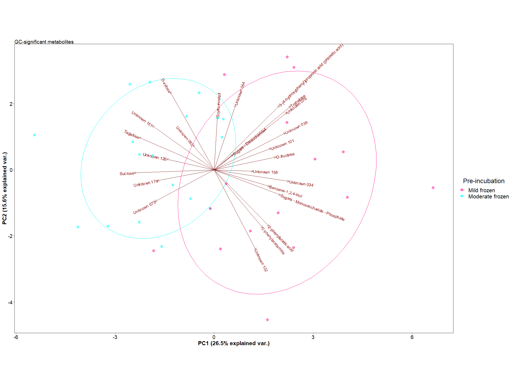<!-- -->

    ## 
    ## $gg_pca_inc_Sig

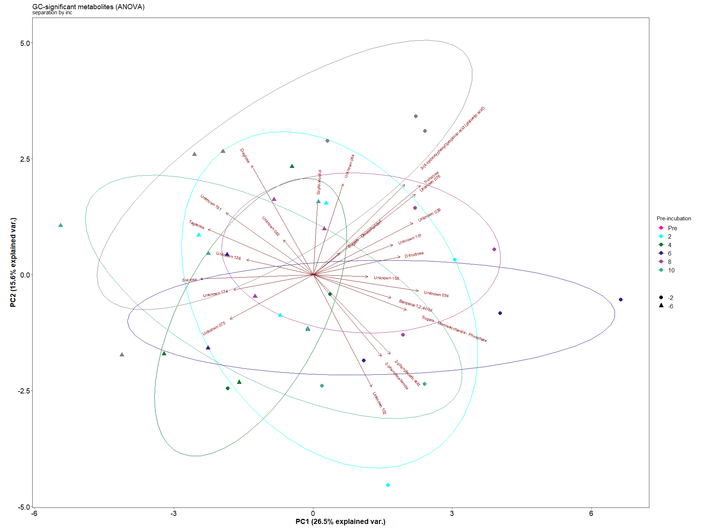<!-- -->

## LC

click to open

    ## $Stat_plot

<!-- -->

    ## 
    ## $LC_pos

<!-- -->

    ## 
    ## $LC_neg

<!-- -->

    ## 
    ## $LC_pos_unknown

<!-- -->

    ## 
    ## $LC_neg_unknown

<!-- -->

    ## 
    ## $LC_pos_sac

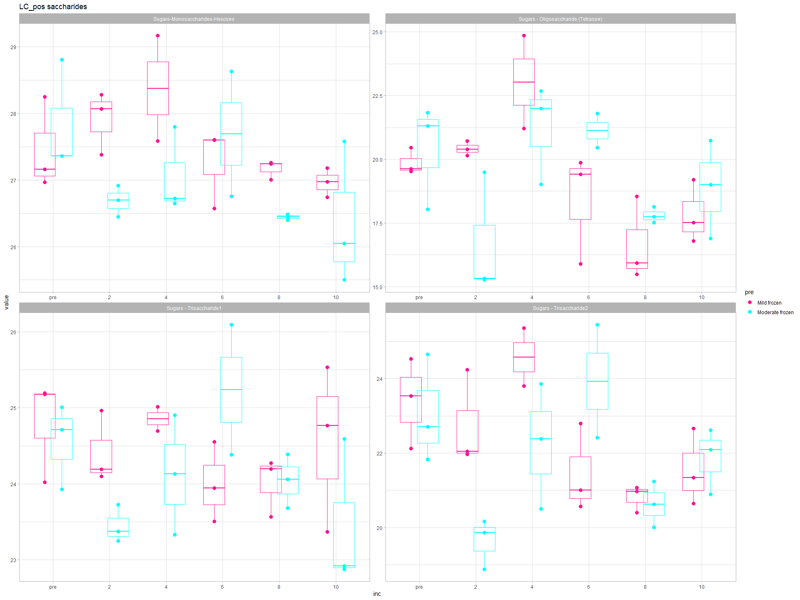<!-- -->

    ## 
    ## $LC_neg_sac

<!-- -->

    ## 
    ## $StatsLC
    ## 
    ## 
    ## |Name2                                                                                                                                         | Count_-2_pre| Count_-6_pre| Count_-2_2| Count_-6_2| Count_-2_4| Count_-6_4| Count_-2_6| Count_-6_6| Count_-2_8| Count_-6_8| Count_-2_10| Count_-6_10| Mean_-2_pre| Mean_-6_pre| Mean_-2_2| Mean_-6_2| Mean_-2_4| Mean_-6_4| Mean_-2_6| Mean_-6_6| Mean_-2_8| Mean_-6_8| Mean_-2_10| Mean_-6_10| P_value_A_-2_pre_vs_-6_pre| P_value_A_-2_2_vs_-6_2| P_value_A_-2_4_vs_-6_4| P_value_A_-2_6_vs_-6_6| P_value_A_-2_8_vs_-6_8| P_value_A_-2_10_vs_-6_10| Flag_A_-2_pre_vs_-6_pre| Flag_A_-2_2_vs_-6_2| Flag_A_-2_4_vs_-6_4| Flag_A_-2_6_vs_-6_6| Flag_A_-2_8_vs_-6_8| Flag_A_-2_10_vs_-6_10|
    ## |:---------------------------------------------------------------------------------------------------------------------------------------------|------------:|------------:|----------:|----------:|----------:|----------:|----------:|----------:|----------:|----------:|-----------:|-----------:|-----------:|-----------:|---------:|---------:|---------:|---------:|---------:|---------:|---------:|---------:|----------:|----------:|--------------------------:|----------------------:|----------------------:|----------------------:|----------------------:|------------------------:|-----------------------:|-------------------:|-------------------:|-------------------:|-------------------:|---------------------:|
    ## |2,2,6,6-Tetramethyl-4-piperidinol_pos                                                                                                         |            3|            3|          3|          3|          2|          3|          3|          2|          3|          3|           3|           3|    26.54361|    27.26495|  26.48631|  26.73608|  26.57989|  27.19938|  26.69490|  26.95508|  26.95325|  27.18328|   27.39823|   27.19948|                  0.0520793|              0.4844938|              0.1289446|              0.5144969|              0.5193018|                0.5772128|                       0|                   0|                   0|                   0|                   0|                     0|
    ## |4-Guanidinobutanoic acid_pos                                                                                                                  |            3|            3|          3|          3|          2|          3|          3|          2|          3|          3|           3|           3|    22.25969|    22.65174|  21.00392|  21.39598|  21.68588|  22.07793|  21.22707|  21.61912|  21.29657|  21.68863|   20.44289|   20.83494|                  0.5890704|              0.5890704|              0.6287546|              0.6287546|              0.5890704|                0.5890704|                       0|                   0|                   0|                   0|                   0|                     0|
    ## |Acetyl-L-carnitine_pos                                                                                                                        |            3|            3|          3|          3|          2|          3|          3|          2|          3|          3|           3|           3|    23.24909|    23.14808|  21.24164|  21.05488|  23.34582|  21.43265|  20.56942|  23.27323|  20.77851|  20.46039|   20.61049|   20.77982|                  0.9003604|              0.8170113|              0.0431888|              0.0061166|              0.6938144|                0.8338052|                       0|                   0|                   1|                  -1|                   0|                     0|
    ## |Adenine_pos                                                                                                                                   |            3|            3|          3|          3|          2|          3|          3|          2|          3|          3|           3|           3|    26.96489|    27.97850|  26.01415|  26.26313|  26.40806|  26.39957|  26.08890|  26.12093|  26.70550|  26.47612|   26.73900|   26.76606|                  0.0024643|              0.4101982|              0.9798012|              0.9239277|              0.4474959|                0.9281108|                      -1|                   0|                   0|                   0|                   0|                     0|
    ## |Adenosine_pos                                                                                                                                 |            3|            3|          3|          3|          2|          3|          3|          2|          3|          3|           3|           3|    29.40468|    29.83868|  29.61922|  29.61554|  29.82938|  29.63366|  30.00376|  29.45154|  30.41798|  29.97742|   30.20235|   30.35473|                  0.1934915|              0.9910310|              0.5939130|              0.1411175|              0.1870942|                0.6423161|                       0|                   0|                   0|                   0|                   0|                     0|
    ## |Betaine_pos                                                                                                                                   |            3|            3|          3|          3|          2|          3|          3|          2|          3|          3|           3|           3|    30.37585|    30.90589|  30.31092|  30.41028|  31.14100|  30.38145|  30.25174|  30.99433|  30.09187|  30.27994|   30.10516|   30.21260|                  0.0224730|              0.6499112|              0.0046874|              0.0055249|              0.3931438|                0.6236845|                      -1|                   0|                   1|                  -1|                   0|                     0|
    ## |Bis(methylbenzylidene)sorbitol_pos                                                                                                            |            3|            3|          3|          3|          2|          3|          3|          2|          3|          3|           3|           3|    22.09418|    22.06913|  22.32153|  22.29648|  22.01652|  21.99147|  22.44023|  22.41518|  22.56972|  22.54466|   22.56841|   22.54335|                  0.9605000|              0.9605000|              0.9646670|              0.9646670|              0.9605000|                0.9605000|                       0|                   0|                   0|                   0|                   0|                     0|
    ## |Choline_pos                                                                                                                                   |            3|            3|          3|          3|          2|          3|          3|          2|          3|          3|           3|           3|    29.39483|    29.61319|  29.62000|  29.74654|  29.34181|  29.42993|  29.66897|  29.49483|  29.88824|  29.68490|   29.88025|   29.98376|                  0.2218851|              0.4739765|              0.6544345|              0.3795698|              0.2542588|                0.5573241|                       0|                   0|                   0|                   0|                   0|                     0|
    ## |Cytosine_pos                                                                                                                                  |            3|            3|          3|          3|          2|          3|          3|          2|          3|          3|           3|           3|    26.17815|    26.89803|  25.49827|  25.89066|  25.86725|  25.45905|  25.84950|  25.39597|  25.97351|  25.39602|   25.80688|   25.88319|                  0.0711260|              0.3125280|              0.3466214|              0.2968520|              0.1424374|                0.8425262|                       0|                   0|                   0|                   0|                   0|                     0|
    ## |DEET_pos                                                                                                                                      |            3|            3|          3|          3|          2|          3|          3|          2|          3|          3|           3|           3|    22.02796|    21.91547|  21.00863|  22.07560|  21.40411|  21.77679|  21.86714|  22.29949|  21.68872|  22.21781|   21.95112|   20.52881|                  0.9106925|              0.2934989|              0.7398946|              0.7002486|              0.5989237|                0.1654636|                       0|                   0|                   0|                   0|                   0|                     0|
    ## |Deoxyadenosine_pos                                                                                                                            |            3|            3|          3|          3|          2|          3|          3|          2|          3|          3|           3|           3|    26.34094|    27.06624|  25.69422|  26.28048|  26.32621|  26.04705|  26.14789|  26.17518|  26.28486|  25.49033|   26.33797|   26.07132|                  0.1370051|              0.2253263|              0.6005281|              0.9590540|              0.1050210|                0.5761920|                       0|                   0|                   0|                   0|                   0|                     0|
    ## |Deoxycarnitine_pos                                                                                                                            |            3|            3|          3|          3|          2|          3|          3|          2|          3|          3|           3|           3|    26.33929|    26.70156|  26.53300|  26.54865|  27.34038|  26.77203|  26.70212|  26.58192|  26.49978|  26.44219|   26.10095|   26.44210|                  0.2906622|              0.9631121|              0.1429393|              0.7510046|              0.8649175|                0.3190191|                       0|                   0|                   0|                   0|                   0|                     0|
    ## |Diethanolamine_pos                                                                                                                            |            3|            3|          3|          3|          2|          3|          3|          2|          3|          3|           3|           3|    24.87103|    25.20553|  24.89039|  25.01185|  24.82863|  24.64199|  24.63505|  25.11292|  25.94032|  25.79440|   26.12915|   25.58097|                  0.5069444|              0.8087537|              0.7395484|              0.3979802|              0.7712928|                0.2808536|                       0|                   0|                   0|                   0|                   0|                     0|
    ## |DL-?-Leucine_pos                                                                                                                              |            3|            3|          3|          3|          2|          3|          3|          2|          3|          3|           3|           3|    25.84217|    25.94343|  25.97626|  25.54163|  27.01912|  25.81361|  25.63647|  26.03724|  25.31286|  25.21297|   25.25017|   24.71005|                  0.7623018|              0.2022367|              0.0035785|              0.2900649|              0.7654003|                0.1165976|                       0|                   0|                   1|                   0|                   0|                     0|
    ## |DL-Arginine_pos                                                                                                                               |            3|            3|          3|          3|          2|          3|          3|          2|          3|          3|           3|           3|    21.62513|    21.59087|  20.12944|  19.58204|  25.65526|  20.27643|  19.58133|  22.59754|  19.82514|  19.57312|   19.62610|   20.51158|                  0.9780903|              0.6615194|              0.0007685|              0.0396426|              0.8399762|                0.4803725|                       0|                   0|                   1|                  -1|                   0|                     0|
    ## |DL-Carnitine_pos                                                                                                                              |            3|            3|          3|          3|          2|          3|          3|          2|          3|          3|           3|           3|    27.96700|    27.89547|  27.75568|  27.08025|  28.57764|  27.99689|  27.65647|  28.36588|  27.30761|  27.55177|   27.37808|   27.33397|                  0.7630135|              0.0086372|              0.0372592|              0.0128378|              0.3086699|                0.8523812|                       0|                   1|                   1|                  -1|                   0|                     0|
    ## |DL-Citrulline_pos                                                                                                                             |            3|            3|          3|          3|          2|          3|          3|          2|          3|          3|           3|           3|    21.41050|    22.90241|  22.39754|  20.36634|  24.20788|  21.82290|  21.08625|  22.36580|  20.30969|  20.82022|   20.87179|   20.70847|                  0.0991680|              0.0285190|              0.0221407|              0.2001790|              0.5617694|                0.8522427|                       0|                   1|                   1|                   0|                   0|                     0|
    ## |DL-Glutamine_pos                                                                                                                              |            3|            3|          3|          3|          2|          3|          3|          2|          3|          3|           3|           3|    24.05177|    24.18758|  23.98617|  23.12792|  25.26040|  23.75587|  23.20355|  24.63840|  23.14978|  23.03266|   22.81407|   23.45294|                  0.8138970|              0.1464129|              0.0275259|              0.0346925|              0.8391013|                0.2745102|                       0|                   0|                   1|                  -1|                   0|                     0|
    ## |DL-Isoleucine/Leucine_pos                                                                                                                     |            3|            3|          3|          3|          2|          3|          3|          2|          3|          3|           3|           3|    26.13502|    26.48524|  25.83620|  26.48893|  27.63288|  26.19677|  25.82085|  27.36128|  25.76279|  26.18085|   25.95736|   25.68766|                  0.3758131|              0.1061737|              0.0031451|              0.0017684|              0.2922583|                0.4936424|                       0|                   0|                   1|                  -1|                   0|                     0|
    ## |DL-Proline_pos                                                                                                                                |            3|            3|          3|          3|          2|          3|          3|          2|          3|          3|           3|           3|    23.61296|    24.11249|  22.98149|  23.47365|  23.95106|  23.38158|  22.60624|  23.91453|  22.45812|  22.84850|   22.67263|   22.55652|                  0.0682855|              0.0721504|              0.0634079|              0.0001817|              0.1482638|                0.6602006|                       0|                   0|                   0|                  -1|                   0|                     0|
    ## |DL-Stachydrine_pos                                                                                                                            |            3|            3|          3|          3|          2|          3|          3|          2|          3|          3|           3|           3|    25.07429|    25.18644|  24.77103|  24.26062|  26.43399|  24.75171|  24.75651|  25.95950|  24.29915|  24.21496|   24.05813|   24.35157|                  0.7872157|              0.2267495|              0.0013573|              0.0155839|              0.8393618|                0.4821625|                       0|                   0|                   1|                  -1|                   0|                     0|
    ## |Glycerophosphocholine_pos                                                                                                                     |            3|            3|          3|          3|          2|          3|          3|          2|          3|          3|           3|           3|    19.45596|    19.64270|  18.63960|  17.68826|  22.22813|  18.91108|  18.63477|  20.21569|  17.92649|  17.91121|   18.22855|   17.45755|                  0.8622269|              0.3807294|              0.0106841|              0.1972888|              0.9886614|                0.4761308|                       0|                   0|                   1|                   0|                   0|                     0|
    ## |HOTrE_pos                                                                                                                                     |            3|            3|          3|          3|          2|          3|          3|          2|          3|          3|           3|           3|    23.43445|    23.73069|  22.62694|  23.47769|  23.44648|  22.98221|  22.41789|  23.41677|  22.95182|  22.67839|   23.08916|   22.90756|                  0.3311996|              0.0092365|              0.1775838|              0.0066446|              0.3690037|                0.5486808|                       0|                  -1|                   0|                  -1|                   0|                     0|
    ## |Hypoxanthine_pos                                                                                                                              |            3|            3|          3|          3|          2|          3|          3|          2|          3|          3|           3|           3|    26.24439|    27.13401|  23.94671|  24.51148|  24.38185|  25.04389|  24.79070|  24.02310|  24.72021|  24.30623|   24.84414|   24.31658|                  0.1223503|              0.3187712|              0.2964245|              0.2280102|              0.4625336|                0.3510103|                       0|                   0|                   0|                   0|                   0|                     0|
    ## |LL-2,6-Diaminheptanedioic acid_pos                                                                                                            |            3|            3|          3|          3|          2|          3|          3|          2|          3|          3|           3|           3|    23.95421|    24.17509|  23.36027|  22.46664|  25.14174|  23.45238|  22.79200|  24.52665|  22.44642|  22.47442|   22.03390|   22.65785|                  0.6944393|              0.1215774|              0.0124230|              0.0105336|              0.9602142|                0.2729679|                       0|                   0|                   1|                  -1|                   0|                     0|
    ## |L-Pyroglutamic acid_pos                                                                                                                       |            3|            3|          3|          3|          2|          3|          3|          2|          3|          3|           3|           3|    24.05177|    24.18758|  23.98617|  23.12792|  25.26040|  23.75587|  23.20355|  24.63840|  23.14978|  23.03266|   22.81407|   23.45294|                  0.8138970|              0.1464129|              0.0275259|              0.0346925|              0.8391013|                0.2745102|                       0|                   0|                   1|                  -1|                   0|                     0|
    ## |N-alpha-Acetyl-L-Lysine_pos                                                                                                                   |            3|            3|          3|          3|          2|          3|          3|          2|          3|          3|           3|           3|    28.54953|    28.44916|  28.69459|  27.65847|  29.56672|  28.22629|  28.53150|  29.60662|  28.19103|  28.15849|   28.29170|   27.03441|                  0.7825099|              0.0086000|              0.0029801|              0.0137599|              0.9286324|                0.0020214|                       0|                   1|                   1|                  -1|                   0|                     1|
    ## |N-Methyl-D-Aspartic acid_pos                                                                                                                  |            3|            3|          3|          3|          2|          3|          3|          2|          3|          3|           3|           3|    25.13697|    25.05452|  24.28199|  24.09796|  25.71293|  24.53226|  24.42114|  25.10077|  24.67284|  24.58275|   24.71808|   25.01885|                  0.8244586|              0.6213196|              0.0087903|              0.1121035|              0.8085018|                0.4216237|                       0|                   0|                   1|                   0|                   0|                     0|
    ## |Oleamide_pos                                                                                                                                  |            3|            3|          3|          3|          2|          3|          3|          2|          3|          3|           3|           3|    21.54706|    22.31688|  21.89582|  22.66564|  21.01942|  21.78924|  21.25331|  22.02313|  21.57259|  22.34241|   20.52382|   21.29365|                  0.1449548|              0.1449548|              0.1902038|              0.1902038|              0.1449548|                0.1449548|                       0|                   0|                   0|                   0|                   0|                     0|
    ## |Senecionine_pos                                                                                                                               |            3|            3|          3|          3|          2|          3|          3|          2|          3|          3|           3|           3|    22.32168|    19.57327|  21.05559|  21.72760|  23.68258|  19.37408|  19.39294|  22.44927|  21.33945|  21.35008|   22.77610|   21.53701|                  0.2958407|              0.7958836|              0.1474467|              0.2983738|              0.9967317|                0.6340156|                       0|                   0|                   0|                   0|                   0|                     0|
    ## |Sugars - Oligosaccharide (Tetraose)_pos                                                                                                       |            3|            3|          3|          3|          2|          3|          3|          2|          3|          3|           3|           3|    19.86635|    20.39484|  20.42254|  16.69847|  23.03165|  21.23355|  18.39093|  21.12820|  16.65585|  17.79442|   17.83441|   18.87821|                  0.7025603|              0.0123301|              0.2516418|              0.0868519|              0.4135240|                0.4529142|                       0|                   1|                   0|                   0|                   0|                     0|
    ## |Sugars - Trisaccharide1_pos                                                                                                                   |            3|            3|          3|          3|          2|          3|          3|          2|          3|          3|           3|           3|    24.79720|    24.55023|  24.41638|  23.44883|  24.85623|  24.12020|  24.00038|  25.23644|  24.01174|  24.04174|   24.55616|   23.46196|                  0.6623662|              0.0969160|              0.2506817|              0.0601913|              0.9576119|                0.0626663|                       0|                   0|                   0|                   0|                   0|                     0|
    ## |Sugars - Trisaccharide2_pos                                                                                                                   |            3|            3|          3|          3|          2|          3|          3|          2|          3|          3|           3|           3|    23.39637|    23.05896|  22.74781|  19.63585|  24.57352|  22.24254|  21.45415|  23.92496|  20.81399|  20.62450|   21.55249|   21.86631|                  0.7277104|              0.0036505|              0.0403186|              0.0306679|              0.8448185|                0.7460130|                       0|                   1|                   1|                  -1|                   0|                     0|
    ## |Sugars-Monosaccharides-Hexoses_pos                                                                                                            |            3|            3|          3|          3|          2|          3|          3|          2|          3|          3|           3|           3|    27.45946|    27.84267|  27.91085|  26.68758|  28.37930|  27.05731|  27.25848|  27.69216|  27.16949|  26.44450|   26.96305|   26.37668|                  0.4920544|              0.0362384|              0.0422878|              0.4868318|              0.1997852|                0.2965999|                       0|                   1|                   1|                   0|                   0|                     0|
    ## |Thymine_pos                                                                                                                                   |            3|            3|          3|          3|          2|          3|          3|          2|          3|          3|           3|           3|    24.75733|    25.79591|  24.85261|  25.07607|  25.53130|  24.94003|  25.36326|  25.27384|  25.66433|  25.18512|   25.50323|   25.28405|                  0.0015313|              0.4448426|              0.0791059|              0.7832512|              0.1093953|                0.4535114|                      -1|                   0|                   0|                   0|                   0|                     0|
    ## |Unknown 001_pos                                                                                                                               |            3|            3|          3|          3|          2|          3|          3|          2|          3|          3|           3|           3|    20.16612|    19.12515|  18.49445|  20.15386|  19.25875|  19.08937|  19.30074|  18.72458|  20.27306|  18.20530|   18.36873|   19.22053|                  0.4924793|              0.2778425|              0.9200083|              0.7329554|              0.1794762|                0.5736702|                       0|                   0|                   0|                   0|                   0|                     0|
    ## |Unknown 002_pos                                                                                                                               |            3|            3|          3|          3|          2|          3|          3|          2|          3|          3|           3|           3|    20.95074|    21.00073|  20.97009|  21.02008|  20.91679|  20.96678|  20.58933|  20.63932|  21.02546|  21.07545|   19.74089|   19.79089|                  0.9385019|              0.9385019|              0.9449828|              0.9449828|              0.9385019|                0.9385019|                       0|                   0|                   0|                   0|                   0|                     0|
    ## |Unknown 003_pos                                                                                                                               |            3|            3|          3|          3|          2|          3|          3|          2|          3|          3|           3|           3|    21.72013|    21.50193|  21.10925|  22.16448|  21.61719|  21.19194|  20.89251|  21.23165|  21.23241|  20.41355|   20.21616|   19.96838|                  0.7231183|              0.0966474|              0.5380511|              0.6228236|              0.1917795|                0.6875738|                       0|                   0|                   0|                   0|                   0|                     0|
    ## |Unknown 004_pos                                                                                                                               |            3|            3|          3|          3|          2|          3|          3|          2|          3|          3|           3|           3|    21.43344|    20.22605|  23.24012|  23.35540|  15.09611|  22.08229|  23.32165|  16.40216|  23.31310|  23.36444|   23.40659|   23.01883|                  0.3747805|              0.9318572|              0.0001123|              0.0001252|              0.9696191|                0.7738177|                       0|                   0|                  -1|                   1|                   0|                     0|
    ## |Unknown 005_pos                                                                                                                               |            3|            3|          3|          3|          2|          3|          3|          2|          3|          3|           3|           3|    18.17968|    17.87527|  18.04680|  17.74239|  17.95331|  17.64890|  18.83809|  18.53368|  18.62598|  18.32157|   18.54209|   18.23768|                  0.8097686|              0.8097686|              0.8295027|              0.8295027|              0.8097686|                0.8097686|                       0|                   0|                   0|                   0|                   0|                     0|
    ## |Unknown 006_pos                                                                                                                               |            3|            3|          3|          3|          2|          3|          3|          2|          3|          3|           3|           3|    20.01574|    20.04509|  19.16486|  20.22538|  20.60743|  19.50841|  19.86845|  18.78672|  19.18257|  19.41828|   19.50020|   20.42482|                  0.9733184|              0.2345295|              0.2694364|              0.2768291|              0.7884160|                0.2981302|                       0|                   0|                   0|                   0|                   0|                     0|
    ## |Unknown 007_pos                                                                                                                               |            3|            3|          3|          3|          2|          3|          3|          2|          3|          3|           3|           3|    22.10792|    21.94500|  22.20987|  22.78501|  22.14921|  22.14652|  22.42942|  22.69246|  22.72369|  22.44235|   22.73167|   22.35342|                  0.5709103|              0.0545137|              0.9933193|              0.4150075|              0.3312772|                0.1953150|                       0|                   0|                   0|                   0|                   0|                     0|
    ## |Unknown 008_pos                                                                                                                               |            3|            3|          3|          3|          2|          3|          3|          2|          3|          3|           3|           3|    22.10792|    21.94500|  22.20987|  22.78501|  22.14921|  22.14652|  22.42942|  22.69246|  22.72369|  22.44235|   22.73167|   22.35342|                  0.5709103|              0.0545137|              0.9933193|              0.4150075|              0.3312772|                0.1953150|                       0|                   0|                   0|                   0|                   0|                     0|
    ## |Unknown 009_pos                                                                                                                               |            3|            3|          3|          3|          2|          3|          3|          2|          3|          3|           3|           3|    22.79175|    22.51658|  22.76195|  23.41001|  22.56106|  22.78058|  23.20873|  22.99132|  23.44474|  23.32215|   23.41919|   22.93855|                  0.2954089|              0.0193114|              0.4525214|              0.4568326|              0.6376922|                0.0745309|                       0|                  -1|                   0|                   0|                   0|                     0|
    ## |Unknown 010_pos                                                                                                                               |            3|            3|          3|          3|          2|          3|          3|          2|          3|          3|           3|           3|    21.89065|    22.44066|  22.14136|  22.53519|  22.57894|  22.43045|  22.25779|  22.71541|  22.65877|  22.29470|   22.92032|   22.44312|                  0.1755567|              0.3271313|              0.7385770|              0.3089031|              0.3642430|                0.2374678|                       0|                   0|                   0|                   0|                   0|                     0|
    ## |Unknown 011_pos                                                                                                                               |            3|            3|          3|          3|          2|          3|          3|          2|          3|          3|           3|           3|    21.75536|    21.78349|  21.99056|  22.82110|  22.36903|  22.26381|  22.28712|  22.38526|  22.56111|  22.21539|   22.39205|   22.03103|                  0.9249254|              0.0100947|              0.7527869|              0.7688940|              0.2538834|                0.2340979|                       0|                  -1|                   0|                   0|                   0|                     0|
    ## |Unknown 012_pos                                                                                                                               |            3|            3|          3|          3|          2|          3|          3|          2|          3|          3|           3|           3|    21.75536|    21.78349|  21.99056|  22.82110|  22.36903|  22.26381|  22.28712|  22.38526|  22.56111|  22.21539|   22.39205|   22.03103|                  0.9249254|              0.0100947|              0.7527869|              0.7688940|              0.2538834|                0.2340979|                       0|                  -1|                   0|                   0|                   0|                     0|
    ## |Unknown 013_pos                                                                                                                               |            3|            3|          3|          3|          2|          3|          3|          2|          3|          3|           3|           3|    20.96111|    21.95778|  21.34215|  21.52778|  21.16801|  18.81660|  20.64269|  21.19003|  21.00084|  21.55683|   21.53766|   20.78412|                  0.3603341|              0.8634650|              0.0613890|              0.6508248|              0.6074680|                0.4874098|                       0|                   0|                   0|                   0|                   0|                     0|
    ## |Unknown 014_pos                                                                                                                               |            3|            3|          3|          3|          2|          3|          3|          2|          3|          3|           3|           3|    23.84665|    23.88750|  23.41672|  24.04842|  24.63744|  23.83898|  23.59391|  24.96587|  24.40309|  25.08580|   25.32946|   24.05091|                  0.9654782|              0.5055383|              0.4522581|              0.2020859|              0.4721657|                0.1845066|                       0|                   0|                   0|                   0|                   0|                     0|
    ## |Unknown 015_pos                                                                                                                               |            3|            3|          3|          3|          2|          3|          3|          2|          3|          3|           3|           3|    23.80920|    23.36732|  23.41622|  24.41903|  24.10717|  23.58164|  23.72156|  24.20408|  24.12137|  24.44054|   24.20873|   23.30578|                  0.3464611|              0.0399578|              0.3172223|              0.3575916|              0.4943826|                0.0620443|                       0|                  -1|                   0|                   0|                   0|                     0|
    ## |Unknown 016_pos                                                                                                                               |            3|            3|          3|          3|          2|          3|          3|          2|          3|          3|           3|           3|    21.23679|    21.12117|  21.01819|  21.38228|  21.45916|  21.23497|  21.47812|  21.80432|  21.63793|  21.70455|   21.97256|   21.39980|                  0.6753037|              0.1949272|              0.4693497|              0.2956578|              0.8090045|                0.0471228|                       0|                   0|                   0|                   0|                   0|                     1|
    ## |Unknown 017_pos                                                                                                                               |            3|            3|          3|          3|          2|          3|          3|          2|          3|          3|           3|           3|    22.51740|    22.50834|  22.39219|  22.88088|  22.91571|  22.63251|  22.94838|  22.71332|  23.57926|  22.54975|   22.90253|   22.90758|                  0.9882315|              0.4297487|              0.6807455|              0.7325604|              0.1042433|                0.9934411|                       0|                   0|                   0|                   0|                   0|                     0|
    ## |Unknown 018_pos                                                                                                                               |            3|            3|          3|          3|          2|          3|          3|          2|          3|          3|           3|           3|    22.71491|    23.07076|  22.63915|  23.10483|  23.20342|  22.75689|  22.65311|  23.21540|  22.79325|  22.57012|   22.66235|   22.77919|                  0.2378240|              0.1265557|              0.1870051|              0.1003942|              0.4548049|                0.6941580|                       0|                   0|                   0|                   0|                   0|                     0|
    ## |Unknown 019_pos                                                                                                                               |            3|            3|          3|          3|          2|          3|          3|          2|          3|          3|           3|           3|    22.82265|    23.10151|  22.21346|  23.06030|  22.74370|  22.53094|  22.27094|  22.68089|  22.38988|  22.22252|   22.68838|   22.54198|                  0.2771903|              0.0026725|              0.4551025|              0.1570243|              0.5106233|                0.5645048|                       0|                  -1|                   0|                   0|                   0|                     0|
    ## |Unknown 020_pos                                                                                                                               |            3|            3|          3|          3|          2|          3|          3|          2|          3|          3|           3|           3|    23.27499|    24.29113|  24.39086|  24.75881|  24.55793|  23.67675|  22.97343|  23.69974|  22.87652|  23.67375|   22.69094|   23.51875|                  0.2087161|              0.6437136|              0.3260516|              0.4165772|              0.3206353|                0.3028493|                       0|                   0|                   0|                   0|                   0|                     0|
    ## |Unknown 021_pos                                                                                                                               |            3|            3|          3|          3|          2|          3|          3|          2|          3|          3|           3|           3|    23.44290|    24.13685|  24.59466|  24.76689|  23.98984|  24.68305|  24.64966|  24.34129|  24.80449|  25.07060|   25.23031|   24.84695|                  0.1238778|              0.6951331|              0.1669100|              0.5314003|              0.5458304|                0.3863405|                       0|                   0|                   0|                   0|                   0|                     0|
    ## |Unknown 022_pos                                                                                                                               |            3|            3|          3|          3|          2|          3|          3|          2|          3|          3|           3|           3|    19.09329|    21.73768|  18.89789|  20.09613|  21.92251|  21.30367|  18.90689|  20.05870|  20.26294|  20.02102|   19.83566|   20.77454|                  0.0401045|              0.3336284|              0.6524021|              0.4045194|              0.8436344|                0.4468372|                      -1|                   0|                   0|                   0|                   0|                     0|
    ## |Unknown 023_pos                                                                                                                               |            3|            3|          3|          3|          2|          3|          3|          2|          3|          3|           3|           3|    18.89399|    21.82048|  19.26313|  21.04688|  21.86633|  20.92839|  19.03814|  19.52884|  20.55546|  19.83756|   19.65964|   21.29745|                  0.0648095|              0.2487263|              0.5829893|              0.7733791|              0.6381673|                0.2884191|                       0|                   0|                   0|                   0|                   0|                     0|
    ## |Unknown 024_pos                                                                                                                               |            3|            3|          3|          3|          2|          3|          3|          2|          3|          3|           3|           3|    22.11570|    21.57051|  23.34261|  23.62788|  17.65570|  22.44920|  23.99101|  19.14449|  24.66458|  24.18284|   24.62805|   24.08830|                  0.6388559|              0.8056722|              0.0011283|              0.0010206|              0.6782062|                0.6421921|                       0|                   0|                  -1|                   1|                   0|                     0|
    ## |Unknown 025_pos                                                                                                                               |            3|            3|          3|          3|          2|          3|          3|          2|          3|          3|           3|           3|    22.73490|    22.14934|  22.06155|  22.90674|  24.13470|  22.45184|  22.33833|  22.99645|  22.49263|  22.87007|   22.08737|   22.32529|                  0.4562236|              0.2854714|              0.0640792|              0.4538891|              0.6297632|                0.7608577|                       0|                   0|                   0|                   0|                   0|                     0|
    ## |Unknown 026_pos                                                                                                                               |            3|            3|          3|          3|          2|          3|          3|          2|          3|          3|           3|           3|    22.82676|    23.13922|  22.78275|  22.87022|  23.07903|  23.48924|  23.22154|  23.38463|  23.58320|  23.15386|   23.98231|   23.31036|                  0.5614426|              0.8704008|              0.4959556|              0.7856759|              0.4265134|                0.2180472|                       0|                   0|                   0|                   0|                   0|                     0|
    ## |Unknown 027_pos                                                                                                                               |            3|            3|          3|          3|          2|          3|          3|          2|          3|          3|           3|           3|    21.24847|    23.18726|  20.37362|  22.31420|  22.59971|  22.04976|  20.92438|  22.22010|  21.75856|  21.56930|   20.65974|   23.07661|                  0.0992883|              0.0989958|              0.6666336|              0.3147838|              0.8681177|                0.0432175|                       0|                   0|                   0|                   0|                   0|                    -1|
    ## |Unknown 028_pos                                                                                                                               |            3|            3|          3|          3|          2|          3|          3|          2|          3|          3|           3|           3|    21.55690|    21.16407|  21.20535|  22.06889|  21.86136|  21.60137|  22.26143|  22.22143|  22.82384|  21.92274|   22.64297|   22.59183|                  0.3871981|              0.0653939|              0.6067246|              0.9366946|              0.0553175|                0.9095974|                       0|                   0|                   0|                   0|                   0|                     0|
    ## |Unknown 029_pos                                                                                                                               |            3|            3|          3|          3|          2|          3|          3|          2|          3|          3|           3|           3|    21.66652|    22.31928|  23.37042|  22.76415|  24.08540|  22.57902|  22.48814|  23.01745|  22.66837|  22.67442|   22.23955|   22.50598|                  0.1663084|              0.1972578|              0.0073185|              0.3104053|              0.9895276|                0.5649500|                       0|                   0|                   1|                   0|                   0|                     0|
    ## |Unknown 030_pos                                                                                                                               |            3|            3|          3|          3|          2|          3|          3|          2|          3|          3|           3|           3|    21.57890|    23.17916|  21.90575|  22.78945|  23.43643|  22.55857|  21.88691|  22.90700|  22.23690|  22.69653|   22.71673|   23.80749|                  0.0362006|              0.2309658|              0.2855230|              0.2166673|              0.5282840|                0.1425978|                      -1|                   0|                   0|                   0|                   0|                     0|
    ## |Unknown 031_pos                                                                                                                               |            3|            3|          3|          3|          2|          3|          3|          2|          3|          3|           3|           3|    22.84158|    25.15195|  23.09153|  24.11347|  25.27522|  24.80439|  23.08176|  22.93584|  24.52398|  24.79532|   23.63936|   24.84264|                  0.0159845|              0.2606781|              0.6389466|              0.8841279|              0.7620831|                0.1877997|                      -1|                   0|                   0|                   0|                   0|                     0|
    ## |Unknown 032_pos                                                                                                                               |            3|            3|          3|          3|          2|          3|          3|          2|          3|          3|           3|           3|    21.82043|    24.21157|  21.31106|  22.69371|  24.30741|  23.28196|  22.09431|  23.22032|  22.02654|  23.43336|   22.34357|   24.86285|                  0.1132524|              0.3505451|              0.5334451|              0.4944784|              0.3423599|                0.0962095|                       0|                   0|                   0|                   0|                   0|                     0|
    ## |Unknown 033_pos                                                                                                                               |            3|            3|          3|          3|          2|          3|          3|          2|          3|          3|           3|           3|    23.36330|    23.08431|  23.60866|  23.32968|  23.22567|  22.94669|  23.89661|  23.61763|  23.34793|  23.06894|   23.57106|   23.29207|                  0.7969730|              0.7969730|              0.8179818|              0.8179818|              0.7969730|                0.7969730|                       0|                   0|                   0|                   0|                   0|                     0|
    ## |Unknown 034_pos                                                                                                                               |            3|            3|          3|          3|          2|          3|          3|          2|          3|          3|           3|           3|    20.87174|    23.29421|  21.72650|  22.25363|  23.89010|  21.92709|  21.32495|  23.13144|  21.91839|  22.87391|   22.62045|   24.05714|                  0.0539304|              0.6620141|              0.1541390|              0.1881589|              0.4304466|                0.2399924|                       0|                   0|                   0|                   0|                   0|                     0|
    ## |Unknown 035_pos                                                                                                                               |            3|            3|          3|          3|          2|          3|          3|          2|          3|          3|           3|           3|    21.67781|    21.46241|  21.51874|  22.10953|  22.17664|  21.96499|  22.02020|  23.22675|  22.16515|  22.45223|   22.47042|   22.40614|                  0.7216146|              0.3330136|              0.7541063|              0.0842795|              0.6352690|                0.9152118|                       0|                   0|                   0|                   0|                   0|                     0|
    ## |Unknown 036_pos                                                                                                                               |            3|            3|          3|          3|          2|          3|          3|          2|          3|          3|           3|           3|    21.05232|    19.46327|  20.05492|  23.01809|  16.85421|  21.59279|  21.05092|  16.79455|  22.61108|  21.52912|   23.93998|   21.75545|                  0.3543159|              0.0915379|              0.0193361|              0.0335699|              0.5260624|                0.2067879|                       0|                   0|                  -1|                   1|                   0|                     0|
    ## |Unknown 037_pos                                                                                                                               |            3|            3|          3|          3|          2|          3|          3|          2|          3|          3|           3|           3|    21.46445|    19.68720|  20.46537|  23.39044|  16.81301|  21.97731|  21.53109|  16.75335|  23.03655|  21.77609|   24.08747|   22.13905|                  0.3079276|              0.0998637|              0.0127089|              0.0199394|              0.4669702|                0.2647988|                       0|                   0|                  -1|                   1|                   0|                     0|
    ## |Unknown 038_pos                                                                                                                               |            3|            3|          3|          3|          2|          3|          3|          2|          3|          3|           3|           3|    20.45990|    19.54447|  20.66380|  20.98521|  22.57721|  20.13476|  20.45269|  20.91059|  21.02934|  19.46875|   20.37028|   20.49564|                  0.4706122|              0.7989835|              0.0937062|              0.7456727|              0.2238799|                0.9208323|                       0|                   0|                   0|                   0|                   0|                     0|
    ## |Unknown 039_pos                                                                                                                               |            3|            3|          3|          3|          2|          3|          3|          2|          3|          3|           3|           3|    24.09448|    23.69739|  23.86542|  23.05421|  24.74655|  23.02995|  23.09546|  24.43602|  23.72909|  24.00971|   24.06640|   24.25792|                  0.5066395|              0.1817089|              0.0159752|              0.0536954|              0.6379984|                0.7477987|                       0|                   0|                   1|                   0|                   0|                     0|
    ## |Unknown 040_pos                                                                                                                               |            3|            3|          3|          3|          2|          3|          3|          2|          3|          3|           3|           3|    23.08019|    23.29193|  23.25101|  23.19443|  24.09982|  23.91494|  23.12775|  24.21228|  23.95967|  24.29813|   24.49441|   23.75836|                  0.6580419|              0.9056533|              0.7293631|              0.0518841|              0.4807781|                0.1330895|                       0|                   0|                   0|                   0|                   0|                     0|
    ## |Unknown 041_pos                                                                                                                               |            3|            3|          3|          3|          2|          3|          3|          2|          3|          3|           3|           3|    28.18779|    28.66865|  28.55464|  28.28731|  28.94823|  29.01598|  28.43108|  29.08573|  28.92438|  29.27191|   29.59452|   29.02050|                  0.2029181|              0.4733357|              0.8701522|              0.1242848|              0.3531728|                0.1314652|                       0|                   0|                   0|                   0|                   0|                     0|
    ## |Unknown 042_pos                                                                                                                               |            3|            3|          3|          3|          2|          3|          3|          2|          3|          3|           3|           3|    21.97363|    22.43221|  21.88297|  24.40259|  22.02032|  23.18905|  22.82623|  22.64043|  21.98067|  23.30911|   21.99290|   22.65172|                  0.5526982|              0.0031633|              0.1831307|              0.8290426|              0.0946357|                0.3956959|                       0|                  -1|                   0|                   0|                   0|                     0|
    ## |Unknown 043_pos                                                                                                                               |            3|            3|          3|          3|          2|          3|          3|          2|          3|          3|           3|           3|    21.86132|    24.04322|  20.32662|  22.07754|  21.77847|  21.58205|  20.19662|  21.04954|  19.40956|  21.85755|   19.25462|   22.95566|                  0.0714968|              0.1428533|              0.8801979|              0.5147905|              0.0450976|                0.0040160|                       0|                   0|                   0|                   0|                  -1|                    -1|
    ## |Unknown 044_pos                                                                                                                               |            3|            3|          3|          3|          2|          3|          3|          2|          3|          3|           3|           3|    22.39373|    21.99082|  21.64168|  21.55013|  20.59084|  22.37934|  20.14273|  23.50543|  19.90306|  20.50444|   21.94122|   20.53883|                  0.8217648|              0.9591539|              0.3751779|              0.1028658|              0.7368664|                0.4359394|                       0|                   0|                   0|                   0|                   0|                     0|
    ## |Unknown 045_pos                                                                                                                               |            3|            3|          3|          3|          2|          3|          3|          2|          3|          3|           3|           3|    27.14073|    25.52282|  27.44310|  27.97429|  21.97893|  27.15448|  27.77344|  21.83119|  28.17657|  25.68924|   28.15632|   27.92734|                  0.1577370|              0.6358462|              0.0003844|              0.0000847|              0.0348967|                0.8379238|                       0|                   0|                  -1|                   1|                   1|                     0|
    ## |Unknown 046_pos                                                                                                                               |            3|            3|          3|          3|          2|          3|          3|          2|          3|          3|           3|           3|    25.51838|    23.50796|  25.80399|  26.10349|  19.93356|  25.29003|  26.13076|  19.50140|  26.31158|  23.66130|   26.37181|   26.11135|                  0.1201632|              0.8118873|              0.0008625|              0.0000924|              0.0444696|                0.8360099|                       0|                   0|                  -1|                   1|                   1|                     0|
    ## |Unknown 047_pos                                                                                                                               |            3|            3|          3|          3|          2|          3|          3|          2|          3|          3|           3|           3|    26.72409|    24.89153|  27.04457|  27.51742|  20.55157|  26.61820|  27.28839|  21.11606|  27.55082|  24.96122|   27.64037|   27.40972|                  0.1468076|              0.7016957|              0.0001994|              0.0001650|              0.0450344|                0.8515987|                       0|                   0|                  -1|                   1|                   1|                     0|
    ## |Unknown 048_pos                                                                                                                               |            3|            3|          3|          3|          2|          3|          3|          2|          3|          3|           3|           3|    24.17464|    23.43893|  25.84253|  26.28315|  19.37083|  24.66947|  26.07296|  21.19538|  26.65269|  26.45747|   26.53005|   26.28725|                  0.5428388|              0.7147706|              0.0006304|              0.0013590|              0.8712149|                0.8402320|                       0|                   0|                  -1|                   1|                   0|                     0|
    ## |Unknown 049_pos                                                                                                                               |            3|            3|          3|          3|          2|          3|          3|          2|          3|          3|           3|           3|    30.22210|    30.36882|  30.73291|  30.87963|  30.62651|  30.77323|  30.83702|  30.98374|  30.73088|  30.87760|   31.08019|   31.22690|                  0.6423596|              0.6423596|              0.6777166|              0.6777166|              0.6423596|                0.6423596|                       0|                   0|                   0|                   0|                   0|                     0|
    ## |Unknown 050_pos                                                                                                                               |            3|            3|          3|          3|          2|          3|          3|          2|          3|          3|           3|           3|    27.08192|    27.30587|  27.47052|  27.93353|  27.27113|  27.40694|  27.52240|  27.73721|  27.93594|  27.54041|   27.90252|   27.56665|                  0.4915324|              0.1621800|              0.7079804|              0.5545213|              0.2296511|                0.3054819|                       0|                   0|                   0|                   0|                   0|                     0|
    ## |Unknown 051_pos                                                                                                                               |            3|            3|          3|          3|          2|          3|          3|          2|          3|          3|           3|           3|    23.12319|    23.44384|  23.46618|  24.14640|  23.48659|  23.77593|  23.94308|  23.87374|  24.24278|  23.86203|   24.12685|   23.82334|                  0.3371499|              0.0492236|              0.4368371|              0.8512206|              0.2564388|                0.3630729|                       0|                  -1|                   0|                   0|                   0|                     0|
    ## |Unknown 052_pos                                                                                                                               |            3|            3|          3|          3|          2|          3|          3|          2|          3|          3|           3|           3|    28.19586|    27.69481|  28.01496|  28.39460|  28.41322|  28.01369|  28.34685|  28.09536|  28.65811|  28.18564|   28.38432|   28.51860|                  0.2224502|              0.3517770|              0.3802251|              0.5786861|              0.2490721|                0.7396933|                       0|                   0|                   0|                   0|                   0|                     0|
    ## |Unknown 053_pos                                                                                                                               |            3|            3|          3|          3|          2|          3|          3|          2|          3|          3|           3|           3|    23.44716|    24.22047|  24.97586|  24.49326|  23.40958|  23.62347|  24.58201|  23.17417|  24.31133|  23.54311|   25.07044|   24.25335|                  0.3152352|              0.5278970|              0.8016631|              0.1083875|              0.3183602|                0.2892648|                       0|                   0|                   0|                   0|                   0|                     0|
    ## |Unknown 054_pos                                                                                                                               |            3|            3|          3|          3|          2|          3|          3|          2|          3|          3|           3|           3|    25.49673|    25.50528|  25.38609|  25.62288|  25.57327|  25.03634|  25.53956|  24.43210|  25.58683|  24.88910|   25.15017|   24.76751|                  0.9843603|              0.5882918|              0.2772292|              0.0314368|              0.1197480|                0.3842698|                       0|                   0|                   0|                   1|                   0|                     0|
    ## |Unknown 055_pos                                                                                                                               |            3|            3|          3|          3|          2|          3|          3|          2|          3|          3|           3|           3|    22.30455|    22.80222|  22.84181|  23.31746|  23.10341|  23.24373|  23.25871|  23.66164|  23.58095|  23.52658|   23.96581|   23.23121|                  0.2312107|              0.2518419|              0.7590852|              0.3822253|              0.8942136|                0.0827880|                       0|                   0|                   0|                   0|                   0|                     0|
    ## |Unknown 056_pos                                                                                                                               |            3|            3|          3|          3|          2|          3|          3|          2|          3|          3|           3|           3|    22.91411|    23.19522|  24.12532|  24.05664|  22.72305|  23.06793|  23.49045|  22.71229|  23.67592|  23.10451|   24.60427|   23.51085|                  0.6476224|              0.9108802|              0.6161582|              0.2635674|              0.3564504|                0.0851910|                       0|                   0|                   0|                   0|                   0|                     0|
    ## |Unknown 057_pos                                                                                                                               |            3|            3|          3|          3|          2|          3|          3|          2|          3|          3|           3|           3|    24.53277|    25.00822|  25.08292|  24.72558|  25.45008|  25.12480|  25.36482|  24.93031|  25.79688|  25.43512|   25.64367|   25.72596|                  0.2586440|              0.3928731|              0.4854085|              0.3534843|              0.3871421|                0.8427641|                       0|                   0|                   0|                   0|                   0|                     0|
    ## |Unknown 058_pos                                                                                                                               |            3|            3|          3|          3|          2|          3|          3|          2|          3|          3|           3|           3|    25.65281|    25.91097|  25.09528|  25.35343|  26.14985|  26.40800|  25.34668|  25.60483|  26.22337|  26.48153|   25.64612|   25.90428|                  0.7194945|              0.7194945|              0.7479714|              0.7479714|              0.7194945|                0.7194945|                       0|                   0|                   0|                   0|                   0|                     0|
    ## |Unknown 059_pos                                                                                                                               |            3|            3|          3|          3|          2|          3|          3|          2|          3|          3|           3|           3|    26.48236|    26.57334|  26.49215|  26.63091|  26.74568|  26.28100|  26.63745|  26.69118|  26.91140|  26.47391|   26.69326|   26.81576|                  0.7047283|              0.5641501|              0.0933698|              0.8411786|              0.0783676|                0.6103729|                       0|                   0|                   0|                   0|                   0|                     0|
    ## |Unknown 060_pos                                                                                                                               |            3|            3|          3|          3|          2|          3|          3|          2|          3|          3|           3|           3|    30.65398|    30.82006|  30.72829|  30.76133|  30.65831|  30.52694|  30.61308|  30.67370|  31.14200|  30.79002|   30.94306|   30.93515|                  0.3971685|              0.8651715|              0.5475164|              0.7806708|              0.0808277|                0.9675476|                       0|                   0|                   0|                   0|                   0|                     0|
    ## |Unknown 061_pos                                                                                                                               |            3|            3|          3|          3|          2|          3|          3|          2|          3|          3|           3|           3|    25.60185|    25.97753|  25.12299|  25.49867|  25.40965|  25.78533|  25.06944|  25.44512|  25.95761|  26.33329|   25.68886|   26.06454|                  0.5810155|              0.5810155|              0.6213180|              0.6213180|              0.5810155|                0.5810155|                       0|                   0|                   0|                   0|                   0|                     0|
    ## |Unknown 062_pos                                                                                                                               |            3|            3|          3|          3|          2|          3|          3|          2|          3|          3|           3|           3|    22.80108|    22.66723|  22.42557|  21.87111|  21.28967|  22.84129|  22.63741|  21.97686|  22.66077|  22.42744|   22.62606|   22.41524|                  0.7207263|              0.1478399|              0.0010958|              0.1242442|              0.5344002|                0.5742262|                       0|                   0|                  -1|                   0|                   0|                     0|
    ## |Unknown 063_pos                                                                                                                               |            3|            3|          3|          3|          2|          3|          3|          2|          3|          3|           3|           3|    24.10168|    24.43637|  23.49951|  24.35976|  24.54007|  24.06179|  24.23958|  24.95128|  24.60291|  25.14342|   25.23576|   24.80460|                  0.6435275|              0.2406158|              0.5548112|              0.3818212|              0.4566243|                0.5517142|                       0|                   0|                   0|                   0|                   0|                     0|
    ## |Unknown 064_pos                                                                                                                               |            3|            3|          3|          3|          2|          3|          3|          2|          3|          3|           3|           3|    20.61134|    20.79875|  20.45076|  18.79722|  22.14149|  22.49931|  19.43736|  22.49755|  21.19722|  24.09280|   23.30497|   21.51555|                  0.9349122|              0.4737905|              0.8890999|              0.2404600|              0.2151619|                0.4386870|                       0|                   0|                   0|                   0|                   0|                     0|
    ## |Unknown 065_pos                                                                                                                               |            3|            3|          3|          3|          2|          3|          3|          2|          3|          3|           3|           3|    24.50169|    24.91119|  24.47768|  25.27907|  25.20561|  25.19800|  23.50096|  25.45344|  25.60192|  25.44777|   25.77780|   25.37736|                  0.5643693|              0.2644248|              0.9923224|              0.0205630|              0.8276708|                0.5729523|                       0|                   0|                   0|                  -1|                   0|                     0|
    ## |Unknown 066_pos                                                                                                                               |            3|            3|          3|          3|          2|          3|          3|          2|          3|          3|           3|           3|    20.06987|    21.02347|  20.29775|  18.75004|  22.11993|  22.81582|  19.64476|  22.99437|  22.76430|  23.90728|   23.78658|   21.41307|                  0.6845352|              0.5109497|              0.7906455|              0.2092581|              0.6265696|                0.3166209|                       0|                   0|                   0|                   0|                   0|                     0|
    ## |Unknown 067_pos                                                                                                                               |            3|            3|          3|          3|          2|          3|          3|          2|          3|          3|           3|           3|    24.49571|    26.30076|  26.30519|  25.96606|  26.72802|  26.60940|  26.17801|  26.92819|  26.58012|  26.85644|   27.05311|   26.71302|                  0.0124230|              0.6140540|              0.8743103|              0.3224594|              0.6808500|                0.6130534|                      -1|                   0|                   0|                   0|                   0|                     0|
    ## |Unknown 068_pos                                                                                                                               |            3|            3|          3|          3|          2|          3|          3|          2|          3|          3|           3|           3|    25.93728|    24.77303|  25.95148|  23.16693|  22.24223|  24.99675|  25.01766|  25.64727|  24.26704|  25.00953|   24.55933|   23.98022|                  0.3165087|              0.0226354|              0.0411636|              0.6249694|              0.5200947|                0.6152384|                       0|                   1|                  -1|                   0|                   0|                     0|
    ## |Unknown 069_pos                                                                                                                               |            3|            3|          3|          3|          2|          3|          3|          2|          3|          3|           3|           3|    24.49170|    23.96751|  23.90185|  25.24204|  23.84811|  24.35259|  22.80239|  24.41787|  22.52324|  22.66268|   22.42950|   22.72157|                  0.4249461|              0.0495348|              0.4913936|              0.0354497|              0.8307858|                0.6550047|                       0|                  -1|                   0|                  -1|                   0|                     0|
    ## |Unknown 070_pos                                                                                                                               |            3|            3|          3|          3|          2|          3|          3|          2|          3|          3|           3|           3|    27.03236|    26.97376|  27.84327|  27.88258|  27.61945|  27.18073|  27.90721|  27.90548|  28.31713|  27.98350|   28.33514|   27.70729|                  0.8701788|              0.9126804|              0.2800990|              0.9965588|              0.3566825|                0.0902814|                       0|                   0|                   0|                   0|                   0|                     0|
    ## |Unknown 071_pos                                                                                                                               |            3|            3|          3|          3|          2|          3|          3|          2|          3|          3|           3|           3|    22.01577|    22.42981|  22.76941|  24.17932|  19.81677|  21.76779|  24.10872|  23.24946|  24.35116|  22.12566|   24.14570|   23.27885|                  0.7136055|              0.2187427|              0.1313928|              0.4973340|              0.0581808|                0.4446283|                       0|                   0|                   0|                   0|                   0|                     0|
    ## |Unknown 072_pos                                                                                                                               |            3|            3|          3|          3|          2|          3|          3|          2|          3|          3|           3|           3|    23.94966|    24.51539|  23.87546|  24.44119|  23.49062|  24.05635|  24.23101|  24.79674|  24.54496|  25.11069|   23.43958|   24.00531|                  0.6193609|              0.6193609|              0.6566337|              0.6566337|              0.6193609|                0.6193609|                       0|                   0|                   0|                   0|                   0|                     0|
    ## |Unknown 073_pos                                                                                                                               |            3|            3|          3|          3|          2|          3|          3|          2|          3|          3|           3|           3|    24.48360|    26.19008|  25.93874|  24.80557|  26.70758|  25.42470|  25.99234|  25.49129|  26.55639|  26.82046|   27.01420|   26.48547|                  0.0931072|              0.2562348|              0.2504726|              0.6493233|              0.7884331|                0.5919908|                       0|                   0|                   0|                   0|                   0|                     0|
    ## |Unknown 074_pos                                                                                                                               |            3|            3|          3|          3|          2|          3|          3|          2|          3|          3|           3|           3|    25.45323|    22.76932|  24.24773|  22.97807|  22.69581|  24.37705|  21.08765|  25.57042|  23.40130|  24.44341|   24.04676|   24.05744|                  0.1172164|              0.4486963|              0.3708442|              0.0234108|              0.5331851|                0.9948809|                       0|                   0|                   0|                  -1|                   0|                     0|
    ## |Unknown 075_pos                                                                                                                               |            3|            3|          3|          3|          2|          3|          3|          2|          3|          3|           3|           3|    27.03800|    26.98225|  27.84897|  27.88780|  27.63167|  27.18858|  27.91293|  27.91490|  28.32158|  27.98881|   28.33928|   27.71199|                  0.8761043|              0.9135092|              0.2742297|              0.9960839|              0.3566477|                0.0897524|                       0|                   0|                   0|                   0|                   0|                     0|
    ## |Unknown 076_pos                                                                                                                               |            3|            3|          3|          3|          2|          3|          3|          2|          3|          3|           3|           3|    16.92947|    17.39756|  19.45482|  18.37818|  15.14734|  17.52595|  20.14847|  15.19865|  17.15871|  15.34984|   15.67866|   18.41018|                  0.7921026|              0.5457192|              0.2381224|              0.0193462|              0.3137220|                0.1337521|                       0|                   0|                   0|                   1|                   0|                     0|
    ## |Unknown 077_pos                                                                                                                               |            3|            3|          3|          3|          2|          3|          3|          2|          3|          3|           3|           3|    25.80527|    25.73618|  26.74738|  27.05883|  26.30208|  26.19810|  26.89786|  26.74113|  26.70535|  26.28699|   26.40604|   27.05545|                  0.8527024|              0.4061753|              0.8026943|              0.7067117|              0.2675245|                0.0912992|                       0|                   0|                   0|                   0|                   0|                     0|
    ## |Unknown 078_pos                                                                                                                               |            3|            3|          3|          3|          2|          3|          3|          2|          3|          3|           3|           3|    25.36742|    26.12284|  25.60081|  25.57549|  26.33896|  25.19894|  24.63212|  25.38218|  24.78645|  24.92652|   23.54706|   25.66909|                  0.5467130|              0.9838187|              0.4175172|              0.5921586|              0.9106639|                0.0995517|                       0|                   0|                   0|                   0|                   0|                     0|
    ## |Unknown 079_pos                                                                                                                               |            3|            3|          3|          3|          2|          3|          3|          2|          3|          3|           3|           3|    25.06967|    25.28770|  23.49670|  24.26407|  26.65962|  26.26918|  24.40050|  26.75423|  25.78555|  26.82695|   27.01410|   24.83096|                  0.8482020|              0.5025600|              0.7593098|              0.0748307|              0.3649502|                0.0653899|                       0|                   0|                   0|                   0|                   0|                     0|
    ## |Unknown 080_pos                                                                                                                               |            3|            3|          3|          3|          2|          3|          3|          2|          3|          3|           3|           3|    19.07469|    20.99650|  18.48849|  21.50272|  20.87808|  23.60382|  20.26714|  19.04320|  17.92865|  16.53154|   17.94184|   17.85148|                  0.1889705|              0.0449484|              0.0995215|              0.4482079|              0.3350890|                0.9497530|                       0|                  -1|                   0|                   0|                   0|                     0|
    ## |Unknown 081_pos                                                                                                                               |            3|            3|          3|          3|          2|          3|          3|          2|          3|          3|           3|           3|    17.19046|    18.98290|  20.77417|  22.78073|  18.23167|  16.98181|  20.44448|  16.42234|  19.29279|  18.49020|   16.92138|   20.64360|                  0.3777980|              0.3245756|              0.5802055|              0.0845231|              0.6908043|                0.0749612|                       0|                   0|                   0|                   0|                   0|                     0|
    ## |Unknown 082_pos                                                                                                                               |            3|            3|          3|          3|          2|          3|          3|          2|          3|          3|           3|           3|    21.25457|    22.78213|  21.16257|  22.19592|  21.36511|  20.66664|  21.02232|  21.92746|  21.37086|  21.38403|   21.59469|   21.61711|                  0.0034547|              0.0373442|              0.1940161|              0.0965320|              0.9777281|                0.9620815|                      -1|                  -1|                   0|                   0|                   0|                     0|
    ## |Unknown 083_pos                                                                                                                               |            3|            3|          3|          3|          2|          3|          3|          2|          3|          3|           3|           3|    18.68717|    20.18150|  22.11859|  23.33976|  16.22791|  18.64960|  21.33150|  16.75392|  19.26616|  18.63889|   17.02356|   20.05734|                  0.4712938|              0.5552833|              0.2995382|              0.0570368|              0.7612127|                0.1509076|                       0|                   0|                   0|                   0|                   0|                     0|
    ## |Unknown 084_pos                                                                                                                               |            3|            3|          3|          3|          2|          3|          3|          2|          3|          3|           3|           3|    16.79819|    17.30181|  19.03860|  19.91104|  14.69360|  15.59744|  19.22709|  14.81547|  17.47053|  15.17157|   15.18882|   18.16865|                  0.8381466|              0.7237031|              0.7431837|              0.1195892|              0.3556433|                0.2342681|                       0|                   0|                   0|                   0|                   0|                     0|
    ## |Unknown 085_pos                                                                                                                               |            3|            3|          3|          3|          2|          3|          3|          2|          3|          3|           3|           3|    17.61584|    19.03033|  21.64549|  21.41638|  16.28257|  17.79242|  21.62833|  15.31047|  19.55977|  16.47795|   16.57124|   20.20762|                  0.6205901|              0.9359176|              0.6364126|              0.0573227|              0.2858168|                0.2101790|                       0|                   0|                   0|                   0|                   0|                     0|
    ## |Unknown 086_pos                                                                                                                               |            3|            3|          3|          3|          2|          3|          3|          2|          3|          3|           3|           3|    24.45608|    23.96504|  22.69725|  22.99595|  26.23474|  25.80108|  23.37862|  26.78741|  25.08285|  26.69548|   26.98544|   24.83996|                  0.7383603|              0.8388628|              0.7917971|              0.0473784|              0.2785860|                0.1535743|                       0|                   0|                   0|                  -1|                   0|                     0|
    ## |Unknown 087_pos                                                                                                                               |            3|            3|          3|          3|          2|          3|          3|          2|          3|          3|           3|           3|    22.13250|    20.52253|  22.50859|  22.47168|  17.26778|  22.64296|  22.87888|  17.70979|  23.86765|  22.16813|   25.12255|   24.12878|                  0.2966385|              0.9806689|              0.0042069|              0.0056044|              0.2712653|                0.5161825|                       0|                   0|                  -1|                   1|                   0|                     0|
    ## |Unknown 088_pos                                                                                                                               |            3|            3|          3|          3|          2|          3|          3|          2|          3|          3|           3|           3|    21.60177|    22.69321|  21.29832|  23.48870|  24.05628|  26.11363|  23.40205|  22.21529|  21.93827|  21.20664|   20.95233|   21.84898|                  0.4431948|              0.1313585|              0.2015413|              0.4556541|              0.6058947|                0.5278156|                       0|                   0|                   0|                   0|                   0|                     0|
    ## |Unknown 089_pos                                                                                                                               |            3|            3|          3|          3|          2|          3|          3|          2|          3|          3|           3|           3|    25.47422|    24.26703|  25.63670|  26.37362|  25.62361|  25.56427|  24.93385|  24.73872|  26.45032|  26.00254|   26.55523|   25.19509|                  0.0423402|              0.2018201|              0.9253729|              0.7582713|              0.4325632|                0.0237937|                       1|                   0|                   0|                   0|                   0|                     1|
    ## |Unknown 090_pos                                                                                                                               |            3|            3|          3|          3|          2|          3|          3|          2|          3|          3|           3|           3|    16.99651|    18.12408|  21.59395|  22.30156|  15.47611|  17.54363|  19.84131|  18.49174|  18.74226|  16.42789|   16.25063|   19.66093|                  0.6063785|              0.7459756|              0.4005152|              0.5814000|              0.2949253|                0.1281447|                       0|                   0|                   0|                   0|                   0|                     0|
    ## |Unknown 091_pos                                                                                                                               |            3|            3|          3|          3|          2|          3|          3|          2|          3|          3|           3|           3|    29.20905|    29.65668|  29.68766|  29.56376|  29.91183|  29.59901|  29.34661|  29.76490|  29.61792|  29.86027|   30.03060|   29.87166|                  0.1545451|              0.6871400|              0.3667538|              0.2308535|              0.4332736|                0.6058463|                       0|                   0|                   0|                   0|                   0|                     0|
    ## |Unknown 092_pos                                                                                                                               |            3|            3|          3|          3|          2|          3|          3|          2|          3|          3|           3|           3|    19.65467|    19.22304|  22.35593|  22.42640|  17.11927|  19.50438|  20.85510|  19.70396|  20.13234|  17.42860|   16.41720|   20.57195|                  0.8220434|              0.9706889|              0.2727087|              0.5926087|              0.1679535|                0.0393319|                       0|                   0|                   0|                   0|                   0|                    -1|
    ## |Unknown 093_pos                                                                                                                               |            3|            3|          3|          3|          2|          3|          3|          2|          3|          3|           3|           3|    18.54584|    18.66653|  21.37352|  22.09671|  16.58864|  18.61400|  21.39367|  15.56722|  19.75244|  17.07010|   15.44987|   20.46035|                  0.9446887|              0.6782112|              0.3036465|              0.0061510|              0.1331281|                0.0080569|                       0|                   0|                   0|                   1|                   0|                    -1|
    ## |Unknown 094_pos                                                                                                                               |            3|            3|          3|          3|          2|          3|          3|          2|          3|          3|           3|           3|    22.58037|    22.66057|  22.89465|  22.97485|  23.30121|  23.38141|  22.95343|  23.03363|  23.43802|  23.51822|   23.40188|   23.48208|                  0.7743279|              0.7743279|              0.7975667|              0.7975667|              0.7743279|                0.7743279|                       0|                   0|                   0|                   0|                   0|                     0|
    ## |Unknown 095_pos                                                                                                                               |            3|            3|          3|          3|          2|          3|          3|          2|          3|          3|           3|           3|    22.06720|    19.77122|  22.29158|  23.13541|  18.67663|  21.36784|  22.19956|  20.10346|  22.16072|  21.57765|   18.79233|   22.04533|                  0.1357364|              0.5750151|              0.1187093|              0.2192631|              0.6978981|                0.0390785|                       0|                   0|                   0|                   0|                   0|                    -1|
    ## |Unknown 096_pos                                                                                                                               |            3|            3|          3|          3|          2|          3|          3|          2|          3|          3|           3|           3|    25.84711|    24.83666|  26.51079|  26.72410|  25.43952|  26.26798|  26.74441|  26.73230|  26.45376|  26.17294|   26.02031|   26.51259|                  0.1041357|              0.7238384|              0.2268862|              0.9856653|              0.6421888|                0.4177255|                       0|                   0|                   0|                   0|                   0|                     0|
    ## |Unknown 097_pos                                                                                                                               |            3|            3|          3|          3|          2|          3|          3|          2|          3|          3|           3|           3|    21.38765|    19.65495|  22.31668|  22.76221|  19.91805|  20.10182|  22.00053|  20.36137|  21.68318|  20.24153|   17.82679|   22.34049|                  0.2969267|              0.7860976|              0.9201901|              0.3757830|              0.3836572|                0.0108417|                       0|                   0|                   0|                   0|                   0|                    -1|
    ## |Unknown 098_pos                                                                                                                               |            3|            3|          3|          3|          2|          3|          3|          2|          3|          3|           3|           3|    21.88072|    21.28324|  22.13571|  22.96688|  19.40694|  21.56025|  21.98107|  18.59097|  21.25291|  19.18917|   17.35743|   22.85046|                  0.7163424|              0.6137379|              0.2480997|              0.0751535|              0.2168955|                0.0026724|                       0|                   0|                   0|                   0|                   0|                    -1|
    ## |Unknown 099_pos                                                                                                                               |            3|            3|          3|          3|          2|          3|          3|          2|          3|          3|           3|           3|    23.66021|    23.15944|  22.81734|  20.97963|  20.80332|  23.24440|  22.06571|  21.68535|  24.58635|  22.49991|   21.69604|   23.66571|                  0.6146964|              0.0742897|              0.0365460|              0.7319631|              0.0448281|                0.0570265|                       0|                   0|                  -1|                   0|                   1|                     0|
    ## |Unknown 100_pos                                                                                                                               |            3|            3|          3|          3|          2|          3|          3|          2|          3|          3|           3|           3|    21.36985|    19.91286|  22.11174|  22.74093|  18.76524|  21.59451|  22.24671|  18.65629|  20.58249|  20.32838|   17.81294|   20.89021|                  0.4561720|              0.7463306|              0.2012322|              0.1087036|              0.8959494|                0.1233922|                       0|                   0|                   0|                   0|                   0|                     0|
    ## |Unknown 101_pos                                                                                                                               |            3|            3|          3|          3|          2|          3|          3|          2|          3|          3|           3|           3|    18.38816|    19.79568|  21.43545|  22.00389|  20.61144|  20.73994|  20.78054|  17.25465|  19.78863|  20.62829|   18.05467|   20.97060|                  0.4057973|              0.7353671|              0.9454469|              0.0707482|              0.6181443|                0.0930172|                       0|                   0|                   0|                   0|                   0|                     0|
    ## |Unknown 102_pos                                                                                                                               |            3|            3|          3|          3|          2|          3|          3|          2|          3|          3|           3|           3|    16.60367|    14.76376|  15.46063|  20.19534|  14.84618|  14.88718|  21.35656|  18.06055|  17.00367|  15.19601|   15.36763|   17.87040|                  0.3879456|              0.0335929|              0.9861492|              0.1721479|              0.3961798|                0.2436174|                       0|                  -1|                   0|                   0|                   0|                     0|
    ## |Unknown 103_pos                                                                                                                               |            3|            3|          3|          3|          2|          3|          3|          2|          3|          3|           3|           3|    22.48377|    22.14621|  23.55740|  22.56329|  21.27629|  22.72346|  22.47074|  21.46088|  23.59817|  22.31915|   22.09144|   22.83570|                  0.7395622|              0.3322353|              0.2101224|              0.3774272|              0.2153931|                0.4657686|                       0|                   0|                   0|                   0|                   0|                     0|
    ## |Unknown 104_pos                                                                                                                               |            3|            3|          3|          3|          2|          3|          3|          2|          3|          3|           3|           3|    20.14616|    20.63032|  21.69896|  22.35008|  20.06018|  20.74744|  21.73724|  18.70644|  21.99758|  20.83341|   18.70066|   21.31637|                  0.5962617|              0.4773167|              0.5020252|              0.0064447|              0.2095536|                0.0082234|                       0|                   0|                   0|                   1|                   0|                    -1|
    ## |Unknown 105_pos                                                                                                                               |            3|            3|          3|          3|          2|          3|          3|          2|          3|          3|           3|           3|    22.15943|    21.76515|  22.27808|  21.57815|  22.50586|  22.73891|  21.57989|  21.42171|  23.47870|  21.99283|   21.74479|   23.52285|                  0.6420456|              0.4117545|              0.8055319|              0.8672455|              0.0895288|                0.0450116|                       0|                   0|                   0|                   0|                   0|                    -1|
    ## |Unknown 106_pos                                                                                                                               |            3|            3|          3|          3|          2|          3|          3|          2|          3|          3|           3|           3|    22.80872|    23.57405|  22.68424|  23.44957|  22.63963|  23.40496|  22.08796|  22.85329|  22.23342|  22.99875|   23.32528|   24.09061|                  0.2686814|              0.2686814|              0.3211502|              0.3211502|              0.2686814|                0.2686814|                       0|                   0|                   0|                   0|                   0|                     0|
    ## |Unknown 107_pos                                                                                                                               |            3|            3|          3|          3|          2|          3|          3|          2|          3|          3|           3|           3|    19.27104|    19.64571|  17.34153|  21.61348|  23.00910|  22.67348|  19.61280|  23.03148|  22.22924|  23.42400|   22.69999|   22.81790|                  0.8536082|              0.0447186|              0.8824571|              0.1418352|              0.5576837|                0.9536781|                       0|                  -1|                   0|                   0|                   0|                     0|
    ## |Unknown 108_pos                                                                                                                               |            3|            3|          3|          3|          2|          3|          3|          2|          3|          3|           3|           3|    20.98367|    20.85176|  21.61295|  22.19157|  21.46851|  21.39801|  21.93424|  21.87657|  21.80415|  21.04882|   18.86448|   21.43624|                  0.8712689|              0.4796189|              0.9382374|              0.9494608|              0.3580461|                0.0041679|                       0|                   0|                   0|                   0|                   0|                    -1|
    ## |Unknown 109_pos                                                                                                                               |            3|            3|          3|          3|          2|          3|          3|          2|          3|          3|           3|           3|    24.53062|    24.29492|  24.36014|  25.38016|  24.66295|  24.80774|  24.66557|  25.49369|  25.41341|  25.38721|   26.40371|   25.93165|                  0.7413434|              0.1621213|              0.8559583|              0.3049250|              0.9706938|                0.5101658|                       0|                   0|                   0|                   0|                   0|                     0|
    ## |Unknown 110_pos                                                                                                                               |            3|            3|          3|          3|          2|          3|          3|          2|          3|          3|           3|           3|    19.90290|    19.95032|  19.56039|  17.12262|  19.41143|  18.13427|  18.17323|  20.62212|  20.70015|  19.46102|   21.82204|   21.04224|                  0.9802646|              0.2117959|              0.5529111|              0.2602695|              0.5200757|                0.6847704|                       0|                   0|                   0|                   0|                   0|                     0|
    ## |Unknown 111_pos                                                                                                                               |            3|            3|          3|          3|          2|          3|          3|          2|          3|          3|           3|           3|    24.30211|    24.81691|  22.61774|  24.84225|  25.09351|  22.73844|  24.69269|  24.21954|  25.21212|  25.42661|   25.09467|   25.25619|                  0.7117507|              0.1200224|              0.1398661|              0.7611909|              0.8774876|                0.9075727|                       0|                   0|                   0|                   0|                   0|                     0|
    ## |Unknown 112_pos                                                                                                                               |            3|            3|          3|          3|          2|          3|          3|          2|          3|          3|           3|           3|    21.94831|    23.89037|  19.66435|  21.60641|  19.55327|  21.49533|  18.54499|  20.48705|  19.41491|  21.35697|   19.58186|   21.52392|                  0.1814705|              0.1814705|              0.2301314|              0.2301314|              0.1814705|                0.1814705|                       0|                   0|                   0|                   0|                   0|                     0|
    ## |Unknown 113_pos                                                                                                                               |            3|            3|          3|          3|          2|          3|          3|          2|          3|          3|           3|           3|    21.09445|    21.80894|  21.89503|  22.21470|  21.61819|  21.28019|  21.90201|  21.79671|  22.71767|  21.88258|   22.30946|   21.78425|                  0.0927897|              0.4401256|              0.4650249|              0.8189540|              0.0520631|                0.2098660|                       0|                   0|                   0|                   0|                   0|                     0|
    ## |Unknown 114_pos                                                                                                                               |            3|            3|          3|          3|          2|          3|          3|          2|          3|          3|           3|           3|    20.40450|    18.60715|  20.09462|  20.60103|  22.13370|  19.29341|  19.04286|  20.01514|  20.10062|  19.88751|   20.62407|   20.89999|                  0.2679278|              0.7518032|              0.1224169|              0.5879023|              0.8940201|                0.8630807|                       0|                   0|                   0|                   0|                   0|                     0|
    ## |Unknown 115_pos                                                                                                                               |            3|            3|          3|          3|          2|          3|          3|          2|          3|          3|           3|           3|    20.52515|    20.55501|  21.28342|  22.20671|  21.24017|  21.02316|  22.11362|  21.90004|  17.44616|  21.58253|   19.38299|   21.84049|                  0.9816094|              0.4785128|              0.8809052|              0.8827748|              0.0038495|                0.0680472|                       0|                   0|                   0|                   0|                  -1|                     0|
    ## |Unknown 116_pos                                                                                                                               |            3|            3|          3|          3|          2|          3|          3|          2|          3|          3|           3|           3|    23.36823|    23.49704|  24.32394|  23.49715|  22.52187|  23.18911|  23.79499|  23.04086|  22.80029|  21.83266|   21.23648|   22.65359|                  0.8842029|              0.3545408|              0.5019406|              0.4485753|              0.2803065|                0.1192572|                       0|                   0|                   0|                   0|                   0|                     0|
    ## |Unknown 117_pos                                                                                                                               |            3|            3|          3|          3|          2|          3|          3|          2|          3|          3|           3|           3|    18.64264|    18.81712|  17.98592|  18.44240|  21.80730|  17.39420|  19.36327|  20.40977|  20.42469|  18.00998|   18.77851|   18.88962|                  0.8683439|              0.6651241|              0.0009957|              0.3780395|              0.0299505|                0.9159139|                       0|                   0|                   1|                   0|                   1|                     0|
    ## |Unknown 118_pos                                                                                                                               |            3|            3|          3|          3|          2|          3|          3|          2|          3|          3|           3|           3|    20.58024|    21.24398|  21.68228|  22.16961|  21.40438|  21.48116|  21.90635|  21.23129|  22.24496|  21.61526|   21.64151|   21.51344|                  0.1201108|              0.2477799|              0.8686537|              0.1554465|              0.1392519|                0.7579585|                       0|                   0|                   0|                   0|                   0|                     0|
    ## |Unknown 119_pos                                                                                                                               |            3|            3|          3|          3|          2|          3|          3|          2|          3|          3|           3|           3|    24.69482|    25.08662|  25.46169|  24.89400|  25.49865|  24.64636|  25.43037|  25.46455|  25.18962|  24.65723|   24.95274|   24.80051|                  0.1726434|              0.0532788|              0.0118834|              0.9134305|              0.0685290|                0.5894146|                       0|                   0|                   1|                   0|                   0|                     0|
    ## |Unknown 120_pos                                                                                                                               |            3|            3|          3|          3|          2|          3|          3|          2|          3|          3|           3|           3|    21.38128|    23.60665|  20.19446|  22.84882|  21.10158|  21.34928|  21.12164|  21.38233|  20.07344|  20.19187|   19.87660|   21.53960|                  0.0090252|              0.0024764|              0.7782319|              0.7669556|              0.8802616|                0.0436933|                      -1|                  -1|                   0|                   0|                   0|                    -1|
    ## |Unknown 121_pos                                                                                                                               |            3|            3|          3|          3|          2|          3|          3|          2|          3|          3|           3|           3|    21.54976|    22.78473|  20.33266|  22.28324|  21.58789|  20.47774|  19.42545|  20.87895|  19.30284|  19.89032|   19.25692|   18.63291|                  0.0867249|              0.0097016|              0.1634813|              0.0723496|              0.4028743|                0.3747456|                       0|                  -1|                   0|                   0|                   0|                     0|
    ## |Unknown 122_pos                                                                                                                               |            3|            3|          3|          3|          2|          3|          3|          2|          3|          3|           3|           3|    22.77002|    23.12901|  22.81560|  22.55333|  23.59653|  23.24170|  22.90246|  23.88029|  22.83900|  23.17659|   23.26903|   23.09176|                  0.1546867|              0.2932532|              0.2060500|              0.0016277|              0.1796368|                0.4744002|                       0|                   0|                   0|                  -1|                   0|                     0|
    ## |Unknown 123_pos                                                                                                                               |            3|            3|          3|          3|          2|          3|          3|          2|          3|          3|           3|           3|    22.55873|    23.60774|  22.95874|  21.85677|  23.63925|  23.27795|  22.15570|  22.16995|  22.56641|  23.23989|   23.22424|   22.66125|                  0.1477185|              0.1292561|              0.6484611|              0.9856229|              0.3458637|                0.4292820|                       0|                   0|                   0|                   0|                   0|                     0|
    ## |Unknown 124_pos                                                                                                                               |            3|            3|          3|          3|          2|          3|          3|          2|          3|          3|           3|           3|    23.41131|    23.31581|  21.34509|  23.74057|  24.49479|  23.52109|  23.95833|  24.10218|  24.06950|  23.45232|   24.09762|   23.48445|                  0.9341080|              0.0476311|              0.4537578|              0.9113100|              0.5942932|                0.5966771|                       0|                  -1|                   0|                   0|                   0|                     0|
    ## |Unknown 125_pos                                                                                                                               |            3|            3|          3|          3|          2|          3|          3|          2|          3|          3|           3|           3|    23.40191|    23.98679|  24.03008|  24.40352|  24.36420|  23.85149|  24.28983|  24.41665|  24.55407|  24.13339|   24.40118|   24.04653|                  0.0302566|              0.1533591|              0.0830234|              0.6576922|              0.1099123|                0.1741589|                      -1|                   0|                   0|                   0|                   0|                     0|
    ## |Unknown 126_pos                                                                                                                               |            3|            3|          3|          3|          2|          3|          3|          2|          3|          3|           3|           3|    22.01166|    23.38746|  22.34444|  22.69101|  24.54299|  22.71697|  21.62102|  25.38662|  21.33626|  22.01980|   21.95775|   20.44998|                  0.0087407|              0.4761450|              0.0024737|              0.0000005|              0.1668421|                0.0046066|                      -1|                   0|                   1|                  -1|                   0|                     1|
    ## |Unknown 127_pos                                                                                                                               |            3|            3|          3|          3|          2|          3|          3|          2|          3|          3|           3|           3|    18.63676|    19.74584|  17.03307|  19.20239|  21.69592|  20.51654|  20.11104|  22.35831|  20.17176|  23.03079|   23.13520|   21.65338|                  0.5577406|              0.2567664|              0.5770071|              0.2923549|              0.1391628|                0.4349230|                       0|                   0|                   0|                   0|                   0|                     0|
    ## |Unknown 128_pos                                                                                                                               |            3|            3|          3|          3|          2|          3|          3|          2|          3|          3|           3|           3|    22.06569|    22.82216|  22.62296|  22.27116|  23.27728|  22.92281|  22.27861|  23.24537|  22.55825|  23.05006|   23.39802|   22.95689|                  0.0711297|              0.3873867|              0.4352420|              0.0412827|              0.2306466|                0.2807572|                       0|                   0|                   0|                  -1|                   0|                     0|
    ## |Unknown 129_pos                                                                                                                               |            3|            3|          3|          3|          2|          3|          3|          2|          3|          3|           3|           3|    21.96365|    20.65153|  21.26128|  22.77361|  22.91947|  20.46379|  20.65231|  21.42910|  21.44803|  21.03244|   21.92895|   20.87902|                  0.3850984|              0.3181628|              0.1521433|              0.6435098|              0.7815752|                0.4857018|                       0|                   0|                   0|                   0|                   0|                     0|
    ## |Unknown 130_pos                                                                                                                               |            3|            3|          3|          3|          2|          3|          3|          2|          3|          3|           3|           3|    27.96908|    24.99331|  26.20275|  27.99666|  25.67680|  27.70761|  25.99841|  26.00675|  26.77140|  28.29588|   26.72237|   24.03530|                  0.1455747|              0.3729041|              0.3670487|              0.9970143|              0.4477718|                0.1868459|                       0|                   0|                   0|                   0|                   0|                     0|
    ## |Unknown 131_pos                                                                                                                               |            3|            3|          3|          3|          2|          3|          3|          2|          3|          3|           3|           3|    23.19197|    23.59387|  22.82441|  23.39746|  24.44848|  23.51699|  23.47751|  24.79441|  23.86665|  25.15939|   25.46194|   23.93210|                  0.7196301|              0.6093297|              0.4589866|              0.2981529|              0.2547017|                0.1802251|                       0|                   0|                   0|                   0|                   0|                     0|
    ## |Unknown 132_pos                                                                                                                               |            3|            3|          3|          3|          2|          3|          3|          2|          3|          3|           3|           3|    22.54134|    23.19725|  25.18106|  23.24043|  21.62126|  23.32679|  24.32192|  21.20753|  23.57326|  22.25796|   24.46262|   22.80303|                  0.6539328|              0.1924307|              0.3019754|              0.0665782|              0.3719730|                0.2625122|                       0|                   0|                   0|                   0|                   0|                     0|
    ## |Unknown 133_pos                                                                                                                               |            3|            3|          3|          3|          2|          3|          3|          2|          3|          3|           3|           3|    23.17521|    23.90643|  22.10973|  22.61516|  24.39853|  22.98938|  22.64192|  24.82024|  22.70765|  23.30840|   23.83506|   22.27435|                  0.2581257|              0.4308825|              0.0578773|              0.0053080|              0.3505589|                0.0213759|                       0|                   0|                   0|                  -1|                   0|                     1|
    ## |Unknown 134_pos                                                                                                                               |            3|            3|          3|          3|          2|          3|          3|          2|          3|          3|           3|           3|    16.85803|    19.09197|  21.63139|  17.66293|  18.53613|  19.37416|  18.80953|  16.71491|  18.55156|  18.01845|   22.38353|   18.25948|                  0.2196737|              0.0351985|              0.6757524|              0.3008505|              0.7658657|                0.0292349|                       0|                   1|                   0|                   0|                   0|                     1|
    ## |Unknown 135_pos                                                                                                                               |            3|            3|          3|          3|          2|          3|          3|          2|          3|          3|           3|           3|    20.92683|    20.14620|  19.23944|  19.16420|  21.10970|  20.34200|  18.73131|  21.58414|  20.02655|  19.79877|   18.32261|   19.90652|                  0.5976572|              0.9592981|              0.6422411|              0.0939700|              0.8772497|                0.2889775|                       0|                   0|                   0|                   0|                   0|                     0|
    ## |Unknown 136_pos                                                                                                                               |            3|            3|          3|          3|          2|          3|          3|          2|          3|          3|           3|           3|    19.36742|    17.93034|  19.05646|  19.22825|  17.24866|  20.59537|  19.58367|  18.86382|  20.03005|  21.11116|   21.61240|   20.20536|                  0.1124382|              0.8451241|              0.0023141|              0.4666463|              0.2266279|                0.1197171|                       0|                   0|                  -1|                   0|                   0|                     0|
    ## |Unknown 137_pos                                                                                                                               |            3|            3|          3|          3|          2|          3|          3|          2|          3|          3|           3|           3|    21.89009|    23.12392|  21.16337|  21.05025|  23.17344|  21.67878|  20.93794|  22.78105|  20.38086|  21.12043|   20.72911|   20.73957|                  0.0033451|              0.7658008|              0.0017352|              0.0002299|              0.0613484|                0.9779969|                      -1|                   0|                   1|                  -1|                   0|                     0|
    ## |Unknown 138_pos                                                                                                                               |            3|            3|          3|          3|          2|          3|          3|          2|          3|          3|           3|           3|    18.99918|    19.59990|  21.87975|  20.24884|  17.97128|  20.09484|  20.91494|  17.84796|  20.55956|  19.46720|   22.05456|   19.82045|                  0.6661593|              0.2477988|              0.1806477|              0.0583537|              0.4349987|                0.1181211|                       0|                   0|                   0|                   0|                   0|                     0|
    ## |Unknown 139_pos                                                                                                                               |            3|            3|          3|          3|          2|          3|          3|          2|          3|          3|           3|           3|    26.24118|    26.66397|  25.84994|  25.95275|  27.16736|  25.93121|  25.66585|  27.05884|  25.33464|  25.49552|   25.14573|   25.39731|                  0.3232554|              0.8081870|              0.0148745|              0.0069437|              0.7043019|                0.5538070|                       0|                   0|                   1|                  -1|                   0|                     0|
    ## |Unknown 140_pos                                                                                                                               |            3|            3|          3|          3|          2|          3|          3|          2|          3|          3|           3|           3|    22.20666|    22.31270|  21.20713|  22.55072|  21.04828|  21.09507|  20.15307|  21.22849|  19.96672|  20.34161|   20.29478|   20.54978|                  0.8392702|              0.0163252|              0.9361662|              0.0760528|              0.4757258|                0.6265026|                       0|                  -1|                   0|                   0|                   0|                     0|
    ## |Unknown 141_pos                                                                                                                               |            3|            3|          3|          3|          2|          3|          3|          2|          3|          3|           3|           3|    24.67243|    25.24257|  24.60569|  25.10762|  24.62323|  24.89376|  24.59007|  24.54132|  24.85713|  24.75147|   24.71714|   25.05549|                  0.0676278|              0.1047175|              0.4233641|              0.8844739|              0.7250696|                0.2662467|                       0|                   0|                   0|                   0|                   0|                     0|
    ## |Unknown 142_pos                                                                                                                               |            3|            3|          3|          3|          2|          3|          3|          2|          3|          3|           3|           3|    21.96809|    21.40452|  20.49077|  21.51529|  21.93940|  21.39015|  21.09205|  23.27229|  21.55419|  21.95044|   22.53843|   21.83504|                  0.4815809|              0.2065719|              0.5390134|              0.0214074|              0.6197238|                0.3812559|                       0|                   0|                   0|                  -1|                   0|                     0|
    ## |Unknown 143_pos                                                                                                                               |            3|            3|          3|          3|          2|          3|          3|          2|          3|          3|           3|           3|    23.16374|    23.63449|  23.58506|  23.71961|  25.20055|  23.73923|  24.17220|  24.73100|  24.39214|  23.88617|   24.10423|   23.86304|                  0.1721933|              0.6906021|              0.0007364|              0.1482831|              0.1435723|                0.4772923|                       0|                   0|                   1|                   0|                   0|                     0|
    ## |Unknown 144_pos                                                                                                                               |            3|            3|          3|          3|          2|          3|          3|          2|          3|          3|           3|           3|    21.67175|    22.16482|  22.04176|  21.38477|  23.29606|  21.76456|  21.99300|  22.92290|  22.01983|  21.78597|   22.47648|   21.58727|                  0.1710424|              0.0726367|              0.0007131|              0.0260131|              0.5091000|                0.0181738|                       0|                   0|                   1|                  -1|                   0|                     1|
    ## |Unknown 145_pos                                                                                                                               |            3|            3|          3|          3|          2|          3|          3|          2|          3|          3|           3|           3|    21.16306|    20.71619|  22.56356|  22.54493|  20.97880|  21.89972|  23.06462|  21.56533|  22.95982|  22.58727|   22.36900|   22.40568|                  0.3946885|              0.9714465|              0.1238224|              0.0161602|              0.4768445|                0.9438357|                       0|                   0|                   0|                   1|                   0|                     0|
    ## |Unknown 146_pos                                                                                                                               |            3|            3|          3|          3|          2|          3|          3|          2|          3|          3|           3|           3|    17.55494|    18.74962|  16.69353|  16.34757|  23.38059|  17.13939|  16.29536|  21.26242|  16.33778|  16.17239|   16.21856|   16.28385|                  0.3147892|              0.7685702|              0.0000842|              0.0009221|              0.8880523|                0.9556731|                       0|                   0|                   1|                  -1|                   0|                     0|
    ## |Unknown 147_pos                                                                                                                               |            3|            3|          3|          3|          2|          3|          3|          2|          3|          3|           3|           3|    21.82161|    21.66276|  22.13395|  21.97510|  21.23531|  21.07646|  21.75070|  21.59185|  22.11190|  21.95305|   22.25964|   22.10079|                  0.8444448|              0.8444448|              0.8606771|              0.8606771|              0.8444448|                0.8444448|                       0|                   0|                   0|                   0|                   0|                     0|
    ## |Unknown 148_pos                                                                                                                               |            3|            3|          3|          3|          2|          3|          3|          2|          3|          3|           3|           3|    22.83800|    24.62619|  21.20738|  20.97151|  28.20216|  22.54164|  20.92326|  26.66605|  19.39852|  20.63449|   19.74071|   20.13110|                  0.1608338|              0.8499495|              0.0004625|              0.0003998|              0.3267421|                0.7543622|                       0|                   0|                   1|                  -1|                   0|                     0|
    ## |Unknown 149_pos                                                                                                                               |            3|            3|          3|          3|          2|          3|          3|          2|          3|          3|           3|           3|    26.79990|    27.19664|  25.34745|  25.68766|  27.81081|  26.57730|  25.18125|  27.75624|  25.51979|  26.29404|   26.01622|   25.86703|                  0.5490148|              0.6069612|              0.1046736|              0.0018696|              0.2476099|                0.8210901|                       0|                   0|                   0|                  -1|                   0|                     0|
    ## |Unknown 150_pos                                                                                                                               |            3|            3|          3|          3|          2|          3|          3|          2|          3|          3|           3|           3|    23.35976|    23.30139|  22.50012|  23.39505|  20.99830|  23.47899|  23.21693|  22.81594|  23.14191|  22.42573|   22.59333|   23.43636|                  0.9422953|              0.2736880|              0.0108370|              0.6571681|              0.3786992|                0.3017439|                       0|                   0|                  -1|                   0|                   0|                     0|
    ## |Unknown 151_pos                                                                                                                               |            3|            3|          3|          3|          2|          3|          3|          2|          3|          3|           3|           3|    17.45870|    19.26443|  16.29424|  16.48664|  24.54451|  17.17135|  16.29928|  22.00074|  16.49416|  16.24905|   16.40170|   16.47256|                  0.1639605|              0.8794615|              0.0000282|              0.0005128|              0.8468312|                0.9554502|                       0|                   0|                   1|                  -1|                   0|                     0|
    ## |Unknown 152_pos                                                                                                                               |            3|            3|          3|          3|          2|          3|          3|          2|          3|          3|           3|           3|    23.66204|    22.39320|  23.41495|  23.96351|  19.38528|  24.34806|  23.36937|  18.50572|  24.03805|  21.95984|   24.29851|   24.95672|                  0.3256056|              0.6680199|              0.0019410|              0.0022970|              0.1138033|                0.6071743|                       0|                   0|                  -1|                   1|                   0|                     0|
    ## |Unknown 153_pos                                                                                                                               |            3|            3|          3|          3|          2|          3|          3|          2|          3|          3|           3|           3|    20.01226|    19.32378|  18.65670|  18.12133|  22.19484|  19.79809|  18.79463|  23.58408|  18.10151|  18.96949|   18.70964|   18.54059|                  0.5007976|              0.5998579|              0.0444751|              0.0003204|              0.3974569|                0.8680545|                       0|                   0|                   1|                  -1|                   0|                     0|
    ## |Unknown 154_pos                                                                                                                               |            3|            3|          3|          3|          2|          3|          3|          2|          3|          3|           3|           3|    22.08524|    22.36442|  22.82207|  23.77265|  18.09990|  23.50700|  22.96214|  20.61553|  24.03456|  24.27719|   24.22249|   25.00136|                  0.8435369|              0.5035933|              0.0022295|              0.1474560|              0.8637886|                0.5830350|                       0|                   0|                  -1|                   0|                   0|                     0|
    ## |Unknown 155_pos                                                                                                                               |            3|            3|          3|          3|          2|          3|          3|          2|          3|          3|           3|           3|    25.90674|    26.13521|  26.05527|  25.01965|  28.02297|  25.36594|  25.31689|  26.97687|  25.14704|  24.79557|   25.14320|   24.72824|                  0.6836153|              0.0745644|              0.0002930|              0.0135631|              0.5317732|                0.4611623|                       0|                   0|                   1|                  -1|                   0|                     0|
    ## |Unknown 156_pos                                                                                                                               |            3|            3|          3|          3|          2|          3|          3|          2|          3|          3|           3|           3|    22.37896|    22.32577|  21.15974|  19.95836|  25.04389|  21.29906|  20.41248|  23.79696|  20.28922|  20.35875|   20.53980|   19.96116|                  0.9513167|              0.1770056|              0.0007909|              0.0019548|              0.9363967|                0.5087107|                       0|                   0|                   1|                  -1|                   0|                     0|
    ## |Unknown 157_pos                                                                                                                               |            3|            3|          3|          3|          2|          3|          3|          2|          3|          3|           3|           3|    21.08651|    20.49425|  20.17251|  18.79508|  23.11795|  20.59748|  19.65163|  22.40166|  19.05639|  18.79549|   18.61349|   18.72552|                  0.4972001|              0.1226359|              0.0153703|              0.0089568|              0.7639052|                0.8972962|                       0|                   0|                   1|                  -1|                   0|                     0|
    ## |Unknown 158_pos                                                                                                                               |            3|            3|          3|          3|          2|          3|          3|          2|          3|          3|           3|           3|    20.31437|    20.24491|  18.99940|  17.95237|  23.40636|  19.20259|  17.80253|  22.12805|  17.72303|  17.02593|   18.48793|   17.14817|                  0.9523248|              0.3719043|              0.0034749|              0.0027742|              0.5501428|                0.2559575|                       0|                   0|                   1|                  -1|                   0|                     0|
    ## |Unknown 159_pos                                                                                                                               |            3|            3|          3|          3|          2|          3|          3|          2|          3|          3|           3|           3|    24.41056|    24.95371|  24.46846|  24.13400|  27.03637|  24.08885|  23.89424|  25.69736|  23.82483|  22.78289|   23.42729|   22.97734|                  0.4474207|              0.6385239|              0.0010950|              0.0315139|              0.1520105|                0.5282586|                       0|                   0|                   1|                  -1|                   0|                     0|
    ## |Unknown 160_pos                                                                                                                               |            3|            3|          3|          3|          2|          3|          3|          2|          3|          3|           3|           3|    24.55658|    24.95672|  24.80064|  24.23532|  26.85122|  24.78749|  24.82954|  26.15196|  24.85996|  24.42228|   24.27968|   24.28281|                  0.3998533|              0.2380153|              0.0006642|              0.0187490|              0.3578869|                0.9947019|                       0|                   0|                   1|                  -1|                   0|                     0|
    ## |Unknown 161_pos                                                                                                                               |            3|            3|          3|          3|          2|          3|          3|          2|          3|          3|           3|           3|    19.16967|    19.50535|  19.03174|  16.84754|  22.70136|  18.04558|  17.34758|  20.37414|  16.90191|  16.65721|   16.66303|   16.43657|                  0.7448263|              0.0432868|              0.0004858|              0.0143695|              0.8123512|                0.8260853|                       0|                   1|                   1|                  -1|                   0|                     0|
    ## |Unknown 162_pos                                                                                                                               |            3|            3|          3|          3|          2|          3|          3|          2|          3|          3|           3|           3|    25.92383|    25.71531|  26.35313|  24.71133|  27.05027|  25.48483|  25.33692|  27.24579|  25.23957|  25.45714|   25.87436|   24.86091|                  0.7167176|              0.0084189|              0.0218308|              0.0064493|              0.7050163|                0.0878150|                       0|                   1|                   1|                  -1|                   0|                     0|
    ## |Unknown 163_pos                                                                                                                               |            3|            3|          3|          3|          2|          3|          3|          2|          3|          3|           3|           3|    17.11372|    17.97305|  16.18269|  16.09018|  23.32096|  16.62766|  16.05159|  20.77251|  16.14449|  15.71460|   16.01536|   16.24649|                  0.5174125|              0.9441721|              0.0001451|              0.0038239|              0.7451641|                0.8611633|                       0|                   0|                   1|                  -1|                   0|                     0|
    ## |Unknown 164_pos                                                                                                                               |            3|            3|          3|          3|          2|          3|          3|          2|          3|          3|           3|           3|    22.64940|    22.07801|  21.58587|  20.30981|  24.24055|  21.78530|  21.41910|  24.48898|  20.72546|  21.60135|   21.83383|   19.62939|                  0.4433056|              0.0952085|              0.0065877|              0.0011034|              0.2441508|                0.0064147|                       0|                   0|                   1|                  -1|                   0|                     1|
    ## |Unknown 165_pos                                                                                                                               |            3|            3|          3|          3|          2|          3|          3|          2|          3|          3|           3|           3|    21.75248|    23.72592|  22.45658|  22.43686|  21.48033|  22.36694|  22.41178|  20.85331|  22.88976|  22.65746|   22.75792|   22.83831|                  0.0122230|              0.9784829|              0.2844755|              0.0668098|              0.7509621|                0.9124574|                      -1|                   0|                   0|                   0|                   0|                     0|
    ## |Unknown 166_pos                                                                                                                               |            3|            3|          3|          3|          2|          3|          3|          2|          3|          3|           3|           3|    20.26738|    18.31860|  20.20968|  17.85652|  23.14927|  17.84451|  18.97008|  19.99702|  18.91424|  19.98400|   18.83798|   17.54245|                  0.2143371|              0.1368500|              0.0050662|              0.5528837|              0.4900938|                0.4044544|                       0|                   0|                   1|                   0|                   0|                     0|
    ## |Unknown 167_pos                                                                                                                               |            3|            3|          3|          3|          2|          3|          3|          2|          3|          3|           3|           3|    25.17826|    24.97722|  24.20232|  23.74053|  25.50126|  24.38122|  23.97896|  25.89454|  23.62532|  24.13886|   23.95681|   23.23780|                  0.6570500|              0.3124237|              0.0353067|              0.0008992|              0.2625926|                0.1217113|                       0|                   0|                   1|                  -1|                   0|                     0|
    ## |Unknown 168_pos                                                                                                                               |            3|            3|          3|          3|          2|          3|          3|          2|          3|          3|           3|           3|    24.84614|    25.08660|  25.03881|  24.51966|  25.96929|  24.49686|  24.87003|  25.86382|  24.81882|  24.75452|   24.95638|   24.19471|                  0.4816422|              0.1365085|              0.0007321|              0.0147571|              0.8499464|                0.0335382|                       0|                   0|                   1|                  -1|                   0|                     1|
    ## |Unknown 169_pos                                                                                                                               |            3|            3|          3|          3|          2|          3|          3|          2|          3|          3|           3|           3|    22.14148|    21.69781|  23.99461|  24.05689|  17.32556|  22.69284|  23.88614|  20.65242|  24.50383|  24.30118|   24.49034|   24.01738|                  0.7431293|              0.9632688|              0.0016270|              0.0416394|              0.8808966|                0.7268741|                       0|                   0|                  -1|                   1|                   0|                     0|
    ## |Unknown 170_pos                                                                                                                               |            3|            3|          3|          3|          2|          3|          3|          2|          3|          3|           3|           3|    22.29261|    22.27145|  22.42490|  22.25897|  23.62439|  21.82816|  22.92619|  23.06511|  22.76182|  22.42364|   22.24080|   21.90490|                  0.9650857|              0.7317300|              0.0028161|              0.7972820|              0.4865980|                0.4895046|                       0|                   0|                   1|                   0|                   0|                     0|
    ## |Unknown 171_pos                                                                                                                               |            3|            3|          3|          3|          2|          3|          3|          2|          3|          3|           3|           3|    25.36663|    25.77592|  24.95732|  25.51684|  26.24989|  25.31760|  24.73368|  26.28100|  24.44164|  24.97327|   24.26064|   24.40105|                  0.3168920|              0.1754350|              0.0487309|              0.0022113|              0.1970483|                0.7286671|                       0|                   0|                   1|                  -1|                   0|                     0|
    ## |Unknown 172_pos                                                                                                                               |            3|            3|          3|          3|          2|          3|          3|          2|          3|          3|           3|           3|    23.73955|    22.96046|  23.33368|  20.75862|  25.31582|  22.74814|  22.15972|  25.02252|  20.26704|  21.16355|   19.74871|   18.84217|                  0.4673301|              0.0229697|              0.0402117|              0.0236640|              0.4038727|                0.3987140|                       0|                   1|                   1|                  -1|                   0|                     0|
    ## |Unknown 173_pos                                                                                                                               |            3|            3|          3|          3|          2|          3|          3|          2|          3|          3|           3|           3|    24.60482|    23.72764|  24.72784|  21.72077|  25.77299|  23.34818|  24.19951|  25.73823|  21.88890|  22.53136|   22.30692|   20.59883|                  0.3875386|              0.0062643|              0.0402661|              0.1804884|              0.5251654|                0.1000918|                       0|                   1|                   1|                   0|                   0|                     0|
    ## |Unknown 174_pos                                                                                                                               |            3|            3|          3|          3|          2|          3|          3|          2|          3|          3|           3|           3|    24.33479|    24.17058|  24.25345|  23.12533|  24.81962|  23.78879|  24.07061|  25.51243|  23.91901|  24.02934|   24.45835|   22.81356|                  0.7448490|              0.0337688|              0.0777251|              0.0167776|              0.8268000|                0.0032538|                       0|                   1|                   0|                  -1|                   0|                     1|
    ## |Unknown 175_pos                                                                                                                               |            3|            3|          3|          3|          2|          3|          3|          2|          3|          3|           3|           3|    27.42512|    27.56820|  27.42008|  26.55664|  28.72283|  27.44094|  26.95567|  28.66179|  26.47577|  26.97738|   26.51616|   25.76496|                  0.7385041|              0.0535151|              0.0128125|              0.0015696|              0.2485760|                0.0897383|                       0|                   0|                   1|                  -1|                   0|                     0|
    ## |Unknown 176_pos                                                                                                                               |            3|            3|          3|          3|          2|          3|          3|          2|          3|          3|           3|           3|    17.79966|    17.91022|  15.70776|  15.92146|  22.96274|  16.91848|  15.78796|  21.34343|  16.14265|  15.76440|   16.06709|   15.98807|                  0.9387744|              0.8820005|              0.0009837|              0.0020648|              0.7928705|                0.9562170|                       0|                   0|                   1|                  -1|                   0|                     0|
    ## |Unknown 177_pos                                                                                                                               |            3|            3|          3|          3|          2|          3|          3|          2|          3|          3|           3|           3|    18.65472|    18.48493|  16.91046|  16.32764|  24.10963|  17.87027|  16.80427|  22.36183|  16.65896|  16.31913|   16.44841|   16.39020|                  0.9138558|              0.7107983|              0.0016046|              0.0040972|              0.8286554|                0.9704126|                       0|                   0|                   1|                  -1|                   0|                     0|
    ## |Unknown 178_pos                                                                                                                               |            3|            3|          3|          3|          2|          3|          3|          2|          3|          3|           3|           3|    22.33405|    21.21886|  21.77880|  21.29952|  18.66597|  21.74576|  22.39725|  20.82976|  22.05129|  21.67608|   22.29104|   20.29258|                  0.1073242|              0.4781746|              0.0004213|              0.0463981|              0.5778794|                0.0064644|                       0|                   0|                  -1|                   1|                   0|                     1|
    ## |Unknown 179_pos                                                                                                                               |            3|            3|          3|          3|          2|          3|          3|          2|          3|          3|           3|           3|    24.42746|    24.48876|  24.63787|  23.60443|  25.51453|  24.14543|  24.48303|  25.52963|  24.17228|  24.07780|   24.28897|   23.08061|                  0.8781806|              0.0158409|              0.0052546|              0.0270977|              0.8133260|                0.0057818|                       0|                   1|                   1|                  -1|                   0|                     1|
    ## |Unknown 180_pos                                                                                                                               |            3|            3|          3|          3|          2|          3|          3|          2|          3|          3|           3|           3|    20.38093|    19.94194|  18.76915|  15.87584|  25.89770|  19.18764|  18.51653|  23.93383|  16.87860|  17.25148|   16.72171|   15.70298|                  0.7989581|              0.1033918|              0.0019082|              0.0094084|              0.8286887|                0.5557748|                       0|                   0|                   1|                  -1|                   0|                     0|
    ## |Unknown 181_pos                                                                                                                               |            3|            3|          3|          3|          2|          3|          3|          2|          3|          3|           3|           3|    21.94200|    20.48416|  20.20968|  18.57776|  23.28280|  20.58782|  19.90925|  23.16526|  18.91424|  19.98400|   18.83798|   18.38222|                  0.1430268|              0.1031761|              0.0198649|              0.0060908|              0.2770663|                0.6395753|                       0|                   0|                   1|                  -1|                   0|                     0|
    ## |Unknown 182_pos                                                                                                                               |            3|            3|          3|          3|          2|          3|          3|          2|          3|          3|           3|           3|    16.27484|    17.93012|  15.39884|  15.66056|  22.18928|  15.98805|  15.52293|  19.48566|  15.89850|  15.45533|   15.78115|   15.71502|                  0.3276423|              0.8756675|              0.0028647|              0.0433646|              0.7911670|                0.9684565|                       0|                   0|                   1|                  -1|                   0|                     0|
    ## |Unknown 183_pos                                                                                                                               |            3|            3|          3|          3|          2|          3|          3|          2|          3|          3|           3|           3|    22.84140|    23.78466|  22.42900|  23.45800|  23.13952|  22.10350|  21.72085|  22.76655|  21.01609|  21.18714|   20.35499|   20.78196|                  0.2804129|              0.2401713|              0.2887516|              0.2843824|              0.8428012|                0.6214102|                       0|                   0|                   0|                   0|                   0|                     0|
    ## |Unknown 184_pos                                                                                                                               |            3|            3|          3|          3|          2|          3|          3|          2|          3|          3|           3|           3|    21.83271|    20.00290|  20.34407|  18.24998|  22.58660|  20.41954|  19.46347|  22.68643|  18.72891|  19.71137|   17.90673|   18.05165|                  0.1070615|              0.0675341|              0.0889245|              0.0147233|              0.3767557|                0.8953434|                       0|                   0|                   0|                  -1|                   0|                     0|
    ## |Unknown 185_pos                                                                                                                               |            3|            3|          3|          3|          2|          3|          3|          2|          3|          3|           3|           3|    23.54958|    24.14791|  23.45333|  22.74094|  24.96084|  23.87814|  23.32491|  24.87086|  22.79492|  23.30790|   22.78243|   22.53388|                  0.2537453|              0.1768278|              0.0710539|              0.0128333|              0.3259175|                0.6311848|                       0|                   0|                   0|                  -1|                   0|                     0|
    ## |Unknown 186_pos                                                                                                                               |            3|            3|          3|          3|          2|          3|          3|          2|          3|          3|           3|           3|    22.14186|    21.97641|  22.16003|  21.76415|  23.34573|  21.85457|  22.59984|  22.89305|  22.53193|  22.35564|   22.14218|   21.51215|                  0.7386823|              0.4275158|              0.0124059|              0.5976596|              0.7222882|                0.2116348|                       0|                   0|                   1|                   0|                   0|                     0|
    ## |Unknown 187_pos                                                                                                                               |            3|            3|          3|          3|          2|          3|          3|          2|          3|          3|           3|           3|    16.30905|    17.71524|  15.22882|  15.52418|  22.69778|  15.93945|  15.32486|  19.77740|  15.75133|  15.31648|   15.65098|   15.60669|                  0.3961918|              0.8574368|              0.0011915|              0.0226728|              0.7915059|                0.9785006|                       0|                   0|                   1|                  -1|                   0|                     0|
    ## |Unknown 188_pos                                                                                                                               |            3|            3|          3|          3|          2|          3|          3|          2|          3|          3|           3|           3|    25.04778|    25.50550|  24.71087|  25.07591|  26.07459|  25.21530|  24.54987|  26.21385|  24.36369|  24.95137|   24.23199|   24.45273|                  0.2268724|              0.3322180|              0.0486336|              0.0005439|              0.1247119|                0.5549236|                       0|                   0|                   1|                  -1|                   0|                     0|
    ## |Unknown 189_pos                                                                                                                               |            3|            3|          3|          3|          2|          3|          3|          2|          3|          3|           3|           3|    24.02563|    24.75594|  24.55529|  24.54624|  24.64022|  24.45319|  24.53677|  24.52936|  24.70668|  24.41373|   24.62758|   24.99592|                  0.0007542|              0.9618194|              0.3803405|              0.9720086|              0.1312268|                0.0614099|                      -1|                   0|                   0|                   0|                   0|                     0|
    ## |Unknown 190_pos                                                                                                                               |            3|            3|          3|          3|          2|          3|          3|          2|          3|          3|           3|           3|    24.24327|    24.16238|  23.46876|  22.03239|  24.57756|  21.70697|  22.08140|  21.94605|  21.17250|  20.50747|   20.51546|   19.56806|                  0.9224339|              0.0942381|              0.0049133|              0.8841565|              0.4267521|                0.2610522|                       0|                   0|                   1|                   0|                   0|                     0|
    ## |Unknown 191_pos                                                                                                                               |            3|            3|          3|          3|          2|          3|          3|          2|          3|          3|           3|           3|    25.07349|    25.48447|  24.43622|  24.79951|  26.06219|  25.15213|  24.16780|  26.26697|  24.01633|  24.79244|   24.12086|   23.97428|                  0.3204313|              0.3786158|              0.0564767|              0.0001252|              0.0679659|                0.7204055|                       0|                   0|                   0|                  -1|                   0|                     0|
    ## |Unknown 192_pos                                                                                                                               |            3|            3|          3|          3|          2|          3|          3|          2|          3|          3|           3|           3|    25.94932|    25.89169|  25.51375|  24.37292|  27.70706|  25.60961|  25.38597|  27.53030|  24.43099|  25.00578|   24.38516|   23.41831|                  0.9219804|              0.0626403|              0.0038958|              0.0032850|              0.3338510|                0.1106853|                       0|                   0|                   1|                  -1|                   0|                     0|
    ## |Unknown 193_pos                                                                                                                               |            3|            3|          3|          3|          2|          3|          3|          2|          3|          3|           3|           3|    24.48168|    23.90000|  23.85002|  22.33150|  26.17282|  24.12327|  23.34756|  25.82074|  22.40811|  23.43216|   22.27023|   21.48231|                  0.3861036|              0.0307524|              0.0107527|              0.0028096|              0.1337937|                0.2437436|                       0|                   1|                   1|                  -1|                   0|                     0|
    ## |Unknown 194_pos                                                                                                                               |            3|            3|          3|          3|          2|          3|          3|          2|          3|          3|           3|           3|    22.76993|    22.79834|  22.35390|  21.93744|  24.15848|  22.24232|  21.74254|  23.62453|  21.43048|  21.54206|   21.03105|   20.72875|                  0.9493446|              0.3565462|              0.0008165|              0.0009657|              0.8031259|                0.5013662|                       0|                   0|                   1|                  -1|                   0|                     0|
    ## |Unknown 195_pos                                                                                                                               |            3|            3|          3|          3|          2|          3|          3|          2|          3|          3|           3|           3|    22.12079|    22.19368|  21.80603|  20.30805|  23.10897|  21.59508|  21.17111|  23.12289|  20.47050|  21.09542|   20.61817|   20.17993|                  0.8927608|              0.0103680|              0.0189237|              0.0035323|              0.2548096|                0.4210185|                       0|                   1|                   1|                  -1|                   0|                     0|
    ## |Unknown 196_pos                                                                                                                               |            3|            3|          3|          3|          2|          3|          3|          2|          3|          3|           3|           3|    23.39065|    22.61270|  22.55457|  20.43446|  24.67909|  23.16037|  22.86647|  25.31167|  20.33926|  22.13301|   20.34973|   18.87098|                  0.3879801|              0.0252816|              0.1383375|              0.0214587|              0.0545348|                0.1082619|                       0|                   1|                   0|                  -1|                   0|                     0|
    ## |Unknown 197_pos                                                                                                                               |            3|            3|          3|          3|          2|          3|          3|          2|          3|          3|           3|           3|    21.93898|    20.48824|  20.59749|  17.88603|  22.91133|  21.45371|  20.48203|  23.44205|  17.96815|  19.56866|   17.86770|   16.67716|                  0.1629329|              0.0131321|              0.2079526|              0.0151383|              0.1255027|                0.2487728|                       0|                   1|                   0|                  -1|                   0|                     0|
    ## |Unknown 198_pos                                                                                                                               |            3|            3|          3|          3|          2|          3|          3|          2|          3|          3|           3|           3|    23.72723|    23.28629|  23.62590|  22.31835|  23.78296|  22.89970|  23.55339|  24.63298|  22.36864|  23.35973|   22.24371|   22.06173|                  0.4285268|              0.0257428|              0.1625110|              0.0912088|              0.0835047|                0.7423667|                       0|                   1|                   0|                   0|                   0|                     0|
    ## |Unknown 199_pos                                                                                                                               |            3|            3|          3|          3|          2|          3|          3|          2|          3|          3|           3|           3|    22.06529|    22.00564|  22.58335|  21.84788|  23.48508|  22.04816|  22.52598|  23.40302|  22.46123|  22.16745|   22.35359|   21.38032|                  0.8764964|              0.0655145|              0.0026506|              0.0506542|              0.4470212|                0.0176558|                       0|                   0|                   1|                   0|                   0|                     1|
    ## |Unknown 200_pos                                                                                                                               |            3|            3|          3|          3|          2|          3|          3|          2|          3|          3|           3|           3|    23.58534|    23.21306|  23.91972|  23.11794|  24.21574|  23.07554|  23.71073|  23.99640|  23.66645|  23.17008|   23.34405|   22.80478|                  0.2961497|              0.0309935|              0.0077235|              0.4704045|              0.1676549|                0.1353628|                       0|                   1|                   1|                   0|                   0|                     0|
    ## |Unknown 201_pos                                                                                                                               |            3|            3|          3|          3|          2|          3|          3|          2|          3|          3|           3|           3|    23.45743|    23.50353|  23.96819|  23.42078|  25.05150|  23.48590|  23.91523|  24.52626|  23.95729|  23.57936|   23.88678|   23.02425|                  0.8901003|              0.1111589|              0.0003311|              0.1117105|              0.2641645|                0.0158054|                       0|                   0|                   1|                   0|                   0|                     1|
    ## |Unknown 202_pos                                                                                                                               |            3|            3|          3|          3|          2|          3|          3|          2|          3|          3|           3|           3|    22.74288|    22.96377|  21.63967|  21.71449|  23.45559|  21.87551|  21.25187|  23.09879|  21.24935|  21.51425|   21.22430|   21.66207|                  0.6307931|              0.8703887|              0.0050052|              0.0014278|              0.5648225|                0.3445714|                       0|                   0|                   1|                  -1|                   0|                     0|
    ## |Unknown 203_pos                                                                                                                               |            3|            3|          3|          3|          2|          3|          3|          2|          3|          3|           3|           3|    22.40897|    18.83768|  20.97871|  18.81898|  19.53871|  21.30950|  20.53305|  20.10749|  19.26608|  20.56050|   18.94961|   18.98016|                  0.0159715|              0.1286870|              0.2593968|              0.7834415|              0.3543440|                0.9823854|                       1|                   0|                   0|                   0|                   0|                     0|
    ## |Unknown 204_pos                                                                                                                               |            3|            3|          3|          3|          2|          3|          3|          2|          3|          3|           3|           3|    19.98861|    19.97941|  19.35882|  17.73575|  22.45926|  19.09407|  18.62143|  22.48253|  18.16242|  18.81880|   18.55540|   16.91244|                  0.9924016|              0.1032873|              0.0046258|              0.0015294|              0.4990380|                0.0993752|                       0|                   0|                   1|                  -1|                   0|                     0|
    ## |Unknown 205_pos                                                                                                                               |            3|            3|          3|          3|          2|          3|          3|          2|          3|          3|           3|           3|    21.36225|    22.74220|  22.02555|  22.20531|  24.23735|  23.48354|  21.53205|  23.92137|  22.03700|  22.82597|   22.36187|   23.32420|                  0.0187283|              0.7440306|              0.2279673|              0.0007136|              0.1608263|                0.0905638|                      -1|                   0|                   0|                  -1|                   0|                     0|
    ## |Unknown 206_pos                                                                                                                               |            3|            3|          3|          3|          2|          3|          3|          2|          3|          3|           3|           3|    20.22033|    20.32000|  19.54619|  18.36240|  22.23897|  20.05824|  19.40870|  21.21617|  18.81895|  19.95000|   18.99644|   18.98500|                  0.8994421|              0.1431964|              0.0202979|              0.0500501|              0.1610011|                0.9884216|                       0|                   0|                   1|                   0|                   0|                     0|
    ## |Unknown 207_pos                                                                                                                               |            3|            3|          3|          3|          2|          3|          3|          2|          3|          3|           3|           3|    20.03970|    20.76352|  19.65931|  19.06656|  23.87451|  20.12714|  19.51988|  21.34414|  18.76173|  19.08182|   18.48630|   18.59921|                  0.3677813|              0.4594096|              0.0003212|              0.0501005|              0.6882023|                0.8872394|                       0|                   0|                   1|                   0|                   0|                     0|
    ## |Unknown 208_pos                                                                                                                               |            3|            3|          3|          3|          2|          3|          3|          2|          3|          3|           3|           3|    24.25219|    24.24403|  24.58782|  23.95603|  25.07022|  24.07711|  24.47604|  25.49918|  24.33508|  24.21052|   24.50937|   23.43787|                  0.9880448|              0.2533417|              0.1133196|              0.1034081|              0.8192481|                0.0592342|                       0|                   0|                   0|                   0|                   0|                     0|
    ## |Unknown 209_pos                                                                                                                               |            3|            3|          3|          3|          2|          3|          3|          2|          3|          3|           3|           3|    24.73530|    25.25296|  24.24258|  24.29598|  26.11748|  25.06647|  24.01040|  26.25765|  23.85668|  24.71979|   23.96902|   24.06183|                  0.2224447|              0.8981139|              0.0326512|              0.0000713|              0.0480514|                0.8239642|                       0|                   0|                   1|                  -1|                  -1|                     0|
    ## |Unknown 210_pos                                                                                                                               |            3|            3|          3|          3|          2|          3|          3|          2|          3|          3|           3|           3|    26.87306|    26.50892|  26.92113|  25.92613|  27.30948|  26.95781|  26.93400|  27.03946|  26.19315|  26.37176|   25.74997|   25.90165|                  0.2714048|              0.0054408|              0.3404010|              0.7728375|              0.5855986|                0.6430318|                       0|                   1|                   0|                   0|                   0|                     0|
    ## |Unknown 211_pos                                                                                                                               |            3|            3|          3|          3|          2|          3|          3|          2|          3|          3|           3|           3|    22.63510|    22.18399|  22.74212|  21.68913|  22.43669|  22.76357|  22.72880|  22.81005|  21.99290|  22.17831|   21.51629|   21.76713|                  0.2141824|              0.0068157|              0.4159939|              0.8386367|              0.6043390|                0.4843907|                       0|                   1|                   0|                   0|                   0|                     0|
    ## |Unknown 212_pos                                                                                                                               |            3|            3|          3|          3|          2|          3|          3|          2|          3|          3|           3|           3|    16.11832|    17.36744|  14.73189|  15.02110|  23.21646|  15.81716|  14.82023|  20.94775|  15.23079|  15.04475|   15.13425|   15.09912|                  0.4307355|              0.8542621|              0.0003253|              0.0019203|              0.9059232|                0.9821974|                       0|                   0|                   1|                  -1|                   0|                     0|
    ## |Unknown 213_pos                                                                                                                               |            3|            3|          3|          3|          2|          3|          3|          2|          3|          3|           3|           3|    20.18558|    19.82492|  21.10699|  21.65710|  15.84005|  20.63151|  21.33291|  19.02250|  22.20341|  22.22639|   22.37885|   22.73559|                  0.7907547|              0.6860196|              0.0042167|              0.1380977|              0.9865032|                0.7929786|                       0|                   0|                  -1|                   0|                   0|                     0|
    ## |Unknown 214_pos                                                                                                                               |            3|            3|          3|          3|          2|          3|          3|          2|          3|          3|           3|           3|    15.14618|    16.49527|  14.59544|  14.90341|  21.24882|  15.27028|  14.70023|  18.43119|  15.11256|  14.69768|   15.01746|   14.96451|                  0.3020497|              0.8115880|              0.0003803|              0.0158393|              0.7482433|                0.9672904|                       0|                   0|                   1|                  -1|                   0|                     0|
    ## |Unknown 215_pos                                                                                                                               |            3|            3|          3|          3|          2|          3|          3|          2|          3|          3|           3|           3|    23.65920|    22.89818|  23.10196|  19.33567|  25.85800|  23.09505|  22.45783|  25.36885|  19.92289|  21.54651|   19.87228|   18.43055|                  0.5001573|              0.0026159|              0.0365587|              0.0284264|              0.1577141|                0.2074766|                       0|                   1|                   1|                  -1|                   0|                     0|
    ## |Unknown 216_pos                                                                                                                               |            3|            3|          3|          3|          2|          3|          3|          2|          3|          3|           3|           3|    22.08222|    20.09110|  21.09836|  21.63518|  15.85833|  21.64949|  21.92040|  15.79578|  22.28550|  20.29122|   22.28658|   22.65342|                  0.0786059|              0.6239069|              0.0000859|              0.0000440|              0.0781655|                0.7372018|                       0|                   0|                  -1|                   1|                   0|                     0|
    ## |Unknown 217_pos                                                                                                                               |            3|            3|          3|          3|          2|          3|          3|          2|          3|          3|           3|           3|    26.29868|    26.12658|  25.69849|  24.24413|  27.96794|  25.98797|  25.48690|  27.89912|  24.55171|  25.48274|   24.78974|   23.63952|                  0.7746526|              0.0227386|              0.0068666|              0.0014674|              0.1311506|                0.0656711|                       0|                   1|                   1|                  -1|                   0|                     0|
    ## |Unknown 218_pos                                                                                                                               |            3|            3|          3|          3|          2|          3|          3|          2|          3|          3|           3|           3|    21.89377|    20.23153|  20.65482|  17.06853|  23.98484|  20.98160|  19.74732|  23.18883|  17.57867|  18.61054|   17.04266|   15.90572|                  0.1936076|              0.0084365|              0.0413329|              0.0211245|              0.4141034|                0.3689827|                       0|                   1|                   1|                  -1|                   0|                     0|
    ## |Unknown 219_pos                                                                                                                               |            3|            3|          3|          3|          2|          3|          3|          2|          3|          3|           3|           3|    22.82918|    22.57624|  22.89697|  22.22998|  24.00931|  22.65786|  22.84342|  23.84219|  22.87712|  22.97085|   22.90976|   22.01931|                  0.5779883|              0.1506669|              0.0131192|              0.0586486|              0.8361730|                0.0594009|                       0|                   0|                   1|                   0|                   0|                     0|
    ## |Unknown 220_pos                                                                                                                               |            3|            3|          3|          3|          2|          3|          3|          2|          3|          3|           3|           3|    21.15656|    21.03274|  21.48449|  20.46632|  22.81550|  21.17025|  21.32807|  22.47829|  21.26907|  21.14924|   21.27748|   20.31833|                  0.7921507|              0.0391393|              0.0044333|              0.0373221|              0.7987068|                0.0507771|                       0|                   1|                   1|                  -1|                   0|                     0|
    ## |Unknown 221_pos                                                                                                                               |            3|            3|          3|          3|          2|          3|          3|          2|          3|          3|           3|           3|    22.48766|    22.27075|  22.37030|  19.78114|  24.60125|  21.92425|  21.86578|  23.95167|  20.98914|  20.79428|   21.43333|   20.46571|                  0.7937014|              0.0045444|              0.0078985|              0.0328869|              0.8142405|                0.2502965|                       0|                   1|                   1|                  -1|                   0|                     0|
    ## |Unknown 222_pos                                                                                                                               |            3|            3|          3|          3|          2|          3|          3|          2|          3|          3|           3|           3|    21.75480|    22.56593|  21.00184|  19.99594|  22.80936|  21.34658|  21.30926|  22.91573|  21.74193|  21.62984|   23.61669|   21.78058|                  0.4049447|              0.3037485|              0.1846089|              0.1467487|              0.9076552|                0.0676311|                       0|                   0|                   0|                   0|                   0|                     0|
    ## |Unknown 223_pos                                                                                                                               |            3|            3|          3|          3|          2|          3|          3|          2|          3|          3|           3|           3|    20.74878|    16.73429|  19.62786|  16.07344|  19.29473|  19.19376|  18.81993|  19.57496|  17.05171|  18.24722|   16.58209|   16.32926|                  0.0104176|              0.0212850|              0.9503336|              0.6421757|              0.4132119|                0.8615999|                       1|                   1|                   0|                   0|                   0|                     0|
    ## |Unknown 224_pos                                                                                                                               |            3|            3|          3|          3|          2|          3|          3|          2|          3|          3|           3|           3|    22.05371|    22.22951|  22.03666|  21.77893|  23.16182|  22.03522|  22.04648|  22.34402|  21.52486|  21.58264|   21.36804|   20.98410|                  0.6190667|              0.4675206|              0.0084879|              0.4533290|              0.8698620|                0.2826554|                       0|                   0|                   1|                   0|                   0|                     0|
    ## |Unknown 225_pos                                                                                                                               |            3|            3|          3|          3|          2|          3|          3|          2|          3|          3|           3|           3|    21.44134|    21.07074|  20.83208|  20.32388|  21.95494|  20.98763|  20.54648|  21.68481|  20.75401|  20.61038|   20.66230|   20.95055|                  0.2559941|              0.1240247|              0.0124288|              0.0040930|              0.6556990|                0.3741922|                       0|                   0|                   1|                  -1|                   0|                     0|
    ## |Unknown 226_pos                                                                                                                               |            3|            3|          3|          3|          2|          3|          3|          2|          3|          3|           3|           3|    23.23372|    23.27977|  23.26985|  22.40066|  24.32705|  23.12022|  23.12430|  24.41214|  23.10044|  22.98717|   23.35835|   22.10892|                  0.9389596|              0.1578855|              0.0830871|              0.0656317|              0.8506377|                0.0472685|                       0|                   0|                   0|                   0|                   0|                     1|
    ## |Unknown 227_pos                                                                                                                               |            3|            3|          3|          3|          2|          3|          3|          2|          3|          3|           3|           3|    21.08687|    21.02850|  20.80457|  20.00861|  22.67724|  21.23863|  20.62647|  21.34672|  19.81382|  19.97295|   19.33549|   19.86731|                  0.9298719|              0.2376348|              0.0624804|              0.3365332|              0.8104947|                0.4259965|                       0|                   0|                   0|                   0|                   0|                     0|
    ## |Unknown 228_pos                                                                                                                               |            3|            3|          3|          3|          2|          3|          3|          2|          3|          3|           3|           3|    23.78105|    24.18460|  24.26571|  22.50879|  25.37477|  23.47828|  24.01528|  25.85170|  22.26471|  22.41286|   22.25639|   21.83360|                  0.6836964|              0.0860023|              0.0966537|              0.1070142|              0.8809040|                0.6695552|                       0|                   0|                   0|                   0|                   0|                     0|
    ## |Unknown 229_pos                                                                                                                               |            3|            3|          3|          3|          2|          3|          3|          2|          3|          3|           3|           3|    21.54534|    21.35741|  21.95788|  20.48934|  22.48678|  21.02514|  21.66963|  22.33051|  21.02115|  20.46238|   20.99709|   20.42213|                  0.8190997|              0.0841854|              0.1216187|              0.4742691|              0.4985157|                0.4862935|                       0|                   0|                   0|                   0|                   0|                     0|
    ## |Unknown 230_pos                                                                                                                               |            3|            3|          3|          3|          2|          3|          3|          2|          3|          3|           3|           3|    23.02997|    22.61820|  23.04829|  21.73344|  23.82025|  22.88837|  22.67813|  23.47807|  22.16764|  22.07699|   21.82319|   21.60046|                  0.3817605|              0.0093128|              0.0845156|              0.1352063|              0.8460260|                0.6340290|                       0|                   1|                   0|                   0|                   0|                     0|
    ## |Unknown 231_pos                                                                                                                               |            3|            3|          3|          3|          2|          3|          3|          2|          3|          3|           3|           3|    25.04597|    25.07737|  25.04279|  23.15728|  26.49384|  24.54066|  24.46299|  25.74296|  23.80661|  24.05646|   23.47228|   22.78673|                  0.9472710|              0.0005800|              0.0011881|              0.0232820|              0.5999368|                0.1583692|                       0|                   1|                   1|                  -1|                   0|                     0|
    ## |Unknown 232_pos                                                                                                                               |            3|            3|          3|          3|          2|          3|          3|          2|          3|          3|           3|           3|    23.81082|    23.89346|  24.46411|  22.63748|  26.02266|  23.59731|  24.61974|  23.25588|  23.86399|  22.64502|   22.67347|   22.74931|                  0.9287048|              0.0579299|              0.0266409|              0.1951957|              0.1955153|                0.9345500|                       0|                   0|                   1|                   0|                   0|                     0|
    ## |Unknown 233_pos                                                                                                                               |            3|            3|          3|          3|          2|          3|          3|          2|          3|          3|           3|           3|    23.41018|    23.51363|  23.12329|  22.40487|  24.47995|  23.39421|  22.90842|  24.00246|  22.63448|  22.49940|   22.08692|   22.27492|                  0.7893012|              0.0736320|              0.0186907|              0.0179098|              0.7272945|                0.6278798|                       0|                   0|                   1|                  -1|                   0|                     0|
    ## |Unknown 234_pos                                                                                                                               |            3|            3|          3|          3|          2|          3|          3|          2|          3|          3|           3|           3|    21.66829|    21.06345|  22.40901|  20.42380|  21.20678|  20.88087|  21.19608|  20.30099|  20.36458|  18.65712|   18.76489|   19.20291|                  0.6217428|              0.1147026|              0.8116431|              0.5146017|              0.1717335|                0.7205089|                       0|                   0|                   0|                   0|                   0|                     0|
    ## |Unknown 235_pos                                                                                                                               |            3|            3|          3|          3|          2|          3|          3|          2|          3|          3|           3|           3|    22.00422|    22.01804|  22.54963|  20.82783|  23.86616|  22.06011|  22.61486|  21.44926|  21.35213|  20.88031|   20.28844|   20.91598|                  0.9887183|              0.0884116|              0.1085528|              0.2920481|              0.6299914|                0.5225481|                       0|                   0|                   0|                   0|                   0|                     0|
    ## |Unknown 236_pos                                                                                                                               |            3|            3|          3|          3|          2|          3|          3|          2|          3|          3|           3|           3|    22.33692|    21.90716|  24.51735|  24.80728|  16.16893|  23.20550|  24.41771|  20.39720|  25.01034|  24.42673|   24.91953|   24.44899|                  0.8004986|              0.8645766|              0.0011188|              0.0436715|              0.7316293|                0.7820536|                       0|                   0|                  -1|                   1|                   0|                     0|
    ## |Unknown 237_pos                                                                                                                               |            3|            3|          3|          3|          2|          3|          3|          2|          3|          3|           3|           3|    23.85532|    22.11462|  24.72182|  24.41212|  16.14684|  23.94932|  24.61990|  17.42740|  24.77318|  22.72341|   24.56702|   24.08950|                  0.1315607|              0.7831015|              0.0000026|              0.0000080|              0.0786421|                0.6716165|                       0|                   0|                  -1|                   1|                   0|                     0|
    ## |Unknown 238_pos                                                                                                                               |            3|            3|          3|          3|          2|          3|          3|          2|          3|          3|           3|           3|    25.80183|    26.66318|  26.38334|  26.25361|  27.17042|  26.04843|  26.22947|  25.84616|  25.99276|  25.67126|   25.23357|   25.71557|                  0.1099591|              0.8042482|              0.0652291|              0.5142289|              0.5405217|                0.3614131|                       0|                   0|                   0|                   0|                   0|                     0|
    ## |Unknown 239_pos                                                                                                                               |            3|            3|          3|          3|          2|          3|          3|          2|          3|          3|           3|           3|    23.53536|    23.89992|  24.00506|  22.53658|  24.51881|  23.04394|  23.28758|  23.73223|  23.04837|  22.25168|   22.58017|   22.15361|                  0.5482272|              0.0223961|              0.0380799|              0.5128039|              0.1962831|                0.4830289|                       0|                   1|                   1|                   0|                   0|                     0|
    ## |Unknown 240_pos                                                                                                                               |            3|            3|          3|          3|          2|          3|          3|          2|          3|          3|           3|           3|    22.31551|    23.29845|  22.45545|  22.98435|  22.77469|  22.60540|  22.66148|  22.43929|  23.26564|  22.89584|   22.90046|   23.18276|                  0.0092811|              0.1392110|              0.6647707|              0.5701207|              0.2949971|                0.4216070|                      -1|                   0|                   0|                   0|                   0|                     0|
    ## |Unknown 241_pos                                                                                                                               |            3|            3|          3|          3|          2|          3|          3|          2|          3|          3|           3|           3|    21.57714|    21.93755|  22.06728|  20.88108|  22.48223|  21.26335|  21.45021|  21.75824|  21.15904|  20.55339|   20.90571|   20.90824|                  0.4914814|              0.0311317|              0.0458655|              0.5981378|              0.2522765|                0.9961227|                       0|                   1|                   1|                   0|                   0|                     0|
    ## |Unknown 242_pos                                                                                                                               |            3|            3|          3|          3|          2|          3|          3|          2|          3|          3|           3|           3|    18.27303|    18.78890|  16.91909|  20.51881|  18.06362|  19.45517|  19.64845|  19.13960|  21.10483|  22.15100|   22.51660|   21.48783|                  0.7549368|              0.0381742|              0.4538332|              0.7829713|              0.5281763|                0.5349961|                       0|                  -1|                   0|                   0|                   0|                     0|
    ## |Unknown 243_pos                                                                                                                               |            3|            3|          3|          3|          2|          3|          3|          2|          3|          3|           3|           3|    24.55777|    24.61816|  24.48679|  23.69345|  25.49022|  24.12512|  24.30946|  24.78768|  23.55114|  23.41123|   23.31098|   23.30134|                  0.9335969|              0.2801830|              0.1024733|              0.5566504|              0.8469897|                0.9893833|                       0|                   0|                   0|                   0|                   0|                     0|
    ## |Unknown 244_pos                                                                                                                               |            3|            3|          3|          3|          2|          3|          3|          2|          3|          3|           3|           3|    27.04602|    27.29600|  27.14754|  27.51052|  26.44042|  27.14593|  27.36861|  27.52482|  28.06076|  27.59130|   28.33965|   27.49053|                  0.6436975|              0.5029963|              0.2491090|              0.7956651|              0.3879769|                0.1254283|                       0|                   0|                   0|                   0|                   0|                     0|
    ## |Unknown 245_pos                                                                                                                               |            3|            3|          3|          3|          2|          3|          3|          2|          3|          3|           3|           3|    19.94092|    20.58935|  21.39031|  23.05990|  16.09374|  21.21245|  22.38792|  20.01811|  23.32177|  23.45589|   23.53957|   22.74451|                  0.6658607|              0.2718702|              0.0053419|              0.1665319|              0.9286810|                0.5968609|                       0|                   0|                  -1|                   0|                   0|                     0|
    ## |Unknown 246_pos                                                                                                                               |            3|            3|          3|          3|          2|          3|          3|          2|          3|          3|           3|           3|    21.41050|    22.81406|  22.39754|  20.36634|  24.20788|  21.82290|  21.08625|  22.36580|  20.30969|  20.92051|   20.96471|   20.74424|                  0.1290454|              0.0324979|              0.0254635|              0.2118259|              0.4996701|                0.8066456|                       0|                   1|                   1|                   0|                   0|                     0|
    ## |Unknown 247_pos                                                                                                                               |            3|            3|          3|          3|          2|          3|          3|          2|          3|          3|           3|           3|    23.63940|    23.71554|  22.93505|  20.09457|  26.40875|  20.93435|  22.59561|  23.49904|  22.13016|  21.01581|   22.43391|   20.18464|                  0.9470902|              0.0201789|              0.0002782|              0.4837032|              0.3365650|                0.0599862|                       0|                   1|                   1|                   0|                   0|                     0|
    ## |Unknown 248_pos                                                                                                                               |            3|            3|          3|          3|          2|          3|          3|          2|          3|          3|           3|           3|    20.21260|    20.77533|  19.18050|  22.71435|  19.72767|  21.33546|  21.39503|  20.62862|  22.57842|  23.10354|   23.00302|   22.35746|                  0.7228874|              0.0343801|              0.3686396|              0.6659851|              0.7406752|                0.6842939|                       0|                  -1|                   0|                   0|                   0|                     0|
    ## |Unknown 249_pos                                                                                                                               |            3|            3|          3|          3|          2|          3|          3|          2|          3|          3|           3|           3|    20.80325|    21.40894|  21.64725|  20.28462|  21.95494|  20.26144|  20.92168|  21.08233|  20.82285|  20.68953|   21.43544|   20.27985|                  0.3338272|              0.0367990|              0.0216879|              0.8168231|              0.8298187|                0.0726669|                       0|                   1|                   1|                   0|                   0|                     0|
    ## |Unknown 250_pos                                                                                                                               |            3|            3|          3|          3|          2|          3|          3|          2|          3|          3|           3|           3|    23.41350|    22.87089|  22.59229|  23.38644|  23.06699|  23.66986|  23.66370|  24.42529|  23.93556|  24.24145|   24.25191|   23.35532|                  0.4054280|              0.2274974|              0.4083185|              0.2984762|              0.6372235|                0.1749735|                       0|                   0|                   0|                   0|                   0|                     0|
    ## |Unknown 251_pos                                                                                                                               |            3|            3|          3|          3|          2|          3|          3|          2|          3|          3|           3|           3|    21.91939|    21.39557|  21.12798|  21.78091|  21.82265|  22.23102|  22.11687|  23.10293|  22.25411|  22.67566|   22.54033|   21.73086|                  0.4029425|              0.2992942|              0.5581293|              0.1650936|              0.4996784|                0.2010972|                       0|                   0|                   0|                   0|                   0|                     0|
    ## |Unknown 252_pos                                                                                                                               |            3|            3|          3|          3|          2|          3|          3|          2|          3|          3|           3|           3|    22.76433|    22.25283|  21.76384|  23.39521|  22.05250|  23.29018|  23.34675|  23.84629|  23.84827|  24.30856|   24.45370|   23.39271|                  0.5880543|              0.0934865|              0.2468398|              0.6358417|              0.6257387|                0.2664430|                       0|                   0|                   0|                   0|                   0|                     0|
    ## |Unknown 253_pos                                                                                                                               |            3|            3|          3|          3|          2|          3|          3|          2|          3|          3|           3|           3|    19.76462|    19.67826|  18.82311|  20.61454|  19.96204|  20.43862|  20.46700|  21.72554|  20.84166|  21.56576|   21.56347|   20.72314|                  0.9252322|              0.0616627|              0.6440032|              0.2290127|              0.4345805|                0.3656760|                       0|                   0|                   0|                   0|                   0|                     0|
    ## |Unknown 254_pos                                                                                                                               |            3|            3|          3|          3|          2|          3|          3|          2|          3|          3|           3|           3|    21.15870|    19.98046|  19.95862|  21.19027|  21.08909|  21.43309|  21.37156|  22.17200|  21.42264|  22.13821|   21.55108|   21.12176|                  0.0881214|              0.0755011|              0.6457762|              0.2899351|              0.2901741|                0.5222611|                       0|                   0|                   0|                   0|                   0|                     0|
    ## |Unknown 255_pos                                                                                                                               |            3|            3|          3|          3|          2|          3|          3|          2|          3|          3|           3|           3|    22.06236|    22.43647|  22.79083|  21.33143|  25.22732|  21.33597|  22.05710|  22.91773|  22.07247|  20.96800|   22.12858|   20.53620|                  0.6501085|              0.0865614|              0.0003055|              0.3542773|              0.1883118|                0.0630905|                       0|                   0|                   1|                   0|                   0|                     0|
    ## |Unknown 256_pos                                                                                                                               |            3|            3|          3|          3|          2|          3|          3|          2|          3|          3|           3|           3|    22.09644|    20.77494|  23.62945|  24.77248|  15.73895|  23.25650|  24.07112|  20.23801|  24.57644|  25.01497|   24.61505|   25.02581|                  0.4585730|              0.5207934|              0.0008929|              0.0631128|              0.8046312|                0.8167570|                       0|                   0|                  -1|                   0|                   0|                     0|
    ## |Unknown 257_pos                                                                                                                               |            3|            3|          3|          3|          2|          3|          3|          2|          3|          3|           3|           3|    23.49425|    20.86748|  23.73430|  24.26966|  16.88297|  23.83720|  24.11520|  16.73241|  24.18787|  23.31640|   24.06122|   24.59827|                  0.0242793|              0.6268829|              0.0000092|              0.0000040|              0.4308170|                0.6258027|                       1|                   0|                  -1|                   1|                   0|                     0|
    ## |Unknown 258_pos                                                                                                                               |            3|            3|          3|          3|          2|          3|          3|          2|          3|          3|           3|           3|    26.32109|    25.41903|  25.87655|  26.08408|  26.37825|  26.35163|  26.18972|  25.96977|  26.15659|  26.67019|   26.09255|   26.52169|                  0.1143172|              0.7088305|              0.9657721|              0.7233055|              0.3593176|                0.4423938|                       0|                   0|                   0|                   0|                   0|                     0|
    ## |Unknown 259_pos                                                                                                                               |            3|            3|          3|          3|          2|          3|          3|          2|          3|          3|           3|           3|    22.56886|    20.89558|  23.41808|  23.94606|  16.61417|  23.17222|  23.66556|  16.65535|  24.00829|  22.82146|   23.98340|   24.22293|                  0.1120768|              0.6066978|              0.0000077|              0.0000030|              0.2529394|                0.8148921|                       0|                   0|                  -1|                   1|                   0|                     0|
    ## |Unknown 260_pos                                                                                                                               |            3|            3|          3|          3|          2|          3|          3|          2|          3|          3|           3|           3|    25.06300|    23.80006|  24.40737|  24.65575|  24.97999|  25.18246|  24.84999|  24.37592|  24.61114|  25.31882|   24.59505|   25.08235|                  0.1161738|              0.7507498|              0.8167551|              0.5884678|              0.3693773|                0.5345063|                       0|                   0|                   0|                   0|                   0|                     0|
    ## |Unknown 261_pos                                                                                                                               |            3|            3|          3|          3|          2|          3|          3|          2|          3|          3|           3|           3|    20.01755|    18.81446|  21.38056|  22.44330|  14.85303|  21.22833|  21.82720|  18.81622|  22.13770|  22.81285|   22.09991|   22.78025|                  0.4332611|              0.4881330|              0.0010214|              0.0877479|              0.6585638|                0.6561159|                       0|                   0|                  -1|                   0|                   0|                     0|
    ## |Unknown 262_pos                                                                                                                               |            3|            3|          3|          3|          2|          3|          3|          2|          3|          3|           3|           3|    25.73220|    24.82483|  25.24379|  25.04781|  26.48272|  25.66403|  25.38324|  25.73444|  25.07189|  25.66173|   24.89389|   25.34121|                  0.1335556|              0.7397121|              0.2218818|              0.5951092|              0.3222377|                0.4506708|                       0|                   0|                   0|                   0|                   0|                     0|
    ## |Unknown 263_pos                                                                                                                               |            3|            3|          3|          3|          2|          3|          3|          2|          3|          3|           3|           3|    23.57777|    22.66893|  23.15916|  23.39392|  23.64662|  23.61646|  23.47802|  23.23217|  23.43936|  23.99683|   23.37818|   23.76978|                  0.1065460|              0.6680192|              0.9606148|              0.6878296|              0.3131756|                0.4760302|                       0|                   0|                   0|                   0|                   0|                     0|
    ## |Unknown 264_pos                                                                                                                               |            3|            3|          3|          3|          2|          3|          3|          2|          3|          3|           3|           3|    22.96909|    19.91439|  22.35019|  20.70112|  20.45124|  21.81389|  20.76875|  21.84681|  18.20242|  19.11844|   16.83082|   20.17361|                  0.1131237|              0.3826667|              0.5171253|              0.6076542|              0.6256285|                0.0846615|                       0|                   0|                   0|                   0|                   0|                     0|
    ## |Unknown 265_pos                                                                                                                               |            3|            3|          3|          3|          2|          3|          3|          2|          3|          3|           3|           3|    23.76416|    21.07443|  22.81852|  23.12884|  23.47717|  24.02245|  23.44243|  22.58924|  22.68564|  23.98973|   23.03595|   23.64271|                  0.0597791|              0.8209962|              0.7223611|              0.5790568|              0.3463588|                0.6587240|                       0|                   0|                   0|                   0|                   0|                     0|
    ## |Unknown 266_pos                                                                                                                               |            3|            3|          3|          3|          2|          3|          3|          2|          3|          3|           3|           3|    20.39409|    21.24059|  21.65573|  21.20753|  21.45786|  21.49426|  21.53450|  22.05216|  21.31211|  21.09178|   21.81606|   20.86834|                  0.0979857|              0.3701204|              0.9476052|              0.3548244|              0.6572688|                0.0659896|                       0|                   0|                   0|                   0|                   0|                     0|
    ## |Unknown 267_pos                                                                                                                               |            3|            3|          3|          3|          2|          3|          3|          2|          3|          3|           3|           3|    22.39711|    21.10968|  21.67311|  22.00964|  23.50390|  22.52106|  22.26592|  22.63888|  21.90380|  22.80740|   22.23915|   22.57255|                  0.1867686|              0.7250828|              0.3622292|              0.7273822|              0.3492531|                0.7275252|                       0|                   0|                   0|                   0|                   0|                     0|
    ## |Unknown 268_pos                                                                                                                               |            3|            3|          3|          3|          2|          3|          3|          2|          3|          3|           3|           3|    21.50778|    18.56803|  21.52344|  22.04405|  15.30668|  21.87758|  22.02228|  15.20342|  21.78264|  21.25515|   21.85493|   22.35997|                  0.0099100|              0.6221165|              0.0000113|              0.0000068|              0.6175493|                0.6325139|                       1|                   0|                  -1|                   1|                   0|                     0|
    ## |Unknown 269_pos                                                                                                                               |            3|            3|          3|          3|          2|          3|          3|          2|          3|          3|           3|           3|    22.17588|    19.87270|  21.19235|  21.52752|  22.98566|  22.39176|  21.91025|  21.92249|  21.30897|  22.50953|   21.66167|   22.14183|                  0.1139300|              0.8128871|              0.7078236|              0.9938252|              0.4000818|                0.7347025|                       0|                   0|                   0|                   0|                   0|                     0|
    ## |Unknown 270_pos                                                                                                                               |            3|            3|          3|          3|          2|          3|          3|          2|          3|          3|           3|           3|    22.17608|    19.62084|  21.30870|  20.98405|  22.53565|  22.13766|  21.60627|  21.57998|  20.70121|  21.83979|   19.10105|   21.38789|                  0.0956419|              0.8269742|              0.8105995|              0.9873575|              0.4461309|                0.1334597|                       0|                   0|                   0|                   0|                   0|                     0|
    ## |Unknown 271_pos                                                                                                                               |            3|            3|          3|          3|          2|          3|          3|          2|          3|          3|           3|           3|    23.23212|    22.88262|  22.84956|  23.15877|  24.50313|  23.34539|  23.16808|  23.84828|  23.11365|  23.86303|   23.21740|   23.62116|                  0.5757652|              0.6202704|              0.1065131|              0.3335096|              0.2361464|                0.5184829|                       0|                   0|                   0|                   0|                   0|                     0|
    ## |Unknown 272_pos                                                                                                                               |            3|            3|          3|          3|          2|          3|          3|          2|          3|          3|           3|           3|    22.23547|    21.70207|  22.30952|  21.80803|  23.43539|  21.70181|  22.07582|  22.53422|  22.24042|  21.24960|   22.22195|   21.11211|                  0.5005171|              0.5262424|              0.0590238|              0.6038001|              0.2165306|                0.1681319|                       0|                   0|                   0|                   0|                   0|                     0|
    ## |Unknown 273_pos                                                                                                                               |            3|            3|          3|          3|          2|          3|          3|          2|          3|          3|           3|           3|    20.29613|    18.69603|  19.38727|  19.30979|  21.81522|  20.27258|  19.70615|  20.68215|  18.92883|  20.36527|   17.87543|   19.87651|                  0.2046160|              0.9500984|              0.2717703|              0.4832134|              0.2531155|                0.1163027|                       0|                   0|                   0|                   0|                   0|                     0|
    ## |Unknown 274_pos                                                                                                                               |            3|            3|          3|          3|          2|          3|          3|          2|          3|          3|           3|           3|    24.94337|    24.19425|  24.66303|  24.53362|  25.60707|  24.88816|  24.73304|  25.02016|  24.56853|  24.92917|   24.33009|   24.80960|                  0.1227513|              0.7841719|              0.1821605|              0.5877098|              0.4479340|                0.3154076|                       0|                   0|                   0|                   0|                   0|                     0|
    ## |Unknown 275_pos                                                                                                                               |            3|            3|          3|          3|          2|          3|          3|          2|          3|          3|           3|           3|    22.19278|    21.90161|  24.14052|  25.47195|  16.78533|  23.33063|  24.64398|  22.13605|  25.34669|  25.21072|   25.41423|   25.32968|                  0.8794376|              0.4902240|              0.0054068|              0.2497447|              0.9435189|                0.9648587|                       0|                   0|                  -1|                   0|                   0|                     0|
    ## |Unknown 276_pos                                                                                                                               |            3|            3|          3|          3|          2|          3|          3|          2|          3|          3|           3|           3|    25.03172|    24.04886|  26.96207|  28.23039|  17.23481|  26.17899|  27.45565|  24.11311|  28.15861|  28.03193|   28.19713|   28.19315|                  0.6622402|              0.5735196|              0.0015759|              0.1917278|              0.9550009|                0.9985875|                       0|                   0|                  -1|                   0|                   0|                     0|
    ## |Unknown 277_pos                                                                                                                               |            3|            3|          3|          3|          2|          3|          3|          2|          3|          3|           3|           3|    20.28205|    19.52497|  21.23091|  22.40335|  14.35837|  21.51945|  21.84928|  18.24052|  22.80366|  22.29452|   22.49356|   22.52160|                  0.6697416|              0.5101712|              0.0013862|              0.0788399|              0.7739903|                0.9873721|                       0|                   0|                  -1|                   0|                   0|                     0|
    ## |Unknown 278_pos                                                                                                                               |            3|            3|          3|          3|          2|          3|          3|          2|          3|          3|           3|           3|    21.66492|    19.41444|  21.41635|  22.80848|  15.05761|  22.50575|  22.48709|  14.82098|  22.71289|  21.03629|   22.31946|   22.68349|                  0.1477812|              0.3634744|              0.0002055|              0.0001496|              0.2757779|                0.8105134|                       0|                   0|                  -1|                   1|                   0|                     0|
    ## |Unknown 279_pos                                                                                                                               |            3|            3|          3|          3|          2|          3|          3|          2|          3|          3|           3|           3|    21.84128|    21.46231|  22.08995|  21.71098|  22.46128|  22.08231|  22.61939|  22.24041|  22.23118|  21.85221|   21.74103|   21.36206|                  0.6257145|              0.6257145|              0.6624650|              0.6624650|              0.6257145|                0.6257145|                       0|                   0|                   0|                   0|                   0|                     0|
    ## |Unknown 280_pos                                                                                                                               |            3|            3|          3|          3|          2|          3|          3|          2|          3|          3|           3|           3|    19.76154|    18.16389|  19.60220|  20.70401|  13.91922|  20.77407|  20.64922|  14.10015|  20.86078|  19.49121|   20.99925|   20.70871|                  0.2385700|              0.4124278|              0.0001236|              0.0002051|              0.3103093|                0.8276562|                       0|                   0|                  -1|                   1|                   0|                     0|
    ## |Unknown 281_pos                                                                                                                               |            3|            3|          3|          3|          2|          3|          3|          2|          3|          3|           3|           3|    20.80396|    20.90578|  20.93019|  19.60817|  22.55475|  20.44650|  20.70375|  20.95293|  20.70151|  19.73310|   20.54563|   20.90864|                  0.9013718|              0.1178118|              0.0298966|              0.7863226|              0.2458155|                0.6592694|                       0|                   0|                   1|                   0|                   0|                     0|
    ## |Unknown 282_pos                                                                                                                               |            3|            3|          3|          3|          2|          3|          3|          2|          3|          3|           3|           3|    19.02961|    19.57027|  22.10207|  22.67249|  13.92563|  21.79948|  22.22526|  18.40536|  22.58413|  22.13896|   22.67623|   22.65076|                  0.7856638|              0.7742014|              0.0016466|              0.0958968|              0.8227787|                0.9897707|                       0|                   0|                  -1|                   0|                   0|                     0|
    ## |Unknown 283_pos                                                                                                                               |            3|            3|          3|          3|          2|          3|          3|          2|          3|          3|           3|           3|    21.63722|    19.48516|  22.19047|  22.45727|  14.98853|  22.46152|  22.10569|  14.30812|  22.52077|  21.10559|   22.61459|   22.64825|                  0.1190254|              0.8424674|              0.0000480|              0.0000283|              0.2976813|                0.9799882|                       0|                   0|                  -1|                   1|                   0|                     0|
    ## |Unknown 284_pos                                                                                                                               |            3|            3|          3|          3|          2|          3|          3|          2|          3|          3|           3|           3|    19.92032|    19.77555|  18.40993|  22.46620|  18.16104|  20.53495|  20.10955|  20.31747|  22.55647|  23.18364|   22.92814|   22.43624|                  0.9446229|              0.0617258|              0.3139798|              0.9289004|              0.7636972|                0.8135242|                       0|                   0|                   0|                   0|                   0|                     0|
    ## |Unknown 285_pos                                                                                                                               |            3|            3|          3|          3|          2|          3|          3|          2|          3|          3|           3|           3|    21.08044|    20.84961|  22.98647|  23.90863|  15.46911|  22.22593|  23.48111|  19.95596|  24.01333|  24.03627|   24.12477|   24.05237|                  0.8923598|              0.5899747|              0.0016542|              0.0748770|              0.9892684|                0.9661411|                       0|                   0|                  -1|                   0|                   0|                     0|
    ## |Unknown 286_pos                                                                                                                               |            3|            3|          3|          3|          2|          3|          3|          2|          3|          3|           3|           3|    22.12874|    21.09440|  23.71406|  24.59214|  14.86375|  23.22146|  24.31830|  19.98338|  24.76831|  24.71274|   24.86264|   24.72313|                  0.5941380|              0.6507193|              0.0007549|              0.0549621|              0.9770882|                0.9425189|                       0|                   0|                  -1|                   0|                   0|                     0|
    ## |Unknown 287_pos                                                                                                                               |            3|            3|          3|          3|          2|          3|          3|          2|          3|          3|           3|           3|    23.66609|    23.39177|  22.70905|  22.43472|  23.57035|  23.29603|  23.43773|  23.16341|  23.20582|  22.93150|   23.31477|   23.04044|                  0.5483208|              0.5483208|              0.5910248|              0.5910248|              0.5483208|                0.5483208|                       0|                   0|                   0|                   0|                   0|                     0|
    ## |Unknown 288_pos                                                                                                                               |            3|            3|          3|          3|          2|          3|          3|          2|          3|          3|           3|           3|    21.82643|    19.58909|  21.91976|  22.01582|  15.13918|  22.07246|  22.47181|  15.36010|  22.49451|  20.84968|   22.05617|   22.46467|                  0.0821133|              0.9383656|              0.0000467|              0.0000342|              0.1941397|                0.7425599|                       0|                   0|                  -1|                   1|                   0|                     0|
    ## |Unknown 289_pos                                                                                                                               |            3|            3|          3|          3|          2|          3|          3|          2|          3|          3|           3|           3|    20.35522|    19.84847|  21.75768|  22.50101|  14.53691|  21.42948|  22.50458|  18.77760|  22.85776|  22.75496|   22.88784|   22.68553|                  0.7626535|              0.6581585|              0.0011913|              0.0566872|              0.9510995|                0.9039459|                       0|                   0|                  -1|                   0|                   0|                     0|
    ## |Unknown 290_pos                                                                                                                               |            3|            3|          3|          3|          2|          3|          3|          2|          3|          3|           3|           3|    25.28045|    25.10990|  24.95694|  24.78639|  25.32733|  25.15678|  25.38023|  25.20967|  25.26250|  25.09195|   25.30227|   25.13172|                  0.4687115|              0.4687115|              0.5164255|              0.5164255|              0.4687115|                0.4687115|                       0|                   0|                   0|                   0|                   0|                     0|
    ## |Unknown 291_pos                                                                                                                               |            3|            3|          3|          3|          2|          3|          3|          2|          3|          3|           3|           3|    21.43133|    18.46123|  21.63681|  21.30102|  14.84470|  21.54664|  21.94509|  15.11486|  21.88500|  20.36024|   21.10293|   21.64235|                  0.0080596|              0.7450139|              0.0000065|              0.0000050|              0.1489931|                0.6020605|                       1|                   0|                  -1|                   1|                   0|                     0|
    ## |Unknown 292_pos                                                                                                                               |            3|            3|          3|          3|          2|          3|          3|          2|          3|          3|           3|           3|    21.70832|    20.30001|  21.24451|  20.32417|  22.73004|  21.35992|  21.12618|  21.63549|  20.78256|  21.00201|   20.04439|   20.65683|                  0.0729769|              0.2314612|              0.1155168|              0.5486818|              0.7719410|                0.4216157|                       0|                   0|                   0|                   0|                   0|                     0|
    ## |Unknown 293_pos                                                                                                                               |            3|            3|          3|          3|          2|          3|          3|          2|          3|          3|           3|           3|    24.44595|    24.10128|  23.79877|  23.54980|  24.22828|  24.31530|  24.34288|  24.26662|  24.12320|  23.47935|   22.90436|   23.91434|                  0.5810154|              0.6896439|              0.9004876|              0.9127407|              0.3067253|                0.1149149|                       0|                   0|                   0|                   0|                   0|                     0|
    ## |Unknown 294_pos                                                                                                                               |            3|            3|          3|          3|          2|          3|          3|          2|          3|          3|           3|           3|    17.82530|    20.97279|  21.27019|  22.99864|  16.65452|  19.78748|  22.02355|  19.84592|  23.59308|  24.51917|   23.69426|   24.50290|                  0.0646805|              0.2970821|              0.0973582|              0.2415595|              0.5729572|                0.6222632|                       0|                   0|                   0|                   0|                   0|                     0|
    ## |Unknown 295_pos                                                                                                                               |            3|            3|          3|          3|          2|          3|          3|          2|          3|          3|           3|           3|    25.69724|    25.31654|  25.25460|  24.57873|  26.15995|  25.42047|  25.41985|  25.65554|  25.15060|  24.78262|   24.21385|   24.82263|                  0.4474182|              0.1834900|              0.1926667|              0.6725643|              0.4625592|                0.2291299|                       0|                   0|                   0|                   0|                   0|                     0|
    ## |Unknown 296_pos                                                                                                                               |            3|            3|          3|          3|          2|          3|          3|          2|          3|          3|           3|           3|    22.06965|    22.06875|  20.97207|  20.49611|  22.67618|  21.95596|  21.58963|  22.48709|  21.21405|  20.93879|   21.98271|   21.16363|                  0.9987084|              0.3967079|              0.2545568|              0.1590234|              0.6221135|                0.1510712|                       0|                   0|                   0|                   0|                   0|                     0|
    ## |Unknown 297_pos                                                                                                                               |            3|            3|          3|          3|          2|          3|          3|          2|          3|          3|           3|           3|    20.12714|    16.91866|  17.63579|  14.97774|  22.53106|  17.13059|  15.40641|  18.62068|  15.22222|  14.74449|   15.12405|   15.05071|                  0.1005656|              0.1696128|              0.0170637|              0.1388187|              0.8009231|                0.9690986|                       0|                   0|                   1|                   0|                   0|                     0|
    ## |Unknown 298_pos                                                                                                                               |            3|            3|          3|          3|          2|          3|          3|          2|          3|          3|           3|           3|    21.19421|    20.92479|  21.39546|  20.87932|  21.76141|  20.66858|  21.43811|  21.65103|  21.82236|  21.78669|   22.49516|   22.10108|                  0.4877021|              0.1900466|              0.0178241|              0.6227847|              0.9263973|                0.3130979|                       0|                   0|                   1|                   0|                   0|                     0|
    ## |Unknown 299_pos                                                                                                                               |            3|            3|          3|          3|          2|          3|          3|          2|          3|          3|           3|           3|    22.92320|    20.80737|  22.04442|  21.34246|  22.90115|  22.65735|  22.51713|  22.58712|  22.08413|  21.73064|   22.22301|   21.78648|                  0.0211753|              0.4190650|              0.8004697|              0.9421169|              0.6823825|                0.6136815|                       1|                   0|                   0|                   0|                   0|                     0|
    ## |Unknown 300_pos                                                                                                                               |            3|            3|          3|          3|          2|          3|          3|          2|          3|          3|           3|           3|    22.13405|    21.31738|  21.39700|  19.78064|  22.90905|  21.45361|  21.24466|  21.75179|  20.72843|  20.11485|   19.51759|   19.91142|                  0.2742087|              0.0370720|              0.0876346|              0.5397852|              0.4085536|                0.5940880|                       0|                   1|                   0|                   0|                   0|                     0|
    ## |Unknown 301_pos                                                                                                                               |            3|            3|          3|          3|          2|          3|          3|          2|          3|          3|           3|           3|    16.88455|    18.06139|  16.96470|  21.00969|  14.23037|  18.11689|  18.62174|  18.24622|  21.01872|  21.28174|   21.19820|   20.95508|                  0.5248973|              0.0369750|              0.0694606|              0.8553916|              0.8864956|                0.8950301|                       0|                  -1|                   0|                   0|                   0|                     0|
    ## |Unknown 302_pos                                                                                                                               |            3|            3|          3|          3|          2|          3|          3|          2|          3|          3|           3|           3|    20.88200|    19.24681|  19.52571|  16.05727|  22.27438|  18.72834|  17.50030|  20.41450|  16.31575|  16.81596|   16.20168|   16.19345|                  0.2646527|              0.0238169|              0.0370166|              0.0816698|              0.7295537|                0.9954583|                       0|                   1|                   1|                   0|                   0|                     0|
    ## |Unknown 303_pos                                                                                                                               |            3|            3|          3|          3|          2|          3|          3|          2|          3|          3|           3|           3|    22.95786|    21.60626|  22.12922|  18.14771|  23.44603|  21.39867|  20.28163|  21.83630|  19.38347|  20.37282|   21.03217|   19.72414|                  0.1653380|              0.0003463|              0.0647593|              0.1540099|              0.3049229|                0.1787993|                       0|                   1|                   0|                   0|                   0|                     0|
    ## |Unknown 304_pos                                                                                                                               |            3|            3|          3|          3|          2|          3|          3|          2|          3|          3|           3|           3|    21.51644|    21.25690|  20.79073|  20.03144|  22.36996|  20.78139|  20.47110|  22.33980|  20.40659|  20.75075|   21.15933|   20.01910|                  0.6538495|              0.1971738|              0.0208769|              0.0077966|              0.5528025|                0.0583288|                       0|                   0|                   1|                  -1|                   0|                     0|
    ## |Unknown 305_pos                                                                                                                               |            3|            3|          3|          3|          2|          3|          3|          2|          3|          3|           3|           3|    23.48692|    24.18578|  24.30281|  23.60725|  24.56438|  23.64371|  23.97215|  24.55668|  23.96085|  23.75244|   23.81374|   23.19423|                  0.1324130|              0.1341640|              0.0791117|              0.2549146|              0.6457922|                0.1798834|                       0|                   0|                   0|                   0|                   0|                     0|
    ## |Unknown 306_pos                                                                                                                               |            3|            3|          3|          3|          2|          3|          3|          2|          3|          3|           3|           3|    22.95970|    21.52041|  22.16786|  18.08452|  22.68110|  21.35417|  20.28733|  22.26946|  19.28320|  20.21917|   21.08105|   19.23723|                  0.1727638|              0.0006063|              0.2576833|              0.0965918|              0.3693994|                0.0847439|                       0|                   1|                   0|                   0|                   0|                     0|
    ## |Unknown 307_pos                                                                                                                               |            3|            3|          3|          3|          2|          3|          3|          2|          3|          3|           3|           3|    22.58072|    22.56972|  21.73899|  21.26844|  24.00590|  22.22140|  21.15001|  23.44567|  21.03295|  21.65223|   21.04701|   21.18293|                  0.9853024|              0.4338610|              0.0129602|              0.0021306|              0.3054936|                0.8200017|                       0|                   0|                   1|                  -1|                   0|                     0|
    ## |Unknown 308_pos                                                                                                                               |            3|            3|          3|          3|          2|          3|          3|          2|          3|          3|           3|           3|    21.93016|    21.98951|  21.78614|  20.72359|  23.55509|  21.22304|  21.01770|  23.10561|  21.09469|  20.80285|   21.31777|   21.69830|                  0.9318728|              0.1358323|              0.0060196|              0.0124726|              0.6747860|                0.5848425|                       0|                   0|                   1|                  -1|                   0|                     0|
    ## |Unknown 309_pos                                                                                                                               |            3|            3|          3|          3|          2|          3|          3|          2|          3|          3|           3|           3|    22.97966|    23.05186|  24.61676|  23.65511|  22.68160|  22.90896|  24.74050|  22.15915|  23.50259|  22.63749|   24.22961|   23.46190|                  0.9463660|              0.3745969|              0.8497683|              0.0405802|              0.4236371|                0.4769864|                       0|                   0|                   0|                   1|                   0|                     0|
    ## |Unknown 310_pos                                                                                                                               |            3|            3|          3|          3|          2|          3|          3|          2|          3|          3|           3|           3|    22.99450|    19.65771|  20.19936|  17.72547|  24.69860|  19.81933|  18.51466|  21.25333|  17.86565|  17.53033|   17.81647|   17.73216|                  0.1418285|              0.2707814|              0.0588280|              0.2753961|              0.8796986|                0.9696351|                       0|                   0|                   0|                   0|                   0|                     0|
    ## |Uracil_pos                                                                                                                                    |            3|            3|          3|          3|          2|          3|          3|          2|          3|          3|           3|           3|    27.53239|    27.97306|  28.13211|  28.00341|  28.21349|  28.05218|  28.31568|  28.00626|  28.70429|  28.41546|   28.61652|   28.41873|                  0.1206797|              0.6419399|              0.6023762|              0.3216416|              0.3014451|                0.4763070|                       0|                   0|                   0|                   0|                   0|                     0|
    ## |Uridine_pos                                                                                                                                   |            3|            3|          3|          3|          2|          3|          3|          2|          3|          3|           3|           3|    26.28640|    26.70144|  26.88260|  26.75200|  26.97159|  26.75543|  27.06516|  26.76635|  27.46263|  27.09052|   27.36705|   27.15535|                  0.1588427|              0.6507623|              0.5039676|              0.3578415|              0.2044931|                0.4647916|                       0|                   0|                   0|                   0|                   0|                     0|
    ## |13-HODE_neg                                                                                                                                   |            3|            3|          3|          3|          2|          3|          3|          2|          3|          3|           3|           3|    24.13778|    25.62860|  24.36395|  25.06621|  24.58683|  24.58859|  23.54006|  24.55331|  24.23474|  24.32128|   24.40137|   25.26603|                  0.0000358|              0.0236793|              0.9956920|              0.0047945|              0.7673689|                0.0067070|                      -1|                  -1|                   0|                  -1|                   0|                    -1|
    ## |10,11-dihydroxy-1,2,6a,6b,9,9,12a-heptamethyl-1,3,4,5,6,6a,6b,7,8,8a,9,10,11,12,12a,12b,13,14b-octadecahydropicene-4a(2H)-carboxylic acid_neg |            3|            3|          3|          3|          2|          3|          3|          2|          3|          3|           3|           3|    26.58589|    26.66776|  26.57940|  26.66126|  26.52754|  26.60940|  25.85140|  25.93326|  26.77176|  26.85362|   26.76881|   26.85067|                  0.8586689|              0.8586689|              0.8734473|              0.8734473|              0.8586689|                0.8586689|                       0|                   0|                   0|                   0|                   0|                     0|
    ## |18-?-Glycyrrhetinic acid_neg                                                                                                                  |            3|            3|          3|          3|          2|          3|          3|          2|          3|          3|           3|           3|    25.61857|    25.90846|  26.07458|  26.12043|  25.93094|  25.44323|  25.75756|  25.92100|  25.97939|  26.17592|   26.32486|   26.00892|                  0.4364270|              0.9013683|              0.2456570|              0.6932167|              0.5963967|                0.3969666|                       0|                   0|                   0|                   0|                   0|                     0|
    ## |3,21,23-Trihydroxyolean-12-en-28-oic acid_neg                                                                                                 |            3|            3|          3|          3|          2|          3|          3|          2|          3|          3|           3|           3|    26.03647|    26.33680|  26.52223|  26.77347|  26.31512|  26.03078|  26.46082|  26.25891|  26.78561|  26.68274|   26.63376|   26.58069|                  0.3085306|              0.3926041|              0.3869218|              0.5372207|              0.7244496|                0.8555476|                       0|                   0|                   0|                   0|                   0|                     0|
    ## |3-Acetoxylanosta-8,24-dien-21-oic acid_neg                                                                                                    |            3|            3|          3|          3|          2|          3|          3|          2|          3|          3|           3|           3|    19.57978|    21.13931|  20.87469|  19.93469|  20.80646|  20.75471|  19.61541|  20.57053|  19.95038|  21.96204|   21.45300|   20.54480|                  0.0753384|              0.2726763|              0.9563205|              0.3176549|              0.0248762|                0.2887877|                       0|                   0|                   0|                   0|                  -1|                     0|
    ## |8Z,11Z,14Z-Eicosatrienoic acid_neg                                                                                                            |            3|            3|          3|          3|          2|          3|          3|          2|          3|          3|           3|           3|    20.33621|    22.34769|  22.17686|  21.70165|  21.59147|  21.16850|  20.44561|  20.33196|  20.82489|  21.29299|   20.59352|   21.78687|                  0.0047583|              0.4660409|              0.5608345|              0.8753697|              0.4726587|                0.0758901|                      -1|                   0|                   0|                   0|                   0|                     0|
    ## |9-hydroxy-5b,8,8,11a-tetramethyl-1-(prop-1-en-2-yl)octadecahydro-1H-cyclopenta[a]chrysene-3a,5a-dicarboxylic acid_neg                         |            3|            3|          3|          3|          2|          3|          3|          2|          3|          3|           3|           3|    25.60504|    25.63933|  26.08091|  26.11520|  25.67905|  25.71334|  25.95689|  25.99118|  26.11124|  26.14553|   26.11593|   26.15022|                  0.9205854|              0.9205854|              0.9289443|              0.9289443|              0.9205854|                0.9205854|                       0|                   0|                   0|                   0|                   0|                     0|
    ## |Arachidonic acid_neg                                                                                                                          |            3|            3|          3|          3|          2|          3|          3|          2|          3|          3|           3|           3|    21.50746|    23.40320|  22.68930|  22.92054|  22.06292|  22.40558|  21.54180|  21.07974|  21.94666|  22.22391|   21.44797|   22.15889|                  0.0055057|              0.7109515|              0.6237304|              0.5092463|              0.6570462|                0.2608336|                      -1|                   0|                   0|                   0|                   0|                     0|
    ## |Armatinol A_neg                                                                                                                               |            3|            3|          3|          3|          2|          3|          3|          2|          3|          3|           3|           3|    23.19535|    21.44928|  22.29078|  23.77568|  21.63655|  22.04567|  22.77657|  24.09809|  22.84500|  22.57634|   22.89500|   22.68029|                  0.1305888|              0.1953570|              0.7451772|              0.2992658|              0.8113017|                0.8486433|                       0|                   0|                   0|                   0|                   0|                     0|
    ## |Citrulline_neg                                                                                                                                |            3|            3|          3|          3|          2|          3|          3|          2|          3|          3|           3|           3|    20.60501|    21.68683|  21.00091|  21.41194|  22.16407|  21.59024|  21.15574|  22.09114|  21.46011|  21.44968|   21.04627|   21.49209|                  0.0051606|              0.2506630|              0.1548476|              0.0252107|              0.9763850|                0.2139825|                      -1|                   0|                   0|                  -1|                   0|                     0|
    ## |DL-Glutamic acid_neg                                                                                                                          |            3|            3|          3|          3|          2|          3|          3|          2|          3|          3|           3|           3|    24.93871|    24.87853|  23.89227|  23.70646|  25.25756|  24.48552|  24.00353|  25.21623|  24.52608|  24.88320|   24.94959|   25.18531|                  0.8778444|              0.6358584|              0.0881560|              0.0103668|              0.3660979|                0.5486777|                       0|                   0|                   0|                  -1|                   0|                     0|
    ## |DL-Valine_neg                                                                                                                                 |            3|            3|          3|          3|          2|          3|          3|          2|          3|          3|           3|           3|    23.00283|    24.17832|  23.02466|  23.81119|  24.39449|  23.44377|  22.38421|  24.70264|  22.09542|  23.23316|   22.76193|   22.48609|                  0.0078037|              0.0629626|              0.0457596|              0.0000355|              0.0096784|                0.4993371|                      -1|                   0|                   1|                  -1|                  -1|                     0|
    ## |gamma-Linolenic Acid_neg                                                                                                                      |            3|            3|          3|          3|          2|          3|          3|          2|          3|          3|           3|           3|    24.13778|    25.62860|  24.36395|  25.06621|  24.58683|  24.58859|  23.54006|  24.55331|  24.23474|  24.32128|   24.40137|   25.26603|                  0.0000358|              0.0236793|              0.9956920|              0.0047945|              0.7673689|                0.0067070|                      -1|                  -1|                   0|                  -1|                   0|                    -1|
    ## |Myristyl sulfate_neg                                                                                                                          |            3|            3|          3|          3|          2|          3|          3|          2|          3|          3|           3|           3|    27.81977|    28.71254|  27.54818|  28.76581|  28.21618|  26.06089|  28.22722|  27.04434|  26.75623|  27.65289|   28.65521|   27.38382|                  0.5254609|              0.3883754|              0.1774765|              0.4526158|              0.5236785|                0.3681393|                       0|                   0|                   0|                   0|                   0|                     0|
    ## |N-Methyl-D-Aspartic acid_neg                                                                                                                  |            3|            3|          3|          3|          2|          3|          3|          2|          3|          3|           3|           3|    24.81602|    24.90431|  24.04558|  24.03993|  25.26130|  24.26288|  24.09138|  24.78599|  24.59326|  24.72751|   24.67350|   25.03329|                  0.8051670|              0.9873986|              0.0192717|              0.0928537|              0.7078507|                0.3200077|                       0|                   0|                   1|                   0|                   0|                     0|
    ## |Pantothenicacid (VitaminB5)_neg                                                                                                               |            3|            3|          3|          3|          2|          3|          3|          2|          3|          3|           3|           3|    24.24154|    25.70872|  24.39476|  24.92308|  24.49299|  24.53781|  24.29198|  25.39257|  23.08663|  24.79792|   24.19422|   24.64683|                  0.0677815|              0.4963363|              0.9586172|              0.2108212|              0.0354725|                0.5594805|                       0|                   0|                   0|                   0|                  -1|                     0|
    ## |Retinoic acid_neg                                                                                                                             |            3|            3|          3|          3|          2|          3|          3|          2|          3|          3|           3|           3|    20.56376|    21.57699|  20.43674|  21.70538|  20.55957|  20.37496|  20.44684|  20.21822|  21.12024|  21.03343|   20.45756|   20.69738|                  0.2203677|              0.1285161|              0.8390252|              0.8014191|              0.9149211|                0.7680742|                       0|                   0|                   0|                   0|                   0|                     0|
    ## |Salicylic acid_neg                                                                                                                            |            3|            3|          3|          3|          2|          3|          3|          2|          3|          3|           3|           3|    22.50518|    23.13014|  22.19213|  22.37079|  21.66595|  22.33733|  22.03953|  22.44997|  22.41189|  22.43153|   22.29969|   22.37877|                  0.0652763|              0.5847197|              0.0756820|              0.2666660|              0.9519277|                0.8083316|                       0|                   0|                   0|                   0|                   0|                     0|
    ## |Similarity to 5-hydroxy-3-(hydroxymethyl)-6-isopropyl-2-oxocyclohex-3-en-1-yl 3-methylbutanoate_neg                                           |            3|            3|          3|          3|          2|          3|          3|          2|          3|          3|           3|           3|    29.25668|    29.72525|  29.27887|  29.59734|  29.34024|  28.26634|  30.60094|  28.82377|  28.57509|  29.36795|   29.87305|   28.98492|                  0.6470159|              0.7553215|              0.3515812|              0.1295361|              0.4404918|                0.3883806|                       0|                   0|                   0|                   0|                   0|                     0|
    ## |Sugar -Disacharides_neg                                                                                                                       |            3|            3|          3|          3|          2|          3|          3|          2|          3|          3|           3|           3|    26.55150|    26.28859|  26.80490|  26.54198|  26.44224|  26.17932|  26.64612|  26.38320|  26.61452|  26.35161|   26.63715|   26.37424|                  0.4522086|              0.4522086|              0.5007884|              0.5007884|              0.4522086|                0.4522086|                       0|                   0|                   0|                   0|                   0|                     0|
    ## |Sugars-Alcohol-Hexoses_neg                                                                                                                    |            3|            3|          3|          3|          2|          3|          3|          2|          3|          3|           3|           3|    27.68100|    27.47938|  26.93027|  27.50718|  26.26973|  26.87760|  26.83591|  25.72768|  26.97905|  26.60990|   27.53198|   27.77311|                  0.5540786|              0.0996182|              0.1194299|              0.0073368|              0.2831912|                0.4799787|                       0|                   0|                   0|                   1|                   0|                     0|
    ## |Sugars-Disaccharides_neg                                                                                                                      |            3|            3|          3|          3|          2|          3|          3|          2|          3|          3|           3|           3|    22.17458|    23.66166|  23.13595|  23.49802|  24.38873|  24.53800|  22.19424|  24.31663|  23.06497|  24.07486|   23.53598|   24.82590|                  0.0316255|              0.5819213|              0.8386314|              0.0077526|              0.1333329|                0.0590515|                      -1|                   0|                   0|                  -1|                   0|                     0|
    ## |Sugars-Monosaccharides-Hexoses1_neg                                                                                                           |            3|            3|          3|          3|          2|          3|          3|          2|          3|          3|           3|           3|    22.63267|    23.09637|  22.86465|  22.72649|  23.13802|  22.81717|  23.05785|  23.04261|  23.17419|  22.83321|   23.35132|   22.99482|                  0.1005839|              0.6146405|              0.3002922|              0.9602805|              0.2207276|                0.2011435|                       0|                   0|                   0|                   0|                   0|                     0|
    ## |Sugars-Monosaccharides-Hexoses2_neg                                                                                                           |            3|            3|          3|          3|          2|          3|          3|          2|          3|          3|           3|           3|    25.93903|    26.57402|  26.02671|  26.62613|  26.32379|  26.54014|  26.09640|  25.45054|  26.67192|  26.08704|   27.16489|   27.43698|                  0.2070123|              0.2326806|              0.6957697|              0.2495232|              0.2438407|                0.5830762|                       0|                   0|                   0|                   0|                   0|                     0|
    ## |Sugars-Trisaccharide_neg                                                                                                                      |            3|            3|          3|          3|          2|          3|          3|          2|          3|          3|           3|           3|    22.16247|    22.42541|  22.10323|  21.49633|  22.43805|  21.74123|  21.52596|  22.98169|  21.97802|  21.95578|   22.32828|   21.79175|                  0.6751017|              0.3374945|              0.3249158|              0.0470714|              0.9716674|                0.3954009|                       0|                   0|                   0|                  -1|                   0|                     0|
    ## |trans-10-Heptadecenoic acid_neg                                                                                                               |            3|            3|          3|          3|          2|          3|          3|          2|          3|          3|           3|           3|    23.43598|    24.89681|  23.26873|  23.72916|  23.51569|  23.18530|  23.24034|  23.66893|  23.46761|  23.43992|   23.57816|   23.40362|                  0.0000038|              0.0672256|              0.2296290|              0.1232166|              0.9088503|                0.4732205|                      -1|                   0|                   0|                   0|                   0|                     0|
    ## |Unknown 001_neg                                                                                                                               |            3|            3|          3|          3|          2|          3|          3|          2|          3|          3|           3|           3|    20.75437|    20.42526|  21.53131|  21.20220|  20.54752|  20.21841|  19.38948|  19.06037|  20.73618|  20.40707|   21.05545|   20.72634|                  0.8581841|              0.8581841|              0.8730121|              0.8730121|              0.8581841|                0.8581841|                       0|                   0|                   0|                   0|                   0|                     0|
    ## |Unknown 002_neg                                                                                                                               |            3|            3|          3|          3|          2|          3|          3|          2|          3|          3|           3|           3|    18.02559|    18.30627|  20.17818|  18.73292|  18.85985|  18.31751|  21.32780|  18.20728|  22.53893|  18.72501|   23.77376|   20.35647|                  0.8424777|              0.3117169|              0.7314993|              0.0580401|              0.0121594|                0.0227938|                       0|                   0|                   0|                   0|                   1|                     1|
    ## |Unknown 003_neg                                                                                                                               |            3|            3|          3|          3|          2|          3|          3|          2|          3|          3|           3|           3|    21.10574|    21.67991|  21.84478|  21.75774|  22.07559|  21.88615|  20.82419|  22.09414|  22.56263|  21.99549|   22.53112|   21.26100|                  0.2921297|              0.8715224|              0.7530942|              0.0441248|              0.2979318|                0.0259791|                       0|                   0|                   0|                  -1|                   0|                     1|
    ## |Unknown 004_neg                                                                                                                               |            3|            3|          3|          3|          2|          3|          3|          2|          3|          3|           3|           3|    25.72757|    26.14346|  26.25375|  26.15302|  26.34120|  26.12814|  26.57127|  26.25534|  26.70386|  26.19995|   26.56603|   26.13786|                  0.0435480|              0.6091371|              0.3371094|              0.1597550|              0.0165295|                0.0382159|                      -1|                   0|                   0|                   0|                   1|                     1|
    ## |Unknown 005_neg                                                                                                                               |            3|            3|          3|          3|          2|          3|          3|          2|          3|          3|           3|           3|    24.40358|    25.30777|  24.21064|  25.39683|  24.99983|  22.52797|  24.68485|  23.77838|  23.24032|  24.13990|   25.44524|   24.13067|                  0.5517649|              0.4363110|              0.1536253|              0.5933053|              0.5537805|                0.3890588|                       0|                   0|                   0|                   0|                   0|                     0|
    ## |Unknown 006_neg                                                                                                                               |            3|            3|          3|          3|          2|          3|          3|          2|          3|          3|           3|           3|    25.75818|    25.66457|  25.91089|  25.81727|  25.81760|  25.72398|  26.00958|  25.91596|  26.41232|  26.31871|   26.41289|   26.31928|                  0.7918896|              0.7918896|              0.8134020|              0.8134020|              0.7918896|                0.7918896|                       0|                   0|                   0|                   0|                   0|                     0|
    ## |Unknown 007_neg                                                                                                                               |            3|            3|          3|          3|          2|          3|          3|          2|          3|          3|           3|           3|    24.62029|    24.34640|  24.94691|  24.67302|  24.60352|  24.32964|  24.73494|  24.46105|  24.72698|  24.45309|   24.94153|   24.66764|                  0.3881505|              0.3881505|              0.4394097|              0.4394097|              0.3881505|                0.3881505|                       0|                   0|                   0|                   0|                   0|                     0|
    ## |Unknown 008_neg                                                                                                                               |            3|            3|          3|          3|          2|          3|          3|          2|          3|          3|           3|           3|    25.78784|    25.68523|  25.91538|  25.81278|  25.82299|  25.72039|  26.01317|  25.91057|  26.41682|  26.31421|   26.41739|   26.31478|                  0.7717488|              0.7717488|              0.7952393|              0.7952393|              0.7717488|                0.7717488|                       0|                   0|                   0|                   0|                   0|                     0|
    ## |Unknown 009_neg                                                                                                                               |            3|            3|          3|          3|          2|          3|          3|          2|          3|          3|           3|           3|    23.89807|    24.41565|  24.50405|  24.30203|  25.00165|  24.87826|  24.60365|  24.60397|  24.84193|  24.57633|   25.03502|   24.52835|                  0.0841581|              0.4875761|              0.7034112|              0.9992075|              0.3633540|                0.0904582|                       0|                   0|                   0|                   0|                   0|                     0|
    ## |Unknown 010_neg                                                                                                                               |            3|            3|          3|          3|          2|          3|          3|          2|          3|          3|           3|           3|    22.76183|    23.61461|  21.80992|  21.64151|  21.32295|  21.33176|  21.35300|  21.44775|  21.65409|  21.42760|   21.58177|   20.99140|                  0.1608178|              0.7770932|              0.9894286|              0.8866320|              0.7036149|                0.3259669|                       0|                   0|                   0|                   0|                   0|                     0|
    ## |Unknown 011_neg                                                                                                                               |            3|            3|          3|          3|          2|          3|          3|          2|          3|          3|           3|           3|    25.03180|    25.62249|  25.48939|  25.66912|  25.48349|  25.62958|  25.87532|  25.30906|  25.73987|  25.52813|   25.53356|   25.57172|                  0.1162687|              0.6237764|              0.7210266|              0.1748828|              0.5637799|                0.9168216|                       0|                   0|                   0|                   0|                   0|                     0|
    ## |Unknown 012_neg                                                                                                                               |            3|            3|          3|          3|          2|          3|          3|          2|          3|          3|           3|           3|    22.41758|    22.83198|  22.53505|  22.21373|  22.37742|  22.49109|  22.29991|  21.90008|  22.28098|  22.48305|   22.35456|   22.73626|                  0.2583274|              0.3780008|              0.7785566|              0.3275168|              0.5772266|                0.2967319|                       0|                   0|                   0|                   0|                   0|                     0|
    ## |Unknown 013_neg                                                                                                                               |            3|            3|          3|          3|          2|          3|          3|          2|          3|          3|           3|           3|    22.07424|    22.76001|  22.56356|  22.68272|  23.07634|  22.58429|  23.00032|  22.67603|  22.53227|  22.81730|   22.91055|   22.73864|                  0.0931077|              0.7632133|              0.2720749|              0.4656575|              0.4733275|                0.6642070|                       0|                   0|                   0|                   0|                   0|                     0|
    ## |Unknown 014_neg                                                                                                                               |            3|            3|          3|          3|          2|          3|          3|          2|          3|          3|           3|           3|    23.50821|    24.00077|  24.24667|  24.27520|  23.89540|  23.82045|  23.83410|  24.21443|  24.81486|  24.31211|   24.61962|   23.75206|                  0.2661308|              0.9479023|              0.8780004|              0.4390905|              0.2566450|                0.0568825|                       0|                   0|                   0|                   0|                   0|                     0|
    ## |Unknown 015_neg                                                                                                                               |            3|            3|          3|          3|          2|          3|          3|          2|          3|          3|           3|           3|    23.91913|    24.51014|  23.79847|  23.97990|  23.92142|  24.15263|  24.05316|  23.68247|  23.85729|  24.33852|   24.18694|   24.18990|                  0.1258381|              0.6300503|              0.5833156|              0.3817124|              0.2085430|                0.9937126|                       0|                   0|                   0|                   0|                   0|                     0|
    ## |Unknown 016_neg                                                                                                                               |            3|            3|          3|          3|          2|          3|          3|          2|          3|          3|           3|           3|    21.98821|    22.27294|  22.47014|  22.56059|  22.75669|  22.24329|  22.74233|  22.39703|  22.76154|  22.43644|   22.83919|   22.29925|                  0.2845225|              0.7308066|              0.0907378|              0.2467748|              0.2235271|                0.0493636|                       0|                   0|                   0|                   0|                   0|                     1|
    ## |Unknown 017_neg                                                                                                                               |            3|            3|          3|          3|          2|          3|          3|          2|          3|          3|           3|           3|    26.23491|    26.61199|  26.17440|  26.71017|  26.50196|  25.15211|  27.60193|  25.91640|  25.52454|  25.48052|   26.67141|   25.77411|                  0.7310062|              0.6256922|              0.2769400|              0.1778036|              0.9679396|                0.4162468|                       0|                   0|                   0|                   0|                   0|                     0|
    ## |Unknown 018_neg                                                                                                                               |            3|            3|          3|          3|          2|          3|          3|          2|          3|          3|           3|           3|    23.22300|    23.55688|  24.10112|  23.95356|  24.13808|  22.87919|  23.47786|  23.62057|  23.66661|  23.67394|   24.18508|   23.76374|                  0.4711719|              0.7489683|              0.0216168|              0.7818590|              0.9873001|                0.3648616|                       0|                   0|                   1|                   0|                   0|                     0|
    ## |Unknown 019_neg                                                                                                                               |            3|            3|          3|          3|          2|          3|          3|          2|          3|          3|           3|           3|    22.89568|    23.17092|  23.26766|  22.50581|  23.07973|  23.30634|  22.92387|  23.00405|  22.93488|  22.90691|   23.06838|   22.94825|                  0.3946213|              0.0251170|              0.5291817|              0.8231076|              0.9304984|                0.7083412|                       0|                   1|                   0|                   0|                   0|                     0|
    ## |Unknown 020_neg                                                                                                                               |            3|            3|          3|          3|          2|          3|          3|          2|          3|          3|           3|           3|    21.19778|    21.63819|  22.66176|  22.24955|  22.69040|  20.96966|  21.63760|  22.19186|  21.75026|  22.00862|   22.57602|   22.02045|                  0.5719180|              0.5966149|              0.0573939|              0.5250323|              0.7395996|                0.4767862|                       0|                   0|                   0|                   0|                   0|                     0|
    ## |Unknown 021_neg                                                                                                                               |            3|            3|          3|          3|          2|          3|          3|          2|          3|          3|           3|           3|    23.21755|    23.47132|  22.71019|  22.96396|  22.91600|  23.16976|  22.71516|  22.96892|  22.63979|  22.89355|   22.86312|   23.11688|                  0.5642369|              0.5642369|              0.6057941|              0.6057941|              0.5642369|                0.5642369|                       0|                   0|                   0|                   0|                   0|                     0|
    ## |Unknown 022_neg                                                                                                                               |            3|            3|          3|          3|          2|          3|          3|          2|          3|          3|           3|           3|    23.75150|    24.07240|  23.70323|  23.41913|  23.42166|  23.64718|  23.40877|  23.21413|  23.43204|  23.91594|   24.16486|   23.91615|                  0.3916751|              0.4474032|              0.5883697|              0.6401440|              0.2011879|                0.5053182|                       0|                   0|                   0|                   0|                   0|                     0|
    ## |Unknown 023_neg                                                                                                                               |            3|            3|          3|          3|          2|          3|          3|          2|          3|          3|           3|           3|    21.57730|    21.12583|  21.08649|  22.09374|  22.34856|  20.96732|  21.53712|  22.22610|  21.89508|  22.10031|   22.06799|   20.94306|                  0.6320655|              0.2903815|              0.1975432|              0.5143399|              0.8273273|                0.2391446|                       0|                   0|                   0|                   0|                   0|                     0|
    ## |Unknown 024_neg                                                                                                                               |            3|            3|          3|          3|          2|          3|          3|          2|          3|          3|           3|           3|    19.80859|    19.88676|  20.14832|  20.15425|  22.22804|  20.38230|  20.35692|  25.01267|  22.12683|  19.76971|   22.04868|   21.48271|                  0.9133739|              0.9934177|              0.0297638|              0.0000067|              0.0031255|                0.4341444|                       0|                   0|                   1|                  -1|                   1|                     0|
    ## |Unknown 025_neg                                                                                                                               |            3|            3|          3|          3|          2|          3|          3|          2|          3|          3|           3|           3|    24.37079|    24.97314|  23.33380|  23.63155|  24.87659|  24.46225|  22.77121|  24.41934|  24.38472|  24.74155|   24.83335|   25.48891|                  0.4152686|              0.6854433|              0.6145270|              0.0543924|              0.6276750|                0.3759559|                       0|                   0|                   0|                   0|                   0|                     0|
    ## |Unknown 026_neg                                                                                                                               |            3|            3|          3|          3|          2|          3|          3|          2|          3|          3|           3|           3|    20.94342|    21.00009|  22.30484|  23.22041|  17.98424|  21.07672|  23.12975|  18.16431|  21.90812|  20.60101|   21.98991|   20.67412|                  0.9629990|              0.4564344|              0.0319573|              0.0013203|              0.2908354|                0.2877287|                       0|                   0|                  -1|                   1|                   0|                     0|
    ## |Unknown 027_neg                                                                                                                               |            3|            3|          3|          3|          2|          3|          3|          2|          3|          3|           3|           3|    22.99730|    23.33490|  20.85239|  21.90150|  22.07399|  21.79263|  22.29959|  24.49226|  21.92634|  22.18240|   22.76159|   22.24102|                  0.6270799|              0.1399676|              0.7169011|              0.0090517|              0.7121851|                0.4554442|                       0|                   0|                   0|                  -1|                   0|                     0|
    ## |Unknown 028_neg                                                                                                                               |            3|            3|          3|          3|          2|          3|          3|          2|          3|          3|           3|           3|    23.22482|    23.59179|  23.40140|  23.40221|  24.28634|  23.56198|  23.13230|  23.75856|  24.42002|  23.73093|   24.01198|   23.75490|                  0.3753736|              0.9984131|              0.1244404|              0.1811224|              0.1034207|                0.5327184|                       0|                   0|                   0|                   0|                   0|                     0|
    ## |Unknown 029_neg                                                                                                                               |            3|            3|          3|          3|          2|          3|          3|          2|          3|          3|           3|           3|    21.48872|    21.95224|  21.96702|  21.91928|  22.43163|  21.22970|  21.28934|  21.97639|  22.15470|  22.25335|   22.27503|   21.84178|                  0.2639112|              0.9070673|              0.0143345|              0.1427615|              0.8094923|                0.2955052|                       0|                   0|                   1|                   0|                   0|                     0|
    ## |Unknown 030_neg                                                                                                                               |            3|            3|          3|          3|          2|          3|          3|          2|          3|          3|           3|           3|    22.60101|    23.13475|  22.91253|  23.33986|  23.31163|  22.74833|  22.52943|  22.85386|  23.37723|  22.93641|   22.99965|   22.93595|                  0.2219735|              0.3252178|              0.2480957|              0.5015276|              0.3105149|                0.8821267|                       0|                   0|                   0|                   0|                   0|                     0|
    ## |Unknown 031_neg                                                                                                                               |            3|            3|          3|          3|          2|          3|          3|          2|          3|          3|           3|           3|    23.39828|    23.57508|  23.74803|  23.63410|  24.05846|  23.76226|  23.94685|  24.11342|  24.13784|  24.44046|   24.83468|   23.90011|                  0.6365928|              0.7604398|              0.4803586|              0.6903261|              0.4209756|                0.0189673|                       0|                   0|                   0|                   0|                   0|                     1|
    ## |Unknown 032_neg                                                                                                                               |            3|            3|          3|          3|          2|          3|          3|          2|          3|          3|           3|           3|    23.73152|    23.57508|  23.69383|  23.62674|  24.05783|  23.76226|  23.70490|  24.11342|  24.13784|  24.14278|   24.83468|   23.90011|                  0.6823447|              0.8604391|              0.4907150|              0.3432165|              0.9896621|                0.0213800|                       0|                   0|                   0|                   0|                   0|                     1|
    ## |Unknown 033_neg                                                                                                                               |            3|            3|          3|          3|          2|          3|          3|          2|          3|          3|           3|           3|    21.88184|    22.19123|  21.89005|  21.78331|  22.18341|  22.09690|  21.68040|  22.14937|  22.73741|  21.80694|   22.28491|   21.86024|                  0.4343310|              0.7860704|              0.8439787|              0.2919937|              0.0255709|                0.2861857|                       0|                   0|                   0|                   0|                   1|                     0|
    ## |Unknown 034_neg                                                                                                                               |            3|            3|          3|          3|          2|          3|          3|          2|          3|          3|           3|           3|    21.02542|    21.09488|  20.49284|  21.01851|  21.74491|  20.97614|  20.76530|  21.84560|  21.74698|  21.72406|   21.95621|   21.50483|                  0.9203867|              0.4523225|              0.3277844|              0.1735692|              0.9736827|                0.5179935|                       0|                   0|                   0|                   0|                   0|                     0|
    ## |Unknown 035_neg                                                                                                                               |            3|            3|          3|          3|          2|          3|          3|          2|          3|          3|           3|           3|    23.34071|    23.67502|  24.48037|  23.42566|  25.16993|  23.52776|  24.81554|  25.07060|  24.11194|  23.75403|   23.65893|   24.24639|                  0.7035605|              0.2367767|              0.1044201|              0.7949410|              0.6838058|                0.5051927|                       0|                   0|                   0|                   0|                   0|                     0|
    ## |Unknown 036_neg                                                                                                                               |            3|            3|          3|          3|          2|          3|          3|          2|          3|          3|           3|           3|    26.70711|    27.23293|  26.47745|  26.96027|  26.94495|  25.61479|  27.87857|  26.34839|  26.11990|  26.72675|   27.18760|   26.25355|                  0.6312136|              0.6592516|              0.2826093|              0.2183794|              0.5799213|                0.3965111|                       0|                   0|                   0|                   0|                   0|                     0|
    ## |Unknown 037_neg                                                                                                                               |            3|            3|          3|          3|          2|          3|          3|          2|          3|          3|           3|           3|    22.91413|    23.05833|  23.20589|  22.99535|  23.34470|  23.02012|  22.93956|  23.52646|  23.88184|  23.48704|   23.58731|   23.17490|                  0.7605988|              0.6568152|              0.5409179|              0.2735213|              0.4074014|                0.3871482|                       0|                   0|                   0|                   0|                   0|                     0|
    ## |Unknown 038_neg                                                                                                                               |            3|            3|          3|          3|          2|          3|          3|          2|          3|          3|           3|           3|    22.09174|    22.48099|  21.01837|  21.40762|  22.02765|  22.41691|  20.95100|  21.34026|  21.95510|  22.34436|   22.48849|   22.87775|                  0.6455208|              0.6455208|              0.6806092|              0.6806092|              0.6455208|                0.6455208|                       0|                   0|                   0|                   0|                   0|                     0|
    ## |Unknown 039_neg                                                                                                                               |            3|            3|          3|          3|          2|          3|          3|          2|          3|          3|           3|           3|    22.54220|    22.53589|  22.80832|  22.93191|  23.18703|  22.67335|  22.98374|  23.31202|  23.95872|  23.04591|   23.24549|   23.25374|                  0.9884490|              0.7768906|              0.2977561|              0.5026136|              0.0456248|                0.9848859|                       0|                   0|                   0|                   0|                   1|                     0|
    ## |Unknown 040_neg                                                                                                                               |            3|            3|          3|          3|          2|          3|          3|          2|          3|          3|           3|           3|    21.21526|    23.04917|  21.40884|  22.30758|  19.96593|  18.26478|  20.10173|  20.36392|  20.46779|  21.10545|   19.33810|   20.29336|                  0.2276656|              0.5492875|              0.3143603|              0.8753583|              0.6702951|                0.5246850|                       0|                   0|                   0|                   0|                   0|                     0|
    ## |Unknown 041_neg                                                                                                                               |            3|            3|          3|          3|          2|          3|          3|          2|          3|          3|           3|           3|    24.93354|    24.97116|  25.30694|  24.91085|  25.56300|  25.14717|  25.56372|  25.42271|  26.60406|  26.06176|   26.45700|   26.03133|                  0.8970848|              0.1821652|              0.2092175|              0.6651720|              0.0725439|                0.1529164|                       0|                   0|                   0|                   0|                   0|                     0|
    ## |Unknown 042_neg                                                                                                                               |            3|            3|          3|          3|          2|          3|          3|          2|          3|          3|           3|           3|    25.69158|    24.69905|  24.49384|  24.92189|  25.52701|  24.61338|  24.94521|  25.35229|  25.59398|  25.00277|   25.48941|   25.22259|                  0.1215525|              0.4946137|              0.1984593|              0.5606845|              0.3478314|                0.6692748|                       0|                   0|                   0|                   0|                   0|                     0|
    ## |Unknown 043_neg                                                                                                                               |            3|            3|          3|          3|          2|          3|          3|          2|          3|          3|           3|           3|    22.61705|    22.85736|  23.17201|  23.41231|  22.41184|  22.65215|  22.59766|  22.83797|  22.47664|  22.71694|   22.54222|   22.78252|                  0.7809973|              0.7809973|              0.8035830|              0.8035830|              0.7809973|                0.7809973|                       0|                   0|                   0|                   0|                   0|                     0|
    ## |Unknown 044_neg                                                                                                                               |            3|            3|          3|          3|          2|          3|          3|          2|          3|          3|           3|           3|    20.94531|    20.66740|  19.72964|  23.77674|  19.56365|  20.93912|  19.71325|  24.83055|  20.70780|  20.43009|   20.20008|   20.37634|                  0.7925054|              0.0008124|              0.2510863|              0.0002353|              0.7926481|                0.8674343|                       0|                  -1|                   0|                  -1|                   0|                     0|
    ## |Unknown 045_neg                                                                                                                               |            3|            3|          3|          3|          2|          3|          3|          2|          3|          3|           3|           3|    20.08694|    18.62572|  17.05962|  20.81159|  16.64043|  19.27831|  21.56675|  20.05433|  21.20783|  17.64137|   18.21461|   21.33598|                  0.3811015|              0.0316406|              0.1630534|              0.4168673|              0.0401119|                0.0693530|                       0|                  -1|                   0|                   0|                   1|                     0|
    ## |Unknown 046_neg                                                                                                                               |            3|            3|          3|          3|          2|          3|          3|          2|          3|          3|           3|           3|    22.78846|    22.67074|  22.85545|  23.53374|  22.30449|  22.96466|  23.62569|  22.51774|  23.15540|  23.37827|   22.47461|   22.52270|                  0.8370892|              0.2433162|              0.3079526|              0.0937681|              0.6974119|                0.9330349|                       0|                   0|                   0|                   0|                   0|                     0|
    ## |Unknown 047_neg                                                                                                                               |            3|            3|          3|          3|          2|          3|          3|          2|          3|          3|           3|           3|    21.18305|    22.14838|  21.80633|  21.17455|  22.35554|  22.29885|  20.62681|  21.73961|  22.03615|  22.91414|   22.97940|   22.41704|                  0.2985091|              0.4931728|              0.9558978|              0.2841257|              0.3433350|                0.5414277|                       0|                   0|                   0|                   0|                   0|                     0|
    ## |Unknown 048_neg                                                                                                                               |            3|            3|          3|          3|          2|          3|          3|          2|          3|          3|           3|           3|    20.54944|    20.53545|  20.86337|  21.35163|  21.35769|  21.77815|  21.57194|  19.53946|  21.03346|  21.32488|   21.35783|   20.65875|                  0.9841899|              0.4914270|              0.5953369|              0.0161574|              0.6802686|                0.3273042|                       0|                   0|                   0|                   1|                   0|                     0|
    ## |Unknown 049_neg                                                                                                                               |            3|            3|          3|          3|          2|          3|          3|          2|          3|          3|           3|           3|    22.87394|    23.10513|  23.13629|  22.97842|  23.22720|  23.39021|  23.40518|  23.30503|  23.71218|  23.91459|   24.00226|   23.56402|                  0.4756966|              0.6251341|              0.6516983|              0.7812168|              0.5317544|                0.1827990|                       0|                   0|                   0|                   0|                   0|                     0|
    ## |Unknown 050_neg                                                                                                                               |            3|            3|          3|          3|          2|          3|          3|          2|          3|          3|           3|           3|    21.66365|    21.41502|  21.42696|  21.17833|  21.87596|  21.62732|  22.22214|  21.97350|  21.41687|  21.16823|   21.39166|   21.14303|                  0.7664801|              0.7664801|              0.7904832|              0.7904832|              0.7664801|                0.7664801|                       0|                   0|                   0|                   0|                   0|                     0|
    ## |Unknown 051_neg                                                                                                                               |            3|            3|          3|          3|          2|          3|          3|          2|          3|          3|           3|           3|    20.61034|    21.20458|  20.62657|  21.66079|  21.11084|  21.13176|  20.54787|  20.87001|  21.26304|  20.96193|   21.06149|   21.39138|                  0.2641081|              0.0586347|              0.9715436|              0.5840530|              0.5673545|                0.5312133|                       0|                   0|                   0|                   0|                   0|                     0|
    ## |Unknown 052_neg                                                                                                                               |            3|            3|          3|          3|          2|          3|          3|          2|          3|          3|           3|           3|    23.96868|    23.60151|  23.92867|  23.92856|  23.90249|  23.60428|  24.15271|  24.77216|  24.74037|  23.65265|   24.16572|   23.97694|                  0.4989546|              0.9998378|              0.6224339|              0.3108155|              0.0538944|                0.7270871|                       0|                   0|                   0|                   0|                   0|                     0|
    ## |Unknown 053_neg                                                                                                                               |            3|            3|          3|          3|          2|          3|          3|          2|          3|          3|           3|           3|    21.98299|    22.29382|  22.50611|  23.24385|  22.73041|  22.02704|  22.58478|  23.00479|  22.71869|  22.56919|   22.66106|   22.41009|                  0.4349676|              0.0723601|              0.1217486|              0.3469337|              0.7057562|                0.5274468|                       0|                   0|                   0|                   0|                   0|                     0|
    ## |Unknown 054_neg                                                                                                                               |            3|            3|          3|          3|          2|          3|          3|          2|          3|          3|           3|           3|    21.87302|    22.30296|  22.70768|  23.05725|  22.66844|  22.00871|  22.63049|  22.99003|  22.74808|  22.54416|   22.72804|   22.61387|                  0.2196701|              0.3154815|              0.0969124|              0.3549329|              0.5551378|                0.7404294|                       0|                   0|                   0|                   0|                   0|                     0|
    ## |Unknown 055_neg                                                                                                                               |            3|            3|          3|          3|          2|          3|          3|          2|          3|          3|           3|           3|    20.70977|    21.29232|  21.51887|  22.64899|  20.56792|  21.01119|  21.64426|  21.06904|  21.97503|  21.45060|   21.73487|   21.63364|                  0.2165480|              0.0218264|              0.3958818|              0.2732595|              0.2643613|                0.8270665|                       0|                  -1|                   0|                   0|                   0|                     0|
    ## |Unknown 056_neg                                                                                                                               |            3|            3|          3|          3|          2|          3|          3|          2|          3|          3|           3|           3|    21.54322|    22.73991|  22.06108|  22.31886|  21.73166|  21.91299|  21.71653|  21.77732|  21.74188|  22.10648|   21.63653|   21.89305|                  0.0057499|              0.5167724|              0.6824579|              0.8907233|              0.3614561|                0.5188039|                      -1|                   0|                   0|                   0|                   0|                     0|
    ## |Unknown 057_neg                                                                                                                               |            3|            3|          3|          3|          2|          3|          3|          2|          3|          3|           3|           3|    21.40393|    21.20715|  21.40596|  21.77879|  21.59360|  20.71716|  21.02855|  22.41460|  21.82153|  21.78570|   21.69884|   21.31089|                  0.6740400|              0.4279215|              0.1035622|              0.0135048|              0.9388294|                0.4097090|                       0|                   0|                   0|                  -1|                   0|                     0|
    ## |Unknown 058_neg                                                                                                                               |            3|            3|          3|          3|          2|          3|          3|          2|          3|          3|           3|           3|    22.16204|    22.04110|  22.00956|  21.88861|  21.52708|  21.40613|  21.76808|  21.64714|  21.96273|  21.84179|   21.78158|   21.66063|                  0.8044789|              0.8044789|              0.8247412|              0.8247412|              0.8044789|                0.8044789|                       0|                   0|                   0|                   0|                   0|                     0|
    ## |Unknown 059_neg                                                                                                                               |            3|            3|          3|          3|          2|          3|          3|          2|          3|          3|           3|           3|    23.48887|    22.88598|  22.50919|  23.11240|  22.71626|  22.28008|  22.38055|  22.76686|  23.02633|  22.57836|   22.78148|   22.79221|                  0.3297854|              0.3295330|              0.5256478|              0.5736642|              0.4668069|                0.9860114|                       0|                   0|                   0|                   0|                   0|                     0|
    ## |Unknown 060_neg                                                                                                                               |            3|            3|          3|          3|          2|          3|          3|          2|          3|          3|           3|           3|    25.68770|    25.01612|  24.69645|  25.21863|  24.80747|  24.42324|  24.72804|  24.89855|  25.10448|  24.78442|   24.96080|   24.93336|                  0.2393632|              0.3572629|              0.5423649|              0.7861623|              0.5702193|                0.9610353|                       0|                   0|                   0|                   0|                   0|                     0|
    ## |Unknown 061_neg                                                                                                                               |            3|            3|          3|          3|          2|          3|          3|          2|          3|          3|           3|           3|    26.56811|    27.59293|  26.93472|  27.08351|  26.82591|  26.82505|  26.84407|  26.87325|  27.05056|  27.08143|   26.75338|   27.17365|                  0.0007414|              0.5754864|              0.9976756|              0.9214638|              0.9071938|                0.1226133|                      -1|                   0|                   0|                   0|                   0|                     0|
    ## |Unknown 062_neg                                                                                                                               |            3|            3|          3|          3|          2|          3|          3|          2|          3|          3|           3|           3|    26.15621|    27.75296|  26.94453|  25.82310|  27.28203|  27.52945|  25.23560|  25.87070|  27.04082|  27.70211|   27.77124|   27.00903|                  0.1469846|              0.3025177|              0.8368757|              0.5981497|              0.5399567|                0.4805583|                       0|                   0|                   0|                   0|                   0|                     0|
    ## |Unknown 063_neg                                                                                                                               |            3|            3|          3|          3|          2|          3|          3|          2|          3|          3|           3|           3|    21.71435|    23.62848|  22.20470|  23.25458|  23.16827|  23.22994|  22.32921|  23.21850|  23.01001|  23.07042|   22.79274|   23.50852|                  0.0242819|              0.1981841|              0.9450507|              0.3257273|              0.9398383|                0.3754937|                      -1|                   0|                   0|                   0|                   0|                     0|
    ## |Unknown 064_neg                                                                                                                               |            3|            3|          3|          3|          2|          3|          3|          2|          3|          3|           3|           3|    20.67146|    22.75681|  21.71739|  21.97176|  21.38092|  21.28940|  21.49715|  20.64914|  21.55010|  21.56746|   21.07394|   21.68292|                  0.0010605|              0.6503054|              0.8837634|              0.1843656|              0.9752616|                0.2830826|                      -1|                   0|                   0|                   0|                   0|                     0|
    ## |Unknown 065_neg                                                                                                                               |            3|            3|          3|          3|          2|          3|          3|          2|          3|          3|           3|           3|    21.04644|    22.53668|  20.96390|  21.68344|  21.41719|  21.00956|  21.25057|  22.18594|  21.70384|  21.45543|   21.70528|   21.49407|                  0.0001865|              0.0416447|              0.2848521|              0.0196936|              0.4630651|                0.5319569|                      -1|                  -1|                   0|                  -1|                   0|                     0|
    ## |Unknown 066_neg                                                                                                                               |            3|            3|          3|          3|          2|          3|          3|          2|          3|          3|           3|           3|    21.55037|    22.56892|  21.51074|  22.38157|  21.74423|  21.80163|  21.35963|  21.36511|  21.57619|  21.42579|   21.41617|   22.08929|                  0.0050918|              0.0143091|              0.8768229|              0.9881859|              0.6504654|                0.0518427|                      -1|                  -1|                   0|                   0|                   0|                     0|
    ## |Unknown 067_neg                                                                                                                               |            3|            3|          3|          3|          2|          3|          3|          2|          3|          3|           3|           3|    22.37645|    23.49333|  23.71345|  24.09258|  23.39807|  22.83780|  21.98239|  22.64864|  22.25598|  22.82750|   21.73270|   22.96207|                  0.1357652|              0.6043883|              0.4944673|              0.4175516|              0.4365954|                0.1023774|                       0|                   0|                   0|                   0|                   0|                     0|
    ## |Unknown 068_neg                                                                                                                               |            3|            3|          3|          3|          2|          3|          3|          2|          3|          3|           3|           3|    20.99814|    23.99426|  20.38463|  22.46303|  23.58939|  22.50721|  20.97450|  21.54362|  22.49474|  22.38725|   21.41401|   23.94967|                  0.0540532|              0.1719920|              0.5176821|              0.7327968|              0.9424518|                0.0990232|                       0|                   0|                   0|                   0|                   0|                     0|
    ## |Unknown 069_neg                                                                                                                               |            3|            3|          3|          3|          2|          3|          3|          2|          3|          3|           3|           3|    23.71472|    24.07198|  22.27678|  22.87046|  22.58971|  22.24094|  21.80964|  22.43945|  22.35176|  21.97370|   22.24619|   22.61215|                  0.4493525|              0.2139027|              0.5082472|              0.2374447|              0.4237718|                0.4385406|                       0|                   0|                   0|                   0|                   0|                     0|
    ## |Unknown 070_neg                                                                                                                               |            3|            3|          3|          3|          2|          3|          3|          2|          3|          3|           3|           3|    23.58832|    22.72916|  24.12599|  22.94958|  23.23176|  23.41642|  22.71403|  23.22499|  23.60639|  23.71578|   21.52425|   23.03347|                  0.3563340|              0.2104146|              0.8579297|              0.6212236|              0.9055985|                0.1121120|                       0|                   0|                   0|                   0|                   0|                     0|
    ## |Unknown 071_neg                                                                                                                               |            3|            3|          3|          3|          2|          3|          3|          2|          3|          3|           3|           3|    24.88617|    21.43962|  24.71210|  25.09329|  18.07210|  24.69883|  24.88756|  17.65414|  24.81498|  22.78771|   25.62555|   25.82421|                  0.0087687|              0.7533892|              0.0000600|              0.0000201|              0.1047907|                0.8698321|                       1|                   0|                  -1|                   1|                   0|                     0|
    ## |Unknown 072_neg                                                                                                                               |            3|            3|          3|          3|          2|          3|          3|          2|          3|          3|           3|           3|    23.57430|    21.80398|  24.07212|  24.23977|  16.51612|  23.72950|  25.06523|  16.35908|  24.94466|  23.31268|   24.83636|   24.23405|                  0.1644949|              0.8929114|              0.0000295|              0.0000023|              0.1985513|                0.6294981|                       0|                   0|                  -1|                   1|                   0|                     0|
    ## |Unknown 073_neg                                                                                                                               |            3|            3|          3|          3|          2|          3|          3|          2|          3|          3|           3|           3|    21.14927|    20.19034|  21.62612|  21.65263|  15.91462|  21.06985|  21.71870|  15.81649|  23.12798|  21.23720|   22.93899|   21.75155|                  0.4648167|              0.9837791|              0.0016824|              0.0004781|              0.1565911|                0.3669666|                       0|                   0|                  -1|                   1|                   0|                     0|
    ## |Unknown 074_neg                                                                                                                               |            3|            3|          3|          3|          2|          3|          3|          2|          3|          3|           3|           3|    28.62939|    26.32417|  28.31946|  28.35909|  20.90797|  28.18749|  29.37275|  20.53387|  29.93338|  28.31202|   29.70530|   29.13656|                  0.0888328|              0.9758558|              0.0000492|              0.0000038|              0.2236438|                0.6647690|                       0|                   0|                  -1|                   1|                   0|                     0|
    ## |Unknown 075_neg                                                                                                                               |            3|            3|          3|          3|          2|          3|          3|          2|          3|          3|           3|           3|    24.13910|    20.40068|  23.71916|  23.63030|  16.12023|  23.49093|  25.29659|  17.01402|  24.57223|  21.90603|   25.59133|   25.31976|                  0.0081218|              0.9454857|              0.0000384|              0.0000084|              0.0498663|                0.8345440|                       1|                   0|                  -1|                   1|                   1|                     0|
    ## |Unknown 076_neg                                                                                                                               |            3|            3|          3|          3|          2|          3|          3|          2|          3|          3|           3|           3|    22.32972|    22.50233|  23.05178|  22.18160|  22.81107|  22.13163|  22.56445|  23.42247|  23.12620|  22.10185|   22.46512|   22.34050|                  0.7915612|              0.1911642|              0.3564814|              0.2469520|              0.1266423|                0.8486171|                       0|                   0|                   0|                   0|                   0|                     0|
    ## |Unknown 077_neg                                                                                                                               |            3|            3|          3|          3|          2|          3|          3|          2|          3|          3|           3|           3|    23.37868|    21.22959|  24.67553|  23.83522|  15.97673|  23.55791|  24.18486|  16.08371|  22.35096|  22.39413|   22.92344|   23.75460|                  0.1305565|              0.5454482|              0.0000587|              0.0000258|              0.9751181|                0.5497941|                       0|                   0|                  -1|                   1|                   0|                     0|
    ## |Unknown 078_neg                                                                                                                               |            3|            3|          3|          3|          2|          3|          3|          2|          3|          3|           3|           3|    22.03923|    18.25300|  22.23019|  21.67496|  15.14975|  21.91365|  22.94791|  15.27990|  20.38996|  19.42899|   21.80908|   22.22725|                  0.0117378|              0.6908468|              0.0002322|              0.0000556|              0.4928131|                0.7643552|                       1|                   0|                  -1|                   1|                   0|                     0|
    ## |Unknown 079_neg                                                                                                                               |            3|            3|          3|          3|          2|          3|          3|          2|          3|          3|           3|           3|    20.90989|    16.09803|  19.55308|  21.54486|  15.50331|  20.92392|  19.54421|  15.63933|  17.96206|  20.86018|   18.32269|   16.72536|                  0.0514566|              0.4030888|              0.0498577|              0.1491257|              0.2278548|                0.5012919|                       0|                   0|                  -1|                   0|                   0|                     0|
    ## |Unknown 080_neg                                                                                                                               |            3|            3|          3|          3|          2|          3|          3|          2|          3|          3|           3|           3|    23.76951|    23.99935|  24.19482|  24.20976|  23.98246|  23.87823|  24.19667|  24.27353|  24.96243|  24.46334|   24.78931|   24.50532|                  0.4651532|              0.9618931|              0.7658662|              0.8260907|              0.1207531|                0.3683462|                       0|                   0|                   0|                   0|                   0|                     0|
    ## |Unknown 081_neg                                                                                                                               |            3|            3|          3|          3|          2|          3|          3|          2|          3|          3|           3|           3|    20.69583|    21.20124|  22.17811|  21.28801|  20.23906|  20.85575|  22.20557|  20.43272|  21.60825|  20.50498|   20.78643|   21.34085|                  0.6874574|              0.4803308|              0.6607234|              0.2142091|              0.3831341|                0.6590988|                       0|                   0|                   0|                   0|                   0|                     0|
    ## |Unknown 082_neg                                                                                                                               |            3|            3|          3|          3|          2|          3|          3|          2|          3|          3|           3|           3|    20.10841|    19.96276|  21.41706|  21.27140|  21.53851|  21.39285|  21.50475|  21.35909|  23.26523|  23.11957|   22.99425|   22.84859|                  0.9287942|              0.9287942|              0.9362935|              0.9362935|              0.9287942|                0.9287942|                       0|                   0|                   0|                   0|                   0|                     0|
    ## |Unknown 083_neg                                                                                                                               |            3|            3|          3|          3|          2|          3|          3|          2|          3|          3|           3|           3|    21.57068|    21.54633|  20.98695|  21.76585|  22.84621|  21.61956|  21.02964|  22.88227|  20.50921|  23.02562|   22.83872|   21.52500|                  0.9824136|              0.4832915|              0.3260905|              0.1435016|              0.0310603|                0.2418716|                       0|                   0|                   0|                   0|                  -1|                     0|
    ## |Unknown 084_neg                                                                                                                               |            3|            3|          3|          3|          2|          3|          3|          2|          3|          3|           3|           3|    23.53158|    23.52024|  22.74090|  22.72957|  23.15600|  23.14466|  23.17338|  23.16204|  23.69133|  23.67999|   23.45363|   23.44230|                  0.9853504|              0.9853504|              0.9868969|              0.9868969|              0.9853504|                0.9853504|                       0|                   0|                   0|                   0|                   0|                     0|
    ## |Unknown 085_neg                                                                                                                               |            3|            3|          3|          3|          2|          3|          3|          2|          3|          3|           3|           3|    20.24706|    22.65754|  20.45062|  21.44090|  22.23462|  21.45529|  20.99284|  21.42608|  22.18175|  22.21808|   21.33219|   22.95634|                  0.0559667|              0.4160209|              0.5654862|              0.7487109|              0.9760072|                0.1877316|                       0|                   0|                   0|                   0|                   0|                     0|
    ## |Unknown 086_neg                                                                                                                               |            3|            3|          3|          3|          2|          3|          3|          2|          3|          3|           3|           3|    21.73139|    22.36169|  20.26395|  20.89425|  21.36460|  21.99490|  19.91806|  20.54837|  21.85289|  22.48320|   21.16670|   21.79701|                  0.6495450|              0.6495450|              0.6842896|              0.6842896|              0.6495450|                0.6495450|                       0|                   0|                   0|                   0|                   0|                     0|
    ## |Unknown 087_neg                                                                                                                               |            3|            3|          3|          3|          2|          3|          3|          2|          3|          3|           3|           3|    22.55877|    22.51605|  22.21610|  22.95479|  23.25361|  22.60169|  22.36168|  23.47668|  22.92775|  23.61105|   23.83630|   23.04780|                  0.9557787|              0.3426674|              0.4520759|              0.2039196|              0.3793647|                0.3117995|                       0|                   0|                   0|                   0|                   0|                     0|
    ## |Unknown 088_neg                                                                                                                               |            3|            3|          3|          3|          2|          3|          3|          2|          3|          3|           3|           3|    27.28223|    25.64432|  28.44894|  28.64482|  19.75571|  27.58179|  28.65922|  19.59211|  27.82189|  26.91969|   28.74120|   28.65534|                  0.2577542|              0.8907575|              0.0000573|              0.0000087|              0.5288030|                0.9519892|                       0|                   0|                  -1|                   1|                   0|                     0|
    ## |Unknown 089_neg                                                                                                                               |            3|            3|          3|          3|          2|          3|          3|          2|          3|          3|           3|           3|    24.62254|    25.71256|  24.47358|  25.31297|  25.66174|  25.26337|  24.71440|  25.18753|  25.84175|  25.57371|   25.46000|   25.99834|                  0.0246770|              0.0767468|              0.4389404|              0.3593218|              0.5592236|                0.2463498|                      -1|                   0|                   0|                   0|                   0|                     0|
    ## |Unknown 090_neg                                                                                                                               |            3|            3|          3|          3|          2|          3|          3|          2|          3|          3|           3|           3|    24.40475|    24.49822|  24.68123|  24.49013|  24.28770|  24.41566|  25.24725|  24.64990|  22.57481|  24.61465|   19.32543|   24.69968|                  0.9553193|              0.9088210|              0.9453110|              0.7490645|              0.2292602|                0.0036024|                       0|                   0|                   0|                   0|                   0|                    -1|
    ## |Unknown 091_neg                                                                                                                               |            3|            3|          3|          3|          2|          3|          3|          2|          3|          3|           3|           3|    25.65320|    27.07310|  25.17795|  26.59786|  25.60720|  27.02711|  25.03268|  26.45259|  24.74425|  26.16415|   24.42553|   25.84544|                  0.4128298|              0.4128298|              0.4631941|              0.4631941|              0.4128298|                0.4128298|                       0|                   0|                   0|                   0|                   0|                     0|
    ## |Unknown 092_neg                                                                                                                               |            3|            3|          3|          3|          2|          3|          3|          2|          3|          3|           3|           3|    27.15135|    27.90290|  29.16265|  29.03316|  27.58742|  27.56931|  29.24848|  27.69744|  25.66783|  27.98855|   25.20237|   28.94256|                  0.7544978|              0.9569853|              0.9946152|              0.5648303|              0.3388133|                0.1293359|                       0|                   0|                   0|                   0|                   0|                     0|
    ## |Unknown 093_neg                                                                                                                               |            3|            3|          3|          3|          2|          3|          3|          2|          3|          3|           3|           3|    24.00244|    24.07748|  24.67431|  24.74935|  23.65610|  23.73114|  24.46765|  24.54269|  23.61347|  23.68851|   23.61244|   23.68749|                  0.9554212|              0.9554212|              0.9601231|              0.9601231|              0.9554212|                0.9554212|                       0|                   0|                   0|                   0|                   0|                     0|
    ## |Unknown 094_neg                                                                                                                               |            3|            3|          3|          3|          2|          3|          3|          2|          3|          3|           3|           3|    23.02050|    23.30475|  23.67595|  23.61593|  24.33085|  23.46220|  24.20020|  24.64136|  22.97026|  24.45693|   21.01006|   23.85807|                  0.8526366|              0.9687020|              0.6125627|              0.7965909|              0.3362843|                0.0729669|                       0|                   0|                   0|                   0|                   0|                     0|
    ## |Unknown 095_neg                                                                                                                               |            3|            3|          3|          3|          2|          3|          3|          2|          3|          3|           3|           3|    24.14759|    24.17202|  26.05603|  26.08046|  24.40151|  24.42594|  25.39732|  25.42176|  24.61592|  24.64035|   25.94498|   25.96941|                  0.9865986|              0.9865986|              0.9880133|              0.9880133|              0.9865986|                0.9865986|                       0|                   0|                   0|                   0|                   0|                     0|
    ## |Unknown 096_neg                                                                                                                               |            3|            3|          3|          3|          2|          3|          3|          2|          3|          3|           3|           3|    23.16775|    24.26961|  21.70570|  22.80755|  22.39001|  23.49187|  22.29208|  23.39393|  20.47544|  21.57730|   19.44555|   20.54741|                  0.4616824|              0.4616824|              0.5097732|              0.5097732|              0.4616824|                0.4616824|                       0|                   0|                   0|                   0|                   0|                     0|
    ## |Unknown 097_neg                                                                                                                               |            3|            3|          3|          3|          2|          3|          3|          2|          3|          3|           3|           3|    26.54509|    26.98571|  26.57643|  25.72765|  27.67831|  26.42291|  27.69507|  27.81906|  25.00287|  27.92197|   21.64071|   26.54169|                  0.8594191|              0.7332238|              0.6523860|              0.9644325|              0.2478113|                0.0587834|                       0|                   0|                   0|                   0|                   0|                     0|
    ## |Unknown 098_neg                                                                                                                               |            3|            3|          3|          3|          2|          3|          3|          2|          3|          3|           3|           3|    26.89724|    27.45074|  24.28329|  28.12855|  29.05076|  26.79957|  27.13957|  29.53508|  26.83258|  29.04783|   25.96313|   27.90967|                  0.7853390|              0.0685247|              0.3267658|              0.2974087|              0.2817420|                0.3427695|                       0|                   0|                   0|                   0|                   0|                     0|
    ## |Unknown 099_neg                                                                                                                               |            3|            3|          3|          3|          2|          3|          3|          2|          3|          3|           3|           3|    25.06867|    24.41054|  21.83299|  23.09149|  24.16029|  23.55047|  24.27640|  24.17809|  21.27161|  24.88944|   21.74318|   24.13813|                  0.6358982|              0.3685487|              0.6945467|              0.9494347|              0.0149845|                0.0945713|                       0|                   0|                   0|                   0|                  -1|                     0|
    ## |Unknown 100_neg                                                                                                                               |            3|            3|          3|          3|          2|          3|          3|          2|          3|          3|           3|           3|    24.64554|    24.06361|  23.62359|  23.93705|  22.84988|  23.48398|  24.31255|  23.25423|  21.70863|  23.62317|   23.50871|   24.73533|                  0.6234220|              0.7910019|              0.6322190|              0.4265809|              0.1155610|                0.3052480|                       0|                   0|                   0|                   0|                   0|                     0|
    ## |Unknown 101_neg                                                                                                                               |            3|            3|          3|          3|          2|          3|          3|          2|          3|          3|           3|           3|    24.15223|    25.12505|  23.99119|  24.95617|  24.11868|  23.84620|  24.19512|  23.73344|  23.45091|  23.95059|   24.16876|   24.77255|                  0.1024846|              0.1051174|              0.6736248|              0.4771264|              0.3909161|                0.3017367|                       0|                   0|                   0|                   0|                   0|                     0|
    ## |Unknown 102_neg                                                                                                                               |            3|            3|          3|          3|          2|          3|          3|          2|          3|          3|           3|           3|    25.86256|    26.75893|  26.08245|  26.97882|  25.40804|  26.30441|  25.23330|  26.12967|  24.62147|  25.51784|   26.24099|   27.13736|                  0.5854349|              0.5854349|              0.6253995|              0.6253995|              0.5854349|                0.5854349|                       0|                   0|                   0|                   0|                   0|                     0|
    ## |Unknown 103_neg                                                                                                                               |            3|            3|          3|          3|          2|          3|          3|          2|          3|          3|           3|           3|    25.24935|    24.94273|  23.62685|  23.60908|  23.08496|  23.81983|  24.99008|  23.52721|  21.64968|  24.56856|   22.34588|   24.93606|                  0.8069140|              0.9886870|              0.6012384|              0.3026150|              0.0278676|                0.0484277|                       0|                   0|                   0|                   0|                  -1|                    -1|
    ## |Unknown 104_neg                                                                                                                               |            3|            3|          3|          3|          2|          3|          3|          2|          3|          3|           3|           3|    24.56459|    24.61165|  25.72636|  26.07074|  23.84354|  24.93304|  26.40493|  24.16754|  24.02476|  25.74987|   26.26486|   26.67758|                  0.9730983|              0.8052000|              0.4874008|              0.1610272|              0.2242917|                0.7676370|                       0|                   0|                   0|                   0|                   0|                     0|
    ## |Unknown 105_neg                                                                                                                               |            3|            3|          3|          3|          2|          3|          3|          2|          3|          3|           3|           3|    25.25007|    24.92048|  23.67517|  23.61548|  23.11743|  24.23906|  24.97552|  23.53995|  21.73158|  24.54776|   24.24235|   24.96100|                  0.7782864|              0.9592993|              0.3949880|              0.2788091|              0.0234350|                0.5406666|                       0|                   0|                   0|                   0|                  -1|                     0|
    ## |Unknown 106_neg                                                                                                                               |            3|            3|          3|          3|          2|          3|          3|          2|          3|          3|           3|           3|    27.48532|    27.78498|  28.80597|  29.17924|  27.02429|  28.08172|  29.38653|  27.32292|  28.64906|  28.85994|   29.95063|   29.65655|                  0.6960076|              0.6268078|              0.2246141|              0.0232836|              0.7831533|                0.7013736|                       0|                   0|                   0|                   1|                   0|                     0|
    ## |Unknown 107_neg                                                                                                                               |            3|            3|          3|          3|          2|          3|          3|          2|          3|          3|           3|           3|    24.36506|    24.62034|  25.11221|  25.36749|  24.81816|  25.07344|  25.06921|  25.32449|  24.52970|  24.78497|   24.70719|   24.96247|                  0.7921009|              0.7921009|              0.8135924|              0.8135924|              0.7921009|                0.7921009|                       0|                   0|                   0|                   0|                   0|                     0|
    ## |Unknown 108_neg                                                                                                                               |            3|            3|          3|          3|          2|          3|          3|          2|          3|          3|           3|           3|    21.63430|    22.08622|  20.53719|  20.98911|  20.93634|  21.38826|  20.47509|  20.92701|  20.79699|  21.24891|   22.07195|   22.52387|                  0.8559807|              0.8559807|              0.8710345|              0.8710345|              0.8559807|                0.8559807|                       0|                   0|                   0|                   0|                   0|                     0|
    ## |Unknown 109_neg                                                                                                                               |            3|            3|          3|          3|          2|          3|          3|          2|          3|          3|           3|           3|    24.05421|    24.12195|  25.07911|  25.14685|  23.95199|  24.01972|  24.49090|  24.55863|  24.05163|  24.11937|   25.23148|   25.29922|                  0.9556733|              0.9556733|              0.9603486|              0.9603486|              0.9556733|                0.9556733|                       0|                   0|                   0|                   0|                   0|                     0|
    ## |Unknown 110_neg                                                                                                                               |            3|            3|          3|          3|          2|          3|          3|          2|          3|          3|           3|           3|    24.88095|    24.61156|  23.93728|  24.08589|  22.60157|  24.32358|  21.11288|  24.02616|  20.26679|  21.64448|   22.15312|   21.81249|                  0.8016815|              0.8897408|              0.1601924|              0.0222651|              0.2070058|                0.7508927|                       0|                   0|                   0|                  -1|                   0|                     0|
    ## |Unknown 111_neg                                                                                                                               |            3|            3|          3|          3|          2|          3|          3|          2|          3|          3|           3|           3|    28.47601|    28.54985|  29.76982|  28.67029|  28.05380|  28.72953|  29.86263|  28.06173|  26.88741|  29.12418|   29.29603|   29.86002|                  0.9645455|              0.5101569|              0.7163909|              0.3373734|              0.1870086|                0.7345619|                       0|                   0|                   0|                   0|                   0|                     0|
    ## |Unknown 112_neg                                                                                                                               |            3|            3|          3|          3|          2|          3|          3|          2|          3|          3|           3|           3|    26.62700|    25.34990|  25.42003|  24.47611|  27.70047|  24.65719|  25.75208|  26.97922|  24.59092|  26.11678|   24.06922|   25.94609|                  0.5266078|              0.6390809|              0.1840894|              0.5858581|              0.4502217|                0.3546343|                       0|                   0|                   0|                   0|                   0|                     0|
    ## |Unknown 113_neg                                                                                                                               |            3|            3|          3|          3|          2|          3|          3|          2|          3|          3|           3|           3|    23.31293|    24.07151|  20.73881|  20.96481|  19.58471|  19.60985|  20.61064|  19.20481|  19.61138|  19.31820|   20.60212|   20.38895|                  0.3044278|              0.7570227|              0.9754142|              0.0952924|              0.6883750|                0.7703894|                       0|                   0|                   0|                   0|                   0|                     0|
    ## |Unknown 114_neg                                                                                                                               |            3|            3|          3|          3|          2|          3|          3|          2|          3|          3|           3|           3|    20.37050|    21.99072|  18.31192|  23.59664|  26.56772|  20.68889|  19.08413|  25.31541|  19.88091|  23.22878|   19.65074|   21.17387|                  0.5361265|              0.0524579|              0.0535557|              0.0417549|              0.2074814|                0.5606322|                       0|                   0|                   0|                  -1|                   0|                     0|
    ## |Unknown 115_neg                                                                                                                               |            3|            3|          3|          3|          2|          3|          3|          2|          3|          3|           3|           3|    29.93230|    30.28921|  30.90536|  29.69668|  30.37459|  29.57307|  30.49226|  30.22695|  28.41719|  30.42949|   30.61604|   30.68804|                  0.7337648|              0.2558723|              0.4962194|              0.8209567|              0.0650239|                0.9452263|                       0|                   0|                   0|                   0|                   0|                     0|
    ## |Unknown 116_neg                                                                                                                               |            3|            3|          3|          3|          2|          3|          3|          2|          3|          3|           3|           3|    24.75886|    23.07693|  24.99217|  23.28247|  22.41300|  22.69637|  25.28568|  23.37549|  23.77733|  25.17977|   24.53320|   24.60903|                  0.3309565|              0.3232089|              0.8822786|              0.3235334|              0.4160331|                0.9646553|                       0|                   0|                   0|                   0|                   0|                     0|
    ## |Unknown 117_neg                                                                                                                               |            3|            3|          3|          3|          2|          3|          3|          2|          3|          3|           3|           3|    21.92055|    20.09385|  22.34506|  21.77441|  23.03515|  21.41550|  21.14601|  23.39311|  21.90828|  20.20067|   17.38086|   18.97194|                  0.3968377|              0.7897116|              0.5003117|              0.3520416|              0.4278529|                0.4596260|                       0|                   0|                   0|                   0|                   0|                     0|
    ## |Unknown 118_neg                                                                                                                               |            3|            3|          3|          3|          2|          3|          3|          2|          3|          3|           3|           3|    21.98575|    20.50863|  18.34577|  21.39537|  20.10834|  20.32829|  23.03354|  23.31857|  21.72906|  23.55323|   24.12227|   22.90482|                  0.4267586|              0.1087347|              0.9150944|              0.8901281|              0.3281847|                0.5114612|                       0|                   0|                   0|                   0|                   0|                     0|
    ## |Unknown 119_neg                                                                                                                               |            3|            3|          3|          3|          2|          3|          3|          2|          3|          3|           3|           3|    27.13997|    26.57918|  27.19380|  26.21412|  24.33917|  27.83407|  26.93845|  24.96214|  27.06828|  27.42325|   26.59146|   27.44182|                  0.4356830|              0.1793128|              0.0002132|              0.0202455|              0.6202501|                0.2413934|                       0|                   0|                  -1|                   1|                   0|                     0|
    ## |Unknown 120_neg                                                                                                                               |            3|            3|          3|          3|          2|          3|          3|          2|          3|          3|           3|           3|    22.63252|    23.76149|  23.22739|  23.36155|  23.69474|  23.19645|  23.11028|  23.51097|  22.71988|  23.30943|   23.01093|   22.78608|                  0.0007468|              0.6465646|              0.1367380|              0.2273419|              0.0532160|                0.4441684|                      -1|                   0|                   0|                   0|                   0|                     0|
    ## |Unknown 121_neg                                                                                                                               |            3|            3|          3|          3|          2|          3|          3|          2|          3|          3|           3|           3|    22.89357|    23.81394|  23.23618|  22.49204|  25.81606|  22.87539|  23.23771|  25.41713|  20.97438|  23.17371|   23.51035|   22.71334|                  0.3459889|              0.4444817|              0.0116289|              0.0535642|              0.0312210|                0.4132622|                       0|                   0|                   1|                   0|                  -1|                     0|
    ## |Unknown 122_neg                                                                                                                               |            3|            3|          3|          3|          2|          3|          3|          2|          3|          3|           3|           3|    21.61926|    20.05773|  21.91771|  21.25023|  23.25586|  21.82669|  20.99208|  23.33300|  22.81787|  22.95717|   23.10661|   22.17273|                  0.1504061|              0.5307408|              0.2354616|              0.0582315|              0.8954660|                0.3824964|                       0|                   0|                   0|                   0|                   0|                     0|
    ## |Unknown 123_neg                                                                                                                               |            3|            3|          3|          3|          2|          3|          3|          2|          3|          3|           3|           3|    16.49430|    21.82256|  20.54362|  19.72784|  24.79797|  22.11520|  19.97974|  22.89185|  21.47594|  22.63289|   21.22713|   17.15509|                  0.0002415|              0.5099558|              0.0615355|              0.0438246|              0.3524738|                0.0029428|                      -1|                   0|                   0|                  -1|                   0|                     1|
    ## |Unknown 124_neg                                                                                                                               |            3|            3|          3|          3|          2|          3|          3|          2|          3|          3|           3|           3|    23.47251|    24.54637|  21.94977|  22.25732|  23.49699|  22.46296|  22.19803|  23.32935|  22.49463|  22.84235|   22.46288|   22.24067|                  0.0154115|              0.4598763|              0.0339120|              0.0215112|              0.4042228|                0.5922483|                      -1|                   0|                   1|                  -1|                   0|                     0|
    ## |Unknown 125_neg                                                                                                                               |            3|            3|          3|          3|          2|          3|          3|          2|          3|          3|           3|           3|    22.12998|    22.39639|  21.95148|  22.19029|  22.85667|  22.00311|  22.07942|  22.74227|  22.18710|  22.56398|   22.46525|   22.59547|                  0.3232144|              0.3748372|              0.0083836|              0.0348672|              0.1668860|                0.6262362|                       0|                   0|                   1|                  -1|                   0|                     0|
    ## |Unknown 126_neg                                                                                                                               |            3|            3|          3|          3|          2|          3|          3|          2|          3|          3|           3|           3|    20.82047|    20.89012|  20.82130|  20.09346|  22.12812|  20.77672|  19.44862|  22.04972|  21.99514|  22.09510|   20.04530|   21.23155|                  0.9607074|              0.6077510|              0.3964839|              0.1101911|              0.9436325|                0.4051820|                       0|                   0|                   0|                   0|                   0|                     0|
    ## |Unknown 127_neg                                                                                                                               |            3|            3|          3|          3|          2|          3|          3|          2|          3|          3|           3|           3|    26.46189|    25.80477|  26.95941|  25.07591|  22.40850|  26.27866|  26.20506|  23.62322|  26.48283|  26.57653|   25.37851|   25.48807|                  0.4829633|              0.0529517|              0.0010831|              0.0200219|              0.9198714|                0.9063651|                       0|                   0|                  -1|                   1|                   0|                     0|
    ## |Unknown 128_neg                                                                                                                               |            3|            3|          3|          3|          2|          3|          3|          2|          3|          3|           3|           3|    20.44605|    20.50187|  20.67558|  19.73742|  22.06003|  20.44322|  21.66439|  22.52498|  22.83023|  22.79413|   23.22120|   22.38429|                  0.9432173|              0.2388533|              0.0753951|              0.3313367|              0.9632694|                0.2918233|                       0|                   0|                   0|                   0|                   0|                     0|
    ## |Unknown 129_neg                                                                                                                               |            3|            3|          3|          3|          2|          3|          3|          2|          3|          3|           3|           3|    24.04444|    24.22564|  25.31367|  24.99844|  23.32727|  23.93118|  25.26018|  23.42311|  25.55184|  23.89005|   25.09371|   24.78298|                  0.7430265|              0.5694184|              0.3330916|              0.0064351|              0.0059437|                0.5749020|                       0|                   0|                   0|                   1|                   1|                     0|
    ## |Unknown 130_neg                                                                                                                               |            3|            3|          3|          3|          2|          3|          3|          2|          3|          3|           3|           3|    26.51686|    26.80800|  27.10985|  27.12752|  26.95207|  26.49912|  27.15747|  27.11298|  27.27102|  27.11779|   27.74365|   27.13764|                  0.2523607|              0.9437737|              0.1161159|              0.8738097|              0.5424566|                0.0228620|                       0|                   0|                   0|                   0|                   0|                     1|
    ## |Unknown 131_neg                                                                                                                               |            3|            3|          3|          3|          2|          3|          3|          2|          3|          3|           3|           3|    20.12360|    22.00403|  20.59381|  21.16055|  24.16482|  22.36405|  20.76512|  22.96481|  21.55649|  22.79648|   21.25686|   21.27285|                  0.0602544|              0.5566090|              0.1038743|              0.0501431|              0.2049880|                0.9867123|                       0|                   0|                   0|                   0|                   0|                     0|
    ## |Unknown 132_neg                                                                                                                               |            3|            3|          3|          3|          2|          3|          3|          2|          3|          3|           3|           3|    18.56122|    19.47888|  15.80319|  15.50513|  21.54582|  16.67721|  15.65444|  21.87471|  16.34603|  17.27913|   15.37414|   15.69949|                  0.4304588|              0.7966118|              0.0009544|              0.0000723|              0.4228584|                0.7784941|                       0|                   0|                   1|                  -1|                   0|                     0|
    ## |Unknown 133_neg                                                                                                                               |            3|            3|          3|          3|          2|          3|          3|          2|          3|          3|           3|           3|    26.31367|    26.43520|  26.77425|  26.54948|  26.54194|  26.18775|  26.66163|  26.66538|  26.85773|  26.60808|   27.05836|   26.49667|                  0.6108211|              0.3500423|              0.1920881|              0.9887653|              0.3004131|                0.0260668|                       0|                   0|                   0|                   0|                   0|                     1|
    ## |Unknown 134_neg                                                                                                                               |            3|            3|          3|          3|          2|          3|          3|          2|          3|          3|           3|           3|    24.23090|    24.69848|  23.99998|  24.64882|  24.90779|  24.30051|  23.68423|  25.25115|  23.53199|  24.33625|   23.31112|   23.64742|                  0.2237048|              0.0963007|              0.1599388|              0.0011001|              0.0424938|                0.3776047|                       0|                   0|                   0|                  -1|                  -1|                     0|
    ## |Unknown 135_neg                                                                                                                               |            3|            3|          3|          3|          2|          3|          3|          2|          3|          3|           3|           3|    23.18724|    23.40670|  23.89978|  23.41222|  24.24465|  23.47558|  23.45845|  24.54898|  24.13088|  23.93431|   24.22730|   23.04594|                  0.5336820|              0.1740364|              0.0601047|              0.0101898|              0.5768511|                0.0025472|                       0|                   0|                   0|                  -1|                   0|                     1|
    ## |Unknown 136_neg                                                                                                                               |            3|            3|          3|          3|          2|          3|          3|          2|          3|          3|           3|           3|    22.87872|    23.82169|  21.81427|  22.15272|  24.48729|  22.83248|  21.92589|  23.94650|  22.53040|  23.86386|   22.39749|   22.81173|                  0.1072971|              0.5529211|              0.0151097|              0.0039606|              0.0267309|                0.4685664|                       0|                   0|                   1|                  -1|                  -1|                     0|
    ## |Unknown 137_neg                                                                                                                               |            3|            3|          3|          3|          2|          3|          3|          2|          3|          3|           3|           3|    23.93979|    24.64124|  23.85877|  24.37144|  24.84098|  24.32193|  23.55228|  25.27711|  23.57141|  24.52317|   23.46944|   23.83733|                  0.0601834|              0.1616827|              0.2032566|              0.0002518|              0.0134232|                0.3100060|                       0|                   0|                   0|                  -1|                  -1|                     0|
    ## |Unknown 138_neg                                                                                                                               |            3|            3|          3|          3|          2|          3|          3|          2|          3|          3|           3|           3|    24.37189|    24.89344|  23.86100|  24.38985|  25.03803|  24.60694|  23.52671|  25.60467|  23.64146|  24.59975|   23.75124|   23.67342|                  0.1711145|              0.1654520|              0.3069214|              0.0000476|              0.0163601|                0.8347461|                       0|                   0|                   0|                  -1|                  -1|                     0|
    ## |Unknown 139_neg                                                                                                                               |            3|            3|          3|          3|          2|          3|          3|          2|          3|          3|           3|           3|    23.50251|    23.40470|  20.80699|  20.07246|  24.71979|  22.10167|  21.05386|  25.01414|  21.14579|  22.10788|   20.17630|   20.17171|                  0.9165161|              0.4343819|              0.0187167|              0.0008903|              0.3082874|                0.9960735|                       0|                   0|                   1|                  -1|                   0|                     0|
    ## |Unknown 140_neg                                                                                                                               |            3|            3|          3|          3|          2|          3|          3|          2|          3|          3|           3|           3|    24.56127|    24.55754|  24.98511|  24.52803|  25.64210|  24.72642|  24.78586|  25.85803|  25.03963|  25.12534|   25.00789|   24.19834|                  0.9934033|              0.3167813|              0.0799776|              0.0428740|              0.8494304|                0.0832861|                       0|                   0|                   0|                  -1|                   0|                     0|
    ## |Unknown 141_neg                                                                                                                               |            3|            3|          3|          3|          2|          3|          3|          2|          3|          3|           3|           3|    22.24988|    23.75262|  23.11405|  23.61644|  24.69884|  24.62418|  22.30306|  24.65413|  23.10660|  24.27120|   23.71214|   24.90602|                  0.0287680|              0.4423915|              0.9181292|              0.0034666|              0.0834402|                0.0764604|                      -1|                   0|                   0|                  -1|                   0|                     0|
    ## |Unknown 142_neg                                                                                                                               |            3|            3|          3|          3|          2|          3|          3|          2|          3|          3|           3|           3|    24.10742|    24.58882|  23.58706|  23.93810|  24.93584|  24.50293|  23.36337|  25.52846|  23.48542|  24.53349|   23.70312|   23.76301|                  0.1811281|              0.3248523|              0.2786269|              0.0000139|              0.0064919|                0.8651429|                       0|                   0|                   0|                  -1|                  -1|                     0|
    ## |Unknown 143_neg                                                                                                                               |            3|            3|          3|          3|          2|          3|          3|          2|          3|          3|           3|           3|    25.36102|    25.46913|  25.69376|  25.33628|  26.00962|  25.23067|  25.54790|  26.72512|  25.64069|  25.69659|   25.93339|   24.96192|                  0.8389474|              0.5035802|              0.1986570|              0.0576504|              0.9162774|                0.0780908|                       0|                   0|                   0|                   0|                   0|                     0|
    ## |Unknown 144_neg                                                                                                                               |            3|            3|          3|          3|          2|          3|          3|          2|          3|          3|           3|           3|    21.93712|    22.13715|  21.99715|  21.92096|  22.74174|  22.09117|  22.04956|  23.10776|  22.29730|  22.29570|   22.41941|   21.59969|                  0.5659542|              0.8263685|              0.1041231|              0.0114891|              0.9963354|                0.0259445|                       0|                   0|                   0|                  -1|                   0|                     1|
    ## |Unknown 145_neg                                                                                                                               |            3|            3|          3|          3|          2|          3|          3|          2|          3|          3|           3|           3|    25.42142|    24.82425|  24.08487|  24.08649|  25.03898|  24.54597|  24.25183|  25.11898|  24.79124|  25.29260|   24.53285|   25.01026|                  0.2867506|              0.9976661|              0.4287648|              0.1702030|              0.3692839|                0.3921879|                       0|                   0|                   0|                   0|                   0|                     0|
    ## |Unknown 146_neg                                                                                                                               |            3|            3|          3|          3|          2|          3|          3|          2|          3|          3|           3|           3|    23.58876|    23.38449|  23.65517|  22.97774|  24.83594|  23.66892|  23.61090|  24.91087|  23.77136|  23.99136|   23.97757|   22.90983|                  0.7131502|              0.2298346|              0.0702017|              0.0455358|              0.6922114|                0.0644546|                       0|                   0|                   0|                  -1|                   0|                     0|
    ## |Unknown 147_neg                                                                                                                               |            3|            3|          3|          3|          2|          3|          3|          2|          3|          3|           3|           3|    20.46681|    21.28558|  20.14678|  20.12250|  21.69857|  21.08501|  19.81954|  20.49844|  20.72473|  20.74394|   20.83881|   20.71983|                  0.2210093|              0.9705341|              0.4076166|              0.3603591|              0.9766864|                0.8564433|                       0|                   0|                   0|                   0|                   0|                     0|
    ## |Unknown 148_neg                                                                                                                               |            3|            3|          3|          3|          2|          3|          3|          2|          3|          3|           3|           3|    24.40591|    24.34034|  24.35297|  23.62645|  24.56095|  24.23147|  24.28345|  25.60093|  24.58777|  24.59267|   25.17549|   23.99141|                  0.9052929|              0.1960399|              0.5940420|              0.0417012|              0.9929051|                0.0408118|                       0|                   0|                   0|                  -1|                   0|                     1|
    ## |Unknown 149_neg                                                                                                                               |            3|            3|          3|          3|          2|          3|          3|          2|          3|          3|           3|           3|    21.48337|    19.53578|  20.58441|  20.21762|  16.47850|  21.23507|  20.79903|  15.44336|  20.45054|  19.37927|   21.73290|   22.13827|                  0.0803942|              0.7332357|              0.0005976|              0.0001744|              0.3243402|                0.7064951|                       0|                   0|                  -1|                   1|                   0|                     0|
    ## |Unknown 150_neg                                                                                                                               |            3|            3|          3|          3|          2|          3|          3|          2|          3|          3|           3|           3|    20.88051|    19.01777|  20.75867|  20.29180|  14.19503|  20.62458|  20.54557|  14.84425|  21.03063|  20.90043|   21.65308|   21.95258|                  0.1548822|              0.7154950|              0.0001582|              0.0005568|              0.9189184|                0.8149617|                       0|                   0|                  -1|                   1|                   0|                     0|
    ## |Unknown 151_neg                                                                                                                               |            3|            3|          3|          3|          2|          3|          3|          2|          3|          3|           3|           3|    23.45736|    24.07409|  23.58324|  23.55123|  23.58030|  23.62836|  23.81535|  23.87718|  23.89603|  23.73833|   24.22452|   23.75631|                  0.0232405|              0.9004052|              0.8665659|              0.8288658|              0.5392089|                0.0775172|                      -1|                   0|                   0|                   0|                   0|                     0|
    ## |Unknown 152_neg                                                                                                                               |            3|            3|          3|          3|          2|          3|          3|          2|          3|          3|           3|           3|    22.26605|    22.50365|  21.63962|  22.22101|  22.26376|  22.23802|  21.66534|  22.49241|  22.12010|  22.00460|   21.84576|   22.38239|                  0.5290898|              0.1318790|              0.9511625|              0.0590233|              0.7588117|                0.1627143|                       0|                   0|                   0|                   0|                   0|                     0|
    ## |Unknown 153_neg                                                                                                                               |            3|            3|          3|          3|          2|          3|          3|          2|          3|          3|           3|           3|    22.10964|    21.91510|  22.36770|  21.53762|  22.29604|  21.61199|  22.47148|  23.25256|  22.07416|  22.00851|   22.58445|   21.79645|                  0.7163820|              0.1306181|              0.2595084|              0.1998784|              0.9022946|                0.1502415|                       0|                   0|                   0|                   0|                   0|                     0|
    ## |Unknown 154_neg                                                                                                                               |            3|            3|          3|          3|          2|          3|          3|          2|          3|          3|           3|           3|    21.12692|    21.18750|  19.79386|  19.85444|  20.17472|  20.23530|  20.83654|  20.89712|  21.22395|  21.28453|   21.31984|   21.38042|                  0.9266217|              0.9266217|              0.9343487|              0.9343487|              0.9266217|                0.9266217|                       0|                   0|                   0|                   0|                   0|                     0|
    ## |Unknown 155_neg                                                                                                                               |            3|            3|          3|          3|          2|          3|          3|          2|          3|          3|           3|           3|    23.03335|    23.10882|  22.77253|  23.02460|  23.34756|  23.08956|  22.50210|  23.44534|  23.12612|  23.12531|   22.99773|   23.53092|                  0.8201027|              0.4502804|              0.4890091|              0.0173644|              0.9980503|                0.1182090|                       0|                   0|                   0|                  -1|                   0|                     0|
    ## |Unknown 156_neg                                                                                                                               |            3|            3|          3|          3|          2|          3|          3|          2|          3|          3|           3|           3|    21.84179|    21.89865|  21.35454|  21.16441|  21.44897|  21.68070|  21.48463|  22.00369|  21.98877|  21.97204|   21.80460|   22.49200|                  0.8993275|              0.6728522|              0.6454415|              0.3074055|              0.9703042|                0.1360954|                       0|                   0|                   0|                   0|                   0|                     0|
    ## |Unknown 157_neg                                                                                                                               |            3|            3|          3|          3|          2|          3|          3|          2|          3|          3|           3|           3|    24.25789|    22.92015|  24.26955|  23.49239|  22.34277|  23.89511|  24.07951|  22.39212|  24.07159|  23.92935|   23.69522|   23.79116|                  0.1724902|              0.4214564|              0.1574562|              0.1259032|              0.8821852|                0.9203657|                       0|                   0|                   0|                   0|                   0|                     0|
    ## |Unknown 158_neg                                                                                                                               |            3|            3|          3|          3|          2|          3|          3|          2|          3|          3|           3|           3|    22.11750|    20.86744|  23.33114|  22.79092|  16.44058|  22.08675|  22.83491|  16.66525|  23.26798|  22.04118|   23.07896|   22.46386|                  0.3394682|              0.6771435|              0.0006902|              0.0002827|              0.3483452|                0.6356457|                       0|                   0|                  -1|                   1|                   0|                     0|
    ## |Unknown 159_neg                                                                                                                               |            3|            3|          3|          3|          2|          3|          3|          2|          3|          3|           3|           3|    22.31998|    20.02258|  22.53448|  22.52857|  16.52082|  22.26636|  22.75679|  16.74425|  21.89730|  20.20152|   22.83515|   22.22998|                  0.0627091|              0.9960189|              0.0002352|              0.0001430|              0.1619486|                0.6106920|                       0|                   0|                  -1|                   1|                   0|                     0|
    ## |Unknown 160_neg                                                                                                                               |            3|            3|          3|          3|          2|          3|          3|          2|          3|          3|           3|           3|    22.66976|    23.08668|  22.58102|  21.96775|  23.89031|  22.17364|  22.19121|  23.85048|  22.29145|  22.18398|   22.75784|   21.78271|                  0.5880083|              0.4273478|              0.0551991|              0.0631502|              0.8885959|                0.2118526|                       0|                   0|                   0|                   0|                   0|                     0|
    ## |Unknown 161_neg                                                                                                                               |            3|            3|          3|          3|          2|          3|          3|          2|          3|          3|           3|           3|    24.55081|    24.13743|  25.04722|  24.57308|  22.63659|  24.36041|  24.73420|  24.06446|  24.21085|  24.11552|   24.29848|   23.27987|                  0.6736188|              0.6292540|              0.1256181|              0.5425410|              0.9224702|                0.3042806|                       0|                   0|                   0|                   0|                   0|                     0|
    ## |Unknown 162_neg                                                                                                                               |            3|            3|          3|          3|          2|          3|          3|          2|          3|          3|           3|           3|    25.60154|    25.98904|  26.34587|  26.05630|  25.31033|  25.66092|  26.48990|  25.50593|  27.03591|  25.61452|   26.33980|   26.19905|                  0.4755466|              0.5929564|              0.5629012|              0.1134254|              0.0142184|                0.7944909|                       0|                   0|                   0|                   0|                   1|                     0|
    ## |Unknown 163_neg                                                                                                                               |            3|            3|          3|          3|          2|          3|          3|          2|          3|          3|           3|           3|    29.42513|    29.77147|  29.87890|  29.65599|  29.46266|  29.37984|  29.85162|  29.59110|  30.19171|  29.50531|   30.32844|   29.73750|                  0.2576775|              0.4624488|              0.8060217|              0.4426645|              0.0311146|                0.0600278|                       0|                   0|                   0|                   0|                   1|                     0|
    ## |Unknown 164_neg                                                                                                                               |            3|            3|          3|          3|          2|          3|          3|          2|          3|          3|           3|           3|    22.05469|    22.79440|  22.57120|  20.34719|  26.66797|  21.13824|  19.90772|  24.72877|  19.75536|  20.28637|   19.71711|   19.39045|                  0.6429111|              0.1715313|              0.0047220|              0.0119421|              0.7389645|                0.8374554|                       0|                   0|                   1|                  -1|                   0|                     0|
    ## |Unknown 165_neg                                                                                                                               |            3|            3|          3|          3|          2|          3|          3|          2|          3|          3|           3|           3|    20.55185|    19.73852|  20.65790|  17.86917|  24.46677|  17.87161|  16.41940|  23.54150|  16.78827|  17.93704|   16.75838|   16.49063|                  0.7099187|              0.2097562|              0.0121440|              0.0073800|              0.5998998|                0.9024033|                       0|                   0|                   1|                  -1|                   0|                     0|
    ## |Unknown 166_neg                                                                                                                               |            3|            3|          3|          3|          2|          3|          3|          2|          3|          3|           3|           3|    19.90818|    19.15582|  19.45641|  16.70382|  23.64359|  17.58294|  16.35599|  22.49996|  16.74176|  16.83195|   16.76522|   16.33227|                  0.6987170|              0.1654268|              0.0098479|              0.0090125|              0.9629291|                0.8235422|                       0|                   0|                   1|                  -1|                   0|                     0|
    ## |Unknown 167_neg                                                                                                                               |            3|            3|          3|          3|          2|          3|          3|          2|          3|          3|           3|           3|    21.52695|    21.25051|  21.79952|  22.09747|  19.36137|  21.85859|  23.03733|  21.30621|  23.56807|  22.26108|   22.88238|   22.64140|                  0.8385568|              0.8262043|              0.1099341|              0.2605830|              0.3402882|                0.8590169|                       0|                   0|                   0|                   0|                   0|                     0|
    ## |Unknown 168_neg                                                                                                                               |            3|            3|          3|          3|          2|          3|          3|          2|          3|          3|           3|           3|    22.31881|    22.34578|  22.91174|  22.68841|  23.14354|  22.03507|  22.43225|  23.53934|  22.79362|  21.96366|   22.43514|   21.66333|                  0.9715243|              0.7678089|              0.1981053|              0.1986415|              0.2786102|                0.3127951|                       0|                   0|                   0|                   0|                   0|                     0|
    ## |Unknown 169_neg                                                                                                                               |            3|            3|          3|          3|          2|          3|          3|          2|          3|          3|           3|           3|    25.02259|    24.84587|  25.06309|  25.61762|  23.00710|  25.37260|  26.30103|  24.98973|  26.69074|  26.09039|   26.79643|   26.20048|                  0.8777059|              0.6300194|              0.0757408|              0.3127239|              0.6021860|                0.6048310|                       0|                   0|                   0|                   0|                   0|                     0|
    ## |Unknown 170_neg                                                                                                                               |            3|            3|          3|          3|          2|          3|          3|          2|          3|          3|           3|           3|    22.29261|    21.93875|  21.68490|  22.80846|  20.50363|  22.60819|  23.62714|  22.05731|  23.99800|  23.50296|   24.06927|   23.52186|                  0.7957196|              0.4143234|              0.1772419|              0.3097261|              0.7174176|                0.6891105|                       0|                   0|                   0|                   0|                   0|                     0|
    ## |Unknown 171_neg                                                                                                                               |            3|            3|          3|          3|          2|          3|          3|          2|          3|          3|           3|           3|    20.29656|    20.11918|  19.97353|  20.83426|  18.53053|  20.68579|  21.70106|  20.00041|  22.03360|  21.76261|   22.14926|   21.61301|                  0.8940985|              0.5202248|              0.1574615|              0.2605467|              0.8388904|                0.6878472|                       0|                   0|                   0|                   0|                   0|                     0|
    ## |Unknown 172_neg                                                                                                                               |            3|            3|          3|          3|          2|          3|          3|          2|          3|          3|           3|           3|    23.46576|    22.25061|  24.64751|  24.97333|  17.92007|  23.95326|  24.67585|  17.98803|  25.25105|  24.07023|   25.20595|   25.07942|                  0.3608684|              0.8047501|              0.0004245|              0.0001415|              0.3743400|                0.9234774|                       0|                   0|                  -1|                   1|                   0|                     0|
    ## |Unknown 173_neg                                                                                                                               |            3|            3|          3|          3|          2|          3|          3|          2|          3|          3|           3|           3|    25.01446|    24.43682|  24.78048|  25.10158|  25.40359|  24.92826|  24.99814|  25.18795|  25.20213|  25.21076|   24.84109|   25.18514|                  0.1607955|              0.4284197|              0.2970125|              0.6738471|              0.9829120|                0.3966620|                       0|                   0|                   0|                   0|                   0|                     0|
    ## |Unknown 174_neg                                                                                                                               |            3|            3|          3|          3|          2|          3|          3|          2|          3|          3|           3|           3|    28.67326|    28.21457|  28.33015|  28.74698|  29.09132|  28.62587|  28.55175|  28.96240|  28.68302|  29.15312|   28.90931|   28.96642|                  0.2426314|              0.2870115|              0.2875996|              0.3467578|              0.2314777|                0.8825254|                       0|                   0|                   0|                   0|                   0|                     0|
    ## |Unknown 175_neg                                                                                                                               |            3|            3|          3|          3|          2|          3|          3|          2|          3|          3|           3|           3|    24.91851|    24.42603|  24.53497|  24.98388|  25.36507|  24.86321|  24.76219|  25.20584|  24.92128|  25.35930|   25.13836|   25.19539|                  0.2200335|              0.2622189|              0.2622502|              0.3201430|              0.2736401|                0.8851149|                       0|                   0|                   0|                   0|                   0|                     0|
    ## |Unknown 176_neg                                                                                                                               |            3|            3|          3|          3|          2|          3|          3|          2|          3|          3|           3|           3|    23.89033|    21.72979|  24.26592|  24.88633|  17.95955|  24.34392|  24.82790|  18.06504|  24.36347|  21.98600|   25.17399|   25.05280|                  0.0883899|              0.6137540|              0.0001059|              0.0000537|              0.0625324|                0.9212414|                       0|                   0|                  -1|                   1|                   0|                     0|
    ## |Unknown 177_neg                                                                                                                               |            3|            3|          3|          3|          2|          3|          3|          2|          3|          3|           3|           3|    22.17461|    20.01691|  22.22083|  23.07875|  17.26155|  22.53688|  22.93945|  17.09237|  22.29990|  20.46826|   23.14986|   23.11854|                  0.0567850|              0.4325934|              0.0002289|              0.0000717|              0.1019469|                0.9769817|                       0|                   0|                  -1|                   1|                   0|                     0|
    ## |Unknown 178_neg                                                                                                                               |            3|            3|          3|          3|          2|          3|          3|          2|          3|          3|           3|           3|    24.62605|    23.85699|  23.86606|  24.48007|  25.32606|  24.47817|  24.14574|  25.02496|  24.16217|  25.08863|   24.46960|   24.68081|                  0.2075891|              0.3111619|              0.2137407|              0.1978916|              0.1320473|                0.7247898|                       0|                   0|                   0|                   0|                   0|                     0|
    ## |Unknown 179_neg                                                                                                                               |            3|            3|          3|          3|          2|          3|          3|          2|          3|          3|           3|           3|    21.34200|    20.21081|  22.30542|  22.77324|  17.03297|  21.84939|  22.40285|  16.54410|  22.73097|  22.12294|   22.76372|   22.84577|                  0.3333476|              0.6864431|              0.0010629|              0.0001455|              0.6002748|                0.9434522|                       0|                   0|                  -1|                   1|                   0|                     0|
    ## |Unknown 180_neg                                                                                                                               |            3|            3|          3|          3|          2|          3|          3|          2|          3|          3|           3|           3|    24.26955|    23.12096|  23.27173|  23.92449|  25.01480|  24.08976|  23.58613|  24.62757|  23.50535|  24.63618|   23.73777|   24.17044|                  0.1477281|              0.4030134|              0.2914882|              0.2365717|              0.1537943|                0.5776631|                       0|                   0|                   0|                   0|                   0|                     0|
    ## |Unknown 181_neg                                                                                                                               |            3|            3|          3|          3|          2|          3|          3|          2|          3|          3|           3|           3|    22.73224|    20.42130|  22.00036|  21.67423|  20.63529|  22.39182|  21.19447|  22.84460|  21.46168|  21.90120|   21.66493|   21.86085|                  0.0284235|              0.7437694|              0.1250658|              0.1483414|              0.6598829|                0.8442020|                       1|                   0|                   0|                   0|                   0|                     0|
    ## |Unknown 182_neg                                                                                                                               |            3|            3|          3|          3|          2|          3|          3|          2|          3|          3|           3|           3|    22.66196|    21.05984|  21.35395|  22.08857|  23.48591|  22.34929|  21.59116|  22.99286|  21.34771|  23.02307|   21.72358|   22.31662|                  0.1114486|              0.4551020|              0.3040923|              0.2078383|              0.0968916|                0.5456167|                       0|                   0|                   0|                   0|                   0|                     0|
    ## |Unknown 183_neg                                                                                                                               |            3|            3|          3|          3|          2|          3|          3|          2|          3|          3|           3|           3|    21.67591|    20.82091|  20.92423|  21.00882|  22.50826|  21.60493|  21.16461|  22.15661|  21.14109|  22.18657|   21.54336|   21.75996|                  0.2265559|              0.9031536|              0.2522925|              0.2100841|              0.1424367|                0.7555992|                       0|                   0|                   0|                   0|                   0|                     0|
    ## |Unknown 184_neg                                                                                                                               |            3|            3|          3|          3|          2|          3|          3|          2|          3|          3|           3|           3|    20.87404|    18.48909|  18.71715|  18.29228|  21.71631|  20.50673|  19.71325|  21.20411|  17.91633|  21.28342|   19.17171|   19.68707|                  0.1604853|              0.7982276|              0.5168069|              0.4254328|              0.0524040|                0.7565792|                       0|                   0|                   0|                   0|                   0|                     0|
    ## |Unknown 185_neg                                                                                                                               |            3|            3|          3|          3|          2|          3|          3|          2|          3|          3|           3|           3|    22.04757|    21.16637|  21.22535|  21.91340|  23.17225|  21.94373|  21.54061|  22.89813|  21.51052|  22.45419|   21.52938|   21.95423|                  0.2087779|              0.3229684|              0.1206295|              0.0881822|              0.1794228|                0.5388498|                       0|                   0|                   0|                   0|                   0|                     0|
    ## |Unknown 186_neg                                                                                                                               |            3|            3|          3|          3|          2|          3|          3|          2|          3|          3|           3|           3|    18.78652|    19.74505|  20.82455|  21.84329|  14.84123|  20.04933|  21.48860|  14.24110|  22.28551|  21.43685|   22.38062|   22.13031|                  0.5710463|              0.5473045|              0.0105557|              0.0007895|              0.6156837|                0.8819872|                       0|                   0|                  -1|                   1|                   0|                     0|
    ## |Unknown 187_neg                                                                                                                               |            3|            3|          3|          3|          2|          3|          3|          2|          3|          3|           3|           3|    19.25685|    19.93808|  21.24492|  22.28774|  14.81714|  20.25153|  21.97265|  14.21702|  22.87727|  21.79537|   22.66617|   22.47161|                  0.6992056|              0.5551025|              0.0105954|              0.0006234|              0.5405020|                0.9119910|                       0|                   0|                  -1|                   1|                   0|                     0|
    ## |Unknown 188_neg                                                                                                                               |            3|            3|          3|          3|          2|          3|          3|          2|          3|          3|           3|           3|    20.56816|    20.06673|  21.76444|  23.10903|  14.85556|  21.67115|  22.90056|  14.20472|  23.05975|  21.31628|   23.59154|   23.36605|                  0.7386518|              0.3747352|              0.0004637|              0.0000295|              0.2526275|                0.8806169|                       0|                   0|                  -1|                   1|                   0|                     0|
    ## |Unknown 189_neg                                                                                                                               |            3|            3|          3|          3|          2|          3|          3|          2|          3|          3|           3|           3|    16.99416|    18.91850|  19.24002|  19.46636|  15.57499|  18.21801|  20.25913|  16.29553|  22.33845|  19.22792|   21.66996|   21.09558|                  0.3823785|              0.9174510|              0.2853552|              0.1147812|              0.1637195|                0.7926735|                       0|                   0|                   0|                   0|                   0|                     0|
    ## |Unknown 190_neg                                                                                                                               |            3|            3|          3|          3|          2|          3|          3|          2|          3|          3|           3|           3|    16.69122|    18.53152|  18.84856|  18.71179|  15.83996|  17.21577|  19.76727|  15.78741|  21.93654|  18.35375|   20.83812|   20.49818|                  0.4312056|              0.9530171|              0.5972083|              0.1351554|              0.1327662|                0.8835971|                       0|                   0|                   0|                   0|                   0|                     0|
    ## |Unknown 191_neg                                                                                                                               |            3|            3|          3|          3|          2|          3|          3|          2|          3|          3|           3|           3|    16.00702|    18.39319|  18.55011|  18.29798|  14.29289|  17.02191|  19.20517|  13.98113|  21.23890|  17.21676|   20.47795|   19.91511|                  0.2768121|              0.9072689|              0.2662394|              0.0399348|              0.0734539|                0.7949675|                       0|                   0|                   0|                   1|                   0|                     0|
    ## |Unknown 192_neg                                                                                                                               |            3|            3|          3|          3|          2|          3|          3|          2|          3|          3|           3|           3|    21.57408|    22.03187|  20.97253|  20.27454|  23.68718|  21.49834|  21.90885|  22.75829|  21.72075|  21.77568|   22.24675|   22.11954|                  0.5322090|              0.3437414|              0.0126709|              0.3036431|              0.9399873|                0.8616263|                       0|                   0|                   1|                   0|                   0|                     0|
    ## |Unknown 193_neg                                                                                                                               |            3|            3|          3|          3|          2|          3|          3|          2|          3|          3|           3|           3|    22.99526|    23.08034|  21.89409|  21.61452|  23.23708|  22.86221|  22.97957|  23.59154|  22.52685|  23.08093|   23.44508|   23.06177|                  0.7335415|              0.2694451|              0.1879947|              0.0371793|              0.0351259|                0.1346096|                       0|                   0|                   0|                  -1|                  -1|                     0|
    ## |Unknown 194_neg                                                                                                                               |            3|            3|          3|          3|          2|          3|          3|          2|          3|          3|           3|           3|    21.38069|    21.25913|  19.97502|  19.69325|  21.52673|  21.09808|  21.18633|  21.90323|  20.67619|  21.31775|   21.49971|   21.17238|                  0.7111488|              0.3939315|              0.2493594|              0.0604862|              0.0603591|                0.3234027|                       0|                   0|                   0|                   0|                   0|                     0|
    ## |Unknown 195_neg                                                                                                                               |            3|            3|          3|          3|          2|          3|          3|          2|          3|          3|           3|           3|    24.69161|    24.79431|  24.64667|  24.01067|  24.68521|  24.08154|  24.24709|  25.43105|  24.53407|  24.62917|   25.31590|   24.18110|                  0.8669719|              0.3053005|              0.3825354|              0.0944786|              0.8767282|                0.0744532|                       0|                   0|                   0|                   0|                   0|                     0|
    ## |Unknown 196_neg                                                                                                                               |            3|            3|          3|          3|          2|          3|          3|          2|          3|          3|           3|           3|    20.52275|    19.77981|  18.80241|  17.41851|  21.60475|  19.12976|  18.21443|  21.98788|  18.55576|  19.45810|   19.80678|   18.42458|                  0.6355896|              0.3804145|              0.1662462|              0.0399889|              0.5653995|                0.3809903|                       0|                   0|                   0|                  -1|                   0|                     0|
    ## |Ursolic acid_neg                                                                                                                              |            3|            3|          3|          3|          2|          3|          3|          2|          3|          3|           3|           3|    25.25118|    26.11795|  25.87598|  25.22930|  25.72516|  25.60559|  25.01634|  25.19319|  25.49815|  26.31787|   26.01663|   25.83065|                  0.1140418|              0.2324958|              0.8409692|              0.7667510|              0.1338964|                0.7273762|                       0|                   0|                   0|                   0|                   0|                     0|

#### PCA

click to open

    ## $gg_pca_pre1

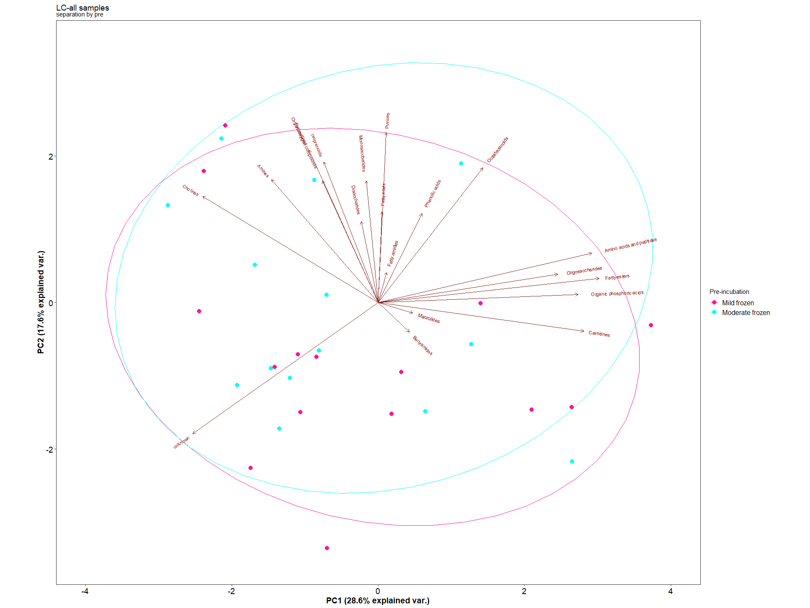<!-- -->

    ## 
    ## $gg_pca_inc1

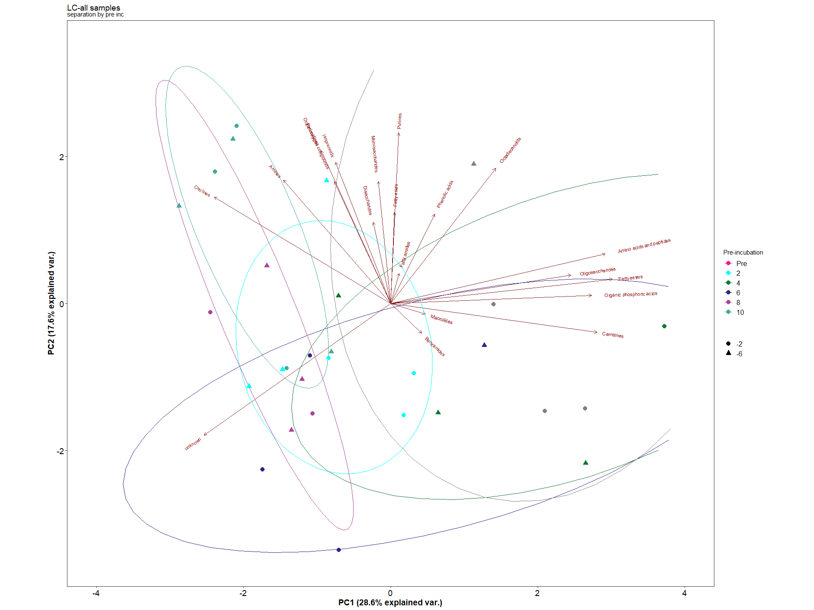<!-- -->

    ## 
    ## $permanova_LC_all
    ## 
    ## 
    ## Table: Permanova results all by Main class
    ## 
    ## |         | Df|  SumOfSqs|        R2|        F| Pr(>F)|
    ## |:--------|--:|---------:|---------:|--------:|------:|
    ## |pre      |  1| 0.0001446| 0.0363300| 2.200411|  0.094|
    ## |inc      |  5| 0.0014326| 0.3600114| 4.360981|  0.001|
    ## |pre:inc  |  5| 0.0009567| 0.2404260| 2.912388|  0.001|
    ## |Residual | 22| 0.0014454| 0.3632326|       NA|     NA|
    ## |Total    | 33| 0.0039793| 1.0000000|       NA|     NA|
    ## 
    ## $gg_pca_pre2

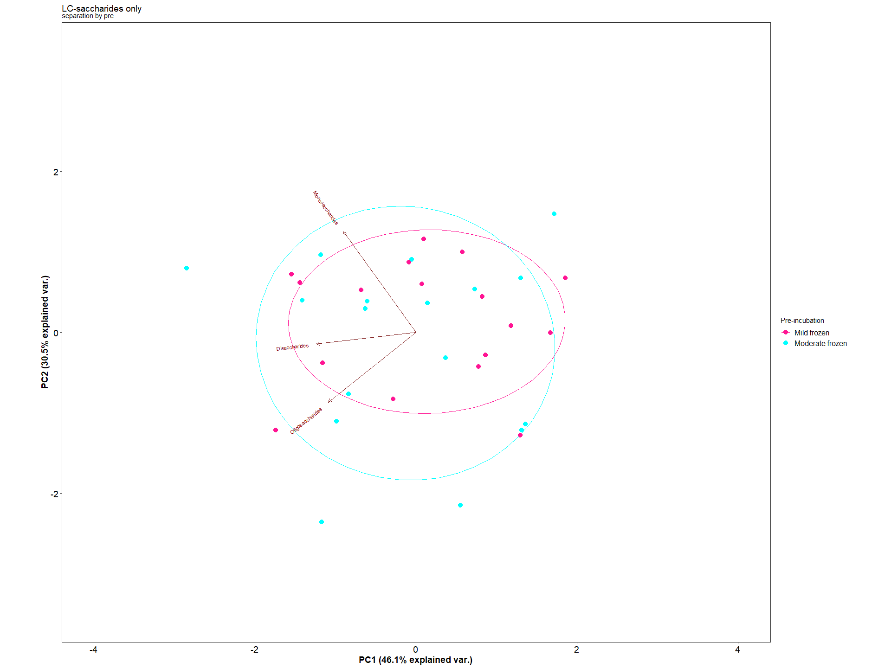<!-- -->

    ## 
    ## $gg_pca_inc2

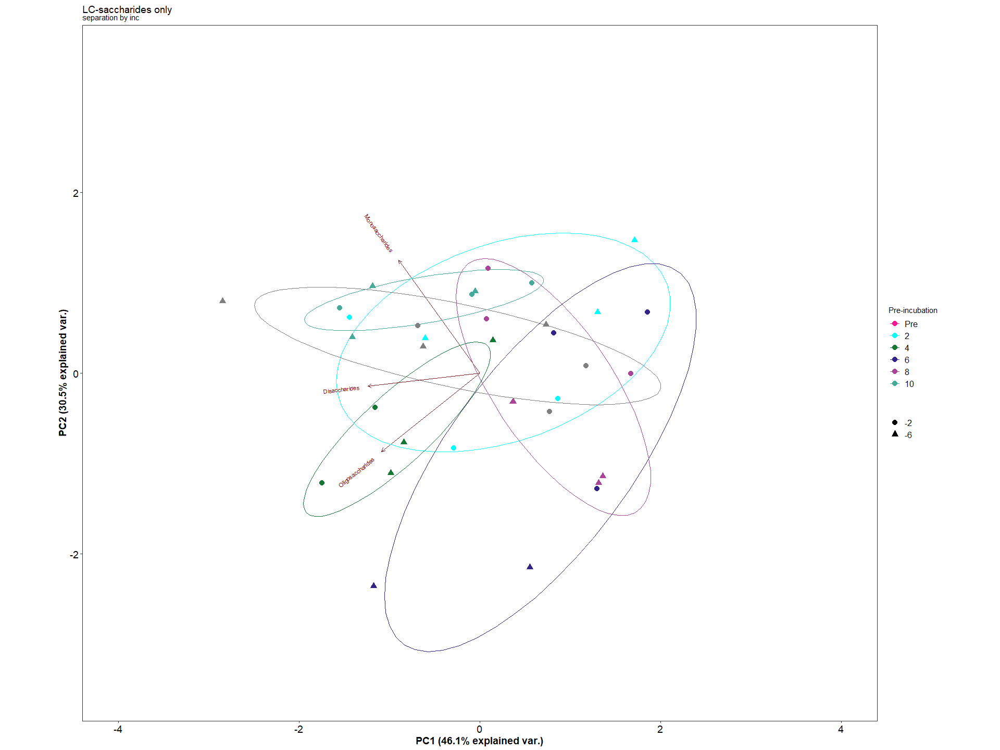<!-- -->

    ## 
    ## $permanova_LC_all2
    ## 
    ## 
    ## Table: Permanova results saccharides
    ## 
    ## |         | Df|  SumOfSqs|        R2|        F| Pr(>F)|
    ## |:--------|--:|---------:|---------:|--------:|------:|
    ## |pre      |  1| 0.0001455| 0.0227556| 1.490280|  0.230|
    ## |inc      |  5| 0.0024135| 0.3775735| 4.945518|  0.001|
    ## |pre:inc  |  5| 0.0016859| 0.2637459| 3.454587|  0.005|
    ## |Residual | 22| 0.0021473| 0.3359250|       NA|     NA|
    ## |Total    | 33| 0.0063922| 1.0000000|       NA|     NA|
    ## 
    ## $gg_pca_pre_Sig

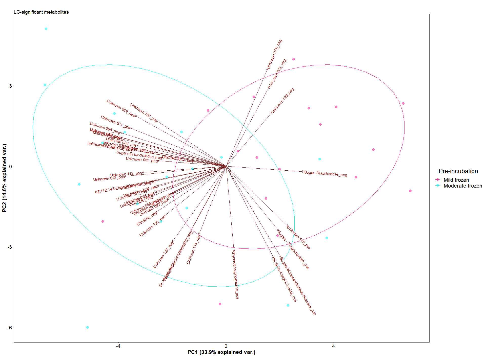<!-- -->

    ## 
    ## $gg_pca_inc_Sig

<!-- -->

    ## 
    ## $permanova_LC_sig
    ## 
    ## 
    ## Table: Permanova results significant compounds only
    ## 
    ## |         | Df|  SumOfSqs|        R2|        F| Pr(>F)|
    ## |:--------|--:|---------:|---------:|--------:|------:|
    ## |pre      |  1| 0.0025800| 0.1596463| 7.557022|  0.001|
    ## |inc      |  5| 0.0032469| 0.2009156| 1.902109|  0.018|
    ## |pre:inc  |  5| 0.0028229| 0.1746759| 1.653693|  0.059|
    ## |Residual | 22| 0.0075109| 0.4647622|       NA|     NA|
    ## |Total    | 33| 0.0161607| 1.0000000|       NA|     NA|

## Lipids

click to open

    ## NULL

    ## $Stat_plot

<!-- -->

    ## 
    ## $Lipid_pos

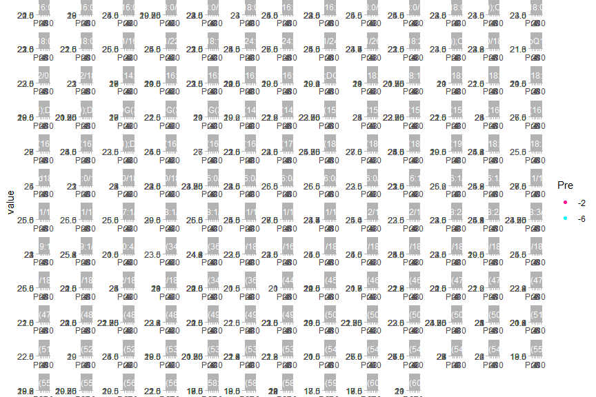<!-- -->

    ## 
    ## $Lipid_neg

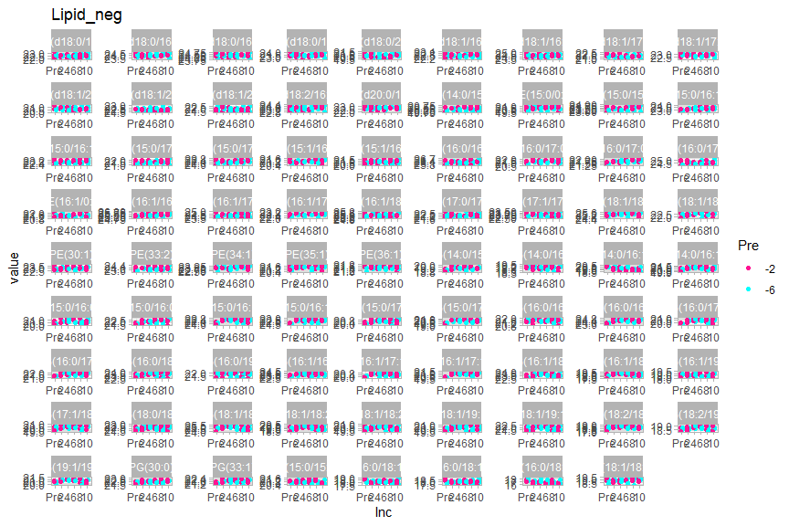<!-- -->

    ## 
    ## $Lipid_pos2

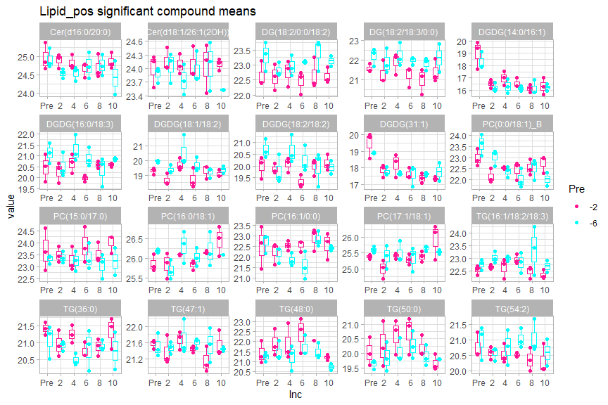<!-- -->

    ## 
    ## $Lipid_neg2

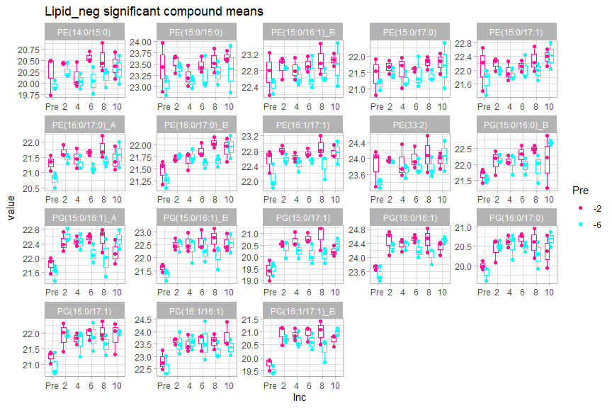<!-- -->

    ## 
    ## $gg_pca_pre

<!-- -->

    ## 
    ## $gg_pca_inc

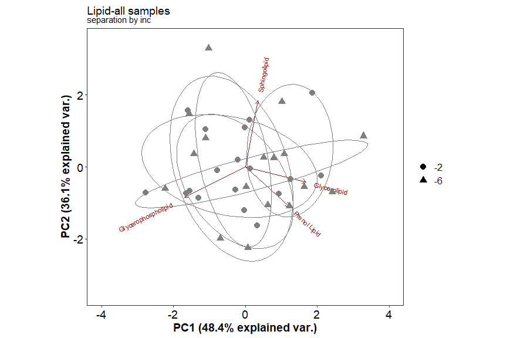<!-- -->

    ## 
    ## $gg_pca_pre_pos

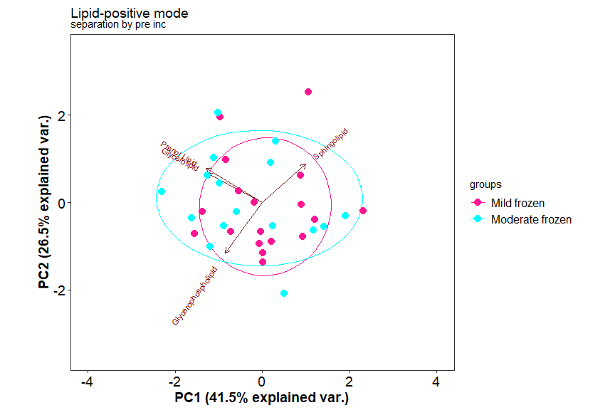<!-- -->

    ## 
    ## $gg_pca_inc_pos

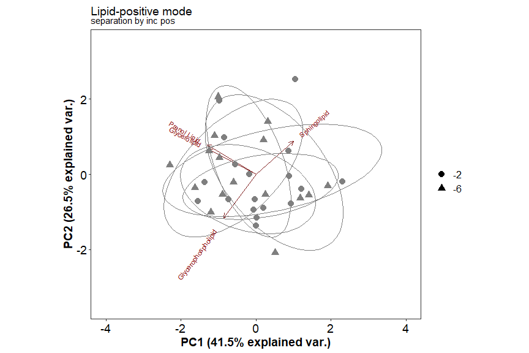<!-- -->

    ## 
    ## $gg_pca_pre_neg

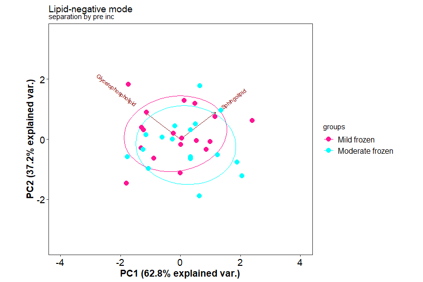<!-- -->

    ## 
    ## $gg_pca_inc_neg

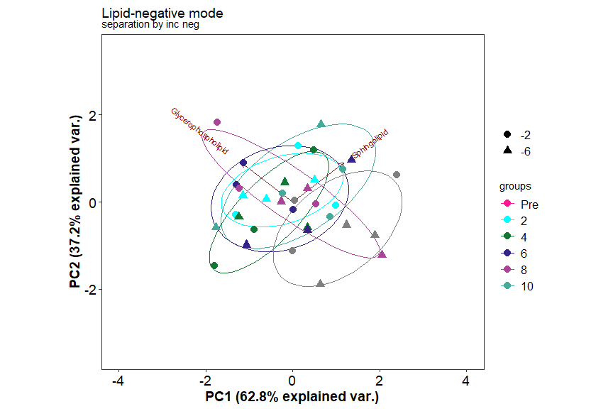<!-- -->

    ## 
    ## $permanova_Lipid_all
    ## 
    ## 
    ## Table: Permanova results all
    ## 
    ## |         | Df|  SumOfSqs|        R2|        F| Pr(>F)|
    ## |:--------|--:|---------:|---------:|--------:|------:|
    ## |Pre      |  1| 0.0000141| 0.0361871| 1.375732|  0.238|
    ## |Inc      |  5| 0.0000734| 0.1882390| 1.431265|  0.207|
    ## |Pre:Inc  |  5| 0.0000665| 0.1705848| 1.297032|  0.266|
    ## |Residual | 23| 0.0002358| 0.6049891|       NA|     NA|
    ## |Total    | 34| 0.0003897| 1.0000000|       NA|     NA|
    ## 
    ## $permanova_Lipid_all2
    ## 
    ## 
    ## Table: Permanova results pos
    ## 
    ## |         | Df|  SumOfSqs|        R2|         F| Pr(>F)|
    ## |:--------|--:|---------:|---------:|---------:|------:|
    ## |Pre      |  1| 0.0000047| 0.0117707| 0.4052875|  0.704|
    ## |Inc      |  5| 0.0000655| 0.1637689| 1.1277753|  0.374|
    ## |Pre:Inc  |  5| 0.0000626| 0.1564754| 1.0775498|  0.398|
    ## |Residual | 23| 0.0002672| 0.6679850|        NA|     NA|
    ## |Total    | 34| 0.0003999| 1.0000000|        NA|     NA|
    ## 
    ## $permanova_Lipid_all3
    ## 
    ## 
    ## Table: Permanova results neg
    ## 
    ## |         | Df|  SumOfSqs|        R2|        F| Pr(>F)|
    ## |:--------|--:|---------:|---------:|--------:|------:|
    ## |Pre      |  1| 0.0000364| 0.0493385| 2.557097|  0.109|
    ## |Inc      |  5| 0.0002197| 0.2975080| 3.083825|  0.016|
    ## |Pre:Inc  |  5| 0.0001546| 0.2093743| 2.170273|  0.069|
    ## |Residual | 23| 0.0003277| 0.4437791|       NA|     NA|
    ## |Total    | 34| 0.0007384| 1.0000000|       NA|     NA|
    ## 
    ## $StatsLipid
    ## 
    ## 
    ## |Name2                                          | Count_-2_T0| Count_-6_6| Count_-6_4| Count_-2_4| Count_-2_10| Count_-6_8| Count_-2_8| Count_-6_T0| Count_-2_2| Count_-6_2| Count_-2_6| Count_-6_10| Mean_-2_T0| Mean_-6_6| Mean_-6_4| Mean_-2_4| Mean_-2_10| Mean_-6_8| Mean_-2_8| Mean_-6_T0| Mean_-2_2| Mean_-6_2| Mean_-2_6| Mean_-6_10| Fold_change_-2_T0_vs_-6_6| Fold_change_-2_T0_vs_-6_4| Fold_change_-2_T0_vs_-2_4| Fold_change_-2_T0_vs_-2_10| Fold_change_-2_T0_vs_-6_8| Fold_change_-2_T0_vs_-2_8| Fold_change_-2_T0_vs_-6_T0| Fold_change_-2_T0_vs_-2_2| Fold_change_-2_T0_vs_-6_2| Fold_change_-2_T0_vs_-2_6| Fold_change_-2_T0_vs_-6_10| Fold_change_-6_6_vs_-6_4| Fold_change_-6_6_vs_-2_4| Fold_change_-6_6_vs_-2_10| Fold_change_-6_6_vs_-6_8| Fold_change_-6_6_vs_-2_8| Fold_change_-6_6_vs_-6_T0| Fold_change_-6_6_vs_-2_2| Fold_change_-6_6_vs_-6_2| Fold_change_-6_6_vs_-2_6| Fold_change_-6_6_vs_-6_10| Fold_change_-6_4_vs_-2_4| Fold_change_-6_4_vs_-2_10| Fold_change_-6_4_vs_-6_8| Fold_change_-6_4_vs_-2_8| Fold_change_-6_4_vs_-6_T0| Fold_change_-6_4_vs_-2_2| Fold_change_-6_4_vs_-6_2| Fold_change_-6_4_vs_-2_6| Fold_change_-6_4_vs_-6_10| Fold_change_-2_4_vs_-2_10| Fold_change_-2_4_vs_-6_8| Fold_change_-2_4_vs_-2_8| Fold_change_-2_4_vs_-6_T0| Fold_change_-2_4_vs_-2_2| Fold_change_-2_4_vs_-6_2| Fold_change_-2_4_vs_-2_6| Fold_change_-2_4_vs_-6_10| Fold_change_-2_10_vs_-6_8| Fold_change_-2_10_vs_-2_8| Fold_change_-2_10_vs_-6_T0| Fold_change_-2_10_vs_-2_2| Fold_change_-2_10_vs_-6_2| Fold_change_-2_10_vs_-2_6| Fold_change_-2_10_vs_-6_10| Fold_change_-6_8_vs_-2_8| Fold_change_-6_8_vs_-6_T0| Fold_change_-6_8_vs_-2_2| Fold_change_-6_8_vs_-6_2| Fold_change_-6_8_vs_-2_6| Fold_change_-6_8_vs_-6_10| Fold_change_-2_8_vs_-6_T0| Fold_change_-2_8_vs_-2_2| Fold_change_-2_8_vs_-6_2| Fold_change_-2_8_vs_-2_6| Fold_change_-2_8_vs_-6_10| Fold_change_-6_T0_vs_-2_2| Fold_change_-6_T0_vs_-6_2| Fold_change_-6_T0_vs_-2_6| Fold_change_-6_T0_vs_-6_10| Fold_change_-2_2_vs_-6_2| Fold_change_-2_2_vs_-2_6| Fold_change_-2_2_vs_-6_10| Fold_change_-6_2_vs_-2_6| Fold_change_-6_2_vs_-6_10| Fold_change_-2_6_vs_-6_10| P_value_A_-2_T0_vs_-6_6| P_value_A_-2_T0_vs_-6_4| P_value_A_-2_T0_vs_-2_4| P_value_A_-2_T0_vs_-2_10| P_value_A_-2_T0_vs_-6_8| P_value_A_-2_T0_vs_-2_8| P_value_A_-2_T0_vs_-6_T0| P_value_A_-2_T0_vs_-2_2| P_value_A_-2_T0_vs_-6_2| P_value_A_-2_T0_vs_-2_6| P_value_A_-2_T0_vs_-6_10| P_value_A_-6_6_vs_-6_4| P_value_A_-6_6_vs_-2_4| P_value_A_-6_6_vs_-2_10| P_value_A_-6_6_vs_-6_8| P_value_A_-6_6_vs_-2_8| P_value_A_-6_6_vs_-6_T0| P_value_A_-6_6_vs_-2_2| P_value_A_-6_6_vs_-6_2| P_value_A_-6_6_vs_-2_6| P_value_A_-6_6_vs_-6_10| P_value_A_-6_4_vs_-2_4| P_value_A_-6_4_vs_-2_10| P_value_A_-6_4_vs_-6_8| P_value_A_-6_4_vs_-2_8| P_value_A_-6_4_vs_-6_T0| P_value_A_-6_4_vs_-2_2| P_value_A_-6_4_vs_-6_2| P_value_A_-6_4_vs_-2_6| P_value_A_-6_4_vs_-6_10| P_value_A_-2_4_vs_-2_10| P_value_A_-2_4_vs_-6_8| P_value_A_-2_4_vs_-2_8| P_value_A_-2_4_vs_-6_T0| P_value_A_-2_4_vs_-2_2| P_value_A_-2_4_vs_-6_2| P_value_A_-2_4_vs_-2_6| P_value_A_-2_4_vs_-6_10| P_value_A_-2_10_vs_-6_8| P_value_A_-2_10_vs_-2_8| P_value_A_-2_10_vs_-6_T0| P_value_A_-2_10_vs_-2_2| P_value_A_-2_10_vs_-6_2| P_value_A_-2_10_vs_-2_6| P_value_A_-2_10_vs_-6_10| P_value_A_-6_8_vs_-2_8| P_value_A_-6_8_vs_-6_T0| P_value_A_-6_8_vs_-2_2| P_value_A_-6_8_vs_-6_2| P_value_A_-6_8_vs_-2_6| P_value_A_-6_8_vs_-6_10| P_value_A_-2_8_vs_-6_T0| P_value_A_-2_8_vs_-2_2| P_value_A_-2_8_vs_-6_2| P_value_A_-2_8_vs_-2_6| P_value_A_-2_8_vs_-6_10| P_value_A_-6_T0_vs_-2_2| P_value_A_-6_T0_vs_-6_2| P_value_A_-6_T0_vs_-2_6| P_value_A_-6_T0_vs_-6_10| P_value_A_-2_2_vs_-6_2| P_value_A_-2_2_vs_-2_6| P_value_A_-2_2_vs_-6_10| P_value_A_-6_2_vs_-2_6| P_value_A_-6_2_vs_-6_10| P_value_A_-2_6_vs_-6_10| Flag_A_-2_T0_vs_-6_6| Flag_A_-2_T0_vs_-6_4| Flag_A_-2_T0_vs_-2_4| Flag_A_-2_T0_vs_-2_10| Flag_A_-2_T0_vs_-6_8| Flag_A_-2_T0_vs_-2_8| Flag_A_-2_T0_vs_-6_T0| Flag_A_-2_T0_vs_-2_2| Flag_A_-2_T0_vs_-6_2| Flag_A_-2_T0_vs_-2_6| Flag_A_-2_T0_vs_-6_10| Flag_A_-6_6_vs_-6_4| Flag_A_-6_6_vs_-2_4| Flag_A_-6_6_vs_-2_10| Flag_A_-6_6_vs_-6_8| Flag_A_-6_6_vs_-2_8| Flag_A_-6_6_vs_-6_T0| Flag_A_-6_6_vs_-2_2| Flag_A_-6_6_vs_-6_2| Flag_A_-6_6_vs_-2_6| Flag_A_-6_6_vs_-6_10| Flag_A_-6_4_vs_-2_4| Flag_A_-6_4_vs_-2_10| Flag_A_-6_4_vs_-6_8| Flag_A_-6_4_vs_-2_8| Flag_A_-6_4_vs_-6_T0| Flag_A_-6_4_vs_-2_2| Flag_A_-6_4_vs_-6_2| Flag_A_-6_4_vs_-2_6| Flag_A_-6_4_vs_-6_10| Flag_A_-2_4_vs_-2_10| Flag_A_-2_4_vs_-6_8| Flag_A_-2_4_vs_-2_8| Flag_A_-2_4_vs_-6_T0| Flag_A_-2_4_vs_-2_2| Flag_A_-2_4_vs_-6_2| Flag_A_-2_4_vs_-2_6| Flag_A_-2_4_vs_-6_10| Flag_A_-2_10_vs_-6_8| Flag_A_-2_10_vs_-2_8| Flag_A_-2_10_vs_-6_T0| Flag_A_-2_10_vs_-2_2| Flag_A_-2_10_vs_-6_2| Flag_A_-2_10_vs_-2_6| Flag_A_-2_10_vs_-6_10| Flag_A_-6_8_vs_-2_8| Flag_A_-6_8_vs_-6_T0| Flag_A_-6_8_vs_-2_2| Flag_A_-6_8_vs_-6_2| Flag_A_-6_8_vs_-2_6| Flag_A_-6_8_vs_-6_10| Flag_A_-2_8_vs_-6_T0| Flag_A_-2_8_vs_-2_2| Flag_A_-2_8_vs_-6_2| Flag_A_-2_8_vs_-2_6| Flag_A_-2_8_vs_-6_10| Flag_A_-6_T0_vs_-2_2| Flag_A_-6_T0_vs_-6_2| Flag_A_-6_T0_vs_-2_6| Flag_A_-6_T0_vs_-6_10| Flag_A_-2_2_vs_-6_2| Flag_A_-2_2_vs_-2_6| Flag_A_-2_2_vs_-6_10| Flag_A_-6_2_vs_-2_6| Flag_A_-6_2_vs_-6_10| Flag_A_-2_6_vs_-6_10|
    ## |:----------------------------------------------|-----------:|----------:|----------:|----------:|-----------:|----------:|----------:|-----------:|----------:|----------:|----------:|-----------:|----------:|---------:|---------:|---------:|----------:|---------:|---------:|----------:|---------:|---------:|---------:|----------:|-------------------------:|-------------------------:|-------------------------:|--------------------------:|-------------------------:|-------------------------:|--------------------------:|-------------------------:|-------------------------:|-------------------------:|--------------------------:|------------------------:|------------------------:|-------------------------:|------------------------:|------------------------:|-------------------------:|------------------------:|------------------------:|------------------------:|-------------------------:|------------------------:|-------------------------:|------------------------:|------------------------:|-------------------------:|------------------------:|------------------------:|------------------------:|-------------------------:|-------------------------:|------------------------:|------------------------:|-------------------------:|------------------------:|------------------------:|------------------------:|-------------------------:|-------------------------:|-------------------------:|--------------------------:|-------------------------:|-------------------------:|-------------------------:|--------------------------:|------------------------:|-------------------------:|------------------------:|------------------------:|------------------------:|-------------------------:|-------------------------:|------------------------:|------------------------:|------------------------:|-------------------------:|-------------------------:|-------------------------:|-------------------------:|--------------------------:|------------------------:|------------------------:|-------------------------:|------------------------:|-------------------------:|-------------------------:|-----------------------:|-----------------------:|-----------------------:|------------------------:|-----------------------:|-----------------------:|------------------------:|-----------------------:|-----------------------:|-----------------------:|------------------------:|----------------------:|----------------------:|-----------------------:|----------------------:|----------------------:|-----------------------:|----------------------:|----------------------:|----------------------:|-----------------------:|----------------------:|-----------------------:|----------------------:|----------------------:|-----------------------:|----------------------:|----------------------:|----------------------:|-----------------------:|-----------------------:|----------------------:|----------------------:|-----------------------:|----------------------:|----------------------:|----------------------:|-----------------------:|-----------------------:|-----------------------:|------------------------:|-----------------------:|-----------------------:|-----------------------:|------------------------:|----------------------:|-----------------------:|----------------------:|----------------------:|----------------------:|-----------------------:|-----------------------:|----------------------:|----------------------:|----------------------:|-----------------------:|-----------------------:|-----------------------:|-----------------------:|------------------------:|----------------------:|----------------------:|-----------------------:|----------------------:|-----------------------:|-----------------------:|--------------------:|--------------------:|--------------------:|---------------------:|--------------------:|--------------------:|---------------------:|--------------------:|--------------------:|--------------------:|---------------------:|-------------------:|-------------------:|--------------------:|-------------------:|-------------------:|--------------------:|-------------------:|-------------------:|-------------------:|--------------------:|-------------------:|--------------------:|-------------------:|-------------------:|--------------------:|-------------------:|-------------------:|-------------------:|--------------------:|--------------------:|-------------------:|-------------------:|--------------------:|-------------------:|-------------------:|-------------------:|--------------------:|--------------------:|--------------------:|---------------------:|--------------------:|--------------------:|--------------------:|---------------------:|-------------------:|--------------------:|-------------------:|-------------------:|-------------------:|--------------------:|--------------------:|-------------------:|-------------------:|-------------------:|--------------------:|--------------------:|--------------------:|--------------------:|---------------------:|-------------------:|-------------------:|--------------------:|-------------------:|--------------------:|--------------------:|
    ## |Cer(d16:0/16:3)__pos                           |           3|          3|          3|          3|           3|          3|          3|           3|          3|          3|          3|           2|   21.57902|  20.87804|  21.32048|  21.32404|   21.10785|  21.14728|  20.74403|   21.44498|  20.88833|  21.29745|  21.26439|   21.24445|                 0.7009766|                 0.2585335|                 0.2549716|                  0.4711686|                 0.4317367|                 0.8349844|                  0.1340371|                 0.6906835|                 0.2815699|                 0.3146253|                  0.3345680|               -0.4424430|               -0.4460050|                -0.2298079|               -0.2692398|                0.1340078|                -0.5669395|               -0.0102930|               -0.4194066|               -0.3863513|                -0.3664085|               -0.0035620|                 0.2126351|                0.1732032|                0.5764508|                -0.1244965|                0.4321500|                0.0230364|                0.0560917|                 0.0760345|                 0.2161971|                0.1767652|                0.5800128|                -0.1209345|                0.4357119|                0.0265984|                0.0596537|                 0.0795965|                -0.0394319|                 0.3638157|                 -0.3371316|                 0.2195149|                -0.1895987|                -0.1565434|                 -0.1366006|                0.4032476|                -0.2976997|                0.2589468|               -0.1501668|               -0.1171115|                -0.0971687|                -0.7009473|               -0.1443009|               -0.5534144|               -0.5203591|                -0.5004164|                 0.5566464|                 0.1475329|                 0.1805882|                  0.2005309|               -0.4091136|               -0.3760583|                -0.3561155|                0.0330553|                 0.0529981|                 0.0199428|               0.0583654|               0.4699404|               0.4760113|                0.1936591|               0.2322614|               0.0263894|                0.7067640|               0.0618739|               0.4317957|               0.3805213|                0.4038624|              0.2212437|              0.2176680|               0.5201815|              0.4519701|              0.7068249|               0.1207861|              0.9769166|              0.2454588|              0.2835882|               0.3613488|              0.9920108|               0.5515753|              0.6272320|              0.1149933|               0.7267119|              0.2318285|              0.9483688|              0.8747423|               0.8484472|               0.5449827|              0.6202049|              0.1128846|               0.7342113|              0.2281230|              0.9404002|              0.8668648|               0.8414455|               0.9117487|               0.3119290|                0.3479885|               0.5388798|               0.5951955|               0.6605710|                0.7315874|              0.2635927|               0.4062602|              0.4692391|              0.6735292|              0.7422904|               0.8071107|               0.0583751|              0.6855417|              0.1294409|              0.1527655|               0.2160951|               0.1273273|               0.6789123|               0.6127037|                0.6151083|              0.2568989|              0.2962942|               0.3747538|              0.9259719|               0.8940118|               0.9600095|                    0|                    0|                    0|                     0|                    0|                    1|                     0|                    0|                    0|                    0|                     0|                   0|                   0|                    0|                   0|                   0|                    0|                   0|                   0|                   0|                    0|                   0|                    0|                   0|                   0|                    0|                   0|                   0|                   0|                    0|                    0|                   0|                   0|                    0|                   0|                   0|                   0|                    0|                    0|                    0|                     0|                    0|                    0|                    0|                     0|                   0|                    0|                   0|                   0|                   0|                    0|                    0|                   0|                   0|                   0|                    0|                    0|                    0|                    0|                     0|                   0|                   0|                    0|                   0|                    0|                    0|
    ## |Cer(d16:0/18:2)__pos                           |           3|          3|          3|          3|           3|          3|          3|           3|          3|          3|          3|           2|   19.63603|  19.53200|  19.47167|  19.43723|   19.57784|  19.71505|  19.68061|   19.67047|  19.56816|  19.60260|  19.49756|   19.61228|                 0.1040345|                 0.1643649|                 0.1988028|                  0.0581936|                -0.0790134|                -0.0445755|                 -0.0344379|                 0.0678692|                 0.0334313|                 0.1384724|                  0.0237558|                0.0603304|                0.0947682|                -0.0458409|               -0.1830479|               -0.1486100|                -0.1384724|               -0.0361653|               -0.0706032|                0.0344379|                -0.0802788|                0.0344379|                -0.1061712|               -0.2433783|               -0.2089404|                -0.1988028|               -0.0964957|               -0.1309335|               -0.0258925|                -0.1406091|                -0.1406091|               -0.2778162|               -0.2433783|                -0.2332406|               -0.1309335|               -0.1653714|               -0.0603304|                -0.1750470|                -0.1372071|                -0.1027692|                 -0.0926315|                 0.0096756|                -0.0247623|                 0.0802788|                 -0.0344379|                0.0344379|                 0.0445755|                0.1468826|                0.1124447|                0.2174858|                 0.1027692|                 0.0101376|                0.1124447|                0.0780069|                0.1830479|                 0.0683313|                 0.1023071|                 0.0678692|                 0.1729103|                  0.0581936|               -0.0344379|                0.0706032|                -0.0441135|                0.1050411|                -0.0096756|                -0.1147166|               0.8564444|               0.7751432|               0.7298235|                0.9193789|               0.8907029|               0.9381989|                0.9522335|               0.9060359|               0.9536280|               0.8097739|                0.9705170|              0.9164300|              0.8691018|               0.9364485|              0.7504434|              0.7961632|               0.8097739|              0.9498408|              0.9022706|              0.9522335|               0.9006183|              0.9522335|               0.8535312|              0.6726459|              0.7166636|               0.7298235|              0.8667394|              0.8199356|              0.9640763|               0.8269217|               0.8068999|              0.6297931|              0.6726459|               0.6854885|              0.8199356|              0.7738060|              0.9164300|               0.7855265|               0.8114771|               0.8581706|                0.8720257|               0.9865718|               0.9656433|               0.8889646|                0.9572709|              0.9522335|               0.9381989|              0.7984779|              0.8449902|              0.7056397|               0.8730004|               0.9859306|              0.8449902|              0.8920861|              0.7504434|               0.9153442|               0.8588011|               0.9060359|               0.7638139|                0.9278640|              0.9522335|              0.9022706|               0.9452838|              0.8550718|               0.9879893|               0.8583937|                    0|                    0|                    0|                     0|                    0|                    0|                     0|                    0|                    0|                    0|                     0|                   0|                   0|                    0|                   0|                   0|                    0|                   0|                   0|                   0|                    0|                   0|                    0|                   0|                   0|                    0|                   0|                   0|                   0|                    0|                    0|                   0|                   0|                    0|                   0|                   0|                   0|                    0|                    0|                    0|                     0|                    0|                    0|                    0|                     0|                   0|                    0|                   0|                   0|                   0|                    0|                    0|                   0|                   0|                   0|                    0|                    0|                    0|                    0|                     0|                   0|                   0|                    0|                   0|                    0|                    0|
    ## |Cer(d16:0/20:0)__pos                           |           3|          3|          3|          3|           3|          3|          3|           3|          3|          3|          3|           2|   24.96436|  24.74475|  24.54030|  24.82880|   24.86223|  24.75824|  24.69741|   24.92089|  24.88789|  24.53108|  24.66254|   24.42708|                 0.2196109|                 0.4240646|                 0.1355654|                  0.1021386|                 0.2061275|                 0.2669503|                  0.0434729|                 0.0764732|                 0.4332850|                 0.3018266|                  0.5372836|                0.2044536|               -0.0840455|                -0.1174723|               -0.0134834|                0.0473394|                -0.1761380|               -0.1431377|                0.2136740|                0.0822157|                 0.3176726|               -0.2884992|                -0.3219259|               -0.2179371|               -0.1571143|                -0.3805916|               -0.3475914|                0.0092204|               -0.1222380|                 0.1132190|                -0.0334267|                0.0705621|                0.1313849|                -0.0920924|               -0.0590922|                0.2977196|                0.1662612|                 0.4017182|                 0.1039888|                 0.1648117|                 -0.0586657|                -0.0256655|                 0.3311463|                 0.1996879|                  0.4351449|                0.0608228|                -0.1626546|               -0.1296543|                0.2271575|                0.0956991|                 0.3311561|                -0.2234774|               -0.1904771|                0.1663347|                0.0348763|                 0.2703333|                 0.0330003|                 0.3898120|                 0.2583537|                  0.4938106|                0.3568118|                0.2253534|                 0.4608104|               -0.1314584|                 0.1039986|                 0.2354570|               0.3582020|               0.0833109|               0.5683719|                0.6668600|               0.3879535|               0.2661478|                0.8543871|               0.7470095|               0.0772313|               0.2103552|                0.0517593|              0.3917561|              0.7230071|               0.6207706|              0.9545927|              0.8416116|               0.4596886|              0.5471293|              0.3711086|              0.7287819|               0.2374220|              0.2305123|               0.1825652|              0.3618100|              0.5090508|               0.1178205|              0.1513943|              0.9689395|              0.6067520|               0.6695255|               0.8877636|              0.7659311|              0.5802770|               0.6978158|              0.8030647|              0.2164168|              0.4849533|               0.1386754|               0.6612222|               0.4887278|                0.8044552|               0.9136985|               0.1708267|               0.4027142|                0.1101592|              0.7974289|               0.4943757|              0.5852417|              0.3422355|              0.6866371|               0.2187008|               0.3499601|              0.4244420|              0.4847625|              0.8829331|               0.3126725|               0.8891856|               0.1096359|               0.2814417|                0.0720362|              0.1413088|              0.3460077|               0.0917668|              0.5800667|               0.6949366|               0.3779130|                    0|                    0|                    0|                     0|                    0|                    0|                     0|                    0|                    0|                    0|                     0|                   0|                   0|                    0|                   0|                   0|                    0|                   0|                   0|                   0|                    0|                   0|                    0|                   0|                   0|                    0|                   0|                   0|                   0|                    0|                    0|                   0|                   0|                    0|                   0|                   0|                   0|                    0|                    0|                    0|                     0|                    0|                    0|                    0|                     0|                   0|                    0|                   0|                   0|                   0|                    0|                    0|                   0|                   0|                   0|                    0|                    0|                    0|                    0|                     0|                   0|                   0|                    0|                   0|                    0|                    0|
    ## |Cer(d18:0/14:0)_A__pos                         |           3|          3|          3|          3|           3|          3|          3|           3|          3|          3|          3|           2|   19.86383|  19.61390|  19.65590|  19.68694|   19.72887|  19.76397|  19.79501|   19.83280|  19.60893|  19.57789|  19.64494|   19.69783|                 0.2499377|                 0.2079361|                 0.1768973|                  0.1349635|                 0.0998617|                 0.0688230|                  0.0310387|                 0.2549060|                 0.2859447|                 0.2188990|                  0.1660023|               -0.0420016|               -0.0730404|                -0.1149742|               -0.1500760|               -0.1811148|                -0.2188990|                0.0049683|                0.0360070|               -0.0310387|                -0.0839354|               -0.0310387|                -0.0729725|               -0.1080744|               -0.1391131|                -0.1768973|                0.0469699|                0.0780087|                0.0109629|                -0.0419338|                -0.0419338|               -0.0770356|               -0.1080744|                -0.1458586|                0.0780087|                0.1090474|                0.0420016|                -0.0108951|                -0.0351018|                -0.0661406|                 -0.1039248|                 0.1199424|                 0.1509812|                 0.0839354|                  0.0310387|               -0.0310387|                -0.0688230|                0.1550443|                0.1860830|                0.1190373|                 0.0661406|                -0.0377842|                0.1860830|                0.2171218|                0.1500760|                 0.0971793|                 0.2238673|                 0.2549060|                 0.1878602|                  0.1349635|                0.0310387|               -0.0360070|                -0.0889037|               -0.0670458|                -0.1199424|                -0.0528967|               0.3028502|               0.3896407|               0.4632522|                0.5747885|               0.6775884|               0.7742504|                0.8970033|               0.2935645|               0.2401562|               0.3655543|                0.5374087|              0.8609681|              0.7608530|               0.6323816|              0.5330730|              0.4527876|               0.3655543|              0.9834658|              0.8806396|              0.8970033|               0.7544193|              0.8970033|               0.7610679|              0.6528537|              0.5631716|               0.4632522|              0.8447336|              0.7451683|              0.9635267|               0.8757104|               0.8611903|              0.7482314|              0.6528537|               0.5445487|              0.7451683|              0.6499493|              0.8609681|               0.9675766|               0.8836171|               0.7828092|                0.6653027|               0.6178232|               0.5306271|               0.7266043|                0.9078222|              0.8970033|               0.7742504|              0.5197235|              0.4406444|              0.6204639|               0.8052183|               0.8747989|              0.4406444|              0.3693903|              0.5330730|               0.7173201|               0.3549717|               0.2935645|               0.4363494|                0.6155733|              0.8970033|              0.8806396|               0.7404255|              0.7799178|               0.6552297|               0.8436175|                    0|                    0|                    0|                     0|                    0|                    0|                     0|                    0|                    0|                    0|                     0|                   0|                   0|                    0|                   0|                   0|                    0|                   0|                   0|                   0|                    0|                   0|                    0|                   0|                   0|                    0|                   0|                   0|                   0|                    0|                    0|                   0|                   0|                    0|                   0|                   0|                   0|                    0|                    0|                    0|                     0|                    0|                    0|                    0|                     0|                   0|                    0|                   0|                   0|                   0|                    0|                    0|                   0|                   0|                   0|                    0|                    0|                    0|                    0|                     0|                   0|                   0|                    0|                   0|                    0|                    0|
    ## |Cer(d18:0/14:0)_B__pos                         |           3|          3|          3|          3|           3|          3|          3|           3|          3|          3|          3|           2|   23.54194|  22.88907|  22.85363|  23.09686|   23.39720|  22.97960|  23.22284|   23.29871|  23.35751|  23.11427|  23.13231|   23.15397|                 0.6528682|                 0.6883137|                 0.4450795|                  0.1447387|                 0.5623400|                 0.3191058|                  0.2432342|                 0.1844352|                 0.4276695|                 0.4096340|                  0.3879730|                0.0354455|               -0.2077887|                -0.5081295|               -0.0905282|               -0.3337624|                -0.4096340|               -0.4684330|               -0.2251988|               -0.2432342|                -0.2648952|               -0.2432342|                -0.5435750|               -0.1259737|               -0.3692079|                -0.4450795|               -0.5038785|               -0.2606443|               -0.2786797|                -0.3003407|                -0.3003407|                0.1172606|               -0.1259737|                -0.2018452|               -0.2606443|               -0.0174100|               -0.0354455|                -0.0571065|                 0.4176013|                 0.1743671|                  0.0984955|                 0.0396965|                 0.2829307|                 0.2648952|                  0.2432342|               -0.2432342|                -0.3191058|               -0.3779048|               -0.1346706|               -0.1527061|                -0.1743671|                -0.0758716|               -0.1346706|                0.1085637|                0.0905282|                 0.0688672|                -0.0587990|                 0.1844352|                 0.1663997|                  0.1447387|                0.2432342|                0.2251988|                 0.2035378|               -0.0180355|                -0.0396965|                -0.0216610|               0.1889226|               0.1668991|               0.3655918|                0.7667545|               0.2554974|               0.5147048|                0.6187693|               0.7056189|               0.3843179|               0.4043651|                0.4790031|              0.9420390|              0.6705473|               0.3029436|              0.8527307|              0.4957730|               0.4043651|              0.3414426|              0.6448853|              0.6187693|               0.6278429|              0.6187693|               0.2712589|              0.7962316|              0.4516682|               0.3655918|              0.3069133|              0.5940363|              0.5689341|               0.5828508|               0.5395172|              0.8100277|              0.7962316|               0.6794047|              0.5940363|              0.9715106|              0.9420390|               0.9165615|               0.3954280|               0.7209530|                0.8399488|               0.9351032|               0.5630970|               0.5880712|                0.6560986|              0.6187693|               0.5147048|              0.4412183|              0.7825285|              0.7543442|               0.7492970|               0.8763495|              0.7825285|              0.8238612|              0.8527307|               0.8994668|               0.9040088|               0.7056189|               0.7331732|                0.7907328|              0.6187693|              0.6448853|               0.7092409|              0.9704876|               0.9419409|               0.9682982|                    0|                    0|                    0|                     0|                    0|                    0|                     0|                    0|                    0|                    0|                     0|                   0|                   0|                    0|                   0|                   0|                    0|                   0|                   0|                   0|                    0|                   0|                    0|                   0|                   0|                    0|                   0|                   0|                   0|                    0|                    0|                   0|                   0|                    0|                   0|                   0|                   0|                    0|                    0|                    0|                     0|                    0|                    0|                    0|                     0|                   0|                    0|                   0|                   0|                   0|                    0|                    0|                   0|                   0|                   0|                    0|                    0|                    0|                    0|                     0|                   0|                   0|                    0|                   0|                    0|                    0|
    ## |Cer(d18:0/15:0)__pos                           |           3|          3|          3|          3|           3|          3|          3|           3|          3|          3|          3|           2|   23.38820|  23.44279|  22.95583|  23.48451|   23.64075|  23.45600|  23.25161|   23.59851|  23.57358|  22.85902|  23.23695|   22.87154|                -0.0545936|                 0.4323702|                -0.0963067|                 -0.2525547|                -0.0678007|                 0.1365933|                 -0.2103137|                -0.1853811|                 0.5291813|                 0.1512534|                  0.5166634|                0.4869639|               -0.0417131|                -0.1979610|               -0.0132071|                0.1911869|                -0.1557201|               -0.1307875|                0.5837749|                0.2058470|                 0.5712570|               -0.5286770|                -0.6849249|               -0.5001709|               -0.2957770|                -0.6426839|               -0.6177514|                0.0968110|               -0.2811168|                 0.0842931|                -0.1562479|                0.0285060|                0.2329000|                -0.1140070|               -0.0890744|                0.6254880|                0.2475601|                 0.6129701|                 0.1847540|                 0.3891479|                  0.0422410|                 0.0671736|                 0.7817360|                 0.4038081|                  0.7692181|                0.2043940|                -0.1425130|               -0.1175804|                0.5969820|                0.2190541|                 0.5844641|                -0.3469070|               -0.3219744|                0.3925880|                0.0146601|                 0.3800701|                 0.0249326|                 0.7394950|                 0.3615671|                  0.7269771|                0.7145624|                0.3366345|                 0.7020445|               -0.3779279|                -0.0125179|                 0.3654100|               0.9072117|               0.3603465|               0.8371443|                0.5908834|               0.8849151|               0.7707503|                0.6540916|               0.6927245|               0.2650794|               0.7469986|                0.3288818|              0.3040981|              0.9290325|               0.6731170|              0.9775020|              0.6836471|               0.7398112|              0.7802218|              0.2202501|              0.6609444|               0.2814574|              0.2655228|               0.1528398|              0.2914756|              0.5294728|               0.1786426|              0.1954261|              0.8363043|              0.5499095|               0.8721384|               0.7389634|              0.9514656|              0.6199239|               0.8077887|              0.8492116|              0.1900908|              0.5981996|               0.2487058|               0.6937079|               0.4095413|                0.9281370|               0.8859718|               0.1050283|               0.3923958|                0.1510803|              0.6631802|               0.7611303|              0.8018956|              0.2103275|              0.6407720|               0.2707651|               0.4615417|              0.4940031|              0.4054759|              0.9750275|               0.4704761|               0.9575432|               0.1240727|               0.4430619|                0.1737957|              0.1366060|              0.4747601|               0.1884323|              0.4229796|               0.9809265|               0.4875772|                    0|                    0|                    0|                     0|                    0|                    0|                     0|                    0|                    0|                    0|                     0|                   0|                   0|                    0|                   0|                   0|                    0|                   0|                   0|                   0|                    0|                   0|                    0|                   0|                   0|                    0|                   0|                   0|                   0|                    0|                    0|                   0|                   0|                    0|                   0|                   0|                   0|                    0|                    0|                    0|                     0|                    0|                    0|                    0|                     0|                   0|                    0|                   0|                   0|                   0|                    0|                    0|                   0|                   0|                   0|                    0|                    0|                    0|                    0|                     0|                   0|                   0|                    0|                   0|                    0|                    0|
    ## |Cer(d18:0/16:0(2OH))_A__pos                    |           3|          3|          3|          3|           3|          3|          3|           3|          3|          3|          3|           2|   24.99634|  24.86787|  24.36584|  25.05356|   25.44013|  25.02156|  24.55428|   24.66645|  24.69677|  24.69817|  24.63021|   24.57345|                 0.1284652|                 0.6304953|                -0.0572277|                 -0.4437892|                -0.0252253|                 0.4420583|                  0.3298848|                 0.2995716|                 0.2981719|                 0.3661319|                  0.4228841|                0.5020301|               -0.1856929|                -0.5722543|               -0.1536905|                0.3135931|                 0.2014196|                0.1711064|                0.1697067|                0.2376668|                 0.2944189|               -0.6877230|                -1.0742845|               -0.6557206|               -0.1884370|                -0.3006105|               -0.3309237|               -0.3323234|               -0.2643634|                -0.2076112|                -0.3865614|                0.0320024|                0.4992860|                 0.3871125|                0.3567994|                0.3553996|                0.4233597|                 0.4801118|                 0.4185638|                 0.8858474|                  0.7736739|                 0.7433608|                 0.7419610|                 0.8099211|                  0.8666732|                0.4672836|                 0.3551101|                0.3247969|                0.3233972|                0.3913573|                 0.4481094|                -0.1121735|               -0.1424866|               -0.1438864|               -0.0759263|                -0.0191742|                -0.0303131|                -0.0317129|                 0.0362472|                  0.0929993|               -0.0013998|                0.0665603|                 0.1233125|                0.0679601|                 0.1247122|                 0.0567521|               0.7150362|               0.0827249|               0.8706484|                0.2143716|               0.9427669|               0.2161049|                0.3523956|               0.3976066|               0.3997810|               0.3030645|                0.2877300|              0.1620848|              0.5982632|               0.1132466|              0.6624633|              0.3762471|               0.5678537|              0.6271548|              0.6299607|              0.5009071|               0.4563233|              0.0599345|               0.0051557|              0.0718860|              0.5929006|               0.3959977|              0.3509099|              0.3489149|              0.4545902|               0.5982628|               0.2775178|              0.9274310|              0.1642950|               0.2768510|              0.3152740|              0.3171346|              0.2355200|               0.2290827|               0.2407058|               0.0179441|                0.0360891|               0.0432891|               0.0436509|               0.0289172|                0.0357623|              0.1918907|               0.3175204|              0.3597325|              0.3617688|              0.2717537|               0.2606598|               0.7497939|              0.6856150|              0.6827047|              0.8289945|               0.9610698|               0.9312512|               0.9280856|               0.9178397|                0.8129632|              0.9968212|              0.8498028|               0.7538405|              0.8466855|               0.7511442|               0.8851510|                    0|                    0|                    0|                     0|                    0|                    0|                     0|                    0|                    0|                    0|                     0|                   0|                   0|                    0|                   0|                   0|                    0|                   0|                   0|                   0|                    0|                   0|                   -1|                   0|                   0|                    0|                   0|                   0|                   0|                    0|                    0|                   0|                   0|                    0|                   0|                   0|                   0|                    0|                    0|                    1|                     1|                    1|                    1|                    1|                     1|                   0|                    0|                   0|                   0|                   0|                    0|                    0|                   0|                   0|                   0|                    0|                    0|                    0|                    0|                     0|                   0|                   0|                    0|                   0|                    0|                    0|
    ## |Cer(d18:0/16:0(2OH))_B__pos                    |           3|          3|          3|          3|           3|          3|          3|           3|          3|          3|          3|           2|   23.20397|  23.11117|  22.91497|  22.90196|   23.44418|  23.18545|  22.97726|   23.28927|  23.00818|  23.33810|  22.66016|   22.68736|                 0.0927952|                 0.2889947|                 0.3020032|                 -0.2402090|                 0.0185215|                 0.2267076|                 -0.0852978|                 0.1957851|                -0.1341283|                 0.5438089|                  0.5166082|                0.1961995|                0.2092080|                -0.3330042|               -0.0742737|                0.1339124|                -0.1780930|                0.1029899|               -0.2269234|                0.4510137|                 0.4238130|                0.0130085|                -0.5292037|               -0.2704732|               -0.0622872|                -0.3742926|               -0.0932097|               -0.4231230|                0.2548142|                 0.2276135|                -0.5422123|               -0.2834817|               -0.0752957|                -0.3873011|               -0.1062182|               -0.4361315|                0.2418056|                 0.2146050|                 0.2587305|                 0.4669166|                  0.1549112|                 0.4359941|                 0.1060808|                 0.7840179|                  0.7568172|                0.2081861|                -0.1038193|                0.1772636|               -0.1526498|                0.5252874|                 0.4980867|                -0.3120054|               -0.0309225|               -0.3608358|                0.3171013|                 0.2899007|                 0.2810829|                -0.0488304|                 0.6291067|                  0.6019061|               -0.3299133|                0.3480238|                 0.3208232|                0.6779371|                 0.6507365|                -0.0272007|               0.7994737|               0.4317019|               0.4115532|                0.5125161|               0.9595345|               0.5362904|                0.8153498|               0.5928905|               0.7136985|               0.1456722|                0.2134253|              0.5921129|              0.5679640|               0.3659860|              0.8388399|              0.7141377|               0.6265397|              0.7780280|              0.5359057|              0.2242143|               0.3047176|              0.9715727|               0.1563015|              0.4614202|              0.8645548|               0.3107137|              0.7985985|              0.2532741|              0.4874719|               0.5783432|               0.1468048|              0.4404220|              0.8366555|               0.2945796|              0.7712734|              0.2393887|              0.5097439|               0.6001121|               0.4808779|               0.2088215|                0.6719066|               0.2395323|               0.7715605|               0.0404773|                0.0735959|              0.5698429|               0.7762907|              0.6281386|              0.6764049|              0.1592561|               0.2297463|               0.3964724|              0.9324962|              0.3280476|              0.3889274|               0.4799317|               0.4442497|               0.8936057|               0.0948233|                0.1495660|              0.3703731|              0.3451622|               0.4349189|              0.0731924|               0.1206243|               0.9468640|                    0|                    0|                    0|                     0|                    0|                    0|                     0|                    0|                    0|                    0|                     0|                   0|                   0|                    0|                   0|                   0|                    0|                   0|                   0|                   0|                    0|                   0|                    0|                   0|                   0|                    0|                   0|                   0|                   0|                    0|                    0|                   0|                   0|                    0|                   0|                   0|                   0|                    0|                    0|                    0|                     0|                    0|                    0|                    1|                     0|                   0|                    0|                   0|                   0|                   0|                    0|                    0|                   0|                   0|                   0|                    0|                    0|                    0|                    0|                     0|                   0|                   0|                    0|                   0|                    0|                    0|
    ## |Cer(d18:0/16:0)_A__pos                         |           3|          3|          3|          3|           3|          3|          3|           3|          3|          3|          3|           2|   24.79379|  25.16035|  24.60239|  24.82691|   24.73012|  24.94339|  24.56107|   24.88264|  24.75463|  24.63941|  24.44183|   25.28087|                -0.3665520|                 0.1914005|                -0.0331199|                  0.0636736|                -0.1495932|                 0.2327275|                 -0.0888476|                 0.0391604|                 0.1543849|                 0.3519645|                 -0.4870741|                0.5579525|                0.3334321|                 0.4302256|                0.2169588|                0.5992794|                 0.2777044|                0.4057123|                0.5209368|                0.7185165|                -0.1205222|               -0.2245204|                -0.1277269|               -0.3409937|                0.0413269|                -0.2802481|               -0.1522401|               -0.0370157|                0.1605640|                -0.6784747|                 0.0967935|               -0.1164733|                0.2658474|                -0.0557277|                0.0722803|                0.1875048|                0.3850844|                -0.4539542|                -0.2132668|                 0.1690538|                 -0.1525212|                -0.0245133|                 0.0907112|                 0.2882909|                 -0.5507478|                0.3823206|                 0.0607456|                0.1887536|                0.3039780|                0.5015577|                -0.3374810|                -0.3215751|               -0.1935671|               -0.0783426|                0.1192371|                -0.7198016|                 0.1280080|                 0.2432325|                 0.4408121|                 -0.3982265|                0.1152245|                0.3128041|                -0.5262345|                0.1975797|                -0.6414590|                -0.8390387|               0.3180506|               0.5991929|               0.9273231|                0.8608314|               0.6808879|               0.5234007|                0.8068049|               0.9141186|               0.6712937|               0.3372813|                0.2374333|              0.1339446|              0.3628408|               0.2431508|              0.5516927|              0.1087505|               0.4472582|              0.2702648|              0.1604249|              0.0573728|               0.7667577|              0.5380262|               0.7253511|              0.3522594|              0.9093884|               0.4431612|              0.6755811|              0.9188043|              0.6590054|               0.1045988|               0.7899404|              0.7486374|              0.4666561|               0.8780433|              0.8422678|              0.6066037|              0.2947427|               0.2699010|               0.5584309|               0.6422813|                0.6750185|               0.9461732|               0.8028406|               0.4303587|                0.1834225|              0.2981392|               0.8671662|              0.6042234|              0.4060555|              0.1758881|               0.4092970|               0.3798556|              0.5950905|              0.8292473|              0.7428949|               0.0861992|               0.7247728|               0.5050020|               0.2320915|                0.3316376|              0.7512371|              0.3927733|               0.2029473|              0.5875290|               0.1238022|               0.0479109|                    0|                    0|                    0|                     0|                    0|                    0|                     0|                    0|                    0|                    0|                     0|                   0|                   0|                    0|                   0|                   0|                    0|                   0|                   0|                   0|                    0|                   0|                    0|                   0|                   0|                    0|                   0|                   0|                   0|                    0|                    0|                   0|                   0|                    0|                   0|                   0|                   0|                    0|                    0|                    0|                     0|                    0|                    0|                    0|                     0|                   0|                    0|                   0|                   0|                   0|                    0|                    0|                   0|                   0|                   0|                    0|                    0|                    0|                    0|                     0|                   0|                   0|                    0|                   0|                    0|                   -1|
    ## |Cer(d18:0/16:0)_B__pos                         |           3|          3|          3|          3|           3|          3|          3|           3|          3|          3|          3|           2|   25.02006|  24.73760|  24.78824|  24.75146|   24.86234|  24.73412|  24.69734|   25.05684|  24.58927|  24.62605|  24.70082|   24.89912|                 0.2824632|                 0.2318216|                 0.2686015|                  0.1577263|                 0.2859402|                 0.3227202|                 -0.0367800|                 0.4307985|                 0.3940185|                 0.3192432|                  0.1209463|               -0.0506417|               -0.0138617|                -0.1247370|                0.0034770|                0.0402569|                -0.3192432|                0.1483353|                0.1115553|                0.0367800|                -0.1615169|                0.0367800|                -0.0740953|                0.0541187|                0.0908986|                -0.2686015|                0.1989769|                0.1621970|                0.0874216|                -0.1108752|                -0.1108752|                0.0173387|                0.0541187|                -0.3053815|                0.1621970|                0.1254170|                0.0506417|                -0.1476552|                 0.1282139|                 0.1649939|                 -0.1945062|                 0.2730722|                 0.2362923|                 0.1615169|                 -0.0367800|                0.0367800|                -0.3227202|                0.1448583|                0.1080783|                0.0333030|                -0.1649939|                -0.3595001|                0.1080783|                0.0712984|               -0.0034770|                -0.2017739|                 0.4675785|                 0.4307985|                 0.3560232|                  0.1577263|               -0.0367800|               -0.1115553|                -0.3098522|               -0.0747753|                -0.2730722|                -0.1982969|               0.3162422|               0.4090926|               0.3400691|                0.5728099|               0.3104532|               0.2537684|                0.8950334|               0.1318129|               0.1664033|               0.2587752|                0.6983953|              0.8558717|              0.9603349|               0.6551940|              0.9900466|              0.8851806|               0.2587752|              0.5957257|              0.6894924|              0.8950334|               0.6052977|              0.8950334|               0.7905165|              0.8461037|              0.7446108|               0.3400691|              0.4777451|              0.5620594|              0.7540370|               0.7223529|               0.6912813|              0.9503979|              0.8461037|               0.2794612|              0.5620594|              0.6534446|              0.8558717|               0.6364462|               0.6462709|               0.5553869|                0.4875858|               0.3322536|               0.4002546|               0.5636879|                0.9060570|              0.8950334|               0.2537684|              0.6043219|              0.6986579|              0.9049035|               0.5976001|               0.2051514|              0.6986579|              0.7982385|              0.9900466|               0.5192230|               0.1033895|               0.1318129|               0.2094149|                0.6137432|              0.8950334|              0.6894924|               0.3252504|              0.7886422|               0.3848414|               0.5263839|                    0|                    0|                    0|                     0|                    0|                    0|                     0|                    0|                    0|                    0|                     0|                   0|                   0|                    0|                   0|                   0|                    0|                   0|                   0|                   0|                    0|                   0|                    0|                   0|                   0|                    0|                   0|                   0|                   0|                    0|                    0|                   0|                   0|                    0|                   0|                   0|                   0|                    0|                    0|                    0|                     0|                    0|                    0|                    0|                     0|                   0|                    0|                   0|                   0|                   0|                    0|                    0|                   0|                   0|                   0|                    0|                    0|                    0|                    0|                     0|                   0|                   0|                    0|                   0|                    0|                    0|
    ## |Cer(d18:0/17:0)__pos                           |           3|          3|          3|          3|           3|          3|          3|           3|          3|          3|          3|           2|   23.20724|  23.42840|  23.00071|  23.33163|   23.48350|  23.29303|  23.14707|   23.51411|  22.96621|  22.99930|  22.70651|   22.88225|                -0.2211590|                 0.2065269|                -0.1243944|                 -0.2762665|                -0.0857894|                 0.0601624|                 -0.3068728|                 0.2410271|                 0.2079355|                 0.5007240|                  0.3249907|                0.4276859|                0.0967646|                -0.0551075|                0.1353695|                0.2813214|                -0.0857138|                0.4621861|                0.4290944|                0.7218829|                 0.5461496|               -0.3309213|                -0.4827934|               -0.2923163|               -0.1463645|                -0.5133997|                0.0345002|                0.0014085|                0.2941970|                 0.1184637|                -0.1518721|                0.0386049|                0.1845568|                -0.1824784|                0.3654215|                0.3323298|                0.6251183|                 0.4493850|                 0.1904770|                 0.3364289|                 -0.0306063|                 0.5172936|                 0.4842019|                 0.7769904|                  0.6012571|                0.1459518|                -0.2210834|                0.3268165|                0.2937249|                0.5865134|                 0.4107801|                -0.3670352|                0.1808647|                0.1477731|                0.4405615|                 0.2648283|                 0.5478999|                 0.5148082|                 0.8075967|                  0.6318634|               -0.0330916|                0.2596968|                 0.0839636|                0.2927885|                 0.1170552|                -0.1757333|               0.5378002|               0.5648272|               0.7281742|                0.4425598|               0.8104373|               0.8663750|                0.3944020|               0.5022401|               0.5621954|               0.1701211|                0.4194461|              0.2387124|              0.7867749|               0.8775035|              0.7053364|              0.4343667|               0.8106010|              0.2040651|              0.2372160|              0.0528148|               0.1803715|              0.3590281|               0.1853100|              0.4168715|              0.6827379|               0.1599962|              0.9231140|              0.9968558|              0.4139239|               0.7671149|               0.6715292|              0.9140022|              0.6066759|               0.6107103|              0.3121080|              0.3570241|              0.0903235|               0.2673247|               0.5952541|               0.3512351|                0.9317678|               0.1569852|               0.1840794|               0.0383168|                0.1418905|              0.6835808|               0.5379381|              0.3649111|              0.4146626|              0.1107273|               0.3095372|               0.3100236|              0.6138514|              0.6798641|              0.2252952|               0.5095701|               0.1348851|               0.1589017|               0.0319217|                0.1235978|              0.9262433|              0.4700688|               0.8336644|              0.4161303|               0.7698002|               0.6607989|                    0|                    0|                    0|                     0|                    0|                    0|                     0|                    0|                    0|                    0|                     0|                   0|                   0|                    0|                   0|                   0|                    0|                   0|                   0|                   0|                    0|                   0|                    0|                   0|                   0|                    0|                   0|                   0|                   0|                    0|                    0|                   0|                   0|                    0|                   0|                   0|                   0|                    0|                    0|                    0|                     0|                    0|                    0|                    1|                     0|                   0|                    0|                   0|                   0|                   0|                    0|                    0|                   0|                   0|                   0|                    0|                    0|                    0|                    1|                     0|                   0|                   0|                    0|                   0|                    0|                    0|
    ## |Cer(d18:0/18:0);Cer(d20:0/16:0)__pos           |           3|          3|          3|          3|           3|          3|          3|           3|          3|          3|          3|           2|   24.31252|  24.11322|  24.04936|  24.26091|   24.17623|  24.16773|  24.27720|   24.62066|  24.28272|  23.88439|  23.95074|   24.03784|                 0.1992981|                 0.2631614|                 0.0516059|                  0.1362919|                 0.1447855|                 0.0353205|                 -0.3081418|                 0.0297973|                 0.4281242|                 0.3617746|                  0.2746744|                0.0638633|               -0.1476922|                -0.0630062|               -0.0545126|               -0.1639776|                -0.5074399|               -0.1695008|                0.2288261|                0.1624765|                 0.0753763|               -0.2115556|                -0.1268695|               -0.1183760|               -0.2278409|                -0.5713032|               -0.2333642|                0.1649628|                0.0986132|                 0.0115130|                 0.0846860|                0.0931796|               -0.0162854|                -0.3597477|               -0.0218086|                0.3765183|                0.3101688|                 0.2230685|                 0.0084936|                -0.1009714|                 -0.4444337|                -0.1064946|                 0.2918323|                 0.2254827|                  0.1383825|               -0.1094650|                -0.4529273|               -0.1149882|                0.2833387|                0.2169892|                 0.1298889|                -0.3434623|               -0.0055232|                0.3928037|                0.3264542|                 0.2393539|                 0.3379391|                 0.7362660|                 0.6699164|                  0.5828162|                0.3983269|                0.3319774|                 0.2448771|               -0.0663495|                -0.1534498|                -0.0871003|               0.4815951|               0.3546956|               0.8546723|                0.6293360|               0.6082512|               0.9002190|                0.2801527|               0.9157545|               0.1380167|               0.2069761|                0.3870018|              0.8207193|              0.6011130|               0.8230828|              0.8465919|              0.5618868|               0.0815849|              0.5488885|              0.4198904|              0.5654467|               0.8109347|              0.4553612|               0.6531088|              0.6748658|              0.4218661|               0.0518705|              0.4108645|              0.5595568|              0.7265971|               0.9708350|               0.7638871|              0.7410695|              0.9538923|               0.2094443|              0.9382839|              0.1896964|              0.2770816|               0.4811156|               0.9759424|               0.7203479|                0.1243143|               0.7057899|               0.3057617|               0.4266190|                0.6610056|              0.6980075|               0.1176384|              0.6836268|              0.3197356|              0.4440114|               0.6805493|               0.2301043|              0.9843543|              0.1719495|              0.2532932|               0.4500569|               0.2374518|               0.0145464|               0.0246405|                0.0741121|              0.1662403|              0.2455794|               0.4398042|              0.8138737|               0.6269417|               0.7822640|                    0|                    0|                    0|                     0|                    0|                    0|                     0|                    0|                    0|                    0|                     0|                   0|                   0|                    0|                   0|                   0|                    0|                   0|                   0|                   0|                    0|                   0|                    0|                   0|                   0|                    0|                   0|                   0|                   0|                    0|                    0|                   0|                   0|                    0|                   0|                   0|                   0|                    0|                    0|                    0|                     0|                    0|                    0|                    0|                     0|                   0|                    0|                   0|                   0|                   0|                    0|                    0|                   0|                   0|                   0|                    0|                    0|                    1|                    1|                     0|                   0|                   0|                    0|                   0|                    0|                    0|
    ## |Cer(d18:0/20:0)__pos                           |           3|          3|          3|          3|           3|          3|          3|           3|          3|          3|          3|           2|   23.40237|  23.64244|  23.29241|  23.34928|   23.33095|  23.24481|  23.43737|   23.38664|  23.12040|  23.01789|  23.15531|   23.10435|                -0.2400679|                 0.1099671|                 0.0530916|                  0.0714277|                 0.1575633|                -0.0349989|                  0.0157324|                 0.2819751|                 0.3844884|                 0.2470617|                  0.2980290|                0.3500350|                0.2931594|                 0.3114956|                0.3976312|                0.2050689|                 0.2558002|                0.5220430|                0.6245562|                0.4871295|                 0.5380968|               -0.0568755|                -0.0385394|                0.0475962|               -0.1449660|                -0.0942348|                0.1720080|                0.2745213|                0.1370946|                 0.1880618|                 0.0183361|                0.1044717|               -0.0880905|                -0.0373592|                0.2288836|                0.3313968|                0.1939701|                 0.2449374|                 0.0861356|                -0.1064266|                 -0.0556954|                 0.2105474|                 0.3130607|                 0.1756340|                  0.2266012|               -0.1925622|                -0.1418309|                0.1244118|                0.2269251|                0.0894984|                 0.1404657|                 0.0507313|                0.3169740|                0.4194873|                0.2820606|                 0.3330279|                 0.2662428|                 0.3687560|                 0.2313293|                  0.2822966|                0.1025133|               -0.0349135|                 0.0160538|               -0.1374267|                -0.0864594|                 0.0509673|               0.3848134|               0.6886220|               0.8463855|                0.7944368|               0.5665762|               0.8983534|                0.9542031|               0.3088740|               0.1693315|               0.3713523|                0.3354805|              0.2092652|              0.2905183|               0.2621432|              0.1558026|              0.4568583|               0.3549762|              0.0664798|              0.0305404|              0.0853647|               0.0889398|              0.8355981|               0.8881396|              0.8621062|              0.5977947|               0.7311786|              0.5318351|              0.3215527|              0.6177162|               0.5408629|               0.9466347|              0.7033768|              0.7480509|               0.8915421|              0.4069924|              0.2337159|              0.4813006|               0.4270913|               0.7534467|               0.6981140|                0.8389592|               0.4450724|               0.2598190|               0.5232982|                0.4620594|              0.4844545|               0.6056919|              0.6504492|              0.4109583|              0.7441731|               0.6472560|               0.8531301|              0.2540742|              0.1352529|              0.3087307|               0.2830273|               0.3360535|               0.1867431|               0.4020740|                0.3611145|              0.7086645|              0.8986001|               0.9581969|              0.6168693|               0.7779024|               0.8678703|                    0|                    0|                    0|                     0|                    0|                    0|                     0|                    0|                    0|                    0|                     0|                   0|                   0|                    0|                   0|                   0|                    0|                   0|                   1|                   0|                    0|                   0|                    0|                   0|                   0|                    0|                   0|                   0|                   0|                    0|                    0|                   0|                   0|                    0|                   0|                   0|                   0|                    0|                    0|                    0|                     0|                    0|                    0|                    0|                     0|                   0|                    0|                   0|                   0|                   0|                    0|                    0|                   0|                   0|                   0|                    0|                    0|                    0|                    0|                     0|                   0|                   0|                    0|                   0|                    0|                    0|
    ## |Cer(d18:0/22:0)__pos                           |           3|          3|          3|          3|           3|          3|          3|           3|          3|          3|          3|           2|   22.07154|  21.98909|  21.75572|  21.68668|   22.02004|  22.08545|  21.52707|   21.98150|  21.66951|  21.65401|  21.51411|   21.74703|                 0.0824500|                 0.3158227|                 0.3848668|                  0.0515014|                -0.0139058|                 0.5444700|                  0.0900401|                 0.4020389|                 0.4175335|                 0.5574382|                  0.3245120|                0.2333727|                0.3024167|                -0.0309486|               -0.0963558|                0.4620199|                 0.0075901|                0.3195889|                0.3350835|                0.4749882|                 0.2420619|                0.0690440|                -0.2643213|               -0.3297285|                0.2286472|                -0.2257827|                0.0862162|                0.1017108|                0.2416154|                 0.0086892|                -0.3333654|               -0.3987725|                0.1596032|                -0.2948267|                0.0171722|                0.0326668|                0.1725714|                -0.0603548|                -0.0654072|                 0.4929686|                  0.0385387|                 0.3505376|                 0.3660321|                 0.5059368|                  0.2730106|                0.5583757|                 0.1039459|                0.4159447|                0.4314393|                0.5713439|                 0.3384177|                -0.4544299|               -0.1424310|               -0.1269364|                0.0129682|                -0.2199580|                 0.3119989|                 0.3274935|                 0.4673981|                  0.2344719|                0.0154946|                0.1553992|                -0.0775270|                0.1399046|                -0.0930216|                -0.2329262|               0.8324876|               0.4209406|               0.3283817|                0.8948590|               0.9715294|               0.1711308|                0.8173448|               0.3077194|               0.2898783|               0.1615681|                0.4590276|              0.5507620|              0.4406571|               0.9366926|              0.8047994|              0.2428192|               0.9844577|              0.4155023|              0.3935977|              0.2302392|               0.5797134|              0.8593925|               0.4996809|              0.4010825|              0.5587967|               0.5636966|              0.8249650|              0.7942040|              0.5368935|               0.9840854|               0.3959893|              0.3115775|              0.6826267|               0.4520663|              0.9648459|              0.9331866|              0.6585136|               0.8898264|               0.8667230|               0.2136231|                0.9212152|               0.3725074|               0.3521253|               0.2022227|                0.5326037|              0.1608937|               0.7897936|              0.2916728|              0.2745095|              0.1517968|               0.4402496|               0.2504174|              0.7150921|              0.7448674|              0.9734481|               0.6145921|               0.4265075|               0.4042332|               0.2375408|                0.5915783|              0.9682782|              0.6905199|               0.8587920|              0.7199169|               0.8309862|               0.5940090|                    0|                    0|                    0|                     0|                    0|                    0|                     0|                    0|                    0|                    0|                     0|                   0|                   0|                    0|                   0|                   0|                    0|                   0|                   0|                   0|                    0|                   0|                    0|                   0|                   0|                    0|                   0|                   0|                   0|                    0|                    0|                   0|                   0|                    0|                   0|                   0|                   0|                    0|                    0|                    0|                     0|                    0|                    0|                    0|                     0|                   0|                    0|                   0|                   0|                   0|                    0|                    0|                   0|                   0|                   0|                    0|                    0|                    0|                    0|                     0|                   0|                   0|                    0|                   0|                    0|                    0|
    ## |Cer(d18:0/24:0)__pos                           |           3|          3|          3|          3|           3|          3|          3|           3|          3|          3|          3|           2|   21.90027|  21.85097|  21.43629|  21.55364|   22.07359|  21.91006|  21.49456|   21.88613|  21.63680|  21.62876|  21.37493|   21.72590|                 0.0492921|                 0.4639718|                 0.3466291|                 -0.1733225|                -0.0097930|                 0.4057063|                  0.0141358|                 0.2634633|                 0.2715016|                 0.5253389|                  0.1743662|                0.4146797|                0.2973370|                -0.2226147|               -0.0590851|                0.3564141|                -0.0351564|                0.2141712|                0.2222094|                0.4760468|                 0.1250740|               -0.1173427|                -0.6372943|               -0.4737648|               -0.0582655|                -0.4498360|               -0.2005085|               -0.1924702|                0.0613671|                -0.2896056|                -0.5199517|               -0.3564221|                0.0590772|                -0.3324934|               -0.0831658|               -0.0751276|                0.1787098|                -0.1722630|                 0.1635295|                 0.5790288|                  0.1874583|                 0.4367859|                 0.4448241|                 0.6986615|                  0.3476887|                0.4154993|                 0.0239287|                0.2732563|                0.2812946|                0.5351319|                 0.1841592|                -0.3915705|               -0.1422429|               -0.1342047|                0.1196327|                -0.2313401|                 0.2493276|                 0.2573658|                 0.5112032|                  0.1602304|                0.0080382|                0.2618756|                -0.0890972|                0.2538374|                -0.0971354|                -0.3509728|               0.8942478|               0.2184828|               0.3543874|                0.6409413|               0.9789266|               0.2800428|                0.9695855|               0.4797386|               0.4665905|               0.1654548|                0.6745955|              0.2698147|              0.4258035|               0.5497801|              0.8734110|              0.3412260|               0.9244587|              0.5649034|              0.5505010|              0.2071254|               0.7630745|              0.7518797|               0.0956243|              0.2092361|              0.8751515|               0.2323777|              0.5898186|              0.6047255|              0.8685684|               0.4870796|               0.1696546|              0.3412154|              0.8734279|               0.3739969|              0.8226011|              0.8394854|              0.6306540|               0.6782850|               0.6598301|               0.1280159|                0.6141104|               0.2457897|               0.2374617|               0.0693440|                0.4051844|              0.2688943|               0.9485397|              0.4637488|              0.4508638|              0.1580343|               0.6575271|               0.2967198|              0.7016803|              0.7177474|              0.7472119|               0.5780651|               0.5033752|               0.4898545|               0.1766559|                0.6995490|              0.9827019|              0.4823609|               0.8298898|              0.4957637|               0.8148272|               0.4008304|                    0|                    0|                    0|                     0|                    0|                    0|                     0|                    0|                    0|                    0|                     0|                   0|                   0|                    0|                   0|                   0|                    0|                   0|                   0|                   0|                    0|                   0|                    0|                   0|                   0|                    0|                   0|                   0|                   0|                    0|                    0|                   0|                   0|                    0|                   0|                   0|                   0|                    0|                    0|                    0|                     0|                    0|                    0|                    0|                     0|                   0|                    0|                   0|                   0|                   0|                    0|                    0|                   0|                   0|                   0|                    0|                    0|                    0|                    0|                     0|                   0|                   0|                    0|                   0|                    0|                    0|
    ## |Cer(d18:1/16:0(2OH))__pos                      |           3|          3|          3|          3|           3|          3|          3|           3|          3|          3|          3|           2|   26.00860|  25.98092|  25.72086|  25.65791|   26.10016|  25.45678|  25.91842|   25.65908|  25.63627|  25.90625|  25.68918|   25.49859|                 0.0276820|                 0.2877465|                 0.3506898|                 -0.0915617|                 0.5518249|                 0.0901795|                  0.3495272|                 0.3723304|                 0.1023564|                 0.3194216|                  0.5100109|                0.2600645|                0.3230078|                -0.1192437|                0.5241429|                0.0624974|                 0.3218452|                0.3446484|                0.0746744|                0.2917396|                 0.4823289|                0.0629433|                -0.3793081|                0.2640784|               -0.1975670|                 0.0617807|                0.0845840|               -0.1853901|                0.0316751|                 0.2222645|                -0.4422515|                0.2011351|               -0.2605103|                -0.0011626|                0.0216407|               -0.2483334|               -0.0312682|                 0.1593211|                 0.6433865|                 0.1817411|                  0.4410889|                 0.4638921|                 0.1939181|                 0.4109832|                  0.6015726|               -0.4616454|                -0.2022977|               -0.1794944|               -0.4494685|               -0.2324033|                -0.0418139|                 0.2593478|                0.2821510|                0.0121770|                0.2292421|                 0.4198315|                 0.0228032|                -0.2471708|                -0.0301056|                  0.1604837|               -0.2699740|               -0.0529089|                 0.1376805|                0.2170652|                 0.4076545|                 0.1905894|               0.9418957|               0.4514859|               0.3602496|                0.8095988|               0.1553973|               0.8124156|                0.3618151|               0.3319375|               0.7876936|               0.4039319|                0.2369558|              0.4956927|              0.3987562|               0.7537880|              0.1762702|              0.8693235|               0.4004294|              0.3684343|              0.8441818|              0.4453107|               0.2626127|              0.8684002|               0.3231442|              0.4891333|              0.6039826|               0.8708079|              0.8238446|              0.6263394|              0.9335336|               0.6017415|               0.2511344|              0.5975048|              0.4949616|               0.9975574|              0.9545597|              0.5151472|              0.9343853|               0.7079217|               0.1002256|               0.6331121|                0.2523469|               0.2293504|               0.6106419|               0.2852731|                0.1655105|              0.2315431|               0.5954014|              0.6372985|              0.2437043|              0.5422285|               0.9215597|               0.4968692|              0.4602255|              0.9744212|              0.5476914|               0.3279120|               0.9521216|               0.5170980|               0.9368194|                0.7058956|              0.4795898|              0.8892219|               0.7460234|              0.5690022|               0.3418480|               0.6542412|                    0|                    0|                    0|                     0|                    0|                    0|                     0|                    0|                    0|                    0|                     0|                   0|                   0|                    0|                   0|                   0|                    0|                   0|                   0|                   0|                    0|                   0|                    0|                   0|                   0|                    0|                   0|                   0|                   0|                    0|                    0|                   0|                   0|                    0|                   0|                   0|                   0|                    0|                    0|                    0|                     0|                    0|                    0|                    0|                     0|                   0|                    0|                   0|                   0|                   0|                    0|                    0|                   0|                   0|                   0|                    0|                    0|                    0|                    0|                     0|                   0|                   0|                    0|                   0|                    0|                    0|
    ## |Cer(d18:1/22:0(2OH))__pos                      |           3|          3|          3|          3|           3|          3|          3|           3|          3|          3|          3|           2|   25.39149|  25.44399|  25.35983|  25.34089|   25.35592|  25.42965|  25.41071|   25.41043|  25.57758|  25.59652|  25.42505|   25.37486|                -0.0525013|                 0.0316632|                 0.0506036|                  0.0355722|                -0.0381576|                -0.0192173|                 -0.0189404|                -0.1860915|                -0.2050318|                -0.0335609|                  0.0166319|                0.0841645|                0.1031049|                 0.0880735|                0.0143437|                0.0332840|                 0.0335609|               -0.1335902|               -0.1525305|                0.0189404|                 0.0691332|                0.0189404|                 0.0039090|               -0.0698208|               -0.0508805|                -0.0506036|               -0.2177547|               -0.2366950|               -0.0652241|                -0.0150313|                -0.0150313|               -0.0887612|               -0.0698208|                -0.0695439|               -0.2366950|               -0.2556354|               -0.0841645|                -0.0339717|                -0.0737299|                -0.0547895|                 -0.0545126|                -0.2216637|                -0.2406041|                -0.0691332|                 -0.0189404|                0.0189404|                 0.0192173|               -0.1479338|               -0.1668742|                0.0045967|                 0.0547895|                 0.0002769|               -0.1668742|               -0.1858146|               -0.0143437|                 0.0358491|                -0.1671511|                -0.1860915|                -0.0146206|                  0.0355722|               -0.0189404|                0.1525305|                 0.2027233|                0.1714709|                 0.2216637|                 0.0501928|               0.8734730|               0.9234737|               0.8780076|                0.9140629|               0.9078457|               0.9535060|                0.9541751|               0.5736799|               0.5356240|               0.9189035|                0.9640005|              0.7985855|              0.7546676|               0.7894602|              0.9652879|              0.9195702|               0.9189035|              0.6857791|              0.6442971|              0.9541751|               0.8512386|              0.9541751|               0.9905371|              0.8323121|              0.8773457|               0.8780076|              0.5108420|              0.4751632|              0.8431939|               0.9674627|               0.9636249|              0.7878580|              0.8323121|               0.8329667|              0.4751632|              0.4409864|              0.7985855|               0.9265530|               0.8230850|               0.8680113|                0.8686719|               0.5033579|               0.4679849|               0.8339379|                0.9590082|              0.9541751|               0.9535060|              0.6542631|              0.6136413|              0.9888725|               0.8818301|               0.9993296|              0.6136413|              0.5742463|              0.9652879|               0.9225072|               0.6130562|               0.5736799|               0.9646182|                0.9231038|              0.9541751|              0.6442971|               0.5834760|              0.6039639|               0.5490693|               0.8916761|                    0|                    0|                    0|                     0|                    0|                    0|                     0|                    0|                    0|                    0|                     0|                   0|                   0|                    0|                   0|                   0|                    0|                   0|                   0|                   0|                    0|                   0|                    0|                   0|                   0|                    0|                   0|                   0|                   0|                    0|                    0|                   0|                   0|                    0|                   0|                   0|                   0|                    0|                    0|                    0|                     0|                    0|                    0|                    0|                     0|                   0|                    0|                   0|                   0|                   0|                    0|                    0|                   0|                   0|                   0|                    0|                    0|                    0|                    0|                     0|                   0|                   0|                    0|                   0|                    0|                    0|
    ## |Cer(d18:1/22:0)__pos                           |           3|          3|          3|          3|           3|          3|          3|           3|          3|          3|          3|           2|   22.27690|  22.14603|  21.77261|  21.88309|   22.14660|  21.95360|  21.87625|   22.05869|  21.83422|  21.76339|  21.50077|   21.86297|                 0.1308706|                 0.5042819|                 0.3938097|                  0.1302986|                 0.3232992|                 0.4006483|                  0.2182044|                 0.4426749|                 0.5135030|                 0.7761242|                  0.4139215|                0.3734113|                0.2629390|                -0.0005720|                0.1924286|                0.2697776|                 0.0873338|                0.3118042|                0.3826324|                0.6452536|                 0.2830509|               -0.1104723|                -0.3739833|               -0.1809827|               -0.1036337|                -0.2860775|               -0.0616071|                0.0092210|                0.2718423|                -0.0903604|                -0.2635111|               -0.0705104|                0.0068386|                -0.1756052|                0.0488652|                0.1196933|                0.3823145|                 0.0201119|                 0.1930006|                 0.2703497|                  0.0879058|                 0.3123763|                 0.3832044|                 0.6458256|                  0.2836229|                0.0773490|                -0.1050948|                0.1193756|                0.1902037|                0.4528249|                 0.0906223|                -0.1824439|                0.0420266|                0.1128547|                0.3754759|                 0.0132733|                 0.2244704|                 0.2952986|                 0.5579198|                  0.1957171|                0.0708281|                0.3334493|                -0.0287533|                0.2626212|                -0.0995814|                -0.3622027|               0.7400262|               0.2084619|               0.3227066|                0.7411190|               0.4152470|               0.3145559|                0.5809082|               0.2676407|               0.2005458|               0.0584003|                0.3519381|              0.3478848|              0.5065424|               0.9988414|              0.6261097|              0.4956611|               0.8246393|              0.4317927|              0.3363421|              0.1113212|               0.5223188|              0.7793261|               0.3471611|              0.6466879|              0.7926434|               0.4702698|              0.8757562|              0.9813248|              0.4924023|               0.8375148|               0.5056272|              0.8579913|              0.9861493|               0.6564575|              0.9012944|              0.7614789|              0.3367355|               0.9635779|               0.6250893|               0.4947570|                0.8235108|               0.4309598|               0.3356348|               0.1110217|                0.5214860|              0.8443975|               0.7897924|              0.7620916|              0.6300863|              0.2571186|               0.8370510|               0.6440444|              0.9150478|              0.7747026|              0.3452773|               0.9759574|               0.5701703|               0.4562511|               0.1656544|                0.6574613|              0.8573587|              0.4009740|               0.9479486|              0.5070514|               0.8212186|               0.4143027|                    0|                    0|                    0|                     0|                    0|                    0|                     0|                    0|                    0|                    0|                     0|                   0|                   0|                    0|                   0|                   0|                    0|                   0|                   0|                   0|                    0|                   0|                    0|                   0|                   0|                    0|                   0|                   0|                   0|                    0|                    0|                   0|                   0|                    0|                   0|                   0|                   0|                    0|                    0|                    0|                     0|                    0|                    0|                    0|                     0|                   0|                    0|                   0|                   0|                   0|                    0|                    0|                   0|                   0|                   0|                    0|                    0|                    0|                    0|                     0|                   0|                   0|                    0|                   0|                    0|                    0|
    ## |Cer(d18:1/24:0(2OH))_A__pos                    |           3|          3|          3|          3|           3|          3|          3|           3|          3|          3|          3|           2|   24.36226|  24.80695|  24.38754|  24.43549|   24.53933|  24.56850|  24.59274|   24.42956|  24.48714|  24.40542|  24.52160|   24.04310|                -0.4446882|                -0.0252794|                -0.0732258|                 -0.1770661|                -0.2062416|                -0.2304726|                 -0.0672991|                -0.1248817|                -0.0431546|                -0.1593352|                  0.3191587|                0.4194088|                0.3714624|                 0.2676221|                0.2384466|                0.2142156|                 0.3773891|                0.3198065|                0.4015336|                0.2853531|                 0.7638469|               -0.0479464|                -0.1517867|               -0.1809622|               -0.2051932|                -0.0420197|               -0.0996023|               -0.0178752|               -0.1340558|                 0.3444381|                -0.1038402|               -0.1330158|               -0.1572468|                 0.0059267|               -0.0516558|                0.0300712|               -0.0861093|                 0.3923845|                -0.0291755|                -0.0534066|                  0.1097670|                 0.0521844|                 0.1339115|                 0.0177309|                  0.4962248|               -0.0242311|                 0.1389425|                0.0813599|                0.1630870|                0.0469064|                 0.5254003|                 0.1631735|                0.1055910|                0.1873180|                0.0711375|                 0.5496313|                -0.0575826|                 0.0241445|                -0.0920360|                  0.3864578|                0.0817271|               -0.0344535|                 0.4440404|               -0.1161805|                 0.3623133|                 0.4784938|               0.1702112|               0.9365445|               0.8177076|                0.5783634|               0.5179106|               0.4704730|                0.8322178|               0.6945759|               0.8919076|               0.6167603|                0.3728226|              0.1948153|              0.2489990|               0.4029423|              0.4554384|              0.5020137|               0.2417458|              0.3191476|              0.2138330|              0.3730055|               0.0401373|              0.8799973|               0.6334616|              0.5700893|              0.5200211|               0.8947324|              0.7540044|              0.9551050|              0.6734713|               0.3368461|               0.7439205|              0.6758505|              0.6213603|               0.9851071|              0.8707971|              0.9245515|              0.7864010|               0.2753400|               0.9267920|               0.8664613|                0.7298968|               0.8694876|               0.6738012|               0.9554670|                0.1709974|              0.9391705|               0.6623391|              0.7979023|              0.6085366|              0.8825799|               0.1481842|               0.6083475|              0.7397683|              0.5567219|              0.8228131|               0.1311777|               0.8561365|               0.9393873|               0.7721185|                0.2824696|              0.7970115|              0.9135995|               0.2186950|              0.7148290|               0.3128896|               0.1861801|                    0|                    0|                    0|                     0|                    0|                    0|                     0|                    0|                    0|                    0|                     0|                   0|                   0|                    0|                   0|                   0|                    0|                   0|                   0|                   0|                    1|                   0|                    0|                   0|                   0|                    0|                   0|                   0|                   0|                    0|                    0|                   0|                   0|                    0|                   0|                   0|                   0|                    0|                    0|                    0|                     0|                    0|                    0|                    0|                     0|                   0|                    0|                   0|                   0|                   0|                    0|                    0|                   0|                   0|                   0|                    0|                    0|                    0|                    0|                     0|                   0|                   0|                    0|                   0|                    0|                    0|
    ## |Cer(d18:1/24:0(2OH))_B__pos                    |           3|          3|          3|          3|           3|          3|          3|           3|          3|          3|          3|           2|   26.11097|  26.69017|  26.00545|  26.29344|   26.28169|  26.52711|  26.02015|   26.06816|  26.15493|  26.39128|  26.17688|   25.87930|                -0.5792000|                 0.1055161|                -0.1824718|                 -0.1707202|                -0.4161454|                 0.0908186|                  0.0428103|                -0.0439661|                -0.2803104|                -0.0659121|                  0.2316644|                0.6847161|                0.3967283|                 0.4084799|                0.1630546|                0.6700186|                 0.6220104|                0.5352339|                0.2988896|                0.5132879|                 0.8108645|               -0.2879878|                -0.2762363|               -0.5216615|               -0.0146975|                -0.0627057|               -0.1494822|               -0.3858265|               -0.1714282|                 0.1261483|                 0.0117516|               -0.2336737|                0.2732904|                 0.2252821|                0.1385057|               -0.0978386|                0.1165597|                 0.4141362|                -0.2454253|                 0.2615388|                  0.2135305|                 0.1267541|                -0.1095902|                 0.1048081|                  0.4023846|                0.5069640|                 0.4589558|                0.3721793|                0.1358350|                0.3502333|                 0.6478098|                -0.0480083|               -0.1347847|               -0.3711290|               -0.1567307|                 0.1408458|                -0.0867765|                -0.3231208|                -0.1087224|                  0.1888541|               -0.2363443|               -0.0219460|                 0.2756305|                0.2143983|                 0.5119748|                 0.2975765|               0.0566310|               0.7179712|               0.5334137|                0.5598907|               0.1627621|               0.7558161|                0.8833589|               0.8802348|               0.3414739|               0.8213496|                0.4799664|              0.0263976|              0.1824451|               0.1703190|              0.5775211|              0.0294538|               0.0418287|              0.0764972|              0.3110896|              0.0885116|               0.0194179|              0.3286804|               0.3483994|              0.0837481|              0.9598201|               0.8298950|              0.6094047|              0.1942952|              0.5582765|               0.6994016|               0.9678683|              0.4263824|              0.3534659|               0.4429572|              0.6357859|              0.7376551|              0.6900065|               0.2120642|               0.4038293|               0.3741685|                0.4668179|               0.6645858|               0.7076050|               0.7197783|                0.2248839|              0.0922617|               0.1253925|              0.2099682|              0.6422816|              0.2371922|               0.0565449|               0.8693250|              0.6448443|              0.2112138|              0.5922727|               0.6665112|               0.7663395|               0.2743938|               0.7098083|                0.5640146|              0.4211893|              0.9400374|               0.4017462|              0.4650302|               0.1262013|               0.3659327|                    0|                    0|                    0|                     0|                    0|                    0|                     0|                    0|                    0|                    0|                     0|                   1|                   0|                    0|                   0|                   1|                    1|                   0|                   0|                   0|                    1|                   0|                    0|                   0|                   0|                    0|                   0|                   0|                   0|                    0|                    0|                   0|                   0|                    0|                   0|                   0|                   0|                    0|                    0|                    0|                     0|                    0|                    0|                    0|                     0|                   0|                    0|                   0|                   0|                   0|                    0|                    0|                   0|                   0|                   0|                    0|                    0|                    0|                    0|                     0|                   0|                   0|                    0|                   0|                    0|                    0|
    ## |Cer(d18:1/24:1(2OH))__pos                      |           3|          3|          3|          3|           3|          3|          3|           3|          3|          3|          3|           2|   24.84632|  24.61014|  24.94894|  24.73274|   24.60022|  25.00910|  24.72151|   24.71453|  24.89734|  24.62417|  24.63084|   24.34131|                 0.2361818|                -0.1026227|                 0.1135806|                  0.2460956|                -0.1627865|                 0.1248111|                  0.1317889|                -0.0510264|                 0.2221517|                 0.2154764|                  0.5050065|               -0.3388045|               -0.1226012|                 0.0099138|               -0.3989683|               -0.1113707|                -0.1043929|               -0.2872082|               -0.0140301|               -0.0207054|                 0.2688247|                0.2162033|                 0.3487184|               -0.0601637|                0.2274338|                 0.2344116|                0.0515964|                0.3247744|                0.3180991|                 0.6076293|                 0.1325150|               -0.2763671|                0.0112305|                 0.0182083|               -0.1646070|                0.1085711|                0.1018958|                 0.3914259|                -0.4088821|                -0.1212846|                 -0.1143067|                -0.2971220|                -0.0239440|                -0.0306192|                  0.2589109|                0.2875975|                 0.2945754|                0.1117601|                0.3849381|                0.3782629|                 0.6677930|                 0.0069778|               -0.1758374|                0.0973406|                0.0906653|                 0.3801955|                -0.1828153|                 0.0903628|                 0.0836875|                  0.3732177|                0.2731780|                0.2665028|                 0.5560329|               -0.0066753|                 0.2828549|                 0.2895301|               0.4393197|               0.7354897|               0.7085536|                0.4206169|               0.5927399|               0.6813454|                0.6646573|               0.8664750|               0.4666418|               0.4799869|                0.1459070|              0.2705571|              0.6866659|               0.9739321|              0.1967444|              0.7139559|               0.7311136|              0.3485081|              0.9631156|              0.9455910|               0.4312169|              0.4785230|               0.2571585|              0.8428712|              0.4562391|               0.4427121|              0.8649986|              0.2903802|              0.3001694|               0.0832294|               0.6629306|              0.3666625|              0.9704717|               0.9521439|              0.5886364|              0.7208221|              0.7372893|               0.2553281|               0.1862468|               0.6898437|                0.7067819|               0.3324483|               0.9370984|               0.9196187|                0.4481775|              0.3478676|               0.3365243|              0.7130030|              0.2123828|              0.2201518|               0.0585754|               0.9816504|              0.5636368|              0.7486014|              0.7652824|               0.2688365|               0.5483830|               0.7660413|               0.7828443|                0.2774891|              0.3721205|              0.3837182|               0.1110618|              0.9824459|               0.4079032|               0.3970974|                    0|                    0|                    0|                     0|                    0|                    0|                     0|                    0|                    0|                    0|                     0|                   0|                   0|                    0|                   0|                   0|                    0|                   0|                   0|                   0|                    0|                   0|                    0|                   0|                   0|                    0|                   0|                   0|                   0|                    0|                    0|                   0|                   0|                    0|                   0|                   0|                   0|                    0|                    0|                    0|                     0|                    0|                    0|                    0|                     0|                   0|                    0|                   0|                   0|                   0|                    0|                    0|                   0|                   0|                   0|                    0|                    0|                    0|                    0|                     0|                   0|                   0|                    0|                   0|                    0|                    0|
    ## |Cer(d18:1/26:1(2OH))__pos                      |           3|          3|          3|          3|           3|          3|          3|           3|          3|          3|          3|           2|   24.03134|  23.93540|  23.82003|  24.01352|   23.94586|  23.97146|  24.16495|   23.83785|  24.20685|  24.01335|  24.12889|   23.75237|                 0.0959439|                 0.2113134|                 0.0178178|                  0.0854805|                 0.0598859|                -0.1336097|                  0.1934956|                -0.1755053|                 0.0179903|                -0.0975517|                  0.2789761|                0.1153695|               -0.0781260|                -0.0104634|               -0.0360579|               -0.2295535|                 0.0975517|               -0.2714492|               -0.0779536|               -0.1934956|                 0.1830322|               -0.1934956|                -0.1258329|               -0.1514275|               -0.3449231|                -0.0178178|               -0.3868187|               -0.1933231|               -0.3088651|                 0.0676627|                 0.0676627|                0.0420681|               -0.1514275|                 0.1756777|               -0.1933231|                0.0001724|               -0.1153695|                 0.2611582|                -0.0255946|                -0.2190902|                  0.1080151|                -0.2609858|                -0.0674903|                -0.1830322|                  0.1934956|               -0.1934956|                 0.1336097|               -0.2353912|               -0.0418957|               -0.1574376|                 0.2190902|                 0.3271052|               -0.0418957|                0.1515999|                0.0360579|                 0.4125857|                -0.3690009|                -0.1755053|                -0.2910473|                  0.0854805|                0.1934956|                0.0779536|                 0.4544814|               -0.1155420|                 0.2609858|                 0.3765278|               0.7225940|               0.4367339|               0.9473657|                0.7517214|               0.8244948|               0.6215083|                0.4759025|               0.5174591|               0.9468572|               0.7181546|                0.3596872|              0.6696671|              0.7724256|               0.9690753|              0.8937386|              0.3987562|               0.7181546|              0.3198455|              0.7729132|              0.4759025|               0.5457613|              0.4759025|               0.6418466|              0.5760751|              0.2092003|               0.9473657|              0.1608650|              0.4762913|              0.2591857|               0.8226711|               0.8021785|              0.8761685|              0.5760751|               0.5170515|              0.4762913|              0.9994903|              0.6696671|               0.3906524|               0.9244552|               0.4202766|                0.6895181|               0.3384601|               0.8026715|               0.4998320|                0.5232405|              0.4759025|               0.6215083|              0.3870624|              0.8766717|              0.5611349|               0.4703648|               0.2328893|              0.8766717|              0.5756437|              0.8937386|               0.1801705|               0.1802012|               0.5174591|               0.2869302|                0.7771516|              0.4759025|              0.7729132|               0.1414866|              0.6692046|               0.3909603|               0.2197901|                    0|                    0|                    0|                     0|                    0|                    0|                     0|                    0|                    0|                    0|                     0|                   0|                   0|                    0|                   0|                   0|                    0|                   0|                   0|                   0|                    0|                   0|                    0|                   0|                   0|                    0|                   0|                   0|                   0|                    0|                    0|                   0|                   0|                    0|                   0|                   0|                   0|                    0|                    0|                    0|                     0|                    0|                    0|                    0|                     0|                   0|                    0|                   0|                   0|                   0|                    0|                    0|                   0|                   0|                   0|                    0|                    0|                    0|                    0|                     0|                   0|                   0|                    0|                   0|                    0|                    0|
    ## |Cer(d18:2/24:1)__pos                           |           3|          3|          3|          3|           3|          3|          3|           3|          3|          3|          3|           2|   22.37651|  22.39145|  22.27044|  22.12991|   22.38183|  22.41707|  22.02010|   22.19337|  22.58742|  22.28801|  22.28194|   21.83131|                -0.0149443|                 0.1060675|                 0.2465907|                 -0.0053277|                -0.0405698|                 0.3564006|                  0.1831354|                -0.2109118|                 0.0884926|                 0.0945610|                  0.5451936|                0.1210117|                0.2615349|                 0.0096165|               -0.0256256|                0.3713448|                 0.1980797|               -0.1959675|                0.1034369|                0.1095053|                 0.5601379|                0.1405232|                -0.1113952|               -0.1466373|                0.2503331|                 0.0770679|               -0.3169792|               -0.0175749|               -0.0115065|                 0.4391261|                -0.2519184|               -0.2871605|                0.1098099|                -0.0634553|               -0.4575024|               -0.1580980|               -0.1520297|                 0.2986030|                -0.0352421|                 0.3617283|                  0.1884631|                -0.2055840|                 0.0938204|                 0.0998887|                  0.5505214|                0.3969704|                 0.2237052|               -0.1703420|                0.1290624|                0.1351308|                 0.5857634|                -0.1732652|               -0.5673123|               -0.2679079|               -0.2618395|                 0.1887931|                -0.3940472|                -0.0946428|                -0.0885744|                  0.3620582|                0.2994044|                0.3054728|                 0.7561054|                0.0060684|                 0.4567010|                 0.4506326|               0.9649583|               0.7554326|               0.4710527|                0.9875036|               0.9050781|               0.3005066|                0.5914961|               0.5369527|               0.7948966|               0.7812007|                0.1607742|              0.7223982|              0.4449242|               0.9774464|              0.9399524|              0.2811745|               0.5618135|              0.5659618|              0.7612994|              0.7477883|               0.1500864|              0.6800937|               0.7435970|              0.6670473|              0.4644259|               0.8208616|              0.3559618|              0.9587954|              0.9730155|               0.2550585|               0.4616355|              0.4022261|              0.7471122|               0.8520723|              0.1871166|              0.6428815|              0.6556292|               0.4354598|               0.9174924|               0.2935088|                0.5808261|               0.5472027|               0.7828685|               0.7692357|                0.1568956|              0.2501510|               0.5127662|              0.6175029|              0.7048235|              0.6916857|               0.1331097|               0.6115136|              0.1053132|              0.4340547|              0.4444009|               0.6205463|               0.2535559|               0.7810166|               0.7947116|                0.3458509|              0.3827808|              0.3733745|               0.0563178|              0.9857666|               0.2370693|               0.2431697|                    0|                    0|                    0|                     0|                    0|                    0|                     0|                    0|                    0|                    0|                     0|                   0|                   0|                    0|                   0|                   0|                    0|                   0|                   0|                   0|                    0|                   0|                    0|                   0|                   0|                    0|                   0|                   0|                   0|                    0|                    0|                   0|                   0|                    0|                   0|                   0|                   0|                    0|                    0|                    0|                     0|                    0|                    0|                    0|                     0|                   0|                    0|                   0|                   0|                   0|                    0|                    0|                   0|                   0|                   0|                    0|                    0|                    0|                    0|                     0|                   0|                   0|                    0|                   0|                    0|                    0|
    ## |Cer(d20:0/16:0(2OH));Cer(d18:0/18:0(2OH))__pos |           3|          3|          3|          3|           3|          3|          3|           3|          3|          3|          3|           2|   23.90511|  23.66164|  23.66011|  23.59511|   23.77651|  23.74932|  23.68432|   23.97011|  23.57955|  23.64454|  23.59665|   23.84151|                 0.2434685|                 0.2450020|                 0.3100001|                  0.1286007|                 0.1557926|                 0.2207907|                 -0.0649981|                 0.3255678|                 0.2605697|                 0.3084666|                  0.0636026|                0.0015335|                0.0665316|                -0.1148678|               -0.0876759|               -0.0226778|                -0.3084666|                0.0820993|                0.0171012|                0.0649981|                -0.1798659|                0.0649981|                -0.1164013|               -0.0892094|               -0.0242113|                -0.3100001|                0.0805658|                0.0155677|                0.0634646|                -0.1813994|                -0.1813994|               -0.1542075|               -0.0892094|                -0.3749982|                0.0155677|               -0.0494304|               -0.0015335|                -0.2463975|                 0.0271919|                 0.0921900|                 -0.1935988|                 0.1969671|                 0.1319690|                 0.1798659|                 -0.0649981|                0.0649981|                -0.2207907|                0.1697752|                0.1047771|                0.1526740|                -0.0921900|                -0.2857888|                0.1047771|                0.0397790|                0.0876759|                -0.1571881|                 0.3905659|                 0.3255678|                 0.3734647|                  0.1286007|               -0.0649981|               -0.0171012|                -0.2619652|                0.0478969|                -0.1969671|                -0.2448640|               0.3630185|               0.3600587|               0.2494162|                0.6286366|               0.5584091|               0.4086729|                0.8065191|               0.2271161|               0.3309293|               0.2516984|                0.8302412|              0.9953866|              0.8020543|               0.6655777|              0.7412550|              0.9318623|               0.2516984|              0.7571422|              0.9485891|              0.8065191|               0.5457415|              0.8065191|               0.6614072|              0.7369065|              0.9272680|               0.2494162|              0.7615305|              0.9531932|              0.8109907|               0.5423504|               0.4961993|              0.5623892|              0.7369065|               0.1663279|              0.9531932|              0.8522012|              0.9953866|               0.4095224|               0.9183457|               0.7284802|                0.4680029|               0.4603874|               0.6197205|               0.4998109|                0.8265789|              0.8065191|               0.4086729|              0.5239432|              0.6932913|              0.5662537|               0.7561190|               0.2872746|              0.6932913|              0.8808015|              0.7412550|               0.5971641|               0.1501362|               0.2271161|               0.1679960|                0.6651527|              0.8065191|              0.9485891|               0.3810343|              0.8567327|               0.5085697|               0.4124000|                    0|                    0|                    0|                     0|                    0|                    0|                     0|                    0|                    0|                    0|                     0|                   0|                   0|                    0|                   0|                   0|                    0|                   0|                   0|                   0|                    0|                   0|                    0|                   0|                   0|                    0|                   0|                   0|                   0|                    0|                    0|                   0|                   0|                    0|                   0|                   0|                   0|                    0|                    0|                    0|                     0|                    0|                    0|                    0|                     0|                   0|                    0|                   0|                   0|                   0|                    0|                    0|                   0|                   0|                   0|                    0|                    0|                    0|                    0|                     0|                   0|                   0|                    0|                   0|                    0|                    0|
    ## |Cer(d20:0/18:0(2OH))__pos                      |           3|          3|          3|          3|           3|          3|          3|           3|          3|          3|          3|           2|   23.58664|  23.56451|  23.40614|  23.31853|   23.80379|  23.56860|  23.38626|   23.77762|  23.30654|  23.05773|  23.08636|   23.39084|                 0.0221279|                 0.1804995|                 0.2681120|                 -0.2171492|                 0.0180348|                 0.2003734|                 -0.1909807|                 0.2800983|                 0.5289039|                 0.5002749|                  0.1958004|                0.1583715|                0.2459841|                -0.2392771|               -0.0040931|                0.1782454|                -0.2131086|                0.2579703|                0.5067759|                0.4781470|                 0.1736725|                0.0876125|                -0.3976487|               -0.1624647|                0.0198739|                -0.3714802|                0.0995988|                0.3484044|                0.3197754|                 0.0153009|                -0.4852612|               -0.2500772|               -0.0677387|                -0.4590927|                0.0119863|                0.2607918|                0.2321629|                -0.0723116|                 0.2351840|                 0.4175226|                  0.0261685|                 0.4972475|                 0.7460531|                 0.7174241|                  0.4129496|                0.1823385|                -0.2090155|                0.2620635|                0.5108690|                0.4822401|                 0.1777656|                -0.3913540|                0.0797249|                0.3285305|                0.2999016|                -0.0045729|                 0.4710790|                 0.7198845|                 0.6912556|                  0.3867811|                0.2488056|                0.2201766|                -0.0842979|               -0.0286289|                -0.3331035|                -0.3044745|               0.9461975|               0.5832413|               0.4169434|                0.5098426|               0.9561377|               0.5427912|                0.5617220|               0.3967353|               0.1165773|               0.1366210|                0.5944240|              0.6299742|              0.4559125|               0.4681433|              0.9900401|              0.5879223|               0.5176753|              0.4345380|              0.1318362|              0.1539873|               0.6365134|              0.7894762|               0.2326026|              0.6212016|              0.9516705|               0.2638539|              0.7615485|              0.2938842|              0.3344361|               0.9667079|               0.1482183|              0.4485434|              0.8364061|               0.1703374|              0.9708396|              0.4295976|              0.4813263|               0.8436951|               0.4757019|               0.2108018|                0.9363936|               0.1388976|               0.0308479|               0.0371811|                0.2665238|              0.5794359|               0.5256772|              0.4273825|              0.1288952|              0.1506463|               0.6286271|               0.2398523|              0.8080154|              0.3216444|              0.3647554|               0.9900473|               0.1598977|               0.0365937|               0.0439788|                0.2972204|              0.4508250|              0.5040174|               0.8182346|              0.9304287|               0.3678496|               0.4097589|                    0|                    0|                    0|                     0|                    0|                    0|                     0|                    0|                    0|                    0|                     0|                   0|                   0|                    0|                   0|                   0|                    0|                   0|                   0|                   0|                    0|                   0|                    0|                   0|                   0|                    0|                   0|                   0|                   0|                    0|                    0|                   0|                   0|                    0|                   0|                   0|                   0|                    0|                    0|                    0|                     0|                    0|                    1|                    1|                     0|                   0|                    0|                   0|                   0|                   0|                    0|                    0|                   0|                   0|                   0|                    0|                    0|                    1|                    1|                     0|                   0|                   0|                    0|                   0|                    0|                    0|
    ## |CoQ10__pos                                     |           3|          3|          3|          3|           3|          3|          3|           3|          3|          3|          3|           2|   21.36881|  21.36096|  21.33557|  21.32191|   21.29265|  21.46556|  21.45189|   21.38248|  21.26781|  21.28148|  21.34729|   21.30631|                 0.0078525|                 0.0332366|                 0.0469008|                  0.0761614|                -0.0967471|                -0.0830830|                 -0.0136642|                 0.1009985|                 0.0873343|                 0.0215167|                  0.0624973|                0.0253841|                0.0390482|                 0.0683089|               -0.1045997|               -0.0909355|                -0.0215167|                0.0931459|                0.0794818|                0.0136642|                 0.0546447|                0.0136642|                 0.0429248|               -0.1299837|               -0.1163196|                -0.0469008|                0.0677619|                0.0540977|               -0.0117199|                 0.0292607|                 0.0292607|               -0.1436479|               -0.1299837|                -0.0605649|                0.0540977|                0.0404335|               -0.0253841|                 0.0155965|                -0.1729085|                -0.1592444|                 -0.0898256|                 0.0248370|                 0.0111729|                -0.0546447|                 -0.0136642|                0.0136642|                 0.0830830|                0.1977456|                0.1840814|                0.1182638|                 0.1592444|                 0.0694188|                0.1840814|                0.1704173|                0.1045997|                 0.1455802|                 0.1146626|                 0.1009985|                 0.0351809|                  0.0761614|               -0.0136642|               -0.0794818|                -0.0385012|               -0.0658176|                -0.0248370|                 0.0409806|               0.9723961|               0.8835830|               0.8363382|                0.7374723|               0.6704863|               0.7146789|                0.9519873|               0.6569719|               0.7008105|               0.9244674|                0.8055541|              0.9109469|              0.8634240|               0.7636319|              0.6456168|              0.6891454|               0.9244674|              0.6820239|              0.7265058|              0.9519873|               0.8295570|              0.9519873|               0.8500289|              0.5681797|              0.6092789|               0.8363382|              0.7654655|              0.8116934|              0.9588120|               0.9081972|               0.8974218|              0.5285433|              0.5681797|               0.7897149|              0.8116934|              0.8586323|              0.9109469|               0.9509846|               0.4489746|               0.4852017|                0.6927324|               0.9128578|               0.9607328|               0.8098279|                0.9570506|              0.9519873|               0.7146789|              0.3874720|              0.4206040|              0.6033455|               0.5320072|               0.7599161|              0.4206040|              0.4554553|              0.6456168|               0.5675085|               0.6143572|               0.6569719|               0.8768293|                0.7642620|              0.9519873|              0.7265058|               0.8794138|              0.7719935|               0.9220245|               0.8717179|                    0|                    0|                    0|                     0|                    0|                    0|                     0|                    0|                    0|                    0|                     0|                   0|                   0|                    0|                   0|                   0|                    0|                   0|                   0|                   0|                    0|                   0|                    0|                   0|                   0|                    0|                   0|                   0|                   0|                    0|                    0|                   0|                   0|                    0|                   0|                   0|                   0|                    0|                    0|                    0|                     0|                    0|                    0|                    0|                     0|                   0|                    0|                   0|                   0|                   0|                    0|                    0|                   0|                   0|                   0|                    0|                    0|                    0|                    0|                     0|                   0|                   0|                    0|                   0|                    0|                    0|
    ## |DG(18:2/0:0/18:2)__pos                         |           3|          3|          3|          3|           3|          3|          3|           3|          3|          3|          3|           2|   22.64595|  23.08974|  22.95532|  22.75123|   22.63228|  23.40293|  22.65778|   23.29998|  22.60490|  22.82003|  22.45383|   23.12700|                -0.4437902|                -0.3093741|                -0.1052855|                  0.0136654|                -0.7569872|                -0.0118372|                 -0.6540313|                 0.0410456|                -0.1740792|                 0.1921157|                 -0.4810560|                0.1344160|                0.3385047|                 0.4574556|               -0.3131970|                0.4319530|                -0.2102412|                0.4848357|                0.2697109|                0.6359058|                -0.0372659|                0.2040887|                 0.3230395|               -0.4476130|                0.2975370|                -0.3446572|                0.3504197|                0.1352949|                0.5014898|                -0.1716819|                 0.1189509|               -0.6517017|                0.0934483|                -0.5487459|                0.1463310|               -0.0687938|                0.2974012|                -0.3757706|                -0.7706526|                -0.0255026|                 -0.6676967|                 0.0273801|                -0.1877446|                 0.1784503|                 -0.4947214|                0.7451500|                 0.1029558|                0.7980327|                0.5829079|                0.9491029|                 0.2759311|                -0.6421942|                0.0528827|               -0.1622421|                0.2039529|                -0.4692189|                 0.6950769|                 0.4799521|                 0.8461470|                  0.1729753|               -0.2151248|                0.1510701|                -0.5221016|                0.3661949|                -0.3069768|                -0.6731717|               0.1775043|               0.3422509|               0.7443653|                0.9662022|               0.0263914|               0.9707215|                0.0519188|               0.8987437|               0.5905461|               0.5529270|                0.1905556|              0.6774171|              0.2996691|               0.1650445|              0.3364379|              0.1888907|               0.5164246|              0.1421972|              0.4065756|              0.0582193|               0.9176929|              0.5286642|               0.3217845|              0.1739456|              0.3606825|               0.2911782|              0.2833833|              0.6754356|              0.1296128|               0.6348219|               0.7126634|              0.0526930|              0.7722068|               0.0988429|              0.6507614|              0.8311680|              0.3608977|               0.3030360|               0.0240505|               0.9369760|                0.0475781|               0.9323475|               0.5619279|               0.5813146|                0.1787255|              0.0285868|               0.7498180|              0.0199271|              0.0806768|              0.0067751|               0.4470331|               0.0559605|              0.8697890|              0.6159005|              0.5289361|               0.2012924|               0.0398472|               0.1460718|               0.0142336|                0.6322865|              0.5068219|              0.6402877|               0.1567812|              0.2628185|               0.3983061|               0.0717957|                    0|                    0|                    0|                     0|                   -1|                    0|                     0|                    0|                    0|                    0|                     0|                   0|                   0|                    0|                   0|                   0|                    0|                   0|                   0|                   0|                    0|                   0|                    0|                   0|                   0|                    0|                   0|                   0|                   0|                    0|                    0|                   0|                   0|                    0|                   0|                   0|                   0|                    0|                   -1|                    0|                    -1|                    0|                    0|                    0|                     0|                   1|                    0|                   1|                   0|                   1|                    0|                    0|                   0|                   0|                   0|                    0|                    1|                    0|                    1|                     0|                   0|                   0|                    0|                   0|                    0|                    0|
    ## |DG(18:2/18:3/0:0)__pos                         |           3|          3|          3|          3|           3|          3|          3|           3|          3|          3|          3|           2|   21.56576|  21.92346|  22.38990|  21.73966|   21.42942|  21.72830|  21.07806|   22.21599|  21.27749|  21.92773|  21.27322|   22.07966|                -0.3577025|                -0.8241470|                -0.1739089|                  0.1363367|                -0.1625433|                 0.4876948|                 -0.6502381|                 0.2882642|                -0.3619739|                 0.2925356|                 -0.5139014|               -0.4664445|                0.1837936|                 0.4940392|                0.1951591|                0.8453972|                -0.2925356|                0.6459667|               -0.0042714|                0.6502381|                -0.1561989|                0.6502381|                 0.9604837|                0.6616037|                1.3118418|                 0.1739089|                1.1124112|                0.4621731|                1.1166826|                 0.3102456|                 0.3102456|                0.0113656|                0.6616037|                -0.4763292|                0.4621731|               -0.1880649|                0.4664445|                -0.3399925|                -0.2988801|                 0.3513580|                 -0.7865748|                 0.1519275|                -0.4983106|                 0.1561989|                 -0.6502381|                0.6502381|                -0.4876948|                0.4508076|               -0.1994305|                0.4550790|                -0.3513580|                -1.1379329|               -0.1994305|               -0.8496686|               -0.1951591|                -1.0015961|                 0.9385023|                 0.2882642|                 0.9427737|                  0.1363367|               -0.6502381|                0.0042714|                -0.8021656|                0.6545095|                -0.1519275|                -0.8064370|               0.3920141|               0.0563047|               0.6754048|                0.7425185|               0.6954488|               0.2464091|                0.1264298|               0.4890889|               0.3864765|               0.4827423|                0.2738498|              0.2670029|              0.6581692|               0.2404965|              0.6385886|              0.0507022|               0.4827423|              0.1288152|              0.9917781|              0.1264298|               0.7363998|              0.1264298|               0.0281765|              0.1202607|              0.0039844|               0.6754048|              0.0124067|              0.2712907|              0.0121162|               0.5053053|               0.4569433|              0.9781253|              0.1202607|               0.2572714|              0.2712907|              0.6507801|              0.2670029|               0.4658034|               0.4734042|               0.4003335|                0.0675639|               0.7143782|               0.2365763|               0.7067384|                0.1694772|              0.1264298|               0.2464091|              0.2829443|              0.6312978|              0.2785229|               0.4512062|               0.0107640|              0.6312978|              0.0496380|              0.6385886|               0.0393459|               0.0315999|               0.4890889|               0.0309062|                0.7688287|              0.1264298|              0.9917781|               0.0934797|              0.1240812|               0.7433340|               0.0918507|                    0|                    0|                    0|                     0|                    0|                    0|                     0|                    0|                    0|                    0|                     0|                   0|                   0|                    0|                   0|                   0|                    0|                   0|                   0|                   0|                    0|                   0|                    1|                   0|                   1|                    0|                   1|                   0|                   1|                    0|                    0|                   0|                   0|                    0|                   0|                   0|                   0|                    0|                    0|                    0|                     0|                    0|                    0|                    0|                     0|                   0|                    0|                   0|                   0|                   0|                    0|                   -1|                   0|                  -1|                   0|                   -1|                    1|                    0|                    1|                     0|                   0|                   0|                    0|                   0|                    0|                    0|
    ## |DGDG(14:0/16:1)__pos                           |           3|          3|          3|          3|           3|          3|          3|           3|          3|          3|          3|           2|   18.85321|  16.16851|  16.45998|  16.83176|   16.42756|  15.97774|  16.34951|   18.48144|  16.57038|  16.19860|  16.54028|   16.05578|                 2.6847015|                 2.3932261|                 2.0214522|                  2.4256509|                 2.8754698|                 2.5036960|                  0.3717738|                 2.2828337|                 2.6546075|                 2.3129276|                  2.7974248|               -0.2914754|               -0.6632492|                -0.2590505|                0.1907684|               -0.1810055|                -2.3129276|               -0.4018678|               -0.0300940|               -0.3717738|                 0.1127233|               -0.3717738|                 0.0324249|                0.4822437|                0.1104699|                -2.0214522|               -0.1103924|                0.2613814|               -0.0802985|                 0.4041987|                 0.4041987|                0.8540176|                0.4822437|                -1.6496784|                0.2613814|                0.6331553|                0.2914754|                 0.7759725|                 0.4498189|                 0.0780451|                 -2.0538771|                -0.1428173|                 0.2289566|                -0.1127233|                  0.3717738|               -0.3717738|                -2.5036960|               -0.5926362|               -0.2208623|               -0.5625422|                -0.0780451|                -2.1319222|               -0.2208623|                0.1509115|               -0.1907684|                 0.2937288|                 1.9110598|                 2.2828337|                 1.9411538|                  2.4256509|                0.3717738|                0.0300940|                 0.5145911|               -0.3416799|                 0.1428173|                 0.4844971|               0.0000041|               0.0000198|               0.0001551|                0.0000165|               0.0000015|               0.0000108|                0.4146468|               0.0000363|               0.0000048|               0.0000307|                0.0000109|              0.5212879|              0.1518868|               0.5683000|              0.6738588|              0.6896002|               0.0000307|              0.3784827|              0.9469655|              0.4146468|               0.8237367|              0.4146468|               0.9428649|              0.2923753|              0.8072095|               0.0001551|              0.8073420|              0.5648495|              0.8591675|               0.4274439|               0.3757705|              0.0688992|              0.2923753|               0.0012216|              0.5648495|              0.1705094|              0.5212879|               0.1345713|               0.3252754|               0.8630774|                0.0001295|               0.7525010|               0.6137895|               0.8033620|                0.4649680|              0.4146468|               0.0000108|              0.1984117|              0.6263115|              0.2213488|               0.8774037|               0.0000838|              0.6263115|              0.7390038|              0.6738588|               0.5628743|               0.0002870|               0.0000363|               0.0002427|                0.0000680|              0.4146468|              0.9469655|               0.3144067|              0.4529157|               0.7778564|               0.3429386|                    1|                    1|                    1|                     1|                    1|                    1|                     0|                    1|                    1|                    1|                     1|                   0|                   0|                    0|                   0|                   0|                   -1|                   0|                   0|                   0|                    0|                   0|                    0|                   0|                   0|                   -1|                   0|                   0|                   0|                    0|                    0|                   0|                   0|                   -1|                   0|                   0|                   0|                    0|                    0|                    0|                    -1|                    0|                    0|                    0|                     0|                   0|                   -1|                   0|                   0|                   0|                    0|                   -1|                   0|                   0|                   0|                    0|                    1|                    1|                    1|                     1|                   0|                   0|                    0|                   0|                    0|                    0|
    ## |DGDG(16:0/18:1)__pos                           |           3|          3|          3|          3|           3|          3|          3|           3|          3|          3|          3|           2|   20.35133|  19.88164|  19.79210|  19.75106|   20.00953|  20.19594|  20.15489|   20.39238|  20.09710|  20.13814|  19.84059|   20.05058|                 0.4696964|                 0.5592336|                 0.6002773|                  0.3417991|                 0.1553958|                 0.1964395|                 -0.0410438|                 0.2542350|                 0.2131912|                 0.5107401|                  0.3007553|                0.0895372|                0.1305810|                -0.1278973|               -0.3143006|               -0.2732568|                -0.5107401|               -0.2154614|               -0.2565051|                0.0410438|                -0.1689411|                0.0410438|                -0.2174345|               -0.4038378|               -0.3627940|                -0.6002773|               -0.3049986|               -0.3460423|               -0.0484935|                -0.2584783|                -0.2584783|               -0.4448816|               -0.4038378|                -0.6413211|               -0.3460423|               -0.3870861|               -0.0895372|                -0.2995221|                -0.1864033|                -0.1453595|                 -0.3828428|                -0.0875641|                -0.1286078|                 0.1689411|                 -0.0410438|                0.0410438|                -0.1964395|                0.0988392|                0.0577955|                0.3553444|                 0.1453595|                -0.2374833|                0.0577955|                0.0167517|                0.3143006|                 0.1043158|                 0.2952788|                 0.2542350|                 0.5517839|                  0.3417991|               -0.0410438|                0.2565051|                 0.0465203|                0.2975489|                 0.0875641|                -0.2099848|               0.2763392|               0.1973290|               0.1675684|                0.4254345|               0.7155683|               0.6453523|                0.9232225|               0.5520452|               0.6175908|               0.2376283|                0.5293804|              0.8335411|              0.7593520|               0.7641399|              0.4631341|              0.5229481|               0.2376283|              0.6138718|              0.5485286|              0.9232225|               0.7230721|              0.9232225|               0.6106480|              0.3476728|              0.3979762|               0.1675684|              0.4763242|              0.4197916|              0.9093461|               0.5883993|               0.5454815|              0.3018663|              0.3476728|               0.1415148|              0.4197916|              0.3676612|              0.8335411|               0.5310556|               0.6622443|               0.7331665|                0.3728433|               0.8371540|               0.7628714|               0.6920720|                0.9313054|              0.9232225|               0.6453523|              0.8165604|              0.8920612|              0.4075865|               0.7603636|               0.5783550|              0.8920612|              0.9686207|              0.4631341|               0.8266565|               0.4903384|               0.5520452|               0.2031495|                0.4753014|              0.9232225|              0.5485286|               0.9221687|              0.4870442|               0.8541284|               0.6598550|                    0|                    0|                    0|                     0|                    0|                    0|                     0|                    0|                    0|                    0|                     0|                   0|                   0|                    0|                   0|                   0|                    0|                   0|                   0|                   0|                    0|                   0|                    0|                   0|                   0|                    0|                   0|                   0|                   0|                    0|                    0|                   0|                   0|                    0|                   0|                   0|                   0|                    0|                    0|                    0|                     0|                    0|                    0|                    0|                     0|                   0|                    0|                   0|                   0|                   0|                    0|                    0|                   0|                   0|                   0|                    0|                    0|                    0|                    0|                     0|                   0|                   0|                    0|                   0|                    0|                    0|
    ## |DGDG(16:0/18:2)__pos                           |           3|          3|          3|          3|           3|          3|          3|           3|          3|          3|          3|           2|   22.24790|  22.50529|  22.23894|  22.01702|   22.30352|  21.73779|  22.13266|   22.53020|  21.78212|  22.45707|  21.88150|   22.81646|                -0.2573883|                 0.0089670|                 0.2308868|                 -0.0556138|                 0.5101140|                 0.1152409|                 -0.2822941|                 0.4657862|                -0.2091643|                 0.3664062|                 -0.5685587|                0.2663553|                0.4882751|                 0.2017744|                0.7675023|                0.3726292|                -0.0249059|                0.7231744|                0.0482240|                0.6237945|                -0.3111704|                0.2219198|                -0.0645809|                0.5011470|                0.1062739|                -0.2912612|                0.4568191|               -0.2181313|                0.3574392|                -0.5775257|                -0.2865006|                0.2792272|               -0.1156459|                -0.5131809|                0.2348993|               -0.4400511|                0.1355194|                -0.7994455|                 0.5657278|                 0.1708548|                 -0.2266803|                 0.5214000|                -0.1535505|                 0.4220200|                 -0.5129449|               -0.3948731|                -0.7924081|               -0.0443279|               -0.7192783|               -0.1437078|                -1.0786727|                -0.3975351|                0.3505452|               -0.3244052|                0.2511653|                -0.6837996|                 0.7480803|                 0.0731298|                 0.6487003|                 -0.2862646|               -0.6749504|               -0.0993799|                -1.0343449|                0.5755705|                -0.3593944|                -0.9349649|               0.4966299|               0.9810083|               0.5415877|                0.8826557|               0.1842200|               0.7598969|                0.4563833|               0.2238545|               0.5799953|               0.3356753|                0.1855307|              0.4819111|              0.2029981|               0.5933656|              0.0509132|              0.3276999|               0.9472864|              0.0646358|              0.8981506|              0.1076594|               0.4626726|              0.5572774|               0.8639184|              0.1917578|              0.7780361|               0.4423846|              0.2326127|              0.5639763|              0.3474002|               0.1789517|               0.4497836|              0.4612315|              0.7590810|               0.1816963|              0.5346438|              0.2496813|              0.7194064|               0.0674790|               0.1425766|               0.6508773|                0.5489185|               0.1750676|               0.6840912|               0.2690581|                0.2306640|              0.3002701|               0.0444007|              0.9063371|              0.0659852|              0.7032838|               0.0163999|               0.2970999|              0.3566012|              0.3929615|              0.5069930|               0.1143218|               0.0565701|               0.8461302|               0.0950585|                0.4988602|              0.0831626|              0.7920705|               0.0207645|              0.1360748|               0.3972152|               0.0347325|                    0|                    0|                    0|                     0|                    0|                    0|                     0|                    0|                    0|                    0|                     0|                   0|                   0|                    0|                   0|                   0|                    0|                   0|                   0|                   0|                    0|                   0|                    0|                   0|                   0|                    0|                   0|                   0|                   0|                    0|                    0|                   0|                   0|                    0|                   0|                   0|                   0|                    0|                    0|                    0|                     0|                    0|                    0|                    0|                     0|                   0|                   -1|                   0|                   0|                   0|                   -1|                    0|                   0|                   0|                   0|                    0|                    0|                    0|                    0|                     0|                   0|                   0|                   -1|                   0|                    0|                   -1|
    ## |DGDG(16:0/18:3)__pos                           |           3|          3|          3|          3|           3|          3|          3|           3|          3|          3|          3|           2|   20.47120|  20.90658|  21.28811|  20.66121|   20.59328|  20.35813|  20.59036|   21.12815|  20.28013|  20.52475|  19.97229|   20.85959|                -0.4353835|                -0.8169090|                -0.1900162|                 -0.1220858|                 0.1130683|                -0.1191632|                 -0.6569479|                 0.1910664|                -0.0535543|                 0.4989072|                 -0.3883915|               -0.3815255|                0.2453673|                 0.3132977|                0.5484518|                0.3162203|                -0.2215644|                0.6264499|                0.3818293|                0.9342907|                 0.0469921|                0.6268928|                 0.6948232|                0.9299773|                0.6977458|                 0.1599611|                1.0079754|                0.7633547|                1.3158162|                 0.4285176|                 0.0679304|                0.3030845|                0.0708530|                -0.4669317|                0.3810826|                0.1364619|                0.6889234|                -0.1983753|                 0.2351541|                 0.0029226|                 -0.5348621|                 0.3131522|                 0.0685316|                 0.6209930|                 -0.2663056|               -0.2322315|                -0.7700162|                0.0779981|               -0.1666226|                0.3858389|                -0.5014597|                -0.5377847|                0.3102296|                0.0656090|                0.6180704|                -0.2692282|                 0.8480143|                 0.6033937|                 1.1558551|                  0.2685565|               -0.2446206|                0.3078408|                -0.5794578|                0.5524615|                -0.3348372|                -0.8872986|               0.2568229|               0.0395975|               0.6166379|                0.7473210|               0.7653780|               0.7531577|                0.0926456|               0.6147025|               0.8875095|               0.1957522|                0.3631423|              0.3188107|              0.5187569|               0.4113380|              0.1565089|              0.4070534|               0.5597858|              0.1078506|              0.3184339|              0.0202017|               0.9115937|              0.1076156|               0.0763501|              0.0207208|              0.0752029|               0.6731878|              0.0130096|              0.0531273|              0.0018620|               0.3166414|               0.8576201|              0.4265337|              0.8515687|               0.2249160|              0.3193607|              0.7188410|              0.0787123|               0.6400474|               0.5361566|               0.9938393|                0.1665837|               0.4115521|               0.8563745|               0.1107826|                0.5309503|              0.5411928|               0.0512449|              0.8368143|              0.6604671|              0.3134894|               0.2431513|               0.1643742|              0.4158665|              0.8624331|              0.1123803|               0.5264908|               0.0332516|               0.1206991|               0.0052045|                0.5275140|              0.5200184|              0.4194140|               0.1795714|              0.1536322|               0.4319677|               0.0450443|                    0|                   -1|                    0|                     0|                    0|                    0|                     0|                    0|                    0|                    0|                     0|                   0|                   0|                    0|                   0|                   0|                    0|                   0|                   0|                   1|                    0|                   0|                    0|                   1|                   0|                    0|                   1|                   0|                   1|                    0|                    0|                   0|                   0|                    0|                   0|                   0|                   0|                    0|                    0|                    0|                     0|                    0|                    0|                    0|                     0|                   0|                    0|                   0|                   0|                   0|                    0|                    0|                   0|                   0|                   0|                    0|                    1|                    0|                    1|                     0|                   0|                   0|                    0|                   0|                    0|                   -1|
    ## |DGDG(16:1/18:1)__pos                           |           3|          3|          3|          3|           3|          3|          3|           3|          3|          3|          3|           2|   20.09793|  19.33978|  19.89138|  20.00700|   19.64523|  19.94077|  19.68001|   19.91035|  19.55002|  19.44272|  19.32334|   20.45393|                 0.7581410|                 0.2065449|                 0.0909229|                  0.4526936|                 0.1571528|                 0.4179170|                  0.1875740|                 0.5479016|                 0.6552053|                 0.7745867|                 -0.3560031|               -0.5515960|               -0.6672181|                -0.3054474|               -0.6009882|               -0.3402239|                -0.5705670|               -0.2102394|               -0.1029357|                0.0164457|                -1.1141441|               -0.1156220|                 0.2461487|               -0.0493921|                0.2113721|                -0.0189710|                0.3413566|                0.4486604|                0.5680417|                -0.5625481|                 0.3617707|                0.0662299|                0.3269941|                 0.0966511|                0.4569786|                0.5642824|                0.6836638|                -0.4469261|                -0.2955408|                -0.0347766|                 -0.2651197|                 0.0952079|                 0.2025117|                 0.3218931|                 -0.8086968|                0.2607642|                 0.0304211|                0.3907487|                0.4980525|                0.6174339|                -0.5131560|                -0.2303431|                0.1299845|                0.2372883|                0.3566697|                -0.7739202|                 0.3603276|                 0.4676313|                 0.5870127|                 -0.5435771|                0.1073038|                0.2266851|                -0.9039047|                0.1193814|                -1.0112085|                -1.1305898|               0.0410726|               0.5611954|               0.7975165|                0.2090903|               0.6579046|               0.2450259|                0.5974710|               0.1314555|               0.0742092|               0.0372377|                0.3727877|              0.1289998|              0.0694017|               0.3922469|              0.0996740|              0.3415395|               0.1169816|              0.5542651|              0.7715101|              0.9629607|               0.0091742|              0.7443402|               0.4893113|              0.8890991|              0.5521494|               0.9572787|              0.3399665|              0.2130374|              0.1185253|               0.1643664|               0.3124657|              0.8517008|              0.3602796|               0.7850837|              0.2049590|              0.1208549|              0.0632634|               0.2655574|               0.4075428|               0.9217797|                0.4568360|               0.7882106|               0.5688119|               0.3676860|                0.0503903|              0.4641758|               0.9315485|              0.2761738|              0.1685112|              0.0912589|               0.2030507|               0.5173528|              0.7139869|              0.5049226|              0.3191869|               0.0602646|               0.3143570|               0.1949629|               0.1073352|                0.1784637|              0.7621194|              0.5239669|               0.0303416|              0.7363519|               0.0166706|               0.0083244|                    1|                    0|                    0|                     0|                    0|                    0|                     0|                    0|                    0|                    1|                     0|                   0|                   0|                    0|                   0|                   0|                    0|                   0|                   0|                   0|                   -1|                   0|                    0|                   0|                   0|                    0|                   0|                   0|                   0|                    0|                    0|                   0|                   0|                    0|                   0|                   0|                   0|                    0|                    0|                    0|                     0|                    0|                    0|                    0|                     0|                   0|                    0|                   0|                   0|                   0|                    0|                    0|                   0|                   0|                   0|                    0|                    0|                    0|                    0|                     0|                   0|                   0|                   -1|                   0|                   -1|                   -1|
    ## |DGDG(18:0/18:2);DGDG(18:1/18:1)_B__pos         |           3|          3|          3|          3|           3|          3|          3|           3|          3|          3|          3|           2|   19.89112|  19.88026|  19.91990|  19.70695|   19.60677|  19.73772|  19.52477|   20.10407|  19.42408|  19.63703|  19.66731|   19.81972|                 0.0108605|                -0.0287798|                 0.1841691|                  0.2843457|                 0.1533995|                 0.3663484|                 -0.2129489|                 0.4670375|                 0.2540886|                 0.2238095|                  0.0713968|               -0.0396404|                0.1733085|                 0.2734852|                0.1425390|                0.3554879|                -0.2238095|                0.4561770|                0.2432280|                0.2129489|                 0.0605362|                0.2129489|                 0.3131256|                0.1821793|                0.3951283|                -0.1841691|                0.4958173|                0.2828684|                0.2525893|                 0.1001766|                 0.1001766|               -0.0307696|                0.1821793|                -0.3971180|                0.2828684|                0.0699195|                0.0396404|                -0.1127723|                -0.1309462|                 0.0820027|                 -0.4972947|                 0.1826918|                -0.0302572|                -0.0605362|                 -0.2129489|                0.2129489|                -0.3663484|                0.3136380|                0.1006891|                0.0704100|                -0.0820027|                -0.5792974|                0.1006891|               -0.1122599|               -0.1425390|                -0.2949517|                 0.6799864|                 0.4670375|                 0.4367584|                  0.2843457|               -0.2129489|               -0.2432280|                -0.3956407|               -0.0302791|                -0.1826918|                -0.1524127|               0.9711846|               0.9237473|               0.5418347|                0.3489686|               0.6109212|               0.2304628|                0.4811834|               0.1299837|               0.4017207|               0.4593584|                0.8318767|              0.8951251|              0.5657406|               0.3673403|              0.6362677|              0.2441491|               0.4593584|              0.1387059|              0.4218432|              0.4811834|               0.8571313|              0.4811834|               0.3033409|              0.5461740|              0.1970159|               0.5418347|              0.1090460|              0.3514304|              0.4044614|               0.7659114|               0.7392946|              0.9184944|              0.5461740|               0.1948510|              0.3514304|              0.8162125|              0.8951251|               0.7375692|               0.6638325|               0.7852193|                0.1080526|               0.5450547|               0.9198469|               0.8404965|                0.5282214|              0.4811834|               0.2304628|              0.3025685|              0.7380130|              0.8149480|               0.8073913|               0.0637405|              0.7380130|              0.7092886|              0.6362677|               0.3842338|               0.0317667|               0.1299837|               0.1554952|                0.4012867|              0.4811834|              0.4218432|               0.2462366|              0.9197890|               0.5880025|               0.6509865|                    0|                    0|                    0|                     0|                    0|                    0|                     0|                    0|                    0|                    0|                     0|                   0|                   0|                    0|                   0|                   0|                    0|                   0|                   0|                   0|                    0|                   0|                    0|                   0|                   0|                    0|                   0|                   0|                   0|                    0|                    0|                   0|                   0|                    0|                   0|                   0|                   0|                    0|                    0|                    0|                     0|                    0|                    0|                    0|                     0|                   0|                    0|                   0|                   0|                   0|                    0|                    0|                   0|                   0|                   0|                    0|                    1|                    0|                    0|                     0|                   0|                   0|                    0|                   0|                    0|                    0|
    ## |DGDG(18:0/18:3)__pos                           |           3|          3|          3|          3|           3|          3|          3|           3|          3|          3|          3|           2|   19.30553|  19.09232|  19.92808|  19.40457|   18.86469|  19.59323|  19.06972|   19.82904|  18.74956|  19.27307|  18.56880|   19.38820|                 0.2132086|                -0.6225575|                -0.0990458|                  0.4408363|                -0.2877098|                 0.2358019|                 -0.5235117|                 0.5559696|                 0.0324579|                 0.7367203|                 -0.0826754|               -0.8357661|               -0.3122543|                 0.2276277|               -0.5009184|                0.0225934|                -0.7367203|                0.3427611|               -0.1807507|                0.5235117|                -0.2958840|                0.5235117|                 1.0633938|                0.3348477|                0.8583595|                 0.0990458|                1.1785271|                0.6550154|                1.3592778|                 0.5398821|                 0.5398821|               -0.1886640|                0.3348477|                -0.4244660|                0.6550154|                0.1315037|                0.8357661|                 0.0163703|                -0.7285461|                -0.2050343|                 -0.9643480|                 0.1151333|                -0.4083784|                 0.2958840|                 -0.5235117|                0.5235117|                -0.2358019|                0.8436794|                0.3201677|                1.0244301|                 0.2050343|                -0.7593137|                0.3201677|               -0.2033441|                0.5009184|                -0.3184774|                 1.0794814|                 0.5559696|                 1.2602321|                  0.4408363|               -0.5235117|                0.1807507|                -0.6386451|                0.7042624|                -0.1151333|                -0.8193958|               0.7718320|               0.4004098|               0.8927637|                0.5500022|               0.6957909|               0.7484820|                0.4784983|               0.4519725|               0.9647567|               0.3211855|                0.9198235|              0.2618835|              0.6713922|               0.7569029|              0.4974866|              0.9754634|               0.3211855|              0.6415763|              0.8057607|              0.4784983|               0.7190278|              0.4784983|               0.1568758|              0.6492540|              0.2495602|               0.8927637|              0.1184532|              0.3766969|              0.0741711|               0.5129446|               0.4650078|              0.7974499|              0.6492540|               0.5648015|              0.3766969|              0.8579708|              0.2618835|               0.9840970|               0.3264694|               0.7803359|                0.1974842|               0.8754867|               0.5795416|               0.6876263|                0.5256896|              0.4784983|               0.7484820|              0.2575172|              0.6636023|              0.1719683|               0.8029880|               0.3068921|              0.6636023|              0.7820979|              0.4974866|               0.6986515|               0.1509647|               0.4519725|               0.0962411|                0.5926006|              0.4784983|              0.8057607|               0.4398200|              0.3425201|               0.8885350|               0.3236541|                    0|                    0|                    0|                     0|                    0|                    0|                     0|                    0|                    0|                    0|                     0|                   0|                   0|                    0|                   0|                   0|                    0|                   0|                   0|                   0|                    0|                   0|                    0|                   0|                   0|                    0|                   0|                   0|                   0|                    0|                    0|                   0|                   0|                    0|                   0|                   0|                   0|                    0|                    0|                    0|                     0|                    0|                    0|                    0|                     0|                   0|                    0|                   0|                   0|                   0|                    0|                    0|                   0|                   0|                   0|                    0|                    0|                    0|                    0|                     0|                   0|                   0|                    0|                   0|                    0|                    0|
    ## |DGDG(18:1/18:1)_A__pos                         |           3|          3|          3|          3|           3|          3|          3|           3|          3|          3|          3|           2|   21.03337|  21.10826|  21.21738|  21.39242|   21.06965|  21.14071|  21.01904|   21.48074|  20.97180|  20.96311|  20.96238|   21.34821|                -0.0748938|                -0.1840079|                -0.3590561|                 -0.0362827|                -0.1073471|                 0.0143241|                 -0.4473761|                 0.0615711|                 0.0702565|                 0.0709926|                 -0.3148445|               -0.1091141|               -0.2841622|                 0.0386111|               -0.0324532|                0.0892179|                -0.3724823|                0.1364649|                0.1451503|                0.1458864|                -0.2399507|               -0.1750481|                 0.1477252|                0.0766609|                0.1983320|                -0.2633682|                0.2455790|                0.2542644|                0.2550005|                -0.1308366|                 0.3227733|                0.2517090|                0.3733801|                -0.0883201|                0.4206272|                0.4293126|                0.4300486|                 0.0442115|                -0.0710644|                 0.0506068|                 -0.4110934|                 0.0978538|                 0.1065392|                 0.1072753|                 -0.2785618|                0.1216712|                -0.3400290|                0.1689182|                0.1776036|                0.1783397|                -0.2074974|                -0.4617002|                0.0472470|                0.0559324|                0.0566685|                -0.3291686|                 0.5089472|                 0.5176326|                 0.5183687|                  0.1325316|                0.0086854|                0.0094215|                -0.3764156|                0.0007361|                -0.3851010|                -0.3858371|               0.7612550|               0.4576637|               0.1540227|                0.8828883|               0.6635451|               0.9536149|                0.0792211|               0.8026898|               0.7756019|               0.7733190|                0.2595107|              0.6583777|              0.2553297|               0.8754363|              0.8951683|              0.7175095|               0.1398585|              0.5807330|              0.5570643|              0.5550816|               0.3873852|              0.4796023|               0.5501448|              0.7558108|              0.4238659|               0.2908047|              0.3238516|              0.3074030|              0.3060366|               0.6354627|               0.1981511|              0.3121803|              0.1389507|               0.7202245|              0.0976071|              0.0912731|              0.0907528|               0.8724538|               0.7730965|               0.8372453|                0.1049872|               0.6915942|               0.6659133|               0.6637554|                0.3170100|              0.6221685|               0.1760614|              0.4949581|              0.4732834|              0.4714724|               0.4538500|               0.0706690|              0.8479051|              0.8204144|              0.8180948|               0.2390613|               0.0479253|               0.0445411|               0.0442644|                0.6311117|              0.9718637|              0.9694804|               0.1801932|              0.9976150|               0.1707347|               0.1699517|                    0|                    0|                    0|                     0|                    0|                    0|                     0|                    0|                    0|                    0|                     0|                   0|                   0|                    0|                   0|                   0|                    0|                   0|                   0|                   0|                    0|                   0|                    0|                   0|                   0|                    0|                   0|                   0|                   0|                    0|                    0|                   0|                   0|                    0|                   0|                   0|                   0|                    0|                    0|                    0|                     0|                    0|                    0|                    0|                     0|                   0|                    0|                   0|                   0|                   0|                    0|                    0|                   0|                   0|                   0|                    0|                    1|                    1|                    1|                     0|                   0|                   0|                    0|                   0|                    0|                    0|
    ## |DGDG(18:1/18:2)__pos                           |           3|          3|          3|          3|           3|          3|          3|           3|          3|          3|          3|           2|   19.28373|  19.67477|  20.58244|  19.71514|   19.08561|  19.18546|  19.27964|   19.96084|  18.66251|  19.36361|  18.71773|   19.36293|                -0.3910411|                -1.2987106|                -0.4314175|                  0.1981154|                 0.0982690|                 0.0040898|                 -0.6771094|                 0.6212195|                -0.0798844|                 0.5659985|                 -0.0792019|               -0.9076695|               -0.0403765|                 0.5891564|                0.4893101|                0.3951309|                -0.2860683|                1.0122605|                0.3111567|                0.9570396|                 0.3118392|                0.8672930|                 1.4968259|                1.3969796|                1.3028004|                 0.6216012|                1.9199300|                1.2188262|                1.8647091|                 1.2195087|                 0.6295329|                0.5296866|                0.4355074|                -0.2456918|                1.0526370|                0.3515332|                0.9974160|                 0.3522157|                -0.0998464|                -0.1940255|                 -0.8752247|                 0.4231041|                -0.2779997|                 0.3678831|                 -0.2773173|               -0.0941792|                -0.7753784|                0.5229504|               -0.1781534|                0.4677295|                -0.1774709|                -0.6811992|                0.6171296|               -0.0839742|                0.5619087|                -0.0832917|                 1.2983288|                 0.5972250|                 1.2431079|                  0.5979075|               -0.7011038|               -0.0552210|                -0.7004214|                0.6458829|                 0.0006825|                -0.6452004|               0.3494330|               0.0042515|               0.3029309|                0.6330225|               0.8124329|               0.9921156|                0.1117334|               0.1427960|               0.8470089|               0.1800962|                0.8641387|              0.0367814|              0.9222920|               0.1636030|              0.2441943|              0.3445130|               0.4917161|              0.0212400|              0.4549589|              0.0284705|               0.5024967|              0.0451540|               0.0013158|              0.0023866|              0.0041514|               0.1425620|              0.0001009|              0.0067430|              0.0001412|               0.0138552|               0.1377694|              0.2085748|              0.2984767|               0.5542912|              0.0170754|              0.3993938|              0.0229953|               0.4494326|               0.8094834|               0.6400219|                0.0433850|               0.3121297|               0.5038898|               0.3781841|                0.5505408|              0.8200936|               0.0708795|              0.2142222|              0.6675059|              0.2650128|               0.7017856|               0.1097020|              0.1453235|              0.8392873|              0.1831416|               0.8572015|               0.0042609|               0.1581498|               0.0058661|                0.2043778|              0.1002548|              0.8938786|               0.1396006|              0.1283078|               0.9988232|               0.1720428|                    0|                   -1|                    0|                     0|                    0|                    0|                     0|                    0|                    0|                    0|                     0|                  -1|                   0|                    0|                   0|                   0|                    0|                   1|                   0|                   1|                    0|                   1|                    1|                   1|                   1|                    0|                   1|                   1|                   1|                    1|                    0|                   0|                   0|                    0|                   1|                   0|                   1|                    0|                    0|                    0|                    -1|                    0|                    0|                    0|                     0|                   0|                    0|                   0|                   0|                   0|                    0|                    0|                   0|                   0|                   0|                    0|                    1|                    0|                    1|                     0|                   0|                   0|                    0|                   0|                    0|                    0|
    ## |DGDG(18:1/19:1)__pos                           |           3|          3|          3|          3|           3|          3|          3|           3|          3|          3|          3|           2|   21.36778|  21.42065|  21.07206|  21.21791|   21.28705|  21.40568|  21.14939|   21.47473|  21.08848|  21.20472|  21.21884|   21.88996|                -0.0528730|                 0.2957182|                 0.1498742|                  0.0807302|                -0.0378958|                 0.2183937|                 -0.1069517|                 0.2793054|                 0.1630650|                 0.1489428|                 -0.5221788|                0.3485912|                0.2027471|                 0.1336031|                0.0149772|                0.2712666|                -0.0540787|                0.3321784|                0.2159379|                0.2018158|                -0.4693058|               -0.1458440|                -0.2149881|               -0.3336140|               -0.0773245|                -0.4026699|               -0.0164128|               -0.1326532|               -0.1467754|                -0.8178970|                -0.0691440|               -0.1877699|                0.0685195|                -0.2568259|                0.1294312|                0.0131908|               -0.0009313|                -0.6720530|                -0.1186259|                 0.1376635|                 -0.1876818|                 0.1985753|                 0.0823348|                 0.0682127|                 -0.6029090|                0.2562894|                -0.0690559|                0.3172012|                0.2009608|                0.1868386|                -0.4842830|                -0.3253453|                0.0609117|               -0.0553287|               -0.0694508|                -0.7405725|                 0.3862571|                 0.2700167|                 0.2558945|                 -0.4152271|               -0.1162404|               -0.1303626|                -0.8014842|               -0.0141222|                -0.6852438|                -0.6711216|               0.8616384|               0.3344990|               0.6220980|                0.7902410|               0.9005719|               0.4739504|                0.7246980|               0.3614898|               0.5919620|               0.6242524|                0.1331445|              0.2571397|              0.5058697|               0.6602183|              0.9606120|              0.3752273|               0.8585181|              0.2796028|              0.4788809|              0.5078070|               0.1750737|              0.6314452|               0.4807960|              0.2775828|              0.7988830|               0.1925982|              0.9568402|              0.6624744|              0.6292795|               0.0228777|               0.8197473|              0.5375219|              0.8213459|               0.4007572|              0.6701513|              0.9653065|              0.9975496|               0.0570105|               0.6961619|               0.6506117|                0.5377112|               0.5145802|               0.7861784|               0.8221316|                0.0853796|              0.4017265|               0.8199727|              0.3013126|              0.5095893|              0.5395247|               0.1622438|               0.2893630|              0.8408818|              0.8552860|              0.8189622|               0.0374815|               0.2106944|               0.3773939|               0.4024411|                0.2281929|              0.7019574|              0.6679284|               0.0254477|              0.9628588|               0.0526633|               0.0573291|                    0|                    0|                    0|                     0|                    0|                    0|                     0|                    0|                    0|                    0|                     0|                   0|                   0|                    0|                   0|                   0|                    0|                   0|                   0|                   0|                    0|                   0|                    0|                   0|                   0|                    0|                   0|                   0|                   0|                   -1|                    0|                   0|                   0|                    0|                   0|                   0|                   0|                    0|                    0|                    0|                     0|                    0|                    0|                    0|                     0|                   0|                    0|                   0|                   0|                   0|                    0|                    0|                   0|                   0|                   0|                   -1|                    0|                    0|                    0|                     0|                   0|                   0|                   -1|                   0|                    0|                    0|
    ## |DGDG(18:2/18:2)__pos                           |           3|          3|          3|          3|           3|          3|          3|           3|          3|          3|          3|           2|   19.98228|  20.24972|  20.66035|  20.07535|   20.10899|  19.95882|  19.98312|   20.70447|  19.87439|  19.78794|  19.32392|   19.95084|                -0.2674341|                -0.6780686|                -0.0930624|                 -0.1267099|                 0.0234642|                -0.0008365|                 -0.7221872|                 0.1078916|                 0.1943380|                 0.6583628|                  0.0314466|               -0.4106344|                0.1743717|                 0.1407242|                0.2908984|                0.2665976|                -0.4547531|                0.3753258|                0.4617721|                0.9257970|                 0.2988808|                0.5850061|                 0.5513586|                0.7015328|                0.6772320|                -0.0441187|                0.7859602|                0.8724065|                1.3364314|                 0.7095152|                -0.0336475|                0.1165266|                0.0922259|                -0.6291248|                0.2009540|                0.2874004|                0.7514253|                 0.1245090|                 0.1501741|                 0.1258734|                 -0.5954773|                 0.2346015|                 0.3210479|                 0.7850728|                  0.1581565|               -0.0243008|                -0.7456515|                0.0844274|                0.1708737|                0.6348986|                 0.0079824|                -0.7213507|                0.1087282|                0.1951745|                0.6591994|                 0.0322832|                 0.8300789|                 0.9165252|                 1.3805501|                  0.7536339|                0.0864463|                0.5504712|                -0.0764450|                0.4640249|                -0.1628913|                -0.6269162|               0.4916778|               0.0896773|               0.8100267|                0.7435705|               0.9516401|               0.9982748|                0.0718339|               0.7805242|               0.6164235|               0.0988046|                0.9420472|              0.2944034|              0.6529244|               0.7164484|              0.4549037|              0.4930196|               0.2468502|              0.3369295|              0.2398443|              0.0238718|               0.4918494|              0.1399938|               0.1631430|              0.0797617|              0.0900495|               0.9092216|              0.0515416|              0.0322287|              0.0019655|               0.1108459|               0.9307002|              0.7634958|              0.8117001|               0.1137957|              0.6045421|              0.4602791|              0.0617914|               0.7736620|               0.6983703|               0.7452007|                0.1333644|               0.5458796|               0.4101586|               0.0517848|                0.7150355|              0.9499184|               0.0636705|              0.8273427|              0.6594150|              0.1106924|               0.9852764|               0.0721412|              0.7788695|              0.6149152|              0.0984016|               0.9405086|               0.0406675|               0.0251622|               0.0014829|                0.0914683|              0.8232857|              0.1637930|               0.8597664|              0.2376277|               0.7069182|               0.1564044|                    0|                    0|                    0|                     0|                    0|                    0|                     0|                    0|                    0|                    0|                     0|                   0|                   0|                    0|                   0|                   0|                    0|                   0|                   0|                   1|                    0|                   0|                    0|                   0|                   0|                    0|                   0|                   1|                   1|                    0|                    0|                   0|                   0|                    0|                   0|                   0|                   0|                    0|                    0|                    0|                     0|                    0|                    0|                    0|                     0|                   0|                    0|                   0|                   0|                   0|                    0|                    0|                   0|                   0|                   0|                    0|                    1|                    1|                    1|                     0|                   0|                   0|                    0|                   0|                    0|                    0|
    ## |DGDG(18:2/18:4);DGDG(18:3/18:3)__pos           |           3|          3|          3|          3|           3|          3|          3|           3|          3|          3|          3|           2|   19.23823|  19.50970|  19.71946|  19.67207|   19.00963|  19.15958|  19.11549|   20.15095|  18.98540|  19.44349|  18.61398|   19.13202|                -0.2714710|                -0.4812300|                -0.4338373|                  0.2286029|                 0.0786439|                 0.1227370|                 -0.9127173|                 0.2528313|                -0.2052623|                 0.6242528|                  0.1062123|               -0.2097590|               -0.1623663|                 0.5000740|                0.3501150|                0.3942081|                -0.6412463|                0.5243024|                0.0662088|                0.8957239|                 0.3776834|                0.0473927|                 0.7098330|                0.5598740|                0.6039671|                -0.4314873|                0.7340614|                0.2759678|                1.1054829|                 0.5874424|                 0.6624402|                0.5124812|                0.5565743|                -0.4788800|                0.6866686|                0.2285750|                1.0580901|                 0.5400496|                -0.1499590|                -0.1058659|                 -1.1413203|                 0.0242284|                -0.4338652|                 0.3956499|                 -0.1223906|                0.0440931|                -0.9913613|                0.1741874|               -0.2839062|                0.5456089|                 0.0275684|                -1.0354544|                0.1300943|               -0.3279993|                0.5015158|                -0.0165247|                 1.1655487|                 0.7074551|                 1.5369702|                  1.0189297|               -0.4580936|                0.3714215|                -0.1466190|                0.8295151|                 0.3114746|                -0.5180405|               0.6192921|               0.3811996|               0.4291233|                0.6754154|               0.8852658|               0.8218816|                0.1038905|               0.6434317|               0.7068308|               0.2586799|                0.8616394|              0.7007347|              0.7659407|               0.3631552|              0.5224082|              0.4719393|               0.2463018|              0.3408059|              0.9033036|              0.1101185|               0.5370042|              0.9306956|               0.2008280|              0.3097283|              0.2740506|               0.4315933|              0.1864217|              0.6135322|              0.0518284|               0.3397941|               0.2314912|              0.3515905|              0.3125244|               0.3834904|              0.2153976|              0.6754527|              0.0618431|               0.3794462|               0.7833313|               0.8460129|                0.0452432|               0.9645346|               0.4290940|               0.4703386|                0.8408447|              0.9355091|               0.0788220|              0.7494877|              0.6034257|              0.3219436|               0.9639064|               0.0672028|              0.8114128|              0.5487968|              0.3617984|               0.9783601|               0.0412273|               0.2022874|               0.0090314|                0.1043773|              0.4041432|              0.4976571|               0.8099277|              0.1374521|               0.6101833|               0.3988551|                    0|                    0|                    0|                     0|                    0|                    0|                     0|                    0|                    0|                    0|                     0|                   0|                   0|                    0|                   0|                   0|                    0|                   0|                   0|                   0|                    0|                   0|                    0|                   0|                   0|                    0|                   0|                   0|                   0|                    0|                    0|                   0|                   0|                    0|                   0|                   0|                   0|                    0|                    0|                    0|                    -1|                    0|                    0|                    0|                     0|                   0|                    0|                   0|                   0|                   0|                    0|                    0|                   0|                   0|                   0|                    0|                    1|                    0|                    1|                     0|                   0|                   0|                    0|                   0|                    0|                    0|
    ## |DGDG(18:2/20:0);DGDG(19:1/19:1)__pos           |           3|          3|          3|          3|           3|          3|          3|           3|          3|          3|          3|           2|   20.88263|  21.03882|  20.68461|  20.85923|   21.09970|  20.94710|  20.53147|   21.01708|  20.82596|  20.73264|  20.74142|   20.70131|                -0.1561871|                 0.1980179|                 0.0233978|                 -0.2170711|                -0.0644698|                 0.3511606|                 -0.1344448|                 0.0566699|                 0.1499875|                 0.1412074|                  0.1813201|                0.3542050|                0.1795849|                -0.0608840|                0.0917173|                0.5073477|                 0.0217423|                0.2128570|                0.3061747|                0.2973946|                 0.3375072|               -0.1746202|                -0.4150891|               -0.2624877|                0.1531426|                -0.3324627|               -0.1413480|               -0.0480304|               -0.0568105|                -0.0166978|                -0.2404689|               -0.0878675|                0.3277628|                -0.1578426|                0.0332722|                0.1265898|                0.1178097|                 0.1579223|                 0.1526014|                 0.5682317|                  0.0826263|                 0.2737410|                 0.3670587|                 0.3582786|                  0.3983912|                0.4156303|                -0.0699750|                0.1211397|                0.2144573|                0.2056772|                 0.2457899|                -0.4856054|               -0.2944906|               -0.2011730|               -0.2099531|                -0.1698405|                 0.1911147|                 0.2844323|                 0.2756522|                  0.3157649|                0.0933176|                0.0845375|                 0.1246502|               -0.0087801|                 0.0313325|                 0.0401126|               0.5639598|               0.4654662|               0.9308737|                0.4241962|               0.8111936|               0.2010614|                0.6191014|               0.8336560|               0.5794241|               0.6016820|                0.5492212|              0.1973211|              0.5075727|               0.8215007|              0.7341348|              0.0698136|               0.9357528|              0.4331228|              0.2629229|              0.2764875|               0.2695022|              0.5192686|               0.1333957|              0.3354165|              0.5715275|               0.2252517|              0.6013224|              0.8587057|              0.8332498|               0.9558410|               0.3767504|              0.7448718|              0.2316681|               0.5598666|              0.9018348|              0.6396242|              0.6629165|               0.6015731|               0.5728783|               0.0441020|                0.7595743|               0.3155385|               0.1821256|               0.1924016|                0.1947404|              0.1329145|               0.7954373|              0.6540398|              0.4297194|              0.4485960|               0.4183915|               0.0817721|              0.2810840|              0.4584717|              0.4393410|               0.5746062|               0.4809885|               0.2974314|               0.3122461|                0.3007673|              0.7296878|              0.7542020|               0.6798999|              0.9740303|               0.9172520|               0.8941935|                    0|                    0|                    0|                     0|                    0|                    0|                     0|                    0|                    0|                    0|                     0|                   0|                   0|                    0|                   0|                   0|                    0|                   0|                   0|                   0|                    0|                   0|                    0|                   0|                   0|                    0|                   0|                   0|                   0|                    0|                    0|                   0|                   0|                    0|                   0|                   0|                   0|                    0|                    0|                    1|                     0|                    0|                    0|                    0|                     0|                   0|                    0|                   0|                   0|                   0|                    0|                    0|                   0|                   0|                   0|                    0|                    0|                    0|                    0|                     0|                   0|                   0|                    0|                   0|                    0|                    0|
    ## |DGDG(31:1)__pos                                |           3|          3|          3|          3|           3|          3|          3|           3|          3|          3|          3|           2|   19.46392|  17.59956|  17.66358|  18.20801|   17.34753|  17.63477|  17.37742|   18.88318|  17.84603|  17.77534|  17.63684|   17.75982|                 1.8643578|                 1.8003440|                 1.2559136|                  2.1163929|                 1.8291495|                 2.0865052|                  0.5807403|                 1.6178937|                 1.6885813|                 1.8270805|                  1.7040958|               -0.0640138|               -0.6084442|                 0.2520351|               -0.0352084|                0.2221473|                -1.2836175|               -0.2464641|               -0.1757766|               -0.0372773|                -0.1602620|               -0.5444304|                 0.3160489|                0.0288054|                0.2861611|                -1.2196037|               -0.1824503|               -0.1117628|                0.0267365|                -0.0962482|                 0.8604793|                0.5732359|                0.8305916|                -0.6751732|                0.3619802|                0.4326677|                0.5711669|                 0.4481822|                -0.2872434|                -0.0298877|                 -1.5356525|                -0.4984992|                -0.4278116|                -0.2893124|                 -0.4122971|                0.2573557|                -1.2484091|               -0.2112557|               -0.1405682|               -0.0020689|                -0.1250537|                -1.5057648|               -0.4686114|               -0.3979239|               -0.2594246|                -0.3824093|                 1.0371534|                 1.1078409|                 1.2463402|                  1.1233555|                0.0706875|                0.2091868|                 0.0862021|                0.1384993|                 0.0155146|                -0.1229847|               0.0000318|               0.0000493|               0.0020623|                0.0000058|               0.0000405|               0.0000071|                0.1219976|               0.0001731|               0.0001063|               0.0000411|                0.0003302|              0.8610686|              0.1060526|               0.4928930|              0.9232962|              0.5451143|               0.0017109|              0.5024057|              0.6315730|              0.9188050|               0.6955252|              0.1458711|               0.3912514|              0.9372112|              0.4369214|               0.0026311|              0.6187504|              0.7601010|              0.9417121|               0.8139776|               0.0260398|              0.1266460|              0.0310956|               0.0747400|              0.3273338|              0.2437879|              0.1279532|               0.2791794|               0.4352123|               0.9348576|                0.0003052|               0.1813852|               0.2489643|               0.4319566|                0.3185339|              0.4839046|               0.0021690|              0.5648502|              0.7011135|              0.9954853|               0.7599170|               0.0003749|              0.2079585|              0.2826339|              0.4804352|               0.3541474|               0.0087031|               0.0055097|               0.0021994|                0.0106973|              0.8467666|              0.5686403|               0.8330717|              0.7052920|               0.9697267|               0.7637622|                    1|                    1|                    1|                     1|                    1|                    1|                     0|                    1|                    1|                    1|                     1|                   0|                   0|                    0|                   0|                   0|                   -1|                   0|                   0|                   0|                    0|                   0|                    0|                   0|                   0|                   -1|                   0|                   0|                   0|                    0|                    1|                   0|                   1|                    0|                   0|                   0|                   0|                    0|                    0|                    0|                    -1|                    0|                    0|                    0|                     0|                   0|                   -1|                   0|                   0|                   0|                    0|                   -1|                   0|                   0|                   0|                    0|                    1|                    1|                    1|                     1|                   0|                   0|                    0|                   0|                    0|                    0|
    ## |DGDG(34:1)__pos                                |           3|          3|          3|          3|           3|          3|          3|           3|          3|          3|          3|           2|   22.08449|  21.95005|  21.95722|  21.93302|   21.76370|  22.18876|  22.16455|   22.10870|  22.04938|  22.07359|  21.92584|   21.78791|                 0.1344428|                 0.1272643|                 0.1514725|                  0.3207852|                -0.1042685|                -0.0800602|                 -0.0242082|                 0.0351091|                 0.0109009|                 0.1586511|                  0.2965770|               -0.0071786|                0.0170297|                 0.1863424|               -0.2387113|               -0.2145031|                -0.1586511|               -0.0993337|               -0.1235420|                0.0242082|                 0.1621342|                0.0242082|                 0.1935210|               -0.2315327|               -0.2073245|                -0.1514725|               -0.0921551|               -0.1163634|                0.0313868|                 0.1693127|                 0.1693127|               -0.2557410|               -0.2315327|                -0.1756807|               -0.1163634|               -0.1405716|                0.0071786|                 0.1451045|                -0.4250537|                -0.4008455|                 -0.3449935|                -0.2856761|                -0.3098844|                -0.1621342|                 -0.0242082|                0.0242082|                 0.0800602|                0.1393776|                0.1151693|                0.2629196|                 0.4008455|                 0.0558520|                0.1151693|                0.0909611|                0.2387113|                 0.3766372|                 0.0593174|                 0.0351091|                 0.1828593|                  0.3207852|               -0.0242082|                0.1235420|                 0.2614679|                0.1477502|                 0.2856761|                 0.1379259|               0.6958435|               0.7112869|               0.6597511|                0.3546920|               0.7615853|               0.8157179|                0.9437886|               0.9185562|               0.9746704|               0.6447801|                0.4427104|              0.9833179|              0.9604396|               0.5884984|              0.4891691|              0.5338620|               0.6447801|              0.7725296|              0.7193453|              0.9437886|               0.6733392|              0.9437886|               0.5743117|              0.5021944|              0.5475269|               0.6597511|              0.7885361|              0.7349798|              0.9271638|               0.6598236|               0.6228272|              0.4590590|              0.5021944|               0.6098819|              0.7349798|              0.6827637|              0.9833179|               0.7058483|               0.2232939|               0.2499356|                0.3202631|               0.4088986|               0.3709820|               0.6375706|                0.9497141|              0.9437886|               0.8157179|              0.6853042|              0.7375920|              0.4467052|               0.3020634|               0.8708052|              0.7375920|              0.7912080|              0.4891691|               0.3315414|               0.8628714|               0.9185562|               0.5954436|                0.4068938|              0.9437886|              0.7193453|               0.4979431|              0.6675721|               0.4594485|               0.7197300|                    0|                    0|                    0|                     0|                    0|                    0|                     0|                    0|                    0|                    0|                     0|                   0|                   0|                    0|                   0|                   0|                    0|                   0|                   0|                   0|                    0|                   0|                    0|                   0|                   0|                    0|                   0|                   0|                   0|                    0|                    0|                   0|                   0|                    0|                   0|                   0|                   0|                    0|                    0|                    0|                     0|                    0|                    0|                    0|                     0|                   0|                    0|                   0|                   0|                   0|                    0|                    0|                   0|                   0|                   0|                    0|                    0|                    0|                    0|                     0|                   0|                   0|                    0|                   0|                    0|                    0|
    ## |DGDG(36:5)__pos                                |           3|          3|          3|          3|           3|          3|          3|           3|          3|          3|          3|           2|   19.93865|  20.01043|  20.22228|  19.90724|   19.64540|  19.72400|  19.64705|   20.49498|  19.39441|  19.57585|  18.99311|   19.38639|                -0.0717752|                -0.2836241|                 0.0314109|                  0.2932578|                 0.2146572|                 0.2916006|                 -0.5563299|                 0.5442424|                 0.3628053|                 0.9455468|                  0.5522652|               -0.2118489|                0.1031860|                 0.3650330|                0.2864324|                0.3633758|                -0.4845548|                0.6160175|                0.4345804|                1.0173219|                 0.6240403|                0.3150349|                 0.5768819|                0.4982813|                0.5752247|                -0.2727058|                0.8278665|                0.6464294|                1.2291708|                 0.8358892|                 0.2618470|                0.1832463|                0.2601897|                -0.5877408|                0.5128315|                0.3313944|                0.9141359|                 0.5208543|                -0.0786006|                -0.0016572|                 -0.8495877|                 0.2509845|                 0.0695475|                 0.6522889|                  0.2590073|                0.0769434|                -0.7709871|                0.3295852|                0.1481481|                0.7308896|                 0.3376080|                -0.8479305|                0.2526418|                0.0712047|                0.6539461|                 0.2606646|                 1.1005723|                 0.9191352|                 1.5018767|                  1.1085951|               -0.1814371|                0.4013044|                 0.0080228|                0.5827415|                 0.1894599|                -0.3932816|               0.8821820|               0.5595082|               0.9482767|                0.5463504|               0.6582149|               0.5486021|                0.2573270|               0.2675230|               0.4564411|               0.0604859|                0.3131049|              0.6623898|              0.8313217|               0.4537147|              0.5556557|              0.4557419|               0.3222063|              0.2111769|              0.3736254|              0.0446337|               0.2558098|              0.5172213|               0.2406562|              0.3089856|              0.2419696|               0.5746160|              0.0973019|              0.1902544|              0.0172580|               0.1321789|               0.5898432|              0.7055293|              0.5921844|               0.2321818|              0.2953942|              0.4959150|              0.0688675|               0.3408308|               0.8710781|               0.9972691|                0.0893292|               0.6052711|               0.8858116|               0.1864165|                0.6331795|              0.8737717|               0.1210948|              0.4982465|              0.7598643|              0.1406390|               0.5345993|               0.0899171|              0.6029049|              0.8831113|              0.1853422|               0.6310179|               0.0309993|               0.0674688|               0.0046368|                0.0498358|              0.7082943|              0.4107193|               0.9881755|              0.2360549|               0.7267030|               0.4701009|                    0|                    0|                    0|                     0|                    0|                    0|                     0|                    0|                    0|                    0|                     0|                   0|                   0|                    0|                   0|                   0|                    0|                   0|                   0|                   1|                    0|                   0|                    0|                   0|                   0|                    0|                   0|                   0|                   1|                    0|                    0|                   0|                   0|                    0|                   0|                   0|                   0|                    0|                    0|                    0|                     0|                    0|                    0|                    0|                     0|                   0|                    0|                   0|                   0|                   0|                    0|                    0|                   0|                   0|                   0|                    0|                    1|                    0|                    1|                     1|                   0|                   0|                    0|                   0|                    0|                    0|
    ## |DGTSA(14:0/15:0)__pos                          |           3|          3|          3|          3|           3|          3|          3|           3|          3|          3|          3|           2|   19.75630|  19.34734|  19.28119|  19.49348|   19.69894|  19.32321|  19.53550|   19.54401|  19.32347|  19.11118|  19.55963|   19.48664|                 0.4089628|                 0.4751118|                 0.2628197|                  0.0573620|                 0.4330891|                 0.2207970|                  0.2122921|                 0.4328303|                 0.6451224|                 0.1966707|                  0.2696541|                0.0661491|               -0.1461430|                -0.3516008|                0.0241263|               -0.1881658|                -0.1966707|                0.0238675|                0.2361596|               -0.2122921|                -0.1393087|               -0.2122921|                -0.4177498|               -0.0420228|               -0.2543149|                -0.2628197|               -0.0422815|                0.1700106|               -0.2784412|                -0.2054577|                -0.2054577|                0.1702693|               -0.0420228|                -0.0505276|                0.1700106|                0.3823027|               -0.0661491|                 0.0068344|                 0.3757271|                 0.1634350|                  0.1549301|                 0.3754683|                 0.5877604|                 0.1393087|                  0.2122921|               -0.2122921|                -0.2207970|               -0.0002588|                0.2120333|               -0.2364184|                -0.1634350|                -0.0085049|                0.2120333|                0.4243254|               -0.0241263|                 0.0488571|                 0.2205382|                 0.4328303|                -0.0156214|                  0.0573620|                0.2122921|               -0.2361596|                -0.1631762|               -0.4484517|                -0.3754683|                 0.0729834|               0.0930365|               0.0534490|               0.2717165|                0.8080259|               0.0763518|               0.3539390|                0.3724448|               0.0765160|               0.0110383|               0.4080701|                0.3121381|              0.7793752|              0.5373471|               0.1455351|              0.9185591|              0.4283480|               0.4080701|              0.9194293|              0.3221073|              0.3724448|               0.5985330|              0.3724448|               0.0866288|              0.8586809|              0.2871287|               0.2717165|              0.8578206|              0.4736766|              0.2449992|               0.4390772|               0.3877713|              0.4730113|              0.8586809|               0.8305035|              0.4736766|              0.1150071|              0.7793752|               0.9793295|               0.1210514|               0.4907655|                0.5133833|               0.1212946|               0.0191946|               0.5563922|                0.4242116|              0.3724448|               0.3539390|              0.9991249|              0.3730177|              0.3215887|               0.5372432|               0.9712442|              0.3730177|              0.0820856|              0.9185591|               0.8531104|               0.3544927|               0.0765160|               0.9472113|                0.8279352|              0.3724448|              0.3221073|               0.5378823|              0.0671382|               0.1636262|               0.7822006|                    0|                    0|                    0|                     0|                    0|                    0|                     0|                    0|                    1|                    0|                     0|                   0|                   0|                    0|                   0|                   0|                    0|                   0|                   0|                   0|                    0|                   0|                    0|                   0|                   0|                    0|                   0|                   0|                   0|                    0|                    0|                   0|                   0|                    0|                   0|                   0|                   0|                    0|                    0|                    0|                     0|                    0|                    1|                    0|                     0|                   0|                    0|                   0|                   0|                   0|                    0|                    0|                   0|                   0|                   0|                    0|                    0|                    0|                    0|                     0|                   0|                   0|                    0|                   0|                    0|                    0|
    ## |DGTSA(14:0/16:1)__pos                          |           3|          3|          3|          3|           3|          3|          3|           3|          3|          3|          3|           2|   22.39756|  21.99616|  22.20971|  22.35743|   22.37179|  22.25177|  22.39950|   22.24984|  21.90469|  21.75696|  22.14389|   22.22407|                 0.4013996|                 0.1878583|                 0.0401365|                  0.0257750|                 0.1457909|                -0.0019309|                  0.1477218|                 0.4928790|                 0.6406008|                 0.2536778|                  0.1734968|               -0.2135413|               -0.3612631|                -0.3756247|               -0.2556087|               -0.4033305|                -0.2536778|                0.0914794|                0.2392012|               -0.1477218|                -0.2279028|               -0.1477218|                -0.1620833|               -0.0420674|               -0.1897892|                -0.0401365|                0.3050207|                0.4527425|                0.0658195|                -0.0143615|                -0.0143615|                0.1056544|               -0.0420674|                 0.1075853|                0.4527425|                0.6004643|                0.2135413|                 0.1333603|                 0.1200159|                -0.0277059|                  0.1219469|                 0.4671041|                 0.6148259|                 0.2279028|                  0.1477218|               -0.1477218|                 0.0019309|                0.3470881|                0.4948099|                0.1078869|                 0.0277059|                 0.1496527|                0.4948099|                0.6425318|                0.2556087|                 0.1754277|                 0.3451572|                 0.4928790|                 0.1059560|                  0.0257750|                0.1477218|               -0.2392012|                -0.3193823|               -0.3869230|                -0.4671041|                -0.0801810|               0.0533563|               0.3504152|               0.8404201|                0.8970874|               0.4669510|               0.9922675|                0.4611409|               0.0199586|               0.0035271|               0.2108524|                0.4391074|              0.2898228|              0.0797789|               0.0692404|              0.2075168|              0.0523082|               0.2108524|              0.6469001|              0.2371878|              0.4611409|               0.3117625|              0.4611409|               0.4192995|              0.8328608|              0.3455802|               0.8404201|              0.1353605|              0.0310473|              0.7414357|               0.9485974|               0.9425407|              0.5970523|              0.8328608|               0.5904082|              0.0310473|              0.0057256|              0.2898228|               0.5509603|               0.5485286|               0.8894287|                0.5421659|               0.0265533|               0.0048189|               0.2594082|                0.5092836|              0.4611409|               0.9922675|              0.0915158|              0.0195316|              0.5893737|               0.9010342|               0.4553741|              0.0195316|              0.0034451|              0.2075168|               0.4340985|               0.0932240|               0.0199586|               0.5960121|                0.9078976|              0.4611409|              0.2371878|               0.1607184|              0.0618266|               0.0450261|               0.7192724|                    0|                    0|                    0|                     0|                    0|                    0|                     0|                    1|                    1|                    0|                     0|                   0|                   0|                    0|                   0|                   0|                    0|                   0|                   0|                   0|                    0|                   0|                    0|                   0|                   0|                    0|                   0|                   1|                   0|                    0|                    0|                   0|                   0|                    0|                   1|                   1|                   0|                    0|                    0|                    0|                     0|                    1|                    1|                    0|                     0|                   0|                    0|                   0|                   1|                   0|                    0|                    0|                   1|                   1|                   0|                    0|                    0|                    1|                    0|                     0|                   0|                   0|                    0|                   0|                   -1|                    0|
    ## |DGTSA(15:0/15:0)__pos                          |           3|          3|          3|          3|           3|          3|          3|           3|          3|          3|          3|           2|   22.44025|  22.24088|  22.28771|  22.41006|   22.47241|  22.41279|  22.53514|   22.31790|  22.31588|  22.19353|  22.36323|   22.35006|                 0.1993723|                 0.1525405|                 0.0301914|                 -0.0321603|                 0.0274641|                -0.0948849|                  0.1223490|                 0.1243747|                 0.2467237|                 0.0770232|                  0.0901888|               -0.0468318|               -0.1691808|                -0.2315325|               -0.1719082|               -0.2942572|                -0.0770232|               -0.0749976|                0.0473514|               -0.1223490|                -0.1091835|               -0.1223490|                -0.1847007|               -0.1250764|               -0.2474254|                -0.0301914|               -0.0281658|                0.0941832|               -0.0755172|                -0.0623517|                -0.0623517|               -0.0027273|               -0.1250764|                 0.0921576|                0.0941832|                0.2165323|                0.0468318|                 0.0599973|                 0.0596244|                -0.0627247|                  0.1545093|                 0.1565349|                 0.2788840|                 0.1091835|                  0.1223490|               -0.1223490|                 0.0948849|                0.0969105|                0.2192596|                0.0495591|                 0.0627247|                 0.2172339|                0.2192596|                0.3416086|                0.1719082|                 0.1850737|                 0.0020256|                 0.1243747|                -0.0453258|                 -0.0321603|                0.1223490|               -0.0473514|                -0.0341859|               -0.1697005|                -0.1565349|                 0.0131655|               0.3506995|               0.4734595|               0.8865565|                0.8792174|               0.8967401|               0.6545395|                0.5645206|               0.5581395|               0.2505139|               0.7162272|                0.7034632|              0.8249188|              0.4271762|               0.2800525|              0.4198668|              0.1731043|               0.7162272|              0.7233594|              0.8230103|              0.5645206|               0.6451747|              0.5645206|               0.3866396|              0.5559379|              0.2492077|               0.8865565|              0.8941182|              0.6569195|              0.7215273|               0.7922569|               0.7684427|              0.9897154|              0.5559379|               0.6638110|              0.6569195|              0.3116186|              0.8249188|               0.7999202|               0.7782826|               0.7671001|                0.4678342|               0.4620879|               0.1957478|               0.6068836|                0.6060691|              0.5645206|               0.6545395|              0.6476898|              0.3057000|              0.8149142|               0.7910449|               0.3100882|              0.3057000|              0.1162555|              0.4198668|               0.4370699|               0.9923613|               0.5581395|               0.8304564|                0.8918803|              0.5645206|              0.8230103|               0.8851192|              0.4257775|               0.5101805|               0.9556178|                    0|                    0|                    0|                     0|                    0|                    0|                     0|                    0|                    0|                    0|                     0|                   0|                   0|                    0|                   0|                   0|                    0|                   0|                   0|                   0|                    0|                   0|                    0|                   0|                   0|                    0|                   0|                   0|                   0|                    0|                    0|                   0|                   0|                    0|                   0|                   0|                   0|                    0|                    0|                    0|                     0|                    0|                    0|                    0|                     0|                   0|                    0|                   0|                   0|                   0|                    0|                    0|                   0|                   0|                   0|                    0|                    0|                    0|                    0|                     0|                   0|                   0|                    0|                   0|                    0|                    0|
    ## |DGTSA(15:0/16:0)__pos                          |           3|          3|          3|          3|           3|          3|          3|           3|          3|          3|          3|           2|   23.25205|  23.24166|  23.61334|  23.66489|   24.20407|  23.56372|  24.12230|   23.91077|  24.05634|  24.26679|  24.00701|   23.89121|                 0.0103853|                -0.3612956|                -0.4128426|                 -0.9520266|                -0.3116790|                -0.8702543|                 -0.6587259|                -0.8042961|                -1.0147489|                -0.7549631|                 -0.6391677|               -0.3716809|               -0.4232279|                -0.9624119|               -0.3220644|               -0.8806396|                -0.6691113|               -0.8146814|               -1.0251343|               -0.7653485|                -0.6495530|               -0.0515470|                -0.5907310|                0.0496165|               -0.5089587|                -0.2974304|               -0.4430005|               -0.6534533|               -0.3936676|                -0.2778721|                -0.5391840|                0.1011635|               -0.4574117|                -0.2458834|               -0.3914535|               -0.6019063|               -0.3421206|                -0.2263251|                 0.6403475|                 0.0817723|                  0.2933006|                 0.1477305|                -0.0627224|                 0.1970634|                  0.3128589|               -0.5585752|                -0.3470469|               -0.4926170|               -0.7030699|               -0.4432841|                -0.3274887|                 0.2115283|                0.0659582|               -0.1444946|                0.1152911|                 0.2310866|                -0.1455701|                -0.3560230|                -0.0962372|                  0.0195582|               -0.2104529|                0.0493329|                 0.1651284|                0.2597858|                 0.3755812|                 0.1157954|               0.9785049|               0.3531944|               0.2901309|                0.0201311|               0.4220599|               0.0320357|                0.0974560|               0.0459968|               0.0139454|               0.0597834|                0.1473764|              0.3397931|              0.2784655|               0.0189554|              0.4069870|              0.0302289|               0.0925913|              0.0434863|              0.0131123|              0.0566090|               0.1412052|              0.8936350|               0.1349552|              0.8975946|              0.1949865|               0.4432993|              0.2572046|              0.1000081|              0.3125818|               0.5209640|               0.1707179|              0.7931234|              0.2424821|               0.5253830|              0.3152508|              0.1280758|              0.3788620|               0.6005629|               0.1065986|               0.8320736|                0.4495750|               0.7019807|               0.8707720|               0.6102002|                0.4704162|              0.1564609|               0.3721533|              0.2091894|              0.0781106|              0.2569086|               0.4501641|               0.5844001|              0.8641725|              0.7081864|              0.7650823|               0.5929694|               0.7061215|               0.3601328|               0.8029711|                0.9638016|              0.5862997|              0.8981765|               0.7020481|              0.5024555|               0.3874041|               0.7883244|                    0|                    0|                    0|                    -1|                    0|                   -1|                     0|                   -1|                   -1|                    0|                     0|                   0|                   0|                   -1|                   0|                  -1|                    0|                  -1|                  -1|                   0|                    0|                   0|                    0|                   0|                   0|                    0|                   0|                   0|                   0|                    0|                    0|                   0|                   0|                    0|                   0|                   0|                   0|                    0|                    0|                    0|                     0|                    0|                    0|                    0|                     0|                   0|                    0|                   0|                   0|                   0|                    0|                    0|                   0|                   0|                   0|                    0|                    0|                    0|                    0|                     0|                   0|                   0|                    0|                   0|                    0|                    0|
    ## |DGTSA(15:0/16:1)__pos                          |           3|          3|          3|          3|           3|          3|          3|           3|          3|          3|          3|           2|   22.52056|  22.17300|  22.25851|  22.51520|   22.50201|  22.36422|  22.42285|   22.60460|  22.26589|  21.90566|  22.30812|   22.19990|                 0.3475585|                 0.2620457|                 0.0053619|                  0.0185457|                 0.1563421|                 0.0977074|                 -0.0840400|                 0.2546716|                 0.6149023|                 0.2124451|                  0.3206629|               -0.0855128|               -0.3421966|                -0.3290128|               -0.1912165|               -0.2498512|                -0.4315985|               -0.0928870|                0.2673438|               -0.1351135|                -0.0268957|               -0.2566838|                -0.2435000|               -0.1057037|               -0.1643384|                -0.3460857|               -0.0073742|                0.3528566|               -0.0496007|                 0.0586171|                 0.0131838|                0.1509801|                0.0923454|                -0.0894020|                0.2493096|                0.6095404|                0.2070831|                 0.3153009|                 0.1377963|                 0.0791616|                 -0.1025857|                 0.2361259|                 0.5963566|                 0.1938993|                  0.3021172|               -0.0586347|                -0.2403821|                0.0983295|                0.4585603|                0.0561030|                 0.1643208|                -0.1817474|                0.1569642|                0.5171949|                0.1147377|                 0.2229555|                 0.3387116|                 0.6989423|                 0.2964851|                  0.4047029|                0.3602307|               -0.0422265|                 0.0659913|               -0.4024573|                -0.2942394|                 0.1082178|               0.0936701|               0.2003190|               0.9787094|                0.9264627|               0.4395235|               0.6276489|                0.6763323|               0.2128264|               0.0051211|               0.2961950|                0.1624773|              0.6710112|              0.0985352|               0.1114185|              0.3460005|              0.2213220|               0.0404488|              0.6446376|              0.1916916|              0.5033994|               0.9047110|              0.2093552|               0.2329077|              0.5999293|              0.4168053|               0.0949856|              0.9707228|              0.0890662|              0.8051375|               0.7942856|               0.9476847|              0.4551738|              0.6465588|               0.6570450|              0.2222923|              0.0054585|              0.3082665|               0.1693210|               0.4950475|               0.6940794|                0.6106676|               0.2469284|               0.0063816|               0.3394081|                0.1871286|              0.7706237|               0.2387608|              0.6254712|              0.0303853|              0.7802505|               0.4670853|               0.3699594|              0.4377291|              0.0159283|              0.5693414|               0.3261202|               0.1018113|               0.0018509|               0.1493485|                0.0815954|              0.0829826|              0.8336168|               0.7691450|              0.0546296|               0.1984540|               0.6308558|                    0|                    0|                    0|                     0|                    0|                    0|                     0|                    0|                    1|                    0|                     0|                   0|                   0|                    0|                   0|                   0|                   -1|                   0|                   0|                   0|                    0|                   0|                    0|                   0|                   0|                    0|                   0|                   0|                   0|                    0|                    0|                   0|                   0|                    0|                   0|                   1|                   0|                    0|                    0|                    0|                     0|                    0|                    1|                    0|                     0|                   0|                    0|                   0|                   1|                   0|                    0|                    0|                   0|                   1|                   0|                    0|                    0|                    1|                    0|                     0|                   0|                   0|                    0|                   0|                    0|                    0|
    ## |DGTSA(15:0/17:0)__pos                          |           3|          3|          3|          3|           3|          3|          3|           3|          3|          3|          3|           2|   21.75804|  21.57146|  21.71004|  21.91968|   22.04837|  21.87586|  21.73096|   22.19508|  21.44060|  22.03254|  21.51140|   21.32786|                 0.1865767|                 0.0480026|                -0.1616395|                 -0.2903257|                -0.1178239|                 0.0270769|                 -0.4370363|                 0.3174362|                -0.2744959|                 0.2466380|                  0.4301842|               -0.1385741|               -0.3482162|                -0.4769024|               -0.3044006|               -0.1594998|                -0.6236130|                0.1308595|               -0.4610726|                0.0600613|                 0.2436075|               -0.2096422|                -0.3383284|               -0.1658265|               -0.0209257|                -0.4850389|                0.2694336|               -0.3224985|                0.1986353|                 0.3821816|                -0.1286862|                0.0438157|                0.1887165|                -0.2753967|                0.4790757|               -0.1128564|                0.4082775|                 0.5918238|                 0.1725019|                 0.3174026|                 -0.1467106|                 0.6077619|                 0.0158298|                 0.5369637|                  0.7205099|                0.1449008|                -0.3192124|                0.4352601|               -0.1566720|                0.3644618|                 0.5480081|                -0.4641132|                0.2903593|               -0.3015728|                0.2195610|                 0.4031073|                 0.7544725|                 0.1625404|                 0.6836743|                  0.8672205|               -0.5919321|               -0.0707982|                 0.1127480|                0.5211339|                 0.7046801|                 0.1835463|               0.5003463|               0.8617005|               0.5588186|                0.2977024|               0.6694633|               0.9217025|                0.1223706|               0.2559565|               0.3242167|               0.3747571|                0.1713016|              0.6158941|              0.2140067|               0.0934042|              0.2754574|              0.5639966|               0.0316120|              0.6355774|              0.1041205|              0.8274825|               0.4320862|              0.4494865|               0.2268668|              0.5487584|              0.9394480|               0.0882728|              0.3330324|              0.2486653|              0.4733584|               0.2222422|               0.6411733|              0.8736502|              0.4954946|               0.3226650|              0.0920092|              0.6825727|              0.1476294|               0.0643906|               0.5329187|               0.2560053|                0.5954491|               0.0357551|               0.9541737|               0.0609116|                0.0268346|              0.5999680|               0.2533804|              0.1238192|              0.5708769|              0.1941056|               0.0851729|               0.1019847|              0.2976479|              0.2798268|              0.4286101|               0.1987602|               0.0109204|               0.5566461|               0.0195955|                0.0091319|              0.0403794|              0.7973040|               0.7146894|              0.0683329|               0.0300031|               0.5527301|                    0|                    0|                    0|                     0|                    0|                    0|                     0|                    0|                    0|                    0|                     0|                   0|                   0|                    0|                   0|                   0|                   -1|                   0|                   0|                   0|                    0|                   0|                    0|                   0|                   0|                    0|                   0|                   0|                   0|                    0|                    0|                   0|                   0|                    0|                   0|                   0|                   0|                    0|                    0|                    0|                     0|                    1|                    0|                    0|                     1|                   0|                    0|                   0|                   0|                   0|                    0|                    0|                   0|                   0|                   0|                    0|                    1|                    0|                    1|                     1|                  -1|                   0|                    0|                   0|                    1|                    0|
    ## |DGTSA(16:0/16:0)__pos                          |           3|          1|          2|          3|           3|          3|          3|           3|          3|          1|          2|           2|   24.21558|  24.96418|  25.14666|  24.74017|   25.14755|  24.35741|  25.07415|   24.50974|  24.28849|  25.36941|  24.19126|   23.92526|                -0.7485977|                -0.9310817|                -0.5245935|                 -0.9319691|                -0.1418311|                -0.8585737|                 -0.2941604|                -0.0729071|                -1.1538249|                 0.0243253|                  0.2903215|               -0.1824840|                0.2240042|                -0.1833714|                0.6067666|               -0.1099760|                 0.4544373|                0.6756906|               -0.4052272|                0.7729230|                 1.0389192|                0.4064882|                -0.0008874|                0.7892506|                0.0725080|                 0.6369213|                0.8581746|               -0.2227432|                0.9554070|                 1.2214032|                -0.4073756|                0.3827624|               -0.3339802|                 0.2304331|                0.4516864|               -0.6292314|                0.5489188|                 0.8149150|                 0.7901380|                 0.0733954|                  0.6378087|                 0.8590620|                -0.2218558|                 0.9562944|                  1.2222906|               -0.7167426|                -0.1523293|                0.0689240|               -1.0119938|                0.1661564|                 0.4321526|                 0.5644134|                0.7856666|               -0.2952512|                0.8828990|                 1.1488952|                 0.2212533|                -0.8596645|                 0.3184857|                  0.5844818|               -1.0809178|                0.0972324|                 0.3632286|                1.1781502|                 1.4441464|                 0.2659962|               0.4067264|               0.1983722|               0.4108600|                0.1525039|               0.8224020|               0.1854935|                0.6423840|               0.9080928|               0.2071957|               0.9725122|                0.6816473|              0.8472981|              0.8021056|               0.8373958|              0.4997679|              0.9020017|               0.6121893|              0.4530796|              0.7115527|              0.4190503|               0.2811254|              0.5666649|               0.9989970|              0.2722981|              0.9182044|               0.3726836|              0.2341156|              0.8142193|              0.2268950|               0.1273888|               0.5213961|              0.5465826|              0.5983765|               0.7156917|              0.4777416|              0.4842507|              0.4409259|               0.2575679|               0.2212207|               0.9074802|                0.3196845|               0.1852563|               0.8039613|               0.1870726|                0.0968967|              0.2652811|               0.8095220|              0.9130916|              0.2660239|              0.8140731|               0.5426861|               0.3770157|              0.2237311|              0.7413195|              0.2214718|               0.1169702|               0.7265132|               0.3422756|               0.6528688|                0.4124500|              0.2360202|              0.8904803|               0.6083004|              0.2238626|               0.1401877|               0.7313283|                    0|                    0|                    0|                     0|                    0|                    0|                     0|                    0|                    0|                    0|                     0|                   0|                   0|                    0|                   0|                   0|                    0|                   0|                   0|                   0|                    0|                   0|                    0|                   0|                   0|                    0|                   0|                   0|                   0|                    0|                    0|                   0|                   0|                    0|                   0|                   0|                   0|                    0|                    0|                    0|                     0|                    0|                    0|                    0|                     0|                   0|                    0|                   0|                   0|                   0|                    0|                    0|                   0|                   0|                   0|                    0|                    0|                    0|                    0|                     0|                   0|                   0|                    0|                   0|                    0|                    0|
    ## |DGTSA(16:0/18:1)__pos                          |           3|          3|          3|          3|           3|          3|          3|           3|          3|          3|          3|           2|   26.83918|  26.77367|  26.65669|  26.73261|   27.02550|  26.67094|  26.74686|   26.76326|  26.66349|  26.58757|  26.84959|   26.94957|                 0.0655127|                 0.1824912|                 0.1065669|                 -0.1863143|                 0.1682445|                 0.0923202|                  0.0759243|                 0.1756886|                 0.2516130|                -0.0104116|                 -0.1103899|                0.1169785|                0.0410542|                -0.2518270|                0.1027318|                0.0268075|                 0.0104116|                0.1101759|                0.1861002|               -0.0759243|                -0.1759027|               -0.0759243|                -0.3688055|               -0.0142467|               -0.0901710|                -0.1065669|               -0.0068026|                0.0691217|               -0.1929028|                -0.2928812|                -0.2928812|                0.0616776|               -0.0142467|                -0.0306426|                0.0691217|                0.1450460|               -0.1169785|                -0.2169569|                 0.3545588|                 0.2786345|                  0.2622386|                 0.3620029|                 0.4379272|                 0.1759027|                  0.0759243|               -0.0759243|                -0.0923202|                0.0074441|                0.0833684|               -0.1786561|                -0.2786345|                -0.0163959|                0.0833684|                0.1592928|               -0.1027318|                -0.2027101|                 0.0997643|                 0.1756886|                -0.0863359|                 -0.1863143|                0.0759243|               -0.1861002|                -0.2860786|               -0.2620245|                -0.3620029|                -0.0999783|               0.8250842|               0.5396031|               0.7194530|                0.5312140|               0.5714772|               0.7555868|                0.7978835|               0.5547037|               0.3994389|               0.9719661|                0.7392386|              0.6934572|              0.8898106|               0.3990442|              0.7291185|              0.9279081|               0.9719661|              0.7104009|              0.5316818|              0.7978835|               0.5965219|              0.7978835|               0.2208514|              0.9616471|              0.7610899|               0.7194530|              0.9816812|              0.8156283|              0.5169233|               0.3806463|               0.3280072|              0.8351623|              0.9616471|               0.9176312|              0.8156283|              0.6253419|              0.6934572|               0.5144524|               0.2386271|               0.3516053|                0.3801501|               0.2292089|               0.1486864|               0.5542252|                0.8188032|              0.7978835|               0.7555868|              0.9799541|              0.7785925|              0.5480894|               0.4038714|               0.9558673|              0.7785925|              0.5919830|              0.7291185|               0.5422106|               0.7366291|               0.5547037|               0.7709421|                0.5751158|              0.7978835|              0.5316818|               0.3916250|              0.3805325|               0.2806544|               0.7630075|                    0|                    0|                    0|                     0|                    0|                    0|                     0|                    0|                    0|                    0|                     0|                   0|                   0|                    0|                   0|                   0|                    0|                   0|                   0|                   0|                    0|                   0|                    0|                   0|                   0|                    0|                   0|                   0|                   0|                    0|                    0|                   0|                   0|                    0|                   0|                   0|                   0|                    0|                    0|                    0|                     0|                    0|                    0|                    0|                     0|                   0|                    0|                   0|                   0|                   0|                    0|                    0|                   0|                   0|                   0|                    0|                    0|                    0|                    0|                     0|                   0|                   0|                    0|                   0|                    0|                    0|
    ## |DGTSA(16:0/18:2)__pos                          |           3|          3|          3|          3|           3|          3|          3|           3|          3|          3|          3|           2|   26.31881|  26.38632|  26.06421|  26.44297|   27.05171|  26.13886|  26.95027|   26.52691|  26.20845|  27.05519|  25.97337|   26.30227|                -0.0675031|                 0.2546078|                -0.1241586|                 -0.7328992|                 0.1799488|                -0.6314593|                 -0.2080918|                 0.1103648|                -0.7363718|                 0.3454450|                  0.0165473|                0.3221109|               -0.0566555|                -0.6653961|                0.2474519|               -0.5639562|                -0.1405887|                0.1778680|               -0.6688687|                0.4129481|                 0.0840504|               -0.3787664|                -0.9875070|               -0.0746590|               -0.8860672|                -0.4626996|               -0.1442430|               -0.9909797|                0.0908372|                -0.2380605|                -0.6087406|                0.3041074|               -0.5073007|                -0.0839332|                0.2345234|               -0.6122133|                0.4696036|                 0.1407059|                 0.9128480|                 0.1014399|                  0.5248074|                 0.8432640|                -0.0034727|                 1.0783442|                  0.7494465|               -0.8114081|                -0.3880406|               -0.0695840|               -0.9163206|                0.1654962|                -0.1634015|                 0.4233676|                0.7418242|               -0.1049125|                0.9769043|                 0.6480066|                 0.3184566|                -0.5282801|                 0.5535368|                  0.2246391|               -0.8467367|                0.2350801|                -0.0938175|                1.0818168|                 0.7529192|                -0.3288977|               0.8930169|               0.6129092|               0.8047181|                0.1533932|               0.7202845|               0.2160605|                0.6789602|               0.8260203|               0.1515396|               0.4934670|                0.9764716|              0.5228371|              0.9101237|               0.1931958|              0.6228729|              0.2676211|               0.7795460|              0.7233768|              0.1909670|              0.4140309|               0.8809466|              0.4532065|               0.0586867|              0.8817604|              0.0874623|               0.3609651|              0.7739796|              0.0578702|              0.8564090|               0.6719572|               0.2324925|              0.5461369|              0.3174331|               0.8672100|              0.6410613|              0.2299212|              0.3539762|               0.8021144|               0.0788737|               0.8398778|                0.3013900|               0.1028559|               0.9944787|               0.0403888|                0.1900382|              0.1157531|               0.4423619|              0.8897412|              0.0778154|              0.7418599|               0.7710785|               0.4025262|              0.1486660|              0.8344794|              0.0612431|               0.2549352|               0.5275221|               0.2982772|               0.2763264|                0.6893952|              0.1015265|              0.6402733|               0.8672417|              0.0398045|               0.1880694|               0.5592225|                    0|                    0|                    0|                     0|                    0|                    0|                     0|                    0|                    0|                    0|                     0|                   0|                   0|                    0|                   0|                   0|                    0|                   0|                   0|                   0|                    0|                   0|                    0|                   0|                   0|                    0|                   0|                   0|                   0|                    0|                    0|                   0|                   0|                    0|                   0|                   0|                   0|                    0|                    0|                    0|                     0|                    0|                    0|                    1|                     0|                   0|                    0|                   0|                   0|                   0|                    0|                    0|                   0|                   0|                   0|                    0|                    0|                    0|                    0|                     0|                   0|                   0|                    0|                   1|                    0|                    0|
    ## |DGTSA(16:0/18:3)__pos                          |           3|          3|          3|          3|           3|          3|          3|           3|          3|          3|          3|           2|   24.05888|  24.32522|  23.85523|  24.01242|   24.07577|  23.70063|  23.99028|   24.75980|  24.37818|  24.28335|  23.80671|   24.02461|                -0.2663371|                 0.2036511|                 0.0464679|                 -0.0168861|                 0.3582587|                 0.0686041|                 -0.7009192|                -0.3193010|                -0.2244659|                 0.2521689|                  0.0342771|                0.4699882|                0.3128050|                 0.2494510|                0.6245959|                0.3349412|                -0.4345821|               -0.0529639|                0.0418712|                0.5185061|                 0.3006142|               -0.1571832|                -0.2205372|                0.1546077|               -0.1350470|                -0.9045703|               -0.5229521|               -0.4281170|                0.0485179|                -0.1693739|                -0.0633540|                0.3117909|                0.0221362|                -0.7473871|               -0.3657689|               -0.2709338|                0.2057011|                -0.0121907|                 0.3751448|                 0.0854902|                 -0.6840331|                -0.3024149|                -0.2075798|                 0.2690550|                  0.0511632|               -0.2896547|                -1.0591780|               -0.6775598|               -0.5827247|               -0.1060898|                -0.3239816|                -0.7695233|               -0.3879051|               -0.2930700|                0.1835649|                -0.0343269|                 0.3816182|                 0.4764533|                 0.9530882|                  0.7351964|                0.0948351|                0.5714700|                 0.3535782|                0.4766349|                 0.2587431|                -0.2178918|               0.5604652|               0.6557230|               0.9188056|                0.9704472|               0.4349673|               0.8803868|                0.1336924|               0.4859389|               0.6233121|               0.5813626|                0.9463740|              0.3080531|              0.4947626|               0.5854154|              0.1792415|              0.4650713|               0.3451289|              0.9075060|              0.9268122|              0.2619510|               0.5567596|              0.7305412|               0.6293730|              0.7347778|              0.7672267|               0.0567225|              0.2579943|              0.3522145|              0.9152377|               0.7399134|               0.8894752|              0.4961483|              0.9612657|               0.1109619|              0.4255321|              0.5537696|              0.6524987|               0.9809144|               0.4139332|               0.8512752|                0.1428525|               0.5090636|               0.6495498|               0.5565012|                0.9200350|              0.5269386|               0.0277717|              0.1464976|              0.2090324|              0.8160561|               0.5267643|               0.1013321|              0.3984717|              0.5221210|              0.6876698|               0.9462962|               0.4060426|               0.3015976|               0.0455766|                0.1582286|              0.8352542|              0.2176604|               0.4900720|              0.3014177|               0.6126403|               0.6695821|                    0|                    0|                    0|                     0|                    0|                    0|                     0|                    0|                    0|                    0|                     0|                   0|                   0|                    0|                   0|                   0|                    0|                   0|                   0|                   0|                    0|                   0|                    0|                   0|                   0|                    0|                   0|                   0|                   0|                    0|                    0|                   0|                   0|                    0|                   0|                   0|                   0|                    0|                    0|                    0|                     0|                    0|                    0|                    0|                     0|                   0|                   -1|                   0|                   0|                   0|                    0|                    0|                   0|                   0|                   0|                    0|                    0|                    0|                    1|                     0|                   0|                   0|                    0|                   0|                    0|                    0|
    ## |DGTSA(16:0/19:1);DGTSA(16:1/19:0)__pos         |           3|          3|          3|          3|           3|          3|          3|           3|          3|          3|          3|           2|   22.95931|  22.76115|  22.96059|  23.06485|   22.96043|  22.69336|  22.90184|   23.05098|  22.40750|  22.80906|  22.96572|   22.79453|                 0.1981534|                -0.0012877|                -0.1055386|                 -0.0011275|                 0.2659451|                 0.0574677|                 -0.0916708|                 0.5518109|                 0.1502473|                -0.0064163|                  0.1647741|               -0.1994411|               -0.3036920|                -0.1992809|                0.0677916|               -0.1406858|                -0.2898243|                0.3536575|               -0.0479062|               -0.2045698|                -0.0333793|               -0.1042509|                 0.0001602|                0.2672328|                0.0587553|                -0.0903831|                0.5530986|                0.1515349|               -0.0051286|                 0.1660618|                 0.1044111|                0.3714837|                0.1630062|                 0.0138677|                0.6573495|                0.2557858|                0.0991222|                 0.2703127|                 0.2670726|                 0.0585952|                 -0.0905433|                 0.5529384|                 0.1513748|                -0.0052888|                  0.1659016|               -0.2084774|                -0.3576159|                0.2858658|               -0.1156978|               -0.2723614|                -0.1011710|                -0.1491385|                0.4943433|                0.0927796|               -0.0638840|                 0.1073065|                 0.6434818|                 0.2419181|                 0.0852545|                  0.2564450|               -0.4015637|               -0.5582273|                -0.3870368|               -0.1566636|                 0.0145269|                 0.1711905|               0.3756882|               0.9953666|               0.6349555|                0.9959430|               0.2376501|               0.7956574|                0.6798763|               0.0193125|               0.5002038|               0.9769159|                0.5083419|              0.3726471|              0.1794820|               0.3730246|              0.7600566|              0.5276121|               0.1993928|              0.1205301|              0.8290404|              0.3606970|               0.8929182|              0.6390702|               0.9994236|              0.2354548|              0.7911904|               0.6841130|              0.0190634|              0.4965750|              0.9815477|               0.5050658|               0.6385577|              0.1038445|              0.4649174|               0.9501352|              0.0064377|              0.2555131|              0.6555751|               0.2817529|               0.2357271|               0.7917457|                0.6835854|               0.0190942|               0.4970256|               0.9809714|                0.5054727|              0.3517658|               0.1166430|              0.2053815|              0.6029213|              0.2268628|               0.6837609|               0.5033404|              0.0340477|              0.6762370|              0.7734728|               0.6657845|               0.0074639|               0.2814754|               0.7010911|                0.3065638|              0.0801292|              0.0181004|               0.1281716|              0.4822717|               0.9532757|               0.4921361|                    0|                    0|                    0|                     0|                    0|                    0|                     0|                    1|                    0|                    0|                     0|                   0|                   0|                    0|                   0|                   0|                    0|                   0|                   0|                   0|                    0|                   0|                    0|                   0|                   0|                    0|                   1|                   0|                   0|                    0|                    0|                   0|                   0|                    0|                   1|                   0|                   0|                    0|                    0|                    0|                     0|                    1|                    0|                    0|                     0|                   0|                    0|                   0|                   0|                   0|                    0|                    0|                   1|                   0|                   0|                    0|                    1|                    0|                    0|                     0|                   0|                  -1|                    0|                   0|                    0|                    0|
    ## |DGTSA(16:1/16:1)__pos                          |           3|          3|          3|          3|           3|          3|          3|           3|          3|          3|          3|           2|   24.97529|  24.79245|  24.94203|  25.01441|   24.60597|  24.83924|  24.91162|   24.90292|  24.63814|  24.56577|  24.86483|   24.53359|                 0.1828357|                 0.0332604|                -0.0391147|                  0.3693212|                 0.1360462|                 0.0636711|                  0.0723751|                 0.3371495|                 0.4095246|                 0.1104606|                  0.4416963|               -0.1495753|               -0.2219504|                 0.1864855|               -0.0467895|               -0.1191646|                -0.1104606|                0.1543138|                0.2266889|               -0.0723751|                 0.2588606|               -0.0723751|                 0.3360608|                0.1027858|                0.0304107|                 0.0391147|                0.3038891|                0.3762642|                0.0772002|                 0.4084359|                 0.4084359|                0.1751609|                0.1027858|                 0.1114897|                0.3762642|                0.4486393|                0.1495753|                 0.4808110|                -0.2332750|                -0.3056501|                 -0.2969462|                -0.0321717|                 0.0402034|                -0.2588606|                  0.0723751|               -0.0723751|                -0.0636711|                0.2011033|                0.2734784|               -0.0255856|                 0.3056501|                 0.0087040|                0.2734784|                0.3458535|                0.0467895|                 0.3780252|                 0.2647745|                 0.3371495|                 0.0380856|                  0.3693212|                0.0723751|               -0.2266889|                 0.1045468|               -0.2990640|                 0.0321717|                 0.3312357|               0.4522079|               0.8905701|               0.8714741|                0.1360618|               0.5748526|               0.7923724|                0.7648268|               0.1718723|               0.1001850|               0.6484122|                0.1120404|              0.5377266|              0.3628765|               0.4433467|              0.8465620|              0.6229219|               0.6484122|              0.5250331|              0.3529094|              0.7648268|               0.3429150|              0.7648268|               0.1732050|              0.6712604|              0.8998907|               0.8714741|              0.2164165|              0.1291981|              0.7496895|               0.1401558|               0.1010390|              0.4711857|              0.6712604|               0.6453745|              0.1291981|              0.0733350|              0.5377266|               0.0851987|               0.3393655|               0.2138541|                0.2267493|               0.8941291|               0.8679313|               0.2901571|                0.7889923|              0.7648268|               0.7923724|              0.4089319|              0.2644505|              0.9157056|               0.2646148|               0.9712734|              0.2644505|              0.1615093|              0.8465620|               0.1706960|               0.2795483|               0.1718723|               0.8748255|                0.1803556|              0.7648268|              0.3529094|               0.6993131|              0.2235584|               0.9052467|               0.2277811|                    0|                    0|                    0|                     0|                    0|                    0|                     0|                    0|                    0|                    0|                     0|                   0|                   0|                    0|                   0|                   0|                    0|                   0|                   0|                   0|                    0|                   0|                    0|                   0|                   0|                    0|                   0|                   0|                   0|                    0|                    0|                   0|                   0|                    0|                   0|                   0|                   0|                    0|                    0|                    0|                     0|                    0|                    0|                    0|                     0|                   0|                    0|                   0|                   0|                   0|                    0|                    0|                   0|                   0|                   0|                    0|                    0|                    0|                    0|                     0|                   0|                   0|                    0|                   0|                    0|                    0|
    ## |DGTSA(16:1/18:1)__pos                          |           3|          3|          3|          3|           3|          3|          3|           3|          3|          3|          3|           2|   26.09185|  25.79672|  26.00429|  26.15078|   26.51696|  25.89695|  26.16683|   26.04070|  25.84445|  26.40923|  25.85574|   25.75604|                 0.2951301|                 0.0875604|                -0.0589300|                 -0.4251135|                 0.1949035|                -0.0749802|                  0.0511523|                 0.2474035|                -0.3173753|                 0.2361103|                  0.3358112|               -0.2075697|               -0.3540601|                -0.7202437|               -0.1002266|               -0.3701103|                -0.2439779|               -0.0477266|               -0.6125054|               -0.0590198|                 0.0406810|               -0.1464904|                -0.5126739|                0.1073431|               -0.1625406|                -0.0364081|                0.1598431|               -0.4049357|                0.1485499|                 0.2482508|                -0.3661836|                0.2538335|               -0.0160502|                 0.1100822|                0.3063335|               -0.2584453|                0.2950403|                 0.3947411|                 0.6200171|                 0.3501333|                  0.4762658|                 0.6725171|                 0.1077383|                 0.6612239|                  0.7609247|               -0.2698837|                -0.1437513|                0.0525000|               -0.5122788|                0.0412068|                 0.1409076|                 0.1261325|                0.3223837|               -0.2423951|                0.3110905|                 0.4107914|                 0.1962513|                -0.3685275|                 0.1849581|                  0.2846589|               -0.5647788|               -0.0112932|                 0.0884076|                0.5534856|                 0.6531864|                 0.0997008|               0.5095404|               0.8441869|               0.8947415|                0.3445526|               0.6622926|               0.8663299|                0.9085638|               0.5797956|               0.4784878|               0.5971047|                0.5021419|              0.6419302|              0.4297645|               0.1156539|              0.8220245|              0.4094476|               0.5850195|              0.9146614|              0.1776975|              0.8945820|               0.9348833|              0.7424849|               0.2564229|              0.8096373|              0.7155121|               0.9348441|              0.7200200|              0.3675032|              0.7390039|               0.6190112|               0.4143612|              0.5700537|              0.9712491|               0.8048829|              0.4937620|              0.5631180|              0.5096680|               0.4310415|               0.1726462|               0.4348287|                0.2908224|               0.1404718|               0.8089510|               0.1469444|                0.1359887|              0.5461053|               0.7471230|              0.9061664|              0.2567794|              0.9262811|               0.7773570|               0.7771838|              0.4716512|              0.5874411|              0.4871476|               0.4128063|               0.6601129|               0.4114237|               0.6784710|                0.5688879|              0.2125742|              0.9797680|               0.8591107|              0.2215538|               0.1977706|               0.8413538|                    0|                    0|                    0|                     0|                    0|                    0|                     0|                    0|                    0|                    0|                     0|                   0|                   0|                    0|                   0|                   0|                    0|                   0|                   0|                   0|                    0|                   0|                    0|                   0|                   0|                    0|                   0|                   0|                   0|                    0|                    0|                   0|                   0|                    0|                   0|                   0|                   0|                    0|                    0|                    0|                     0|                    0|                    0|                    0|                     0|                   0|                    0|                   0|                   0|                   0|                    0|                    0|                   0|                   0|                   0|                    0|                    0|                    0|                    0|                     0|                   0|                   0|                    0|                   0|                    0|                    0|
    ## |DGTSA(16:1/18:2)__pos                          |           3|          3|          3|          3|           3|          3|          3|           3|          3|          3|          3|           2|   22.30132|  22.26435|  22.51741|  22.12476|   21.96131|  22.08571|  22.18079|   22.45053|  21.94613|  22.38886|  22.09579|   21.70597|                 0.0369690|                -0.2160903|                 0.1765596|                  0.3400111|                 0.2156159|                 0.1205363|                 -0.1492110|                 0.3551948|                -0.0875412|                 0.2055310|                  0.5953499|               -0.2530593|                0.1395906|                 0.3030421|                0.1786469|                0.0835673|                -0.1861800|                0.3182258|               -0.1245102|                0.1685620|                 0.5583809|                0.3926499|                 0.5561014|                0.4317062|                0.3366267|                 0.0668794|                0.5712851|                0.1285491|                0.4216214|                 0.8114403|                 0.1634515|                0.0390563|               -0.0560233|                -0.3257706|                0.1786352|               -0.2641008|                0.0289714|                 0.4187903|                -0.1243953|                -0.2194748|                 -0.4892221|                 0.0151837|                -0.4275523|                -0.1344801|                  0.2553388|               -0.0950795|                -0.3648268|                0.1395789|               -0.3031570|               -0.0100848|                 0.3797341|                -0.2697473|                0.2346584|               -0.2080775|                0.0849947|                 0.4748136|                 0.5044057|                 0.0616698|                 0.3547420|                  0.7445609|               -0.4427360|               -0.1496637|                 0.2401552|                0.2930722|                 0.6828911|                 0.3898189|               0.8856766|               0.4042077|               0.4944340|                0.1942656|               0.4052248|               0.6399613|                0.5630712|               0.1758047|               0.7337808|               0.4272260|                0.0474727|              0.3300140|              0.5883354|               0.2455243|              0.4893978|              0.7454090|               0.4714693|              0.2233578|              0.6290277|              0.5140011|               0.0617257|              0.1362127|               0.0391811|              0.1030579|              0.1985806|               0.7948892|              0.0345642|              0.6180032|              0.1108892|               0.0089775|               0.5267264|              0.8792732|              0.8275718|               0.2129266|              0.4894260|              0.3097960|              0.9102815|               0.1542972|               0.6293427|               0.3970003|                0.0668327|               0.9529025|               0.1062250|               0.6019800|                0.3784302|              0.7119022|               0.1648352|              0.5883665|              0.2453506|              0.9687075|               0.1947294|               0.2998005|              0.3656927|              0.4216015|              0.7412250|               0.1084579|               0.0593643|               0.8105290|               0.1763343|                0.0153465|              0.0950347|              0.5618960|               0.4069746|              0.2609498|               0.0247791|               0.1835663|                    0|                    0|                    0|                     0|                    0|                    0|                     0|                    0|                    0|                    0|                     1|                   0|                   0|                    0|                   0|                   0|                    0|                   0|                   0|                   0|                    0|                   0|                    1|                   0|                   0|                    0|                   1|                   0|                   0|                    1|                    0|                   0|                   0|                    0|                   0|                   0|                   0|                    0|                    0|                    0|                     0|                    0|                    0|                    0|                     0|                   0|                    0|                   0|                   0|                   0|                    0|                    0|                   0|                   0|                   0|                    0|                    0|                    0|                    0|                     1|                   0|                   0|                    0|                   0|                    1|                    0|
    ## |DGTSA(17:0/17:0)__pos                          |           3|          3|          3|          3|           3|          3|          3|           3|          3|          3|          3|           2|   22.92937|  22.81416|  22.83587|  22.89229|   22.86968|  22.86954|  22.86752|   23.15480|  22.56757|  22.54262|  22.57172|   23.40902|                 0.1152042|                 0.0935022|                 0.0370828|                  0.0596859|                 0.0598262|                 0.0618485|                 -0.2254309|                 0.3617984|                 0.3867489|                 0.3576477|                 -0.4796469|               -0.0217020|               -0.0781214|                -0.0555183|               -0.0553779|               -0.0533556|                -0.3406350|                0.2465943|                0.2715447|                0.2424436|                -0.5948511|               -0.0564194|                -0.0338163|               -0.0336759|               -0.0316536|                -0.3189330|                0.2682963|                0.2932467|                0.2641456|                -0.5731491|                 0.0226031|                0.0227435|                0.0247658|                -0.2625136|                0.3247157|                0.3496661|                0.3205650|                -0.5167297|                 0.0001404|                 0.0021627|                 -0.2851167|                 0.3021126|                 0.3270630|                 0.2979619|                 -0.5393328|                0.0020223|                -0.2852571|                0.3019722|                0.3269226|                0.2978215|                -0.5394731|                -0.2872794|                0.2999499|                0.3249003|                0.2957992|                -0.5414954|                 0.5872293|                 0.6121797|                 0.5830786|                 -0.2542160|                0.0249504|               -0.0041507|                -0.8414453|               -0.0291011|                -0.8663958|                -0.8372946|               0.6843367|               0.7412697|               0.8957129|                0.8329560|               0.8325694|               0.8270036|                0.4286651|               0.2088177|               0.1801675|               0.2139089|                0.1388417|              0.9388454|              0.7825783|               0.8444553|              0.8448432|              0.8504367|               0.2357764|              0.3872495|              0.3418845|              0.3951610|               0.0698250|              0.8419658|               0.9048503|              0.9052433|              0.9109075|               0.2660654|              0.3475774|              0.3054899|              0.3549446|               0.0799011|               0.9363118|              0.9359172|              0.9302340|               0.3578698|              0.2577278|              0.2239664|              0.2636926|               0.1121538|               0.9996041|               0.9938994|                0.3187907|               0.2914380|               0.2543991|               0.2979580|                0.0981058|              0.9942954|               0.3185577|              0.2916568|              0.2545972|              0.2981803|               0.0980235|               0.3152137|              0.2948223|              0.2574648|              0.3013961|               0.0968437|               0.0470135|               0.0390918|               0.0484630|                0.4247438|              0.9297152|              0.9882918|               0.0130755|              0.9180636|               0.0109033|               0.0134743|                    0|                    0|                    0|                     0|                    0|                    0|                     0|                    0|                    0|                    0|                     0|                   0|                   0|                    0|                   0|                   0|                    0|                   0|                   0|                   0|                    0|                   0|                    0|                   0|                   0|                    0|                   0|                   0|                   0|                    0|                    0|                   0|                   0|                    0|                   0|                   0|                   0|                    0|                    0|                    0|                     0|                    0|                    0|                    0|                     0|                   0|                    0|                   0|                   0|                   0|                    0|                    0|                   0|                   0|                   0|                    0|                    1|                    1|                    1|                     0|                   0|                   0|                   -1|                   0|                   -1|                   -1|
    ## |DGTSA(18:0/18:1)__pos                          |           3|          3|          3|          3|           3|          3|          3|           3|          3|          3|          3|           2|   25.03642|  24.93304|  25.07367|  25.23633|   25.15864|  24.98832|  24.89560|   25.23881|  24.90368|  25.14818|  24.93126|   25.14296|                 0.1033757|                -0.0372560|                -0.1999113|                 -0.1222219|                 0.0481010|                 0.1408150|                 -0.2023930|                 0.1327412|                -0.1117656|                 0.1051588|                 -0.1065418|               -0.1406318|               -0.3032871|                -0.2255976|               -0.0552748|                0.0374393|                -0.3057687|                0.0293654|               -0.2151414|                0.0017830|                -0.2099176|               -0.1626553|                -0.0849658|                0.0853570|                0.1780711|                -0.1651369|                0.1699972|               -0.0745096|                0.1424148|                -0.0692858|                 0.0776894|                0.2480123|                0.3407263|                -0.0024817|                0.3326525|                0.0881457|                0.3050701|                 0.0933695|                 0.1703229|                 0.2630369|                 -0.0801711|                 0.2549631|                 0.0104562|                 0.2273807|                  0.0156800|                0.0927140|                -0.2504940|                0.0846402|               -0.1598666|                0.0570578|                -0.1546428|                -0.3432080|               -0.0080738|               -0.2525807|               -0.0356563|                -0.2473569|                 0.3351342|                 0.0906273|                 0.3075517|                  0.0958511|               -0.2445068|               -0.0275824|                -0.2392830|                0.2169244|                 0.0052238|                -0.2117006|               0.5907681|               0.8459151|               0.3025611|                0.5254607|               0.8019440|               0.4650944|                0.2967384|               0.4907914|               0.5612054|               0.5844218|                0.6199493|              0.4656686|              0.1232590|               0.2461451|              0.7732114|              0.8451675|               0.1203751|              0.8782416|              0.2680885|              0.9925763|               0.3322475|              0.3997119|               0.6581856|              0.6567190|              0.3572943|               0.3926727|              0.3791204|              0.6978921|              0.4600988|               0.7466859|               0.6857168|              0.2036794|              0.0854078|               0.9896676|              0.0925982|              0.6463049|              0.1211813|               0.6636478|               0.3782235|               0.1785544|                0.6762746|               0.1917331|               0.9564871|               0.2425409|                0.9416621|              0.6294039|               0.1993494|              0.6594076|              0.4077178|              0.7661193|               0.4729595|               0.0832966|              0.9663941|              0.1957644|              0.8524488|               0.2551159|               0.0903348|               0.6370988|               0.1183380|                0.6553149|              0.2099196|              0.8855786|               0.2705218|              0.2642484|               0.9805483|               0.3282418|                    0|                    0|                    0|                     0|                    0|                    0|                     0|                    0|                    0|                    0|                     0|                   0|                   0|                    0|                   0|                   0|                    0|                   0|                   0|                   0|                    0|                   0|                    0|                   0|                   0|                    0|                   0|                   0|                   0|                    0|                    0|                   0|                   0|                    0|                   0|                   0|                   0|                    0|                    0|                    0|                     0|                    0|                    0|                    0|                     0|                   0|                    0|                   0|                   0|                   0|                    0|                    0|                   0|                   0|                   0|                    0|                    0|                    0|                    0|                     0|                   0|                   0|                    0|                   0|                    0|                    0|
    ## |DGTSA(18:1/18:1)__pos                          |           3|          3|          3|          3|           3|          3|          3|           3|          3|          3|          3|           2|   27.61468|  27.42180|  27.33342|  27.48183|   27.70991|  27.38623|  27.53463|   27.46628|  27.32709|  27.17868|  27.57020|   27.56151|                 0.1928855|                 0.2812607|                 0.1328567|                 -0.0952295|                 0.2284553|                 0.0800513|                  0.1484040|                 0.2875960|                 0.4359999|                 0.0444816|                  0.0531745|                0.0883752|               -0.0600288|                -0.2881150|                0.0355697|               -0.1128342|                -0.0444816|                0.0947105|                0.2431144|               -0.1484040|                -0.1397111|               -0.1484040|                -0.3764902|               -0.0528054|               -0.2012094|                -0.1328567|                0.0063353|                0.1547392|               -0.2367791|                -0.2280862|                -0.2280862|                0.0955985|               -0.0528054|                 0.0155472|                0.1547392|                0.3031432|               -0.0883752|                -0.0796823|                 0.3236848|                 0.1752808|                  0.2436334|                 0.3828255|                 0.5312294|                 0.1397111|                  0.1484040|               -0.1484040|                -0.0800513|                0.0591407|                0.2075447|               -0.1839737|                -0.1752808|                 0.0683526|                0.2075447|                0.3559486|               -0.0355697|                -0.0268768|                 0.1391920|                 0.2875960|                -0.1039224|                 -0.0952295|                0.1484040|               -0.2431144|                -0.2344215|               -0.3915184|                -0.3828255|                 0.0086929|               0.5013861|               0.3295975|               0.6424372|                0.7389955|               0.4267861|               0.7793393|                0.6042339|               0.3190490|               0.1362332|               0.8762070|                0.8677192|              0.7571275|              0.8335264|               0.3181953|              0.9008551|              0.6931507|               0.8762070|              0.7403632|              0.3981541|              0.6042339|               0.6622406|              0.6042339|               0.1954982|              0.8532996|              0.4832926|               0.6424372|              0.9822942|              0.5889840|              0.4103739|               0.4772983|               0.4275231|              0.7380235|              0.8532996|               0.9565680|              0.5889840|              0.2941689|              0.7571275|               0.8029815|               0.2634688|               0.5408830|                0.3971635|               0.1883554|               0.0726560|               0.6254614|                0.6427367|              0.6042339|               0.7793393|              0.8359516|              0.4697786|              0.5211746|               0.5841219|               0.8108799|              0.4697786|              0.2201172|              0.9008551|               0.9328938|               0.6267396|               0.3190490|               0.7162217|                0.7656407|              0.6042339|              0.3981541|               0.4652890|              0.1788905|               0.2375981|               0.9782711|                    0|                    0|                    0|                     0|                    0|                    0|                     0|                    0|                    0|                    0|                     0|                   0|                   0|                    0|                   0|                   0|                    0|                   0|                   0|                   0|                    0|                   0|                    0|                   0|                   0|                    0|                   0|                   0|                   0|                    0|                    0|                   0|                   0|                    0|                   0|                   0|                   0|                    0|                    0|                    0|                     0|                    0|                    0|                    0|                     0|                   0|                    0|                   0|                   0|                   0|                    0|                    0|                   0|                   0|                   0|                    0|                    0|                    0|                    0|                     0|                   0|                   0|                    0|                   0|                    0|                    0|
    ## |DGTSA(18:1/18:2)__pos                          |           3|          3|          3|          3|           3|          3|          3|           3|          3|          3|          3|           2|   25.01526|  24.61601|  24.30559|  24.16636|   25.17945|  24.37961|  25.17773|   24.43186|  24.45613|  25.48220|  24.40592|   23.74665|                 0.3992522|                 0.7096738|                 0.8489077|                 -0.1641872|                 0.6356544|                -0.1624712|                  0.5834020|                 0.5591345|                -0.4669349|                 0.6093432|                  1.2686144|                0.3104216|                0.4496555|                -0.5634395|                0.2364022|               -0.5617234|                 0.1841497|                0.1598822|               -0.8661872|                0.2100910|                 0.8693622|                0.1392339|                -0.8738610|               -0.0740194|               -0.8721450|                -0.1262718|               -0.1505394|               -1.1766087|               -0.1003306|                 0.5589406|                -1.0130949|               -0.2132533|               -1.0113789|                -0.2655057|               -0.2897732|               -1.3158426|               -0.2395645|                 0.4197067|                 0.7998417|                 0.0017160|                  0.7475892|                 0.7233217|                -0.3027477|                 0.7735305|                  1.4328017|               -0.7981256|                -0.0522525|               -0.0765200|               -1.1025894|               -0.0263112|                 0.6329600|                 0.7458732|                0.7216056|               -0.3044637|                0.7718144|                 1.4310856|                -0.0242675|                -1.0503369|                 0.0259413|                  0.6852125|               -1.0260694|                0.0502088|                 0.7094800|                1.0762782|                 1.7355494|                 0.6592712|               0.3458450|               0.1005891|               0.0523180|                0.6959106|               0.1390908|               0.6989227|                0.1729926|               0.1908381|               0.2719513|               0.1554142|                0.0117947|              0.4618663|              0.2896288|               0.1875708|              0.5742938|              0.1888679|               0.6612583|              0.7034765|              0.0480635|              0.6173682|               0.0736303|              0.7401894|               0.0462754|              0.8599482|              0.0466700|               0.7635695|              0.7200034|              0.0093545|              0.8110364|               0.2404094|               0.0227026|              0.6121119|              0.0229087|               0.5284833|              0.4918551|              0.0042543|              0.5692204|               0.3748882|               0.0662807|               0.9967351|                0.0846491|               0.0945790|               0.4728828|               0.0750416|                0.0051779|              0.0668235|               0.9008594|              0.8552716|              0.0140571|              0.9499760|               0.1855463|               0.0853206|              0.0953174|              0.4704059|              0.0756465|               0.0052234|               0.9538567|               0.0186318|               0.9506783|                0.1531383|              0.0211989|              0.9047168|               0.1397298|              0.0162100|               0.0010653|               0.1686060|                    0|                    0|                    0|                     0|                    0|                    0|                     0|                    0|                    0|                    0|                     1|                   0|                   0|                    0|                   0|                   0|                    0|                   0|                  -1|                   0|                    0|                   0|                   -1|                   0|                  -1|                    0|                   0|                  -1|                   0|                    0|                   -1|                   0|                  -1|                    0|                   0|                  -1|                   0|                    0|                    0|                    0|                     0|                    0|                    0|                    0|                     1|                   0|                    0|                   0|                  -1|                   0|                    0|                    0|                   0|                   0|                   0|                    1|                    0|                   -1|                    0|                     0|                  -1|                   0|                    0|                   1|                    1|                    0|
    ## |DGTSA(19:0/19:0)__pos                          |           3|          3|          3|          3|           3|          3|          3|           3|          3|          3|          3|           2|   20.07618|  19.74647|  19.87738|  19.96240|   19.79925|  19.70024|  19.78526|   19.99116|  19.72157|  19.63655|  19.83149|   19.71423|                 0.3297040|                 0.1987978|                 0.1137787|                  0.2769286|                 0.3759395|                 0.2909204|                  0.0850191|                 0.3546082|                 0.4396274|                 0.2446849|                  0.3619477|               -0.1309062|               -0.2159253|                -0.0527755|                0.0462354|               -0.0387837|                -0.2446849|                0.0249042|                0.1099233|               -0.0850191|                 0.0322436|               -0.0850191|                 0.0781308|                0.1771417|                0.0921226|                -0.1137787|                0.1558104|                0.2408295|                0.0458871|                 0.1631499|                 0.1631499|                0.2621608|                0.1771417|                -0.0287596|                0.2408295|                0.3258487|                0.1309062|                 0.2481690|                 0.0990109|                 0.0139918|                 -0.1919095|                 0.0776797|                 0.1626988|                -0.0322436|                  0.0850191|               -0.0850191|                -0.2909204|               -0.0213312|                0.0636879|               -0.1312545|                -0.0139918|                -0.2059013|                0.0636879|                0.1487070|               -0.0462354|                 0.0710273|                 0.2695891|                 0.3546082|                 0.1596658|                  0.2769286|                0.0850191|               -0.1099233|                 0.0073394|               -0.1949424|                -0.0776797|                 0.1172627|               0.2590866|               0.4923491|               0.6933368|                0.3411974|               0.2000118|               0.3178580|                0.7680852|               0.2258273|               0.1364915|               0.3993325|                0.2675707|              0.6502327|              0.4562494|               0.8546765|              0.8725095|              0.8929124|               0.3993325|              0.9311057|              0.7031940|              0.7680852|               0.9202550|              0.7680852|               0.7863684|              0.5402472|              0.7493742|               0.6933368|              0.5897529|              0.4066881|              0.8734612|               0.6134281|               0.5724693|              0.3670714|              0.5402472|               0.9204754|              0.4066881|              0.2645442|              0.6502327|               0.4438990|               0.7313787|               0.9612583|                0.5073168|               0.7875702|               0.5735241|               0.9108820|                0.7919342|              0.7680852|               0.3178580|              0.9409690|              0.8251014|              0.6493683|               0.9653454|               0.4771819|              0.8251014|              0.6067213|              0.8725095|               0.8255309|               0.3538972|               0.2258273|               0.5806419|                0.3936542|              0.7680852|              0.7031940|               0.9818175|              0.5006952|               0.8095106|               0.7161612|                    0|                    0|                    0|                     0|                    0|                    0|                     0|                    0|                    0|                    0|                     0|                   0|                   0|                    0|                   0|                   0|                    0|                   0|                   0|                   0|                    0|                   0|                    0|                   0|                   0|                    0|                   0|                   0|                   0|                    0|                    0|                   0|                   0|                    0|                   0|                   0|                   0|                    0|                    0|                    0|                     0|                    0|                    0|                    0|                     0|                   0|                    0|                   0|                   0|                   0|                    0|                    0|                   0|                   0|                   0|                    0|                    0|                    0|                    0|                     0|                   0|                   0|                    0|                   0|                    0|                    0|
    ## |HexCer(d18:2/16:1)_A__pos                      |           3|          3|          3|          3|           3|          3|          3|           3|          3|          3|          3|           2|   24.97590|  24.92701|  24.59908|  24.98956|   25.08240|  25.02893|  25.09127|   24.74144|  24.89643|  24.76045|  24.73378|   24.86950|                 0.0488930|                 0.3768216|                -0.0136598|                 -0.1064979|                -0.0530331|                -0.1153685|                  0.2344600|                 0.0794734|                 0.2154509|                 0.2421237|                  0.1064056|                0.3279286|               -0.0625528|                -0.1553908|               -0.1019260|               -0.1642615|                 0.1855671|                0.0305804|                0.1665579|                0.1932307|                 0.0575127|               -0.3904814|                -0.4833195|               -0.4298547|               -0.4921901|                -0.1423616|               -0.2973482|               -0.1613707|               -0.1346979|                -0.2704159|                -0.0928381|               -0.0393733|               -0.1017088|                 0.2481198|                0.0931331|                0.2291107|                0.2557835|                 0.1200654|                 0.0534648|                -0.0088707|                  0.3409579|                 0.1859712|                 0.3219488|                 0.3486215|                  0.2129035|               -0.0623355|                 0.2874931|                0.1325064|                0.2684840|                0.2951567|                 0.1594387|                 0.3498286|                0.1948419|                0.3308194|                0.3574922|                 0.2217742|                -0.1549867|                -0.0190091|                 0.0076636|                 -0.1280544|                0.1359775|                0.1626503|                 0.0269323|                0.0266728|                -0.1090452|                -0.1357180|               0.8224147|               0.0935113|               0.9499762|                0.6256511|               0.8076791|               0.5973242|                0.2875885|               0.7154961|               0.3275369|               0.2725147|                0.6626877|              0.1414824|              0.7740794|               0.4778683|              0.6404878|              0.4533965|               0.3977901|              0.8883242|              0.4471861|              0.3789052|               0.8133377|              0.0828928|               0.0347432|              0.0579195|              0.0318393|               0.5151728|              0.1806598|              0.4612876|              0.5378477|               0.2730094|               0.6704350|              0.8565433|              0.6411968|               0.2611289|              0.6694535|              0.2984600|              0.2470925|               0.6227751|               0.8061465|               0.9675013|                0.1270469|               0.3967793|               0.1485442|               0.1191418|                0.3857457|              0.7748416|               0.1949787|              0.5444289|              0.2250841|              0.1837698|               0.5144574|               0.1179350|              0.3750109|              0.1381685|              0.1105090|               0.3665974|               0.4790013|               0.9304317|               0.9719214|                0.5999584|              0.5340247|              0.4577845|               0.9119131|              0.9025127|               0.6548900|               0.5784570|                    0|                    0|                    0|                     0|                    0|                    0|                     0|                    0|                    0|                    0|                     0|                   0|                   0|                    0|                   0|                   0|                    0|                   0|                   0|                   0|                    0|                   0|                   -1|                   0|                  -1|                    0|                   0|                   0|                   0|                    0|                    0|                   0|                   0|                    0|                   0|                   0|                   0|                    0|                    0|                    0|                     0|                    0|                    0|                    0|                     0|                   0|                    0|                   0|                   0|                   0|                    0|                    0|                   0|                   0|                   0|                    0|                    0|                    0|                    0|                     0|                   0|                   0|                    0|                   0|                    0|                    0|
    ## |HexCer(d18:2/16:1)_B__pos                      |           3|          3|          3|          3|           3|          3|          3|           3|          3|          3|          3|           2|   25.43216|  25.41597|  24.89057|  25.27292|   25.47142|  25.31438|  25.38940|   25.20596|  25.08529|  25.20414|  25.10767|   25.07388|                 0.0161889|                 0.5415869|                 0.1592359|                 -0.0392550|                 0.1177775|                 0.0427647|                  0.2262056|                 0.3468662|                 0.2280181|                 0.3244862|                  0.3582822|                0.5253980|                0.1430470|                -0.0554439|                0.1015886|                0.0265758|                 0.2100167|                0.3306773|                0.2118291|                0.3082973|                 0.3420933|               -0.3823510|                -0.5808419|               -0.4238094|               -0.4988222|                -0.3153813|               -0.1947207|               -0.3135689|               -0.2171008|                -0.1833047|                -0.1984909|               -0.0414584|               -0.1164712|                 0.0669696|                0.1876302|                0.0687821|                0.1652502|                 0.1990462|                 0.1570325|                 0.0820197|                  0.2654605|                 0.3861212|                 0.2672730|                 0.3637411|                  0.3975372|               -0.0750128|                 0.1084280|                0.2290886|                0.1102405|                0.2067086|                 0.2405046|                 0.1834408|                0.3041015|                0.1852533|                0.2817214|                 0.3155175|                 0.1206606|                 0.0018125|                 0.0982806|                  0.1320766|               -0.1188481|               -0.0223800|                 0.0114160|                0.0964681|                 0.1302641|                 0.0337960|               0.9478765|               0.0372508|               0.5220825|                0.8740772|               0.6351832|               0.8629324|                0.3653441|               0.1701542|               0.3615842|               0.1982797|                0.2037086|              0.0427511|              0.5649130|               0.8229297|              0.6821796|              0.9145437|               0.4000756|              0.1901578|              0.3960848|              0.2207943|               0.2241748|              0.1321929|               0.0264817|              0.0969936|              0.0533797|               0.2107119|              0.4347729|              0.2132571|              0.3846239|               0.5099459|               0.4260525|              0.8670772|              0.6389213|               0.7869839|              0.4514681|              0.7813729|              0.5066352|               0.4746728|               0.5278059|               0.7407772|                0.2897112|               0.1286052|               0.2865114|               0.1511303|                0.1601174|              0.7621779|               0.6621498|              0.3593755|              0.6568840|              0.4074256|               0.3889179|               0.4615117|              0.2269376|              0.4571502|              0.2619116|               0.2611121|               0.6269684|               0.9941600|               0.6919550|                0.6341681|              0.6321271|              0.9279928|               0.9671093|              0.6973343|               0.6388050|               0.9028580|                    0|                    1|                    0|                     0|                    0|                    0|                     0|                    0|                    0|                    0|                     0|                   1|                   0|                    0|                   0|                   0|                    0|                   0|                   0|                   0|                    0|                   0|                   -1|                   0|                   0|                    0|                   0|                   0|                   0|                    0|                    0|                   0|                   0|                    0|                   0|                   0|                   0|                    0|                    0|                    0|                     0|                    0|                    0|                    0|                     0|                   0|                    0|                   0|                   0|                   0|                    0|                    0|                   0|                   0|                   0|                    0|                    0|                    0|                    0|                     0|                   0|                   0|                    0|                   0|                    0|                    0|
    ## |HexCer(d18:2/20:1)__pos                        |           3|          3|          3|          3|           3|          3|          3|           3|          3|          3|          3|           2|   24.26370|  24.99131|  23.95348|  24.17910|   25.09794|  24.63482|  24.35721|   24.30683|  24.54850|  24.29973|  24.46230|   23.97320|                -0.7276146|                 0.3102201|                 0.0845931|                 -0.8342421|                -0.3711259|                -0.0935154|                 -0.0431281|                -0.2848024|                -0.0360325|                -0.1985987|                  0.2904964|                1.0378347|                0.8122076|                -0.1066276|                0.3564887|                0.6340992|                 0.6844865|                0.4428122|                0.6915821|                0.5290159|                 1.0181110|               -0.2256270|                -1.1444622|               -0.6813460|               -0.4037355|                -0.3533482|               -0.5950225|               -0.3462526|               -0.5088187|                -0.0197237|                -0.9188352|               -0.4557189|               -0.1781084|                -0.1277212|               -0.3693955|               -0.1206256|               -0.2831917|                 0.2059033|                 0.4631163|                 0.7407268|                  0.7911140|                 0.5494398|                 0.7982096|                 0.6356435|                  1.1247385|                0.2776105|                 0.3279978|                0.0863235|                0.3350933|                0.1725272|                 0.6616223|                 0.0503873|               -0.1912870|                0.0574829|               -0.1050833|                 0.3840118|                -0.2416743|                 0.0070956|                -0.1554705|                  0.3336245|                0.2487699|                0.0862037|                 0.5752988|               -0.1625661|                 0.3265289|                 0.4890951|               0.1652408|               0.5471460|               0.8691168|                0.1139264|               0.4721364|               0.8554664|                0.9330335|               0.5802214|               0.9440299|               0.6992512|                0.6136652|              0.0525343|              0.1232728|               0.8354904|              0.4895950|              0.2242122|               0.1906920|              0.3920878|              0.1863045|              0.3082178|               0.0860132|              0.6608794|               0.0340014|              0.1926596|              0.4345843|               0.4933886|              0.2531666|              0.5020213|              0.3266430|               0.9725790|               0.0833962|              0.3786615|              0.7289039|               0.8035967|              0.4741812|              0.8142894|              0.5823506|               0.7200907|               0.3711040|               0.1580667|                0.1328096|               0.2903438|               0.1295357|               0.2231220|                0.0595992|              0.5897585|               0.5246173|              0.8664660|              0.5157687|              0.7370588|               0.2556943|               0.9217978|              0.7097793|              0.9108313|              0.8378375|               0.5054291|               0.6385308|               0.9889690|               0.7621733|                0.5623993|              0.6287579|              0.8666494|               0.3213267|              0.7516913|               0.5706806|               0.3977448|                    0|                    0|                    0|                     0|                    0|                    0|                     0|                    0|                    0|                    0|                     0|                   0|                   0|                    0|                   0|                   0|                    0|                   0|                   0|                   0|                    0|                   0|                   -1|                   0|                   0|                    0|                   0|                   0|                   0|                    0|                    0|                   0|                   0|                    0|                   0|                   0|                   0|                    0|                    0|                    0|                     0|                    0|                    0|                    0|                     0|                   0|                    0|                   0|                   0|                   0|                    0|                    0|                   0|                   0|                   0|                    0|                    0|                    0|                    0|                     0|                   0|                   0|                    0|                   0|                    0|                    0|
    ## |PC(0:0/16:0)__pos                              |           3|          3|          3|          3|           3|          3|          3|           3|          3|          3|          3|           2|   22.43708|  21.80548|  21.47258|  22.07596|   22.88296|  21.92239|  21.97054|   22.69804|  21.71674|  22.84359|  21.73631|   21.59407|                 0.6316054|                 0.9645002|                 0.3611234|                 -0.4458767|                 0.5146970|                 0.4665425|                 -0.2609593|                 0.7203461|                -0.4065097|                 0.7007796|                  0.8430139|                0.3328948|               -0.2704820|                -1.0774821|               -0.1169084|               -0.1650629|                -0.8925647|                0.0887407|               -1.0381151|                0.0691742|                 0.2114085|               -0.6033768|                -1.4103769|               -0.4498032|               -0.4979577|                -1.2254595|               -0.2441541|               -1.3710098|               -0.2637206|                -0.1214863|                -0.8070001|                0.1535735|                0.1054191|                -0.6220827|                0.3592227|               -0.7676331|                0.3396562|                 0.4818905|                 0.9605737|                 0.9124192|                  0.1849174|                 1.1662228|                 0.0393670|                 1.1466563|                  1.2888906|               -0.0481544|                -0.7756563|                0.2056491|               -0.9212066|                0.1860826|                 0.3283169|                -0.7275018|                0.2538036|               -0.8730522|                0.2342371|                 0.3764714|                 0.9813054|                -0.1455503|                 0.9617389|                  1.1039732|               -1.1268557|               -0.0195665|                 0.1226678|                1.1072892|                 1.2495236|                 0.1422343|               0.0722854|               0.0085184|               0.2925972|                0.1965878|               0.1383835|               0.1773733|                0.4442923|               0.0424308|               0.2376335|               0.0478485|                0.0343896|              0.3310816|              0.4280683|               0.0038497|              0.7304861|              0.6271531|               0.0139194|              0.7936097|              0.0050913|              0.8383530|               0.5782173|              0.0850447|               0.0003364|              0.1928168|              0.1510565|               0.0013190|              0.4738205|              0.0004506|              0.4395497|               0.7487914|               0.0245083|              0.6512073|              0.7560280|               0.0763898|              0.2950837|              0.0315510|              0.3215590|               0.2113828|               0.0087526|               0.0121709|                0.5865765|               0.0020319|               0.9075472|               0.0023415|                0.0022393|              0.8870442|               0.0299806|              0.5456404|              0.0114651|              0.5842358|               0.3901511|               0.0405917|              0.4567267|              0.0158659|              0.4917730|               0.3256618|               0.0075816|               0.6682394|               0.0086824|                0.0072657|              0.0027016|              0.9539655|               0.7464372|              0.0031100|               0.0028877|               0.7078337|                    0|                    1|                    0|                     0|                    0|                    0|                     0|                    1|                    0|                    1|                     1|                   0|                   0|                   -1|                   0|                   0|                   -1|                   0|                  -1|                   0|                    0|                   0|                   -1|                   0|                   0|                   -1|                   0|                  -1|                   0|                    0|                   -1|                   0|                   0|                    0|                   0|                  -1|                   0|                    0|                    1|                    1|                     0|                    1|                    0|                    1|                     1|                   0|                   -1|                   0|                  -1|                   0|                    0|                   -1|                   0|                  -1|                   0|                    0|                    1|                    0|                    1|                     1|                  -1|                   0|                    0|                   1|                    1|                    0|
    ## |PC(0:0/18:1)_A__pos                            |           3|          3|          3|          3|           3|          3|          3|           3|          3|          3|          3|           2|   23.67475|  23.17023|  23.53867|  24.09628|   24.07033|  23.83254|  24.04016|   24.27122|  23.61174|  24.77806|  23.98466|   23.31991|                 0.5045293|                 0.1360821|                -0.4215234|                 -0.3955714|                -0.1577863|                -0.3654071|                 -0.5964670|                 0.0630193|                -1.1033012|                -0.3099100|                  0.3548443|               -0.3684473|               -0.9260527|                -0.9001007|               -0.6623156|               -0.8699364|                -1.1009964|               -0.4415100|               -1.6078305|               -0.8144394|                -0.1496850|               -0.5576054|                -0.5316535|               -0.2938684|               -0.5014892|                -0.7325491|               -0.0730627|               -1.2393833|               -0.4459921|                 0.2187622|                 0.0259519|                0.2637371|                0.0561162|                -0.1749437|                0.4845427|               -0.6817779|                0.1116133|                 0.7763677|                 0.2377851|                 0.0301643|                 -0.2008956|                 0.4585908|                -0.7077298|                 0.0856614|                  0.7504157|               -0.2076208|                -0.4386807|                0.2208056|               -0.9455149|               -0.1521237|                 0.5126306|                -0.2310599|                0.4284264|               -0.7378941|                0.0554971|                 0.7202514|                 0.6594864|                -0.5068342|                 0.2865570|                  0.9513113|               -1.1663206|               -0.3729294|                 0.2918250|                0.7933912|                 1.4581455|                 0.6647543|               0.2995242|               0.7772240|               0.3843754|                0.4138619|               0.7429378|               0.4498775|                0.2221455|               0.8956808|               0.0295007|               0.5208802|                0.5109733|              0.4461638|              0.0636970|               0.0709264|              0.1768345|              0.0802211|               0.0298084|              0.3626240|              0.0025651|              0.1000916|               0.7807262|              0.2527758|               0.2749131|              0.5425000|              0.3023776|               0.1369386|              0.8791822|              0.0157482|              0.3578611|               0.6844177|               0.9569314|              0.5843614|              0.9070492|               0.7162100|              0.3186359|              0.1649461|              0.8164363|               0.1575823|               0.6216578|               0.9499498|                0.6764866|               0.3446989|               0.1501012|               0.8585657|                0.1713303|              0.6663418|               0.3656523|              0.6466419|              0.0587092|              0.7518340|               0.3447814|               0.6315002|              0.3767683|              0.1342317|              0.9080699|               0.1884945|               0.1786181|               0.2973738|               0.5525098|                0.0866227|              0.0221380|              0.4407226|               0.5882192|              0.1086546|               0.0115686|               0.2235686|                    0|                    0|                    0|                     0|                    0|                    0|                     0|                    0|                   -1|                    0|                     0|                   0|                   0|                    0|                   0|                   0|                   -1|                   0|                  -1|                   0|                    0|                   0|                    0|                   0|                   0|                    0|                   0|                  -1|                   0|                    0|                    0|                   0|                   0|                    0|                   0|                   0|                   0|                    0|                    0|                    0|                     0|                    0|                    0|                    0|                     0|                   0|                    0|                   0|                   0|                   0|                    0|                    0|                   0|                   0|                   0|                    0|                    0|                    0|                    0|                     0|                  -1|                   0|                    0|                   0|                    1|                    0|
    ## |PC(0:0/18:1)_B__pos                            |           3|          3|          3|          3|           3|          3|          3|           3|          3|          3|          3|           2|   22.97083|  22.03504|  22.36496|  22.53874|   22.73501|  22.51627|  22.54330|   23.59061|  22.14739|  23.01902|  22.45368|   22.02769|                 0.9357920|                 0.6058697|                 0.4320890|                  0.2358155|                 0.4545601|                 0.4275263|                 -0.6197764|                 0.8234344|                -0.0481863|                 0.5171445|                  0.9431377|               -0.3299224|               -0.5037030|                -0.6999765|               -0.4812319|               -0.5082657|                -1.5555684|               -0.1123576|               -0.9839783|               -0.4186475|                 0.0073457|               -0.1737807|                -0.3700541|               -0.1513095|               -0.1783434|                -1.2256461|                0.2175648|               -0.6540560|               -0.0887251|                 0.3372680|                -0.1962734|                0.0224711|               -0.0045627|                -1.0518654|                0.3913454|               -0.4802753|                0.0850556|                 0.5110487|                 0.2187446|                 0.1917107|                 -0.8555920|                 0.5876189|                -0.2840018|                 0.2813290|                  0.7073222|               -0.0270338|                -1.0743365|                0.3688743|               -0.5027464|                0.0625844|                 0.4885776|                -1.0473027|                0.3959081|               -0.4757126|                0.0896183|                 0.5156114|                 1.4432109|                 0.5715901|                 1.1369210|                  1.5629141|               -0.8716207|               -0.3062899|                 0.1197033|                0.5653308|                 0.9913240|                 0.4259932|               0.0054834|               0.0592670|               0.1704022|                0.4477623|               0.1501197|               0.1747770|                0.0540836|               0.0128665|               0.8759726|               0.1038045|                0.0110719|              0.2910790|              0.1125808|               0.0313483|              0.1286412|              0.1095342|               0.0000369|              0.7162351|              0.0037674|              0.1835459|               0.9830170|              0.5747489|               0.2378028|              0.6248904|              0.5648204|               0.0005428|              0.4832672|              0.0429908|              0.7739607|               0.3334181|               0.5266764|              0.9419653|              0.9882056|               0.0022033|              0.2126936|              0.1293651|              0.7830549|               0.1479594|               0.4809237|               0.5362486|                0.0101160|               0.0667335|               0.3619337|               0.3663878|                0.0496495|              0.9302109|               0.0018418|              0.2392570|              0.1132285|              0.8393890|               0.1657944|               0.0022847|              0.2075879|              0.1328643|              0.7717522|               0.1445358|               0.0000919|               0.0739593|               0.0011142|                0.0001331|              0.0089630|              0.3262073|               0.7290256|              0.0769610|               0.0079952|               0.2246044|                    1|                    0|                    0|                     0|                    0|                    0|                     0|                    1|                    0|                    0|                     1|                   0|                   0|                   -1|                   0|                   0|                   -1|                   0|                  -1|                   0|                    0|                   0|                    0|                   0|                   0|                   -1|                   0|                  -1|                   0|                    0|                    0|                   0|                   0|                   -1|                   0|                   0|                   0|                    0|                    0|                    0|                    -1|                    0|                    0|                    0|                     1|                   0|                   -1|                   0|                   0|                   0|                    0|                   -1|                   0|                   0|                   0|                    0|                    1|                    0|                    1|                     1|                  -1|                   0|                    0|                   0|                    1|                    0|
    ## |PC(15:0/16:1)__pos                             |           3|          3|          3|          3|           3|          3|          3|           3|          3|          3|          3|           2|   24.04660|  24.01964|  23.87489|  24.39810|   24.19168|  23.91418|  24.00958|   23.99390|  24.00057|  23.84693|  24.17721|   24.11338|                 0.0269621|                 0.1717103|                -0.3515019|                 -0.1450832|                 0.1324253|                 0.0370212|                  0.0527002|                 0.0460303|                 0.1996678|                -0.1306074|                 -0.0667740|                0.1447482|               -0.3784640|                -0.1720453|                0.1054632|                0.0100591|                 0.0257381|                0.0190682|                0.1727057|               -0.1575695|                -0.0937361|               -0.5232122|                -0.3167935|               -0.0392850|               -0.1346891|                -0.1190101|               -0.1256800|                0.0279575|               -0.3023177|                -0.2384843|                 0.2064187|                0.4839272|                0.3885230|                 0.4042021|                0.3975321|                0.5511697|                0.2208944|                 0.2847278|                 0.2775085|                 0.1821043|                  0.1977834|                 0.1911134|                 0.3447510|                 0.0144757|                  0.0783091|               -0.0954042|                -0.0797251|               -0.0863951|                0.0672425|               -0.2630328|                -0.1991994|                 0.0156790|                0.0090091|                0.1626467|               -0.1676286|                -0.1037952|                -0.0066700|                 0.1469676|                -0.1833076|                 -0.1194742|                0.1536376|               -0.1766377|                -0.1128043|               -0.3302753|                -0.2664419|                 0.0638334|               0.8953073|               0.4055203|               0.0961919|                0.4812173|               0.5199120|               0.8566380|                0.7971242|               0.8223110|               0.3347109|               0.5256069|                0.7708413|              0.4822193|              0.0746022|               0.4046188|              0.6077249|              0.9608376|               0.9000328|              0.9258454|              0.4028450|              0.4447376|               0.6828961|              0.0166676|               0.1316287|              0.8479822|              0.5128679|               0.5627232|              0.5412123|              0.8914671|              0.1493146|               0.3034378|               0.3189642|              0.0255341|              0.0677010|               0.0580593|              0.0620019|              0.0122124|              0.2869636|               0.2214552|               0.1840759|               0.3781439|                0.3392004|               0.3554203|               0.1023678|               0.9436682|                0.7327486|              0.6422120|               0.6976221|              0.6738168|              0.7430196|              0.2071415|               0.3883624|               0.9389950|              0.9649224|              0.4303977|              0.4166084|               0.6511503|               0.9740260|               0.4756025|               0.3750547|                0.6030031|              0.4560402|              0.3923880|               0.6232775|              0.1167494|               0.2516061|               0.7806518|                    0|                    0|                    0|                     0|                    0|                    0|                     0|                    0|                    0|                    0|                     0|                   0|                   0|                    0|                   0|                   0|                    0|                   0|                   0|                   0|                    0|                  -1|                    0|                   0|                   0|                    0|                   0|                   0|                   0|                    0|                    0|                   1|                   0|                    0|                   0|                   1|                   0|                    0|                    0|                    0|                     0|                    0|                    0|                    0|                     0|                   0|                    0|                   0|                   0|                   0|                    0|                    0|                   0|                   0|                   0|                    0|                    0|                    0|                    0|                     0|                   0|                   0|                    0|                   0|                    0|                    0|
    ## |PC(15:0/17:0)__pos                             |           3|          3|          3|          3|           3|          3|          3|           3|          3|          3|          3|           2|   23.68067|  23.44983|  23.07364|  23.43323|   23.82306|  23.11398|  23.47356|   23.32109|  23.61828|  23.25870|  23.80941|   23.46347|                 0.2308432|                 0.6070274|                 0.2474455|                 -0.1423840|                 0.5666962|                 0.2071144|                  0.3595819|                 0.0623882|                 0.4219701|                -0.1287386|                  0.2171979|                0.3761842|                0.0166023|                -0.3732272|                0.3358530|               -0.0237289|                 0.1287386|               -0.1684550|                0.1911268|               -0.3595819|                -0.0136453|               -0.3595819|                -0.7494114|               -0.0403312|               -0.3999130|                -0.2474455|               -0.5446392|               -0.1850573|               -0.7357660|                -0.3898295|                -0.3898295|                0.3192507|               -0.0403312|                 0.1121363|               -0.1850573|                0.1745245|               -0.3761842|                -0.0302476|                 0.7090802|                 0.3494983|                  0.5019658|                 0.2047722|                 0.5643540|                 0.0136453|                  0.3595819|               -0.3595819|                -0.2071144|               -0.5043080|               -0.1447262|               -0.6954349|                -0.3494983|                 0.1524675|               -0.1447262|                0.2148557|               -0.3358530|                 0.0100835|                -0.2971937|                 0.0623882|                -0.4883205|                 -0.1423840|                0.3595819|               -0.1911268|                 0.1548097|               -0.5507087|                -0.2047722|                 0.3459365|               0.5723536|               0.1456334|               0.5452602|                0.7270900|               0.1730593|               0.6122244|                0.3815217|               0.8783296|               0.3059752|               0.7522831|                0.6343442|              0.3603089|              0.9674966|               0.3640282|              0.4132291|              0.9535587|               0.7522831|              0.6798408|              0.6398067|              0.3815217|               0.9761027|              0.3815217|               0.0758008|              0.9211550|              0.3313869|               0.5452602|              0.1897178|              0.6504217|              0.0809224|               0.3958949|               0.3434764|              0.4363757|              0.9211550|               0.7833167|              0.6504217|              0.6690221|              0.3603089|               0.9470599|               0.0918079|               0.3947967|                0.2254893|               0.6162302|               0.1747711|               0.9732831|                0.4330248|              0.3815217|               0.6122244|              0.2234008|              0.7227962|              0.0978435|               0.4458663|               0.7086713|              0.7227962|              0.5990731|              0.4132291|               0.9823393|               0.4683313|               0.8783296|               0.2379526|                0.7548594|              0.3815217|              0.6398067|               0.7342930|              0.1850127|               0.6537665|               0.4504571|                    0|                    0|                    0|                     0|                    0|                    0|                     0|                    0|                    0|                    0|                     0|                   0|                   0|                    0|                   0|                   0|                    0|                   0|                   0|                   0|                    0|                   0|                    0|                   0|                   0|                    0|                   0|                   0|                   0|                    0|                    0|                   0|                   0|                    0|                   0|                   0|                   0|                    0|                    0|                    0|                     0|                    0|                    0|                    0|                     0|                   0|                    0|                   0|                   0|                   0|                    0|                    0|                   0|                   0|                   0|                    0|                    0|                    0|                    0|                     0|                   0|                   0|                    0|                   0|                    0|                    0|
    ## |PC(16:0/16:1)__pos                             |           3|          3|          3|          3|           3|          3|          3|           3|          3|          3|          3|           2|   25.88896|  25.43289|  25.80919|  25.60739|   25.66501|  25.52888|  25.77310|   25.63890|  25.67831|  25.36905|  25.66106|   26.21630|                 0.4560663|                 0.0797655|                 0.2815735|                  0.2239542|                 0.3600846|                 0.1158558|                  0.2500555|                 0.2106505|                 0.5199126|                 0.2278991|                 -0.3273368|               -0.3763008|               -0.1744928|                -0.2321121|               -0.0959817|               -0.3402105|                -0.2060108|               -0.2454158|                0.0638463|               -0.2281672|                -0.7834031|                0.2018081|                 0.1441887|                0.2803191|                0.0360903|                 0.1702900|                0.1308851|                0.4401471|                0.1481337|                -0.4071023|                -0.0576194|                0.0785111|               -0.1657178|                -0.0315180|               -0.0709230|                0.2383390|               -0.0536744|                -0.6089104|                 0.1361304|                -0.1080984|                  0.0261013|                -0.0133036|                 0.2959584|                 0.0039450|                 -0.5512910|               -0.2442288|                -0.1100291|               -0.1494340|                0.1598280|               -0.1321855|                -0.6874214|                 0.1341997|                0.0947948|                0.4040568|                0.1120434|                -0.4431926|                -0.0394050|                 0.2698571|                -0.0221564|                 -0.5773923|                0.3092620|                0.0172486|                -0.5379874|               -0.2920134|                -0.8472494|                -0.5552360|               0.0614574|               0.7340548|               0.2370931|                0.3443282|               0.1342172|               0.6221848|                0.2921896|               0.3732097|               0.0349399|               0.3360637|                0.2195125|              0.1183637|              0.4595135|               0.3273892|              0.6828541|              0.1559911|               0.3836487|              0.3010214|              0.7855771|              0.3355072|               0.0060845|              0.3932675|               0.5402977|              0.2391255|              0.8777108|               0.4702700|              0.5780280|              0.0703753|              0.5293667|               0.1301132|               0.8060213|              0.7380723|              0.4821390|               0.8930971|              0.7625335|              0.3148542|              0.8190481|               0.0278438|               0.5629945|               0.6455722|                0.9113804|               0.9547578|               0.2147102|               0.9865771|                0.0444721|              0.3033109|               0.6397151|              0.5257899|              0.4976811|              0.5742823|               0.0142846|               0.5685046|              0.6865530|              0.0948708|              0.6336299|               0.1009146|               0.8665868|               0.2565885|               0.9247282|                0.0360610|              0.1954891|              0.9413647|               0.0494056|              0.2206809|               0.0033882|               0.0430967|                    0|                    0|                    0|                     0|                    0|                    0|                     0|                    0|                    1|                    0|                     0|                   0|                   0|                    0|                   0|                   0|                    0|                   0|                   0|                   0|                   -1|                   0|                    0|                   0|                   0|                    0|                   0|                   0|                   0|                    0|                    0|                   0|                   0|                    0|                   0|                   0|                   0|                   -1|                    0|                    0|                     0|                    0|                    0|                    0|                    -1|                   0|                    0|                   0|                   0|                   0|                   -1|                    0|                   0|                   0|                   0|                    0|                    0|                    0|                    0|                    -1|                   0|                   0|                   -1|                   0|                   -1|                   -1|
    ## |PC(16:0/18:1)__pos                             |           3|          3|          3|          3|           3|          3|          3|           3|          3|          3|          3|           2|   25.85581|  26.01882|  26.30120|  26.08792|   26.45282|  26.20095|  26.14502|   26.18021|  25.82924|  25.69294|  25.82713|   26.08221|                -0.1630095|                -0.4453857|                -0.2321105|                 -0.5970089|                -0.3451411|                -0.2892115|                 -0.3244032|                 0.0265746|                 0.1628705|                 0.0286837|                 -0.2264042|               -0.2823762|               -0.0691009|                -0.4339994|               -0.1821316|               -0.1262020|                -0.1613936|                0.1895841|                0.3258801|                0.1916933|                -0.0633947|                0.2132752|                -0.1516232|                0.1002446|                0.1561742|                 0.1209825|                0.4719603|                0.6082562|                0.4740694|                 0.2189815|                -0.3648984|               -0.1130307|               -0.0571010|                -0.0922927|                0.2586851|                0.3949810|                0.2607942|                 0.0057063|                 0.2518677|                 0.3077974|                  0.2726057|                 0.6235835|                 0.7598794|                 0.6256926|                  0.3706047|                0.0559297|                 0.0207380|                0.3717157|                0.5080117|                0.3738249|                 0.1187369|                -0.0351917|                0.3157861|                0.4520820|                0.3178952|                 0.0628073|                 0.3509778|                 0.4872737|                 0.3530869|                  0.0979990|                0.1362959|                0.0021092|                -0.2529788|               -0.1341868|                -0.3892747|                -0.2550880|               0.4498158|               0.0468343|               0.2849599|                0.0098074|               0.1171785|               0.1857484|                0.1396444|               0.9013445|               0.4501976|               0.8935623|                0.3494591|              0.1959665|              0.7474362|               0.0522546|              0.3991931|              0.5575012|               0.4542652|              0.3804919|              0.1379350|              0.3753050|               0.7915184|              0.3249248|               0.4817259|              0.6408101|              0.4688164|               0.5737952|              0.0360972|              0.0086769|              0.0353490|               0.3651885|               0.0986701|              0.5990728|              0.7900875|               0.6674040|              0.2347954|              0.0752939|              0.2311181|               0.9810027|               0.2469832|               0.1600836|                0.2113279|               0.0073346|               0.0015705|               0.0071662|                0.1316104|              0.7942896|               0.9229302|              0.0928889|              0.0251001|              0.0911600|               0.6212025|               0.8696221|              0.1499673|              0.0438873|              0.1473848|               0.7934034|               0.1114296|               0.0309769|               0.1094112|                0.6831324|              0.5266861|              0.9921487|               0.2969534|              0.5330477|               0.1141571|               0.2930399|                    0|                   -1|                    0|                    -1|                    0|                    0|                     0|                    0|                    0|                    0|                     0|                   0|                   0|                    0|                   0|                   0|                    0|                   0|                   0|                   0|                    0|                   0|                    0|                   0|                   0|                    0|                   1|                   1|                   1|                    0|                    0|                   0|                   0|                    0|                   0|                   0|                   0|                    0|                    0|                    0|                     0|                    1|                    1|                    1|                     0|                   0|                    0|                   0|                   1|                   0|                    0|                    0|                   0|                   1|                   0|                    0|                    0|                    1|                    0|                     0|                   0|                   0|                    0|                   0|                    0|                    0|
    ## |PC(16:0/18:3)__pos                             |           3|          3|          3|          3|           3|          3|          3|           3|          3|          3|          3|           2|   22.91519|  22.91996|  23.09891|  22.84804|   22.66142|  22.94808|  22.69721|   23.16606|  22.58263|  22.83350|  22.66909|   22.91229|                -0.0047680|                -0.1837226|                 0.0671485|                  0.2537682|                -0.0328937|                 0.2179774|                 -0.2508711|                 0.3325624|                 0.0816913|                 0.2461031|                  0.0028971|               -0.1789546|                0.0719166|                 0.2585362|               -0.0281257|                0.2227454|                -0.2461031|                0.3373304|                0.0864593|                0.2508711|                 0.0076651|                0.2508711|                 0.4374908|                0.1508289|                0.4017000|                -0.0671485|                0.5162850|                0.2654139|                0.4298257|                 0.1866197|                 0.1866197|               -0.1000423|                0.1508289|                -0.3180197|                0.2654139|                0.0145427|                0.1789546|                -0.0642515|                -0.2866619|                -0.0357908|                 -0.5046393|                 0.0787942|                -0.1720769|                -0.0076651|                 -0.2508711|                0.2508711|                -0.2179774|                0.3654562|                0.1145850|                0.2789969|                 0.0357908|                -0.4688486|                0.1145850|               -0.1362861|                0.0281257|                -0.2150804|                 0.5834336|                 0.3325624|                 0.4969743|                  0.2537682|               -0.2508711|               -0.0864593|                -0.3296654|                0.1644118|                -0.0787942|                -0.2432061|               0.9863563|               0.5119561|               0.8098058|                0.3670739|               0.9061021|               0.4374107|                0.3724727|               0.2401608|               0.7697428|               0.3814719|                0.9925850|              0.5228682|              0.7966059|               0.3583021|              0.9196595|              0.4275869|               0.3814719|              0.2336885|              0.7567430|              0.3724727|               0.9803831|              0.3724727|               0.1263432|              0.5897391|              0.1587841|               0.8098058|              0.0739909|              0.3458990|              0.1327862|               0.5509729|               0.5053882|              0.7201218|              0.5897391|               0.2607320|              0.3458990|              0.9584040|              0.5228682|               0.8367788|               0.3094421|               0.8978785|                0.0802905|               0.7776756|               0.5388302|               0.9780682|                0.4242387|              0.3724727|               0.4374107|              0.1981707|              0.6816602|              0.3222697|               0.9086064|               0.1026327|              0.6816602|              0.6258965|              0.9196595|               0.4924847|               0.0454401|               0.2401608|               0.0846860|                0.4189837|              0.3724727|              0.7567430|               0.2961226|              0.5569221|               0.8005886|               0.4383394|                    0|                    0|                    0|                     0|                    0|                    0|                     0|                    0|                    0|                    0|                     0|                   0|                   0|                    0|                   0|                   0|                    0|                   0|                   0|                   0|                    0|                   0|                    0|                   0|                   0|                    0|                   0|                   0|                   0|                    0|                    0|                   0|                   0|                    0|                   0|                   0|                   0|                    0|                    0|                    0|                     0|                    0|                    0|                    0|                     0|                   0|                    0|                   0|                   0|                   0|                    0|                    0|                   0|                   0|                   0|                    0|                    1|                    0|                    0|                     0|                   0|                   0|                    0|                   0|                    0|                    0|
    ## |PC(16:1/0:0)__pos                              |           3|          3|          3|          3|           3|          3|          3|           3|          3|          3|          3|           2|   22.51077|  21.56353|  21.85244|  22.53045|   22.57030|  22.82758|  22.88811|   22.69584|  22.23662|  22.15229|  22.54016|   22.41008|                 0.9472333|                 0.6583217|                -0.0196852|                 -0.0595310|                -0.3168167|                -0.3773456|                 -0.1850784|                 0.2741440|                 0.3584784|                -0.0293979|                  0.1006822|               -0.2889115|               -0.9669184|                -1.0067642|               -1.2640500|               -1.3245789|                -1.1323117|               -0.6730893|               -0.5887549|               -0.9766312|                -0.8465511|               -0.6780069|                -0.7178527|               -0.9751384|               -1.0356674|                -0.8434002|               -0.3841777|               -0.2998434|               -0.6877197|                -0.5576395|                -0.0398458|               -0.2971316|               -0.3576605|                -0.1653933|                0.2938292|                0.3781635|               -0.0097128|                 0.1203674|                -0.2572857|                -0.3178147|                 -0.1255475|                 0.3336750|                 0.4180093|                 0.0301330|                  0.1602132|               -0.0605289|                 0.1317383|                0.5909607|                0.6752951|                0.2874188|                 0.4174989|                 0.1922672|                0.6514897|                0.7358240|                0.3479477|                 0.4780278|                 0.4592224|                 0.5435568|                 0.1556805|                  0.2857606|                0.0843344|               -0.3035420|                -0.1734618|               -0.3878763|                -0.2577962|                 0.1300801|               0.0356361|               0.1344823|               0.9634022|                0.8896589|               0.4628919|               0.3831046|                0.6668107|               0.5246695|               0.4069604|               0.9453698|                0.8338166|              0.5027922|              0.0323055|               0.0264184|              0.0067182|              0.0047989|               0.0137321|              0.1263711|              0.1786267|              0.0307691|               0.0875827|              0.1237618|               0.1042329|              0.0310008|              0.0227844|               0.0589097|              0.3746957|              0.4869339|              0.1187399|               0.2518908|               0.9260061|              0.4908408|              0.4080155|               0.7003142|              0.4956226|              0.3820915|              0.9819373|               0.8019856|               0.5502665|               0.4615006|                0.7700024|               0.4397258|               0.3348653|               0.9440061|                0.7386696|              0.8878220|               0.7590265|              0.1770682|              0.1251951|              0.5049801|               0.3879886|               0.6547455|              0.1383776|              0.0963168|              0.4206779|               0.3241655|               0.2904090|               0.2130076|               0.7170825|                0.5528740|              0.8442207|              0.4816344|               0.7180044|              0.3701946|               0.5921172|               0.7864044|                    1|                    0|                    0|                     0|                    0|                    0|                     0|                    0|                    0|                    0|                     0|                   0|                  -1|                   -1|                  -1|                  -1|                   -1|                   0|                   0|                  -1|                    0|                   0|                    0|                  -1|                  -1|                    0|                   0|                   0|                   0|                    0|                    0|                   0|                   0|                    0|                   0|                   0|                   0|                    0|                    0|                    0|                     0|                    0|                    0|                    0|                     0|                   0|                    0|                   0|                   0|                   0|                    0|                    0|                   0|                   0|                   0|                    0|                    0|                    0|                    0|                     0|                   0|                   0|                    0|                   0|                    0|                    0|
    ## |PC(16:1/16:1)__pos                             |           3|          3|          3|          3|           3|          3|          3|           3|          3|          3|          3|           2|   25.67137|  25.42274|  25.59342|  25.93814|   25.94561|  25.48751|  25.62656|   25.81632|  25.58640|  25.62068|  25.65368|   25.44876|                 0.2486327|                 0.0779532|                -0.2667703|                 -0.2742421|                 0.1838619|                 0.0448167|                 -0.1449439|                 0.0849729|                 0.0506891|                 0.0176957|                  0.2226099|               -0.1706795|               -0.5154029|                -0.5228748|               -0.0647708|               -0.2038160|                -0.3935766|               -0.1636598|               -0.1979436|               -0.2309370|                -0.0260228|               -0.3447235|                -0.3521953|                0.1059086|               -0.0331365|                -0.2228972|                0.0070197|               -0.0272642|               -0.0602576|                 0.1446567|                -0.0074718|                0.4506321|                0.3115870|                 0.1218263|                0.3517432|                0.3174593|                0.2844659|                 0.4893802|                 0.4581039|                 0.3190588|                  0.1292981|                 0.3592150|                 0.3249311|                 0.2919377|                  0.4968520|               -0.1390451|                -0.3288058|               -0.0988889|               -0.1331728|               -0.1661662|                 0.0387481|                -0.1897606|                0.0401562|                0.0058723|               -0.0271211|                 0.1777932|                 0.2299169|                 0.1956330|                 0.1626396|                  0.3675539|               -0.0342839|               -0.0672773|                 0.1376370|               -0.0329934|                 0.1719209|                 0.2049143|               0.3124135|               0.7489955|               0.2792324|                0.2663324|               0.4527608|               0.8539407|                0.5529885|               0.7273124|               0.8350786|               0.9420360|                0.4166687|              0.4854362|              0.0430962|               0.0404082|              0.7902782|              0.4059000|               0.1156709|              0.5033782|              0.4193606|              0.3473650|               0.9238110|              0.1655886|               0.1569835|              0.6640751|              0.8917127|               0.3640913|              0.9769880|              0.9108084|              0.8045647|               0.5960988|               0.9755064|              0.0739808|              0.2083838|               0.6176166|              0.1574937|              0.2002295|              0.2493975|               0.0820636|               0.0696292|               0.1980520|                0.5963436|               0.1492319|               0.1902158|               0.2375378|                0.0777910|              0.5691398|               0.1851800|              0.6850242|              0.5854539|              0.4969293|               0.8867778|               0.4385782|              0.8689746|              0.9807485|              0.9112745|               0.5154312|               0.3494581|               0.4247329|               0.5060164|                0.1852516|              0.8879891|              0.7823762|               0.6139474|              0.8921774|               0.5292757|               0.4541724|                    0|                    0|                    0|                     0|                    0|                    0|                     0|                    0|                    0|                    0|                     0|                   0|                  -1|                   -1|                   0|                   0|                    0|                   0|                   0|                   0|                    0|                   0|                    0|                   0|                   0|                    0|                   0|                   0|                   0|                    0|                    0|                   0|                   0|                    0|                   0|                   0|                   0|                    0|                    0|                    0|                     0|                    0|                    0|                    0|                     0|                   0|                    0|                   0|                   0|                   0|                    0|                    0|                   0|                   0|                   0|                    0|                    0|                    0|                    0|                     0|                   0|                   0|                    0|                   0|                    0|                    0|
    ## |PC(16:1/17:1)__pos                             |           3|          3|          3|          3|           3|          3|          3|           3|          3|          3|          3|           2|   25.31898|  25.19135|  25.28322|  25.41949|   25.40391|  25.18833|  25.32459|   25.18271|  25.22440|  25.08814|  25.32762|   25.26765|                 0.1276301|                 0.0357539|                -0.1005136|                 -0.0849363|                 0.1306526|                -0.0056149|                  0.1362675|                 0.0945736|                 0.2308411|                -0.0086374|                  0.0513312|               -0.0918762|               -0.2281437|                -0.2125664|                0.0030225|               -0.1332450|                 0.0086374|               -0.0330565|                0.1032110|               -0.1362675|                -0.0762989|               -0.1362675|                -0.1206903|                0.0948987|               -0.0413688|                 0.1005136|                0.0588197|                0.1950872|               -0.0443913|                 0.0155772|                 0.0155772|                0.2311662|                0.0948987|                 0.2367811|                0.1950872|                0.3313547|                0.0918762|                 0.1518447|                 0.2155889|                 0.0793214|                  0.2212038|                 0.1795099|                 0.3157774|                 0.0762989|                  0.1362675|               -0.1362675|                 0.0056149|               -0.0360790|                0.1001885|               -0.1392900|                -0.0793214|                 0.1418824|                0.1001885|                0.2364560|               -0.0030225|                 0.0569461|                -0.0416939|                 0.0945736|                -0.1449049|                 -0.0849363|                0.1362675|               -0.1032110|                -0.0432424|               -0.2394785|                -0.1795099|                 0.0599686|               0.6281043|               0.8918032|               0.7025677|                0.7468265|               0.6200308|               0.9829540|                0.6051622|               0.7193282|               0.3837375|               0.9737810|                0.8613585|              0.7269878|              0.3892279|               0.4219225|              0.9908236|              0.6131448|               0.9737810|              0.8999184|              0.6950064|              0.6051622|               0.7952590|              0.6051622|               0.6468206|              0.7184071|              0.8749506|               0.7025677|              0.8229936|              0.4605896|              0.8659033|               0.9577200|               0.9527354|              0.3830792|              0.7184071|               0.3718264|              0.4605896|              0.2151626|              0.7269878|               0.6063566|               0.4154475|               0.7630105|                0.4035861|               0.4967691|               0.2367961|               0.7717688|                0.6435909|              0.6051622|               0.9829540|              0.8908261|              0.7034810|              0.5972295|               0.7873520|               0.5904661|              0.7034810|              0.3724719|              0.9908236|               0.8463844|               0.8739767|               0.7193282|               0.5826284|                0.7727257|              0.6051622|              0.6950064|               0.8830222|              0.3664989|               0.5428856|               0.8383479|                    0|                    0|                    0|                     0|                    0|                    0|                     0|                    0|                    0|                    0|                     0|                   0|                   0|                    0|                   0|                   0|                    0|                   0|                   0|                   0|                    0|                   0|                    0|                   0|                   0|                    0|                   0|                   0|                   0|                    0|                    0|                   0|                   0|                    0|                   0|                   0|                   0|                    0|                    0|                    0|                     0|                    0|                    0|                    0|                     0|                   0|                    0|                   0|                   0|                   0|                    0|                    0|                   0|                   0|                   0|                    0|                    0|                    0|                    0|                     0|                   0|                   0|                    0|                   0|                    0|                    0|
    ## |PC(16:1/18:1)_A__pos                           |           3|          3|          3|          3|           3|          3|          3|           3|          3|          3|          3|           2|   27.27186|  27.01461|  27.33769|  27.06564|   27.29541|  26.80270|  27.06589|   26.95411|  27.04056|  27.05335|  27.03160|   27.40295|                 0.2572503|                -0.0658304|                 0.2062211|                 -0.0235486|                 0.4691600|                 0.2059699|                  0.3177494|                 0.2313000|                 0.2185134|                 0.2402662|                 -0.1310889|               -0.3230807|               -0.0510292|                -0.2807988|                0.2119097|               -0.0512804|                 0.0604991|               -0.0259503|               -0.0387369|               -0.0169841|                -0.3883391|                0.2720515|                 0.0422819|                0.5349904|                0.2718003|                 0.3835798|                0.2971304|                0.2843438|                0.3060966|                -0.0652584|                -0.2297696|                0.2629389|               -0.0002512|                 0.1115283|                0.0250789|                0.0122923|                0.0340451|                -0.3373099|                 0.4927085|                 0.2295184|                  0.3412979|                 0.2548486|                 0.2420620|                 0.2638147|                 -0.1075403|               -0.2631901|                -0.1514106|               -0.2378599|               -0.2506465|               -0.2288938|                -0.6002488|                 0.1117795|                0.0253301|                0.0125435|                0.0342963|                -0.3370587|                -0.0864493|                -0.0992360|                -0.0774832|                 -0.4488382|               -0.0127866|                0.0089662|                -0.3623889|                0.0217528|                -0.3496023|                -0.3713550|               0.3035137|               0.7900782|               0.4075255|                0.9240827|               0.0674171|               0.4080883|                0.2064813|               0.3538289|               0.3805853|               0.3358407|                0.6359730|              0.1992303|              0.8364630|               0.2624383|              0.3949104|              0.8356702|               0.8067044|              0.9163687|              0.8754600|              0.9452032|               0.1687164|              0.2771930|               0.8641760|              0.0390257|              0.2776254|               0.1302295|              0.2364547|              0.2566263|              0.2230389|               0.8133741|               0.3569630|              0.2931949|              0.9991889|               0.6524607|              0.9191664|              0.9603246|              0.8904357|               0.2295444|               0.0556498|               0.3574791|                0.1759450|               0.3079466|               0.3323147|               0.2916287|                0.6975560|              0.2927451|               0.5417025|              0.3406055|              0.3158119|              0.3587650|               0.0384006|               0.6517329|              0.9183598|              0.9595146|              0.8896328|               0.2298806|               0.7267957|               0.6884957|               0.7541008|                0.1141012|              0.9587308|              0.9710544|               0.1978262|              0.9298554|               0.2135444|               0.1873532|                    0|                    0|                    0|                     0|                    0|                    0|                     0|                    0|                    0|                    0|                     0|                   0|                   0|                    0|                   0|                   0|                    0|                   0|                   0|                   0|                    0|                   0|                    0|                   1|                   0|                    0|                   0|                   0|                   0|                    0|                    0|                   0|                   0|                    0|                   0|                   0|                   0|                    0|                    0|                    0|                     0|                    0|                    0|                    0|                     0|                   0|                    0|                   0|                   0|                   0|                   -1|                    0|                   0|                   0|                   0|                    0|                    0|                    0|                    0|                     0|                   0|                   0|                    0|                   0|                    0|                    0|
    ## |PC(16:1/18:1)_B__pos                           |           3|          3|          3|          3|           3|          3|          3|           3|          3|          3|          3|           2|   25.35093|  25.35432|  25.82759|  25.49631|   25.43962|  25.10559|  25.45969|   25.87647|  25.35382|  25.48648|  25.17280|   25.47295|                -0.0033901|                -0.4766567|                -0.1453739|                 -0.0886843|                 0.2453441|                -0.1087614|                 -0.5255364|                -0.0028849|                -0.1355429|                 0.1781324|                 -0.1220127|               -0.4732666|               -0.1419838|                -0.0852942|                0.2487342|               -0.1053713|                -0.5221462|                0.0005053|               -0.1321528|                0.1815226|                -0.1186226|                0.3312828|                 0.3879724|                0.7220008|                0.3678953|                -0.0488797|                0.4737718|                0.3411138|                0.6547892|                 0.3546440|                 0.0566896|                0.3907180|                0.0366125|                -0.3801625|                0.1424890|                0.0098310|                0.3235063|                 0.0233612|                 0.3340284|                -0.0200771|                 -0.4368520|                 0.0857995|                -0.0468586|                 0.2668168|                 -0.0333284|               -0.3541055|                -0.7708805|               -0.2482290|               -0.3808870|               -0.0672117|                -0.3673568|                -0.4167750|                0.1058765|               -0.0267815|                0.2868938|                -0.0132513|                 0.5226515|                 0.3899935|                 0.7036688|                  0.4035237|               -0.1326580|                0.1810173|                -0.1191278|                0.3136753|                 0.0135302|                -0.3001452|               0.9910916|               0.1261652|               0.6329516|                0.7704365|               0.4223885|               0.7205714|                0.0934943|               0.9924192|               0.6560116|               0.5589127|                0.7196632|              0.1287470|              0.6408623|               0.7789643|              0.4160974|              0.7289100|               0.0955009|              0.9986723|              0.6640469|              0.5515131|               0.7271164|              0.2814390|               0.2092791|              0.0246769|              0.2330140|               0.8721426|              0.1283595|              0.2677694|              0.0397399|               0.3018843|               0.8519481|              0.2061835|              0.9040373|               0.2182806|              0.6396805|              0.9741708|              0.2926044|               0.9451384|               0.2775714|               0.9472823|                0.1593259|               0.7776915|               0.8773838|               0.3835472|                0.9217995|              0.2504603|               0.0172494|              0.4170312|              0.2174333|              0.8249058|               0.2852929|               0.1785475|              0.7276651|              0.9297205|              0.3494096|               0.9688627|               0.0951996|               0.2069969|               0.0281555|                0.2417175|              0.6628467|              0.5526127|               0.7260039|              0.3071687|               0.9682079|               0.3806772|                    0|                    0|                    0|                     0|                    0|                    0|                     0|                    0|                    0|                    0|                     0|                   0|                   0|                    0|                   0|                   0|                    0|                   0|                   0|                   0|                    0|                   0|                    0|                   1|                   0|                    0|                   0|                   0|                   1|                    0|                    0|                   0|                   0|                    0|                   0|                   0|                   0|                    0|                    0|                    0|                     0|                    0|                    0|                    0|                     0|                   0|                   -1|                   0|                   0|                   0|                    0|                    0|                   0|                   0|                   0|                    0|                    0|                    0|                    1|                     0|                   0|                   0|                    0|                   0|                    0|                    0|
    ## |PC(16:1/18:1)_C__pos                           |           3|          3|          3|          3|           3|          3|          3|           3|          3|          3|          3|           2|   25.51194|  25.80141|  25.94145|  25.91133|   25.83046|  25.79378|  25.73884|   25.91347|  25.58787|  25.56708|  26.17176|   26.02490|                -0.2894642|                -0.4295086|                -0.3993852|                 -0.3185203|                -0.2818360|                -0.2268961|                 -0.4015270|                -0.0759242|                -0.0551374|                -0.6598192|                 -0.5129558|               -0.1400444|               -0.1099210|                -0.0290561|                0.0076282|                0.0625681|                -0.1120628|                0.2135400|                0.2343269|               -0.3703550|                -0.2234916|                0.0301234|                 0.1109883|                0.1476726|                0.2026125|                 0.0279816|                0.3535844|                0.3743713|               -0.2303106|                -0.0834472|                 0.0808649|                0.1175492|                0.1724892|                -0.0021418|                0.3234610|                0.3442479|               -0.2604339|                -0.1135706|                 0.0366843|                 0.0916242|                 -0.0830067|                 0.2425961|                 0.2633830|                -0.3412989|                 -0.1944355|                0.0549399|                -0.1196910|                0.2059118|                0.2266986|               -0.3779832|                -0.2311198|                -0.1746309|                0.1509718|                0.1717587|               -0.4329231|                -0.2860597|                 0.3256028|                 0.3463896|                -0.2582922|                 -0.1114288|                0.0207869|               -0.5838950|                -0.4370316|               -0.6046818|                -0.4578185|                 0.1468634|               0.2802752|               0.1144678|               0.1407388|                0.2360481|               0.2928260|               0.3950445|                0.1387200|               0.7743959|               0.8350382|               0.0191105|                0.0929952|              0.5978127|              0.6784623|               0.9125855|              0.9770049|              0.8132181|               0.6725810|              0.4230355|              0.3800002|              0.1705447|               0.4528731|              0.9093891|               0.6755289|              0.5781470|              0.4468348|               0.9158050|              0.1899427|              0.1661420|              0.3880844|               0.7781120|               0.7601800|              0.6576130|              0.5165056|               0.9935428|              0.2290807|              0.2014705|              0.3301669|               0.7015618|               0.8897761|               0.7295252|                0.7540438|               0.3637057|               0.3248342|               0.2052226|                0.5130931|              0.8356199|               0.6518089|              0.4395649|              0.3954495|              0.1622608|               0.4377953|               0.5113606|              0.5697432|              0.5182669|              0.1117673|               0.3385576|               0.2261093|               0.1987790|               0.3340775|                0.7069102|              0.9373979|              0.0357616|               0.1489818|              0.0302183|               0.1314259|               0.6205920|                    0|                    0|                    0|                     0|                    0|                    0|                     0|                    0|                    0|                   -1|                     0|                   0|                   0|                    0|                   0|                   0|                    0|                   0|                   0|                   0|                    0|                   0|                    0|                   0|                   0|                    0|                   0|                   0|                   0|                    0|                    0|                   0|                   0|                    0|                   0|                   0|                   0|                    0|                    0|                    0|                     0|                    0|                    0|                    0|                     0|                   0|                    0|                   0|                   0|                   0|                    0|                    0|                   0|                   0|                   0|                    0|                    0|                    0|                    0|                     0|                   0|                  -1|                    0|                  -1|                    0|                    0|
    ## |PC(17:1/18:1)__pos                             |           3|          3|          3|          3|           3|          3|          3|           3|          3|          3|          3|           2|   25.38752|  25.33823|  25.49277|  25.41069|   25.92423|  25.64770|  25.39124|   25.60545|  24.99529|  25.38111|  25.29542|   25.53094|                 0.0492838|                -0.1052513|                -0.0231789|                 -0.5367130|                -0.2601874|                -0.0037209|                 -0.2179391|                 0.3922238|                 0.0064077|                 0.0920908|                 -0.1434226|               -0.1545351|               -0.0724627|                -0.5859968|               -0.3094712|               -0.0530047|                -0.2672229|                0.3429400|               -0.0428761|                0.0428070|                -0.1927064|                0.0820724|                -0.4314617|               -0.1549361|                0.1015304|                -0.1126877|                0.4974751|                0.1116590|                0.1973421|                -0.0381713|                -0.5135341|               -0.2370085|                0.0194580|                -0.1947602|                0.4154027|                0.0295866|                0.1152697|                -0.1202437|                 0.2765256|                 0.5329921|                  0.3187740|                 0.9289368|                 0.5431207|                 0.6288038|                  0.3932904|                0.2564665|                 0.0422483|                0.6524112|                0.2665951|                0.3522782|                 0.1167648|                -0.2142182|                0.3959447|                0.0101286|                0.0958117|                -0.1397017|                 0.6101628|                 0.2243467|                 0.3100298|                  0.0745165|               -0.3858161|               -0.3001330|                -0.5356464|                0.0856831|                -0.1498303|                -0.2355134|               0.8302004|               0.6475667|               0.9196328|                0.0270131|               0.2639507|               0.9870760|                0.3474588|               0.0977268|               0.9777458|               0.6890088|                0.5778351|              0.5032247|              0.7526745|               0.0167804|              0.1863954|              0.8176127|               0.2516060|              0.1448440|              0.8519849|              0.8522207|               0.4558172|              0.7212464|               0.0701985|              0.5021286|              0.6591735|               0.6246439|              0.0389764|              0.6277928|              0.3940922|               0.8818723|               0.0335932|              0.3077545|              0.9324981|               0.4002115|              0.0805224|              0.8975322|              0.6167733|               0.6404438|               0.2359494|               0.0279827|                0.1739955|               0.0004518|               0.0254156|               0.0109604|                0.1352403|              0.2706570|               0.8541261|              0.0086283|              0.2526899|              0.1347036|               0.6500973|               0.3555952|              0.0947696|              0.9648302|              0.6771833|               0.5876769|               0.0132113|               0.3337453|               0.1856316|                0.7719046|              0.1030034|              0.1995322|               0.0460862|              0.7095629|               0.5610831|               0.3635181|                    0|                    0|                    0|                    -1|                    0|                    0|                     0|                    0|                    0|                    0|                     0|                   0|                   0|                   -1|                   0|                   0|                    0|                   0|                   0|                   0|                    0|                   0|                    0|                   0|                   0|                    0|                   1|                   0|                   0|                    0|                   -1|                   0|                   0|                    0|                   0|                   0|                   0|                    0|                    0|                    1|                     0|                    1|                    1|                    1|                     0|                   0|                    0|                   1|                   0|                   0|                    0|                    0|                   0|                   0|                   0|                    0|                    1|                    0|                    0|                     0|                   0|                   0|                   -1|                   0|                    0|                    0|
    ## |PC(18:1/18:1)__pos                             |           3|          3|          3|          3|           3|          3|          3|           3|          3|          3|          3|           2|   29.29578|  29.41762|  29.70399|  29.56372|   29.89110|  29.81920|  29.55138|   29.71679|  29.09325|  29.54257|  29.45676|   29.40445|                -0.1218434|                -0.4082069|                -0.2679389|                 -0.5953221|                -0.5234223|                -0.2556019|                 -0.4210104|                 0.2025277|                -0.2467891|                -0.1609745|                 -0.1086674|               -0.2863635|               -0.1460955|                -0.4734787|               -0.4015788|               -0.1337585|                -0.2991670|                0.3243712|               -0.1249456|               -0.0391311|                 0.0131760|                0.1402680|                -0.1871152|               -0.1152154|                0.1526050|                -0.0128035|                0.6107346|                0.1614178|                0.2472324|                 0.2995395|                -0.3273832|               -0.2554834|                0.0123370|                -0.1530715|                0.4704666|                0.0211498|                0.1069644|                 0.1592715|                 0.0718999|                 0.3397203|                  0.1743117|                 0.7978499|                 0.3485331|                 0.4343476|                  0.4866547|                0.2678204|                 0.1024119|                0.7259500|                0.2766332|                0.3624477|                 0.4147548|                -0.1654085|                0.4581296|                0.0088128|                0.0946274|                 0.1469345|                 0.6235381|                 0.1742213|                 0.2600359|                  0.3123430|               -0.4493168|               -0.3635023|                -0.3111952|                0.0858145|                 0.1381216|                 0.0523071|               0.6071625|               0.0940881|               0.2634602|                0.0180225|               0.0350998|               0.2854896|                0.0848042|               0.3951915|               0.3020196|               0.4979135|                0.6813966|              0.2329299|              0.5381074|               0.0545573|              0.0992266|              0.5727082|               0.2133425|              0.1785208|              0.5980971|              0.8685105|               0.9602243|              0.5543113|               0.4316045|              0.6267471|              0.5203111|               0.9567901|              0.0155559|              0.4967426|              0.3011721|               0.2634994|               0.1746788|              0.2857075|              0.9583629|               0.5190484|              0.0559923|              0.9286868|              0.6515235|               0.5481955|               0.7611539|               0.1596255|                0.4633793|               0.0023802|               0.1495264|               0.0759840|                0.0754001|              0.2636657|               0.6653742|              0.0049792|              0.2487037|              0.1346449|               0.1261503|               0.4862728|              0.0622253|              0.9702499|              0.6893403|               0.5793855|               0.0137513|               0.4636085|               0.2774237|                0.2441917|              0.0670450|              0.1335686|               0.2458783|              0.7168778|               0.6021973|               0.8431188|                    0|                    0|                    0|                    -1|                   -1|                    0|                     0|                    0|                    0|                    0|                     0|                   0|                   0|                    0|                   0|                   0|                    0|                   0|                   0|                   0|                    0|                   0|                    0|                   0|                   0|                    0|                   1|                   0|                   0|                    0|                    0|                   0|                   0|                    0|                   0|                   0|                   0|                    0|                    0|                    0|                     0|                    1|                    0|                    0|                     0|                   0|                    0|                   1|                   0|                   0|                    0|                    0|                   0|                   0|                   0|                    0|                    1|                    0|                    0|                     0|                   0|                   0|                    0|                   0|                    0|                    0|
    ## |PC(18:1/18:2)__pos                             |           3|          3|          3|          3|           3|          3|          3|           3|          3|          3|          3|           2|   26.05653|  25.82962|  25.86707|  25.93596|   25.91106|  25.68208|  25.75097|   25.98764|  25.70241|  25.63352|  25.89851|   25.84217|                 0.2269169|                 0.1894682|                 0.1205766|                  0.1454751|                 0.3744515|                 0.3055599|                  0.0688916|                 0.3541234|                 0.4230150|                 0.1580253|                  0.2143667|               -0.0374487|               -0.1063402|                -0.0814417|                0.1475346|                0.0786431|                -0.1580253|                0.1272066|                0.1960981|               -0.0688916|                -0.0125502|               -0.0688916|                -0.0439931|                0.1849833|                0.1160917|                -0.1205766|                0.1646552|                0.2335468|               -0.0314429|                 0.0248985|                 0.0248985|                0.2538749|                0.1849833|                -0.0516851|                0.2335468|                0.3024384|                0.0374487|                 0.0937901|                 0.2289764|                 0.1600848|                 -0.0765836|                 0.2086483|                 0.2775399|                 0.0125502|                  0.0688916|               -0.0688916|                -0.3055599|               -0.0203281|                0.0485635|               -0.2164262|                -0.1600848|                -0.2366684|                0.0485635|                0.1174551|               -0.1475346|                -0.0911932|                 0.2852319|                 0.3541234|                 0.0891337|                  0.1454751|                0.0688916|               -0.1960981|                -0.1397567|               -0.2649897|                -0.2086483|                 0.0563414|               0.4931087|               0.5665352|               0.7147037|                0.6594059|               0.2622407|               0.3580621|                0.8343989|               0.2883345|               0.2070307|               0.6322437|                0.5619350|              0.9094890|              0.7470798|               0.8048297|              0.6549142|              0.8113996|               0.6322437|              0.6998066|              0.5531375|              0.8343989|               0.9728127|              0.8343989|               0.8937642|              0.5756915|              0.7248477|               0.7147037|              0.6181022|              0.4806970|              0.9239531|               0.9460952|               0.9397449|              0.4437940|              0.5756915|               0.8753392|              0.4806970|              0.3629039|              0.9094890|               0.7990983|               0.4892337|               0.6278351|                0.8162433|               0.5282376|               0.4030770|               0.9696052|                0.8516529|              0.8343989|               0.3580621|              0.9507888|              0.8828083|              0.5131168|               0.6644177|               0.4749167|              0.8828083|              0.7217585|              0.6549142|               0.8045391|               0.3903722|               0.2883345|               0.7868499|                0.6933055|              0.8343989|              0.5531375|               0.7047463|              0.4243658|               0.5723399|               0.8784287|                    0|                    0|                    0|                     0|                    0|                    0|                     0|                    0|                    0|                    0|                     0|                   0|                   0|                    0|                   0|                   0|                    0|                   0|                   0|                   0|                    0|                   0|                    0|                   0|                   0|                    0|                   0|                   0|                   0|                    0|                    0|                   0|                   0|                    0|                   0|                   0|                   0|                    0|                    0|                    0|                     0|                    0|                    0|                    0|                     0|                   0|                    0|                   0|                   0|                   0|                    0|                    0|                   0|                   0|                   0|                    0|                    0|                    0|                    0|                     0|                   0|                   0|                    0|                   0|                    0|                    0|
    ## |PC(18:1/19:1)_A__pos                           |           3|          3|          3|          3|           3|          3|          3|           3|          3|          3|          3|           2|   24.72745|  24.91091|  25.01826|  24.98685|   25.01524|  24.95480|  24.92340|   24.75886|  24.90797|  24.93938|  24.87950|   25.04664|                -0.1834582|                -0.2908047|                -0.2593973|                 -0.2877833|                -0.2273502|                -0.1959428|                 -0.0314074|                -0.1805173|                -0.2119247|                -0.1520508|                 -0.3191907|               -0.1073465|               -0.0759391|                -0.1043251|               -0.0438920|               -0.0124846|                 0.1520508|                0.0029409|               -0.0284665|                0.0314074|                -0.1357325|                0.0314074|                 0.0030213|                0.0634544|                0.0948618|                 0.2593973|                0.1102874|                0.0788799|                0.1387539|                -0.0283861|                -0.0283861|                0.0320470|                0.0634544|                 0.2279899|                0.0788799|                0.0474725|                0.1073465|                -0.0597935|                 0.0604331|                 0.0918405|                  0.2563759|                 0.1072660|                 0.0758586|                 0.1357325|                 -0.0314074|                0.0314074|                 0.1959428|                0.0468329|                0.0154255|                0.0752994|                -0.0918405|                 0.1645354|                0.0154255|               -0.0159819|                0.0438920|                -0.1232479|                -0.1491099|                -0.1805173|                -0.1206434|                 -0.2877833|               -0.0314074|                0.0284665|                -0.1386734|                0.0598739|                -0.1072660|                -0.1671399|               0.6006392|               0.4087865|               0.4605464|                0.4135997|               0.5171936|               0.5762519|                0.9283805|               0.6064556|               0.5457780|               0.6640891|                0.4172724|              0.7589084|              0.8280286|               0.7654791|              0.9000479|              0.9714964|               0.6640891|              0.9932842|              0.9350701|              0.9283805|               0.7285894|              0.9283805|               0.9931006|              0.8559392|              0.7861745|               0.4605464|              0.7525303|              0.8214861|              0.6917842|               0.9420750|               0.9352531|              0.9269263|              0.8559392|               0.5160264|              0.8214861|              0.8919456|              0.7589084|               0.8783767|               0.8627241|               0.7928167|                0.4657244|               0.7590831|               0.8282077|               0.6981406|                0.9359232|              0.9283805|               0.5762519|              0.8933921|              0.9647862|              0.8294533|               0.8142387|               0.6385230|              0.9647862|              0.9635171|              0.9000479|               0.7526410|               0.6701742|               0.6064556|               0.7302166|                0.4639634|              0.9283805|              0.9350701|               0.7229639|              0.8639811|               0.7838045|               0.6693771|                    0|                    0|                    0|                     0|                    0|                    0|                     0|                    0|                    0|                    0|                     0|                   0|                   0|                    0|                   0|                   0|                    0|                   0|                   0|                   0|                    0|                   0|                    0|                   0|                   0|                    0|                   0|                   0|                   0|                    0|                    0|                   0|                   0|                    0|                   0|                   0|                   0|                    0|                    0|                    0|                     0|                    0|                    0|                    0|                     0|                   0|                    0|                   0|                   0|                   0|                    0|                    0|                   0|                   0|                   0|                    0|                    0|                    0|                    0|                     0|                   0|                   0|                    0|                   0|                    0|                    0|
    ## |PC(18:1/19:1)_B__pos                           |           3|          3|          3|          3|           3|          3|          3|           3|          3|          3|          3|           2|   26.84831|  27.20013|  27.19123|  27.21767|   27.37872|  27.05133|  27.22434|   27.37904|  27.17672|  27.06469|  27.19939|   26.84258|                -0.3518194|                -0.3429167|                -0.3693568|                 -0.5304038|                -0.2030202|                -0.3760259|                 -0.5307253|                -0.3284052|                -0.2163812|                -0.3510792|                  0.0057352|                0.0089027|               -0.0175374|                -0.1785844|                0.1487992|               -0.0242065|                -0.1789059|                0.0234142|                0.1354382|                0.0007402|                 0.3575546|               -0.0264401|                -0.1874871|                0.1398965|               -0.0331092|                -0.1878086|                0.0145114|                0.1265355|               -0.0081625|                 0.3486519|                -0.1610469|                0.1663366|               -0.0066691|                -0.1613684|                0.0409516|                0.1529756|                0.0182777|                 0.3750921|                 0.3273836|                 0.1543779|                 -0.0003215|                 0.2019985|                 0.3140226|                 0.1793246|                  0.5361390|               -0.1730057|                -0.3277051|               -0.1253850|               -0.0133610|               -0.1480590|                 0.2087554|                -0.1546994|                0.0476207|                0.1596447|                0.0249467|                 0.3817611|                 0.2023200|                 0.3143441|                 0.1796461|                  0.5364605|                0.1120241|               -0.0226739|                 0.3341405|               -0.1346980|                 0.2221164|                 0.3568144|               0.1941567|               0.2052704|               0.1736473|                0.0555906|               0.4481031|               0.1663159|                0.0554539|               0.2244335|               0.4191991|               0.1950624|                0.9846099|              0.9732939|              0.9474219|               0.5039846|              0.5771034|              0.9274784|               0.5032247|              0.9298455|              0.6115590|              0.9977791|               0.2364153|              0.9208090|               0.4831817|              0.5999540|              0.9009331|               0.4824399|              0.9564834|              0.6350445|              0.9755136|               0.2479355|               0.5463990|              0.5334096|              0.9799926|               0.5456048|              0.8776459|              0.5665363|              0.9452063|               0.2149101|               0.2258324|               0.5630107|                0.9990354|               0.4503620|               0.2447424|               0.5022359|                0.0813362|              0.5172732|               0.2253915|              0.6381089|              0.9599301|              0.5789866|               0.4849624|               0.5622040|              0.8579303|              0.5498702|              0.9252676|               0.2071381|               0.4496504|               0.2442738|               0.5014775|                0.0811655|              0.6741700|              0.9320576|               0.2676026|              0.6134960|               0.4577757|               0.2373575|                    0|                    0|                    0|                     0|                    0|                    0|                     0|                    0|                    0|                    0|                     0|                   0|                   0|                    0|                   0|                   0|                    0|                   0|                   0|                   0|                    0|                   0|                    0|                   0|                   0|                    0|                   0|                   0|                   0|                    0|                    0|                   0|                   0|                    0|                   0|                   0|                   0|                    0|                    0|                    0|                     0|                    0|                    0|                    0|                     0|                   0|                    0|                   0|                   0|                   0|                    0|                    0|                   0|                   0|                   0|                    0|                    0|                    0|                    0|                     0|                   0|                   0|                    0|                   0|                    0|                    0|
    ## |PC(18:1/19:1)_C__pos                           |           3|          3|          3|          3|           3|          3|          3|           3|          3|          3|          3|           2|   23.82770|  23.98911|  23.99234|  23.99231|   23.83933|  23.82230|  23.82227|   23.82773|  23.73576|  23.73579|  23.98907|   23.83937|                -0.1614070|                -0.1646391|                -0.1646065|                 -0.0116338|                 0.0054003|                 0.0054329|                 -0.0000326|                 0.0919425|                 0.0919099|                -0.1613743|                 -0.0116664|               -0.0032321|               -0.0031995|                 0.1497732|                0.1668072|                0.1668398|                 0.1613743|                0.2533495|                0.2533168|                0.0000326|                 0.1497406|                0.0000326|                 0.1530053|                0.1700394|                0.1700720|                 0.1646065|                0.2565816|                0.2565490|                0.0032648|                 0.1529727|                 0.1529727|                0.1700067|                0.1700394|                 0.1645739|                0.2565490|                0.2565164|                0.0032321|                 0.1529401|                 0.0170340|                 0.0170667|                  0.0116012|                 0.1035763|                 0.1035436|                -0.1497406|                 -0.0000326|                0.0000326|                -0.0054329|                0.0865422|                0.0865096|               -0.1667746|                -0.0170667|                -0.0054655|                0.0865096|                0.0864770|               -0.1668072|                -0.0170993|                 0.0919751|                 0.0919425|                -0.1613417|                 -0.0116338|               -0.0000326|               -0.2533168|                -0.1036089|               -0.2532842|                -0.1035763|                 0.1497080|               0.4701039|               0.4613636|               0.4614513|                0.9582398|               0.9806080|               0.9804909|                0.9998829|               0.6795652|               0.6796721|               0.4701926|                0.9625402|              0.9883928|              0.9885099|               0.5023592|              0.4555551|              0.4554681|               0.4701926|              0.2608345|              0.2608942|              0.9998829|               0.5482190|              0.9998829|               0.4932744|              0.4469782|              0.4468921|               0.4614513|              0.2549683|              0.2550270|              0.9882757|               0.5396878|               0.4933656|              0.4470642|              0.4469782|               0.4615390|              0.2550270|              0.2550857|              0.9883928|               0.5397735|               0.9388892|               0.9387724|                0.9583568|               0.6418697|               0.6419740|               0.5024513|                0.9998952|              0.9998829|               0.9804909|              0.6973656|              0.6974736|              0.4556422|               0.9452249|               0.9803738|              0.6974736|              0.6975817|              0.4555551|               0.9451204|               0.6794582|               0.6795652|               0.4702813|                0.9626449|              0.9998829|              0.2608942|               0.6771794|              0.2609539|               0.6772749|               0.5483054|                    0|                    0|                    0|                     0|                    0|                    0|                     0|                    0|                    0|                    0|                     0|                   0|                   0|                    0|                   0|                   0|                    0|                   0|                   0|                   0|                    0|                   0|                    0|                   0|                   0|                    0|                   0|                   0|                   0|                    0|                    0|                   0|                   0|                    0|                   0|                   0|                   0|                    0|                    0|                    0|                     0|                    0|                    0|                    0|                     0|                   0|                    0|                   0|                   0|                   0|                    0|                    0|                   0|                   0|                   0|                    0|                    0|                    0|                    0|                     0|                   0|                   0|                    0|                   0|                    0|                    0|
    ## |PC(18:2/18:2)_A__pos                           |           3|          3|          3|          3|           3|          3|          3|           3|          3|          3|          3|           2|   24.99159|  24.88590|  25.07943|  24.84562|   24.68449|  24.97933|  24.74551|   25.22540|  24.72164|  24.95546|  24.65208|   24.91831|                 0.1056885|                -0.0878481|                 0.1459697|                  0.3070919|                 0.0122580|                 0.2460759|                 -0.2338178|                 0.2699482|                 0.0361304|                 0.3395063|                  0.0732741|               -0.1935365|                0.0402813|                 0.2014034|               -0.0934304|                0.1403874|                -0.3395063|                0.1642598|               -0.0695580|                0.2338178|                -0.0324144|                0.2338178|                 0.3949400|                0.1001061|                0.3339239|                -0.1459697|                0.3577963|                0.1239785|                0.4273544|                 0.1611221|                 0.1611221|               -0.1337117|                0.1001061|                -0.3797876|                0.1239785|               -0.1098393|                0.1935365|                -0.0726957|                -0.2948339|                -0.0610160|                 -0.5409097|                -0.0371436|                -0.2709615|                 0.0324144|                 -0.2338178|                0.2338178|                -0.2460759|                0.2576902|                0.0238724|                0.3272483|                 0.0610160|                -0.4798937|                0.0238724|               -0.2099454|                0.0934304|                -0.1728018|                 0.5037661|                 0.2699482|                 0.5733241|                  0.3070919|               -0.2338178|                0.0695580|                -0.1966742|                0.3033759|                 0.0371436|                -0.2662322|               0.6951665|               0.7445160|               0.5889409|                0.2607607|               0.9636892|               0.3651329|                0.3890916|               0.3213538|               0.8932765|               0.2151500|                0.8078150|              0.4747803|              0.8811077|               0.4572219|              0.7289417|              0.6031810|               0.2151500|              0.5434793|              0.7962960|              0.3890916|               0.9142639|              0.3890916|               0.1516994|              0.7104730|              0.2225374|               0.5889409|              0.1922638|              0.6459660|              0.1222470|               0.5936614|               0.5511443|              0.6204240|              0.7104730|               0.1673245|              0.6459660|              0.6838699|              0.4747803|               0.8093007|               0.2797557|               0.8208273|                0.0539853|               0.8903036|               0.3195799|               0.9041934|                0.4403543|              0.3890916|               0.3651329|              0.3433577|              0.9293578|              0.2316239|               0.8394525|               0.0847062|              0.9293578|              0.4386038|              0.7289417|               0.5673598|               0.0712314|               0.3213538|               0.0420812|                0.3131432|              0.3890916|              0.7962960|               0.5155201|              0.2664160|               0.9018183|               0.3805584|                    0|                    0|                    0|                     0|                    0|                    0|                     0|                    0|                    0|                    0|                     0|                   0|                   0|                    0|                   0|                   0|                    0|                   0|                   0|                   0|                    0|                   0|                    0|                   0|                   0|                    0|                   0|                   0|                   0|                    0|                    0|                   0|                   0|                    0|                   0|                   0|                   0|                    0|                    0|                    0|                     0|                    0|                    0|                    0|                     0|                   0|                    0|                   0|                   0|                   0|                    0|                    0|                   0|                   0|                   0|                    0|                    0|                    0|                    1|                     0|                   0|                   0|                    0|                   0|                    0|                    0|
    ## |PC(18:2/18:2)_B__pos                           |           3|          3|          3|          3|           3|          3|          3|           3|          3|          3|          3|           2|   23.43614|  23.13100|  23.32661|  23.46477|   23.26918|  23.29071|  23.42888|   23.29798|  23.35924|  23.22108|  23.26916|   23.13102|                 0.3051394|                 0.1095319|                -0.0286290|                  0.1669576|                 0.1454276|                 0.0072667|                  0.1381609|                 0.0769011|                 0.2150620|                 0.1669785|                  0.3051184|               -0.1956075|               -0.3337684|                -0.1381818|               -0.1597118|               -0.2978726|                -0.1669785|               -0.2282382|               -0.0900774|               -0.1381609|                -0.0000210|               -0.1381609|                 0.0574257|                0.0358957|               -0.1022651|                 0.0286290|               -0.0326307|                0.1055302|                0.0574467|                 0.1955866|                 0.1955866|                0.1740566|                0.0358957|                 0.1667899|                0.1055302|                0.2436910|                0.1956075|                 0.3337474|                -0.0215300|                -0.1596908|                 -0.0287967|                -0.0900564|                 0.0481044|                 0.0000210|                  0.1381609|               -0.1381609|                -0.0072667|               -0.0685265|                0.0696344|                0.0215509|                 0.1596908|                 0.1308941|                0.0696344|                0.2077953|                0.1597118|                 0.2978517|                -0.0612597|                 0.0769011|                 0.0288177|                  0.1669576|                0.1381609|                0.0900774|                 0.2282173|               -0.0480835|                 0.0900564|                 0.1381399|               0.2452714|               0.6726242|               0.9118956|                0.5206044|               0.5753525|               0.9775914|                0.5944669|               0.7664937|               0.4093442|               0.5205525|                0.2973009|              0.4524216|              0.2050512|               0.5944114|              0.5387059|              0.2563652|               0.5205525|              0.3816971|              0.7280504|              0.5944669|               0.9999422|              0.5944669|               0.8244283|              0.8896697|              0.6931267|               0.9118956|              0.8996458|              0.6838838|              0.8243654|               0.5010606|               0.4524695|              0.5031984|              0.8896697|               0.5210195|              0.6838838|              0.3508676|              0.4524216|               0.2553732|               0.9336800|               0.5387588|                0.9113818|               0.7281110|               0.8525449|               0.9999354|                0.6337412|              0.5944669|               0.9775914|              0.7912579|              0.7879681|              0.9336156|               0.5821448|               0.6138857|              0.7879681|              0.4251223|              0.5387059|               0.3086856|               0.8129305|               0.7664937|               0.9113176|                0.5652133|              0.5944669|              0.7280504|               0.4332365|              0.8526083|               0.7557845|               0.6337924|                    0|                    0|                    0|                     0|                    0|                    0|                     0|                    0|                    0|                    0|                     0|                   0|                   0|                    0|                   0|                   0|                    0|                   0|                   0|                   0|                    0|                   0|                    0|                   0|                   0|                    0|                   0|                   0|                   0|                    0|                    0|                   0|                   0|                    0|                   0|                   0|                   0|                    0|                    0|                    0|                     0|                    0|                    0|                    0|                     0|                   0|                    0|                   0|                   0|                   0|                    0|                    0|                   0|                   0|                   0|                    0|                    0|                    0|                    0|                     0|                   0|                   0|                    0|                   0|                    0|                    0|
    ## |PC(18:2/18:3)__pos                             |           3|          3|          3|          3|           3|          3|          3|           3|          3|          3|          3|           2|   23.49045|  23.08571|  23.39940|  23.18326|   22.91654|  22.94856|  22.73243|   23.70659|  22.83737|  23.05351|  22.86957|   23.13268|                 0.4047450|                 0.0910510|                 0.3071863|                  0.5739107|                 0.5418895|                 0.7580249|                 -0.2161354|                 0.6530809|                 0.4369456|                 0.6208804|                  0.3577753|               -0.3136941|               -0.0975587|                 0.1691657|                0.1371445|                0.3532799|                -0.6208804|                0.2483359|                0.0322005|                0.2161354|                -0.0469697|                0.2161354|                 0.4828598|                0.4508386|                0.6669740|                -0.3071863|                0.5620300|                0.3458946|                0.5298294|                 0.2667244|                 0.2667244|                0.2347032|                0.4508386|                -0.5233217|                0.3458946|                0.1297592|                0.3136941|                 0.0505890|                -0.0320212|                 0.1841142|                 -0.7900461|                 0.0791702|                -0.1369652|                 0.0469697|                 -0.2161354|                0.2161354|                -0.7580249|                0.1111914|               -0.1049440|                0.0789909|                -0.1841142|                -0.9741603|               -0.1049440|               -0.3210794|               -0.1371445|                -0.4002496|                 0.8692163|                 0.6530809|                 0.8370158|                  0.5739107|               -0.2161354|               -0.0322005|                -0.2953056|                0.1839349|                -0.0791702|                -0.2631051|               0.2050325|               0.7718366|               0.3325152|                0.0772866|               0.0941113|               0.0226720|                0.4930937|               0.0464596|               0.1724841|               0.0573518|                0.3131592|              0.3225870|              0.7560621|               0.5909040|              0.6626514|              0.2666505|               0.0573518|              0.4317433|              0.9182536|              0.4930937|               0.8934880|              0.4930937|               0.1333551|              0.1597759|              0.0423620|               0.3325152|              0.0831979|              0.2765104|              0.1012153|               0.4498440|               0.3989201|              0.4571242|              0.1597759|               0.1052343|              0.2765104|              0.6797137|              0.3225870|               0.8853390|               0.9187073|               0.5587613|                0.0180607|               0.8008915|               0.6630636|               0.8810105|                0.5394322|              0.4930937|               0.0226720|              0.7233735|              0.7382913|              0.8013325|               0.6007306|               0.0045985|              0.7382913|              0.3115719|              0.6626514|               0.2604929|               0.0101449|               0.0464596|               0.0128572|                0.1116731|              0.4930937|              0.9182536|               0.4034529|              0.5591415|               0.8215122|               0.4559411|                    0|                    0|                    0|                     0|                    0|                    1|                     0|                    1|                    0|                    0|                     0|                   0|                   0|                    0|                   0|                   0|                    0|                   0|                   0|                   0|                    0|                   0|                    0|                   0|                   1|                    0|                   0|                   0|                   0|                    0|                    0|                   0|                   0|                    0|                   0|                   0|                   0|                    0|                    0|                    0|                    -1|                    0|                    0|                    0|                     0|                   0|                   -1|                   0|                   0|                   0|                    0|                   -1|                   0|                   0|                   0|                    0|                    1|                    1|                    1|                     0|                   0|                   0|                    0|                   0|                    0|                    0|
    ## |PC(18:2/19:1)__pos                             |           3|          3|          3|          3|           3|          3|          3|           3|          3|          3|          3|           2|   25.68270|  25.71957|  25.62129|  26.07842|   25.71638|  25.62290|  25.82583|   25.72069|  25.64617|  25.54488|  25.55920|   25.63925|                -0.0368736|                 0.0614085|                -0.3957276|                 -0.0336800|                 0.0597964|                -0.1431358|                 -0.0379931|                 0.0365229|                 0.1378139|                 0.1234985|                  0.0434452|                0.0982821|               -0.3588540|                 0.0031936|                0.0966700|               -0.1062621|                -0.0011195|                0.0733965|                0.1746875|                0.1603721|                 0.0803188|               -0.4571361|                -0.0950886|               -0.0016121|               -0.2045443|                -0.0994016|               -0.0248856|                0.0764054|                0.0620900|                -0.0179633|                 0.3620476|                0.4555240|                0.2525918|                 0.3577345|                0.4322505|                0.5335415|                0.5192261|                 0.4391728|                 0.0934765|                -0.1094557|                 -0.0043130|                 0.0702030|                 0.1714939|                 0.1571786|                  0.0771252|               -0.2029322|                -0.0977895|               -0.0232735|                0.0780175|                0.0637021|                -0.0163512|                 0.1051427|                0.1796587|                0.2809496|                0.2666343|                 0.1865810|                 0.0745160|                 0.1758069|                 0.1614916|                  0.0814383|                0.1012909|                0.0869756|                 0.0069223|               -0.0143154|                -0.0943687|                -0.0800533|               0.8916716|               0.8206382|               0.1530108|                0.9009999|               0.8252647|               0.5980950|                0.8884055|               0.8926952|               0.6116946|               0.6489809|                0.8858817|              0.7169467|              0.1932866|               0.9905871|              0.7213818|              0.6951446|               0.9967004|              0.7864535|              0.5206266|              0.5550839|               0.7908708|              0.1012538|               0.7257424|              0.9952483|              0.4527067|               0.7138728|              0.9267593|              0.7779391|              0.8186844|               0.9526722|               0.1894976|              0.1023944|              0.3553260|               0.1946288|              0.1201100|              0.0583117|              0.0648581|               0.1559304|               0.7301973|               0.6864930|                0.9872879|               0.7955205|               0.5282107|               0.5629303|                0.7989923|              0.4562328|               0.7183010|              0.9314910|              0.7733888|              0.8140674|               0.9569150|               0.6981874|              0.5089411|              0.3049802|              0.3297316|               0.5392654|               0.7832824|               0.5179824|               0.5523470|                0.7880297|              0.7086962|              0.7482588|               0.9817522|              0.9578262|               0.7554398|               0.7915451|                    0|                    0|                    0|                     0|                    0|                    0|                     0|                    0|                    0|                    0|                     0|                   0|                   0|                    0|                   0|                   0|                    0|                   0|                   0|                   0|                    0|                   0|                    0|                   0|                   0|                    0|                   0|                   0|                   0|                    0|                    0|                   0|                   0|                    0|                   0|                   0|                   0|                    0|                    0|                    0|                     0|                    0|                    0|                    0|                     0|                   0|                    0|                   0|                   0|                   0|                    0|                    0|                   0|                   0|                   0|                    0|                    0|                    0|                    0|                     0|                   0|                   0|                    0|                   0|                    0|                    0|
    ## |PC(18:3/20:0)__pos                             |           3|          3|          3|          3|           3|          3|          3|           3|          3|          3|          3|           2|   23.60213|  24.06175|  23.97538|  24.27327|   23.86783|  24.01127|  23.98705|   23.94250|  23.71451|  24.04968|  24.16215|   23.91235|                -0.4596265|                -0.3732589|                -0.6711396|                 -0.2657073|                -0.4091483|                -0.3849211|                 -0.3403769|                -0.1123828|                -0.4475570|                -0.5600199|                 -0.3102214|                0.0863676|               -0.2115132|                 0.1939192|                0.0504782|                0.0747054|                 0.1192496|                0.3472437|                0.0120695|               -0.1003934|                 0.1494050|               -0.2978807|                 0.1075516|               -0.0358894|               -0.0116622|                 0.0328820|                0.2608761|               -0.0742981|               -0.1867610|                 0.0630374|                 0.4054323|                0.2619914|                0.2862185|                 0.3307628|                0.5587568|                0.2235826|                0.1111198|                 0.3609182|                -0.1434410|                -0.1192138|                 -0.0746696|                 0.1533245|                -0.1818497|                -0.2943126|                 -0.0445141|                0.0242272|                 0.0687714|                0.2967655|               -0.0384087|               -0.1508716|                 0.0989268|                 0.0445442|                0.2725383|               -0.0626359|               -0.1750987|                 0.0746997|                 0.2279941|                -0.1071801|                -0.2196430|                  0.0301554|               -0.3351742|               -0.4476371|                -0.1978387|               -0.1124628|                 0.1373356|                 0.2497984|               0.0396692|               0.0897925|               0.0041279|                0.2200249|               0.0645563|               0.0807896|                0.1199255|               0.5989695|               0.0446699|               0.0140749|                0.2009402|              0.6857323|              0.3259966|               0.3670438|              0.8128236|              0.7262092|               0.5769799|              0.1130135|              0.9548248|              0.6383053|               0.5322800|              0.1709146|               0.6146794|              0.8662663|              0.9563474|               0.8773737|              0.2282538|              0.7276383|              0.3846892|               0.7914408|               0.0668436|              0.2263338|              0.1876013|               0.1301927|              0.0142665|              0.2997464|              0.6030578|               0.1392200|               0.5028994|               0.5770935|                0.7263348|               0.4742430|               0.3971107|               0.1758896|                0.8518113|              0.9094756|               0.7471311|              0.1724574|              0.8569828|              0.4812647|               0.6784883|               0.8344650|              0.2087797|              0.7689745|              0.4146010|               0.7540794|               0.2905368|               0.6158953|               0.3081448|                0.8992755|              0.1253945|              0.0446349|               0.4097511|              0.5987107|               0.5656564|               0.3000760|                   -1|                    0|                   -1|                     0|                    0|                    0|                     0|                    0|                   -1|                   -1|                     0|                   0|                   0|                    0|                   0|                   0|                    0|                   0|                   0|                   0|                    0|                   0|                    0|                   0|                   0|                    0|                   0|                   0|                   0|                    0|                    0|                   0|                   0|                    0|                   1|                   0|                   0|                    0|                    0|                    0|                     0|                    0|                    0|                    0|                     0|                   0|                    0|                   0|                   0|                   0|                    0|                    0|                   0|                   0|                   0|                    0|                    0|                    0|                    0|                     0|                   0|                  -1|                    0|                   0|                    0|                    0|
    ## |PC(19:1/0:0)__pos                              |           3|          3|          3|          3|           3|          3|          3|           3|          3|          3|          3|           2|   22.10613|  21.78528|  21.93052|  22.46798|   22.57575|  22.20726|  22.79802|   22.76987|  22.11542|  22.39302|  22.49687|   21.53999|                 0.3208473|                 0.1756128|                -0.3618534|                 -0.4696171|                -0.1011328|                -0.6918948|                 -0.6637406|                -0.0092866|                -0.2868933|                -0.3907356|                  0.5661442|               -0.1452345|               -0.6827007|                -0.7904644|               -0.4219801|               -1.0127421|                -0.9845879|               -0.3301339|               -0.6077406|               -0.7115829|                 0.2452969|               -0.5374663|                -0.6452299|               -0.2767456|               -0.8675076|                -0.8393534|               -0.1848994|               -0.4625061|               -0.5663484|                 0.3905314|                -0.1077636|                0.2607207|               -0.3300414|                -0.3018871|                0.3525669|                0.0749601|               -0.0288822|                 0.9279977|                 0.3684843|                -0.2222777|                 -0.1941235|                 0.4603305|                 0.1827238|                 0.0788815|                  1.0357613|               -0.5907620|                -0.5626078|                0.0918462|               -0.1857605|               -0.2896028|                 0.6672770|                 0.0281543|                0.6826083|                0.4050015|                0.3011592|                 1.2580391|                 0.6544540|                 0.3768472|                 0.2730049|                  1.2298848|               -0.2776068|               -0.3814491|                 0.5754308|               -0.1038423|                 0.8530376|                 0.9568799|               0.4731031|               0.6933949|               0.4191526|                0.2967577|               0.8201866|               0.1293788|                0.1449202|               0.9833380|               0.5207146|               0.3835670|                0.2614713|              0.7442507|              0.1342952|               0.0854683|              0.3473604|              0.0307012|               0.0351660|              0.4605389|              0.1803495|              0.1193514|               0.6226613|              0.2341214|               0.1559459|              0.5354402|              0.0607246|               0.0689216|              0.6781249|              0.3039598|              0.2107042|               0.4352438|               0.8086332|              0.5591425|              0.4606630|               0.4993702|              0.4310219|              0.8661719|              0.9482143|               0.0718433|               0.4108043|               0.6181311|                0.6630959|               0.3061879|               0.6816900|               0.8592470|                0.0463095|              0.1923551|               0.2136313|              0.8364369|              0.6767159|              0.5168207|               0.1879938|               0.9495176|              0.1343454|              0.3667390|              0.5003948|               0.0175779|               0.1503695|               0.4004265|               0.5409244|                0.0199551|              0.5341820|              0.3947883|               0.2539435|              0.8154604|               0.0961970|               0.0640056|                    0|                    0|                    0|                     0|                    0|                    0|                     0|                    0|                    0|                    0|                     0|                   0|                   0|                    0|                   0|                  -1|                   -1|                   0|                   0|                   0|                    0|                   0|                    0|                   0|                   0|                    0|                   0|                   0|                   0|                    0|                    0|                   0|                   0|                    0|                   0|                   0|                   0|                    0|                    0|                    0|                     0|                    0|                    0|                    0|                     1|                   0|                    0|                   0|                   0|                   0|                    0|                    0|                   0|                   0|                   0|                    1|                    0|                    0|                    0|                     1|                   0|                   0|                    0|                   0|                    0|                    0|
    ## |PC(19:1/19:1)__pos                             |           3|          3|          3|          3|           3|          3|          3|           3|          3|          3|          3|           2|   25.43155|  25.54948|  25.49284|  25.84441|   25.62804|  25.40660|  25.42328|   25.69709|  25.46148|  25.40427|  25.49242|   25.66792|                -0.1179317|                -0.0612904|                -0.4128622|                 -0.1964944|                 0.0249460|                 0.0082675|                 -0.2655413|                -0.0299340|                 0.0272837|                -0.0608706|                 -0.2363715|                0.0566413|               -0.2949305|                -0.0785627|                0.1428777|                0.1261992|                -0.1476096|                0.0879977|                0.1452154|                0.0570611|                -0.1184398|               -0.3515718|                -0.1352040|                0.0862363|                0.0695579|                -0.2042510|                0.0313563|                0.0885741|                0.0004198|                -0.1750811|                 0.2163678|                0.4378081|                0.4211297|                 0.1473208|                0.3829281|                0.4401458|                0.3519916|                 0.1764907|                 0.2214404|                 0.2047619|                 -0.0690469|                 0.1665604|                 0.2237781|                 0.1356238|                 -0.0398771|               -0.0166785|                -0.2904873|               -0.0548800|                0.0023377|               -0.0858165|                -0.2613174|                -0.2738088|               -0.0382015|                0.0190162|               -0.0691381|                -0.2446390|                 0.2356073|                 0.2928250|                 0.2046708|                  0.0291699|                0.0572177|               -0.0309365|                -0.2064374|               -0.0881542|                -0.2636551|                -0.1755009|               0.4099501|               0.6667702|               0.0073847|                0.1753360|               0.8606444|               0.9535900|                0.0714579|               0.8331798|               0.8477482|               0.6689078|                0.1460399|              0.6905987|              0.0470010|               0.5814935|              0.3198193|              0.3784281|               0.3044057|              0.5373165|              0.3121377|              0.6884330|               0.4585522|              0.0199051|               0.3459551|              0.5454254|              0.6252812|               0.1595703|              0.8253864|              0.5346770|              0.9976419|               0.2765956|               0.1372505|              0.0048627|              0.0064348|               0.3053311|              0.0120682|              0.0046743|              0.0197743|               0.2728468|               0.1287005|               0.1585731|                0.6278108|               0.2479795|               0.1249114|               0.3444887|                0.8018811|              0.9065474|               0.0501380|              0.6997141|              0.9868699|              0.5473677|               0.1098052|               0.0636438|              0.7881490|              0.8935268|              0.6273593|               0.1330744|               0.1071343|               0.0484649|               0.1587506|                0.8543263|              0.6876260|              0.8276848|               0.2017862|              0.5365989|               0.1068348|               0.2754753|                    0|                    0|                   -1|                     0|                    0|                    0|                     0|                    0|                    0|                    0|                     0|                   0|                  -1|                    0|                   0|                   0|                    0|                   0|                   0|                   0|                    0|                  -1|                    0|                   0|                   0|                    0|                   0|                   0|                   0|                    0|                    0|                   1|                   1|                    0|                   1|                   1|                   1|                    0|                    0|                    0|                     0|                    0|                    0|                    0|                     0|                   0|                    0|                   0|                   0|                   0|                    0|                    0|                   0|                   0|                   0|                    0|                    0|                    1|                    0|                     0|                   0|                   0|                    0|                   0|                    0|                    0|
    ## |PC(20:4/20:4)__pos                             |           3|          3|          3|          3|           3|          3|          3|           3|          3|          3|          3|           2|   20.74296|  20.58224|  20.67664|  20.66206|   20.72161|  20.55325|  20.53867|   20.75754|  20.57927|  20.59385|  20.56766|   20.73618|                 0.1607121|                 0.0663173|                 0.0808968|                  0.0213514|                 0.1897057|                 0.2042852|                 -0.0145795|                 0.1636829|                 0.1491034|                 0.1752916|                  0.0067719|               -0.0943948|               -0.0798153|                -0.1393607|                0.0289936|                0.0435731|                -0.1752916|                0.0029708|               -0.0116087|                0.0145795|                -0.1539402|                0.0145795|                -0.0449659|                0.1233884|                0.1379679|                -0.0808968|                0.0973656|                0.0827861|                0.1089743|                -0.0595454|                -0.0595454|                0.1088089|                0.1233884|                -0.0954763|                0.0827861|                0.0682066|                0.0943948|                -0.0741249|                 0.1683543|                 0.1829338|                 -0.0359309|                 0.1423315|                 0.1277520|                 0.1539402|                 -0.0145795|                0.0145795|                -0.2042852|               -0.0260228|               -0.0406023|               -0.0144141|                -0.1829338|                -0.2188647|               -0.0406023|               -0.0551818|               -0.0289936|                -0.1975134|                 0.1782625|                 0.1636829|                 0.1898711|                  0.0213514|               -0.0145795|                0.0116087|                -0.1569111|                0.0261882|                -0.1423315|                -0.1685197|               0.6039417|               0.8300899|               0.7935552|                0.9448946|               0.5407942|               0.5104195|                0.9623550|               0.5973111|               0.6301829|               0.5717461|                0.9843555|              0.7601541|              0.7962500|               0.6525988|              0.9252245|              0.8878442|               0.5717461|              0.9923262|              0.9700215|              0.9623550|               0.6564813|              0.9623550|               0.8842857|              0.6900739|              0.6558315|               0.7935552|              0.7528637|              0.7888540|              0.7246067|               0.8631513|               0.8471993|              0.7250066|              0.6900739|               0.7574973|              0.7888540|              0.8253315|              0.7601541|               0.8301352|               0.5869570|               0.5552241|                0.9074106|               0.6457267|               0.6797498|               0.6191861|                0.9663266|              0.9623550|               0.5104195|              0.9328660|              0.8954425|              0.9627818|               0.5974490|               0.4810203|              0.8954425|              0.8582655|              0.9252245|               0.5687666|               0.5652937|               0.5973111|               0.5404443|                0.9507039|              0.9623550|              0.9700215|               0.6503172|              0.9324404|               0.6808041|               0.6264779|                    0|                    0|                    0|                     0|                    0|                    0|                     0|                    0|                    0|                    0|                     0|                   0|                   0|                    0|                   0|                   0|                    0|                   0|                   0|                   0|                    0|                   0|                    0|                   0|                   0|                    0|                   0|                   0|                   0|                    0|                    0|                   0|                   0|                    0|                   0|                   0|                   0|                    0|                    0|                    0|                     0|                    0|                    0|                    0|                     0|                   0|                    0|                   0|                   0|                   0|                    0|                    0|                   0|                   0|                   0|                    0|                    0|                    0|                    0|                     0|                   0|                   0|                    0|                   0|                    0|                    0|
    ## |PC(34:2)__pos                                  |           3|          3|          3|          3|           3|          3|          3|           3|          3|          3|          3|           2|   23.54826|  23.24094|  23.47327|  23.51867|   23.55650|  23.14690|  23.45380|   23.55583|  23.57606|  23.05350|  23.47310|   23.55613|                 0.3073248|                 0.0749928|                 0.0295875|                 -0.0082354|                 0.4013608|                 0.0944603|                 -0.0075715|                -0.0277953|                 0.4947567|                 0.0751575|                 -0.0078716|               -0.2323320|               -0.2777374|                -0.3155602|                0.0940360|               -0.2128645|                -0.3148963|               -0.3351201|                0.1874319|               -0.2321674|                -0.3151965|               -0.0454054|                -0.0832282|                0.3263680|                0.0194675|                -0.0825643|               -0.1027881|                0.4197639|                0.0001646|                -0.0828645|                -0.0378229|                0.3717733|                0.0648729|                -0.0371590|               -0.0573827|                0.4651693|                0.0455700|                -0.0374591|                 0.4095962|                 0.1026957|                  0.0006639|                -0.0195599|                 0.5029921|                 0.0833929|                  0.0003638|               -0.3069005|                -0.4089323|               -0.4291561|                0.0933959|               -0.3262034|                -0.4092325|                -0.1020319|               -0.1222556|                0.4002964|               -0.0193029|                -0.1023320|                -0.0202237|                 0.5023283|                 0.0827290|                 -0.0003001|                0.5225520|                0.1029527|                 0.0199236|               -0.4195993|                -0.5026284|                -0.0830291|               0.1676037|               0.7312189|               0.8920783|                0.9698703|               0.0755833|               0.6654906|                0.9722981|               0.8985766|               0.0312578|               0.7306533|                0.9742397|              0.2925473|              0.2106379|               0.1569659|              0.6668968|              0.3339289|               0.1578027|              0.1338816|              0.3938006|              0.2928811|               0.2040797|              0.8351109|               0.7031204|              0.1438407|              0.9288597|               0.7053702|              0.6381531|              0.0639389|              0.9993976|               0.7342334|               0.8623242|              0.0981690|              0.7662774|               0.8647157|              0.7925632|              0.0417120|              0.8345222|               0.8779034|               0.0701613|               0.6384534|                0.9975705|               0.9285232|               0.0288075|               0.7025629|                0.9988094|              0.1681671|               0.0705855|              0.0586280|              0.6690202|              0.1440337|               0.1031659|               0.6406147|              0.5763070|              0.0763100|              0.9294596|               0.6752315|               0.9261045|               0.0289983|               0.7048120|                0.9990176|              0.0236781|              0.6376177|               0.9348645|              0.0640356|               0.0484147|               0.7337268|                    0|                    0|                    0|                     0|                    0|                    0|                     0|                    0|                    1|                    0|                     0|                   0|                   0|                    0|                   0|                   0|                    0|                   0|                   0|                   0|                    0|                   0|                    0|                   0|                   0|                    0|                   0|                   0|                   0|                    0|                    0|                   0|                   0|                    0|                   0|                   1|                   0|                    0|                    0|                    0|                     0|                    0|                    1|                    0|                     0|                   0|                    0|                   0|                   0|                   0|                    0|                    0|                   0|                   0|                   0|                    0|                    0|                    1|                    0|                     0|                   1|                   0|                    0|                   0|                   -1|                    0|
    ## |PC(36:1)__pos                                  |           3|          3|          3|          3|           3|          3|          3|           3|          3|          3|          3|           2|   24.21596|  24.37344|  24.50215|  24.34657|   24.15726|  24.24951|  24.41885|   24.48713|  24.16591|  24.21056|  24.44454|   24.45585|                -0.1574880|                -0.2861984|                -0.1306166|                  0.0586944|                -0.0335562|                -0.2028983|                 -0.2711759|                 0.0500473|                 0.0053955|                -0.2285857|                 -0.2398988|               -0.1287103|                0.0268715|                 0.2161824|                0.1239319|               -0.0454103|                -0.1136879|                0.2075353|                0.1628835|               -0.0710977|                -0.0824107|                0.1555818|                 0.3448928|                0.2526422|                0.0833001|                 0.0150224|                0.3362457|                0.2915938|                0.0576127|                 0.0462996|                 0.1893110|                0.0970604|               -0.0722817|                -0.1405594|                0.1806639|                0.1360120|               -0.0979691|                -0.1092822|                -0.0922506|                -0.2615927|                 -0.3298703|                -0.0086471|                -0.0532989|                -0.2872801|                 -0.2985932|               -0.1693421|                -0.2376198|                0.0836035|                0.0389516|               -0.1950295|                -0.2063426|                -0.0682776|                0.2529456|                0.2082938|               -0.0256874|                -0.0370004|                 0.3212232|                 0.2765714|                 0.0425902|                  0.0312772|               -0.0446518|               -0.2786330|                -0.2899460|               -0.2339812|                -0.2452942|                -0.0113130|               0.4103909|               0.1412051|               0.4937627|                0.7574806|               0.8597722|               0.2912294|                0.1622894|               0.7922622|               0.9773310|               0.2359410|                0.2650412|              0.5000255|              0.8874840|               0.2615684|              0.5159202|              0.8111023|               0.5509163|              0.2806124|              0.3947868|              0.7085082|               0.6983459|              0.4159961|               0.0792829|              0.1917102|              0.6615503|               0.9369444|              0.0865961|              0.1342023|              0.7618050|               0.8274434|               0.3239851|              0.6102586|              0.7038958|               0.4618333|              0.3461189|              0.4762816|              0.6069383|               0.6077566|               0.6279742|               0.1770157|                0.0923533|               0.9636773|               0.7791268|               0.1397776|                0.1684741|              0.3766182|               0.2185003|              0.6603997|              0.8375368|              0.3098987|               0.3360258|               0.7195394|              0.1911969|              0.2789028|              0.8924090|               0.8616818|               0.1006831|               0.1544418|               0.8226183|                0.8828975|              0.8141954|              0.1515255|               0.1806344|              0.2254024|               0.2547352|               0.9575017|                    0|                    0|                    0|                     0|                    0|                    0|                     0|                    0|                    0|                    0|                     0|                   0|                   0|                    0|                   0|                   0|                    0|                   0|                   0|                   0|                    0|                   0|                    0|                   0|                   0|                    0|                   0|                   0|                   0|                    0|                    0|                   0|                   0|                    0|                   0|                   0|                   0|                    0|                    0|                    0|                     0|                    0|                    0|                    0|                     0|                   0|                    0|                   0|                   0|                   0|                    0|                    0|                   0|                   0|                   0|                    0|                    0|                    0|                    0|                     0|                   0|                   0|                    0|                   0|                    0|                    0|
    ## |TG(16:0/18:1/18:1)__pos                        |           3|          3|          3|          3|           3|          3|          3|           3|          3|          3|          3|           2|   23.07426|  22.71165|  22.68613|  22.70704|   22.28083|  22.86508|  22.51918|   22.79132|  22.80537|  22.51235|  22.91368|   22.75889|                 0.3626081|                 0.3881255|                 0.3672233|                  0.7934335|                 0.2091800|                 0.5550831|                  0.2829349|                 0.2688899|                 0.5619114|                 0.1605769|                  0.3153643|                0.0255174|                0.0046152|                 0.4308254|               -0.1534281|                0.1924749|                -0.0796732|               -0.0937183|                0.1993033|               -0.2020312|                -0.0472438|               -0.0209022|                 0.4053080|               -0.1789455|                0.1669576|                -0.1051906|               -0.1192356|                0.1737859|               -0.2275486|                -0.0727612|                 0.4262102|               -0.1580433|                0.1878597|                -0.0842884|               -0.0983334|                0.1946881|               -0.2066464|                -0.0518590|                -0.5842535|                -0.2383504|                 -0.5104986|                -0.5245436|                -0.2315220|                -0.6328566|                 -0.4780692|                0.3459030|                 0.0737548|                0.0597098|                0.3527314|               -0.0486031|                 0.1061843|                -0.2721482|               -0.2861932|                0.0068284|               -0.3945061|                -0.2397187|                -0.0140450|                 0.2789766|                -0.1223580|                  0.0324294|                0.2930216|               -0.1083130|                 0.0464745|               -0.4013345|                -0.2465471|                 0.1547874|               0.3589079|               0.3267417|               0.3529377|                0.0520932|               0.5943475|               0.1652810|                0.4724735|               0.4944989|               0.1603555|               0.6822936|                0.4738123|              0.9480423|              0.9905958|               0.2775002|              0.6956680|              0.6239552|               0.8388354|              0.8109548|              0.6117704|              0.6069341|               0.9140722|              0.9574290|               0.3062401|              0.6484219|              0.6704454|               0.7883677|              0.7609735|              0.6578620|              0.5626032|               0.8680348|               0.2825481|              0.6870218|              0.6322536|               0.8296480|              0.8018469|              0.6199936|              0.5987938|               0.9057179|               0.1450619|               0.5443513|                0.2004804|               0.1888096|               0.5558528|               0.1158946|                0.2810232|              0.3810801|               0.8506511|              0.8788296|              0.3719106|              0.9012315|               0.8084736|               0.4893376|              0.4674473|              0.9860865|              0.3190200|               0.5852189|               0.9713869|               0.4786221|               0.7549252|                0.9409523|              0.4570170|              0.7822521|               0.9154658|              0.3108985|               0.5746492|               0.7240224|                    0|                    0|                    0|                     0|                    0|                    0|                     0|                    0|                    0|                    0|                     0|                   0|                   0|                    0|                   0|                   0|                    0|                   0|                   0|                   0|                    0|                   0|                    0|                   0|                   0|                    0|                   0|                   0|                   0|                    0|                    0|                   0|                   0|                    0|                   0|                   0|                   0|                    0|                    0|                    0|                     0|                    0|                    0|                    0|                     0|                   0|                    0|                   0|                   0|                   0|                    0|                    0|                   0|                   0|                   0|                    0|                    0|                    0|                    0|                     0|                   0|                   0|                    0|                   0|                    0|                    0|
    ## |TG(16:1/16:1/16:1)__pos                        |           3|          3|          3|          3|           3|          3|          3|           3|          3|          3|          3|           2|   23.39549|  23.56370|  23.49273|  23.46026|   23.26502|  23.38172|  23.04239|   23.49783|  23.28658|  23.57333|  23.92777|   23.09950|                -0.1682118|                -0.0972402|                -0.0647706|                  0.1304746|                 0.0137700|                 0.3531029|                 -0.1023406|                 0.1089120|                -0.1778377|                -0.5322811|                  0.2959933|                0.0709716|                0.1034412|                 0.2986864|                0.1819818|                0.5213147|                 0.0658711|                0.2771237|               -0.0096259|               -0.3640694|                 0.4642050|                0.0324696|                 0.2277148|                0.1110102|                0.4503431|                -0.0051004|                0.2061522|               -0.0805975|               -0.4350409|                 0.3932335|                 0.1952452|                0.0785406|                0.4178735|                -0.0375701|                0.1736825|               -0.1130671|               -0.4675106|                 0.3607639|                -0.1167046|                 0.2226283|                 -0.2328153|                -0.0215627|                -0.3083123|                -0.6627558|                  0.1655186|                0.3393329|                -0.1161106|                0.0951419|               -0.1916077|               -0.5460512|                 0.2822233|                -0.4554435|               -0.2441910|               -0.5309406|               -0.8853841|                -0.0571096|                 0.2112526|                -0.0754970|                -0.4299405|                  0.3983339|               -0.2867496|               -0.6411931|                 0.1870813|               -0.3544435|                 0.4738310|                 0.8282744|               0.5080765|               0.7011038|               0.7980303|                0.6070096|               0.9565841|               0.1715376|                0.6862916|               0.6673962|               0.4843564|               0.0443218|                0.3009730|              0.7792048|              0.6831119|               0.2447185|              0.4743448|              0.0484952|               0.7946796|              0.2794704|              0.9696420|              0.1591432|               0.1105911|              0.8978708|               0.3721834|              0.6614091|              0.0849976|               0.9839114|              0.4184215|              0.7502573|              0.0954385|               0.1731554|               0.4431292|              0.7564131|              0.1084362|               0.8819449|              0.4945163|              0.6555624|              0.0744704|               0.2099722|               0.6452778|               0.3827758|                0.3617585|               0.9320663|               0.2302904|               0.0143426|                0.5598123|              0.1881778|               0.6469523|              0.7072332|              0.4515635|              0.0395402|               0.3235070|               0.0817433|              0.3392173|              0.0448140|              0.0017540|               0.8400223|               0.4071697|               0.7655519|               0.0991539|                0.1678691|              0.2635364|              0.0173973|               0.5102798|              0.1699823|               0.1037838|               0.0070015|                    0|                    0|                    0|                     0|                    0|                    0|                     0|                    0|                    0|                   -1|                     0|                   0|                   0|                    0|                   0|                   1|                    0|                   0|                   0|                   0|                    0|                   0|                    0|                   0|                   0|                    0|                   0|                   0|                   0|                    0|                    0|                   0|                   0|                    0|                   0|                   0|                   0|                    0|                    0|                    0|                     0|                    0|                    0|                   -1|                     0|                   0|                    0|                   0|                   0|                  -1|                    0|                    0|                   0|                  -1|                  -1|                    0|                    0|                    0|                    0|                     0|                   0|                  -1|                    0|                   0|                    0|                    1|
    ## |TG(16:1/18:1/18:1)__pos                        |           3|          3|          3|          3|           3|          3|          3|           3|          3|          3|          3|           2|   24.27579|  24.38509|  24.23875|  23.98792|   24.02790|  24.36540|  23.90931|   24.48901|  24.17433|  24.16166|  24.93680|   24.39962|                -0.1092929|                 0.0370444|                 0.2878745|                  0.2478968|                -0.0896016|                 0.3664867|                 -0.2132184|                 0.1014681|                 0.1141368|                -0.6610082|                 -0.1238233|                0.1463373|                0.3971675|                 0.3571897|                0.0196913|                0.4757796|                -0.1039254|                0.2107610|                0.2234297|               -0.5517153|                -0.0145304|                0.2508302|                 0.2108524|               -0.1266460|                0.3294423|                -0.2502627|                0.0644237|                0.0770925|               -0.6980526|                -0.1608677|                -0.0399777|               -0.3774762|                0.0786121|                -0.5010929|               -0.1864064|               -0.1737377|               -0.9488828|                -0.4116978|                -0.3374984|                 0.1185899|                 -0.4611152|                -0.1464287|                -0.1337600|                -0.9089050|                 -0.3717201|                0.4560883|                -0.1236167|                0.1910697|                0.2037385|               -0.5714066|                -0.0342217|                -0.5797050|               -0.2650186|               -0.2523498|               -1.0274949|                -0.4903100|                 0.3146864|                 0.3273552|                -0.4477899|                  0.0893951|                0.0126687|               -0.7624763|                -0.2252914|               -0.7751450|                -0.2379601|                 0.5371849|               0.6633049|               0.8824722|               0.2572809|                0.3275490|               0.7209705|               0.1527321|                0.3984424|               0.6859904|               0.6494231|               0.0137578|                0.6591133|              0.5605982|              0.1226442|               0.1629527|              0.9373530|              0.0673522|               0.6788323|              0.4038168|              0.3766045|              0.0360690|               0.9586270|              0.3219780|               0.4036161|              0.6141788|              0.1967468|               0.3230505|              0.7971979|              0.7585300|              0.0097825|               0.5671393|               0.8732466|              0.1413282|              0.7539324|               0.0549486|              0.4595504|              0.4902777|              0.0008592|               0.1508707|               0.1864124|               0.6367749|                0.0756102|               0.5603551|               0.5945441|               0.0012788|                0.1928030|              0.0786372|               0.6226313|              0.4485354|              0.4194293|              0.0304782|               0.9027705|               0.0283690|              0.2959651|              0.3191179|              0.0003910|               0.0900367|               0.2168280|               0.1994958|               0.0838642|                0.7498702|              0.9596690|              0.0053317|               0.4244691|              0.0047233|               0.3992712|               0.0648818|                    0|                    0|                    0|                     0|                    0|                    0|                     0|                    0|                    0|                   -1|                     0|                   0|                   0|                    0|                   0|                   0|                    0|                   0|                   0|                  -1|                    0|                   0|                    0|                   0|                   0|                    0|                   0|                   0|                  -1|                    0|                    0|                   0|                   0|                    0|                   0|                   0|                  -1|                    0|                    0|                    0|                     0|                    0|                    0|                   -1|                     0|                   0|                    0|                   0|                   0|                  -1|                    0|                   -1|                   0|                   0|                  -1|                    0|                    0|                    0|                    0|                     0|                   0|                  -1|                    0|                  -1|                    0|                    0|
    ## |TG(16:1/18:1/18:2)__pos                        |           3|          3|          3|          3|           3|          3|          3|           3|          3|          3|          3|           2|   24.43944|  24.46068|  24.28414|  23.98436|   24.31537|  24.61909|  24.20008|   24.27344|  24.37651|  24.60810|  24.56373|   24.77088|                -0.0212426|                 0.1553064|                 0.4550802|                  0.1240737|                -0.1796429|                 0.2393650|                  0.1660025|                 0.0629296|                -0.1686586|                -0.1242913|                 -0.3314380|                0.1765490|                0.4763228|                 0.1453163|               -0.1584003|                0.2606077|                 0.1872452|                0.0841722|               -0.1474159|               -0.1030487|                -0.3101954|                0.2997738|                -0.0312327|               -0.3349493|                0.0840586|                 0.0106962|               -0.0923768|               -0.3239650|               -0.2795977|                -0.4867444|                -0.3310066|               -0.6347231|               -0.2157152|                -0.2890777|               -0.3921506|               -0.6237388|               -0.5793715|                -0.7865182|                -0.3037166|                 0.1152914|                  0.0419289|                -0.0611441|                -0.2927322|                -0.2483650|                 -0.4555117|                0.4190080|                 0.3456455|                0.2425725|                0.0109844|                0.0553516|                -0.1517951|                -0.0733625|               -0.1764354|               -0.4080236|               -0.3636563|                -0.5708031|                -0.1030730|                -0.3346611|                -0.2902939|                 -0.4974406|               -0.2315882|               -0.1872209|                -0.3943676|                0.0443673|                -0.1627795|                -0.2071467|               0.9430861|               0.6027743|               0.1357020|                0.6772581|               0.5476014|               0.4243936|                0.5781970|               0.8325757|               0.5721727|               0.6767260|                0.3243025|              0.5544657|              0.1192110|               0.6261730|              0.5956137|              0.3850717|               0.5309271|              0.7774456|              0.6212206|              0.7294298|               0.3556433|              0.3190183|               0.9164081|              0.2668156|              0.7777375|               0.9713232|              0.7564511|              0.2824014|              0.3519968|               0.1526522|               0.2723359|              0.0417306|              0.4710047|               0.3362241|              0.1957794|              0.0450772|              0.0611752|               0.0254189|               0.3128336|               0.6988685|                0.8879565|               0.8372542|               0.3302750|               0.4074364|                0.1795549|              0.1679715|               0.2522542|              0.4183003|              0.9705508|              0.8524734|               0.6489148|               0.8053704|              0.5547186|              0.1789383|              0.2290838|               0.0961852|               0.7293686|               0.2672163|               0.3342362|                0.1442265|              0.4393954|              0.5309800|               0.2429359|              0.8814905|               0.6255160|               0.5352161|                    0|                    0|                    0|                     0|                    0|                    0|                     0|                    0|                    0|                    0|                     0|                   0|                   0|                    0|                   0|                   0|                    0|                   0|                   0|                   0|                    0|                   0|                    0|                   0|                   0|                    0|                   0|                   0|                   0|                    0|                    0|                  -1|                   0|                    0|                   0|                  -1|                   0|                   -1|                    0|                    0|                     0|                    0|                    0|                    0|                     0|                   0|                    0|                   0|                   0|                   0|                    0|                    0|                   0|                   0|                   0|                    0|                    0|                    0|                    0|                     0|                   0|                   0|                    0|                   0|                    0|                    0|
    ## |TG(16:1/18:2/18:2)__pos                        |           3|          3|          3|          3|           3|          3|          3|           3|          3|          3|          3|           2|   24.20464|  24.44450|  24.14588|  24.04827|   23.97020|  24.20638|  23.77368|   23.89213|  24.35398|  24.47686|  24.61128|   24.29449|                -0.2398551|                 0.0587589|                 0.1563672|                  0.2344423|                -0.0017351|                 0.4309628|                  0.3125069|                -0.1493397|                -0.2722180|                -0.4066363|                 -0.0898478|                0.2986140|                0.3962223|                 0.4742974|                0.2381200|                0.6708179|                 0.5523620|                0.0905154|               -0.0323629|               -0.1667812|                 0.1500073|                0.0976084|                 0.1756834|               -0.0604940|                0.3722039|                 0.2537481|               -0.2080985|               -0.3309769|               -0.4653952|                -0.1486067|                 0.0780750|               -0.1581023|                0.2745956|                 0.1561397|               -0.3057069|               -0.4285853|               -0.5630035|                -0.2462151|                -0.2361774|                 0.1965205|                  0.0780647|                -0.3837819|                -0.5066603|                -0.6410786|                 -0.3242901|                0.4326979|                 0.3142420|               -0.1476046|               -0.2704829|               -0.4049012|                -0.0881127|                -0.1184559|               -0.5803025|               -0.7031808|               -0.8375991|                -0.5208106|                -0.4618466|                -0.5847250|                -0.7191432|                 -0.4023548|               -0.1228784|               -0.2572967|                 0.0594918|               -0.1344183|                 0.1823702|                 0.3167885|               0.5024167|               0.8688847|               0.6610303|                0.5120163|               0.9961096|               0.2332208|                0.3838350|               0.6753168|               0.4471915|               0.2598608|                0.8214283|              0.4049924|              0.2719289|               0.1909633|              0.5054828|              0.0692584|               0.1302540|              0.7993517|              0.9275414|              0.6401008|               0.7065770|              0.7840287|               0.6224476|              0.8650520|              0.3013085|               0.4782485|              0.5601582|              0.3568458|              0.1991170|               0.7091833|               0.8264233|              0.6575229|              0.4432842|               0.6614908|              0.3940992|              0.2357299|              0.1233692|               0.5377159|               0.5089281|               0.5820350|                0.8264460|               0.2868752|               0.1635146|               0.0816026|                0.4183917|              0.2314024|               0.3812442|              0.6788637|              0.4500560|              0.2618436|               0.8248165|               0.7395272|              0.1128252|              0.0577124|              0.0260123|               0.1987151|               0.2024418|               0.1102544|               0.0526719|                0.3172341|              0.7301992|              0.4721856|               0.8811609|              0.7060621|               0.6474316|               0.4290870|                    0|                    0|                    0|                     0|                    0|                    0|                     0|                    0|                    0|                    0|                     0|                   0|                   0|                    0|                   0|                   0|                    0|                   0|                   0|                   0|                    0|                   0|                    0|                   0|                   0|                    0|                   0|                   0|                   0|                    0|                    0|                   0|                   0|                    0|                   0|                   0|                   0|                    0|                    0|                    0|                     0|                    0|                    0|                    0|                     0|                   0|                    0|                   0|                   0|                   0|                    0|                    0|                   0|                   0|                  -1|                    0|                    0|                    0|                    0|                     0|                   0|                   0|                    0|                   0|                    0|                    0|
    ## |TG(16:1/18:2/18:3)__pos                        |           3|          3|          3|          3|           3|          3|          3|           3|          3|          3|          3|           2|   22.52650|  22.82274|  22.99420|  22.62791|   22.34906|  23.32657|  22.46342|   22.74498|  22.64847|  23.02246|  22.94690|   22.67462|                -0.2962476|                -0.4677014|                -0.1014173|                  0.1774398|                -0.8000688|                 0.0630744|                 -0.2184820|                -0.1219747|                -0.4959601|                -0.4203997|                 -0.1481240|               -0.1714538|                0.1948303|                 0.4736874|               -0.5038212|                0.3593220|                 0.0777656|                0.1742729|               -0.1997126|               -0.1241522|                 0.1481236|                0.3662841|                 0.6451412|               -0.3323674|                0.5307758|                 0.2492194|                0.3457267|               -0.0282587|                0.0473017|                 0.3195774|                 0.2788571|               -0.6986515|                0.1644917|                -0.1170647|               -0.0205574|               -0.3945429|               -0.3189825|                -0.0467067|                -0.9775086|                -0.1143654|                 -0.3959218|                -0.2994145|                -0.6734000|                -0.5978395|                 -0.3255638|                0.8631432|                 0.5815868|                0.6780941|                0.3041086|                0.3796690|                 0.6519448|                -0.2815564|               -0.1850491|               -0.5590346|               -0.4834741|                -0.2111984|                 0.0965073|                -0.2774781|                -0.2019177|                  0.0703580|               -0.3739855|               -0.2984251|                -0.0261493|                0.0755604|                 0.3478362|                 0.2722758|               0.3399333|               0.1375624|               0.7416892|                0.5651022|               0.0149046|               0.8374550|                0.4795566|               0.6919436|               0.1164039|               0.1799645|                0.6670285|              0.5782062|              0.5279171|               0.1328337|              0.1110267|              0.2492763|               0.8003673|              0.5720160|              0.5177213|              0.6867519|               0.6670292|              0.2404868|               0.0448020|              0.2855611|              0.0941520|               0.4207307|              0.2671256|              0.9267410|              0.8777041|               0.3568414|               0.3684940|              0.0309741|              0.5936364|               0.7037068|              0.9466686|              0.2071952|              0.3049342|               0.8918914|               0.0038331|               0.7102063|                0.2056665|               0.3348993|               0.0369256|               0.0614050|                0.3480743|              0.0092885|               0.0682549|              0.0357462|              0.3275323|              0.2242464|               0.0675825|               0.3639591|              0.5486674|              0.0788642|              0.1253919|               0.5404435|               0.7537527|               0.3708251|               0.5131520|                0.8378213|              0.2310376|              0.3364665|               0.9393377|              0.8059060|               0.3167478|               0.4312651|                    0|                    0|                    0|                     0|                   -1|                    0|                     0|                    0|                    0|                    0|                     0|                   0|                   0|                    0|                   0|                   0|                    0|                   0|                   0|                   0|                    0|                   0|                    1|                   0|                   0|                    0|                   0|                   0|                   0|                    0|                    0|                  -1|                   0|                    0|                   0|                   0|                   0|                    0|                   -1|                    0|                     0|                    0|                   -1|                    0|                     0|                   1|                    0|                   1|                   0|                   0|                    0|                    0|                   0|                   0|                   0|                    0|                    0|                    0|                    0|                     0|                   0|                   0|                    0|                   0|                    0|                    0|
    ## |TG(18:0/18:0/18:1)__pos                        |           3|          3|          3|          3|           3|          3|          3|           3|          3|          3|          3|           2|   19.20740|  19.34924|  19.19631|  19.18656|   19.00832|  19.57353|  19.56378|   19.21715|  19.20368|  19.21344|  19.33949|   19.01808|                -0.1418466|                 0.0110841|                 0.0208398|                  0.1990759|                -0.3661372|                -0.3563815|                 -0.0097558|                 0.0037128|                -0.0060429|                -0.1320908|                  0.1893202|                0.1529306|                0.1626864|                 0.3409225|               -0.2242906|               -0.2145349|                 0.1320908|                0.1455594|                0.1358036|                0.0097558|                 0.3311667|                0.0097558|                 0.1879919|               -0.3772213|               -0.3674655|                -0.0208398|               -0.0073712|               -0.0171270|               -0.1431749|                 0.1782361|                 0.1782361|               -0.3869770|               -0.3772213|                -0.0305956|               -0.0171270|               -0.0268828|               -0.1529306|                 0.1684804|                -0.5652131|                -0.5554574|                 -0.2088317|                -0.1953631|                -0.2051189|                -0.3311667|                 -0.0097558|                0.0097558|                 0.3563815|                0.3698500|                0.3600943|                0.2340464|                 0.5554574|                 0.3466257|                0.3600943|                0.3503385|                0.2242906|                 0.5457016|                 0.0134686|                 0.0037128|                -0.1223351|                  0.1990759|               -0.0097558|               -0.1358036|                 0.1856074|               -0.1260479|                 0.1953631|                 0.3214110|               0.6498729|               0.9716397|               0.9467084|                0.5249806|               0.2472569|               0.2597129|                0.9750371|               0.9904983|               0.9845358|               0.6724076|                0.5882466|              0.6246792|              0.6028840|               0.2803889|              0.4743949|              0.4936219|               0.6724076|              0.6413842|              0.6637929|              0.9750371|               0.3468117|              0.9750371|               0.5481181|              0.2336526|              0.2455960|               0.9467084|              0.9811372|              0.9561915|              0.6468303|               0.6101425|               0.5689190|              0.2221534|              0.2336526|               0.9218327|              0.9561915|              0.9312916|              0.6246792|               0.6297281|               0.0798194|               0.0848132|                0.5050652|               0.5326712|               0.5125942|               0.2940364|                0.9776717|              0.9750371|               0.2597129|              0.2426354|              0.2549188|              0.4556137|               0.1208286|               0.2726261|              0.2549188|              0.2676574|              0.4743949|               0.1271530|               0.9655422|               0.9904983|               0.6952606|                0.5693005|              0.9750371|              0.6637929|               0.5955378|              0.6865270|               0.5764743|               0.3609323|                    0|                    0|                    0|                     0|                    0|                    0|                     0|                    0|                    0|                    0|                     0|                   0|                   0|                    0|                   0|                   0|                    0|                   0|                   0|                   0|                    0|                   0|                    0|                   0|                   0|                    0|                   0|                   0|                   0|                    0|                    0|                   0|                   0|                    0|                   0|                   0|                   0|                    0|                    0|                    0|                     0|                    0|                    0|                    0|                     0|                   0|                    0|                   0|                   0|                   0|                    0|                    0|                   0|                   0|                   0|                    0|                    0|                    0|                    0|                     0|                   0|                   0|                    0|                   0|                    0|                    0|
    ## |TG(18:1/18:1/18:1)__pos                        |           3|          3|          3|          3|           3|          3|          3|           3|          3|          3|          3|           2|   24.93061|  24.95164|  24.71207|  24.59759|   24.71618|  24.94060|  24.73532|   24.71792|  25.18282|  24.79197|  24.91143|   25.09567|                -0.0210245|                 0.2185389|                 0.3330243|                  0.2144378|                -0.0099819|                 0.1952906|                  0.2126967|                -0.2522035|                 0.1386436|                 0.0191814|                 -0.1650597|                0.2395634|                0.3540488|                 0.2354623|                0.0110426|                0.2163151|                 0.2337212|               -0.2311790|                0.1596681|                0.0402059|                -0.1440352|                0.1144854|                -0.0041011|               -0.2285208|               -0.0232483|                -0.0058422|               -0.4707424|               -0.0798953|               -0.1993575|                -0.3835985|                -0.1185865|               -0.3430062|               -0.1377337|                -0.1203276|               -0.5852278|               -0.1943807|               -0.3138429|                -0.4980840|                -0.2244197|                -0.0191472|                 -0.0017411|                -0.4666413|                -0.0757942|                -0.1952564|                 -0.3794975|                0.2052725|                 0.2226786|               -0.2422216|                0.1486255|                0.0291633|                -0.1550778|                 0.0174061|               -0.4474941|               -0.0566470|               -0.1761092|                -0.3603502|                -0.4649002|                -0.0740531|                -0.1935153|                 -0.3777564|                0.3908471|                0.2713849|                 0.0871439|               -0.1194623|                -0.3037033|                -0.1842410|               0.9484671|               0.5037980|               0.3114338|                0.5117596|               0.9755194|               0.5498398|                0.5151608|               0.4411487|               0.6705642|               0.9529790|                0.6506670|              0.4640974|              0.2825714|               0.4716928|              0.9729190|              0.5081065|               0.4749395|              0.4797033|              0.6244449|              0.9016458|               0.6925704|              0.7252303|               0.9899408|              0.4847142|              0.9430258|               0.9856705|              0.1570005|              0.8061039|              0.5416283|               0.2973508|               0.7158344|              0.2974811|              0.6725921|               0.7118591|              0.0819876|              0.5516859|              0.3395211|               0.1794773|               0.4925039|               0.9530625|                0.9957292|               0.1604896|               0.8158612|               0.5499090|                0.3024239|              0.5298031|               0.4958326|              0.4592131|              0.6484881|              0.9285673|               0.6704258|               0.9573261|              0.1776133|              0.8617953|              0.5894301|               0.3269197|               0.1619897|               0.8200130|               0.5534446|                0.3045962|              0.2368065|              0.4076779|               0.8107428|              0.7138339|               0.4072431|               0.6134336|                    0|                    0|                    0|                     0|                    0|                    0|                     0|                    0|                    0|                    0|                     0|                   0|                   0|                    0|                   0|                   0|                    0|                   0|                   0|                   0|                    0|                   0|                    0|                   0|                   0|                    0|                   0|                   0|                   0|                    0|                    0|                   0|                   0|                    0|                   0|                   0|                   0|                    0|                    0|                    0|                     0|                    0|                    0|                    0|                     0|                   0|                    0|                   0|                   0|                   0|                    0|                    0|                   0|                   0|                   0|                    0|                    0|                    0|                    0|                     0|                   0|                   0|                    0|                   0|                    0|                    0|
    ## |TG(18:1/18:1/18:2)__pos                        |           3|          3|          3|          3|           3|          3|          3|           3|          3|          3|          3|           2|   25.31658|  25.82276|  25.45096|  25.14968|   25.85335|  25.79098|  25.36106|   25.55296|  25.97562|  25.49097|  25.35497|   25.78689|                -0.5061849|                -0.1343820|                 0.1668966|                 -0.5367756|                -0.4744010|                -0.0444845|                 -0.2363818|                -0.6590390|                -0.1743927|                -0.0383922|                 -0.4703063|                0.3718029|                0.6730814|                -0.0305907|                0.0317839|                0.4617004|                 0.2698031|               -0.1528541|                0.3317922|                0.4677927|                 0.0358786|                0.3012786|                -0.4023936|               -0.3400189|                0.0898976|                -0.1019997|               -0.5246569|               -0.0400107|                0.0959899|                -0.3359243|                -0.7036721|               -0.6412975|               -0.2113810|                -0.4032783|               -0.8259355|               -0.3412893|               -0.2052887|                -0.6372028|                 0.0623746|                 0.4922911|                  0.3003938|                -0.1222634|                 0.3623828|                 0.4983834|                  0.0664693|                0.4299165|                 0.2380192|               -0.1846380|                0.3000082|                0.4360088|                 0.0040947|                -0.1918973|               -0.6145545|               -0.1299083|                0.0060923|                -0.4258218|                -0.4226572|                 0.0619890|                 0.1979896|                 -0.2339245|                0.4846462|                0.6206468|                 0.1887327|                0.1360006|                -0.2959135|                -0.4319141|               0.2222422|               0.7421076|               0.6829670|                0.1964388|               0.2517126|               0.9131658|                0.5636762|               0.1160033|               0.6696054|               0.9250177|                0.3079838|              0.3663595|              0.1088365|               0.9402201|              0.9378933|              0.2642700|               0.5103489|              0.7082816|              0.4193347|              0.2581899|               0.9372950|              0.4628092|               0.3289922|              0.4080653|              0.8256535|               0.8026682|              0.2063673|              0.9218671|              0.8140613|               0.4640117|               0.0945099|              0.1256191|              0.6053636|               0.3279520|              0.0522463|              0.4063424|              0.6157416|               0.1711797|               0.8784917|               0.2347847|                0.4641087|               0.7645966|               0.3784149|               0.2292205|                0.8841413|              0.2976978|               0.5609980|              0.6515232|              0.4646757|              0.2910666|               0.9928359|               0.6388411|              0.1413567|              0.7503835|              0.9880831|               0.3550036|               0.3057389|               0.8792367|               0.6282839|                0.6090208|              0.2419104|              0.1376360|               0.6795503|              0.7391212|               0.5183482|               0.3482917|                    0|                    0|                    0|                     0|                    0|                    0|                     0|                    0|                    0|                    0|                     0|                   0|                   0|                    0|                   0|                   0|                    0|                   0|                   0|                   0|                    0|                   0|                    0|                   0|                   0|                    0|                   0|                   0|                   0|                    0|                    0|                   0|                   0|                    0|                   0|                   0|                   0|                    0|                    0|                    0|                     0|                    0|                    0|                    0|                     0|                   0|                    0|                   0|                   0|                   0|                    0|                    0|                   0|                   0|                   0|                    0|                    0|                    0|                    0|                     0|                   0|                   0|                    0|                   0|                    0|                    0|
    ## |TG(18:1/18:2/20:1)__pos                        |           3|          3|          3|          3|           3|          3|          3|           3|          3|          3|          3|           2|   21.44205|  21.20479|  21.10400|  20.96848|   20.91756|  21.34972|  21.16972|   20.88830|  21.76038|  21.11692|  21.36217|   21.28347|                 0.2372694|                 0.3380560|                 0.4735770|                  0.5244958|                 0.0923304|                 0.2723397|                  0.5537586|                -0.3183250|                 0.3251369|                 0.0798849|                  0.1585893|                0.1007866|                0.2363076|                 0.2872263|               -0.1449390|                0.0350703|                 0.3164891|               -0.5555945|                0.0878675|               -0.1573845|                -0.0786801|                0.1355210|                 0.1864398|               -0.2457256|               -0.0657163|                 0.2157026|               -0.6563811|               -0.0129191|               -0.2581711|                -0.1794667|                 0.0509188|               -0.3812466|               -0.2012373|                 0.0801815|               -0.7919021|               -0.1484401|               -0.3936921|                -0.3149877|                -0.4321654|                -0.2521561|                  0.0292628|                -0.8428208|                -0.1993589|                -0.4446109|                 -0.3659064|                0.1800093|                 0.4614281|               -0.4106555|                0.2328065|               -0.0124455|                 0.0662589|                 0.2814188|               -0.5906648|                0.0527972|               -0.1924548|                -0.1137504|                -0.8720836|                -0.2286217|                -0.4738736|                 -0.3951692|                0.6434619|                0.3982100|                 0.4769144|               -0.2452520|                -0.1665476|                 0.0787044|               0.5072673|               0.3471595|               0.1918957|                0.1500549|               0.7955545|               0.4472871|                0.1295733|               0.3755025|               0.3655494|               0.8225853|                0.6908810|              0.7773342|              0.5089738|               0.4231802|              0.6845238|              0.9215515|               0.3782154|              0.1283693|              0.8052196|              0.6591829|               0.8433977|              0.7039572|               0.6016618|              0.4924039|              0.8536325|               0.5462877|              0.0752105|              0.9710583|              0.4709881|               0.6528626|               0.8863171|              0.2903031|              0.5733227|               0.8219384|              0.0344433|              0.6773549|              0.2752305|               0.4319793|               0.2322581|               0.4812695|                0.9345081|               0.0252763|               0.5768825|               0.2195013|                0.3624594|              0.6141839|               0.2031245|              0.2556154|              0.5152122|              0.9721188|               0.8678554|               0.4324868|              0.1070982|              0.8821553|              0.5900610|               0.7752847|               0.0210843|               0.5227241|               0.1916278|                0.3260796|              0.0807345|              0.2699023|               0.2381782|              0.4932297|               0.6762836|               0.8433500|                    0|                    0|                    0|                     0|                    0|                    0|                     0|                    0|                    0|                    0|                     0|                   0|                   0|                    0|                   0|                   0|                    0|                   0|                   0|                   0|                    0|                   0|                    0|                   0|                   0|                    0|                   0|                   0|                   0|                    0|                    0|                   0|                   0|                    0|                  -1|                   0|                   0|                    0|                    0|                    0|                     0|                   -1|                    0|                    0|                     0|                   0|                    0|                   0|                   0|                   0|                    0|                    0|                   0|                   0|                   0|                    0|                   -1|                    0|                    0|                     0|                   0|                   0|                    0|                   0|                    0|                    0|
    ## |TG(18:2/18:2/18:3)__pos                        |           3|          3|          3|          3|           3|          3|          3|           3|          3|          3|          3|           2|   24.08861|  24.34362|  24.35649|  23.79520|   23.86374|  24.72913|  23.73378|   24.19644|  24.24495|  24.08034|  23.90603|   25.00994|                -0.2550100|                -0.2678740|                 0.2934129|                  0.2248774|                -0.6405157|                 0.3548375|                 -0.1078262|                -0.1563367|                 0.0082701|                 0.1825868|                 -0.9213258|               -0.0128640|                0.5484229|                 0.4798874|               -0.3855057|                0.6098475|                 0.1471838|                0.0986733|                0.2632801|                0.4375968|                -0.6663158|                0.5612870|                 0.4927514|               -0.3726416|                0.6227115|                 0.1600478|                0.1115373|                0.2761441|                0.4504608|                -0.6534518|                -0.0685355|               -0.9339286|                0.0614246|                -0.4012392|               -0.4497496|               -0.2851428|               -0.1108261|                -1.2147387|                -0.8653931|                 0.1299601|                 -0.3327036|                -0.3812141|                -0.2166073|                -0.0422906|                 -1.1462032|                0.9953532|                 0.5326894|                0.4841790|                0.6487858|                0.8231025|                -0.2808101|                -0.4626637|               -0.5111742|               -0.3465674|               -0.1722507|                -1.2761633|                -0.0485105|                 0.1160963|                 0.2904130|                 -0.8134996|                0.1646068|                0.3389235|                -0.7649891|                0.1743167|                -0.9295959|                -1.1039126|               0.6400201|               0.6233275|               0.5907985|                0.6798769|               0.2460408|               0.5161543|                0.8429360|               0.7740022|               0.9878698|               0.7374393|                0.1392898|              0.9811327|              0.3186985|               0.3817074|              0.4809267|              0.2687312|               0.7868828|              0.8561063|              0.6292656|              0.4244094|               0.2794878|              0.3077281|               0.3692946|              0.4955311|              0.2590331|               0.7687983|              0.8376092|              0.6127032|              0.4111144|               0.2886408|               0.8997540|              0.0960022|              0.9101053|               0.4634090|              0.4118425|              0.6012409|              0.8386294|               0.0552680|               0.1214111|               0.8112877|                0.5424412|               0.4857709|               0.6909913|               0.9380341|                0.0693197|              0.0772293|               0.3324832|              0.3775363|              0.2401740|              0.1397279|               0.6450489|               0.3987492|              0.3519894|              0.5258932|              0.7517661|               0.0448873|               0.9289446|               0.8310761|               0.5945761|                0.1894434|              0.7624206|              0.5349829|               0.2162200|              0.7488949|               0.1359399|               0.0794740|                    0|                    0|                    0|                     0|                    0|                    0|                     0|                    0|                    0|                    0|                     0|                   0|                   0|                    0|                   0|                   0|                    0|                   0|                   0|                   0|                    0|                   0|                    0|                   0|                   0|                    0|                   0|                   0|                   0|                    0|                    0|                   0|                   0|                    0|                   0|                   0|                   0|                    0|                    0|                    0|                     0|                    0|                    0|                    0|                     0|                   0|                    0|                   0|                   0|                   0|                    0|                    0|                   0|                   0|                   0|                   -1|                    0|                    0|                    0|                     0|                   0|                   0|                    0|                   0|                    0|                    0|
    ## |TG(18:2/18:2/24:1)__pos                        |           3|          3|          3|          3|           3|          3|          3|           3|          3|          3|          3|           2|   18.49370|  19.17775|  18.90940|  18.79956|   18.39655|  19.12361|  18.24572|   19.23861|  20.37746|  18.54727|  18.64842|   18.52609|                -0.6840462|                -0.4156978|                -0.3058571|                  0.0971561|                -0.6299117|                 0.2479862|                 -0.7449104|                -1.8837609|                -0.0535642|                -0.1547138|                 -0.0323864|                0.2683483|                0.3781890|                 0.7812022|                0.0541344|                0.9320324|                -0.0608643|               -1.1997148|                0.6304820|                0.5293324|                 0.6516598|                0.1098407|                 0.5128539|               -0.2142139|                0.6636840|                -0.3292126|               -1.4680631|                0.3621336|                0.2609841|                 0.3833114|                 0.4030132|               -0.3240546|                0.5538433|                -0.4390533|               -1.5779038|                0.2522929|                0.1511434|                 0.2734707|                -0.7270678|                 0.1508301|                 -0.8420665|                -1.9809170|                -0.1507203|                -0.2518698|                 -0.1295425|                0.8778979|                -0.1149987|               -1.2538492|                0.5763475|                0.4751980|                 0.5975253|                -0.9928967|               -2.1317471|               -0.3015504|               -0.4027000|                -0.2803726|                -1.1388505|                 0.6913462|                 0.5901967|                  0.7125240|                1.8301967|                1.7290472|                 1.8513745|               -0.1011496|                 0.0211778|                 0.1223274|               0.2769364|               0.5053053|               0.6232528|                0.8757017|               0.3157883|               0.6901428|                0.2375428|               0.0054600|               0.9312644|               0.8033730|                0.9627934|              0.6662750|              0.5441381|               0.2161494|              0.9305346|              0.1427997|               0.9219267|              0.0630719|              0.3153600|              0.3977132|               0.3525303|              0.8596426|               0.4123424|              0.7304533|              0.2911235|               0.5971284|              0.0254285|              0.5612323|              0.6748673|               0.5821300|               0.5182614|              0.6028522|              0.3765787|               0.4819329|              0.0171631|              0.6850661|              0.8078149|               0.6941453|               0.2486291|               0.8082049|                0.1836359|               0.0037480|               0.8083417|               0.6855641|                0.8520352|              0.1663789|               0.8531296|              0.0528574|              0.3578370|              0.4470275|               0.3932448|               0.1196306|              0.0020715|              0.6281273|              0.5185837|               0.6868562|               0.0765974|               0.2719744|               0.3466196|                0.3102702|              0.0067035|              0.0098269|               0.0128992|              0.8706396|               0.9756648|               0.8601832|                    0|                    0|                    0|                     0|                    0|                    0|                     0|                   -1|                    0|                    0|                     0|                   0|                   0|                    0|                   0|                   0|                    0|                   0|                   0|                   0|                    0|                   0|                    0|                   0|                   0|                    0|                  -1|                   0|                   0|                    0|                    0|                   0|                   0|                    0|                  -1|                   0|                   0|                    0|                    0|                    0|                     0|                   -1|                    0|                    0|                     0|                   0|                    0|                   0|                   0|                   0|                    0|                    0|                  -1|                   0|                   0|                    0|                    0|                    0|                    0|                     0|                   1|                   1|                    1|                   0|                    0|                    0|
    ## |TG(34:0)__pos                                  |           3|          3|          3|          3|           3|          3|          3|           3|          3|          3|          3|           2|   21.57337|  21.21774|  20.91952|  20.43867|   21.04900|  20.73229|  21.32812|   21.00926|  20.76569|  20.83819|  20.53245|   20.67509|                 0.3556259|                 0.6538500|                 1.1346957|                  0.5243623|                 0.8410794|                 0.2452469|                  0.5641096|                 0.8076762|                 0.7351749|                 1.0409118|                  0.8982714|                0.2982241|                0.7790698|                 0.1687363|                0.4854534|               -0.1103790|                 0.2084837|                0.4520503|                0.3795490|                0.6852858|                 0.5426455|                0.4808457|                -0.1294877|                0.1872294|               -0.4086031|                -0.0897403|                0.1538262|                0.0813250|                0.3870618|                 0.2444214|                -0.6103334|               -0.2936163|               -0.8894488|                -0.5705861|               -0.3270195|               -0.3995208|               -0.0937840|                -0.2364243|                 0.3167171|                -0.2791154|                  0.0397474|                 0.2833139|                 0.2108127|                 0.5165495|                  0.3739091|               -0.5958325|                -0.2769697|               -0.0334032|               -0.1059044|                0.1998324|                 0.0571920|                 0.3188627|                0.5624293|                0.4899280|                0.7956648|                 0.6530245|                 0.2435665|                 0.1710653|                 0.4768021|                  0.3341618|               -0.0725012|                0.2332356|                 0.0905952|                0.3057368|                 0.1630964|                -0.1426404|               0.4414420|               0.1632938|               0.0200259|                0.2599656|               0.0768219|               0.5942650|                0.2265689|               0.0884632|               0.1190159|               0.0313429|                0.0900435|              0.5177851|              0.0996076|               0.7135491|              0.2960468|              0.8100671|               0.6503968|              0.3297636|              0.4117594|              0.1448103|               0.2961406|              0.3005462|               0.7780362|              0.6838713|              0.3774532|               0.8450460|              0.7378211|              0.8594072|              0.4027042|               0.6346926|               0.1919551|              0.5242158|              0.0623325|               0.2214503|              0.4786017|              0.3879703|              0.8381647|               0.6457600|               0.4924193|               0.5447353|                0.9309941|               0.5387507|               0.6467725|               0.2669382|                0.4687980|              0.2023387|               0.5478073|              0.9419856|              0.8176192|              0.6639367|               0.9112683|               0.4895229|              0.2279116|              0.2917237|              0.0930052|               0.2110679|               0.5967787|               0.7097848|               0.3045346|                0.5168686|              0.8745185|              0.6123450|               0.8599100|              0.5073941|               0.7508767|               0.7812147|                    0|                    0|                    1|                     0|                    0|                    0|                     0|                    0|                    0|                    1|                     0|                   0|                   0|                    0|                   0|                   0|                    0|                   0|                   0|                   0|                    0|                   0|                    0|                   0|                   0|                    0|                   0|                   0|                   0|                    0|                    0|                   0|                   0|                    0|                   0|                   0|                   0|                    0|                    0|                    0|                     0|                    0|                    0|                    0|                     0|                   0|                    0|                   0|                   0|                   0|                    0|                    0|                   0|                   0|                   0|                    0|                    0|                    0|                    0|                     0|                   0|                   0|                    0|                   0|                    0|                    0|
    ## |TG(36:0)__pos                                  |           3|          3|          3|          3|           3|          3|          3|           3|          3|          3|          3|           2|   21.41732|  20.83147|  20.49686|  21.25748|   21.33497|  20.90854|  20.88144|   21.08873|  20.95761|  20.90900|  20.76676|   20.75889|                 0.5858555|                 0.9204663|                 0.1598366|                  0.0823488|                 0.5087778|                 0.5358861|                  0.3285898|                 0.4597148|                 0.5083245|                 0.6505576|                  0.6584271|                0.3346109|               -0.4260188|                -0.5035067|               -0.0770777|               -0.0499694|                -0.2572657|               -0.1261407|               -0.0775309|                0.0647022|                 0.0725717|               -0.7606297|                -0.8381175|               -0.4116885|               -0.3845802|                -0.5918765|               -0.4607515|               -0.4121418|               -0.2699087|                -0.2620392|                -0.0774879|                0.3489411|                0.3760494|                 0.1687532|                0.2998781|                0.3484879|                0.4907210|                 0.4985905|                 0.4264290|                 0.4535373|                  0.2462410|                 0.3773660|                 0.4259757|                 0.5682089|                  0.5760783|                0.0271083|                -0.1801880|               -0.0490630|               -0.0004533|                0.1417799|                 0.1496493|                -0.2072963|               -0.0761713|               -0.0275616|                0.1146716|                 0.1225411|                 0.1311250|                 0.1797347|                 0.3219678|                  0.3298373|                0.0486097|                0.1908429|                 0.1987123|                0.1422331|                 0.1501026|                 0.0078695|               0.0634269|               0.0054929|               0.5997588|                0.7864229|               0.1038169|               0.0876274|                0.2853296|               0.1395556|               0.1041079|               0.0409459|                0.0621571|              0.2768151|              0.1695316|               0.1072435|              0.7997735|              0.8693355|               0.4005868|              0.6784362|              0.7986230|              0.8313575|               0.8308244|              0.0186217|               0.0104034|              0.1837521|              0.2132088|               0.0609495|              0.1387069|              0.1832883|              0.3782114|               0.4432048|               0.7987323|              0.2572970|              0.2231956|               0.5796967|              0.3285198|              0.2578984|              0.1159533|               0.1512293|               0.1691379|               0.1447011|                0.4207762|               0.2216314|               0.1695730|               0.0712052|                0.0997306|              0.9288744|               0.5544696|              0.8716835|              0.9988090|              0.6413815|               0.6600579|               0.4970390|              0.8020757|              0.9276885|              0.7061545|               0.7185381|               0.6665305|               0.5554586|               0.2949100|                0.3362617|              0.8728582|              0.5314891|               0.5598356|              0.6403210|               0.6590973|               0.9815078|                    0|                    1|                    0|                     0|                    0|                    0|                     0|                    0|                    0|                    1|                     0|                   0|                   0|                    0|                   0|                   0|                    0|                   0|                   0|                   0|                    0|                  -1|                   -1|                   0|                   0|                    0|                   0|                   0|                   0|                    0|                    0|                   0|                   0|                    0|                   0|                   0|                   0|                    0|                    0|                    0|                     0|                    0|                    0|                    0|                     0|                   0|                    0|                   0|                   0|                   0|                    0|                    0|                   0|                   0|                   0|                    0|                    0|                    0|                    0|                     0|                   0|                   0|                    0|                   0|                    0|                    0|
    ## |TG(44:0)__pos                                  |           3|          3|          3|          3|           3|          3|          3|           3|          3|          3|          3|           2|   19.91134|  19.93638|  19.68341|  19.38146|   19.94772|  19.83035|  20.26080|   19.71612|  19.67559|  19.45995|  19.58380|   19.84977|                -0.0250358|                 0.2279347|                 0.5298837|                 -0.0363774|                 0.0809932|                -0.3494522|                  0.1952294|                 0.2357526|                 0.4513989|                 0.3275451|                  0.0615743|                0.2529705|                0.5549194|                -0.0113416|                0.1060290|               -0.3244165|                 0.2202652|                0.2607884|                0.4764347|                0.3525809|                 0.0866101|                0.3019489|                -0.2643121|               -0.1469415|               -0.5773870|                -0.0327053|                0.0078179|                0.2234642|                0.0996104|                -0.1663605|                -0.5662611|               -0.4488904|               -0.8793359|                -0.3346542|               -0.2941310|               -0.0784848|               -0.2023385|                -0.4683094|                 0.1173706|                -0.3130748|                  0.2316068|                 0.2721300|                 0.4877763|                 0.3639225|                  0.0979517|               -0.4304455|                 0.1142362|                0.1547594|                0.3704056|                0.2465519|                -0.0194190|                 0.5446817|                0.5852049|                0.8008511|                0.6769974|                 0.4110265|                 0.0405232|                 0.2561695|                 0.1323157|                 -0.1336551|                0.2156463|                0.0917925|                -0.1741783|               -0.1238537|                -0.3898246|                -0.2659709|               0.9459491|               0.5387670|               0.1603860|                0.9215344|               0.8264811|               0.3486813|                0.5981479|               0.5250522|               0.2290195|               0.3791700|                0.8814704|              0.4955315|              0.1423488|               0.9754982|              0.7742118|              0.3836632|               0.5524054|              0.4824454|              0.2050323|              0.3444662|               0.8339170|              0.4169429|               0.4766132|              0.6911981|              0.1276082|               0.9294317|              0.9831092|              0.5466949|              0.7875197|               0.6875157|               0.1347418|              0.2315359|              0.0244936|               0.3690894|              0.4289373|              0.8317683|              0.5849736|               0.2632919|               0.7508713|               0.4002411|                0.5323013|               0.4638218|               0.1948273|               0.3294779|                0.8125745|              0.2506849|               0.7572987|              0.6757392|              0.3211154|              0.5064249|               0.9624857|               0.1495139|              0.1227852|              0.0387287|              0.0767016|               0.3246732|               0.9126282|               0.4901526|               0.7204858|                0.7464239|              0.5607055|              0.8038182|               0.6737123|              0.7376362|               0.3497410|               0.5213332|                    0|                    0|                    0|                     0|                    0|                    0|                     0|                    0|                    0|                    0|                     0|                   0|                   0|                    0|                   0|                   0|                    0|                   0|                   0|                   0|                    0|                   0|                    0|                   0|                   0|                    0|                   0|                   0|                   0|                    0|                    0|                   0|                  -1|                    0|                   0|                   0|                   0|                    0|                    0|                    0|                     0|                    0|                    0|                    0|                     0|                   0|                    0|                   0|                   0|                   0|                    0|                    0|                   0|                   1|                   0|                    0|                    0|                    0|                    0|                     0|                   0|                   0|                    0|                   0|                    0|                    0|
    ## |TG(45:0)__pos                                  |           3|          3|          3|          3|           3|          3|          3|           3|          3|          3|          3|           2|   20.81501|  21.11563|  20.60984|  20.46088|   21.17161|  20.90010|  20.33656|   20.82813|  20.69438|  21.03857|  20.35336|   20.44809|                -0.3006236|                 0.2051683|                 0.3541245|                 -0.3566050|                -0.0850931|                 0.4784489|                 -0.0131203|                 0.1206305|                -0.2235598|                 0.4616493|                  0.3669123|                0.5057919|                0.6547480|                -0.0559815|                0.2155304|                0.7790724|                 0.2875032|                0.4212541|                0.0770637|                0.7622729|                 0.6675359|                0.1489561|                -0.5617734|               -0.2902615|                0.2732805|                -0.2182887|               -0.0845378|               -0.4287282|                0.2564810|                 0.1617440|                -0.7107295|               -0.4392176|                0.1243244|                -0.3672448|               -0.2334940|               -0.5776843|                0.1075248|                 0.0127878|                 0.2715119|                 0.8350539|                  0.3434847|                 0.4772355|                 0.1330452|                 0.8182543|                  0.7235174|                0.5635420|                 0.0719728|                0.2057236|               -0.1384667|                0.5467424|                 0.4520054|                -0.4915692|               -0.3578184|               -0.7020087|               -0.0167996|                -0.1115366|                 0.1337509|                -0.2104395|                 0.4747697|                  0.3800327|               -0.3441903|                0.3410188|                 0.2462818|                0.6852091|                 0.5904721|                -0.0947370|               0.4764689|               0.6259939|               0.4026474|                0.3994108|               0.8394653|               0.2611594|                0.9750711|               0.7740753|               0.5955564|               0.2778204|                0.4375003|              0.2356371|              0.1285724|               0.8939506|              0.6087565|              0.0734297|               0.4957175|              0.3210017|              0.8544236|              0.0794160|               0.1640196|              0.7231277|               0.1893278|              0.4916345|              0.5170745|               0.6042063|              0.8404979|              0.3126768|              0.5429421|               0.7307633|               0.1004872|              0.3012510|              0.7673665|               0.3857185|              0.5794201|              0.1775595|              0.7980200|               0.9782670|               0.5197654|               0.0562335|                0.4167191|               0.2623375|               0.7516022|               0.0609758|                0.1328543|              0.1879901|               0.8639371|              0.6250645|              0.7418568|              0.2010002|               0.3404701|               0.2486684|              0.3978338|              0.1044869|              0.9680840|               0.8123022|               0.7503313|               0.6171972|               0.2647439|                0.4215134|              0.4157763|              0.4200240|               0.6009296|              0.1125721|               0.2162168|               0.8401305|                    0|                    0|                    0|                     0|                    0|                    0|                     0|                    0|                    0|                    0|                     0|                   0|                   0|                    0|                   0|                   0|                    0|                   0|                   0|                   0|                    0|                   0|                    0|                   0|                   0|                    0|                   0|                   0|                   0|                    0|                    0|                   0|                   0|                    0|                   0|                   0|                   0|                    0|                    0|                    0|                     0|                    0|                    0|                    0|                     0|                   0|                    0|                   0|                   0|                   0|                    0|                    0|                   0|                   0|                   0|                    0|                    0|                    0|                    0|                     0|                   0|                   0|                    0|                   0|                    0|                    0|
    ## |TG(46:1)__pos                                  |           3|          3|          3|          3|           3|          3|          3|           3|          3|          3|          3|           2|   21.64263|  21.65473|  21.65569|  21.30082|   21.57316|  21.56355|  21.16256|   21.58601|  21.38227|  21.44791|  21.39602|   21.34743|                -0.0121014|                -0.0130640|                 0.3418139|                  0.0694661|                 0.0790769|                 0.4800674|                  0.0566225|                 0.2603561|                 0.1947176|                 0.2466069|                  0.2951976|               -0.0009626|                0.3539153|                 0.0815675|                0.0911783|                0.4921688|                 0.0687239|                0.2724575|                0.2068190|                0.2587083|                 0.3072990|                0.3548779|                 0.0825302|                0.0921409|                0.4931314|                 0.0696865|                0.2734201|                0.2077816|                0.2596710|                 0.3082616|                -0.2723477|               -0.2627370|                0.1382535|                -0.2851914|               -0.0814578|               -0.1470963|               -0.0952070|                -0.0466163|                 0.0096108|                 0.4106013|                 -0.0128437|                 0.1908900|                 0.1252514|                 0.1771408|                  0.2257315|                0.4009905|                -0.0224544|                0.1812792|                0.1156407|                0.1675300|                 0.2161207|                -0.4234450|               -0.2197113|               -0.2853498|               -0.2334605|                -0.1848698|                 0.2037336|                 0.1380951|                 0.1899845|                  0.2385751|               -0.0656385|               -0.0137492|                 0.0348415|                0.0518894|                 0.1004800|                 0.0485907|               0.9460787|               0.9417972|               0.0658625|                0.6983089|               0.6592030|               0.0124231|                0.7519146|               0.1548302|               0.2826374|               0.1768324|                0.1493376|              0.9957072|              0.0574836|               0.6492232|              0.6113521|              0.0106280|               0.7013668|              0.1373489|              0.2545547|              0.1573444|               0.1340833|              0.0568595|               0.6453838|              0.6076168|              0.0104962|               0.6974021|              0.1360308|              0.2524127|              0.1558717|               0.1329270|               0.1374998|              0.1512550|              0.4426822|               0.1207401|              0.6496616|              0.4144563|              0.5957929|               0.8158431|               0.9571636|               0.0295723|                0.9427771|               0.2919705|               0.4862511|               0.3273062|                0.2657095|              0.0331985|               0.9001459|              0.3163710|              0.5199886|              0.3537007|               0.2860582|               0.0252925|              0.2269723|              0.1205445|              0.2001258|               0.3598751|               0.2615106|               0.4431984|               0.2942103|                0.2402037|              0.7141321|              0.9387510|               0.8617757|              0.7720131|               0.6164378|               0.8082020|                    0|                    0|                    0|                     0|                    0|                    1|                     0|                    0|                    0|                    0|                     0|                   0|                   0|                    0|                   0|                   1|                    0|                   0|                   0|                   0|                    0|                   0|                    0|                   0|                   1|                    0|                   0|                   0|                   0|                    0|                    0|                   0|                   0|                    0|                   0|                   0|                   0|                    0|                    0|                    1|                     0|                    0|                    0|                    0|                     0|                   1|                    0|                   0|                   0|                   0|                    0|                   -1|                   0|                   0|                   0|                    0|                    0|                    0|                    0|                     0|                   0|                   0|                    0|                   0|                    0|                    0|
    ## |TG(46:2)__pos                                  |           3|          3|          3|          3|           3|          3|          3|           3|          3|          3|          3|           2|   22.20703|  22.29920|  22.29015|  22.08134|   22.24355|  22.23032|  22.01392|   22.28191|  22.07479|  22.53869|  22.37112|   22.30648|                -0.0921693|                -0.0831117|                 0.1256975|                 -0.0365151|                -0.0232844|                 0.1931113|                 -0.0748731|                 0.1322430|                -0.3316580|                -0.1640856|                 -0.0994428|                0.0090576|                0.2178669|                 0.0556542|                0.0688849|                0.2852806|                 0.0172963|                0.2244123|               -0.2394887|               -0.0719163|                -0.0072735|                0.2088092|                 0.0465966|                0.0598273|                0.2762230|                 0.0082386|                0.2153547|               -0.2485463|               -0.0809739|                -0.0163311|                -0.1622126|               -0.1489819|                0.0674138|                -0.2005706|                0.0065454|               -0.4573555|               -0.2897832|                -0.2251404|                 0.0132307|                 0.2296264|                 -0.0383580|                 0.1687581|                -0.2951429|                -0.1275705|                 -0.0629277|                0.2163957|                -0.0515887|                0.1555274|               -0.3083736|               -0.1408012|                -0.0761584|                -0.2679844|               -0.0608683|               -0.5247693|               -0.3571969|                -0.2925541|                 0.2071160|                -0.2567849|                -0.0892126|                 -0.0245698|               -0.4639010|               -0.2963286|                -0.2316858|                0.1675724|                 0.2322152|                 0.0646428|               0.6774882|               0.7075440|               0.5712214|                0.8689186|               0.9161741|               0.3865950|                0.7353124|               0.5514990|               0.1431986|               0.4609037|                0.6881301|              0.9673372|              0.3297469|               0.8014797|              0.7557322|              0.2051934|               0.9376771|              0.3157302|              0.2850491|              0.7453712|               0.9765367|              0.3498427|               0.8332335|              0.7869633|              0.2194461|               0.9702891|              0.3352392|              0.2676820|              0.7147115|               0.9473507|               0.4659763|              0.5027362|              0.7607775|               0.3688273|              0.9763931|              0.0478427|              0.1983806|               0.3669519|               0.9523049|               0.3048669|                0.8623718|               0.4483941|               0.1905021|               0.5655413|                0.7992832|              0.3329556|               0.8156930|              0.4843488|              0.1721056|              0.5262606|               0.7583604|               0.2330570|              0.7833539|              0.0249736|              0.1161907|               0.2439169|               0.3536895|               0.2525701|               0.6872425|                0.9208680|              0.0449929|              0.1887928|               0.3534386|              0.4515490|               0.3523606|               0.7939423|                    0|                    0|                    0|                     0|                    0|                    0|                     0|                    0|                    0|                    0|                     0|                   0|                   0|                    0|                   0|                   0|                    0|                   0|                   0|                   0|                    0|                   0|                    0|                   0|                   0|                    0|                   0|                   0|                   0|                    0|                    0|                   0|                   0|                    0|                   0|                  -1|                   0|                    0|                    0|                    0|                     0|                    0|                    0|                    0|                     0|                   0|                    0|                   0|                   0|                   0|                    0|                    0|                   0|                  -1|                   0|                    0|                    0|                    0|                    0|                     0|                  -1|                   0|                    0|                   0|                    0|                    0|
    ## |TG(47:0)__pos                                  |           3|          3|          3|          3|           3|          3|          3|           3|          3|          3|          3|           2|   21.64000|  21.79146|  21.39377|  21.39962|   22.13400|  21.77825|  21.36805|   21.65997|  21.53338|  21.88902|  21.12314|   21.10553|                -0.1514684|                 0.2462304|                 0.2403786|                 -0.4940038|                -0.1382529|                 0.2719407|                 -0.0199765|                 0.1066113|                -0.2490275|                 0.5168508|                  0.5344703|                0.3976988|                0.3918470|                -0.3425354|                0.0132155|                0.4234091|                 0.1314919|                0.2580797|               -0.0975591|                0.6683191|                 0.6859386|               -0.0058518|                -0.7402342|               -0.3844833|                0.0257103|                -0.2662068|               -0.1396191|               -0.4952579|                0.2706204|                 0.2882399|                -0.7343824|               -0.3786315|                0.0315621|                -0.2603551|               -0.1337673|               -0.4894061|                0.2764722|                 0.2940917|                 0.3557509|                 0.7659445|                  0.4740273|                 0.6006151|                 0.2449763|                 1.0108546|                  1.0284741|                0.4101936|                 0.1182764|                0.2448642|               -0.1107746|                0.6551036|                 0.6727231|                -0.2919172|               -0.1653294|               -0.5209682|                0.2449101|                 0.2625296|                 0.1265878|                -0.2290511|                 0.5368272|                  0.5544467|               -0.3556388|                0.4102395|                 0.4278590|                0.7658783|                 0.7834978|                 0.0176195|               0.7043978|               0.5384593|               0.5480779|                0.2228415|               0.7290564|               0.4972932|                0.9600312|               0.7892771|               0.5338937|               0.2028588|                0.2376681|              0.3236481|              0.3306684|               0.3939735|              0.9735518|              0.2940356|               0.7417901|              0.5192625|              0.8067746|              0.1035814|               0.1333651|              0.9882870|               0.0732112|              0.3396510|              0.9485739|               0.5063167|              0.7264928|              0.2217069|              0.4993629|               0.5196958|               0.0753548|              0.3469072|              0.9368928|               0.5156198|              0.7374960|              0.2270388|              0.4902270|               0.5113339|               0.3762816|               0.0644117|                0.2415150|               0.1413276|               0.5405130|               0.0173621|                0.0287564|              0.3090067|               0.7668963|              0.5406968|              0.7812669|              0.1101960|               0.1406425|               0.4665803|              0.6788864|              0.1994100|              0.5406216|               0.5573085|               0.7510744|               0.5669510|               0.1865522|                0.2211167|              0.3764294|              0.3089538|               0.3418651|              0.0644331|               0.0887484|               0.9684634|                    0|                    0|                    0|                     0|                    0|                    0|                     0|                    0|                    0|                    0|                     0|                   0|                   0|                    0|                   0|                   0|                    0|                   0|                   0|                   0|                    0|                   0|                    0|                   0|                   0|                    0|                   0|                   0|                   0|                    0|                    0|                   0|                   0|                    0|                   0|                   0|                   0|                    0|                    0|                    0|                     0|                    0|                    0|                    1|                     1|                   0|                    0|                   0|                   0|                   0|                    0|                    0|                   0|                   0|                   0|                    0|                    0|                    0|                    0|                     0|                   0|                   0|                    0|                   0|                    0|                    0|
    ## |TG(47:1)__pos                                  |           3|          3|          3|          3|           3|          3|          3|           3|          3|          3|          3|           2|   21.57037|  21.60343|  21.68469|  21.67470|   21.54541|  21.54343|  21.16105|   21.52237|  21.37892|  21.47974|  21.44620|   21.44696|                -0.0330581|                -0.1143200|                -0.1043291|                  0.0249597|                 0.0269406|                 0.4093217|                  0.0480002|                 0.1914563|                 0.0906341|                 0.1241750|                  0.1234123|               -0.0812618|               -0.0712709|                 0.0580179|                0.0599988|                0.4423799|                 0.0810583|                0.2245144|                0.1236922|                0.1572331|                 0.1564704|                0.0099909|                 0.1392797|                0.1412606|                0.5236417|                 0.1623202|                0.3057763|                0.2049541|                0.2384950|                 0.2377322|                 0.1292888|                0.1312697|                0.5136508|                 0.1523293|                0.2957854|                0.1949632|                0.2285041|                 0.2277413|                 0.0019809|                 0.3843620|                  0.0230405|                 0.1664966|                 0.0656744|                 0.0992153|                  0.0984525|                0.3823811|                 0.0210596|                0.1645157|                0.0636935|                0.0972344|                 0.0964716|                -0.3613215|               -0.2178655|               -0.3186876|               -0.2851467|                -0.2859095|                 0.1434561|                 0.0426339|                 0.0761748|                  0.0754121|               -0.1008222|               -0.0672813|                -0.0680440|                0.0335409|                 0.0327782|                -0.0007627|               0.8844039|               0.6160230|               0.6470391|                0.9125813|               0.9056767|               0.0817553|                0.8328492|               0.4033151|               0.6906296|               0.5861283|                0.6281614|              0.7211165|              0.7541433|               0.7986945|              0.7919868|              0.0613251|               0.7217840|              0.3284601|              0.5875760|              0.4914223|               0.5398187|              0.9649450|               0.5417499|              0.5360650|              0.0290247|               0.4776631|              0.1870732|              0.3715161|              0.2998817|               0.3541828|               0.5709035|              0.5650603|              0.0319133|               0.5048985|              0.2013464|              0.3948902|              0.3201185|               0.3744034|               0.9930473|               0.1008594|                0.9192778|               0.4665367|               0.7728605|               0.6631761|                0.6989568|              0.1025265|               0.9261957|              0.4717948|              0.7795199|              0.6694726|               0.7047080|               0.1217371|              0.3426931|              0.1698221|              0.2174611|               0.2671532|               0.5298018|               0.8512893|               0.7378680|                0.7669041|              0.6580869|              0.7674713|               0.7890741|              0.8827286|               0.8974013|               0.9976055|                    0|                    0|                    0|                     0|                    0|                    0|                     0|                    0|                    0|                    0|                     0|                   0|                   0|                    0|                   0|                   0|                    0|                   0|                   0|                   0|                    0|                   0|                    0|                   0|                   1|                    0|                   0|                   0|                   0|                    0|                    0|                   0|                   1|                    0|                   0|                   0|                   0|                    0|                    0|                    0|                     0|                    0|                    0|                    0|                     0|                   0|                    0|                   0|                   0|                   0|                    0|                    0|                   0|                   0|                   0|                    0|                    0|                    0|                    0|                     0|                   0|                   0|                    0|                   0|                    0|                    0|
    ## |TG(47:2)__pos                                  |           3|          3|          3|          3|           3|          3|          3|           3|          3|          3|          3|           2|   22.74418|  22.75275|  22.65588|  22.47620|   22.45282|  22.60853|  22.27010|   22.43906|  22.55610|  22.50740|  22.42541|   22.32123|                -0.0085642|                 0.0883075|                 0.2679791|                  0.2913670|                 0.1356505|                 0.4740815|                  0.3051222|                 0.1880791|                 0.2367790|                 0.3187781|                  0.4229576|                0.0968717|                0.2765433|                 0.2999312|                0.1442147|                0.4826457|                 0.3136864|                0.1966433|                0.2453432|                0.3273423|                 0.4315218|                0.1796715|                 0.2030595|                0.0473429|                0.3857739|                 0.2168147|                0.0997716|                0.1484715|                0.2304705|                 0.3346501|                 0.0233879|               -0.1323286|                0.2061024|                 0.0371431|               -0.0799000|               -0.0312001|                0.0507990|                 0.1549785|                -0.1557165|                 0.1827145|                  0.0137552|                -0.1032879|                -0.0545880|                 0.0274111|                  0.1315906|                0.3384310|                 0.1694717|                0.0524286|                0.1011285|                0.1831276|                 0.2873071|                -0.1689593|               -0.2860024|               -0.2373025|               -0.1553034|                -0.0511239|                -0.1170431|                -0.0683432|                 0.0136559|                  0.1178354|                0.0486999|                0.1306990|                 0.2348785|                0.0819991|                 0.1861786|                 0.1041795|               0.9737729|               0.7349309|               0.3091570|                0.2698144|               0.6036243|               0.0787350|                0.2484548|               0.4728175|               0.3676840|               0.2285227|                0.1556100|              0.7104040|              0.2943038|               0.2563629|              0.5811119|              0.0738236|               0.2358080|              0.4531361|              0.3509267|              0.2166563|               0.1477672|              0.4926184|               0.4387194|              0.8558351|              0.1479587|               0.4087745|              0.7021697|              0.5700801|              0.3803622|               0.2573059|               0.9284653|              0.6124676|              0.4319814|               0.8866404|              0.7592930|              0.9046772|              0.8454476|               0.5957789|               0.5515521|               0.4853976|                0.9578888|               0.6922345|               0.8340922|               0.9162048|                0.6521224|              0.2020015|               0.5172645|              0.8405594|              0.6983291|              0.4844220|               0.3290057|               0.5185204|              0.2784995|              0.3666447|              0.5526000|               0.8607026|               0.6539240|               0.7931957|               0.9581925|                0.6863073|              0.8517534|              0.6168282|               0.4232670|              0.7531855|               0.5245140|               0.7209365|                    0|                    0|                    0|                     0|                    0|                    0|                     0|                    0|                    0|                    0|                     0|                   0|                   0|                    0|                   0|                   0|                    0|                   0|                   0|                   0|                    0|                   0|                    0|                   0|                   0|                    0|                   0|                   0|                   0|                    0|                    0|                   0|                   0|                    0|                   0|                   0|                   0|                    0|                    0|                    0|                     0|                    0|                    0|                    0|                     0|                   0|                    0|                   0|                   0|                   0|                    0|                    0|                   0|                   0|                   0|                    0|                    0|                    0|                    0|                     0|                   0|                   0|                    0|                   0|                    0|                    0|
    ## |TG(47:3)__pos                                  |           3|          3|          3|          3|           3|          3|          3|           3|          3|          3|          3|           2|   21.42393|  21.61784|  21.68982|  21.50326|   21.20470|  21.45963|  21.27307|   21.61048|  21.39451|  21.58106|  21.43129|   21.39125|                -0.1939117|                -0.2658876|                -0.0793336|                  0.2192351|                -0.0356956|                 0.1508584|                 -0.1865541|                 0.0294220|                -0.1571320|                -0.0073577|                  0.0326811|               -0.0719759|                0.1145781|                 0.4131468|                0.1582161|                0.3447701|                 0.0073577|                0.2233337|                0.0367797|                0.1865541|                 0.2265928|                0.1865541|                 0.4851228|                0.2301920|                0.4167461|                 0.0793336|                0.2953097|                0.1087556|                0.2585300|                 0.2985687|                 0.2985687|                0.0436380|                0.2301920|                -0.1072205|                0.1087556|               -0.0777984|                0.0719759|                 0.1120147|                -0.2549308|                -0.0683767|                 -0.4057892|                -0.1898131|                -0.3763671|                -0.2265928|                 -0.1865541|                0.1865541|                -0.1508584|                0.0651177|               -0.1214364|                0.0283380|                 0.0683767|                -0.3374125|               -0.1214364|               -0.3079904|               -0.1582161|                -0.1181773|                 0.2159761|                 0.0294220|                 0.1791964|                  0.2192351|               -0.1865541|               -0.0367797|                 0.0032590|                0.1497744|                 0.1898131|                 0.0400387|               0.4896433|               0.3456886|               0.7764877|                0.4354125|               0.8982839|               0.5901614|                0.5061005|               0.9160828|               0.5749009|               0.9789758|                0.9166260|              0.7967079|              0.6820793|               0.1482626|              0.5722843|              0.2244547|               0.9789758|              0.4269948|              0.8952136|              0.5061005|               0.4704581|              0.5061005|               0.0922992|              0.4131374|              0.1449182|               0.7764877|              0.2960380|              0.6973627|              0.3589450|               0.3436287|               0.2908672|              0.8758299|              0.4131374|               0.7014147|              0.6973627|              0.7806939|              0.7967079|               0.7200879|               0.3655524|               0.8066535|                0.1552948|               0.4987728|               0.1861475|               0.4203740|                0.5516405|              0.5061005|               0.5901614|              0.8156880|              0.6642541|              0.9191632|               0.8266999|               0.2341851|              0.6642541|              0.2762842|              0.5722843|               0.7054341|               0.4421783|               0.9160828|               0.5228634|                0.4848308|              0.5061005|              0.8952136|               0.9916697|              0.5928184|               0.5447670|               0.8979550|                    0|                    0|                    0|                     0|                    0|                    0|                     0|                    0|                    0|                    0|                     0|                   0|                   0|                    0|                   0|                   0|                    0|                   0|                   0|                   0|                    0|                   0|                    0|                   0|                   0|                    0|                   0|                   0|                   0|                    0|                    0|                   0|                   0|                    0|                   0|                   0|                   0|                    0|                    0|                    0|                     0|                    0|                    0|                    0|                     0|                   0|                    0|                   0|                   0|                   0|                    0|                    0|                   0|                   0|                   0|                    0|                    0|                    0|                    0|                     0|                   0|                   0|                    0|                   0|                    0|                    0|
    ## |TG(48:0)__pos                                  |           3|          3|          3|          3|           3|          3|          3|           3|          3|          3|          3|           2|   21.58114|  21.81243|  21.31654|  21.81372|   21.22166|  21.51558|  22.01277|   21.08395|  21.94305|  21.44586|  22.30962|   20.72448|                -0.2312973|                 0.2645955|                -0.2325877|                  0.3594741|                 0.0655537|                -0.4316295|                  0.4971832|                -0.3619098|                 0.1352734|                -0.7284805|                  0.8566574|                0.4958928|               -0.0012904|                 0.5907714|                0.2968510|               -0.2003322|                 0.7284805|               -0.1306125|                0.3665707|               -0.4971832|                 1.0879546|               -0.4971832|                 0.0948786|               -0.1990418|               -0.6962250|                 0.2325877|               -0.6265053|               -0.1293221|               -0.9930760|                 0.5920618|                 0.5920618|                0.2981414|               -0.1990418|                 0.7297709|               -0.1293221|                0.3678611|               -0.4958928|                 1.0892451|                -0.2939204|                -0.7911036|                  0.1377091|                -0.7213840|                -0.2242007|                -1.0879546|                  0.4971832|               -0.4971832|                 0.4316295|               -0.4274636|                0.0697197|               -0.7940342|                 0.7911036|                 0.9288127|                0.0697197|                0.5669029|               -0.2968510|                 1.2882869|                -0.8590930|                -0.3619098|                -1.2256637|                  0.3594741|                0.4971832|               -0.3665707|                 1.2185672|               -0.8637539|                 0.7213840|                 1.5851379|               0.5853235|               0.5329267|               0.5832462|                0.3986170|               0.8767350|               0.3124681|                0.2463489|               0.3954792|               0.7491207|               0.0946924|                0.0797371|              0.2475414|              0.9975631|               0.1709018|              0.4846862|              0.6362364|               0.0946924|              0.7574707|              0.3895191|              0.2463489|               0.0290501|              0.2463489|               0.8224220|              0.6384010|              0.1093151|               0.5832462|              0.1474762|              0.7597879|              0.0262093|               0.2178238|               0.1700069|              0.4828100|              0.6384010|               0.0941438|              0.7597879|              0.3878793|              0.2475414|               0.0288786|               0.4889626|               0.0710337|                0.7447695|               0.0977579|               0.5968127|               0.0159001|                0.2983774|              0.2463489|               0.3124681|              0.3170580|              0.8689748|              0.0700654|               0.1039613|               0.0363785|              0.8689748|              0.1881419|              0.4846862|               0.0112238|               0.0513571|               0.3954792|               0.0074826|                0.4495517|              0.2463489|              0.3895191|               0.0157335|              0.0502055|               0.1362889|               0.0025051|                    0|                    0|                    0|                     0|                    0|                    0|                     0|                    0|                    0|                    0|                     0|                   0|                   0|                    0|                   0|                   0|                    0|                   0|                   0|                   0|                    1|                   0|                    0|                   0|                   0|                    0|                   0|                   0|                  -1|                    0|                    0|                   0|                   0|                    0|                   0|                   0|                   0|                    1|                    0|                    0|                     0|                    0|                    0|                   -1|                     0|                   0|                    0|                   0|                   0|                   0|                    0|                    1|                   0|                   0|                   0|                    1|                    0|                    0|                   -1|                     0|                   0|                   0|                    1|                   0|                    0|                    1|
    ## |TG(48:1)__pos                                  |           3|          3|          3|          3|           3|          3|          3|           3|          3|          3|          3|           2|   21.87197|  21.83785|  21.86520|  21.59006|   21.66273|  21.65121|  21.53741|   21.62751|  21.75174|  21.66279|  21.76544|   21.58862|                 0.0341169|                 0.0067676|                 0.2819146|                  0.2092366|                 0.2207627|                 0.3345660|                  0.2444599|                 0.1202295|                 0.2091797|                 0.1065271|                  0.2833471|               -0.0273493|                0.2477978|                 0.1751197|                0.1866458|                0.3004491|                 0.2103430|                0.0861126|                0.1750629|                0.0724102|                 0.2492302|                0.2751470|                 0.2024690|                0.2139951|                0.3277984|                 0.2376923|                0.1134619|                0.2024121|                0.0997595|                 0.2765795|                -0.0726780|               -0.0611519|                0.0526514|                -0.0374547|               -0.1616852|               -0.0727349|               -0.1753875|                 0.0014325|                 0.0115261|                 0.1253294|                  0.0352233|                -0.0890071|                -0.0000569|                -0.1027095|                  0.0741105|                0.1138033|                 0.0236972|               -0.1005332|               -0.0115830|               -0.1142356|                 0.0625844|                -0.0901061|               -0.2143365|               -0.1253863|               -0.2280389|                -0.0512189|                -0.1242304|                -0.0352802|                -0.1379328|                  0.0388872|                0.0889503|               -0.0137024|                 0.1631176|               -0.1026526|                 0.0741674|                 0.1768200|               0.8609437|               0.9722715|               0.1567827|                0.2885440|               0.2634663|               0.0957300|                0.2170205|               0.5385912|               0.2886719|               0.5855136|                0.2011681|              0.8883109|              0.2110153|               0.3726308|              0.3425613|              0.1324060|               0.2860647|              0.6589656|              0.3727834|              0.7103777|               0.2589596|              0.1665425|               0.3040457|              0.2779897|              0.1022272|               0.2295972|              0.5615137|              0.3041785|              0.6094145|               0.2117594|               0.7093585|              0.7537118|              0.7869976|               0.8475090|              0.4098157|              0.7091420|              0.3719130|               0.9947494|               0.9527941|               0.5216536|                0.8564856|               0.6483110|               0.9997669|               0.5989393|                0.7338360|              0.5603453|               0.9031410|              0.6066588|              0.9525614|              0.5588678|               0.7739212|               0.6442857|              0.2772434|              0.5214663|              0.2484827|               0.8140882|               0.5252786|               0.8562565|               0.4810797|                0.8582640|              0.6485197|              0.9438954|               0.4564134|              0.5991405|               0.7336399|               0.4199721|                    0|                    0|                    0|                     0|                    0|                    0|                     0|                    0|                    0|                    0|                     0|                   0|                   0|                    0|                   0|                   0|                    0|                   0|                   0|                   0|                    0|                   0|                    0|                   0|                   0|                    0|                   0|                   0|                   0|                    0|                    0|                   0|                   0|                    0|                   0|                   0|                   0|                    0|                    0|                    0|                     0|                    0|                    0|                    0|                     0|                   0|                    0|                   0|                   0|                   0|                    0|                    0|                   0|                   0|                   0|                    0|                    0|                    0|                    0|                     0|                   0|                   0|                    0|                   0|                    0|                    0|
    ## |TG(48:2)__pos                                  |           3|          3|          3|          3|           3|          3|          3|           3|          3|          3|          3|           2|   22.90181|  22.95848|  22.99259|  22.84490|   22.92733|  22.91468|  22.76699|   23.04950|  22.78068|  22.92837|  22.81079|   23.07502|                -0.0566619|                -0.0907725|                 0.0569166|                 -0.0255169|                -0.0128637|                 0.1348253|                 -0.1476891|                 0.1211322|                -0.0265569|                 0.0910272|                 -0.1732060|               -0.0341106|                0.1135785|                 0.0311450|                0.0437981|                0.1914872|                -0.0910272|                0.1777940|                0.0301050|                0.1476891|                -0.1165441|                0.1476891|                 0.0652556|                0.0779088|                0.2255978|                -0.0569166|                0.2119047|                0.0642156|                0.1817997|                -0.0824335|                -0.0824335|               -0.0697803|                0.0779088|                -0.2046057|                0.0642156|               -0.0834735|                0.0341106|                -0.2301226|                 0.0126532|                 0.1603422|                 -0.1221722|                 0.1466491|                -0.0010400|                 0.1165441|                 -0.1476891|                0.1476891|                -0.1348253|                0.1339959|               -0.0136932|                0.1038909|                -0.1603422|                -0.2825144|               -0.0136932|               -0.1613823|               -0.0437981|                -0.3080313|                 0.2688212|                 0.1211322|                 0.2387163|                 -0.0255169|               -0.1476891|               -0.0301050|                -0.2943381|                0.1175841|                -0.1466491|                -0.2642332|               0.8320842|               0.7343027|               0.8313414|                0.9238999|               0.9615895|               0.6147153|                0.5815844|               0.6509259|               0.9208089|               0.7335874|                0.5633592|              0.8984000|              0.6712916|               0.9071887|              0.8697895|              0.4759228|               0.7335874|              0.5077094|              0.9102737|              0.5815844|               0.6968274|              0.5815844|               0.8071166|              0.7707405|              0.4020008|               0.8313414|              0.4307552|              0.8101276|              0.4982895|               0.7826969|               0.7578572|              0.7940527|              0.7707405|               0.4465902|              0.8101276|              0.7549059|              0.8984000|               0.4439143|               0.9622178|               0.5498884|                0.6481431|               0.5842297|               0.9968933|               0.6632640|                0.6218544|              0.5815844|               0.6147153|              0.6168816|              0.9591152|              0.6977899|               0.5924949|               0.2960493|              0.9591152|              0.5473241|              0.8697895|               0.3079013|               0.3195336|               0.6509259|               0.3756331|                0.9319119|              0.5815844|              0.9102737|               0.3294260|              0.6604585|               0.6242973|               0.3803284|                    0|                    0|                    0|                     0|                    0|                    0|                     0|                    0|                    0|                    0|                     0|                   0|                   0|                    0|                   0|                   0|                    0|                   0|                   0|                   0|                    0|                   0|                    0|                   0|                   0|                    0|                   0|                   0|                   0|                    0|                    0|                   0|                   0|                    0|                   0|                   0|                   0|                    0|                    0|                    0|                     0|                    0|                    0|                    0|                     0|                   0|                    0|                   0|                   0|                   0|                    0|                    0|                   0|                   0|                   0|                    0|                    0|                    0|                    0|                     0|                   0|                   0|                    0|                   0|                    0|                    0|
    ## |TG(49:0)__pos                                  |           3|          3|          3|          3|           3|          3|          3|           3|          3|          3|          3|           2|   21.72357|  22.01741|  21.45660|  21.35666|   22.19135|  21.73122|  21.44574|   21.67196|  21.39599|  21.85437|  21.22997|   21.30180|                -0.2938335|                 0.2669774|                 0.3669123|                 -0.4677751|                -0.0076506|                 0.2778312|                  0.0516130|                 0.3275802|                -0.1307955|                 0.4936048|                  0.4217686|                0.5608109|                0.6607458|                -0.1739416|                0.2861828|                0.5716647|                 0.3454464|                0.6214137|                0.1630380|                0.7874383|                 0.7156021|                0.0999349|                -0.7347525|               -0.2746280|                0.0108538|                -0.2153644|                0.0606028|               -0.3977729|                0.2266274|                 0.1547912|                -0.8346874|               -0.3745629|               -0.0890811|                -0.3152993|               -0.0393321|               -0.4977078|                0.1266925|                 0.0548563|                 0.4601245|                 0.7456063|                  0.5193880|                 0.7953553|                 0.3369796|                 0.9613799|                  0.8895437|                0.2854819|                 0.0592636|                0.3352308|               -0.1231449|                0.5012554|                 0.4294192|                -0.2262183|                0.0497490|               -0.4086267|                0.2157736|                 0.1439374|                 0.2759673|                -0.1824084|                 0.4419918|                  0.3701556|               -0.4583757|                0.1660246|                 0.0941884|                0.6244003|                 0.5525641|                -0.0718362|               0.3978472|               0.4417455|               0.2931807|                0.1834490|               0.9822972|               0.4236576|                0.8810361|               0.3468126|               0.7048780|               0.1613226|                0.2801333|              0.1137172|              0.0650851|               0.6149148|              0.4100589|              0.1072586|               0.3216718|              0.0814893|              0.6371445|              0.0302882|               0.0733139|              0.7721436|               0.0419304|              0.4289472|              0.9748875|               0.5339753|              0.8605247|              0.2554589|              0.5129980|               0.6885445|               0.0224484|              0.2834755|              0.7962748|               0.3648485|              0.9091915|              0.1580139|              0.7136945|               0.8868658|               0.1904445|               0.0392441|                0.1414310|               0.0288199|               0.3334239|               0.0097407|                0.0287697|              0.4111896|               0.8635744|              0.3358876|              0.7213507|              0.1551974|               0.2717242|               0.5137519|              0.8853001|              0.2430836|              0.5332053|               0.7092864|               0.4267307|               0.5979080|               0.2078597|                0.3417892|              0.1920726|              0.6310197|               0.8070965|              0.0801285|               0.1608162|               0.8522259|                    0|                    0|                    0|                     0|                    0|                    0|                     0|                    0|                    0|                    0|                     0|                   0|                   0|                    0|                   0|                   0|                    0|                   0|                   0|                   1|                    0|                   0|                   -1|                   0|                   0|                    0|                   0|                   0|                   0|                    0|                   -1|                   0|                   0|                    0|                   0|                   0|                   0|                    0|                    0|                    1|                     0|                    1|                    0|                    1|                     1|                   0|                    0|                   0|                   0|                   0|                    0|                    0|                   0|                   0|                   0|                    0|                    0|                    0|                    0|                     0|                   0|                   0|                    0|                   0|                    0|                    0|
    ## |TG(49:1)__pos                                  |           3|          3|          3|          3|           3|          3|          3|           3|          3|          3|          3|           2|   21.91879|  21.92514|  21.94344|  21.65233|   21.76945|  21.96270|  21.64548|   21.85204|  21.59922|  21.73430|  21.71829|   21.48130|                -0.0063468|                -0.0246514|                 0.2664593|                  0.1493343|                -0.0439101|                 0.2733133|                  0.0667537|                 0.3195684|                 0.1844925|                 0.2004980|                  0.4374883|               -0.0183046|                0.2728061|                 0.1556811|               -0.0375633|                0.2796601|                 0.0731005|                0.3259152|                0.1908393|                0.2068448|                 0.4438351|                0.2911107|                 0.1739858|               -0.0192586|                0.2979647|                 0.0914052|                0.3442198|                0.2091439|                0.2251494|                 0.4621398|                -0.1171249|               -0.3103693|                0.0068540|                -0.1997055|                0.0531091|               -0.0819668|               -0.0659613|                 0.1710291|                -0.1932444|                 0.1239789|                 -0.0825806|                 0.1702340|                 0.0351581|                 0.0511637|                  0.2881540|                0.3172233|                 0.1106638|                0.3634784|                0.2284025|                0.2444081|                 0.4813984|                -0.2065595|                0.0462551|               -0.0888208|               -0.0728153|                 0.1641751|                 0.2528146|                 0.1177387|                 0.1337443|                  0.3707346|               -0.1350759|               -0.1190704|                 0.1179200|                0.0160055|                 0.2529959|                 0.2369903|               0.9815424|               0.9284053|               0.3363614|                0.5874184|               0.8728688|               0.3243340|                0.8078726|               0.2509914|               0.5033795|               0.4674776|                0.1627941|              0.9468040|              0.3252136|               0.5717462|              0.8911121|              0.3134658|               0.7900413|              0.2419718|              0.4889598|              0.4536702|               0.1570338|              0.2945104|               0.5277682|              0.9440363|              0.2835635|               0.7392990|              0.2173233|              0.4487296|              0.4152478|               0.1413393|               0.6700450|              0.2645050|              0.9800677|               0.4692189|              0.8465572|              0.7653286|              0.8101067|               0.5784074|               0.4835580|               0.6520534|                0.7636268|               0.5366302|               0.8980420|               0.8521076|                0.3521124|              0.2543866|               0.6871925|              0.1935181|              0.4086397|              0.3771089|               0.1262385|               0.4542854|              0.8661459|              0.7463962|              0.7908402|               0.5936287|               0.3612055|               0.6684253|               0.6267904|                0.2341080|              0.6233804|              0.6649171|               0.7011004|              0.9534769|               0.4129306|               0.4427001|                    0|                    0|                    0|                     0|                    0|                    0|                     0|                    0|                    0|                    0|                     0|                   0|                   0|                    0|                   0|                   0|                    0|                   0|                   0|                   0|                    0|                   0|                    0|                   0|                   0|                    0|                   0|                   0|                   0|                    0|                    0|                   0|                   0|                    0|                   0|                   0|                   0|                    0|                    0|                    0|                     0|                    0|                    0|                    0|                     0|                   0|                    0|                   0|                   0|                   0|                    0|                    0|                   0|                   0|                   0|                    0|                    0|                    0|                    0|                     0|                   0|                   0|                    0|                   0|                    0|                    0|
    ## |TG(49:3)__pos                                  |           3|          3|          3|          3|           3|          3|          3|           3|          3|          3|          3|           2|   22.41146|  22.69740|  22.75030|  22.46377|   22.41242|  22.44093|  21.91249|   22.47089|  22.21011|  22.50762|  22.61754|   22.06781|                -0.2859460|                -0.3388384|                -0.0523150|                 -0.0009647|                -0.0294684|                 0.4989721|                 -0.0594292|                 0.2013487|                -0.0961583|                -0.2060864|                  0.3436483|               -0.0528924|                0.2336310|                 0.2849813|                0.2564776|                0.7849181|                 0.2265168|                0.4872947|                0.1897877|                0.0798596|                 0.6295943|                0.2865234|                 0.3378738|                0.3093701|                0.8378106|                 0.2794092|                0.5401872|                0.2426801|                0.1327520|                 0.6824868|                 0.0513504|                0.0228467|                0.5512872|                -0.0071142|                0.2536638|               -0.0438433|               -0.1537714|                 0.3959634|                -0.0285037|                 0.4999368|                 -0.0584645|                 0.2023134|                -0.0951937|                -0.2051218|                  0.3446130|                0.5284405|                -0.0299608|                0.2308171|               -0.0666900|               -0.1766181|                 0.3731167|                -0.5584013|               -0.2976234|               -0.5951304|               -0.7050586|                -0.1553238|                 0.2607779|                -0.0367291|                -0.1466572|                  0.4030775|               -0.2975071|               -0.4074352|                 0.1422996|               -0.1099281|                 0.4398066|                 0.5497348|               0.4524963|               0.3745374|               0.8900192|                0.9979651|               0.9379057|               0.1953983|                0.8751861|               0.5956527|               0.7994652|               0.5870825|                0.4198010|              0.8888138|              0.5384997|               0.4540039|              0.4998941|              0.0471078|               0.5508395|              0.2056804|              0.6168172|              0.8328665|               0.1459230|              0.4515954|               0.3758754|              0.4168234|              0.0351085|               0.4627711|              0.1622974|              0.5230200|              0.7259715|               0.1164068|               0.8920339|              0.9518378|              0.1541978|               0.9849941|              0.5045631|              0.9077361|              0.6848923|               0.3537075|               0.9399342|               0.1945672|                0.8771948|               0.5939027|               0.8014319|               0.5888226|                0.4185159|              0.1712380|               0.9368702|              0.5433628|              0.8600955|              0.6413461|               0.3816646|               0.1491810|              0.4344871|              0.1253565|              0.0722142|               0.7138115|               0.4928064|               0.9226523|               0.6986926|                0.3452906|              0.4346643|              0.2874613|               0.7368179|              0.7715454|               0.3040160|               0.2017553|                    0|                    0|                    0|                     0|                    0|                    0|                     0|                    0|                    0|                    0|                     0|                   0|                   0|                    0|                   0|                   1|                    0|                   0|                   0|                   0|                    0|                   0|                    0|                   0|                   1|                    0|                   0|                   0|                   0|                    0|                    0|                   0|                   0|                    0|                   0|                   0|                   0|                    0|                    0|                    0|                     0|                    0|                    0|                    0|                     0|                   0|                    0|                   0|                   0|                   0|                    0|                    0|                   0|                   0|                   0|                    0|                    0|                    0|                    0|                     0|                   0|                   0|                    0|                   0|                    0|                    0|
    ## |TG(50:0)__pos                                  |           3|          3|          3|          3|           3|          3|          3|           3|          3|          3|          3|           2|   20.01337|  20.31741|  20.17201|  20.51582|   19.86072|  19.88145|  20.22526|   19.66955|  20.25178|  19.90796|  20.66123|   19.51690|                -0.3040433|                -0.1586386|                -0.5024550|                  0.1526487|                 0.1319212|                -0.2118951|                  0.3438163|                -0.2384091|                 0.1054072|                -0.6478596|                  0.4964650|                0.1454046|               -0.1984117|                 0.4566919|                0.4359644|                0.0921481|                 0.6478596|                0.0656341|                0.4094505|               -0.3438163|                 0.8005083|               -0.3438163|                 0.3112873|                0.2905598|               -0.0532565|                 0.5024550|               -0.0797705|                0.2640458|               -0.4892210|                 0.6551037|                 0.6551037|                0.6343762|                0.2905598|                 0.8462713|                0.2640458|                0.6078622|               -0.1454046|                 0.9989200|                -0.0207275|                -0.3645438|                  0.1911676|                -0.3910578|                -0.0472415|                -0.8005083|                  0.3438163|               -0.3438163|                 0.2118951|               -0.3703303|               -0.0265140|               -0.7797808|                 0.3645438|                 0.5557115|               -0.0265140|                0.3173023|               -0.4359644|                 0.7083602|                -0.5822255|                -0.2384091|                -0.9916759|                  0.1526487|                0.3438163|               -0.4094505|                 0.7348741|               -0.7532668|                 0.3910578|                 1.1443246|               0.4130196|               0.6676175|               0.1815334|                0.6794101|               0.7208500|               0.5668692|                0.3555966|               0.5197650|               0.7751441|               0.0888851|                0.2357122|              0.6937840|              0.5916359|               0.2230512|              0.2440928|              0.8027623|               0.0888851|              0.8587494|              0.2731299|              0.3555966|               0.0618121|              0.3555966|               0.4021439|              0.4337515|              0.8851674|               0.1815334|              0.8287844|              0.4763457|              0.1928607|               0.1217636|               0.0855879|              0.0953133|              0.4337515|               0.0295345|              0.4763457|              0.1091150|              0.6937840|               0.0223187|               0.9551664|               0.3279020|                0.6051576|               0.2947036|               0.8980568|               0.0385173|                0.4077788|              0.3555966|               0.5668692|              0.3204439|              0.9426707|              0.0433487|               0.3805422|               0.1411907|              0.9426707|              0.3932539|              0.2440928|               0.0957066|               0.1240255|               0.5197650|               0.0122321|                0.7115480|              0.3555966|              0.2731299|               0.0846130|              0.0503210|               0.3474812|               0.0100179|                    0|                    0|                    0|                     0|                    0|                    0|                     0|                    0|                    0|                    0|                     0|                   0|                   0|                    0|                   0|                   0|                    0|                   0|                   0|                   0|                    0|                   0|                    0|                   0|                   0|                    0|                   0|                   0|                   0|                    0|                    0|                   0|                   0|                    1|                   0|                   0|                   0|                    1|                    0|                    0|                     0|                    0|                    0|                   -1|                     0|                   0|                    0|                   0|                   0|                  -1|                    0|                    0|                   0|                   0|                   0|                    0|                    0|                    0|                   -1|                     0|                   0|                   0|                    0|                   0|                    0|                    1|
    ## |TG(50:1)__pos                                  |           3|          3|          3|          3|           3|          3|          3|           3|          3|          3|          3|           2|   22.04930|  21.90716|  21.88734|  21.94600|   21.87373|  21.82177|  21.88044|   21.99064|  21.85103|  21.79237|  21.96583|   21.81506|                 0.1421396|                 0.1619670|                 0.1033034|                  0.1755764|                 0.2275308|                 0.1688672|                  0.0586636|                 0.1982746|                 0.2569382|                 0.0834760|                  0.2342400|                0.0198274|               -0.0388363|                 0.0334367|                0.0853912|                0.0267275|                -0.0834760|                0.0561350|                0.1147986|               -0.0586636|                 0.0921004|               -0.0586636|                 0.0136093|                0.0655638|                0.0069001|                -0.1033034|                0.0363076|                0.0949712|               -0.0784910|                 0.0722730|                 0.0722730|                0.1242274|                0.0655638|                -0.0446397|                0.0949712|                0.1536348|               -0.0198274|                 0.1309366|                 0.0519544|                -0.0067092|                 -0.1169127|                 0.0226982|                 0.0813619|                -0.0921004|                  0.0586636|               -0.0586636|                -0.1688672|               -0.0292562|                0.0294074|               -0.1440548|                 0.0067092|                -0.1102035|                0.0294074|                0.0880711|               -0.0853912|                 0.0653729|                 0.1396109|                 0.1982746|                 0.0248123|                  0.1755764|                0.0586636|               -0.1147986|                 0.0359654|               -0.1734622|                -0.0226982|                 0.1507640|               0.4541398|               0.3945548|               0.5853400|                0.3567134|               0.2352528|               0.3750546|                0.7561606|               0.2992005|               0.1819547|               0.6589342|                0.2733047|              0.9163342|              0.8370279|               0.8594145|              0.6516531|              0.8873979|               0.6589342|              0.7663383|              0.5446161|              0.7561606|               0.6631276|              0.7561606|               0.9425131|              0.7286220|              0.9708333|               0.5853400|              0.8474957|              0.6157734|              0.6780465|               0.7322766|               0.7021984|              0.5123676|              0.7286220|               0.8131228|              0.6157734|              0.4189573|              0.9163342|               0.5366007|               0.7832582|               0.9716399|                0.5372927|               0.9042785|               0.6670117|               0.6264284|                0.7811639|              0.7561606|               0.3750546|              0.8768314|              0.8762003|              0.4481575|               0.9746328|               0.5607139|              0.8762003|              0.6415242|              0.6516531|               0.7569334|               0.4621117|               0.2992005|               0.8954152|                0.4088712|              0.7561606|              0.5446161|               0.8646911|              0.3624269|               0.9143401|               0.4773529|                    0|                    0|                    0|                     0|                    0|                    0|                     0|                    0|                    0|                    0|                     0|                   0|                   0|                    0|                   0|                   0|                    0|                   0|                   0|                   0|                    0|                   0|                    0|                   0|                   0|                    0|                   0|                   0|                   0|                    0|                    0|                   0|                   0|                    0|                   0|                   0|                   0|                    0|                    0|                    0|                     0|                    0|                    0|                    0|                     0|                   0|                    0|                   0|                   0|                   0|                    0|                    0|                   0|                   0|                   0|                    0|                    0|                    0|                    0|                     0|                   0|                   0|                    0|                   0|                    0|                    0|
    ## |TG(50:2)__pos                                  |           3|          3|          3|          3|           3|          3|          3|           3|          3|          3|          3|           2|   22.77746|  22.68126|  22.94553|  22.73019|   22.46492|  22.88767|  22.42128|   23.06281|  22.62360|  22.65048|  22.92391|   22.81461|                 0.0962005|                -0.1680657|                 0.0472734|                  0.3125447|                -0.1102040|                 0.3561895|                 -0.2853408|                 0.1538610|                 0.1269816|                -0.1464411|                 -0.0371437|               -0.2642662|               -0.0489271|                 0.2163442|               -0.2064044|                0.2599890|                -0.3815413|                0.0576605|                0.0307811|               -0.2426416|                -0.1333442|                0.2153391|                 0.4806104|                0.0578617|                0.5242552|                -0.1172751|                0.3219267|                0.2950473|                0.0216246|                 0.1309220|                 0.2652713|               -0.1574774|                0.3089161|                -0.3326142|                0.1065876|                0.0797082|               -0.1937145|                -0.0844171|                -0.4227487|                 0.0436448|                 -0.5978855|                -0.1586837|                -0.1855631|                -0.4589858|                 -0.3496885|                0.4663935|                -0.1751368|                0.2640650|                0.2371856|               -0.0362371|                 0.0730602|                -0.6415303|               -0.2023285|               -0.2292079|               -0.5026306|                -0.3933333|                 0.4392018|                 0.4123224|                 0.1388997|                  0.2481970|               -0.0268794|               -0.3003021|                -0.1910048|               -0.2734227|                -0.1641253|                 0.1092973|               0.7729501|               0.6148913|               0.8871761|                0.3527461|               0.7410814|               0.2909337|                0.3954757|               0.6449490|               0.7035185|               0.6609039|                0.9205672|              0.4307801|              0.8832590|               0.5179928|              0.5372368|              0.4381769|               0.2588031|              0.8626249|              0.9263857|              0.4689660|               0.7207023|              0.5199214|               0.1582227|              0.8621506|              0.1252719|               0.7251634|              0.3387584|              0.3798599|              0.9482441|               0.7255556|               0.4290531|              0.6372350|              0.3582591|               0.3232927|              0.7492688|              0.8110089|              0.5623513|               0.8207895|               0.2123002|               0.8957813|                0.0826825|               0.6346709|               0.5787968|               0.1769739|                0.3524044|              0.1703607|               0.6001773|              0.4311264|              0.4789077|              0.9133881|               0.8445461|               0.0638661|              0.5452375|              0.4936629|              0.1408108|               0.2967656|               0.1956367|               0.2234129|               0.6772900|                0.5072259|              0.9356937|              0.3715769|               0.6090985|              0.4152069|               0.6601322|               0.7693830|                    0|                    0|                    0|                     0|                    0|                    0|                     0|                    0|                    0|                    0|                     0|                   0|                   0|                    0|                   0|                   0|                    0|                   0|                   0|                   0|                    0|                   0|                    0|                   0|                   0|                    0|                   0|                   0|                   0|                    0|                    0|                   0|                   0|                    0|                   0|                   0|                   0|                    0|                    0|                    0|                     0|                    0|                    0|                    0|                     0|                   0|                    0|                   0|                   0|                   0|                    0|                    0|                   0|                   0|                   0|                    0|                    0|                    0|                    0|                     0|                   0|                   0|                    0|                   0|                    0|                    0|
    ## |TG(50:3)__pos                                  |           3|          3|          3|          3|           3|          3|          3|           3|          3|          3|          3|           2|   23.98548|  24.17102|  23.84840|  23.98056|   23.89240|  24.20785|  23.58388|   24.09540|  23.98221|  23.94889|  24.67499|   24.11575|                -0.1855433|                 0.1370784|                 0.0049146|                  0.0930783|                -0.2223763|                 0.4015940|                 -0.1099268|                 0.0032645|                 0.0365850|                -0.6895110|                 -0.1302740|                0.3226216|                0.1904579|                 0.2786216|               -0.0368330|                0.5871373|                 0.0756164|                0.1888078|                0.2221283|               -0.5039678|                 0.0552692|               -0.1321637|                -0.0440001|               -0.3594547|                0.2645156|                -0.2470052|               -0.1338139|               -0.1004933|               -0.8265894|                -0.2673524|                 0.0881637|               -0.2272909|                0.3966794|                -0.1148414|               -0.0016501|                0.0316704|               -0.6944256|                -0.1351887|                -0.3154546|                 0.3085157|                 -0.2030051|                -0.0898138|                -0.0564933|                -0.7825893|                 -0.2233523|                0.6239703|                 0.1124495|                0.2256408|                0.2589613|               -0.4671347|                 0.0921023|                -0.5115208|               -0.3983295|               -0.3650090|               -1.0911050|                -0.5318680|                 0.1131913|                 0.1465118|                -0.5795842|                 -0.0203472|                0.0333205|               -0.6927755|                -0.1335385|               -0.7260960|                -0.1668591|                 0.5592370|               0.5079951|               0.6240420|               0.9859426|                0.7389212|               0.4285290|               0.1590528|                0.6940088|               0.9906622|               0.8956685|               0.0200403|                0.6767285|              0.2542751|              0.4969345|               0.3231012|              0.8949656|              0.0442798|               0.7864908|              0.5006328|              0.4290371|              0.0807838|               0.8593796|              0.6364660|               0.8746932|              0.2055535|              0.3476958|               0.3799504|              0.6322822|              0.7190267|              0.0064543|               0.3950828|               0.7522116|              0.4185381|              0.1639973|               0.6811124|              0.9952799|              0.9096148|              0.0192673|               0.6653079|               0.2646819|               0.2750525|                0.4693266|               0.7477403|               0.8395723|               0.0093548|                0.4763521|              0.0334968|               0.6873770|              0.4218762|              0.3577202|              0.1039574|               0.7679562|               0.0766267|              0.1623236|              0.1988779|              0.0006299|               0.0981046|               0.6854316|               0.6005135|               0.0468444|                0.9479813|              0.9049287|              0.0195237|               0.6691334|              0.0149159|               0.5937814|               0.0829314|                    0|                    0|                    0|                     0|                    0|                    0|                     0|                    0|                    0|                   -1|                     0|                   0|                   0|                    0|                   0|                   1|                    0|                   0|                   0|                   0|                    0|                   0|                    0|                   0|                   0|                    0|                   0|                   0|                  -1|                    0|                    0|                   0|                   0|                    0|                   0|                   0|                  -1|                    0|                    0|                    0|                     0|                    0|                    0|                   -1|                     0|                   1|                    0|                   0|                   0|                   0|                    0|                    0|                   0|                   0|                  -1|                    0|                    0|                    0|                   -1|                     0|                   0|                  -1|                    0|                  -1|                    0|                    0|
    ## |TG(50:5)__pos                                  |           3|          3|          3|          3|           3|          3|          3|           3|          3|          3|          3|           2|   21.96727|  22.05305|  22.28417|  22.05709|   21.36976|  23.15090|  21.57938|   22.07845|  21.95948|  22.35657|  22.68986|   21.66596|                -0.0857850|                -0.3169022|                -0.0898174|                  0.5975071|                -1.1836366|                 0.3878896|                 -0.1111856|                 0.0077920|                -0.3893050|                -0.7225923|                  0.3013110|               -0.2311172|               -0.0040324|                 0.6832922|               -1.0978516|                0.4736746|                -0.0254006|                0.0935770|               -0.3035200|               -0.6368073|                 0.3870960|                0.2270848|                 0.9144094|               -0.8667344|                0.7047918|                 0.2057166|                0.3246942|               -0.0724028|               -0.4056901|                 0.6182132|                 0.6873245|               -1.0938192|                0.4777070|                -0.0213683|                0.0976094|               -0.2994876|               -0.6327749|                 0.3911284|                -1.7811437|                -0.2096176|                 -0.7086928|                -0.5897151|                -0.9868122|                -1.3200995|                 -0.2961961|                1.5715262|                 1.0724509|                1.1914286|                0.7943316|                0.4610443|                 1.4849476|                -0.4990752|               -0.3800976|               -0.7771946|               -1.1104819|                -0.0865786|                 0.1189777|                -0.2781194|                -0.6114067|                  0.4124967|               -0.3970970|               -0.7303843|                 0.2935190|               -0.3332873|                 0.6906160|                 1.0239033|               0.8702456|               0.5477128|               0.8642082|                0.2617573|               0.0322635|               0.4627003|                0.8323642|               0.9881587|               0.4610884|               0.1774296|                0.6087696|              0.6604665|              0.9938720|               0.2012441|              0.0455755|              0.3711958|               0.9614139|              0.8585867|              0.5646198|              0.2325378|               0.5116173|              0.6660053|               0.0915811|              0.1086936|              0.1879244|               0.6956752|              0.5379928|              0.8903379|              0.4426751|               0.2980602|               0.1986914|              0.0463085|              0.3672091|               0.9675356|              0.8525659|              0.5697663|              0.2354175|               0.5072712|               0.0022882|               0.6902197|                0.1855835|               0.2678596|               0.0700261|               0.0182252|                0.6148300|              0.0060116|               0.0503722|              0.0312498|              0.1397805|              0.3838676|               0.0176060|               0.3465597|              0.4716331|              0.1481220|              0.0433464|               0.8827681|               0.8208218|               0.5974300|               0.2511275|                0.4845896|              0.4522755|              0.1729845|               0.6180133|              0.5273815|               0.2464172|               0.0911163|                    0|                    0|                    0|                     0|                   -1|                    0|                     0|                    0|                    0|                    0|                     0|                   0|                   0|                    0|                  -1|                   0|                    0|                   0|                   0|                   0|                    0|                   0|                    0|                   0|                   0|                    0|                   0|                   0|                   0|                    0|                    0|                  -1|                   0|                    0|                   0|                   0|                   0|                    0|                   -1|                    0|                     0|                    0|                    0|                   -1|                     0|                   1|                    0|                   1|                   0|                   0|                    1|                    0|                   0|                   0|                  -1|                    0|                    0|                    0|                    0|                     0|                   0|                   0|                    0|                   0|                    0|                    0|
    ## |TG(51:1)__pos                                  |           3|          3|          3|          3|           3|          3|          3|           3|          3|          3|          3|           2|   21.09486|  21.09145|  20.89076|  20.76071|   20.76988|  20.88834|  20.63030|   20.80989|  20.76060|  20.73484|  20.85583|   20.69872|                 0.0034150|                 0.2040977|                 0.3341552|                  0.3249759|                 0.2065185|                 0.4645653|                  0.2849738|                 0.3342602|                 0.3600207|                 0.2390304|                  0.3961398|                0.2006827|                0.3307402|                 0.3215609|                0.2031035|                0.4611503|                 0.2815588|                0.3308451|                0.3566056|                0.2356153|                 0.3927247|                0.1300575|                 0.1208782|                0.0024208|                0.2604676|                 0.0808761|                0.1301625|                0.1559230|                0.0349327|                 0.1920421|                -0.0091793|               -0.1276367|                0.1304101|                -0.0491814|                0.0001049|                0.0258654|               -0.0951249|                 0.0619845|                -0.1184574|                 0.1395894|                 -0.0400021|                 0.0092843|                 0.0350448|                -0.0859455|                  0.0711639|                0.2580468|                 0.0784553|                0.1277417|                0.1535022|                0.0325119|                 0.1896213|                -0.1795915|               -0.1303052|               -0.1045447|               -0.2255350|                -0.0684256|                 0.0492864|                 0.0750469|                -0.0459434|                  0.1111660|                0.0257605|               -0.0952298|                 0.0618796|               -0.1209903|                 0.0361191|                 0.1571094|               0.9862320|               0.3079703|               0.1012940|                0.1104723|               0.3023985|               0.0263748|                0.1589800|               0.1011930|               0.0788463|               0.2344389|                0.0833871|              0.3159531|              0.1046302|               0.1140612|              0.3102796|              0.0273863|               0.1638198|              0.1045263|              0.0815392|              0.2409865|               0.0859110|              0.5130559|               0.5429805|              0.9902401|              0.1963783|               0.6833295|              0.5127192|              0.4338837|              0.8599341|               0.3893187|               0.9630049|              0.5208580|              0.5119250|               0.8038637|              0.9995769|              0.8960313|              0.6316152|               0.7795502|               0.5510244|               0.4829763|                0.8398823|               0.9625823|               0.8594896|               0.6647311|                0.7480072|              0.2004190|               0.6922844|              0.5205184|              0.4409601|              0.8695444|               0.3952279|               0.3684473|              0.5122614|              0.5984327|              0.2611126|               0.7573727|               0.8034543|               0.7049707|               0.8165231|                0.6163461|              0.8964506|              0.6312409|               0.7799131|              0.5426096|               0.8703630|               0.4800863|                    0|                    0|                    0|                     0|                    0|                    1|                     0|                    0|                    0|                    0|                     0|                   0|                   0|                    0|                   0|                   1|                    0|                   0|                   0|                   0|                    0|                   0|                    0|                   0|                   0|                    0|                   0|                   0|                   0|                    0|                    0|                   0|                   0|                    0|                   0|                   0|                   0|                    0|                    0|                    0|                     0|                    0|                    0|                    0|                     0|                   0|                    0|                   0|                   0|                   0|                    0|                    0|                   0|                   0|                   0|                    0|                    0|                    0|                    0|                     0|                   0|                   0|                    0|                   0|                    0|                    0|
    ## |TG(51:2)__pos                                  |           3|          3|          3|          3|           3|          3|          3|           3|          3|          3|          3|           2|   22.39195|  22.46562|  22.37556|  22.28666|   22.05607|  22.40820|  22.31930|   22.48085|  22.18588|  22.27478|  22.37672|   22.14497|                -0.0736640|                 0.0163953|                 0.1052959|                  0.3358788|                -0.0162436|                 0.0726570|                 -0.0889006|                 0.2060711|                 0.1171705|                 0.0152367|                  0.2469782|                0.0900592|                0.1789599|                 0.4095428|                0.0574204|                0.1463210|                -0.0152367|                0.2797351|                0.1908345|                0.0889006|                 0.3206422|                0.0889006|                 0.3194836|               -0.0326389|                0.0562618|                -0.1052959|                0.1896759|                0.1007752|               -0.0011586|                 0.2305829|                 0.2305829|               -0.1215395|               -0.0326389|                -0.1941965|                0.1007752|                0.0118746|               -0.0900592|                 0.1416823|                -0.3521224|                -0.2632218|                 -0.4247795|                -0.1298077|                -0.2187083|                -0.3206422|                 -0.0889006|                0.0889006|                -0.0726570|                0.2223147|                0.1334141|                0.0314802|                 0.2632218|                -0.1615577|                0.1334141|                0.0445135|               -0.0574204|                 0.1743212|                 0.2949718|                 0.2060711|                 0.1041373|                  0.3358788|               -0.0889006|               -0.1908345|                 0.0409071|               -0.1019338|                 0.1298077|                 0.2317415|               0.8010218|               0.9552380|               0.7188599|                0.2569506|               0.9556517|               0.8036821|                0.7610850|               0.4828778|               0.6888303|               0.9583981|                0.4523022|              0.7580742|              0.5417432|               0.1697528|              0.8442148|              0.6173752|               0.9583981|              0.3430221|              0.5154975|              0.7610850|               0.3312290|              0.7610850|               0.2802627|              0.9110377|              0.8473165|               0.7188599|              0.5180271|              0.7304182|              0.9968350|               0.4825238|               0.4329944|              0.6779086|              0.9110377|               0.5081963|              0.7304182|              0.9675716|              0.7580742|               0.6650404|               0.2353010|               0.3717274|                0.1550562|               0.6574377|               0.4567535|               0.2785665|                0.7856130|              0.7610850|               0.8036821|              0.4494562|              0.6485926|              0.9141825|               0.4235138|               0.5814533|              0.6485926|              0.8789023|              0.8442148|               0.5946287|               0.3179099|               0.4828778|               0.7218158|                0.3092511|              0.7610850|              0.5154975|               0.9003293|              0.7274496|               0.6915081|               0.4803504|                    0|                    0|                    0|                     0|                    0|                    0|                     0|                    0|                    0|                    0|                     0|                   0|                   0|                    0|                   0|                   0|                    0|                   0|                   0|                   0|                    0|                   0|                    0|                   0|                   0|                    0|                   0|                   0|                   0|                    0|                    0|                   0|                   0|                    0|                   0|                   0|                   0|                    0|                    0|                    0|                     0|                    0|                    0|                    0|                     0|                   0|                    0|                   0|                   0|                   0|                    0|                    0|                   0|                   0|                   0|                    0|                    0|                    0|                    0|                     0|                   0|                   0|                    0|                   0|                    0|                    0|
    ## |TG(52:0)__pos                                  |           3|          3|          3|          3|           3|          3|          3|           3|          3|          3|          3|           2|   19.40800|  19.95388|  19.52652|  19.72219|   19.37084|  19.54143|  19.73710|   19.21233|  19.80356|  19.60789|  20.14955|   19.17518|                -0.5458732|                -0.1185127|                -0.3141818|                  0.0371591|                -0.1334248|                -0.3290939|                  0.1956692|                -0.3955529|                -0.1998838|                -0.7415424|                  0.2328283|                0.4273606|                0.2316914|                 0.5830323|                0.4124485|                0.2167793|                 0.7415424|                0.1503203|                0.3459895|               -0.1956692|                 0.7787015|               -0.1956692|                 0.1556718|               -0.0149121|               -0.2105812|                 0.3141818|               -0.2770403|               -0.0813711|               -0.6230297|                 0.3513409|                 0.3513409|                0.1807571|               -0.0149121|                 0.5098510|               -0.0813711|                0.1142981|               -0.4273606|                 0.5470101|                -0.1705838|                -0.3662530|                  0.1585101|                -0.4327120|                -0.2370429|                -0.7787015|                  0.1956692|               -0.1956692|                 0.3290939|               -0.2621282|               -0.0664590|               -0.6081177|                 0.3662530|                 0.5247631|               -0.0664590|                0.1292101|               -0.4124485|                 0.5619222|                -0.5912221|                -0.3955529|                -0.9372116|                  0.0371591|                0.1956692|               -0.3459895|                 0.6283812|               -0.5416586|                 0.4327120|                 0.9743707|               0.2076119|               0.7808363|               0.4630497|                0.9304291|               0.7541542|               0.4423545|                0.6464557|               0.3571964|               0.6394098|               0.0914555|                0.6255296|              0.3206019|              0.5873849|               0.1793673|              0.3374211|              0.6115162|               0.0914555|              0.7242986|              0.4196010|              0.6464557|               0.1116269|              0.6464557|               0.7149320|              0.9720492|              0.6216823|               0.4630497|              0.5170262|              0.8484320|              0.1524629|               0.4629554|               0.4125496|              0.6716543|              0.9720492|               0.2381624|              0.8484320|              0.7884293|              0.3206019|               0.2570844|               0.6890762|               0.3932991|                0.7099826|               0.3147108|               0.5788408|               0.0772490|                0.6814709|              0.6464557|               0.4423545|              0.5396403|              0.8759417|              0.1620850|               0.4444204|               0.2251268|              0.8759417|              0.7616654|              0.3374211|               0.2447043|               0.1735709|               0.3571964|               0.0360806|                0.9377571|              0.6464557|              0.4196010|               0.1949247|              0.2110220|               0.3674625|               0.0498498|                    0|                    0|                    0|                     0|                    0|                    0|                     0|                    0|                    0|                    0|                     0|                   0|                   0|                    0|                   0|                   0|                    0|                   0|                   0|                   0|                    0|                   0|                    0|                   0|                   0|                    0|                   0|                   0|                   0|                    0|                    0|                   0|                   0|                    0|                   0|                   0|                   0|                    0|                    0|                    0|                     0|                    0|                    0|                    0|                     0|                   0|                    0|                   0|                   0|                   0|                    0|                    0|                   0|                   0|                   0|                    0|                    0|                    0|                   -1|                     0|                   0|                   0|                    0|                   0|                    0|                    1|
    ## |TG(52:3)__pos                                  |           3|          3|          3|          3|           3|          3|          3|           3|          3|          3|          3|           2|   24.27579|  24.38509|  24.23875|  23.98792|   24.02790|  24.36540|  23.90931|   24.48901|  24.17433|  24.16166|  24.93680|   24.39962|                -0.1092929|                 0.0370444|                 0.2878745|                  0.2478968|                -0.0896016|                 0.3664867|                 -0.2132184|                 0.1014681|                 0.1141368|                -0.6610082|                 -0.1238233|                0.1463373|                0.3971675|                 0.3571897|                0.0196913|                0.4757796|                -0.1039254|                0.2107610|                0.2234297|               -0.5517153|                -0.0145304|                0.2508302|                 0.2108524|               -0.1266460|                0.3294423|                -0.2502627|                0.0644237|                0.0770925|               -0.6980526|                -0.1608677|                -0.0399777|               -0.3774762|                0.0786121|                -0.5010929|               -0.1864064|               -0.1737377|               -0.9488828|                -0.4116978|                -0.3374984|                 0.1185899|                 -0.4611152|                -0.1464287|                -0.1337600|                -0.9089050|                 -0.3717201|                0.4560883|                -0.1236167|                0.1910697|                0.2037385|               -0.5714066|                -0.0342217|                -0.5797050|               -0.2650186|               -0.2523498|               -1.0274949|                -0.4903100|                 0.3146864|                 0.3273552|                -0.4477899|                  0.0893951|                0.0126687|               -0.7624763|                -0.2252914|               -0.7751450|                -0.2379601|                 0.5371849|               0.6633049|               0.8824722|               0.2572809|                0.3275490|               0.7209705|               0.1527321|                0.3984424|               0.6859904|               0.6494231|               0.0137578|                0.6591133|              0.5605982|              0.1226442|               0.1629527|              0.9373530|              0.0673522|               0.6788323|              0.4038168|              0.3766045|              0.0360690|               0.9586270|              0.3219780|               0.4036161|              0.6141788|              0.1967468|               0.3230505|              0.7971979|              0.7585300|              0.0097825|               0.5671393|               0.8732466|              0.1413282|              0.7539324|               0.0549486|              0.4595504|              0.4902777|              0.0008592|               0.1508707|               0.1864124|               0.6367749|                0.0756102|               0.5603551|               0.5945441|               0.0012788|                0.1928030|              0.0786372|               0.6226313|              0.4485354|              0.4194293|              0.0304782|               0.9027705|               0.0283690|              0.2959651|              0.3191179|              0.0003910|               0.0900367|               0.2168280|               0.1994958|               0.0838642|                0.7498702|              0.9596690|              0.0053317|               0.4244691|              0.0047233|               0.3992712|               0.0648818|                    0|                    0|                    0|                     0|                    0|                    0|                     0|                    0|                    0|                   -1|                     0|                   0|                   0|                    0|                   0|                   0|                    0|                   0|                   0|                  -1|                    0|                   0|                    0|                   0|                   0|                    0|                   0|                   0|                  -1|                    0|                    0|                   0|                   0|                    0|                   0|                   0|                  -1|                    0|                    0|                    0|                     0|                    0|                    0|                   -1|                     0|                   0|                    0|                   0|                   0|                  -1|                    0|                   -1|                   0|                   0|                  -1|                    0|                    0|                    0|                    0|                     0|                   0|                  -1|                    0|                  -1|                    0|                    0|
    ## |TG(53:1)__pos                                  |           3|          3|          3|          3|           3|          3|          3|           3|          3|          3|          3|           2|   19.03657|  19.35930|  19.24106|  18.95056|   18.65647|  19.12811|  18.83760|   19.32708|  18.69314|  18.98364|  19.06879|   18.94698|                -0.3227262|                -0.2044905|                 0.0860148|                  0.3801009|                -0.0915366|                 0.1989687|                 -0.2905053|                 0.3434332|                 0.0529279|                -0.0322209|                  0.0895956|                0.1182357|                0.4087410|                 0.7028270|                0.2311895|                0.5216948|                 0.0322209|                0.6661594|                0.3756541|                0.2905053|                 0.4123218|                0.2905053|                 0.5845914|                0.1129539|                0.4034591|                -0.0860148|                0.5479237|                0.2574184|                0.1722696|                 0.2940861|                 0.2940861|               -0.1775514|                0.1129539|                -0.3765201|                0.2574184|               -0.0330869|               -0.1182357|                 0.0035808|                -0.4716375|                -0.1811322|                 -0.6706062|                -0.0366677|                -0.3271730|                -0.4123218|                 -0.2905053|                0.2905053|                -0.1989687|                0.4349699|                0.1444646|                0.0593158|                 0.1811322|                -0.4894739|                0.1444646|               -0.1460407|               -0.2311895|                -0.1093731|                 0.6339385|                 0.3434332|                 0.2582844|                  0.3801009|               -0.2905053|               -0.3756541|                -0.2538376|               -0.0851488|                 0.0366677|                 0.1218165|               0.3749977|               0.5720337|               0.8115918|                0.2976844|               0.7997625|               0.5823854|                0.4237763|               0.3456812|               0.8833399|               0.9288101|                0.8242348|              0.7433020|              0.2636436|               0.0609630|              0.5233361|              0.1571385|               0.9288101|              0.0746317|              0.3032394|              0.4237763|               0.3119553|              0.4237763|               0.1148617|              0.7543666|              0.2696969|               0.8115918|              0.1381776|              0.4777934|              0.6337100|               0.4683434|               0.4181668|              0.6233947|              0.7543666|               0.3021518|              0.4777934|              0.9269024|              0.7433020|               0.9929138|               0.1991133|               0.6164458|                0.0728427|               0.9190190|               0.3685674|               0.2595970|                0.4737151|              0.4237763|               0.5823854|              0.2350618|              0.6892316|              0.8693879|               0.6539646|               0.1832484|              0.6892316|              0.6860323|              0.5233361|               0.7863479|               0.0887728|               0.3456812|               0.4763301|                0.3504695|              0.4237763|              0.3032394|               0.5307547|              0.8134513|               0.9275418|               0.7627776|                    0|                    0|                    0|                     0|                    0|                    0|                     0|                    0|                    0|                    0|                     0|                   0|                   0|                    0|                   0|                   0|                    0|                   0|                   0|                   0|                    0|                   0|                    0|                   0|                   0|                    0|                   0|                   0|                   0|                    0|                    0|                   0|                   0|                    0|                   0|                   0|                   0|                    0|                    0|                    0|                     0|                    0|                    0|                    0|                     0|                   0|                    0|                   0|                   0|                   0|                    0|                    0|                   0|                   0|                   0|                    0|                    0|                    0|                    0|                     0|                   0|                   0|                    0|                   0|                    0|                    0|
    ## |TG(53:2)__pos                                  |           3|          3|          3|          3|           3|          3|          3|           3|          3|          3|          3|           2|   21.21719|  21.23691|  21.00905|  21.09341|   20.89663|  21.00437|  21.08873|   21.13284|  21.02988|  20.94552|  21.32126|   20.81228|                -0.0197127|                 0.2081412|                 0.1237869|                  0.3205624|                 0.2128213|                 0.1284670|                  0.0843543|                 0.1873161|                 0.2716704|                -0.1040670|                  0.4049167|                0.2278539|                0.1434996|                 0.3402751|                0.2325340|                0.1481797|                 0.1040670|                0.2070289|                0.2913832|               -0.0843543|                 0.4246294|               -0.0843543|                 0.1124212|                0.0046801|               -0.0796742|                -0.1237869|               -0.0208251|                0.0635292|               -0.3122082|                 0.1967755|                 0.1967755|                0.0890344|                0.0046801|                -0.0394326|                0.0635292|                0.1478835|               -0.2278539|                 0.2811298|                -0.1077411|                -0.1920954|                 -0.2362081|                -0.1332462|                -0.0488919|                -0.4246294|                  0.0843543|               -0.0843543|                -0.1284670|               -0.0255051|                0.0588492|               -0.3168883|                 0.1920954|                -0.0441127|                0.0588492|                0.1432035|               -0.2325340|                 0.2764497|                 0.1029618|                 0.1873161|                -0.1884213|                  0.3205624|                0.0843543|               -0.2913832|                 0.2176005|               -0.3757375|                 0.1332462|                 0.5089837|               0.9287449|               0.3497041|               0.5757206|                0.1550547|               0.3391857|               0.5614757|                0.7024039|               0.3991544|               0.2253181|               0.6376629|                0.1102813|              0.3068761|              0.5169843|               0.1322702|              0.2972752|              0.5035402|               0.6376629|              0.3522362|              0.1944967|              0.7024039|               0.0948877|              0.7024039|               0.6110543|              0.9830604|              0.7181427|               0.5757206|              0.9247366|              0.7733829|              0.1656258|               0.4278203|               0.3761581|              0.6868001|              0.9830604|               0.8580687|              0.7733829|              0.5043850|              0.3068761|               0.2606591|               0.6258963|               0.3874248|                0.2898894|               0.5471188|               0.8245548|               0.0637851|                0.7324633|              0.7024039|               0.5614757|              0.9078954|              0.7896427|              0.1596346|               0.4387420|               0.8414492|              0.7896427|              0.5178417|              0.2972752|               0.2684619|               0.6412216|               0.3991544|               0.3964219|                0.2014737|              0.7024039|              0.1944967|               0.3813013|              0.0982621|               0.5899213|               0.0480721|                    0|                    0|                    0|                     0|                    0|                    0|                     0|                    0|                    0|                    0|                     0|                   0|                   0|                    0|                   0|                   0|                    0|                   0|                   0|                   0|                    0|                   0|                    0|                   0|                   0|                    0|                   0|                   0|                   0|                    0|                    0|                   0|                   0|                    0|                   0|                   0|                   0|                    0|                    0|                    0|                     0|                    0|                    0|                    0|                     0|                   0|                    0|                   0|                   0|                   0|                    0|                    0|                   0|                   0|                   0|                    0|                    0|                    0|                    0|                     0|                   0|                   0|                    0|                   0|                    0|                    1|
    ## |TG(53:3)__pos                                  |           3|          3|          3|          3|           3|          3|          3|           3|          3|          3|          3|           2|   21.75673|  21.91627|  21.88203|  21.76159|   21.53036|  21.78901|  21.66857|   21.87717|  21.76416|  21.88460|  21.79583|   21.65079|                -0.1595333|                -0.1252926|                -0.0048536|                  0.2263778|                -0.0322762|                 0.0881627|                 -0.1204390|                -0.0074237|                -0.1278627|                -0.0390944|                  0.1059388|                0.0342408|                0.1546797|                 0.3859111|                0.1272571|                0.2476960|                 0.0390944|                0.1521096|                0.0316706|                0.1204390|                 0.2654722|                0.1204390|                 0.3516703|                0.0930163|                0.2134553|                 0.0048536|                0.1178688|               -0.0025701|                0.0861982|                 0.2312314|                 0.2312314|               -0.0274227|                0.0930163|                -0.1155854|               -0.0025701|               -0.1230091|               -0.0342408|                 0.1107924|                -0.2586540|                -0.1382151|                 -0.3468168|                -0.2338015|                -0.3542405|                -0.2654722|                 -0.1204390|                0.1204390|                -0.0881627|                0.0248525|               -0.0955864|               -0.0068181|                 0.1382151|                -0.2086017|               -0.0955864|               -0.2160254|               -0.1272571|                 0.0177761|                 0.1130152|                -0.0074237|                 0.0813446|                  0.2263778|               -0.1204390|               -0.0316706|                 0.1133625|                0.0887683|                 0.2338015|                 0.1450332|               0.3744507|               0.4840133|               0.9782534|                0.2114856|               0.8562064|               0.6214421|                0.5009305|               0.9667438|               0.4751904|               0.8263023|                0.5957598|              0.8475653|              0.3889121|               0.0388411|              0.4772608|              0.1729970|               0.8263023|              0.3967149|              0.8588739|              0.5009305|               0.1907477|              0.5009305|               0.0578324|              0.6024820|              0.2378490|               0.9782534|              0.5100224|              0.9884834|              0.6291942|               0.2523145|               0.2021862|              0.8776319|              0.6024820|               0.5181769|              0.9884834|              0.4919309|              0.8475653|               0.5791327|               0.1555039|               0.4406202|                0.0611061|               0.1973921|               0.0561626|               0.1453612|                0.5467922|              0.5009305|               0.6214421|              0.8890174|              0.5925557|              0.9694552|               0.4897939|               0.2483669|              0.5925557|              0.2324169|              0.4772608|               0.9288537|               0.5274404|               0.9667438|               0.6485331|                0.2621260|              0.5009305|              0.8588739|               0.5704232|              0.6190613|               0.2472308|               0.4688680|                    0|                    0|                    0|                     0|                    0|                    0|                     0|                    0|                    0|                    0|                     0|                   0|                   0|                    1|                   0|                   0|                    0|                   0|                   0|                   0|                    0|                   0|                    0|                   0|                   0|                    0|                   0|                   0|                   0|                    0|                    0|                   0|                   0|                    0|                   0|                   0|                   0|                    0|                    0|                    0|                     0|                    0|                    0|                    0|                     0|                   0|                    0|                   0|                   0|                   0|                    0|                    0|                   0|                   0|                   0|                    0|                    0|                    0|                    0|                     0|                   0|                   0|                    0|                   0|                    0|                    0|
    ## |TG(53:4)__pos                                  |           3|          3|          3|          3|           3|          3|          3|           3|          3|          3|          3|           2|   21.60997|  21.69480|  21.78755|  21.36841|   21.48905|  21.64547|  21.35877|   21.59936|  21.65608|  21.61231|  21.54397|   21.61112|                -0.0848239|                -0.1775779|                 0.2415609|                  0.1209221|                -0.0354932|                 0.2512032|                  0.0106076|                -0.0461038|                -0.0023405|                 0.0660050|                 -0.0011518|               -0.0927540|                0.3263848|                 0.2057460|                0.0493307|                0.3360270|                 0.0954315|                0.0387201|                0.0824834|                0.1508288|                 0.0836721|                0.4191389|                 0.2985000|                0.1420847|                0.4287811|                 0.1881855|                0.1314742|                0.1752374|                0.2435829|                 0.1764262|                -0.1206388|               -0.2770541|                0.0096422|                -0.2309533|               -0.2876647|               -0.2439014|               -0.1755560|                -0.2427127|                -0.1564153|                 0.1302811|                 -0.1103145|                -0.1670258|                -0.1232626|                -0.0549171|                 -0.1220739|                0.2866964|                 0.0461008|               -0.0106105|                0.0331527|                0.1014982|                 0.0343414|                -0.2405956|               -0.2973069|               -0.2535437|               -0.1851982|                -0.2523549|                -0.0567113|                -0.0129481|                 0.0553974|                 -0.0117594|                0.0437633|                0.1121087|                 0.0449520|                0.0683455|                 0.0011887|                -0.0671567|               0.6937925|               0.4124884|               0.2678965|                0.5752904|               0.8689624|               0.2497753|                0.9606652|               0.8303511|               0.9913175|               0.7591691|                0.9961783|              0.6669209|              0.1386444|               0.3435684|              0.8186899|              0.1278926|               0.6579480|              0.8571798|              0.7018044|              0.4854845|               0.7282169|              0.0609849|               0.1739598|              0.5108804|              0.0556934|               0.3855632|              0.5426665|              0.4185860|              0.2640187|               0.4657693|               0.5761796|              0.2057244|              0.9642422|               0.2889241|              0.1894856|              0.2634116|              0.4177528|               0.3181593|               0.4696480|               0.5463054|                0.6090534|               0.4404226|               0.5679695|               0.7986041|                0.6126995|              0.1909245|               0.8303618|              0.9606543|              0.8775281|              0.6378118|               0.8864624|               0.2697625|              0.1756182|              0.2455175|              0.3930278|               0.2997392|               0.7921823|               0.9519964|               0.7968838|                0.9609975|              0.8388342|              0.6032768|               0.8517645|              0.7509256|               0.9960557|               0.7802134|                    0|                    0|                    0|                     0|                    0|                    0|                     0|                    0|                    0|                    0|                     0|                   0|                   0|                    0|                   0|                   0|                    0|                   0|                   0|                   0|                    0|                   0|                    0|                   0|                   0|                    0|                   0|                   0|                   0|                    0|                    0|                   0|                   0|                    0|                   0|                   0|                   0|                    0|                    0|                    0|                     0|                    0|                    0|                    0|                     0|                   0|                    0|                   0|                   0|                   0|                    0|                    0|                   0|                   0|                   0|                    0|                    0|                    0|                    0|                     0|                   0|                   0|                    0|                   0|                    0|                    0|
    ## |TG(54:2)__pos                                  |           3|          3|          3|          3|           3|          3|          3|           3|          3|          3|          3|           2|   20.77114|  21.02297|  20.76443|  20.52374|   20.32098|  21.06016|  20.36119|   20.97675|  20.58023|  20.56770|  20.50262|   20.58339|                -0.2518262|                 0.0067097|                 0.2473985|                  0.4501594|                -0.2890218|                 0.4099491|                 -0.2056042|                 0.1909167|                 0.2034382|                 0.2685258|                  0.1877499|                0.2585358|                0.4992247|                 0.7019855|               -0.0371956|                0.6617753|                 0.0462220|                0.4427429|                0.4552644|                0.5203520|                 0.4395761|                0.2406888|                 0.4434497|               -0.2957315|                0.4032395|                -0.2123139|                0.1842071|                0.1967285|                0.2618161|                 0.1810403|                 0.2027609|               -0.5364203|                0.1625506|                -0.4530027|               -0.0564818|               -0.0439603|                0.0211273|                -0.0596486|                -0.7391812|                -0.0402102|                 -0.6557636|                -0.2592426|                -0.2467212|                -0.1816336|                 -0.2624094|                0.6989709|                 0.0834176|                0.4799385|                0.4924600|                0.5575476|                 0.4767717|                -0.6155533|               -0.2190324|               -0.2065109|               -0.1414233|                -0.2221992|                 0.3965209|                 0.4090424|                 0.4741300|                  0.3933541|                0.0125215|                0.0776091|                -0.0031668|                0.0650876|                -0.0156882|                -0.0807758|               0.4648161|               0.9843698|               0.4726125|                0.1969679|               0.4023976|               0.2385505|                0.5498735|               0.5785279|               0.5540520|               0.4361060|                0.6248265|              0.4531481|              0.1541549|               0.0496553|              0.9135279|              0.0630465|               0.8926657|              0.2041815|              0.1921191|              0.1382004|               0.2577427|              0.4845723|               0.2034854|              0.3917338|              0.2460918|               0.5370355|              0.5918631|              0.5671002|              0.4475084|               0.6371892|               0.5553620|              0.1269959|              0.6359001|               0.1942556|              0.8690494|              0.8978862|              0.9508138|               0.8762431|               0.0395948|               0.9065525|                0.0653013|               0.4519293|               0.4738119|               0.5970174|                0.4953823|              0.0505633|               0.8076930|              0.1699922|              0.1595683|              0.1134211|               0.2207594|               0.0822825|              0.5243433|              0.5481292|              0.6802279|               0.5631701|               0.2538201|               0.2395593|               0.1750092|                0.3098381|              0.9708361|              0.8208324|               0.9934014|              0.8493350|               0.9673199|               0.8330071|                    0|                    0|                    0|                     0|                    0|                    0|                     0|                    0|                    0|                    0|                     0|                   0|                   0|                    1|                   0|                   0|                    0|                   0|                   0|                   0|                    0|                   0|                    0|                   0|                   0|                    0|                   0|                   0|                   0|                    0|                    0|                   0|                   0|                    0|                   0|                   0|                   0|                    0|                   -1|                    0|                     0|                    0|                    0|                    0|                     0|                   0|                    0|                   0|                   0|                   0|                    0|                    0|                   0|                   0|                   0|                    0|                    0|                    0|                    0|                     0|                   0|                   0|                    0|                   0|                    0|                    0|
    ## |TG(54:5)__pos                                  |           3|          3|          3|          3|           3|          3|          3|           3|          3|          3|          3|           2|   25.42110|  26.17063|  25.80904|  25.78539|   25.91439|  25.94469|  25.41186|   25.88731|  26.40961|  25.75210|  25.71355|   26.25103|                -0.7495329|                -0.3879397|                -0.3642956|                 -0.4932887|                -0.5235889|                 0.0092346|                 -0.4662164|                -0.9885096|                -0.3310017|                -0.2924527|                 -0.8299378|                0.3615932|                0.3852372|                 0.2562442|                0.2259440|                0.7587675|                 0.2833165|               -0.2389767|                0.4185311|                0.4570801|                -0.0804049|                0.0236440|                -0.1053490|               -0.1356492|                0.3971742|                -0.0782767|               -0.6005699|                0.0569379|                0.0954869|                -0.4419981|                -0.1289931|               -0.1592933|                0.3735302|                -0.1019207|               -0.6242139|                0.0332939|                0.0718429|                -0.4656422|                -0.0303002|                 0.5025233|                  0.0270723|                -0.4952209|                 0.1622870|                 0.2008360|                 -0.3366491|                0.5328235|                 0.0573725|               -0.4649207|                0.1925872|                0.2311362|                -0.3063489|                -0.4754510|               -0.9977441|               -0.3402363|               -0.3016873|                -0.8391724|                -0.5222932|                 0.1352146|                 0.1737636|                 -0.3637214|                0.6575078|                0.6960568|                 0.1585718|                0.0385490|                -0.4989361|                -0.5374851|               0.0888402|               0.3673263|               0.3967499|                0.2542479|               0.2270595|               0.9827242|                0.2805205|               0.0281312|               0.4406775|               0.4950937|                0.0917643|              0.4002071|              0.3706142|               0.5495230|              0.5973808|              0.0852141|               0.5085322|              0.5765490|              0.3314642|              0.2898166|               0.8661268|              0.9557880|               0.8050154|              0.7506955|              0.3562379|               0.8544221|              0.1679776|              0.8938100|              0.8229294|               0.3584281|               0.7625268|              0.7091896|              0.3850816|               0.8112309|              0.1525260|              0.9377771|              0.8662622|               0.3337873|               0.9433615|               0.2457165|                0.9493860|               0.2524449|               0.7039963|               0.6385113|                0.4825513|              0.2192283|               0.8930046|              0.2818255|              0.6522962|              0.5890378|               0.5224332|               0.2713456|              0.0268358|              0.4282039|              0.4817185|               0.0884230|               0.2281751|               0.7514662|               0.6842249|                0.4484581|              0.1327450|              0.1125382|               0.7397634|              0.9279824|               0.3011075|               0.2661892|                    0|                    0|                    0|                     0|                    0|                    0|                     0|                   -1|                    0|                    0|                     0|                   0|                   0|                    0|                   0|                   0|                    0|                   0|                   0|                   0|                    0|                   0|                    0|                   0|                   0|                    0|                   0|                   0|                   0|                    0|                    0|                   0|                   0|                    0|                   0|                   0|                   0|                    0|                    0|                    0|                     0|                    0|                    0|                    0|                     0|                   0|                    0|                   0|                   0|                   0|                    0|                    0|                  -1|                   0|                   0|                    0|                    0|                    0|                    0|                     0|                   0|                   0|                    0|                   0|                    0|                    0|
    ## |TG(54:6)__pos                                  |           3|          3|          3|          3|           3|          3|          3|           3|          3|          3|          3|           2|   25.08165|  25.78778|  25.42221|  25.17953|   25.35824|  25.87274|  25.08700|   25.61317|  26.49260|  25.51330|  25.77199|   25.71115|                -0.7061349|                -0.3405626|                -0.0978830|                 -0.2765942|                -0.7910892|                -0.0053546|                 -0.5315184|                -1.4109478|                -0.4316492|                -0.6903457|                 -0.6295035|                0.3655723|                0.6082519|                 0.4295408|               -0.0849542|                0.7007803|                 0.1746165|               -0.7048128|                0.2744858|                0.0157892|                 0.0766314|                0.2426796|                 0.0639685|               -0.4505265|                0.3352080|                -0.1909558|               -1.0703851|               -0.0910865|               -0.3497831|                -0.2889409|                -0.1787111|               -0.6932061|                0.0925285|                -0.4336354|               -1.3130647|               -0.3337661|               -0.5924627|                -0.5316205|                -0.5144950|                 0.2712396|                 -0.2549242|                -1.1343536|                -0.1550550|                -0.4137516|                 -0.3529094|                0.7857346|                 0.2595708|               -0.6198586|                0.3594400|                0.1007434|                 0.1615856|                -0.5261638|               -1.4055932|               -0.4262946|               -0.6849911|                -0.6241489|                -0.8794294|                 0.0998693|                -0.1588273|                 -0.0979851|                0.9792986|                0.7206020|                 0.7814442|               -0.2586966|                -0.1978544|                 0.0608422|               0.0825085|               0.3903006|               0.8035381|                0.4841512|               0.0536516|               0.9891347|                0.1849767|               0.0014113|               0.2785599|               0.0891512|                0.1612204|              0.3570357|              0.1315113|               0.2808545|              0.8290278|              0.0847117|               0.6576723|              0.0830478|              0.4874533|              0.9679694|               0.8616619|              0.5388077|               0.8708016|              0.2586196|              0.3976763|               0.6281104|              0.0113521|              0.8169120|              0.3778091|               0.5130092|               0.6502078|              0.0879148|              0.8140697|               0.2764107|              0.0026060|              0.3996777|              0.1413299|               0.2338922|               0.1989086|               0.4925626|                0.5186999|               0.0077685|               0.6938263|               0.2984738|                0.4253678|              0.0551633|               0.5111791|              0.1246588|              0.3650111|              0.7979276|               0.7136043|               0.1892736|              0.0014597|              0.2844142|              0.0915059|               0.1646629|               0.0335232|               0.7996411|               0.6867927|                0.8237148|              0.0192227|              0.0768019|               0.0854785|              0.5125894|               0.6533841|               0.8899466|                    0|                    0|                    0|                     0|                    0|                    0|                     0|                   -1|                    0|                    0|                     0|                   0|                   0|                    0|                   0|                   0|                    0|                   0|                   0|                   0|                    0|                   0|                    0|                   0|                   0|                    0|                  -1|                   0|                   0|                    0|                    0|                   0|                   0|                    0|                  -1|                   0|                   0|                    0|                    0|                    0|                     0|                   -1|                    0|                    0|                     0|                   0|                    0|                   0|                   0|                   0|                    0|                    0|                  -1|                   0|                   0|                    0|                   -1|                    0|                    0|                     0|                   1|                   0|                    0|                   0|                    0|                    0|
    ## |TG(54:8)__pos                                  |           3|          3|          3|          3|           3|          3|          3|           3|          3|          3|          3|           2|   23.22046|  23.40381|  23.44628|  22.97558|   22.96971|  23.88989|  22.69320|   23.34245|  24.06557|  23.01533|  22.84570|   24.89967|                -0.1833481|                -0.2258194|                 0.2448771|                  0.2507494|                -0.6694246|                 0.5272582|                 -0.1219935|                -0.8451049|                 0.2051330|                 0.3747607|                 -1.6792086|               -0.0424714|                0.4282251|                 0.4340975|               -0.4860766|                0.7106063|                 0.0613546|               -0.6617568|                0.3884811|                0.5581088|                -1.4958605|                0.4706965|                 0.4765688|               -0.4436052|                0.7530776|                 0.1038260|               -0.6192854|                0.4309524|                0.6005801|                -1.4533892|                 0.0058723|               -0.9143017|                0.2823812|                -0.3668705|               -1.0899819|               -0.0397441|                0.1298837|                -1.9240857|                -0.9201740|                 0.2765088|                 -0.3727429|                -1.0958542|                -0.0456164|                 0.1240113|                 -1.9299580|                1.1966829|                 0.5474312|               -0.1756802|                0.8745577|                1.0441854|                -1.0097840|                -0.6492517|               -1.3723631|               -0.3221252|               -0.1524975|                -2.2064668|                -0.7231114|                 0.3271265|                 0.4967542|                 -1.5572151|                1.0502379|                1.2198656|                -0.8341037|                0.1696277|                -1.8843416|                -2.0539693|               0.8307998|               0.7924706|               0.7754376|                0.7702118|               0.4381258|               0.5403825|                0.8869121|               0.3295387|               0.8110793|               0.6627991|                0.0899188|              0.9605047|              0.6185255|               0.6137475|              0.5722330|              0.4108643|               0.9429716|              0.4433219|              0.6513082|              0.5171559|               0.1284331|              0.5843679|               0.5797196|              0.6060485|              0.3839008|               0.9036582|              0.4727748|              0.6163043|              0.4861031|               0.1390883|               0.9945368|              0.2923313|              0.7422596|               0.6694459|              0.2116499|              0.9630389|              0.8796555|               0.0542362|               0.2893177|               0.7474229|                0.6644963|               0.2092821|               0.9575829|               0.8850553|                0.0535620|              0.1717518|               0.5251320|              0.8377689|              0.3133184|              0.2308283|               0.2981012|               0.4518760|              0.1193701|              0.7076503|              0.8589193|               0.0291743|               0.4028031|               0.7033386|               0.5638840|                0.1142429|              0.2282205|              0.1639293|               0.3882841|              0.8432795|               0.0590008|               0.0409659|                    0|                    0|                    0|                     0|                    0|                    0|                     0|                    0|                    0|                    0|                     0|                   0|                   0|                    0|                   0|                   0|                    0|                   0|                   0|                   0|                    0|                   0|                    0|                   0|                   0|                    0|                   0|                   0|                   0|                    0|                    0|                   0|                   0|                    0|                   0|                   0|                   0|                    0|                    0|                    0|                     0|                    0|                    0|                    0|                     0|                   0|                    0|                   0|                   0|                   0|                    0|                    0|                   0|                   0|                   0|                   -1|                    0|                    0|                    0|                     0|                   0|                   0|                    0|                   0|                    0|                   -1|
    ## |TG(54:9)__pos                                  |           3|          3|          3|          3|           3|          3|          3|           3|          3|          3|          3|           2|   21.51700|  22.07567|  21.92200|  21.54196|   21.40422|  22.50962|  21.32969|   21.90304|  22.86435|  21.57871|  21.16945|   23.52694|                -0.5586666|                -0.4049972|                -0.0249571|                  0.1127828|                -0.9926233|                 0.1873087|                 -0.3860429|                -1.3473514|                -0.0617150|                 0.3475516|                 -2.0099415|                0.1536694|                0.5337095|                 0.6714494|               -0.4339567|                0.7459754|                 0.1726238|               -0.7886848|                0.4969516|                0.9062183|                -1.4512749|                0.3800401|                 0.5177800|               -0.5876261|                0.5923060|                 0.0189544|               -0.9423542|                0.3432822|                0.7525489|                -1.6049443|                 0.1377399|               -0.9676662|                0.2122658|                -0.3610858|               -1.3223943|               -0.0367579|                0.3725087|                -1.9849844|                -1.1054061|                 0.0745260|                 -0.4988256|                -1.4601342|                -0.1744978|                 0.2347689|                 -2.1227243|                1.1799321|                 0.6065805|               -0.3547281|                0.9309083|                1.3401750|                -1.0173182|                -0.5733516|               -1.5346602|               -0.2490238|                0.1602429|                -2.1972502|                -0.9613086|                 0.3243278|                 0.7335945|                 -1.6238987|                1.2856364|                1.6949031|                -0.6625901|                0.4092667|                -1.9482265|                -2.3574932|               0.5607615|               0.6726957|               0.9791904|                0.9061802|               0.3051734|               0.8448570|                0.6871303|               0.1679922|               0.9485728|               0.7168153|                0.0701161|              0.8724373|              0.5782756|               0.4851823|              0.6508895|              0.4386388|               0.8568742|              0.4132415|              0.6045606|              0.3482766|               0.1834512|              0.6917274|               0.5895962|              0.5407875|              0.5375956|               0.9841947|              0.3297701|              0.7201373|              0.4346686|               0.1429613|               0.8855579|              0.3172183|              0.8245232|               0.7063225|              0.1756841|              0.9693550|              0.6975124|               0.0734216|               0.2547923|               0.9379184|                0.6032068|               0.1365401|               0.8553386|               0.8062955|                0.0567517|              0.2250583|               0.5279224|              0.7112442|              0.3355572|              0.1701759|               0.3463506|               0.5505854|              0.1185426|              0.7948060|              0.8670336|               0.0492096|               0.3203392|               0.7349528|               0.4461766|                0.1385153|              0.1875197|              0.0864976|               0.5373691|              0.6694617|               0.0785372|               0.0359523|                    0|                    0|                    0|                     0|                    0|                    0|                     0|                    0|                    0|                    0|                     0|                   0|                   0|                    0|                   0|                   0|                    0|                   0|                   0|                   0|                    0|                   0|                    0|                   0|                   0|                    0|                   0|                   0|                   0|                    0|                    0|                   0|                   0|                    0|                   0|                   0|                   0|                    0|                    0|                    0|                     0|                    0|                    0|                    0|                     0|                   0|                    0|                   0|                   0|                   0|                    0|                    0|                   0|                   0|                   0|                   -1|                    0|                    0|                    0|                     0|                   0|                   0|                    0|                   0|                    0|                   -1|
    ## |TG(55:2)__pos                                  |           3|          3|          3|          3|           3|          3|          3|           3|          3|          3|          3|           2|   18.69031|  18.40387|  18.83207|  18.71794|   18.04421|  18.93447|  18.39888|   18.66729|  18.50784|  18.31892|  18.56314|   18.67563|                 0.2864365|                -0.1417610|                -0.0276272|                  0.6460951|                -0.2441627|                 0.2914309|                  0.0230183|                 0.1824644|                 0.3713890|                 0.1271654|                  0.0146730|               -0.4281975|               -0.3140637|                 0.3596586|               -0.5305992|                0.0049944|                -0.2634182|               -0.1039721|                0.0849525|               -0.1592711|                -0.2717635|                0.1141338|                 0.7878561|               -0.1024016|                0.4331919|                 0.1647793|                0.3242254|                0.5131500|                0.2689264|                 0.1564340|                 0.6737223|               -0.2165354|                0.3190581|                 0.0506455|                0.2100916|                0.3990162|                0.1547926|                 0.0423002|                -0.8902577|                -0.3546642|                 -0.6230768|                -0.4636307|                -0.2747061|                -0.5189297|                 -0.6314221|                0.5355935|                 0.2671809|                0.4266270|                0.6155516|                0.3713280|                 0.2588356|                -0.2684126|               -0.1089665|                0.0799581|               -0.1642655|                -0.2767579|                 0.1594461|                 0.3483707|                 0.1041471|                 -0.0083453|                0.1889246|               -0.0552990|                -0.1677914|               -0.2442236|                -0.3567160|                -0.1124924|               0.4757670|               0.7230107|               0.9448564|                0.1155953|               0.5426494|               0.4681950|                0.9540438|               0.6485398|               0.3569773|               0.7504610|                0.9737876|              0.2896828|              0.4347858|               0.3720925|              0.1923786|              0.9900231|               0.5115758|              0.7947687|              0.8316454|              0.6905766|               0.5444379|              0.7752592|               0.0581245|              0.7977965|              0.2842320|               0.6804942|              0.4202749|              0.2068749|              0.5028724|               0.7264554|               0.1016200|              0.5889246|              0.4276156|               0.8991145|              0.5999917|              0.3230298|              0.6988177|               0.9245390|               0.0340760|               0.3786547|                0.1284378|               0.2526094|               0.4938303|               0.2019823|                0.1663158|              0.1883792|               0.5056214|              0.2914122|              0.1328848|              0.3570547|               0.5636021|               0.5036807|              0.7851620|              0.8413986|              0.6814321|               0.5371278|               0.6902553|               0.3870313|               0.7944315|                0.9850897|              0.6370330|              0.8899051|               0.7075358|              0.5425495|               0.4276178|               0.8012425|                    0|                    0|                    0|                     0|                    0|                    0|                     0|                    0|                    0|                    0|                     0|                   0|                   0|                    0|                   0|                   0|                    0|                   0|                   0|                   0|                    0|                   0|                    0|                   0|                   0|                    0|                   0|                   0|                   0|                    0|                    0|                   0|                   0|                    0|                   0|                   0|                   0|                    0|                   -1|                    0|                     0|                    0|                    0|                    0|                     0|                   0|                    0|                   0|                   0|                   0|                    0|                    0|                   0|                   0|                   0|                    0|                    0|                    0|                    0|                     0|                   0|                   0|                    0|                   0|                    0|                    0|
    ## |TG(55:3)__pos                                  |           3|          3|          3|          3|           3|          3|          3|           3|          3|          3|          3|           2|   19.53732|  19.28506|  19.47426|  19.23095|   19.12092|  19.67756|  19.24593|   19.28943|  19.39824|  19.34049|  19.86815|   19.22884|                 0.2522577|                 0.0630567|                 0.3063687|                  0.4164026|                -0.1402456|                 0.2913873|                  0.2478877|                 0.1390754|                 0.1968336|                -0.3308298|                  0.3084799|               -0.1892010|                0.0541110|                 0.1641449|               -0.3925033|                0.0391296|                -0.0043700|               -0.1131823|               -0.0554241|               -0.5830875|                 0.0562222|                0.2433120|                 0.3533459|               -0.2033023|                0.2283306|                 0.1848310|                0.0760187|                0.1337770|               -0.3938864|                 0.2454232|                 0.1100339|               -0.4466143|               -0.0149814|                -0.0584810|               -0.1672933|               -0.1095351|               -0.6371985|                 0.0021112|                -0.5566482|                -0.1250153|                 -0.1685149|                -0.2773272|                -0.2195689|                -0.7472324|                 -0.1079227|                0.4316329|                 0.3881334|                0.2793210|                0.3370793|               -0.1905841|                 0.4487255|                -0.0434996|               -0.1523119|               -0.0945536|               -0.6222170|                 0.0170926|                -0.1088123|                -0.0510541|                -0.5787175|                  0.0605922|                0.0577583|               -0.4699052|                 0.1694045|               -0.5276634|                 0.1116462|                 0.6393096|               0.3986499|               0.8316773|               0.3071040|                0.1691220|               0.6370621|               0.3308361|                0.4067448|               0.6398614|               0.5088603|               0.2709888|                0.3566466|              0.5252793|              0.8552524|               0.5811463|              0.1939212|              0.8950332|               0.9882415|              0.7031354|              0.8517828|              0.0588501|               0.8653746|              0.4153320|               0.2405808|              0.4951726|              0.4442376|               0.5348084|              0.7978079|              0.6526035|              0.1924122|               0.4618092|               0.7109928|              0.1414774|              0.9597055|               0.8437173|              0.5739659|              0.7122407|              0.0403802|               0.9949189|               0.0703455|               0.6739118|                0.5711921|               0.3542326|               0.4616967|               0.0179963|                0.7450592|              0.1546868|               0.1987498|              0.3508485|              0.2622795|              0.5222826|               0.1844252|               0.8833954|              0.6085266|              0.7500891|              0.0448852|               0.9588815|               0.7140503|               0.8633414|               0.0606274|                0.8550297|              0.8456226|              0.1227892|               0.6103807|              0.0851592|               0.7366054|               0.0635309|                    0|                    0|                    0|                     0|                    0|                    0|                     0|                    0|                    0|                    0|                     0|                   0|                   0|                    0|                   0|                   0|                    0|                   0|                   0|                   0|                    0|                   0|                    0|                   0|                   0|                    0|                   0|                   0|                   0|                    0|                    0|                   0|                   0|                    0|                   0|                   0|                  -1|                    0|                    0|                    0|                     0|                    0|                    0|                   -1|                     0|                   0|                    0|                   0|                   0|                   0|                    0|                    0|                   0|                   0|                  -1|                    0|                    0|                    0|                    0|                     0|                   0|                   0|                    0|                   0|                    0|                    0|
    ## |TG(55:4)__pos                                  |           3|          3|          3|          3|           3|          3|          3|           3|          3|          3|          3|           2|   20.23220|  20.01484|  20.14794|  19.95041|   19.75358|  20.13308|  20.00509|   20.03820|  20.04922|  20.00612|  19.97161|   20.19114|                 0.2173643|                 0.0842626|                 0.2817951|                  0.4786252|                 0.0991262|                 0.2271175|                  0.1940059|                 0.1829867|                 0.2260874|                 0.2605946|                  0.0410667|               -0.1331016|                0.0644308|                 0.2612609|               -0.1182380|                0.0097532|                -0.0233583|               -0.0343775|                0.0087231|                0.0432303|                -0.1762975|                0.1975325|                 0.3943626|                0.0148636|                0.1428549|                 0.1097433|                0.0987241|                0.1418248|                0.1763319|                -0.0431959|                 0.1968301|               -0.1826688|               -0.0546776|                -0.0877892|               -0.0988084|               -0.0557077|               -0.0212005|                -0.2407283|                -0.3794990|                -0.2515077|                 -0.2846193|                -0.2956385|                -0.2525378|                -0.2180306|                 -0.4375585|                0.1279913|                 0.0948797|                0.0838605|                0.1269611|                0.1614683|                -0.0580595|                -0.0331116|               -0.0441308|               -0.0010301|                0.0334771|                -0.1860508|                -0.0110192|                 0.0320815|                 0.0665886|                 -0.1529392|                0.0431007|                0.0776078|                -0.1419200|                0.0345072|                -0.1850206|                -0.2195278|               0.3608799|               0.7210984|               0.2390904|                0.0516369|               0.6746781|               0.3401396|                0.4139155|               0.4405645|               0.3422910|               0.2752404|                0.8761945|              0.5736232|              0.7847528|               0.2740465|              0.6168978|              0.9669941|               0.9210668|              0.8840659|              0.9704783|              0.8545297|               0.5055888|              0.4056060|               0.1042650|              0.9497203|              0.5460842|               0.6422973|              0.6759178|              0.5489596|              0.4571554|               0.8698352|               0.4072524|              0.4413485|              0.8166632|               0.7099769|              0.6756579|              0.8132764|              0.9283365|               0.3653454|               0.1172191|               0.2918993|                0.2345568|               0.2174880|               0.2899752|               0.3594365|                0.1067761|              0.5883283|               0.6878161|              0.7223707|              0.5913148|              0.4955348|               0.8257141|               0.8883048|              0.8515367|              0.9965129|              0.8870807|               0.4825777|               0.9627130|               0.8917566|               0.7777426|                0.5631182|              0.8549607|              0.7422559|               0.5913846|              0.8836320|               0.4849791|               0.4083764|                    0|                    0|                    0|                     0|                    0|                    0|                     0|                    0|                    0|                    0|                     0|                   0|                   0|                    0|                   0|                   0|                    0|                   0|                   0|                   0|                    0|                   0|                    0|                   0|                   0|                    0|                   0|                   0|                   0|                    0|                    0|                   0|                   0|                    0|                   0|                   0|                   0|                    0|                    0|                    0|                     0|                    0|                    0|                    0|                     0|                   0|                    0|                   0|                   0|                   0|                    0|                    0|                   0|                   0|                   0|                    0|                    0|                    0|                    0|                     0|                   0|                   0|                    0|                   0|                    0|                    0|
    ## |TG(56:3)__pos                                  |           3|          3|          3|          3|           3|          3|          3|           3|          3|          3|          3|           2|   19.68406|  19.79624|  19.95773|  19.70373|   19.39383|  20.11780|  19.74096|   19.69160|  19.83043|  19.76216|  20.36532|   19.64303|                -0.1121790|                -0.2736688|                -0.0196750|                  0.2902299|                -0.4337459|                -0.0569008|                 -0.0075424|                -0.1463698|                -0.0781039|                -0.6812637|                  0.0410299|               -0.1614897|                0.0925040|                 0.4024089|               -0.3215668|                0.0552782|                 0.1046367|               -0.0341908|                0.0340751|               -0.5690846|                 0.1532089|                0.2539938|                 0.5638986|               -0.1600771|                0.2167680|                 0.2661264|                0.1272989|                0.1955649|               -0.4075949|                 0.3146986|                 0.3099049|               -0.4140708|               -0.0372258|                 0.0121327|               -0.1266948|               -0.0584289|               -0.6615886|                 0.0607049|                -0.7239757|                -0.3471307|                 -0.2977722|                -0.4365997|                -0.3683338|                -0.9714935|                 -0.2492000|                0.3768451|                 0.4262035|                0.2873760|                0.3556420|               -0.2475178|                 0.4747757|                 0.0493584|               -0.0894690|               -0.0212031|               -0.6243629|                 0.0979307|                -0.1388275|                -0.0705615|                -0.6737213|                  0.0485722|                0.0682659|               -0.5348938|                 0.1873997|               -0.6031598|                 0.1191338|                 0.7222935|               0.6896509|               0.3341165|               0.9440679|                0.3063043|               0.1315550|               0.8392773|                0.9785426|               0.6027871|               0.7807953|               0.0220267|                0.8958999|              0.5661156|              0.7417955|               0.1603704|              0.2582492|              0.8437965|               0.7094720|              0.9029738|              0.9033003|              0.0517698|               0.6259855|              0.3693530|               0.0537674|              0.5694930|              0.4425091|               0.3473422|              0.6506044|              0.4878821|              0.1552767|               0.3207969|               0.2754410|              0.1491006|              0.8944128|               0.9654906|              0.6521461|              0.8350263|              0.0257060|               0.8465347|               0.0156576|               0.2233656|                0.2941949|               0.1291574|               0.1972585|               0.0019176|                0.4298992|              0.1874730|               0.1380687|              0.3109769|              0.2125845|              0.3814724|               0.1394407|               0.8603303|              0.7499605|              0.9397323|              0.0342559|               0.7550258|               0.6214975|               0.8014669|               0.0233754|                0.8769136|              0.8077889|              0.0662529|               0.5515898|              0.0402145|               0.7044062|               0.0290059|                    0|                    0|                    0|                     0|                    0|                    0|                     0|                    0|                    0|                   -1|                     0|                   0|                   0|                    0|                   0|                   0|                    0|                   0|                   0|                   0|                    0|                   0|                    0|                   0|                   0|                    0|                   0|                   0|                   0|                    0|                    0|                   0|                   0|                    0|                   0|                   0|                  -1|                    0|                   -1|                    0|                     0|                    0|                    0|                   -1|                     0|                   0|                    0|                   0|                   0|                   0|                    0|                    0|                   0|                   0|                  -1|                    0|                    0|                    0|                   -1|                     0|                   0|                   0|                    0|                  -1|                    0|                    1|
    ## |TG(56:5)__pos                                  |           3|          3|          3|          3|           3|          3|          3|           3|          3|          3|          3|           2|   21.46923|  21.63741|  21.67953|  21.09547|   21.50477|  21.97419|  21.24951|   21.50594|  22.18515|  21.55733|  21.50043|   21.74467|                -0.1681847|                -0.2103016|                 0.3737631|                 -0.0355376|                -0.5049620|                 0.2197155|                 -0.0367139|                -0.7159254|                -0.0881028|                -0.0312019|                 -0.2754443|               -0.0421169|                0.5419478|                 0.1326471|               -0.3367773|                0.3879003|                 0.1314708|               -0.5477406|                0.0800820|                0.1369828|                -0.1072595|                0.5840647|                 0.1747640|               -0.2946604|                0.4300172|                 0.1735877|               -0.5056238|                0.1221989|                0.1790997|                -0.0651426|                -0.4093007|               -0.8787251|               -0.1540475|                -0.4104770|               -1.0896885|               -0.4618658|               -0.4049650|                -0.6492073|                -0.4694244|                 0.2552532|                 -0.0011763|                -0.6803878|                -0.0525651|                 0.0043357|                 -0.2399066|                0.7246775|                 0.4682481|               -0.2109634|                0.4168593|                0.4737601|                 0.2295177|                -0.2564295|               -0.9356409|               -0.3078183|               -0.2509174|                -0.4951598|                -0.6792114|                -0.0513888|                 0.0055120|                 -0.2387303|                0.6278226|                0.6847235|                 0.4404811|                0.0569009|                -0.1873415|                -0.2442424|               0.6387165|               0.5576988|               0.3013308|                0.9207919|               0.1665869|               0.5403430|                0.9181797|               0.0545931|               0.8053898|               0.9304276|                0.4928188|              0.9061943|              0.1388838|               0.7109128|              0.3506373|              0.2838469|               0.7133553|              0.1349077|              0.8227776|              0.7019375|               0.7885073|              0.1120653|               0.6257157|              0.4130939|              0.2361351|               0.6280312|              0.1660548|              0.7327156|              0.6172152|               0.8705188|               0.2587938|              0.0206270|              0.6670515|               0.2574656|              0.0052592|              0.2042674|              0.2637333|               0.1140536|               0.1972167|               0.4775143|                0.9973736|               0.0667141|               0.8830838|               0.9903196|                0.5497771|              0.0519258|               0.1983013|              0.5564694|              0.2503468|              0.1932588|               0.5670609|               0.4755098|              0.0144103|              0.3928630|              0.4849450|               0.2228341|               0.0671530|               0.8856808|               0.9876934|                0.5517201|              0.0889545|              0.0651184|               0.2765593|              0.8735235|               0.6399506|               0.5426465|                    0|                    0|                    0|                     0|                    0|                    0|                     0|                    0|                    0|                    0|                     0|                   0|                   0|                    0|                   0|                   0|                    0|                   0|                   0|                   0|                    0|                   0|                    0|                   0|                   0|                    0|                   0|                   0|                   0|                    0|                    0|                  -1|                   0|                    0|                  -1|                   0|                   0|                    0|                    0|                    0|                     0|                    0|                    0|                    0|                     0|                   0|                    0|                   0|                   0|                   0|                    0|                    0|                  -1|                   0|                   0|                    0|                    0|                    0|                    0|                     0|                   0|                   0|                    0|                   0|                    0|                    0|
    ## |TG(58:10)__pos                                 |           3|          3|          3|          3|           3|          3|          3|           3|          3|          3|          3|           2|   18.30771|  18.73107|  18.90232|  18.65647|   18.09828|  18.29011|  18.04426|   18.55356|  18.51995|  18.76580|  18.48522|   18.34413|                -0.4233555|                -0.5946087|                -0.3487624|                  0.2094297|                 0.0176048|                 0.2634511|                 -0.2458463|                -0.2122380|                -0.4580843|                -0.1775092|                 -0.0364166|               -0.1712532|                0.0745931|                 0.6327853|                0.4409603|                0.6868066|                 0.1775092|                0.2111175|               -0.0347288|                0.2458463|                 0.3869389|                0.2458463|                 0.8040385|                0.6122135|                0.8580598|                 0.3487624|                0.3823707|                0.1365244|                0.4170995|                 0.5581922|                 0.5581922|                0.3663672|                0.6122135|                 0.1029161|                0.1365244|               -0.1093219|                0.1712532|                 0.3123459|                -0.1918250|                 0.0540213|                 -0.4552760|                -0.4216678|                -0.6675141|                -0.3869389|                 -0.2458463|                0.2458463|                -0.2634511|               -0.2298428|               -0.4756891|               -0.1951140|                -0.0540213|                -0.5092974|               -0.4756891|               -0.7215354|               -0.4409603|                -0.2998677|                 0.0336083|                -0.2122380|                 0.0683371|                  0.2094297|               -0.2458463|                0.0347288|                 0.1758215|                0.2805751|                 0.4216678|                 0.1410926|               0.4001051|               0.2407819|               0.4871093|                0.6754223|               0.9718680|               0.5987967|                0.6233081|               0.6713395|               0.3632150|               0.7225206|                0.9479786|              0.7318915|              0.8812469|               0.2128046|              0.3811129|              0.1775822|               0.7225206|              0.6729673|              0.9445396|              0.6233081|               0.4904192|              0.6233081|               0.1170933|              0.2275538|              0.0956460|               0.4871093|              0.4466189|              0.7846526|              0.4069979|               0.3225096|               0.2699615|              0.4656402|              0.2275538|               0.8367396|              0.7846526|              0.8267446|              0.7318915|               0.5770407|               0.7012454|               0.9138354|                0.3661112|               0.4019572|               0.1895911|               0.4412768|                0.6602649|              0.6233081|               0.5987967|              0.6459839|              0.3454087|              0.6963918|               0.9229000|               0.3130888|              0.3454087|              0.1574948|              0.3811129|               0.5922518|               0.9463261|               0.6713395|               0.8911374|                0.7079150|              0.6233081|              0.9445396|               0.7530057|              0.5754109|               0.4527704|               0.8005613|                    0|                    0|                    0|                     0|                    0|                    0|                     0|                    0|                    0|                    0|                     0|                   0|                   0|                    0|                   0|                   0|                    0|                   0|                   0|                   0|                    0|                   0|                    0|                   0|                   0|                    0|                   0|                   0|                   0|                    0|                    0|                   0|                   0|                    0|                   0|                   0|                   0|                    0|                    0|                    0|                     0|                    0|                    0|                    0|                     0|                   0|                    0|                   0|                   0|                   0|                    0|                    0|                   0|                   0|                   0|                    0|                    0|                    0|                    0|                     0|                   0|                   0|                    0|                   0|                    0|                    0|
    ## |TG(58:3)__pos                                  |           3|          3|          3|          3|           3|          3|          3|           3|          3|          3|          3|           2|   18.43455|  18.44684|  18.72021|  18.34728|   18.28762|  18.93858|  18.27159|   18.48827|  18.86621|  18.50738|  18.87369|   18.20386|                -0.0122924|                -0.2856551|                 0.0872678|                  0.1469303|                -0.5040277|                 0.1629595|                 -0.0537180|                -0.4316560|                -0.0728325|                -0.4391400|                  0.2306876|               -0.2733627|                0.0995602|                 0.1592227|               -0.4917353|                0.1752519|                -0.0414256|               -0.4193636|               -0.0605401|               -0.4268476|                 0.2429800|                0.3729229|                 0.4325854|               -0.2183726|                0.4486146|                 0.2319371|               -0.1460009|                0.2128226|               -0.1534849|                 0.5163427|                 0.0596625|               -0.5912955|                0.0756917|                -0.1409858|               -0.5189238|               -0.1601003|               -0.5264077|                 0.1434198|                -0.6509580|                 0.0160292|                 -0.2006483|                -0.5785863|                -0.2197628|                -0.5860703|                  0.0837573|                0.6669872|                 0.4503097|                0.0723717|                0.4311952|                0.0648878|                 0.7347153|                -0.2166775|               -0.5946155|               -0.2357920|               -0.6020995|                 0.0677281|                -0.3779380|                -0.0191145|                -0.3854220|                  0.2844056|                0.3588235|               -0.0074840|                 0.6623436|               -0.3663075|                 0.3035201|                 0.6698276|               0.9711844|               0.4048401|               0.7977464|                0.6665463|               0.1479001|               0.6328812|                0.8746018|               0.2124932|               0.8306076|               0.2049373|                0.5459102|              0.4250604|              0.7700588|               0.6406606|              0.1575879|              0.6075978|               0.9031238|              0.2253667|              0.8588447|              0.2174600|               0.5249067|              0.2793694|               0.2115434|              0.5229342|              0.1956724|               0.4976950|              0.6685214|              0.5334598|              0.6526882|               0.1832995|               0.8608683|              0.0922926|              0.8240715|               0.6792207|              0.1368166|              0.6388299|              0.1315111|               0.7066361|               0.0655298|               0.9624309|                0.5569423|               0.0990747|               0.5203156|               0.0950314|                0.8258463|              0.0596154|               0.1940499|              0.8316621|              0.2129654|              0.8488335|               0.0631867|               0.5261369|              0.0905878|              0.4906503|              0.0868436|               0.8587575|               0.2731195|               0.9552070|               0.2639836|                0.4574955|              0.2974934|              0.9824537|               0.0917131|              0.2877712|               0.4282176|               0.0883219|                    0|                    0|                    0|                     0|                    0|                    0|                     0|                    0|                    0|                    0|                     0|                   0|                   0|                    0|                   0|                   0|                    0|                   0|                   0|                   0|                    0|                   0|                    0|                   0|                   0|                    0|                   0|                   0|                   0|                    0|                    0|                   0|                   0|                    0|                   0|                   0|                   0|                    0|                    0|                    0|                     0|                    0|                    0|                    0|                     0|                   0|                    0|                   0|                   0|                   0|                    0|                    0|                   0|                   0|                   0|                    0|                    0|                    0|                    0|                     0|                   0|                   0|                    0|                   0|                    0|                    0|
    ## |TG(58:5)__pos                                  |           3|          3|          3|          3|           3|          3|          3|           3|          3|          3|          3|           2|   18.55962|  18.95654|  19.16389|  18.63141|   18.85614|  19.92360|  18.69329|   19.52675|  20.58354|  18.82958|  18.79468|   18.53962|                -0.3969208|                -0.6042739|                -0.0717925|                 -0.2965214|                -1.3639759|                -0.1336689|                 -0.9671309|                -2.0239231|                -0.2699581|                -0.2350589|                  0.0200038|               -0.2073531|                0.3251283|                 0.1003994|               -0.9670551|                0.2632520|                -0.5702100|               -1.6270023|                0.1269627|                0.1618620|                 0.4169246|                0.5324814|                 0.3077525|               -0.7597020|                0.4706051|                -0.3628569|               -1.4196492|                0.3343158|                0.3692151|                 0.6242777|                -0.2247289|               -1.2921834|               -0.0618763|                -0.8953383|               -1.9521306|               -0.1981656|               -0.1632663|                 0.0917963|                -1.0674544|                 0.1628526|                 -0.6706094|                -1.7274017|                 0.0265633|                 0.0614626|                  0.3165252|                1.2303070|                 0.3968450|               -0.6599473|                1.0940177|                1.1289170|                 1.3839796|                -0.8334620|               -1.8902543|               -0.1362893|               -0.1013900|                 0.1536726|                -1.0567923|                 0.6971727|                 0.7320720|                  0.9871346|                1.7539650|                1.7888643|                 2.0439269|                0.0348993|                 0.2899619|                 0.2550626|               0.5242531|               0.3351240|               0.9079041|                0.6335982|               0.0363881|               0.8295270|                0.1287645|               0.0031502|               0.6641771|               0.7052688|                0.9769969|              0.7385642|              0.6013986|               0.8714985|              0.1287930|              0.6719950|               0.3625463|              0.0142864|              0.8379499|              0.7943561|               0.5494446|              0.3946213|               0.6208634|              0.2283137|              0.4510547|               0.5601762|              0.0300224|              0.5912265|              0.5533754|               0.3724190|               0.7176168|              0.0463983|              0.9205761|               0.1581759|              0.0041693|              0.7497256|              0.7926150|               0.8947520|               0.0953883|               0.7931279|                0.2859028|               0.0098417|               0.9658545|               0.9211054|                0.6489596|              0.0569387|               0.5243316|              0.2934438|              0.0878970|              0.0788280|               0.0555454|               0.1876781|              0.0052975|              0.8262414|              0.8702426|               0.8247883|               0.0985451|               0.2677257|               0.2451519|                0.1637768|              0.0089066|              0.0078058|               0.0067224|              0.9551497|               0.6765617|               0.7135365|                    0|                    0|                    0|                     0|                   -1|                    0|                     0|                   -1|                    0|                    0|                     0|                   0|                   0|                    0|                   0|                   0|                    0|                  -1|                   0|                   0|                    0|                   0|                    0|                   0|                   0|                    0|                  -1|                   0|                   0|                    0|                    0|                  -1|                   0|                    0|                  -1|                   0|                   0|                    0|                    0|                    0|                     0|                   -1|                    0|                    0|                     0|                   0|                    0|                   0|                   0|                   0|                    0|                    0|                  -1|                   0|                   0|                    0|                    0|                    0|                    0|                     0|                   1|                   1|                    1|                   0|                    0|                    0|
    ## |TG(59:5)__pos                                  |           3|          3|          3|          3|           3|          3|          3|           3|          3|          3|          3|           2|   17.96860|  18.43835|  18.33782|  18.21114|   18.11555|  18.35261|  18.22594|   18.09527|  18.44950|  18.57617|  18.31168|   18.24223|                -0.4697556|                -0.3692165|                -0.2425438|                 -0.1469543|                -0.3840101|                -0.2573373|                 -0.1266727|                -0.4809019|                -0.6075746|                -0.3430828|                 -0.2736270|                0.1005391|                0.2272118|                 0.3228013|                0.0857455|                0.2124183|                 0.3430828|               -0.0111463|               -0.1378191|                0.1266727|                 0.1961285|                0.1266727|                 0.2222622|               -0.0147935|                0.1118792|                 0.2425438|               -0.1116854|               -0.2383581|                0.0261337|                 0.0955895|                 0.0955895|               -0.1414663|               -0.0147935|                 0.1158711|               -0.2383581|               -0.3650308|               -0.1005391|                -0.0310833|                -0.2370557|                -0.1103830|                  0.0202816|                -0.3339476|                -0.4606203|                -0.1961285|                 -0.1266727|                0.1266727|                 0.2573373|               -0.0968918|               -0.2235646|                0.0409272|                 0.1103830|                 0.1306646|               -0.2235646|               -0.3502373|               -0.0857455|                -0.0162897|                -0.3542292|                -0.4809019|                -0.2164101|                 -0.1469543|               -0.1266727|                0.1378191|                 0.2072749|                0.2644918|                 0.3339476|                 0.0694558|               0.0785216|               0.1613424|               0.3516568|                0.5702103|               0.1458947|               0.3236358|                0.6242517|               0.0721369|               0.0259067|               0.1918220|                0.3473971|              0.6971592|              0.3823798|               0.2184530|              0.7398530|              0.4136389|               0.1918220|              0.9655295|              0.5942575|              0.6242517|               0.4985919|              0.6242517|               0.3926626|              0.9542619|              0.6651019|               0.3516568|              0.6656446|              0.3598745|              0.9193009|               0.7405757|               0.7113384|              0.5845975|              0.9542619|               0.6539670|              0.3598745|              0.1659448|              0.6971592|               0.9141708|               0.3624574|               0.6692959|                0.9373264|               0.2034853|               0.0841144|               0.4498700|                0.6611308|              0.6242517|               0.3236358|              0.7075969|              0.3899397|              0.8739531|               0.7023302|               0.6134295|              0.3899397|              0.1830589|              0.7398530|               0.9549524|               0.1783087|               0.0721369|               0.4050487|                0.6113378|              0.6242517|              0.5942575|               0.4747666|              0.3106553|               0.2536891|               0.8097797|                    0|                    0|                    0|                     0|                    0|                    0|                     0|                    0|                   -1|                    0|                     0|                   0|                   0|                    0|                   0|                   0|                    0|                   0|                   0|                   0|                    0|                   0|                    0|                   0|                   0|                    0|                   0|                   0|                   0|                    0|                    0|                   0|                   0|                    0|                   0|                   0|                   0|                    0|                    0|                    0|                     0|                    0|                    0|                    0|                     0|                   0|                    0|                   0|                   0|                   0|                    0|                    0|                   0|                   0|                   0|                    0|                    0|                    0|                    0|                     0|                   0|                   0|                    0|                   0|                    0|                    0|
    ## |TG(60:3)__pos                                  |           3|          3|          3|          3|           3|          3|          3|           3|          3|          3|          3|           2|   18.01778|  18.12508|  18.25710|  17.87356|   17.79621|  18.33230|  17.97205|   18.17034|  18.66745|  18.26630|  18.32225|   17.78428|                -0.1072993|                -0.2393219|                 0.1442166|                  0.2215710|                -0.3145240|                 0.0457331|                 -0.1525549|                -0.6496678|                -0.2485197|                -0.3044659|                  0.2335016|               -0.1320226|                0.2515159|                 0.3288703|               -0.2072247|                0.1530324|                -0.0452556|               -0.5423685|               -0.1412204|               -0.1971666|                 0.3408009|                0.3835385|                 0.4608929|               -0.0752021|                0.2850550|                 0.0867670|               -0.4103459|               -0.0091978|               -0.0651440|                 0.4728235|                 0.0773544|               -0.4587406|               -0.0984835|                -0.2967715|               -0.7938844|               -0.3927363|               -0.4486826|                 0.0892850|                -0.5360949|                -0.1758379|                 -0.3741258|                -0.8712388|                -0.4700907|                -0.5260369|                  0.0119306|                0.3602570|                 0.1619691|               -0.3351438|                0.0660043|                0.0100580|                 0.5480256|                -0.1982879|               -0.6954009|               -0.2942528|               -0.3501990|                 0.1877685|                -0.4971129|                -0.0959648|                -0.1519111|                  0.3860565|                0.4011481|                0.3452019|                 0.8831694|               -0.0559462|                 0.4820213|                 0.5379675|               0.7447771|               0.4698461|               0.6620213|                0.5030666|               0.3441966|               0.8895433|                0.6438793|               0.0580360|               0.4531529|               0.3595510|                0.5276660|              0.6889351|              0.4477931|               0.3230786|              0.5308559|              0.6428470|               0.8906888|              0.1093946|              0.6685931|              0.5508237|               0.3590004|              0.2509569|               0.1703985|              0.8194204|              0.3904607|               0.7922823|              0.2202970|              0.9777120|              0.8432126|               0.2069548|               0.8143513|              0.1723223|              0.7650599|               0.3716025|              0.0229226|              0.2400970|              0.1815428|               0.8084629|               0.1133308|               0.5944327|                0.2624448|               0.0135158|               0.1623700|               0.1198893|                0.9741431|              0.2800695|               0.6236653|              0.3141326|              0.8411714|              0.9756281|               0.1459015|               0.5485783|              0.0436091|              0.3756049|              0.2933776|               0.6109872|               0.1405331|               0.7708873|               0.6452722|                0.3000219|              0.2304776|              0.3001552|               0.0235379|              0.8651049|               0.1985604|               0.1531040|                    0|                    0|                    0|                     0|                    0|                    0|                     0|                    0|                    0|                    0|                     0|                   0|                   0|                    0|                   0|                   0|                    0|                   0|                   0|                   0|                    0|                   0|                    0|                   0|                   0|                    0|                   0|                   0|                   0|                    0|                    0|                   0|                   0|                    0|                  -1|                   0|                   0|                    0|                    0|                    0|                     0|                   -1|                    0|                    0|                     0|                   0|                    0|                   0|                   0|                   0|                    0|                    0|                  -1|                   0|                   0|                    0|                    0|                    0|                    0|                     0|                   0|                   0|                    1|                   0|                    0|                    0|
    ## |TG(60:4)__pos                                  |           3|          3|          3|          3|           3|          3|          3|           3|          3|          3|          3|           2|   18.48964|  18.93533|  18.95323|  18.70529|   18.37199|  19.34176|  18.72005|   19.26293|  20.21387|  19.14781|  19.14371|   18.60257|                -0.4456920|                -0.4635858|                -0.2156507|                  0.1176511|                -0.8521211|                -0.2304115|                 -0.7732899|                -1.7242289|                -0.6581689|                -0.6540663|                 -0.1129280|               -0.0178938|                0.2300413|                 0.5633431|               -0.4064291|                0.2152805|                -0.3275979|               -1.2785369|               -0.2124770|               -0.2083743|                 0.3327640|                0.2479351|                 0.5812369|               -0.3885353|                0.2331743|                -0.3097041|               -1.2606431|               -0.1945832|               -0.1904805|                 0.3506578|                 0.3333017|               -0.6364704|               -0.0147608|                -0.5576392|               -1.5085783|               -0.4425183|               -0.4384156|                 0.1027227|                -0.9697722|                -0.3480626|                 -0.8909410|                -1.8418800|                -0.7758200|                -0.7717174|                 -0.2305791|                0.6217096|                 0.0788312|               -0.8721078|                0.1939522|                0.1980548|                 0.7391931|                -0.5428784|               -1.4938174|               -0.4277575|               -0.4236548|                 0.1174835|                -0.9509390|                 0.1151210|                 0.1192236|                  0.6603619|                1.0660600|                1.0701626|                 1.6113009|                0.0041027|                 0.5452409|                 0.5411383|               0.3475660|               0.3289341|               0.6470204|                0.8024143|               0.0797200|               0.6247794|                0.1097246|               0.0011532|               0.1701508|               0.1727211|                0.8298754|              0.9696217|              0.6253328|               0.2377925|              0.3909103|              0.6475825|               0.4879833|              0.0113822|              0.6518475|              0.6581107|               0.5282580|              0.5988424|               0.2236671|              0.4117807|              0.6206558|               0.5118192|              0.0124257|              0.6793507|              0.6857231|               0.5065241|               0.4805216|              0.1840976|              0.9749384|               0.2424336|              0.0035656|              0.3509440|              0.3553436|               0.8450317|               0.0482101|               0.4615224|                0.0677551|               0.0006168|               0.1086306|               0.1104092|                0.6613850|              0.1940904|               0.8668000|              0.0733482|              0.6803292|              0.6739775|               0.1682997|               0.2547589|              0.0038474|              0.3669457|              0.3714781|               0.8231313|               0.0523558|               0.8065727|               0.7998328|                0.2165009|              0.0312777|              0.0306946|               0.0050380|              0.9930332|               0.3049561|               0.3085263|                    0|                    0|                    0|                     0|                    0|                    0|                     0|                   -1|                    0|                    0|                     0|                   0|                   0|                    0|                   0|                   0|                    0|                  -1|                   0|                   0|                    0|                   0|                    0|                   0|                   0|                    0|                  -1|                   0|                   0|                    0|                    0|                   0|                   0|                    0|                  -1|                   0|                   0|                    0|                   -1|                    0|                     0|                   -1|                    0|                    0|                     0|                   0|                    0|                   0|                   0|                   0|                    0|                    0|                  -1|                   0|                   0|                    0|                    0|                    0|                    0|                     0|                   1|                   1|                    1|                   0|                    0|                    0|
    ## |Cer(d18:0/14:0)__neg                           |           3|          3|          3|          3|           3|          3|          3|           3|          3|          3|          3|           2|   22.74661|  22.58905|  22.41561|  22.39225|   22.73972|  22.54326|  22.51990|   22.76997|  22.59171|  22.61507|  22.56569|   22.76308|                 0.1575623|                 0.3310008|                 0.3543597|                  0.0068882|                 0.2033495|                 0.2267083|                 -0.0233589|                 0.1548942|                 0.1315354|                 0.1809212|                 -0.0164707|                0.1734385|                0.1967974|                -0.1506741|                0.0457872|                0.0691460|                -0.1809212|               -0.0026681|               -0.0260269|                0.0233589|                -0.1740330|                0.0233589|                -0.3241127|               -0.1276514|               -0.1042925|                -0.3543597|               -0.1761066|               -0.1994655|               -0.1500797|                -0.3474716|                -0.3474716|               -0.1510102|               -0.1276514|                -0.3777186|               -0.1994655|               -0.2228244|               -0.1734385|                -0.3708304|                 0.1964613|                 0.2198202|                 -0.0302470|                 0.1480061|                 0.1246472|                 0.1740330|                 -0.0233589|                0.0233589|                -0.2267083|               -0.0484552|               -0.0718141|               -0.0224283|                -0.2198202|                -0.2500672|               -0.0718141|               -0.0951730|               -0.0457872|                -0.2431791|                 0.1782531|                 0.1548942|                 0.2042800|                  0.0068882|               -0.0233589|                0.0260269|                -0.1713649|                0.0493858|                -0.1480061|                -0.1973919|               0.6033450|               0.2798315|               0.2481624|                0.9818233|               0.5033253|               0.4561173|                0.9384194|               0.6094570|               0.6641732|               0.5511332|                0.9611379|              0.5675986|              0.5170465|               0.6191838|              0.8796546|              0.8191992|               0.5511332|              0.9929588|              0.9314032|              0.9384194|               0.6077001|              0.9384194|               0.2897078|              0.6734704|              0.7304669|               0.2481624|              0.5616988|              0.5114342|              0.6205597|               0.3095172|               0.2572109|              0.6184064|              0.6734704|               0.2192470|              0.5114342|              0.4637784|              0.5675986|               0.2788699|               0.5177559|               0.4697561|                0.9203174|               0.6253704|               0.6806984|               0.5662813|                0.9449089|              0.9384194|               0.4561173|              0.8727039|              0.8123589|              0.9408677|               0.5174353|               0.4116691|              0.8123589|              0.7531797|              0.8796546|               0.4743918|               0.5569754|               0.6094570|               0.5013933|                0.9837419|              0.9384194|              0.9314032|               0.6131841|              0.8702821|               0.6621570|               0.5607156|                    0|                    0|                    0|                     0|                    0|                    0|                     0|                    0|                    0|                    0|                     0|                   0|                   0|                    0|                   0|                   0|                    0|                   0|                   0|                   0|                    0|                   0|                    0|                   0|                   0|                    0|                   0|                   0|                   0|                    0|                    0|                   0|                   0|                    0|                   0|                   0|                   0|                    0|                    0|                    0|                     0|                    0|                    0|                    0|                     0|                   0|                    0|                   0|                   0|                   0|                    0|                    0|                   0|                   0|                   0|                    0|                    0|                    0|                    0|                     0|                   0|                   0|                    0|                   0|                    0|                    0|
    ## |Cer(d18:0/16:0)_A__neg                         |           3|          3|          3|          3|           3|          3|          3|           3|          3|          3|          3|           2|   24.16511|  24.05312|  23.92498|  23.91659|   24.16973|  24.12911|  24.12072|   24.17349|  23.98119|  23.98958|  24.04473|   24.17812|                 0.1119910|                 0.2401270|                 0.2485140|                 -0.0046219|                 0.0360005|                 0.0443875|                 -0.0083870|                 0.1839148|                 0.1755278|                 0.1203780|                 -0.0130089|                0.1281360|                0.1365230|                -0.1166128|               -0.0759904|               -0.0676034|                -0.1203780|                0.0719239|                0.0635369|                0.0083870|                -0.1249998|                0.0083870|                -0.2447488|               -0.2041264|               -0.1957394|                -0.2485140|               -0.0562121|               -0.0645991|               -0.1197490|                -0.2531358|                -0.2531358|               -0.2125134|               -0.2041264|                -0.2569010|               -0.0645991|               -0.0729861|               -0.1281360|                -0.2615228|                 0.0406224|                 0.0490094|                 -0.0037651|                 0.1885367|                 0.1801497|                 0.1249998|                 -0.0083870|                0.0083870|                -0.0443875|                0.1479143|                0.1395273|                0.0843774|                -0.0490094|                -0.0527745|                0.1395273|                0.1311403|                0.0759904|                -0.0573964|                 0.1923018|                 0.1839148|                 0.1287650|                 -0.0046219|               -0.0083870|               -0.0635369|                -0.1969237|               -0.0551499|                -0.1885367|                -0.1333868|               0.7097082|               0.4273014|               0.4115660|                0.9877240|               0.9046200|               0.8825550|                0.9777258|               0.5420355|               0.5604693|               0.6891340|                0.9691024|              0.6703182|              0.6502224|               0.6983411|              0.8004271|              0.8220362|               0.6891340|              0.8108854|              0.8325669|              0.9777258|               0.7101713|              0.9777258|               0.4185842|              0.4989739|              0.5166046|               0.4115660|              0.8516148|              0.8298130|              0.6906687|               0.4538258|               0.4030532|              0.4816894|              0.4989739|               0.3962022|              0.8298130|              0.8081500|              0.6703182|               0.4391974|               0.8924496|               0.8704357|                0.9899995|               0.5320165|               0.5502708|               0.6778988|                0.9800768|              0.9777258|               0.8825550|              0.6233591|              0.6430883|              0.7789797|               0.8840049|               0.8605868|              0.6430883|              0.6630897|              0.8004271|               0.8643448|               0.5239292|               0.5420355|               0.6688021|                0.9890199|              0.9777258|              0.8325669|               0.5591264|              0.8543851|               0.5758639|               0.6917533|                    0|                    0|                    0|                     0|                    0|                    0|                     0|                    0|                    0|                    0|                     0|                   0|                   0|                    0|                   0|                   0|                    0|                   0|                   0|                   0|                    0|                   0|                    0|                   0|                   0|                    0|                   0|                   0|                   0|                    0|                    0|                   0|                   0|                    0|                   0|                   0|                   0|                    0|                    0|                    0|                     0|                    0|                    0|                    0|                     0|                   0|                    0|                   0|                   0|                   0|                    0|                    0|                   0|                   0|                   0|                    0|                    0|                    0|                    0|                     0|                   0|                   0|                    0|                   0|                    0|                    0|
    ## |Cer(d18:0/16:0)_B__neg                         |           3|          3|          3|          3|           3|          3|          3|           3|          3|          3|          3|           2|   24.44821|  24.23105|  24.25203|  24.34176|   24.49245|  24.37698|  24.46671|   24.35847|  24.43694|  24.34721|  24.32079|   24.40271|                 0.2171527|                 0.1961800|                 0.1064473|                 -0.0442398|                 0.0712291|                -0.0185036|                  0.0897327|                 0.0112650|                 0.1009977|                 0.1274200|                  0.0454929|               -0.0209726|               -0.1107053|                -0.2613925|               -0.1459235|               -0.2356562|                -0.1274200|               -0.2058877|               -0.1161550|               -0.0897327|                -0.1716598|               -0.0897327|                -0.2404198|               -0.1249509|               -0.2146836|                -0.1064473|               -0.1849151|               -0.0951824|               -0.0687601|                -0.1506871|                -0.1506871|               -0.0352182|               -0.1249509|                -0.0167146|               -0.0951824|               -0.0054497|                0.0209726|                -0.0609544|                 0.1154690|                 0.0257363|                  0.1339725|                 0.0555048|                 0.1452375|                 0.1716598|                  0.0897327|               -0.0897327|                 0.0185036|               -0.0599642|                0.0297685|                0.0561908|                -0.0257363|                 0.1082363|                0.0297685|                0.1195012|                0.1459235|                 0.0639964|                -0.0784677|                 0.0112650|                 0.0376873|                 -0.0442398|                0.0897327|                0.1161550|                 0.0342279|                0.0264223|                -0.0555048|                -0.0819271|               0.3795428|               0.4265510|               0.6646094|                0.8567613|               0.7714733|               0.9398034|                0.7145894|               0.9633290|               0.6807449|               0.6040996|                0.8681376|              0.9317905|              0.6521160|               0.2919827|              0.5530044|              0.3410010|               0.6040996|              0.4043563|              0.6362772|              0.7145894|               0.5326543|              0.7145894|               0.3315260|              0.6110856|              0.3848945|               0.6646094|              0.4532357|              0.6981364|              0.7791722|               0.5835092|               0.5402245|              0.8857302|              0.6110856|               0.9456132|              0.6981364|              0.9822545|              0.9317905|               0.8240048|               0.6382616|               0.9163528|                0.5857478|               0.8208805|               0.5548579|               0.4858890|                0.7435256|              0.7145894|               0.9398034|              0.8067816|              0.9033113|              0.8187074|               0.9251544|               0.6593481|              0.9033113|              0.6266384|              0.5530044|               0.8153863|               0.7490433|               0.9633290|               0.8777839|                0.8717356|              0.7145894|              0.6362772|               0.9005789|              0.9141322|               0.8395004|               0.7651035|                    0|                    0|                    0|                     0|                    0|                    0|                     0|                    0|                    0|                    0|                     0|                   0|                   0|                    0|                   0|                   0|                    0|                   0|                   0|                   0|                    0|                   0|                    0|                   0|                   0|                    0|                   0|                   0|                   0|                    0|                    0|                   0|                   0|                    0|                   0|                   0|                   0|                    0|                    0|                    0|                     0|                    0|                    0|                    0|                     0|                   0|                    0|                   0|                   0|                   0|                    0|                    0|                   0|                   0|                   0|                    0|                    0|                    0|                    0|                     0|                   0|                   0|                    0|                   0|                    0|                    0|
    ## |Cer(d18:0/18:0)__neg                           |           3|          3|          3|          3|           3|          3|          3|           3|          3|          3|          3|           2|   23.53923|  23.30134|  23.27043|  23.27466|   23.54162|  23.42882|  23.43305|   23.53500|  23.42240|  23.41817|  23.30557|   23.53739|                 0.2378965|                 0.2688018|                 0.2645721|                 -0.0023847|                 0.1104085|                 0.1061788|                  0.0042297|                 0.1168303|                 0.1210599|                 0.2336668|                  0.0018449|                0.0309053|                0.0266756|                -0.2402813|               -0.1274880|               -0.1317177|                -0.2336668|               -0.1210663|               -0.1168366|               -0.0042297|                -0.2360516|               -0.0042297|                -0.2711865|               -0.1583933|               -0.1626230|                -0.2645721|               -0.1519715|               -0.1477418|               -0.0351349|                -0.2669568|                -0.2669568|               -0.1541636|               -0.1583933|                -0.2603424|               -0.1477418|               -0.1435122|               -0.0309053|                -0.2627272|                 0.1127932|                 0.1085636|                  0.0066144|                 0.1192150|                 0.1234447|                 0.2360516|                  0.0042297|               -0.0042297|                -0.1061788|                0.0064217|                0.0106514|                0.1232583|                -0.1085636|                -0.1019491|                0.0106514|                0.0148811|                0.1274880|                -0.1043339|                 0.1126006|                 0.1168303|                 0.2294372|                 -0.0023847|                0.0042297|                0.1168366|                -0.1149853|                0.1126069|                -0.1192150|                -0.2318219|               0.4010421|               0.3437219|               0.3512212|                0.9932307|               0.6949628|               0.7060584|                0.9879940|               0.6782499|               0.6673328|               0.4093400|                0.9953158|              0.9124601|              0.9243994|               0.3964114|              0.6508849|              0.6401596|               0.4093400|              0.6673165|              0.6782335|              0.9879940|               0.4553610|              0.9879940|               0.3395421|              0.5744253|              0.5643224|               0.3512212|              0.5899364|              0.6002641|              0.9005417|               0.3993353|               0.3469795|              0.5846186|              0.5744253|               0.3588302|              0.6002641|              0.6106782|              0.9124601|               0.4067319|               0.6887373|               0.6997942|                0.9812260|               0.6720857|               0.6612103|               0.4046482|                0.9892615|              0.9879940|               0.7060584|              0.9817728|              0.9697724|              0.6616879|               0.7300921|               0.7172210|              0.9697724|              0.9577793|              0.6508849|               0.7401952|               0.6892395|               0.6782499|               0.4177460|                0.9939454|              0.9879940|              0.6782335|               0.7148486|              0.6892230|               0.7048739|               0.4633813|                    0|                    0|                    0|                     0|                    0|                    0|                     0|                    0|                    0|                    0|                     0|                   0|                   0|                    0|                   0|                   0|                    0|                   0|                   0|                   0|                    0|                   0|                    0|                   0|                   0|                    0|                   0|                   0|                   0|                    0|                    0|                   0|                   0|                    0|                   0|                   0|                   0|                    0|                    0|                    0|                     0|                    0|                    0|                    0|                     0|                   0|                    0|                   0|                   0|                   0|                    0|                    0|                   0|                   0|                   0|                    0|                    0|                    0|                    0|                     0|                   0|                   0|                    0|                   0|                    0|                    0|
    ## |Cer(d18:0/24:0)__neg                           |           3|          3|          3|          3|           3|          3|          3|           3|          3|          3|          3|           2|   20.79114|  20.36591|  20.41800|  20.09686|   20.67419|  20.87243|  20.21206|   20.46741|  20.40188|  20.50124|  20.33200|   20.76222|                 0.4252287|                 0.3731420|                 0.6942777|                  0.1169475|                -0.0812889|                 0.5790821|                  0.3237351|                 0.3892650|                 0.2898987|                 0.4591429|                  0.0289249|               -0.0520867|                0.2690491|                -0.3082812|               -0.5065176|                0.1538534|                -0.1014935|               -0.0359637|               -0.1353299|                0.0339142|                -0.3963038|                0.3211358|                -0.2561945|               -0.4544309|                0.2059401|                -0.0494068|                0.0161230|               -0.0832432|                0.0860009|                -0.3442171|                -0.5773302|               -0.7755666|               -0.1151957|                -0.3705426|               -0.3050127|               -0.4043790|               -0.2351349|                -0.6653528|                -0.1982364|                 0.4621346|                  0.2067876|                 0.2723175|                 0.1729513|                 0.3421954|                 -0.0880226|                0.6603710|                 0.4050240|                0.4705539|                0.3711877|                0.5404318|                 0.1102138|                -0.2553469|               -0.1898171|               -0.2891833|               -0.1199392|                -0.5501572|                 0.0655299|                -0.0338364|                 0.1354077|                 -0.2948102|               -0.0993663|                0.0698778|                -0.3603401|                0.1692441|                -0.2609739|                -0.4302180|               0.3217171|               0.3833676|               0.1118093|                0.7830956|               0.8481872|               0.1811063|                0.4485411|               0.3635047|               0.4968277|               0.2854871|                0.9514008|              0.9023515|              0.5279982|               0.4702349|              0.2399455|              0.7173969|               0.8111374|              0.9324836|              0.7501301|              0.9363222|               0.4072463|              0.4521471|               0.5477336|              0.2903377|              0.6284425|               0.9073507|              0.9697005|              0.8445863|              0.8395112|               0.4708103|               0.1823789|              0.0776332|              0.7862601|               0.3866352|              0.4749012|              0.3455194|              0.5808868|               0.1697872|               0.6412825|               0.2824378|                0.6270370|               0.5230424|               0.6842191|               0.4234369|                0.8529074|              0.1294275|               0.3447654|              0.2739830|              0.3858226|              0.2108552|               0.8164578|               0.5490484|              0.6554473|              0.4978797|              0.7777003|               0.2532130|               0.8773400|               0.9364679|               0.7499915|                0.5361844|              0.8150187|              0.8692771|               0.4505326|              0.6906113|               0.5836266|               0.3689372|                    0|                    0|                    0|                     0|                    0|                    0|                     0|                    0|                    0|                    0|                     0|                   0|                   0|                    0|                   0|                   0|                    0|                   0|                   0|                   0|                    0|                   0|                    0|                   0|                   0|                    0|                   0|                   0|                   0|                    0|                    0|                   0|                   0|                    0|                   0|                   0|                   0|                    0|                    0|                    0|                     0|                    0|                    0|                    0|                     0|                   0|                    0|                   0|                   0|                   0|                    0|                    0|                   0|                   0|                   0|                    0|                    0|                    0|                    0|                     0|                   0|                   0|                    0|                   0|                    0|                    0|
    ## |Cer(d18:1/16:0)_A__neg                         |           3|          3|          3|          3|           3|          3|          3|           3|          3|          3|          3|           2|   22.56429|  22.46148|  22.40305|  22.48751|   22.63749|  22.48882|  22.57328|   22.47982|  22.52471|  22.44025|  22.54594|   22.55303|                 0.1028121|                 0.1612428|                 0.0767781|                 -0.0732041|                 0.0754712|                -0.0089934|                  0.0844646|                 0.0395772|                 0.1240418|                 0.0183475|                  0.0112605|                0.0584306|               -0.0260340|                -0.1760162|               -0.0273410|               -0.1118056|                -0.0183475|               -0.0632350|                0.0212297|               -0.0844646|                -0.0915516|               -0.0844646|                -0.2344469|               -0.0857716|               -0.1702362|                -0.0767781|               -0.1216656|               -0.0372010|               -0.1428952|                -0.1499822|                -0.1499822|               -0.0013070|               -0.0857716|                 0.0076865|               -0.0372010|                0.0472636|               -0.0584306|                -0.0655176|                 0.1486753|                 0.0642106|                  0.1576687|                 0.1127813|                 0.1972459|                 0.0915516|                  0.0844646|               -0.0844646|                 0.0089934|               -0.0358940|                0.0485706|               -0.0571237|                -0.0642106|                 0.0934581|                0.0485706|                0.1330352|                0.0273410|                 0.0202540|                -0.0448874|                 0.0395772|                -0.0661171|                 -0.0732041|                0.0844646|               -0.0212297|                -0.0283166|               -0.1056943|                -0.1127813|                -0.0070870|               0.6395166|               0.4641755|               0.7262271|                0.7384624|               0.7306929|               0.9672402|                0.7001682|               0.8566246|               0.5724358|               0.9332302|                0.9633153|              0.7897568|              0.9053773|               0.4247796|              0.9006526|              0.6106675|               0.9332302|              0.7729561|              0.9227742|              0.7001682|               0.7088695|              0.7001682|               0.2903143|              0.6957734|              0.4399395|               0.7262271|              0.5797647|              0.8651421|              0.5160034|               0.5417985|               0.4956118|              0.9952378|              0.6957734|               0.9719988|              0.8651421|              0.8291993|              0.7897568|               0.7891600|               0.4993376|               0.7695576|                0.4740233|               0.6075750|               0.3719471|               0.6764698|                0.7304320|              0.7001682|               0.9672402|              0.8698342|              0.8245569|              0.7943458|               0.7932633|               0.6701514|              0.8245569|              0.5451293|              0.9006526|               0.9340717|               0.8376556|               0.8566246|               0.7629308|                0.7651582|              0.7001682|              0.9227742|               0.9079339|              0.6302048|               0.6458107|               0.9769067|                    0|                    0|                    0|                     0|                    0|                    0|                     0|                    0|                    0|                    0|                     0|                   0|                   0|                    0|                   0|                   0|                    0|                   0|                   0|                   0|                    0|                   0|                    0|                   0|                   0|                    0|                   0|                   0|                   0|                    0|                    0|                   0|                   0|                    0|                   0|                   0|                   0|                    0|                    0|                    0|                     0|                    0|                    0|                    0|                     0|                   0|                    0|                   0|                   0|                   0|                    0|                    0|                   0|                   0|                   0|                    0|                    0|                    0|                    0|                     0|                   0|                   0|                    0|                   0|                    0|                    0|
    ## |Cer(d18:1/16:0)_B__neg                         |           3|          3|          3|          3|           3|          3|          3|           3|          3|          3|          3|           2|   24.38235|  24.21505|  24.00203|  24.07425|   24.34542|  24.23631|  24.30853|   24.31013|  24.22594|  24.15372|  24.28727|   24.27319|                 0.1673045|                 0.3803188|                 0.3080970|                  0.0369346|                 0.1460385|                 0.0738166|                  0.0722218|                 0.1564126|                 0.2286344|                 0.0950827|                  0.1091564|                0.2130143|                0.1407925|                -0.1303699|               -0.0212660|               -0.0934878|                -0.0950827|               -0.0108919|                0.0613299|               -0.0722218|                -0.0581480|               -0.0722218|                -0.3433842|               -0.2342804|               -0.3065022|                -0.3080970|               -0.2239063|               -0.1516845|               -0.2852362|                -0.2711624|                -0.2711624|               -0.1620585|               -0.2342804|                -0.2358752|               -0.1516845|               -0.0794626|               -0.2130143|                -0.1989406|                 0.1091038|                 0.0368820|                  0.0352872|                 0.1194779|                 0.1916998|                 0.0581480|                  0.0722218|               -0.0722218|                -0.0738166|                0.0103741|                0.0825959|               -0.0509558|                -0.0368820|                -0.0015948|                0.0825959|                0.1548177|                0.0212660|                 0.0353398|                 0.0841907|                 0.1564126|                 0.0228608|                  0.0369346|                0.0722218|               -0.0613299|                -0.0472561|               -0.1335517|                -0.1194779|                 0.0140738|               0.5507739|               0.1819400|               0.2763432|                0.8948243|               0.6021899|               0.7917310|                0.7961238|               0.5768196|               0.4164764|               0.7338825|                0.7270456|              0.4485938|              0.6152203|               0.6414936|              0.9393168|              0.7381702|               0.7338825|              0.9688959|              0.8263017|              0.7961238|               0.8523474|              0.7961238|               0.2264759|              0.4052318|              0.2787729|               0.2763432|              0.4260425|              0.5883157|              0.3126573|               0.3891437|               0.3366158|              0.5632412|              0.4052318|               0.4020909|              0.5883157|              0.7762372|              0.4485938|               0.5259547|               0.6965807|               0.8949732|                0.8994883|               0.6694705|               0.4947601|               0.8351718|                0.8172181|              0.7961238|               0.7917310|              0.9703740|              0.7676791|              0.8553023|               0.9060030|               0.9954445|              0.7676791|              0.5806847|              0.9393168|               0.9099153|               0.7633346|               0.5768196|               0.9347764|                0.9058697|              0.7961238|              0.8263017|               0.8797547|              0.6334198|               0.7024894|               0.9640558|                    0|                    0|                    0|                     0|                    0|                    0|                     0|                    0|                    0|                    0|                     0|                   0|                   0|                    0|                   0|                   0|                    0|                   0|                   0|                   0|                    0|                   0|                    0|                   0|                   0|                    0|                   0|                   0|                   0|                    0|                    0|                   0|                   0|                    0|                   0|                   0|                   0|                    0|                    0|                    0|                     0|                    0|                    0|                    0|                     0|                   0|                    0|                   0|                   0|                   0|                    0|                    0|                   0|                   0|                   0|                    0|                    0|                    0|                    0|                     0|                   0|                   0|                    0|                   0|                    0|                    0|
    ## |Cer(d18:1/17:0)_A__neg                         |           3|          3|          3|          3|           3|          3|          3|           3|          3|          3|          3|           2|   21.88277|  21.74282|  21.32346|  21.51009|   21.92502|  21.71151|  21.50612|   21.62586|  21.83410|  21.50219|  21.59210|   21.43551|                 0.1399410|                 0.5593028|                 0.3726792|                 -0.0422568|                 0.1712545|                 0.3766465|                  0.2569098|                 0.0486701|                 0.3805775|                 0.2906627|                  0.4472555|                0.4193618|                0.2327381|                -0.1821978|                0.0313134|                0.2367054|                 0.1169688|               -0.0912710|                0.2406364|                0.1507217|                 0.3073145|               -0.1866237|                -0.6015596|               -0.3880484|               -0.1826564|                -0.3023930|               -0.5106328|               -0.1787254|               -0.2686401|                -0.1120473|                -0.4149360|               -0.2014247|                0.0039673|                -0.1157693|               -0.3240091|                0.0078983|               -0.0820165|                 0.0745763|                 0.2135113|                 0.4189033|                  0.2991666|                 0.0909269|                 0.4228342|                 0.3329195|                  0.4895123|                0.2053920|                 0.0856553|               -0.1225844|                0.2093230|                0.1194082|                 0.2760010|                -0.1197366|               -0.3279764|                0.0039310|               -0.0859837|                 0.0706090|                -0.2082398|                 0.1236676|                 0.0337529|                  0.1903457|                0.3319074|                0.2419927|                 0.3985854|               -0.0899147|                 0.0666781|                 0.1565928|               0.6653605|               0.0932420|               0.2552225|                0.8958927|               0.5969692|               0.2503409|                0.4294102|               0.8802111|               0.2455728|               0.3722261|                0.2229666|              0.2021247|              0.4735373|               0.5738952|              0.9227478|              0.4661168|               0.7175405|              0.7776121|              0.4588326|              0.6414368|               0.3983295|              0.5646929|               0.0723402|              0.2366988|              0.5729383|               0.3535852|              0.1235145|              0.5811679|              0.4089439|               0.7565134|               0.2067595|              0.5344783|              0.9901964|               0.7203068|              0.3209098|              0.9804840|              0.7996209|               0.8364056|               0.5104651|               0.2026011|                0.3586486|               0.7784272|               0.1985451|               0.3080718|                0.1836491|              0.5265297|               0.7909456|              0.7046424|              0.5187177|              0.7119267|               0.4474352|               0.7111723|              0.3151484|              0.9902861|              0.7901640|               0.8449875|               0.5208640|               0.7021647|               0.9167521|                0.5991088|              0.3095116|              0.4563353|               0.2758534|              0.7808261|               0.8535103|               0.6650926|                    0|                    0|                    0|                     0|                    0|                    0|                     0|                    0|                    0|                    0|                     0|                   0|                   0|                    0|                   0|                   0|                    0|                   0|                   0|                   0|                    0|                   0|                    0|                   0|                   0|                    0|                   0|                   0|                   0|                    0|                    0|                   0|                   0|                    0|                   0|                   0|                   0|                    0|                    0|                    0|                     0|                    0|                    0|                    0|                     0|                   0|                    0|                   0|                   0|                   0|                    0|                    0|                   0|                   0|                   0|                    0|                    0|                    0|                    0|                     0|                   0|                   0|                    0|                   0|                    0|                    0|
    ## |Cer(d18:1/17:0)_B__neg                         |           3|          3|          3|          3|           3|          3|          3|           3|          3|          3|          3|           2|   22.91414|  22.82301|  22.58463|  22.68518|   22.94432|  22.78554|  22.88610|   22.81359|  22.87696|  22.77641|  22.92356|   22.84376|                 0.0911281|                 0.3295077|                 0.2289555|                 -0.0301768|                 0.1285953|                 0.0280432|                  0.1005521|                 0.0371809|                 0.1377330|                -0.0094240|                  0.0703753|                0.2383795|                0.1378274|                -0.1213050|                0.0374672|               -0.0630849|                 0.0094240|               -0.0539472|                0.0466049|               -0.1005521|                -0.0207529|               -0.1005521|                -0.3596845|               -0.2009123|               -0.3014644|                -0.2289555|               -0.2923267|               -0.1917746|               -0.3389316|                -0.2591324|                -0.2591324|               -0.1003602|               -0.2009123|                -0.1284034|               -0.1917746|               -0.0912225|               -0.2383795|                -0.1585803|                 0.1587722|                 0.0582201|                  0.1307290|                 0.0673578|                 0.1679099|                 0.0207529|                  0.1005521|               -0.1005521|                -0.0280432|               -0.0914144|                0.0091377|               -0.1380193|                -0.0582201|                 0.0725089|                0.0091377|                0.1096898|               -0.0374672|                 0.0423321|                -0.0633712|                 0.0371809|                -0.1099761|                 -0.0301768|                0.1005521|               -0.0466049|                 0.0331944|               -0.1471570|                -0.0673578|                 0.0797993|               0.6837246|               0.1493185|               0.3106869|                0.8925126|               0.5660748|               0.9000683|                0.6531889|               0.8677863|               0.5390236|               0.9663342|                0.7781992|              0.2916456|              0.5387479|               0.5881451|              0.8667784|              0.7777218|               0.9663342|              0.8092006|              0.8347382|              0.6531889|               0.9337507|              0.6531889|               0.1170373|              0.3724384|              0.1854831|               0.3106869|              0.1986598|              0.3942088|              0.1385352|               0.3049003|               0.2527011|              0.6538048|              0.3724384|               0.5666503|              0.3942088|              0.6834159|              0.2916456|               0.5270983|               0.4794667|               0.7944364|                0.5596966|               0.7631310|               0.4548381|               0.9259537|                0.6876266|              0.6531889|               0.9000683|              0.6827885|              0.9673563|              0.5381874|               0.8156980|               0.7456600|              0.9673563|              0.6241602|              0.8667784|               0.8653855|               0.7767416|               0.8677863|               0.6232604|                0.9037980|              0.6531889|              0.8347382|               0.8942359|              0.5118654|               0.7874609|               0.7494955|                    0|                    0|                    0|                     0|                    0|                    0|                     0|                    0|                    0|                    0|                     0|                   0|                   0|                    0|                   0|                   0|                    0|                   0|                   0|                   0|                    0|                   0|                    0|                   0|                   0|                    0|                   0|                   0|                   0|                    0|                    0|                   0|                   0|                    0|                   0|                   0|                   0|                    0|                    0|                    0|                     0|                    0|                    0|                    0|                     0|                   0|                    0|                   0|                   0|                   0|                    0|                    0|                   0|                   0|                   0|                    0|                    0|                    0|                    0|                     0|                   0|                   0|                    0|                   0|                    0|                    0|
    ## |Cer(d18:1/20:0)__neg                           |           3|          3|          3|          3|           3|          3|          3|           3|          3|          3|          3|           2|   20.74852|  20.58391|  20.51373|  20.51213|   20.61383|  20.64145|  20.63985|   20.75012|  20.74935|  20.75095|  20.58231|   20.61543|                 0.1646164|                 0.2347915|                 0.2363897|                  0.1346890|                 0.1070764|                 0.1086746|                 -0.0015982|                -0.0008306|                -0.0024287|                 0.1662146|                  0.1330909|                0.0701751|                0.0717732|                -0.0299274|               -0.0575400|               -0.0559419|                -0.1662146|               -0.1654470|               -0.1670452|                0.0015982|                -0.0315255|                0.0015982|                -0.1001025|               -0.1277151|               -0.1261170|                -0.2363897|               -0.2356221|               -0.2372202|               -0.0685769|                -0.1017006|                -0.1017006|               -0.1293133|               -0.1277151|                -0.2379878|               -0.2372202|               -0.2388184|               -0.0701751|                -0.1032988|                -0.0276126|                -0.0260145|                 -0.1362872|                -0.1355196|                -0.1371178|                 0.0315255|                 -0.0015982|                0.0015982|                -0.1086746|               -0.1079070|               -0.1095051|                0.0591382|                 0.0260145|                -0.1102727|               -0.1095051|               -0.1111033|                0.0575400|                 0.0244163|                 0.0007676|                -0.0008306|                 0.1678127|                  0.1346890|               -0.0015982|                0.1670452|                 0.1339215|                0.1686433|                 0.1355196|                -0.0331237|               0.5626464|               0.4107483|               0.4076180|                0.6353235|               0.7059011|               0.7017339|                0.9954990|               0.9976608|               0.9931598|               0.5588883|                0.6749424|              0.8044914|              0.8001383|               0.9158793|              0.8391239|              0.8435298|               0.5588883|              0.5606917|              0.5569404|              0.9954990|               0.9207246|              0.9954990|               0.7241944|              0.6528514|              0.6568976|               0.4076180|              0.4091196|              0.4059972|              0.8088509|               0.7484211|               0.7199869|              0.6488161|              0.6528514|               0.4045029|              0.4059972|              0.4028900|              0.8044914|               0.7446134|               0.9223628|               0.9268424|                0.6313368|               0.6332502|               0.6292694|               0.9114064|                0.9959742|              0.9954990|               0.7017339|              0.7037342|              0.6995719|              0.8347234|               0.9345463|               0.6975762|              0.6995719|              0.6954193|              0.8391239|               0.9385585|               0.9978382|               0.9976608|               0.5551434|                0.6712811|              0.9954990|              0.5569404|               0.6730386|              0.5532023|               0.6693815|               0.9167211|                    0|                    0|                    0|                     0|                    0|                    0|                     0|                    0|                    0|                    0|                     0|                   0|                   0|                    0|                   0|                   0|                    0|                   0|                   0|                   0|                    0|                   0|                    0|                   0|                   0|                    0|                   0|                   0|                   0|                    0|                    0|                   0|                   0|                    0|                   0|                   0|                   0|                    0|                    0|                    0|                     0|                    0|                    0|                    0|                     0|                   0|                    0|                   0|                   0|                   0|                    0|                    0|                   0|                   0|                   0|                    0|                    0|                    0|                    0|                     0|                   0|                   0|                    0|                   0|                    0|                    0|
    ## |Cer(d18:1/24:0)__neg                           |           3|          3|          3|          3|           3|          3|          3|           3|          3|          3|          3|           2|   22.22431|  21.94450|  22.06426|  21.76287|   21.86558|  22.47900|  21.88360|   22.00043|  21.99559|  22.00913|  22.01957|   22.31965|                 0.2798095|                 0.1600458|                 0.4614341|                  0.3587283|                -0.2546933|                 0.3407115|                  0.2238780|                 0.2287159|                 0.2151799|                 0.2047352|                 -0.0953426|               -0.1197636|                0.1816247|                 0.0789188|               -0.5345028|                0.0609020|                -0.0559314|               -0.0510936|               -0.0646296|               -0.0750742|                -0.3751520|                0.3013883|                 0.1986825|               -0.4147391|                0.1806657|                 0.0638322|                0.0686701|                0.0551340|                0.0446894|                -0.2553884|                -0.1027059|               -0.7161275|               -0.1207226|                -0.2375561|               -0.2327182|               -0.2462543|               -0.2566989|                -0.5567767|                -0.6134216|                -0.0180168|                 -0.1348502|                -0.1300124|                -0.1435484|                -0.1539930|                 -0.4540708|                0.5954048|                 0.4785714|                0.4834092|                0.4698732|                0.4594286|                 0.1593508|                -0.1168335|               -0.1119956|               -0.1255316|               -0.1359763|                -0.4360541|                 0.0048379|                -0.0086982|                -0.0191428|                 -0.3192206|               -0.0135361|               -0.0239807|                -0.3240585|               -0.0104446|                -0.3105224|                -0.3000778|               0.3717571|               0.6073049|               0.1466280|                0.2548068|               0.4155112|               0.2787842|                0.4734322|               0.4640359|               0.4906036|               0.5116867|                0.7837718|              0.7001870|              0.5600761|               0.7995126|              0.0951926|              0.8445690|               0.8571027|              0.8693388|              0.8351969|              0.8090734|               0.2859516|              0.3366886|               0.5241320|              0.1900686|              0.5621341|               0.8371997|              0.8250662|              0.8591171|              0.8855873|               0.4645953|               0.7411231|              0.0288491|              0.6979116|               0.4471553|              0.4563469|              0.4309146|              0.4119022|               0.1185776|               0.0577775|               0.9537318|                0.6647350|               0.6760217|               0.6446464|               0.6208859|                0.1990846|              0.0649355|               0.1328676|              0.1291817|              0.1397128|              0.1483119|               0.6469899|               0.7071573|              0.7187230|              0.6865448|              0.6621195|               0.2168587|               0.9875691|               0.9776523|               0.9508439|                0.3622497|              0.9652295|              0.9384445|               0.3551541|              0.9731669|               0.3752437|               0.3912473|                    0|                    0|                    0|                     0|                    0|                    0|                     0|                    0|                    0|                    0|                     0|                   0|                   0|                    0|                   0|                   0|                    0|                   0|                   0|                   0|                    0|                   0|                    0|                   0|                   0|                    0|                   0|                   0|                   0|                    0|                    0|                  -1|                   0|                    0|                   0|                   0|                   0|                    0|                    0|                    0|                     0|                    0|                    0|                    0|                     0|                   0|                    0|                   0|                   0|                   0|                    0|                    0|                   0|                   0|                   0|                    0|                    0|                    0|                    0|                     0|                   0|                   0|                    0|                   0|                    0|                    0|
    ## |Cer(d18:1/24:1)__neg                           |           3|          3|          3|          3|           3|          3|          3|           3|          3|          3|          3|           2|   21.69286|  21.85575|  21.76825|  21.60446|   21.69184|  21.75435|  21.59056|   21.85665|  21.95246|  22.11625|  21.69196|   21.85562|                -0.1628884|                -0.0753903|                 0.0883995|                  0.0010271|                -0.0614910|                 0.1022988|                 -0.1637898|                -0.2595969|                -0.4233868|                 0.0009014|                 -0.1627628|                0.0874981|                0.2512880|                 0.1639155|                0.1013974|                0.2651873|                -0.0009014|               -0.0967085|               -0.2604983|                0.1637898|                 0.0001257|                0.1637898|                 0.0764174|                0.0138993|                0.1776891|                -0.0883995|               -0.1842066|               -0.3479964|                0.0762917|                -0.0873725|                -0.0873725|               -0.1498905|                0.0138993|                -0.2521894|               -0.3479964|               -0.5117863|               -0.0874981|                -0.2511623|                -0.0625181|                 0.1012718|                 -0.1648169|                -0.2606240|                -0.4244138|                -0.0001257|                 -0.1637898|                0.1637898|                -0.1022988|               -0.1981059|               -0.3618957|                0.0623924|                -0.1012718|                -0.2660886|               -0.3618957|               -0.5256856|               -0.1013974|                -0.2650616|                -0.0958071|                -0.2595969|                 0.1646912|                  0.0010271|               -0.1637898|                0.2604983|                 0.0968341|                0.4242882|                 0.2606240|                -0.1636642|               0.6400088|               0.8283070|               0.7993048|                0.9976414|               0.8595709|               0.7686421|                0.6381679|               0.4577183|               0.2304355|               0.9979300|                0.6758068|              0.8013053|              0.4720703|               0.6379114|              0.7706195|              0.4482108|               0.9979300|              0.7809315|              0.4561772|              0.6381679|               0.9997419|              0.6381679|               0.8260077|              0.9680901|              0.6100874|               0.7993048|              0.5971246|              0.3218157|              0.8262889|               0.8221361|               0.8015843|              0.6668130|              0.9680901|               0.4705006|              0.3218157|              0.1500458|              0.8013053|               0.5198290|               0.8572520|               0.7708953|                0.6360732|               0.4559626|               0.2293418|               0.9997114|                0.6738861|              0.6381679|               0.7686421|              0.5699351|              0.3032883|              0.8575357|               0.7944707|               0.4466891|              0.3032883|              0.1397680|              0.7706195|               0.4972173|               0.7829186|               0.4577183|               0.6363293|                0.9978904|              0.6381679|              0.4561772|               0.8032754|              0.2294754|               0.5043753|               0.6741210|                    0|                    0|                    0|                     0|                    0|                    0|                     0|                    0|                    0|                    0|                     0|                   0|                   0|                    0|                   0|                   0|                    0|                   0|                   0|                   0|                    0|                   0|                    0|                   0|                   0|                    0|                   0|                   0|                   0|                    0|                    0|                   0|                   0|                    0|                   0|                   0|                   0|                    0|                    0|                    0|                     0|                    0|                    0|                    0|                     0|                   0|                    0|                   0|                   0|                   0|                    0|                    0|                   0|                   0|                   0|                    0|                    0|                    0|                    0|                     0|                   0|                   0|                    0|                   0|                    0|                    0|
    ## |Cer(d18:2/16:0)_B__neg                         |           3|          3|          3|          3|           3|          3|          3|           3|          3|          3|          3|           2|   23.65751|  23.46318|  23.46106|  23.58465|   23.85533|  23.68110|  23.80469|   23.53392|  23.63803|  23.51444|  23.58676|   23.73175|                 0.1943353|                 0.1964547|                 0.0728652|                 -0.1978243|                -0.0235920|                -0.1471815|                  0.1235895|                 0.0194800|                 0.1430695|                 0.0707458|                 -0.0742348|                0.0021194|               -0.1214701|                -0.3921597|               -0.2179273|               -0.3415168|                -0.0707458|               -0.1748553|               -0.0512658|               -0.1235895|                -0.2685702|               -0.1235895|                -0.3942790|               -0.2200466|               -0.3436361|                -0.0728652|               -0.1769746|               -0.0533851|               -0.1257089|                -0.2706895|                -0.2706895|               -0.0964572|               -0.2200466|                 0.0507243|               -0.0533851|                0.0702043|               -0.0021194|                -0.1471000|                 0.1742324|                 0.0506429|                  0.3214138|                 0.2173044|                 0.3408939|                 0.2685702|                  0.1235895|               -0.1235895|                 0.1471815|                0.0430720|                0.1666615|                0.0943378|                -0.0506429|                 0.2707710|                0.1666615|                0.2902510|                0.2179273|                 0.0729466|                -0.1041095|                 0.0194800|                -0.0528437|                 -0.1978243|                0.1235895|                0.0512658|                -0.0937149|               -0.0723237|                -0.2173044|                -0.1449807|               0.5625947|               0.5583737|               0.8275974|                0.5556547|               0.9437589|               0.6605189|                0.7121060|               0.9535483|               0.6693962|               0.8325315|                0.8426765|              0.9949432|              0.7168145|               0.2479087|              0.5165553|              0.3126006|               0.8325315|              0.6021432|              0.8781877|              0.7121060|               0.4750426|              0.7121060|               0.2454362|              0.5125235|              0.3096741|               0.8275974|              0.5977762|              0.8731965|              0.7074092|               0.4716042|               0.4215708|              0.7732063|              0.5125235|               0.8794638|              0.8731965|              0.8337933|              0.9949432|               0.6944817|               0.6034297|               0.8796557|                0.3413246|               0.5177437|               0.3134644|               0.4251639|                0.7412722|              0.7121060|               0.6605189|              0.8975315|              0.6191694|              0.7780488|               0.8922733|               0.4214331|              0.6191694|              0.3893113|              0.5165553|               0.8453695|               0.7558013|               0.9535483|               0.8744712|                0.5978486|              0.7121060|              0.8781877|               0.8022105|              0.8288573|               0.5625396|               0.6986524|                    0|                    0|                    0|                     0|                    0|                    0|                     0|                    0|                    0|                    0|                     0|                   0|                   0|                    0|                   0|                   0|                    0|                   0|                   0|                   0|                    0|                   0|                    0|                   0|                   0|                    0|                   0|                   0|                   0|                    0|                    0|                   0|                   0|                    0|                   0|                   0|                   0|                    0|                    0|                    0|                     0|                    0|                    0|                    0|                     0|                   0|                    0|                   0|                   0|                   0|                    0|                    0|                   0|                   0|                   0|                    0|                    0|                    0|                    0|                     0|                   0|                   0|                    0|                   0|                    0|                    0|
    ## |Cer(d20:0/18:0)__neg                           |           3|          3|          3|          3|           3|          3|          3|           3|          3|          3|          3|           2|   22.79463|  22.73695|  22.69424|  22.60768|   22.79081|  22.85232|  22.76576|   22.88119|  22.62486|  22.71142|  22.65039|   22.87737|                 0.0576855|                 0.1003895|                 0.1869500|                  0.0038217|                -0.0576873|                 0.0288733|                 -0.0865605|                 0.1697714|                 0.0832109|                 0.1442460|                 -0.0827388|                0.0427040|                0.1292645|                -0.0538637|               -0.1153727|               -0.0288122|                -0.1442460|                0.1120860|                0.0255255|                0.0865605|                -0.1404242|                0.0865605|                -0.0965677|               -0.1580767|               -0.0715162|                -0.1869500|                0.0693820|               -0.0171786|                0.0438565|                -0.1831283|                -0.1831283|               -0.2446373|               -0.1580767|                -0.2735105|               -0.0171786|               -0.1037391|               -0.0427040|                -0.2696888|                -0.0615090|                 0.0250515|                 -0.0903823|                 0.1659497|                 0.0793892|                 0.1404242|                 -0.0865605|                0.0865605|                -0.0288733|                0.2274587|                0.1408982|                0.2019332|                -0.0250515|                -0.1154338|                0.1408982|                0.0543376|                0.1153727|                -0.1116120|                 0.2563320|                 0.1697714|                 0.2308065|                  0.0038217|               -0.0865605|               -0.0255255|                -0.2525102|                0.0610351|                -0.1659497|                -0.2269848|               0.7948431|               0.6513854|               0.4026980|                0.9862452|               0.7948368|               0.8963891|                0.6966684|               0.4466906|               0.7078206|               0.5171911|                0.7388144|              0.8473031|              0.5612800|               0.8081425|              0.6038297|              0.8966070|               0.5171911|              0.6141189|              0.9083424|              0.6966684|               0.5723553|              0.6966684|               0.6637726|              0.4782462|              0.7472694|               0.4026980|              0.7545492|              0.9382353|              0.8432383|               0.4626569|               0.4122387|              0.2761032|              0.4782462|               0.2248401|              0.9382353|              0.6406121|              0.8473031|               0.2827004|               0.7816006|               0.9100365|                0.6840291|               0.4568615|               0.7206268|               0.5282541|                0.7272513|              0.6966684|               0.8963891|              0.3103855|              0.5268752|              0.3666709|               0.9194977|               0.6036393|              0.5268752|              0.8064899|              0.6038297|               0.6531962|               0.2543937|               0.4466906|               0.3034788|                0.9876972|              0.6966684|              0.9083424|               0.3137392|              0.7832385|               0.5052278|               0.3641405|                    0|                    0|                    0|                     0|                    0|                    0|                     0|                    0|                    0|                    0|                     0|                   0|                   0|                    0|                   0|                   0|                    0|                   0|                   0|                   0|                    0|                   0|                    0|                   0|                   0|                    0|                   0|                   0|                   0|                    0|                    0|                   0|                   0|                    0|                   0|                   0|                   0|                    0|                    0|                    0|                     0|                    0|                    0|                    0|                     0|                   0|                    0|                   0|                   0|                   0|                    0|                    0|                   0|                   0|                   0|                    0|                    0|                    0|                    0|                     0|                   0|                   0|                    0|                   0|                    0|                    0|
    ## |PE(14:0/15:0)__neg                             |           3|          3|          3|          3|           3|          3|          3|           3|          3|          3|          3|           2|   20.24087|  20.05547|  20.04503|  20.14399|   20.38246|  20.14814|  20.53985|   19.94489|  20.43541|  20.26593|  20.55928|   20.29870|                 0.1853964|                 0.1958381|                 0.0968806|                 -0.1415925|                 0.0927304|                -0.2989877|                  0.2959743|                -0.1945458|                -0.0250664|                -0.3184156|                 -0.0578307|                0.0104417|               -0.0885158|                -0.3269889|               -0.0926660|               -0.4843841|                 0.1105778|               -0.3799423|               -0.2104629|               -0.5038120|                -0.2432271|               -0.0989575|                -0.3374306|               -0.1031077|               -0.4948258|                 0.1001361|               -0.3903840|               -0.2209046|               -0.5142537|                -0.2536688|                -0.2384731|               -0.0041502|               -0.3958683|                 0.1990937|               -0.2914264|               -0.1219471|               -0.4152962|                -0.1547113|                 0.2343229|                -0.1573952|                  0.4375668|                -0.0529533|                 0.1165261|                -0.1768231|                  0.0837618|               -0.3917181|                 0.2032439|               -0.2872762|               -0.1177968|               -0.4111460|                -0.1505611|                 0.5949619|                0.1044418|                0.2739212|               -0.0194279|                 0.2411570|                -0.4905201|                -0.3210407|                -0.6143899|                 -0.3538049|                0.1694794|               -0.1238698|                 0.1367152|               -0.2933492|                -0.0327642|                 0.2605849|               0.3844225|               0.3586796|               0.6474688|                0.5050391|               0.6615481|               0.1661723|                0.1703062|               0.3618016|               0.9056155|               0.1414205|                0.8068047|              0.9606019|              0.6759775|               0.1315007|              0.6617674|              0.0297811|               0.6019705|              0.0822488|              0.3246111|              0.0243728|               0.3089373|              0.6404729|               0.1202031|              0.6265951|              0.0267508|               0.6365177|              0.0746883|              0.3017039|              0.0218556|               0.2891055|               0.2657986|              0.9843349|              0.0709651|               0.3508950|              0.1767001|              0.5654114|              0.0590509|               0.5146645|               0.2739848|               0.4592235|                0.0476001|               0.8023182|               0.5827012|               0.4064388|                0.7233768|              0.0737673|               0.3411378|              0.1827001|              0.5786247|              0.0614363|               0.5259051|               0.0091577|              0.6221635|              0.2031035|              0.9267736|               0.3129804|               0.0279643|               0.1383199|               0.0073808|                0.1437758|              0.4259230|              0.5593427|               0.5643526|              0.1739739|               0.8897557|               0.2764833|                    0|                    0|                    0|                     0|                    0|                    0|                     0|                    0|                    0|                    0|                     0|                   0|                   0|                    0|                   0|                  -1|                    0|                   0|                   0|                  -1|                    0|                   0|                    0|                   0|                  -1|                    0|                   0|                   0|                  -1|                    0|                    0|                   0|                   0|                    0|                   0|                   0|                   0|                    0|                    0|                    0|                     1|                    0|                    0|                    0|                     0|                   0|                    0|                   0|                   0|                   0|                    0|                    1|                   0|                   0|                   0|                    0|                   -1|                    0|                   -1|                     0|                   0|                   0|                    0|                   0|                    0|                    0|
    ## |PE(15:0/0:0)__neg                              |           3|          3|          3|          3|           3|          3|          3|           3|          3|          3|          3|           2|   20.54201|  20.25511|  20.29561|  20.55210|   20.55138|  20.58004|  20.83654|   20.28551|  20.77777|  20.52128|  20.51161|   20.29489|                 0.2868941|                 0.2463983|                -0.0100961|                 -0.0093765|                -0.0380369|                -0.2945312|                  0.2564944|                -0.2357639|                 0.0207305|                 0.0303998|                  0.2471178|               -0.0404959|               -0.2969902|                -0.2962707|               -0.3249310|               -0.5814254|                -0.0303998|               -0.5226580|               -0.2661636|               -0.2564944|                -0.0397763|               -0.2564944|                -0.2557748|               -0.2844351|               -0.5409295|                 0.0100961|               -0.4821621|               -0.2256678|               -0.2159985|                 0.0007195|                 0.0007195|               -0.0279408|               -0.2844351|                 0.2665904|               -0.2256678|                0.0308266|                0.0404959|                 0.2572139|                -0.0286603|                -0.2851547|                  0.2658709|                -0.2263873|                 0.0301070|                 0.0397763|                  0.2564944|               -0.2564944|                 0.2945312|               -0.1977270|                0.0587674|                0.0684366|                 0.2851547|                 0.5510256|                0.0587674|                0.3152617|                0.3249310|                 0.5416490|                -0.4922582|                -0.2357639|                -0.2260946|                 -0.0093765|                0.2564944|                0.2661636|                 0.4828817|                0.0096693|                 0.2263873|                 0.2167180|               0.4316885|               0.4987090|               0.9777730|                0.9793567|               0.9164122|               0.4197000|                0.4814660|               0.5172441|               0.9543810|               0.9331478|                0.5435425|              0.9110316|              0.4158848|               0.4169989|              0.3740811|              0.1184246|               0.9331478|              0.1583362|              0.4652810|              0.4814660|               0.9217987|              0.4814660|               0.4826833|              0.4355932|              0.1448981|               0.9777730|              0.1917012|              0.5351872|              0.5526807|               0.9985829|               0.9984157|              0.9385435|              0.4355932|               0.4645741|              0.5351872|              0.9322116|              0.9110316|               0.5273418|               0.9369643|               0.4344484|                0.4657662|               0.5338974|               0.9337900|               0.9126056|                0.5284877|              0.4814660|               0.4197000|              0.5865347|              0.8712051|              0.8502621|               0.4839112|               0.1378814|              0.8712051|              0.3882244|              0.3740811|               0.1896656|               0.1829047|               0.5172441|               0.5344220|                0.9815356|              0.4814660|              0.4652810|               0.2404918|              0.9787124|               0.5776170|               0.5938698|                    0|                    0|                    0|                     0|                    0|                    0|                     0|                    0|                    0|                    0|                     0|                   0|                   0|                    0|                   0|                   0|                    0|                   0|                   0|                   0|                    0|                   0|                    0|                   0|                   0|                    0|                   0|                   0|                   0|                    0|                    0|                   0|                   0|                    0|                   0|                   0|                   0|                    0|                    0|                    0|                     0|                    0|                    0|                    0|                     0|                   0|                    0|                   0|                   0|                   0|                    0|                    0|                   0|                   0|                   0|                    0|                    0|                    0|                    0|                     0|                   0|                   0|                    0|                   0|                    0|                    0|
    ## |PE(15:0/15:0)__neg                             |           3|          3|          3|          3|           3|          3|          3|           3|          3|          3|          3|           2|   23.35986|  23.25596|  23.05616|  23.28396|   23.64029|  23.31864|  23.54643|   23.13207|  23.58571|  23.35792|  23.48375|   23.41250|                 0.1038999|                 0.3036939|                 0.0759030|                 -0.2804304|                 0.0412161|                -0.1865749|                  0.2277909|                -0.2258518|                 0.0019392|                -0.1238910|                 -0.0526394|                0.1997940|               -0.0279969|                -0.3843303|               -0.0626839|               -0.2904748|                 0.1238910|               -0.3297517|               -0.1019607|               -0.2277909|                -0.1565394|               -0.2277909|                -0.5841243|               -0.2624779|               -0.4902688|                -0.0759030|               -0.5295457|               -0.3017548|               -0.4275850|                -0.3563334|                -0.3563334|               -0.0346869|               -0.2624779|                 0.1518879|               -0.3017548|               -0.0739638|               -0.1997940|                -0.1285425|                 0.3216464|                 0.0938555|                  0.5082213|                 0.0545786|                 0.2823695|                 0.1565394|                  0.2277909|               -0.2277909|                 0.1865749|               -0.2670678|               -0.0392769|               -0.1651071|                -0.0938555|                 0.4143658|               -0.0392769|                0.1885140|                0.0626839|                 0.1339354|                -0.4536427|                -0.2258518|                -0.3516819|                 -0.2804304|                0.2277909|                0.1019607|                 0.1732123|               -0.1258302|                -0.0545786|                 0.0712516|               0.6562540|               0.2004543|               0.7448111|                0.2359031|               0.8595950|               0.4263744|                0.3331224|               0.3371705|               0.9933574|               0.5959447|                0.8398821|              0.3948236|              0.9043417|               0.1088642|              0.7880049|              0.2200543|               0.5959447|              0.1658286|              0.6622425|              0.3331224|               0.5493541|              0.3331224|               0.0184970|              0.2663479|              0.0442873|               0.7448111|              0.0309710|              0.2032416|              0.0763435|               0.1798633|               0.1356236|              0.8816457|              0.2663479|               0.5163026|              0.2032416|              0.7510980|              0.3948236|               0.6225214|               0.1760459|               0.6875190|                0.0376638|               0.8148471|               0.2327779|               0.5036616|                0.3856989|              0.3331224|               0.4263744|              0.2583017|              0.8661328|              0.4808404|               0.7189302|               0.0852506|              0.8661328|              0.4216501|              0.7880049|               0.6080800|               0.0611313|               0.3371705|               0.1405568|                0.2875981|              0.3331224|              0.6622425|               0.5080269|              0.5902401|               0.8340734|               0.7845612|                    0|                    0|                    0|                     0|                    0|                    0|                     0|                    0|                    0|                    0|                     0|                   0|                   0|                    0|                   0|                   0|                    0|                   0|                   0|                   0|                    0|                   0|                   -1|                   0|                  -1|                    0|                  -1|                   0|                   0|                    0|                    0|                   0|                   0|                    0|                   0|                   0|                   0|                    0|                    0|                    0|                     1|                    0|                    0|                    0|                     0|                   0|                    0|                   0|                   0|                   0|                    0|                    0|                   0|                   0|                   0|                    0|                    0|                    0|                    0|                     0|                   0|                   0|                    0|                   0|                    0|                    0|
    ## |PE(15:0/16:1)_A__neg                           |           3|          3|          3|          3|           3|          3|          3|           3|          3|          3|          3|           2|   23.11714|  23.30328|  23.21012|  23.31885|   23.36802|  23.17574|  23.58341|   22.82467|  23.18692|  23.31833|  23.52755|   23.36518|                -0.1861425|                -0.0929867|                -0.2017139|                 -0.2508802|                -0.0586077|                -0.4662773|                  0.2924624|                -0.0697809|                -0.2011887|                -0.4104116|                 -0.2480439|                0.0931559|               -0.0155713|                -0.0647377|                0.1275349|               -0.2801347|                 0.4786049|                0.1163616|               -0.0150462|               -0.2242691|                -0.0619014|               -0.1087272|                -0.1578936|                0.0343790|               -0.3732906|                 0.3854491|                0.0232057|               -0.1082020|               -0.3174249|                -0.1550572|                -0.0491664|                0.1431062|               -0.2645634|                 0.4941763|                0.1319329|                0.0005251|               -0.2086977|                -0.0463300|                 0.1922726|                -0.2153970|                  0.5433426|                 0.1810993|                 0.0496915|                -0.1595314|                  0.0028363|               -0.4076696|                 0.3510701|               -0.0111733|               -0.1425810|               -0.3518039|                -0.1894362|                 0.7587397|                0.3964963|                0.2650885|                0.0558657|                 0.2182334|                -0.3622434|                -0.4936511|                -0.7028740|                 -0.5405063|               -0.1314078|               -0.3406307|                -0.1782630|               -0.2092229|                -0.0468552|                 0.1623677|               0.3381215|               0.6296898|               0.3001054|                0.2003186|               0.7608465|               0.0222912|                0.1379313|               0.7171718|               0.3013360|               0.0417032|                0.2555785|              0.6290700|              0.9354863|               0.7367736|              0.5093699|              0.1545094|               0.0193303|              0.5468437|              0.9376572|              0.2505927|               0.7736780|              0.5732627|               0.4151798|              0.8582033|              0.0619969|               0.0545483|              0.9039925|              0.5751034|              0.1088319|               0.4734404|               0.7984025|              0.4596255|              0.1777156|               0.0161132|              0.4950214|              0.9978218|              0.2840786|               0.8295208|               0.3227777|               0.2692943|                0.0089484|               0.3511139|               0.7962996|               0.4104288|                0.9894774|              0.0429672|               0.0779482|              0.9536818|              0.4612545|              0.0773692|               0.3824342|               0.0005802|              0.0484817|              0.1768902|              0.7716966|               0.3156384|               0.0695283|               0.0162130|               0.0011991|                0.0182715|              0.4967224|              0.0866010|               0.4106836|              0.2828989|               0.8276206|               0.4530840|                    0|                    0|                    0|                     0|                    0|                   -1|                     0|                    0|                    0|                   -1|                     0|                   0|                   0|                    0|                   0|                   0|                    1|                   0|                   0|                   0|                    0|                   0|                    0|                   0|                   0|                    0|                   0|                   0|                   0|                    0|                    0|                   0|                   0|                    1|                   0|                   0|                   0|                    0|                    0|                    0|                     1|                    0|                    0|                    0|                     0|                  -1|                    0|                   0|                   0|                   0|                    0|                    1|                   1|                   0|                   0|                    0|                    0|                   -1|                   -1|                    -1|                   0|                   0|                    0|                   0|                    0|                    0|
    ## |PE(15:0/16:1)_B__neg                           |           3|          3|          3|          3|           3|          3|          3|           3|          3|          3|          3|           2|   22.69664|  22.70606|  22.60857|  22.82829|   23.10863|  22.75074|  22.97045|   22.47693|  22.98682|  22.76711|  22.92578|   22.88892|                -0.0094231|                 0.0880662|                -0.1316477|                 -0.4119917|                -0.0541006|                -0.2738146|                  0.2197140|                -0.2901833|                -0.0704693|                -0.2291371|                 -0.1922777|                0.0974893|               -0.1222246|                -0.4025686|               -0.0446776|               -0.2643915|                 0.2291371|               -0.2807602|               -0.0610462|               -0.2197140|                -0.1828547|               -0.2197140|                -0.5000579|               -0.1421669|               -0.3618808|                 0.1316477|               -0.3782495|               -0.1585356|               -0.3172033|                -0.2803440|                -0.2803440|                0.0775471|               -0.1421669|                 0.3513617|               -0.1585356|                0.0611784|               -0.0974893|                -0.0606300|                 0.3578911|                 0.1381771|                  0.6317057|                 0.1218084|                 0.3415224|                 0.1828547|                  0.2197140|               -0.2197140|                 0.2738146|               -0.2360827|               -0.0163687|               -0.1750364|                -0.1381771|                 0.4935286|               -0.0163687|                0.2033453|                0.0446776|                 0.0815369|                -0.5098973|                -0.2901833|                -0.4488510|                 -0.4119917|                0.2197140|                0.0610462|                 0.0979055|               -0.1586677|                -0.1218084|                 0.0368593|               0.9700269|               0.7258194|               0.6007213|                0.1103282|               0.8292848|               0.2811022|                0.3849481|               0.2540743|               0.7788976|               0.3652417|                0.4950835|              0.6979441|              0.6268928|               0.1182592|              0.8586506|              0.2975763|               0.3652417|              0.2693890|              0.8077990|              0.3849481|               0.5162555|              0.3849481|               0.0556493|              0.5721425|              0.1581456|               0.6007213|              0.1409494|              0.5290863|              0.2137592|               0.3226306|               0.2700807|              0.7573994|              0.5721425|               0.1700647|              0.5290863|              0.8073915|              0.6979441|               0.8288861|               0.1625846|               0.5829009|                0.0180390|               0.6280608|               0.1818530|               0.4685080|                0.4363447|              0.3849481|               0.2811022|              0.3511539|              0.9479605|              0.4875257|               0.6230702|               0.0586684|              0.9479605|              0.4207943|              0.8586506|               0.7714057|               0.0513601|               0.2540743|               0.0834821|                0.1510012|              0.3849481|              0.8077990|               0.7273004|              0.5287458|               0.6646247|               0.8954298|                    0|                    0|                    0|                     0|                    0|                    0|                     0|                    0|                    0|                    0|                     0|                   0|                   0|                    0|                   0|                   0|                    0|                   0|                   0|                   0|                    0|                   0|                    0|                   0|                   0|                    0|                   0|                   0|                   0|                    0|                    0|                   0|                   0|                    0|                   0|                   0|                   0|                    0|                    0|                    0|                     1|                    0|                    0|                    0|                     0|                   0|                    0|                   0|                   0|                   0|                    0|                    0|                   0|                   0|                   0|                    0|                    0|                    0|                    0|                     0|                   0|                   0|                    0|                   0|                    0|                    0|
    ## |PE(15:0/17:0)__neg                             |           3|          3|          3|          3|           3|          3|          3|           3|          3|          3|          3|           2|   21.40162|  21.41474|  21.30545|  21.53794|   21.85396|  21.47690|  21.70939|   21.16913|  21.68579|  21.45330|  21.64723|   21.62147|                -0.0131216|                 0.0961673|                -0.1363231|                 -0.4523347|                -0.0752779|                -0.3077684|                  0.2324905|                -0.2841720|                -0.0516816|                -0.2456120|                 -0.2198442|                0.1092889|               -0.1232016|                -0.4392131|               -0.0621564|               -0.2946468|                 0.2456120|               -0.2710504|               -0.0385600|               -0.2324905|                -0.2067227|               -0.2324905|                -0.5485020|               -0.1714453|               -0.4039357|                 0.1363231|               -0.3803393|               -0.1478489|               -0.3417794|                -0.3160116|                -0.3160116|                0.0610452|               -0.1714453|                 0.3688136|               -0.1478489|                0.0846416|               -0.1092889|                -0.0835211|                 0.3770568|                 0.1445663|                  0.6848252|                 0.1681627|                 0.4006531|                 0.2067227|                  0.2324905|               -0.2324905|                 0.3077684|               -0.2088941|                0.0235964|               -0.1703341|                -0.1445663|                 0.5402589|                0.0235964|                0.2560868|                0.0621564|                 0.0879242|                -0.5166625|                -0.2841720|                -0.4781025|                 -0.4523347|                0.2324905|                0.0385600|                 0.0643278|               -0.1939305|                -0.1681627|                 0.0257678|               0.9626735|               0.7319378|               0.6277113|                0.1165218|               0.7884872|               0.2785997|                0.4105068|               0.3162023|               0.8538093|               0.3850090|                0.4854574|              0.6971717|              0.6610376|               0.1269327|              0.8246494|              0.2990910|               0.3850090|              0.3385881|              0.8906350|              0.4105068|               0.5116152|              0.4105068|               0.0600678|              0.5425405|              0.1587896|               0.6277113|              0.1834968|              0.5990885|              0.2302782|               0.3187457|               0.2662587|              0.8277313|              0.5425405|               0.1966235|              0.5990885|              0.7629705|              0.6971717|               0.7900607|               0.1871629|               0.6071761|                0.0213956|               0.5502347|               0.1620572|               0.4636032|                0.4609937|              0.4105068|               0.2785997|              0.4589766|              0.9329346|              0.5451386|               0.6454437|               0.0637256|              0.9329346|              0.3654115|              0.8246494|               0.7792910|               0.0753001|               0.3162023|               0.0981530|                0.1581541|              0.4105068|              0.8906350|               0.8374811|              0.4914153|               0.5928165|               0.9344911|                    0|                    0|                    0|                     0|                    0|                    0|                     0|                    0|                    0|                    0|                     0|                   0|                   0|                    0|                   0|                   0|                    0|                   0|                   0|                   0|                    0|                   0|                    0|                   0|                   0|                    0|                   0|                   0|                   0|                    0|                    0|                   0|                   0|                    0|                   0|                   0|                   0|                    0|                    0|                    0|                     1|                    0|                    0|                    0|                     0|                   0|                    0|                   0|                   0|                   0|                    0|                    0|                   0|                   0|                   0|                    0|                    0|                    0|                    0|                     0|                   0|                   0|                    0|                   0|                    0|                    0|
    ## |PE(15:0/17:1)__neg                             |           3|          3|          3|          3|           3|          3|          3|           3|          3|          3|          3|           2|   21.99282|  21.98461|  21.82083|  22.00412|   22.46585|  22.04175|  22.22504|   21.80953|  22.18429|  22.00100|  22.16790|   22.28256|                 0.0082047|                 0.1719902|                -0.0112998|                 -0.4730291|                -0.0489376|                -0.2322277|                  0.1832900|                -0.1914743|                -0.0081843|                -0.1750853|                 -0.2897391|                0.1637855|               -0.0195045|                -0.4812338|               -0.0571423|               -0.2404324|                 0.1750853|               -0.1996790|               -0.0163890|               -0.1832900|                -0.2979438|               -0.1832900|                -0.6450193|               -0.2209278|               -0.4042178|                 0.0112998|               -0.3634645|               -0.1801745|               -0.3470755|                -0.4617293|                -0.4617293|               -0.0376378|               -0.2209278|                 0.1945898|               -0.1801745|                0.0031155|               -0.1637855|                -0.2784393|                 0.4240915|                 0.2408015|                  0.6563191|                 0.2815548|                 0.4648448|                 0.2979438|                  0.1832900|               -0.1832900|                 0.2322277|               -0.1425367|                0.0407533|               -0.1261477|                -0.2408015|                 0.4155177|                0.0407533|                0.2240433|                0.0571423|                -0.0575115|                -0.3747643|                -0.1914743|                -0.3583753|                 -0.4730291|                0.1832900|                0.0163890|                -0.0982648|               -0.1669010|                -0.2815548|                -0.1146538|               0.9742020|               0.4999983|               0.9644760|                0.0721519|               0.8471083|               0.3644020|                0.4725602|               0.4532508|               0.9742661|               0.4923942|                0.3125245|              0.5204736|              0.9387251|               0.0676744|              0.8219004|              0.3480144|               0.4923942|              0.4343779|              0.9484967|              0.4725602|               0.2993280|              0.4725602|               0.0171145|              0.3878001|              0.1208986|               0.9644760|              0.1610421|              0.4800359|              0.1799600|               0.1134521|               0.0787406|              0.8820948|              0.3878001|               0.4460269|              0.4800359|              0.9902025|              0.5204736|               0.3313599|               0.1045723|               0.3472891|                0.0154752|               0.2734905|               0.0768738|               0.2472732|                0.5200849|              0.4725602|               0.3644020|              0.5755727|              0.8724209|              0.6199925|               0.3996391|               0.1113722|              0.8724209|              0.3812533|              0.8219004|               0.8394016|               0.1489565|               0.4532508|               0.1667375|                0.1053479|              0.4725602|              0.9484967|               0.7293697|              0.5126448|               0.3260902|               0.6866004|                    0|                    0|                    0|                     0|                    0|                    0|                     0|                    0|                    0|                    0|                     0|                   0|                   0|                    0|                   0|                   0|                    0|                   0|                   0|                   0|                    0|                   0|                   -1|                   0|                   0|                    0|                   0|                   0|                   0|                    0|                    0|                   0|                   0|                    0|                   0|                   0|                   0|                    0|                    0|                    0|                     1|                    0|                    0|                    0|                     0|                   0|                    0|                   0|                   0|                   0|                    0|                    0|                   0|                   0|                   0|                    0|                    0|                    0|                    0|                     0|                   0|                   0|                    0|                   0|                    0|                    0|
    ## |PE(15:1/16:0)__neg                             |           3|          3|          3|          3|           3|          3|          3|           3|          3|          3|          3|           2|   21.05718|  20.97294|  20.97281|  20.89118|   20.80594|  21.04411|  21.26453|   20.64240|  20.83458|  21.08321|  21.16349|   21.36555|                 0.0842427|                 0.0843749|                 0.1660001|                  0.2512421|                 0.0130735|                -0.2073514|                  0.4147776|                 0.2226034|                -0.0260310|                -0.1063116|                 -0.3083671|                0.0001323|                0.0817574|                 0.1669994|               -0.0711691|               -0.2915941|                 0.3305349|                0.1383607|               -0.1102736|               -0.1905543|                -0.3926097|                0.0816252|                 0.1668672|               -0.0713014|               -0.2917264|                 0.3304026|                0.1382285|               -0.1104059|               -0.1906865|                -0.3927420|                 0.0852420|               -0.1529266|               -0.3733515|                 0.2487775|                0.0566033|               -0.1920311|               -0.2723117|                -0.4743671|                -0.2381685|                -0.4585935|                  0.1635355|                -0.0286387|                -0.2772731|                -0.3575537|                 -0.5596091|               -0.2204250|                 0.4017040|                0.2095299|               -0.0391045|               -0.1193851|                -0.3214406|                 0.6221290|                0.4299548|                0.1813204|                0.1010398|                -0.1010156|                -0.1921742|                -0.4408085|                -0.5210892|                 -0.7231446|               -0.2486344|               -0.3289150|                -0.5309705|               -0.0802806|                -0.2823361|                -0.2020555|               0.7028870|               0.7024441|               0.4543675|                0.2612223|               0.9527241|               0.3516834|                0.0698268|               0.3180887|               0.9060419|               0.6305942|                0.2187234|              0.9995214|              0.7112271|               0.4516893|              0.7471637|              0.1943520|               0.1433059|              0.5321294|              0.6179794|              0.3913628|               0.1210568|              0.7116721|               0.4520433|              0.7467109|              0.1941570|               0.1434588|              0.5325181|              0.6175603|              0.3910394|               0.1209380|               0.6995440|              0.4902735|              0.1004150|               0.2658014|              0.7975573|              0.3877618|              0.2244335|               0.0640794|               0.2861845|               0.0466626|                0.4610134|               0.8966832|               0.2163728|               0.1147746|                0.0312099|              0.3227453|               0.0784619|              0.3467432|              0.8592903|              0.5894256|               0.2004530|               0.0090176|              0.0608553|              0.4143660|              0.6475581|               0.6825507|               0.3874140|               0.0550791|               0.0254878|                0.0069319|              0.2660690|              0.1451869|               0.0399739|              0.7162008|               0.2588544|               0.4158809|                    0|                    0|                    0|                     0|                    0|                    0|                     0|                    0|                    0|                    0|                     0|                   0|                   0|                    0|                   0|                   0|                    0|                   0|                   0|                   0|                    0|                   0|                    0|                   0|                   0|                    0|                   0|                   0|                   0|                    0|                    0|                   0|                   0|                    0|                   0|                   0|                   0|                    0|                    0|                   -1|                     0|                    0|                    0|                    0|                    -1|                   0|                    0|                   0|                   0|                   0|                    0|                    1|                   0|                   0|                   0|                    0|                    0|                    0|                   -1|                    -1|                   0|                   0|                   -1|                   0|                    0|                    0|
    ## |PE(15:1/16:1)__neg                             |           3|          3|          3|          3|           3|          3|          3|           3|          3|          3|          3|           2|   20.88612|  20.39549|  20.83972|  20.83649|   20.84289|  20.60219|  21.02891|   20.33347|  20.95728|  20.79725|  21.23703|   20.90240|                 0.4906238|                 0.0463924|                 0.0496261|                  0.0432284|                 0.2839215|                -0.1427931|                  0.5526413|                -0.0711598|                 0.0888695|                -0.3509108|                 -0.0162821|               -0.4442314|               -0.4409977|                -0.4473955|               -0.2067023|               -0.6334169|                 0.0620175|               -0.5617836|               -0.4017543|               -0.8415346|                -0.5069059|                0.0032337|                -0.0031640|                0.2375291|               -0.1891854|                 0.5062490|               -0.1175522|                0.0424772|               -0.3973032|                -0.0626744|                -0.0063977|                0.2342954|               -0.1924192|                 0.5030152|               -0.1207859|                0.0392434|               -0.4005369|                -0.0659082|                 0.2406932|                -0.1860214|                  0.5094130|                -0.1143882|                 0.0456412|                -0.3941392|                 -0.0595104|               -0.4267146|                 0.2687198|               -0.3550813|               -0.1950520|               -0.6348323|                -0.3002036|                 0.6954344|                0.0716332|                0.2316626|               -0.2081177|                 0.1265110|                -0.6238012|                -0.4637718|                -0.9035521|                 -0.5689234|                0.1600294|               -0.2797510|                 0.0548778|               -0.4397803|                -0.1051516|                 0.3346287|               0.1926799|               0.9001215|               0.8932026|                0.9068991|               0.4452878|               0.6996913|                0.1442321|               0.8473762|               0.8100884|               0.3470997|                0.9685678|              0.2366377|              0.2399640|               0.2334169|              0.5772687|              0.0965498|               0.8667749|              0.1380116|              0.2831589|              0.0307333|               0.2274055|              0.9930187|               0.9931692|              0.5223005|              0.6097518|               0.1794046|              0.7506969|              0.9085093|              0.2883934|               0.8794678|               0.9861884|              0.5279294|              0.6036903|               0.1820909|              0.7440911|              0.9154453|              0.2845837|               0.8733035|               0.5168248|               0.6157105|                0.1768067|               0.7571791|               0.9017299|               0.2921563|                0.8855068|              0.2550765|               0.4697363|              0.3415105|              0.5987766|              0.0958508|               0.4700788|               0.0697294|              0.8463743|              0.5325367|              0.5746822|               0.7597108|               0.1014138|               0.2172749|               0.0212852|                0.1772581|              0.6656562|              0.4519172|               0.8943616|              0.2412252|               0.7992621|               0.4213570|                    0|                    0|                    0|                     0|                    0|                    0|                     0|                    0|                    0|                    0|                     0|                   0|                   0|                    0|                   0|                   0|                    0|                   0|                   0|                  -1|                    0|                   0|                    0|                   0|                   0|                    0|                   0|                   0|                   0|                    0|                    0|                   0|                   0|                    0|                   0|                   0|                   0|                    0|                    0|                    0|                     0|                    0|                    0|                    0|                     0|                   0|                    0|                   0|                   0|                   0|                    0|                    0|                   0|                   0|                   0|                    0|                    0|                    0|                   -1|                     0|                   0|                   0|                    0|                   0|                    0|                    0|
    ## |PE(16:0/16:1)__neg                             |           3|          3|          3|          3|           3|          3|          3|           3|          3|          3|          3|           2|   26.01242|  26.02479|  25.92027|  25.99031|   26.25274|  26.05442|  26.12447|   25.94238|  26.15447|  26.08443|  26.09483|   26.18269|                -0.0123739|                 0.0921525|                 0.0221099|                 -0.2403190|                -0.0420068|                -0.1120494|                  0.0700426|                -0.1420563|                -0.0720137|                -0.0824165|                 -0.1702764|                0.1045264|                0.0344838|                -0.2279451|               -0.0296329|               -0.0996755|                 0.0824165|               -0.1296823|               -0.0596397|               -0.0700426|                -0.1579025|               -0.0700426|                -0.3324715|               -0.1341593|               -0.2042019|                -0.0221099|               -0.2342088|               -0.1641662|               -0.1745690|                -0.2624289|                -0.2624289|               -0.0641167|               -0.1341593|                 0.0479327|               -0.1641662|               -0.0941236|               -0.1045264|                -0.1923863|                 0.1983122|                 0.1282696|                  0.3103616|                 0.0982628|                 0.1683054|                 0.1579025|                  0.0700426|               -0.0700426|                 0.1120494|               -0.1000494|               -0.0300068|               -0.0404097|                -0.1282696|                 0.1820920|               -0.0300068|                0.0400358|                0.0296329|                -0.0582270|                -0.2120989|                -0.1420563|                -0.1524591|                 -0.2403190|                0.0700426|                0.0596397|                -0.0282202|               -0.0104029|                -0.0982628|                -0.0878599|               0.9520638|               0.6550730|               0.9144676|                0.2499350|               0.8383595|               0.5873991|                0.7339615|               0.4923538|               0.7267897|               0.6893735|                0.4620294|              0.6125818|              0.8669888|               0.2744616|              0.8855513|              0.6290856|               0.6893735|              0.5304576|              0.7722100|              0.7339615|               0.4948417|              0.7339615|               0.1161004|              0.5164891|              0.3263277|               0.9144676|              0.2618349|              0.4283286|              0.4000735|               0.2608165|               0.2102409|              0.7556703|              0.5164891|               0.8159656|              0.4283286|              0.6482192|              0.6125818|               0.4067351|               0.3401860|               0.5349075|                0.1410579|               0.6339298|               0.4169406|               0.4459244|                0.7610836|              0.7339615|               0.5873991|              0.6278061|              0.8841178|              0.8444198|               0.5785581|               0.3804024|              0.8841178|              0.8458403|              0.8855513|               0.8003873|               0.3083680|               0.4923538|               0.4615668|                0.3020628|              0.7339615|              0.7722100|               0.9024159|              0.9596921|               0.6700043|               0.7030693|                    0|                    0|                    0|                     0|                    0|                    0|                     0|                    0|                    0|                    0|                     0|                   0|                   0|                    0|                   0|                   0|                    0|                   0|                   0|                   0|                    0|                   0|                    0|                   0|                   0|                    0|                   0|                   0|                   0|                    0|                    0|                   0|                   0|                    0|                   0|                   0|                   0|                    0|                    0|                    0|                     0|                    0|                    0|                    0|                     0|                   0|                    0|                   0|                   0|                   0|                    0|                    0|                   0|                   0|                   0|                    0|                    0|                    0|                    0|                     0|                   0|                   0|                    0|                   0|                    0|                    0|
    ## |PE(16:0/17:0)_A__neg                           |           3|          3|          3|          3|           3|          3|          3|           3|          3|          3|          3|           2|   21.31983|  21.13687|  21.29366|  21.45710|   21.43637|  21.34794|  21.80530|   20.77430|  21.68187|  21.47776|  21.65491|   21.59149|                 0.1829540|                 0.0261710|                -0.1372752|                 -0.1165459|                -0.0281096|                -0.4854774|                  0.5455295|                -0.3620389|                -0.1579380|                -0.3350789|                 -0.2716621|               -0.1567830|               -0.3202292|                -0.2994999|               -0.2110636|               -0.6684314|                 0.3625755|               -0.5449929|               -0.3408920|               -0.5180329|                -0.4546162|               -0.1634462|                -0.1427169|               -0.0542807|               -0.5116484|                 0.5193585|               -0.3882099|               -0.1841091|               -0.3612499|                -0.2978332|                 0.0207293|                0.1091655|               -0.3482022|                 0.6828047|               -0.2247637|               -0.0206629|               -0.1978037|                -0.1343870|                 0.0884363|                -0.3689315|                  0.6620754|                -0.2454930|                -0.0413921|                -0.2185330|                 -0.1551162|               -0.4573677|                 0.5736392|               -0.3339292|               -0.1298284|               -0.3069692|                -0.2435525|                 1.0310069|                0.1234385|                0.3275393|                0.1503985|                 0.2138152|                -0.9075684|                -0.7034675|                -0.8806084|                 -0.8171917|                0.2041008|                0.0269600|                 0.0903767|               -0.1771408|                -0.1137241|                 0.0634167|               0.4190404|               0.9073217|               0.5430294|                0.6051703|               0.9004933|               0.0394593|                0.0221417|               0.1170818|               0.4846323|               0.1454102|                0.2857800|              0.4877984|              0.1632670|               0.1910927|              0.3523464|              0.0062959|               0.1165684|              0.0222590|              0.1388683|              0.0289476|               0.0804238|              0.4696984|               0.5272943|              0.8092923|              0.0307812|               0.0285797|              0.0941538|              0.4161520|              0.1178401|               0.2430720|               0.9265265|              0.6280902|              0.1309869|               0.0054063|              0.3225822|              0.9267613|              0.3828686|               0.5939741|               0.6944810|               0.1106294|                0.0067325|               0.2809543|               0.8539472|               0.3358957|                0.5387688|              0.0511937|               0.0167418|              0.1467332|              0.5649595|              0.1806644|               0.3373994|               0.0001150|              0.5841328|              0.1542671|              0.5055117|               0.3985936|               0.0004590|               0.0043363|               0.0006203|                0.0032267|              0.3681636|              0.9045418|               0.7195027|              0.4337671|               0.6516131|               0.8009043|                    0|                    0|                    0|                     0|                    0|                   -1|                     1|                    0|                    0|                    0|                     0|                   0|                   0|                    0|                   0|                  -1|                    0|                  -1|                   0|                  -1|                    0|                   0|                    0|                   0|                  -1|                    1|                   0|                   0|                   0|                    0|                    0|                   0|                   0|                    1|                   0|                   0|                   0|                    0|                    0|                    0|                     1|                    0|                    0|                    0|                     0|                   0|                    1|                   0|                   0|                   0|                    0|                    1|                   0|                   0|                   0|                    0|                   -1|                   -1|                   -1|                    -1|                   0|                   0|                    0|                   0|                    0|                    0|
    ## |PE(16:0/17:0)_B__neg                           |           3|          3|          3|          3|           3|          3|          3|           3|          3|          3|          3|           2|   21.46010|  21.61315|  21.74339|  21.68356|   21.91455|  21.66396|  22.03920|   21.25109|  21.70077|  21.77310|  21.87714|   21.95487|                -0.1530537|                -0.2832880|                -0.2234584|                 -0.4544535|                -0.2038604|                -0.5791068|                  0.2090063|                -0.2406675|                -0.3130031|                -0.4170375|                 -0.4947677|               -0.1302343|               -0.0704047|                -0.3013997|               -0.0508066|               -0.4260531|                 0.3620600|               -0.0876137|               -0.1599494|               -0.2639837|                -0.3417140|                0.0598296|                -0.1711654|                0.0794277|               -0.2958188|                 0.4922943|                0.0426206|               -0.0297151|               -0.1337494|                -0.2114797|                -0.2309950|                0.0195980|               -0.3556484|                 0.4324647|               -0.0172090|               -0.0895447|               -0.1935791|                -0.2713093|                 0.2505931|                -0.1246534|                  0.6634597|                 0.2137860|                 0.1414504|                 0.0374160|                 -0.0403143|               -0.3752465|                 0.4128667|               -0.0368071|               -0.1091427|               -0.2131771|                -0.2909074|                 0.7881131|                0.3384394|                0.2661037|                0.1620694|                 0.0843391|                -0.4496738|                -0.5220094|                -0.6260438|                 -0.7037740|               -0.0723356|               -0.1763700|                -0.2541003|               -0.1040344|                -0.1817646|                -0.0777303|               0.2649867|               0.0455006|               0.1088550|                0.0025038|               0.1416896|               0.0002517|                0.1323642|               0.0855520|               0.0285384|               0.0048926|                0.0031041|              0.3410707|              0.6042207|               0.0343212|              0.7079681|              0.0041688|               0.0126995|              0.5195792|              0.2446440|              0.0609201|               0.0320951|              0.6593240|               0.2140889|              0.5590194|              0.0374667|               0.0012564|              0.7532350|              0.8264113|              0.3284604|               0.1713332|               0.0980594|              0.8849609|              0.0141521|               0.0037181|              0.8988984|              0.5105037|              0.1619308|               0.0831457|               0.0741710|               0.3617627|                0.0000525|               0.1241621|               0.3019724|               0.7825052|                0.7901976|              0.0101424|               0.0052671|              0.7859521|              0.4235765|              0.1251829|               0.0644392|               0.0000054|              0.0188599|              0.0590257|              0.2386306|               0.5788035|               0.0027296|               0.0007267|               0.0001051|                0.0000986|              0.5944013|              0.2009461|               0.1032698|              0.4453036|               0.2372122|               0.6087247|                    0|                   -1|                    0|                    -1|                    0|                   -1|                     0|                    0|                   -1|                   -1|                    -1|                   0|                   0|                   -1|                   0|                  -1|                    1|                   0|                   0|                   0|                   -1|                   0|                    0|                   0|                  -1|                    1|                   0|                   0|                   0|                    0|                    0|                   0|                  -1|                    1|                   0|                   0|                   0|                    0|                    0|                    0|                     1|                    0|                    0|                    0|                     0|                  -1|                    1|                   0|                   0|                   0|                    0|                    1|                   1|                   0|                   0|                    0|                   -1|                   -1|                   -1|                    -1|                   0|                   0|                    0|                   0|                    0|                    0|
    ## |PE(16:0/17:1)__neg                             |           3|          3|          3|          3|           3|          3|          3|           3|          3|          3|          3|           2|   24.63279|  24.53041|  24.27102|  24.37710|   24.59705|  24.49018|  24.76440|   24.19764|  24.67590|  24.64025|  24.59187|   24.76517|                 0.1023815|                 0.3617672|                 0.2556889|                  0.0357424|                 0.1426088|                -0.1316146|                  0.4351536|                -0.0431063|                -0.0074639|                 0.0409233|                 -0.1323811|                0.2593857|                0.1533074|                -0.0666391|                0.0402272|               -0.2339961|                 0.3327720|               -0.1454878|               -0.1098454|               -0.0614582|                -0.2347627|               -0.1060783|                -0.3260248|               -0.2191584|               -0.4933818|                 0.0733864|               -0.4048735|               -0.3692311|               -0.3208439|                -0.4941483|                -0.2199465|               -0.1130801|               -0.3873035|                 0.1794646|               -0.2987952|               -0.2631528|               -0.2147656|                -0.3880700|                 0.1068664|                -0.1673570|                  0.3994111|                -0.0788487|                -0.0432063|                 0.0051809|                 -0.1681236|               -0.2742234|                 0.2925448|               -0.1857151|               -0.1500727|               -0.1016855|                -0.2749899|                 0.5667682|                0.0885083|                0.1241507|                0.1725379|                -0.0007665|                -0.4782598|                -0.4426174|                -0.3942302|                 -0.5675347|                0.0356424|                0.0840296|                -0.0892749|                0.0483872|                -0.1249172|                -0.1733045|               0.6837396|               0.1584057|               0.3135522|                0.8867285|               0.5710867|               0.6009351|                0.0928236|               0.8636146|               0.9762645|               0.8704546|                0.6377612|              0.3067631|              0.5427813|               0.7906777|              0.8726378|              0.3555069|               0.1930168|              0.5633963|              0.6621530|              0.8065934|               0.4061799|              0.6730121|               0.2018668|              0.3862896|              0.0588172|               0.7700899|              0.1163938|              0.1503565|              0.2088740|               0.0881130|               0.3846122|              0.6528886|              0.1322399|               0.4768477|              0.2408065|              0.2999521|              0.3957270|               0.1752335|               0.6707343|               0.5067737|                0.1211409|               0.7535476|               0.8633014|               0.9835232|                0.5504668|              0.2805617|               0.2504955|              0.4618110|              0.5512603|              0.6857672|               0.3319235|               0.0319333|              0.7245918|              0.6216185|              0.4938407|               0.9978194|               0.0663859|               0.0876836|               0.1257915|                0.0524000|              0.8870433|              0.7379682|               0.7505284|              0.8471137|               0.6567504|               0.5383508|                    0|                    0|                    0|                     0|                    0|                    0|                     0|                    0|                    0|                    0|                     0|                   0|                   0|                    0|                   0|                   0|                    0|                   0|                   0|                   0|                    0|                   0|                    0|                   0|                   0|                    0|                   0|                   0|                   0|                    0|                    0|                   0|                   0|                    0|                   0|                   0|                   0|                    0|                    0|                    0|                     0|                    0|                    0|                    0|                     0|                   0|                    0|                   0|                   0|                   0|                    0|                    1|                   0|                   0|                   0|                    0|                    0|                    0|                    0|                     0|                   0|                   0|                    0|                   0|                    0|                    0|
    ## |PE(16:1/0:0)__neg                              |           3|          3|          3|          3|           3|          3|          3|           3|          3|          3|          3|           2|   21.39204|  20.97052|  21.43721|  21.28608|   21.62546|  21.45456|  21.80025|   21.49377|  21.35577|  21.57996|  21.38772|   21.45157|                 0.4215170|                -0.0451736|                 0.1059518|                 -0.2334224|                -0.0625208|                -0.4082179|                 -0.1017383|                 0.0362631|                -0.1879265|                 0.0043180|                 -0.0595320|               -0.4666906|               -0.3155653|                -0.6549394|               -0.4840378|               -0.8297349|                -0.5232553|               -0.3852539|               -0.6094435|               -0.4171990|                -0.4810490|                0.1511254|                -0.1882488|               -0.0173471|               -0.3630443|                -0.0565646|                0.0814368|               -0.1427529|                0.0494917|                -0.0143583|                -0.3393742|               -0.1684725|               -0.5141697|                -0.2076900|               -0.0696886|               -0.2938783|               -0.1016337|                -0.1654837|                 0.1709016|                -0.1747955|                  0.1316842|                 0.2696856|                 0.0454959|                 0.2377404|                  0.1738904|               -0.3456971|                -0.0392175|                0.0987839|               -0.1254057|                0.0668388|                 0.0029888|                 0.3064796|                0.4444810|                0.2202914|                0.4125359|                 0.3486859|                 0.1380014|                -0.0861883|                 0.1060563|                  0.0422063|               -0.2241897|               -0.0319451|                -0.0957951|                0.1922445|                 0.1283946|                -0.0638500|               0.1201117|               0.8641671|               0.6886739|                0.3806262|               0.8128931|               0.1316349|                0.7004040|               0.8907589|               0.4789694|               0.9869491|                0.8402135|              0.0870858|              0.2391374|               0.0196373|              0.0766567|              0.0041977|               0.0570012|              0.1536724|              0.0286991|              0.1237573|               0.1130019|              0.5683826|               0.4782241|              0.9476075|              0.1777419|               0.8304143|              0.7579485|              0.5898588|              0.8513374|               0.9611992|               0.2065906|              0.5251929|              0.0611087|               0.4345300|              0.7919400|              0.2720112|              0.7006960|               0.5763191|               0.5192908|               0.5099065|                0.6188490|               0.3124410|               0.8632082|               0.3720278|                0.5572405|              0.1985498|               0.8819261|              0.7086746|              0.6355827|              0.8002524|               0.9919200|               0.2525281|              0.1022004|              0.4075658|              0.1277971|               0.2445117|               0.6022218|               0.7443370|               0.6883839|                0.8863103|              0.3994441|              0.9036947|               0.7457840|              0.4690395|               0.6641940|               0.8288085|                    0|                    0|                    0|                     0|                    0|                    0|                     0|                    0|                    0|                    0|                     0|                   0|                   0|                   -1|                   0|                  -1|                    0|                   0|                  -1|                   0|                    0|                   0|                    0|                   0|                   0|                    0|                   0|                   0|                   0|                    0|                    0|                   0|                   0|                    0|                   0|                   0|                   0|                    0|                    0|                    0|                     0|                    0|                    0|                    0|                     0|                   0|                    0|                   0|                   0|                   0|                    0|                    0|                   0|                   0|                   0|                    0|                    0|                    0|                    0|                     0|                   0|                   0|                    0|                   0|                    0|                    0|
    ## |PE(16:1/16:1)__neg                             |           3|          3|          3|          3|           3|          3|          3|           3|          3|          3|          3|           2|   25.22072|  25.28607|  25.27614|  25.28238|   25.50480|  25.12842|  25.63219|   25.06539|  25.34526|  25.33934|  25.50395|   25.53314|                -0.0653488|                -0.0554232|                -0.0616660|                 -0.2840801|                 0.0922950|                -0.4114761|                  0.1553273|                -0.1245390|                -0.1186258|                -0.2832362|                 -0.3124254|                0.0099256|                0.0036828|                -0.2187313|                0.1576438|               -0.3461273|                 0.2206761|               -0.0591902|               -0.0532770|               -0.2178874|                -0.2470766|               -0.0062428|                -0.2286569|                0.1477183|               -0.3560528|                 0.2107506|               -0.0691158|               -0.0632026|               -0.2278130|                -0.2570022|                -0.2224141|                0.1539610|               -0.3498100|                 0.2169934|               -0.0628730|               -0.0569598|               -0.2215702|                -0.2507594|                 0.3763752|                -0.1273959|                  0.4394075|                 0.1595411|                 0.1654543|                 0.0008439|                 -0.0283453|               -0.5037711|                 0.0630323|               -0.2168340|               -0.2109208|               -0.3755313|                -0.4047204|                 0.5668034|                0.2869371|                0.2928503|                0.1282398|                 0.0990507|                -0.2798663|                -0.2739531|                -0.4385636|                 -0.4677527|                0.0059132|               -0.1586973|                -0.1878864|               -0.1646105|                -0.1937996|                -0.0291891|               0.7095525|               0.7519858|               0.7251938|                0.1147530|               0.5994171|               0.0262988|                0.3793572|               0.4795816|               0.5004695|               0.1157774|                0.1204783|              0.9548192|              0.9832278|               0.2195181|              0.3724117|              0.0577471|               0.2155802|              0.7357785|              0.7612728|              0.2212439|               0.2149457|              0.9715733|               0.1999870|              0.4027645|              0.0514442|               0.2362554|              0.6936877|              0.7186524|              0.2015932|               0.1976961|               0.2121071|              0.3834934|              0.0553327|               0.2230836|              0.7200537|              0.7453602|              0.2137880|               0.2084149|               0.0404210|               0.4696740|                0.0184774|               0.3667860|               0.3496172|               0.9961565|                0.8849577|              0.0079398|               0.7193762|              0.2234127|              0.2358886|              0.0408325|               0.0479725|               0.0033577|              0.1113415|              0.1045510|              0.4667707|               0.6140540|               0.1199445|               0.1275590|               0.0186780|                0.0241250|              0.9730735|              0.3692812|               0.3422533|              0.3520337|               0.3275818|               0.8815593|                    0|                    0|                    0|                     0|                    0|                   -1|                     0|                    0|                    0|                    0|                     0|                   0|                   0|                    0|                   0|                   0|                    0|                   0|                   0|                   0|                    0|                   0|                    0|                   0|                   0|                    0|                   0|                   0|                   0|                    0|                    0|                   0|                   0|                    0|                   0|                   0|                   0|                    0|                    1|                    0|                     1|                    0|                    0|                    0|                     0|                  -1|                    0|                   0|                   0|                  -1|                   -1|                    1|                   0|                   0|                   0|                    0|                    0|                    0|                   -1|                    -1|                   0|                   0|                    0|                   0|                    0|                    0|
    ## |PE(16:1/17:0)__neg                             |           3|          3|          3|          3|           3|          3|          3|           3|          3|          3|          3|           2|   23.98735|  24.09352|  23.81036|  23.95246|   24.38283|  24.03330|  24.17539|   23.84525|  24.26691|  24.12482|  24.23561|   24.24073|                -0.1061746|                 0.1769826|                 0.0348897|                 -0.3954805|                -0.0459533|                -0.1880461|                  0.1420929|                -0.2795677|                -0.1374748|                -0.2482675|                 -0.2533876|                0.2831572|                0.1410643|                -0.2893059|                0.0602213|               -0.0818716|                 0.2482675|               -0.1733931|               -0.0313002|               -0.1420929|                -0.1472130|               -0.1420929|                -0.5724631|               -0.2229359|               -0.3650288|                -0.0348897|               -0.4565503|               -0.3144574|               -0.4252501|                -0.4303702|                -0.4303702|               -0.0808430|               -0.2229359|                 0.1072032|               -0.3144574|               -0.1723646|               -0.2831572|                -0.2882773|                 0.3495272|                 0.2074343|                  0.5375734|                 0.1159128|                 0.2580057|                 0.1472130|                  0.1420929|               -0.1420929|                 0.1880461|               -0.2336145|               -0.0915216|               -0.2023142|                -0.2074343|                 0.3301390|               -0.0915216|                0.0505713|               -0.0602213|                -0.0653414|                -0.4216606|                -0.2795677|                -0.3903604|                 -0.3954805|                0.1420929|                0.0313002|                 0.0261801|               -0.1107927|                -0.1159128|                -0.0051201|               0.7480340|               0.5930771|               0.9158466|                0.2381972|               0.8893227|               0.5703356|                0.6675470|               0.4007984|               0.6776941|               0.4548511|                0.4946471|              0.3948727|              0.6698015|               0.3848544|              0.8553146|              0.8042751|               0.4548511|              0.6005496|              0.9244752|              0.6675470|               0.6905348|              0.6675470|               0.0929370|              0.5016500|              0.2752169|               0.9158466|              0.1754547|              0.3456181|              0.2057573|               0.2505701|               0.2005393|              0.8066818|              0.5016500|               0.7456825|              0.3456181|              0.6026992|              0.3948727|               0.4378651|               0.2955990|               0.5315816|                0.1133443|               0.7258742|               0.4375801|               0.6563721|                0.7007351|              0.6675470|               0.5703356|              0.4815965|              0.7817947|              0.5416762|               0.5754585|               0.3225781|              0.7817947|              0.8782883|              0.8553146|               0.8595387|               0.2094777|               0.4007984|               0.2441459|                0.2899712|              0.6675470|              0.9244752|               0.9434589|              0.7374962|               0.7537577|               0.9889327|                    0|                    0|                    0|                     0|                    0|                    0|                     0|                    0|                    0|                    0|                     0|                   0|                   0|                    0|                   0|                   0|                    0|                   0|                   0|                   0|                    0|                   0|                    0|                   0|                   0|                    0|                   0|                   0|                   0|                    0|                    0|                   0|                   0|                    0|                   0|                   0|                   0|                    0|                    0|                    0|                     0|                    0|                    0|                    0|                     0|                   0|                    0|                   0|                   0|                   0|                    0|                    0|                   0|                   0|                   0|                    0|                    0|                    0|                    0|                     0|                   0|                   0|                    0|                   0|                    0|                    0|
    ## |PE(16:1/17:1)__neg                             |           3|          3|          3|          3|           3|          3|          3|           3|          3|          3|          3|           2|   22.55590|  22.54244|  22.44625|  22.62452|   22.76481|  22.41503|  22.90614|   22.06837|  22.82755|  22.57083|  22.74418|   22.75414|                 0.0134520|                 0.1096415|                -0.0686196|                 -0.2089131|                 0.1408662|                -0.3502412|                  0.4875214|                -0.2716540|                -0.0149314|                -0.1882839|                 -0.1982489|                0.0961894|               -0.0820717|                -0.2223651|                0.1274142|               -0.3636933|                 0.4740693|               -0.2851061|               -0.0283835|               -0.2017360|                -0.2117009|               -0.1782611|                -0.3185545|                0.0312248|               -0.4598827|                 0.3778799|               -0.3812955|               -0.1245729|               -0.2979254|                -0.3078904|                -0.1402934|                0.2094859|               -0.2816216|                 0.5561410|               -0.2030344|                0.0536882|               -0.1196643|                -0.1296292|                 0.3497793|                -0.1413282|                  0.6964344|                -0.0627410|                 0.1939816|                 0.0206291|                  0.0106642|               -0.4911075|                 0.3466552|               -0.4125203|               -0.1557977|               -0.3291502|                -0.3391151|                 0.8377626|                0.0785872|                0.3353098|                0.1619573|                 0.1519923|                -0.7591754|                -0.5024528|                -0.6758053|                 -0.6857703|                0.2567226|                0.0833701|                 0.0734051|               -0.1733525|                -0.1833174|                -0.0099649|               0.9431778|               0.5627103|               0.7165493|                0.2746524|               0.4581561|               0.0733824|                0.0156018|               0.1591334|               0.9369420|               0.3236661|                0.3520623|              0.6112874|              0.6643037|               0.2457419|              0.5017244|              0.0636943|               0.0183225|              0.1403379|              0.8804789|              0.2910559|               0.3209898|              0.3495587|               0.1013998|              0.8686252|              0.0216668|               0.0547148|              0.0527283|              0.5112179|              0.1241593|               0.1537263|               0.4599641|              0.2733728|              0.1450231|               0.0067113|              0.2880373|              0.7762333|              0.5278521|               0.5406532|               0.0737367|               0.4567013|                0.0010955|               0.7398522|               0.3095553|               0.9129677|                0.9596915|              0.0149432|               0.0761729|              0.0373492|              0.4125463|              0.0911549|               0.1178375|               0.0001669|              0.6776841|              0.0856169|              0.3945957|               0.4738240|               0.0004766|               0.0130275|               0.0014374|                0.0032400|              0.1823192|              0.6593466|               0.7282653|              0.3627381|               0.3888576|               0.9623323|                    0|                    0|                    0|                     0|                    0|                    0|                     1|                    0|                    0|                    0|                     0|                   0|                   0|                    0|                   0|                   0|                    1|                   0|                   0|                   0|                    0|                   0|                    0|                   0|                  -1|                    0|                   0|                   0|                   0|                    0|                    0|                   0|                   0|                    1|                   0|                   0|                   0|                    0|                    0|                    0|                     1|                    0|                    0|                    0|                     0|                  -1|                    0|                  -1|                   0|                   0|                    0|                    1|                   0|                   0|                   0|                    0|                   -1|                   -1|                   -1|                    -1|                   0|                   0|                    0|                   0|                    0|                    0|
    ## |PE(16:1/18:1)__neg                             |           3|          3|          3|          3|           3|          3|          3|           3|          3|          3|          3|           2|   25.52342|  25.16750|  25.20778|  25.24727|   25.29323|  25.20107|  25.32191|   24.96682|  25.30345|  25.46510|  25.35755|   25.69923|                 0.3559168|                 0.3156363|                 0.2761414|                  0.2301813|                 0.3223495|                 0.2015078|                  0.5565973|                 0.2199690|                 0.0583209|                 0.1658688|                 -0.1758163|               -0.0402805|               -0.0797754|                -0.1257355|               -0.0335673|               -0.1544090|                 0.2006805|               -0.1359478|               -0.2975959|               -0.1900480|                -0.5317331|               -0.0394949|                -0.0854550|                0.0067132|               -0.1141285|                 0.2409610|               -0.0956673|               -0.2573154|               -0.1497675|                -0.4914526|                -0.0459601|                0.0462081|               -0.0746336|                 0.2804559|               -0.0561724|               -0.2178205|               -0.1102726|                -0.4519577|                 0.0921682|                -0.0286734|                  0.3264160|                -0.0102123|                -0.1718604|                -0.0643125|                 -0.4059976|               -0.1208416|                 0.2342478|               -0.1023805|               -0.2640286|               -0.1564807|                -0.4981658|                 0.3550894|                0.0184611|               -0.1431869|               -0.0356391|                -0.3773242|                -0.3366283|                -0.4982763|                -0.3907285|                 -0.7324136|               -0.1616480|               -0.0541002|                -0.3957853|                0.1075478|                -0.2341372|                -0.3416851|               0.0719375|               0.1079038|               0.1568531|                0.2348445|               0.1010173|               0.2966090|                0.0071850|               0.2556316|               0.7600289|               0.3884399|                0.4131652|              0.8328295|              0.6763629|               0.5117888|              0.8603546|              0.4215484|               0.2985497|              0.4784650|              0.1283944|              0.3242952|               0.0191026|              0.8360400|               0.6548579|              0.9719245|              0.5511822|               0.2143146|              0.6169580|              0.1858415|              0.4354466|               0.0289606|               0.8097101|              0.8087045|              0.6960781|               0.1507519|              0.7685955|              0.2601736|              0.5646126|               0.0429686|               0.6298289|               0.8805371|                0.0970301|               0.9573030|               0.3718199|               0.7363072|                0.0667361|              0.5282054|               0.2269316|              0.5926155|              0.1750528|              0.4154352|               0.0270451|               0.0725557|              0.9229043|              0.4556280|              0.8518390|               0.0868472|               0.0876044|               0.0146070|               0.0497773|                0.0020643|              0.4004329|              0.7768866|               0.0733760|              0.5742038|               0.2785067|               0.1189207|                    0|                    0|                    0|                     0|                    0|                    0|                     1|                    0|                    0|                    0|                     0|                   0|                   0|                    0|                   0|                   0|                    0|                   0|                   0|                   0|                   -1|                   0|                    0|                   0|                   0|                    0|                   0|                   0|                   0|                   -1|                    0|                   0|                   0|                    0|                   0|                   0|                   0|                   -1|                    0|                    0|                     0|                    0|                    0|                    0|                     0|                   0|                    0|                   0|                   0|                   0|                   -1|                    0|                   0|                   0|                   0|                    0|                    0|                   -1|                   -1|                    -1|                   0|                   0|                    0|                   0|                    0|                    0|
    ## |PE(17:0/17:1)__neg                             |           3|          3|          3|          3|           3|          3|          3|           3|          3|          3|          3|           2|   22.16109|  22.08895|  21.94979|  22.03427|   22.18553|  22.15189|  22.23636|   22.07662|  22.18971|  22.10524|  22.17342|   22.10106|                 0.0721416|                 0.2112947|                 0.1268210|                 -0.0244430|                 0.0092043|                -0.0752694|                  0.0844737|                -0.0286215|                 0.0558523|                -0.0123321|                  0.0600308|                0.1391531|                0.0546794|                -0.0965846|               -0.0629373|               -0.1474110|                 0.0123321|               -0.1007631|               -0.0162894|               -0.0844737|                -0.0121109|               -0.0844737|                -0.2357377|               -0.2020904|               -0.2865641|                -0.1268210|               -0.2399162|               -0.1554425|               -0.2236268|                -0.1512640|                -0.1512640|               -0.1176167|               -0.2020904|                -0.0423473|               -0.1554425|               -0.0709687|               -0.1391531|                -0.0667902|                 0.0336473|                -0.0508264|                  0.1089167|                -0.0041785|                 0.0802952|                 0.0121109|                  0.0844737|               -0.0844737|                 0.0752694|               -0.0378258|                0.0466479|               -0.0215364|                 0.0508264|                 0.1597431|                0.0466479|                0.1311216|                0.0629373|                 0.1353001|                -0.1130952|                -0.0286215|                -0.0968058|                 -0.0244430|                0.0844737|                0.0162894|                 0.0886522|               -0.0681843|                 0.0041785|                 0.0723628|               0.7502529|               0.3552188|               0.5766661|                0.9140312|               0.9675697|               0.7398339|                0.7094736|               0.8994121|               0.8052612|               0.9565597|                0.8126372|              0.5404596|              0.8092658|               0.6702706|              0.7811901|              0.5169090|               0.9565597|              0.6569571|              0.9426424|              0.7094736|               0.9618381|              0.7094736|               0.3034246|              0.3761859|              0.2134311|               0.5766661|              0.2951334|              0.4945588|              0.3283824|               0.5516567|               0.5061177|              0.6044633|              0.3761859|               0.8516736|              0.4945588|              0.7541727|              0.5404596|               0.7920301|               0.8818771|               0.8224579|                0.6313129|               0.9852742|               0.7231990|               0.9573380|                0.7388830|              0.7094736|               0.7398339|              0.8673448|              0.8368254|              0.9242188|               0.8409189|               0.4828208|              0.8368254|              0.5639018|              0.7811901|               0.5941222|               0.6183494|               0.8994121|               0.6695630|                0.9230754|              0.7094736|              0.9426424|               0.7265055|              0.7635050|               0.9868286|               0.7751563|                    0|                    0|                    0|                     0|                    0|                    0|                     0|                    0|                    0|                    0|                     0|                   0|                   0|                    0|                   0|                   0|                    0|                   0|                   0|                   0|                    0|                   0|                    0|                   0|                   0|                    0|                   0|                   0|                   0|                    0|                    0|                   0|                   0|                    0|                   0|                   0|                   0|                    0|                    0|                    0|                     0|                    0|                    0|                    0|                     0|                   0|                    0|                   0|                   0|                   0|                    0|                    0|                   0|                   0|                   0|                    0|                    0|                    0|                    0|                     0|                   0|                   0|                    0|                   0|                    0|                    0|
    ## |PE(17:1/17:1)__neg                             |           3|          3|          3|          3|           3|          3|          3|           3|          3|          3|          3|           2|   22.92638|  22.81025|  22.69696|  22.83834|   23.03488|  22.84692|  22.98829|   22.78500|  23.08117|  22.93980|  22.95162|   22.89351|                 0.1161286|                 0.2294122|                 0.0880376|                 -0.1085070|                 0.0794559|                -0.0619187|                  0.1413746|                -0.1547952|                -0.0134206|                -0.0252460|                  0.0328676|                0.1132835|               -0.0280910|                -0.2246356|               -0.0366727|               -0.1780473|                 0.0252460|               -0.2709238|               -0.1295492|               -0.1413746|                -0.0832610|               -0.1413746|                -0.3379192|               -0.1499563|               -0.2913309|                -0.0880376|               -0.3842073|               -0.2428327|               -0.2546581|                -0.1965446|                -0.1965446|               -0.0085817|               -0.1499563|                 0.0533370|               -0.2428327|               -0.1014582|               -0.1132835|                -0.0551700|                 0.1879629|                 0.0465883|                  0.2498816|                -0.0462882|                 0.0950864|                 0.0832610|                  0.1413746|               -0.1413746|                 0.0619187|               -0.2342511|               -0.0928765|               -0.1047019|                -0.0465883|                 0.2032933|               -0.0928765|                0.0484981|                0.0366727|                 0.0947863|                -0.2961698|                -0.1547952|                -0.1666206|                 -0.1085070|                0.1413746|                0.1295492|                 0.1876628|               -0.0118254|                 0.0462882|                 0.0581136|               0.6321272|               0.3477768|               0.7163644|                0.6545438|               0.7429154|               0.7981666|                0.5604980|               0.5241976|               0.9557684|               0.9169096|                0.9033118|              0.6404545|              0.9075883|               0.3577156|              0.8795597|              0.4644712|               0.9169096|              0.2693223|              0.5935276|              0.5604980|               0.7584922|              0.5604980|               0.1713792|              0.5371366|              0.2358681|               0.7163644|              0.1220827|              0.3208626|              0.2983795|               0.4700752|               0.4199743|              0.9717073|              0.5371366|               0.8256220|              0.3208626|              0.6755763|              0.6404545|               0.8384723|               0.4402781|               0.8473761|                0.3073225|               0.8483466|               0.6948243|               0.7311000|                0.6023410|              0.5604980|               0.7981666|              0.3379008|              0.7015503|              0.6658627|               0.8633100|               0.4044262|              0.7015503|              0.8412065|              0.8795597|               0.7264039|               0.2284148|               0.5241976|               0.4933072|                0.6888646|              0.5604980|              0.5935276|               0.4901545|              0.9610211|               0.8641814|               0.8299907|                    0|                    0|                    0|                     0|                    0|                    0|                     0|                    0|                    0|                    0|                     0|                   0|                   0|                    0|                   0|                   0|                    0|                   0|                   0|                   0|                    0|                   0|                    0|                   0|                   0|                    0|                   0|                   0|                   0|                    0|                    0|                   0|                   0|                    0|                   0|                   0|                   0|                    0|                    0|                    0|                     0|                    0|                    0|                    0|                     0|                   0|                    0|                   0|                   0|                   0|                    0|                    0|                   0|                   0|                   0|                    0|                    0|                    0|                    0|                     0|                   0|                   0|                    0|                   0|                    0|                    0|
    ## |PE(18:1/18:1)__neg                             |           3|          3|          3|          3|           3|          3|          3|           3|          3|          3|          3|           2|   25.23047|  25.17878|  25.37243|  25.28347|   25.13446|  25.32899|  25.42219|   24.98484|  25.24080|  25.24383|  25.50598|   25.58998|                 0.0516987|                -0.1419521|                -0.0529918|                  0.0960175|                -0.0985114|                -0.1917128|                  0.2456372|                -0.0103284|                -0.0133529|                -0.2755037|                 -0.3595065|               -0.1936507|               -0.1046905|                 0.0443189|               -0.1502100|               -0.2434114|                 0.1939385|               -0.0620271|               -0.0650515|               -0.3272023|                -0.4112052|                0.0889602|                 0.2379696|                0.0434407|               -0.0497607|                 0.3875893|                0.1316236|                0.1285992|               -0.1335516|                -0.2175545|                 0.1490093|               -0.0455196|               -0.1387209|                 0.2986290|                0.0426634|                0.0396390|               -0.2225119|                -0.3065147|                -0.1945289|                -0.2877303|                  0.1496197|                -0.1063459|                -0.1093704|                -0.3715212|                 -0.4555240|               -0.0932014|                 0.3441486|                0.0881830|                0.0851585|               -0.1769923|                -0.2609951|                 0.4373500|                0.1813843|                0.1783599|               -0.0837909|                -0.1677938|                -0.2559656|                -0.2589901|                -0.5211409|                 -0.6051437|               -0.0030244|               -0.2651753|                -0.3491781|               -0.2621508|                -0.3461537|                -0.0840028|               0.8091071|               0.5089064|               0.8044341|                0.6541784|               0.6458418|               0.3742208|                0.2575079|               0.9614830|               0.9502180|               0.2057104|                0.1421520|              0.3694949|              0.6253910|               0.8359090|              0.4848226|              0.2617251|               0.3687963|              0.7720008|              0.7612352|              0.1355959|               0.0954890|              0.6780175|               0.2722497|              0.8391126|              0.8161237|               0.0799175|              0.5399469|              0.5492244|              0.5340768|               0.3672268|               0.4882830|              0.8315335|              0.5185088|               0.1714553|              0.8419506|              0.8530136|              0.3038192|               0.2078615|               0.3673664|               0.1869886|                0.4865222|               0.6199629|               0.6101029|               0.0923722|                0.0665658|              0.6636479|               0.1174119|              0.6806649|              0.6910056|              0.4114103|               0.2812406|               0.0501367|              0.4000762|              0.4078594|              0.6957018|               0.4851987|               0.2385955|               0.2332601|               0.0216706|                0.0175645|              0.9887169|              0.2226304|               0.1534287|              0.2277810|               0.1568649|               0.7257103|                    0|                    0|                    0|                     0|                    0|                    0|                     0|                    0|                    0|                    0|                     0|                   0|                   0|                    0|                   0|                   0|                    0|                   0|                   0|                   0|                    0|                   0|                    0|                   0|                   0|                    0|                   0|                   0|                   0|                    0|                    0|                   0|                   0|                    0|                   0|                   0|                   0|                    0|                    0|                    0|                     0|                    0|                    0|                    0|                     0|                   0|                    0|                   0|                   0|                   0|                    0|                    0|                   0|                   0|                   0|                    0|                    0|                    0|                   -1|                    -1|                   0|                   0|                    0|                   0|                    0|                    0|
    ## |PE(18:1/18:2)__neg                             |           3|          3|          3|          3|           3|          3|          3|           3|          3|          3|          3|           2|   22.42592|  22.24815|  22.62173|  22.51246|   22.19982|  22.40907|  22.67319|   22.15972|  22.34486|  22.42684|  22.66644|   22.65246|                 0.1777684|                -0.1958147|                -0.0865431|                  0.2260988|                 0.0168436|                -0.2472715|                  0.2661927|                 0.0810595|                -0.0009191|                -0.2405238|                 -0.2265457|               -0.3735831|               -0.2643116|                 0.0483304|               -0.1609248|               -0.4250399|                 0.0884242|               -0.0967089|               -0.1786875|               -0.4182923|                -0.4043141|                0.1092716|                 0.4219136|                0.2126583|               -0.0514568|                 0.4620074|                0.2768742|                0.1948956|               -0.0447091|                -0.0307310|                 0.3126420|                0.1033868|               -0.1607284|                 0.3527358|                0.1676026|                0.0856241|               -0.1539807|                -0.1400025|                -0.2092552|                -0.4733703|                  0.0400938|                -0.1450393|                -0.2270179|                -0.4666227|                 -0.4526445|               -0.2641151|                 0.2493491|                0.0642159|               -0.0177627|               -0.2573674|                -0.2433893|                 0.5134642|                0.3283310|                0.2463524|                0.0067477|                 0.0207258|                -0.1851332|                -0.2671118|                -0.5067165|                 -0.4927383|               -0.0819786|               -0.3215833|                -0.3076052|               -0.2396047|                -0.2256266|                 0.0139782|               0.5440681|               0.5043359|               0.7670269|                0.4414837|               0.9539755|               0.4005177|                0.3660395|               0.7813757|               0.9974871|               0.4133020|                0.4897684|              0.2084650|              0.3693764|               0.8685019|              0.5825989|              0.1544712|               0.7621240|              0.7406543|              0.5420051|              0.1608340|               0.2228951|              0.7085102|               0.1573935|              0.4687715|              0.8600862|               0.1231486|              0.3474732|              0.5063194|              0.8782695|               0.9249677|               0.2900221|              0.7235032|              0.5830562|               0.2341170|              0.5671611|              0.7694261|              0.5988710|               0.6684887|               0.4758357|               0.1146538|                0.8907468|               0.6201413|               0.4396537|               0.1196370|                0.1741299|              0.3697261|               0.3966331|              0.8259270|              0.9514673|              0.3818686|               0.4584327|               0.0885129|              0.2670938|              0.4022440|              0.9815531|               0.9493526|               0.5276547|               0.3644165|               0.0925177|                0.1404731|              0.7789650|              0.2767872|               0.3504598|              0.4150631|               0.4915130|               0.9658285|                    0|                    0|                    0|                     0|                    0|                    0|                     0|                    0|                    0|                    0|                     0|                   0|                   0|                    0|                   0|                   0|                    0|                   0|                   0|                   0|                    0|                   0|                    0|                   0|                   0|                    0|                   0|                   0|                   0|                    0|                    0|                   0|                   0|                    0|                   0|                   0|                   0|                    0|                    0|                    0|                     0|                    0|                    0|                    0|                     0|                   0|                    0|                   0|                   0|                   0|                    0|                    0|                   0|                   0|                   0|                    0|                    0|                    0|                    0|                     0|                   0|                   0|                    0|                   0|                    0|                    0|
    ## |PE(30:1)__neg                                  |           3|          3|          3|          3|           3|          3|          3|           3|          3|          3|          3|           2|   22.98872|  22.79867|  22.89584|  23.10336|   23.05789|  22.96728|  23.25635|   22.62971|  22.96303|  23.09617|  23.35195|   23.29909|                 0.1900460|                 0.0928798|                -0.1146365|                 -0.0691673|                 0.0214427|                -0.2676265|                  0.3590041|                 0.0256875|                -0.1074483|                -0.3632297|                 -0.3103701|               -0.0971662|               -0.3046825|                -0.2592133|               -0.1686033|               -0.4576725|                 0.1689581|               -0.1643585|               -0.2974943|               -0.5532757|                -0.5004161|               -0.2075163|                -0.1620471|               -0.0714371|               -0.3605063|                 0.2661243|               -0.0671922|               -0.2003281|               -0.4561095|                -0.4032499|                 0.0454692|                0.1360792|               -0.1529900|                 0.4736406|                0.1403240|                0.0071882|               -0.2485932|                -0.1957336|                 0.0906100|                -0.1984592|                  0.4281714|                 0.0948548|                -0.0382810|                -0.2940624|                 -0.2412028|               -0.2890692|                 0.3375614|                0.0042448|               -0.1288910|               -0.3846724|                -0.3318128|                 0.6266306|                0.2933141|                0.1601782|               -0.0956032|                -0.0427436|                -0.3333165|                -0.4664524|                -0.7222338|                 -0.6693742|               -0.1331358|               -0.3889172|                -0.3360577|               -0.2557814|                -0.2029218|                 0.0528596|               0.4241232|               0.6945137|               0.6281708|                0.7697573|               0.9276389|               0.2635938|                0.1378795|               0.9133692|               0.6497727|               0.1335210|                0.2466927|              0.6812221|              0.2049210|               0.2784958|              0.4776009|              0.0622543|               0.4766852|              0.4886374|              0.2154372|              0.0266066|               0.0678044|              0.3834309|               0.4947081|              0.7624399|              0.1363168|               0.2662108|              0.7761424|              0.3998564|              0.0630872|               0.1361395|               0.8473398|              0.5657752|              0.5189049|               0.0542856|              0.5538086|              0.9757109|              0.2981668|               0.4610718|               0.7015930|               0.4041998|                0.0797167|               0.6883766|               0.8712281|               0.2206020|                0.3651911|              0.2282848|               0.1618283|              0.9856550|              0.5863367|              0.1131240|               0.2165009|               0.0132749|              0.2217407|              0.4996477|              0.6860569|               0.8713947|               0.1669458|               0.0577534|               0.0051372|                0.0173642|              0.5741498|              0.1094126|               0.2108744|              0.2847470|               0.4449796|               0.8413477|                    0|                    0|                    0|                     0|                    0|                    0|                     0|                    0|                    0|                    0|                     0|                   0|                   0|                    0|                   0|                   0|                    0|                   0|                   0|                  -1|                    0|                   0|                    0|                   0|                   0|                    0|                   0|                   0|                   0|                    0|                    0|                   0|                   0|                    0|                   0|                   0|                   0|                    0|                    0|                    0|                     0|                    0|                    0|                    0|                     0|                   0|                    0|                   0|                   0|                   0|                    0|                    1|                   0|                   0|                   0|                    0|                    0|                    0|                   -1|                    -1|                   0|                   0|                    0|                   0|                    0|                    0|
    ## |PE(33:2)__neg                                  |           3|          3|          3|          3|           3|          3|          3|           3|          3|          3|          3|           2|   23.83407|  23.78239|  23.70657|  23.88835|   23.96593|  23.76611|  24.09976|   23.38921|  23.95295|  23.91277|  23.99644|   24.06000|                 0.0516798|                 0.1274979|                -0.0542840|                 -0.1318575|                 0.0679534|                -0.2656940|                  0.4448627|                -0.1188872|                -0.0787010|                -0.1623714|                 -0.2259360|                0.0758181|               -0.1059637|                -0.1835372|                0.0162736|               -0.3173737|                 0.3931829|               -0.1705670|               -0.1303808|               -0.2140512|                -0.2776158|               -0.1817818|                -0.2593553|               -0.0595445|               -0.3931918|                 0.3173648|               -0.2463851|               -0.2061989|               -0.2898693|                -0.3534339|                -0.0775735|                0.1222373|               -0.2114100|                 0.4991466|               -0.0646032|               -0.0244170|               -0.1080875|                -0.1716520|                 0.1998108|                -0.1338365|                  0.5767201|                 0.0129703|                 0.0531565|                -0.0305140|                 -0.0940785|               -0.3336473|                 0.3769093|               -0.1868406|               -0.1466544|               -0.2303248|                -0.2938894|                 0.7105566|                0.1468067|                0.1869930|                0.1033225|                 0.0397580|                -0.5637499|                -0.5235637|                -0.6072341|                 -0.6707987|                0.0401862|               -0.0434842|                -0.1070488|               -0.0836704|                -0.1472350|                -0.0635646|               0.8317895|               0.6011818|               0.8234584|                0.5888788|               0.7800981|               0.2807970|                0.0773062|               0.6258386|               0.7465032|               0.5064146|                0.4095177|              0.7554674|              0.6636904|               0.4532350|              0.9466488|              0.2000408|               0.1157731|              0.4854167|              0.5930323|              0.3827756|               0.3127002|              0.4575140|               0.2921443|              0.8066951|              0.1157652|               0.2000530|              0.3163775|              0.4001904|              0.2404562|               0.2017592|               0.7500049|              0.6161902|              0.3885772|               0.0493604|              0.7906636|              0.9200311|              0.6574033|               0.5296268|               0.4147266|               0.5833351|                0.0250230|               0.9574662|               0.8270628|               0.9001633|                0.7296714|              0.1787419|               0.1308111|              0.4452482|              0.5480707|              0.3482870|               0.2858256|               0.0071204|              0.5476583|              0.4448819|              0.6715445|               0.8837677|               0.0281131|               0.0400401|               0.0189489|                0.0202539|              0.8687862|              0.8581349|               0.6942816|              0.7311373|               0.5893464|               0.8152578|                    0|                    0|                    0|                     0|                    0|                    0|                     0|                    0|                    0|                    0|                     0|                   0|                   0|                    0|                   0|                   0|                    0|                   0|                   0|                   0|                    0|                   0|                    0|                   0|                   0|                    0|                   0|                   0|                   0|                    0|                    0|                   0|                   0|                    1|                   0|                   0|                   0|                    0|                    0|                    0|                     1|                    0|                    0|                    0|                     0|                   0|                    0|                   0|                   0|                   0|                    0|                    1|                   0|                   0|                   0|                    0|                   -1|                   -1|                   -1|                    -1|                   0|                   0|                    0|                   0|                    0|                    0|
    ## |PE(34:1)__neg                                  |           3|          3|          3|          3|           3|          3|          3|           3|          3|          3|          3|           2|   22.99227|  23.09883|  22.95018|  22.88318|   22.95750|  23.03439|  23.21035|   22.78801|  23.02937|  23.11338|  23.19089|   23.30795|                -0.1065601|                 0.0420908|                 0.1090855|                  0.0347665|                -0.0421221|                -0.2180848|                  0.2042564|                -0.0370963|                -0.1211103|                -0.1986251|                 -0.3156816|                0.1486509|                0.2156455|                 0.1413265|                0.0644380|               -0.1115248|                 0.3108165|                0.0694637|               -0.0145502|               -0.0920650|                -0.2091216|                0.0669947|                -0.0073244|               -0.0842129|               -0.2601757|                 0.1621656|               -0.0791871|               -0.1632011|               -0.2407159|                -0.3577724|                -0.0743190|               -0.1512076|               -0.3271703|                 0.0951709|               -0.1461818|               -0.2301958|               -0.3077106|                -0.4247671|                -0.0768886|                -0.2528513|                  0.1694900|                -0.0718628|                -0.1558768|                -0.2333915|                 -0.3504481|               -0.1759627|                 0.2463785|                0.0050258|               -0.0789882|               -0.1565030|                -0.2735595|                 0.4223413|                0.1809885|                0.0969745|                0.0194598|                -0.0975968|                -0.2413527|                -0.3253667|                -0.4028815|                 -0.5199380|               -0.0840140|               -0.1615287|                -0.2785853|               -0.0775148|                -0.1945713|                -0.1170566|               0.4689766|               0.7737757|               0.4586312|                0.8122765|               0.7736125|               0.1454344|                0.1715108|               0.7999718|               0.4112784|               0.1831476|                0.0633357|              0.3150217|              0.1497843|               0.3389470|              0.6602917|              0.4487694|               0.0425039|              0.6357666|              0.9207857|              0.5309488|               0.2090300|              0.6477644|               0.9600724|              0.5662893|              0.0853498|               0.2740407|              0.5895255|              0.2710683|              0.1098133|               0.0372370|               0.6124708|              0.3069552|              0.0335454|               0.5173057|              0.3229515|              0.1253422|              0.0444315|               0.0151284|               0.6003070|               0.0939454|                0.2535217|               0.6242059|               0.2926028|               0.1204424|                0.0409287|              0.2363573|               0.1021473|              0.9725963|              0.5904549|              0.2907150|               0.1043988|               0.0077343|              0.2236456|              0.5094727|              0.8942036|               0.5522829|               0.1089276|               0.0344414|               0.0105530|                0.0038527|              0.5672001|              0.2758805|               0.0985329|              0.5973603|               0.2413887|               0.4766895|                    0|                    0|                    0|                     0|                    0|                    0|                     0|                    0|                    0|                    0|                     0|                   0|                   0|                    0|                   0|                   0|                    1|                   0|                   0|                   0|                    0|                   0|                    0|                   0|                   0|                    0|                   0|                   0|                   0|                   -1|                    0|                   0|                  -1|                    0|                   0|                   0|                  -1|                   -1|                    0|                    0|                     0|                    0|                    0|                    0|                    -1|                   0|                    0|                   0|                   0|                   0|                    0|                    1|                   0|                   0|                   0|                    0|                    0|                   -1|                   -1|                    -1|                   0|                   0|                    0|                   0|                    0|                    0|
    ## |PE(35:1)__neg                                  |           3|          3|          3|          3|           3|          3|          3|           3|          3|          3|          3|           2|   21.28142|  21.08448|  21.39746|  21.38364|   21.24143|  21.47792|  21.55059|   20.98374|  21.46143|  21.46680|  21.52698|   21.55759|                 0.1969336|                -0.1160390|                -0.1022216|                  0.0399931|                -0.1965045|                -0.2691705|                  0.2976786|                -0.1800075|                -0.1853815|                -0.2455611|                 -0.2761688|               -0.3129727|               -0.2991553|                -0.1569405|               -0.3934382|               -0.4661041|                 0.1007450|               -0.3769411|               -0.3823151|               -0.4424947|                -0.4731025|                0.0138174|                 0.1560322|               -0.0804655|               -0.1531314|                 0.4137177|               -0.0639684|               -0.0693425|               -0.1295220|                -0.1601298|                 0.1422148|               -0.0942829|               -0.1669488|                 0.3999003|               -0.0777858|               -0.0831599|               -0.1433394|                -0.1739472|                -0.2364977|                -0.3091636|                  0.2576855|                -0.2200006|                -0.2253746|                -0.2855542|                 -0.3161620|               -0.0726659|                 0.4941832|                0.0164971|                0.0111230|               -0.0490565|                -0.0796643|                 0.5668491|                0.0891630|                0.0837889|                0.0236094|                -0.0069984|                -0.4776861|                -0.4830601|                -0.5432397|                 -0.5738474|               -0.0053740|               -0.0655536|                -0.0961613|               -0.0601796|                -0.0907873|                -0.0306077|               0.4773941|               0.6743577|               0.7111560|                0.8846604|               0.4783437|               0.3337990|                0.2862277|               0.5156746|               0.5033392|               0.3771113|                0.3743454|              0.2628135|              0.2839034|               0.5704675|              0.1624986|              0.1008126|               0.7151334|              0.1800940|              0.1742032|              0.1182309|               0.1343127|              0.9600196|               0.5726844|              0.7705472|              0.5797932|               0.1427934|              0.8165819|              0.8015026|              0.6392326|               0.6043992|               0.6069347|              0.7326348|              0.5463336|               0.1559943|              0.7779713|              0.7631049|              0.6041107|               0.5737821|               0.3946811|               0.2685091|                0.3544245|               0.4279915|               0.4169530|               0.3058304|                0.3104398|              0.7922160|               0.0829817|              0.9522751|              0.9678106|              0.8587874|               0.7961577|               0.0489531|              0.7466079|              0.7613705|              0.9317452|               0.9818817|               0.0930964|               0.0896912|               0.0583214|                0.0724794|              0.9844445|              0.8121262|               0.7552595|              0.8272574|               0.7685088|               0.9208902|                    0|                    0|                    0|                     0|                    0|                    0|                     0|                    0|                    0|                    0|                     0|                   0|                   0|                    0|                   0|                   0|                    0|                   0|                   0|                   0|                    0|                   0|                    0|                   0|                   0|                    0|                   0|                   0|                   0|                    0|                    0|                   0|                   0|                    0|                   0|                   0|                   0|                    0|                    0|                    0|                     0|                    0|                    0|                    0|                     0|                   0|                    0|                   0|                   0|                   0|                    0|                    1|                   0|                   0|                   0|                    0|                    0|                    0|                    0|                     0|                   0|                   0|                    0|                   0|                    0|                    0|
    ## |PE(36:1)__neg                                  |           3|          3|          3|          3|           3|          3|          3|           3|          3|          3|          3|           2|   21.61156|  21.26632|  21.50328|  21.44270|   21.32685|  21.41211|  21.62241|   21.22249|  21.46759|  21.40602|  21.54236|   21.45264|                 0.3452399|                 0.1082791|                 0.1688661|                  0.2847138|                 0.1994475|                -0.0108449|                  0.3890680|                 0.1439693|                 0.2055430|                 0.0691983|                  0.1589202|               -0.2369608|               -0.1763738|                -0.0605261|               -0.1457924|               -0.3560848|                 0.0438281|               -0.2012706|               -0.1396969|               -0.2760416|                -0.1863197|                0.0605870|                 0.1764347|                0.0911684|               -0.1191240|                 0.2807890|                0.0356902|                0.0972639|               -0.0390808|                 0.0506411|                 0.1158477|                0.0305814|               -0.1797110|                 0.2202019|               -0.0248968|                0.0366769|               -0.0996678|                -0.0099459|                -0.0852663|                -0.2955587|                  0.1043543|                -0.1407445|                -0.0791708|                -0.2155154|                 -0.1257936|               -0.2102924|                 0.1896206|               -0.0554782|                0.0060955|               -0.1302491|                -0.0405273|                 0.3999129|                0.1548142|                0.2163879|                0.0800432|                 0.1697651|                -0.2450987|                -0.1835250|                -0.3198697|                 -0.2301479|                0.0615737|               -0.0747710|                 0.0149509|               -0.1363447|                -0.0466228|                 0.0897218|               0.0589171|               0.5392161|               0.3411269|                0.1148328|               0.2627231|               0.9507611|                0.0350731|               0.4157608|               0.2488149|               0.6940544|                0.4216171|              0.1857498|              0.3205291|               0.7306960|              0.4099675|              0.0519546|               0.8030536|              0.2585045|              0.4295376|              0.1257076|               0.3473778|              0.7304363|               0.3203656|              0.6047386|              0.4997351|               0.1196528|              0.8390282|              0.5809622|              0.8239914|               0.7966148|               0.5114878|              0.8618027|              0.3116570|               0.2176291|              0.8872874|              0.8346457|              0.5717155|               0.9596010|               0.6281949|               0.1023546|                0.5539056|               0.4261337|               0.6528474|               0.2272568|                0.5236054|              0.2383644|               0.2863357|              0.7523372|              0.9723117|              0.4609909|               0.8365468|               0.0307225|              0.3820589|              0.2254403|              0.6492931|               0.3911118|               0.1716563|               0.3017304|               0.0785094|                0.2481281|              0.7262328|              0.6708986|               0.9393066|              0.4405429|               0.8124187|               0.6484534|                    0|                    0|                    0|                     0|                    0|                    0|                     1|                    0|                    0|                    0|                     0|                   0|                   0|                    0|                   0|                   0|                    0|                   0|                   0|                   0|                    0|                   0|                    0|                   0|                   0|                    0|                   0|                   0|                   0|                    0|                    0|                   0|                   0|                    0|                   0|                   0|                   0|                    0|                    0|                    0|                     0|                    0|                    0|                    0|                     0|                   0|                    0|                   0|                   0|                   0|                    0|                    1|                   0|                   0|                   0|                    0|                    0|                    0|                    0|                     0|                   0|                   0|                    0|                   0|                    0|                    0|
    ## |PG(14:0/15:0)__neg                             |           3|          3|          3|          3|           3|          3|          3|           3|          3|          3|          3|           2|   19.11814|  19.23366|  19.47448|  19.61721|   19.40173|  19.25417|  19.80532|   19.00424|  19.51013|  19.51261|  19.67980|   19.54493|                -0.1155257|                -0.3563394|                -0.4990704|                 -0.2835966|                -0.1360328|                -0.6871852|                  0.1138933|                -0.3919952|                -0.3944694|                -0.5616607|                 -0.4267919|               -0.2408137|               -0.3835447|                -0.1680709|               -0.0205071|               -0.5716595|                 0.2294190|               -0.2764696|               -0.2789438|               -0.4461350|                -0.3112662|               -0.1427310|                 0.0727428|                0.2203066|               -0.3308458|                 0.4702327|               -0.0356558|               -0.0381300|               -0.2053213|                -0.0704525|                 0.2154738|                0.3630376|               -0.1881148|                 0.6129637|                0.1070751|                0.1046009|               -0.0625904|                 0.0722784|                 0.1475638|                -0.4035886|                  0.3974899|                -0.1083986|                -0.1108729|                -0.2780641|                 -0.1431953|               -0.5511524|                 0.2499261|               -0.2559625|               -0.2584367|               -0.4256279|                -0.2907591|                 0.8010785|                0.2951900|                0.2927158|                0.1255245|                 0.2603933|                -0.5058886|                -0.5083628|                -0.6755540|                 -0.5406852|               -0.0024742|               -0.1696655|                -0.0347967|               -0.1671913|                -0.0323225|                 0.1348688|               0.5220185|               0.0568161|               0.0099670|                0.1241202|               0.4517039|               0.0007813|                0.5278636|               0.0376330|               0.0365493|               0.0043663|                0.0424447|              0.1884832|              0.0415573|               0.3540298|              0.9091187|              0.0038174|               0.2094712|              0.1333688|              0.1300955|              0.0195209|               0.1308026|              0.4300306|               0.6860360|              0.2275189|              0.0754288|               0.0144232|              0.8427196|              0.8319735|              0.2597291|               0.7260853|               0.2375586|              0.0526560|              0.3007240|               0.0021788|              0.5526577|              0.5618037|              0.7278514|               0.7193020|               0.4147998|               0.0327956|                0.0352648|               0.5477975|               0.5387725|               0.1312515|                0.4782819|              0.0050250|               0.1729189|              0.1631849|              0.1593245|              0.0251326|               0.1568275|               0.0001585|              0.1102191|              0.1130706|              0.4870023|               0.2028706|               0.0091233|               0.0088343|               0.0009186|                0.0121634|              0.9890100|              0.3495684|               0.8624860|              0.3565073|               0.8721708|               0.5039710|                    0|                    0|                   -1|                     0|                    0|                   -1|                     0|                   -1|                   -1|                   -1|                    -1|                   0|                  -1|                    0|                   0|                  -1|                    0|                   0|                   0|                  -1|                    0|                   0|                    0|                   0|                   0|                    1|                   0|                   0|                   0|                    0|                    0|                   0|                   0|                    1|                   0|                   0|                   0|                    0|                    0|                   -1|                     1|                    0|                    0|                    0|                     0|                  -1|                    0|                   0|                   0|                  -1|                    0|                    1|                   0|                   0|                   0|                    0|                   -1|                   -1|                   -1|                    -1|                   0|                   0|                    0|                   0|                    0|                    0|
    ## |PG(14:0/16:0)__neg                             |           3|          3|          3|          3|           3|          3|          3|           3|          3|          3|          3|           2|   19.10941|  19.02165|  18.99695|  18.98745|   18.74476|  18.82622|  19.19842|   19.08946|  19.02644|  19.21234|  19.01926|   19.28029|                 0.0877616|                 0.1124597|                 0.1219572|                  0.3646523|                 0.2831953|                -0.0890092|                  0.0199498|                 0.0829722|                -0.1029259|                 0.0901516|                 -0.1708787|                0.0246981|                0.0341956|                 0.2768907|                0.1954337|               -0.1767708|                -0.0678118|               -0.0047894|               -0.1906875|                0.0023900|                -0.2586403|                0.0094975|                 0.2521925|                0.1707356|               -0.2014690|                -0.0925099|               -0.0294876|               -0.2153857|               -0.0223081|                -0.2833384|                 0.2426950|                0.1612381|               -0.2109665|                -0.1020074|               -0.0389851|               -0.2248832|               -0.0318056|                -0.2928359|                -0.0814570|                -0.4536615|                 -0.3447025|                -0.2816801|                -0.4675782|                -0.2745007|                 -0.5355310|               -0.3722045|                -0.2632455|               -0.2002231|               -0.3861212|               -0.1930437|                -0.4540740|                 0.1089590|                0.1719814|               -0.0139167|                0.1791608|                -0.0818695|                 0.0630224|                -0.1228757|                 0.0702018|                 -0.1908285|               -0.1858981|                0.0071794|                -0.2538509|                0.1930775|                -0.0679528|                -0.2610303|               0.6929666|               0.6132853|               0.5838296|                0.1102193|               0.2097964|               0.6888431|                0.9283670|               0.7088855|               0.6435388|               0.6850760|                0.4932049|              0.9113851|              0.8775556|               0.2197755|              0.3824801|              0.4288623|               0.7601439|              0.9827794|              0.3939543|              0.9914062|               0.3028544|              0.9658598|               0.2623766|              0.4445804|              0.3682081|               0.6773257|              0.8942998|              0.3366638|              0.9199278|               0.2601143|               0.2802878|              0.4700135|              0.3464740|               0.6464881|              0.8605817|              0.3162304|              0.8860488|               0.2449196|               0.7139504|               0.0501844|                0.1299692|               0.2121622|               0.0440677|               0.2236521|                0.0395603|              0.1034322|               0.2426105|              0.3711249|              0.0918519|              0.3882306|               0.0771546|               0.6243165|              0.4413074|              0.9499930|              0.4227342|               0.7416935|               0.7765871|               0.5810186|               0.7519810|                0.4447210|              0.4057561|              0.9741888|               0.3116903|              0.3881487|               0.7843272|               0.2985122|                    0|                    0|                    0|                     0|                    0|                    0|                     0|                    0|                    0|                    0|                     0|                   0|                   0|                    0|                   0|                   0|                    0|                   0|                   0|                   0|                    0|                   0|                    0|                   0|                   0|                    0|                   0|                   0|                   0|                    0|                    0|                   0|                   0|                    0|                   0|                   0|                   0|                    0|                    0|                    0|                     0|                    0|                   -1|                    0|                    -1|                   0|                    0|                   0|                   0|                   0|                    0|                    0|                   0|                   0|                   0|                    0|                    0|                    0|                    0|                     0|                   0|                   0|                    0|                   0|                    0|                    0|
    ## |PG(14:0/16:1)_A__neg                           |           3|          3|          3|          3|           3|          3|          3|           3|          3|          3|          3|           2|   20.11471|  20.11915|  19.66946|  19.26211|   19.25882|  18.93428|  19.04753|   19.97046|  19.34743|  20.16207|  18.96739|   19.23044|                -0.0044426|                 0.4452464|                 0.8526003|                  0.8558937|                 1.1804339|                 1.0671847|                  0.1442548|                 0.7672860|                -0.0473583|                 1.1473192|                  0.8842749|                0.4496890|                0.8570429|                 0.8603363|                1.1848764|                1.0716273|                 0.1486974|                0.7717286|               -0.0429157|                1.1517618|                 0.8887175|                0.4073539|                 0.4106474|                0.7351875|                0.6219383|                -0.3009916|                0.3220396|               -0.4926047|                0.7020728|                 0.4390285|                 0.0032934|                0.3278336|                0.2145844|                -0.7083455|               -0.0853143|               -0.8999586|                0.2947189|                 0.0316746|                 0.3245401|                 0.2112910|                 -0.7116389|                -0.0886078|                -0.9032521|                 0.2914255|                  0.0283811|               -0.1132491|                -1.0361790|               -0.4131479|               -1.2277922|               -0.0331146|                -0.2961590|                -0.9229299|               -0.2998987|               -1.1145431|                0.0801345|                -0.1829099|                 0.6230312|                -0.1916132|                 1.0030644|                  0.7400200|               -0.8146443|                0.3800332|                 0.1169889|                1.1946776|                 0.9316332|                -0.2630444|               0.9919103|               0.3149757|               0.0613463|                0.0604244|               0.0121145|               0.0217269|                0.7422815|               0.0899363|               0.9139400|               0.0144030|                0.0810471|              0.3102782|              0.0601056|               0.0592003|              0.0118350|              0.0212437|               0.7346585|              0.0882041|              0.9219842|              0.0140740|               0.0796296|              0.3570630|               0.3532611|              0.1033391|              0.1647650|               0.4943575|              0.4649982|              0.2674355|              0.1189024|               0.3743358|               0.9940028|              0.4571013|              0.6252342|               0.1158122|              0.8456841|              0.0492187|              0.5033077|               0.9484488|               0.4615803|               0.6305253|                0.1142167|               0.8398113|               0.0484609|               0.5080432|                0.9538022|              0.7961958|               0.0253936|              0.3503929|              0.0094313|              0.9397600|               0.5470871|               0.0441470|              0.4959103|              0.0170635|              0.8549390|               0.7092950|               0.1640550|               0.6625535|               0.0299335|                0.1403671|              0.0728985|              0.3896553|               0.8113684|              0.0112397|               0.0670086|               0.5924731|                    0|                    0|                    0|                     0|                    1|                    1|                     0|                    0|                    0|                    1|                     0|                   0|                   0|                    0|                   1|                   1|                    0|                   0|                   0|                   1|                    0|                   0|                    0|                   0|                   0|                    0|                   0|                   0|                   0|                    0|                    0|                   0|                   0|                    0|                   0|                  -1|                   0|                    0|                    0|                    0|                     0|                    0|                   -1|                    0|                     0|                   0|                   -1|                   0|                  -1|                   0|                    0|                   -1|                   0|                  -1|                   0|                    0|                    0|                    0|                    1|                     0|                   0|                   0|                    0|                   1|                    0|                    0|
    ## |PG(14:0/16:1)_B__neg                           |           3|          3|          3|          3|           3|          3|          3|           3|          3|          3|          3|           2|   20.25543|  20.66178|  20.96981|  21.09067|   20.52114|  20.35718|  21.02282|   20.23117|  20.80664|  20.77865|  21.24554|   20.90772|                -0.4063510|                -0.7143855|                -0.8352429|                 -0.2657175|                -0.1017539|                -0.7673971|                  0.0242571|                -0.5512145|                -0.5232179|                -0.9901175|                 -0.6522937|               -0.3080345|               -0.4288920|                 0.1406335|                0.3045971|               -0.3610462|                 0.4306081|               -0.1448635|               -0.1168670|               -0.5837666|                -0.2459427|               -0.1208574|                 0.4486680|                0.6126316|               -0.0530117|                 0.7386426|                0.1631710|                0.1911675|               -0.2757321|                 0.0620918|                 0.5695254|                0.7334890|                0.0678458|                 0.8595000|                0.2840284|                0.3120250|               -0.1548746|                 0.1829493|                 0.1639636|                -0.5016796|                  0.2899746|                -0.2854970|                -0.2575004|                -0.7244000|                 -0.3865762|               -0.6656432|                 0.1260110|               -0.4494606|               -0.4214640|               -0.8883636|                -0.5505398|                 0.7916542|                0.2161827|                0.2441792|               -0.2227204|                 0.1151035|                -0.5754716|                -0.5474750|                -1.0143746|                 -0.6765508|                0.0279965|               -0.4389031|                -0.1010792|               -0.4668996|                -0.1290757|                 0.3378239|               0.2464289|               0.0477733|               0.0225753|                0.4446486|               0.7685079|               0.0345974|                0.9440121|               0.1203006|               0.1393027|               0.0081089|                0.1011633|              0.3766138|              0.2219587|               0.6844237|              0.3818721|              0.3015936|               0.2201744|              0.6754994|              0.7354090|              0.1009774|               0.5260329|              0.7267533|               0.2020575|              0.0861124|              0.8780470|               0.0412670|              0.6374474|              0.5812036|              0.4279032|               0.8722903|               0.1090815|              0.0425784|              0.8443353|               0.0193123|              0.4143313|              0.3705696|              0.6545734|               0.6364960|               0.6358218|               0.1555428|                0.4047731|               0.4119576|               0.4586820|               0.0449830|                0.3220507|              0.0636825|               0.7156297|              0.2012897|              0.2298092|              0.0160029|               0.1629827|               0.0297508|              0.5331345|              0.4819863|              0.5209332|               0.7658672|               0.1056333|               0.1227066|               0.0068716|                0.0897848|              0.9353998|              0.2117042|               0.7936596|              0.1849654|               0.7384938|               0.3856308|                    0|                   -1|                   -1|                     0|                    0|                   -1|                     0|                    0|                    0|                   -1|                     0|                   0|                   0|                    0|                   0|                   0|                    0|                   0|                   0|                   0|                    0|                   0|                    0|                   0|                   0|                    1|                   0|                   0|                   0|                    0|                    0|                   1|                   0|                    1|                   0|                   0|                   0|                    0|                    0|                    0|                     0|                    0|                    0|                   -1|                     0|                   0|                    0|                   0|                   0|                  -1|                    0|                    1|                   0|                   0|                   0|                    0|                    0|                    0|                   -1|                     0|                   0|                   0|                    0|                   0|                    0|                    0|
    ## |PG(15:0/16:0)_A__neg                           |           3|          3|          3|          3|           3|          3|          3|           3|          3|          3|          3|           2|   20.41016|  20.59777|  20.82246|  20.85975|   20.58388|  20.58025|  21.00499|   20.20403|  20.93707|  20.70624|  21.08324|   20.98854|                -0.1876096|                -0.4122955|                -0.4495871|                 -0.1737131|                -0.1700835|                -0.5948216|                  0.2061351|                -0.5269092|                -0.2960754|                -0.6730788|                 -0.5783725|               -0.2246859|               -0.2619775|                 0.0138965|                0.0175261|               -0.4072120|                 0.3937447|               -0.3392996|               -0.1084658|               -0.4854692|                -0.3907629|               -0.0372916|                 0.2385824|                0.2422120|               -0.1825261|                 0.6184306|               -0.1146137|                0.1162201|               -0.2607833|                -0.1660770|                 0.2758740|                0.2795036|               -0.1452345|                 0.6557222|               -0.0773221|                0.1535117|               -0.2234917|                -0.1287854|                 0.0036296|                -0.4211085|                  0.3798482|                -0.3531961|                -0.1223623|                -0.4993657|                 -0.4046595|               -0.4247381|                 0.3762186|               -0.3568257|               -0.1259919|               -0.5029953|                -0.4082890|                 0.8009566|                0.0679124|                0.2987462|               -0.0782572|                 0.0164490|                -0.7330443|                -0.5022104|                -0.8792139|                 -0.7845076|                0.2308338|               -0.1461696|                -0.0514634|               -0.3770034|                -0.2822972|                 0.0947062|               0.4329175|               0.0927213|               0.0683033|                0.4673352|               0.4765848|               0.0186810|                0.3895438|               0.0349162|               0.2204174|               0.0087811|                0.0380448|              0.3490392|              0.2765301|               0.9533640|              0.9412044|              0.0965713|               0.1074346|              0.1623400|              0.6487904|              0.0503250|               0.1505911|              0.8753211|               0.3206313|              0.3134841|              0.4453232|               0.0149285|              0.6304243|              0.6256644|              0.2786692|               0.5336231|               0.2525135|              0.2465034|              0.5427026|               0.0104102|              0.7451519|              0.5201483|              0.3515578|               0.6287172|               0.9878124|               0.0863580|                0.1197079|               0.1465216|               0.6076198|               0.0445846|                0.1372305|              0.0838486|               0.1231000|              0.1426036|              0.5970743|              0.0431855|               0.1339059|               0.0024128|              0.7752157|              0.2164180|              0.7421858|               0.9506293|               0.0048274|               0.0434846|               0.0010686|                0.0066132|              0.3362670|              0.5401287|               0.8464553|              0.1223598|               0.2938470|               0.7218384|                    0|                    0|                    0|                     0|                    0|                   -1|                     0|                   -1|                    0|                   -1|                    -1|                   0|                   0|                    0|                   0|                   0|                    0|                   0|                   0|                   0|                    0|                   0|                    0|                   0|                   0|                    1|                   0|                   0|                   0|                    0|                    0|                   0|                   0|                    1|                   0|                   0|                   0|                    0|                    0|                    0|                     0|                    0|                    0|                   -1|                     0|                   0|                    0|                   0|                   0|                  -1|                    0|                    1|                   0|                   0|                   0|                    0|                   -1|                   -1|                   -1|                    -1|                   0|                   0|                    0|                   0|                    0|                    0|
    ## |PG(15:0/16:0)_B__neg                           |           3|          3|          3|          3|           3|          3|          3|           3|          3|          3|          3|           2|   21.67507|  21.95434|  22.06662|  22.11698|   22.12298|  21.90924|  22.47557|   21.55082|  22.07781|  22.14503|  22.29334|   22.66982|                -0.2792684|                -0.3915488|                -0.4419062|                 -0.4479086|                -0.2341680|                -0.8005001|                  0.1242491|                -0.4027440|                -0.4699620|                -0.6182668|                 -0.9947466|               -0.1122804|               -0.1626379|                -0.1686403|                0.0451003|               -0.5212318|                 0.4035174|               -0.1234757|               -0.1906937|               -0.3389985|                -0.7154783|               -0.0503574|                -0.0563598|                0.1573808|               -0.4089514|                 0.5157978|               -0.0111952|               -0.0784132|               -0.2267180|                -0.6031979|                -0.0060024|                0.2077382|               -0.3585939|                 0.5661553|                0.0391622|               -0.0280558|               -0.1763606|                -0.5528404|                 0.2137406|                -0.3525915|                  0.5721577|                 0.0451646|                -0.0220534|                -0.1703582|                 -0.5468380|               -0.5663321|                 0.3584171|               -0.1685760|               -0.2357940|               -0.3840988|                -0.7605786|                 0.9247492|                0.3977561|                0.3305381|                0.1822333|                -0.1942465|                -0.5269931|                -0.5942111|                -0.7425159|                 -1.1189957|               -0.0672180|               -0.2155228|                -0.5920026|               -0.1483048|                -0.5247846|                -0.3764798|               0.3337399|               0.1795427|               0.1318564|                0.1269414|               0.4162315|               0.0094874|                0.6645541|               0.1678982|               0.1101722|               0.0392612|                0.0045290|              0.6950490|              0.5708670|               0.5568434|              0.8747036|              0.0782813|               0.1671165|              0.6665076|              0.5069030|              0.2429119|               0.0334177|              0.8602504|               0.8438091|              0.5832950|              0.1617069|               0.0812329|              0.9687688|              0.7840785|              0.4310071|               0.0690230|               0.9832519|              0.4700885|              0.2175480|               0.0572539|              0.8910828|              0.9218453|              0.5390731|               0.0937619|               0.4575079|               0.2250926|                0.0548612|               0.8745266|               0.9385260|               0.5528630|                0.0971657|              0.0571821|               0.2177674|              0.5569926|              0.4130494|              0.1876403|               0.0246080|               0.0033686|              0.1730094|              0.2545248|              0.5257610|               0.5450724|               0.0752540|               0.0468160|               0.0151308|                0.0017549|              0.8142561|              0.4538117|               0.0739672|              0.6050623|               0.1105884|               0.2459808|                    0|                    0|                    0|                     0|                    0|                   -1|                     0|                    0|                    0|                   -1|                    -1|                   0|                   0|                    0|                   0|                   0|                    0|                   0|                   0|                   0|                   -1|                   0|                    0|                   0|                   0|                    0|                   0|                   0|                   0|                    0|                    0|                   0|                   0|                    0|                   0|                   0|                   0|                    0|                    0|                    0|                     0|                    0|                    0|                    0|                     0|                   0|                    0|                   0|                   0|                   0|                   -1|                    1|                   0|                   0|                   0|                    0|                    0|                   -1|                   -1|                    -1|                   0|                   0|                    0|                   0|                    0|                    0|
    ## |PG(15:0/16:1)_A__neg                           |           3|          3|          3|          3|           3|          3|          3|           3|          3|          3|          3|           2|   21.81714|  22.12019|  22.44697|  22.46800|   22.15246|  22.00535|  22.53433|   21.58988|  22.43128|  22.61050|  22.56570|   22.52031|                -0.3030493|                -0.6298290|                -0.6508538|                 -0.3353202|                -0.1882110|                -0.7171889|                  0.2272603|                -0.6141390|                -0.7933601|                -0.7485577|                 -0.7031631|               -0.3267797|               -0.3478045|                -0.0322709|                0.1148384|               -0.4141396|                 0.5303096|               -0.3110896|               -0.4903108|               -0.4455083|                -0.4001138|               -0.0210248|                 0.2945088|                0.4416181|               -0.0873599|                 0.8570893|                0.0156901|               -0.1635311|               -0.1187286|                -0.0733341|                 0.3155336|                0.4626429|               -0.0663351|                 0.8781141|                0.0367149|               -0.1425063|               -0.0977039|                -0.0523093|                 0.1471092|                -0.3818687|                  0.5625805|                -0.2788188|                -0.4580399|                -0.4132375|                 -0.3678429|               -0.5289779|                 0.4154712|               -0.4259280|               -0.6051491|               -0.5603467|                -0.5149522|                 0.9444492|                0.1030499|               -0.0761712|               -0.0313688|                 0.0140258|                -0.8413992|                -1.0206204|                -0.9758179|                 -0.9304234|               -0.1792211|               -0.1344187|                -0.0890242|                0.0448024|                 0.0901970|                 0.0453946|               0.2042121|               0.0123275|               0.0100194|                0.1616934|               0.4253588|               0.0051377|                0.3373068|               0.0143679|               0.0023366|               0.0037228|                0.0124369|              0.1721889|              0.1472846|               0.8905409|              0.6251673|              0.0873286|               0.0317463|              0.1928791|              0.0455469|              0.0672066|               0.1364419|              0.9285483|               0.2168088|              0.0694591|              0.7098516|               0.0011936|              0.9466443|              0.4877981|              0.6135600|               0.7798341|               0.1868299|              0.0580322|              0.7774096|               0.0009546|              0.8755904|              0.5449234|              0.6774467|               0.8418892|               0.5321199|               0.1132325|                0.0235240|               0.2414907|               0.0603811|               0.0879770|                0.1693985|              0.0321363|               0.0863790|              0.0792265|              0.0156758|              0.0240228|               0.0590710|               0.0004698|              0.6609404|              0.7455420|              0.8935810|               0.9573271|               0.0014094|               0.0002072|               0.0003355|                0.0015534|              0.4475077|              0.5678085|               0.7344561|              0.8485070|               0.7311012|               0.8625512|                    0|                   -1|                   -1|                     0|                    0|                   -1|                     0|                   -1|                   -1|                   -1|                    -1|                   0|                   0|                    0|                   0|                   0|                    1|                   0|                  -1|                   0|                    0|                   0|                    0|                   0|                   0|                    1|                   0|                   0|                   0|                    0|                    0|                   0|                   0|                    1|                   0|                   0|                   0|                    0|                    0|                    0|                     1|                    0|                    0|                    0|                     0|                  -1|                    0|                   0|                  -1|                  -1|                    0|                    1|                   0|                   0|                   0|                    0|                   -1|                   -1|                   -1|                    -1|                   0|                   0|                    0|                   0|                    0|                    0|
    ## |PG(15:0/16:1)_B__neg                           |           3|          3|          3|          3|           3|          3|          3|           3|          3|          3|          3|           2|   21.61601|  22.27175|  22.35737|  22.56019|   22.54243|  22.06327|  22.72052|   21.33748|  22.50149|  22.51675|  22.62658|   22.55455|                -0.6557326|                -0.7413564|                -0.9441804|                 -0.9264212|                -0.4472579|                -1.1045078|                  0.2785329|                -0.8854740|                -0.9007351|                -1.0105654|                 -0.9385414|               -0.0856238|               -0.2884478|                -0.2706887|                0.2084746|               -0.4487753|                 0.9342654|               -0.2297414|               -0.2450026|               -0.3548328|                -0.2828088|               -0.2028240|                -0.1850649|                0.2940984|               -0.3631515|                 1.0198892|               -0.1441176|               -0.1593788|               -0.2692090|                -0.1971850|                 0.0177592|                0.4969225|               -0.1603274|                 1.2227133|                0.0587064|                0.0434453|               -0.0663850|                 0.0056390|                 0.4791633|                -0.1780866|                  1.2049541|                 0.0409473|                 0.0256861|                -0.0841442|                 -0.0121202|               -0.6572499|                 0.7257908|               -0.4382160|               -0.4534772|               -0.5633075|                -0.4912835|                 1.3830407|                0.2190339|                0.2037727|                0.0939424|                 0.1659664|                -1.1640068|                -1.1792680|                -1.2890983|                 -1.2170743|               -0.0152612|               -0.1250914|                -0.0530674|               -0.1098303|                -0.0378063|                 0.0720240|               0.0372592|               0.0200115|               0.0041389|                0.0047730|               0.1451676|               0.0011134|                0.3574276|               0.0066111|               0.0058580|               0.0024155|                0.0094834|              0.7754007|              0.3408948|               0.3708830|              0.4891679|              0.1438699|               0.0044821|              0.4464598|              0.4172530|              0.2437367|               0.4025261|              0.5008990|               0.5387827|              0.3317098|              0.2331855|               0.0022380|              0.6316235|              0.5961718|              0.3734582|               0.5578805|               0.9527701|              0.1073885|              0.5940003|               0.0004148|              0.8448322|              0.8848165|              0.8248673|               0.9865788|               0.1198211|               0.5540783|                0.0004814|               0.8913942|               0.9317351|               0.7791738|                0.9711585|              0.0368614|               0.0224565|              0.1531002|              0.1399086|              0.0701402|               0.1520265|               0.0001078|              0.4676746|              0.4989185|              0.7542959|               0.6214740|               0.0006782|               0.0005969|               0.0002374|                0.0012707|              0.9594068|              0.6771113|               0.8742499|              0.7145391|               0.9102171|               0.8299649|                   -1|                   -1|                   -1|                    -1|                    0|                   -1|                     0|                   -1|                   -1|                   -1|                    -1|                   0|                   0|                    0|                   0|                   0|                    1|                   0|                   0|                   0|                    0|                   0|                    0|                   0|                   0|                    1|                   0|                   0|                   0|                    0|                    0|                   0|                   0|                    1|                   0|                   0|                   0|                    0|                    0|                    0|                     1|                    0|                    0|                    0|                     0|                  -1|                    1|                   0|                   0|                   0|                    0|                    1|                   0|                   0|                   0|                    0|                   -1|                   -1|                   -1|                    -1|                   0|                   0|                    0|                   0|                    0|                    0|
    ## |PG(15:0/17:0)__neg                             |           3|          3|          3|          3|           3|          3|          3|           3|          3|          3|          3|           2|   20.26323|  20.46578|  20.57211|  20.71965|   20.47103|  20.35812|  20.74838|   19.93696|  20.61612|  20.45054|  20.77806|   20.76988|                -0.2025467|                -0.3088800|                -0.4564185|                 -0.2078035|                -0.0948917|                -0.4851540|                  0.3262648|                -0.3528940|                -0.1873122|                -0.5148315|                 -0.5066542|               -0.1063332|               -0.2538718|                -0.0052568|                0.1076551|               -0.2826073|                 0.5288115|               -0.1503473|                0.0152346|               -0.3122848|                -0.3041075|               -0.1475385|                 0.1010765|                0.2139883|               -0.1762740|                 0.6351447|               -0.0440141|                0.1215678|               -0.2059515|                -0.1977742|                 0.2486150|                0.3615268|               -0.0287355|                 0.7826832|                0.1035244|                0.2691063|               -0.0584130|                -0.0502357|                 0.1129119|                -0.2773505|                  0.5340683|                -0.1450905|                 0.0204913|                -0.3070280|                 -0.2988507|               -0.3902623|                 0.4211564|               -0.2580024|               -0.0924205|               -0.4199399|                -0.4117625|                 0.8114187|                0.1322599|                0.2978418|               -0.0296775|                -0.0215002|                -0.6791588|                -0.5135769|                -0.8410963|                 -0.8329189|                0.1655819|               -0.1619375|                -0.1537601|               -0.3275193|                -0.3193420|                 0.0081773|               0.3929664|               0.1973193|               0.0619964|                0.3810012|               0.6871396|               0.0483272|                0.1741553|               0.1429322|               0.4289943|               0.0371046|                0.0637414|              0.6519219|              0.2864783|               0.9821681|              0.6479041|              0.2367940|               0.0326854|              0.5245227|              0.9483557|              0.1926021|               0.2543204|              0.5322314|               0.6680061|              0.3672324|              0.4563377|               0.0119354|              0.8516071|              0.6062960|              0.3851890|               0.4547730|               0.2963291|              0.1338504|              0.9027735|               0.0026811|              0.6604951|              0.2592692|              0.8039848|               0.8485513|               0.6320347|               0.2453645|                0.0311519|               0.5389995|               0.9305773|               0.1999226|                0.2623918|              0.1069920|               0.0833424|              0.2789050|              0.6948455|              0.0841806|               0.1270709|               0.0019867|              0.5752104|              0.2132327|              0.8996039|               0.9348389|               0.0077188|               0.0375265|               0.0014546|                0.0039582|              0.4837958|              0.4933693|               0.5601971|              0.1725710|               0.2319720|               0.9751916|                    0|                    0|                    0|                     0|                    0|                   -1|                     0|                    0|                    0|                   -1|                     0|                   0|                   0|                    0|                   0|                   0|                    1|                   0|                   0|                   0|                    0|                   0|                    0|                   0|                   0|                    1|                   0|                   0|                   0|                    0|                    0|                   0|                   0|                    1|                   0|                   0|                   0|                    0|                    0|                    0|                     1|                    0|                    0|                    0|                     0|                   0|                    0|                   0|                   0|                   0|                    0|                    1|                   0|                   0|                   0|                    0|                   -1|                   -1|                   -1|                    -1|                   0|                   0|                    0|                   0|                    0|                    0|
    ## |PG(15:0/17:1)__neg                             |           3|          3|          3|          3|           3|          3|          3|           3|          3|          3|          3|           2|   19.40661|  20.09189|  20.25475|  20.71496|   20.23594|  20.07742|  20.90692|   19.50699|  20.55165|  20.39440|  20.80377|   20.54972|                -0.6852783|                -0.8481391|                -1.3083527|                 -0.8293355|                -0.6708085|                -1.5003105|                 -0.1003806|                -1.1450364|                -0.9877940|                -1.3971565|                 -1.1431061|               -0.1628608|               -0.6230744|                -0.1440572|                0.0144698|               -0.8150322|                 0.5848978|               -0.4597581|               -0.3025157|               -0.7118782|                -0.4578278|               -0.4602136|                 0.0188036|                0.1773306|               -0.6521714|                 0.7477585|               -0.2968973|               -0.1396549|               -0.5490174|                -0.2949670|                 0.4790172|                0.6375442|               -0.1919578|                 1.2079721|                0.1633162|                0.3205587|               -0.0888038|                 0.1652466|                 0.1585270|                -0.6709750|                  0.7289550|                -0.3157009|                -0.1584585|                -0.5678210|                 -0.3137706|               -0.8295020|                 0.5704279|               -0.4742280|               -0.3169855|               -0.7263480|                -0.4722976|                 1.3999300|                0.3552741|                0.5125165|                0.1031540|                 0.3572044|                -1.0446559|                -0.8874135|                -1.2967760|                 -1.0427256|                0.1572424|               -0.2521201|                 0.0019303|               -0.4093625|                -0.1553121|                 0.2540504|               0.0223127|               0.0059225|               0.0001039|                0.0069349|               0.0249754|               0.0000190|                0.7229520|               0.0004455|               0.0017848|               0.0000472|                0.0013180|              0.5660477|              0.0359707|               0.6114365|              0.9591875|              0.0078138|               0.0477533|              0.1138266|              0.2906503|              0.0180921|               0.1567139|              0.1134880|               0.9469812|              0.5323320|              0.0288369|               0.0135712|              0.2994863|              0.6223068|              0.0618644|               0.3553547|               0.1002336|              0.0322432|              0.4993830|               0.0002543|              0.5649699|              0.2635438|              0.7537298|               0.6022631|               0.5763546|               0.0249432|                0.0157885|               0.2706524|               0.5765184|               0.0540653|                0.3261157|              0.0069252|               0.0530560|              0.1034783|              0.2687590|              0.0161214|               0.1445776|               0.0000461|              0.2167119|              0.0798733|              0.7156467|               0.2650909|               0.0010839|               0.0042460|               0.0001152|                0.0028808|              0.5794279|              0.3767185|               0.9951280|              0.1568410|               0.6241418|               0.4248862|                   -1|                   -1|                   -1|                    -1|                   -1|                   -1|                     0|                   -1|                   -1|                   -1|                    -1|                   0|                  -1|                    0|                   0|                  -1|                    1|                   0|                   0|                  -1|                    0|                   0|                    0|                   0|                  -1|                    1|                   0|                   0|                   0|                    0|                    0|                   1|                   0|                    1|                   0|                   0|                   0|                    0|                    0|                   -1|                     1|                    0|                    0|                    0|                     0|                  -1|                    0|                   0|                   0|                  -1|                    0|                    1|                   0|                   0|                   0|                    0|                   -1|                   -1|                   -1|                    -1|                   0|                   0|                    0|                   0|                    0|                    0|
    ## |PG(16:0/16:0)__neg                             |           3|          3|          3|          3|           3|          3|          3|           3|          3|          3|          3|           2|   21.60724|  21.70518|  21.46938|  21.76146|   21.42429|  21.47687|  21.73345|   21.55972|  21.39441|  21.86178|  21.55457|   21.56819|                -0.0979393|                 0.1378650|                -0.1542135|                  0.1829533|                 0.1303733|                -0.1262040|                  0.0475267|                 0.2128323|                -0.2545378|                 0.0526738|                  0.0390549|                0.2358044|               -0.0562742|                 0.2808926|                0.2283126|               -0.0282647|                 0.1454661|                0.3107716|               -0.1565985|                0.1506131|                 0.1369942|               -0.2920786|                 0.0450883|               -0.0074917|               -0.2640691|                -0.0903383|                0.0749672|               -0.3924029|               -0.0851912|                -0.0988101|                 0.3371668|                0.2845868|                0.0280095|                 0.2017402|                0.3670458|               -0.1003243|                0.2068873|                 0.1932684|                -0.0525800|                -0.3091573|                 -0.1354266|                 0.0298790|                -0.4374911|                -0.1302795|                 -0.1438984|               -0.2565773|                -0.0828466|                0.0824590|               -0.3849112|               -0.0776995|                -0.0913184|                 0.1737307|                0.3390363|               -0.1283338|                0.1788778|                 0.1652589|                 0.1653056|                -0.3020646|                 0.0051471|                 -0.0084718|               -0.4673701|               -0.1601585|                -0.1737774|                0.3072116|                 0.2935927|                -0.0136189|               0.6851086|               0.5688169|               0.5242608|                0.4507902|               0.5898624|               0.6017383|                0.8437879|               0.3813951|               0.2968992|               0.8271412|                0.8848220|              0.3330618|              0.8155454|               0.2509047|              0.3483410|              0.9066850|               0.5478625|              0.2054266|              0.5179234|              0.5339074|               0.6122938|              0.2330679|               0.8517010|              0.9752101|              0.2796130|               0.7083057|              0.7560869|              0.1134814|              0.7241810|               0.7143351|               0.1708116|              0.2449048|              0.9075236|               0.4063030|              0.1374263|              0.6778934|              0.3946184|               0.4758508|               0.8274439|               0.2077089|                0.5756249|               0.9013837|               0.0795510|               0.5901284|                0.5945960|              0.2931375|               0.7314553|              0.7326605|              0.1201625|              0.7475141|               0.7350917|               0.4736676|              0.1685476|              0.5956574|              0.4608166|               0.5414780|               0.4951502|               0.2179695|               0.9829669|                0.9749267|              0.0622486|              0.5085430|               0.5210198|              0.2104858|               0.2822336|               0.9597045|                    0|                    0|                    0|                     0|                    0|                    0|                     0|                    0|                    0|                    0|                     0|                   0|                   0|                    0|                   0|                   0|                    0|                   0|                   0|                   0|                    0|                   0|                    0|                   0|                   0|                    0|                   0|                   0|                   0|                    0|                    0|                   0|                   0|                    0|                   0|                   0|                   0|                    0|                    0|                    0|                     0|                    0|                    0|                    0|                     0|                   0|                    0|                   0|                   0|                   0|                    0|                    0|                   0|                   0|                   0|                    0|                    0|                    0|                    0|                     0|                   0|                   0|                    0|                   0|                    0|                    0|
    ## |PG(16:0/16:1)__neg                             |           3|          3|          3|          3|           3|          3|          3|           3|          3|          3|          3|           2|   23.71286|  24.20537|  24.35095|  24.36243|   24.28724|  24.06588|  24.49847|   23.50644|  24.46622|  24.31317|  24.53068|   24.49693|                -0.4925116|                -0.6380952|                -0.6495762|                 -0.5743864|                -0.3530187|                -0.7856152|                  0.2064199|                -0.7533631|                -0.6003121|                -0.8178210|                 -0.7840745|               -0.1455836|               -0.1570646|                -0.0818748|                0.1394928|               -0.2931037|                 0.6989315|               -0.2608516|               -0.1078005|               -0.3253094|                -0.2915629|               -0.0114810|                 0.0637087|                0.2850764|               -0.1475201|                 0.8445151|               -0.1152680|                0.0377830|               -0.1797258|                -0.1459793|                 0.0751898|                0.2965574|               -0.1360391|                 0.8559961|               -0.1037870|                0.0492641|               -0.1682448|                -0.1344983|                 0.2213677|                -0.2112288|                  0.7808063|                -0.1789767|                -0.0259257|                -0.2434345|                 -0.2096880|               -0.4325965|                 0.5594387|               -0.4003444|               -0.2472934|               -0.4648022|                -0.4310557|                 0.9920352|                0.0322521|                0.1853031|               -0.0322057|                 0.0015408|                -0.9597831|                -0.8067320|                -1.0242409|                 -0.9904944|                0.1530510|               -0.0644578|                -0.0307113|               -0.2175088|                -0.1837623|                 0.0337465|               0.0108153|               0.0015365|               0.0013112|                0.0036661|               0.0588727|               0.0001959|                0.2570376|               0.0003081|               0.0025794|               0.0001246|                0.0006388|              0.4207802|              0.3856415|               0.6491196|              0.4402113|              0.1124570|               0.0006602|              0.1554390|              0.5498020|              0.0799767|               0.1555448|              0.9490144|               0.7230731|              0.1220989|              0.4147165|               0.0000857|              0.5227421|              0.8334003|              0.3220754|               0.4696560|               0.6759576|              0.1085097|              0.4514699|               0.0000730|              0.5646449|              0.7839580|              0.3533158|               0.5049304|               0.2251438|               0.2464301|                0.0002096|               0.3240533|               0.8852093|               0.1836962|                0.3019165|              0.0230183|               0.0044822|              0.0340112|              0.1771081|              0.0154058|               0.0405075|               0.0000110|              0.8574863|              0.3076132|              0.8576888|               0.9938757|               0.0000172|               0.0001456|               0.0000071|                0.0000480|              0.3977027|              0.7199622|               0.8784309|              0.2330746|               0.3643295|               0.8665311|                   -1|                   -1|                   -1|                    -1|                    0|                   -1|                     0|                   -1|                   -1|                   -1|                    -1|                   0|                   0|                    0|                   0|                   0|                    1|                   0|                   0|                   0|                    0|                   0|                    0|                   0|                   0|                    1|                   0|                   0|                   0|                    0|                    0|                   0|                   0|                    1|                   0|                   0|                   0|                    0|                    0|                    0|                     1|                    0|                    0|                    0|                     0|                  -1|                    1|                  -1|                   0|                  -1|                   -1|                    1|                   0|                   0|                   0|                    0|                   -1|                   -1|                   -1|                    -1|                   0|                   0|                    0|                   0|                    0|                    0|
    ## |PG(16:0/17:0)__neg                             |           3|          3|          3|          3|           3|          3|          3|           3|          3|          3|          3|           2|   19.99416|  20.47964|  20.54231|  20.61854|   20.36357|  20.28173|  20.59012|   19.81530|  20.43863|  20.51442|  20.69873|   20.67954|                -0.4854723|                -0.5481460|                -0.6243764|                 -0.3694050|                -0.2875705|                -0.5959578|                  0.1788599|                -0.4444664|                -0.5202557|                -0.7045608|                 -0.6853774|               -0.0626738|               -0.1389041|                 0.1160673|                0.1979017|               -0.1104856|                 0.6643321|                0.0410059|               -0.0347835|               -0.2190885|                -0.1999052|               -0.0762303|                 0.1787410|                0.2605755|               -0.0478118|                 0.7270059|                0.1036796|                0.0278903|               -0.1564147|                -0.1372314|                 0.2549714|                0.3368059|                0.0284185|                 0.8032362|                0.1799100|                0.1041207|               -0.0801844|                -0.0610011|                 0.0818345|                -0.2265529|                  0.5482649|                -0.0750614|                -0.1508507|                -0.3351558|                 -0.3159724|               -0.3083873|                 0.4664304|               -0.1568959|               -0.2326852|               -0.4169903|                -0.3978069|                 0.7748177|                0.1514915|                0.0757021|               -0.1086029|                -0.0894196|                -0.6233263|                -0.6991156|                -0.8834207|                 -0.8642373|               -0.0757893|               -0.2600944|                -0.2409110|               -0.1843051|                -0.1651217|                 0.0191833|               0.0357580|               0.0191963|               0.0086802|                0.1031487|               0.1994183|               0.0117180|                0.4196483|               0.0527729|               0.0254143|               0.0036409|                0.0097914|              0.7759622|              0.5296541|               0.5989650|              0.3726474|              0.6165521|               0.0056509|              0.8522157|              0.8744250|              0.3246034|               0.4198002|              0.7293479|               0.4199530|              0.2434211|              0.8280665|               0.0028411|              0.6383178|              0.8991513|              0.4795997|               0.5782530|               0.2534088|              0.1354075|              0.8972526|               0.0012094|              0.4169630|              0.6368970|              0.7159411|               0.8042886|               0.7103736|               0.3087462|                0.0191732|               0.7333284|               0.4952006|               0.1372407|                0.2069983|              0.1699235|               0.0429225|              0.4782642|              0.2961334|              0.0678972|               0.1157154|               0.0016659|              0.4933894|              0.7311455|              0.6225383|               0.7166343|               0.0087777|               0.0038656|               0.0004860|                0.0017003|              0.7308487|              0.2442669|               0.3324745|              0.4058415|               0.5041921|               0.9378479|                   -1|                   -1|                   -1|                     0|                    0|                   -1|                     0|                    0|                   -1|                   -1|                    -1|                   0|                   0|                    0|                   0|                   0|                    1|                   0|                   0|                   0|                    0|                   0|                    0|                   0|                   0|                    1|                   0|                   0|                   0|                    0|                    0|                   0|                   0|                    1|                   0|                   0|                   0|                    0|                    0|                    0|                     1|                    0|                    0|                    0|                     0|                   0|                    1|                   0|                   0|                   0|                    0|                    1|                   0|                   0|                   0|                    0|                   -1|                   -1|                   -1|                    -1|                   0|                   0|                    0|                   0|                    0|                    0|
    ## |PG(16:0/17:1)__neg                             |           3|          3|          3|          3|           3|          3|          3|           3|          3|          3|          3|           2|   21.16966|  21.87187|  21.70502|  21.84399|   22.00310|  21.77289|  21.91186|   21.03069|  22.00669|  21.86772|  22.01084|   21.86413|                -0.7022054|                -0.5353541|                -0.6743235|                 -0.8334374|                -0.6032318|                -0.7422012|                  0.1389694|                -0.8370317|                -0.6980623|                -0.8411748|                 -0.6944680|                0.1668513|                0.0278819|                -0.1312320|                0.0989736|               -0.0399958|                 0.8411748|               -0.1348263|                0.0041431|               -0.1389694|                 0.0077374|               -0.1389694|                -0.2980833|               -0.0678777|               -0.2068471|                 0.6743235|               -0.3016776|               -0.1627082|               -0.3058207|                -0.1591139|                -0.1591139|                0.0710917|               -0.0678777|                 0.8132929|               -0.1627082|               -0.0237388|               -0.1668513|                -0.0201445|                 0.2302056|                 0.0912362|                  0.9724068|                -0.0035943|                 0.1353751|                -0.0077374|                  0.1389694|               -0.1389694|                 0.7422012|               -0.2337999|               -0.0948305|               -0.2379430|                -0.0912362|                 0.8811706|               -0.0948305|                0.0441389|               -0.0989736|                 0.0477332|                -0.9760011|                -0.8370317|                -0.9801442|                 -0.8334374|                0.1389694|               -0.0041431|                 0.1425637|               -0.1431125|                 0.0035943|                 0.1467068|               0.0149201|               0.0567375|               0.0188384|                0.0047774|               0.0335598|               0.0106160|                0.6075050|               0.0046269|               0.0154495|               0.0044592|                0.0290861|              0.5379596|              0.9176912|               0.6275394|              0.7141132|              0.8821667|               0.0044592|              0.6181950|              0.9877467|              0.6075050|               0.9795338|              0.6075050|               0.2755157|              0.8014756|              0.4461581|               0.0188384|              0.2699182|              0.5480192|              0.2635697|               0.5989354|               0.5568260|              0.7922998|              0.8014756|               0.0057118|              0.5480192|              0.9298852|              0.5379596|               0.9467517|               0.3972277|               0.7355336|                0.0013557|               0.9893696|               0.6167740|               0.9771188|                0.6457463|              0.6075050|               0.0106160|              0.3900158|              0.7255545|              0.3818088|               0.7625070|               0.0031146|              0.7255545|              0.8700708|              0.7141132|               0.8742860|               0.0013116|               0.0046269|               0.0012625|                0.0103236|              0.6075050|              0.9877467|               0.6372759|              0.5969039|               0.9904918|               0.6275745|                   -1|                    0|                   -1|                    -1|                   -1|                   -1|                     0|                   -1|                   -1|                   -1|                    -1|                   0|                   0|                    0|                   0|                   0|                    1|                   0|                   0|                   0|                    0|                   0|                    0|                   0|                   0|                    1|                   0|                   0|                   0|                    0|                    0|                   0|                   0|                    1|                   0|                   0|                   0|                    0|                    0|                    0|                     1|                    0|                    0|                    0|                     0|                   0|                    1|                   0|                   0|                   0|                    0|                    1|                   0|                   0|                   0|                    0|                   -1|                   -1|                   -1|                    -1|                   0|                   0|                    0|                   0|                    0|                    0|
    ## |PG(16:0/18:1)__neg                             |           3|          3|          3|          3|           3|          3|          3|           3|          3|          3|          3|           2|   23.32686|  23.34220|  23.79827|  23.46294|   23.28600|  23.30020|  23.65545|   23.23121|  23.36994|  23.51786|  23.55473|   23.86580|                -0.0153434|                -0.4714147|                -0.1360841|                  0.0408607|                 0.0266610|                -0.3285900|                  0.0956452|                -0.0430867|                -0.1910045|                -0.2278760|                 -0.5389447|               -0.4560713|               -0.1207407|                 0.0562041|                0.0420044|               -0.3132466|                 0.1109885|               -0.0277433|               -0.1756611|               -0.2125327|                -0.5236013|                0.3353306|                 0.5122754|                0.4980757|                0.1428248|                 0.5670599|                0.4283280|                0.2804102|                0.2435387|                -0.0675300|                 0.1769448|                0.1627451|               -0.1925059|                 0.2317292|                0.0929974|               -0.0549204|               -0.0917920|                -0.4028607|                -0.0141997|                -0.3694507|                  0.0547845|                -0.0839474|                -0.2318652|                -0.2687367|                 -0.5798054|               -0.3552510|                 0.0689841|               -0.0697477|               -0.2176655|               -0.2545371|                -0.5656057|                 0.4242351|                0.2855033|                0.1375854|                0.1007139|                -0.2103548|                -0.1387318|                -0.2866497|                -0.3235212|                 -0.6345899|               -0.1479178|               -0.1847894|                -0.4958581|               -0.0368715|                -0.3479402|                -0.3110687|               0.9687902|               0.2365948|               0.7289228|                0.9170234|               0.9457990|               0.4056830|                0.8074331|               0.9125219|               0.6271105|               0.5626302|                0.2265103|              0.2517391|              0.7584084|               0.8860610|              0.9147102|              0.4276405|               0.7773494|              0.9436026|              0.6549089|              0.5890470|               0.2395896|              0.3962675|               0.1996269|              0.2119298|              0.7160999|               0.1573190|              0.2809302|              0.4770469|              0.5363070|               0.8776225|               0.6525628|              0.6787138|              0.6244196|               0.5560931|              0.8126570|              0.8886450|              0.8150381|               0.3625909|               0.9711155|               0.3507929|                0.8889188|               0.8305776|               0.5558631|               0.4953858|                0.1943345|              0.3692734|               0.8604100|              0.8588822|              0.5801419|              0.5182251|               0.2050862|               0.2854367|              0.4691714|              0.7260595|              0.7974586|               0.6322466|               0.7238760|               0.4674093|               0.4128561|                0.1569448|              0.7064674|              0.6383060|               0.2646661|              0.9250975|               0.4306136|               0.4804443|                    0|                    0|                    0|                     0|                    0|                    0|                     0|                    0|                    0|                    0|                     0|                   0|                   0|                    0|                   0|                   0|                    0|                   0|                   0|                   0|                    0|                   0|                    0|                   0|                   0|                    0|                   0|                   0|                   0|                    0|                    0|                   0|                   0|                    0|                   0|                   0|                   0|                    0|                    0|                    0|                     0|                    0|                    0|                    0|                     0|                   0|                    0|                   0|                   0|                   0|                    0|                    0|                   0|                   0|                   0|                    0|                    0|                    0|                    0|                     0|                   0|                   0|                    0|                   0|                    0|                    0|
    ## |PG(16:0/19:1)__neg                             |           3|          3|          3|          3|           3|          3|          3|           3|          3|          3|          3|           2|   21.84294|  21.71610|  21.88421|  21.88066|   21.66267|  21.63671|  22.03996|   21.66918|  21.70818|  21.99548|  22.05456|   21.90775|                 0.1268435|                -0.0412692|                -0.0377224|                  0.1802676|                 0.2062348|                -0.1970190|                  0.1737597|                 0.1347582|                -0.1525406|                -0.2116197|                 -0.0648121|               -0.1681127|               -0.1645659|                 0.0534241|                0.0793913|               -0.3238625|                 0.0469161|                0.0079147|               -0.2793841|               -0.3384632|                -0.1916556|                0.0035468|                 0.2215368|                0.2475041|               -0.1557498|                 0.2150289|                0.1760274|               -0.1112714|               -0.1703505|                -0.0235429|                 0.2179900|                0.2439572|               -0.1592966|                 0.2114820|                0.1724806|               -0.1148182|               -0.1738973|                -0.0270898|                 0.0259673|                -0.3772866|                 -0.0065079|                -0.0455094|                -0.3328082|                -0.3918873|                 -0.2450797|               -0.4032538|                -0.0324752|               -0.0714767|               -0.3587755|               -0.4178545|                -0.2710470|                 0.3707786|                0.3317772|                0.0444784|               -0.0146007|                 0.1322068|                -0.0390015|                -0.3263003|                -0.3853793|                 -0.2385718|               -0.2872988|               -0.3463779|                -0.1995703|               -0.0590791|                 0.0877285|                 0.1468075|               0.6937194|               0.8978911|               0.9066218|                0.5763628|               0.5231426|               0.5417191|                0.5901169|               0.6757327|               0.6360466|               0.5124517|                0.8569768|              0.6021805|              0.6098178|               0.8680776|              0.8051059|              0.3191593|               0.8840184|              0.9803621|              0.3888157|              0.2983114|               0.5950964|              0.9911989|               0.4930844|              0.4444069|              0.6289973|               0.5057465|              0.5853059|              0.7296417|              0.5973859|               0.9477866|               0.4999627|              0.4508787|              0.6212480|               0.5127234|              0.5928390|              0.7214003|              0.5898244|               0.9399353|               0.9356379|               0.2476531|                0.9838520|               0.8874709|               0.3062682|               0.2303581|                0.4975984|              0.2175398|               0.9195600|              0.8241781|              0.2709497|              0.2018858|               0.4536795|               0.2556674|              0.3077349|              0.8900028|              0.9637822|               0.7134603|               0.9034719|               0.3156094|               0.2379507|                0.5089733|              0.3757433|              0.2874240|               0.5800801|              0.8542722|               0.8073278|               0.6835486|                    0|                    0|                    0|                     0|                    0|                    0|                     0|                    0|                    0|                    0|                     0|                   0|                   0|                    0|                   0|                   0|                    0|                   0|                   0|                   0|                    0|                   0|                    0|                   0|                   0|                    0|                   0|                   0|                   0|                    0|                    0|                   0|                   0|                    0|                   0|                   0|                   0|                    0|                    0|                    0|                     0|                    0|                    0|                    0|                     0|                   0|                    0|                   0|                   0|                   0|                    0|                    0|                   0|                   0|                   0|                    0|                    0|                    0|                    0|                     0|                   0|                   0|                    0|                   0|                    0|                    0|
    ## |PG(16:1/16:1)__neg                             |           3|          3|          3|          3|           3|          3|          3|           3|          3|          3|          3|           2|   22.77494|  23.50183|  23.43781|  23.62136|   23.70746|  23.31336|  23.49691|   22.59139|  23.66311|  23.47955|  23.68538|   23.52390|                -0.7268847|                -0.6628623|                -0.8464139|                 -0.9325130|                -0.5384138|                -0.7219654|                  0.1835516|                -0.8881637|                -0.7046121|                -0.9104362|                 -0.7489614|                0.0640223|               -0.1195293|                -0.2056283|                0.1884709|                0.0049193|                 0.9104362|               -0.1612791|                0.0222725|               -0.1835516|                -0.0220767|               -0.1835516|                -0.2696506|                0.1244486|               -0.0591030|                 0.8464139|               -0.2253014|               -0.0417498|               -0.2475739|                -0.0860991|                -0.0860991|                0.3080001|                0.1244486|                 1.0299655|               -0.0417498|                0.1418018|               -0.0640223|                 0.0974525|                 0.3940992|                 0.2105476|                  1.1160646|                 0.0443493|                 0.2279009|                 0.0220767|                  0.1835516|               -0.1835516|                 0.7219654|               -0.3497499|               -0.1661983|               -0.3720225|                -0.2105476|                 0.9055170|               -0.1661983|                0.0173532|               -0.1884709|                -0.0269960|                -1.0717153|                -0.8881637|                -1.0939878|                 -0.9325130|                0.1835516|               -0.0222725|                 0.1392023|               -0.2058241|                -0.0443493|                 0.1614748|               0.0328057|               0.0497410|               0.0144796|                0.0078174|               0.1060298|               0.0338916|                0.5718500|               0.0107656|               0.0379887|               0.0091731|                0.0475585|              0.8432022|              0.7122072|               0.5268925|              0.5616656|              0.9878687|               0.0091731|              0.6190973|              0.9451186|              0.5718500|               0.9513354|              0.5718500|               0.4081503|              0.7009585|              0.8551021|               0.0144796|              0.4885084|              0.8973422|              0.4470580|               0.8119765|               0.7903062|              0.3458635|              0.7009585|               0.0038086|              0.8973422|              0.6618476|              0.8432022|               0.7877778|               0.2306095|               0.5171426|                0.0019886|               0.8909917|               0.4835592|               0.9456003|                0.6128551|              0.5718500|               0.0338916|              0.2857776|              0.6085061|              0.2569783|               0.5619776|               0.0095043|              0.6085061|              0.9572260|              0.5616656|               0.9405110|               0.0027832|               0.0107656|               0.0023517|                0.0157908|              0.5718500|              0.9451186|               0.7008268|              0.5265025|               0.9024351|               0.6560111|                   -1|                   -1|                   -1|                    -1|                    0|                   -1|                     0|                   -1|                   -1|                   -1|                    -1|                   0|                   0|                    0|                   0|                   0|                    1|                   0|                   0|                   0|                    0|                   0|                    0|                   0|                   0|                    1|                   0|                   0|                   0|                    0|                    0|                   0|                   0|                    1|                   0|                   0|                   0|                    0|                    0|                    0|                     1|                    0|                    0|                    0|                     0|                   0|                    1|                   0|                   0|                   0|                    0|                    1|                   0|                   0|                   0|                    0|                   -1|                   -1|                   -1|                    -1|                   0|                   0|                    0|                   0|                    0|                    0|
    ## |PG(16:1/17:1)_A__neg                           |           3|          3|          3|          3|           3|          3|          3|           3|          3|          3|          3|           2|   20.02702|  20.47630|  20.47440|  20.52409|   20.56475|  20.18974|  20.62798|   20.12539|  20.65457|  20.62339|  20.65828|   20.51709|                -0.4492783|                -0.4473805|                -0.4970663|                 -0.5377247|                -0.1627145|                -0.6009614|                 -0.0983664|                -0.6275454|                -0.5963715|                -0.6312559|                 -0.4900639|                0.0018978|               -0.0477880|                -0.0884463|                0.2865639|               -0.1516831|                 0.3509119|               -0.1782671|               -0.1470932|               -0.1819775|                -0.0407856|               -0.0496858|                -0.0903442|                0.2846660|               -0.1535809|                 0.3490141|               -0.1801650|               -0.1489910|               -0.1838754|                -0.0426834|                -0.0406584|                0.3343518|               -0.1038951|                 0.3986999|               -0.1304791|               -0.0993052|               -0.1341895|                 0.0070024|                 0.3750102|                -0.0632367|                  0.4393583|                -0.0898208|                -0.0586469|                -0.0935312|                  0.0476608|               -0.4382469|                 0.0643481|               -0.4648310|               -0.4336571|               -0.4685414|                -0.3273494|                 0.5025950|               -0.0265841|                0.0045899|               -0.0302945|                 0.1108975|                -0.5291790|                -0.4980051|                -0.5328895|                 -0.3916975|                0.0311739|               -0.0037104|                 0.1374815|               -0.0348843|                 0.1063076|                 0.1411920|               0.0731874|               0.0743259|               0.0491348|                0.0345246|               0.5033064|               0.0194975|                0.6848268|               0.0152227|               0.0203403|               0.0147012|                0.0799720|              0.9937404|              0.8434672|               0.7150518|              0.2432933|              0.5324149|               0.1560669|              0.4638344|              0.5447891|              0.4546957|               0.8801636|              0.8373415|               0.7092305|              0.2463366|              0.5273430|               0.1582204|              0.4591464|              0.5396541|              0.4500634|               0.8746354|               0.8665669|              0.1756756|              0.6682084|               0.1092464|              0.5908191|              0.6819931|              0.5803751|               0.9793448|               0.1307355|               0.7939303|                0.0793104|               0.7108341|               0.8085658|               0.6994956|                0.8601688|              0.0800232|               0.7903980|              0.0644175|              0.0830265|              0.0624669|               0.2335067|               0.0468664|              0.9125059|              0.9848623|              0.9003578|               0.6823414|               0.0372198|               0.0487428|               0.0360269|                0.1567078|              0.8974820|              0.9877625|               0.6122414|              0.8853650|               0.6947701|               0.6027320|                    0|                    0|                   -1|                    -1|                    0|                   -1|                     0|                   -1|                   -1|                   -1|                     0|                   0|                   0|                    0|                   0|                   0|                    0|                   0|                   0|                   0|                    0|                   0|                    0|                   0|                   0|                    0|                   0|                   0|                   0|                    0|                    0|                   0|                   0|                    0|                   0|                   0|                   0|                    0|                    0|                    0|                     0|                    0|                    0|                    0|                     0|                   0|                    0|                   0|                   0|                   0|                    0|                    1|                   0|                   0|                   0|                    0|                   -1|                   -1|                   -1|                     0|                   0|                   0|                    0|                   0|                    0|                    0|
    ## |PG(16:1/17:1)_B__neg                           |           3|          3|          3|          3|           3|          3|          3|           3|          3|          3|          3|           2|   19.76747|  20.61765|  20.65877|  20.86988|   20.68929|  20.33647|  20.99617|   19.49895|  20.92071|  20.70514|  20.95270|   20.99476|                -0.8501853|                -0.8913080|                -1.1024117|                 -0.9218241|                -0.5690019|                -1.2287003|                  0.2685184|                -1.1532400|                -0.9376725|                -1.1852321|                 -1.2272893|               -0.0411226|               -0.2522264|                -0.0716388|                0.2811835|               -0.3785150|                 1.1187038|               -0.3030546|               -0.0874872|               -0.3350467|                -0.3771039|               -0.2111037|                -0.0305162|                0.3223061|               -0.3373923|                 1.1598264|               -0.2619320|               -0.0463646|               -0.2939241|                -0.3359813|                 0.1805876|                0.5334098|               -0.1262886|                 1.3709301|               -0.0508283|                0.1647392|               -0.0828204|                -0.1248776|                 0.3528223|                -0.3068762|                  1.1903426|                -0.2314158|                -0.0158484|                -0.2634080|                 -0.3054651|               -0.6596984|                 0.8375203|               -0.5842381|               -0.3686707|               -0.6162302|                -0.6582874|                 1.4972187|                0.0754603|                0.2910278|                0.0434682|                 0.0014110|                -1.4217584|                -1.2061910|                -1.4537505|                 -1.4958077|                0.2155674|               -0.0319921|                -0.0740493|               -0.2475596|                -0.2896167|                -0.0420572|               0.0019537|               0.0012919|               0.0001497|                0.0009485|               0.0284000|               0.0000412|                0.2811330|               0.0000889|               0.0008075|               0.0000641|                0.0001571|              0.8672514|              0.3106330|               0.7710463|              0.2596415|              0.1334010|               0.0001267|              0.2254276|              0.7224235|              0.1817174|               0.1789200|              0.3945142|               0.9012710|              0.1982511|              0.1787958|               0.0000831|              0.2928061|              0.8505303|              0.2392705|               0.2292216|               0.4654303|              0.0387226|              0.6086552|               0.0000098|              0.8363476|              0.5050722|              0.7366281|               0.6504695|               0.1604957|               0.2198179|                0.0000609|               0.3513900|               0.9486232|               0.2901606|                0.2730152|              0.0124466|               0.0022175|              0.0248076|              0.1433017|              0.0185898|               0.0238186|               0.0000028|              0.7592248|              0.2437927|              0.8597609|               0.9959056|               0.0000059|               0.0000518|               0.0000043|                0.0000136|              0.3847550|              0.8965238|               0.7878690|              0.3194716|               0.2980379|               0.8784696|                   -1|                   -1|                   -1|                    -1|                   -1|                   -1|                     0|                   -1|                   -1|                   -1|                    -1|                   0|                   0|                    0|                   0|                   0|                    1|                   0|                   0|                   0|                    0|                   0|                    0|                   0|                   0|                    1|                   0|                   0|                   0|                    0|                    0|                   1|                   0|                    1|                   0|                   0|                   0|                    0|                    0|                    0|                     1|                    0|                    0|                    0|                     0|                  -1|                    1|                  -1|                   0|                  -1|                   -1|                    1|                   0|                   0|                   0|                    0|                   -1|                   -1|                   -1|                    -1|                   0|                   0|                    0|                   0|                    0|                    0|
    ## |PG(16:1/18:1)__neg                             |           3|          3|          3|          3|           3|          3|          3|           3|          3|          3|          3|           2|   22.95988|  23.21745|  23.45789|  23.50113|   23.00511|  23.11831|  23.56078|   22.62689|  23.28087|  23.30479|  23.61912|   23.59510|                -0.2575715|                -0.4980169|                -0.5412492|                 -0.0452317|                -0.1584292|                -0.6008987|                  0.3329835|                -0.3209930|                -0.3449135|                -0.6592424|                 -0.6352264|               -0.2404455|               -0.2836777|                 0.2123398|                0.0991423|               -0.3433273|                 0.5905550|               -0.0634216|               -0.0873420|               -0.4016709|                -0.3776549|               -0.0432322|                 0.4527853|                0.3395878|               -0.1028818|                 0.8310005|                0.1770239|                0.1531035|               -0.1612254|                -0.1372095|                 0.4960175|                0.3828200|               -0.0596496|                 0.8742327|                0.2202561|                0.1963357|               -0.1179932|                -0.0939773|                -0.1131975|                -0.5556671|                  0.3782152|                -0.2757614|                -0.2996818|                -0.6140107|                 -0.5899948|               -0.4424696|                 0.4914127|               -0.1625639|               -0.1864843|               -0.5008132|                -0.4767973|                 0.9338823|                0.2799057|                0.2559853|               -0.0583436|                -0.0343277|                -0.6539766|                -0.6778970|                -0.9922259|                 -0.9682099|               -0.0239204|               -0.3382493|                -0.3142334|               -0.3143289|                -0.2903130|                 0.0240159|               0.3700780|               0.0903796|               0.0671940|                0.8738516|               0.5793271|               0.0438314|                0.2493185|               0.2662856|               0.2332498|               0.0283306|                0.0555521|              0.4022118|              0.3244597|               0.4586827|              0.7281167|              0.2353401|               0.0472697|              0.8238806|              0.7593406|              0.1673839|               0.2427548|              0.8793814|               0.1216671|              0.2403238|              0.7183185|               0.0071910|              0.5359735|              0.5920606|              0.5726967|               0.6671863|               0.0916012|              0.1873876|              0.8341880|               0.0050113|              0.4423136|              0.4928599|              0.6792397|               0.7681135|               0.6915488|               0.0607149|                0.1925497|               0.3378626|               0.2985034|               0.0397971|                0.0738238|              0.1299501|               0.0944683|              0.5695367|              0.5146028|              0.0886947|               0.1437239|               0.0030208|              0.3307992|              0.3729809|              0.8377639|               0.9141629|               0.0294893|               0.0245543|               0.0018280|                0.0053705|              0.9330723|              0.2421268|               0.3288521|              0.2760748|               0.3662717|               0.9398844|                    0|                    0|                    0|                     0|                    0|                   -1|                     0|                    0|                    0|                   -1|                     0|                   0|                   0|                    0|                   0|                   0|                    1|                   0|                   0|                   0|                    0|                   0|                    0|                   0|                   0|                    1|                   0|                   0|                   0|                    0|                    0|                   0|                   0|                    1|                   0|                   0|                   0|                    0|                    0|                    0|                     0|                    0|                    0|                   -1|                     0|                   0|                    0|                   0|                   0|                   0|                    0|                    1|                   0|                   0|                   0|                    0|                   -1|                   -1|                   -1|                    -1|                   0|                   0|                    0|                   0|                    0|                    0|
    ## |PG(16:1/18:2)__neg                             |           3|          3|          3|          3|           3|          3|          3|           3|          3|          3|          3|           2|   18.33999|  19.02858|  19.29490|  19.26420|   18.62569|  18.75331|  18.72260|   18.37069|  19.23412|  19.26483|  18.99787|   18.65639|                -0.6885893|                -0.9549127|                -0.9242083|                 -0.2856976|                -0.4133202|                -0.3826157|                 -0.0307044|                -0.8941358|                -0.9248402|                -0.6578848|                 -0.3164021|               -0.2663235|               -0.2356190|                 0.4028916|                0.2752691|                0.3059735|                 0.6578848|               -0.2055465|               -0.2362509|                0.0307044|                 0.3721872|                0.0307044|                 0.6692151|                0.5415926|                0.5722970|                 0.9242083|                0.0607770|                0.0300725|                0.2970279|                 0.6385107|                 0.6385107|                0.5108881|                0.5415926|                 0.8935039|                0.0300725|               -0.0006319|                0.2663235|                 0.6078062|                -0.1276225|                -0.0969181|                  0.2549932|                -0.6084381|                -0.6391425|                -0.3721872|                 -0.0307044|                0.0307044|                 0.3826157|               -0.4808156|               -0.5115200|               -0.2445647|                 0.0969181|                 0.3519113|               -0.5115200|               -0.5422244|               -0.2752691|                 0.0662137|                -0.8634313|                -0.8941358|                -0.6271804|                 -0.2856976|               -0.0307044|                0.2362509|                 0.5777337|                0.2669553|                 0.6084381|                 0.3414828|               0.0553494|               0.0101896|               0.0125159|                0.4109444|               0.2379752|               0.2736175|                0.9290626|               0.0152734|               0.0124634|               0.0662285|                0.4153136|              0.4429508|              0.4966802|               0.2496683|              0.4279871|              0.3790597|               0.0662285|              0.5527197|              0.4955383|              0.9290626|               0.3393046|              0.9290626|               0.0620123|              0.1260335|              0.1069662|               0.0125159|              0.8601593|              0.9305185|              0.3929224|               0.1076604|               0.0740228|              0.1478411|              0.1260335|               0.0153370|              0.9305185|              0.9985381|              0.4429508|               0.1246805|               0.7117538|               0.7788765|                0.4623545|               0.0877021|               0.0737565|               0.2865692|                0.9365338|              0.9290626|               0.2736175|              0.1720867|              0.1473631|              0.4806533|               0.8016717|               0.3130005|              0.1473631|              0.1256143|              0.4279871|               0.8636962|               0.0186696|               0.0152734|               0.0789421|                0.4614140|              0.9290626|              0.4955383|               0.1434617|              0.4418835|               0.1243088|               0.3798905|                    0|                   -1|                   -1|                     0|                    0|                    0|                     0|                   -1|                   -1|                    0|                     0|                   0|                   0|                    0|                   0|                   0|                    0|                   0|                   0|                   0|                    0|                   0|                    0|                   0|                   0|                    1|                   0|                   0|                   0|                    0|                    0|                   0|                   0|                    1|                   0|                   0|                   0|                    0|                    0|                    0|                     0|                    0|                    0|                    0|                     0|                   0|                    0|                   0|                   0|                   0|                    0|                    0|                   0|                   0|                   0|                    0|                   -1|                   -1|                    0|                     0|                   0|                   0|                    0|                   0|                    0|                    0|
    ## |PG(16:1/19:1)__neg                             |           3|          3|          3|          3|           3|          3|          3|           3|          3|          3|          3|           2|   18.65853|  18.57369|  18.88986|  18.80669|   18.60833|  18.53046|  19.10220|   18.81932|  18.93744|  18.71955|  18.87992|   19.08146|                 0.0848379|                -0.2313257|                -0.1481614|                  0.0502058|                 0.1280742|                -0.4436629|                 -0.1607852|                -0.2789094|                -0.0610208|                -0.2213909|                 -0.4229224|               -0.3161636|               -0.2329994|                -0.0346321|                0.0432362|               -0.5285008|                -0.2456232|               -0.3637474|               -0.1458587|               -0.3062289|                -0.5077604|                0.0831642|                 0.2815314|                0.3593998|               -0.2123372|                 0.0705404|               -0.0475838|                0.1703049|                0.0099347|                -0.1915968|                 0.1983672|                0.2762356|               -0.2955014|                -0.0126238|               -0.1307480|                0.0871407|               -0.0732295|                -0.2747610|                 0.0778684|                -0.4938687|                 -0.2109910|                -0.3291152|                -0.1112265|                -0.2715967|                 -0.4731282|               -0.5717370|                -0.2888594|               -0.4069836|               -0.1890949|               -0.3494651|                -0.5509966|                 0.2828776|                0.1647534|                0.3826421|                0.2222719|                 0.0207404|                -0.1181242|                 0.0997645|                -0.0606057|                 -0.2621372|                0.2178887|                0.0575185|                -0.1440130|               -0.1603702|                -0.3619017|                -0.2015315|               0.7754016|               0.4392164|               0.6189332|                0.8658401|               0.6670292|               0.1447280|                0.5895568|               0.3524382|               0.8373325|               0.4588718|                0.2108210|              0.2931427|              0.4359564|               0.9072103|              0.8843131|              0.0852482|               0.4118513|              0.2282810|              0.6243646|              0.3082133|               0.1358903|              0.7797095|               0.3480159|              0.2337148|              0.4772342|               0.8124249|              0.8727813|              0.5678666|              0.9733229|               0.5654668|               0.5063923|              0.3569867|              0.3250910|               0.9661063|              0.6605362|              0.7694868|              0.8054245|               0.4116065|               0.7933873|               0.1063776|                0.4800007|               0.2742979|               0.7085369|               0.3649711|                0.1633331|              0.0640301|               0.3358571|              0.1793652|              0.5262847|              0.2464977|               0.1070769|               0.3457602|              0.5804659|              0.2057762|              0.4571078|               0.9502113|               0.6914221|               0.7373233|               0.8384226|                0.4331186|              0.4659245|              0.8465413|               0.6652417|              0.5905117|               0.2820749|               0.5456387|                    0|                    0|                    0|                     0|                    0|                    0|                     0|                    0|                    0|                    0|                     0|                   0|                   0|                    0|                   0|                   0|                    0|                   0|                   0|                   0|                    0|                   0|                    0|                   0|                   0|                    0|                   0|                   0|                   0|                    0|                    0|                   0|                   0|                    0|                   0|                   0|                   0|                    0|                    0|                    0|                     0|                    0|                    0|                    0|                     0|                   0|                    0|                   0|                   0|                   0|                    0|                    0|                   0|                   0|                   0|                    0|                    0|                    0|                    0|                     0|                   0|                   0|                    0|                   0|                    0|                    0|
    ## |PG(17:1/18:1)__neg                             |           3|          3|          3|          3|           3|          3|          3|           3|          3|          3|          3|           2|   20.12553|  20.54115|  20.53604|  20.71164|   20.36754|  20.07784|  20.65628|   20.24315|  20.64390|  20.60892|  20.63252|   20.66753|                -0.4156225|                -0.4105108|                -0.5861072|                 -0.2420119|                 0.0476863|                -0.5307487|                 -0.1176163|                -0.5183710|                -0.4833901|                -0.5069841|                 -0.5419983|                0.0051117|               -0.1704847|                 0.1736106|                0.4633088|               -0.1151262|                 0.2980062|               -0.1027486|               -0.0677677|               -0.0913617|                -0.1263759|               -0.1755964|                 0.1684989|                0.4581971|               -0.1202379|                 0.2928945|               -0.1078602|               -0.0728793|               -0.0964733|                -0.1314875|                 0.3440953|                0.6337935|                0.0553585|                 0.4684909|                0.0677362|                0.1027171|                0.0791231|                 0.0441089|                 0.2896982|                -0.2887368|                  0.1243956|                -0.2763591|                -0.2413783|                -0.2649723|                 -0.2999865|               -0.5784350|                -0.1653026|               -0.5660574|               -0.5310765|               -0.5546705|                -0.5896847|                 0.4131324|                0.0123777|                0.0473586|                0.0237645|                -0.0112496|                -0.4007548|                -0.3657739|                -0.3893679|                 -0.4243821|                0.0349809|                0.0113869|                -0.0236273|               -0.0235940|                -0.0586082|                -0.0350142|               0.1897004|               0.1950014|               0.0692530|                0.4393607|               0.8781296|               0.0977997|                0.7056465|               0.1054080|               0.1296567|               0.1128435|                0.1286132|              0.9868823|              0.5846924|               0.5778714|              0.1455538|              0.7115781|               0.3426285|              0.7413343|              0.8275408|              0.7690790|               0.7165766|              0.5735589|               0.5890464|              0.1498453|              0.6994218|               0.3508102|              0.7289925|              0.8147752|              0.7565826|               0.7056708|               0.2747510|              0.0508023|              0.8587266|               0.1413061|              0.8276196|              0.7414105|              0.7992537|               0.8990407|               0.3559929|               0.3575617|                0.6895942|               0.3781739|               0.4405439|               0.3978120|                0.3919783|              0.0727158|               0.5960877|              0.0786210|              0.0976048|              0.0844164|               0.0997923|               0.1922684|              0.9682435|              0.8789604|              0.9390750|               0.9741822|               0.2054395|               0.2464374|               0.2181640|                0.2295783|              0.9104282|              0.9707842|               0.9458100|              0.9395113|               0.8661461|               0.9197725|                    0|                    0|                    0|                     0|                    0|                    0|                     0|                    0|                    0|                    0|                     0|                   0|                   0|                    0|                   0|                   0|                    0|                   0|                   0|                   0|                    0|                   0|                    0|                   0|                   0|                    0|                   0|                   0|                   0|                    0|                    0|                   0|                   0|                    0|                   0|                   0|                   0|                    0|                    0|                    0|                     0|                    0|                    0|                    0|                     0|                   0|                    0|                   0|                   0|                   0|                    0|                    0|                   0|                   0|                   0|                    0|                    0|                    0|                    0|                     0|                   0|                   0|                    0|                   0|                    0|                    0|
    ## |PG(18:0/18:1)__neg                             |           3|          3|          3|          3|           3|          3|          3|           3|          3|          3|          3|           2|   21.99882|  22.05288|  22.29143|  22.28657|   21.85606|  22.04811|  22.31920|   21.83032|  22.01066|  22.32862|  22.28946|   22.37507|                -0.0540572|                -0.2926053|                -0.2877529|                  0.1427625|                -0.0492912|                -0.3203781|                  0.1685043|                -0.0118360|                -0.3298040|                -0.2906414|                 -0.3762470|               -0.2385482|               -0.2336958|                 0.1968197|                0.0047659|               -0.2663210|                 0.2225614|                0.0422212|               -0.2757468|               -0.2365843|                -0.3221898|                0.0048524|                 0.4353678|                0.2433141|               -0.0277728|                 0.4611096|                0.2807693|               -0.0371986|                0.0019639|                -0.0836416|                 0.4305154|                0.2384617|               -0.0326252|                 0.4562572|                0.2759169|               -0.0420510|               -0.0028885|                -0.0884940|                -0.1920537|                -0.4631406|                  0.0257418|                -0.1545985|                -0.4725665|                -0.4334039|                 -0.5190095|               -0.2710869|                 0.2177955|                0.0374552|               -0.2805127|               -0.2413502|                -0.3269557|                 0.4888824|                0.3085421|               -0.0094258|                0.0297367|                -0.0558688|                -0.1803403|                -0.4983082|                -0.4591457|                 -0.5447512|               -0.3179679|               -0.2788054|                -0.3644109|                0.0391625|                -0.0464430|                -0.0856055|               0.8780770|               0.4097380|               0.4174330|                0.6858348|               0.8887481|               0.3674464|                0.6332809|               0.9731982|               0.3537752|               0.4128415|                0.3442382|              0.5004721|              0.5091416|               0.5776782|              0.9892061|              0.4524930|               0.5293479|              0.9046174|              0.4368592|              0.5039708|               0.4167596|              0.9890102|               0.2241050|              0.4920389|              0.9371672|               0.1987692|              0.4286659|              0.9159160|              0.9955520|               0.8319084|               0.2291457|              0.5006258|              0.9262201|               0.2033667|              0.4365801|              0.9049998|              0.9934579|               0.8223254|               0.5868642|               0.1968691|                0.9417531|               0.6614483|               0.1882359|               0.2261348|                0.1958686|              0.4445464|               0.5381283|              0.9153383|              0.4290821|              0.4955041|               0.4100017|               0.1739993|              0.3851040|              0.9786543|              0.9327350|               0.8872256|               0.6097426|               0.1661736|               0.2006201|                0.1753922|              0.3709978|              0.4318582|               0.3593389|              0.9114958|               0.9061489|               0.8280266|                    0|                    0|                    0|                     0|                    0|                    0|                     0|                    0|                    0|                    0|                     0|                   0|                   0|                    0|                   0|                   0|                    0|                   0|                   0|                   0|                    0|                   0|                    0|                   0|                   0|                    0|                   0|                   0|                   0|                    0|                    0|                   0|                   0|                    0|                   0|                   0|                   0|                    0|                    0|                    0|                     0|                    0|                    0|                    0|                     0|                   0|                    0|                   0|                   0|                   0|                    0|                    0|                   0|                   0|                   0|                    0|                    0|                    0|                    0|                     0|                   0|                   0|                    0|                   0|                    0|                    0|
    ## |PG(18:1/18:1)__neg                             |           3|          3|          3|          3|           3|          3|          3|           3|          3|          3|          3|           2|   24.66937|  24.80921|  25.10498|  25.07506|   24.58871|  24.72126|  25.11772|   24.63805|  24.87419|  25.08350|  25.17819|   25.08200|                -0.1398357|                -0.4356067|                -0.4056917|                  0.0806680|                -0.0518869|                -0.4483463|                  0.0313228|                -0.2048195|                -0.4141254|                -0.5088202|                 -0.4126268|               -0.2957710|               -0.2658560|                 0.2205036|                0.0879488|               -0.3085107|                 0.1711585|               -0.0649838|               -0.2742897|               -0.3689846|                -0.2727912|                0.0299150|                 0.5162746|                0.3837198|               -0.0127397|                 0.4669295|                0.2307872|                0.0214813|               -0.0732136|                 0.0229798|                 0.4863596|                0.3538048|               -0.0426547|                 0.4370145|                0.2008722|               -0.0084337|               -0.1031285|                -0.0069351|                -0.1325548|                -0.5290143|                 -0.0493451|                -0.2854874|                -0.4947933|                -0.5894882|                 -0.4932948|               -0.3964595|                 0.0832097|               -0.1529326|               -0.3622385|               -0.4569333|                -0.3607399|                 0.4796692|                0.2435269|                0.0342210|               -0.0604739|                 0.0357195|                -0.2361423|                -0.4454482|                -0.5401430|                 -0.4439496|               -0.2093059|               -0.3040008|                -0.2078074|               -0.0946948|                 0.0014986|                 0.0961934|               0.6821245|               0.2091246|               0.2410437|                0.8129968|               0.8790170|               0.1965641|                0.9267746|               0.5494192|               0.2316943|               0.1448203|                0.2849380|              0.3893539|              0.4383770|               0.5195317|              0.7964973|              0.3695981|               0.6164796|              0.8488321|              0.4241856|              0.2850399|               0.4764983|              0.9300566|               0.1392899|              0.2667256|              0.9701803|               0.1793088|              0.5004313|              0.9497419|              0.8299818|               0.9519090|               0.1625742|              0.3048374|              0.9004110|               0.2077068|              0.5570811|              0.9802566|              0.7624161|               0.9854780|               0.6977838|               0.1302404|                0.8848984|               0.4057917|               0.1557122|               0.0936852|                0.2035194|              0.2515999|               0.8072263|              0.6543243|              0.2937209|              0.1884356|               0.3484552|               0.1681891|              0.4773294|              0.9200226|              0.8592021|               0.9253164|               0.4906442|               0.1993685|               0.1227385|                0.2508790|              0.5407782|              0.3765146|               0.5867021|              0.7812955|               0.9968619|               0.8008184|                    0|                    0|                    0|                     0|                    0|                    0|                     0|                    0|                    0|                    0|                     0|                   0|                   0|                    0|                   0|                   0|                    0|                   0|                   0|                   0|                    0|                   0|                    0|                   0|                   0|                    0|                   0|                   0|                   0|                    0|                    0|                   0|                   0|                    0|                   0|                   0|                   0|                    0|                    0|                    0|                     0|                    0|                    0|                    0|                     0|                   0|                    0|                   0|                   0|                   0|                    0|                    0|                   0|                   0|                   0|                    0|                    0|                    0|                    0|                     0|                   0|                   0|                    0|                   0|                    0|                    0|
    ## |PG(18:1/18:2)_A__neg                           |           3|          3|          3|          3|           3|          3|          3|           3|          3|          3|          3|           2|   19.09879|  19.76207|  20.02702|  19.90780|   19.29635|  19.59718|  19.47796|   19.21801|  19.70384|  19.82306|  19.64285|   19.41557|                -0.6632860|                -0.9282349|                -0.8090141|                 -0.1975585|                -0.4983922|                -0.3791715|                 -0.1192207|                -0.6050486|                -0.7242694|                -0.5440652|                 -0.3167792|               -0.2649489|               -0.1457282|                 0.4657275|                0.1648938|                0.2841145|                 0.5440652|                0.0582373|               -0.0609834|                0.1192207|                 0.3465068|                0.1192207|                 0.7306764|                0.4298427|                0.5490634|                 0.8090141|                0.3231862|                0.2039655|                0.3841696|                 0.6114557|                 0.6114557|                0.3106219|                0.4298427|                 0.6897934|                0.2039655|                0.0847448|                0.2649489|                 0.4922350|                -0.3008337|                -0.1816130|                  0.0783377|                -0.4074902|                -0.5267109|                -0.3465068|                 -0.1192207|                0.1192207|                 0.3791715|               -0.1066564|               -0.2258772|               -0.0456730|                 0.1816130|                 0.2599508|               -0.2258772|               -0.3450979|               -0.1648938|                 0.0623923|                -0.4858279|                -0.6050486|                -0.4248445|                 -0.1975585|               -0.1192207|                0.0609834|                 0.2882695|                0.1802041|                 0.4074902|                 0.2272861|               0.1440219|               0.0453164|               0.0779792|                0.6565672|               0.2674484|               0.3961644|                0.7881520|               0.1809403|               0.1122089|               0.2272399|                0.5246075|              0.5516413|              0.7426646|               0.2992519|              0.7103522|              0.5234789|               0.2272399|              0.8955057|              0.8906108|              0.7881520|               0.4868297|              0.7881520|               0.1092378|              0.3371915|              0.2231338|               0.0779792|              0.4685889|              0.6462253|              0.3900669|               0.2249020|               0.1765424|              0.4858611|              0.3371915|               0.1293832|              0.6462253|              0.8484617|              0.5516413|               0.3258426|               0.4995679|               0.6826083|                0.8597870|               0.3624268|               0.2419428|               0.4375090|                0.8100349|              0.7881520|               0.3961644|              0.8099962|              0.6114140|              0.9179530|               0.7144605|               0.5591143|              0.6114140|              0.4393501|              0.7103522|               0.8998443|               0.2793762|               0.1809403|               0.3427273|                0.6907131|              0.7881520|              0.8906108|               0.5622918|              0.6849294|               0.4144525|               0.6473109|                    0|                   -1|                    0|                     0|                    0|                    0|                     0|                    0|                    0|                    0|                     0|                   0|                   0|                    0|                   0|                   0|                    0|                   0|                   0|                   0|                    0|                   0|                    0|                   0|                   0|                    0|                   0|                   0|                   0|                    0|                    0|                   0|                   0|                    0|                   0|                   0|                   0|                    0|                    0|                    0|                     0|                    0|                    0|                    0|                     0|                   0|                    0|                   0|                   0|                   0|                    0|                    0|                   0|                   0|                   0|                    0|                    0|                    0|                    0|                     0|                   0|                   0|                    0|                   0|                    0|                    0|
    ## |PG(18:1/18:2)_B__neg                           |           3|          3|          3|          3|           3|          3|          3|           3|          3|          3|          3|           2|   20.05367|  20.04927|  20.52214|  20.32743|   19.75471|  20.09843|  20.39079|   19.97724|  20.05356|  20.22309|  20.45028|   20.23056|                 0.0044029|                -0.4684745|                -0.2737602|                  0.2989592|                -0.0447637|                -0.3371235|                  0.0764247|                 0.0001036|                -0.1694186|                -0.3966129|                 -0.1768896|               -0.4728774|               -0.2781630|                 0.2945563|               -0.0491666|               -0.3415264|                 0.0720218|               -0.0042992|               -0.1738215|               -0.4010158|                -0.1812925|                0.1947143|                 0.7674337|                0.4237107|                0.1313510|                 0.5448992|                0.4685781|                0.2990559|                0.0718616|                 0.2915849|                 0.5727194|                0.2289964|               -0.0633633|                 0.3501848|                0.2738638|                0.1043415|               -0.1228527|                 0.0968705|                -0.3437230|                -0.6360827|                 -0.2225346|                -0.2988556|                -0.4683779|                -0.6955721|                 -0.4758489|               -0.2923598|                 0.1211884|                0.0448674|               -0.1246549|               -0.3518491|                -0.1321259|                 0.4135482|                0.3372271|                0.1677049|               -0.0594894|                 0.1602339|                -0.0763210|                -0.2458433|                -0.4730376|                 -0.2533143|               -0.1695223|               -0.3967165|                -0.1769933|               -0.2271943|                -0.0074710|                 0.2197233|               0.9918143|               0.2812021|               0.5253891|                0.4883567|               0.9169359|               0.4352347|                0.8587077|               0.9998073|               0.6935114|               0.3598708|                0.7127886|              0.2768197|              0.5188098|               0.4947172|              0.9088022|              0.4293426|               0.8667641|              0.9920070|              0.6859924|              0.3546610|               0.7059896|              0.6507740|               0.0837375|              0.3286159|              0.7597932|               0.2120726|              0.2810983|              0.4882176|              0.8670575|               0.5450146|               0.1904349|              0.5947755|              0.8826496|               0.4179008|              0.5252337|              0.8080257|              0.7748723|               0.8400710|               0.4264217|               0.1476379|                0.6051504|               0.4885059|               0.2812988|               0.1149260|                0.3264953|              0.4979081|               0.7778363|              0.9167443|              0.7716668|              0.4157236|               0.7832081|               0.3401110|              0.4350954|              0.6964468|              0.8897738|               0.7387253|               0.8588972|               0.5681418|               0.2766612|                0.5986591|              0.6933340|              0.3597476|               0.7126283|              0.5976602|               0.9875769|               0.6477567|                    0|                    0|                    0|                     0|                    0|                    0|                     0|                    0|                    0|                    0|                     0|                   0|                   0|                    0|                   0|                   0|                    0|                   0|                   0|                   0|                    0|                   0|                    0|                   0|                   0|                    0|                   0|                   0|                   0|                    0|                    0|                   0|                   0|                    0|                   0|                   0|                   0|                    0|                    0|                    0|                     0|                    0|                    0|                    0|                     0|                   0|                    0|                   0|                   0|                   0|                    0|                    0|                   0|                   0|                   0|                    0|                    0|                    0|                    0|                     0|                   0|                   0|                    0|                   0|                    0|                    0|
    ## |PG(18:1/19:1)_A__neg                           |           3|          3|          3|          3|           3|          3|          3|           3|          3|          3|          3|           2|   19.99797|  20.32553|  20.54016|  20.70661|   20.20272|  20.06146|  20.51095|   20.14910|  20.31001|  20.53967|  20.71840|   20.46245|                -0.3275612|                -0.5421854|                -0.7086420|                 -0.2047443|                -0.0634841|                -0.5129781|                 -0.1511271|                -0.3120338|                -0.5416933|                -0.7204317|                 -0.4644780|               -0.2146242|               -0.3810808|                 0.1228169|                0.2640771|               -0.1854169|                 0.1764341|                0.0155274|               -0.2141321|               -0.3928705|                -0.1369168|               -0.1664565|                 0.3374411|                0.4787013|                0.0292073|                 0.3910583|                0.2301516|                0.0004921|               -0.1782463|                 0.0777075|                 0.5038977|                0.6451578|                0.1956638|                 0.5575148|                0.3966082|                0.1669487|               -0.0117898|                 0.2441640|                 0.1412602|                -0.3082338|                  0.0536172|                -0.1072895|                -0.3369490|                -0.5156874|                 -0.2597336|               -0.4494940|                -0.0876430|               -0.2485496|               -0.4782092|               -0.6569476|                -0.4009938|                 0.3618510|                0.2009444|               -0.0287152|               -0.2074536|                 0.0485002|                -0.1609066|                -0.3905662|                -0.5693046|                 -0.3133508|               -0.2296595|               -0.4083980|                -0.1524442|               -0.1787384|                 0.0772154|                 0.2559538|               0.3982131|               0.1676228|               0.0753816|                0.5956964|               0.8689560|               0.1907491|                0.6949074|               0.4206160|               0.1679930|               0.0709656|                0.2862310|              0.5781883|              0.3270117|               0.7497890|              0.4946329|              0.6306724|               0.6472408|              0.9678024|              0.5790542|              0.3125864|               0.7504862|              0.6658645|               0.3843648|              0.2210010|              0.9394804|               0.3147743|              0.5512045|              0.9989793|              0.6438828|               0.8566676|               0.1984289|              0.1034803|              0.6120119|               0.1564146|              0.3081079|              0.6649406|              0.9755498|               0.5715889|               0.7138606|               0.4262166|                0.8891703|               0.7804966|               0.3850470|               0.1885034|                0.5475017|              0.2495630|               0.8198736|              0.5201085|              0.2214607|              0.0976726|               0.3556996|               0.3515158|              0.6024983|              0.9404981|              0.5908697|               0.9102246|               0.6763207|               0.3153703|               0.1482132|                0.4688406|              0.5520495|              0.2942786|               0.7233636|              0.6429723|               0.8575650|               0.5532999|                    0|                    0|                    0|                     0|                    0|                    0|                     0|                    0|                    0|                    0|                     0|                   0|                   0|                    0|                   0|                   0|                    0|                   0|                   0|                   0|                    0|                   0|                    0|                   0|                   0|                    0|                   0|                   0|                   0|                    0|                    0|                   0|                   0|                    0|                   0|                   0|                   0|                    0|                    0|                    0|                     0|                    0|                    0|                    0|                     0|                   0|                    0|                   0|                   0|                   0|                    0|                    0|                   0|                   0|                   0|                    0|                    0|                    0|                    0|                     0|                   0|                   0|                    0|                   0|                    0|                    0|
    ## |PG(18:1/19:1)_B__neg                           |           3|          3|          3|          3|           3|          3|          3|           3|          3|          3|          3|           2|   21.83450|  21.91664|  22.02304|  22.19014|   21.70982|  21.74029|  22.14549|   21.61505|  21.89169|  22.15212|  22.22537|   21.95023|                -0.0821396|                -0.1885385|                -0.3556394|                  0.1246805|                 0.0942138|                -0.3109878|                  0.2194537|                -0.0571830|                -0.3176166|                -0.3908630|                 -0.1157296|               -0.1063989|               -0.2734997|                 0.2068201|                0.1763534|               -0.2288482|                 0.3015933|                0.0249566|               -0.2354770|               -0.3087234|                -0.0335900|               -0.1671009|                 0.3132190|                0.2827523|               -0.1224493|                 0.4079922|                0.1313555|               -0.1290781|               -0.2023245|                 0.0728089|                 0.4803199|                0.4498532|                0.0446515|                 0.5750931|                0.2984563|                0.0380228|               -0.0352237|                 0.2399097|                -0.0304667|                -0.4356683|                  0.0947732|                -0.1818635|                -0.4422971|                -0.5155435|                 -0.2404101|               -0.4052016|                 0.1252399|               -0.1513968|               -0.4118304|               -0.4850768|                -0.2099434|                 0.5304415|                0.2538048|               -0.0066288|               -0.0798752|                 0.1952582|                -0.2766367|                -0.5370703|                -0.6103167|                 -0.3351833|               -0.2604336|               -0.3336800|                -0.0585466|               -0.0732464|                 0.2018870|                 0.2751334|               0.8041834|               0.5704028|               0.2887495|                0.7069078|               0.7761643|               0.3521821|                0.5094612|               0.8629138|               0.3422093|               0.2448345|                0.7547950|              0.7481992|              0.4122302|               0.5339197|              0.5954052|              0.4916863|               0.3666489|              0.9399144|              0.4793608|              0.3556335|               0.9276992|              0.6147400|               0.3488037|              0.3968357|              0.7119012|               0.2253732|              0.6920499|              0.6971054|              0.5427737|               0.8441252|               0.1560060|              0.1827950|              0.8927350|               0.0923870|              0.3715664|              0.9085781|              0.9152802|               0.5188185|               0.9266845|               0.1964515|                0.7748733|               0.5840331|               0.1899734|               0.1290910|                0.5179549|              0.2284610|               0.7056579|              0.6482132|              0.2211783|              0.1521247|               0.5719454|               0.1189242|              0.4462341|              0.9840256|              0.8094696|               0.5989545|               0.4069690|               0.1146203|               0.0751920|                0.3694594|              0.4346031|              0.3188479|               0.8743556|              0.8249963|               0.5866865|               0.4600120|                    0|                    0|                    0|                     0|                    0|                    0|                     0|                    0|                    0|                    0|                     0|                   0|                   0|                    0|                   0|                   0|                    0|                   0|                   0|                   0|                    0|                   0|                    0|                   0|                   0|                    0|                   0|                   0|                   0|                    0|                    0|                   0|                   0|                    0|                   0|                   0|                   0|                    0|                    0|                    0|                     0|                    0|                    0|                    0|                     0|                   0|                    0|                   0|                   0|                   0|                    0|                    0|                   0|                   0|                   0|                    0|                    0|                    0|                    0|                     0|                   0|                   0|                    0|                   0|                    0|                    0|
    ## |PG(18:2/18:2)__neg                             |           3|          3|          3|          3|           3|          3|          3|           3|          3|          3|          3|           2|   17.84784|  18.44540|  18.87044|  18.69023|   18.25597|  18.35067|  18.70740|   18.35833|  18.91150|  18.92390|  18.84878|   18.43367|                -0.5975587|                -1.0226032|                -0.8423927|                 -0.4081328|                -0.5028256|                -0.8595650|                 -0.5104865|                -1.0636639|                -1.0760593|                -1.0009383|                 -0.5858295|               -0.4250444|               -0.2448340|                 0.1894260|                0.0947331|               -0.2620063|                 0.0870723|               -0.4661052|               -0.4785005|               -0.4033795|                 0.0117293|                0.1802104|                 0.6144704|                0.5197776|                0.1630381|                 0.5121167|               -0.0410608|               -0.0534561|                0.0216649|                 0.4367737|                 0.4342600|                0.3395671|               -0.0171723|                 0.3319063|               -0.2212712|               -0.2336665|               -0.1585455|                 0.2565633|                -0.0946929|                -0.4514323|                 -0.1023537|                -0.6555312|                -0.6679265|                -0.5928055|                 -0.1776967|               -0.3567394|                -0.0076608|               -0.5608383|               -0.5732337|               -0.4981126|                -0.0830039|                 0.3490786|               -0.2040989|               -0.2164943|               -0.1413732|                 0.2737356|                -0.5531775|                -0.5655728|                -0.4904518|                 -0.0753430|               -0.0123954|                0.0627257|                 0.4778345|                0.0751210|                 0.4902298|                 0.4151088|               0.0952658|               0.0067401|               0.0221891|                0.2468544|               0.1567393|               0.0198799|                0.1507892|               0.0050857|               0.0046684|               0.0078096|                0.1407550|              0.2283856|              0.4831231|               0.5866045|              0.7851551|              0.4533223|               0.8021279|              0.1879347|              0.1768974|              0.2522411|               0.9758966|              0.6048286|               0.0867927|              0.1438207|              0.6394910|               0.1495470|              0.9058800|              0.8776780|              0.9502504|               0.2670817|               0.2187731|              0.3331271|              0.9605568|               0.3439287|              0.5258034|              0.5030978|              0.6487042|               0.5107096|               0.7852440|               0.2016922|                0.7683789|               0.0688764|               0.0641455|               0.0977709|                0.6478994|              0.3097708|               0.9823976|              0.1161146|              0.1086844|              0.1604932|               0.8307764|               0.3200444|              0.5581604|              0.5347008|              0.6844405|               0.4831187|               0.1209162|               0.1132278|               0.1667492|                0.8461765|              0.9715230|              0.8566934|               0.2259110|              0.8288031|               0.2144812|               0.2909093|                    0|                   -1|                   -1|                     0|                    0|                   -1|                     0|                   -1|                   -1|                   -1|                     0|                   0|                   0|                    0|                   0|                   0|                    0|                   0|                   0|                   0|                    0|                   0|                    0|                   0|                   0|                    0|                   0|                   0|                   0|                    0|                    0|                   0|                   0|                    0|                   0|                   0|                   0|                    0|                    0|                    0|                     0|                    0|                    0|                    0|                     0|                   0|                    0|                   0|                   0|                   0|                    0|                    0|                   0|                   0|                   0|                    0|                    0|                    0|                    0|                     0|                   0|                   0|                    0|                   0|                    0|                    0|
    ## |PG(18:2/19:1)__neg                             |           3|          3|          3|          3|           3|          3|          3|           3|          3|          3|          3|           2|   18.56250|  18.77808|  18.97241|  18.92536|   18.51619|  18.50431|  18.96834|   18.56990|  18.67794|  18.70622|  19.02757|   18.73703|                -0.2155730|                -0.4099079|                -0.3628527|                  0.0463117|                 0.0581951|                -0.4058394|                 -0.0073971|                -0.1154329|                -0.1437195|                -0.4650711|                 -0.1745276|               -0.1943349|               -0.1472797|                 0.2618847|                0.2737681|               -0.1902664|                 0.2081759|                0.1001401|                0.0718535|               -0.2494981|                 0.0410454|                0.0470553|                 0.4562196|                0.4681031|                0.0040685|                 0.4025108|                0.2944750|                0.2661884|               -0.0551631|                 0.2353803|                 0.4091644|                0.4210478|               -0.0429867|                 0.3554556|                0.2474198|                0.2191332|               -0.1022184|                 0.1883251|                 0.0118834|                -0.4521511|                 -0.0537088|                -0.1617446|                -0.1900312|                -0.5113828|                 -0.2208393|               -0.4640345|                -0.0655922|               -0.1736280|               -0.2019146|               -0.5232662|                -0.2327227|                 0.3984423|                0.2904065|                0.2621199|               -0.0592316|                 0.2313118|                -0.1080358|                -0.1363224|                -0.4576740|                 -0.1671305|               -0.0282866|               -0.3496382|                -0.0590947|               -0.3213516|                -0.0308081|                 0.2905435|               0.3881214|               0.1079299|               0.1522535|                0.8517611|               0.8143874|               0.1112772|                0.9761794|               0.6420403|               0.5632633|               0.0703393|                0.5304058|              0.4358640|              0.5537100|               0.2962998|              0.2754526|              0.4454073|               0.4043518|              0.6865789|              0.7719863|              0.3192029|               0.8822182|              0.8494112|               0.0754704|              0.0686532|              0.9868968|               0.1140804|              0.2417158|              0.2886231|              0.8238842|               0.3991388|               0.1085352|              0.0991970|              0.8622863|               0.1604142|              0.3231638|              0.3804627|              0.6804529|               0.4987206|               0.9617418|               0.0779362|                0.8284493|               0.5157847|               0.4459628|               0.0481801|                0.4284706|              0.0709240|               0.7913426|              0.4857346|              0.4184235|              0.0436093|               0.4044015|               0.1175869|              0.2480882|              0.2958765|              0.8111473|               0.4072133|               0.6634255|               0.5833799|               0.0746056|                0.5478321|              0.9091058|              0.1670768|               0.8311294|              0.2026790|               0.9114442|               0.2999432|                    0|                    0|                    0|                     0|                    0|                    0|                     0|                    0|                    0|                    0|                     0|                   0|                   0|                    0|                   0|                   0|                    0|                   0|                   0|                   0|                    0|                   0|                    0|                   0|                   0|                    0|                   0|                   0|                   0|                    0|                    0|                   0|                   0|                    0|                   0|                   0|                   0|                    0|                    0|                    0|                     0|                    0|                    0|                   -1|                     0|                   0|                    0|                   0|                   0|                  -1|                    0|                    0|                   0|                   0|                   0|                    0|                    0|                    0|                    0|                     0|                   0|                   0|                    0|                   0|                    0|                    0|
    ## |PG(19:1/19:1)__neg                             |           3|          3|          3|          3|           3|          3|          3|           3|          3|          3|          3|           2|   20.72707|  20.82192|  20.86614|  21.06490|   20.48990|  20.51591|  21.00541|   20.48423|  20.86749|  20.90570|  21.04065|   20.99805|                -0.0948486|                -0.1390739|                -0.3378314|                  0.2371667|                 0.2111575|                -0.2783409|                  0.2428412|                -0.1404245|                -0.1786287|                -0.3135850|                 -0.2709789|               -0.0442254|               -0.2429829|                 0.3320152|                0.3060061|               -0.1834923|                 0.3376898|               -0.0455759|               -0.0837801|               -0.2187365|                -0.1761304|               -0.1987575|                 0.3762406|                0.3502314|               -0.1392669|                 0.3819152|               -0.0013506|               -0.0395547|               -0.1745111|                -0.1319050|                 0.5749981|                0.5489889|                0.0594906|                 0.5806727|                0.1974069|                0.1592028|                0.0242464|                 0.0668525|                -0.0260092|                -0.5155075|                  0.0056746|                -0.3775912|                -0.4157953|                -0.5507517|                 -0.5081456|               -0.4894984|                 0.0316837|               -0.3515820|               -0.3897862|               -0.5247425|                -0.4821364|                 0.5211821|                0.1379164|                0.0997122|               -0.0352441|                 0.0073620|                -0.3832658|                -0.4214699|                -0.5564263|                 -0.5138202|               -0.0382042|               -0.1731605|                -0.1305544|               -0.1349563|                -0.0923502|                 0.0426061|               0.7042221|               0.5784688|               0.1841870|                0.3464718|               0.4009652|               0.2709425|                0.3352820|               0.5748103|               0.4764147|               0.2164862|                0.3361999|              0.8593268|              0.3350060|               0.1915666|              0.2274289|              0.4646299|               0.1843640|              0.8550808|              0.7372904|              0.3845441|               0.5294957|              0.4287840|               0.1409501|              0.1692044|              0.5779453|               0.1353290|              0.9956801|              0.8740432|              0.4865270|               0.6370717|               0.0289255|              0.0361837|              0.8116184|               0.0275308|              0.4318847|              0.5251867|              0.9225755|               0.8106747|               0.9169676|               0.0479494|                0.9818510|               0.1395952|               0.1054972|               0.0356438|                0.0784179|              0.0593427|               0.8989462|              0.1676331|              0.1278391|              0.0444014|               0.0938650|               0.0457403|              0.5816137|              0.6898733|              0.8876667|               0.9789407|               0.1340187|               0.1010876|               0.0339550|                0.0753568|              0.8783075|              0.4898706|               0.6405073|              0.5896942|               0.7408466|               0.8786112|                    0|                    0|                    0|                     0|                    0|                    0|                     0|                    0|                    0|                    0|                     0|                   0|                   0|                    0|                   0|                   0|                    0|                   0|                   0|                   0|                    0|                   0|                    0|                   0|                   0|                    0|                   0|                   0|                   0|                    0|                    1|                   1|                   0|                    1|                   0|                   0|                   0|                    0|                    0|                   -1|                     0|                    0|                    0|                   -1|                     0|                   0|                    0|                   0|                   0|                  -1|                    0|                    1|                   0|                   0|                   0|                    0|                    0|                    0|                   -1|                     0|                   0|                   0|                    0|                   0|                    0|                    0|
    ## |PG(30:0)__neg                                  |           3|          3|          3|          3|           3|          3|          3|           3|          3|          3|          3|           2|   21.76710|  21.91998|  21.95872|  22.17393|   22.21572|  21.88561|  22.51234|   21.76210|  22.21060|  22.00058|  22.31900|   22.29840|                -0.1528757|                -0.1916245|                -0.4068273|                 -0.4486196|                -0.1185055|                -0.7452376|                  0.0049993|                -0.4434962|                -0.2334835|                -0.5519029|                 -0.5312959|               -0.0387488|               -0.2539516|                -0.2957439|                0.0343702|               -0.5923619|                 0.1578750|               -0.2906205|               -0.0806078|               -0.3990272|                -0.3784202|               -0.2152028|                -0.2569950|                0.0731191|               -0.5536131|                 0.1966239|               -0.2518716|               -0.0418590|               -0.3602783|                -0.3396713|                -0.0417923|                0.2883218|               -0.3384103|                 0.4118266|               -0.0366688|                0.1733438|               -0.1450755|                -0.1244686|                 0.3301141|                -0.2966180|                  0.4536189|                 0.0051234|                 0.2151360|                -0.1032833|                 -0.0826763|               -0.6267321|                 0.1235048|               -0.3249907|               -0.1149781|               -0.4333974|                -0.4127904|                 0.7502370|                0.3017415|                0.5117541|                0.1933348|                 0.2139418|                -0.4484955|                -0.2384829|                -0.5569022|                 -0.5362952|                0.2100126|               -0.1084067|                -0.0877997|               -0.3184193|                -0.2978123|                 0.0206070|               0.5670669|               0.4740021|               0.1358920|                0.1018208|               0.6568017|               0.0094705|                0.9850120|               0.1055651|               0.3842908|               0.0472320|                0.0841554|              0.8842596|              0.3447320|               0.2728354|              0.8972560|              0.0342994|               0.5545522|              0.2810141|              0.7622011|              0.1431945|               0.2113235|              0.4220319|               0.3390947|              0.7836782|              0.0466070|               0.4626785|              0.3486212|              0.8750480|              0.1843443|               0.2603114|               0.8752455|              0.2847406|              0.2114004|               0.1313749|              0.8904294|              0.5167633|              0.5868770|               0.6762919|               0.2224324|               0.2714574|                0.0982764|               0.9846400|               0.4221739|               0.6984150|                0.7812920|              0.0259428|               0.6433708|              0.2294617|              0.6663504|              0.1132869|               0.1741100|               0.0090643|              0.2634835|              0.0642253|              0.4701102|               0.4746164|               0.1019102|               0.3743644|               0.0454257|                0.0814596|              0.4331568|              0.6842925|               0.7681401|              0.2387226|               0.3221253|               0.9447860|                    0|                    0|                    0|                     0|                    0|                   -1|                     0|                    0|                    0|                   -1|                     0|                   0|                   0|                    0|                   0|                  -1|                    0|                   0|                   0|                   0|                    0|                   0|                    0|                   0|                  -1|                    0|                   0|                   0|                   0|                    0|                    0|                   0|                   0|                    0|                   0|                   0|                   0|                    0|                    0|                    0|                     0|                    0|                    0|                    0|                     0|                  -1|                    0|                   0|                   0|                   0|                    0|                    1|                   0|                   0|                   0|                    0|                    0|                    0|                   -1|                     0|                   0|                   0|                    0|                   0|                    0|                    0|
    ## |PG(33:1)__neg                                  |           3|          3|          3|          3|           3|          3|          3|           3|          3|          3|          3|           2|   21.30653|  21.74330|  21.73335|  21.84352|   21.68133|  21.43973|  21.98861|   21.16598|  21.91686|  21.72901|  21.94761|   21.90123|                -0.4367677|                -0.4268160|                -0.5369862|                 -0.3747943|                -0.1331925|                -0.6820736|                  0.1405483|                -0.6103303|                -0.4224792|                -0.6410789|                 -0.5946963|                0.0099517|               -0.1002185|                 0.0619734|                0.3035752|               -0.2453059|                 0.5773160|               -0.1735626|                0.0142885|               -0.2043112|                -0.1579286|               -0.1101701|                 0.0520217|                0.2936236|               -0.2552576|                 0.5673644|               -0.1835143|                0.0043368|               -0.2142628|                -0.1678803|                 0.1621918|                0.4037937|               -0.1450874|                 0.6775345|               -0.0733441|                0.1145070|               -0.1040927|                -0.0577101|                 0.2416019|                -0.3072793|                  0.5153427|                -0.2355360|                -0.0476848|                -0.2662845|                 -0.2199020|               -0.5488811|                 0.2737408|               -0.4771378|               -0.2892867|               -0.5078864|                -0.4615038|                 0.8226219|                0.0717433|                0.2595944|                0.0409947|                 0.0873773|                -0.7508786|                -0.5630275|                -0.7816272|                 -0.7352446|                0.1878511|               -0.0307486|                 0.0156340|               -0.2185997|                -0.1722171|                 0.0463826|               0.1056050|               0.1133332|               0.0497577|                0.1618058|               0.6123652|               0.0149473|                0.5929872|               0.0274922|               0.1168468|               0.0212414|                0.0517778|              0.9697147|              0.7026634|               0.8132085|              0.2536572|              0.3539356|               0.0360525|              0.5099086|              0.9565285|              0.4387518|               0.5911398|              0.6748563|               0.8427463|              0.2691163|              0.3351261|               0.0390727|              0.4861957|              0.9867992|              0.4170869|               0.5681358|               0.5377752|              0.1330428|              0.5811809|               0.0155466|              0.7798046|              0.6628819|              0.6917848|               0.8439513|               0.3611151|               0.2480747|                0.0588932|               0.3730813|               0.8556956|               0.3150995|                0.4558093|              0.0452956|               0.3020421|              0.0786766|              0.2760650|              0.0623684|               0.1250342|               0.0042468|              0.7844829|              0.3271476|              0.8757517|               0.7658040|               0.0081475|               0.0404591|               0.0061753|                0.0184511|              0.4760638|              0.9066293|               0.9574556|              0.4078594|               0.5582554|               0.8742763|                    0|                    0|                   -1|                     0|                    0|                   -1|                     0|                   -1|                    0|                   -1|                     0|                   0|                   0|                    0|                   0|                   0|                    1|                   0|                   0|                   0|                    0|                   0|                    0|                   0|                   0|                    1|                   0|                   0|                   0|                    0|                    0|                   0|                   0|                    1|                   0|                   0|                   0|                    0|                    0|                    0|                     0|                    0|                    0|                    0|                     0|                  -1|                    0|                   0|                   0|                   0|                    0|                    1|                   0|                   0|                   0|                    0|                   -1|                   -1|                   -1|                    -1|                   0|                   0|                    0|                   0|                    0|                    0|
    ## |PI(15:0/15:0)__neg                             |           3|          3|          3|          3|           3|          3|          3|           3|          3|          3|          3|           2|   21.02329|  20.70536|  20.79374|  20.92422|   20.59812|  20.65532|  21.28906|   20.52116|  20.89549|  20.96909|  21.02241|   20.83541|                 0.3179380|                 0.2295591|                 0.0990765|                  0.4251737|                 0.3679700|                -0.2657672|                  0.5021350|                 0.1278088|                 0.0542097|                 0.0008884|                  0.1878857|               -0.0883789|               -0.2188615|                 0.1072357|                0.0500320|               -0.5837052|                 0.1841970|               -0.1901292|               -0.2637283|               -0.3170496|                -0.1300523|               -0.1304826|                 0.1956146|                0.1384109|               -0.4953263|                 0.2725759|               -0.1017502|               -0.1753493|               -0.2286707|                -0.0416734|                 0.3260972|                0.2688935|               -0.3648437|                 0.4030585|                0.0287324|               -0.0448668|               -0.0981881|                 0.0888092|                -0.0572037|                -0.6909408|                  0.0769613|                -0.2973648|                -0.3709639|                -0.4242853|                 -0.2372880|               -0.6337372|                 0.1341650|               -0.2401612|               -0.3137603|               -0.3670816|                -0.1800843|                 0.7679022|                0.3935760|                0.3199769|                0.2666556|                 0.4536529|                -0.3743262|                -0.4479253|                -0.5012466|                 -0.3142493|               -0.0735991|               -0.1269205|                 0.0600768|               -0.0533213|                 0.1336760|                 0.1869973|               0.1141301|               0.2478131|               0.6136846|                0.0384226|               0.0699397|               0.1830470|                0.0162344|               0.5156860|               0.7819652|               0.9963782|                0.3943280|              0.6522974|              0.2699055|               0.5849758|              0.7983660|              0.0061672|               0.3512589|              0.3362639|              0.1863003|              0.1150908|               0.5538075|              0.5070248|               0.3227942|              0.4818280|              0.0175595|               0.1725076|              0.6042038|              0.3744510|              0.2495948|               0.8490110|               0.1056181|              0.1781461|              0.0721836|               0.0486578|              0.8833074|              0.8187748|              0.6168501|               0.6853738|               0.7702743|               0.0016289|                0.6946323|               0.1381730|               0.0678481|               0.0387930|                0.2842906|              0.0033357|               0.4952307|              0.2272777|              0.1187070|              0.0705710|               0.4139543|               0.0006112|              0.0537499|              0.1119507|              0.1816437|               0.0472886|               0.0655649|               0.0299664|               0.0164018|                0.1600399|              0.7073031|              0.5185818|               0.7838263|              0.7854444|               0.5429034|               0.3965322|                    0|                    0|                    0|                     1|                    0|                    0|                     1|                    0|                    0|                    0|                     0|                   0|                   0|                    0|                   0|                  -1|                    0|                   0|                   0|                   0|                    0|                   0|                    0|                   0|                  -1|                    0|                   0|                   0|                   0|                    0|                    0|                   0|                   0|                    1|                   0|                   0|                   0|                    0|                    0|                   -1|                     0|                    0|                    0|                   -1|                     0|                  -1|                    0|                   0|                   0|                   0|                    0|                    1|                   0|                   0|                   0|                    1|                    0|                   -1|                   -1|                     0|                   0|                   0|                    0|                   0|                    0|                    0|
    ## |PI(16:0/18:1)_A__neg                           |           3|          3|          3|          3|           3|          3|          3|           3|          3|          3|          3|           2|   18.74084|  18.15450|  18.19096|  18.17559|   17.95961|  17.99529|  18.17319|   18.23469|  17.87801|  18.10372|  18.23619|   18.29669|                 0.5863415|                 0.5498788|                 0.5652501|                  0.7812287|                 0.7455519|                 0.5676500|                  0.5061477|                 0.8628313|                 0.6371210|                 0.5046484|                  0.4441479|               -0.0364627|               -0.0210914|                 0.1948872|                0.1592104|               -0.0186915|                -0.0801938|                0.2764898|                0.0507794|               -0.0816932|                -0.1421936|                0.0153713|                 0.2313499|                0.1956731|                0.0177712|                -0.0437310|                0.3129525|                0.0872422|               -0.0452304|                -0.1057309|                 0.2159786|                0.1803018|                0.0023999|                -0.0591024|                0.2975812|                0.0718709|               -0.0606017|                -0.1211022|                -0.0356768|                -0.2135787|                 -0.2750810|                 0.0816026|                -0.1441077|                -0.2765803|                 -0.3370808|               -0.1779019|                -0.2394042|                0.1172794|               -0.1084309|               -0.2409035|                -0.3014040|                -0.0615022|                0.2951813|                0.0694710|               -0.0630016|                -0.1235020|                 0.3566835|                 0.1309732|                -0.0014994|                 -0.0619998|               -0.2257103|               -0.3581829|                -0.4186833|               -0.1324726|                -0.1929730|                -0.0605004|               0.0379235|               0.0503210|               0.0447084|                0.0074482|               0.0101578|               0.0438847|                0.0698711|               0.0036063|               0.0252535|               0.0706461|                0.1492310|              0.8922501|              0.9375382|               0.4715284|              0.5556548|              0.9446325|               0.7659436|              0.3097955|              0.8504004|              0.7617073|               0.6373484|              0.9544549|               0.3938136|              0.4697630|              0.9473544|               0.8709558|              0.2518021|              0.7460964|              0.8665748|               0.7256552|               0.4255199|              0.5049911|              0.9928852|               0.8262681|              0.2751898|              0.7895915|              0.8219384|               0.6878632|               0.8945579|               0.4306101|                0.3122119|               0.7619631|               0.5934968|               0.3096406|                0.2690908|              0.5106224|               0.3778247|              0.6636605|              0.6875536|              0.3748959|               0.3217670|               0.8193409|              0.2789798|              0.7964500|              0.8150206|               0.6820342|               0.1933943|               0.6273993|               0.9955548|                0.8368256|              0.4052654|              0.1915969|               0.1728944|              0.6234845|               0.5231857|               0.8407147|                    1|                    0|                    1|                     1|                    1|                    1|                     0|                    1|                    1|                    0|                     0|                   0|                   0|                    0|                   0|                   0|                    0|                   0|                   0|                   0|                    0|                   0|                    0|                   0|                   0|                    0|                   0|                   0|                   0|                    0|                    0|                   0|                   0|                    0|                   0|                   0|                   0|                    0|                    0|                    0|                     0|                    0|                    0|                    0|                     0|                   0|                    0|                   0|                   0|                   0|                    0|                    0|                   0|                   0|                   0|                    0|                    0|                    0|                    0|                     0|                   0|                   0|                    0|                   0|                    0|                    0|
    ## |PI(16:0/18:1)_B__neg                           |           3|          3|          3|          3|           3|          3|          3|           3|          3|          3|          3|           2|   18.34887|  18.01627|  18.12448|  17.86423|   17.69602|  18.12825|  18.03763|   17.94447|  18.05036|  17.99019|  18.07876|   18.37050|                 0.3326007|                 0.2243935|                 0.4846435|                  0.6528522|                 0.2206165|                 0.3112421|                  0.4044047|                 0.2985126|                 0.3586846|                 0.2701054|                 -0.0216322|               -0.1082072|                0.1520428|                 0.3202516|               -0.1119842|               -0.0213586|                 0.0718040|               -0.0340881|                0.0260839|               -0.0624953|                -0.3542329|                0.2602500|                 0.4284587|               -0.0037770|                0.0868485|                 0.1800112|                0.0741191|                0.1342910|                0.0457119|                -0.2460257|                 0.1682088|               -0.2640270|               -0.1734014|                -0.0802388|               -0.1861309|               -0.1259589|               -0.2145380|                -0.5062757|                -0.4322357|                -0.3416102|                 -0.2484476|                -0.3543396|                -0.2941677|                -0.3827468|                 -0.6744844|                0.0906255|                 0.1837882|                0.0778961|                0.1380680|                0.0494889|                -0.2422487|                 0.0931626|               -0.0127294|                0.0474425|               -0.0411366|                -0.3328742|                -0.1058921|                -0.0457201|                -0.1342992|                 -0.4260369|                0.0601719|               -0.0284072|                -0.3201448|               -0.0885791|                -0.3803167|                -0.2917376|               0.1727285|               0.3522823|               0.0518771|                0.0110900|               0.3602947|               0.2008542|                0.1005298|               0.2192406|               0.1427424|               0.2648714|                0.9354637|              0.6513740|              0.5263959|               0.1885821|              0.6401053|              0.9287768|               0.7640093|              0.8865777|              0.9130804|              0.7938131|               0.1931641|              0.2822355|               0.0829349|              0.9873877|              0.7166381|               0.4540213|              0.7566526|              0.5754144|              0.8483378|               0.3615025|               0.4838121|              0.2754859|              0.4705676|               0.7373205|              0.4390179|              0.5991921|              0.3734436|               0.0678882|               0.0804285|               0.1618468|                0.3040943|               0.1474202|               0.2258034|               0.1189925|                0.0178008|              0.7049170|               0.4447253|              0.7447009|              0.5647944|              0.8359890|               0.3687878|               0.6970853|              0.9575131|              0.8426746|              0.8633496|               0.2204092|               0.6583235|               0.8483109|               0.5753912|                0.1205436|              0.8013040|              0.9053757|               0.2379923|              0.7112586|               0.1635535|               0.2809970|                    0|                    0|                    0|                     1|                    0|                    0|                     0|                    0|                    0|                    0|                     0|                   0|                   0|                    0|                   0|                   0|                    0|                   0|                   0|                   0|                    0|                   0|                    0|                   0|                   0|                    0|                   0|                   0|                   0|                    0|                    0|                   0|                   0|                    0|                   0|                   0|                   0|                    0|                    0|                    0|                     0|                    0|                    0|                    0|                    -1|                   0|                    0|                   0|                   0|                   0|                    0|                    0|                   0|                   0|                   0|                    0|                    0|                    0|                    0|                     0|                   0|                   0|                    0|                   0|                    0|                    0|
    ## |PI(16:0/18:3)__neg                             |           3|          3|          3|          3|           3|          3|          3|           3|          3|          3|          3|           2|   17.24571|  17.29922|  17.38820|  16.85555|   16.33226|  16.69736|  16.95499|   17.96507|  16.65265|  17.13460|  16.44055|   16.99012|                -0.0535041|                -0.1424863|                 0.3901616|                  0.9134517|                 0.5483558|                 0.2907191|                 -0.7193617|                 0.5930620|                 0.1111073|                 0.8051636|                  0.2555967|               -0.0889822|                0.4436657|                 0.9669558|                0.6018599|                0.3442232|                -0.6658575|                0.6465661|                0.1646115|                0.8586677|                 0.3091009|                0.5326479|                 1.0559380|                0.6908421|                0.4332054|                -0.5768754|                0.7355483|                0.2535937|                0.9476499|                 0.3980831|                 0.5232901|                0.1581942|               -0.0994425|                -1.1095233|                0.2029004|               -0.2790543|                0.4150020|                -0.1345649|                -0.3650959|                -0.6227326|                 -1.6328133|                -0.3203897|                -0.8023443|                -0.1082881|                 -0.6578549|               -0.2576367|                -1.2677175|                0.0447062|               -0.4372484|                0.2568078|                -0.2927590|                -1.0100808|                0.3023429|               -0.1796117|                0.5144445|                -0.0351223|                 1.3124237|                 0.8304690|                 1.5245252|                  0.9749584|               -0.4819547|                0.2121016|                -0.3374653|                0.6940562|                 0.1444894|                -0.5495668|               0.9066042|               0.7549250|               0.3959619|                0.0546058|               0.2364132|               0.5255982|                0.1243898|               0.2015159|               0.8076093|               0.0874397|                0.6170839|              0.8453413|              0.3355272|               0.0428498|              0.1951443|              0.4531199|               0.1534361|              0.1651741|              0.7184786|              0.0695317|               0.5459226|              0.2497025|               0.0282608|              0.1392491|              0.3468181|               0.2136595|              0.1165590|              0.5793939|              0.0468003|               0.4379387|               0.2578798|              0.7289841|              0.8274492|               0.0218372|              0.6570329|              0.5422038|              0.3670753|               0.7919673|               0.4265542|               0.1806588|                0.0014376|               0.4846414|               0.0884848|               0.8123929|                0.2049547|              0.5734037|               0.0099246|              0.9219041|              0.3424238|              0.5746293|               0.5671924|               0.0350905|              0.5093308|              0.6941457|              0.2657899|               0.9450758|               0.0078910|               0.0785259|               0.0025806|                0.0655940|              0.2963685|              0.6426083|               0.5100314|              0.1375046|               0.7770417|               0.2870889|                    0|                    0|                    0|                     0|                    0|                    0|                     0|                    0|                    0|                    0|                     0|                   0|                   0|                    1|                   0|                   0|                    0|                   0|                   0|                   0|                    0|                   0|                    1|                   0|                   0|                    0|                   0|                   0|                   1|                    0|                    0|                   0|                   0|                   -1|                   0|                   0|                   0|                    0|                    0|                    0|                    -1|                    0|                    0|                    0|                     0|                   0|                   -1|                   0|                   0|                   0|                    0|                   -1|                   0|                   0|                   0|                    0|                    1|                    0|                    1|                     0|                   0|                   0|                    0|                   0|                    0|                    0|
    ## |PI(18:1/18:1)__neg                             |           3|          3|          3|          3|           3|          3|          3|           3|          3|          3|          3|           2|   19.22179|  18.78233|  19.04161|  18.75123|   18.98299|  18.87233|  19.16283|   18.83753|  18.86594|  19.01525|  19.01527|   19.19705|                 0.4394588|                 0.1801763|                 0.4705538|                  0.2387981|                 0.3494536|                 0.0589560|                  0.3842592|                 0.3558447|                 0.2065411|                 0.2065179|                  0.0247401|               -0.2592825|                0.0310950|                -0.2006607|               -0.0900052|               -0.3805027|                -0.0551996|               -0.0836140|               -0.2329177|               -0.2329409|                -0.4147186|                0.2903775|                 0.0586218|                0.1692773|               -0.1212203|                 0.2040829|                0.1756685|                0.0263648|                0.0263416|                -0.1554361|                -0.2317557|               -0.1211002|               -0.4115978|                -0.0862946|               -0.1147090|               -0.2640127|               -0.2640359|                -0.4458136|                 0.1106555|                -0.1798420|                  0.1454611|                 0.1170467|                -0.0322570|                -0.0322802|                 -0.2140579|               -0.2904976|                 0.0348056|                0.0063911|               -0.1429125|               -0.1429357|                -0.3247134|                 0.3253032|                0.2968887|                0.1475850|                0.1475618|                -0.0342159|                -0.0284144|                -0.1777181|                -0.1777413|                 -0.3595190|               -0.1493037|               -0.1493269|                -0.3311046|               -0.0000232|                -0.1818009|                -0.1817777|               0.1399589|               0.5369695|               0.1152538|                0.4146720|               0.2364437|               0.8393031|                0.1943792|               0.2282420|               0.4796813|               0.4797300|                0.9393061|              0.3764161|              0.9147973|               0.4921436|              0.7570216|              0.1986172|               0.8494072|              0.7737553|              0.4260928|              0.4260474|               0.2097359|              0.3229316|               0.8402011|              0.5616848|              0.6771622|               0.4848684|              0.5471208|              0.9277173|              0.9277807|               0.6332148|               0.4283726|              0.6774629|              0.1656373|               0.7667226|              0.6935410|              0.3679222|              0.3678809|               0.1786934|               0.7038157|               0.5377187|                0.6176557|               0.6876426|               0.9116271|               0.9115638|                0.5120109|              0.3227358|               0.9046791|              0.9824537|              0.6237968|              0.6237407|               0.3228418|               0.2694426|              0.3124340|              0.6125596|              0.6126151|               0.9161385|               0.9221162|               0.5424926|               0.5424403|                0.2748406|              0.6084504|              0.6083950|               0.3136145|              0.9999363|               0.5770938|               0.5771420|                    0|                    0|                    0|                     0|                    0|                    0|                     0|                    0|                    0|                    0|                     0|                   0|                   0|                    0|                   0|                   0|                    0|                   0|                   0|                   0|                    0|                   0|                    0|                   0|                   0|                    0|                   0|                   0|                   0|                    0|                    0|                   0|                   0|                    0|                   0|                   0|                   0|                    0|                    0|                    0|                     0|                    0|                    0|                    0|                     0|                   0|                    0|                   0|                   0|                   0|                    0|                    0|                   0|                   0|                   0|                    0|                    0|                    0|                    0|                     0|                   0|                   0|                    0|                   0|                    0|                    0|
    ## 
    ## $Lipid_heat_map

<!-- -->

    ## 
    ## $class_heat_map

<!-- -->

## Session Info

Session Info

Date run: 2024-01-30

    ## R version 4.3.2 (2023-10-31 ucrt)
    ## Platform: x86_64-w64-mingw32/x64 (64-bit)
    ## Running under: Windows 11 x64 (build 22621)
    ## 
    ## Matrix products: default
    ## 
    ## 
    ## locale:
    ## [1] LC_COLLATE=English_United States.utf8 
    ## [2] LC_CTYPE=English_United States.utf8   
    ## [3] LC_MONETARY=English_United States.utf8
    ## [4] LC_NUMERIC=C                          
    ## [5] LC_TIME=English_United States.utf8    
    ## 
    ## time zone: America/Los_Angeles
    ## tzcode source: internal
    ## 
    ## attached base packages:
    ## [1] grid      stats     graphics  grDevices utils     datasets  methods  
    ## [8] base     
    ## 
    ## other attached packages:
    ##  [1] ropls_1.34.0        trelliscopejs_0.2.6 pmartR_2.4.1       
    ##  [4] agricolae_1.3-7     knitr_1.45          nlme_3.1-163       
    ##  [7] cowplot_1.1.1       ggpubr_0.6.0        janitor_2.2.0      
    ## [10] pracma_2.4.4        reshape2_1.4.4      ggbiplot_0.55      
    ## [13] scales_1.3.0        plyr_1.8.9          vegan_2.6-4        
    ## [16] lattice_0.21-9      permute_0.9-7       lubridate_1.9.3    
    ## [19] forcats_1.0.0       stringr_1.5.1       dplyr_1.1.4        
    ## [22] purrr_1.0.2         readr_2.1.4         tidyr_1.3.0        
    ## [25] tibble_3.2.1        ggplot2_3.4.4       tidyverse_2.0.0    
    ## [28] tarchetypes_0.7.9   targets_1.3.2      
    ## 
    ## loaded via a namespace (and not attached):
    ##   [1] rstudioapi_0.15.0           jsonlite_1.8.8             
    ##   [3] MultiAssayExperiment_1.28.0 magrittr_2.0.3             
    ##   [5] farver_2.1.1                rmarkdown_2.25             
    ##   [7] fs_1.6.3                    zlibbioc_1.48.0            
    ##   [9] vctrs_0.6.4                 RCurl_1.98-1.14            
    ##  [11] MultiDataSet_1.30.0         base64enc_0.1-3            
    ##  [13] rstatix_0.7.2               webshot_0.5.5              
    ##  [15] htmltools_0.5.7             S4Arrays_1.2.0             
    ##  [17] progress_1.2.2              polynom_1.4-1              
    ##  [19] broom_1.0.5                 SparseArray_1.2.3          
    ##  [21] qqman_0.1.9                 igraph_1.5.1               
    ##  [23] mime_0.12                   lifecycle_1.0.4            
    ##  [25] iterators_1.0.14            pkgconfig_2.0.3            
    ##  [27] Matrix_1.6-1.1              R6_2.5.1                   
    ##  [29] fastmap_1.1.1               GenomeInfoDbData_1.2.11    
    ##  [31] MatrixGenerics_1.14.0       shiny_1.8.0                
    ##  [33] snakecase_0.11.1            digest_0.6.33              
    ##  [35] colorspace_2.1-0            S4Vectors_0.40.2           
    ##  [37] ps_1.7.5                    GenomicRanges_1.54.1       
    ##  [39] base64url_1.4               labeling_0.4.3             
    ##  [41] fansi_1.0.5                 timechange_0.2.0           
    ##  [43] abind_1.4-5                 mgcv_1.9-0                 
    ##  [45] compiler_4.3.2              withr_2.5.2                
    ##  [47] backports_1.4.1             carData_3.0-5              
    ##  [49] highr_0.10                  ggsignif_0.6.4             
    ##  [51] MASS_7.3-60                 DelayedArray_0.28.0        
    ##  [53] tools_4.3.2                 httpuv_1.6.12              
    ##  [55] glue_1.6.2                  callr_3.7.3                
    ##  [57] promises_1.2.1              checkmate_2.3.0            
    ##  [59] cluster_2.1.4               generics_0.1.3             
    ##  [61] gtable_0.3.4                tzdb_0.4.0                 
    ##  [63] data.table_1.14.8           hms_1.1.3                  
    ##  [65] car_3.1-2                   utf8_1.2.4                 
    ##  [67] XVector_0.42.0              BiocGenerics_0.48.1        
    ##  [69] foreach_1.5.2               pillar_1.9.0               
    ##  [71] ggExtra_0.10.1              limma_3.58.1               
    ##  [73] later_1.3.1                 splines_4.3.2              
    ##  [75] AlgDesign_1.2.1             tidyselect_1.2.0           
    ##  [77] miniUI_0.1.1.1              IRanges_2.36.0             
    ##  [79] SummarizedExperiment_1.32.0 stats4_4.3.2               
    ##  [81] xfun_0.41                   Biobase_2.62.0             
    ##  [83] statmod_1.5.0               matrixStats_1.2.0          
    ##  [85] stringi_1.8.2               yaml_2.3.7                 
    ##  [87] evaluate_0.23               codetools_0.2-19           
    ##  [89] DistributionUtils_0.6-1     cli_3.6.1                  
    ##  [91] xtable_1.8-4                munsell_0.5.0              
    ##  [93] processx_3.8.2              Rcpp_1.0.11                
    ##  [95] GenomeInfoDb_1.38.5         parallel_4.3.2             
    ##  [97] ellipsis_0.3.2              autocogs_0.1.4             
    ##  [99] prettyunits_1.2.0           mclust_6.0.1               
    ## [101] calibrate_1.7.7             bitops_1.0-7               
    ## [103] crayon_1.5.2                rlang_1.1.2

