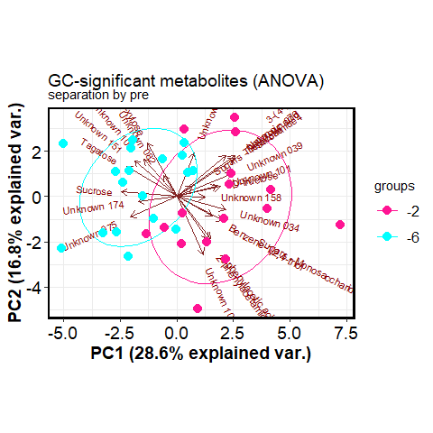
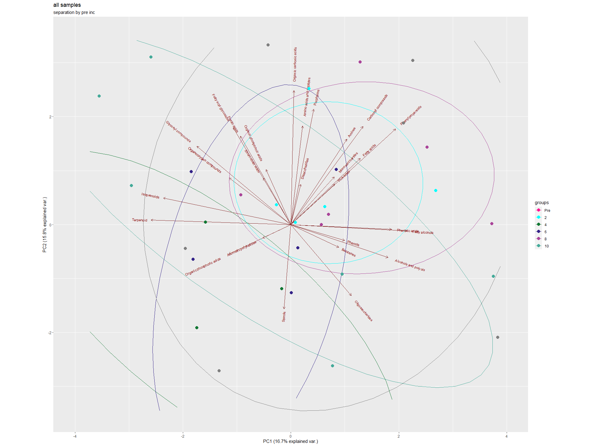
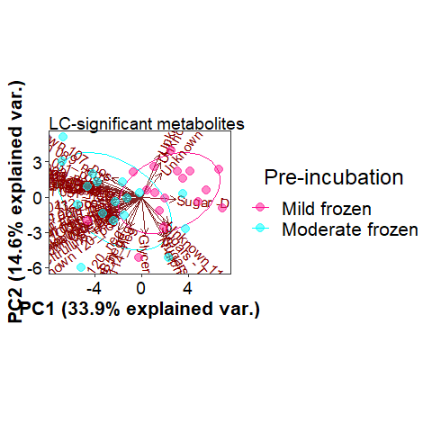
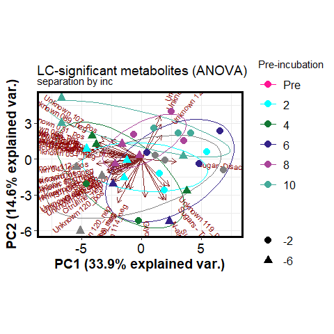
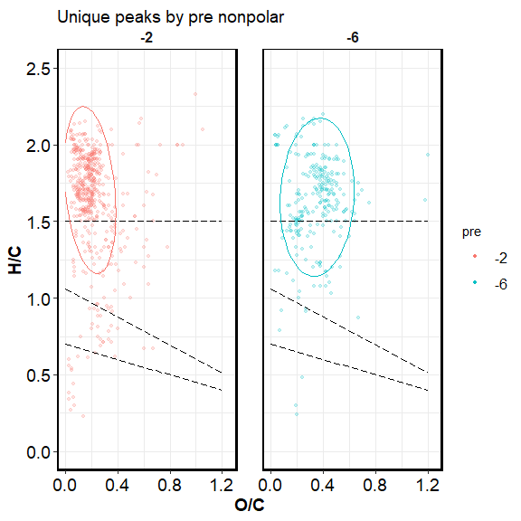
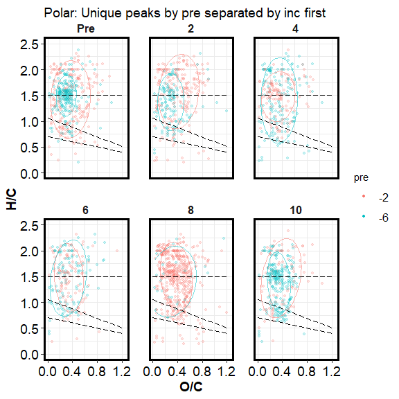
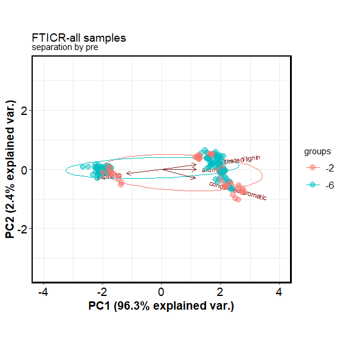

SCGSR final report
================
2023-06-21

## Sample Summary

click to open

Soils from northwest Alaska were homogenized and pre-incubated at -2 and
-6 degrees Celsius for three months after which they were incubated at
2,4,6,8,10 degrees Celsius for one week. After the week long incubation
soils were extracted using 0.5M K2SO4, and chloroform extracted to
measure microbial biomass and nutrient concentrations. Sub-samples were
also sent to PNNL for MPLEx (Methanol chloroform extraction) to provide
more comprehensive analysis of the molecular composition of organic
matter using FT-ICR, NMR, GC-MS and LC-MS techniques. Lipidomics were
also performed to ascertain if there were any significant shifts in
microbial biomass.

------------------------------------------------------------------------

## Respiration Results

click to open

Respiration measurements were taken daily during the incubation using a
Li-850 bench top respiration unit. Below are the respiration rates for
each sample, as well as the calculates total C respired. Linear mixed
effects model showed significant respiration variation by incubation and
pre incubation temperatures. An asterisks indicates a significant (p\<=
0.05, ANOVA) difference in pre-incubation temperature.

<!-- -->

------------------------------------------------------------------------

## Soil Nutrients

click to open

Soil K2SO4 extracts were utilized to measure ammonium, Nitrate, Total
free primary amines, phosphate, Total reducing sugars. Below are the
concentration data. An asterisks indicates a significant (p\<= 0.05,
ANOVA) difference in pre-incubation temperature.

<!-- -->
<!-- -->

------------------------------------------------------------------------

## Microbial Biomass

click to open

Soil K2SO4 extracts were utilized to measure ammonium, Nitrate, Total
free primary amines, phosphate, Total reducing sugars. Below is the
concentration data.An asterisks indicates a significant (p\<=
0.05,ANOVA) difference in pre-incubation temperature.

<!-- -->

------------------------------------------------------------------------

## GC-MS

click to open

Below is the relative quantification of compounds identified by gas
chromatography within the MPLEx extracts.Little to no variation was
identified that corresponds to the more broad metrics above in the soil
nutrient section. The majority of compounds measured were unidentified.
Volcano plot can be used to identify the compounds that are
significantly greater between pre incubation temperature (p\<0.05,
ANOVA). After which we used a PCA to visualize separation between the
pre incubation temperatures across significantly different compounds.
PERMANOVA results are displayed in the table below the PCAs to show
variation between treatments.

|          |  Df |  SumOfSqs |        R2 |        F | Pr(\>F) |
|:---------|----:|----------:|----------:|---------:|--------:|
| pre      |   1 | 0.0014341 | 0.1722985 | 7.519439 |   0.001 |
| inc      |   5 | 0.0014313 | 0.1719666 | 1.500991 |   0.088 |
| pre:inc  |   5 | 0.0012621 | 0.1516327 | 1.323509 |   0.152 |
| Residual |  22 | 0.0041957 | 0.5041023 |       NA |      NA |
| Total    |  33 | 0.0083231 | 1.0000000 |       NA |      NA |

Permanova results significant compounds only

------------------------------------------------------------------------

## LC-MS

click to open

Below is the relative quantification of compounds identified by liquid
chromatography within the MPLEx extracts.Little to no variation was
identified that corresponds to the more broad metrics above in the soil
nutrient section. The majority of compounds measured were unidentified.
Volcano plot can be used to identify the compounds that are
significantly greater between pre incubation temperature (p\<0.05,
ANOVA). After which we used a PCA to visualize separation between the
pre incubation temperatures across significantly different compounds.
PERMANOVA results are displayed in the table below the PCAs to show
variation between treatments.

|          |  Df |  SumOfSqs |        R2 |        F | Pr(\>F) |
|:---------|----:|----------:|----------:|---------:|--------:|
| pre      |   1 | 0.0023887 | 0.1496193 | 7.120665 |   0.001 |
| inc      |   5 | 0.0033118 | 0.2074340 | 1.974436 |   0.012 |
| pre:inc  |   5 | 0.0025492 | 0.1596711 | 1.519810 |   0.079 |
| Residual |  23 | 0.0077157 | 0.4832756 |       NA |      NA |
| Total    |  34 | 0.0159654 | 1.0000000 |       NA |      NA |

Permanova results significant compounds only

------------------------------------------------------------------------

## Lipids

click to open

Lipid analysis was done via liquid chrometography on MEPLEx extracts.
Some variation was identified between pre-incubation temperatures,
though little was biologically significant. Conclusion that small
changes in biomass were present but not significant. A big missing piece
to this analysis would be community composition.Little no no variation
was observed within this data set. PCAs below show little to no
seperation between incubation and pre incubation temperatures.

    ## NULL

<!-- --><!-- -->

|          |  Df |  SumOfSqs |        R2 |        F | Pr(\>F) |
|:---------|----:|----------:|----------:|---------:|--------:|
| Pre      |   1 | 0.0000127 | 0.0312988 | 1.259669 |   0.302 |
| Inc      |   5 | 0.0000742 | 0.1823599 | 1.467871 |   0.175 |
| Pre:Inc  |   5 | 0.0000773 | 0.1900165 | 1.529501 |   0.168 |
| Residual |  24 | 0.0002427 | 0.5963247 |       NA |      NA |
| Total    |  35 | 0.0004071 | 1.0000000 |       NA |      NA |

Permanova results all

    ## NULL

<!-- --><!-- -->

|          |  Df |  SumOfSqs |        R2 |         F | Pr(\>F) |
|:---------|----:|----------:|----------:|----------:|--------:|
| Pre      |   1 | 0.0000064 | 0.0153686 | 0.5551514 |   0.594 |
| Inc      |   5 | 0.0000636 | 0.1537306 | 1.1106287 |   0.366 |
| Pre:Inc  |   5 | 0.0000689 | 0.1664960 | 1.2028526 |   0.328 |
| Residual |  24 | 0.0002749 | 0.6644048 |        NA |      NA |
| Total    |  35 | 0.0004138 | 1.0000000 |        NA |      NA |

Permanova results pos

    ## NULL

<!-- --><!-- -->

|          |  Df |  SumOfSqs |        R2 |        F | Pr(\>F) |
|:---------|----:|----------:|----------:|---------:|--------:|
| Pre      |   1 | 0.0000268 | 0.0346902 | 1.933659 |   0.170 |
| Inc      |   5 | 0.0002308 | 0.2982330 | 3.324750 |   0.009 |
| Pre:Inc  |   5 | 0.0001830 | 0.2365126 | 2.636681 |   0.035 |
| Residual |  24 | 0.0003332 | 0.4305642 |       NA |      NA |
| Total    |  35 | 0.0007739 | 1.0000000 |       NA |      NA |

Permanova results neg

------------------------------------------------------------------------

## FT-MS (FT-ICR)

click to open

FTICR was performed on MEPLEx extracts to gain a qualitative
understanding of the changes in organic matter composition after the
incubation. There appear to be differences between pre-incubation
temperatures, particularly in terms of the number of unique compounds,
which could be indicative of microbial processing of organic matter and
production of new organic compounds.

### FTICR Van krevelen diagrams:

<!-- -->

<!-- -->

### FTICR Common vs unique peaks by treatment:

#### All

    ## NULL

<!-- -->

    ## NULL

<table>
<caption>
Unique between preincubation temperatures at each incubation temperature
</caption>
<thead>
<tr>
<th style="text-align:left;">
Class
</th>
<th style="text-align:right;">
-2_Pre
</th>
<th style="text-align:right;">
-6_Pre
</th>
<th style="text-align:right;">
-2_2
</th>
<th style="text-align:right;">
-6_2
</th>
<th style="text-align:right;">
-2_4
</th>
<th style="text-align:right;">
-6_4
</th>
<th style="text-align:right;">
-2_6
</th>
<th style="text-align:right;">
-6_6
</th>
<th style="text-align:right;">
-2_8
</th>
<th style="text-align:right;">
-6_8
</th>
<th style="text-align:right;">
-2_10
</th>
<th style="text-align:right;">
-6_10
</th>
</tr>
</thead>
<tbody>
<tr>
<td style="text-align:left;">
aliphatic
</td>
<td style="text-align:right;width: 3em; background-color: lightgrey !important;">
313
</td>
<td style="text-align:right;width: 4em; font-style: italic;border-right:1px solid;">
114
</td>
<td style="text-align:right;width: 3em; background-color: lightgrey !important;">
465
</td>
<td style="text-align:right;width: 4em; font-style: italic;border-right:1px solid;">
49
</td>
<td style="text-align:right;width: 3em; background-color: lightgrey !important;">
402
</td>
<td style="text-align:right;width: 4em; font-style: italic;border-right:1px solid;">
56
</td>
<td style="text-align:right;width: 3em; background-color: lightgrey !important;">
408
</td>
<td style="text-align:right;width: 4em; font-style: italic;border-right:1px solid;">
46
</td>
<td style="text-align:right;width: 3em; background-color: lightgrey !important;">
520
</td>
<td style="text-align:right;width: 4em; font-style: italic;border-right:1px solid;">
14
</td>
<td style="text-align:right;width: 3em; background-color: lightgrey !important;">
566
</td>
<td style="text-align:right;width: 4em; font-style: italic;border-right:1px solid;">
60
</td>
</tr>
<tr>
<td style="text-align:left;">
aromatic
</td>
<td style="text-align:right;width: 3em; background-color: lightgrey !important;">
34
</td>
<td style="text-align:right;width: 4em; font-style: italic;border-right:1px solid;">
13
</td>
<td style="text-align:right;width: 3em; background-color: lightgrey !important;">
18
</td>
<td style="text-align:right;width: 4em; font-style: italic;border-right:1px solid;">
16
</td>
<td style="text-align:right;width: 3em; background-color: lightgrey !important;">
21
</td>
<td style="text-align:right;width: 4em; font-style: italic;border-right:1px solid;">
14
</td>
<td style="text-align:right;width: 3em; background-color: lightgrey !important;">
13
</td>
<td style="text-align:right;width: 4em; font-style: italic;border-right:1px solid;">
18
</td>
<td style="text-align:right;width: 3em; background-color: lightgrey !important;">
48
</td>
<td style="text-align:right;width: 4em; font-style: italic;border-right:1px solid;">
3
</td>
<td style="text-align:right;width: 3em; background-color: lightgrey !important;">
21
</td>
<td style="text-align:right;width: 4em; font-style: italic;border-right:1px solid;">
35
</td>
</tr>
<tr>
<td style="text-align:left;">
condensed aromatic
</td>
<td style="text-align:right;width: 3em; background-color: lightgrey !important;">
15
</td>
<td style="text-align:right;width: 4em; font-style: italic;border-right:1px solid;">
2
</td>
<td style="text-align:right;width: 3em; background-color: lightgrey !important;">
27
</td>
<td style="text-align:right;width: 4em; font-style: italic;border-right:1px solid;">
3
</td>
<td style="text-align:right;width: 3em; background-color: lightgrey !important;">
NA
</td>
<td style="text-align:right;width: 4em; font-style: italic;border-right:1px solid;">
18
</td>
<td style="text-align:right;width: 3em; background-color: lightgrey !important;">
9
</td>
<td style="text-align:right;width: 4em; font-style: italic;border-right:1px solid;">
3
</td>
<td style="text-align:right;width: 3em; background-color: lightgrey !important;">
25
</td>
<td style="text-align:right;width: 4em; font-style: italic;border-right:1px solid;">
NA
</td>
<td style="text-align:right;width: 3em; background-color: lightgrey !important;">
7
</td>
<td style="text-align:right;width: 4em; font-style: italic;border-right:1px solid;">
9
</td>
</tr>
<tr>
<td style="text-align:left;">
unsaturated/lignin
</td>
<td style="text-align:right;width: 3em; background-color: lightgrey !important;">
85
</td>
<td style="text-align:right;width: 4em; font-style: italic;border-right:1px solid;">
79
</td>
<td style="text-align:right;width: 3em; background-color: lightgrey !important;">
86
</td>
<td style="text-align:right;width: 4em; font-style: italic;border-right:1px solid;">
54
</td>
<td style="text-align:right;width: 3em; background-color: lightgrey !important;">
69
</td>
<td style="text-align:right;width: 4em; font-style: italic;border-right:1px solid;">
42
</td>
<td style="text-align:right;width: 3em; background-color: lightgrey !important;">
57
</td>
<td style="text-align:right;width: 4em; font-style: italic;border-right:1px solid;">
27
</td>
<td style="text-align:right;width: 3em; background-color: lightgrey !important;">
166
</td>
<td style="text-align:right;width: 4em; font-style: italic;border-right:1px solid;">
9
</td>
<td style="text-align:right;width: 3em; background-color: lightgrey !important;">
69
</td>
<td style="text-align:right;width: 4em; font-style: italic;border-right:1px solid;">
75
</td>
</tr>
</tbody>
</table>

#### Polar

    ## NULL

<!-- -->

    ## NULL

<table>
<caption>
Unique between preincubation temperatures at each incubation temperature
polar
</caption>
<thead>
<tr>
<th style="text-align:left;">
Class
</th>
<th style="text-align:right;">
-2_Pre
</th>
<th style="text-align:right;">
-6_Pre
</th>
<th style="text-align:right;">
-2_2
</th>
<th style="text-align:right;">
-6_2
</th>
<th style="text-align:right;">
-2_4
</th>
<th style="text-align:right;">
-6_4
</th>
<th style="text-align:right;">
-2_6
</th>
<th style="text-align:right;">
-6_6
</th>
<th style="text-align:right;">
-2_8
</th>
<th style="text-align:right;">
-6_8
</th>
<th style="text-align:right;">
-2_10
</th>
<th style="text-align:right;">
-6_10
</th>
</tr>
</thead>
<tbody>
<tr>
<td style="text-align:left;">
aliphatic
</td>
<td style="text-align:right;width: 3em; background-color: lightgrey !important;">
100
</td>
<td style="text-align:right;width: 4em; font-style: italic;border-right:1px solid;">
126
</td>
<td style="text-align:right;width: 3em; background-color: lightgrey !important;">
122
</td>
<td style="text-align:right;width: 4em; font-style: italic;border-right:1px solid;">
50
</td>
<td style="text-align:right;width: 3em; background-color: lightgrey !important;">
67
</td>
<td style="text-align:right;width: 4em; font-style: italic;border-right:1px solid;">
74
</td>
<td style="text-align:right;width: 3em; background-color: lightgrey !important;">
57
</td>
<td style="text-align:right;width: 4em; font-style: italic;border-right:1px solid;">
63
</td>
<td style="text-align:right;width: 3em; background-color: lightgrey !important;">
265
</td>
<td style="text-align:right;width: 4em; font-style: italic;border-right:1px solid;">
13
</td>
<td style="text-align:right;width: 3em; background-color: lightgrey !important;">
46
</td>
<td style="text-align:right;width: 4em; font-style: italic;border-right:1px solid;">
105
</td>
</tr>
<tr>
<td style="text-align:left;">
aromatic
</td>
<td style="text-align:right;width: 3em; background-color: lightgrey !important;">
28
</td>
<td style="text-align:right;width: 4em; font-style: italic;border-right:1px solid;">
14
</td>
<td style="text-align:right;width: 3em; background-color: lightgrey !important;">
10
</td>
<td style="text-align:right;width: 4em; font-style: italic;border-right:1px solid;">
17
</td>
<td style="text-align:right;width: 3em; background-color: lightgrey !important;">
12
</td>
<td style="text-align:right;width: 4em; font-style: italic;border-right:1px solid;">
14
</td>
<td style="text-align:right;width: 3em; background-color: lightgrey !important;">
8
</td>
<td style="text-align:right;width: 4em; font-style: italic;border-right:1px solid;">
20
</td>
<td style="text-align:right;width: 3em; background-color: lightgrey !important;">
42
</td>
<td style="text-align:right;width: 4em; font-style: italic;border-right:1px solid;">
3
</td>
<td style="text-align:right;width: 3em; background-color: lightgrey !important;">
10
</td>
<td style="text-align:right;width: 4em; font-style: italic;border-right:1px solid;">
38
</td>
</tr>
<tr>
<td style="text-align:left;">
condensed aromatic
</td>
<td style="text-align:right;width: 3em; background-color: lightgrey !important;">
13
</td>
<td style="text-align:right;width: 4em; font-style: italic;border-right:1px solid;">
3
</td>
<td style="text-align:right;width: 3em; background-color: lightgrey !important;">
18
</td>
<td style="text-align:right;width: 4em; font-style: italic;border-right:1px solid;">
3
</td>
<td style="text-align:right;width: 3em; background-color: lightgrey !important;">
NA
</td>
<td style="text-align:right;width: 4em; font-style: italic;border-right:1px solid;">
18
</td>
<td style="text-align:right;width: 3em; background-color: lightgrey !important;">
7
</td>
<td style="text-align:right;width: 4em; font-style: italic;border-right:1px solid;">
3
</td>
<td style="text-align:right;width: 3em; background-color: lightgrey !important;">
24
</td>
<td style="text-align:right;width: 4em; font-style: italic;border-right:1px solid;">
NA
</td>
<td style="text-align:right;width: 3em; background-color: lightgrey !important;">
4
</td>
<td style="text-align:right;width: 4em; font-style: italic;border-right:1px solid;">
10
</td>
</tr>
<tr>
<td style="text-align:left;">
unsaturated/lignin
</td>
<td style="text-align:right;width: 3em; background-color: lightgrey !important;">
67
</td>
<td style="text-align:right;width: 4em; font-style: italic;border-right:1px solid;">
84
</td>
<td style="text-align:right;width: 3em; background-color: lightgrey !important;">
42
</td>
<td style="text-align:right;width: 4em; font-style: italic;border-right:1px solid;">
60
</td>
<td style="text-align:right;width: 3em; background-color: lightgrey !important;">
45
</td>
<td style="text-align:right;width: 4em; font-style: italic;border-right:1px solid;">
43
</td>
<td style="text-align:right;width: 3em; background-color: lightgrey !important;">
31
</td>
<td style="text-align:right;width: 4em; font-style: italic;border-right:1px solid;">
28
</td>
<td style="text-align:right;width: 3em; background-color: lightgrey !important;">
142
</td>
<td style="text-align:right;width: 4em; font-style: italic;border-right:1px solid;">
9
</td>
<td style="text-align:right;width: 3em; background-color: lightgrey !important;">
28
</td>
<td style="text-align:right;width: 4em; font-style: italic;border-right:1px solid;">
84
</td>
</tr>
</tbody>
</table>

#### Non-Polar

    ## NULL

<!-- -->

    ## NULL

<table>
<caption>
Unique between preincubation temperatures at each incubation temperature
nonpolar
</caption>
<thead>
<tr>
<th style="text-align:left;">
Class
</th>
<th style="text-align:right;">
-2_Pre
</th>
<th style="text-align:right;">
-6_Pre
</th>
<th style="text-align:right;">
-2_2
</th>
<th style="text-align:right;">
-6_2
</th>
<th style="text-align:right;">
-2_4
</th>
<th style="text-align:right;">
-6_4
</th>
<th style="text-align:right;">
-2_6
</th>
<th style="text-align:right;">
-6_6
</th>
<th style="text-align:right;">
-2_8
</th>
<th style="text-align:right;">
-6_8
</th>
<th style="text-align:right;">
-2_10
</th>
<th style="text-align:right;">
-6_10
</th>
</tr>
</thead>
<tbody>
<tr>
<td style="text-align:left;">
aliphatic
</td>
<td style="text-align:right;width: 3em; background-color: lightgrey !important;">
272
</td>
<td style="text-align:right;width: 4em; font-style: italic;border-right:1px solid;">
34
</td>
<td style="text-align:right;width: 3em; background-color: lightgrey !important;">
456
</td>
<td style="text-align:right;width: 4em; font-style: italic;border-right:1px solid;">
15
</td>
<td style="text-align:right;width: 3em; background-color: lightgrey !important;">
445
</td>
<td style="text-align:right;width: 4em; font-style: italic;border-right:1px solid;">
13
</td>
<td style="text-align:right;width: 3em; background-color: lightgrey !important;">
449
</td>
<td style="text-align:right;width: 4em; font-style: italic;border-right:1px solid;">
3
</td>
<td style="text-align:right;width: 3em; background-color: lightgrey !important;">
411
</td>
<td style="text-align:right;width: 4em; font-style: italic;border-right:1px solid;">
8
</td>
<td style="text-align:right;width: 3em; background-color: lightgrey !important;">
633
</td>
<td style="text-align:right;width: 4em; font-style: italic;border-right:1px solid;">
3
</td>
</tr>
<tr>
<td style="text-align:left;">
aromatic
</td>
<td style="text-align:right;width: 3em; background-color: lightgrey !important;">
13
</td>
<td style="text-align:right;width: 4em; font-style: italic;border-right:1px solid;">
1
</td>
<td style="text-align:right;width: 3em; background-color: lightgrey !important;">
13
</td>
<td style="text-align:right;width: 4em; font-style: italic;border-right:1px solid;">
1
</td>
<td style="text-align:right;width: 3em; background-color: lightgrey !important;">
14
</td>
<td style="text-align:right;width: 4em; font-style: italic;border-right:1px solid;">
NA
</td>
<td style="text-align:right;width: 3em; background-color: lightgrey !important;">
10
</td>
<td style="text-align:right;width: 4em; font-style: italic;border-right:1px solid;">
NA
</td>
<td style="text-align:right;width: 3em; background-color: lightgrey !important;">
11
</td>
<td style="text-align:right;width: 4em; font-style: italic;border-right:1px solid;">
1
</td>
<td style="text-align:right;width: 3em; background-color: lightgrey !important;">
20
</td>
<td style="text-align:right;width: 4em; font-style: italic;border-right:1px solid;">
NA
</td>
</tr>
<tr>
<td style="text-align:left;">
condensed aromatic
</td>
<td style="text-align:right;width: 3em; background-color: lightgrey !important;">
5
</td>
<td style="text-align:right;width: 4em; font-style: italic;border-right:1px solid;">
NA
</td>
<td style="text-align:right;width: 3em; background-color: lightgrey !important;">
11
</td>
<td style="text-align:right;width: 4em; font-style: italic;border-right:1px solid;">
NA
</td>
<td style="text-align:right;width: 3em; background-color: lightgrey !important;">
2
</td>
<td style="text-align:right;width: 4em; font-style: italic;border-right:1px solid;">
NA
</td>
<td style="text-align:right;width: 3em; background-color: lightgrey !important;">
3
</td>
<td style="text-align:right;width: 4em; font-style: italic;border-right:1px solid;">
NA
</td>
<td style="text-align:right;width: 3em; background-color: lightgrey !important;">
4
</td>
<td style="text-align:right;width: 4em; font-style: italic;border-right:1px solid;">
NA
</td>
<td style="text-align:right;width: 3em; background-color: lightgrey !important;">
4
</td>
<td style="text-align:right;width: 4em; font-style: italic;border-right:1px solid;">
NA
</td>
</tr>
<tr>
<td style="text-align:left;">
unsaturated/lignin
</td>
<td style="text-align:right;width: 3em; background-color: lightgrey !important;">
49
</td>
<td style="text-align:right;width: 4em; font-style: italic;border-right:1px solid;">
20
</td>
<td style="text-align:right;width: 3em; background-color: lightgrey !important;">
111
</td>
<td style="text-align:right;width: 4em; font-style: italic;border-right:1px solid;">
3
</td>
<td style="text-align:right;width: 3em; background-color: lightgrey !important;">
77
</td>
<td style="text-align:right;width: 4em; font-style: italic;border-right:1px solid;">
6
</td>
<td style="text-align:right;width: 3em; background-color: lightgrey !important;">
102
</td>
<td style="text-align:right;width: 4em; font-style: italic;border-right:1px solid;">
NA
</td>
<td style="text-align:right;width: 3em; background-color: lightgrey !important;">
68
</td>
<td style="text-align:right;width: 4em; font-style: italic;border-right:1px solid;">
2
</td>
<td style="text-align:right;width: 3em; background-color: lightgrey !important;">
116
</td>
<td style="text-align:right;width: 4em; font-style: italic;border-right:1px solid;">
1
</td>
</tr>
</tbody>
</table>

### FTICR relative abundance and PCAs:

#### Relative Abundance

    ## NULL

<!-- -->

    ## NULL

<!-- -->

    ## NULL

<!-- -->

#### PCA results:

------------------------------------------------------------------------

## Session Info

Session Info

Date run: 2023-06-21

    ## R version 4.2.3 (2023-03-15 ucrt)
    ## Platform: x86_64-w64-mingw32/x64 (64-bit)
    ## Running under: Windows 10 x64 (build 19045)
    ## 
    ## Matrix products: default
    ## 
    ## locale:
    ## [1] LC_COLLATE=English_United States.utf8 
    ## [2] LC_CTYPE=English_United States.utf8   
    ## [3] LC_MONETARY=English_United States.utf8
    ## [4] LC_NUMERIC=C                          
    ## [5] LC_TIME=English_United States.utf8    
    ## 
    ## attached base packages:
    ## [1] grid      stats     graphics  grDevices utils     datasets  methods  
    ## [8] base     
    ## 
    ## other attached packages:
    ##  [1] trelliscopejs_0.2.6 pmartR_2.3.0        agricolae_1.3-5    
    ##  [4] knitr_1.42          nlme_3.1-162        cowplot_1.1.1      
    ##  [7] ggpubr_0.6.0        janitor_2.2.0       pracma_2.4.2       
    ## [10] reshape2_1.4.4      ggbiplot_0.55       scales_1.2.1.9000  
    ## [13] plyr_1.8.8          vegan_2.6-4         lattice_0.20-45    
    ## [16] permute_0.9-7       lubridate_1.9.2     forcats_1.0.0      
    ## [19] stringr_1.5.0       dplyr_1.1.1         purrr_1.0.1        
    ## [22] readr_2.1.4         tidyr_1.3.0         tibble_3.2.1       
    ## [25] ggplot2_3.4.1       tidyverse_2.0.0     tarchetypes_0.7.6  
    ## [28] targets_0.14.3     
    ## 
    ## loaded via a namespace (and not attached):
    ##  [1] colorspace_2.1-0        ggsignif_0.6.4          ellipsis_0.3.2         
    ##  [4] mclust_6.0.0            snakecase_0.11.0        base64enc_0.1-3        
    ##  [7] fs_1.6.2                rstudioapi_0.14         farver_2.1.1           
    ## [10] listenv_0.9.0           furrr_0.3.1             fansi_1.0.4            
    ## [13] codetools_0.2-19        splines_4.2.3           jsonlite_1.8.4         
    ## [16] broom_1.0.4             cluster_2.1.4           shiny_1.7.4            
    ## [19] httr_1.4.6              compiler_4.2.3          backports_1.4.1        
    ## [22] lazyeval_0.2.2          Matrix_1.5-4            fastmap_1.1.1          
    ## [25] cli_3.6.0               later_1.3.0             htmltools_0.5.4        
    ## [28] prettyunits_1.1.1       tools_4.2.3             igraph_1.4.1           
    ## [31] gtable_0.3.3            glue_1.6.2              Rcpp_1.0.10            
    ## [34] carData_3.0-5           vctrs_0.6.0             iterators_1.0.14       
    ## [37] autocogs_0.1.4          xfun_0.38               globals_0.16.2         
    ## [40] ps_1.7.2                timechange_0.2.0        mime_0.12              
    ## [43] miniUI_0.1.1.1          lifecycle_1.0.3         rstatix_0.7.2          
    ## [46] future_1.32.0           MASS_7.3-60             DistributionUtils_0.6-0
    ## [49] hms_1.1.3               promises_1.2.0.1        parallel_4.2.3         
    ## [52] yaml_2.3.7              labelled_2.11.0         ggExtra_0.10.0         
    ## [55] stringi_1.7.12          highr_0.10              klaR_1.7-2             
    ## [58] AlgDesign_1.2.1         foreach_1.5.2           checkmate_2.2.0        
    ## [61] rlang_1.1.0             pkgconfig_2.0.3         evaluate_0.21          
    ## [64] labeling_0.4.2          htmlwidgets_1.6.2       processx_3.8.0         
    ## [67] tidyselect_1.2.0        parallelly_1.35.0       magrittr_2.0.3         
    ## [70] R6_2.5.1                generics_0.1.3          base64url_1.4          
    ## [73] combinat_0.0-8          pillar_1.9.0            haven_2.5.2            
    ## [76] withr_2.5.0             mgcv_1.8-42             abind_1.4-5            
    ## [79] crayon_1.5.2            car_3.1-2               questionr_0.7.8        
    ## [82] utf8_1.2.3              plotly_4.10.2.9000      rmarkdown_2.21         
    ## [85] tzdb_0.3.0              future.callr_0.8.1      progress_1.2.2         
    ## [88] data.table_1.14.8       callr_3.7.3             webshot_0.5.4          
    ## [91] digest_0.6.31           xtable_1.8-4            httpuv_1.6.9           
    ## [94] munsell_0.5.0           viridisLite_0.4.2

