SCGSR final report
================
2023-05-03

## Sample Summary

click to open

Soils from northwest Alaska were homogenized and pre-incubated at -2 and
-6 degrees Celsius for three months after which they were incubated at
2,4,6,8,10 degrees Celsius for one week. After the week long incubation
soils were extracted using 0.5M K2SO4, and chloroform extracted to
measure microbial biomass and nutrient concentrations. Sub-samples were
also sent to PNNL for MPLEx (Methanol chloroform extraction) to provide
more comprehensive analysis of the molecular composition of organic
matter using FT-ICR, NMR, GC-MS and LC-MS techniques. Lipidomics were
also performed to ascertain if there were any significant shifts in
microbial biomass.

| Replicate | Pre.incubation | Incubation.ID | Incubation.temperauture | ID              | UUID                                 | X   |
|----------:|---------------:|:--------------|------------------------:|:----------------|:-------------------------------------|:----|
|         1 |             -2 | A             |                       2 | A-2-1           | 8656c258-a0e4-4755-81ed-f1d862112621 | NA  |
|         2 |             -2 | A             |                       2 | A-2-2           | 04cbe581-cd60-44ff-8322-e3c9d0f83b9b | NA  |
|         3 |             -2 | A             |                       2 | A-2-3           | 5476356e-c64f-4057-80c1-f75c811fd36e | NA  |
|         1 |             -6 | A             |                       2 | A-6-1           | 23e00139-06b9-4e24-9999-02f36c313389 | NA  |
|         2 |             -6 | A             |                       2 | A-6-2           | 0377bae3-d808-4dde-a8a3-9b68d5ef26de | NA  |
|         3 |             -6 | A             |                       2 | A-6-3           | 537028bc-b721-4650-9b07-7e9a120a86d5 | NA  |
|         1 |             -2 | B             |                       4 | B-2-1           | 440dba45-293d-4a1b-bd7e-25ab39357fa2 | NA  |
|         2 |             -2 | B             |                       4 | B-2-2           | 8245ad28-be7f-4252-a46d-5fd861c420f5 | NA  |
|         3 |             -2 | B             |                       4 | B-2-3           | 1d3baff5-e4c8-4a89-a6c1-8cff831fec47 | NA  |
|         1 |             -6 | B             |                       4 | B-6-1           | a045cdb7-4657-4366-ab08-a49b9c9780ae | NA  |
|         2 |             -6 | B             |                       4 | B-6-2           | ed8616cf-0423-43c6-a1dd-ec97431309c9 | NA  |
|         3 |             -6 | B             |                       4 | B-6-3           | 44e660ac-df81-410a-b264-e345291f1872 | NA  |
|         1 |             -2 | C             |                       6 | C-2-1           | dd528c4e-3d60-40c8-b3a6-accce911cbf9 | NA  |
|         2 |             -2 | C             |                       6 | C-2-2           | 3efde34c-2e51-4560-bfcb-164de36e563e | NA  |
|         3 |             -2 | C             |                       6 | C-2-3           | 96d60bed-37ab-4d96-818d-e43353b81425 | NA  |
|         1 |             -6 | C             |                       6 | C-6-1           | d8d73f99-589b-4559-97b6-107d71c0688c | NA  |
|         2 |             -6 | C             |                       6 | C-6-2           | fce12027-06e4-41d8-9c98-645c90cdf058 | NA  |
|         3 |             -6 | C             |                       6 | C-6-3           | 580e2f97-ae86-4b45-ae91-5f8be28d57f1 | NA  |
|         1 |             -2 | D             |                       8 | D-2-1           | a3edfe91-4286-4ded-9d74-6e59008a0f0b | NA  |
|         2 |             -2 | D             |                       8 | D-2-2           | 587708ea-5a51-49ee-b7b2-aaff43016145 | NA  |
|         3 |             -2 | D             |                       8 | D-2-3           | 571d8331-5027-49c6-9ee0-362ed7654dc5 | NA  |
|         1 |             -6 | D             |                       8 | D-6-1           | 48c5aae9-6684-4f19-bea2-28698eed6d5b | NA  |
|         2 |             -6 | D             |                       8 | D-6-2           | dc8d0e75-f57d-4236-9ef5-523c6bd7e2e1 | NA  |
|         3 |             -6 | D             |                       8 | D-6-3           | da4b7b0d-51ea-43e9-9db0-768352f0dc52 | NA  |
|         1 |             -2 | E             |                      10 | E-2-1           | 51bdcfb0-b98e-4b6d-9271-f857553c99ee | NA  |
|         2 |             -2 | E             |                      10 | E-2-2           | 1c00ea1c-ab85-41b9-9713-7f74f1aaa2fb | NA  |
|         3 |             -2 | E             |                      10 | E-2-3           | 4270be4e-67fc-4f42-811c-bb85d271bf86 | NA  |
|         1 |             -6 | E             |                      10 | E-6-1           | a5f82baa-555e-48ef-bc79-8febae160345 | NA  |
|         2 |             -6 | E             |                      10 | E-6-2           | 3bac6092-7564-4731-8411-8b5f2df33f3f | NA  |
|         3 |             -6 | E             |                      10 | E-6-3           | cefe1d73-c95e-430f-a38a-130e61f11fc9 | NA  |
|         1 |             -2 | Pre           |                      -2 | Pre-2-1         | 0301b210-e061-4847-8236-55b4604e86b9 | NA  |
|         2 |             -2 | Pre           |                      -2 | Pre-2-2         | d07b9001-0b93-4a1a-92b7-70b238a58a2c | NA  |
|         3 |             -2 | Pre           |                      -2 | Pre-2-3         | 392fb7a7-e664-482e-90e7-87a2b5fbaa6e | NA  |
|         1 |             -6 | Pre           |                      -6 | Pre-6-1         | 504ecbd1-d7bc-4c8f-9ec9-1d345bff218d | NA  |
|         2 |             -6 | Pre           |                      -6 | Pre-6-2         | a389c91b-9593-4b0f-84e7-b911e099c3e3 | NA  |
|         3 |             -6 | Pre           |                      -6 | Pre-6-3         | dec78bde-1a26-4368-a537-5b480888b90b | NA  |
|        NA |             NA |               |                      NA | Source material | e6b98a07-c63b-47a7-b872-e99320205b34 | NA  |

------------------------------------------------------------------------

## Respiration Results

click to open

Respiration measurements were taken daily during the incubation using a
Li-850 bench top respiration unit. Below are the respiration rates for
each sample, as well as the calculates total C respired.

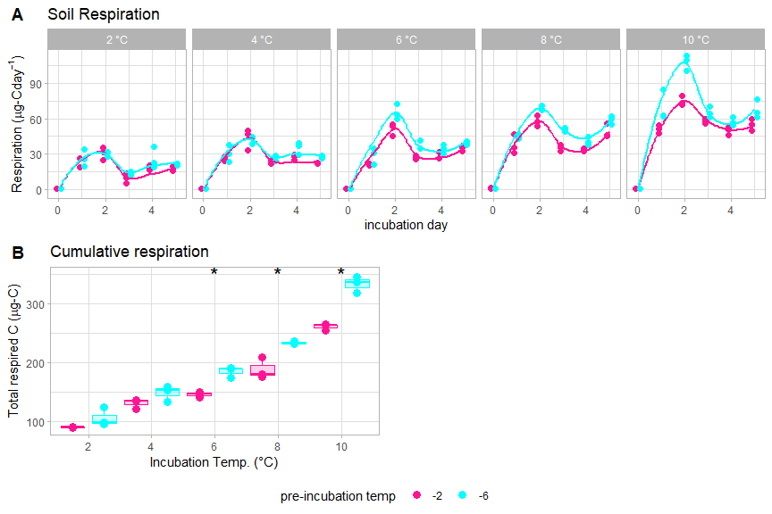<!-- -->

|           n | umDF d | enDF |  F-value   |  p-value  |
|------------:|--------|:-----|:----------:|:---------:|
| (Intercept) | 1      | 149  | 673.355930 | 0.0000000 |
|         JD2 | 1      | 149  | 40.135389  | 0.0000000 |
|    Inc_temp | 1      | 27   | 91.448720  | 0.0000000 |
|     pre_inc | 1      | 27   |  6.956082  | 0.0136884 |

    ##             Df Sum Sq Mean Sq F value   Pr(>F)    
    ## pre_inc      1  10682   10682   22.84 5.51e-05 ***
    ## Inc_temp     1 132694  132694  283.75 7.53e-16 ***
    ## Residuals   27  12627     468                     
    ## ---
    ## Signif. codes:  0 '***' 0.001 '**' 0.01 '*' 0.05 '.' 0.1 ' ' 1

------------------------------------------------------------------------

## Soil Nutrients

click to open

Soil K2SO4 extracts were utilized to measure ammonium, Nitrate, Total
free primary amines, phosphate, Total reducing sugars. Below are the
concentration data. An asterisks indicates a significant (p\<= 0.05)
difference in pre-incubation temperature.

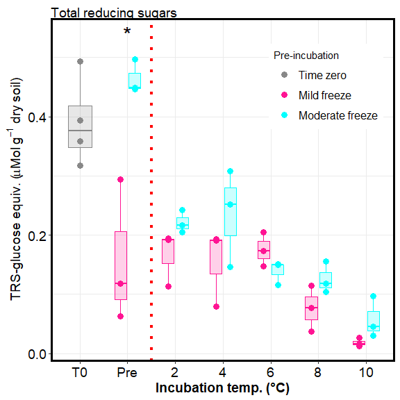<!-- -->
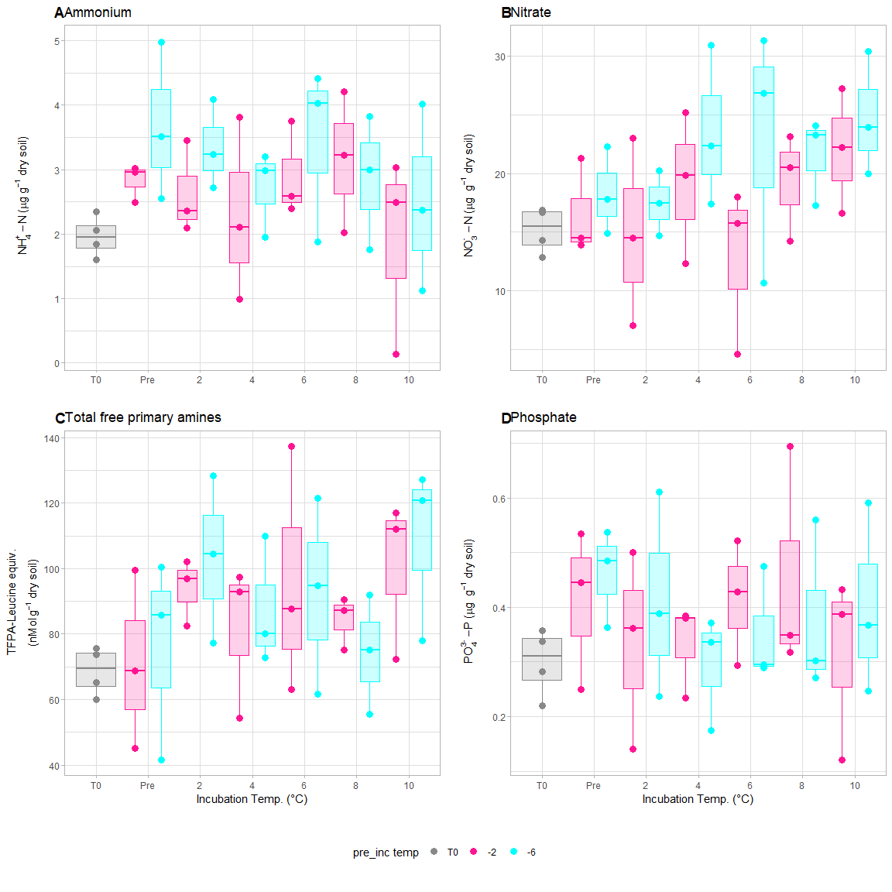<!-- -->

| analyte | term             |  df |        sumsq |       meansq |  statistic |   p.value | asterisk |
|:--------|:-----------------|----:|-------------:|-------------:|-----------:|----------:|:---------|
| NH4     | pre_inc          |   2 | 2.146117e+00 |    1.0730587 |  0.9493991 | 0.4016231 | NA       |
| NH4     | Inc_temp         |   5 | 4.072849e+00 |    0.8145698 |  0.7206986 | 0.6146177 | NA       |
| NH4     | pre_inc:Inc_temp |   5 | 9.671207e-01 |    0.1934241 |  0.1711339 | 0.9706936 | NA       |
| NH4     | Residuals        |  23 | 2.599576e+01 |    1.1302503 |         NA |        NA | NA       |
| NO3     | pre_inc          |   2 | 2.242756e+02 |  112.1377965 |  2.9983485 | 0.0696405 | NA       |
| NO3     | Inc_temp         |   5 | 2.223114e+02 |   44.4622878 |  1.1888359 | 0.3452741 | NA       |
| NO3     | pre_inc:Inc_temp |   5 | 6.752124e+01 |   13.5042488 |  0.3610776 | 0.8697562 | NA       |
| NO3     | Residuals        |  23 | 8.601966e+02 |   37.3998535 |         NA |        NA | NA       |
| PO4     | pre_inc          |   2 | 2.504600e-03 |    0.0012523 |  0.0597511 | 0.9421447 | NA       |
| PO4     | Inc_temp         |   5 | 9.523150e-02 |    0.0190463 |  0.9087411 | 0.4925102 | NA       |
| PO4     | pre_inc:Inc_temp |   5 | 3.795490e-02 |    0.0075910 |  0.3621820 | 0.8690340 | NA       |
| PO4     | Residuals        |  23 | 4.820571e-01 |    0.0209590 |         NA |        NA | NA       |
| TFPA    | pre_inc          |   2 | 4.188969e+02 |  209.4484748 |  0.3780633 | 0.6893668 | NA       |
| TFPA    | Inc_temp         |   5 | 6.149137e+03 | 1229.8273211 |  2.2198899 | 0.0869289 | NA       |
| TFPA    | pre_inc:Inc_temp |   5 | 4.486744e+02 |   89.7348786 |  0.1619752 | 0.9739754 | NA       |
| TFPA    | Residuals        |  23 | 1.274209e+04 |  554.0037414 |         NA |        NA | NA       |
| TRS     | pre_inc          |   2 | 1.448907e-01 |    0.0724454 | 42.0381109 | 0.0000000 | \*       |
| TRS     | Inc_temp         |   5 | 1.822171e-01 |    0.0364434 | 21.1471412 | 0.0000001 | \*       |
| TRS     | pre_inc:Inc_temp |   5 | 1.165281e-01 |    0.0233056 | 13.5236326 | 0.0000033 | \*       |
| TRS     | Residuals        |  23 | 3.963650e-02 |    0.0017233 |         NA |        NA | NA       |

Extraction ANOVA results nutrients and TRS

------------------------------------------------------------------------

## Microbial Biomass

click to open

Soil K2SO4 extracts were utilized to measure ammonium, Nitrate, Total
free primary amines, phosphate, Total reducing sugars. Below is the
concentration data.An asterisks indicates a significant (p\<= 0.05)
difference in pre-incubation temperature.

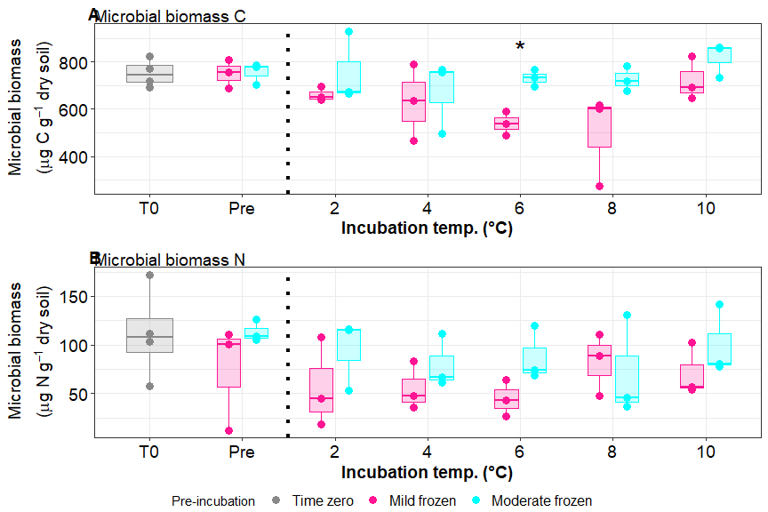<!-- -->

| analyte | term             |  df |      sumsq |     meansq | statistic |   p.value | asterisk |
|:--------|:-----------------|----:|-----------:|-----------:|----------:|----------:|:---------|
| MBC     | pre_inc          |   2 | 120213.484 | 60106.7422 | 5.1910967 | 0.0137863 | \*       |
| MBC     | Inc_temp         |   5 | 137188.626 | 27437.7252 | 2.3696491 | 0.0712674 | NA       |
| MBC     | pre_inc:Inc_temp |   5 |  50703.129 | 10140.6258 | 0.8757914 | 0.5126424 | NA       |
| MBC     | Residuals        |  23 | 266312.717 | 11578.8138 |        NA |        NA | NA       |
| MBN     | pre_inc          |   2 |   7126.838 |  3563.4189 | 2.8206592 | 0.0802510 | NA       |
| MBN     | Inc_temp         |   5 |   2074.324 |   414.8649 | 0.3283903 | 0.8906130 | NA       |
| MBN     | pre_inc:Inc_temp |   5 |   3892.345 |   778.4691 | 0.6162048 | 0.6886524 | NA       |
| MBN     | Residuals        |  23 |  29056.553 |  1263.3284 |        NA |        NA | NA       |

Extraction ANOVA results microbial biomass

------------------------------------------------------------------------

## GC-MS

click to open

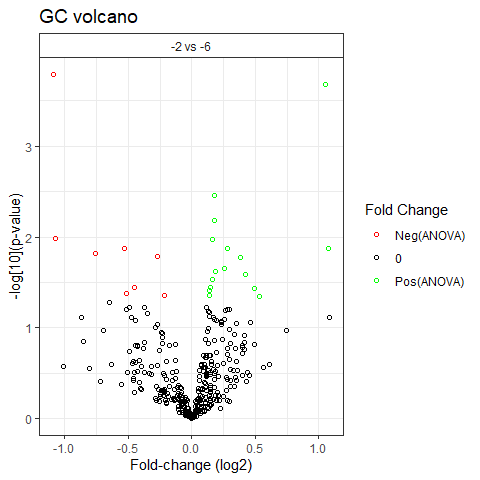<!-- -->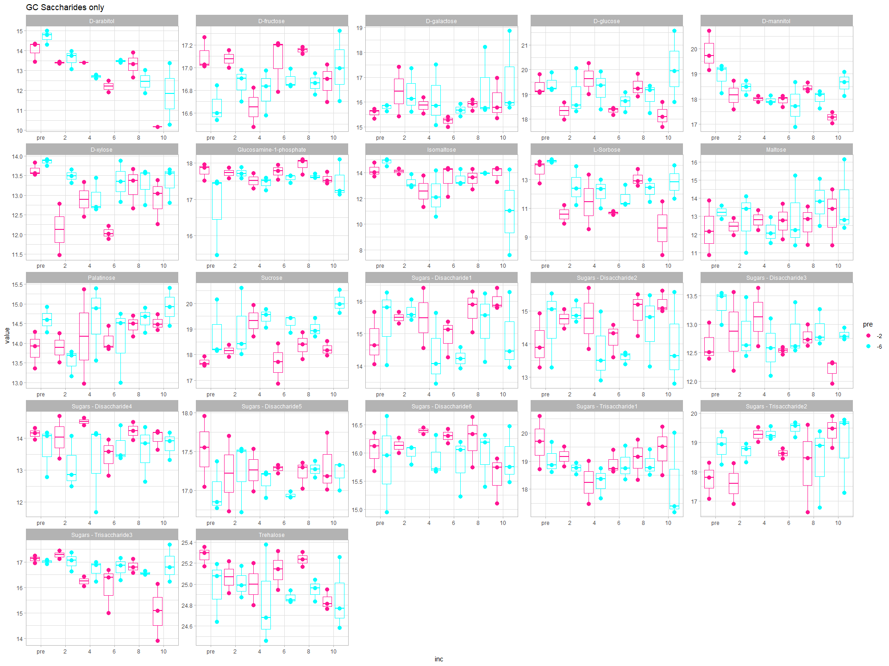<!-- -->

click to open ANOVA table

| Metabolites                                                                              | Count\_-2_4 | Count\_-6_pre | Count\_-6_6 | Count\_-6_8 | Count\_-2_10 | Count\_-6_10 | Count\_-2_8 | Count\_-2_6 | Count\_-6_2 | Count\_-6_4 | Count\_-2_pre | Count\_-2_2 | Mean\_-2_4 | Mean\_-6_pre | Mean\_-6_6 | Mean\_-6_8 | Mean\_-2_10 | Mean\_-6_10 | Mean\_-2_8 | Mean\_-2_6 | Mean\_-6_2 | Mean\_-6_4 | Mean\_-2_pre | Mean\_-2_2 | P_value_A\_-2_4\_vs\_-6_4 | P_value_A\_-6_pre_vs\_-2_pre | P_value_A\_-6_6\_vs\_-2_6 | P_value_A\_-6_8\_vs\_-2_8 | P_value_A\_-2_10_vs\_-6_10 | P_value_A\_-6_2\_vs\_-2_2 | Flag_A\_-2_4\_vs\_-6_4 | Flag_A\_-6_pre_vs\_-2_pre | Flag_A\_-6_6\_vs\_-2_6 | Flag_A\_-6_8\_vs\_-2_8 | Flag_A\_-2_10_vs\_-6_10 | Flag_A\_-6_2\_vs\_-2_2 |
|:-----------------------------------------------------------------------------------------|------------:|--------------:|------------:|------------:|-------------:|-------------:|------------:|------------:|------------:|------------:|--------------:|------------:|-----------:|-------------:|-----------:|-----------:|------------:|------------:|-----------:|-----------:|-----------:|-----------:|-------------:|-----------:|--------------------------:|-----------------------------:|--------------------------:|--------------------------:|---------------------------:|--------------------------:|-----------------------:|--------------------------:|-----------------------:|-----------------------:|------------------------:|-----------------------:|
| 1-hexadecanol                                                                            |           2 |             3 |           3 |           3 |            3 |            3 |           3 |           3 |           3 |           3 |             3 |           2 |   12.82688 |     12.73994 |   13.22996 |   13.09522 |   13.173065 |    12.56111 |   13.59367 |   13.28994 |   13.42159 |   13.20033 |     13.43485 |  13.286321 |                 0.2831971 |                    0.0320738 |                 0.8452216 |                 0.1148983 |                  0.0562394 |                 0.6941402 |                      0 |                        -1 |                      0 |                      0 |                       0 |                      0 |
| 2-furoic acid                                                                            |           2 |             3 |           3 |           3 |            3 |            3 |           3 |           3 |           3 |           3 |             3 |           2 |   14.07959 |     15.05207 |   14.30400 |   15.25427 |   15.589588 |    15.67322 |   15.98288 |   15.92840 |   14.99955 |   14.23008 |     13.35880 |  15.222577 |                 0.8801254 |                    0.0680019 |                 0.0791030 |                 0.4177311 |                  0.9253294 |                 0.8231957 |                      0 |                         0 |                      0 |                      0 |                       0 |                      0 |
| 2-phenylacetamide                                                                        |           2 |             3 |           3 |           3 |            3 |            3 |           3 |           3 |           3 |           3 |             3 |           2 |   16.46605 |     16.19755 |   16.27929 |   16.29786 |   16.514059 |    16.32734 |   16.57398 |   16.53958 |   16.32143 |   16.40534 |     16.11793 |  16.494332 |                 0.7145936 |                    0.5924709 |                 0.0895890 |                 0.0728654 |                  0.2159900 |                 0.3028285 |                      0 |                         0 |                      0 |                      0 |                       0 |                      0 |
| 2-phenylacetic acid                                                                      |           2 |             3 |           3 |           3 |            3 |            3 |           3 |           3 |           3 |           3 |             3 |           2 |   14.07667 |     13.85288 |   14.07899 |   13.99845 |   14.177359 |    13.83437 |   14.20499 |   14.22215 |   14.00362 |   14.08181 |     13.98364 |  14.244859 |                 0.9718592 |                    0.3219967 |                 0.2793125 |                 0.1238018 |                  0.0143817 |                 0.1087273 |                      0 |                         0 |                      0 |                      0 |                       1 |                      0 |
| 3-hydroxybutyric acid                                                                    |           2 |             3 |           3 |           3 |            3 |            3 |           3 |           3 |           3 |           3 |             3 |           2 |   17.02740 |     17.42942 |   17.02950 |   16.73623 |   16.786563 |    16.96513 |   16.55766 |   16.85093 |   16.96690 |   17.20596 |     17.25086 |  16.788335 |                 0.5228903 |                    0.4755541 |                 0.4755541 |                 0.4755541 |                  0.4755541 |                 0.5228903 |                      0 |                         0 |                      0 |                      0 |                       0 |                      0 |
| 3-hydroxypentanoic acid                                                                  |           2 |             3 |           3 |           3 |            3 |            3 |           3 |           3 |           3 |           3 |             3 |           2 |   14.09349 |     14.60380 |   14.61006 |   14.30529 |   14.208155 |    14.22941 |   12.47551 |   13.81196 |   13.99127 |   14.31794 |     14.58725 |  14.199742 |                 0.7117814 |                    0.9756584 |                 0.1509680 |                 0.0025029 |                  0.9687530 |                 0.7314189 |                      0 |                         0 |                      0 |                      1 |                       0 |                      0 |
| 4-aminobutyric acid (GABA)                                                               |           2 |             3 |           3 |           3 |            3 |            3 |           3 |           3 |           3 |           3 |             3 |           2 |   15.52310 |     15.85651 |   15.80402 |   15.48070 |   15.518614 |    15.53562 |   15.49476 |   14.64091 |   15.57674 |   15.84206 |     16.07108 |  15.422327 |                 0.2734626 |                    0.4073176 |                 0.0001465 |                 0.9563564 |                  0.9472339 |                 0.5920629 |                      0 |                         0 |                      1 |                      0 |                       0 |                      0 |
| 4-hydroxy-3-methoxybenzoic acid (isovanillic acid)                                       |           2 |             3 |           3 |           3 |            3 |            3 |           3 |           3 |           3 |           3 |             3 |           2 |   14.26542 |     13.66602 |   14.12016 |   14.60494 |   13.809438 |    13.71046 |   14.49884 |   14.32944 |   14.46206 |   14.48139 |     14.28706 |  13.896654 |                 0.5353996 |                    0.0552320 |                 0.5022162 |                 0.7327474 |                  0.7500051 |                 0.1134593 |                      0 |                         0 |                      0 |                      0 |                       0 |                      0 |
| 4-hydroxybenzoic acid (p-salicylic acid)                                                 |           2 |             3 |           3 |           3 |            3 |            3 |           3 |           3 |           3 |           3 |             3 |           2 |   13.70856 |     14.64701 |   14.47116 |   14.49558 |   14.566097 |    14.42280 |   14.77753 |   14.43734 |   14.50415 |   14.55729 |     14.83615 |  14.618420 |                 0.0006924 |                    0.3365356 |                 0.8621330 |                 0.1571819 |                  0.4645393 |                 0.6007812 |                     -1 |                         0 |                      0 |                      0 |                       0 |                      0 |
| Arachidic acid                                                                           |           2 |             3 |           3 |           3 |            3 |            3 |           3 |           3 |           3 |           3 |             3 |           2 |   15.53270 |     15.44821 |   15.62911 |   15.49211 |   15.633213 |    15.52775 |   15.59758 |   15.73458 |   15.53801 |   15.42723 |     15.55368 |  15.643476 |                 0.6006057 |                    0.5586403 |                 0.5586403 |                 0.5586403 |                  0.5586403 |                 0.6006057 |                      0 |                         0 |                      0 |                      0 |                       0 |                      0 |
| Arbutin                                                                                  |           2 |             3 |           3 |           3 |            3 |            3 |           3 |           3 |           3 |           3 |             3 |           2 |   17.53413 |     16.85870 |   16.08974 |   16.75370 |   15.991368 |    16.32749 |   16.14983 |   15.94903 |   15.97179 |   16.45849 |     16.45428 |  15.832055 |                 0.1755652 |                    0.5622872 |                 0.8396848 |                 0.3891583 |                  0.6296870 |                 0.8573874 |                      0 |                         0 |                      0 |                      0 |                       0 |                      0 |
| behenic acid                                                                             |           2 |             3 |           3 |           3 |            3 |            3 |           3 |           3 |           3 |           3 |             3 |           2 |   17.36295 |     17.43168 |   17.80346 |   17.47156 |   17.774088 |    17.46309 |   17.53367 |   17.74320 |   17.47522 |   17.60910 |     17.62025 |  17.748724 |                 0.3297048 |                    0.4024363 |                 0.7875180 |                 0.7811664 |                  0.1730896 |                 0.2800190 |                      0 |                         0 |                      0 |                      0 |                       0 |                      0 |
| Benzene-1,2,4-triol                                                                      |           2 |             3 |           3 |           3 |            3 |            2 |           3 |           3 |           3 |           3 |             3 |           2 |   13.44700 |     13.38284 |   12.49475 |   12.72954 |   14.222527 |    13.46412 |   13.90935 |   14.42046 |   12.52155 |   13.09745 |     13.64025 |  13.981960 |                 0.6148571 |                    0.6783872 |                 0.0048785 |                 0.0675729 |                  0.2803331 |                 0.0448077 |                      0 |                         0 |                     -1 |                      0 |                       0 |                     -1 |
| Campesterol                                                                              |           2 |             3 |           3 |           3 |            3 |            3 |           3 |           3 |           3 |           3 |             3 |           2 |   17.54339 |     17.35698 |   17.60360 |   17.44406 |   17.513306 |    17.39195 |   17.50723 |   17.46184 |   17.44003 |   17.45720 |     17.36300 |  17.296930 |                 0.5288737 |                    0.9606076 |                 0.2519705 |                 0.6053524 |                  0.3248192 |                 0.2996611 |                      0 |                         0 |                      0 |                      0 |                       0 |                      0 |
| Capric acid                                                                              |           2 |             3 |           3 |           3 |            3 |            3 |           3 |           3 |           3 |           3 |             3 |           2 |   14.04075 |     14.06161 |   14.30012 |   14.29006 |   14.186775 |    14.11842 |   14.15378 |   14.08577 |   14.44696 |   14.17254 |     14.37115 |  14.321160 |                 0.4563045 |                    0.0590025 |                 0.1817548 |                 0.3900998 |                  0.6644175 |                 0.4767998 |                      0 |                         0 |                      0 |                      0 |                       0 |                      0 |
| Caprylic acid                                                                            |           2 |             3 |           3 |           3 |            3 |            3 |           3 |           3 |           3 |           3 |             3 |           2 |   13.21355 |     13.46609 |   13.55123 |   13.71471 |   13.410917 |    13.53408 |   14.03674 |   13.58715 |   13.75163 |   13.45298 |     13.56810 |  13.539368 |                 0.4533107 |                    0.7195903 |                 0.8992758 |                 0.2633009 |                  0.6648846 |                 0.5055755 |                      0 |                         0 |                      0 |                      0 |                       0 |                      0 |
| Carbonate ion                                                                            |           2 |             3 |           3 |           3 |            3 |            3 |           3 |           3 |           3 |           3 |             3 |           2 |   19.98323 |     20.06430 |   19.52901 |   20.22754 |   20.045780 |    20.20815 |   20.55711 |   20.10672 |   20.19320 |   19.66409 |     19.86825 |  20.148214 |                 0.4065686 |                    0.5670472 |                 0.1008580 |                 0.3392101 |                  0.6350425 |                 0.9061426 |                      0 |                         0 |                      0 |                      0 |                       0 |                      0 |
| D-arabitol                                                                               |           1 |             3 |           2 |           2 |            1 |            2 |           3 |           2 |           3 |           2 |             3 |           2 |   13.40335 |     14.69966 |   13.47893 |   12.45367 |   10.181692 |    11.84022 |   13.29977 |   12.20678 |   13.59903 |   12.69972 |     14.03775 |  13.406121 |                 0.4504730 |                    0.2918042 |                 0.1076305 |                 0.2309216 |                  0.0886368 |                 0.7793994 |                      0 |                         0 |                      0 |                      0 |                       0 |                      0 |
| D-fructose                                                                               |           2 |             3 |           3 |           3 |            3 |            3 |           3 |           3 |           3 |           3 |             3 |           2 |   16.65081 |     16.65963 |   16.89242 |   16.86070 |   16.875894 |    17.00826 |   17.15417 |   17.06668 |   16.86055 |   16.79564 |     17.10221 |  17.077366 |                 0.3793871 |                    0.0056712 |                 0.2403491 |                 0.0543671 |                  0.3692645 |                 0.1929759 |                      0 |                        -1 |                      0 |                      0 |                       0 |                      0 |
| D-galactose                                                                              |           2 |             3 |           3 |           3 |            3 |            3 |           3 |           3 |           3 |           3 |             3 |           2 |   15.78733 |     15.88762 |   15.67174 |   16.43627 |   16.253238 |    16.66960 |   16.01992 |   15.25538 |   16.56348 |   16.20369 |     15.47126 |  16.147124 |                 0.5963208 |                    0.5540227 |                 0.5540227 |                 0.5540227 |                  0.5540227 |                 0.5963208 |                      0 |                         0 |                      0 |                      0 |                       0 |                      0 |
| D-glucose                                                                                |           2 |             3 |           3 |           3 |            3 |            3 |           3 |           3 |           3 |           3 |             3 |           2 |   19.63778 |     19.44239 |   18.69770 |   18.92708 |   18.156181 |    20.07239 |   19.33095 |   18.34191 |   18.98170 |   19.22826 |     19.34089 |  18.332695 |                 0.5314986 |                    0.8617710 |                 0.5432117 |                 0.4906584 |                  0.0030673 |                 0.3246256 |                      0 |                         0 |                      0 |                      0 |                      -1 |                      0 |
| D-mannitol                                                                               |           2 |             3 |           3 |           3 |            3 |            3 |           3 |           3 |           3 |           3 |             3 |           2 |   18.00991 |     18.91320 |   17.77157 |   18.03746 |   17.274895 |    18.63199 |   18.45905 |   17.94640 |   18.45687 |   17.95844 |     19.86032 |  18.159409 |                 0.9105617 |                    0.0288817 |                 0.6702460 |                 0.3093157 |                  0.0028962 |                 0.5181347 |                      0 |                        -1 |                      0 |                      0 |                      -1 |                      0 |
| D-xylose                                                                                 |           2 |             3 |           3 |           3 |            3 |            3 |           3 |           3 |           3 |           3 |             3 |           2 |   12.89459 |     13.84748 |   13.35295 |   13.29890 |   12.898207 |    13.34154 |   13.23507 |   12.04521 |   13.48572 |   12.92901 |     13.63837 |  12.125313 |                 0.9339697 |                    0.5749096 |                 0.0017509 |                 0.8636152 |                  0.2402595 |                 0.0031650 |                      0 |                         0 |                      1 |                      0 |                       0 |                      1 |
| Ethanolamine                                                                             |           2 |             3 |           3 |           3 |            3 |            3 |           3 |           3 |           3 |           3 |             3 |           2 |   14.43709 |     14.85197 |   14.89962 |   15.32381 |   14.544063 |    15.34527 |   15.08947 |   15.24922 |   15.23549 |   15.07906 |     15.20141 |  15.190491 |                 0.0917565 |                    0.2948811 |                 0.2946641 |                 0.4793452 |                  0.0222058 |                 0.9027629 |                      0 |                         0 |                      0 |                      0 |                      -1 |                      0 |
| Fumaric acid                                                                             |           2 |             3 |           3 |           3 |            3 |            3 |           3 |           3 |           3 |           3 |             3 |           2 |   14.28938 |     14.06507 |   13.06217 |   14.04508 |   13.932339 |    13.76877 |   14.20865 |   13.22574 |   13.77728 |   14.12581 |     14.22864 |  13.940852 |                 0.8231533 |                    0.8027153 |                 0.8027153 |                 0.8027153 |                  0.8027153 |                 0.8231533 |                      0 |                         0 |                      0 |                      0 |                       0 |                      0 |
| Gerulic acid                                                                             |           1 |             3 |           3 |           3 |            3 |            3 |           3 |           3 |           3 |           3 |             3 |           2 |   13.03233 |     14.35575 |   14.59225 |   14.33821 |   14.728340 |    14.84148 |   14.24303 |   14.15780 |   14.03928 |   14.37105 |     14.27026 |  14.072553 |                 0.0084128 |                    0.7954078 |                 0.1963082 |                 0.7728620 |                  0.7316246 |                 0.9280216 |                     -1 |                         0 |                      0 |                      0 |                       0 |                      0 |
| Glucosamine-1-phosphate                                                                  |           2 |             3 |           3 |           3 |            3 |            3 |           3 |           3 |           3 |           3 |             3 |           2 |   17.51291 |     16.79818 |   17.58437 |   17.63624 |   17.573243 |    17.49137 |   17.94603 |   17.76086 |   17.72394 |   17.45426 |     17.77996 |  17.727300 |                 0.8796091 |                    0.0089346 |                 0.6112839 |                 0.3752605 |                  0.8131883 |                 0.9930783 |                      0 |                        -1 |                      0 |                      0 |                       0 |                      0 |
| Glycerol                                                                                 |           2 |             3 |           3 |           3 |            3 |            3 |           3 |           3 |           3 |           3 |             3 |           2 |   19.38678 |     19.51639 |   19.19861 |   19.28168 |   19.450906 |    19.16110 |   19.51772 |   18.78085 |   19.14256 |   19.04162 |     19.23266 |  18.742428 |                 0.4408950 |                    0.4782888 |                 0.2997082 |                 0.5545582 |                  0.4690326 |                 0.3727429 |                      0 |                         0 |                      0 |                      0 |                       0 |                      0 |
| Glycerol 3-phosphate                                                                     |           2 |             3 |           3 |           3 |            3 |            3 |           3 |           3 |           3 |           3 |             3 |           2 |   14.82612 |     14.13503 |   14.62292 |   14.02117 |   15.153862 |    14.04272 |   14.30671 |   15.12270 |   14.28838 |   14.92411 |     13.79372 |  15.014268 |                 0.8362359 |                    0.4240344 |                 0.2456419 |                 0.5026562 |                  0.0145625 |                 0.1355118 |                      0 |                         0 |                      0 |                      0 |                       1 |                      0 |
| Glycolic acid                                                                            |           2 |             3 |           3 |           3 |            3 |            3 |           3 |           3 |           3 |           3 |             3 |           2 |   13.65960 |     13.76304 |   13.75533 |   13.80941 |   13.797363 |    14.01896 |   14.04975 |   14.03559 |   13.87290 |   13.84126 |     14.17640 |  13.965565 |                 0.3395628 |                    0.0211097 |                 0.1063497 |                 0.1628261 |                  0.1966858 |                 0.6234401 |                      0 |                        -1 |                      0 |                      0 |                       0 |                      0 |
| Heptadecanoic acid                                                                       |           2 |             3 |           3 |           3 |            3 |            3 |           3 |           3 |           3 |           3 |             3 |           2 |   14.81200 |     15.00440 |   14.93330 |   15.02784 |   14.913141 |    15.07714 |   15.16599 |   15.02929 |   14.99071 |   14.88593 |     15.21171 |  15.050520 |                 0.6465192 |                    0.1589925 |                 0.5066826 |                 0.3418416 |                  0.2611798 |                 0.7103793 |                      0 |                         0 |                      0 |                      0 |                       0 |                      0 |
| Isomaltose                                                                               |           2 |             3 |           3 |           2 |            3 |            3 |           3 |           3 |           3 |           3 |             3 |           2 |   12.57748 |     14.85402 |   13.55944 |   13.96739 |   13.988531 |    10.96110 |   13.54725 |   13.58892 |   13.27910 |   12.29705 |     14.19309 |  14.131649 |                 0.8249598 |                    0.5614135 |                 0.9792530 |                 0.7405652 |                  0.0133197 |                 0.5034129 |                      0 |                         0 |                      0 |                      0 |                       1 |                      0 |
| Lactic acid                                                                              |           2 |             3 |           3 |           3 |            3 |            3 |           3 |           3 |           3 |           3 |             3 |           2 |   15.93201 |     15.98827 |   15.86145 |   15.40133 |   15.616433 |    15.49737 |   15.42967 |   15.91818 |   15.24507 |   15.08842 |     16.04741 |  16.025918 |                 0.0369763 |                    0.8633987 |                 0.8689276 |                 0.9342748 |                  0.7293445 |                 0.0518818 |                      1 |                         0 |                      0 |                      0 |                       0 |                      0 |
| Lauric acid                                                                              |           2 |             3 |           3 |           3 |            3 |            3 |           3 |           3 |           3 |           3 |             3 |           2 |   14.35213 |     14.29322 |   14.45442 |   14.48491 |   14.391385 |    14.28973 |   14.46013 |   14.60812 |   14.71077 |   14.59393 |     14.57700 |  14.743734 |                 0.1837453 |                    0.0854539 |                 0.3399943 |                 0.8764716 |                  0.5255263 |                 0.8533092 |                      0 |                         0 |                      0 |                      0 |                       0 |                      0 |
| L-glutamic acid                                                                          |           2 |             3 |           3 |           3 |            3 |            3 |           3 |           3 |           3 |           3 |             3 |           2 |   16.18518 |     16.63525 |   16.49492 |   16.38307 |   16.582421 |    17.06290 |   16.63415 |   16.42771 |   16.29824 |   16.24492 |     17.16689 |  16.601172 |                 0.8576133 |                    0.0845916 |                 0.8214875 |                 0.4028391 |                  0.1168329 |                 0.3672857 |                      0 |                         0 |                      0 |                      0 |                       0 |                      0 |
| Linoleic acid                                                                            |           2 |             3 |           3 |           3 |            3 |            3 |           3 |           3 |           3 |           3 |             3 |           2 |   16.54238 |     17.31334 |   16.72047 |   16.71962 |   16.621648 |    17.20072 |   16.83550 |   17.03105 |   17.03280 |   16.98700 |     17.03823 |  17.125042 |                 0.1295696 |                    0.2877671 |                 0.2317261 |                 0.6508301 |                  0.0317690 |                 0.7469732 |                      0 |                         0 |                      0 |                      0 |                      -1 |                      0 |
| L-pyroglutamic acid                                                                      |           2 |             3 |           3 |           3 |            3 |            3 |           3 |           3 |           3 |           3 |             3 |           2 |   12.83771 |     13.14068 |   13.02528 |   12.89987 |   12.784649 |    12.87396 |   12.81057 |   12.93598 |   13.09419 |   12.92701 |     13.05138 |  13.004886 |                 0.8247936 |                    0.8045372 |                 0.8045372 |                 0.8045372 |                  0.8045372 |                 0.8247936 |                      0 |                         0 |                      0 |                      0 |                       0 |                      0 |
| L-Sorbose                                                                                |           2 |             3 |           3 |           3 |            2 |            2 |           3 |           2 |           3 |           3 |             3 |           2 |   11.42776 |     14.28305 |   11.72711 |   12.29790 |    9.592334 |    12.83690 |   13.06597 |   10.66278 |   12.50166 |   12.11315 |     13.65435 |  10.560469 |                 0.5447487 |                    0.5346236 |                 0.3502574 |                 0.4492234 |                  0.0152988 |                 0.0968447 |                      0 |                         0 |                      0 |                      0 |                      -1 |                      0 |
| Maltose                                                                                  |           2 |             2 |           3 |           3 |            3 |            3 |           3 |           3 |           3 |           3 |             3 |           2 |   12.13866 |     12.96250 |   13.09834 |   13.44326 |   13.197108 |    13.68597 |   12.95440 |   12.60948 |   12.87277 |   12.62751 |     12.47364 |  12.383913 |                 0.6851914 |                    0.6851914 |                 0.6505388 |                 0.6505388 |                  0.6505388 |                 0.6851914 |                      0 |                         0 |                      0 |                      0 |                       0 |                      0 |
| Myo-inositol                                                                             |           2 |             3 |           3 |           3 |            3 |            3 |           3 |           3 |           3 |           3 |             3 |           2 |   17.53232 |     18.01905 |   17.71954 |   17.76019 |   17.522355 |    17.64339 |   18.13988 |   17.83398 |   17.76023 |   17.47666 |     18.20901 |  17.655912 |                 0.8397150 |                    0.4431496 |                 0.6426434 |                 0.1327901 |                  0.6236893 |                 0.7049646 |                      0 |                         0 |                      0 |                      0 |                       0 |                      0 |
| Myristic acid                                                                            |           2 |             3 |           3 |           3 |            3 |            3 |           3 |           3 |           3 |           3 |             3 |           2 |   14.63296 |     14.28135 |   13.74555 |   15.99816 |   15.733916 |    15.54075 |   17.03381 |   16.06510 |   15.55042 |   14.86961 |     16.82569 |  15.502845 |                 0.8896058 |                    0.1055560 |                 0.1381169 |                 0.4992312 |                  0.8991999 |                 0.9777355 |                      0 |                         0 |                      0 |                      0 |                       0 |                      0 |
| nonanoic acid                                                                            |           2 |             3 |           3 |           3 |            3 |            3 |           3 |           3 |           3 |           3 |             3 |           2 |   18.62376 |     18.38980 |   18.49954 |   18.65800 |   18.510183 |    18.69829 |   18.80245 |   18.85339 |   18.62063 |   18.57269 |     18.81332 |  18.572270 |                 0.7527989 |                    0.0072879 |                 0.0217248 |                 0.3242058 |                  0.2026338 |                 0.7654980 |                      0 |                        -1 |                     -1 |                      0 |                       0 |                      0 |
| Oleic acid                                                                               |           2 |             3 |           3 |           3 |            3 |            3 |           3 |           3 |           3 |           3 |             3 |           2 |   15.75788 |     16.09146 |   15.97214 |   15.85674 |   15.780334 |    16.09360 |   16.08332 |   16.11647 |   15.95510 |   16.08356 |     16.09915 |  16.115758 |                 0.1106851 |                    0.9654137 |                 0.4190723 |                 0.2095054 |                  0.0876558 |                 0.4210809 |                      0 |                         0 |                      0 |                      0 |                       0 |                      0 |
| Palatinitol                                                                              |           1 |             3 |           3 |           3 |            3 |            3 |           3 |           3 |           3 |           3 |             3 |           2 |   13.63171 |     13.73931 |   13.91686 |   13.55373 |   11.837114 |    12.92205 |   14.96817 |   15.15549 |   13.97993 |   12.17638 |     14.07754 |  13.724127 |                 0.3532615 |                    0.7581059 |                 0.2660549 |                 0.2060774 |                  0.3282944 |                 0.8348708 |                      0 |                         0 |                      0 |                      0 |                       0 |                      0 |
| Palatinose                                                                               |           2 |             3 |           3 |           3 |            3 |            3 |           3 |           3 |           3 |           3 |             3 |           2 |   14.29071 |     14.35489 |   14.20713 |   14.66383 |   14.597887 |    14.84864 |   14.41308 |   13.95638 |   13.78385 |   14.54146 |     14.10414 |  13.533094 |                 0.6514709 |                    0.6137408 |                 0.6137408 |                 0.6137408 |                  0.6137408 |                 0.6514709 |                      0 |                         0 |                      0 |                      0 |                       0 |                      0 |
| Palmitic acid                                                                            |           2 |             3 |           3 |           3 |            3 |            3 |           3 |           3 |           3 |           3 |             3 |           2 |   22.02768 |     22.23373 |   22.17584 |   21.99381 |   22.110136 |    21.91042 |   22.10881 |   22.08279 |   21.83657 |   22.11519 |     22.55795 |  21.884203 |                 0.6448843 |                    0.0658757 |                 0.5841433 |                 0.4995384 |                  0.2458495 |                 0.8015997 |                      0 |                         0 |                      0 |                      0 |                       0 |                      0 |
| Palmitoleic acid                                                                         |           2 |             3 |           3 |           3 |            3 |            3 |           3 |           3 |           3 |           3 |             3 |           2 |   14.07632 |     14.37051 |   14.30868 |   14.30725 |   14.335113 |    14.44642 |   14.45491 |   14.56507 |   14.41705 |   14.31657 |     14.54968 |  14.537438 |                 0.1450217 |                    0.2209299 |                 0.0851267 |                 0.3104293 |                  0.4421705 |                 0.4570037 |                      0 |                         0 |                      0 |                      0 |                       0 |                      0 |
| pentasiloxane                                                                            |           2 |             3 |           3 |           3 |            3 |            3 |           3 |           3 |           3 |           3 |             3 |           2 |   16.19847 |     17.90290 |   16.72434 |   17.54218 |   17.451543 |    17.84004 |   17.15369 |   16.33585 |   16.86442 |   16.58696 |     17.51441 |  16.475928 |                 0.6082578 |                    0.5668964 |                 0.5668964 |                 0.5668964 |                  0.5668964 |                 0.6082578 |                      0 |                         0 |                      0 |                      0 |                       0 |                      0 |
| Porphine                                                                                 |           2 |             3 |           3 |           3 |            3 |            3 |           3 |           3 |           3 |           3 |             3 |           2 |   17.55151 |     18.05814 |   17.69951 |   18.22694 |   18.349812 |    18.41038 |   18.65414 |   18.70971 |   18.76923 |   17.41375 |     18.22935 |  18.536098 |                 0.7873720 |                    0.7080260 |                 0.0356213 |                 0.3540830 |                  0.8944410 |                 0.6485543 |                      0 |                         0 |                     -1 |                      0 |                       0 |                      0 |
| Scyllo-inositol                                                                          |           2 |             3 |           3 |           3 |            3 |            3 |           3 |           3 |           3 |           3 |             3 |           2 |   12.57288 |     14.49879 |   14.33443 |   13.53875 |   12.570950 |    13.05362 |   13.33884 |   13.11199 |   14.48007 |   14.06740 |     14.37225 |  14.108974 |                 0.0628721 |                    0.8545506 |                 0.0869412 |                 0.7722626 |                  0.4867094 |                 0.6314242 |                      0 |                         0 |                      0 |                      0 |                       0 |                      0 |
| Stearic acid                                                                             |           2 |             3 |           3 |           3 |            3 |            3 |           3 |           3 |           3 |           3 |             3 |           2 |   22.28713 |     22.31623 |   22.24692 |   21.86694 |   22.051354 |    21.68421 |   21.88581 |   22.00768 |   21.59333 |   22.06179 |     22.48549 |  21.648028 |                 0.3288662 |                    0.4107193 |                 0.2485477 |                 0.9263434 |                  0.0825480 |                 0.8107334 |                      0 |                         0 |                      0 |                      0 |                       0 |                      0 |
| Succinic acid                                                                            |           2 |             3 |           3 |           3 |            3 |            3 |           3 |           3 |           3 |           3 |             3 |           2 |   16.45281 |     16.57563 |   16.67863 |   16.62985 |   16.710913 |    16.59900 |   16.73425 |   16.53914 |   16.80556 |   16.74352 |     16.97256 |  16.794269 |                 0.1917426 |                    0.0518352 |                 0.4775752 |                 0.5941131 |                  0.5680108 |                 0.9587373 |                      0 |                         0 |                      0 |                      0 |                       0 |                      0 |
| Sucrose                                                                                  |           2 |             3 |           3 |           3 |            3 |            3 |           3 |           3 |           3 |           3 |             3 |           2 |   19.32792 |     18.84315 |   19.23976 |   19.02584 |   18.221507 |    20.04924 |   18.36606 |   17.67406 |   19.01915 |   19.46683 |     17.71477 |  18.151408 |                 0.8283829 |                    0.0588892 |                 0.0113101 |                 0.2565200 |                  0.0038757 |                 0.1843904 |                      0 |                         0 |                      1 |                      0 |                      -1 |                      0 |
| Tagatose                                                                                 |           2 |             3 |           3 |           3 |            3 |            3 |           3 |           3 |           3 |           3 |             3 |           2 |   17.67840 |     18.19161 |   16.99421 |   17.04021 |   15.709555 |    17.95674 |   17.15087 |   15.99127 |   16.96248 |   17.35076 |     17.15900 |  16.549462 |                 0.6265720 |                    0.0960428 |                 0.1053702 |                 0.8538852 |                  0.0010198 |                 0.5403003 |                      0 |                         0 |                      0 |                      0 |                      -1 |                      0 |
| Trehalose                                                                                |           2 |             3 |           3 |           3 |            3 |            3 |           3 |           3 |           3 |           3 |             3 |           2 |   25.01130 |     25.03314 |   24.91477 |   25.00267 |   24.945494 |    24.76655 |   25.18162 |   25.09372 |   24.96335 |   24.83236 |     25.21208 |  25.142300 |                 0.3865246 |                    0.3340044 |                 0.3340044 |                 0.3340044 |                  0.3340044 |                 0.3865246 |                      0 |                         0 |                      0 |                      0 |                       0 |                      0 |
| Turanose                                                                                 |           2 |             3 |           3 |           3 |            3 |            3 |           3 |           3 |           3 |           3 |             3 |           2 |   13.94455 |     13.97495 |   13.21516 |   13.93825 |   13.911280 |    13.55079 |   14.06486 |   13.63621 |   14.01337 |   12.49829 |     13.21185 |  14.796607 |                 0.1736661 |                    0.4157408 |                 0.6516769 |                 0.8917942 |                  0.6989435 |                 0.4544564 |                      0 |                         0 |                      0 |                      0 |                       0 |                      0 |
| Ursolic acid                                                                             |           2 |             3 |           3 |           3 |            3 |            3 |           3 |           3 |           3 |           3 |             3 |           2 |   17.19556 |     16.46094 |   16.67353 |   16.35639 |   16.039675 |    16.26433 |   15.96179 |   16.65055 |   16.31677 |   16.42818 |     16.25403 |  16.561925 |                 0.0661669 |                    0.5659401 |                 0.9489659 |                 0.2783607 |                  0.5333973 |                 0.5431629 |                      0 |                         0 |                      0 |                      0 |                       0 |                      0 |
| 1-Octadecanol                                                                            |           2 |             3 |           3 |           3 |            3 |            3 |           3 |           3 |           3 |           3 |             3 |           2 |   15.37544 |     15.19929 |   15.53243 |   15.61376 |   15.424369 |    15.64108 |   15.70279 |   15.39244 |   15.45978 |   15.55656 |     15.73924 |  15.616738 |                 0.2776108 |                    0.0012185 |                 0.3464786 |                 0.5469188 |                  0.1506143 |                 0.3451520 |                      0 |                        -1 |                      0 |                      0 |                       0 |                      0 |
| 3-Methoxy-4-hydroxyphenol 1-O-?-D-glucopyranoside                                        |           2 |             3 |           3 |           3 |            3 |            2 |           3 |           3 |           3 |           3 |             3 |           2 |   13.98307 |     13.78354 |   11.84490 |   13.07656 |   12.210318 |    14.65164 |   12.43128 |   12.20978 |   12.77905 |   12.97622 |     13.37024 |  13.237711 |                 0.5315845 |                    0.7732035 |                 0.7991217 |                 0.6532178 |                  0.1379223 |                 0.7748329 |                      0 |                         0 |                      0 |                      0 |                       0 |                      0 |
| 4-Diphenylphosphinoyl-5-methylhex-2-enyl tert-butyl(dimethyl)silyl ether                 |           2 |             3 |           3 |           3 |            3 |            3 |           3 |           3 |           3 |           3 |             3 |           2 |   15.18220 |     14.92203 |   15.04152 |   15.19698 |   14.841220 |    14.92748 |   14.94870 |   14.59121 |   14.94760 |   15.19605 |     15.24537 |  14.961766 |                 0.9646503 |                    0.2546218 |                 0.1175380 |                 0.3788168 |                  0.7579218 |                 0.9638564 |                      0 |                         0 |                      0 |                      0 |                       0 |                      0 |
| Azelaic acid                                                                             |           2 |             3 |           3 |           3 |            3 |            3 |           3 |           3 |           3 |           3 |             3 |           2 |   14.17861 |     14.21299 |   14.44008 |   14.57947 |   14.521870 |    14.77317 |   14.78725 |   15.18692 |   14.82954 |   14.94603 |     14.92118 |  15.101748 |                 0.0625826 |                    0.0552954 |                 0.0442062 |                 0.5586967 |                  0.4802027 |                 0.4938450 |                      0 |                         0 |                     -1 |                      0 |                       0 |                      0 |
| Lignoceric acid                                                                          |           2 |             3 |           3 |           3 |            3 |            3 |           3 |           3 |           3 |           3 |             3 |           2 |   15.32847 |     15.49623 |   15.67294 |   15.11142 |   16.526043 |    15.86104 |   15.52327 |   14.62081 |   15.50245 |   15.38627 |     15.00123 |  15.569774 |                 0.9478863 |                    0.5332382 |                 0.1921609 |                 0.6036768 |                  0.4042375 |                 0.9393173 |                      0 |                         0 |                      0 |                      0 |                       0 |                      0 |
| Monomethyl succinic acid                                                                 |           2 |             3 |           3 |           3 |            3 |            3 |           3 |           3 |           3 |           3 |             3 |           2 |   14.47381 |     14.93287 |   14.42376 |   14.52354 |   14.722324 |    14.48053 |   14.76534 |   14.66555 |   14.16620 |   14.23201 |     15.17466 |  14.407992 |                 0.6403547 |                    0.6016563 |                 0.6016563 |                 0.6016563 |                  0.6016563 |                 0.6403547 |                      0 |                         0 |                      0 |                      0 |                       0 |                      0 |
| Sugars - Disaccharide1                                                                   |           2 |             3 |           3 |           3 |            3 |            3 |           3 |           3 |           3 |           3 |             3 |           2 |   15.48928 |     15.36982 |   14.24856 |   15.31659 |   16.023724 |    14.90070 |   15.74044 |   14.92543 |   15.68679 |   14.39308 |     14.78959 |  15.492197 |                 0.1713006 |                    0.4116467 |                 0.3395329 |                 0.5472386 |                  0.1195206 |                 0.8041076 |                      0 |                         0 |                      0 |                      0 |                       0 |                      0 |
| Sugars - Disaccharide2                                                                   |           2 |             3 |           3 |           3 |            3 |            3 |           3 |           3 |           3 |           3 |             3 |           2 |   14.77667 |     14.62396 |   13.60016 |   14.53847 |   15.235437 |    14.00486 |   14.97787 |   14.17084 |   14.95199 |   13.80072 |     14.03880 |  14.759182 |                 0.2321416 |                    0.4189428 |                 0.4303837 |                 0.5425833 |                  0.0972315 |                 0.8104484 |                      0 |                         0 |                      0 |                      0 |                       0 |                      0 |
| Sugars - Disaccharide3                                                                   |           2 |             3 |           3 |           3 |            3 |            3 |           3 |           3 |           3 |           3 |             3 |           2 |   13.12867 |     13.34085 |   12.84819 |   12.89944 |   12.202209 |    12.82110 |   12.78270 |   12.53897 |   12.85000 |   12.59684 |     12.64611 |  12.871991 |                 0.1760392 |                    0.0533369 |                 0.3733033 |                 0.7347710 |                  0.0825639 |                 0.9544196 |                      0 |                         0 |                      0 |                      0 |                       0 |                      0 |
| Sugars - Disaccharide4                                                                   |           2 |             3 |           3 |           3 |            3 |            3 |           3 |           3 |           3 |           3 |             3 |           2 |   14.52534 |     13.67662 |   13.74938 |   13.60959 |   14.005566 |    13.80154 |   14.22833 |   13.45900 |   13.14006 |   13.32003 |     14.14670 |  14.026375 |                 0.0770403 |                    0.4272527 |                 0.6222708 |                 0.2985646 |                  0.7288683 |                 0.1863312 |                      0 |                         0 |                      0 |                      0 |                       0 |                      0 |
| Sugars - Disaccharide5                                                                   |           2 |             3 |           3 |           3 |            3 |            3 |           3 |           3 |           3 |           3 |             3 |           2 |   17.26253 |     17.00119 |   16.93976 |   17.27567 |   17.312869 |    17.21724 |   17.22789 |   17.28004 |   17.25522 |   17.11607 |     17.51938 |  17.218340 |                 0.6167106 |                    0.0570446 |                 0.2007973 |                 0.8547882 |                  0.7144759 |                 0.8994457 |                      0 |                         0 |                      0 |                      0 |                       0 |                      0 |
| Sugars - Disaccharide6                                                                   |           2 |             3 |           3 |           3 |            3 |            3 |           3 |           3 |           3 |           3 |             3 |           2 |   16.39126 |     15.85125 |   15.82538 |   15.96524 |   15.584335 |    15.90173 |   16.23963 |   16.29810 |   15.99132 |   15.89954 |     16.05003 |  16.129638 |                 0.2423086 |                    0.5925403 |                 0.2099379 |                 0.4614092 |                  0.3952273 |                 0.7385741 |                      0 |                         0 |                      0 |                      0 |                       0 |                      0 |
| Sugars - Monosaccharide - Deoxy                                                          |           2 |             3 |           3 |           3 |            3 |            3 |           3 |           3 |           3 |           3 |             3 |           2 |   13.85485 |     13.76963 |   13.00399 |   13.55904 |   12.997459 |    13.71242 |   13.65910 |   13.71002 |   13.49596 |   13.61542 |     13.70176 |  13.307119 |                 0.6719581 |                    0.8930445 |                 0.1710861 |                 0.8429150 |                  0.1659633 |                 0.7381988 |                      0 |                         0 |                      0 |                      0 |                       0 |                      0 |
| Sugars - Monosaccharide - Phosphate                                                      |           2 |             3 |           3 |           3 |            3 |            3 |           3 |           3 |           3 |           3 |             3 |           2 |   14.53295 |     13.72629 |   14.24942 |   13.98768 |   14.225605 |    13.78719 |   14.42610 |   14.68783 |   14.18515 |   14.09453 |     14.16471 |  14.623568 |                 0.3765514 |                    0.3239164 |                 0.3239164 |                 0.3239164 |                  0.3239164 |                 0.3765514 |                      0 |                         0 |                      0 |                      0 |                       0 |                      0 |
| Sugars - Monosaccharide Hexose1                                                          |           2 |             3 |           3 |           3 |            3 |            3 |           3 |           3 |           3 |           3 |             3 |           2 |   14.08698 |     14.73102 |   14.27078 |   14.19668 |   13.586000 |    13.73796 |   14.04471 |   14.11882 |   14.31286 |   14.23895 |     14.57906 |  14.160892 |                 0.7024681 |                    0.6694529 |                 0.6694529 |                 0.6694529 |                  0.6694529 |                 0.7024681 |                      0 |                         0 |                      0 |                      0 |                       0 |                      0 |
| Sugars - Monosaccharide Hexose2                                                          |           2 |             3 |           3 |           3 |            3 |            3 |           3 |           3 |           3 |           3 |             3 |           2 |   13.58027 |     14.33328 |   12.87402 |   13.65740 |   12.712230 |    13.47886 |   14.41899 |   13.35291 |   13.40628 |   13.55062 |     14.46500 |  13.860188 |                 0.9702626 |                    0.8531824 |                 0.5031346 |                 0.2907063 |                  0.2876067 |                 0.5697239 |                      0 |                         0 |                      0 |                      0 |                       0 |                      0 |
| Sugars - Monosaccharide Hexose3                                                          |           2 |             3 |           3 |           3 |            3 |            3 |           3 |           3 |           3 |           3 |             3 |           2 |   13.34578 |     13.96441 |   12.40782 |   13.29003 |   11.890492 |    13.46549 |   13.82827 |   12.57421 |   12.75688 |   13.11113 |     14.25714 |  13.674348 |                 0.7257303 |                    0.6251139 |                 0.7808069 |                 0.3720529 |                  0.0141006 |                 0.1786602 |                      0 |                         0 |                      0 |                      0 |                      -1 |                      0 |
| Sugars - Trisaccharide1                                                                  |           2 |             3 |           3 |           3 |            3 |            3 |           3 |           3 |           3 |           3 |             3 |           2 |   18.51146 |     19.14805 |   18.68715 |   18.78265 |   19.018644 |    18.59522 |   19.20607 |   19.11057 |   18.74519 |   18.08804 |     19.57146 |  19.168608 |                 0.5403464 |                    0.4940868 |                 0.4940868 |                 0.4940868 |                  0.4940868 |                 0.5403464 |                      0 |                         0 |                      0 |                      0 |                       0 |                      0 |
| Sugars - Trisaccharide2                                                                  |           2 |             3 |           3 |           3 |            3 |            3 |           3 |           3 |           3 |           3 |             3 |           2 |   19.26729 |     18.85180 |   19.47962 |   18.35199 |   19.392417 |    18.89840 |   18.22975 |   18.63023 |   18.68436 |   19.29938 |     17.73114 |  17.598662 |                 0.9674428 |                    0.1212043 |                 0.2347012 |                 0.8620226 |                  0.4847793 |                 0.1763831 |                      0 |                         0 |                      0 |                      0 |                       0 |                      0 |
| Sugars - Trisaccharide3                                                                  |           2 |             3 |           3 |           3 |            3 |            3 |           3 |           3 |           3 |           3 |             3 |           2 |   16.23882 |     17.01286 |   16.77132 |   16.56149 |   15.044090 |    16.89928 |   16.82523 |   16.02079 |   17.01742 |   16.70407 |     17.11773 |  17.280560 |                 0.3622498 |                    0.8167768 |                 0.1074805 |                 0.5614040 |                  0.0004203 |                 0.6039854 |                      0 |                         0 |                      0 |                      0 |                      -1 |                      0 |
| Corosolic acid                                                                           |           2 |             3 |           3 |           3 |            3 |            3 |           3 |           3 |           3 |           3 |             3 |           2 |   19.92228 |     19.41567 |   19.66443 |   19.38224 |   19.165612 |    19.35436 |   18.99836 |   19.42071 |   19.13410 |   19.40852 |     19.20799 |  19.354538 |                 0.1145557 |                    0.4655592 |                 0.3928780 |                 0.1836718 |                  0.5067527 |                 0.4881779 |                      0 |                         0 |                      0 |                      0 |                       0 |                      0 |
| 1-(4-(4’-chlorophenyl)-2-thiazolyl)-3-(2-hydroxy-phenyl)-5-(2-butyl-4-chloro-1H-imidazol |           2 |             3 |           3 |           3 |            3 |            3 |           2 |           3 |           2 |           1 |             3 |           1 |   12.82168 |     12.53384 |   12.51913 |   11.75627 |   12.152861 |    11.99511 |   10.45652 |   12.94564 |   12.44177 |   12.93770 |     10.98885 |   8.235702 |                 0.9450221 |                    0.1801241 |                 0.7043624 |                 0.3075956 |                  0.8881808 |                 0.0212688 |                      0 |                         0 |                      0 |                      0 |                       0 |                      1 |
| 1,2-cyclohexanedione                                                                     |           2 |             3 |           3 |           3 |            3 |            3 |           3 |           3 |           3 |           3 |             3 |           2 |   12.43647 |     12.20258 |   11.85529 |   13.48109 |   12.817596 |    13.39093 |   13.78114 |   13.59749 |   13.46904 |   12.08309 |     13.42658 |  13.042599 |                 0.6806896 |                    0.1205617 |                 0.0313918 |                 0.6959930 |                  0.4573824 |                 0.6197789 |                      0 |                         0 |                     -1 |                      0 |                       0 |                      0 |
| 3-(4-hydroxyphenyl)propionic acid (phloretic acid)                                       |           2 |             3 |           3 |           3 |            3 |            3 |           3 |           3 |           3 |           3 |             3 |           2 |   13.44933 |     13.58344 |   13.43307 |   13.66084 |   13.626301 |    13.64601 |   13.93351 |   13.83165 |   13.69667 |   13.46967 |     14.24516 |  13.806779 |                 0.9420184 |                    0.0137791 |                 0.1211623 |                 0.2819583 |                  0.9371666 |                 0.6941980 |                      0 |                        -1 |                      0 |                      0 |                       0 |                      0 |
| Alizarin                                                                                 |           2 |             3 |           3 |           3 |            3 |            3 |           3 |           3 |           3 |           3 |             3 |           2 |   13.03926 |     12.95113 |   13.42510 |   13.51973 |   13.630120 |    12.93897 |   13.05093 |   12.46956 |   12.42860 |   13.33172 |     12.25020 |  13.363635 |                 0.7379295 |                    0.3737378 |                 0.2288447 |                 0.5498926 |                  0.3803224 |                 0.2903831 |                      0 |                         0 |                      0 |                      0 |                       0 |                      0 |
| Ciliatine                                                                                |           2 |             3 |           3 |           3 |            3 |            3 |           3 |           3 |           3 |           3 |             3 |           2 |   14.23659 |     14.22870 |   14.38221 |   13.86826 |   13.790891 |    15.19581 |   14.34336 |   13.95024 |   14.52289 |   14.54554 |     14.40546 |  14.642570 |                 0.4756624 |                    0.6470476 |                 0.2688089 |                 0.2252495 |                  0.0012817 |                 0.7812448 |                      0 |                         0 |                      0 |                      0 |                      -1 |                      0 |
| L-dithiothreitol                                                                         |           2 |             3 |           3 |           3 |            3 |            3 |           3 |           3 |           3 |           3 |             3 |           2 |   10.20087 |     11.53823 |   11.65364 |   12.67984 |   12.436695 |    11.25918 |   12.72529 |   12.44740 |   13.12414 |   12.68804 |     12.98102 |  12.538279 |                 0.0014864 |                    0.0279629 |                 0.2088755 |                 0.9415831 |                  0.0678453 |                 0.4019517 |                     -1 |                        -1 |                      0 |                      0 |                       0 |                      0 |
| Possible Sterol                                                                          |           2 |             3 |           3 |           3 |            3 |            3 |           3 |           3 |           3 |           3 |             3 |           2 |   13.85932 |     14.22039 |   15.29238 |   15.45617 |   14.815477 |    14.36344 |   13.35451 |   14.84416 |   13.50096 |   15.01000 |     13.91924 |  14.437960 |                 0.3034207 |                    0.7607233 |                 0.6507892 |                 0.0426459 |                  0.6480267 |                 0.4000915 |                      0 |                         0 |                      0 |                      1 |                       0 |                      0 |
| Unknown - Similarity to Oleic acid                                                       |           2 |             3 |           3 |           3 |            3 |            3 |           3 |           3 |           3 |           3 |             3 |           2 |   14.95727 |     15.34031 |   15.14967 |   15.14415 |   14.859005 |    15.13748 |   15.39174 |   15.38890 |   15.04679 |   15.14264 |     15.39470 |  15.038100 |                 0.3775894 |                    0.7704312 |                 0.2072450 |                 0.1923874 |                  0.1446189 |                 0.9667100 |                      0 |                         0 |                      0 |                      0 |                       0 |                      0 |
| Unknown 001                                                                              |           2 |             3 |           3 |           3 |            3 |            3 |           3 |           3 |           3 |           3 |             3 |           2 |   14.99914 |     15.82639 |   14.66192 |   15.42665 |   14.408569 |    14.06522 |   14.20958 |   14.11503 |   14.15097 |   13.92148 |     14.14919 |  14.080056 |                 0.2827243 |                    0.0684411 |                 0.5385460 |                 0.1783113 |                  0.6986508 |                 0.9428931 |                      0 |                         0 |                      0 |                      0 |                       0 |                      0 |
| Unknown 002                                                                              |           2 |             3 |           3 |           3 |            3 |            3 |           3 |           3 |           3 |           3 |             3 |           2 |   20.19605 |     20.18756 |   20.15211 |   20.24361 |   20.147730 |    20.23672 |   20.35387 |   20.42008 |   20.30757 |   20.46305 |     20.36372 |  20.434612 |                 0.0453621 |                    0.1318255 |                 0.0263612 |                 0.3379293 |                  0.4376036 |                 0.3237046 |                     -1 |                         0 |                     -1 |                      0 |                       0 |                      0 |
| Unknown 003                                                                              |           2 |             3 |           3 |           3 |            3 |            3 |           3 |           3 |           3 |           3 |             3 |           2 |   14.08767 |     14.24809 |   14.44062 |   14.36899 |   14.312446 |    14.42195 |   14.39218 |   14.17383 |   15.13657 |   14.09534 |     14.67992 |  14.240046 |                 0.9842399 |                    0.2217235 |                 0.4454538 |                 0.9467694 |                  0.7528084 |                 0.0290520 |                      0 |                         0 |                      0 |                      0 |                       0 |                      1 |
| Unknown 004                                                                              |           2 |             3 |           3 |           3 |            3 |            3 |           3 |           3 |           3 |           3 |             3 |           2 |   18.52356 |     17.77118 |   16.46505 |   16.42728 |   16.026107 |    17.83869 |   16.20933 |   17.85627 |   17.00221 |   16.26195 |     16.66568 |  17.794229 |                 0.0882840 |                    0.3402687 |                 0.2328999 |                 0.8493646 |                  0.1242531 |                 0.5386375 |                      0 |                         0 |                      0 |                      0 |                       0 |                      0 |
| Unknown 005                                                                              |           2 |             3 |           3 |           3 |            3 |            3 |           3 |           3 |           3 |           3 |             3 |           2 |   13.31240 |     13.65636 |   13.82526 |   13.83902 |   13.656487 |    13.84170 |   13.94688 |   13.65119 |   13.91045 |   13.66109 |     14.23958 |  13.685191 |                 0.1421992 |                    0.0093837 |                 0.4046730 |                 0.6038416 |                  0.3757836 |                 0.3361064 |                      0 |                        -1 |                      0 |                      0 |                       0 |                      0 |
| Unknown 006                                                                              |           2 |             3 |           3 |           3 |            3 |            3 |           3 |           3 |           3 |           3 |             3 |           2 |   13.43933 |     14.17412 |   13.69204 |   13.54718 |   13.780091 |    14.03497 |   13.99707 |   14.59442 |   14.99483 |   13.71622 |     15.80313 |  13.465414 |                 0.8136997 |                    0.1309679 |                 0.3942198 |                 0.6690433 |                  0.8083796 |                 0.2012654 |                      0 |                         0 |                      0 |                      0 |                       0 |                      0 |
| Unknown 007                                                                              |           2 |             3 |           3 |           3 |            3 |            3 |           3 |           3 |           3 |           3 |             3 |           2 |   11.75606 |     13.15704 |   14.13144 |   13.98536 |   13.725366 |    14.47386 |   13.69912 |   14.39054 |   13.57490 |   12.74274 |     14.36514 |  14.016262 |                 0.2875011 |                    0.1498634 |                 0.7519693 |                 0.7270459 |                  0.3652620 |                 0.6306673 |                      0 |                         0 |                      0 |                      0 |                       0 |                      0 |
| Unknown 008                                                                              |           2 |             3 |           3 |           3 |            3 |            3 |           3 |           3 |           3 |           3 |             3 |           2 |   14.60726 |     14.77395 |   15.10381 |   15.03170 |   15.251957 |    15.23050 |   15.44426 |   15.06165 |   15.09915 |   14.91343 |     15.24763 |  15.099518 |                 0.3418049 |                    0.1069901 |                 0.8824570 |                 0.1574028 |                  0.9400098 |                 0.9990746 |                      0 |                         0 |                      0 |                      0 |                       0 |                      0 |
| Unknown 009                                                                              |           2 |             3 |           3 |           3 |            3 |            3 |           3 |           3 |           3 |           3 |             3 |           2 |   16.12539 |     15.94424 |   15.68185 |   15.99953 |   15.977539 |    16.11241 |   16.50352 |   15.99917 |   16.01228 |   15.53881 |     15.90716 |  15.775162 |                 0.0603147 |                    0.8899617 |                 0.2437753 |                 0.0703035 |                  0.6157772 |                 0.4319821 |                      0 |                         0 |                      0 |                      0 |                       0 |                      0 |
| Unknown 010                                                                              |           2 |             3 |           3 |           3 |            3 |            3 |           3 |           3 |           3 |           3 |             3 |           2 |   20.08903 |     20.17035 |   20.60911 |   20.19984 |   20.362199 |    20.18565 |   20.03870 |   19.77722 |   20.45743 |   20.46366 |     20.68047 |  20.342009 |                 0.3027761 |                    0.1224392 |                 0.0156460 |                 0.6169069 |                  0.5838495 |                 0.7481836 |                      0 |                         0 |                      1 |                      0 |                       0 |                      0 |
| Unknown 011                                                                              |           2 |             3 |           3 |           3 |            3 |            3 |           3 |           3 |           3 |           3 |             3 |           2 |   16.72468 |     16.64966 |   16.71526 |   16.89386 |   16.715042 |    16.91709 |   17.04404 |   17.03377 |   16.92238 |   16.62454 |     17.04369 |  16.839132 |                 0.5228930 |                    0.0091833 |                 0.0307408 |                 0.2881199 |                  0.1571913 |                 0.5948266 |                      0 |                        -1 |                     -1 |                      0 |                       0 |                      0 |
| Unknown 012                                                                              |           2 |             3 |           3 |           3 |            3 |            3 |           3 |           3 |           3 |           3 |             3 |           2 |   13.93309 |     14.01952 |   14.02576 |   14.17197 |   14.078416 |    14.11186 |   14.40425 |   14.50050 |   14.22220 |   13.99649 |     14.28600 |  13.916532 |                 0.7744007 |                    0.1865143 |                 0.0237567 |                 0.2473003 |                  0.8656788 |                 0.1757798 |                      0 |                         0 |                     -1 |                      0 |                       0 |                      0 |
| Unknown 013                                                                              |           2 |             3 |           3 |           3 |            3 |            3 |           3 |           3 |           3 |           3 |             3 |           2 |   16.51479 |     16.23024 |   16.47444 |   16.37174 |   16.368155 |    16.36810 |   16.41730 |   16.58010 |   16.34679 |   16.13860 |     16.29526 |  16.179597 |                 0.0492778 |                    0.6914512 |                 0.5201946 |                 0.7807683 |                  0.9997445 |                 0.3650317 |                      1 |                         0 |                      0 |                      0 |                       0 |                      0 |
| Unknown 014                                                                              |           2 |             3 |           3 |           3 |            3 |            3 |           3 |           3 |           3 |           3 |             3 |           2 |   15.69832 |     15.82313 |   15.84196 |   15.92220 |   15.760287 |    16.05945 |   16.24521 |   16.19340 |   16.09285 |   16.04019 |     16.20666 |  16.164522 |                 0.0851463 |                    0.0339794 |                 0.0501922 |                 0.0700298 |                  0.0916611 |                 0.7090894 |                      0 |                        -1 |                      0 |                      0 |                       0 |                      0 |
| Unknown 015                                                                              |           2 |             3 |           3 |           3 |            3 |            3 |           3 |           3 |           3 |           3 |             3 |           2 |   14.38662 |     14.20086 |   14.49567 |   14.29803 |   14.255318 |    14.27395 |   14.35323 |   14.45619 |   14.47426 |   14.56663 |     14.82318 |  14.660150 |                 0.5978300 |                    0.0505007 |                 0.8967610 |                 0.8560678 |                  0.9511576 |                 0.5860025 |                      0 |                         0 |                      0 |                      0 |                       0 |                      0 |
| Unknown 016                                                                              |           2 |             3 |           3 |           3 |            3 |            3 |           3 |           3 |           3 |           3 |             3 |           2 |   13.96560 |     13.78503 |   14.81500 |   14.05046 |   14.367997 |    13.73866 |   13.76757 |   13.88383 |   14.47777 |   14.19230 |     14.42859 |  14.123115 |                 0.7049753 |                    0.2363476 |                 0.0920514 |                 0.5979220 |                  0.2465386 |                 0.5545972 |                      0 |                         0 |                      0 |                      0 |                       0 |                      0 |
| Unknown 017                                                                              |           2 |             3 |           3 |           3 |            3 |            3 |           3 |           3 |           3 |           3 |             3 |           2 |   13.72001 |     14.27582 |   14.35745 |   14.71142 |   14.168822 |    14.02233 |   13.64573 |   14.93866 |   15.26281 |   14.56959 |     14.37899 |  15.108220 |                 0.2975902 |                    0.8861467 |                 0.4232400 |                 0.1488001 |                  0.8389365 |                 0.8478499 |                      0 |                         0 |                      0 |                      0 |                       0 |                      0 |
| Unknown 018                                                                              |           2 |             3 |           3 |           3 |            3 |            3 |           3 |           3 |           3 |           3 |             3 |           2 |   13.25828 |     14.79383 |   13.84678 |   15.06001 |   12.975375 |    13.33806 |   14.69732 |   13.48409 |   13.17704 |   13.62096 |     14.43114 |  12.814362 |                 0.7961229 |                    0.7727279 |                 0.7727279 |                 0.7727279 |                  0.7727279 |                 0.7961229 |                      0 |                         0 |                      0 |                      0 |                       0 |                      0 |
| Unknown 019                                                                              |           2 |             3 |           3 |           2 |            3 |            3 |           3 |           3 |           3 |           3 |             2 |           2 |   12.99100 |     12.97206 |   13.01534 |   13.34686 |   13.774993 |    13.44867 |   13.67318 |   13.34166 |   13.48426 |   12.66468 |     13.29838 |  13.810577 |                 0.7239277 |                    0.7239277 |                 0.6930281 |                 0.7239277 |                  0.6930281 |                 0.7239277 |                      0 |                         0 |                      0 |                      0 |                       0 |                      0 |
| Unknown 020                                                                              |           2 |             3 |           3 |           3 |            3 |            3 |           3 |           3 |           3 |           3 |             3 |           2 |   14.97375 |     14.93935 |   14.92805 |   15.18678 |   14.988739 |    15.22843 |   15.34188 |   15.32522 |   15.20767 |   15.03307 |     15.40831 |  15.135296 |                 0.7351881 |                    0.0061865 |                 0.0176967 |                 0.3275711 |                  0.1360237 |                 0.6800865 |                      0 |                        -1 |                     -1 |                      0 |                       0 |                      0 |
| Unknown 021                                                                              |           2 |             3 |           3 |           3 |            3 |            3 |           3 |           3 |           3 |           3 |             3 |           2 |   15.22632 |     15.45879 |   15.43586 |   15.82072 |   15.237860 |    14.65349 |   15.68566 |   14.80738 |   15.57110 |   15.00910 |     15.49911 |  14.891007 |                 0.6628470 |                    0.9277589 |                 0.1668797 |                 0.7615654 |                  0.1973815 |                 0.1803334 |                      0 |                         0 |                      0 |                      0 |                       0 |                      0 |
| Unknown 022                                                                              |           2 |             3 |           3 |           3 |            3 |            3 |           3 |           3 |           3 |           3 |             3 |           2 |   13.93025 |     13.57802 |   13.01410 |   13.28124 |   13.956910 |    13.90044 |   13.79694 |   13.75567 |   13.83428 |   13.20559 |     13.84660 |  13.178567 |                 0.2152433 |                    0.6022675 |                 0.1584381 |                 0.3210181 |                  0.9124854 |                 0.2606306 |                      0 |                         0 |                      0 |                      0 |                       0 |                      0 |
| Unknown 023                                                                              |           2 |             3 |           3 |           3 |            3 |            3 |           3 |           3 |           3 |           3 |             3 |           2 |   18.41574 |     18.33836 |   18.68697 |   18.39075 |   18.594568 |    18.38546 |   18.45518 |   18.09417 |   18.78619 |   18.56102 |     18.83529 |  18.564481 |                 0.6992245 |                    0.1486010 |                 0.0879210 |                 0.8478808 |                  0.5352164 |                 0.5563394 |                      0 |                         0 |                      0 |                      0 |                       0 |                      0 |
| Unknown 024                                                                              |           2 |             3 |           3 |           3 |            3 |            3 |           3 |           3 |           3 |           3 |             3 |           2 |   14.11464 |     14.12435 |   14.02411 |   14.12145 |   14.027501 |    14.27375 |   14.29077 |   14.41118 |   13.91168 |   14.03245 |     14.15007 |  14.115588 |                 0.7488333 |                    0.9107107 |                 0.1018873 |                 0.4631188 |                  0.2892426 |                 0.4298115 |                      0 |                         0 |                      0 |                      0 |                       0 |                      0 |
| Unknown 025                                                                              |           2 |             3 |           3 |           3 |            3 |            3 |           3 |           3 |           3 |           3 |             3 |           2 |   14.08616 |     14.47510 |   14.25565 |   14.73696 |   14.573539 |    14.47729 |   14.83321 |   14.35190 |   13.81576 |   13.98991 |     14.57135 |  13.912003 |                 0.8539703 |                    0.8369787 |                 0.8369787 |                 0.8369787 |                  0.8369787 |                 0.8539703 |                      0 |                         0 |                      0 |                      0 |                       0 |                      0 |
| Unknown 026                                                                              |           2 |             3 |           3 |           3 |            3 |            3 |           3 |           3 |           3 |           3 |             3 |           2 |   13.21754 |     13.08403 |   11.98276 |   13.05026 |   11.515796 |    11.82602 |   13.12398 |   12.03386 |   11.35592 |   12.38659 |     13.10332 |  12.597932 |                 0.2316964 |                    0.9748219 |                 0.9333670 |                 0.9040107 |                  0.6127861 |                 0.0795383 |                      0 |                         0 |                      0 |                      0 |                       0 |                      0 |
| Unknown 027                                                                              |           2 |             3 |           3 |           3 |            3 |            3 |           3 |           3 |           3 |           3 |             3 |           2 |   14.59343 |     13.89928 |   12.86449 |   14.36679 |   14.139235 |    14.34088 |   14.16514 |   12.66285 |   13.35349 |   14.79507 |     13.69763 |  13.151843 |                 0.7675360 |                    0.7410926 |                 0.7410926 |                 0.7410926 |                  0.7410926 |                 0.7675360 |                      0 |                         0 |                      0 |                      0 |                       0 |                      0 |
| Unknown 028                                                                              |           2 |             3 |           3 |           3 |            3 |            3 |           3 |           3 |           3 |           3 |             3 |           2 |   15.14741 |     15.50997 |   15.49976 |   15.54900 |   15.148494 |    15.82685 |   15.70051 |   15.78658 |   15.63744 |   15.80119 |     16.06339 |  15.825706 |                 0.0422181 |                    0.0534110 |                 0.3015841 |                 0.5819372 |                  0.0202807 |                 0.5409288 |                     -1 |                         0 |                      0 |                      0 |                      -1 |                      0 |
| Unknown 029                                                                              |           2 |             3 |           3 |           3 |            3 |            3 |           3 |           3 |           3 |           3 |             3 |           2 |   13.65387 |     13.27953 |   13.62869 |   13.71816 |   13.494869 |    13.93535 |   13.61507 |   13.76289 |   13.77820 |   13.81215 |     13.58124 |  14.042553 |                 0.5222107 |                    0.1796414 |                 0.5438952 |                 0.6404791 |                  0.0553397 |                 0.2891548 |                      0 |                         0 |                      0 |                      0 |                       0 |                      0 |
| Unknown 030                                                                              |           2 |             3 |           3 |           3 |            3 |            3 |           3 |           3 |           3 |           3 |             3 |           2 |   13.02734 |     14.21509 |   13.88076 |   13.93408 |   13.891868 |    13.82562 |   14.00033 |   13.94701 |   13.26813 |   12.96110 |     14.28133 |  13.334380 |                 0.9028870 |                    0.8914961 |                 0.8914961 |                 0.8914961 |                  0.8914961 |                 0.9028870 |                      0 |                         0 |                      0 |                      0 |                       0 |                      0 |
| Unknown 031                                                                              |           2 |             3 |           3 |           3 |            3 |            3 |           3 |           3 |           3 |           3 |             3 |           2 |   14.38475 |     14.27854 |   14.56673 |   14.70782 |   14.656404 |    14.29427 |   14.70825 |   14.19381 |   14.51180 |   14.35218 |     14.69324 |  14.233335 |                 0.8929113 |                    0.0654091 |                 0.0951479 |                 0.9984313 |                  0.1044931 |                 0.2566279 |                      0 |                         0 |                      0 |                      0 |                       0 |                      0 |
| Unknown 032                                                                              |           2 |             3 |           3 |           3 |            3 |            3 |           3 |           3 |           3 |           3 |             3 |           2 |   18.68021 |     18.53240 |   18.63327 |   18.74289 |   18.591298 |    18.74355 |   18.89155 |   18.86310 |   18.73946 |   18.60580 |     18.88499 |  18.721656 |                 0.6387066 |                    0.0193995 |                 0.1143668 |                 0.2991081 |                  0.2878664 |                 0.9103336 |                      0 |                        -1 |                      0 |                      0 |                       0 |                      0 |
| Unknown 033                                                                              |           2 |             3 |           3 |           3 |            3 |            3 |           3 |           3 |           3 |           3 |             3 |           2 |   17.90350 |     17.51231 |   18.07644 |   17.51443 |   17.667524 |    17.43217 |   17.40041 |   17.39958 |   18.11758 |   17.86291 |     18.33329 |  17.852440 |                 0.9212214 |                    0.0338785 |                 0.0755251 |                 0.7563040 |                  0.5232943 |                 0.5201633 |                      0 |                        -1 |                      0 |                      0 |                       0 |                      0 |
| Unknown 034                                                                              |           2 |             3 |           3 |           3 |            3 |            3 |           3 |           3 |           3 |           3 |             3 |           2 |   16.44646 |     15.96793 |   16.21381 |   16.37704 |   16.513217 |    16.22444 |   16.66581 |   16.50258 |   16.51723 |   16.15769 |     16.25670 |  16.806005 |                 0.2684008 |                    0.2175332 |                 0.2175332 |                 0.2175332 |                  0.2175332 |                 0.2684008 |                      0 |                         0 |                      0 |                      0 |                       0 |                      0 |
| Unknown 035                                                                              |           2 |             3 |           3 |           3 |            3 |            3 |           3 |           3 |           3 |           3 |             3 |           2 |   15.87919 |     16.05537 |   14.52506 |   14.92033 |   14.585397 |    15.19317 |   16.05016 |   16.13150 |   16.28156 |   15.83882 |     15.38597 |  16.195867 |                 0.9712675 |                    0.5065095 |                 0.1193384 |                 0.2666144 |                  0.5460660 |                 0.9390643 |                      0 |                         0 |                      0 |                      0 |                       0 |                      0 |
| Unknown 036                                                                              |           2 |             3 |           3 |           3 |            3 |            3 |           3 |           3 |           3 |           3 |             3 |           2 |   15.35921 |     13.64137 |   15.24551 |   14.02811 |   15.523335 |    15.26183 |   14.58720 |   15.54375 |   16.38920 |   14.84090 |     15.62523 |  15.323609 |                 0.7049316 |                    0.1148708 |                 0.8073504 |                 0.6481459 |                  0.8306644 |                 0.4386967 |                      0 |                         0 |                      0 |                      0 |                       0 |                      0 |
| Unknown 037                                                                              |           2 |             3 |           3 |           3 |            3 |            3 |           3 |           3 |           3 |           3 |             3 |           2 |   13.54038 |     13.40449 |   13.44424 |   13.49402 |   13.568322 |    13.68521 |   13.77560 |   13.94463 |   13.73184 |   13.60636 |     13.79867 |  13.832609 |                 0.8318311 |                    0.1652258 |                 0.0820427 |                 0.3163183 |                  0.6744980 |                 0.7458505 |                      0 |                         0 |                      0 |                      0 |                       0 |                      0 |
| Unknown 038                                                                              |           2 |             3 |           3 |           3 |            3 |            3 |           3 |           3 |           3 |           3 |             3 |           2 |   14.64013 |     14.84342 |   14.81088 |   14.86282 |   14.860419 |    14.99525 |   14.89419 |   15.14314 |   15.26757 |   14.47071 |     15.14537 |  14.795379 |                 0.6428970 |                    0.3590313 |                 0.3138245 |                 0.9233576 |                  0.6797658 |                 0.2036099 |                      0 |                         0 |                      0 |                      0 |                       0 |                      0 |
| Unknown 039                                                                              |           2 |             3 |           3 |           3 |            3 |            3 |           3 |           3 |           3 |           3 |             3 |           2 |   15.47508 |     15.45982 |   15.54262 |   15.63597 |   15.596062 |    15.52720 |   15.75073 |   15.85801 |   15.57744 |   15.39400 |     15.76135 |  15.541165 |                 0.6004717 |                    0.0378488 |                 0.0305839 |                 0.4094407 |                  0.6188762 |                 0.8142835 |                      0 |                        -1 |                     -1 |                      0 |                       0 |                      0 |
| Unknown 040                                                                              |           2 |             3 |           3 |           3 |            3 |            3 |           3 |           3 |           3 |           3 |             3 |           2 |   15.41406 |     16.39743 |   16.03753 |   16.63954 |   16.283555 |    15.77128 |   16.44657 |   15.76806 |   16.24412 |   15.67776 |     16.11561 |  15.744316 |                 0.5967081 |                    0.5277886 |                 0.5458821 |                 0.6647381 |                  0.2560276 |                 0.3198971 |                      0 |                         0 |                      0 |                      0 |                       0 |                      0 |
| Unknown 041                                                                              |           2 |             3 |           3 |           3 |            3 |            3 |           3 |           3 |           3 |           3 |             3 |           2 |   15.11113 |     15.14585 |   15.17980 |   14.76458 |   15.151726 |    14.67151 |   14.67787 |   14.48289 |   14.64885 |   14.73375 |     14.62988 |  14.542986 |                 0.4193863 |                    0.2215929 |                 0.1034045 |                 0.8345194 |                  0.2542174 |                 0.8195595 |                      0 |                         0 |                      0 |                      0 |                       0 |                      0 |
| Unknown 042                                                                              |           2 |             3 |           3 |           3 |            3 |            3 |           3 |           3 |           3 |           3 |             3 |           2 |   15.40922 |     15.42068 |   15.68268 |   15.88716 |   15.229311 |    14.93779 |   16.17868 |   15.97420 |   15.52184 |   15.11770 |     15.71220 |  15.813356 |                 0.7605455 |                    0.7333703 |                 0.7333703 |                 0.7333703 |                  0.7333703 |                 0.7605455 |                      0 |                         0 |                      0 |                      0 |                       0 |                      0 |
| Unknown 043                                                                              |           2 |             3 |           3 |           3 |            3 |            3 |           3 |           3 |           3 |           3 |             3 |           2 |   13.56911 |     13.63985 |   13.47897 |   13.54384 |   13.476751 |    13.44954 |   13.57105 |   13.50619 |   13.52865 |   13.54190 |     13.66707 |  13.555867 |                 0.8783063 |                    0.8640838 |                 0.8640838 |                 0.8640838 |                  0.8640838 |                 0.8783063 |                      0 |                         0 |                      0 |                      0 |                       0 |                      0 |
| Unknown 044                                                                              |           2 |             3 |           3 |           3 |            3 |            3 |           3 |           3 |           3 |           3 |             3 |           2 |   13.85622 |     13.10261 |   13.31004 |   13.45618 |   13.449346 |    13.39377 |   13.51175 |   13.36561 |   13.66090 |   13.80064 |     13.15819 |  13.716480 |                 0.9140934 |                    0.9040032 |                 0.9040032 |                 0.9040032 |                  0.9040032 |                 0.9140934 |                      0 |                         0 |                      0 |                      0 |                       0 |                      0 |
| Unknown 045                                                                              |           2 |             3 |           3 |           3 |            3 |            3 |           3 |           3 |           3 |           3 |             3 |           2 |   14.25456 |     13.17689 |   13.18929 |   13.73195 |   14.227175 |    14.58545 |   14.57564 |   13.96549 |   15.57651 |   13.54150 |     14.11154 |  13.822248 |                 0.4308492 |                    0.2521518 |                 0.3393539 |                 0.2999427 |                  0.6565447 |                 0.0610336 |                      0 |                         0 |                      0 |                      0 |                       0 |                      0 |
| Unknown 046                                                                              |           2 |             3 |           3 |           3 |            3 |            3 |           3 |           3 |           3 |           3 |             3 |           2 |   11.06183 |     12.24017 |   12.01384 |   11.91173 |   12.226573 |    11.97509 |   12.34724 |   12.01590 |   11.52038 |   12.00296 |     12.11643 |  11.808627 |                 0.1114823 |                    0.8096919 |                 0.9967975 |                 0.4002064 |                  0.6252425 |                 0.6166068 |                      0 |                         0 |                      0 |                      0 |                       0 |                      0 |
| Unknown 047                                                                              |           2 |             3 |           3 |           3 |            3 |            3 |           3 |           3 |           3 |           3 |             3 |           2 |   16.32614 |     16.19367 |   16.13706 |   15.83720 |   16.092893 |    16.44325 |   16.17866 |   16.21306 |   16.13550 |   16.22061 |     16.28478 |  16.354999 |                 0.7680368 |                    0.7758771 |                 0.8122385 |                 0.2917472 |                  0.2796781 |                 0.5409372 |                      0 |                         0 |                      0 |                      0 |                       0 |                      0 |
| Unknown 048                                                                              |           2 |             3 |           3 |           3 |            3 |            3 |           3 |           3 |           3 |           3 |             3 |           2 |   13.99846 |     13.61629 |   14.08744 |   13.99221 |   14.755596 |    14.34424 |   14.40357 |   14.49880 |   14.38522 |   13.58710 |     14.02765 |  14.796575 |                 0.5848670 |                    0.5416989 |                 0.5416989 |                 0.5416989 |                  0.5416989 |                 0.5848670 |                      0 |                         0 |                      0 |                      0 |                       0 |                      0 |
| Unknown 049                                                                              |           2 |             3 |           3 |           3 |            3 |            3 |           3 |           3 |           3 |           3 |             3 |           2 |   15.67471 |     15.57887 |   15.45434 |   15.59168 |   15.411216 |    15.95722 |   14.56552 |   16.12530 |   15.82532 |   16.16219 |     15.61496 |  16.054205 |                 0.3671801 |                    0.9399323 |                 0.1705306 |                 0.0413411 |                  0.2612895 |                 0.6697349 |                      0 |                         0 |                      0 |                      1 |                       0 |                      0 |
| Unknown 050                                                                              |           2 |             3 |           3 |           3 |            3 |            3 |           3 |           3 |           3 |           3 |             3 |           2 |   13.50508 |     13.46180 |   13.40333 |   13.55124 |   13.755258 |    13.76454 |   14.23168 |   13.56162 |   13.68809 |   13.45823 |     13.85460 |  13.698585 |                 0.9026209 |                    0.2583333 |                 0.6446658 |                 0.0568373 |                  0.9783837 |                 0.9781233 |                      0 |                         0 |                      0 |                      0 |                       0 |                      0 |
| Unknown 051                                                                              |           2 |             3 |           3 |           3 |            3 |            3 |           3 |           3 |           3 |           3 |             3 |           2 |   14.05784 |     13.82438 |   13.90797 |   14.42655 |   15.116409 |    14.65339 |   14.41835 |   15.34567 |   14.15043 |   14.16268 |     14.70868 |  12.866800 |                 0.8794307 |                    0.1619483 |                 0.0279847 |                 0.9894150 |                  0.4566444 |                 0.0735682 |                      0 |                         0 |                     -1 |                      0 |                       0 |                      0 |
| Unknown 052                                                                              |           2 |             3 |           3 |           3 |            3 |            3 |           3 |           3 |           3 |           3 |             3 |           2 |   14.33047 |     13.57671 |   12.73098 |   13.96859 |   13.556133 |    14.03165 |   13.85355 |   14.07822 |   14.03192 |   14.19835 |     14.41681 |  14.185931 |                 0.8248574 |                    0.1256137 |                 0.0181202 |                 0.8294207 |                  0.3772335 |                 0.7964613 |                      0 |                         0 |                     -1 |                      0 |                       0 |                      0 |
| Unknown 053                                                                              |           2 |             3 |           3 |           3 |            3 |            3 |           3 |           3 |           3 |           3 |             3 |           2 |   12.31744 |     14.33614 |   14.64691 |   14.35783 |   13.986145 |    14.94618 |   14.47019 |   14.82058 |   13.52794 |   14.29558 |     14.62760 |  15.246802 |                 0.0043223 |                    0.6055254 |                 0.7578165 |                 0.8417707 |                  0.0983709 |                 0.0113235 |                     -1 |                         0 |                      0 |                      0 |                       0 |                     -1 |
| Unknown 054                                                                              |           2 |             3 |           3 |           3 |            3 |            3 |           3 |           3 |           3 |           3 |             3 |           2 |   21.12768 |     20.79349 |   20.95499 |   20.58422 |   20.764679 |    20.80405 |   19.85295 |   20.94249 |   20.63366 |   21.58717 |     20.60858 |  21.152418 |                 0.4136948 |                    0.7113423 |                 0.9800095 |                 0.1523944 |                  0.9370990 |                 0.3571071 |                      0 |                         0 |                      0 |                      0 |                       0 |                      0 |
| Unknown 055                                                                              |           2 |             3 |           3 |           3 |            3 |            3 |           3 |           3 |           3 |           3 |             3 |           2 |   16.44632 |     16.61569 |   16.60725 |   16.80852 |   16.746247 |    16.42851 |   16.36319 |   16.98360 |   16.91264 |   16.74591 |     16.40165 |  16.804865 |                 0.5497253 |                    0.6322836 |                 0.4027045 |                 0.3236381 |                  0.4788851 |                 0.8290145 |                      0 |                         0 |                      0 |                      0 |                       0 |                      0 |
| Unknown 056                                                                              |           2 |             3 |           3 |           3 |            3 |            3 |           3 |           3 |           3 |           3 |             3 |           2 |   12.81668 |     13.69101 |   13.55278 |   13.79967 |   13.752549 |    13.82158 |   13.98081 |   14.38711 |   13.90956 |   14.21728 |     14.37748 |  14.527013 |                 0.0070831 |                    0.1179752 |                 0.0606503 |                 0.6718694 |                  0.8715311 |                 0.2040604 |                     -1 |                         0 |                      0 |                      0 |                       0 |                      0 |
| Unknown 057                                                                              |           2 |             3 |           3 |           3 |            3 |            3 |           3 |           3 |           3 |           3 |             3 |           2 |   15.39859 |     15.16330 |   15.25321 |   15.32359 |   15.227989 |    15.37846 |   15.41869 |   15.65200 |   15.23833 |   15.25731 |     15.52920 |  15.108613 |                 0.4750694 |                    0.0470178 |                 0.0317532 |                 0.5899579 |                  0.3962134 |                 0.5115837 |                      0 |                        -1 |                     -1 |                      0 |                       0 |                      0 |
| Unknown 058                                                                              |           2 |             3 |           3 |           3 |            3 |            3 |           3 |           3 |           3 |           3 |             3 |           2 |   14.64590 |     14.69082 |   14.74229 |   15.08584 |   14.449881 |    14.70704 |   14.88863 |   14.86841 |   14.75987 |   14.81425 |     15.10155 |  14.089776 |                 0.5080990 |                    0.0800356 |                 0.5787791 |                 0.3877741 |                  0.2628952 |                 0.0137425 |                      0 |                         0 |                      0 |                      0 |                       0 |                      1 |
| Unknown 059                                                                              |           2 |             3 |           3 |           3 |            3 |            3 |           3 |           3 |           3 |           3 |             3 |           2 |   10.67206 |     12.69705 |   13.39404 |   13.57021 |   12.425852 |    13.26973 |   13.71436 |   13.53607 |   13.14715 |   13.90227 |     13.12489 |  13.569837 |                 0.0004444 |                    0.5475517 |                 0.8411638 |                 0.8388288 |                  0.2410501 |                 0.5947643 |                     -1 |                         0 |                      0 |                      0 |                       0 |                      0 |
| Unknown 060                                                                              |           2 |             3 |           3 |           3 |            3 |            3 |           3 |           3 |           3 |           3 |             3 |           2 |   14.00673 |     13.75710 |   13.58919 |   14.05480 |   13.781271 |    13.96051 |   14.03653 |   14.31893 |   13.88972 |   14.10161 |     14.09302 |  13.707273 |                 0.7761620 |                    0.2667707 |                 0.0214923 |                 0.9511429 |                  0.5494066 |                 0.5854824 |                      0 |                         0 |                     -1 |                      0 |                       0 |                      0 |
| Unknown 061                                                                              |           2 |             3 |           3 |           3 |            3 |            3 |           3 |           3 |           3 |           3 |             3 |           2 |   14.68905 |     14.10841 |   14.51644 |   14.19979 |   14.688532 |    14.42211 |   14.08893 |   15.58213 |   14.49836 |   14.91377 |     15.36907 |  14.408539 |                 0.7648428 |                    0.0706849 |                 0.1225917 |                 0.8688603 |                  0.6919724 |                 0.9047533 |                      0 |                         0 |                      0 |                      0 |                       0 |                      0 |
| Unknown 062                                                                              |           2 |             3 |           3 |           3 |            3 |            3 |           3 |           3 |           3 |           3 |             3 |           2 |   12.45001 |     13.20159 |   12.84657 |   12.95098 |   12.821171 |    13.03251 |   12.86097 |   13.49752 |   13.57827 |   13.21059 |     13.55941 |  13.355437 |                 0.1561791 |                    0.4481502 |                 0.1739920 |                 0.8477564 |                  0.6527649 |                 0.6712521 |                      0 |                         0 |                      0 |                      0 |                       0 |                      0 |
| Unknown 063                                                                              |           2 |             3 |           3 |           3 |            3 |            3 |           3 |           3 |           3 |           3 |             3 |           2 |   12.52923 |     13.11013 |   12.92267 |   13.32580 |   13.657355 |    14.04914 |   14.22676 |   14.15312 |   13.76057 |   13.47362 |     13.75357 |  14.008433 |                 0.1192456 |                    0.2299075 |                 0.0274762 |                 0.0978034 |                  0.4600776 |                 0.6746251 |                      0 |                         0 |                     -1 |                      0 |                       0 |                      0 |
| Unknown 064                                                                              |           1 |             3 |           3 |           3 |            3 |            3 |           3 |           3 |           3 |           3 |             3 |           1 |   12.97356 |     12.26072 |   10.40265 |   13.46726 |   13.044237 |    13.49302 |   13.77100 |   13.48533 |   13.38829 |   11.29724 |     13.65361 |  13.606285 |                 0.0860475 |                    0.0465369 |                 0.0001387 |                 0.6485879 |                  0.5020431 |                 0.8167398 |                      0 |                        -1 |                     -1 |                      0 |                       0 |                      0 |
| Unknown 065                                                                              |           2 |             3 |           3 |           3 |            3 |            3 |           3 |           3 |           3 |           3 |             3 |           2 |   14.69175 |     14.46845 |   14.92463 |   14.23267 |   14.755490 |    14.25704 |   13.74933 |   14.44235 |   14.28590 |   15.14369 |     14.50251 |  14.678682 |                 0.2131927 |                    0.9149706 |                 0.1403818 |                 0.1395563 |                  0.1281937 |                 0.2772322 |                      0 |                         0 |                      0 |                      0 |                       0 |                      0 |
| Unknown 066                                                                              |           2 |             3 |           3 |           3 |            3 |            3 |           3 |           3 |           3 |           3 |             3 |           2 |   14.19582 |     14.20985 |   14.40660 |   14.37778 |   14.752276 |    14.49407 |   14.63599 |   14.66482 |   13.67242 |   13.93761 |     14.46806 |  13.930635 |                 0.8193379 |                    0.7984785 |                 0.7984785 |                 0.7984785 |                  0.7984785 |                 0.8193379 |                      0 |                         0 |                      0 |                      0 |                       0 |                      0 |
| Unknown 067                                                                              |           2 |             3 |           3 |           3 |            3 |            3 |           3 |           3 |           3 |           3 |             3 |           2 |   15.02546 |     14.08307 |   14.02753 |   13.26411 |   13.748318 |    13.86988 |   14.68581 |   14.39869 |   13.68618 |   13.32925 |     14.77659 |  11.711562 |                 0.1321188 |                    0.4822055 |                 0.7056909 |                 0.1569344 |                  0.9014222 |                 0.0823068 |                      0 |                         0 |                      0 |                      0 |                       0 |                      0 |
| Unknown 068                                                                              |           2 |             3 |           3 |           3 |            3 |            3 |           3 |           3 |           3 |           3 |             3 |           2 |   15.65144 |     14.70374 |   15.23762 |   15.60397 |   14.498296 |    14.16633 |   14.17166 |   15.03734 |   14.66551 |   14.28134 |     15.39980 |  15.623362 |                 0.3225555 |                    0.5712589 |                 0.8701524 |                 0.2495188 |                  0.7865363 |                 0.4866987 |                      0 |                         0 |                      0 |                      0 |                       0 |                      0 |
| Unknown 069                                                                              |           2 |             3 |           3 |           3 |            3 |            3 |           3 |           3 |           3 |           3 |             3 |           2 |   16.18064 |     15.38868 |   16.14973 |   16.53936 |   15.849144 |    14.18305 |   15.04959 |   13.56438 |   15.97996 |   15.23951 |     14.39326 |  16.472188 |                 0.4848070 |                    0.4097858 |                 0.0400372 |                 0.2217225 |                  0.1735599 |                 0.7137093 |                      0 |                         0 |                      1 |                      0 |                       0 |                      0 |
| Unknown 070                                                                              |           2 |             3 |           3 |           3 |            3 |            3 |           3 |           3 |           3 |           3 |             3 |           2 |   14.26383 |     13.59362 |   13.94568 |   13.00424 |   13.836071 |    13.26761 |   12.68190 |   13.09293 |   13.00485 |   14.41127 |     13.08316 |  13.847807 |                 0.8120040 |                    0.3615771 |                 0.1338436 |                 0.5622659 |                  0.3107103 |                 0.1825962 |                      0 |                         0 |                      0 |                      0 |                       0 |                      0 |
| Unknown 071                                                                              |           2 |             3 |           3 |           3 |            3 |            3 |           3 |           3 |           3 |           3 |             3 |           2 |   16.52058 |     17.04259 |   16.66941 |   15.99053 |   16.215204 |    16.65822 |   15.89813 |   16.70337 |   16.45612 |   17.91315 |     16.75399 |  16.453578 |                 0.0248175 |                    0.5823791 |                 0.9482318 |                 0.8598071 |                  0.4008036 |                 0.9965297 |                     -1 |                         0 |                      0 |                      0 |                       0 |                      0 |
| Unknown 072                                                                              |           2 |             3 |           3 |           3 |            3 |            3 |           3 |           3 |           3 |           3 |             3 |           2 |   13.96938 |     15.44025 |   15.59831 |   15.32175 |   14.244414 |    16.15885 |   14.95547 |   16.22141 |   14.59389 |   15.11052 |     14.33225 |  15.814035 |                 0.2286699 |                    0.1925762 |                 0.4577099 |                 0.6611139 |                  0.0298466 |                 0.1990980 |                      0 |                         0 |                      0 |                      0 |                      -1 |                      0 |
| Unknown 073                                                                              |           2 |             3 |           3 |           3 |            3 |            3 |           3 |           3 |           3 |           3 |             3 |           2 |   14.94241 |     15.02273 |   15.52103 |   15.30219 |   14.977315 |    14.45044 |   15.35973 |   15.41555 |   15.23132 |   13.69593 |     14.56360 |  15.774258 |                 0.1337065 |                    0.5279765 |                 0.8842200 |                 0.9366783 |                  0.4695800 |                 0.5046767 |                      0 |                         0 |                      0 |                      0 |                       0 |                      0 |
| Unknown 074                                                                              |           2 |             3 |           3 |           3 |            3 |            3 |           3 |           3 |           3 |           3 |             3 |           2 |   15.19394 |     15.11843 |   15.36881 |   15.32675 |   15.607787 |    15.19156 |   15.47963 |   15.25502 |   15.43129 |   15.26107 |     15.52514 |  15.398866 |                 0.8380601 |                    0.1751923 |                 0.6988805 |                 0.6037413 |                  0.1657234 |                 0.9213427 |                      0 |                         0 |                      0 |                      0 |                       0 |                      0 |
| Unknown 075                                                                              |           2 |             3 |           3 |           3 |            3 |            3 |           3 |           3 |           3 |           3 |             3 |           2 |   15.48436 |     15.46953 |   15.80925 |   15.43934 |   15.561293 |    15.47192 |   15.34046 |   15.10035 |   15.84872 |   15.87797 |     15.15470 |  15.844673 |                 0.0999091 |                    0.1387851 |                 0.0022348 |                 0.6342442 |                  0.6670686 |                 0.9860676 |                      0 |                         0 |                      1 |                      0 |                       0 |                      0 |
| Unknown 076                                                                              |           2 |             3 |           3 |           3 |            3 |            3 |           3 |           3 |           3 |           3 |             3 |           2 |   16.01039 |     15.78383 |   15.89717 |   16.05445 |   15.889024 |    16.06924 |   16.16589 |   16.24629 |   16.01461 |   16.00100 |     16.23976 |  16.013322 |                 0.9509752 |                    0.0027083 |                 0.0168318 |                 0.4178566 |                  0.1954275 |                 0.9932694 |                      0 |                        -1 |                     -1 |                      0 |                       0 |                      0 |
| Unknown 077                                                                              |           2 |             3 |           3 |           3 |            3 |            3 |           3 |           3 |           3 |           3 |             3 |           2 |   15.52238 |     15.26758 |   15.58806 |   15.89901 |   15.263437 |    15.58013 |   15.58232 |   15.27137 |   15.38604 |   15.83907 |     14.95089 |  15.069346 |                 0.6889331 |                    0.6546253 |                 0.6546253 |                 0.6546253 |                  0.6546253 |                 0.6889331 |                      0 |                         0 |                      0 |                      0 |                       0 |                      0 |
| Unknown 078                                                                              |           2 |             3 |           3 |           3 |            3 |            3 |           3 |           3 |           3 |           3 |             3 |           2 |   15.18910 |     15.05760 |   15.09249 |   15.33217 |   15.115889 |    15.33044 |   15.40664 |   15.54672 |   15.26693 |   15.26603 |     15.55511 |  15.267422 |                 0.6631150 |                    0.0042056 |                 0.0080268 |                 0.6374548 |                  0.1824239 |                 0.9977928 |                      0 |                        -1 |                     -1 |                      0 |                       0 |                      0 |
| Unknown 079                                                                              |           2 |             3 |           3 |           3 |            3 |            3 |           3 |           3 |           3 |           3 |             3 |           2 |   16.21287 |     15.99485 |   15.77599 |   15.63872 |   16.366049 |    15.22465 |   15.50117 |   15.26918 |   15.34774 |   16.35234 |     16.22718 |  17.112989 |                 0.8647496 |                    0.7512630 |                 0.4911583 |                 0.8510219 |                  0.1290958 |                 0.0401328 |                      0 |                         0 |                      0 |                      0 |                       0 |                     -1 |
| Unknown 080                                                                              |           2 |             3 |           3 |           3 |            3 |            3 |           3 |           3 |           3 |           3 |             3 |           2 |   14.43626 |     12.70106 |   12.84915 |   13.84788 |   13.965997 |    13.48140 |   13.53034 |   13.58618 |   13.89030 |   14.30120 |     14.03958 |  14.174960 |                 0.8549360 |                    0.0525001 |                 0.2712144 |                 0.6315884 |                  0.4658944 |                 0.7003651 |                      0 |                         0 |                      0 |                      0 |                       0 |                      0 |
| Unknown 081                                                                              |           2 |             3 |           3 |           3 |            3 |            3 |           3 |           3 |           3 |           3 |             3 |           2 |   18.56154 |     18.26854 |   18.88851 |   17.93421 |   18.726569 |    17.89226 |   17.48556 |   18.10640 |   18.05673 |   18.68306 |     18.02272 |  18.569420 |                 0.7999060 |                    0.5676773 |                 0.0783942 |                 0.3011123 |                  0.0616543 |                 0.2908292 |                      0 |                         0 |                      0 |                      0 |                       0 |                      0 |
| Unknown 082                                                                              |           2 |             3 |           3 |           3 |            3 |            3 |           3 |           3 |           3 |           3 |             3 |           2 |   14.73294 |     14.93682 |   14.96695 |   15.19771 |   14.521856 |    15.01094 |   14.70863 |   14.47787 |   15.43668 |   15.22202 |     14.44774 |  14.947602 |                 0.4747653 |                    0.4249036 |                 0.4249036 |                 0.4249036 |                  0.4249036 |                 0.4747653 |                      0 |                         0 |                      0 |                      0 |                       0 |                      0 |
| Unknown 083                                                                              |           2 |             3 |           3 |           3 |            3 |            3 |           3 |           3 |           3 |           3 |             3 |           2 |   13.15081 |     12.79750 |   13.91946 |   13.44156 |   12.914521 |    13.61880 |   12.73729 |   13.21519 |   12.92198 |   13.85508 |     12.09322 |  12.217708 |                 0.5400541 |                    0.4937758 |                 0.4937758 |                 0.4937758 |                  0.4937758 |                 0.5400541 |                      0 |                         0 |                      0 |                      0 |                       0 |                      0 |
| Unknown 084                                                                              |           2 |             3 |           3 |           3 |            3 |            3 |           3 |           3 |           3 |           3 |             3 |           2 |   16.65649 |     16.23069 |   17.10111 |   16.19872 |   16.753495 |    16.57963 |   16.35641 |   16.44932 |   16.72968 |   16.71110 |     16.65353 |  16.954510 |                 0.8754091 |                    0.1835965 |                 0.0458586 |                 0.6137317 |                  0.5780923 |                 0.5205423 |                      0 |                         0 |                      1 |                      0 |                       0 |                      0 |
| Unknown 085                                                                              |           2 |             3 |           3 |           3 |            3 |            3 |           3 |           3 |           3 |           3 |             3 |           2 |   16.79234 |     16.44842 |   17.06215 |   16.62095 |   16.717311 |    16.13387 |   16.60509 |   16.65039 |   16.83823 |   17.00499 |     16.52934 |  16.870002 |                 0.5881203 |                    0.8172789 |                 0.2467969 |                 0.9638422 |                  0.1059386 |                 0.9352991 |                      0 |                         0 |                      0 |                      0 |                       0 |                      0 |
| Unknown 086                                                                              |           2 |             3 |           3 |           3 |            3 |            3 |           3 |           3 |           3 |           3 |             3 |           2 |   14.11877 |     15.63468 |   14.44198 |   15.10982 |   15.209573 |    14.60096 |   14.68065 |   14.89559 |   14.66169 |   14.81305 |     15.62916 |  13.840249 |                 0.3697484 |                    0.9935759 |                 0.5105202 |                 0.5333499 |                  0.3791868 |                 0.2903502 |                      0 |                         0 |                      0 |                      0 |                       0 |                      0 |
| Unknown 087                                                                              |           2 |             3 |           3 |           3 |            3 |            3 |           3 |           3 |           3 |           3 |             3 |           2 |   13.51862 |     13.30421 |   13.36412 |   14.33482 |   12.456329 |    13.24371 |   13.69270 |   14.56669 |   14.40966 |   14.87389 |     14.58883 |  14.489651 |                 0.1976803 |                    0.1731902 |                 0.2011300 |                 0.4890347 |                  0.3975416 |                 0.9382169 |                      0 |                         0 |                      0 |                      0 |                       0 |                      0 |
| Unknown 088                                                                              |           2 |             3 |           3 |           3 |            3 |            3 |           3 |           3 |           3 |           3 |             3 |           2 |   13.70228 |     13.94487 |   14.47799 |   13.94214 |   14.030700 |    14.68426 |   14.69191 |   13.95545 |   14.59147 |   14.23465 |     14.23166 |  14.558065 |                 0.3599244 |                    0.5790150 |                 0.3160000 |                 0.1551041 |                  0.2127180 |                 0.9537476 |                      0 |                         0 |                      0 |                      0 |                       0 |                      0 |
| Unknown 089                                                                              |           2 |             3 |           3 |           3 |            3 |            3 |           3 |           3 |           3 |           3 |             3 |           2 |   13.91864 |     13.29764 |   14.30842 |   14.30589 |   13.369290 |    15.32654 |   13.84514 |   14.07839 |   13.77871 |   14.78160 |     13.97659 |  13.645146 |                 0.3960293 |                    0.4544759 |                 0.7988219 |                 0.6104951 |                  0.0390044 |                 0.8946413 |                      0 |                         0 |                      0 |                      0 |                      -1 |                      0 |
| Unknown 090                                                                              |           2 |             3 |           3 |           3 |            3 |            3 |           3 |           3 |           3 |           3 |             3 |           2 |   12.96694 |     12.67375 |   13.49002 |   13.57637 |   12.967121 |    13.86139 |   13.49508 |   13.14621 |   13.19240 |   13.34701 |     13.08546 |  12.678117 |                 0.2815159 |                    0.1948720 |                 0.2762311 |                 0.7942281 |                  0.0082258 |                 0.1494200 |                      0 |                         0 |                      0 |                      0 |                      -1 |                      0 |
| Unknown 091                                                                              |           2 |             3 |           3 |           3 |            3 |            3 |           3 |           3 |           3 |           3 |             3 |           2 |   13.94435 |     14.50410 |   14.60780 |   13.43275 |   13.138899 |    14.61174 |   14.73537 |   14.50342 |   15.33896 |   14.39723 |     14.55800 |  14.721012 |                 0.6487506 |                    0.9515596 |                 0.9063498 |                 0.1517095 |                  0.1072702 |                 0.5351009 |                      0 |                         0 |                      0 |                      0 |                       0 |                      0 |
| Unknown 092                                                                              |           2 |             3 |           3 |           3 |            3 |            3 |           3 |           3 |           3 |           3 |             3 |           2 |   14.71880 |     15.37985 |   15.13873 |   15.62969 |   15.033690 |    15.07079 |   15.59259 |   15.10163 |   15.20245 |   14.75590 |     15.34275 |  15.165350 |                 0.9309612 |                    0.9228381 |                 0.9228381 |                 0.9228381 |                  0.9228381 |                 0.9309612 |                      0 |                         0 |                      0 |                      0 |                       0 |                      0 |
| Unknown 093                                                                              |           1 |             3 |           2 |           3 |            3 |            3 |           2 |           1 |           2 |           1 |             3 |           0 |   11.94940 |     14.40244 |   12.59226 |   12.82752 |   13.615291 |    14.31245 |   12.13037 |   11.89510 |   12.98114 |   12.64655 |     13.70529 |        NaN |                 0.7642781 |                    0.6047719 |                 0.7293035 |                 0.6430769 |                  0.6047719 |                       NaN |                      0 |                         0 |                      0 |                      0 |                       0 |                      0 |
| Unknown 094                                                                              |           2 |             3 |           3 |           3 |            3 |            3 |           3 |           3 |           3 |           3 |             3 |           2 |   15.79540 |     16.79656 |   15.85806 |   16.01007 |   16.220437 |    16.57004 |   16.56771 |   16.22419 |   16.44307 |   16.12591 |     16.26192 |  15.929443 |                 0.5416740 |                    0.2743156 |                 0.4507857 |                 0.2547621 |                  0.4712208 |                 0.3458266 |                      0 |                         0 |                      0 |                      0 |                       0 |                      0 |
| Unknown 095                                                                              |           2 |             3 |           3 |           3 |            3 |            3 |           3 |           3 |           3 |           3 |             3 |           2 |   13.69899 |     13.08913 |   13.60882 |   14.05900 |   13.789105 |    13.54816 |   13.99985 |   14.14423 |   14.12650 |   13.83509 |     13.96679 |  13.987640 |                 0.6400521 |                    0.0024592 |                 0.0488319 |                 0.8198980 |                  0.3581653 |                 0.6333167 |                      0 |                        -1 |                     -1 |                      0 |                       0 |                      0 |
| Unknown 096                                                                              |           2 |             3 |           3 |           3 |            3 |            3 |           3 |           3 |           3 |           3 |             3 |           2 |   15.16109 |     14.90035 |   14.32852 |   14.74910 |   14.828151 |    15.20389 |   15.36334 |   15.19405 |   15.25270 |   15.19086 |     14.79013 |  15.201166 |                 0.9609254 |                    0.8393472 |                 0.1214560 |                 0.2652412 |                  0.4916820 |                 0.9324112 |                      0 |                         0 |                      0 |                      0 |                       0 |                      0 |
| Unknown 097                                                                              |           2 |             3 |           3 |           3 |            3 |            3 |           3 |           3 |           3 |           3 |             3 |           2 |   14.62710 |     14.81556 |   15.12102 |   14.22955 |   15.001861 |    14.66743 |   14.77641 |   14.78319 |   14.86568 |   14.95753 |     14.19678 |  14.939837 |                 0.5431549 |                    0.2093717 |                 0.4875891 |                 0.2653896 |                  0.4919400 |                 0.8910144 |                      0 |                         0 |                      0 |                      0 |                       0 |                      0 |
| Unknown 098                                                                              |           2 |             3 |           3 |           3 |            3 |            3 |           3 |           3 |           3 |           3 |             3 |           2 |   15.72327 |     16.14587 |   16.09942 |   16.22165 |   15.542044 |    16.05890 |   16.23400 |   16.54877 |   16.43203 |   15.88223 |     16.33937 |  16.438697 |                 0.6922825 |                    0.5907094 |                 0.2182583 |                 0.9725212 |                  0.1590198 |                 0.9867257 |                      0 |                         0 |                      0 |                      0 |                       0 |                      0 |
| Unknown 099                                                                              |           2 |             3 |           3 |           3 |            3 |            3 |           3 |           3 |           3 |           3 |             3 |           2 |   15.75750 |     16.50682 |   15.81780 |   15.95936 |   16.227380 |    16.10199 |   16.85599 |   16.56561 |   15.91551 |   16.39111 |     16.30337 |  16.123947 |                 0.1024182 |                    0.5469254 |                 0.0348680 |                 0.0131857 |                  0.7097336 |                 0.5806994 |                      0 |                         0 |                     -1 |                     -1 |                       0 |                      0 |
| Unknown 100                                                                              |           2 |             3 |           3 |           3 |            3 |            3 |           3 |           3 |           3 |           3 |             3 |           2 |   13.72190 |     13.63854 |   14.02406 |   13.79947 |   14.032351 |    13.50782 |   13.48377 |   13.46854 |   13.81265 |   13.91347 |     12.88791 |  13.838726 |                 0.5690253 |                    0.0189513 |                 0.0741956 |                 0.2982930 |                  0.0905939 |                 0.9379836 |                      0 |                         1 |                      0 |                      0 |                       0 |                      0 |
| Unknown 101                                                                              |           2 |             3 |           3 |           3 |            3 |            3 |           3 |           3 |           3 |           3 |             3 |           2 |   14.06436 |     13.82499 |   13.80366 |   13.92056 |   13.889213 |    13.71450 |   14.09527 |   13.97837 |   13.77004 |   13.88965 |     13.99970 |  13.944748 |                 0.2867440 |                    0.2351432 |                 0.2351432 |                 0.2351432 |                  0.2351432 |                 0.2867440 |                      0 |                         0 |                      0 |                      0 |                       0 |                      0 |
| Unknown 102                                                                              |           2 |             3 |           3 |           3 |            3 |            3 |           3 |           3 |           3 |           3 |             3 |           2 |   14.67674 |     14.00102 |   14.83423 |   14.16740 |   14.805210 |    14.07308 |   14.61800 |   15.10171 |   14.38230 |   14.18859 |     14.04523 |  14.707742 |                 0.1679643 |                    0.8865235 |                 0.3918421 |                 0.1553287 |                  0.0258025 |                 0.3521597 |                      0 |                         0 |                      0 |                      0 |                       1 |                      0 |
| Unknown 103                                                                              |           2 |             3 |           3 |           3 |            3 |            3 |           3 |           3 |           3 |           3 |             3 |           2 |   14.96222 |     14.77277 |   15.07611 |   14.05894 |   15.052785 |    14.38598 |   14.02252 |   14.23532 |   14.33808 |   14.86919 |     14.43022 |  14.941218 |                 0.8752846 |                    0.5200574 |                 0.1228454 |                 0.9452185 |                  0.2164654 |                 0.3144216 |                      0 |                         0 |                      0 |                      0 |                       0 |                      0 |
| Unknown 104                                                                              |           2 |             3 |           3 |           3 |            3 |            3 |           3 |           3 |           3 |           3 |             3 |           2 |   13.88005 |     13.15018 |   14.03079 |   13.87740 |   13.819513 |    13.88621 |   13.81071 |   13.96410 |   13.89438 |   13.94674 |     13.08348 |  13.827684 |                 0.8384331 |                    0.8196947 |                 0.8196947 |                 0.8196947 |                  0.8196947 |                 0.8384331 |                      0 |                         0 |                      0 |                      0 |                       0 |                      0 |
| Unknown 105                                                                              |           2 |             3 |           3 |           3 |            3 |            3 |           3 |           3 |           3 |           3 |             3 |           2 |   14.21869 |     13.81355 |   14.05796 |   13.80200 |   14.115816 |    14.20802 |   14.37117 |   14.24911 |   14.24211 |   13.94387 |     13.79190 |  14.164174 |                 0.3207884 |                    0.9295259 |                 0.4380054 |                 0.0280368 |                  0.7068474 |                 0.7759929 |                      0 |                         0 |                      0 |                     -1 |                       0 |                      0 |
| Unknown 106                                                                              |           2 |             3 |           3 |           3 |            3 |            3 |           3 |           3 |           3 |           3 |             3 |           2 |   14.96199 |     15.07957 |   15.24088 |   15.18473 |   14.866092 |    15.35082 |   14.82546 |   14.61661 |   15.12360 |   14.97068 |     15.27811 |  15.165238 |                 0.9737556 |                    0.4042907 |                 0.0138704 |                 0.1381172 |                  0.0497766 |                 0.8747076 |                      0 |                         0 |                      1 |                      0 |                      -1 |                      0 |
| Unknown 107                                                                              |           2 |             3 |           3 |           3 |            3 |            3 |           3 |           3 |           3 |           3 |             3 |           2 |   14.59908 |     14.50980 |   14.19867 |   14.28388 |   14.390410 |    15.59873 |   14.65421 |   14.34835 |   14.23831 |   14.78159 |     14.97057 |  14.060694 |                 0.7756319 |                    0.4241098 |                 0.7937944 |                 0.5195073 |                  0.0440708 |                 0.7814837 |                      0 |                         0 |                      0 |                      0 |                      -1 |                      0 |
| Unknown 108                                                                              |           2 |             3 |           3 |           3 |            3 |            3 |           3 |           3 |           3 |           3 |             3 |           2 |   14.53985 |     14.09150 |   14.57333 |   14.47818 |   14.619602 |    14.61519 |   14.48260 |   14.57775 |   14.04017 |   14.53544 |     14.09592 |  14.044580 |                 0.9926380 |                    0.9917691 |                 0.9917691 |                 0.9917691 |                  0.9917691 |                 0.9926380 |                      0 |                         0 |                      0 |                      0 |                       0 |                      0 |
| Unknown 109                                                                              |           2 |             3 |           3 |           3 |            3 |            3 |           3 |           3 |           3 |           3 |             3 |           2 |   12.49349 |     11.77248 |   12.45087 |   12.65742 |   11.947418 |    11.78044 |   12.82440 |   12.61785 |   12.63853 |   12.32651 |     11.93946 |  12.805508 |                 0.8286985 |                    0.8088751 |                 0.8088751 |                 0.8088751 |                  0.8088751 |                 0.8286985 |                      0 |                         0 |                      0 |                      0 |                       0 |                      0 |
| Unknown 110                                                                              |           2 |             3 |           3 |           3 |            3 |            3 |           3 |           3 |           3 |           3 |             3 |           2 |   15.90878 |     16.39021 |   16.05907 |   15.52955 |   16.336803 |    15.53753 |   14.33628 |   16.79232 |   15.11108 |   15.79315 |     15.23715 |  16.718688 |                 0.9252851 |                    0.3017489 |                 0.5082701 |                 0.2856174 |                  0.4712683 |                 0.2008177 |                      0 |                         0 |                      0 |                      0 |                       0 |                      0 |
| Unknown 111                                                                              |           2 |             3 |           3 |           3 |            3 |            3 |           3 |           3 |           3 |           3 |             3 |           2 |   15.46931 |     15.51073 |   15.51253 |   15.62756 |   14.967289 |    14.93946 |   15.65539 |   15.54036 |   15.50635 |   15.44148 |     15.53856 |  15.534179 |                 0.9652415 |                    0.9611421 |                 0.9611421 |                 0.9611421 |                  0.9611421 |                 0.9652415 |                      0 |                         0 |                      0 |                      0 |                       0 |                      0 |
| Unknown 112                                                                              |           2 |             3 |           3 |           3 |            3 |            3 |           3 |           3 |           3 |           3 |             3 |           2 |   16.27486 |     16.03580 |   16.05873 |   16.32668 |   16.126137 |    15.78308 |   16.25101 |   16.16693 |   16.26394 |   16.23903 |     16.22690 |  16.216663 |                 0.8639356 |                    0.3124145 |                 0.5642261 |                 0.6861894 |                  0.0768838 |                 0.8211447 |                      0 |                         0 |                      0 |                      0 |                       0 |                      0 |
| Unknown 113                                                                              |           2 |             3 |           3 |           3 |            3 |            3 |           3 |           3 |           3 |           3 |             3 |           2 |   15.34742 |     15.81652 |   15.26332 |   15.11891 |   15.108208 |    14.74952 |   14.94835 |   14.78161 |   15.10982 |   15.09299 |     15.41674 |  13.612914 |                 0.6572629 |                    0.4378720 |                 0.3513962 |                 0.7392265 |                  0.4858173 |                 0.0147496 |                      0 |                         0 |                      0 |                      0 |                       0 |                      1 |
| Unknown 114                                                                              |           2 |             3 |           3 |           3 |            3 |            3 |           3 |           3 |           3 |           3 |             3 |           2 |   15.46869 |     14.51766 |   15.25267 |   15.10124 |   15.296847 |    14.96131 |   14.54841 |   15.68877 |   15.15980 |   15.73450 |     15.45302 |  14.566982 |                 0.6993220 |                    0.1379333 |                 0.4804371 |                 0.3727303 |                  0.5863311 |                 0.3922409 |                      0 |                         0 |                      0 |                      0 |                       0 |                      0 |
| Unknown 115                                                                              |           2 |             3 |           3 |           3 |            3 |            3 |           3 |           3 |           3 |           3 |             3 |           2 |   15.33604 |     14.82750 |   15.19753 |   15.35796 |   15.072739 |    14.99936 |   15.43134 |   15.27092 |   15.41423 |   15.26265 |     14.90088 |  15.487610 |                 0.9122474 |                    0.9019426 |                 0.9019426 |                 0.9019426 |                  0.9019426 |                 0.9122474 |                      0 |                         0 |                      0 |                      0 |                       0 |                      0 |
| Unknown 116                                                                              |           2 |             3 |           3 |           3 |            3 |            3 |           3 |           3 |           3 |           3 |             3 |           2 |   13.94235 |     13.27194 |   13.91058 |   12.78292 |   13.498041 |    13.72007 |   12.56089 |   13.68855 |   13.36355 |   14.16438 |     13.04991 |  13.141519 |                 0.8494627 |                    0.8319626 |                 0.8319626 |                 0.8319626 |                  0.8319626 |                 0.8494627 |                      0 |                         0 |                      0 |                      0 |                       0 |                      0 |
| Unknown 117                                                                              |           2 |             3 |           3 |           3 |            3 |            3 |           3 |           3 |           3 |           3 |             3 |           2 |   15.51918 |     15.73804 |   15.34835 |   15.40112 |   15.640067 |    14.81392 |   15.61262 |   15.10995 |   15.62875 |   15.78985 |     15.17842 |  14.953117 |                 0.6006163 |                    0.2324737 |                 0.6061521 |                 0.6471646 |                  0.0835532 |                 0.1984711 |                      0 |                         0 |                      0 |                      0 |                       0 |                      0 |
| Unknown 118                                                                              |           2 |             3 |           3 |           3 |            3 |            3 |           3 |           3 |           3 |           3 |             3 |           2 |   14.02975 |     14.39482 |   14.19523 |   14.47483 |   14.421458 |    14.32648 |   14.85897 |   14.46282 |   14.62151 |   14.90695 |     14.70737 |  14.409190 |                 0.0110753 |                    0.2811166 |                 0.3544281 |                 0.1882162 |                  0.7402260 |                 0.5089842 |                     -1 |                         0 |                      0 |                      0 |                       0 |                      0 |
| Unknown 119                                                                              |           2 |             3 |           3 |           3 |            3 |            3 |           3 |           3 |           3 |           3 |             3 |           2 |   12.74303 |     14.77303 |   13.32892 |   13.93657 |   13.252338 |    15.10617 |   13.38597 |   13.97244 |   14.99001 |   14.04155 |     14.87004 |  15.152107 |                 0.1937359 |                    0.9118644 |                 0.4654683 |                 0.5316403 |                  0.0437166 |                 0.8686300 |                      0 |                         0 |                      0 |                      0 |                      -1 |                      0 |
| Unknown 120                                                                              |           2 |             3 |           3 |           3 |            3 |            3 |           3 |           3 |           3 |           3 |             3 |           2 |   17.96049 |     17.03819 |   17.49476 |   16.36190 |   17.269466 |    16.75549 |   15.44841 |   17.58986 |   16.58216 |   17.88538 |     16.14710 |  17.674725 |                 0.9341414 |                    0.2795029 |                 0.9068795 |                 0.2679171 |                  0.5290803 |                 0.2368940 |                      0 |                         0 |                      0 |                      0 |                       0 |                      0 |
| Unknown 121                                                                              |           2 |             3 |           3 |           3 |            3 |            3 |           3 |           3 |           3 |           3 |             3 |           2 |   13.06176 |     12.50070 |   12.90650 |   13.14314 |   12.444096 |    12.21467 |   13.37256 |   13.13592 |   13.24379 |   12.83234 |     12.73012 |  13.473211 |                 0.7810479 |                    0.7560345 |                 0.7560345 |                 0.7560345 |                  0.7560345 |                 0.7810479 |                      0 |                         0 |                      0 |                      0 |                       0 |                      0 |
| Unknown 122                                                                              |           2 |             3 |           3 |           3 |            3 |            3 |           3 |           3 |           3 |           3 |             3 |           2 |   15.38446 |     15.50983 |   13.25987 |   15.34175 |   15.101620 |    15.52805 |   15.26833 |   15.05791 |   15.59925 |   15.82747 |     15.10678 |  16.388393 |                 0.6721498 |                    0.6668800 |                 0.0644972 |                 0.9373792 |                  0.6488959 |                 0.4529546 |                      0 |                         0 |                      0 |                      0 |                       0 |                      0 |
| Unknown 123                                                                              |           2 |             3 |           3 |           3 |            3 |            3 |           3 |           3 |           3 |           3 |             3 |           2 |   16.13948 |     16.11517 |   15.33381 |   15.64749 |   16.335421 |    16.37925 |   15.60366 |   15.28998 |   15.46101 |   16.18332 |     16.07134 |  15.417183 |                 0.9277502 |                    0.9192518 |                 0.9192518 |                 0.9192518 |                  0.9192518 |                 0.9277502 |                      0 |                         0 |                      0 |                      0 |                       0 |                      0 |
| Unknown 124                                                                              |           2 |             3 |           3 |           3 |            3 |            3 |           3 |           3 |           3 |           3 |             3 |           2 |   18.81658 |     19.31120 |   18.41238 |   18.39508 |   17.471929 |    19.18937 |   18.59763 |   17.98461 |   16.82107 |   18.62170 |     18.56197 |  18.125280 |                 0.7762801 |                    0.2292858 |                 0.4875941 |                 0.7413100 |                  0.0096466 |                 0.0672175 |                      0 |                         0 |                      0 |                      0 |                      -1 |                      0 |
| Unknown 125                                                                              |           2 |             3 |           3 |           3 |            3 |            3 |           3 |           3 |           3 |           3 |             3 |           2 |   14.18616 |     14.39261 |   14.42616 |   14.15780 |   14.172476 |    14.12356 |   14.33382 |   14.61008 |   14.28658 |   14.29216 |     14.28198 |  14.409829 |                 0.5037296 |                    0.4361517 |                 0.2008483 |                 0.2201626 |                  0.7291157 |                 0.4377640 |                      0 |                         0 |                      0 |                      0 |                       0 |                      0 |
| Unknown 126                                                                              |           2 |             3 |           3 |           3 |            3 |            3 |           3 |           3 |           3 |           3 |             3 |           2 |   15.85966 |     15.50746 |   15.25975 |   15.28778 |   15.253866 |    15.53197 |   14.84523 |   14.79367 |   15.14913 |   15.64495 |     14.90346 |  13.691949 |                 0.7456012 |                    0.3126613 |                 0.4337408 |                 0.4569903 |                  0.6389047 |                 0.0362801 |                      0 |                         0 |                      0 |                      0 |                       0 |                      1 |
| Unknown 127                                                                              |           2 |             3 |           3 |           3 |            3 |            3 |           3 |           3 |           3 |           3 |             3 |           2 |   14.68095 |     14.57538 |   15.14674 |   14.42640 |   15.309625 |    14.92224 |   14.52710 |   14.48339 |   14.26957 |   14.75087 |     14.64193 |  15.156027 |                 0.9200679 |                    0.9149614 |                 0.2933358 |                 0.8716714 |                  0.5360233 |                 0.2115459 |                      0 |                         0 |                      0 |                      0 |                       0 |                      0 |
| Unknown 128                                                                              |           2 |             3 |           3 |           3 |            3 |            3 |           3 |           3 |           3 |           3 |             3 |           2 |   14.60931 |     14.17736 |   14.72661 |   13.04710 |   15.357305 |    14.05149 |   14.48665 |   14.75380 |   13.88072 |   15.08356 |     13.17529 |  15.198659 |                 0.6586948 |                    0.3016209 |                 0.9773609 |                 0.1428431 |                  0.1819201 |                 0.2264553 |                      0 |                         0 |                      0 |                      0 |                       0 |                      0 |
| Unknown 129                                                                              |           2 |             3 |           3 |           3 |            3 |            3 |           3 |           3 |           3 |           3 |             3 |           2 |   16.55221 |     17.16531 |   16.24758 |   15.73710 |   15.696086 |    16.68280 |   15.53621 |   15.21369 |   16.03971 |   15.27975 |     16.77095 |  14.450846 |                 0.1895281 |                    0.6436054 |                 0.2317385 |                 0.8133421 |                  0.2530493 |                 0.1050550 |                      0 |                         0 |                      0 |                      0 |                       0 |                      0 |
| Unknown 130                                                                              |           2 |             3 |           3 |           3 |            3 |            3 |           3 |           3 |           3 |           3 |             3 |           2 |   14.47704 |     13.33665 |   14.27287 |   12.04055 |   14.417335 |    13.85786 |   13.00487 |   13.16257 |   13.28998 |   14.36498 |     13.13580 |  14.262022 |                 0.8894607 |                    0.7807739 |                 0.1336145 |                 0.1898771 |                  0.4409213 |                 0.2355189 |                      0 |                         0 |                      0 |                      0 |                       0 |                      0 |
| Unknown 131                                                                              |           2 |             3 |           3 |           3 |            3 |            3 |           3 |           3 |           3 |           3 |             3 |           2 |   15.38206 |     15.04265 |   15.11974 |   15.33302 |   16.137754 |    16.07435 |   15.34817 |   15.53824 |   15.35441 |   15.94152 |     15.82703 |  16.113674 |                 0.3069681 |                    0.1153432 |                 0.3911715 |                 0.9750269 |                  0.8957828 |                 0.1697921 |                      0 |                         0 |                      0 |                      0 |                       0 |                      0 |
| Unknown 132                                                                              |           2 |             3 |           3 |           3 |            3 |            3 |           3 |           3 |           3 |           3 |             3 |           2 |   15.07887 |     15.70552 |   15.29207 |   15.92875 |   14.866449 |    14.90801 |   15.88718 |   15.25050 |   15.48634 |   15.12044 |     15.66395 |  15.444774 |                 0.9706693 |                    0.9672092 |                 0.9672092 |                 0.9672092 |                  0.9672092 |                 0.9706693 |                      0 |                         0 |                      0 |                      0 |                       0 |                      0 |
| Unknown 133                                                                              |           2 |             3 |           3 |           3 |            3 |            3 |           3 |           3 |           3 |           3 |             3 |           2 |   15.39111 |     15.13318 |   15.26467 |   16.04938 |   15.431689 |    15.90576 |   15.93213 |   15.82362 |   16.03745 |   15.59905 |     15.96150 |  16.078963 |                 0.5703792 |                    0.0176268 |                 0.0973741 |                 0.7199228 |                  0.1561240 |                 0.9094723 |                      0 |                        -1 |                      0 |                      0 |                       0 |                      0 |
| Unknown 134                                                                              |           2 |             3 |           3 |           3 |            3 |            3 |           3 |           3 |           3 |           3 |             3 |           2 |   16.01085 |     15.91781 |   15.85125 |   16.18128 |   15.698503 |    16.17324 |   15.84552 |   16.34311 |   15.98867 |   16.12932 |     16.49401 |  16.198376 |                 0.7045498 |                    0.0485007 |                 0.0883673 |                 0.2364221 |                  0.0992748 |                 0.5036133 |                      0 |                        -1 |                      0 |                      0 |                       0 |                      0 |
| Unknown 135                                                                              |           2 |             3 |           3 |           3 |            3 |            3 |           3 |           3 |           3 |           3 |             3 |           2 |   16.52828 |     16.44717 |   16.54830 |   16.64589 |   16.218305 |    16.13312 |   16.73107 |   16.63348 |   16.57408 |   16.44310 |     16.53235 |  16.659264 |                 0.8258433 |                    0.8057031 |                 0.8057031 |                 0.8057031 |                  0.8057031 |                 0.8258433 |                      0 |                         0 |                      0 |                      0 |                       0 |                      0 |
| Unknown 136                                                                              |           2 |             3 |           3 |           3 |            3 |            3 |           3 |           3 |           3 |           3 |             3 |           2 |   15.86412 |     14.94657 |   15.68456 |   13.52444 |   15.504391 |    14.51580 |   13.75881 |   14.82464 |   15.68983 |   15.10599 |     14.42361 |  15.811083 |                 0.4200801 |                    0.5328122 |                 0.3087266 |                 0.7790667 |                  0.2436971 |                 0.8966400 |                      0 |                         0 |                      0 |                      0 |                       0 |                      0 |
| Unknown 137                                                                              |           2 |             3 |           3 |           3 |            3 |            3 |           3 |           3 |           3 |           3 |             3 |           2 |   15.48494 |     14.43710 |   15.87395 |   14.10815 |   15.378854 |    13.55737 |   13.83064 |   14.61739 |   15.47311 |   14.94906 |     13.94434 |  15.087146 |                 0.5973082 |                    0.5871294 |                 0.1738998 |                 0.7592038 |                  0.0538501 |                 0.7031445 |                      0 |                         0 |                      0 |                      0 |                       0 |                      0 |
| Unknown 138                                                                              |           2 |             3 |           3 |           3 |            3 |            3 |           3 |           3 |           3 |           3 |             3 |           2 |   12.88922 |     13.58736 |   14.58032 |   13.25634 |   13.350529 |    14.26999 |   14.36506 |   15.50086 |   13.90560 |   14.47875 |     14.35840 |  13.863410 |                 0.2253604 |                    0.5057651 |                 0.4279182 |                 0.3412315 |                  0.4284529 |                 0.9738865 |                      0 |                         0 |                      0 |                      0 |                       0 |                      0 |
| Unknown 139                                                                              |           2 |             3 |           3 |           3 |            3 |            3 |           3 |           3 |           3 |           3 |             3 |           2 |   16.13060 |     16.30617 |   16.31024 |   15.55586 |   16.151498 |    16.31582 |   16.12279 |   16.31543 |   16.28903 |   16.21732 |     16.68302 |  16.448046 |                 0.8152697 |                    0.2629801 |                 0.9875123 |                 0.0979568 |                  0.6213978 |                 0.6688235 |                      0 |                         0 |                      0 |                      0 |                       0 |                      0 |
| Unknown 140                                                                              |           2 |             3 |           3 |           3 |            3 |            3 |           3 |           3 |           3 |           3 |             3 |           2 |   13.96607 |     13.79242 |   14.09432 |   13.89171 |   13.975897 |    14.11578 |   14.04576 |   13.89450 |   14.09847 |   14.28745 |     13.90874 |  14.654969 |                 0.1799588 |                    0.5808406 |                 0.3461613 |                 0.4658196 |                  0.5073793 |                 0.0253979 |                      0 |                         0 |                      0 |                      0 |                       0 |                     -1 |
| Unknown 141                                                                              |           2 |             3 |           3 |           3 |            3 |            3 |           3 |           3 |           3 |           3 |             3 |           2 |   15.02077 |     15.23546 |   15.00904 |   15.32403 |   15.056285 |    15.34688 |   15.00878 |   15.37382 |   15.35469 |   15.42822 |     15.22121 |  15.198331 |                 0.0976404 |                    0.9466735 |                 0.0973441 |                 0.1487281 |                  0.1816108 |                 0.5136560 |                      0 |                         0 |                      0 |                      0 |                       0 |                      0 |
| Unknown 142                                                                              |           2 |             3 |           3 |           3 |            3 |            3 |           3 |           3 |           3 |           3 |             3 |           2 |   16.27756 |     16.30682 |   16.23462 |   16.20501 |   15.832157 |    16.27523 |   16.50975 |   16.02424 |   16.32035 |   16.17447 |     16.60777 |  16.559829 |                 0.8112523 |                    0.4386152 |                 0.5868916 |                 0.4329509 |                  0.2579349 |                 0.5801663 |                      0 |                         0 |                      0 |                      0 |                       0 |                      0 |
| Unknown 143                                                                              |           2 |             3 |           3 |           3 |            3 |            3 |           3 |           3 |           3 |           3 |             3 |           2 |   14.77655 |     14.31030 |   14.74135 |   14.61505 |   14.480105 |    14.68494 |   14.36999 |   14.02301 |   14.64065 |   14.39506 |     14.80116 |  14.682550 |                 0.4064678 |                    0.2362999 |                 0.0885975 |                 0.5495146 |                  0.6164628 |                 0.9267762 |                      0 |                         0 |                      0 |                      0 |                       0 |                      0 |
| Unknown 144                                                                              |           2 |             3 |           3 |           3 |            3 |            3 |           3 |           3 |           3 |           3 |             3 |           2 |   15.19223 |     15.07250 |   14.57650 |   14.74258 |   15.238022 |    15.15062 |   14.82998 |   14.66391 |   14.96466 |   15.10483 |     15.15990 |  15.052059 |                 0.8646651 |                    0.8488857 |                 0.8488857 |                 0.8488857 |                  0.8488857 |                 0.8646651 |                      0 |                         0 |                      0 |                      0 |                       0 |                      0 |
| Unknown 145                                                                              |           2 |             3 |           3 |           3 |            3 |            3 |           3 |           3 |           3 |           3 |             3 |           2 |   15.77082 |     14.86068 |   17.31460 |   15.97716 |   17.983894 |    17.83735 |   16.12370 |   17.46114 |   15.49684 |   15.62428 |     15.00722 |  15.643381 |                 0.9407139 |                    0.9337324 |                 0.9337324 |                 0.9337324 |                  0.9337324 |                 0.9407139 |                      0 |                         0 |                      0 |                      0 |                       0 |                      0 |
| Unknown 146                                                                              |           2 |             3 |           3 |           3 |            3 |            3 |           3 |           3 |           3 |           3 |             3 |           2 |   15.17128 |     15.25230 |   15.12916 |   14.71536 |   15.057534 |    14.69957 |   15.07333 |   15.48713 |   15.25748 |   14.81331 |     15.61026 |  15.615452 |                 0.5065319 |                    0.4582620 |                 0.4582620 |                 0.4582620 |                  0.4582620 |                 0.5065319 |                      0 |                         0 |                      0 |                      0 |                       0 |                      0 |
| Unknown 147                                                                              |           2 |             3 |           3 |           3 |            3 |            3 |           3 |           3 |           3 |           3 |             3 |           2 |   15.70206 |     17.28109 |   16.51033 |   17.22830 |   16.505363 |    17.06025 |   16.67342 |   15.95545 |   16.86247 |   16.25694 |     16.72620 |  16.307588 |                 0.4171699 |                    0.3652522 |                 0.3652522 |                 0.3652522 |                  0.3652522 |                 0.4171699 |                      0 |                         0 |                      0 |                      0 |                       0 |                      0 |
| Unknown 148                                                                              |           2 |             3 |           3 |           3 |            3 |            3 |           3 |           3 |           3 |           3 |             3 |           2 |   15.42513 |     15.56941 |   15.47505 |   15.73014 |   15.589491 |    15.88368 |   15.95206 |   15.76359 |   15.70377 |   15.77090 |     16.03611 |  15.938825 |                 0.1836905 |                    0.0502470 |                 0.2136530 |                 0.3353451 |                  0.2051225 |                 0.3608803 |                      0 |                         0 |                      0 |                      0 |                       0 |                      0 |
| Unknown 149                                                                              |           2 |             3 |           3 |           3 |            3 |            3 |           3 |           3 |           3 |           3 |             3 |           2 |   13.75322 |     13.86949 |   13.92651 |   13.97997 |   14.151662 |    14.05125 |   14.08037 |   14.02692 |   14.10951 |   13.65281 |     13.96990 |  14.209921 |                 0.7793285 |                    0.7541320 |                 0.7541320 |                 0.7541320 |                  0.7541320 |                 0.7793285 |                      0 |                         0 |                      0 |                      0 |                       0 |                      0 |
| Unknown 150                                                                              |           2 |             3 |           3 |           3 |            3 |            3 |           3 |           3 |           3 |           3 |             3 |           2 |   15.97043 |     16.66731 |   15.28200 |   16.50342 |   16.409289 |    16.33874 |   15.81853 |   15.34291 |   16.17859 |   15.40785 |     15.31000 |  14.866945 |                 0.5448374 |                    0.1113015 |                 0.9413275 |                 0.4115237 |                  0.9320666 |                 0.1656471 |                      0 |                         0 |                      0 |                      0 |                       0 |                      0 |
| Unknown 151                                                                              |           2 |             3 |           3 |           3 |            3 |            3 |           3 |           3 |           3 |           3 |             3 |           2 |   17.41513 |     17.72664 |   17.51592 |   17.45564 |   16.422519 |    17.52610 |   15.54679 |   16.24098 |   17.55254 |   17.63810 |     17.70539 |  15.668901 |                 0.8398046 |                    0.9828126 |                 0.2044864 |                 0.0630494 |                  0.2698571 |                 0.0979950 |                      0 |                         0 |                      0 |                      0 |                       0 |                      0 |
| Unknown 152                                                                              |           2 |             3 |           3 |           3 |            3 |            3 |           3 |           3 |           3 |           3 |             3 |           2 |   15.08471 |     16.34703 |   15.82812 |   16.26210 |   16.211928 |    16.44855 |   16.93555 |   16.81565 |   16.26686 |   15.50919 |     16.48477 |  15.795647 |                 0.3598109 |                    0.7376040 |                 0.0235776 |                 0.1113136 |                  0.5659056 |                 0.3104414 |                      0 |                         0 |                     -1 |                      0 |                       0 |                      0 |
| Unknown 153                                                                              |           2 |             3 |           3 |           3 |            3 |            3 |           3 |           3 |           3 |           3 |             3 |           2 |   18.97666 |     19.78756 |   19.33472 |   18.12330 |   18.005468 |    17.38325 |   16.37633 |   20.02159 |   16.29539 |   19.25123 |     15.28883 |  17.638093 |                 0.8944330 |                    0.0222661 |                 0.7109189 |                 0.3499997 |                  0.7369979 |                 0.5183399 |                      0 |                         1 |                      0 |                      0 |                       0 |                      0 |
| Unknown 154                                                                              |           2 |             3 |           3 |           3 |            3 |            3 |           3 |           3 |           3 |           3 |             3 |           2 |   15.84910 |     15.08985 |   14.21057 |   15.69683 |   14.744428 |    12.51916 |   14.84730 |   14.37794 |   14.30418 |   14.95347 |     13.00640 |  13.936447 |                 0.5672152 |                    0.1450672 |                 0.9045008 |                 0.5441941 |                  0.1208570 |                 0.8136946 |                      0 |                         0 |                      0 |                      0 |                       0 |                      0 |
| Unknown 155                                                                              |           2 |             3 |           3 |           3 |            3 |            3 |           3 |           3 |           3 |           3 |             3 |           2 |   15.42137 |     15.65484 |   15.58712 |   15.55702 |   15.547125 |    15.41140 |   15.69274 |   15.72284 |   15.55316 |   15.28565 |     15.79056 |  15.688885 |                 0.8341039 |                    0.8148821 |                 0.8148821 |                 0.8148821 |                  0.8148821 |                 0.8341039 |                      0 |                         0 |                      0 |                      0 |                       0 |                      0 |
| Unknown 156                                                                              |           2 |             3 |           3 |           3 |            3 |            3 |           3 |           3 |           3 |           3 |             3 |           2 |   14.95826 |     14.43196 |   14.67457 |   14.73631 |   14.777139 |    14.55005 |   14.96339 |   14.90166 |   14.31054 |   14.73118 |     14.65904 |  14.537626 |                 0.5275797 |                    0.4805248 |                 0.4805248 |                 0.4805248 |                  0.4805248 |                 0.5275797 |                      0 |                         0 |                      0 |                      0 |                       0 |                      0 |
| Unknown 157                                                                              |           2 |             3 |           3 |           3 |            3 |            3 |           3 |           3 |           3 |           3 |             3 |           2 |   15.02507 |     14.14632 |   13.82344 |   14.64274 |   14.711106 |    14.45747 |   14.92937 |   15.81423 |   14.45120 |   15.51346 |     14.77699 |  12.819652 |                 0.6136341 |                    0.4674447 |                 0.0291198 |                 0.7400007 |                  0.7689654 |                 0.1011432 |                      0 |                         0 |                     -1 |                      0 |                       0 |                      0 |
| Unknown 158                                                                              |           2 |             3 |           3 |           3 |            3 |            3 |           3 |           3 |           3 |           3 |             3 |           2 |   16.38384 |     15.49143 |   16.61388 |   16.62770 |   16.772380 |    15.56725 |   16.63825 |   16.97685 |   16.76366 |   16.31733 |     16.89106 |  16.806541 |                 0.9245880 |                    0.0345659 |                 0.5649797 |                 0.9865979 |                  0.0653192 |                 0.9513307 |                      0 |                        -1 |                      0 |                      0 |                       0 |                      0 |
| Unknown 159                                                                              |           2 |             3 |           3 |           3 |            3 |            3 |           3 |           3 |           3 |           3 |             3 |           2 |   15.66879 |     15.81767 |   15.55485 |   15.61931 |   15.661062 |    15.69674 |   15.86412 |   15.99697 |   15.77397 |   15.55821 |     15.98862 |  14.785395 |                 0.7399186 |                    0.5671276 |                 0.1471401 |                 0.4143033 |                  0.9045932 |                 0.0065145 |                      0 |                         0 |                      0 |                      0 |                       0 |                      1 |
| Unknown 160                                                                              |           2 |             3 |           3 |           3 |            3 |            3 |           3 |           3 |           3 |           3 |             3 |           2 |   13.69558 |     13.94182 |   14.22087 |   13.97274 |   14.188476 |    13.79629 |   14.30838 |   14.34025 |   14.26099 |   13.87450 |     14.22140 |  14.044422 |                 0.6249936 |                    0.3957950 |                 0.7150765 |                 0.3097655 |                  0.2372778 |                 0.5546016 |                      0 |                         0 |                      0 |                      0 |                       0 |                      0 |
| Unknown 161                                                                              |           2 |             3 |           3 |           3 |            3 |            3 |           3 |           3 |           3 |           3 |             3 |           2 |   17.64677 |     17.60589 |   17.97309 |   17.79680 |   17.916589 |    17.62225 |   17.87440 |   17.58068 |   17.66711 |   17.72332 |     17.87608 |  17.847792 |                 0.7727619 |                    0.2610079 |                 0.1079894 |                 0.7435212 |                  0.2220119 |                 0.4973908 |                      0 |                         0 |                      0 |                      0 |                       0 |                      0 |
| Unknown 162                                                                              |           2 |             3 |           3 |           3 |            3 |            3 |           3 |           3 |           3 |           3 |             3 |           2 |   12.66694 |     14.36119 |   14.86198 |   13.28301 |   15.079585 |    15.76167 |   14.94023 |   14.20791 |   14.46911 |   14.12499 |     14.91120 |  12.783350 |                 0.1548418 |                    0.5407567 |                 0.4677717 |                 0.0745365 |                  0.4491657 |                 0.1025883 |                      0 |                         0 |                      0 |                      0 |                       0 |                      0 |
| Unknown 163                                                                              |           2 |             3 |           3 |           3 |            3 |            3 |           3 |           3 |           3 |           3 |             3 |           2 |   13.77045 |     13.24062 |   12.84423 |   13.81817 |   13.528208 |    13.31082 |   14.02635 |   13.56001 |   13.56418 |   12.60508 |     11.46184 |  11.063830 |                 0.1281331 |                    0.0131327 |                 0.2893532 |                 0.7551529 |                  0.7447076 |                 0.0026192 |                      0 |                         1 |                      0 |                      0 |                       0 |                      1 |
| Unknown 164                                                                              |           2 |             3 |           3 |           3 |            3 |            3 |           3 |           3 |           3 |           3 |             3 |           2 |   14.48322 |     14.52699 |   14.51510 |   14.13626 |   14.855835 |    14.78271 |   14.20938 |   14.58822 |   14.54464 |   14.41010 |     14.60011 |  14.617760 |                 0.9097634 |                    0.8991700 |                 0.8991700 |                 0.8991700 |                  0.8991700 |                 0.9097634 |                      0 |                         0 |                      0 |                      0 |                       0 |                      0 |
| Unknown 165                                                                              |           2 |             3 |           3 |           3 |            3 |            3 |           3 |           3 |           3 |           3 |             3 |           2 |   14.54238 |     14.21767 |   14.34807 |   13.83042 |   14.405300 |    13.92171 |   14.08224 |   14.56256 |   14.18156 |   14.39401 |     13.79396 |  14.287483 |                 0.5551075 |                    0.0687848 |                 0.3432433 |                 0.2676874 |                  0.0399168 |                 0.6729220 |                      0 |                         0 |                      0 |                      0 |                       1 |                      0 |
| Unknown 166                                                                              |           2 |             3 |           3 |           3 |            3 |            3 |           3 |           3 |           3 |           3 |             3 |           2 |   16.21237 |     16.40920 |   15.99948 |   15.37848 |   14.399274 |    15.61720 |   16.28638 |   15.18551 |   15.81720 |   15.27808 |     15.23719 |  16.558738 |                 0.2059793 |                    0.0811852 |                 0.2175675 |                 0.1708176 |                  0.0707096 |                 0.3122154 |                      0 |                         0 |                      0 |                      0 |                       0 |                      0 |
| Unknown 167                                                                              |           2 |             3 |           3 |           3 |            3 |            3 |           3 |           3 |           3 |           3 |             3 |           2 |   12.61654 |     12.51585 |   12.50397 |   11.98770 |   12.679732 |    12.82185 |   12.00194 |   12.55220 |   12.87498 |   12.61534 |     12.87601 |  11.123395 |                 0.9989994 |                    0.6743514 |                 0.9550381 |                 0.9867176 |                  0.8680895 |                 0.0774322 |                      0 |                         0 |                      0 |                      0 |                       0 |                      0 |
| Unknown 168                                                                              |           2 |             3 |           3 |           3 |            3 |            3 |           3 |           3 |           3 |           3 |             3 |           2 |   15.66697 |     15.48215 |   14.73648 |   15.40928 |   14.741979 |    14.59567 |   15.55560 |   14.88280 |   15.16967 |   15.52065 |     15.62846 |  15.315986 |                 0.8972929 |                    0.8852549 |                 0.8852549 |                 0.8852549 |                  0.8852549 |                 0.8972929 |                      0 |                         0 |                      0 |                      0 |                       0 |                      0 |
| Unknown 169                                                                              |           2 |             3 |           3 |           3 |            3 |            3 |           3 |           3 |           3 |           3 |             3 |           2 |   14.93093 |     15.33793 |   15.37568 |   15.36146 |   15.564739 |    15.60041 |   15.32578 |   15.34000 |   15.24651 |   14.96661 |     15.30226 |  15.210840 |                 0.9485111 |                    0.9424443 |                 0.9424443 |                 0.9424443 |                  0.9424443 |                 0.9485111 |                      0 |                         0 |                      0 |                      0 |                       0 |                      0 |
| Unknown 170                                                                              |           2 |             3 |           3 |           3 |            3 |            3 |           3 |           3 |           3 |           3 |             3 |           2 |   13.87276 |     14.71011 |   15.12541 |   14.91332 |   15.235853 |    12.78224 |   14.81990 |   14.70261 |   14.50180 |   14.61107 |     14.73019 |  15.089287 |                 0.5460529 |                    0.9852910 |                 0.6984089 |                 0.9316639 |                  0.0327785 |                 0.6304436 |                      0 |                         0 |                      0 |                      0 |                       1 |                      0 |
| Unknown 171                                                                              |           2 |             3 |           3 |           3 |            3 |            3 |           3 |           3 |           3 |           3 |             3 |           2 |   14.66061 |     15.35475 |   14.64720 |   15.45556 |   15.233096 |    13.83668 |   14.21921 |   16.19653 |   15.68235 |   14.46107 |     15.36225 |  13.828182 |                 0.8834020 |                    0.9950815 |                 0.2111187 |                 0.3151955 |                  0.2581216 |                 0.1818406 |                      0 |                         0 |                      0 |                      0 |                       0 |                      0 |
| Unknown 172                                                                              |           2 |             3 |           3 |           3 |            3 |            3 |           3 |           3 |           3 |           3 |             3 |           2 |   15.81281 |     15.58197 |   15.54734 |   15.61739 |   15.814528 |    15.73854 |   15.69338 |   15.62333 |   15.41376 |   15.73682 |     15.65796 |  15.489745 |                 0.8125195 |                    0.7909103 |                 0.7909103 |                 0.7909103 |                  0.7909103 |                 0.8125195 |                      0 |                         0 |                      0 |                      0 |                       0 |                      0 |
| Unknown 173                                                                              |           2 |             3 |           3 |           3 |            3 |            3 |           3 |           3 |           3 |           3 |             3 |           2 |   12.80363 |     14.11666 |   15.61586 |   14.68900 |   14.185944 |    15.67323 |   15.83926 |   14.97791 |   14.77670 |   14.36701 |     14.17747 |  15.414840 |                 0.1135080 |                    0.9435084 |                 0.4600374 |                 0.1889002 |                  0.0935051 |                 0.5080856 |                      0 |                         0 |                      0 |                      0 |                       0 |                      0 |
| Unknown 174                                                                              |           2 |             3 |           3 |           3 |            3 |            3 |           3 |           3 |           3 |           3 |             3 |           2 |   15.86327 |     16.10802 |   15.89973 |   15.84802 |   15.914736 |    16.30281 |   15.91486 |   14.92684 |   16.14584 |   15.50018 |     15.07102 |  15.519591 |                 0.4972153 |                    0.0382622 |                 0.0505931 |                 0.8883108 |                  0.4182820 |                 0.2464755 |                      0 |                         1 |                      0 |                      0 |                       0 |                      0 |
| Unknown 175                                                                              |           2 |             3 |           3 |           3 |            3 |            3 |           3 |           3 |           3 |           3 |             3 |           2 |   15.75050 |     15.69800 |   16.02410 |   15.89732 |   16.180110 |    15.70882 |   16.04044 |   16.13189 |   15.85723 |   15.88085 |     15.91123 |  15.929565 |                 0.6192158 |                    0.3665665 |                 0.6457671 |                 0.5424020 |                  0.0537855 |                 0.7822981 |                      0 |                         0 |                      0 |                      0 |                       0 |                      0 |
| Unknown 176                                                                              |           2 |             3 |           3 |           3 |            3 |            3 |           3 |           3 |           3 |           3 |             3 |           2 |   18.20776 |     18.39233 |   18.59450 |   18.49590 |   18.625120 |    18.37620 |   18.55091 |   18.26063 |   18.44717 |   18.50122 |     18.78004 |  18.533805 |                 0.3801554 |                    0.1994503 |                 0.2668756 |                 0.8528203 |                  0.4048308 |                 0.7939213 |                      0 |                         0 |                      0 |                      0 |                       0 |                      0 |
| Unknown 177                                                                              |           2 |             3 |           3 |           3 |            3 |            3 |           3 |           3 |           3 |           3 |             3 |           2 |   14.04286 |     13.77027 |   14.50402 |   14.84052 |   14.721503 |    14.80449 |   15.02104 |   15.12361 |   14.53468 |   14.68779 |     14.85639 |  14.905253 |                 0.1303321 |                    0.0072503 |                 0.1055397 |                 0.6277176 |                  0.8232204 |                 0.3763071 |                      0 |                        -1 |                      0 |                      0 |                       0 |                      0 |
| Unknown 178                                                                              |           2 |             3 |           3 |           3 |            3 |            3 |           3 |           3 |           3 |           3 |             3 |           2 |   14.17487 |     13.85419 |   14.17726 |   13.98192 |   14.207631 |    14.33108 |   14.15317 |   14.18128 |   14.00671 |   14.46762 |     14.30328 |  14.278920 |                 0.3515756 |                    0.1168421 |                 0.9884824 |                 0.5400466 |                  0.6580212 |                 0.3857447 |                      0 |                         0 |                      0 |                      0 |                       0 |                      0 |
| Unknown 179                                                                              |           2 |             3 |           3 |           3 |            3 |            3 |           3 |           3 |           3 |           3 |             3 |           2 |   15.31675 |     16.43239 |   15.39442 |   15.61231 |   15.236301 |    15.32392 |   15.52469 |   15.30680 |   15.12119 |   15.40437 |     16.34477 |  15.033577 |                 0.8918752 |                    0.8792119 |                 0.8792119 |                 0.8792119 |                  0.8792119 |                 0.8918752 |                      0 |                         0 |                      0 |                      0 |                       0 |                      0 |
| Unknown 180                                                                              |           1 |             2 |           3 |           2 |            1 |            3 |           2 |           3 |           2 |           2 |             3 |           2 |   13.78762 |     14.71532 |   13.83960 |   15.13282 |   15.348148 |    15.28343 |   15.19754 |   13.90432 |   14.88059 |   13.72290 |     14.78004 |  14.945312 |                 0.9598831 |                    0.9461977 |                 0.9398599 |                 0.9508786 |                  0.9574521 |                 0.9508786 |                      0 |                         0 |                      0 |                      0 |                       0 |                      0 |
| Unknown 181                                                                              |           2 |             3 |           3 |           3 |            3 |            3 |           3 |           3 |           3 |           3 |             3 |           2 |   14.54402 |     14.98293 |   14.18957 |   14.40875 |   14.468175 |    14.82800 |   13.65578 |   14.84061 |   13.85384 |   13.84504 |     15.59656 |  16.041796 |                 0.6002104 |                    0.6069239 |                 0.5853235 |                 0.5284861 |                  0.7624344 |                 0.1101765 |                      0 |                         0 |                      0 |                      0 |                       0 |                      0 |
| Unknown 182                                                                              |           2 |             3 |           3 |           3 |            3 |            3 |           3 |           3 |           3 |           3 |             3 |           2 |   14.37721 |     14.68682 |   14.42083 |   14.92778 |   14.906425 |    14.85645 |   14.97776 |   14.47081 |   14.80002 |   14.32723 |     14.73680 |  14.849994 |                 0.9665725 |                    0.9626298 |                 0.9626298 |                 0.9626298 |                  0.9626298 |                 0.9665725 |                      0 |                         0 |                      0 |                      0 |                       0 |                      0 |
| Unknown 183                                                                              |           2 |             3 |           3 |           3 |            3 |            3 |           3 |           3 |           3 |           3 |             3 |           2 |   15.64951 |     14.11931 |   14.18051 |   14.91131 |   15.033496 |    15.05543 |   12.55283 |   14.57057 |   14.47535 |   14.28635 |     12.49387 |  15.243492 |                 0.3434177 |                    0.2101387 |                 0.7596392 |                 0.0744065 |                  0.9862584 |                 0.5908021 |                      0 |                         0 |                      0 |                      0 |                       0 |                      0 |
| Unknown 184                                                                              |           2 |             3 |           3 |           3 |            3 |            3 |           3 |           3 |           3 |           3 |             3 |           2 |   17.28318 |     14.97539 |   18.21657 |   15.99069 |   16.338343 |    17.08887 |   15.24016 |   17.46604 |   16.51062 |   18.03370 |     14.22486 |  15.760095 |                 0.6737408 |                    0.6380167 |                 0.6380167 |                 0.6380167 |                  0.6380167 |                 0.6737408 |                      0 |                         0 |                      0 |                      0 |                       0 |                      0 |
| Unknown 185                                                                              |           2 |             3 |           3 |           3 |            3 |            3 |           3 |           3 |           3 |           3 |             3 |           2 |   14.28413 |     14.68292 |   14.47009 |   14.69606 |   14.633504 |    14.00182 |   14.59028 |   14.57926 |   14.63328 |   14.77014 |     14.60849 |  14.848865 |                 0.2601171 |                    0.8449313 |                 0.7742992 |                 0.7811229 |                  0.1071565 |                 0.6132411 |                      0 |                         0 |                      0 |                      0 |                       0 |                      0 |
| Unknown 186                                                                              |           2 |             3 |           3 |           3 |            3 |            3 |           3 |           3 |           3 |           3 |             3 |           2 |   15.20664 |     15.48532 |   15.86882 |   15.31216 |   15.847676 |    15.36247 |   15.50543 |   15.46355 |   15.49184 |   15.51179 |     15.73876 |  15.549756 |                 0.4877871 |                    0.5190843 |                 0.3060923 |                 0.6222364 |                  0.2228202 |                 0.8946687 |                      0 |                         0 |                      0 |                      0 |                       0 |                      0 |
| Unknown 187                                                                              |           2 |             3 |           3 |           3 |            3 |            3 |           3 |           3 |           3 |           3 |             3 |           2 |   18.59727 |     18.68522 |   18.87937 |   18.76595 |   18.774478 |    18.64577 |   18.88121 |   18.65444 |   18.80083 |   18.89402 |     19.00427 |  18.879495 |                 0.2651074 |                    0.1831001 |                 0.3430215 |                 0.6243917 |                  0.5848114 |                 0.7646381 |                      0 |                         0 |                      0 |                      0 |                       0 |                      0 |
| Unknown 188                                                                              |           2 |             3 |           3 |           3 |            3 |            3 |           3 |           3 |           3 |           3 |             3 |           2 |   17.80812 |     17.86855 |   16.19864 |   17.50449 |   17.792334 |    16.99877 |   16.93484 |   17.38988 |   17.29175 |   17.39703 |     17.52272 |  17.564422 |                 0.6069876 |                    0.6284076 |                 0.1050101 |                 0.4274581 |                  0.2721717 |                 0.7325248 |                      0 |                         0 |                      0 |                      0 |                       0 |                      0 |
| Unknown 189                                                                              |           2 |             3 |           3 |           3 |            3 |            3 |           3 |           3 |           3 |           3 |             3 |           2 |   17.61844 |     17.64768 |   17.99249 |   17.42106 |   17.972726 |    17.42332 |   17.58441 |   17.70791 |   17.45563 |   17.68184 |     17.78153 |  17.885987 |                 0.8712082 |                    0.7023474 |                 0.4192289 |                 0.6412149 |                  0.1262780 |                 0.2775303 |                      0 |                         0 |                      0 |                      0 |                       0 |                      0 |
| Unknown 190                                                                              |           2 |             3 |           3 |           3 |            3 |            3 |           3 |           3 |           3 |           3 |             3 |           2 |   15.57705 |     15.87597 |   15.47511 |   15.94271 |   13.306134 |    16.00308 |   14.51041 |   13.66094 |   14.58640 |   13.91804 |     14.55477 |  15.793169 |                 0.1844309 |                    0.2353665 |                 0.1080387 |                 0.1995426 |                  0.0207958 |                 0.3297346 |                      0 |                         0 |                      0 |                      0 |                      -1 |                      0 |
| Unknown 191                                                                              |           2 |             3 |           3 |           3 |            3 |            3 |           3 |           3 |           3 |           3 |             3 |           2 |   11.63608 |     13.92339 |   14.43432 |   14.03473 |   14.339449 |    11.28830 |   14.74595 |   12.89747 |   14.36789 |   13.02859 |     14.44706 |  14.018383 |                 0.3229581 |                    0.6748746 |                 0.2252844 |                 0.5695497 |                  0.0214164 |                 0.8020247 |                      0 |                         0 |                      0 |                      0 |                       1 |                      0 |
| Unknown 192                                                                              |           2 |             3 |           3 |           3 |            3 |            3 |           3 |           3 |           3 |           3 |             3 |           1 |   16.73005 |     16.93504 |   16.37194 |   16.46295 |   17.035488 |    17.43118 |   16.06725 |   15.97625 |   16.05694 |   17.12574 |     16.53934 |  15.661241 |                 0.6239033 |                    0.5838271 |                 0.5838271 |                 0.5838271 |                  0.5838271 |                 0.6979714 |                      0 |                         0 |                      0 |                      0 |                       0 |                      0 |
| Unknown 193                                                                              |           2 |             3 |           3 |           3 |            3 |            3 |           3 |           3 |           3 |           3 |             3 |           2 |   15.49516 |     15.75115 |   15.57550 |   16.16540 |   16.096791 |    16.11395 |   16.14824 |   15.55834 |   15.67480 |   15.51232 |     15.73399 |  15.657641 |                 0.9813826 |                    0.9791856 |                 0.9791856 |                 0.9791856 |                  0.9791856 |                 0.9813826 |                      0 |                         0 |                      0 |                      0 |                       0 |                      0 |
| Unknown 194                                                                              |           2 |             2 |           3 |           3 |            3 |            3 |           3 |           2 |           3 |           2 |             3 |           2 |   14.78468 |     14.43342 |   14.83530 |   14.11868 |   14.744655 |    14.33306 |   14.48263 |   15.40780 |   12.38704 |   14.89670 |     14.64617 |  15.350390 |                 0.9315786 |                    0.8582781 |                 0.6317578 |                 0.7329890 |                  0.6997591 |                 0.0207838 |                      0 |                         0 |                      0 |                      0 |                       0 |                     -1 |
| Unknown 195                                                                              |           2 |             3 |           3 |           3 |            3 |            3 |           3 |           3 |           3 |           3 |             3 |           2 |   16.61693 |     16.54997 |   16.65616 |   16.64943 |   16.633909 |    16.57453 |   16.59552 |   16.42210 |   16.58132 |   16.85613 |     16.77697 |  16.518381 |                 0.3430167 |                    0.3150105 |                 0.3005307 |                 0.8093303 |                  0.7904649 |                 0.8010845 |                      0 |                         0 |                      0 |                      0 |                       0 |                      0 |
| Unknown 196                                                                              |           2 |             3 |           3 |           3 |            3 |            3 |           3 |           3 |           3 |           3 |             3 |           2 |   16.10141 |     15.35211 |   15.46538 |   15.57405 |   15.713579 |    15.99542 |   15.69616 |   15.61798 |   15.69336 |   15.66172 |     15.30687 |  15.402433 |                 0.1608266 |                    0.8689428 |                 0.5790659 |                 0.6566827 |                  0.3096172 |                 0.3473828 |                      0 |                         0 |                      0 |                      0 |                       0 |                      0 |
| Unknown 197                                                                              |           2 |             3 |           3 |           3 |            3 |            3 |           3 |           3 |           3 |           3 |             3 |           2 |   15.81085 |     15.60301 |   15.94419 |   15.70167 |   15.976739 |    15.56297 |   15.62254 |   16.00811 |   15.62698 |   15.72703 |     15.60812 |  15.850165 |                 0.7344572 |                    0.9815302 |                 0.7723364 |                 0.7203545 |                  0.0711648 |                 0.3702495 |                      0 |                         0 |                      0 |                      0 |                       0 |                      0 |
| Unknown 198                                                                              |           2 |             3 |           3 |           3 |            3 |            3 |           3 |           3 |           3 |           3 |             3 |           2 |   16.07652 |     15.64510 |   15.96035 |   16.03978 |   15.956973 |    16.14426 |   16.18061 |   16.03423 |   15.93038 |   16.01562 |     15.98799 |  16.054400 |                 0.7399186 |                    0.0458828 |                 0.6528899 |                 0.3941420 |                  0.2601602 |                 0.5007752 |                      0 |                        -1 |                      0 |                      0 |                       0 |                      0 |
| Unknown 199                                                                              |           2 |             3 |           3 |           3 |            3 |            3 |           3 |           3 |           3 |           3 |             3 |           2 |   15.57452 |     15.24986 |   15.28058 |   15.61950 |   15.419700 |    16.03829 |   15.83332 |   15.54591 |   15.10494 |   15.02557 |     15.33358 |  15.452976 |                 0.3032672 |                    0.8590010 |                 0.5746964 |                 0.6507076 |                  0.1977739 |                 0.5108877 |                      0 |                         0 |                      0 |                      0 |                       0 |                      0 |
| Unknown 200                                                                              |           2 |             3 |           3 |           3 |            3 |            3 |           3 |           3 |           3 |           3 |             3 |           2 |   15.72099 |     15.50078 |   15.94635 |   15.61516 |   15.845245 |    15.54455 |   15.56538 |   15.80476 |   15.50482 |   15.85128 |     15.69101 |  15.942601 |                 0.5888753 |                    0.3802887 |                 0.5120675 |                 0.8169217 |                  0.1709900 |                 0.0788507 |                      0 |                         0 |                      0 |                      0 |                       0 |                      0 |
| Unknown 201                                                                              |           2 |             3 |           3 |           3 |            3 |            3 |           3 |           3 |           3 |           3 |             3 |           2 |   15.34310 |     15.36582 |   15.56911 |   15.52811 |   15.482402 |    15.23148 |   15.77903 |   15.82003 |   15.52111 |   15.09218 |     15.61674 |  15.772033 |                 0.4913474 |                    0.4422790 |                 0.4422790 |                 0.4422790 |                  0.4422790 |                 0.4913474 |                      0 |                         0 |                      0 |                      0 |                       0 |                      0 |
| Unknown 202                                                                              |           2 |             3 |           3 |           3 |            3 |            3 |           3 |           3 |           3 |           3 |             3 |           2 |   14.48808 |     14.06786 |   14.26449 |   14.51076 |   15.232002 |    13.97601 |   15.08740 |   14.16960 |   14.37987 |   15.29573 |     14.59882 |  14.641202 |                 0.3181681 |                    0.4607645 |                 0.8944961 |                 0.4236249 |                  0.0895881 |                 0.7441491 |                      0 |                         0 |                      0 |                      0 |                       0 |                      0 |
| Unknown 203                                                                              |           2 |             3 |           3 |           3 |            3 |            3 |           3 |           3 |           3 |           3 |             3 |           2 |   14.61088 |     14.83989 |   15.04685 |   14.89180 |   15.461155 |    14.21355 |   14.84843 |   14.45121 |   14.83621 |   14.59227 |     15.09625 |  14.895336 |                 0.9781760 |                    0.6741623 |                 0.3329120 |                 0.9431822 |                  0.0500125 |                 0.9307486 |                      0 |                         0 |                      0 |                      0 |                       0 |                      0 |
| Unknown 204                                                                              |           2 |             3 |           3 |           3 |            3 |            3 |           3 |           3 |           3 |           3 |             3 |           2 |   15.36093 |     15.31920 |   15.50310 |   14.51174 |   15.322992 |    15.54310 |   15.09985 |   15.04140 |   15.14049 |   15.46292 |     15.14390 |  15.116057 |                 0.8299015 |                    0.6801370 |                 0.2830481 |                 0.1749618 |                  0.6051126 |                 0.9589332 |                      0 |                         0 |                      0 |                      0 |                       0 |                      0 |
| Unknown 205                                                                              |           2 |             3 |           3 |           3 |            3 |            3 |           3 |           3 |           3 |           3 |             3 |           2 |   14.07958 |     14.81368 |   14.57923 |   15.45292 |   16.171103 |    15.23781 |   15.31352 |   15.88394 |   14.47716 |   15.70560 |     14.44232 |  16.383866 |                 0.1349539 |                    0.6957248 |                 0.1777711 |                 0.8831087 |                  0.3301332 |                 0.0824260 |                      0 |                         0 |                      0 |                      0 |                       0 |                      0 |
| Unknown 206                                                                              |           2 |             3 |           3 |           3 |            3 |            3 |           3 |           3 |           3 |           3 |             3 |           2 |   15.09257 |     15.04869 |   14.32840 |   15.30259 |   14.295171 |    14.89507 |   14.51312 |   14.03376 |   14.52673 |   15.20726 |     14.97957 |  14.418834 |                 0.7945987 |                    0.8606841 |                 0.4571138 |                 0.0548254 |                  0.1375454 |                 0.8064885 |                      0 |                         0 |                      0 |                      0 |                       0 |                      0 |
| Unknown 207                                                                              |           2 |             3 |           3 |           3 |            3 |            3 |           3 |           3 |           3 |           3 |             3 |           2 |   20.40588 |     19.96172 |   20.15309 |   20.03342 |   20.003169 |    20.05176 |   19.98483 |   20.10450 |   19.78669 |   20.45447 |     19.91313 |  19.738098 |                 0.8561275 |                    0.8393799 |                 0.8393799 |                 0.8393799 |                  0.8393799 |                 0.8561275 |                      0 |                         0 |                      0 |                      0 |                       0 |                      0 |
| Unknown 208                                                                              |           2 |             3 |           3 |           3 |            3 |            3 |           3 |           3 |           3 |           3 |             3 |           2 |   16.01004 |     15.96861 |   15.46366 |   14.97352 |   14.121780 |    14.88505 |   15.05055 |   14.26434 |   14.31459 |   15.63215 |     15.07550 |  16.265085 |                 0.7774751 |                    0.4576715 |                 0.3210485 |                 0.9486037 |                  0.5249051 |                 0.1539159 |                      0 |                         0 |                      0 |                      0 |                       0 |                      0 |
| Unknown 209                                                                              |           2 |             3 |           3 |           3 |            3 |            3 |           3 |           3 |           3 |           3 |             3 |           2 |   15.77967 |     15.86683 |   16.02643 |   15.86964 |   15.954239 |    15.86487 |   15.96791 |   15.64660 |   15.84735 |   15.68446 |     15.90493 |  15.675463 |                 0.6967243 |                    0.8613614 |                 0.0920694 |                 0.6530894 |                  0.6825885 |                 0.4833774 |                      0 |                         0 |                      0 |                      0 |                       0 |                      0 |
| Unknown 210                                                                              |           2 |             3 |           3 |           3 |            3 |            3 |           3 |           3 |           3 |           3 |             3 |           2 |   16.78917 |     16.71089 |   16.92564 |   16.77111 |   16.793454 |    16.67096 |   16.71791 |   16.31323 |   16.47086 |   16.73512 |     16.68572 |  16.768331 |                 0.7873004 |                    0.8882456 |                 0.0022287 |                 0.7665751 |                  0.4961668 |                 0.1470202 |                      0 |                         0 |                      1 |                      0 |                       0 |                      0 |
| Unknown 211                                                                              |           2 |             3 |           3 |           3 |            3 |            3 |           3 |           3 |           3 |           3 |             3 |           2 |   14.97144 |     14.41942 |   13.72229 |   15.33393 |   14.293627 |    13.90191 |   13.98884 |   14.54560 |   14.42326 |   15.29245 |     14.53489 |  13.186761 |                 0.7237093 |                    0.8868125 |                 0.3156960 |                 0.1076066 |                  0.6300216 |                 0.1816812 |                      0 |                         0 |                      0 |                      0 |                       0 |                      0 |
| Unknown 212                                                                              |           2 |             3 |           3 |           3 |            3 |            3 |           3 |           3 |           3 |           3 |             3 |           2 |   15.60699 |     14.86064 |   15.14698 |   15.60044 |   15.611553 |    15.43393 |   15.77806 |   15.32460 |   15.10097 |   15.42936 |     15.03826 |  15.278599 |                 0.6927484 |                    0.6588021 |                 0.6588021 |                 0.6588021 |                  0.6588021 |                 0.6927484 |                      0 |                         0 |                      0 |                      0 |                       0 |                      0 |
| Unknown 213                                                                              |           2 |             3 |           3 |           3 |            3 |            3 |           3 |           3 |           3 |           3 |             3 |           2 |   20.67993 |     20.21017 |   21.18743 |   20.77961 |   20.957441 |    20.83113 |   20.53971 |   20.47814 |   20.37551 |   21.13524 |     20.01729 |  20.472199 |                 0.1880276 |                    0.5265767 |                 0.0271906 |                 0.4320746 |                  0.6775531 |                 0.7756602 |                      0 |                         0 |                      1 |                      0 |                       0 |                      0 |
| Unknown 214                                                                              |           2 |             3 |           3 |           3 |            3 |            3 |           3 |           3 |           3 |           3 |             3 |           2 |   13.96897 |     13.96485 |   14.07786 |   13.99809 |   13.761095 |    13.79222 |   13.87649 |   14.16516 |   13.74042 |   13.95807 |     13.45115 |  14.214446 |                 0.9728115 |                    0.0829454 |                 0.7604583 |                 0.6713725 |                  0.9133669 |                 0.1480252 |                      0 |                         0 |                      0 |                      0 |                       0 |                      0 |
| Unknown 215                                                                              |           2 |             3 |           3 |           3 |            3 |            3 |           3 |           3 |           3 |           3 |             3 |           2 |   17.75073 |     17.61546 |   17.75338 |   17.76867 |   17.885989 |    17.50187 |   17.89744 |   17.71193 |   17.68368 |   17.70631 |     17.43089 |  17.652538 |                 0.8159033 |                    0.2855802 |                 0.8081450 |                 0.4532146 |                  0.0328077 |                 0.8703349 |                      0 |                         0 |                      0 |                      0 |                       1 |                      0 |
| Unknown 216                                                                              |           2 |             3 |           3 |           3 |            3 |            3 |           3 |           3 |           3 |           3 |             3 |           2 |   14.81491 |     14.83621 |   14.96999 |   14.77624 |   14.804968 |    14.51973 |   15.49426 |   14.80408 |   14.64008 |   14.21958 |     14.41034 |  14.666583 |                 0.2085511 |                    0.3113728 |                 0.6903341 |                 0.0945826 |                  0.4949334 |                 0.9545314 |                      0 |                         0 |                      0 |                      0 |                       0 |                      0 |
| Unknown 217                                                                              |           2 |             3 |           3 |           3 |            3 |            3 |           3 |           3 |           3 |           3 |             3 |           2 |   14.32749 |     14.23487 |   14.30472 |   14.16525 |   14.871115 |    15.09072 |   13.94564 |   14.08511 |   14.59542 |   14.54710 |     14.01526 |  14.375817 |                 0.8035534 |                    0.7809646 |                 0.7809646 |                 0.7809646 |                  0.7809646 |                 0.8035534 |                      0 |                         0 |                      0 |                      0 |                       0 |                      0 |
| Unknown 218                                                                              |           2 |             3 |           3 |           3 |            3 |            3 |           3 |           3 |           3 |           3 |             3 |           2 |   14.49494 |     14.60437 |   14.51529 |   14.08250 |   14.981220 |    15.26215 |   13.80158 |   14.23436 |   14.50627 |   14.77587 |     14.32345 |  14.225339 |                 0.7786684 |                    0.7534017 |                 0.7534017 |                 0.7534017 |                  0.7534017 |                 0.7786684 |                      0 |                         0 |                      0 |                      0 |                       0 |                      0 |
| Unknown 219                                                                              |           2 |             3 |           3 |           3 |            3 |            3 |           3 |           3 |           3 |           3 |             3 |           2 |   15.93808 |     14.35465 |   14.32129 |   15.66069 |   15.299570 |    14.26243 |   14.91977 |   15.42809 |   16.17832 |   16.06004 |     14.92208 |  13.556720 |                 0.9274312 |                    0.6365280 |                 0.3600927 |                 0.5379451 |                  0.3905652 |                 0.0603223 |                      0 |                         0 |                      0 |                      0 |                       0 |                      0 |
| Unknown 220                                                                              |           2 |             3 |           3 |           3 |            3 |            3 |           3 |           3 |           3 |           3 |             3 |           2 |   14.42281 |     14.43214 |   14.76046 |   14.27773 |   14.799278 |    14.35001 |   14.67402 |   14.29793 |   13.95351 |   14.64182 |     14.86226 |  14.440341 |                 0.6593948 |                    0.3372460 |                 0.3028991 |                 0.3758549 |                  0.3166412 |                 0.3314343 |                      0 |                         0 |                      0 |                      0 |                       0 |                      0 |
| Unknown 221                                                                              |           2 |             3 |           3 |           3 |            3 |            3 |           3 |           3 |           3 |           3 |             3 |           1 |   16.37939 |     16.00327 |   16.51291 |   16.27773 |   16.064265 |    16.08156 |   16.17519 |   16.23395 |   15.92257 |   16.41489 |     15.93774 |  16.351054 |                 0.8984497 |                    0.7924125 |                 0.2692719 |                 0.6808328 |                  0.9445658 |                 0.2313948 |                      0 |                         0 |                      0 |                      0 |                       0 |                      0 |
| Unknown 222                                                                              |           2 |             3 |           3 |           3 |            3 |            3 |           3 |           3 |           3 |           3 |             3 |           2 |   16.39734 |     16.64706 |   16.93462 |   17.11563 |   16.635165 |    17.15915 |   16.92326 |   16.72007 |   16.86096 |   17.04264 |     16.88672 |  16.204545 |                 0.2010784 |                    0.5897147 |                 0.6290424 |                 0.6647521 |                  0.2442397 |                 0.1937108 |                      0 |                         0 |                      0 |                      0 |                       0 |                      0 |
| Unknown 223                                                                              |           2 |             3 |           3 |           3 |            3 |            3 |           3 |           3 |           3 |           3 |             3 |           2 |   17.37656 |     17.37245 |   17.44282 |   17.30447 |   17.265264 |    17.37564 |   17.19409 |   17.33244 |   17.13924 |   17.48694 |     17.26207 |  17.028854 |                 0.7597374 |                    0.7324781 |                 0.7324781 |                 0.7324781 |                  0.7324781 |                 0.7597374 |                      0 |                         0 |                      0 |                      0 |                       0 |                      0 |
| Unknown 224                                                                              |           2 |             3 |           3 |           3 |            3 |            3 |           3 |           3 |           3 |           3 |             3 |           2 |   17.41090 |     16.75720 |   17.56620 |   17.06593 |   17.523742 |    16.66072 |   16.98388 |   16.49199 |   16.86407 |   17.08132 |     16.94431 |  16.974200 |                 0.4743101 |                    0.6485743 |                 0.0145370 |                 0.8412858 |                  0.0444892 |                 0.8100550 |                      0 |                         0 |                      1 |                      0 |                       1 |                      0 |
| Unknown 225                                                                              |           2 |             3 |           3 |           3 |            3 |            3 |           3 |           3 |           3 |           3 |             3 |           2 |   19.33151 |     18.77966 |   18.89019 |   18.71812 |   18.789170 |    18.66813 |   18.62488 |   18.57950 |   18.69066 |   18.78592 |     18.55450 |  18.454248 |                 0.0703627 |                    0.3896906 |                 0.2387941 |                 0.7197637 |                  0.6417600 |                 0.4187175 |                      0 |                         0 |                      0 |                      0 |                       0 |                      0 |
| Unknown 226                                                                              |           2 |             3 |           3 |           3 |            3 |            3 |           3 |           3 |           3 |           3 |             3 |           2 |   21.03600 |     20.81689 |   21.31369 |   21.10029 |   21.195612 |    20.82081 |   20.91141 |   20.74514 |   20.94351 |   20.76473 |     20.70469 |  20.827646 |                 0.4191794 |                    0.7070638 |                 0.0667030 |                 0.5281878 |                  0.2167360 |                 0.7284452 |                      0 |                         0 |                      0 |                      0 |                       0 |                      0 |
| Unknown 227                                                                              |           2 |             3 |           3 |           3 |            3 |            3 |           3 |           3 |           3 |           3 |             3 |           2 |   18.94780 |     19.08825 |   19.46267 |   19.19661 |   19.309884 |    18.88350 |   18.98858 |   19.02901 |   19.27937 |   18.90475 |     19.10511 |  18.890734 |                 0.9095167 |                    0.9602963 |                 0.2088372 |                 0.5409165 |                  0.2162979 |                 0.3106302 |                      0 |                         0 |                      0 |                      0 |                       0 |                      0 |
| Unknown 228                                                                              |           2 |             3 |           3 |           3 |            3 |            3 |           3 |           3 |           3 |           3 |             3 |           2 |   17.85795 |     17.35417 |   17.66557 |   17.64921 |   17.439033 |    17.53956 |   17.49465 |   17.35597 |   17.46952 |   17.28271 |     17.83670 |  17.320824 |                 0.0460207 |                    0.0599624 |                 0.2164873 |                 0.5318331 |                  0.6834756 |                 0.5901433 |                      1 |                         0 |                      0 |                      0 |                       0 |                      0 |
| Unknown 229                                                                              |           2 |             3 |           3 |           1 |            3 |            3 |           3 |           3 |           3 |           3 |             3 |           2 |   14.21579 |     14.04586 |   15.04920 |   15.24713 |   15.238256 |    13.45784 |   14.52643 |   13.53948 |   14.58413 |   13.82736 |     11.55241 |  13.894165 |                 0.7301058 |                    0.0207456 |                 0.1440949 |                 0.6134507 |                  0.0881338 |                 0.5413319 |                      0 |                         1 |                      0 |                      0 |                       0 |                      0 |
| Unknown 230                                                                              |           2 |             3 |           3 |           3 |            3 |            3 |           3 |           3 |           3 |           3 |             3 |           2 |   14.18008 |     13.98141 |   14.97854 |   10.76676 |   15.117556 |    13.46209 |   14.35127 |   13.53653 |   14.50342 |   13.87536 |     12.39301 |  13.809036 |                 0.8481371 |                    0.2709487 |                 0.3164159 |                 0.0183177 |                  0.2517933 |                 0.6631234 |                      0 |                         0 |                      0 |                     -1 |                       0 |                      0 |
| Unknown 231                                                                              |           2 |             2 |           2 |           3 |            3 |            3 |           3 |           3 |           3 |           3 |             3 |           2 |   15.34244 |     15.04646 |   15.32674 |   14.35836 |   14.722994 |    14.02106 |   14.34030 |   13.72050 |   13.90236 |   13.44472 |     13.65331 |  13.072782 |                 0.0101361 |                    0.0501626 |                 0.0260753 |                 0.9761949 |                  0.2541265 |                 0.2289036 |                      1 |                         0 |                      1 |                      0 |                       0 |                      0 |
| Unknown 232                                                                              |           2 |             3 |           3 |           3 |            3 |            3 |           3 |           3 |           3 |           3 |             3 |           2 |   17.95829 |     17.55526 |   18.01886 |   18.11548 |   18.005591 |    18.36349 |   17.75758 |   17.66096 |   18.09664 |   18.31618 |     17.19736 |  17.738745 |                 0.4603717 |                    0.4098913 |                 0.4098913 |                 0.4098913 |                  0.4098913 |                 0.4603717 |                      0 |                         0 |                      0 |                      0 |                       0 |                      0 |
| Unknown 233                                                                              |           2 |             3 |           3 |           3 |            3 |            3 |           3 |           3 |           3 |           3 |             3 |           2 |   16.80357 |     15.32932 |   15.81424 |   15.77132 |   15.520742 |    16.28173 |   15.73063 |   14.62160 |   16.82274 |   14.47528 |     14.19784 |  15.836129 |                 0.1339690 |                    0.4069610 |                 0.3824953 |                 0.9760196 |                  0.5753761 |                 0.5165002 |                      0 |                         0 |                      0 |                      0 |                       0 |                      0 |
| Unknown 234                                                                              |           2 |             3 |           3 |           3 |            3 |            3 |           3 |           3 |           3 |           3 |             3 |           2 |   17.09548 |     17.04026 |   17.28683 |   17.30481 |   17.009835 |    17.14616 |   17.16848 |   17.15050 |   17.09716 |   17.23181 |     16.90394 |  16.960837 |                 0.6467022 |                    0.6085538 |                 0.6085538 |                 0.6085538 |                  0.6085538 |                 0.6467022 |                      0 |                         0 |                      0 |                      0 |                       0 |                      0 |
| Unknown 235                                                                              |           2 |             3 |           3 |           3 |            3 |            3 |           3 |           3 |           3 |           3 |             3 |           2 |   17.17513 |     16.24252 |   17.04624 |   17.12991 |   16.987271 |    16.45885 |   16.81476 |   16.61461 |   17.39810 |   16.75043 |     17.43063 |  16.612110 |                 0.5783593 |                    0.0915304 |                 0.5281213 |                 0.6443557 |                  0.4409526 |                 0.3077961 |                      0 |                         0 |                      0 |                      0 |                       0 |                      0 |
| Unknown 236                                                                              |           2 |             3 |           3 |           3 |            3 |            3 |           3 |           3 |           3 |           3 |             3 |           2 |   16.97363 |     15.48918 |   16.57242 |   16.24870 |   16.975134 |    16.08411 |   16.33803 |   16.39546 |   16.82101 |   16.39676 |     17.14476 |  16.216329 |                 0.4305311 |                    0.0172062 |                 0.7855572 |                 0.8906887 |                  0.1793901 |                 0.4089672 |                      0 |                        -1 |                      0 |                      0 |                       0 |                      0 |
| Unknown 237                                                                              |           2 |             2 |           3 |           3 |            3 |            3 |           3 |           3 |           3 |           3 |             3 |           2 |   18.08867 |     17.70810 |   17.80706 |   17.54625 |   17.513404 |    17.36704 |   16.38608 |   17.32529 |   17.29673 |   17.15421 |     17.40497 |  17.271522 |                 0.1195834 |                    0.6041519 |                 0.3602621 |                 0.0351240 |                  0.7790786 |                 0.9654977 |                      0 |                         0 |                      0 |                      1 |                       0 |                      0 |
| Unknown 238                                                                              |           2 |             3 |           3 |           3 |            3 |            3 |           3 |           3 |           3 |           3 |             3 |           2 |   16.98035 |     16.60073 |   17.36309 |   16.79857 |   17.129099 |    16.74031 |   16.71795 |   16.27192 |   16.68910 |   16.36310 |     16.73032 |  16.737365 |                 0.3039777 |                    0.8071556 |                 0.0493555 |                 0.8792428 |                  0.4663948 |                 0.9351521 |                      0 |                         0 |                      1 |                      0 |                       0 |                      0 |
| Unknown 239                                                                              |           2 |             3 |           3 |           3 |            3 |            3 |           3 |           3 |           3 |           3 |             3 |           2 |   17.13623 |     16.93471 |   16.95194 |   17.13318 |   17.068395 |    17.18613 |   17.01544 |   16.83421 |   17.32470 |   17.25396 |     16.81698 |  17.206967 |                 0.8775757 |                    0.8632695 |                 0.8632695 |                 0.8632695 |                  0.8632695 |                 0.8775757 |                      0 |                         0 |                      0 |                      0 |                       0 |                      0 |
| Unknown 240                                                                              |           2 |             3 |           3 |           3 |            3 |            3 |           3 |           3 |           3 |           3 |             3 |           2 |   17.13623 |     16.93471 |   16.95194 |   17.13318 |   17.068395 |    17.18613 |   17.01544 |   16.83421 |   17.32470 |   17.25396 |     16.81698 |  17.206967 |                 0.8775757 |                    0.8632695 |                 0.8632695 |                 0.8632695 |                  0.8632695 |                 0.8775757 |                      0 |                         0 |                      0 |                      0 |                       0 |                      0 |
| Unknown 241                                                                              |           2 |             3 |           3 |           3 |            3 |            3 |           3 |           3 |           3 |           3 |             3 |           2 |   16.87161 |     16.50462 |   16.12528 |   16.08905 |   16.023916 |    16.12826 |   15.98471 |   16.02094 |   16.26356 |   16.97595 |     16.40028 |  16.159219 |                 0.8906103 |                    0.8778013 |                 0.8778013 |                 0.8778013 |                  0.8778013 |                 0.8906103 |                      0 |                         0 |                      0 |                      0 |                       0 |                      0 |
| Unknown 242                                                                              |           2 |             3 |           3 |           3 |            3 |            3 |           3 |           3 |           3 |           3 |             3 |           2 |   17.34190 |     17.67780 |   17.31372 |   17.13711 |   15.715053 |    16.63505 |   16.49340 |   16.76949 |   16.29255 |   16.52746 |     15.88018 |  17.396151 |                 0.2640172 |                    0.0097790 |                 0.4010346 |                 0.3221320 |                  0.1618247 |                 0.1346442 |                      0 |                         1 |                      0 |                      0 |                       0 |                      0 |
| Unknown 243                                                                              |           2 |             3 |           3 |           3 |            3 |            3 |           3 |           3 |           3 |           3 |             3 |           2 |   15.79824 |     14.64765 |   15.48357 |   14.74355 |   15.447356 |    14.21304 |   12.17768 |   14.31555 |   13.87336 |   15.11976 |     13.00318 |  15.127801 |                 0.5483079 |                    0.1126991 |                 0.2531429 |                 0.0171642 |                  0.2280001 |                 0.2717746 |                      0 |                         0 |                      0 |                      1 |                       0 |                      0 |
| Unknown 244                                                                              |           2 |             3 |           3 |           3 |            3 |            3 |           3 |           3 |           3 |           3 |             3 |           2 |   17.62398 |     16.85438 |   17.42867 |   16.76141 |   17.641162 |    16.75297 |   16.92891 |   17.22331 |   17.02585 |   16.95377 |     16.23763 |  17.190036 |                 0.1224584 |                    0.1125952 |                 0.5876502 |                 0.6579364 |                  0.0264015 |                 0.6977297 |                      0 |                         0 |                      0 |                      0 |                       1 |                      0 |
| Unknown 245                                                                              |           2 |             3 |           3 |           3 |            3 |            3 |           3 |           3 |           3 |           3 |             3 |           2 |   17.62398 |     16.85438 |   17.42867 |   16.76141 |   17.641162 |    16.75297 |   16.70115 |   17.22331 |   17.02585 |   16.95377 |     16.23763 |  17.190036 |                 0.1381449 |                    0.1276767 |                 0.6033797 |                 0.8784885 |                  0.0326715 |                 0.7098342 |                      0 |                         0 |                      0 |                      0 |                       1 |                      0 |
| Unknown 246                                                                              |           2 |             3 |           3 |           3 |            3 |            3 |           3 |           3 |           3 |           3 |             3 |           2 |   14.37050 |     13.23375 |   14.25813 |   12.33780 |   14.708429 |    12.82896 |   13.08441 |   10.69385 |   12.00211 |   13.26460 |     10.67194 |  11.349594 |                 0.5120431 |                    0.0983496 |                 0.0252126 |                 0.6199260 |                  0.2186351 |                 0.6979283 |                      0 |                         0 |                      1 |                      0 |                       0 |                      0 |
| Unknown 247                                                                              |           2 |             3 |           3 |           3 |            3 |            3 |           3 |           3 |           3 |           3 |             3 |           2 |   15.45602 |     14.81314 |   15.17451 |   14.73949 |   14.767335 |    14.91176 |   13.89983 |   15.09399 |   14.29381 |   15.04923 |     14.69506 |  15.106098 |                 0.4820248 |                    0.8185931 |                 0.8756880 |                 0.1130553 |                  0.7791545 |                 0.1673104 |                      0 |                         0 |                      0 |                      0 |                       0 |                      0 |
| Unknown 248                                                                              |           2 |             3 |           3 |           3 |            3 |            3 |           3 |           3 |           3 |           3 |             3 |           2 |   18.58762 |     18.00262 |   18.20767 |   17.85465 |   17.815563 |    17.87288 |   17.00352 |   18.09201 |   17.82111 |   18.08367 |     17.84175 |  17.976592 |                 0.2890975 |                    0.7019720 |                 0.7830471 |                 0.0523375 |                  0.8913883 |                 0.7406877 |                      0 |                         0 |                      0 |                      0 |                       0 |                      0 |

#### PCA

click to open

    ## $gg_pca_pre1

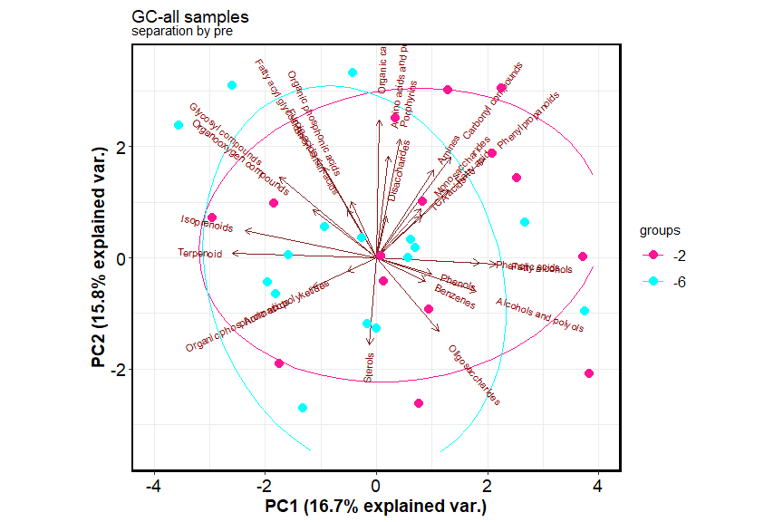<!-- -->

    ## 
    ## $gg_pca_inc1

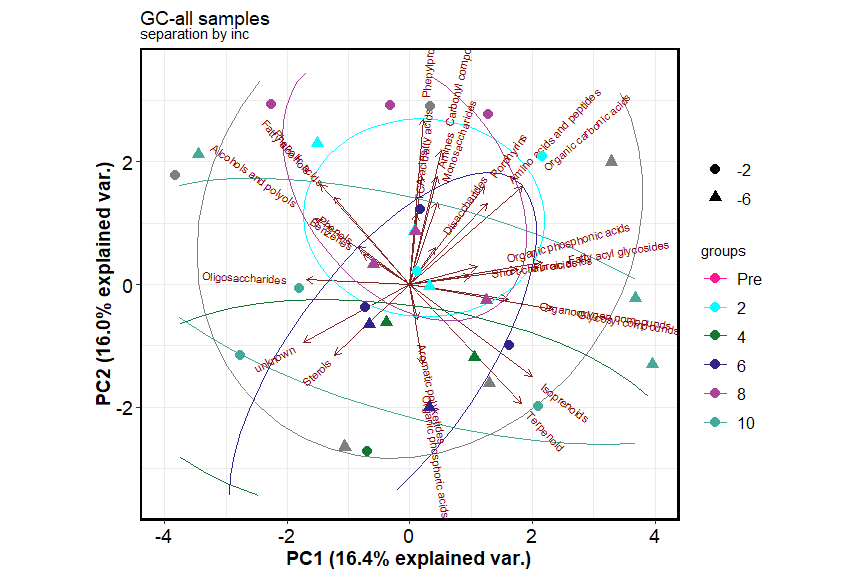<!-- -->

    ## 
    ## $permanova_GC_all
    ## 
    ## 
    ## Table: Permanova results all by Main class
    ## 
    ## |         | Df|  SumOfSqs|        R2|        F| Pr(>F)|
    ## |:--------|--:|---------:|---------:|--------:|------:|
    ## |pre      |  1| 0.0002722| 0.0440732| 1.796432|  0.128|
    ## |inc      |  5| 0.0016413| 0.2657632| 2.166512|  0.010|
    ## |pre:inc  |  5| 0.0009290| 0.1504214| 1.226242|  0.237|
    ## |Residual | 22| 0.0033334| 0.5397422|       NA|     NA|
    ## |Total    | 33| 0.0061758| 1.0000000|       NA|     NA|
    ## 
    ## $gg_pca_pre2

<!-- -->

    ## 
    ## $gg_pca_inc2

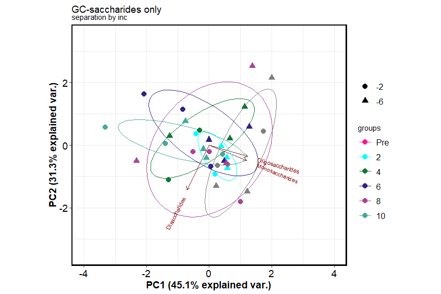<!-- -->

    ## 
    ## $permanova_GC_all2
    ## 
    ## 
    ## Table: Permanova results saccharides
    ## 
    ## |         | Df|  SumOfSqs|        R2|         F| Pr(>F)|
    ## |:--------|--:|---------:|---------:|---------:|------:|
    ## |pre      |  1| 0.0004367| 0.0410917| 1.6469493|  0.199|
    ## |inc      |  5| 0.0038628| 0.3634700| 2.9135648|  0.022|
    ## |pre:inc  |  5| 0.0004945| 0.0465342| 0.3730168|  0.941|
    ## |Residual | 22| 0.0058335| 0.5489041|        NA|     NA|
    ## |Total    | 33| 0.0106275| 1.0000000|        NA|     NA|

------------------------------------------------------------------------

## LC-MS

click to open

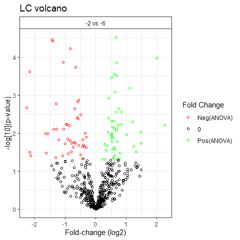<!-- -->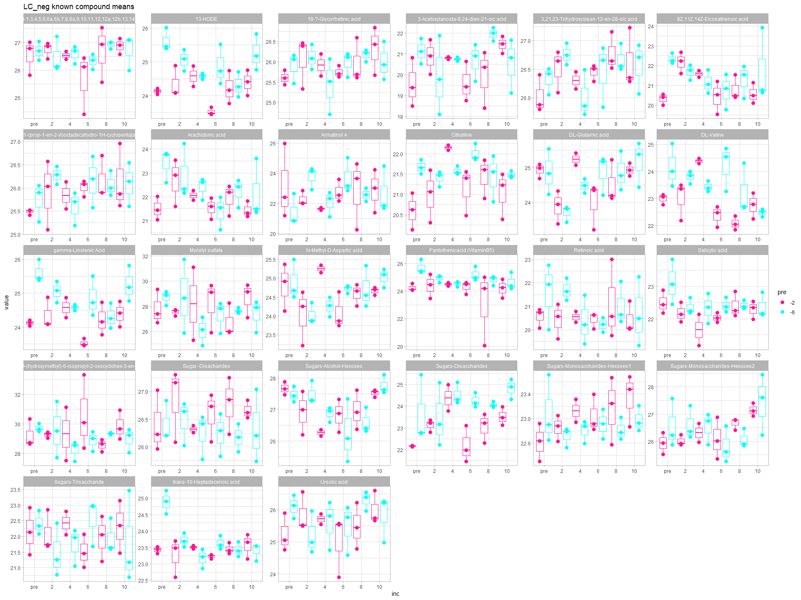<!-- -->

    ## NULL

    ## NULL

click to open ANOVA table

| Name2                                                                                                                                         | Count\_-2_pre | Count\_-6_pre | Count\_-2_2 | Count\_-6_2 | Count\_-2_4 | Count\_-6_4 | Count\_-2_6 | Count\_-6_6 | Count\_-2_8 | Count\_-6_8 | Count\_-2_10 | Count\_-6_10 | Mean\_-2_pre | Mean\_-6_pre | Mean\_-2_2 | Mean\_-6_2 | Mean\_-2_4 | Mean\_-6_4 | Mean\_-2_6 | Mean\_-6_6 | Mean\_-2_8 | Mean\_-6_8 | Mean\_-2_10 | Mean\_-6_10 | P_value_A\_-2_pre_vs\_-6_pre | P_value_A\_-2_2\_vs\_-6_2 | P_value_A\_-2_4\_vs\_-6_4 | P_value_A\_-2_6\_vs\_-6_6 | P_value_A\_-2_8\_vs\_-6_8 | P_value_A\_-2_10_vs\_-6_10 | Flag_A\_-2_pre_vs\_-6_pre | Flag_A\_-2_2\_vs\_-6_2 | Flag_A\_-2_4\_vs\_-6_4 | Flag_A\_-2_6\_vs\_-6_6 | Flag_A\_-2_8\_vs\_-6_8 | Flag_A\_-2_10_vs\_-6_10 |
|:----------------------------------------------------------------------------------------------------------------------------------------------|--------------:|--------------:|------------:|------------:|------------:|------------:|------------:|------------:|------------:|------------:|-------------:|-------------:|-------------:|-------------:|-----------:|-----------:|-----------:|-----------:|-----------:|-----------:|-----------:|-----------:|------------:|------------:|-----------------------------:|--------------------------:|--------------------------:|--------------------------:|--------------------------:|---------------------------:|--------------------------:|-----------------------:|-----------------------:|-----------------------:|-----------------------:|------------------------:|
| 2,2,6,6-Tetramethyl-4-piperidinol_pos                                                                                                         |             3 |             3 |           3 |           3 |           2 |           3 |           3 |           3 |           3 |           3 |            3 |            3 |     26.53155 |     27.25289 |   26.47425 |   26.72402 |   26.56783 |   27.18732 |   26.68284 |   26.95995 |   26.94119 |   27.17122 |    27.38617 |    27.18742 |                    0.0469540 |                 0.4746041 |                 0.1204595 |                 0.4281976 |                 0.5098366 |                  0.5685754 |                        -1 |                      0 |                      0 |                      0 |                      0 |                       0 |
| 4-Guanidinobutanoic acid_pos                                                                                                                  |             3 |             3 |           3 |           3 |           2 |           3 |           3 |           3 |           3 |           3 |            3 |            3 |     22.29734 |     22.58997 |   21.04157 |   21.33421 |   21.73347 |   22.02610 |   20.97640 |   21.26903 |   21.33422 |   21.62686 |    20.48054 |    20.77317 |                    0.6969186 |                 0.6969186 |                 0.7274788 |                 0.6969186 |                 0.6969186 |                  0.6969186 |                         0 |                      0 |                      0 |                      0 |                      0 |                       0 |
| Acetyl-L-carnitine_pos                                                                                                                        |             3 |             3 |           3 |           3 |           2 |           3 |           3 |           3 |           3 |           3 |            3 |            3 |     23.23703 |     23.13602 |   21.22958 |   21.04282 |   23.33376 |   21.42059 |   20.55736 |   22.54437 |   20.76645 |   20.44833 |    20.59843 |    20.76776 |                    0.9047974 |                 0.8250545 |                 0.0520790 |                 0.0260532 |                 0.7068092 |                  0.8411342 |                         0 |                      0 |                      0 |                     -1 |                      0 |                       0 |
| Adenine_pos                                                                                                                                   |             3 |             3 |           3 |           3 |           2 |           3 |           3 |           3 |           3 |           3 |            3 |            3 |     26.95283 |     27.96644 |   26.00209 |   26.25107 |   26.39600 |   26.38751 |   26.07684 |   26.22419 |   26.69344 |   26.46406 |    26.72694 |    26.75400 |                    0.0021906 |                 0.4058078 |                 0.9796155 |                 0.6210105 |                 0.4432481 |                  0.9274510 |                        -1 |                      0 |                      0 |                      0 |                      0 |                       0 |
| Adenosine_pos                                                                                                                                 |             3 |             3 |           3 |           3 |           2 |           3 |           3 |           3 |           3 |           3 |            3 |            3 |     29.39263 |     29.82662 |   29.60716 |   29.60349 |   29.81732 |   29.62160 |   29.99170 |   29.56798 |   30.40592 |   29.96536 |    30.19029 |    30.34267 |                    0.1894457 |                 0.9909537 |                 0.5907024 |                 0.1997446 |                 0.1830842 |                  0.6394282 |                         0 |                      0 |                      0 |                      0 |                      0 |                       0 |
| Betaine_pos                                                                                                                                   |             3 |             3 |           3 |           3 |           2 |           3 |           3 |           3 |           3 |           3 |            3 |            3 |     30.36379 |     30.89383 |   30.29886 |   30.39822 |   31.12894 |   30.36939 |   30.23968 |   30.76860 |   30.07981 |   30.26788 |    30.09310 |    30.20054 |                    0.0300453 |                 0.6686909 |                 0.0069525 |                 0.0303596 |                 0.4203267 |                  0.6436349 |                        -1 |                      0 |                      1 |                     -1 |                      0 |                       0 |
| Bis(methylbenzylidene)sorbitol_pos                                                                                                            |             3 |             3 |           3 |           3 |           2 |           3 |           3 |           3 |           3 |           3 |            3 |            3 |     22.10246 |     22.03673 |   22.32981 |   22.26408 |   22.02886 |   21.96314 |   22.33056 |   22.26484 |   22.57799 |   22.51227 |    22.57668 |    22.51096 |                    0.8967328 |                 0.8967328 |                 0.9075798 |                 0.8967328 |                 0.8967328 |                  0.8967328 |                         0 |                      0 |                      0 |                      0 |                      0 |                       0 |
| Choline_pos                                                                                                                                   |             3 |             3 |           3 |           3 |           2 |           3 |           3 |           3 |           3 |           3 |            3 |            3 |     29.38277 |     29.60113 |   29.60794 |   29.73448 |   29.32975 |   29.41787 |   29.65691 |   29.59080 |   29.87618 |   29.67285 |    29.86819 |    29.97170 |                    0.2265900 |                 0.4787724 |                 0.6580087 |                 0.7102203 |                 0.2591554 |                  0.5616453 |                         0 |                      0 |                      0 |                      0 |                      0 |                       0 |
| Cytosine_pos                                                                                                                                  |             3 |             3 |           3 |           3 |           2 |           3 |           3 |           3 |           3 |           3 |            3 |            3 |     26.16609 |     26.88597 |   25.48621 |   25.87861 |   25.85519 |   25.44699 |   25.83744 |   25.66251 |   25.96145 |   25.38396 |    25.79482 |    25.87113 |                    0.0771349 |                 0.3236359 |                 0.3577392 |                 0.6571612 |                 0.1512612 |                  0.8462058 |                         0 |                      0 |                      0 |                      0 |                      0 |                       0 |
| DEET_pos                                                                                                                                      |             3 |             3 |           3 |           3 |           2 |           3 |           3 |           3 |           3 |           3 |            3 |            3 |     22.01590 |     21.90341 |   20.99657 |   22.06354 |   21.39205 |   21.76473 |   21.85508 |   22.01474 |   21.67666 |   22.20575 |    21.93906 |    20.51675 |                    0.9092681 |                 0.2857548 |                 0.7358788 |                 0.8715211 |                 0.5930681 |                  0.1586728 |                         0 |                      0 |                      0 |                      0 |                      0 |                       0 |
| Deoxyadenosine_pos                                                                                                                            |             3 |             3 |           3 |           3 |           2 |           3 |           3 |           3 |           3 |           3 |            3 |            3 |     26.32888 |     27.05418 |   25.68216 |   26.26842 |   26.31415 |   26.03499 |   26.13583 |   26.26579 |   26.27280 |   25.47827 |    26.32591 |    26.05926 |                    0.1297811 |                 0.2167657 |                 0.5937713 |                 0.7808166 |                 0.0986383 |                  0.5691172 |                         0 |                      0 |                      0 |                      0 |                      0 |                       0 |
| Deoxycarnitine_pos                                                                                                                            |             3 |             3 |           3 |           3 |           2 |           3 |           3 |           3 |           3 |           3 |            3 |            3 |     26.32723 |     26.68950 |   26.52094 |   26.53659 |   27.32832 |   26.75997 |   26.69006 |   26.58373 |   26.48772 |   26.43013 |    26.08889 |    26.43004 |                    0.2797928 |                 0.9622709 |                 0.1340379 |                 0.7482114 |                 0.8618656 |                  0.3081002 |                         0 |                      0 |                      0 |                      0 |                      0 |                       0 |
| Diethanolamine_pos                                                                                                                            |             3 |             3 |           3 |           3 |           2 |           3 |           3 |           3 |           3 |           3 |            3 |            3 |     25.04987 |     25.00257 |   24.96271 |   24.91541 |   24.73297 |   24.68567 |   24.70321 |   24.65591 |   25.87895 |   25.83165 |    25.86665 |    25.81935 |                    0.9221570 |                 0.9221570 |                 0.9303515 |                 0.9221570 |                 0.9221570 |                  0.9221570 |                         0 |                      0 |                      0 |                      0 |                      0 |                       0 |
| DL-?-Leucine_pos                                                                                                                              |             3 |             3 |           3 |           3 |           2 |           3 |           3 |           3 |           3 |           3 |            3 |            3 |     25.83011 |     25.93137 |   25.96420 |   25.52957 |   27.00706 |   25.80155 |   25.62441 |   25.66847 |   25.30080 |   25.20091 |    25.23811 |    24.69799 |                    0.7785970 |                 0.2344562 |                 0.0059679 |                 0.9025659 |                 0.7814959 |                  0.1428016 |                         0 |                      0 |                      1 |                      0 |                      0 |                       0 |
| DL-Arginine_pos                                                                                                                               |             3 |             3 |           3 |           3 |           2 |           3 |           3 |           3 |           3 |           3 |            3 |            3 |     21.61307 |     21.57881 |   20.11738 |   19.56998 |   25.64321 |   20.26437 |   19.56927 |   21.66031 |   19.81308 |   19.56106 |    19.61404 |    20.49952 |                    0.9786519 |                 0.6696145 |                 0.0009264 |                 0.1123221 |                 0.8440195 |                  0.4914701 |                         0 |                      0 |                      1 |                      0 |                      0 |                       0 |
| DL-Carnitine_pos                                                                                                                              |             3 |             3 |           3 |           3 |           2 |           3 |           3 |           3 |           3 |           3 |            3 |            3 |     27.95494 |     27.88341 |   27.74362 |   27.06819 |   28.56558 |   27.98483 |   27.64441 |   27.99592 |   27.29555 |   27.53971 |    27.36602 |    27.32191 |                    0.7959896 |                 0.0213614 |                 0.0701125 |                 0.2114388 |                 0.3811884 |                  0.8732571 |                         0 |                      1 |                      0 |                      0 |                      0 |                       0 |
| DL-Citrulline_pos                                                                                                                             |             3 |             3 |           3 |           3 |           2 |           3 |           3 |           3 |           3 |           3 |            3 |            3 |     21.39844 |     22.89035 |   22.38548 |   20.35428 |   24.19582 |   21.81084 |   21.07419 |   22.14208 |   20.29763 |   20.80816 |    20.85973 |    20.69641 |                    0.0932981 |                 0.0257767 |                 0.0198429 |                 0.2227118 |                 0.5549365 |                  0.8496904 |                         0 |                      1 |                      1 |                      0 |                      0 |                       0 |
| DL-Glutamine_pos                                                                                                                              |             3 |             3 |           3 |           3 |           2 |           3 |           3 |           3 |           3 |           3 |            3 |            3 |     24.03971 |     24.17552 |   23.97411 |   23.11586 |   25.24834 |   23.74381 |   23.19149 |   24.22470 |   23.13772 |   23.02060 |    22.80201 |    23.44088 |                    0.8175938 |                 0.1539657 |                 0.0301060 |                 0.0891677 |                 0.8423143 |                  0.2838178 |                         0 |                      0 |                      1 |                      0 |                      0 |                       0 |
| DL-Isoleucine/Leucine_pos                                                                                                                     |             3 |             3 |           3 |           3 |           2 |           3 |           3 |           3 |           3 |           3 |            3 |            3 |     26.12296 |     26.47318 |   25.82414 |   26.47687 |   27.62082 |   26.18471 |   25.80879 |   26.77493 |   25.75073 |   26.16879 |    25.94530 |    25.67560 |                    0.4426006 |                 0.1588731 |                 0.0087442 |                 0.0418436 |                 0.3607044 |                  0.5532854 |                         0 |                      0 |                      1 |                     -1 |                      0 |                       0 |
| DL-Proline_pos                                                                                                                                |             3 |             3 |           3 |           3 |           2 |           3 |           3 |           3 |           3 |           3 |            3 |            3 |     23.60090 |     24.10043 |   22.96943 |   23.46159 |   23.93900 |   23.36952 |   22.59418 |   23.54669 |   22.44606 |   22.83644 |    22.66057 |    22.54446 |                    0.1037532 |                 0.1086560 |                 0.0974983 |                 0.0037004 |                 0.1985399 |                  0.6973689 |                         0 |                      0 |                      0 |                     -1 |                      0 |                       0 |
| DL-Stachydrine_pos                                                                                                                            |             3 |             3 |           3 |           3 |           2 |           3 |           3 |           3 |           3 |           3 |            3 |            3 |     25.06223 |     25.17438 |   24.75897 |   24.24856 |   26.42193 |   24.73965 |   24.74445 |   25.48718 |   24.28709 |   24.20290 |    24.04607 |    24.33951 |                    0.8032397 |                 0.2631244 |                 0.0025702 |                 0.1086275 |                 0.8515835 |                  0.5161253 |                         0 |                      0 |                      1 |                      0 |                      0 |                       0 |
| Glycerophosphocholine_pos                                                                                                                     |             3 |             3 |           3 |           3 |           2 |           3 |           3 |           3 |           3 |           3 |            3 |            3 |     19.44390 |     19.63064 |   18.62754 |   17.67620 |   22.21607 |   18.89902 |   18.62271 |   19.20487 |   17.91443 |   17.89915 |    18.21649 |    17.44549 |                    0.8690904 |                 0.4045907 |                 0.0143761 |                 0.6083184 |                 0.9892321 |                  0.4982638 |                         0 |                      0 |                      1 |                      0 |                      0 |                       0 |
| HOTrE_pos                                                                                                                                     |             3 |             3 |           3 |           3 |           2 |           3 |           3 |           3 |           3 |           3 |            3 |            3 |     23.42239 |     23.71863 |   22.61488 |   23.46563 |   23.43442 |   22.97015 |   22.40583 |   23.39236 |   22.93976 |   22.66633 |    23.07710 |    22.89550 |                    0.3202833 |                 0.0077539 |                 0.1678941 |                 0.0025628 |                 0.3581781 |                  0.5395958 |                         0 |                     -1 |                      0 |                     -1 |                      0 |                       0 |
| Hypoxanthine_pos                                                                                                                              |             3 |             3 |           3 |           3 |           2 |           3 |           3 |           3 |           3 |           3 |            3 |            3 |     26.23233 |     27.12195 |   23.93465 |   24.49942 |   24.36979 |   25.03183 |   24.77864 |   24.17112 |   24.70816 |   24.29417 |    24.83208 |    24.30452 |                    0.1165948 |                 0.3113459 |                 0.2890112 |                 0.2769807 |                 0.4556768 |                  0.3436222 |                         0 |                      0 |                      0 |                      0 |                      0 |                       0 |
| LL-2,6-Diaminheptanedioic acid_pos                                                                                                            |             3 |             3 |           3 |           3 |           2 |           3 |           3 |           3 |           3 |           3 |            3 |            3 |     23.94215 |     24.16303 |   23.34821 |   22.45458 |   25.12968 |   23.44032 |   22.77994 |   23.98618 |   22.43436 |   22.46236 |    22.02184 |    22.64579 |                    0.7095673 |                 0.1407478 |                 0.0167584 |                 0.0509659 |                 0.9622881 |                  0.2978400 |                         0 |                      0 |                      1 |                      0 |                      0 |                       0 |
| L-Pyroglutamic acid_pos                                                                                                                       |             3 |             3 |           3 |           3 |           2 |           3 |           3 |           3 |           3 |           3 |            3 |            3 |     24.03971 |     24.17552 |   23.97411 |   23.11586 |   25.24834 |   23.74381 |   23.19149 |   24.22470 |   23.13772 |   23.02060 |    22.80201 |    23.44088 |                    0.8175938 |                 0.1539657 |                 0.0301060 |                 0.0891677 |                 0.8423143 |                  0.2838178 |                         0 |                      0 |                      1 |                      0 |                      0 |                       0 |
| N-alpha-Acetyl-L-Lysine_pos                                                                                                                   |             3 |             3 |           3 |           3 |           2 |           3 |           3 |           3 |           3 |           3 |            3 |            3 |     28.53747 |     28.43710 |   28.68253 |   27.64641 |   29.55466 |   28.21423 |   28.51944 |   28.86585 |   28.17897 |   28.14643 |    28.27964 |    27.02236 |                    0.8308237 |                 0.0357407 |                 0.0166970 |                 0.4633529 |                 0.9447550 |                  0.0125817 |                         0 |                      1 |                      1 |                      0 |                      0 |                       1 |
| N-Methyl-D-Aspartic acid_pos                                                                                                                  |             3 |             3 |           3 |           3 |           2 |           3 |           3 |           3 |           3 |           3 |            3 |            3 |     25.12491 |     25.04247 |   24.26993 |   24.08591 |   25.70087 |   24.52020 |   24.40908 |   24.92634 |   24.66078 |   24.57069 |    24.70603 |    25.00679 |                    0.8235448 |                 0.6194474 |                 0.0082809 |                 0.1704444 |                 0.8075074 |                  0.4190621 |                         0 |                      0 |                      1 |                      0 |                      0 |                       0 |
| Oleamide_pos                                                                                                                                  |             3 |             3 |           3 |           3 |           2 |           3 |           3 |           3 |           3 |           3 |            3 |            3 |     21.54826 |     22.29156 |   21.96209 |   22.57525 |   21.26065 |   21.60832 |   21.21381 |   22.12728 |   21.68381 |   22.20707 |    20.15547 |    21.63788 |                    0.1685767 |                 0.2529362 |                 0.5578368 |                 0.0939830 |                 0.3273739 |                  0.0093809 |                         0 |                      0 |                      0 |                      0 |                      0 |                      -1 |
| Senecionine_pos                                                                                                                               |             3 |             3 |           3 |           3 |           2 |           3 |           3 |           3 |           3 |           3 |            3 |            3 |     22.30962 |     19.56121 |   21.04353 |   21.71555 |   23.67052 |   19.36202 |   19.38088 |   22.09585 |   21.32739 |   21.33802 |    22.76405 |    21.52495 |                    0.2856370 |                 0.7916270 |                 0.1389731 |                 0.2913930 |                 0.9966620 |                  0.6267934 |                         0 |                      0 |                      0 |                      0 |                      0 |                       0 |
| Sugars - Oligosaccharide (Tetraose)\_pos                                                                                                      |             3 |             3 |           3 |           3 |           2 |           3 |           3 |           3 |           3 |           3 |            3 |            3 |     19.85429 |     20.38278 |   20.41048 |   16.68641 |   23.01959 |   21.22149 |   18.37887 |   19.25022 |   16.64379 |   17.78236 |    17.82235 |    18.86615 |                    0.7355876 |                 0.0244189 |                 0.3090521 |                 0.5784920 |                 0.4689206 |                  0.5063278 |                         0 |                      1 |                      0 |                      0 |                      0 |                       0 |
| Sugars - Trisaccharide1_pos                                                                                                                   |             3 |             3 |           3 |           3 |           2 |           3 |           3 |           3 |           3 |           3 |            3 |            3 |     24.78514 |     24.53817 |   24.40432 |   23.43677 |   24.84417 |   24.10814 |   23.98832 |   24.60944 |   23.99968 |   24.02968 |    24.54410 |    23.44990 |                    0.6858947 |                 0.1222247 |                 0.2862360 |                 0.3136864 |                 0.9607520 |                  0.0826436 |                         0 |                      0 |                      0 |                      0 |                      0 |                       0 |
| Sugars - Trisaccharide2_pos                                                                                                                   |             3 |             3 |           3 |           3 |           2 |           3 |           3 |           3 |           3 |           3 |            3 |            3 |     23.38431 |     23.04690 |   22.73575 |   19.62379 |   24.56146 |   22.23048 |   21.44209 |   22.27390 |   20.80193 |   20.61244 |    21.54043 |    21.85425 |                    0.7735323 |                 0.0132063 |                 0.0851260 |                 0.4800955 |                 0.8715295 |                  0.7889457 |                         0 |                      1 |                      0 |                      0 |                      0 |                       0 |
| Sugars-Monosaccharides-Hexoses_pos                                                                                                            |             3 |             3 |           3 |           3 |           2 |           3 |           3 |           3 |           3 |           3 |            3 |            3 |     27.44740 |     27.83061 |   27.89879 |   26.67552 |   28.36724 |   27.04525 |   27.24642 |   27.27245 |   27.15743 |   26.43244 |    26.95099 |    26.36462 |                    0.5026542 |                 0.0402505 |                 0.0467651 |                 0.9635109 |                 0.2104045 |                  0.3082064 |                         0 |                      1 |                      1 |                      0 |                      0 |                       0 |
| Thymine_pos                                                                                                                                   |             3 |             3 |           3 |           3 |           2 |           3 |           3 |           3 |           3 |           3 |            3 |            3 |     24.74527 |     25.78385 |   24.84055 |   25.06401 |   25.51924 |   24.92797 |   25.35120 |   25.20324 |   25.65227 |   25.17306 |    25.49117 |    25.27199 |                    0.0012306 |                 0.4361553 |                 0.0734622 |                 0.6047797 |                 0.1027012 |                  0.4448937 |                        -1 |                      0 |                      0 |                      0 |                      0 |                       0 |
| Unknown 001_pos                                                                                                                               |             3 |             3 |           3 |           3 |           2 |           3 |           3 |           3 |           3 |           3 |            3 |            3 |     20.15406 |     19.11309 |   18.48239 |   20.14180 |   19.24669 |   19.07731 |   19.28868 |   18.56923 |   20.26100 |   18.19324 |    18.35667 |    19.20847 |                    0.4829534 |                 0.2673407 |                 0.9182449 |                 0.6267855 |                 0.1700301 |                  0.5652204 |                         0 |                      0 |                      0 |                      0 |                      0 |                       0 |
| Unknown 002_pos                                                                                                                               |             3 |             3 |           3 |           3 |           2 |           3 |           3 |           3 |           3 |           3 |            3 |            3 |     20.92756 |     20.99979 |   20.94691 |   21.01914 |   20.89139 |   20.96361 |   20.63064 |   20.70286 |   21.00228 |   21.07451 |    19.71772 |    19.78994 |                    0.9099099 |                 0.9099099 |                 0.9193843 |                 0.9099099 |                 0.9099099 |                  0.9099099 |                         0 |                      0 |                      0 |                      0 |                      0 |                       0 |
| Unknown 003_pos                                                                                                                               |             3 |             3 |           3 |           3 |           2 |           3 |           3 |           3 |           3 |           3 |            3 |            3 |     21.70807 |     21.48987 |   21.09719 |   22.15242 |   21.60513 |   21.17988 |   20.88045 |   21.26621 |   21.22035 |   20.40149 |    20.20410 |    19.95632 |                    0.7171706 |                 0.0893863 |                 0.5289702 |                 0.5231863 |                 0.1819947 |                  0.6809465 |                         0 |                      0 |                      0 |                      0 |                      0 |                       0 |
| Unknown 004_pos                                                                                                                               |             3 |             3 |           3 |           3 |           2 |           3 |           3 |           3 |           3 |           3 |            3 |            3 |     21.42138 |     20.21399 |   23.22807 |   23.34334 |   15.08405 |   22.07023 |   23.30959 |   18.75512 |   23.30104 |   23.35238 |    23.39453 |    23.00677 |                    0.4675774 |                 0.9443872 |                 0.0008725 |                 0.0104928 |                 0.9752142 |                  0.8145816 |                         0 |                      0 |                     -1 |                      1 |                      0 |                       0 |
| Unknown 005_pos                                                                                                                               |             3 |             3 |           3 |           3 |           2 |           3 |           3 |           3 |           3 |           3 |            3 |            3 |     18.34381 |     17.68703 |   18.11214 |   17.65292 |   17.31864 |   18.05191 |   18.97278 |   17.53288 |   19.22390 |   17.69954 |    17.93479 |    18.82087 |                    0.6252882 |                 0.7324060 |                 0.6257745 |                 0.2890607 |                 0.2624082 |                  0.5108878 |                         0 |                      0 |                      0 |                      0 |                      0 |                       0 |
| Unknown 006_pos                                                                                                                               |             3 |             3 |           3 |           3 |           2 |           3 |           3 |           3 |           3 |           3 |            3 |            3 |     20.00368 |     20.03303 |   19.15280 |   20.21332 |   20.59537 |   19.49635 |   19.85639 |   19.32397 |   19.17051 |   19.40622 |    19.48814 |    20.41276 |                    0.9736485 |                 0.2398599 |                 0.2749557 |                 0.5506108 |                 0.7909618 |                  0.3037450 |                         0 |                      0 |                      0 |                      0 |                      0 |                       0 |
| Unknown 007_pos                                                                                                                               |             3 |             3 |           3 |           3 |           2 |           3 |           3 |           3 |           3 |           3 |            3 |            3 |     22.09586 |     21.93294 |   22.19781 |   22.77295 |   22.13715 |   22.13446 |   22.41736 |   22.55046 |   22.71164 |   22.43029 |    22.71961 |    22.34136 |                    0.5693396 |                 0.0532127 |                 0.9932930 |                 0.6416173 |                 0.3291818 |                  0.1932488 |                         0 |                      0 |                      0 |                      0 |                      0 |                       0 |
| Unknown 008_pos                                                                                                                               |             3 |             3 |           3 |           3 |           2 |           3 |           3 |           3 |           3 |           3 |            3 |            3 |     22.09586 |     21.93294 |   22.19781 |   22.77295 |   22.13715 |   22.13446 |   22.41736 |   22.55046 |   22.71164 |   22.43029 |    22.71961 |    22.34136 |                    0.5693396 |                 0.0532127 |                 0.9932930 |                 0.6416173 |                 0.3291818 |                  0.1932488 |                         0 |                      0 |                      0 |                      0 |                      0 |                       0 |
| Unknown 009_pos                                                                                                                               |             3 |             3 |           3 |           3 |           2 |           3 |           3 |           3 |           3 |           3 |            3 |            3 |     22.77969 |     22.50452 |   22.74989 |   23.39795 |   22.54900 |   22.76852 |   23.19667 |   22.97655 |   23.43268 |   23.31009 |    23.40713 |    22.92649 |                    0.2844569 |                 0.0167032 |                 0.4422067 |                 0.3897367 |                 0.6299874 |                  0.0681080 |                         0 |                     -1 |                      0 |                      0 |                      0 |                       0 |
| Unknown 010_pos                                                                                                                               |             3 |             3 |           3 |           3 |           2 |           3 |           3 |           3 |           3 |           3 |            3 |            3 |     21.87859 |     22.42860 |   22.12930 |   22.52313 |   22.56688 |   22.41839 |   22.24573 |   22.36412 |   22.64671 |   22.28264 |    22.90827 |    22.43106 |                    0.1923685 |                 0.3462193 |                 0.7486352 |                 0.7751069 |                 0.3832080 |                  0.2558572 |                         0 |                      0 |                      0 |                      0 |                      0 |                       0 |
| Unknown 011_pos                                                                                                                               |             3 |             3 |           3 |           3 |           2 |           3 |           3 |           3 |           3 |           3 |            3 |            3 |     21.74330 |     21.77143 |   21.97850 |   22.80904 |   22.35697 |   22.25175 |   22.27506 |   22.48740 |   22.54905 |   22.20333 |    22.37999 |    22.01897 |                    0.9242269 |                 0.0092865 |                 0.7505495 |                 0.4751964 |                 0.2492961 |                  0.2295660 |                         0 |                     -1 |                      0 |                      0 |                      0 |                       0 |
| Unknown 012_pos                                                                                                                               |             3 |             3 |           3 |           3 |           2 |           3 |           3 |           3 |           3 |           3 |            3 |            3 |     21.74330 |     21.77143 |   21.97850 |   22.80904 |   22.35697 |   22.25175 |   22.27506 |   22.48740 |   22.54905 |   22.20333 |    22.37999 |    22.01897 |                    0.9242269 |                 0.0092865 |                 0.7505495 |                 0.4751964 |                 0.2492961 |                  0.2295660 |                         0 |                     -1 |                      0 |                      0 |                      0 |                       0 |
| Unknown 013_pos                                                                                                                               |             3 |             3 |           3 |           3 |           2 |           3 |           3 |           3 |           3 |           3 |            3 |            3 |     20.94905 |     21.94572 |   21.33009 |   21.51572 |   21.15595 |   18.80454 |   20.63063 |   21.40751 |   20.98878 |   21.54477 |    21.52560 |    20.77206 |                    0.3513839 |                 0.8609369 |                 0.0566157 |                 0.4659288 |                 0.6007579 |                  0.4792846 |                         0 |                      0 |                      0 |                      0 |                      0 |                       0 |
| Unknown 014_pos                                                                                                                               |             3 |             3 |           3 |           3 |           2 |           3 |           3 |           3 |           3 |           3 |            3 |            3 |     23.83459 |     23.87544 |   23.40466 |   24.03636 |   24.62538 |   23.82692 |   23.58185 |   24.15041 |   24.39103 |   25.07374 |    25.31740 |    24.03885 |                    0.9668470 |                 0.5223210 |                 0.4700553 |                 0.5643949 |                 0.4896151 |                  0.2014717 |                         0 |                      0 |                      0 |                      0 |                      0 |                       0 |
| Unknown 015_pos                                                                                                                               |             3 |             3 |           3 |           3 |           2 |           3 |           3 |           3 |           3 |           3 |            3 |            3 |     23.79714 |     23.35526 |   23.40416 |   24.40697 |   24.09511 |   23.56958 |   23.70951 |   24.05355 |   24.10931 |   24.42848 |    24.19667 |    23.29372 |                    0.3393730 |                 0.0369991 |                 0.3101054 |                 0.4551658 |                 0.4880510 |                  0.0581663 |                         0 |                     -1 |                      0 |                      0 |                      0 |                       0 |
| Unknown 016_pos                                                                                                                               |             3 |             3 |           3 |           3 |           2 |           3 |           3 |           3 |           3 |           3 |            3 |            3 |     21.22473 |     21.10911 |   21.00613 |   21.37022 |   21.44710 |   21.22291 |   21.46607 |   21.64630 |   21.62587 |   21.69249 |    21.96050 |    21.38774 |                    0.6761093 |                 0.1957293 |                 0.4704319 |                 0.5160370 |                 0.8095098 |                  0.0472559 |                         0 |                      0 |                      0 |                      0 |                      0 |                       1 |
| Unknown 017_pos                                                                                                                               |             3 |             3 |           3 |           3 |           2 |           3 |           3 |           3 |           3 |           3 |            3 |            3 |     22.50534 |     22.49628 |   22.38013 |   22.86882 |   22.90365 |   22.62045 |   22.93632 |   22.57818 |   23.56721 |   22.53769 |    22.89047 |    22.89552 |                    0.9880057 |                 0.4209289 |                 0.6749642 |                 0.5540002 |                 0.0976938 |                  0.9933153 |                         0 |                      0 |                      0 |                      0 |                      0 |                       0 |
| Unknown 018_pos                                                                                                                               |             3 |             3 |           3 |           3 |           2 |           3 |           3 |           3 |           3 |           3 |            3 |            3 |     22.70285 |     23.05870 |   22.62709 |   23.09277 |   23.19136 |   22.74483 |   22.64105 |   23.22357 |   22.78119 |   22.55806 |    22.65029 |    22.76713 |                    0.2274089 |                 0.1182204 |                 0.1772578 |                 0.0540558 |                 0.4447022 |                  0.6876243 |                         0 |                      0 |                      0 |                      0 |                      0 |                       0 |
| Unknown 019_pos                                                                                                                               |             3 |             3 |           3 |           3 |           2 |           3 |           3 |           3 |           3 |           3 |            3 |            3 |     22.81059 |     23.08945 |   22.20141 |   23.04824 |   22.73164 |   22.51888 |   22.25888 |   22.70992 |   22.37782 |   22.21047 |    22.67632 |    22.52992 |                    0.2674393 |                 0.0021701 |                 0.4459068 |                 0.0789682 |                 0.5019931 |                  0.5565494 |                         0 |                     -1 |                      0 |                      0 |                      0 |                       0 |
| Unknown 020_pos                                                                                                                               |             3 |             3 |           3 |           3 |           2 |           3 |           3 |           3 |           3 |           3 |            3 |            3 |     23.26293 |     24.27907 |   24.37880 |   24.74675 |   24.54587 |   23.66469 |   22.96137 |   23.94697 |   22.86446 |   23.66169 |    22.67888 |    23.50669 |                    0.2027164 |                 0.6394020 |                 0.3197121 |                 0.2161431 |                 0.3142928 |                  0.2965076 |                         0 |                      0 |                      0 |                      0 |                      0 |                       0 |
| Unknown 021_pos                                                                                                                               |             3 |             3 |           3 |           3 |           2 |           3 |           3 |           3 |           3 |           3 |            3 |            3 |     23.43084 |     24.12479 |   24.58260 |   24.75483 |   23.97778 |   24.67099 |   24.63760 |   24.64460 |   24.79243 |   25.05854 |    25.21825 |    24.83489 |                    0.1318222 |                 0.7017325 |                 0.1760252 |                 0.9875695 |                 0.5549200 |                  0.3969557 |                         0 |                      0 |                      0 |                      0 |                      0 |                       0 |
| Unknown 022_pos                                                                                                                               |             3 |             3 |           3 |           3 |           2 |           3 |           3 |           3 |           3 |           3 |            3 |            3 |     19.08123 |     21.72562 |   18.88583 |   20.08407 |   21.91045 |   21.29161 |   18.89483 |   19.76158 |   20.25088 |   20.00896 |    19.82360 |    20.76248 |                    0.0365912 |                 0.3250096 |                 0.6466010 |                 0.4742648 |                 0.8408758 |                  0.4387264 |                        -1 |                      0 |                      0 |                      0 |                      0 |                       0 |
| Unknown 023_pos                                                                                                                               |             3 |             3 |           3 |           3 |           2 |           3 |           3 |           3 |           3 |           3 |            3 |            3 |     18.88193 |     21.80842 |   19.25107 |   21.03482 |   21.85427 |   20.91633 |   19.02608 |   19.12970 |   20.54340 |   19.82550 |    19.64759 |    21.28539 |                    0.0603023 |                 0.2407421 |                 0.5766276 |                 0.9448319 |                 0.6324948 |                  0.2802824 |                         0 |                      0 |                      0 |                      0 |                      0 |                       0 |
| Unknown 024_pos                                                                                                                               |             3 |             3 |           3 |           3 |           2 |           3 |           3 |           3 |           3 |           3 |            3 |            3 |     22.10364 |     21.55845 |   23.33055 |   23.61582 |   17.64364 |   22.43715 |   23.97895 |   20.83991 |   24.65252 |   24.17078 |    24.61599 |    24.07625 |                    0.6851233 |                 0.8317588 |                 0.0037079 |                 0.0268750 |                 0.7200188 |                  0.6880908 |                         0 |                      0 |                     -1 |                      1 |                      0 |                       0 |
| Unknown 025_pos                                                                                                                               |             3 |             3 |           3 |           3 |           2 |           3 |           3 |           3 |           3 |           3 |            3 |            3 |     22.72284 |     22.13728 |   22.04949 |   22.89468 |   24.12264 |   22.43978 |   22.32627 |   22.58856 |   22.48057 |   22.85801 |    22.07531 |    22.31323 |                    0.4563744 |                 0.2854879 |                 0.0637891 |                 0.7374226 |                 0.6299354 |                  0.7609912 |                         0 |                      0 |                      0 |                      0 |                      0 |                       0 |
| Unknown 026_pos                                                                                                                               |             3 |             3 |           3 |           3 |           2 |           3 |           3 |           3 |           3 |           3 |            3 |            3 |     22.81470 |     23.12716 |   22.77069 |   22.85816 |   23.06697 |   23.47718 |   23.20948 |   23.23027 |   23.57114 |   23.14180 |    23.97025 |    23.29830 |                    0.5550449 |                 0.8683019 |                 0.4889129 |                 0.9685493 |                 0.4189529 |                  0.2105199 |                         0 |                      0 |                      0 |                      0 |                      0 |                       0 |
| Unknown 027_pos                                                                                                                               |             3 |             3 |           3 |           3 |           2 |           3 |           3 |           3 |           3 |           3 |            3 |            3 |     21.23641 |     23.17520 |   20.36156 |   22.30214 |   22.58765 |   22.03770 |   20.91232 |   21.81181 |   21.74650 |   21.55724 |    20.64768 |    23.06455 |                    0.0951882 |                 0.0949016 |                 0.6629684 |                 0.4277285 |                 0.8665925 |                  0.0406411 |                         0 |                      0 |                      0 |                      0 |                      0 |                      -1 |
| Unknown 028_pos                                                                                                                               |             3 |             3 |           3 |           3 |           2 |           3 |           3 |           3 |           3 |           3 |            3 |            3 |     21.54484 |     21.15201 |   21.19329 |   22.05683 |   21.84930 |   21.58931 |   22.24937 |   22.40052 |   22.81178 |   21.91068 |    22.63091 |    22.57977 |                    0.3841017 |                 0.0634069 |                 0.6044386 |                 0.7358886 |                 0.0534982 |                  0.9090335 |                         0 |                      0 |                      0 |                      0 |                      0 |                       0 |
| Unknown 029_pos                                                                                                                               |             3 |             3 |           3 |           3 |           2 |           3 |           3 |           3 |           3 |           3 |            3 |            3 |     21.65446 |     22.30722 |   23.35836 |   22.75209 |   24.07334 |   22.56696 |   22.47608 |   23.19937 |   22.65631 |   22.66236 |    22.22749 |    22.49392 |                    0.1632614 |                 0.1940725 |                 0.0068101 |                 0.1241640 |                 0.9894589 |                  0.5623557 |                         0 |                      0 |                      1 |                      0 |                      0 |                       0 |
| Unknown 030_pos                                                                                                                               |             3 |             3 |           3 |           3 |           2 |           3 |           3 |           3 |           3 |           3 |            3 |            3 |     21.56684 |     23.16710 |   21.89369 |   22.77739 |   23.42437 |   22.54651 |   21.87486 |   22.94596 |   22.22484 |   22.68447 |    22.70467 |    23.79543 |                    0.0322022 |                 0.2206307 |                 0.2748133 |                 0.1406237 |                 0.5190407 |                  0.1338179 |                        -1 |                      0 |                      0 |                      0 |                      0 |                       0 |
| Unknown 031_pos                                                                                                                               |             3 |             3 |           3 |           3 |           2 |           3 |           3 |           3 |           3 |           3 |            3 |            3 |     22.82952 |     25.13989 |   23.07947 |   24.10141 |   25.26316 |   24.79233 |   23.06970 |   23.22145 |   24.51192 |   24.78326 |    23.62730 |    24.83058 |                    0.0145784 |                 0.2545719 |                 0.6347026 |                 0.8637664 |                 0.7591674 |                  0.1821178 |                        -1 |                      0 |                      0 |                      0 |                      0 |                       0 |
| Unknown 032_pos                                                                                                                               |             3 |             3 |           3 |           3 |           2 |           3 |           3 |           3 |           3 |           3 |            3 |            3 |     21.80837 |     24.19951 |   21.29900 |   22.68165 |   24.29535 |   23.26990 |   22.08225 |   22.81654 |   22.01448 |   23.42130 |    22.33151 |    24.85079 |                    0.1073830 |                 0.3427074 |                 0.5267890 |                 0.6118000 |                 0.3345068 |                  0.0907935 |                         0 |                      0 |                      0 |                      0 |                      0 |                       0 |
| Unknown 033_pos                                                                                                                               |             3 |             3 |           3 |           3 |           2 |           3 |           3 |           3 |           3 |           3 |            3 |            3 |     23.31492 |     23.10856 |   23.56029 |   23.35393 |   23.17004 |   22.96368 |   24.05885 |   23.85249 |   23.29955 |   23.09319 |    23.52269 |    23.31633 |                    0.8482692 |                 0.8482692 |                 0.8641120 |                 0.8482692 |                 0.8482692 |                  0.8482692 |                         0 |                      0 |                      0 |                      0 |                      0 |                       0 |
| Unknown 034_pos                                                                                                                               |             3 |             3 |           3 |           3 |           2 |           3 |           3 |           3 |           3 |           3 |            3 |            3 |     20.85968 |     23.28215 |   21.71444 |   22.24157 |   23.87804 |   21.91503 |   21.31289 |   22.55234 |   21.90633 |   22.86185 |    22.60839 |    24.04508 |                    0.0529544 |                 0.6611995 |                 0.1527486 |                 0.3073540 |                 0.4291727 |                  0.2385365 |                         0 |                      0 |                      0 |                      0 |                      0 |                       0 |
| Unknown 035_pos                                                                                                                               |             3 |             3 |           3 |           3 |           2 |           3 |           3 |           3 |           3 |           3 |            3 |            3 |     21.66575 |     21.45035 |   21.50668 |   22.09747 |   22.16458 |   21.95293 |   22.00814 |   22.95674 |   22.15309 |   22.44017 |    22.45836 |    22.39408 |                    0.7199914 |                 0.3299336 |                 0.7526610 |                 0.1236588 |                 0.6331995 |                  0.9147015 |                         0 |                      0 |                      0 |                      0 |                      0 |                       0 |
| Unknown 036_pos                                                                                                                               |             3 |             3 |           3 |           3 |           2 |           3 |           3 |           3 |           3 |           3 |            3 |            3 |     21.04026 |     19.45121 |   20.04286 |   23.00603 |   16.84215 |   21.58073 |   21.03886 |   17.80748 |   22.59902 |   21.51706 |    23.92792 |    21.74339 |                    0.3588494 |                 0.0941659 |                 0.0201144 |                 0.0694981 |                 0.5300870 |                  0.2108422 |                         0 |                      0 |                     -1 |                      0 |                      0 |                       0 |
| Unknown 037_pos                                                                                                                               |             3 |             3 |           3 |           3 |           2 |           3 |           3 |           3 |           3 |           3 |            3 |            3 |     21.45239 |     19.67514 |   20.45331 |   23.37838 |   16.80095 |   21.96525 |   21.51903 |   17.96145 |   23.02449 |   21.76403 |    24.07541 |    22.12699 |                    0.3180403 |                 0.1065269 |                 0.0142232 |                 0.0526684 |                 0.4764512 |                  0.2747143 |                         0 |                      0 |                     -1 |                      0 |                      0 |                       0 |
| Unknown 038_pos                                                                                                                               |             3 |             3 |           3 |           3 |           2 |           3 |           3 |           3 |           3 |           3 |            3 |            3 |     20.44784 |     19.53241 |   20.65174 |   20.97315 |   22.56515 |   20.12270 |   20.44063 |   20.68837 |   21.01728 |   19.45669 |    20.35822 |    20.48358 |                    0.4616177 |                 0.7949828 |                 0.0871672 |                 0.8412117 |                 0.2145587 |                  0.9192269 |                         0 |                      0 |                      0 |                      0 |                      0 |                       0 |
| Unknown 039_pos                                                                                                                               |             3 |             3 |           3 |           3 |           2 |           3 |           3 |           3 |           3 |           3 |            3 |            3 |     24.08242 |     23.68533 |   23.85336 |   23.04215 |   24.73449 |   23.01789 |   23.08340 |   23.72453 |   23.71703 |   23.99765 |    24.05434 |    24.24586 |                    0.5441612 |                 0.2211170 |                 0.0259599 |                 0.3305553 |                 0.6675552 |                  0.7691810 |                         0 |                      0 |                      1 |                      0 |                      0 |                       0 |
| Unknown 040_pos                                                                                                                               |             3 |             3 |           3 |           3 |           2 |           3 |           3 |           3 |           3 |           3 |            3 |            3 |     23.06813 |     23.27987 |   23.23895 |   23.18237 |   24.08776 |   23.90288 |   23.11569 |   23.95185 |   23.94761 |   24.28607 |    24.48235 |    23.74630 |                    0.6585992 |                 0.9058262 |                 0.7298265 |                 0.0903732 |                 0.4814696 |                  0.1333385 |                         0 |                      0 |                      0 |                      0 |                      0 |                       0 |
| Unknown 041_pos                                                                                                                               |             3 |             3 |           3 |           3 |           2 |           3 |           3 |           3 |           3 |           3 |            3 |            3 |     28.17573 |     28.65659 |   28.54258 |   28.27526 |   28.93617 |   29.00392 |   28.41902 |   28.99874 |   28.91232 |   29.25985 |    29.58246 |    29.00844 |                    0.1943590 |                 0.4649023 |                 0.8676930 |                 0.1206758 |                 0.3440131 |                  0.1241796 |                         0 |                      0 |                      0 |                      0 |                      0 |                       0 |
| Unknown 042_pos                                                                                                                               |             3 |             3 |           3 |           3 |           2 |           3 |           3 |           3 |           3 |           3 |            3 |            3 |     21.96157 |     22.42015 |   21.87091 |   24.39053 |   22.00826 |   23.17699 |   22.81417 |   22.14459 |   21.96861 |   23.29705 |    21.98084 |    22.63966 |                    0.5576415 |                 0.0033701 |                 0.1881474 |                 0.3939301 |                 0.0981822 |                  0.4014544 |                         0 |                     -1 |                      0 |                      0 |                      0 |                       0 |
| Unknown 043_pos                                                                                                                               |             3 |             3 |           3 |           3 |           2 |           3 |           3 |           3 |           3 |           3 |            3 |            3 |     21.84926 |     24.03116 |   20.31456 |   22.06548 |   21.76641 |   21.56999 |   20.18456 |   21.06036 |   19.39750 |   21.84549 |    19.24256 |    22.94360 |                    0.0652339 |                 0.1339097 |                 0.8774707 |                 0.4449884 |                 0.0403932 |                  0.0032518 |                         0 |                      0 |                      0 |                      0 |                     -1 |                      -1 |
| Unknown 044_pos                                                                                                                               |             3 |             3 |           3 |           3 |           2 |           3 |           3 |           3 |           3 |           3 |            3 |            3 |     22.38167 |     21.97876 |   21.62962 |   21.53807 |   20.57878 |   22.36728 |   20.13067 |   22.97299 |   19.89100 |   20.49238 |    21.92916 |    20.52677 |                    0.8191338 |                 0.9585413 |                 0.3679862 |                 0.1163692 |                 0.7330612 |                  0.4290332 |                         0 |                      0 |                      0 |                      0 |                      0 |                       0 |
| Unknown 045_pos                                                                                                                               |             3 |             3 |           3 |           3 |           2 |           3 |           3 |           3 |           3 |           3 |            3 |            3 |     27.12867 |     25.51076 |   27.43104 |   27.96223 |   21.96687 |   27.14242 |   27.76139 |   23.79377 |   28.16451 |   25.67718 |    28.14426 |    27.91528 |                    0.2462115 |                 0.6996339 |                 0.0024311 |                 0.0077394 |                 0.0803393 |                  0.8677348 |                         0 |                      0 |                     -1 |                      1 |                      0 |                       0 |
| Unknown 046_pos                                                                                                                               |             3 |             3 |           3 |           3 |           2 |           3 |           3 |           3 |           3 |           3 |            3 |            3 |     25.50632 |     23.49590 |   25.79193 |   26.09143 |   19.92150 |   25.27797 |   26.11870 |   21.64974 |   26.29952 |   23.64924 |    26.35975 |    26.09929 |                    0.1970935 |                 0.8448688 |                 0.0043195 |                 0.0071373 |                 0.0932509 |                  0.8648692 |                         0 |                      0 |                     -1 |                      1 |                      0 |                       0 |
| Unknown 047_pos                                                                                                                               |             3 |             3 |           3 |           3 |           2 |           3 |           3 |           3 |           3 |           3 |            3 |            3 |     26.71203 |     24.87947 |   27.03251 |   27.50536 |   20.53951 |   26.60614 |   27.27633 |   23.14930 |   27.53876 |   24.94916 |    27.62831 |    27.39766 |                    0.2236960 |                 0.7498689 |                 0.0011737 |                 0.0097992 |                 0.0904873 |                  0.8763131 |                         0 |                      0 |                     -1 |                      1 |                      0 |                       0 |
| Unknown 048_pos                                                                                                                               |             3 |             3 |           3 |           3 |           2 |           3 |           3 |           3 |           3 |           3 |            3 |            3 |     24.16258 |     23.42688 |   25.83047 |   26.27109 |   19.35877 |   24.65741 |   26.06091 |   22.75514 |   26.64063 |   26.44541 |    26.51799 |    26.27519 |                    0.5871443 |                 0.7445168 |                 0.0017168 |                 0.0211476 |                 0.8850935 |                  0.8573744 |                         0 |                      0 |                     -1 |                      1 |                      0 |                       0 |
| Unknown 049_pos                                                                                                                               |             3 |             3 |           3 |           3 |           2 |           3 |           3 |           3 |           3 |           3 |            3 |            3 |     30.19517 |     30.37163 |   30.70598 |   30.88244 |   30.59661 |   30.77307 |   30.89634 |   31.07280 |   30.70395 |   30.88041 |    31.05325 |    31.22971 |                    0.5798549 |                 0.5798549 |                 0.6202565 |                 0.5798549 |                 0.5798549 |                  0.5798549 |                         0 |                      0 |                      0 |                      0 |                      0 |                       0 |
| Unknown 050_pos                                                                                                                               |             3 |             3 |           3 |           3 |           2 |           3 |           3 |           3 |           3 |           3 |            3 |            3 |     27.06986 |     27.29381 |   27.45846 |   27.92147 |   27.25907 |   27.39488 |   27.51034 |   27.71178 |   27.92389 |   27.52835 |    27.89046 |    27.55459 |                    0.4817008 |                 0.1528102 |                 0.7016333 |                 0.5263827 |                 0.2191953 |                  0.2945776 |                         0 |                      0 |                      0 |                      0 |                      0 |                       0 |
| Unknown 051_pos                                                                                                                               |             3 |             3 |           3 |           3 |           2 |           3 |           3 |           3 |           3 |           3 |            3 |            3 |     23.11113 |     23.43178 |   23.45412 |   24.13434 |   23.47453 |   23.76387 |   23.93102 |   24.02260 |   24.23072 |   23.84997 |    24.11479 |    23.81128 |                    0.3363816 |                 0.0485622 |                 0.4361769 |                 0.7816554 |                 0.2556006 |                  0.3623311 |                         0 |                     -1 |                      0 |                      0 |                      0 |                       0 |
| Unknown 052_pos                                                                                                                               |             3 |             3 |           3 |           3 |           2 |           3 |           3 |           3 |           3 |           3 |            3 |            3 |     28.18380 |     27.68275 |   28.00290 |   28.38254 |   28.40116 |   28.00163 |   28.33479 |   28.23585 |   28.64605 |   28.17358 |    28.37226 |    28.50654 |                    0.2178171 |                 0.3470234 |                 0.3755339 |                 0.8046441 |                 0.2443483 |                  0.7372639 |                         0 |                      0 |                      0 |                      0 |                      0 |                       0 |
| Unknown 053_pos                                                                                                                               |             3 |             3 |           3 |           3 |           2 |           3 |           3 |           3 |           3 |           3 |            3 |            3 |     23.43510 |     24.20841 |   24.96380 |   24.48120 |   23.39752 |   23.61141 |   24.56995 |   23.84590 |   24.29927 |   23.53105 |    25.05838 |    24.24129 |                    0.3373528 |                 0.5468674 |                 0.8106170 |                 0.3684371 |                 0.3404810 |                  0.3112802 |                         0 |                      0 |                      0 |                      0 |                      0 |                       0 |
| Unknown 054_pos                                                                                                                               |             3 |             3 |           3 |           3 |           2 |           3 |           3 |           3 |           3 |           3 |            3 |            3 |     25.48467 |     25.49322 |   25.37403 |   25.61082 |   25.56121 |   25.02428 |   25.52750 |   24.67741 |   25.57477 |   24.87704 |    25.13811 |    24.75545 |                    0.9844955 |                 0.5914453 |                 0.2810117 |                 0.0629407 |                 0.1223663 |                  0.3881444 |                         0 |                      0 |                      0 |                      0 |                      0 |                       0 |
| Unknown 055_pos                                                                                                                               |             3 |             3 |           3 |           3 |           2 |           3 |           3 |           3 |           3 |           3 |            3 |            3 |     22.29249 |     22.79016 |   22.82975 |   23.30540 |   23.09135 |   23.23167 |   23.24665 |   23.63702 |   23.56889 |   23.51452 |    23.95375 |    23.21915 |                    0.2207069 |                 0.2411505 |                 0.7537473 |                 0.3337054 |                 0.8918069 |                  0.0759903 |                         0 |                      0 |                      0 |                      0 |                      0 |                       0 |
| Unknown 056_pos                                                                                                                               |             3 |             3 |           3 |           3 |           2 |           3 |           3 |           3 |           3 |           3 |            3 |            3 |     22.90205 |     23.18316 |   24.11326 |   24.04458 |   22.71099 |   23.05588 |   23.47839 |   23.19914 |   23.66386 |   23.09245 |    24.59221 |    23.49879 |                    0.6589654 |                 0.9139555 |                 0.6283285 |                 0.6610888 |                 0.3728561 |                  0.0953810 |                         0 |                      0 |                      0 |                      0 |                      0 |                       0 |
| Unknown 057_pos                                                                                                                               |             3 |             3 |           3 |           3 |           2 |           3 |           3 |           3 |           3 |           3 |            3 |            3 |     24.52071 |     24.99616 |   25.07086 |   24.71352 |   25.43802 |   25.11274 |   25.35276 |   25.14031 |   25.78482 |   25.42306 |    25.63161 |    25.71390 |                    0.2598488 |                 0.3942161 |                 0.4867074 |                 0.6106309 |                 0.3884845 |                  0.8432658 |                         0 |                      0 |                      0 |                      0 |                      0 |                       0 |
| Unknown 058_pos                                                                                                                               |             3 |             3 |           3 |           3 |           2 |           3 |           3 |           3 |           3 |           3 |            3 |            3 |     25.61371 |     25.92595 |   25.05618 |   25.36842 |   26.10533 |   26.41758 |   25.46444 |   25.77668 |   26.18427 |   26.49651 |    25.60702 |    25.91926 |                    0.6637247 |                 0.6637247 |                 0.6972478 |                 0.6637247 |                 0.6637247 |                  0.6637247 |                         0 |                      0 |                      0 |                      0 |                      0 |                       0 |
| Unknown 059_pos                                                                                                                               |             3 |             3 |           3 |           3 |           2 |           3 |           3 |           3 |           3 |           3 |            3 |            3 |     26.47030 |     26.56128 |   26.48009 |   26.61885 |   26.73362 |   26.26894 |   26.62540 |   26.67716 |   26.89934 |   26.46185 |    26.68120 |    26.80370 |                    0.6982743 |                 0.5552334 |                 0.0860850 |                 0.8252252 |                 0.0717557 |                  0.6021948 |                         0 |                      0 |                      0 |                      0 |                      0 |                       0 |
| Unknown 060_pos                                                                                                                               |             3 |             3 |           3 |           3 |           2 |           3 |           3 |           3 |           3 |           3 |            3 |            3 |     30.64192 |     30.80800 |   30.71623 |   30.74927 |   30.64625 |   30.51488 |   30.60102 |   30.70207 |   31.12994 |   30.77796 |    30.93101 |    30.92309 |                    0.3882794 |                 0.8626488 |                 0.5399620 |                 0.5977626 |                 0.0751810 |                  0.9669348 |                         0 |                      0 |                      0 |                      0 |                      0 |                       0 |
| Unknown 061_pos                                                                                                                               |             3 |             3 |           3 |           3 |           2 |           3 |           3 |           3 |           3 |           3 |            3 |            3 |     25.56858 |     25.98669 |   25.08971 |   25.50782 |   25.37213 |   25.79024 |   25.15922 |   25.57733 |   25.92433 |   26.34245 |    25.65559 |    26.07370 |                    0.5365858 |                 0.5365858 |                 0.5801215 |                 0.5365858 |                 0.5365858 |                  0.5365858 |                         0 |                      0 |                      0 |                      0 |                      0 |                       0 |
| Unknown 062_pos                                                                                                                               |             3 |             3 |           3 |           3 |           2 |           3 |           3 |           3 |           3 |           3 |            3 |            3 |     22.78902 |     22.65517 |   22.41351 |   21.85905 |   21.27761 |   22.82923 |   22.62535 |   22.19170 |   22.64871 |   22.41538 |    22.61400 |    22.40318 |                    0.7234737 |                 0.1514650 |                 0.0011422 |                 0.2577826 |                 0.5385252 |                  0.5781082 |                         0 |                      0 |                     -1 |                      0 |                      0 |                       0 |
| Unknown 063_pos                                                                                                                               |             3 |             3 |           3 |           3 |           2 |           3 |           3 |           3 |           3 |           3 |            3 |            3 |     24.15928 |     24.35466 |   23.81988 |   24.01526 |   24.12382 |   24.31919 |   24.23559 |   24.43096 |   24.76342 |   24.95879 |    24.91044 |    25.10581 |                    0.7811792 |                 0.7811792 |                 0.8037485 |                 0.7811792 |                 0.7811792 |                  0.7811792 |                         0 |                      0 |                      0 |                      0 |                      0 |                       0 |
| Unknown 064_pos                                                                                                                               |             3 |             3 |           3 |           3 |           2 |           3 |           3 |           3 |           3 |           3 |            3 |            3 |     20.59928 |     20.78669 |   20.43870 |   18.78516 |   22.12943 |   22.48725 |   19.42530 |   20.66233 |   21.18516 |   24.08074 |    23.29292 |    21.50349 |                    0.9370067 |                 0.4879028 |                 0.8926526 |                 0.6029661 |                 0.2294763 |                  0.4532702 |                         0 |                      0 |                      0 |                      0 |                      0 |                       0 |
| Unknown 065_pos                                                                                                                               |             3 |             3 |           3 |           3 |           2 |           3 |           3 |           3 |           3 |           3 |            3 |            3 |     24.48963 |     24.89913 |   24.46562 |   25.26701 |   25.19355 |   25.18594 |   23.48890 |   25.40600 |   25.58986 |   25.43571 |    25.76574 |    25.36530 |                    0.5555446 |                 0.2537125 |                 0.9921478 |                 0.0101571 |                 0.8238153 |                  0.5642574 |                         0 |                      0 |                      0 |                     -1 |                      0 |                       0 |
| Unknown 066_pos                                                                                                                               |             3 |             3 |           3 |           3 |           2 |           3 |           3 |           3 |           3 |           3 |            3 |            3 |     20.53925 |     20.52997 |   19.51648 |   19.50720 |   22.53097 |   22.52169 |   20.24438 |   20.23509 |   23.32837 |   23.31909 |    22.59241 |    22.58312 |                    0.9968164 |                 0.9968164 |                 0.9971525 |                 0.9968164 |                 0.9968164 |                  0.9968164 |                         0 |                      0 |                      0 |                      0 |                      0 |                       0 |
| Unknown 067_pos                                                                                                                               |             3 |             3 |           3 |           3 |           2 |           3 |           3 |           3 |           3 |           3 |            3 |            3 |     24.48365 |     26.28870 |   26.29313 |   25.95400 |   26.71596 |   26.59734 |   26.16595 |   26.87325 |   26.56806 |   26.84438 |    27.04105 |    26.70096 |                    0.0105742 |                 0.6060721 |                 0.8714952 |                 0.2867781 |                 0.6740505 |                  0.6050549 |                        -1 |                      0 |                      0 |                      0 |                      0 |                       0 |
| Unknown 068_pos                                                                                                                               |             3 |             3 |           3 |           3 |           2 |           3 |           3 |           3 |           3 |           3 |            3 |            3 |     25.92522 |     24.76097 |   25.93942 |   23.15487 |   22.23017 |   24.98469 |   25.00560 |   25.36796 |   24.25498 |   24.99747 |    24.54727 |    23.96816 |                    0.3078841 |                 0.0202582 |                 0.0375909 |                 0.7484515 |                 0.5126455 |                  0.6089265 |                         0 |                      1 |                     -1 |                      0 |                      0 |                       0 |
| Unknown 069_pos                                                                                                                               |             3 |             3 |           3 |           3 |           2 |           3 |           3 |           3 |           3 |           3 |            3 |            3 |     24.47964 |     23.95545 |   23.88979 |   25.22998 |   23.83605 |   24.34053 |   22.79033 |   24.35913 |   22.51118 |   22.65062 |    22.41744 |    22.70951 |                    0.4146029 |                 0.0446222 |                 0.4816982 |                 0.0205961 |                 0.8270392 |                  0.6477636 |                         0 |                     -1 |                      0 |                     -1 |                      0 |                       0 |
| Unknown 070_pos                                                                                                                               |             3 |             3 |           3 |           3 |           2 |           3 |           3 |           3 |           3 |           3 |            3 |            3 |     27.11696 |     26.86504 |   27.97682 |   27.72490 |   27.49531 |   27.24339 |   27.95642 |   27.70450 |   28.26422 |   28.01230 |    28.13511 |    27.88320 |                    0.4595826 |                 0.4595826 |                 0.5078072 |                 0.4595826 |                 0.4595826 |                  0.4595826 |                         0 |                      0 |                      0 |                      0 |                      0 |                       0 |
| Unknown 071_pos                                                                                                                               |             3 |             3 |           3 |           3 |           2 |           3 |           3 |           3 |           3 |           3 |            3 |            3 |     22.00371 |     22.41775 |   22.75735 |   24.16726 |   19.80471 |   21.75573 |   24.09666 |   23.50896 |   24.33910 |   22.11360 |    24.13364 |    23.26679 |                    0.7088174 |                 0.2107087 |                 0.1246769 |                 0.5966322 |                 0.0538215 |                  0.4366703 |                         0 |                      0 |                      0 |                      0 |                      0 |                       0 |
| Unknown 072_pos                                                                                                                               |             3 |             3 |           3 |           3 |           2 |           3 |           3 |           3 |           3 |           3 |            3 |            3 |     23.93059 |     24.51034 |   23.85639 |   24.43614 |   23.47015 |   24.04990 |   24.25260 |   24.83235 |   24.52589 |   25.10564 |    23.42051 |    24.00026 |                    0.6042066 |                 0.6042066 |                 0.6427116 |                 0.6042066 |                 0.6042066 |                  0.6042066 |                         0 |                      0 |                      0 |                      0 |                      0 |                       0 |
| Unknown 073_pos                                                                                                                               |             3 |             3 |           3 |           3 |           2 |           3 |           3 |           3 |           3 |           3 |            3 |            3 |     24.47154 |     26.17802 |   25.92668 |   24.79351 |   26.69552 |   25.41264 |   25.98028 |   25.91075 |   26.54433 |   26.80840 |    27.00214 |    26.47341 |                    0.0910909 |                 0.2535625 |                 0.2478047 |                 0.9433368 |                 0.7873671 |                  0.5900483 |                         0 |                      0 |                      0 |                      0 |                      0 |                       0 |
| Unknown 074_pos                                                                                                                               |             3 |             3 |           3 |           3 |           2 |           3 |           3 |           3 |           3 |           3 |            3 |            3 |     25.44117 |     22.75726 |   24.23567 |   22.96601 |   22.68375 |   24.36499 |   21.07559 |   24.80916 |   23.38924 |   24.43135 |    24.03470 |    24.04538 |                    0.1153104 |                 0.4466667 |                 0.3686604 |                 0.0324242 |                 0.5313840 |                  0.9948592 |                         0 |                      0 |                      0 |                     -1 |                      0 |                       0 |
| Unknown 075_pos                                                                                                                               |             3 |             3 |           3 |           3 |           2 |           3 |           3 |           3 |           3 |           3 |            3 |            3 |     27.12402 |     26.87211 |   27.98229 |   27.73037 |   27.50491 |   27.25299 |   27.96200 |   27.71008 |   28.26909 |   28.01718 |    28.13953 |    27.88762 |                    0.4589500 |                 0.4589500 |                 0.5072077 |                 0.4589500 |                 0.4589500 |                  0.4589500 |                         0 |                      0 |                      0 |                      0 |                      0 |                       0 |
| Unknown 076_pos                                                                                                                               |             3 |             3 |           3 |           3 |           2 |           3 |           3 |           3 |           3 |           3 |            3 |            3 |     16.91741 |     17.38550 |   19.44276 |   18.36612 |   15.13528 |   17.51389 |   20.13641 |   17.82227 |   17.14665 |   15.33778 |    15.66660 |    18.39812 |                    0.8203455 |                 0.6023100 |                 0.3073069 |                 0.2677953 |                 0.3838921 |                  0.1931787 |                         0 |                      0 |                      0 |                      0 |                      0 |                       0 |
| Unknown 077_pos                                                                                                                               |             3 |             3 |           3 |           3 |           2 |           3 |           3 |           3 |           3 |           3 |            3 |            3 |     25.79321 |     25.72412 |   26.73532 |   27.04677 |   26.29003 |   26.18604 |   26.88580 |   27.08401 |   26.69329 |   26.27493 |    26.39398 |    27.04339 |                    0.8605646 |                 0.4314632 |                 0.8131268 |                 0.6151858 |                 0.2932414 |                  0.1085426 |                         0 |                      0 |                      0 |                      0 |                      0 |                       0 |
| Unknown 078_pos                                                                                                                               |             3 |             3 |           3 |           3 |           2 |           3 |           3 |           3 |           3 |           3 |            3 |            3 |     25.35536 |     26.11078 |   25.58875 |   25.56343 |   26.32690 |   25.18688 |   24.62006 |   25.40833 |   24.77439 |   24.91446 |    23.53500 |    25.65703 |                    0.5375720 |                 0.9834483 |                 0.4069379 |                 0.5201907 |                 0.9086278 |                  0.0920403 |                         0 |                      0 |                      0 |                      0 |                      0 |                       0 |
| Unknown 079_pos                                                                                                                               |             3 |             3 |           3 |           3 |           2 |           3 |           3 |           3 |           3 |           3 |            3 |            3 |     25.05761 |     25.27564 |   23.48464 |   24.25201 |   26.64756 |   26.25712 |   24.38844 |   26.01778 |   25.77349 |   26.81489 |    27.00204 |    24.81890 |                    0.8502200 |                 0.5081853 |                 0.7624393 |                 0.1669710 |                 0.3711378 |                  0.0683786 |                         0 |                      0 |                      0 |                      0 |                      0 |                       0 |
| Unknown 080_pos                                                                                                                               |             3 |             3 |           3 |           3 |           2 |           3 |           3 |           3 |           3 |           3 |            3 |            3 |     19.06263 |     20.98444 |   18.47643 |   21.49066 |   20.86602 |   23.59176 |   20.25508 |   18.87663 |   17.91660 |   16.51948 |    17.92978 |    17.83942 |                    0.1794598 |                 0.0404446 |                 0.0923145 |                 0.3309835 |                 0.3246133 |                  0.9486552 |                         0 |                     -1 |                      0 |                      0 |                      0 |                       0 |
| Unknown 081_pos                                                                                                                               |             3 |             3 |           3 |           3 |           2 |           3 |           3 |           3 |           3 |           3 |            3 |            3 |     17.17840 |     18.97084 |   20.76212 |   22.76867 |   18.21961 |   16.96975 |   20.43242 |   19.53407 |   19.28073 |   18.47814 |    16.90932 |    20.63154 |                    0.4520511 |                 0.4006230 |                 0.6377853 |                 0.7049380 |                 0.7350564 |                  0.1258016 |                         0 |                      0 |                      0 |                      0 |                      0 |                       0 |
| Unknown 082_pos                                                                                                                               |             3 |             3 |           3 |           3 |           2 |           3 |           3 |           3 |           3 |           3 |            3 |            3 |     21.24251 |     22.77007 |   21.15051 |   22.18386 |   21.35305 |   20.65458 |   21.01026 |   21.61919 |   21.35880 |   21.37197 |    21.58263 |    21.60505 |                    0.0036773 |                 0.0391714 |                 0.1991082 |                 0.2103050 |                 0.9780086 |                  0.9625588 |                        -1 |                     -1 |                      0 |                      0 |                      0 |                       0 |
| Unknown 083_pos                                                                                                                               |             3 |             3 |           3 |           3 |           2 |           3 |           3 |           3 |           3 |           3 |            3 |            3 |     18.92805 |     19.91649 |   22.22290 |   23.21133 |   17.07581 |   18.06424 |   20.16200 |   21.15043 |   18.44625 |   19.43468 |    18.03418 |    19.02261 |                    0.6710601 |                 0.6710601 |                 0.7039389 |                 0.6710601 |                 0.6710601 |                  0.6710601 |                         0 |                      0 |                      0 |                      0 |                      0 |                       0 |
| Unknown 084_pos                                                                                                                               |             3 |             3 |           3 |           3 |           2 |           3 |           3 |           3 |           3 |           3 |            3 |            3 |     16.78613 |     17.28975 |   19.02654 |   19.89898 |   14.68154 |   15.58538 |   19.21503 |   17.25911 |   17.45847 |   15.15951 |    15.17676 |    18.15659 |                    0.8477463 |                 0.7396412 |                 0.7580857 |                 0.4584353 |                 0.3845900 |                  0.2624116 |                         0 |                      0 |                      0 |                      0 |                      0 |                       0 |
| Unknown 085_pos                                                                                                                               |             3 |             3 |           3 |           3 |           2 |           3 |           3 |           3 |           3 |           3 |            3 |            3 |     17.60378 |     19.01827 |   21.63343 |   21.40432 |   16.27051 |   17.78036 |   21.61627 |   18.23487 |   19.54771 |   16.46589 |    16.55918 |    20.19556 |                    0.6433942 |                 0.9400864 |                 0.6584239 |                 0.2736594 |                 0.3173583 |                  0.2400630 |                         0 |                      0 |                      0 |                      0 |                      0 |                       0 |
| Unknown 086_pos                                                                                                                               |             3 |             3 |           3 |           3 |           2 |           3 |           3 |           3 |           3 |           3 |            3 |            3 |     24.44402 |     23.95298 |   22.68519 |   22.98389 |   26.22268 |   25.78902 |   23.36656 |   25.28764 |   25.07079 |   26.68342 |    26.97339 |    24.82790 |                    0.7541494 |                 0.8488164 |                 0.8045377 |                 0.2274956 |                 0.3087578 |                  0.1794041 |                         0 |                      0 |                      0 |                      0 |                      0 |                       0 |
| Unknown 087_pos                                                                                                                               |             3 |             3 |           3 |           3 |           2 |           3 |           3 |           3 |           3 |           3 |            3 |            3 |     22.12044 |     20.51047 |   22.49653 |   22.45962 |   17.25572 |   22.63090 |   22.86682 |   19.03202 |   23.85559 |   22.15607 |    25.11049 |    24.11672 |                    0.3171626 |                 0.9815006 |                 0.0056344 |                 0.0230307 |                 0.2915982 |                  0.5341538 |                         0 |                      0 |                     -1 |                      1 |                      0 |                       0 |
| Unknown 088_pos                                                                                                                               |             3 |             3 |           3 |           3 |           2 |           3 |           3 |           3 |           3 |           3 |            3 |            3 |     21.58971 |     22.68115 |   21.28626 |   23.47664 |   24.04422 |   26.10157 |   23.38999 |   21.94355 |   21.92621 |   21.19458 |    20.94027 |    21.83692 |                    0.4342073 |                 0.1238401 |                 0.1927161 |                 0.3024633 |                 0.5987773 |                  0.5196709 |                         0 |                      0 |                      0 |                      0 |                      0 |                       0 |
| Unknown 089_pos                                                                                                                               |             3 |             3 |           3 |           3 |           2 |           3 |           3 |           3 |           3 |           3 |            3 |            3 |     25.46216 |     24.25497 |   25.62464 |   26.36156 |   25.61155 |   25.55221 |   24.92179 |   25.10170 |   26.43826 |   25.99048 |    26.54317 |    25.18304 |                    0.0450930 |                 0.2086518 |                 0.9265876 |                 0.7549890 |                 0.4398733 |                  0.0255646 |                         1 |                      0 |                      0 |                      0 |                      0 |                       1 |
| Unknown 090_pos                                                                                                                               |             3 |             3 |           3 |           3 |           2 |           3 |           3 |           3 |           3 |           3 |            3 |            3 |     16.98445 |     18.11202 |   21.58189 |   22.28950 |   15.46405 |   17.53157 |   19.82925 |   19.87187 |   18.73020 |   16.41583 |    16.23857 |    19.64887 |                    0.6112394 |                 0.7493151 |                 0.4067288 |                 0.9846242 |                 0.3011611 |                  0.1327445 |                         0 |                      0 |                      0 |                      0 |                      0 |                       0 |
| Unknown 091_pos                                                                                                                               |             3 |             3 |           3 |           3 |           2 |           3 |           3 |           3 |           3 |           3 |            3 |            3 |     29.19699 |     29.64462 |   29.67560 |   29.55170 |   29.89977 |   29.58695 |   29.33455 |   29.83350 |   29.60586 |   29.84821 |    30.01854 |    29.85960 |                    0.1477481 |                 0.6822566 |                 0.3588539 |                 0.1085476 |                 0.4256919 |                  0.5999064 |                         0 |                      0 |                      0 |                      0 |                      0 |                       0 |
| Unknown 092_pos                                                                                                                               |             3 |             3 |           3 |           3 |           2 |           3 |           3 |           3 |           3 |           3 |            3 |            3 |     19.64261 |     19.21098 |   22.34387 |   22.41434 |   17.10721 |   19.49232 |   20.84304 |   20.38003 |   20.12028 |   17.41654 |    16.40514 |    20.55989 |                    0.8201258 |                 0.9703682 |                 0.2673409 |                 0.8073118 |                 0.1631373 |                  0.0370248 |                         0 |                      0 |                      0 |                      0 |                      0 |                      -1 |
| Unknown 093_pos                                                                                                                               |             3 |             3 |           3 |           3 |           2 |           3 |           3 |           3 |           3 |           3 |            3 |            3 |     18.53378 |     18.65447 |   21.36146 |   22.08465 |   16.57658 |   18.60194 |   21.38161 |   17.62203 |   19.74039 |   17.05804 |    15.43781 |    20.44829 |                    0.9496364 |                 0.7055112 |                 0.3478073 |                 0.0587118 |                 0.1692610 |                  0.0142790 |                         0 |                      0 |                      0 |                      0 |                      0 |                      -1 |
| Unknown 094_pos                                                                                                                               |             3 |             3 |           3 |           3 |           2 |           3 |           3 |           3 |           3 |           3 |            3 |            3 |     22.56621 |     22.65061 |   22.88049 |   22.96489 |   23.28663 |   23.37103 |   22.95146 |   23.03586 |   23.42386 |   23.50826 |    23.38772 |    23.47212 |                    0.7586973 |                 0.7586973 |                 0.7834560 |                 0.7586973 |                 0.7586973 |                  0.7586973 |                         0 |                      0 |                      0 |                      0 |                      0 |                       0 |
| Unknown 095_pos                                                                                                                               |             3 |             3 |           3 |           3 |           2 |           3 |           3 |           3 |           3 |           3 |            3 |            3 |     22.05514 |     19.75916 |   22.27952 |   23.12335 |   18.66457 |   21.35578 |   22.18750 |   20.77515 |   22.14866 |   21.56559 |    18.78027 |    22.03328 |                    0.1339139 |                 0.5735289 |                 0.1169624 |                 0.3491449 |                 0.6968012 |                  0.0380175 |                         0 |                      0 |                      0 |                      0 |                      0 |                      -1 |
| Unknown 096_pos                                                                                                                               |             3 |             3 |           3 |           3 |           2 |           3 |           3 |           3 |           3 |           3 |            3 |            3 |     25.83506 |     24.82460 |   26.49873 |   26.71204 |   25.42746 |   26.25592 |   26.73235 |   26.93468 |   26.44170 |   26.16088 |    26.00825 |    26.50053 |                    0.1001036 |                 0.7208781 |                 0.2215730 |                 0.7346739 |                 0.6384630 |                  0.4124719 |                         0 |                      0 |                      0 |                      0 |                      0 |                       0 |
| Unknown 097_pos                                                                                                                               |             3 |             3 |           3 |           3 |           2 |           3 |           3 |           3 |           3 |           3 |            3 |            3 |     21.37559 |     19.64289 |   22.30462 |   22.75015 |   19.90599 |   20.08976 |   21.98847 |   21.04593 |   21.67112 |   20.22947 |    17.81473 |    22.32843 |                    0.2937289 |                 0.7847895 |                 0.9196933 |                 0.5645619 |                 0.3805622 |                  0.0101897 |                         0 |                      0 |                      0 |                      0 |                      0 |                      -1 |
| Unknown 098_pos                                                                                                                               |             3 |             3 |           3 |           3 |           2 |           3 |           3 |           3 |           3 |           3 |            3 |            3 |     21.86866 |     21.27118 |   22.12365 |   22.95482 |   19.39488 |   21.54819 |   21.96901 |   19.94016 |   21.24085 |   19.17711 |    17.34537 |    22.83840 |                    0.7262937 |                 0.6267124 |                 0.2650867 |                 0.2411018 |                 0.2333468 |                  0.0034637 |                         0 |                      0 |                      0 |                      0 |                      0 |                      -1 |
| Unknown 099_pos                                                                                                                               |             3 |             3 |           3 |           3 |           2 |           3 |           3 |           3 |           3 |           3 |            3 |            3 |     23.64815 |     23.14738 |   22.80528 |   20.96758 |   20.79126 |   23.23234 |   22.05365 |   21.98213 |   24.57429 |   22.48785 |    21.68398 |    23.65365 |                    0.6097754 |                 0.0701852 |                 0.0338728 |                 0.9417238 |                 0.0417830 |                  0.0534996 |                         0 |                      0 |                     -1 |                      0 |                      1 |                       0 |
| Unknown 100_pos                                                                                                                               |             3 |             3 |           3 |           3 |           2 |           3 |           3 |           3 |           3 |           3 |            3 |            3 |     21.35779 |     19.90080 |   22.09968 |   22.72887 |   18.75318 |   21.58245 |   22.23465 |   19.86613 |   20.57043 |   20.31632 |    17.80088 |    20.87815 |                    0.4617165 |                 0.7494231 |                 0.2064400 |                 0.2359982 |                 0.8972619 |                  0.1275356 |                         0 |                      0 |                      0 |                      0 |                      0 |                       0 |
| Unknown 101_pos                                                                                                                               |             3 |             3 |           3 |           3 |           2 |           3 |           3 |           3 |           3 |           3 |            3 |            3 |     18.37610 |     19.78362 |   21.42339 |   21.99183 |   20.59938 |   20.72788 |   20.76848 |   18.98634 |   19.77657 |   20.61623 |    18.04261 |    20.95854 |                    0.4370442 |                 0.7522735 |                 0.9490602 |                 0.3270145 |                 0.6414751 |                  0.1149000 |                         0 |                      0 |                      0 |                      0 |                      0 |                       0 |
| Unknown 102_pos                                                                                                                               |             3 |             3 |           3 |           3 |           2 |           3 |           3 |           3 |           3 |           3 |            3 |            3 |     16.59161 |     14.75170 |   15.44857 |   20.18328 |   14.83412 |   14.87512 |   21.34450 |   19.28214 |   16.99161 |   15.18395 |    15.35557 |    17.85834 |                    0.3915082 |                 0.0345067 |                 0.9862599 |                 0.3378056 |                 0.3997336 |                  0.2469709 |                         0 |                     -1 |                      0 |                      0 |                      0 |                       0 |
| Unknown 103_pos                                                                                                                               |             3 |             3 |           3 |           3 |           2 |           3 |           3 |           3 |           3 |           3 |            3 |            3 |     22.47171 |     22.13415 |   23.54534 |   22.55123 |   21.26423 |   22.71140 |   22.45868 |   21.93643 |   23.58611 |   22.30709 |    22.07938 |    22.82364 |                    0.7391299 |                 0.3312155 |                 0.2090298 |                 0.6070263 |                 0.2143009 |                  0.4649121 |                         0 |                      0 |                      0 |                      0 |                      0 |                       0 |
| Unknown 104_pos                                                                                                                               |             3 |             3 |           3 |           3 |           2 |           3 |           3 |           3 |           3 |           3 |            3 |            3 |     20.13410 |     20.61826 |   21.68690 |   22.33802 |   20.04812 |   20.73538 |   21.72518 |   19.62069 |   21.98552 |   20.82135 |    18.68860 |    21.30431 |                    0.6194819 |                 0.5051750 |                 0.5290632 |                 0.0390871 |                 0.2384222 |                  0.0122236 |                         0 |                      0 |                      0 |                      1 |                      0 |                      -1 |
| Unknown 105_pos                                                                                                                               |             3 |             3 |           3 |           3 |           2 |           3 |           3 |           3 |           3 |           3 |            3 |            3 |     22.14737 |     21.75309 |   22.26602 |   21.56609 |   22.49380 |   22.72685 |   21.56783 |   21.60372 |   23.46664 |   21.98077 |    21.73273 |    23.51079 |                    0.6360534 |                 0.4033492 |                 0.8021002 |                 0.9655520 |                 0.0838101 |                  0.0412012 |                         0 |                      0 |                      0 |                      0 |                      0 |                      -1 |
| Unknown 106_pos                                                                                                                               |             3 |             3 |           3 |           3 |           2 |           3 |           3 |           3 |           3 |           3 |            3 |            3 |     22.79739 |     23.56126 |   22.67291 |   23.43678 |   22.62844 |   23.39231 |   22.07239 |   22.83626 |   22.22210 |   22.98596 |    23.31395 |    24.07782 |                    0.2606014 |                 0.2606014 |                 0.3129807 |                 0.2606014 |                 0.2606014 |                  0.2606014 |                         0 |                      0 |                      0 |                      0 |                      0 |                       0 |
| Unknown 107_pos                                                                                                                               |             3 |             3 |           3 |           3 |           2 |           3 |           3 |           3 |           3 |           3 |            3 |            3 |     19.25898 |     19.63365 |   17.32948 |   21.60142 |   22.99704 |   22.66142 |   19.60075 |   22.32917 |   22.21718 |   23.41194 |    22.68793 |    22.80584 |                    0.8518485 |                 0.0419971 |                 0.8810386 |                 0.1822513 |                 0.5528739 |                  0.9531158 |                         0 |                     -1 |                      0 |                      0 |                      0 |                       0 |
| Unknown 108_pos                                                                                                                               |             3 |             3 |           3 |           3 |           2 |           3 |           3 |           3 |           3 |           3 |            3 |            3 |     20.97161 |     20.83970 |   21.60089 |   22.17951 |   21.45645 |   21.38595 |   21.92218 |   21.80334 |   21.79209 |   21.03676 |    18.85242 |    21.42418 |                    0.8684059 |                 0.4698125 |                 0.9368542 |                 0.8813335 |                 0.3473565 |                  0.0033931 |                         0 |                      0 |                      0 |                      0 |                      0 |                      -1 |
| Unknown 109_pos                                                                                                                               |             3 |             3 |           3 |           3 |           2 |           3 |           3 |           3 |           3 |           3 |            3 |            3 |     24.51856 |     24.28286 |   24.34808 |   25.36810 |   24.65089 |   24.79568 |   24.65351 |   25.72318 |   25.40135 |   25.37515 |    26.39165 |    25.91959 |                    0.7382867 |                 0.1568559 |                 0.8542140 |                 0.1384811 |                 0.9703353 |                  0.5049586 |                         0 |                      0 |                      0 |                      0 |                      0 |                       0 |
| Unknown 110_pos                                                                                                                               |             3 |             3 |           3 |           3 |           2 |           3 |           3 |           3 |           3 |           3 |            3 |            3 |     20.29746 |     19.53164 |   18.71235 |   17.94653 |   19.09257 |   18.32674 |   19.03869 |   18.27287 |   20.45144 |   19.68561 |    21.80299 |    21.03716 |                    0.6807095 |                 0.6807095 |                 0.7127315 |                 0.6807095 |                 0.6807095 |                  0.6807095 |                         0 |                      0 |                      0 |                      0 |                      0 |                       0 |
| Unknown 111_pos                                                                                                                               |             3 |             3 |           3 |           3 |           2 |           3 |           3 |           3 |           3 |           3 |            3 |            3 |     24.29005 |     24.80485 |   22.60568 |   24.83019 |   25.08145 |   22.72638 |   24.68063 |   24.56078 |   25.20006 |   25.41455 |    25.08261 |    25.24413 |                    0.7070981 |                 0.1137759 |                 0.1331843 |                 0.9301863 |                 0.8754339 |                  0.9060179 |                         0 |                      0 |                      0 |                      0 |                      0 |                       0 |
| Unknown 112_pos                                                                                                                               |             3 |             3 |           3 |           3 |           2 |           3 |           3 |           3 |           3 |           3 |            3 |            3 |     21.88407 |     23.93048 |   19.60012 |   21.64653 |   19.47860 |   21.52501 |   18.78336 |   20.82976 |   19.35068 |   21.39708 |    19.51762 |    21.56403 |                    0.1586699 |                 0.1586699 |                 0.2054477 |                 0.1586699 |                 0.1586699 |                  0.1586699 |                         0 |                      0 |                      0 |                      0 |                      0 |                       0 |
| Unknown 113_pos                                                                                                                               |             3 |             3 |           3 |           3 |           2 |           3 |           3 |           3 |           3 |           3 |            3 |            3 |     21.08239 |     21.79688 |   21.88297 |   22.20264 |   21.60613 |   21.26813 |   21.88995 |   21.78091 |   22.70561 |   21.87052 |    22.29740 |    21.77219 |                    0.0855296 |                 0.4296948 |                 0.4548342 |                 0.7863618 |                 0.0468977 |                  0.1995848 |                         0 |                      0 |                      0 |                      0 |                      1 |                       0 |
| Unknown 114_pos                                                                                                                               |             3 |             3 |           3 |           3 |           2 |           3 |           3 |           3 |           3 |           3 |            3 |            3 |     20.39244 |     18.59509 |   20.08256 |   20.58897 |   22.12164 |   19.28135 |   19.03080 |   20.06432 |   20.08856 |   19.87545 |    20.61201 |    20.88793 |                    0.2571504 |                 0.7463271 |                 0.1141084 |                 0.5106733 |                 0.8916143 |                  0.8599854 |                         0 |                      0 |                      0 |                      0 |                      0 |                       0 |
| Unknown 115_pos                                                                                                                               |             3 |             3 |           3 |           3 |           2 |           3 |           3 |           3 |           3 |           3 |            3 |            3 |     20.51309 |     20.54295 |   21.27136 |   22.19465 |   21.22811 |   21.01110 |   22.10157 |   22.07162 |   17.43410 |   21.57047 |    19.37093 |    21.82843 |                    0.9812220 |                 0.4692834 |                 0.8784147 |                 0.9811685 |                 0.0031569 |                  0.0624079 |                         0 |                      0 |                      0 |                      0 |                     -1 |                       0 |
| Unknown 116_pos                                                                                                                               |             3 |             3 |           3 |           3 |           2 |           3 |           3 |           3 |           3 |           3 |            3 |            3 |     23.35617 |     23.48498 |   24.31188 |   23.48509 |   22.50981 |   23.17705 |   23.78293 |   23.30229 |   22.78823 |   21.82060 |    21.22442 |    22.64153 |                    0.8825932 |                 0.3477638 |                 0.4959355 |                 0.5827594 |                 0.2735192 |                  0.1140047 |                         0 |                      0 |                      0 |                      0 |                      0 |                       0 |
| Unknown 117_pos                                                                                                                               |             3 |             3 |           3 |           3 |           2 |           3 |           3 |           3 |           3 |           3 |            3 |            3 |     18.63058 |     18.80506 |   17.97386 |   18.43034 |   21.79524 |   17.38214 |   19.35121 |   19.46662 |   20.41263 |   17.99792 |    18.76645 |    18.87756 |                    0.8741142 |                 0.6790118 |                 0.0014229 |                 0.9165269 |                 0.0367743 |                  0.9196200 |                         0 |                      0 |                      1 |                      0 |                      1 |                       0 |
| Unknown 118_pos                                                                                                                               |             3 |             3 |           3 |           3 |           2 |           3 |           3 |           3 |           3 |           3 |            3 |            3 |     20.56818 |     21.23192 |   21.67022 |   22.15755 |   21.39232 |   21.46910 |   21.89429 |   21.35867 |   22.23290 |   21.60320 |    21.62945 |    21.50138 |                    0.1153793 |                 0.2418131 |                 0.8670375 |                 0.1996629 |                 0.1342153 |                  0.7550443 |                         0 |                      0 |                      0 |                      0 |                      0 |                       0 |
| Unknown 119_pos                                                                                                                               |             3 |             3 |           3 |           3 |           2 |           3 |           3 |           3 |           3 |           3 |            3 |            3 |     24.68276 |     25.07456 |   25.44963 |   24.88195 |   25.48659 |   24.63430 |   25.41832 |   25.30672 |   25.17756 |   24.64517 |    24.94068 |    24.78845 |                    0.1729372 |                 0.0532155 |                 0.0117571 |                 0.6923986 |                 0.0685128 |                  0.5899799 |                         0 |                      0 |                      1 |                      0 |                      0 |                       0 |
| Unknown 120_pos                                                                                                                               |             3 |             3 |           3 |           3 |           2 |           3 |           3 |           3 |           3 |           3 |            3 |            3 |     21.36922 |     23.59459 |   20.18240 |   22.83676 |   21.08952 |   21.33722 |   21.10958 |   21.07577 |   20.06138 |   20.17981 |    19.86454 |    21.52754 |                    0.0082502 |                 0.0021892 |                 0.7760941 |                 0.9653489 |                 0.8790869 |                  0.0414270 |                        -1 |                     -1 |                      0 |                      0 |                      0 |                      -1 |
| Unknown 121_pos                                                                                                                               |             3 |             3 |           3 |           3 |           2 |           3 |           3 |           3 |           3 |           3 |            3 |            3 |     21.53770 |     22.77267 |   20.32060 |   22.27118 |   21.57583 |   20.46568 |   19.41339 |   20.82969 |   19.29078 |   19.87826 |    19.24486 |    18.62085 |                    0.0797995 |                 0.0081671 |                 0.1541248 |                 0.0467069 |                 0.3922762 |                  0.3639953 |                         0 |                     -1 |                      0 |                     -1 |                      0 |                       0 |
| Unknown 122_pos                                                                                                                               |             3 |             3 |           3 |           3 |           2 |           3 |           3 |           3 |           3 |           3 |            3 |            3 |     22.75796 |     23.11695 |   22.80354 |   22.54127 |   23.58447 |   23.22964 |   22.89041 |   23.60093 |   22.82694 |   23.16453 |    23.25697 |    23.07970 |                    0.1854783 |                 0.3290499 |                 0.2398121 |                 0.0127359 |                 0.2120742 |                  0.5070095 |                         0 |                      0 |                      0 |                     -1 |                      0 |                       0 |
| Unknown 123_pos                                                                                                                               |             3 |             3 |           3 |           3 |           2 |           3 |           3 |           3 |           3 |           3 |            3 |            3 |     22.54667 |     23.59568 |   22.94668 |   21.84471 |   23.62719 |   23.26589 |   22.14364 |   22.03250 |   22.55435 |   23.22783 |    23.21218 |    22.64919 |                    0.1397325 |                 0.1217164 |                 0.6419128 |                 0.8726707 |                 0.3362747 |                  0.4200912 |                         0 |                      0 |                      0 |                      0 |                      0 |                       0 |
| Unknown 124_pos                                                                                                                               |             3 |             3 |           3 |           3 |           2 |           3 |           3 |           3 |           3 |           3 |            3 |            3 |     23.39925 |     23.30375 |   21.33303 |   23.72851 |   24.48273 |   23.50903 |   23.94627 |   23.91307 |   24.05745 |   23.44026 |    24.08556 |    23.47239 |                    0.9327438 |                 0.0431653 |                 0.4444313 |                 0.9765936 |                 0.5866582 |                  0.5890774 |                         0 |                     -1 |                      0 |                      0 |                      0 |                       0 |
| Unknown 125_pos                                                                                                                               |             3 |             3 |           3 |           3 |           2 |           3 |           3 |           3 |           3 |           3 |            3 |            3 |     23.38985 |     23.97473 |   24.01802 |   24.39146 |   24.35214 |   23.83943 |   24.27777 |   24.25632 |   24.54201 |   24.12133 |    24.38912 |    24.03447 |                    0.0310380 |                 0.1559691 |                 0.0847935 |                 0.9335929 |                 0.1120544 |                  0.1769449 |                        -1 |                      0 |                      0 |                      0 |                      0 |                       0 |
| Unknown 126_pos                                                                                                                               |             3 |             3 |           3 |           3 |           2 |           3 |           3 |           3 |           3 |           3 |            3 |            3 |     21.99960 |     23.37540 |   22.33238 |   22.67895 |   24.53093 |   22.70491 |   21.60896 |   24.59411 |   21.32420 |   22.00774 |    21.94569 |    20.43792 |                    0.0240896 |                 0.5489237 |                 0.0087170 |                 0.0000258 |                 0.2424250 |                  0.0144186 |                        -1 |                      0 |                      1 |                     -1 |                      0 |                       1 |
| Unknown 127_pos                                                                                                                               |             3 |             3 |           3 |           3 |           2 |           3 |           3 |           3 |           3 |           3 |            3 |            3 |     18.62470 |     19.73378 |   17.02101 |   19.19033 |   21.68386 |   20.50448 |   20.09898 |   21.88249 |   20.15970 |   23.01873 |    23.12314 |    21.64132 |                    0.5509427 |                 0.2485688 |                 0.5704327 |                 0.3405323 |                 0.1323614 |                  0.4269991 |                         0 |                      0 |                      0 |                      0 |                      0 |                       0 |
| Unknown 128_pos                                                                                                                               |             3 |             3 |           3 |           3 |           2 |           3 |           3 |           3 |           3 |           3 |            3 |            3 |     22.05363 |     22.81011 |   22.61090 |   22.25911 |   23.26522 |   22.91075 |   22.26655 |   23.10196 |   22.54619 |   23.03800 |    23.38596 |    22.94483 |                    0.0673331 |                 0.3811477 |                 0.4292152 |                 0.0449672 |                 0.2244775 |                  0.2744090 |                         0 |                      0 |                      0 |                     -1 |                      0 |                       0 |
| Unknown 129_pos                                                                                                                               |             3 |             3 |           3 |           3 |           2 |           3 |           3 |           3 |           3 |           3 |            3 |            3 |     21.95159 |     20.63947 |   21.24922 |   22.76155 |   22.90741 |   20.45173 |   20.64025 |   21.90275 |   21.43597 |   21.02038 |    21.91689 |    20.86696 |                    0.3788175 |                 0.3117522 |                 0.1466631 |                 0.3968122 |                 0.7787807 |                  0.4799515 |                         0 |                      0 |                      0 |                      0 |                      0 |                       0 |
| Unknown 130_pos                                                                                                                               |             3 |             3 |           3 |           3 |           2 |           3 |           3 |           3 |           3 |           3 |            3 |            3 |     27.95702 |     24.98125 |   26.19069 |   27.98460 |   25.66474 |   27.69555 |   25.98635 |   25.58467 |   26.75934 |   28.28382 |    26.71032 |    24.02324 |                    0.1380113 |                 0.3638651 |                 0.3579889 |                 0.8374999 |                 0.4391762 |                  0.1785521 |                         0 |                      0 |                      0 |                      0 |                      0 |                       0 |
| Unknown 131_pos                                                                                                                               |             3 |             3 |           3 |           3 |           2 |           3 |           3 |           3 |           3 |           3 |            3 |            3 |     23.17991 |     23.58181 |   22.81235 |   23.38540 |   24.43642 |   23.50493 |   23.46545 |   23.85717 |   23.85459 |   25.14733 |    25.44988 |    23.92004 |                    0.7294223 |                 0.6223494 |                 0.4752497 |                 0.7359962 |                 0.2716762 |                  0.1956471 |                         0 |                      0 |                      0 |                      0 |                      0 |                       0 |
| Unknown 132_pos                                                                                                                               |             3 |             3 |           3 |           3 |           2 |           3 |           3 |           3 |           3 |           3 |            3 |            3 |     22.52928 |     23.18519 |   25.16900 |   23.22837 |   21.60920 |   23.31473 |   24.30986 |   22.87407 |   23.56120 |   22.24590 |    24.45056 |    22.79097 |                    0.6810424 |                 0.2304952 |                 0.3430022 |                 0.3715879 |                 0.4124010 |                  0.3031169 |                         0 |                      0 |                      0 |                      0 |                      0 |                       0 |
| Unknown 133_pos                                                                                                                               |             3 |             3 |           3 |           3 |           2 |           3 |           3 |           3 |           3 |           3 |            3 |            3 |     23.16315 |     23.89437 |   22.09767 |   22.60310 |   24.38647 |   22.97732 |   22.62986 |   24.12066 |   22.69559 |   23.29634 |    23.82300 |    22.26230 |                    0.2930244 |                 0.4644980 |                 0.0764706 |                 0.0385989 |                 0.3857690 |                  0.0310631 |                         0 |                      0 |                      0 |                     -1 |                      0 |                       1 |
| Unknown 134_pos                                                                                                                               |             3 |             3 |           3 |           3 |           2 |           3 |           3 |           3 |           3 |           3 |            3 |            3 |     16.84597 |     19.07991 |   21.61933 |   17.65087 |   18.52407 |   19.36210 |   18.79747 |   17.53075 |   18.53950 |   18.00639 |    22.37147 |    18.24742 |                    0.2179102 |                 0.0342893 |                 0.6747559 |                 0.4797987 |                 0.7651335 |                  0.0284132 |                         0 |                      1 |                      0 |                      0 |                      0 |                       1 |
| Unknown 135_pos                                                                                                                               |             3 |             3 |           3 |           3 |           2 |           3 |           3 |           3 |           3 |           3 |            3 |            3 |     20.91477 |     20.13414 |   19.22738 |   19.15214 |   21.09764 |   20.32994 |   18.71925 |   20.55345 |   20.01449 |   19.78671 |    18.31055 |    19.89446 |                    0.6047691 |                 0.9600958 |                 0.6487161 |                 0.2300277 |                 0.8796365 |                  0.2980375 |                         0 |                      0 |                      0 |                      0 |                      0 |                       0 |
| Unknown 136_pos                                                                                                                               |             3 |             3 |           3 |           3 |           2 |           3 |           3 |           3 |           3 |           3 |            3 |            3 |     19.35536 |     17.91828 |   19.04440 |   19.21619 |   17.23660 |   20.58331 |   19.57161 |   19.32039 |   20.01799 |   21.09910 |    21.60034 |    20.19330 |                    0.1130240 |                 0.8455843 |                 0.0022751 |                 0.7759059 |                 0.2276534 |                  0.1203401 |                         0 |                      0 |                     -1 |                      0 |                      0 |                       0 |
| Unknown 137_pos                                                                                                                               |             3 |             3 |           3 |           3 |           2 |           3 |           3 |           3 |           3 |           3 |            3 |            3 |     21.87803 |     23.11186 |   21.15131 |   21.03819 |   23.16138 |   21.66672 |   20.92588 |   22.22590 |   20.36880 |   21.10837 |    20.71705 |    20.72752 |                    0.0088182 |                 0.7953593 |                 0.0050374 |                 0.0061634 |                 0.0997102 |                  0.9808467 |                        -1 |                      0 |                      1 |                     -1 |                      0 |                       0 |
| Unknown 138_pos                                                                                                                               |             3 |             3 |           3 |           3 |           2 |           3 |           3 |           3 |           3 |           3 |            3 |            3 |     18.98712 |     19.58784 |   21.86769 |   20.23678 |   17.95922 |   20.08278 |   20.90288 |   19.54815 |   20.54750 |   19.45514 |    22.04250 |    19.80839 |                    0.6966103 |                 0.2948750 |                 0.2244577 |                 0.3824753 |                 0.4800129 |                  0.1555489 |                         0 |                      0 |                      0 |                      0 |                      0 |                       0 |
| Unknown 139_pos                                                                                                                               |             3 |             3 |           3 |           3 |           2 |           3 |           3 |           3 |           3 |           3 |            3 |            3 |     26.22912 |     26.65191 |   25.83788 |   25.94069 |   27.15530 |   25.91915 |   25.65379 |   26.64127 |   25.32258 |   25.48346 |    25.13367 |    25.38525 |                    0.3495776 |                 0.8184483 |                 0.0201255 |                 0.0357824 |                 0.7196718 |                  0.5754198 |                         0 |                      0 |                      1 |                     -1 |                      0 |                       0 |
| Unknown 140_pos                                                                                                                               |             3 |             3 |           3 |           3 |           2 |           3 |           3 |           3 |           3 |           3 |            3 |            3 |     22.19460 |     22.30064 |   21.19507 |   22.53866 |   21.03622 |   21.08301 |   20.14101 |   21.07956 |   19.95466 |   20.32955 |    20.28272 |    20.53773 |                    0.8366520 |                 0.0145625 |                 0.9351142 |                 0.0778531 |                 0.4684369 |                  0.6208055 |                         0 |                     -1 |                      0 |                      0 |                      0 |                       0 |
| Unknown 141_pos                                                                                                                               |             3 |             3 |           3 |           3 |           2 |           3 |           3 |           3 |           3 |           3 |            3 |            3 |     24.66037 |     25.23051 |   24.59363 |   25.09556 |   24.61117 |   24.88170 |   24.57801 |   24.64373 |   24.84507 |   24.73941 |    24.70508 |    25.04343 |                    0.0648281 |                 0.1012311 |                 0.4189280 |                 0.8250760 |                 0.7225807 |                  0.2616011 |                         0 |                      0 |                      0 |                      0 |                      0 |                       0 |
| Unknown 142_pos                                                                                                                               |             3 |             3 |           3 |           3 |           2 |           3 |           3 |           3 |           3 |           3 |            3 |            3 |     21.95603 |     21.39246 |   20.47871 |   21.50323 |   21.92734 |   21.37809 |   21.07999 |   22.79900 |   21.54213 |   21.93838 |    22.52637 |    21.82298 |                    0.4847394 |                 0.2095254 |                 0.5419685 |                 0.0409107 |                 0.6223022 |                  0.3846044 |                         0 |                      0 |                      0 |                     -1 |                      0 |                       0 |
| Unknown 143_pos                                                                                                                               |             3 |             3 |           3 |           3 |           2 |           3 |           3 |           3 |           3 |           3 |            3 |            3 |     23.15169 |     23.62243 |   23.57300 |   23.70755 |   25.18849 |   23.72717 |   24.16014 |   24.34732 |   24.38008 |   23.87411 |    24.09217 |    23.85098 |                    0.2053743 |                 0.7129297 |                 0.0014426 |                 0.6092538 |                 0.1746154 |                  0.5109366 |                         0 |                      0 |                      1 |                      0 |                      0 |                       0 |
| Unknown 144_pos                                                                                                                               |             3 |             3 |           3 |           3 |           2 |           3 |           3 |           3 |           3 |           3 |            3 |            3 |     21.65969 |     22.15276 |   22.02970 |   21.37271 |   23.28400 |   21.75250 |   21.98094 |   22.43798 |   22.00777 |   21.77391 |    22.46442 |    21.57521 |                    0.2230328 |                 0.1087451 |                 0.0020287 |                 0.2576288 |                 0.5583263 |                  0.0337067 |                         0 |                      0 |                      1 |                      0 |                      0 |                       1 |
| Unknown 145_pos                                                                                                                               |             3 |             3 |           3 |           3 |           2 |           3 |           3 |           3 |           3 |           3 |            3 |            3 |     21.15101 |     20.70413 |   22.55150 |   22.53287 |   20.96674 |   21.88766 |   23.05256 |   21.90948 |   22.94776 |   22.57521 |    22.35694 |    22.39362 |                    0.4033445 |                 0.9719842 |                 0.1302452 |                 0.0399357 |                 0.4849846 |                  0.9448920 |                         0 |                      0 |                      0 |                      1 |                      0 |                       0 |
| Unknown 146_pos                                                                                                                               |             3 |             3 |           3 |           3 |           2 |           3 |           3 |           3 |           3 |           3 |            3 |            3 |     17.54288 |     18.73756 |   16.68147 |   16.33551 |   23.36853 |   17.12733 |   16.28330 |   19.58093 |   16.32572 |   16.16033 |    16.20650 |    16.27179 |                    0.3791294 |                 0.7974086 |                 0.0003504 |                 0.0211090 |                 0.9022795 |                  0.9613343 |                         0 |                      0 |                      1 |                     -1 |                      0 |                       0 |
| Unknown 147_pos                                                                                                                               |             3 |             3 |           3 |           3 |           2 |           3 |           3 |           3 |           3 |           3 |            3 |            3 |     21.77602 |     21.68424 |   22.08835 |   21.99657 |   21.18301 |   21.09123 |   21.89962 |   21.80785 |   22.06631 |   21.97453 |    22.21404 |    22.12226 |                    0.9098995 |                 0.9098995 |                 0.9193750 |                 0.9098995 |                 0.9098995 |                  0.9098995 |                         0 |                      0 |                      0 |                      0 |                      0 |                       0 |
| Unknown 148_pos                                                                                                                               |             3 |             3 |           3 |           3 |           2 |           3 |           3 |           3 |           3 |           3 |            3 |            3 |     22.82594 |     24.61413 |   21.19532 |   20.95945 |   28.19010 |   22.52958 |   20.91120 |   24.77647 |   19.38646 |   20.62243 |    19.72865 |    20.11904 |                    0.2259331 |                 0.8710651 |                 0.0018233 |                 0.0130856 |                 0.3986555 |                  0.7883165 |                         0 |                      0 |                      1 |                     -1 |                      0 |                       0 |
| Unknown 149_pos                                                                                                                               |             3 |             3 |           3 |           3 |           2 |           3 |           3 |           3 |           3 |           3 |            3 |            3 |     26.78784 |     27.18458 |   25.33539 |   25.67560 |   27.79875 |   26.56525 |   25.16919 |   27.26653 |   25.50773 |   26.28198 |    26.00416 |    25.85497 |                    0.5583265 |                 0.6153664 |                 0.1121723 |                 0.0045904 |                 0.2582870 |                  0.8252288 |                         0 |                      0 |                      0 |                     -1 |                      0 |                       0 |
| Unknown 150_pos                                                                                                                               |             3 |             3 |           3 |           3 |           2 |           3 |           3 |           3 |           3 |           3 |            3 |            3 |     23.34770 |     23.28933 |   22.48806 |   23.38299 |   20.98625 |   23.46693 |   23.20487 |   23.04137 |   23.12985 |   22.41367 |    22.58127 |    23.42430 |                    0.9414414 |                 0.2665368 |                 0.0096408 |                 0.8370214 |                 0.3716058 |                  0.2945419 |                         0 |                      0 |                     -1 |                      0 |                      0 |                       0 |
| Unknown 151_pos                                                                                                                               |             3 |             3 |           3 |           3 |           2 |           3 |           3 |           3 |           3 |           3 |            3 |            3 |     17.44664 |     19.25237 |   16.28218 |   16.47458 |   24.53245 |   17.15929 |   16.28722 |   20.11950 |   16.48210 |   16.23699 |    16.38964 |    16.46050 |                    0.2265423 |                 0.8958228 |                 0.0001472 |                 0.0147306 |                 0.8675355 |                  0.9615320 |                         0 |                      0 |                      1 |                     -1 |                      0 |                       0 |
| Unknown 152_pos                                                                                                                               |             3 |             3 |           3 |           3 |           2 |           3 |           3 |           3 |           3 |           3 |            3 |            3 |     23.64998 |     22.38114 |   23.40289 |   23.95145 |   19.37322 |   24.33600 |   23.35731 |   20.33268 |   24.02599 |   21.94778 |    24.28645 |    24.94466 |                    0.3915758 |                 0.7092528 |                 0.0056171 |                 0.0487037 |                 0.1661005 |                  0.6548123 |                         0 |                      0 |                     -1 |                      1 |                      0 |                       0 |
| Unknown 153_pos                                                                                                                               |             3 |             3 |           3 |           3 |           2 |           3 |           3 |           3 |           3 |           3 |            3 |            3 |     20.00020 |     19.31172 |   18.64464 |   18.10927 |   22.18278 |   19.78603 |   18.78257 |   22.01474 |   18.08945 |   18.95743 |    18.69759 |    18.52853 |                    0.5648453 |                 0.6539421 |                 0.0820064 |                 0.0116118 |                 0.4689477 |                  0.8872058 |                         0 |                      0 |                      0 |                     -1 |                      0 |                       0 |
| Unknown 154_pos                                                                                                                               |             3 |             3 |           3 |           3 |           2 |           3 |           3 |           3 |           3 |           3 |            3 |            3 |     22.07318 |     22.35236 |   22.81001 |   23.76059 |   18.08784 |   23.49494 |   22.95008 |   21.66043 |   24.02250 |   24.26513 |    24.21043 |    24.98930 |                    0.8476056 |                 0.5147090 |                 0.0026645 |                 0.3786006 |                 0.8673429 |                  0.5928890 |                         0 |                      0 |                     -1 |                      0 |                      0 |                       0 |
| Unknown 155_pos                                                                                                                               |             3 |             3 |           3 |           3 |           2 |           3 |           3 |           3 |           3 |           3 |            3 |            3 |     25.89468 |     26.12315 |   26.04321 |   25.00759 |   28.01091 |   25.35388 |   25.30483 |   26.26257 |   25.13498 |   24.78351 |    25.13114 |    24.71618 |                    0.7137690 |                 0.1058440 |                 0.0007905 |                 0.1331958 |                 0.5733475 |                  0.5067392 |                         0 |                      0 |                      1 |                      0 |                      0 |                       0 |
| Unknown 156_pos                                                                                                                               |             3 |             3 |           3 |           3 |           2 |           3 |           3 |           3 |           3 |           3 |            3 |            3 |     22.36690 |     22.31371 |   21.14768 |   19.94630 |   25.03183 |   21.28701 |   20.40042 |   22.56602 |   20.27716 |   20.34669 |    20.52774 |    19.94910 |                    0.9573527 |                 0.2344336 |                 0.0024327 |                 0.0380350 |                 0.9442763 |                  0.5621847 |                         0 |                      0 |                      1 |                     -1 |                      0 |                       0 |
| Unknown 157_pos                                                                                                                               |             3 |             3 |           3 |           3 |           2 |           3 |           3 |           3 |           3 |           3 |            3 |            3 |     21.07445 |     20.48219 |   20.16045 |   18.78302 |   23.10589 |   20.58542 |   19.63957 |   21.29541 |   19.04433 |   18.78343 |    18.60143 |    18.71346 |                    0.5412947 |                 0.1627387 |                 0.0271153 |                 0.0963662 |                 0.7871684 |                  0.9076487 |                         0 |                      0 |                      1 |                      0 |                      0 |                       0 |
| Unknown 158_pos                                                                                                                               |             3 |             3 |           3 |           3 |           2 |           3 |           3 |           3 |           3 |           3 |            3 |            3 |     20.30231 |     20.23285 |   18.98734 |   17.94032 |   23.39430 |   19.19053 |   17.79047 |   20.52809 |   17.71097 |   17.01387 |    18.47587 |    17.13611 |                    0.9579791 |                 0.4302540 |                 0.0083913 |                 0.0469644 |                 0.5980825 |                  0.3149288 |                         0 |                      0 |                      1 |                     -1 |                      0 |                       0 |
| Unknown 159_pos                                                                                                                               |             3 |             3 |           3 |           3 |           2 |           3 |           3 |           3 |           3 |           3 |            3 |            3 |     24.39850 |     24.94165 |   24.45640 |   24.12194 |   27.02431 |   24.07679 |   23.88218 |   24.93996 |   23.81277 |   22.77083 |    23.41523 |    22.96528 |                    0.4784326 |                 0.6613948 |                 0.0019398 |                 0.1738866 |                 0.1801609 |                  0.5563908 |                         0 |                      0 |                      1 |                      0 |                      0 |                       0 |
| Unknown 160_pos                                                                                                                               |             3 |             3 |           3 |           3 |           2 |           3 |           3 |           3 |           3 |           3 |            3 |            3 |     24.54452 |     24.94466 |   24.78858 |   24.22326 |   26.83916 |   24.77543 |   24.81749 |   25.52682 |   24.84790 |   24.41022 |    24.26762 |    24.27075 |                    0.4516867 |                 0.2906090 |                 0.0017840 |                 0.1878795 |                 0.4109589 |                  0.9952729 |                         0 |                      0 |                      1 |                      0 |                      0 |                       0 |
| Unknown 161_pos                                                                                                                               |             3 |             3 |           3 |           3 |           2 |           3 |           3 |           3 |           3 |           3 |            3 |            3 |     19.15761 |     19.49329 |   19.01968 |   16.83548 |   22.68931 |   18.03352 |   17.33552 |   19.01820 |   16.88985 |   16.64515 |    16.65098 |    16.42451 |                    0.7716195 |                 0.0685388 |                 0.0013572 |                 0.1545045 |                 0.8323553 |                  0.8446711 |                         0 |                      0 |                      1 |                      0 |                      0 |                       0 |
| Unknown 162_pos                                                                                                                               |             3 |             3 |           3 |           3 |           2 |           3 |           3 |           3 |           3 |           3 |            3 |            3 |     25.91177 |     25.70325 |   26.34107 |   24.69927 |   27.03821 |   25.47277 |   25.32486 |   26.30520 |   25.22751 |   25.44508 |    25.86230 |    24.84885 |                    0.7607178 |                 0.0234865 |                 0.0499189 |                 0.1608502 |                 0.7506848 |                  0.1477630 |                         0 |                      1 |                      1 |                      0 |                      0 |                       0 |
| Unknown 163_pos                                                                                                                               |             3 |             3 |           3 |           3 |           2 |           3 |           3 |           3 |           3 |           3 |            3 |            3 |     17.10166 |     17.96099 |   16.17063 |   16.07812 |   23.30890 |   16.61560 |   16.03953 |   19.26290 |   16.13243 |   15.70254 |    16.00330 |    16.23443 |                    0.5515255 |                 0.9486856 |                 0.0003334 |                 0.0331072 |                 0.7651121 |                  0.8722960 |                         0 |                      0 |                      1 |                     -1 |                      0 |                       0 |
| Unknown 164_pos                                                                                                                               |             3 |             3 |           3 |           3 |           2 |           3 |           3 |           3 |           3 |           3 |            3 |            3 |     22.63734 |     22.06595 |   21.57381 |   20.29775 |   24.22849 |   21.77324 |   21.40704 |   22.91257 |   20.71340 |   21.58929 |    21.82177 |    19.61733 |                    0.5609609 |                 0.2006223 |                 0.0330701 |                 0.1337207 |                 0.3751717 |                  0.0324673 |                         0 |                      0 |                      1 |                      0 |                      0 |                       1 |
| Unknown 165_pos                                                                                                                               |             3 |             3 |           3 |           3 |           2 |           3 |           3 |           3 |           3 |           3 |            3 |            3 |     21.74042 |     23.71386 |   22.44452 |   22.42480 |   21.46827 |   22.35488 |   22.39972 |   21.45032 |   22.87770 |   22.64540 |    22.74586 |    22.82625 |                    0.0150678 |                 0.9792846 |                 0.3020884 |                 0.2189460 |                 0.7599223 |                  0.9157065 |                        -1 |                      0 |                      0 |                      0 |                      0 |                       0 |
| Unknown 166_pos                                                                                                                               |             3 |             3 |           3 |           3 |           2 |           3 |           3 |           3 |           3 |           3 |            3 |            3 |     20.25532 |     18.30654 |   20.19762 |   17.84446 |   23.13721 |   17.83245 |   18.95803 |   19.57764 |   18.90218 |   19.97194 |    18.82592 |    17.53040 |                    0.2068153 |                 0.1304077 |                 0.0043489 |                 0.6834187 |                 0.4829739 |                  0.3967439 |                         0 |                      0 |                      1 |                      0 |                      0 |                       0 |
| Unknown 167_pos                                                                                                                               |             3 |             3 |           3 |           3 |           2 |           3 |           3 |           3 |           3 |           3 |            3 |            3 |     25.16620 |     24.96516 |   24.19026 |   23.72847 |   25.48920 |   24.36916 |   23.96690 |   25.10796 |   23.61326 |   24.12680 |    23.94475 |    23.22574 |                    0.7147394 |                 0.4040866 |                 0.0781098 |                 0.0468700 |                 0.3543507 |                  0.1986949 |                         0 |                      0 |                      0 |                     -1 |                      0 |                       0 |
| Unknown 168_pos                                                                                                                               |             3 |             3 |           3 |           3 |           2 |           3 |           3 |           3 |           3 |           3 |            3 |            3 |     24.83409 |     25.07454 |   25.02675 |   24.50760 |   25.95723 |   24.48480 |   24.85797 |   25.34047 |   24.80676 |   24.74246 |    24.94432 |    24.18265 |                    0.5452866 |                 0.1980284 |                 0.0026923 |                 0.2304391 |                 0.8710209 |                  0.0641413 |                         0 |                      0 |                      1 |                      0 |                      0 |                       0 |
| Unknown 169_pos                                                                                                                               |             3 |             3 |           3 |           3 |           2 |           3 |           3 |           3 |           3 |           3 |            3 |            3 |     22.12942 |     21.68575 |   23.98256 |   24.04483 |   17.31350 |   22.68078 |   23.87408 |   21.71646 |   24.49177 |   24.28912 |    24.47829 |    24.00532 |                    0.7511465 |                 0.9644589 |                 0.0020606 |                 0.1322291 |                 0.8847278 |                  0.7353544 |                         0 |                      0 |                     -1 |                      0 |                      0 |                       0 |
| Unknown 170_pos                                                                                                                               |             3 |             3 |           3 |           3 |           2 |           3 |           3 |           3 |           3 |           3 |            3 |            3 |     22.28055 |     22.25939 |   22.41284 |   22.24691 |   23.61233 |   21.81610 |   22.91413 |   22.45470 |   22.74976 |   22.41159 |    22.22874 |    21.89284 |                    0.9684905 |                 0.7569668 |                 0.0059227 |                 0.3948203 |                 0.5295987 |                  0.5323502 |                         0 |                      0 |                      1 |                      0 |                      0 |                       0 |
| Unknown 171_pos                                                                                                                               |             3 |             3 |           3 |           3 |           2 |           3 |           3 |           3 |           3 |           3 |            3 |            3 |     25.35458 |     25.76386 |   24.94526 |   25.50478 |   26.23783 |   25.30554 |   24.72162 |   25.95196 |   24.42958 |   24.96121 |    24.24858 |    24.38899 |                    0.3315330 |                 0.1882382 |                 0.0550704 |                 0.0066673 |                 0.2103867 |                  0.7367110 |                         0 |                      0 |                      0 |                     -1 |                      0 |                       0 |
| Unknown 172_pos                                                                                                                               |             3 |             3 |           3 |           3 |           2 |           3 |           3 |           3 |           3 |           3 |            3 |            3 |     23.72750 |     22.94840 |   23.32162 |   20.74656 |   25.30376 |   22.73608 |   22.14766 |   23.56666 |   20.25498 |   21.15149 |    19.73665 |    18.83011 |                    0.5202741 |                 0.0416021 |                 0.0667233 |                 0.2464901 |                 0.4600745 |                  0.4551267 |                         0 |                      1 |                      0 |                      0 |                      0 |                       0 |
| Unknown 173_pos                                                                                                                               |             3 |             3 |           3 |           3 |           2 |           3 |           3 |           3 |           3 |           3 |            3 |            3 |     24.59276 |     23.71558 |   24.71579 |   21.70871 |   25.76093 |   23.33612 |   24.18745 |   24.35570 |   21.87684 |   22.51930 |    22.29486 |    20.58677 |                    0.4449315 |                 0.0138475 |                 0.0671121 |                 0.8827863 |                 0.5746891 |                  0.1437713 |                         0 |                      1 |                      0 |                      0 |                      0 |                       0 |
| Unknown 174_pos                                                                                                                               |             3 |             3 |           3 |           3 |           2 |           3 |           3 |           3 |           3 |           3 |            3 |            3 |     24.32273 |     24.15852 |   24.24139 |   23.11327 |   24.80756 |   23.77673 |   24.05855 |   24.79726 |   23.90695 |   24.01728 |    24.44629 |    22.80150 |                    0.7753744 |                 0.0593625 |                 0.1186081 |                 0.2068500 |                 0.8478822 |                  0.0082215 |                         0 |                      0 |                      0 |                      0 |                      0 |                       1 |
| Unknown 175_pos                                                                                                                               |             3 |             3 |           3 |           3 |           2 |           3 |           3 |           3 |           3 |           3 |            3 |            3 |     27.41306 |     27.55614 |   27.40802 |   26.54458 |   28.71077 |   27.42888 |   26.94361 |   27.89972 |   26.46371 |   26.96532 |    26.50410 |    25.75290 |                    0.7851672 |                 0.1096183 |                 0.0373289 |                 0.0782646 |                 0.3436739 |                  0.1611214 |                         0 |                      0 |                      1 |                      0 |                      0 |                       0 |
| Unknown 176_pos                                                                                                                               |             3 |             3 |           3 |           3 |           2 |           3 |           3 |           3 |           3 |           3 |            3 |            3 |     17.78760 |     17.89816 |   15.69570 |   15.90940 |   22.95068 |   16.90642 |   15.77590 |   19.49840 |   16.13059 |   15.75234 |    16.05503 |    15.97601 |                    0.9450908 |                 0.8941139 |                 0.0024313 |                 0.0280672 |                 0.8138287 |                  0.9607379 |                         0 |                      0 |                      1 |                     -1 |                      0 |                       0 |
| Unknown 177_pos                                                                                                                               |             3 |             3 |           3 |           3 |           2 |           3 |           3 |           3 |           3 |           3 |            3 |            3 |     18.64266 |     18.47287 |   16.89840 |   16.31558 |   24.09757 |   17.85821 |   16.79221 |   20.31138 |   16.64690 |   16.30707 |    16.43635 |    16.37814 |                    0.9230839 |                 0.7406081 |                 0.0038999 |                 0.0548252 |                 0.8468148 |                  0.9735921 |                         0 |                      0 |                      1 |                      0 |                      0 |                       0 |
| Unknown 178_pos                                                                                                                               |             3 |             3 |           3 |           3 |           2 |           3 |           3 |           3 |           3 |           3 |            3 |            3 |     22.32199 |     21.20680 |   21.76674 |   21.28746 |   18.65391 |   21.73370 |   22.38519 |   20.94457 |   22.03923 |   21.66402 |    22.27898 |    20.28052 |                    0.1005465 |                 0.4695742 |                 0.0003204 |                 0.0373128 |                 0.5704377 |                  0.0054695 |                         0 |                      0 |                     -1 |                      1 |                      0 |                       1 |
| Unknown 179_pos                                                                                                                               |             3 |             3 |           3 |           3 |           2 |           3 |           3 |           3 |           3 |           3 |            3 |            3 |     24.41540 |     24.47670 |   24.62581 |   23.59237 |   25.50248 |   24.13337 |   24.47097 |   24.81431 |   24.16022 |   24.06574 |    24.27691 |    23.06855 |                    0.9005731 |                 0.0441305 |                 0.0189868 |                 0.4863610 |                 0.8473465 |                  0.0204390 |                         0 |                      1 |                      1 |                      0 |                      0 |                       1 |
| Unknown 180_pos                                                                                                                               |             3 |             3 |           3 |           3 |           2 |           3 |           3 |           3 |           3 |           3 |            3 |            3 |     20.36887 |     19.92988 |   18.75709 |   15.86378 |   25.88564 |   19.17558 |   18.50447 |   21.13178 |   16.86654 |   17.23942 |    16.70965 |    15.69092 |                    0.8308290 |                 0.1678208 |                 0.0071139 |                 0.2087650 |                 0.8559830 |                  0.6208201 |                         0 |                      0 |                      1 |                      0 |                      0 |                       0 |
| Unknown 181_pos                                                                                                                               |             3 |             3 |           3 |           3 |           2 |           3 |           3 |           3 |           3 |           3 |            3 |            3 |     21.92994 |     20.47210 |   20.19762 |   18.56570 |   23.27074 |   20.57576 |   19.89719 |   21.68979 |   18.90218 |   19.97194 |    18.82592 |    18.37016 |                    0.2057845 |                 0.1584893 |                 0.0420524 |                 0.1230133 |                 0.3492891 |                  0.6877299 |                         0 |                      0 |                      1 |                      0 |                      0 |                       0 |
| Unknown 182_pos                                                                                                                               |             3 |             3 |           3 |           3 |           2 |           3 |           3 |           3 |           3 |           3 |            3 |            3 |     16.26278 |     17.91806 |   15.38678 |   15.64850 |   22.17722 |   15.97599 |   15.51087 |   18.17906 |   15.88644 |   15.44327 |    15.76909 |    15.70296 |                    0.3416683 |                 0.8793242 |                 0.0035001 |                 0.1312091 |                 0.7972094 |                  0.9693918 |                         0 |                      0 |                      1 |                      0 |                      0 |                       0 |
| Unknown 183_pos                                                                                                                               |             3 |             3 |           3 |           3 |           2 |           3 |           3 |           3 |           3 |           3 |            3 |            3 |     22.82934 |     23.77261 |   22.41694 |   23.44594 |   23.12746 |   22.09144 |   21.70879 |   22.44252 |   21.00403 |   21.17508 |    20.34293 |    20.76990 |                    0.2751269 |                 0.2349840 |                 0.2834562 |                 0.3934916 |                 0.8411328 |                  0.6176439 |                         0 |                      0 |                      0 |                      0 |                      0 |                       0 |
| Unknown 184_pos                                                                                                                               |             3 |             3 |           3 |           3 |           2 |           3 |           3 |           3 |           3 |           3 |            3 |            3 |     21.82065 |     19.99084 |   20.33201 |   18.23792 |   22.57454 |   20.40748 |   19.45141 |   21.40999 |   18.71685 |   19.69931 |    17.89467 |    18.03959 |                    0.1372952 |                 0.0913560 |                 0.1165295 |                 0.1129505 |                 0.4169254 |                  0.9040046 |                         0 |                      0 |                      0 |                      0 |                      0 |                       0 |
| Unknown 185_pos                                                                                                                               |             3 |             3 |           3 |           3 |           2 |           3 |           3 |           3 |           3 |           3 |            3 |            3 |     23.53752 |     24.13585 |   23.44127 |   22.72888 |   24.94878 |   23.86608 |   23.31285 |   24.09829 |   22.78286 |   23.29584 |    22.77037 |    22.52182 |                    0.3222977 |                 0.2407098 |                 0.1152130 |                 0.1972611 |                 0.3947764 |                  0.6782493 |                         0 |                      0 |                      0 |                      0 |                      0 |                       0 |
| Unknown 186_pos                                                                                                                               |             3 |             3 |           3 |           3 |           2 |           3 |           3 |           3 |           3 |           3 |            3 |            3 |     22.12980 |     21.96435 |   22.14797 |   21.75209 |   23.33367 |   21.84251 |   22.58778 |   22.17248 |   22.51987 |   22.34358 |    22.13012 |    21.50009 |                    0.7713980 |                 0.4888197 |                 0.0265544 |                 0.4679974 |                 0.7569023 |                  0.2744645 |                         0 |                      0 |                      1 |                      0 |                      0 |                       0 |
| Unknown 187_pos                                                                                                                               |             3 |             3 |           3 |           3 |           2 |           3 |           3 |           3 |           3 |           3 |            3 |            3 |     16.29699 |     17.70318 |   15.21676 |   15.51212 |   22.68572 |   15.92739 |   15.31280 |   18.33412 |   15.73927 |   15.30442 |    15.63892 |    15.59463 |                    0.4160122 |                 0.8634041 |                 0.0016628 |                 0.0883486 |                 0.8001201 |                  0.9794104 |                         0 |                      0 |                      1 |                      0 |                      0 |                       0 |
| Unknown 188_pos                                                                                                                               |             3 |             3 |           3 |           3 |           2 |           3 |           3 |           3 |           3 |           3 |            3 |            3 |     25.03572 |     25.49344 |   24.69881 |   25.06386 |   26.06253 |   25.20324 |   24.53781 |   25.84458 |   24.35164 |   24.93931 |    24.21993 |    24.44067 |                    0.2521688 |                 0.3586004 |                 0.0607120 |                 0.0027516 |                 0.1451434 |                  0.5765589 |                         0 |                      0 |                      0 |                     -1 |                      0 |                       0 |
| Unknown 189_pos                                                                                                                               |             3 |             3 |           3 |           3 |           2 |           3 |           3 |           3 |           3 |           3 |            3 |            3 |     24.01357 |     24.74388 |   24.54323 |   24.53418 |   24.62816 |   24.44113 |   24.52472 |   24.60425 |   24.69462 |   24.40167 |    24.61552 |    24.98386 |                    0.0006866 |                 0.9616889 |                 0.3785551 |                 0.6734387 |                 0.1295445 |                  0.0601552 |                        -1 |                      0 |                      0 |                      0 |                      0 |                       0 |
| Unknown 190_pos                                                                                                                               |             3 |             3 |           3 |           3 |           2 |           3 |           3 |           3 |           3 |           3 |            3 |            3 |     24.23121 |     24.15033 |   23.45670 |   22.02033 |   24.56550 |   21.69491 |   22.06934 |   21.35023 |   21.16044 |   20.49541 |    20.50340 |    19.55600 |                    0.9240571 |                 0.1004641 |                 0.0055599 |                 0.4003939 |                 0.4362475 |                  0.2706207 |                         0 |                      0 |                      1 |                      0 |                      0 |                       0 |
| Unknown 191_pos                                                                                                                               |             3 |             3 |           3 |           3 |           2 |           3 |           3 |           3 |           3 |           3 |            3 |            3 |     25.06143 |     25.47241 |   24.42416 |   24.78745 |   26.05013 |   25.14007 |   24.15574 |   25.71841 |   24.00427 |   24.78038 |    24.10880 |    23.96222 |                    0.3750575 |                 0.4321090 |                 0.0863608 |                 0.0022337 |                 0.1010496 |                  0.7498932 |                         0 |                      0 |                      0 |                     -1 |                      0 |                       0 |
| Unknown 192_pos                                                                                                                               |             3 |             3 |           3 |           3 |           2 |           3 |           3 |           3 |           3 |           3 |            3 |            3 |     25.93726 |     25.87963 |   25.50169 |   24.36086 |   27.69500 |   25.59755 |   25.37391 |   26.39916 |   24.41893 |   24.99372 |    24.37310 |    23.40625 |                    0.9382527 |                 0.1347071 |                 0.0179208 |                 0.1768528 |                 0.4426979 |                  0.2018298 |                         0 |                      0 |                      1 |                      0 |                      0 |                       0 |
| Unknown 193_pos                                                                                                                               |             3 |             3 |           3 |           3 |           2 |           3 |           3 |           3 |           3 |           3 |            3 |            3 |     24.46962 |     23.88794 |   23.83796 |   22.31944 |   26.16076 |   24.11121 |   23.33550 |   24.61527 |   22.39605 |   23.42010 |    22.25817 |    21.47025 |                    0.4817145 |                 0.0747107 |                 0.0340433 |                 0.1292857 |                 0.2206562 |                  0.3427771 |                         0 |                      0 |                      1 |                      0 |                      0 |                       0 |
| Unknown 194_pos                                                                                                                               |             3 |             3 |           3 |           3 |           2 |           3 |           3 |           3 |           3 |           3 |            3 |            3 |     22.75787 |     22.78628 |   22.34184 |   21.92538 |   24.14642 |   22.23026 |   21.73048 |   22.94663 |   21.41842 |   21.53000 |    21.01899 |    20.71669 |                    0.9563860 |                 0.4260778 |                 0.0028798 |                 0.0267731 |                 0.8300374 |                  0.5621481 |                         0 |                      0 |                      1 |                     -1 |                      0 |                       0 |
| Unknown 195_pos                                                                                                                               |             3 |             3 |           3 |           3 |           2 |           3 |           3 |           3 |           3 |           3 |            3 |            3 |     22.10873 |     22.18162 |   21.79397 |   20.29599 |   23.09691 |   21.58302 |   21.15905 |   22.19984 |   20.45844 |   21.08336 |    20.60611 |    20.16787 |                    0.9111688 |                 0.0296817 |                 0.0473326 |                 0.1208892 |                 0.3435599 |                  0.5044092 |                         0 |                      1 |                      1 |                      0 |                      0 |                       0 |
| Unknown 196_pos                                                                                                                               |             3 |             3 |           3 |           3 |           2 |           3 |           3 |           3 |           3 |           3 |            3 |            3 |     23.37859 |     22.60064 |   22.54251 |   20.42240 |   24.66703 |   23.14831 |   22.85441 |   23.55524 |   20.32720 |   22.12095 |    20.33767 |    18.85892 |                    0.4978191 |                 0.0732230 |                 0.2412943 |                 0.5409969 |                 0.1258735 |                  0.2033422 |                         0 |                      0 |                      0 |                      0 |                      0 |                       0 |
| Unknown 197_pos                                                                                                                               |             3 |             3 |           3 |           3 |           2 |           3 |           3 |           3 |           3 |           3 |            3 |            3 |     21.92692 |     20.47619 |   20.58543 |   17.87397 |   22.89927 |   21.44165 |   20.46997 |   21.35661 |   17.95609 |   19.55660 |    17.85564 |    16.66510 |                    0.2792122 |                 0.0497283 |                 0.3296415 |                 0.5049568 |                 0.2338422 |                  0.3725319 |                         0 |                      1 |                      0 |                      0 |                      0 |                       0 |
| Unknown 198_pos                                                                                                                               |             3 |             3 |           3 |           3 |           2 |           3 |           3 |           3 |           3 |           3 |            3 |            3 |     23.71517 |     23.27423 |   23.61384 |   22.30629 |   23.77090 |   22.88764 |   23.54133 |   23.84653 |   22.35658 |   23.34767 |    22.23165 |    22.04967 |                    0.4873099 |                 0.0475393 |                 0.2186079 |                 0.6297361 |                 0.1262286 |                  0.7733950 |                         0 |                      1 |                      0 |                      0 |                      0 |                       0 |
| Unknown 199_pos                                                                                                                               |             3 |             3 |           3 |           3 |           2 |           3 |           3 |           3 |           3 |           3 |            3 |            3 |     22.05323 |     21.99358 |   22.57129 |   21.83582 |   23.47302 |   22.03610 |   22.51392 |   22.79992 |   22.44917 |   22.15539 |    22.34153 |    21.36826 |                    0.8946334 |                 0.1123403 |                 0.0083580 |                 0.5272232 |                 0.5161590 |                  0.0393561 |                         0 |                      0 |                      1 |                      0 |                      0 |                       1 |
| Unknown 200_pos                                                                                                                               |             3 |             3 |           3 |           3 |           2 |           3 |           3 |           3 |           3 |           3 |            3 |            3 |     23.57328 |     23.20100 |   23.90766 |   23.10588 |   24.20368 |   23.06348 |   23.69867 |   23.61965 |   23.65439 |   23.15802 |    23.33199 |    22.79272 |                    0.3282143 |                 0.0421800 |                 0.0117602 |                 0.8339586 |                 0.1959321 |                  0.1613786 |                         0 |                      1 |                      1 |                      0 |                      0 |                       0 |
| Unknown 201_pos                                                                                                                               |             3 |             3 |           3 |           3 |           2 |           3 |           3 |           3 |           3 |           3 |            3 |            3 |     23.44537 |     23.49147 |   23.95613 |   23.40872 |   25.03944 |   23.47385 |   23.90317 |   24.06682 |   23.94523 |   23.56730 |    23.87472 |    23.01219 |                    0.9026085 |                 0.1553761 |                 0.0010245 |                 0.6646478 |                 0.3210416 |                  0.0299089 |                         0 |                      0 |                      1 |                      0 |                      0 |                       1 |
| Unknown 202_pos                                                                                                                               |             3 |             3 |           3 |           3 |           2 |           3 |           3 |           3 |           3 |           3 |            3 |            3 |     22.73082 |     22.95171 |   21.62761 |   21.70243 |   23.44353 |   21.86345 |   21.23981 |   22.50126 |   21.23729 |   21.50219 |    21.21224 |    21.65001 |                    0.6665339 |                 0.8837546 |                 0.0103400 |                 0.0203155 |                 0.6056461 |                  0.3959236 |                         0 |                      0 |                      1 |                     -1 |                      0 |                       0 |
| Unknown 203_pos                                                                                                                               |             3 |             3 |           3 |           3 |           2 |           3 |           3 |           3 |           3 |           3 |            3 |            3 |     22.39691 |     18.82562 |   20.96665 |   18.80692 |   19.52665 |   21.29744 |   20.52099 |   19.61856 |   19.25402 |   20.54844 |    18.93755 |    18.96810 |                    0.0146313 |                 0.1240055 |                 0.2536403 |                 0.5113301 |                 0.3485623 |                  0.9821765 |                         1 |                      0 |                      0 |                      0 |                      0 |                       0 |
| Unknown 204_pos                                                                                                                               |             3 |             3 |           3 |           3 |           2 |           3 |           3 |           3 |           3 |           3 |            3 |            3 |     19.97655 |     19.96735 |   19.34676 |   17.72369 |   22.44720 |   19.08201 |   18.60937 |   20.80555 |   18.15037 |   18.80674 |    18.54334 |    16.90038 |                    0.9937620 |                 0.1764348 |                 0.0165042 |                 0.0718229 |                 0.5781999 |                  0.1714003 |                         0 |                      0 |                      1 |                      0 |                      0 |                       0 |
| Unknown 205_pos                                                                                                                               |             3 |             3 |           3 |           3 |           2 |           3 |           3 |           3 |           3 |           3 |            3 |            3 |     21.35019 |     22.73014 |   22.01349 |   22.19326 |   24.22529 |   23.47148 |   21.51999 |   23.45793 |   22.02495 |   22.81391 |    22.34981 |    23.31214 |                    0.0224844 |                 0.7528248 |                 0.2441225 |                 0.0022538 |                 0.1752206 |                  0.1014493 |                        -1 |                      0 |                      0 |                     -1 |                      0 |                       0 |
| Unknown 206_pos                                                                                                                               |             3 |             3 |           3 |           3 |           2 |           3 |           3 |           3 |           3 |           3 |            3 |            3 |     20.20827 |     20.30795 |   19.53413 |   18.35034 |   22.22691 |   20.04618 |   19.39664 |   20.10354 |   18.80689 |   19.93794 |    18.98438 |    18.97294 |                    0.9118048 |                 0.1965457 |                 0.0388067 |                 0.4351811 |                 0.2165080 |                  0.9898517 |                         0 |                      0 |                      1 |                      0 |                      0 |                       0 |
| Unknown 207_pos                                                                                                                               |             3 |             3 |           3 |           3 |           2 |           3 |           3 |           3 |           3 |           3 |            3 |            3 |     20.02764 |     20.75146 |   19.64725 |   19.05450 |   23.86245 |   20.11508 |   19.50782 |   20.46356 |   18.74967 |   19.06976 |    18.47424 |    18.58716 |                    0.4036723 |                 0.4929682 |                 0.0006536 |                 0.2728759 |                 0.7102019 |                  0.8955687 |                         0 |                      0 |                      1 |                      0 |                      0 |                       0 |
| Unknown 208_pos                                                                                                                               |             3 |             3 |           3 |           3 |           2 |           3 |           3 |           3 |           3 |           3 |            3 |            3 |     24.24014 |     24.23197 |   24.57576 |   23.94397 |   25.05816 |   24.06505 |   24.46398 |   24.89191 |   24.32302 |   24.19846 |    24.49731 |    23.42581 |                    0.9889368 |                 0.2891889 |                 0.1408002 |                 0.4698456 |                 0.8325082 |                  0.0787037 |                         0 |                      0 |                      0 |                      0 |                      0 |                       0 |
| Unknown 209_pos                                                                                                                               |             3 |             3 |           3 |           3 |           2 |           3 |           3 |           3 |           3 |           3 |            3 |            3 |     24.72324 |     25.24090 |   24.23052 |   24.28392 |   26.10542 |   25.05441 |   23.99834 |   25.62782 |   23.84462 |   24.70773 |    23.95696 |    24.04977 |                    0.2905437 |                 0.9121032 |                 0.0616562 |                 0.0024267 |                 0.0843813 |                  0.8479042 |                         0 |                      0 |                      0 |                     -1 |                      0 |                       0 |
| Unknown 210_pos                                                                                                                               |             3 |             3 |           3 |           3 |           2 |           3 |           3 |           3 |           3 |           3 |            3 |            3 |     26.86100 |     26.49686 |   26.90907 |   25.91407 |   27.29742 |   26.94575 |   26.92194 |   26.77349 |   26.18109 |   26.35970 |    25.73791 |    25.88959 |                    0.2854389 |                 0.0065678 |                 0.3546437 |                 0.6598767 |                 0.5968187 |                  0.6529898 |                         0 |                      1 |                      0 |                      0 |                      0 |                       0 |
| Unknown 211_pos                                                                                                                               |             3 |             3 |           3 |           3 |           2 |           3 |           3 |           3 |           3 |           3 |            3 |            3 |     22.62304 |     22.17193 |   22.73006 |   21.67707 |   22.42463 |   22.75151 |   22.71674 |   22.57576 |   21.98084 |   22.16625 |    21.50423 |    21.75508 |                    0.2192195 |                 0.0072128 |                 0.4214027 |                 0.6966731 |                 0.6086317 |                  0.4895121 |                         0 |                      1 |                      0 |                      0 |                      0 |                       0 |
| Unknown 212_pos                                                                                                                               |             3 |             3 |           3 |           3 |           2 |           3 |           3 |           3 |           3 |           3 |            3 |            3 |     16.10626 |     17.35538 |   14.71983 |   15.00905 |   23.20440 |   15.80510 |   14.80817 |   18.95600 |   15.21873 |   15.03269 |    15.12219 |    15.08706 |                    0.4779153 |                 0.8688005 |                 0.0008737 |                 0.0251242 |                 0.9153655 |                  0.9839916 |                         0 |                      0 |                      1 |                     -1 |                      0 |                       0 |
| Unknown 213_pos                                                                                                                               |             3 |             3 |           3 |           3 |           2 |           3 |           3 |           3 |           3 |           3 |            3 |            3 |     20.17352 |     19.81286 |   21.09493 |   21.64504 |   15.82799 |   20.61945 |   21.32085 |   20.08138 |   22.19135 |   22.21433 |    22.36679 |    22.72353 |                    0.7971806 |                 0.6953465 |                 0.0051762 |                 0.3808478 |                 0.9869282 |                  0.7993396 |                         0 |                      0 |                     -1 |                      0 |                      0 |                       0 |
| Unknown 214_pos                                                                                                                               |             3 |             3 |           3 |           3 |           2 |           3 |           3 |           3 |           3 |           3 |            3 |            3 |     15.13412 |     16.48321 |   14.58338 |   14.89135 |   21.23677 |   15.25822 |   14.68817 |   17.21765 |   15.10050 |   14.68562 |    15.00540 |    14.95245 |                    0.3263689 |                 0.8209442 |                 0.0005986 |                 0.0727916 |                 0.7605500 |                  0.9689453 |                         0 |                      0 |                      1 |                      0 |                      0 |                       0 |
| Unknown 215_pos                                                                                                                               |             3 |             3 |           3 |           3 |           2 |           3 |           3 |           3 |           3 |           3 |            3 |            3 |     23.64714 |     22.88612 |   23.08990 |   19.32361 |   25.84594 |   23.08299 |   22.44577 |   23.15335 |   19.91083 |   21.53445 |    19.86022 |    18.41849 |                    0.5977555 |                 0.0143758 |                 0.0956829 |                 0.6235757 |                 0.2654056 |                  0.3213077 |                         0 |                      1 |                      0 |                      0 |                      0 |                       0 |
| Unknown 216_pos                                                                                                                               |             3 |             3 |           3 |           3 |           2 |           3 |           3 |           3 |           3 |           3 |            3 |            3 |     22.07016 |     20.07904 |   21.08630 |   21.62312 |   15.84627 |   21.63743 |   21.90834 |   17.95082 |   22.27344 |   20.27916 |    22.27452 |    22.64136 |                    0.1653784 |                 0.7028407 |                 0.0011047 |                 0.0091109 |                 0.1647365 |                  0.7941567 |                         0 |                      0 |                     -1 |                      1 |                      0 |                       0 |
| Unknown 217_pos                                                                                                                               |             3 |             3 |           3 |           3 |           2 |           3 |           3 |           3 |           3 |           3 |            3 |            3 |     26.28662 |     26.11452 |   25.68643 |   24.23207 |   27.95588 |   25.97591 |   25.47484 |   26.61577 |   24.53965 |   25.47068 |    24.77768 |    23.62746 |                    0.8286868 |                 0.0772684 |                 0.0341583 |                 0.1602917 |                 0.2484926 |                  0.1570585 |                         0 |                      0 |                      1 |                      0 |                      0 |                       0 |
| Unknown 218_pos                                                                                                                               |             3 |             3 |           3 |           3 |           2 |           3 |           3 |           3 |           3 |           3 |            3 |            3 |     21.88172 |     20.21947 |   20.64276 |   17.05647 |   23.97278 |   20.96954 |   19.73526 |   20.89357 |   17.56661 |   18.59848 |    17.03060 |    15.89366 |                    0.2920785 |                 0.0291638 |                 0.0947729 |                 0.4600355 |                 0.5099178 |                  0.4682561 |                         0 |                      1 |                      0 |                      0 |                      0 |                       0 |
| Unknown 219_pos                                                                                                                               |             3 |             3 |           3 |           3 |           2 |           3 |           3 |           3 |           3 |           3 |            3 |            3 |     22.81712 |     22.56418 |   22.88491 |   22.21792 |   23.99725 |   22.64580 |   22.83136 |   23.18838 |   22.86506 |   22.95879 |    22.89770 |    22.00725 |                    0.6268790 |                 0.2067285 |                 0.0274494 |                 0.4937376 |                 0.8567242 |                  0.0962015 |                         0 |                      0 |                      1 |                      0 |                      0 |                       0 |
| Unknown 220_pos                                                                                                                               |             3 |             3 |           3 |           3 |           2 |           3 |           3 |           3 |           3 |           3 |            3 |            3 |     21.14450 |     21.02068 |   21.47243 |   20.45426 |   22.80344 |   21.15819 |   21.31601 |   21.73480 |   21.25701 |   21.13718 |    21.26542 |    20.30627 |                    0.8229008 |                 0.0754963 |                 0.0130580 |                 0.4516547 |                 0.8285243 |                  0.0928125 |                         0 |                      0 |                      1 |                      0 |                      0 |                       0 |
| Unknown 221_pos                                                                                                                               |             3 |             3 |           3 |           3 |           2 |           3 |           3 |           3 |           3 |           3 |            3 |            3 |     22.47560 |     22.25869 |   22.35824 |   19.76908 |   24.58919 |   21.91219 |   21.85372 |   22.46666 |   20.97708 |   20.78222 |    21.42127 |    20.45365 |                    0.8318039 |                 0.0173464 |                 0.0264868 |                 0.5497990 |                 0.8486696 |                  0.3479039 |                         0 |                      1 |                      1 |                      0 |                      0 |                       0 |
| Unknown 222_pos                                                                                                                               |             3 |             3 |           3 |           3 |           2 |           3 |           3 |           3 |           3 |           3 |            3 |            3 |     21.74274 |     22.55387 |   20.98978 |   19.98388 |   22.79730 |   21.33452 |   21.29720 |   22.05454 |   21.72987 |   21.61778 |    23.60463 |    21.76852 |                    0.4251907 |                 0.3244991 |                 0.2032833 |                 0.4561337 |                 0.9116473 |                  0.0790496 |                         0 |                      0 |                      0 |                      0 |                      0 |                       0 |
| Unknown 223_pos                                                                                                                               |             3 |             3 |           3 |           3 |           2 |           3 |           3 |           3 |           3 |           3 |            3 |            3 |     20.73672 |     16.72223 |   19.61580 |   16.06138 |   19.28267 |   19.18170 |   18.80787 |   18.58998 |   17.03965 |   18.23516 |    16.57003 |    16.31720 |                    0.0113832 |                 0.0230314 |                 0.9511941 |                 0.8826159 |                 0.4210888 |                  0.8639740 |                         1 |                      1 |                      0 |                      0 |                      0 |                       0 |
| Unknown 224_pos                                                                                                                               |             3 |             3 |           3 |           3 |           2 |           3 |           3 |           3 |           3 |           3 |            3 |            3 |     22.04165 |     22.21745 |   22.02460 |   21.76687 |   23.14976 |   22.02316 |   22.03442 |   22.02211 |   21.51280 |   21.57059 |    21.35598 |    20.97204 |                    0.6342477 |                 0.4867398 |                 0.0110538 |                 0.9733486 |                 0.8754605 |                  0.3032807 |                         0 |                      0 |                      1 |                      0 |                      0 |                       0 |
| Unknown 225_pos                                                                                                                               |             3 |             3 |           3 |           3 |           2 |           3 |           3 |           3 |           3 |           3 |            3 |            3 |     21.42928 |     21.05868 |   20.82002 |   20.31182 |   21.94288 |   20.97557 |   20.53442 |   21.36359 |   20.74195 |   20.59832 |    20.65024 |    20.93849 |                    0.2820886 |                 0.1445573 |                 0.0170665 |                 0.0216250 |                 0.6734377 |                  0.4004598 |                         0 |                      0 |                      1 |                     -1 |                      0 |                       0 |
| Unknown 226_pos                                                                                                                               |             3 |             3 |           3 |           3 |           2 |           3 |           3 |           3 |           3 |           3 |            3 |            3 |     23.22166 |     23.26771 |   23.25779 |   22.38860 |   24.31499 |   23.10816 |   23.11224 |   23.71188 |   23.08838 |   22.97511 |    23.34630 |    22.09686 |                    0.9439969 |                 0.1931927 |                 0.1095444 |                 0.3647011 |                 0.8628479 |                  0.0664422 |                         0 |                      0 |                      0 |                      0 |                      0 |                       0 |
| Unknown 227_pos                                                                                                                               |             3 |             3 |           3 |           3 |           2 |           3 |           3 |           3 |           3 |           3 |            3 |            3 |     21.07481 |     21.01644 |   20.79251 |   19.99655 |   22.66518 |   21.22657 |   20.61441 |   21.01481 |   19.80176 |   19.96089 |    19.32343 |    19.85525 |                    0.9297636 |                 0.2366051 |                 0.0616657 |                 0.5469895 |                 0.8102027 |                  0.4251438 |                         0 |                      0 |                      0 |                      0 |                      0 |                       0 |
| Unknown 228_pos                                                                                                                               |             3 |             3 |           3 |           3 |           2 |           3 |           3 |           3 |           3 |           3 |            3 |            3 |     23.76899 |     24.17254 |   24.25365 |   22.49673 |   25.36271 |   23.46622 |   24.00322 |   24.60524 |   22.25265 |   22.40080 |    22.24433 |    21.82154 |                    0.7135290 |                 0.1192610 |                 0.1318712 |                 0.5846098 |                 0.8926497 |                  0.7005645 |                         0 |                      0 |                      0 |                      0 |                      0 |                       0 |
| Unknown 229_pos                                                                                                                               |             3 |             3 |           3 |           3 |           2 |           3 |           3 |           3 |           3 |           3 |            3 |            3 |     21.53328 |     21.34535 |   21.94582 |   20.47728 |   22.47472 |   21.01308 |   21.65757 |   21.93715 |   21.00909 |   20.45032 |    20.98503 |    20.41007 |                    0.8185506 |                 0.0828480 |                 0.1200989 |                 0.7330572 |                 0.4971128 |                  0.4848645 |                         0 |                      0 |                      0 |                      0 |                      0 |                       0 |
| Unknown 230_pos                                                                                                                               |             3 |             3 |           3 |           3 |           2 |           3 |           3 |           3 |           3 |           3 |            3 |            3 |     23.01791 |     22.60614 |   23.03623 |   21.72138 |   23.80819 |   22.87631 |   22.66607 |   22.91717 |   22.15558 |   22.06493 |    21.81113 |    21.58840 |                    0.4240594 |                 0.0160526 |                 0.1130670 |                 0.6243908 |                 0.8593671 |                  0.6638866 |                         0 |                      1 |                      0 |                      0 |                      0 |                       0 |
| Unknown 231_pos                                                                                                                               |             3 |             3 |           3 |           3 |           2 |           3 |           3 |           3 |           3 |           3 |            3 |            3 |     25.03391 |     25.06531 |   25.03073 |   23.14522 |   26.48178 |   24.52860 |   24.45093 |   24.86096 |   23.79455 |   24.04440 |    23.46022 |    22.77467 |                    0.9576638 |                 0.0037746 |                 0.0066147 |                 0.4905273 |                 0.6733809 |                  0.2533940 |                         0 |                      1 |                      1 |                      0 |                      0 |                       0 |
| Unknown 232_pos                                                                                                                               |             3 |             3 |           3 |           3 |           2 |           3 |           3 |           3 |           3 |           3 |            3 |            3 |     23.79876 |     23.88140 |   24.45206 |   22.62542 |   26.01060 |   23.58525 |   24.60768 |   23.02952 |   23.85193 |   22.63296 |    22.66141 |    22.73725 |                    0.9274324 |                 0.0534953 |                 0.0239726 |                 0.0919640 |                 0.1875569 |                  0.9333815 |                         0 |                      0 |                      1 |                      0 |                      0 |                       0 |
| Unknown 233_pos                                                                                                                               |             3 |             3 |           3 |           3 |           2 |           3 |           3 |           3 |           3 |           3 |            3 |            3 |     23.39812 |     23.50157 |   23.11123 |   22.39281 |   24.46789 |   23.38215 |   22.89636 |   23.44888 |   22.62242 |   22.48734 |    22.07486 |    22.26286 |                    0.8149341 |                 0.1137248 |                 0.0363558 |                 0.2186984 |                 0.7599784 |                  0.6709890 |                         0 |                      0 |                      1 |                      0 |                      0 |                       0 |
| Unknown 234_pos                                                                                                                               |             3 |             3 |           3 |           3 |           2 |           3 |           3 |           3 |           3 |           3 |            3 |            3 |     21.65623 |     21.05139 |   22.39695 |   20.41174 |   21.19472 |   20.86881 |   21.18402 |   20.31960 |   20.35252 |   18.64506 |    18.75283 |    19.19085 |                    0.6137767 |                 0.1066241 |                 0.8074099 |                 0.4720220 |                 0.1621202 |                  0.7143808 |                         0 |                      0 |                      0 |                      0 |                      0 |                       0 |
| Unknown 235_pos                                                                                                                               |             3 |             3 |           3 |           3 |           2 |           3 |           3 |           3 |           3 |           3 |            3 |            3 |     21.99216 |     22.00598 |   22.53758 |   20.81577 |   23.85410 |   22.04805 |   22.60280 |   21.30251 |   21.34007 |   20.86825 |    20.27638 |    20.90392 |                    0.9884794 |                 0.0818409 |                 0.1012404 |                 0.1826096 |                 0.6227587 |                  0.5137738 |                         0 |                      0 |                      0 |                      0 |                      0 |                       0 |
| Unknown 236_pos                                                                                                                               |             3 |             3 |           3 |           3 |           2 |           3 |           3 |           3 |           3 |           3 |            3 |            3 |     22.32486 |     21.89510 |   24.50529 |   24.79522 |   16.15687 |   23.19344 |   24.40565 |   21.78969 |   24.99828 |   24.41467 |    24.90747 |    24.43693 |                    0.8076010 |                 0.8694569 |                 0.0014819 |                 0.1473403 |                 0.7410043 |                  0.7897781 |                         0 |                      0 |                     -1 |                      0 |                      0 |                       0 |
| Unknown 237_pos                                                                                                                               |             3 |             3 |           3 |           3 |           2 |           3 |           3 |           3 |           3 |           3 |            3 |            3 |     23.84326 |     22.10256 |   24.70976 |   24.40006 |   16.13478 |   23.93726 |   24.60784 |   19.71564 |   24.76112 |   22.71135 |    24.55496 |    24.07744 |                    0.2420828 |                 0.8327168 |                 0.0000741 |                 0.0026146 |                 0.1707852 |                  0.7448424 |                         0 |                      0 |                     -1 |                      1 |                      0 |                       0 |
| Unknown 238_pos                                                                                                                               |             3 |             3 |           3 |           3 |           2 |           3 |           3 |           3 |           3 |           3 |            3 |            3 |     25.78977 |     26.65112 |   26.37128 |   26.24155 |   27.15836 |   26.03637 |   26.21741 |   25.96442 |   25.98070 |   25.65920 |    25.22151 |    25.70351 |                    0.1038927 |                 0.8009644 |                 0.0606493 |                 0.6236556 |                 0.5335902 |                  0.3531981 |                         0 |                      0 |                      0 |                      0 |                      0 |                       0 |
| Unknown 239_pos                                                                                                                               |             3 |             3 |           3 |           3 |           2 |           3 |           3 |           3 |           3 |           3 |            3 |            3 |     23.52330 |     23.88786 |   23.99300 |   22.52453 |   24.50675 |   23.03188 |   23.27552 |   23.26361 |   23.03631 |   22.23962 |    22.56811 |    22.14155 |                    0.5590444 |                 0.0255330 |                 0.0427163 |                 0.9847047 |                 0.2079520 |                  0.4948204 |                         0 |                      1 |                      1 |                      0 |                      0 |                       0 |
| Unknown 240_pos                                                                                                                               |             3 |             3 |           3 |           3 |           2 |           3 |           3 |           3 |           3 |           3 |            3 |            3 |     22.30345 |     23.28639 |   22.44340 |   22.97229 |   22.76263 |   22.59334 |   22.64942 |   22.56323 |   23.25358 |   22.88378 |    22.88840 |    23.17070 |                    0.0085505 |                 0.1355013 |                 0.6619829 |                 0.8031953 |                 0.2906014 |                  0.4174368 |                        -1 |                      0 |                      0 |                      0 |                      0 |                       0 |
| Unknown 241_pos                                                                                                                               |             3 |             3 |           3 |           3 |           2 |           3 |           3 |           3 |           3 |           3 |            3 |            3 |     21.56508 |     21.92549 |   22.05522 |   20.86903 |   22.47017 |   21.25129 |   21.43815 |   21.41742 |   21.14698 |   20.54133 |    20.89365 |    20.89618 |                    0.4969335 |                 0.0327666 |                 0.0480684 |                 0.9686630 |                 0.2579675 |                  0.9961728 |                         0 |                      1 |                      1 |                      0 |                      0 |                       0 |
| Unknown 242_pos                                                                                                                               |             3 |             3 |           3 |           3 |           2 |           3 |           3 |           3 |           3 |           3 |            3 |            3 |     18.26097 |     18.77684 |   16.90703 |   20.50675 |   18.05156 |   19.44311 |   19.63639 |   19.61477 |   21.09277 |   22.13894 |    22.50454 |    21.47577 |                    0.7514263 |                 0.0352747 |                 0.4471368 |                 0.9893946 |                 0.5220625 |                  0.5289441 |                         0 |                     -1 |                      0 |                      0 |                      0 |                       0 |
| Unknown 243_pos                                                                                                                               |             3 |             3 |           3 |           3 |           2 |           3 |           3 |           3 |           3 |           3 |            3 |            3 |     24.54571 |     24.60610 |   24.47473 |   23.68139 |   25.47816 |   24.11306 |   24.29740 |   24.35301 |   23.53908 |   23.39917 |    23.29892 |    23.28928 |                    0.9341207 |                 0.2836263 |                 0.1046068 |                 0.9393296 |                 0.8481817 |                  0.9894673 |                         0 |                      0 |                      0 |                      0 |                      0 |                       0 |
| Unknown 244_pos                                                                                                                               |             3 |             3 |           3 |           3 |           2 |           3 |           3 |           3 |           3 |           3 |            3 |            3 |     27.03396 |     27.28394 |   27.13548 |   27.49846 |   26.42836 |   27.13387 |   27.35655 |   27.48188 |   28.04870 |   27.57924 |    28.32759 |    27.47847 |                    0.6361987 |                 0.4933650 |                 0.2385381 |                 0.8121989 |                 0.3773097 |                  0.1170832 |                         0 |                      0 |                      0 |                      0 |                      0 |                       0 |
| Unknown 245_pos                                                                                                                               |             3 |             3 |           3 |           3 |           2 |           3 |           3 |           3 |           3 |           3 |            3 |            3 |     19.92886 |     20.57729 |   21.37825 |   23.04784 |   16.08168 |   21.20039 |   22.37586 |   20.97746 |   23.30971 |   23.44383 |    23.52751 |    22.73245 |                    0.6704665 |                 0.2785541 |                 0.0057717 |                 0.3622648 |                 0.9297338 |                  0.6022206 |                         0 |                      0 |                     -1 |                      0 |                      0 |                       0 |
| Unknown 246_pos                                                                                                                               |             3 |             3 |           3 |           3 |           2 |           3 |           3 |           3 |           3 |           3 |            3 |            3 |     21.39844 |     22.80200 |   22.38548 |   20.35428 |   24.19582 |   21.81084 |   21.07419 |   22.14208 |   20.29763 |   20.90845 |    20.95265 |    20.73218 |                    0.1222903 |                 0.0294596 |                 0.0228942 |                 0.2345962 |                 0.4920622 |                  0.8032803 |                         0 |                      1 |                      1 |                      0 |                      0 |                       0 |
| Unknown 247_pos                                                                                                                               |             3 |             3 |           3 |           3 |           2 |           3 |           3 |           3 |           3 |           3 |            3 |            3 |     23.62734 |     23.70348 |   22.92299 |   20.08251 |   26.39670 |   20.92229 |   22.58355 |   21.94990 |   22.11810 |   21.00375 |    22.42185 |    20.17258 |                    0.9531276 |                 0.0367843 |                 0.0008749 |                 0.6255971 |                 0.3934189 |                  0.0924710 |                         0 |                      1 |                      1 |                      0 |                      0 |                       0 |
| Unknown 248_pos                                                                                                                               |             3 |             3 |           3 |           3 |           2 |           3 |           3 |           3 |           3 |           3 |            3 |            3 |     20.20054 |     20.76327 |   19.16844 |   22.70229 |   19.71561 |   21.32340 |   21.38297 |   21.24429 |   22.56636 |   23.09148 |    22.99096 |    22.34540 |                    0.7206540 |                 0.0326624 |                 0.3645206 |                 0.9296847 |                 0.7385750 |                  0.6817797 |                         0 |                     -1 |                      0 |                      0 |                      0 |                       0 |
| Unknown 249_pos                                                                                                                               |             3 |             3 |           3 |           3 |           2 |           3 |           3 |           3 |           3 |           3 |            3 |            3 |     20.79119 |     21.39688 |   21.63519 |   20.27256 |   21.94288 |   20.24938 |   20.90962 |   20.84127 |   20.81079 |   20.67747 |    21.42338 |    20.26779 |                    0.3287737 |                 0.0347015 |                 0.0202050 |                 0.9113294 |                 0.8281008 |                  0.0695417 |                         0 |                      1 |                      1 |                      0 |                      0 |                       0 |
| Unknown 250_pos                                                                                                                               |             3 |             3 |           3 |           3 |           2 |           3 |           3 |           3 |           3 |           3 |            3 |            3 |     23.40144 |     22.85883 |   22.58023 |   23.37438 |   23.05493 |   23.65780 |   23.65164 |   24.01126 |   23.92350 |   24.22939 |    24.23985 |    23.34326 |                    0.4107804 |                 0.2325506 |                 0.4136633 |                 0.5840927 |                 0.6411701 |                  0.1795488 |                         0 |                      0 |                      0 |                      0 |                      0 |                       0 |
| Unknown 251_pos                                                                                                                               |             3 |             3 |           3 |           3 |           2 |           3 |           3 |           3 |           3 |           3 |            3 |            3 |     21.90733 |     21.38351 |   21.11592 |   21.76885 |   21.81059 |   22.21896 |   22.10481 |   22.60886 |   22.24205 |   22.66360 |    22.52827 |    21.71880 |                    0.4167739 |                 0.3133745 |                 0.5698024 |                 0.4343325 |                 0.5123624 |                  0.2140423 |                         0 |                      0 |                      0 |                      0 |                      0 |                       0 |
| Unknown 252_pos                                                                                                                               |             3 |             3 |           3 |           3 |           2 |           3 |           3 |           3 |           3 |           3 |            3 |            3 |     22.75227 |     22.24077 |   21.75178 |   23.38315 |   22.04044 |   23.27812 |   23.33469 |   23.63488 |   23.83621 |   24.29650 |    24.44164 |    23.38065 |                    0.5810701 |                 0.0874238 |                 0.2380383 |                 0.7455064 |                 0.6192712 |                  0.2575323 |                         0 |                      0 |                      0 |                      0 |                      0 |                       0 |
| Unknown 253_pos                                                                                                                               |             3 |             3 |           3 |           3 |           2 |           3 |           3 |           3 |           3 |           3 |            3 |            3 |     19.75256 |     19.66620 |   18.81105 |   20.60249 |   19.94998 |   20.42656 |   20.45494 |   21.15685 |   20.82960 |   21.55370 |    21.55141 |    20.71108 |                    0.9259886 |                 0.0637004 |                 0.6473195 |                 0.4530349 |                 0.4390554 |                  0.3702784 |                         0 |                      0 |                      0 |                      0 |                      0 |                       0 |
| Unknown 254_pos                                                                                                                               |             3 |             3 |           3 |           3 |           2 |           3 |           3 |           3 |           3 |           3 |            3 |            3 |     21.14664 |     19.96840 |   19.94656 |   21.17822 |   21.07703 |   21.42103 |   21.35950 |   21.73083 |   21.41058 |   22.12615 |    21.53902 |    21.10970 |                    0.0919725 |                 0.0789902 |                 0.6504051 |                 0.5848022 |                 0.2966292 |                  0.5280385 |                         0 |                      0 |                      0 |                      0 |                      0 |                       0 |
| Unknown 255_pos                                                                                                                               |             3 |             3 |           3 |           3 |           2 |           3 |           3 |           3 |           3 |           3 |            3 |            3 |     22.05030 |     22.42441 |   22.77877 |   21.31937 |   25.21526 |   21.32391 |   22.04504 |   22.25176 |   22.06041 |   20.95594 |    22.11652 |    20.52414 |                    0.6606080 |                 0.0960756 |                 0.0003987 |                 0.8080168 |                 0.2020514 |                  0.0709552 |                         0 |                      0 |                      1 |                      0 |                      0 |                       0 |
| Unknown 256_pos                                                                                                                               |             3 |             3 |           3 |           3 |           2 |           3 |           3 |           3 |           3 |           3 |            3 |            3 |     22.08438 |     20.76288 |   23.61739 |   24.76042 |   15.72689 |   23.24444 |   24.05906 |   21.78544 |   24.56438 |   25.00291 |    24.60299 |    25.01375 |                    0.4780579 |                 0.5388987 |                 0.0012732 |                 0.2271853 |                 0.8129758 |                  0.8246040 |                         0 |                      0 |                     -1 |                      0 |                      0 |                       0 |
| Unknown 257_pos                                                                                                                               |             3 |             3 |           3 |           3 |           2 |           3 |           3 |           3 |           3 |           3 |            3 |            3 |     23.48219 |     20.85542 |   23.72224 |   24.25760 |   16.87091 |   23.82514 |   24.10314 |   19.32021 |   24.17581 |   23.30434 |    24.04916 |    24.58621 |                    0.0968891 |                 0.7274922 |                 0.0004405 |                 0.0044669 |                 0.5714004 |                  0.7266696 |                         0 |                      0 |                     -1 |                      1 |                      0 |                       0 |
| Unknown 258_pos                                                                                                                               |             3 |             3 |           3 |           3 |           2 |           3 |           3 |           3 |           3 |           3 |            3 |            3 |     26.30903 |     25.40697 |   25.86449 |   26.07202 |   26.36619 |   26.33957 |   26.17766 |   26.14133 |   26.14453 |   26.65813 |    26.08049 |    26.50963 |                    0.1095889 |                 0.7052908 |                 0.9653371 |                 0.9471350 |                 0.3531482 |                  0.4365512 |                         0 |                      0 |                      0 |                      0 |                      0 |                       0 |
| Unknown 259_pos                                                                                                                               |             3 |             3 |           3 |           3 |           2 |           3 |           3 |           3 |           3 |           3 |            3 |            3 |     22.55680 |     20.88352 |   23.40602 |   23.93400 |   16.60211 |   23.16016 |   23.65350 |   19.07950 |   23.99623 |   22.80940 |    23.97134 |    24.21087 |                    0.2499331 |                 0.7129810 |                 0.0003995 |                 0.0037343 |                 0.4111018 |                  0.8673021 |                         0 |                      0 |                     -1 |                      1 |                      0 |                       0 |
| Unknown 260_pos                                                                                                                               |             3 |             3 |           3 |           3 |           2 |           3 |           3 |           3 |           3 |           3 |            3 |            3 |     25.05094 |     23.78800 |   24.39531 |   24.64369 |   24.96793 |   25.17040 |   24.83793 |   24.64382 |   24.59908 |   25.30676 |    24.58299 |    25.07029 |                    0.1119955 |                 0.7481010 |                 0.8147784 |                 0.8017535 |                 0.3640463 |                  0.5299903 |                         0 |                      0 |                      0 |                      0 |                      0 |                       0 |
| Unknown 261_pos                                                                                                                               |             3 |             3 |           3 |           3 |           2 |           3 |           3 |           3 |           3 |           3 |            3 |            3 |     20.00549 |     18.80240 |   21.36850 |   22.43124 |   14.84097 |   21.21627 |   21.81514 |   20.15638 |   22.12564 |   22.80079 |    22.08785 |    22.76819 |                    0.4536250 |                 0.5074192 |                 0.0014624 |                 0.3041649 |                 0.6727835 |                  0.6704226 |                         0 |                      0 |                     -1 |                      0 |                      0 |                       0 |
| Unknown 262_pos                                                                                                                               |             3 |             3 |           3 |           3 |           2 |           3 |           3 |           3 |           3 |           3 |            3 |            3 |     25.72014 |     24.81277 |   25.23173 |   25.03575 |   26.47066 |   25.65197 |   25.37119 |   25.61072 |   25.05983 |   25.64967 |    24.88183 |    25.32915 |                    0.1260540 |                 0.7348038 |                 0.2129140 |                 0.6790375 |                 0.3128193 |                  0.4418350 |                         0 |                      0 |                      0 |                      0 |                      0 |                       0 |
| Unknown 263_pos                                                                                                                               |             3 |             3 |           3 |           3 |           2 |           3 |           3 |           3 |           3 |           3 |            3 |            3 |     23.56571 |     22.65687 |   23.14710 |   23.38186 |   23.63456 |   23.60440 |   23.46596 |   23.42131 |   23.42730 |   23.98477 |    23.36612 |    23.75772 |                    0.1027398 |                 0.6647872 |                 0.9602090 |                 0.9341856 |                 0.3080744 |                  0.4714300 |                         0 |                      0 |                      0 |                      0 |                      0 |                       0 |
| Unknown 264_pos                                                                                                                               |             3 |             3 |           3 |           3 |           2 |           3 |           3 |           3 |           3 |           3 |            3 |            3 |     22.95703 |     19.90233 |   22.33813 |   20.68906 |   20.43918 |   21.80183 |   20.75669 |   21.51951 |   18.19036 |   19.10638 |    16.81876 |    20.16155 |                    0.1059457 |                 0.3730640 |                 0.5086477 |                 0.6782190 |                 0.6186273 |                  0.0784857 |                         0 |                      0 |                      0 |                      0 |                      0 |                       0 |
| Unknown 265_pos                                                                                                                               |             3 |             3 |           3 |           3 |           2 |           3 |           3 |           3 |           3 |           3 |            3 |            3 |     23.75210 |     21.06237 |   22.80646 |   23.11678 |   23.46511 |   24.01039 |   23.43037 |   23.01553 |   22.67358 |   23.97767 |    23.02389 |    23.63065 |                    0.0562633 |                 0.8186395 |                 0.7187941 |                 0.7593108 |                 0.3398510 |                  0.6544372 |                         0 |                      0 |                      0 |                      0 |                      0 |                       0 |
| Unknown 266_pos                                                                                                                               |             3 |             3 |           3 |           3 |           2 |           3 |           3 |           3 |           3 |           3 |            3 |            3 |     20.38203 |     21.22853 |   21.64367 |   21.19547 |   21.44580 |   21.48220 |   21.52244 |   21.94085 |   21.30005 |   21.07972 |    21.80400 |    20.85628 |                    0.0916396 |                 0.3609788 |                 0.9466016 |                 0.3932289 |                 0.6511206 |                  0.0608938 |                         0 |                      0 |                      0 |                      0 |                      0 |                       0 |
| Unknown 267_pos                                                                                                                               |             3 |             3 |           3 |           3 |           2 |           3 |           3 |           3 |           3 |           3 |            3 |            3 |     22.38505 |     21.09762 |   21.66105 |   21.99758 |   23.49184 |   22.50900 |   22.25386 |   22.52638 |   21.89174 |   22.79534 |    22.22709 |    22.56049 |                    0.1772725 |                 0.7193055 |                 0.3517898 |                 0.7709133 |                 0.3387770 |                  0.7217946 |                         0 |                      0 |                      0 |                      0 |                      0 |                       0 |
| Unknown 268_pos                                                                                                                               |             3 |             3 |           3 |           3 |           2 |           3 |           3 |           3 |           3 |           3 |            3 |            3 |     21.49572 |     18.55597 |   21.51138 |   22.03200 |   15.29462 |   21.86553 |   22.01022 |   17.60054 |   21.77058 |   21.24309 |    21.84287 |    22.34791 |                    0.0514324 |                 0.7192654 |                 0.0004302 |                 0.0052649 |                 0.7157270 |                  0.7272997 |                         0 |                      0 |                     -1 |                      1 |                      0 |                       0 |
| Unknown 269_pos                                                                                                                               |             3 |             3 |           3 |           3 |           2 |           3 |           3 |           3 |           3 |           3 |            3 |            3 |     22.16382 |     19.86064 |   21.18029 |   21.51546 |   22.97360 |   22.37970 |   21.89819 |   21.95406 |   21.29691 |   22.49747 |    21.64961 |    22.12977 |                    0.1058880 |                 0.8086863 |                 0.7014536 |                 0.9677849 |                 0.3893835 |                  0.7288667 |                         0 |                      0 |                      0 |                      0 |                      0 |                       0 |
| Unknown 270_pos                                                                                                                               |             3 |             3 |           3 |           3 |           2 |           3 |           3 |           3 |           3 |           3 |            3 |            3 |     22.16402 |     19.60878 |   21.29664 |   20.97199 |   22.52359 |   22.12560 |   21.59421 |   21.57076 |   20.68915 |   21.82774 |    19.08899 |    21.37583 |                    0.0882614 |                 0.8230634 |                 0.8063328 |                 0.9871062 |                 0.4357514 |                  0.1247658 |                         0 |                      0 |                      0 |                      0 |                      0 |                       0 |
| Unknown 271_pos                                                                                                                               |             3 |             3 |           3 |           3 |           2 |           3 |           3 |           3 |           3 |           3 |            3 |            3 |     23.22006 |     22.87056 |   22.83750 |   23.14671 |   24.49107 |   23.33333 |   23.15602 |   23.65734 |   23.10159 |   23.85097 |    23.20534 |    23.60910 |                    0.5699520 |                 0.6149475 |                 0.1011457 |                 0.4168619 |                 0.2289851 |                  0.5121120 |                         0 |                      0 |                      0 |                      0 |                      0 |                       0 |
| Unknown 272_pos                                                                                                                               |             3 |             3 |           3 |           3 |           2 |           3 |           3 |           3 |           3 |           3 |            3 |            3 |     22.22341 |     21.69001 |   22.29746 |   21.79597 |   23.42333 |   21.68975 |   22.06376 |   22.23044 |   22.22836 |   21.23754 |    22.20989 |    21.10005 |                    0.4961137 |                 0.5219955 |                 0.0562535 |                 0.8308088 |                 0.2116977 |                  0.1636238 |                         0 |                      0 |                      0 |                      0 |                      0 |                       0 |
| Unknown 273_pos                                                                                                                               |             3 |             3 |           3 |           3 |           2 |           3 |           3 |           3 |           3 |           3 |            3 |            3 |     20.28407 |     18.68397 |   19.37521 |   19.29773 |   21.80316 |   20.26052 |   19.69409 |   20.22407 |   18.91677 |   20.35321 |    17.86337 |    19.86445 |                    0.1995557 |                 0.9495576 |                 0.2664497 |                 0.6658485 |                 0.2478387 |                  0.1121631 |                         0 |                      0 |                      0 |                      0 |                      0 |                       0 |
| Unknown 274_pos                                                                                                                               |             3 |             3 |           3 |           3 |           2 |           3 |           3 |           3 |           3 |           3 |            3 |            3 |     24.93131 |     24.18219 |   24.65097 |   24.52156 |   25.59501 |   24.87610 |   24.72098 |   24.92748 |   24.55647 |   24.91711 |    24.31803 |    24.79754 |                    0.1153150 |                 0.7799190 |                 0.1734360 |                 0.6560979 |                 0.4387937 |                  0.3056950 |                         0 |                      0 |                      0 |                      0 |                      0 |                       0 |
| Unknown 275_pos                                                                                                                               |             3 |             3 |           3 |           3 |           2 |           3 |           3 |           3 |           3 |           3 |            3 |            3 |     22.18072 |     21.88955 |   24.12846 |   25.45989 |   16.77327 |   23.31857 |   24.63192 |   23.13138 |   25.33463 |   25.19866 |    25.40217 |    25.31762 |                    0.8797074 |                 0.4910933 |                 0.0053319 |                 0.4383739 |                 0.9436467 |                  0.9649383 |                         0 |                      0 |                     -1 |                      0 |                      0 |                       0 |
| Unknown 276_pos                                                                                                                               |             3 |             3 |           3 |           3 |           2 |           3 |           3 |           3 |           3 |           3 |            3 |            3 |     25.01966 |     24.03680 |   26.95001 |   28.21833 |   17.22275 |   26.16693 |   27.44359 |   25.37983 |   28.14655 |   28.01987 |    28.18507 |    28.18109 |                    0.6642794 |                 0.5759565 |                 0.0015909 |                 0.3654860 |                 0.9552956 |                  0.9985968 |                         0 |                      0 |                     -1 |                      0 |                      0 |                       0 |
| Unknown 277_pos                                                                                                                               |             3 |             3 |           3 |           3 |           2 |           3 |           3 |           3 |           3 |           3 |            3 |            3 |     20.26999 |     19.51291 |   21.21885 |   22.39129 |   14.34631 |   21.50739 |   21.83722 |   19.30706 |   22.79160 |   22.28246 |    22.48150 |    22.50954 |                    0.6729871 |                 0.5145173 |                 0.0014492 |                 0.1665238 |                 0.7763017 |                  0.9875056 |                         0 |                      0 |                     -1 |                      0 |                      0 |                       0 |
| Unknown 278_pos                                                                                                                               |             3 |             3 |           3 |           3 |           2 |           3 |           3 |           3 |           3 |           3 |            3 |            3 |     21.65286 |     19.40238 |   21.40430 |   22.79642 |   15.04556 |   22.49369 |   22.47503 |   17.13168 |   22.70083 |   21.02423 |    22.30740 |    22.67143 |                    0.2132792 |                 0.4365411 |                 0.0009480 |                 0.0058259 |                 0.3501738 |                  0.8377852 |                         0 |                      0 |                     -1 |                      1 |                      0 |                       0 |
| Unknown 279_pos                                                                                                                               |             3 |             3 |           3 |           3 |           2 |           3 |           3 |           3 |           3 |           3 |            3 |            3 |     21.85790 |     21.42157 |   22.10657 |   21.67023 |   22.48364 |   22.04730 |   22.46964 |   22.03330 |   22.24780 |   21.81146 |    21.75765 |    21.32131 |                    0.5738707 |                 0.5738707 |                 0.6147245 |                 0.5738707 |                 0.5738707 |                  0.5738707 |                         0 |                      0 |                      0 |                      0 |                      0 |                       0 |
| Unknown 280_pos                                                                                                                               |             3 |             3 |           3 |           3 |           2 |           3 |           3 |           3 |           3 |           3 |            3 |            3 |     19.74948 |     18.15183 |   19.59014 |   20.69195 |   13.90716 |   20.76201 |   20.63716 |   15.96690 |   20.84872 |   19.47915 |    20.98719 |    20.69665 |                    0.3007470 |                 0.4726993 |                 0.0004813 |                 0.0051116 |                 0.3735390 |                  0.8490188 |                         0 |                      0 |                     -1 |                      1 |                      0 |                       0 |
| Unknown 281_pos                                                                                                                               |             3 |             3 |           3 |           3 |           2 |           3 |           3 |           3 |           3 |           3 |            3 |            3 |     20.79190 |     20.89372 |   20.91813 |   19.59611 |   22.54269 |   20.43444 |   20.69169 |   20.66017 |   20.68945 |   19.72104 |    20.53357 |    20.89658 |                    0.9001893 |                 0.1132440 |                 0.0278085 |                 0.9690201 |                 0.2400209 |                  0.6554127 |                         0 |                      0 |                      1 |                      0 |                      0 |                       0 |
| Unknown 282_pos                                                                                                                               |             3 |             3 |           3 |           3 |           2 |           3 |           3 |           3 |           3 |           3 |            3 |            3 |     19.01755 |     19.55821 |   22.09001 |   22.66043 |   13.91357 |   21.78742 |   22.21320 |   19.56797 |   22.57207 |   22.12690 |    22.66417 |    22.63870 |                    0.7874830 |                 0.7761113 |                 0.0016952 |                 0.1951269 |                 0.8242977 |                  0.9898602 |                         0 |                      0 |                     -1 |                      0 |                      0 |                       0 |
| Unknown 283_pos                                                                                                                               |             3 |             3 |           3 |           3 |           2 |           3 |           3 |           3 |           3 |           3 |            3 |            3 |     21.62516 |     19.47310 |   22.17841 |   22.44521 |   14.97647 |   22.44946 |   22.09363 |   16.74171 |   22.50871 |   21.09353 |    22.60253 |    22.63619 |                    0.2051482 |                 0.8729866 |                 0.0004969 |                 0.0035914 |                 0.4000313 |                  0.9839046 |                         0 |                      0 |                     -1 |                      1 |                      0 |                       0 |
| Unknown 284_pos                                                                                                                               |             3 |             3 |           3 |           3 |           2 |           3 |           3 |           3 |           3 |           3 |            3 |            3 |     19.90826 |     19.76349 |   18.39787 |   22.45414 |   18.14898 |   20.52290 |   20.09749 |   21.08425 |   22.54441 |   23.17158 |    22.91608 |    22.42418 |                    0.9440729 |                 0.0589371 |                 0.3090505 |                 0.6333656 |                 0.7614119 |                  0.8117013 |                         0 |                      0 |                      0 |                      0 |                      0 |                       0 |
| Unknown 285_pos                                                                                                                               |             3 |             3 |           3 |           3 |           2 |           3 |           3 |           3 |           3 |           3 |            3 |            3 |     21.06838 |     20.83755 |   22.97441 |   23.89657 |   15.45705 |   22.21387 |   23.46905 |   21.27977 |   24.00127 |   24.02421 |    24.11271 |    24.04031 |                    0.8956560 |                 0.6013625 |                 0.0020652 |                 0.2211312 |                 0.9895992 |                  0.9671840 |                         0 |                      0 |                     -1 |                      0 |                      0 |                       0 |
| Unknown 286_pos                                                                                                                               |             3 |             3 |           3 |           3 |           2 |           3 |           3 |           3 |           3 |           3 |            3 |            3 |     22.11668 |     21.08234 |   23.70200 |   24.58008 |   14.85169 |   23.20940 |   24.30624 |   21.52589 |   24.75625 |   24.70068 |    24.85058 |    24.71107 |                    0.6063940 |                 0.6615694 |                 0.0009810 |                 0.1736174 |                 0.9778534 |                  0.9444358 |                         0 |                      0 |                     -1 |                      0 |                      0 |                       0 |
| Unknown 287_pos                                                                                                                               |             3 |             3 |           3 |           3 |           2 |           3 |           3 |           3 |           3 |           3 |            3 |            3 |     23.67281 |     23.36093 |   22.71577 |   22.40389 |   23.58082 |   23.26894 |   23.33554 |   23.02366 |   23.21254 |   22.90066 |    23.32149 |    23.00961 |                    0.4961570 |                 0.4961570 |                 0.5423107 |                 0.4961570 |                 0.4961570 |                  0.4961570 |                         0 |                      0 |                      0 |                      0 |                      0 |                       0 |
| Unknown 288_pos                                                                                                                               |             3 |             3 |           3 |           3 |           2 |           3 |           3 |           3 |           3 |           3 |            3 |            3 |     21.81437 |     19.57703 |   21.90770 |   22.00376 |   15.12712 |   22.06040 |   22.45976 |   17.60291 |   22.48245 |   20.83762 |    22.04411 |    22.45262 |                    0.1559984 |                 0.9503355 |                 0.0004783 |                 0.0041343 |                 0.2920904 |                  0.7912403 |                         0 |                      0 |                     -1 |                      1 |                      0 |                       0 |
| Unknown 289_pos                                                                                                                               |             3 |             3 |           3 |           3 |           2 |           3 |           3 |           3 |           3 |           3 |            3 |            3 |     20.34316 |     19.83641 |   21.74562 |   22.48895 |   14.52485 |   21.41742 |   22.49252 |   20.04472 |   22.84570 |   22.74290 |    22.87578 |    22.67347 |                    0.7691529 |                 0.6671720 |                 0.0014632 |                 0.1648868 |                 0.9524813 |                  0.9066496 |                         0 |                      0 |                     -1 |                      0 |                      0 |                       0 |
| Unknown 290_pos                                                                                                                               |             3 |             3 |           3 |           3 |           2 |           3 |           3 |           3 |           3 |           3 |            3 |            3 |     25.27840 |     25.08783 |   24.95490 |   24.76432 |   25.32729 |   25.13671 |   25.32010 |   25.12953 |   25.26045 |   25.06988 |    25.30023 |    25.10965 |                    0.4202244 |                 0.4202244 |                 0.4703148 |                 0.4202244 |                 0.4202244 |                  0.4202244 |                         0 |                      0 |                      0 |                      0 |                      0 |                       0 |
| Unknown 291_pos                                                                                                                               |             3 |             3 |           3 |           3 |           2 |           3 |           3 |           3 |           3 |           3 |            3 |            3 |     21.41927 |     18.44917 |   21.62475 |   21.28896 |   14.83264 |   21.53458 |   21.93303 |   17.22286 |   21.87294 |   20.34818 |    21.09087 |    21.63029 |                    0.0358942 |                 0.8033066 |                 0.0001627 |                 0.0017730 |                 0.2643332 |                  0.6893913 |                         1 |                      0 |                     -1 |                      1 |                      0 |                       0 |
| Unknown 292_pos                                                                                                                               |             3 |             3 |           3 |           3 |           2 |           3 |           3 |           3 |           3 |           3 |            3 |            3 |     21.69626 |     20.28795 |   21.23245 |   20.31211 |   22.71798 |   21.34786 |   21.11412 |   21.30481 |   20.77050 |   20.98995 |    20.03233 |    20.64477 |                    0.0708127 |                 0.2281995 |                 0.1128516 |                 0.7998350 |                 0.7704918 |                  0.4184920 |                         0 |                      0 |                      0 |                      0 |                      0 |                       0 |
| Unknown 293_pos                                                                                                                               |             3 |             3 |           3 |           3 |           2 |           3 |           3 |           3 |           3 |           3 |            3 |            3 |     24.43389 |     24.08922 |   23.78672 |   23.53774 |   24.21622 |   24.30324 |   24.33082 |   24.03681 |   24.11114 |   23.46729 |    22.89230 |    23.90228 |                    0.5766348 |                 0.6862437 |                 0.8993462 |                 0.6335838 |                 0.3010562 |                  0.1105714 |                         0 |                      0 |                      0 |                      0 |                      0 |                       0 |
| Unknown 294_pos                                                                                                                               |             3 |             3 |           3 |           3 |           2 |           3 |           3 |           3 |           3 |           3 |            3 |            3 |     17.81324 |     20.96073 |   21.25813 |   22.98658 |   16.64246 |   19.77542 |   22.01149 |   20.80652 |   23.58102 |   24.50711 |    23.68220 |    24.49084 |                    0.0665071 |                 0.3011047 |                 0.0997852 |                 0.4682921 |                 0.5763469 |                  0.6253562 |                         0 |                      0 |                      0 |                      0 |                      0 |                       0 |
| Unknown 295_pos                                                                                                                               |             3 |             3 |           3 |           3 |           2 |           3 |           3 |           3 |           3 |           3 |            3 |            3 |     25.68519 |     25.30448 |   25.24254 |   24.56667 |   26.14789 |   25.40841 |   25.40779 |   25.31787 |   25.13854 |   24.77056 |    24.20179 |    24.81057 |                    0.4542469 |                 0.1897016 |                 0.1989967 |                 0.8588845 |                 0.4692995 |                  0.2358383 |                         0 |                      0 |                      0 |                      0 |                      0 |                       0 |
| Unknown 296_pos                                                                                                                               |             3 |             3 |           3 |           3 |           2 |           3 |           3 |           3 |           3 |           3 |            3 |            3 |     22.24237 |     21.87192 |   20.90725 |   20.53681 |   22.45426 |   22.08381 |   21.76218 |   21.39174 |   21.24958 |   20.87914 |    21.74634 |    21.37589 |                    0.5510129 |                 0.5510129 |                 0.5935394 |                 0.5510129 |                 0.5510129 |                  0.5510129 |                         0 |                      0 |                      0 |                      0 |                      0 |                       0 |
| Unknown 297_pos                                                                                                                               |             3 |             3 |           3 |           3 |           2 |           3 |           3 |           3 |           3 |           3 |            3 |            3 |     20.11508 |     16.90660 |   17.62373 |   14.96568 |   22.51900 |   17.11853 |   15.39435 |   17.39757 |   15.21016 |   14.73243 |    15.11199 |    15.03865 |                    0.1046328 |                 0.1749567 |                 0.0181574 |                 0.3024485 |                 0.8036154 |                  0.9695266 |                         0 |                      0 |                      1 |                      0 |                      0 |                       0 |
| Unknown 298_pos                                                                                                                               |             3 |             3 |           3 |           3 |           2 |           3 |           3 |           3 |           3 |           3 |            3 |            3 |     21.18215 |     20.91273 |   21.38340 |   20.86726 |   21.74935 |   20.65652 |   21.42605 |   21.29471 |   21.81030 |   21.77463 |    22.48310 |    22.08903 |                    0.5072799 |                 0.2097132 |                 0.0226171 |                 0.7456022 |                 0.9297139 |                  0.3347462 |                         0 |                      0 |                      1 |                      0 |                      0 |                       0 |
| Unknown 299_pos                                                                                                                               |             3 |             3 |           3 |           3 |           2 |           3 |           3 |           3 |           3 |           3 |            3 |            3 |     22.91114 |     20.79531 |   22.03236 |   21.33040 |   22.88909 |   22.64529 |   22.50507 |   22.09495 |   22.07207 |   21.71858 |    22.21095 |    21.77442 |                    0.0214634 |                 0.4213480 |                 0.8014984 |                 0.6369222 |                 0.6839449 |                  0.6155077 |                         1 |                      0 |                      0 |                      0 |                      0 |                       0 |
| Unknown 300_pos                                                                                                                               |             3 |             3 |           3 |           3 |           2 |           3 |           3 |           3 |           3 |           3 |            3 |            3 |     22.12199 |     21.30532 |   21.38494 |   19.76858 |   22.89699 |   21.44155 |   21.23260 |   21.15752 |   20.71637 |   20.10279 |    19.50553 |    19.89936 |                    0.2890437 |                 0.0424796 |                 0.0970356 |                 0.9213840 |                 0.4232090 |                  0.6057254 |                         0 |                      1 |                      0 |                      0 |                      0 |                       0 |
| Unknown 301_pos                                                                                                                               |             3 |             3 |           3 |           3 |           2 |           3 |           3 |           3 |           3 |           3 |            3 |            3 |     16.87249 |     18.04933 |   16.95264 |   20.99763 |   14.21831 |   18.10483 |   18.60968 |   19.12591 |   21.00666 |   21.26968 |    21.18614 |    20.94302 |                    0.5242402 |                 0.0363441 |                 0.0686538 |                 0.7791994 |                 0.8863376 |                  0.8948840 |                         0 |                     -1 |                      0 |                      0 |                      0 |                       0 |
| Unknown 302_pos                                                                                                                               |             3 |             3 |           3 |           3 |           2 |           3 |           3 |           3 |           3 |           3 |            3 |            3 |     20.86994 |     19.23475 |   19.51365 |   16.04521 |   22.26232 |   18.71628 |   17.48824 |   18.92782 |   16.30370 |   16.80390 |    16.18962 |    16.18139 |                    0.2951890 |                 0.0327425 |                 0.0490811 |                 0.3554487 |                 0.7461139 |                  0.9957476 |                         0 |                      1 |                      1 |                      0 |                      0 |                       0 |
| Unknown 303_pos                                                                                                                               |             3 |             3 |           3 |           3 |           2 |           3 |           3 |           3 |           3 |           3 |            3 |            3 |     22.94580 |     21.59420 |   22.11716 |   18.13565 |   23.43397 |   21.38661 |   20.26957 |   20.58427 |   19.37141 |   20.36076 |    21.02011 |    19.71208 |                    0.2134846 |                 0.0009964 |                 0.0963937 |                 0.7684465 |                 0.3587168 |                  0.2281204 |                         0 |                      1 |                      0 |                      0 |                      0 |                       0 |
| Unknown 304_pos                                                                                                                               |             3 |             3 |           3 |           3 |           2 |           3 |           3 |           3 |           3 |           3 |            3 |            3 |     21.50438 |     21.24484 |   20.77867 |   20.01939 |   22.35790 |   20.76933 |   20.45904 |   21.62942 |   20.39453 |   20.73870 |    21.14727 |    20.00704 |                    0.6840557 |                 0.2402005 |                 0.0338692 |                 0.0759501 |                 0.5899888 |                  0.0832924 |                         0 |                      0 |                      1 |                      0 |                      0 |                       0 |
| Unknown 305_pos                                                                                                                               |             3 |             3 |           3 |           3 |           2 |           3 |           3 |           3 |           3 |           3 |            3 |            3 |     23.47486 |     24.17372 |   24.29075 |   23.59519 |   24.55232 |   23.63165 |   23.96009 |   23.84791 |   23.94879 |   23.74038 |    23.80168 |    23.18217 |                    0.1962714 |                 0.1983237 |                 0.1304950 |                 0.8327204 |                 0.6951025 |                  0.2501564 |                         0 |                      0 |                      0 |                      0 |                      0 |                       0 |
| Unknown 306_pos                                                                                                                               |             3 |             3 |           3 |           3 |           2 |           3 |           3 |           3 |           3 |           3 |            3 |            3 |     22.94764 |     21.50835 |   22.15580 |   18.07246 |   22.66904 |   21.34211 |   20.27527 |   20.87305 |   19.27114 |   20.20711 |    21.06899 |    19.22517 |                    0.2247720 |                 0.0017522 |                 0.3143251 |                 0.6093278 |                 0.4255403 |                  0.1236684 |                         0 |                      1 |                      0 |                      0 |                      0 |                       0 |
| Unknown 307_pos                                                                                                                               |             3 |             3 |           3 |           3 |           2 |           3 |           3 |           3 |           3 |           3 |            3 |            3 |     22.56866 |     22.55766 |   21.72693 |   21.25638 |   23.99384 |   22.20934 |   21.13795 |   22.79981 |   21.02089 |   21.64017 |    21.03495 |    21.17087 |                    0.9863293 |                 0.4661205 |                 0.0193913 |                 0.0153962 |                 0.3395246 |                  0.8323682 |                         0 |                      0 |                      1 |                     -1 |                      0 |                       0 |
| Unknown 308_pos                                                                                                                               |             3 |             3 |           3 |           3 |           2 |           3 |           3 |           3 |           3 |           3 |            3 |            3 |     21.91810 |     21.97745 |   21.77408 |   20.71154 |   23.54303 |   21.21098 |   21.00564 |   22.14414 |   21.08263 |   20.79079 |    21.30571 |    21.68624 |                    0.9399548 |                 0.1859265 |                 0.0134738 |                 0.1575515 |                 0.7114587 |                  0.6299478 |                         0 |                      0 |                      1 |                      0 |                      0 |                       0 |
| Unknown 309_pos                                                                                                                               |             3 |             3 |           3 |           3 |           2 |           3 |           3 |           3 |           3 |           3 |            3 |            3 |     23.31095 |     22.69645 |   24.43113 |   23.81663 |   23.17465 |   22.56016 |   24.42383 |   23.80933 |   23.36523 |   22.75073 |    24.14095 |    23.52645 |                    0.5811374 |                 0.5811374 |                 0.6214414 |                 0.5811374 |                 0.5811374 |                  0.5811374 |                         0 |                      0 |                      0 |                      0 |                      0 |                       0 |
| Unknown 310_pos                                                                                                                               |             3 |             3 |           3 |           3 |           2 |           3 |           3 |           3 |           3 |           3 |            3 |            3 |     22.98244 |     19.64565 |   20.18730 |   17.71341 |   24.68654 |   19.80727 |   18.50260 |   20.03862 |   17.85359 |   17.51827 |    17.80441 |    17.72010 |                    0.1429131 |                 0.2723430 |                 0.0593195 |                 0.4920031 |                 0.8801704 |                  0.9697554 |                         0 |                      0 |                      0 |                      0 |                      0 |                       0 |
| Uracil_pos                                                                                                                                    |             3 |             3 |           3 |           3 |           2 |           3 |           3 |           3 |           3 |           3 |            3 |            3 |     27.52033 |     27.96100 |   28.12005 |   27.99135 |   28.20143 |   28.04012 |   28.30362 |   28.02839 |   28.69223 |   28.40340 |    28.60446 |    28.40667 |                    0.1128657 |                 0.6347874 |                 0.5945846 |                 0.3139391 |                 0.2911444 |                  0.4668608 |                         0 |                      0 |                      0 |                      0 |                      0 |                       0 |
| Uridine_pos                                                                                                                                   |             3 |             3 |           3 |           3 |           2 |           3 |           3 |           3 |           3 |           3 |            3 |            3 |     26.27434 |     26.68938 |   26.87054 |   26.73994 |   26.95953 |   26.74337 |   27.05310 |   26.78739 |   27.45057 |   27.07846 |    27.35499 |    27.14329 |                    0.1499649 |                 0.6436939 |                 0.4947426 |                 0.3502428 |                 0.1948129 |                  0.4551423 |                         0 |                      0 |                      0 |                      0 |                      0 |                       0 |
| 13-HODE_neg                                                                                                                                   |             3 |             3 |           3 |           3 |           2 |           3 |           3 |           3 |           3 |           3 |            3 |            3 |     24.12572 |     25.61654 |   24.35189 |   25.05415 |   24.57477 |   24.57653 |   23.52800 |   24.86448 |   24.22268 |   24.30922 |    24.38931 |    25.25397 |                    0.0000843 |                 0.0348184 |                 0.9960224 |                 0.0002881 |                 0.7847136 |                  0.0111003 |                        -1 |                     -1 |                      0 |                     -1 |                      0 |                      -1 |
| 10,11-dihydroxy-1,2,6a,6b,9,9,12a-heptamethyl-1,3,4,5,6,6a,6b,7,8,8a,9,10,11,12,12a,12b,13,14b-octadecahydropicene-4a(2H)-carboxylic acid_neg |             3 |             3 |           3 |           3 |           2 |           3 |           3 |           3 |           3 |           3 |            3 |            3 |     26.55525 |     26.67428 |   26.54876 |   26.66778 |   26.49319 |   26.61221 |   25.92853 |   26.04756 |   26.74111 |   26.86014 |    26.73817 |    26.85719 |                    0.7959906 |                 0.7959906 |                 0.8170981 |                 0.7959906 |                 0.7959906 |                  0.7959906 |                         0 |                      0 |                      0 |                      0 |                      0 |                       0 |
| 18-?-Glycyrrhetinic acid_neg                                                                                                                  |             3 |             3 |           3 |           3 |           2 |           3 |           3 |           3 |           3 |           3 |            3 |            3 |     25.60651 |     25.89640 |   26.06252 |   26.10837 |   25.91888 |   25.43117 |   25.74550 |   25.97475 |   25.96733 |   26.16386 |    26.31280 |    25.99686 |                    0.4272988 |                 0.8994078 |                 0.2363089 |                 0.5290950 |                 0.5890721 |                  0.3875788 |                         0 |                      0 |                      0 |                      0 |                      0 |                       0 |
| 3,21,23-Trihydroxyolean-12-en-28-oic acid_neg                                                                                                 |             3 |             3 |           3 |           3 |           2 |           3 |           3 |           3 |           3 |           3 |            3 |            3 |     26.15965 |     26.18950 |   26.62087 |   26.65072 |   26.11455 |   26.14440 |   26.43632 |   26.46617 |   26.70719 |   26.73704 |    26.58024 |    26.61009 |                    0.9165586 |                 0.9165586 |                 0.9253387 |                 0.9165586 |                 0.9165586 |                  0.9165586 |                         0 |                      0 |                      0 |                      0 |                      0 |                       0 |
| 3-Acetoxylanosta-8,24-dien-21-oic acid_neg                                                                                                    |             3 |             3 |           3 |           3 |           2 |           3 |           3 |           3 |           3 |           3 |            3 |            3 |     19.56772 |     21.12725 |   20.86263 |   19.92263 |   20.79440 |   20.74265 |   19.60335 |   20.66935 |   19.93832 |   21.94998 |    21.44094 |    20.53274 |                    0.0692860 |                 0.2625516 |                 0.9553891 |                 0.2056374 |                 0.0219301 |                  0.2786000 |                         0 |                      0 |                      0 |                      0 |                     -1 |                       0 |
| 8Z,11Z,14Z-Eicosatrienoic acid_neg                                                                                                            |             3 |             3 |           3 |           3 |           2 |           3 |           3 |           3 |           3 |           3 |            3 |            3 |     20.32415 |     22.33563 |   22.16480 |   21.68959 |   21.57941 |   21.15644 |   20.43355 |   20.73507 |   20.81283 |   21.28093 |    20.58146 |    21.77481 |                    0.0051131 |                 0.4721054 |                 0.5662174 |                 0.6470981 |                 0.4786853 |                  0.0793338 |                        -1 |                      0 |                      0 |                      0 |                      0 |                       0 |
| 9-hydroxy-5b,8,8,11a-tetramethyl-1-(prop-1-en-2-yl)octadecahydro-1H-cyclopenta\[a\]chrysene-3a,5a-dicarboxylic acid_neg                       |             3 |             3 |           3 |           3 |           2 |           3 |           3 |           3 |           3 |           3 |            3 |            3 |     25.57277 |     25.64748 |   26.04864 |   26.12335 |   25.64274 |   25.71745 |   26.04186 |   26.11657 |   26.07897 |   26.15368 |    26.08366 |    26.15837 |                    0.8317862 |                 0.8317862 |                 0.8493049 |                 0.8317862 |                 0.8317862 |                  0.8317862 |                         0 |                      0 |                      0 |                      0 |                      0 |                       0 |
| Arachidonic acid_neg                                                                                                                          |             3 |             3 |           3 |           3 |           2 |           3 |           3 |           3 |           3 |           3 |            3 |            3 |     21.49540 |     23.39114 |   22.67724 |   22.90848 |   22.05086 |   22.39352 |   21.52974 |   21.36843 |   21.93460 |   22.21185 |    21.43591 |    22.14683 |                    0.0052834 |                 0.7105178 |                 0.6231680 |                 0.7955437 |                 0.6565327 |                  0.2598330 |                        -1 |                      0 |                      0 |                      0 |                      0 |                       0 |
| Armatinol A_neg                                                                                                                               |             3 |             3 |           3 |           3 |           2 |           3 |           3 |           3 |           3 |           3 |            3 |            3 |     23.18329 |     21.43722 |   22.27872 |   23.76362 |   21.62449 |   22.03361 |   22.76451 |   23.67763 |   22.83294 |   22.56428 |    22.88294 |    22.66823 |                    0.1263076 |                 0.1904382 |                 0.7425498 |                 0.4152868 |                 0.8093261 |                  0.8470484 |                         0 |                      0 |                      0 |                      0 |                      0 |                       0 |
| Citrulline_neg                                                                                                                                |             3 |             3 |           3 |           3 |           2 |           3 |           3 |           3 |           3 |           3 |            3 |            3 |     20.59295 |     21.67477 |   20.98885 |   21.39988 |   22.15201 |   21.57818 |   21.14368 |   22.00625 |   21.44805 |   21.43762 |    21.03422 |    21.48003 |                    0.0043504 |                 0.2417468 |                 0.1471107 |                 0.0190611 |                 0.9759379 |                  0.2053718 |                        -1 |                      0 |                      0 |                     -1 |                      0 |                       0 |
| DL-Glutamic acid_neg                                                                                                                          |             3 |             3 |           3 |           3 |           2 |           3 |           3 |           3 |           3 |           3 |            3 |            3 |     24.92665 |     24.86647 |   23.88021 |   23.69440 |   25.24550 |   24.47346 |   23.99147 |   24.87198 |   24.51402 |   24.87114 |    24.93753 |    25.17325 |                    0.8826123 |                 0.6491073 |                 0.1000987 |                 0.0393597 |                 0.3847387 |                  0.5643294 |                         0 |                      0 |                      0 |                     -1 |                      0 |                       0 |
| DL-Valine_neg                                                                                                                                 |             3 |             3 |           3 |           3 |           2 |           3 |           3 |           3 |           3 |           3 |            3 |            3 |     22.99077 |     24.16626 |   23.01260 |   23.79913 |   24.38243 |   23.43172 |   22.37215 |   24.21555 |   22.08336 |   23.22110 |    22.74987 |    22.47403 |                    0.0136084 |                 0.0869576 |                 0.0656296 |                 0.0003501 |                 0.0165037 |                  0.5367908 |                        -1 |                      0 |                      0 |                     -1 |                     -1 |                       0 |
| gamma-Linolenic Acid_neg                                                                                                                      |             3 |             3 |           3 |           3 |           2 |           3 |           3 |           3 |           3 |           3 |            3 |            3 |     24.12572 |     25.61654 |   24.35189 |   25.05415 |   24.57477 |   24.57653 |   23.52800 |   24.86448 |   24.22268 |   24.30922 |    24.38931 |    25.25397 |                    0.0000843 |                 0.0348184 |                 0.9960224 |                 0.0002881 |                 0.7847136 |                  0.0111003 |                        -1 |                     -1 |                      0 |                     -1 |                      0 |                      -1 |
| Myristyl sulfate_neg                                                                                                                          |             3 |             3 |           3 |           3 |           2 |           3 |           3 |           3 |           3 |           3 |            3 |            3 |     27.80771 |     28.70048 |   27.53612 |   28.75375 |   28.20412 |   26.04883 |   28.21516 |   27.29401 |   26.74417 |   27.64083 |    28.64315 |    27.37176 |                    0.5173360 |                 0.3790871 |                 0.1690488 |                 0.5042348 |                 0.5155329 |                  0.3587664 |                         0 |                      0 |                      0 |                      0 |                      0 |                       0 |
| N-Methyl-D-Aspartic acid_neg                                                                                                                  |             3 |             3 |           3 |           3 |           2 |           3 |           3 |           3 |           3 |           3 |            3 |            3 |     24.80396 |     24.89225 |   24.03352 |   24.02787 |   25.24924 |   24.25082 |   24.07932 |   24.71499 |   24.58120 |   24.71545 |    24.66144 |    25.02123 |                    0.8012729 |                 0.9871414 |                 0.0169098 |                 0.0797266 |                 0.7021689 |                  0.3102057 |                         0 |                      0 |                      1 |                      0 |                      0 |                       0 |
| Pantothenicacid (VitaminB5)\_neg                                                                                                              |             3 |             3 |           3 |           3 |           2 |           3 |           3 |           3 |           3 |           3 |            3 |            3 |     24.22948 |     25.69666 |   24.38270 |   24.91102 |   24.48093 |   24.52575 |   24.27992 |   25.19271 |   23.07457 |   24.78586 |    24.18216 |    24.63477 |                    0.0630312 |                 0.4888473 |                 0.9578977 |                 0.2365656 |                 0.0323051 |                  0.5526496 |                         0 |                      0 |                      0 |                      0 |                     -1 |                       0 |
| Retinoic acid_neg                                                                                                                             |             3 |             3 |           3 |           3 |           2 |           3 |           3 |           3 |           3 |           3 |            3 |            3 |     20.55170 |     21.56493 |   20.42468 |   21.69333 |   20.54751 |   20.36290 |   20.43478 |   20.21533 |   21.10818 |   21.02137 |    20.44550 |    20.68532 |                    0.2099527 |                 0.1199738 |                 0.8353804 |                 0.7824763 |                 0.9129748 |                  0.7629053 |                         0 |                      0 |                      0 |                      0 |                      0 |                       0 |
| Salicylic acid_neg                                                                                                                            |             3 |             3 |           3 |           3 |           2 |           3 |           3 |           3 |           3 |           3 |            3 |            3 |     22.49312 |     23.11809 |   22.18007 |   22.35873 |   21.65389 |   22.32527 |   22.02747 |   22.41316 |   22.39983 |   22.41947 |    22.28763 |    22.36671 |                    0.0594606 |                 0.5763227 |                 0.0693382 |                 0.2334715 |                 0.9508507 |                  0.8041187 |                         0 |                      0 |                      0 |                      0 |                      0 |                       0 |
| Similarity to 5-hydroxy-3-(hydroxymethyl)-6-isopropyl-2-oxocyclohex-3-en-1-yl 3-methylbutanoate_neg                                           |             3 |             3 |           3 |           3 |           2 |           3 |           3 |           3 |           3 |           3 |            3 |            3 |     29.24462 |     29.71319 |   29.26681 |   29.58528 |   29.32819 |   28.25428 |   30.58888 |   28.88250 |   28.56303 |   29.35589 |    29.86100 |    28.97286 |                    0.6396232 |                 0.7499925 |                 0.3408366 |                 0.0974027 |                 0.4302641 |                  0.3777822 |                         0 |                      0 |                      0 |                      0 |                      0 |                       0 |
| Sugar -Disacharides_neg                                                                                                                       |             3 |             3 |           3 |           3 |           2 |           3 |           3 |           3 |           3 |           3 |            3 |            3 |     26.55509 |     26.26088 |   26.80848 |   26.51428 |   26.44895 |   26.15475 |   26.55897 |   26.26477 |   26.61810 |   26.32390 |    26.64074 |    26.34653 |                    0.4034635 |                 0.4034635 |                 0.4542208 |                 0.4034635 |                 0.4034635 |                  0.4034635 |                         0 |                      0 |                      0 |                      0 |                      0 |                       0 |
| Sugars-Alcohol-Hexoses_neg                                                                                                                    |             3 |             3 |           3 |           3 |           2 |           3 |           3 |           3 |           3 |           3 |            3 |            3 |     27.66895 |     27.46732 |   26.91821 |   27.49512 |   26.25767 |   26.86554 |   26.82385 |   26.25673 |   26.96699 |   26.59784 |    27.51992 |    27.76105 |                    0.6175085 |                 0.1609791 |                 0.1854293 |                 0.1679018 |                 0.3636300 |                  0.5508386 |                         0 |                      0 |                      0 |                      0 |                      0 |                       0 |
| Sugars-Disaccharides_neg                                                                                                                      |             3 |             3 |           3 |           3 |           2 |           3 |           3 |           3 |           3 |           3 |            3 |            3 |     22.16252 |     23.64960 |   23.12389 |   23.48596 |   24.37667 |   24.52595 |   22.18218 |   24.25253 |   23.05291 |   24.06280 |    23.52392 |    24.81384 |                    0.0279978 |                 0.5735000 |                 0.8350711 |                 0.0034019 |                 0.1248524 |                  0.0535903 |                        -1 |                      0 |                      0 |                     -1 |                      0 |                       0 |
| Sugars-Monosaccharides-Hexoses1_neg                                                                                                           |             3 |             3 |           3 |           3 |           2 |           3 |           3 |           3 |           3 |           3 |            3 |            3 |     22.62061 |     23.08431 |   22.85259 |   22.71443 |   23.12596 |   22.80511 |   23.04579 |   22.91089 |   23.16213 |   22.82115 |    23.33926 |    22.98276 |                    0.0984621 |                 0.6127457 |                 0.2975564 |                 0.6211349 |                 0.2180430 |                  0.1985016 |                         0 |                      0 |                      0 |                      0 |                      0 |                       0 |
| Sugars-Monosaccharides-Hexoses2_neg                                                                                                           |             3 |             3 |           3 |           3 |           2 |           3 |           3 |           3 |           3 |           3 |            3 |            3 |     25.92697 |     26.56196 |   26.01465 |   26.61407 |   26.31173 |   26.52808 |   26.08434 |   25.81488 |   26.65986 |   26.07498 |    27.15283 |    27.42492 |                    0.2192747 |                 0.2453518 |                 0.7038747 |                 0.5971582 |                 0.2566531 |                  0.5936001 |                         0 |                      0 |                      0 |                      0 |                      0 |                       0 |
| Sugars-Trisaccharide_neg                                                                                                                      |             3 |             3 |           3 |           3 |           2 |           3 |           3 |           3 |           3 |           3 |            3 |            3 |     22.15041 |     22.41335 |   22.09117 |   21.48428 |   22.42599 |   21.72917 |   21.51390 |   22.53857 |   21.96596 |   21.94372 |    22.31622 |    21.77969 |                    0.6809885 |                 0.3465144 |                 0.3339312 |                 0.1182970 |                 0.9722153 |                  0.4042924 |                         0 |                      0 |                      0 |                      0 |                      0 |                       0 |
| trans-10-Heptadecenoic acid_neg                                                                                                               |             3 |             3 |           3 |           3 |           2 |           3 |           3 |           3 |           3 |           3 |            3 |            3 |     23.42392 |     24.88475 |   23.25667 |   23.71710 |   23.50363 |   23.17324 |   23.22828 |   23.62985 |   23.45555 |   23.42786 |    23.56610 |    23.39156 |                    0.0000023 |                 0.0614563 |                 0.2196195 |                 0.0998089 |                 0.9068726 |                  0.4636251 |                        -1 |                      0 |                      0 |                      0 |                      0 |                       0 |
| Unknown 001_neg                                                                                                                               |             3 |             3 |           3 |           3 |           2 |           3 |           3 |           3 |           3 |           3 |            3 |            3 |     20.74060 |     20.41492 |   21.51754 |   21.19185 |   20.53340 |   20.20772 |   19.38565 |   19.05997 |   20.72240 |   20.39672 |    21.04167 |    20.71599 |                    0.8570283 |                 0.8570283 |                 0.8719752 |                 0.8570283 |                 0.8570283 |                  0.8570283 |                         0 |                      0 |                      0 |                      0 |                      0 |                       0 |
| Unknown 002_neg                                                                                                                               |             3 |             3 |           3 |           3 |           2 |           3 |           3 |           3 |           3 |           3 |            3 |            3 |     18.01353 |     18.29421 |   20.16612 |   18.72086 |   18.84779 |   18.30545 |   21.31574 |   18.38693 |   22.52687 |   18.71295 |    23.76170 |    20.34441 |                    0.8391785 |                 0.3015376 |                 0.7260250 |                 0.0430305 |                 0.0104292 |                  0.0200384 |                         0 |                      0 |                      0 |                      1 |                      1 |                       1 |
| Unknown 003_neg                                                                                                                               |             3 |             3 |           3 |           3 |           2 |           3 |           3 |           3 |           3 |           3 |            3 |            3 |     21.09368 |     21.66785 |   21.83272 |   21.74568 |   22.06353 |   21.87409 |   20.81213 |   21.94072 |   22.55057 |   21.98343 |    22.51906 |    21.24894 |                    0.2841758 |                 0.8694241 |                 0.7491587 |                 0.0418321 |                 0.2899687 |                  0.0235304 |                         0 |                      0 |                      0 |                     -1 |                      0 |                       1 |
| Unknown 004_neg                                                                                                                               |             3 |             3 |           3 |           3 |           2 |           3 |           3 |           3 |           3 |           3 |            3 |            3 |     25.71551 |     26.13140 |   26.24169 |   26.14096 |   26.32914 |   26.11608 |   26.55921 |   26.30537 |   26.69180 |   26.18789 |    26.55397 |    26.12580 |                    0.0406076 |                 0.6042563 |                 0.3304860 |                 0.1984158 |                 0.0150033 |                  0.0355098 |                        -1 |                      0 |                      0 |                      0 |                      1 |                       1 |
| Unknown 005_neg                                                                                                                               |             3 |             3 |           3 |           3 |           2 |           3 |           3 |           3 |           3 |           3 |            3 |            3 |     24.39152 |     25.29571 |   24.19858 |   25.38477 |   24.98777 |   22.51591 |   24.67279 |   24.03390 |   23.22827 |   24.12785 |    25.43318 |    24.11861 |                    0.5438216 |                 0.4271657 |                 0.1455058 |                 0.6673383 |                 0.5458631 |                  0.3796134 |                         0 |                      0 |                      0 |                      0 |                      0 |                       0 |
| Unknown 006_neg                                                                                                                               |             3 |             3 |           3 |           3 |           2 |           3 |           3 |           3 |           3 |           3 |            3 |            3 |     25.73807 |     25.66056 |   25.89078 |   25.81327 |   25.79588 |   25.71836 |   26.03616 |   25.95864 |   26.39221 |   26.31470 |    26.39278 |    26.31527 |                    0.8248920 |                 0.8248920 |                 0.8431076 |                 0.8248920 |                 0.8248920 |                  0.8248920 |                         0 |                      0 |                      0 |                      0 |                      0 |                       0 |
| Unknown 007_neg                                                                                                                               |             3 |             3 |           3 |           3 |           2 |           3 |           3 |           3 |           3 |           3 |            3 |            3 |     24.60555 |     24.33702 |   24.93217 |   24.66364 |   24.58825 |   24.31972 |   24.73574 |   24.46722 |   24.71224 |   24.44371 |    24.92679 |    24.65827 |                    0.3888956 |                 0.3888956 |                 0.4401648 |                 0.3888956 |                 0.3888956 |                  0.3888956 |                         0 |                      0 |                      0 |                      0 |                      0 |                       0 |
| Unknown 008_neg                                                                                                                               |             3 |             3 |           3 |           3 |           2 |           3 |           3 |           3 |           3 |           3 |            3 |            3 |     25.79559 |     25.65336 |   25.77099 |   25.93305 |   25.68812 |   25.79020 |   25.90923 |   26.08557 |   26.55472 |   26.15219 |    26.54164 |    26.16641 |                    0.6970299 |                 0.6574759 |                 0.8024417 |                 0.6295956 |                 0.2760358 |                  0.3091022 |                         0 |                      0 |                      0 |                      0 |                      0 |                       0 |
| Unknown 009_neg                                                                                                                               |             3 |             3 |           3 |           3 |           2 |           3 |           3 |           3 |           3 |           3 |            3 |            3 |     23.88601 |     24.40359 |   24.49199 |   24.28997 |   24.98959 |   24.86620 |   24.59159 |   24.74317 |   24.82987 |   24.56427 |    25.02296 |    24.51629 |                    0.0843037 |                 0.4883575 |                 0.7039708 |                 0.6022663 |                 0.3641252 |                  0.0906287 |                         0 |                      0 |                      0 |                      0 |                      0 |                       0 |
| Unknown 010_neg                                                                                                                               |             3 |             3 |           3 |           3 |           2 |           3 |           3 |           3 |           3 |           3 |            3 |            3 |     22.74977 |     23.60255 |   21.79786 |   21.62945 |   21.31089 |   21.31970 |   21.34094 |   21.14882 |   21.64203 |   21.41554 |    21.56971 |    20.97934 |                    0.1598044 |                 0.7767572 |                 0.9894127 |                 0.7464209 |                 0.7031690 |                  0.3250164 |                         0 |                      0 |                      0 |                      0 |                      0 |                       0 |
| Unknown 011_neg                                                                                                                               |             3 |             3 |           3 |           3 |           2 |           3 |           3 |           3 |           3 |           3 |            3 |            3 |     25.01974 |     25.61043 |   25.47733 |   25.65706 |   25.47143 |   25.61752 |   25.86326 |   25.51910 |   25.72781 |   25.51607 |    25.52150 |    25.55966 |                    0.1194806 |                 0.6273483 |                 0.7237987 |                 0.3558785 |                 0.5677687 |                  0.9176876 |                         0 |                      0 |                      0 |                      0 |                      0 |                       0 |
| Unknown 012_neg                                                                                                                               |             3 |             3 |           3 |           3 |           2 |           3 |           3 |           3 |           3 |           3 |            3 |            3 |     22.40552 |     22.81992 |   22.52299 |   22.20167 |   22.36536 |   22.47903 |   22.28786 |   22.10869 |   22.26892 |   22.47099 |    22.34250 |    22.72420 |                    0.2630473 |                 0.3828904 |                 0.7808703 |                 0.6245824 |                 0.5812514 |                  0.3015822 |                         0 |                      0 |                      0 |                      0 |                      0 |                       0 |
| Unknown 013_neg                                                                                                                               |             3 |             3 |           3 |           3 |           2 |           3 |           3 |           3 |           3 |           3 |            3 |            3 |     22.06218 |     22.74795 |   22.55150 |   22.67066 |   23.06428 |   22.57223 |   22.98826 |   22.75352 |   22.52021 |   22.80524 |    22.89849 |    22.72658 |                    0.0872353 |                 0.7590502 |                 0.2634178 |                 0.5468757 |                 0.4653199 |                  0.6584959 |                         0 |                      0 |                      0 |                      0 |                      0 |                       0 |
| Unknown 014_neg                                                                                                                               |             3 |             3 |           3 |           3 |           2 |           3 |           3 |           3 |           3 |           3 |            3 |            3 |     23.49615 |     23.98871 |   24.23461 |   24.26314 |   23.88334 |   23.80839 |   23.82204 |   24.25300 |   24.80280 |   24.30005 |    24.60757 |    23.74001 |                    0.2558781 |                 0.9467733 |                 0.8753740 |                 0.3185721 |                 0.2464504 |                  0.0516887 |                         0 |                      0 |                      0 |                      0 |                      0 |                       0 |
| Unknown 015_neg                                                                                                                               |             3 |             3 |           3 |           3 |           2 |           3 |           3 |           3 |           3 |           3 |            3 |            3 |     24.08494 |     24.32022 |   23.75948 |   23.99477 |   23.90691 |   24.14220 |   23.88499 |   24.12027 |   23.96820 |   24.20349 |    24.05871 |    24.29400 |                    0.5250769 |                 0.5250769 |                 0.5693903 |                 0.5250769 |                 0.5250769 |                  0.5250769 |                         0 |                      0 |                      0 |                      0 |                      0 |                       0 |
| Unknown 016_neg                                                                                                                               |             3 |             3 |           3 |           3 |           2 |           3 |           3 |           3 |           3 |           3 |            3 |            3 |     21.97615 |     22.26088 |   22.45808 |   22.54853 |   22.74463 |   22.23123 |   22.73027 |   22.61802 |   22.74948 |   22.42438 |    22.82713 |    22.28719 |                    0.3057662 |                 0.7423438 |                 0.1046737 |                 0.6834561 |                 0.2438708 |                  0.0590363 |                         0 |                      0 |                      0 |                      0 |                      0 |                       0 |
| Unknown 017_neg                                                                                                                               |             3 |             3 |           3 |           3 |           2 |           3 |           3 |           3 |           3 |           3 |            3 |            3 |     26.22285 |     26.59993 |   26.16234 |   26.69811 |   26.48990 |   25.14005 |   27.58987 |   25.93933 |   25.51248 |   25.46846 |    26.65935 |    25.76205 |                    0.7250977 |                 0.6178068 |                 0.2660962 |                 0.1328345 |                 0.9672064 |                  0.4056617 |                         0 |                      0 |                      0 |                      0 |                      0 |                       0 |
| Unknown 018_neg                                                                                                                               |             3 |             3 |           3 |           3 |           2 |           3 |           3 |           3 |           3 |           3 |            3 |            3 |     23.21094 |     23.54482 |   24.08906 |   23.94150 |   24.12602 |   22.86713 |   23.46580 |   23.50838 |   23.65455 |   23.66188 |    24.17302 |    23.75168 |                    0.4629788 |                 0.7444793 |                 0.0192484 |                 0.9249806 |                 0.9870650 |                  0.3560127 |                         0 |                      0 |                      1 |                      0 |                      0 |                       0 |
| Unknown 019_neg                                                                                                                               |             3 |             3 |           3 |           3 |           2 |           3 |           3 |           3 |           3 |           3 |            3 |            3 |     22.88362 |     23.15886 |   23.25560 |   22.49375 |   23.06767 |   23.29428 |   22.91181 |   23.14300 |   22.92282 |   22.89485 |    23.05632 |    22.93619 |                    0.3932824 |                 0.0244490 |                 0.5280756 |                 0.4722918 |                 0.9303244 |                  0.7076259 |                         0 |                      1 |                      0 |                      0 |                      0 |                       0 |
| Unknown 020_neg                                                                                                                               |             3 |             3 |           3 |           3 |           2 |           3 |           3 |           3 |           3 |           3 |            3 |            3 |     21.18572 |     21.62613 |   22.64970 |   22.23749 |   22.67834 |   20.95760 |   21.62554 |   21.71859 |   21.73820 |   21.99656 |    22.56396 |    22.00839 |                    0.5753087 |                 0.5998626 |                 0.0590615 |                 0.9054708 |                 0.7418480 |                  0.4806194 |                         0 |                      0 |                      0 |                      0 |                      0 |                       0 |
| Unknown 021_neg                                                                                                                               |             3 |             3 |           3 |           3 |           2 |           3 |           3 |           3 |           3 |           3 |            3 |            3 |     23.18186 |     23.48289 |   22.67450 |   22.97553 |   22.87558 |   23.17661 |   22.81653 |   23.11756 |   22.60410 |   22.90512 |    22.82742 |    23.12845 |                    0.5013248 |                 0.5013248 |                 0.5471622 |                 0.5013248 |                 0.5013248 |                  0.5013248 |                         0 |                      0 |                      0 |                      0 |                      0 |                       0 |
| Unknown 022_neg                                                                                                                               |             3 |             3 |           3 |           3 |           2 |           3 |           3 |           3 |           3 |           3 |            3 |            3 |     23.73944 |     24.06034 |   23.69117 |   23.40707 |   23.40960 |   23.63512 |   23.39671 |   23.44209 |   23.41998 |   23.90388 |    24.15280 |    23.90409 |                    0.3983265 |                 0.4538337 |                 0.5937259 |                 0.9041899 |                 0.2072270 |                  0.5113862 |                         0 |                      0 |                      0 |                      0 |                      0 |                       0 |
| Unknown 023_neg                                                                                                                               |             3 |             3 |           3 |           3 |           2 |           3 |           3 |           3 |           3 |           3 |            3 |            3 |     21.56524 |     21.11377 |   21.07443 |   22.08168 |   22.33650 |   20.95526 |   21.52506 |   21.58431 |   21.88302 |   22.08825 |    22.05593 |    20.93100 |                    0.6378639 |                 0.2982793 |                 0.2047038 |                 0.9506264 |                 0.8302425 |                  0.2467437 |                         0 |                      0 |                      0 |                      0 |                      0 |                       0 |
| Unknown 024_neg                                                                                                                               |             3 |             3 |           3 |           3 |           2 |           3 |           3 |           3 |           3 |           3 |            3 |            3 |     19.79653 |     19.87470 |   20.13626 |   20.14219 |   22.21598 |   20.37024 |   20.34486 |   23.89848 |   22.11477 |   19.75765 |    22.03662 |    21.47065 |                    0.9260489 |                 0.9943840 |                 0.0595841 |                 0.0002903 |                 0.0095024 |                  0.5036698 |                         0 |                      0 |                      0 |                     -1 |                      1 |                       0 |
| Unknown 025_neg                                                                                                                               |             3 |             3 |           3 |           3 |           2 |           3 |           3 |           3 |           3 |           3 |            3 |            3 |     24.35873 |     24.96108 |   23.32174 |   23.61949 |   24.86453 |   24.45019 |   22.75915 |   24.07561 |   24.37266 |   24.72949 |    24.82129 |    25.47685 |                    0.4132400 |                 0.6842093 |                 0.6130468 |                 0.0816049 |                 0.6262390 |                  0.3738566 |                         0 |                      0 |                      0 |                      0 |                      0 |                       0 |
| Unknown 026_neg                                                                                                                               |             3 |             3 |           3 |           3 |           2 |           3 |           3 |           3 |           3 |           3 |            3 |            3 |     20.93136 |     20.98803 |   22.29278 |   23.20835 |   17.97218 |   21.06466 |   23.11769 |   19.99417 |   21.89606 |   20.58895 |    21.97785 |    20.66206 |                    0.9682653 |                 0.5222487 |                 0.0618325 |                 0.0367937 |                 0.3631894 |                  0.3600731 |                         0 |                      0 |                      0 |                      1 |                      0 |                       0 |
| Unknown 027_neg                                                                                                                               |             3 |             3 |           3 |           3 |           2 |           3 |           3 |           3 |           3 |           3 |            3 |            3 |     22.98524 |     23.32284 |   20.84033 |   21.88944 |   22.06193 |   21.78057 |   22.28753 |   23.74781 |   21.91428 |   22.17034 |    22.74953 |    22.22896 |                    0.6509416 |                 0.1676924 |                 0.7356527 |                 0.0594359 |                 0.7312201 |                  0.4867297 |                         0 |                      0 |                      0 |                      0 |                      0 |                       0 |
| Unknown 028_neg                                                                                                                               |             3 |             3 |           3 |           3 |           2 |           3 |           3 |           3 |           3 |           3 |            3 |            3 |     23.21276 |     23.57973 |   23.38934 |   23.39015 |   24.27428 |   23.54992 |   23.12024 |   23.66991 |   24.40796 |   23.71887 |    23.99992 |    23.74284 |                    0.3660227 |                 0.9983819 |                 0.1171394 |                 0.1804736 |                 0.0967444 |                  0.5246742 |                         0 |                      0 |                      0 |                      0 |                      0 |                       0 |
| Unknown 029_neg                                                                                                                               |             3 |             3 |           3 |           3 |           2 |           3 |           3 |           3 |           3 |           3 |            3 |            3 |     21.47666 |     21.94018 |   21.95496 |   21.90722 |   22.41957 |   21.21764 |   21.27728 |   21.89409 |   22.14264 |   22.24129 |    22.26297 |    21.82972 |                    0.2543576 |                 0.9052003 |                 0.0124534 |                 0.1334431 |                 0.8057226 |                  0.2858338 |                         0 |                      0 |                      1 |                      0 |                      0 |                       0 |
| Unknown 030_neg                                                                                                                               |             3 |             3 |           3 |           3 |           2 |           3 |           3 |           3 |           3 |           3 |            3 |            3 |     22.58895 |     23.12269 |   22.90047 |   23.32780 |   23.29957 |   22.73627 |   22.51737 |   22.74445 |   23.36517 |   22.92435 |    22.98759 |    22.92389 |                    0.2136357 |                 0.3164752 |                 0.2395596 |                 0.5915639 |                 0.3017735 |                  0.8800059 |                         0 |                      0 |                      0 |                      0 |                      0 |                       0 |
| Unknown 031_neg                                                                                                                               |             3 |             3 |           3 |           3 |           2 |           3 |           3 |           3 |           3 |           3 |            3 |            3 |     23.38622 |     23.56302 |   23.73597 |   23.62204 |   24.04640 |   23.75020 |   23.93479 |   24.09998 |   24.12578 |   24.42840 |    24.82262 |    23.88805 |                    0.6288656 |                 0.7551094 |                 0.4703304 |                 0.6514807 |                 0.4103829 |                  0.0163925 |                         0 |                      0 |                      0 |                      0 |                      0 |                       1 |
| Unknown 032_neg                                                                                                                               |             3 |             3 |           3 |           3 |           2 |           3 |           3 |           3 |           3 |           3 |            3 |            3 |     23.71946 |     23.56302 |   23.68177 |   23.61468 |   24.04577 |   23.75020 |   23.69284 |   24.09998 |   24.12578 |   24.13072 |    24.82262 |    23.88805 |                    0.6754575 |                 0.8572662 |                 0.4808056 |                 0.2811565 |                 0.9894246 |                  0.0185697 |                         0 |                      0 |                      0 |                      0 |                      0 |                       1 |
| Unknown 033_neg                                                                                                                               |             3 |             3 |           3 |           3 |           2 |           3 |           3 |           3 |           3 |           3 |            3 |            3 |     21.86978 |     22.17917 |   21.87799 |   21.77125 |   22.17135 |   22.08484 |   21.66834 |   22.18829 |   22.72535 |   21.79488 |    22.27286 |    21.84818 |                    0.4245602 |                 0.7816104 |                 0.8406867 |                 0.1850712 |                 0.0225624 |                  0.2759897 |                         0 |                      0 |                      0 |                      0 |                      1 |                       0 |
| Unknown 034_neg                                                                                                                               |             3 |             3 |           3 |           3 |           2 |           3 |           3 |           3 |           3 |           3 |            3 |            3 |     21.01336 |     21.08282 |   20.48078 |   21.00645 |   21.73285 |   20.96408 |   20.75324 |   21.43006 |   21.73492 |   21.71200 |    21.94415 |    21.49277 |                    0.9209942 |                 0.4556221 |                 0.3311930 |                 0.3386827 |                 0.9738843 |                  0.5210875 |                         0 |                      0 |                      0 |                      0 |                      0 |                       0 |
| Unknown 035_neg                                                                                                                               |             3 |             3 |           3 |           3 |           2 |           3 |           3 |           3 |           3 |           3 |            3 |            3 |     23.32865 |     23.66296 |   24.46831 |   23.41360 |   25.15787 |   23.51570 |   24.80348 |   24.57200 |   24.09988 |   23.74197 |    23.64687 |    24.23433 |                    0.7049747 |                 0.2387717 |                 0.1056448 |                 0.7930320 |                 0.6852997 |                  0.5072480 |                         0 |                      0 |                      0 |                      0 |                      0 |                       0 |
| Unknown 036_neg                                                                                                                               |             3 |             3 |           3 |           3 |           2 |           3 |           3 |           3 |           3 |           3 |            3 |            3 |     26.69505 |     27.22087 |   26.46540 |   26.94821 |   26.93289 |   25.60273 |   27.86651 |   26.23721 |   26.10784 |   26.71469 |    27.17554 |    26.24149 |                    0.6236554 |                 0.6521799 |                 0.2720533 |                 0.1369351 |                 0.5715375 |                  0.3861071 |                         0 |                      0 |                      0 |                      0 |                      0 |                       0 |
| Unknown 037_neg                                                                                                                               |             3 |             3 |           3 |           3 |           2 |           3 |           3 |           3 |           3 |           3 |            3 |            3 |     22.90207 |     23.04627 |   23.19383 |   22.98329 |   23.33264 |   23.00806 |   22.92750 |   23.57224 |   23.86978 |   23.47498 |    23.57525 |    23.16284 |                    0.7555997 |                 0.6499037 |                 0.5322244 |                 0.1723892 |                 0.3973556 |                  0.3769855 |                         0 |                      0 |                      0 |                      0 |                      0 |                       0 |
| Unknown 038_neg                                                                                                                               |             3 |             3 |           3 |           3 |           2 |           3 |           3 |           3 |           3 |           3 |            3 |            3 |     22.06695 |     22.48166 |   20.99358 |   21.40829 |   22.00032 |   22.41503 |   21.00005 |   21.41477 |   21.93031 |   22.34503 |    22.46370 |    22.87842 |                    0.6186358 |                 0.6186358 |                 0.6559760 |                 0.6186358 |                 0.6186358 |                  0.6186358 |                         0 |                      0 |                      0 |                      0 |                      0 |                       0 |
| Unknown 039_neg                                                                                                                               |             3 |             3 |           3 |           3 |           2 |           3 |           3 |           3 |           3 |           3 |            3 |            3 |     22.53014 |     22.52383 |   22.79626 |   22.91985 |   23.17497 |   22.66129 |   22.97168 |   23.19424 |   23.94666 |   23.03385 |    23.23343 |    23.24169 |                    0.9882477 |                 0.7731066 |                 0.2893542 |                 0.6043644 |                 0.0418892 |                  0.9846226 |                         0 |                      0 |                      0 |                      0 |                      1 |                       0 |
| Unknown 040_neg                                                                                                                               |             3 |             3 |           3 |           3 |           2 |           3 |           3 |           3 |           3 |           3 |            3 |            3 |     21.20320 |     23.03711 |   21.39678 |   22.29552 |   19.95387 |   18.25272 |   20.08967 |   20.67315 |   20.45573 |   21.09339 |    19.32604 |    20.28130 |                    0.2190659 |                 0.5418657 |                 0.3053920 |                 0.6913980 |                 0.6645249 |                  0.5169817 |                         0 |                      0 |                      0 |                      0 |                      0 |                       0 |
| Unknown 041_neg                                                                                                                               |             3 |             3 |           3 |           3 |           2 |           3 |           3 |           3 |           3 |           3 |            3 |            3 |     24.92148 |     24.95910 |   25.29488 |   24.89879 |   25.55094 |   25.13511 |   25.55166 |   25.45867 |   26.59200 |   26.04970 |    26.44494 |    26.01928 |                    0.8949979 |                 0.1733685 |                 0.2000388 |                 0.7444956 |                 0.0668578 |                  0.1446701 |                         0 |                      0 |                      0 |                      0 |                      0 |                       0 |
| Unknown 042_neg                                                                                                                               |             3 |             3 |           3 |           3 |           2 |           3 |           3 |           3 |           3 |           3 |            3 |            3 |     25.67952 |     24.68699 |   24.48179 |   24.90983 |   25.51496 |   24.60132 |   24.93315 |   25.40690 |   25.58192 |   24.99071 |    25.47735 |    25.21053 |                    0.1135882 |                 0.4852091 |                 0.1887942 |                 0.4403846 |                 0.3373694 |                  0.6624764 |                         0 |                      0 |                      0 |                      0 |                      0 |                       0 |
| Unknown 043_neg                                                                                                                               |             3 |             3 |           3 |           3 |           2 |           3 |           3 |           3 |           3 |           3 |            3 |            3 |     22.80768 |     22.64260 |   22.67384 |   23.88637 |   22.66986 |   22.46004 |   22.43951 |   22.99887 |   22.32027 |   22.84919 |    22.92394 |    22.37668 |                    0.8520121 |                 0.1791144 |                 0.8320612 |                 0.5289597 |                 0.5514406 |                  0.5378414 |                         0 |                      0 |                      0 |                      0 |                      0 |                       0 |
| Unknown 044_neg                                                                                                                               |             3 |             3 |           3 |           3 |           2 |           3 |           3 |           3 |           3 |           3 |            3 |            3 |     20.93325 |     20.65534 |   19.71758 |   23.76468 |   19.55159 |   20.92706 |   19.70119 |   23.56688 |   20.69574 |   20.41803 |    20.18802 |    20.36428 |                    0.8106125 |                 0.0017917 |                 0.2943589 |                 0.0026320 |                 0.8107433 |                  0.8791547 |                         0 |                     -1 |                      0 |                     -1 |                      0 |                       0 |
| Unknown 045_neg                                                                                                                               |             3 |             3 |           3 |           3 |           2 |           3 |           3 |           3 |           3 |           3 |            3 |            3 |     20.07488 |     18.61366 |   17.04756 |   20.79953 |   16.62837 |   19.26625 |   21.55469 |   19.93150 |   21.19577 |   17.62931 |    18.20255 |    21.32392 |                    0.3704520 |                 0.0279878 |                 0.1537661 |                 0.3207742 |                 0.0358214 |                  0.0632947 |                         0 |                     -1 |                      0 |                      0 |                      1 |                       0 |
| Unknown 046_neg                                                                                                                               |             3 |             3 |           3 |           3 |           2 |           3 |           3 |           3 |           3 |           3 |            3 |            3 |     22.77640 |     22.65868 |   22.84339 |   23.52168 |   22.29243 |   22.95260 |   23.61363 |   22.64373 |   23.14334 |   23.36621 |    22.46255 |    22.51064 |                    0.8342805 |                 0.2350959 |                 0.2995096 |                 0.0946013 |                 0.6923831 |                  0.9318667 |                         0 |                      0 |                      0 |                      0 |                      0 |                       0 |
| Unknown 047_neg                                                                                                                               |             3 |             3 |           3 |           3 |           2 |           3 |           3 |           3 |           3 |           3 |            3 |            3 |     21.17099 |     22.13632 |   21.79427 |   21.16249 |   22.34348 |   22.28679 |   20.61475 |   21.33836 |   22.02409 |   22.90208 |    22.96734 |    22.40498 |                    0.2953029 |                 0.4903949 |                 0.9556220 |                 0.4303200 |                 0.3401629 |                  0.5388433 |                         0 |                      0 |                      0 |                      0 |                      0 |                       0 |
| Unknown 048_neg                                                                                                                               |             3 |             3 |           3 |           3 |           2 |           3 |           3 |           3 |           3 |           3 |            3 |            3 |     20.53738 |     20.52339 |   20.85131 |   21.33957 |   21.34563 |   21.76609 |   21.55988 |   20.38235 |   21.02140 |   21.31282 |    21.34577 |    20.64669 |                    0.9856649 |                 0.5322500 |                 0.6298769 |                 0.1398273 |                 0.7085497 |                  0.3733273 |                         0 |                      0 |                      0 |                      0 |                      0 |                       0 |
| Unknown 049_neg                                                                                                                               |             3 |             3 |           3 |           3 |           2 |           3 |           3 |           3 |           3 |           3 |            3 |            3 |     22.86188 |     23.09307 |   23.12423 |   22.96636 |   23.21514 |   23.37815 |   23.39312 |   23.17280 |   23.70012 |   23.90253 |    23.99020 |    23.55196 |                    0.4712305 |                 0.6216547 |                 0.6484297 |                 0.4921062 |                 0.5276129 |                  0.1782439 |                         0 |                      0 |                      0 |                      0 |                      0 |                       0 |
| Unknown 050_neg                                                                                                                               |             3 |             3 |           3 |           3 |           2 |           3 |           3 |           3 |           3 |           3 |            3 |            3 |     21.66813 |     21.38642 |   21.43144 |   21.14973 |   21.88375 |   21.60203 |   22.13068 |   21.84897 |   21.42135 |   21.13963 |    21.39614 |    21.11443 |                    0.7330200 |                 0.7330200 |                 0.7602310 |                 0.7330200 |                 0.7330200 |                  0.7330200 |                         0 |                      0 |                      0 |                      0 |                      0 |                       0 |
| Unknown 051_neg                                                                                                                               |             3 |             3 |           3 |           3 |           2 |           3 |           3 |           3 |           3 |           3 |            3 |            3 |     20.59828 |     21.19252 |   20.61451 |   21.64873 |   21.09878 |   21.11970 |   20.53581 |   21.22933 |   21.25098 |   20.94987 |    21.04943 |    21.37932 |                    0.2739978 |                 0.0634188 |                 0.9721587 |                 0.2038345 |                 0.5756421 |                  0.5399768 |                         0 |                      0 |                      0 |                      0 |                      0 |                       0 |
| Unknown 052_neg                                                                                                                               |             3 |             3 |           3 |           3 |           2 |           3 |           3 |           3 |           3 |           3 |            3 |            3 |     23.95662 |     23.58945 |   23.91661 |   23.91650 |   23.89043 |   23.59222 |   24.14065 |   24.49077 |   24.72831 |   23.64059 |    24.15366 |    23.96488 |                    0.4988039 |                 0.9998378 |                 0.6223495 |                 0.5187607 |                 0.0534364 |                  0.7270395 |                         0 |                      0 |                      0 |                      0 |                      0 |                       0 |
| Unknown 053_neg                                                                                                                               |             3 |             3 |           3 |           3 |           2 |           3 |           3 |           3 |           3 |           3 |            3 |            3 |     21.97093 |     22.28176 |   22.49405 |   23.23179 |   22.71836 |   22.01498 |   22.57272 |   22.90283 |   22.70663 |   22.55713 |    22.64900 |    22.39803 |                    0.4266728 |                 0.0672548 |                 0.1150557 |                 0.3989805 |                 0.7006824 |                  0.5199840 |                         0 |                      0 |                      0 |                      0 |                      0 |                       0 |
| Unknown 054_neg                                                                                                                               |             3 |             3 |           3 |           3 |           2 |           3 |           3 |           3 |           3 |           3 |            3 |            3 |     21.86096 |     22.29090 |   22.69562 |   23.04519 |   22.65638 |   21.99665 |   22.61843 |   22.81191 |   22.73602 |   22.53210 |    22.71598 |    22.60181 |                    0.2186404 |                 0.3145115 |                 0.0959810 |                 0.5747687 |                 0.5544668 |                  0.7400333 |                         0 |                      0 |                      0 |                      0 |                      0 |                       0 |
| Unknown 055_neg                                                                                                                               |             3 |             3 |           3 |           3 |           2 |           3 |           3 |           3 |           3 |           3 |            3 |            3 |     20.69771 |     21.28026 |   21.50681 |   22.63693 |   20.55586 |   20.99913 |   21.63220 |   21.38695 |   21.96297 |   21.43854 |    21.72281 |    21.62158 |                    0.2262058 |                 0.0242248 |                 0.4060952 |                 0.6056272 |                 0.2745022 |                  0.8308305 |                         0 |                     -1 |                      0 |                      0 |                      0 |                       0 |
| Unknown 056_neg                                                                                                                               |             3 |             3 |           3 |           3 |           2 |           3 |           3 |           3 |           3 |           3 |            3 |            3 |     21.53116 |     22.72785 |   22.04902 |   22.30680 |   21.71960 |   21.90093 |   21.70447 |   21.82467 |   21.72982 |   22.09442 |    21.62447 |    21.88099 |                    0.0048000 |                 0.5080649 |                 0.6762094 |                 0.7567324 |                 0.3515176 |                  0.5101206 |                        -1 |                      0 |                      0 |                      0 |                      0 |                       0 |
| Unknown 057_neg                                                                                                                               |             3 |             3 |           3 |           3 |           2 |           3 |           3 |           3 |           3 |           3 |            3 |            3 |     21.39187 |     21.19510 |   21.39390 |   21.76673 |   21.58154 |   20.70510 |   21.01649 |   22.06863 |   21.80947 |   21.77364 |    21.68678 |    21.29883 |                    0.6809015 |                 0.4380867 |                 0.1106362 |                 0.0360202 |                 0.9402007 |                  0.4199952 |                         0 |                      0 |                      0 |                     -1 |                      0 |                       0 |
| Unknown 058_neg                                                                                                                               |             3 |             3 |           3 |           3 |           2 |           3 |           3 |           3 |           3 |           3 |            3 |            3 |     22.12410 |     22.05492 |   21.97162 |   21.90244 |   21.48396 |   21.41478 |   21.88027 |   21.81110 |   21.92479 |   21.85561 |    21.74363 |    21.67446 |                    0.8889888 |                 0.8889888 |                 0.9006399 |                 0.8889888 |                 0.8889888 |                  0.8889888 |                         0 |                      0 |                      0 |                      0 |                      0 |                       0 |
| Unknown 059_neg                                                                                                                               |             3 |             3 |           3 |           3 |           2 |           3 |           3 |           3 |           3 |           3 |            3 |            3 |     23.47681 |     22.87392 |   22.49713 |   23.10034 |   22.70421 |   22.26802 |   22.36849 |   23.20571 |   23.01427 |   22.56630 |    22.76942 |    22.78015 |                    0.3415787 |                 0.3413263 |                 0.5359100 |                 0.1905896 |                 0.4778095 |                  0.9863622 |                         0 |                      0 |                      0 |                      0 |                      0 |                       0 |
| Unknown 060_neg                                                                                                                               |             3 |             3 |           3 |           3 |           2 |           3 |           3 |           3 |           3 |           3 |            3 |            3 |     25.67564 |     25.00406 |   24.68439 |   25.20657 |   24.79541 |   24.41118 |   24.71598 |   25.27090 |   25.09242 |   24.77236 |    24.94874 |    24.92130 |                    0.2477490 |                 0.3660351 |                 0.5498728 |                 0.3373168 |                 0.5774025 |                  0.9617698 |                         0 |                      0 |                      0 |                      0 |                      0 |                       0 |
| Unknown 061_neg                                                                                                                               |             3 |             3 |           3 |           3 |           2 |           3 |           3 |           3 |           3 |           3 |            3 |            3 |     26.55605 |     27.58087 |   26.92266 |   27.07145 |   26.81385 |   26.81299 |   26.83201 |   27.08193 |   27.03850 |   27.06937 |    26.74132 |    27.16159 |                    0.0010012 |                 0.5896883 |                 0.9977624 |                 0.3677937 |                 0.9106453 |                  0.1360250 |                        -1 |                      0 |                      0 |                      0 |                      0 |                       0 |
| Unknown 062_neg                                                                                                                               |             3 |             3 |           3 |           3 |           2 |           3 |           3 |           3 |           3 |           3 |            3 |            3 |     26.14415 |     27.74090 |   26.93247 |   25.81104 |   27.26997 |   27.51739 |   25.22354 |   25.68577 |   27.02876 |   27.69005 |    27.75918 |    26.99697 |                    0.1388218 |                 0.2926755 |                 0.8335757 |                 0.6612719 |                 0.5316625 |                  0.4715852 |                         0 |                      0 |                      0 |                      0 |                      0 |                       0 |
| Unknown 063_neg                                                                                                                               |             3 |             3 |           3 |           3 |           2 |           3 |           3 |           3 |           3 |           3 |            3 |            3 |     21.70229 |     23.61642 |   22.19264 |   23.24252 |   23.15621 |   23.21788 |   22.31715 |   23.08629 |   22.99795 |   23.05836 |    22.78068 |    23.49646 |                    0.0214432 |                 0.1889610 |                 0.9439073 |                 0.3316259 |                 0.9385869 |                  0.3656067 |                        -1 |                      0 |                      0 |                      0 |                      0 |                       0 |
| Unknown 064_neg                                                                                                                               |             3 |             3 |           3 |           3 |           2 |           3 |           3 |           3 |           3 |           3 |            3 |            3 |     20.65940 |     22.74475 |   21.70533 |   21.95970 |   21.36886 |   21.27734 |   21.48509 |   20.77658 |   21.53804 |   21.55540 |    21.06188 |    21.67086 |                    0.0008561 |                 0.6447181 |                 0.8817874 |                 0.2059930 |                 0.9748382 |                  0.2748506 |                        -1 |                      0 |                      0 |                      0 |                      0 |                       0 |
| Unknown 065_neg                                                                                                                               |             3 |             3 |           3 |           3 |           2 |           3 |           3 |           3 |           3 |           3 |            3 |            3 |     21.03438 |     22.52463 |   20.95184 |   21.67138 |   21.40513 |   20.99750 |   21.23851 |   22.00470 |   21.69178 |   21.44337 |    21.69322 |    21.48201 |                    0.0001714 |                 0.0412866 |                 0.2846992 |                 0.0307367 |                 0.4630600 |                  0.5319833 |                        -1 |                     -1 |                      0 |                     -1 |                      0 |                       0 |
| Unknown 066_neg                                                                                                                               |             3 |             3 |           3 |           3 |           2 |           3 |           3 |           3 |           3 |           3 |            3 |            3 |     21.53831 |     22.55686 |   21.49868 |   22.36951 |   21.73217 |   21.78957 |   21.34757 |   21.77116 |   21.56413 |   21.41373 |    21.40411 |    22.07723 |                    0.0103197 |                 0.0255158 |                 0.8892434 |                 0.2572363 |                 0.6837822 |                  0.0777736 |                        -1 |                     -1 |                      0 |                      0 |                      0 |                       0 |
| Unknown 067_neg                                                                                                                               |             3 |             3 |           3 |           3 |           2 |           3 |           3 |           3 |           3 |           3 |            3 |            3 |     22.36439 |     23.48127 |   23.70139 |   24.08052 |   23.38601 |   22.82574 |   21.97033 |   23.14455 |   22.24392 |   22.81544 |    21.72064 |    22.95001 |                    0.1430396 |                 0.6116349 |                 0.5030581 |                 0.1245275 |                 0.4456764 |                  0.1086467 |                         0 |                      0 |                      0 |                      0 |                      0 |                       0 |
| Unknown 068_neg                                                                                                                               |             3 |             3 |           3 |           3 |           2 |           3 |           3 |           3 |           3 |           3 |            3 |            3 |     20.98608 |     23.98221 |   20.37257 |   22.45097 |   23.57733 |   22.49515 |   20.96244 |   21.50960 |   22.48268 |   22.37519 |    21.40195 |    23.93761 |                    0.0487666 |                 0.1623580 |                 0.5081157 |                 0.7074178 |                 0.9411329 |                  0.0915123 |                        -1 |                      0 |                      0 |                      0 |                      0 |                       0 |
| Unknown 069_neg                                                                                                                               |             3 |             3 |           3 |           3 |           2 |           3 |           3 |           3 |           3 |           3 |            3 |            3 |     23.70266 |     24.05992 |   22.26472 |   22.85840 |   22.57765 |   22.22888 |   21.79758 |   22.69028 |   22.33970 |   21.96164 |    22.23413 |    22.60009 |                    0.4517534 |                 0.2160586 |                 0.5105280 |                 0.0683071 |                 0.4262071 |                  0.4409574 |                         0 |                      0 |                      0 |                      0 |                      0 |                       0 |
| Unknown 070_neg                                                                                                                               |             3 |             3 |           3 |           3 |           2 |           3 |           3 |           3 |           3 |           3 |            3 |            3 |     23.57626 |     22.71710 |   24.11393 |   22.93752 |   23.21970 |   23.40436 |   22.70197 |   23.69508 |   23.59433 |   23.70372 |    21.51219 |    23.02141 |                    0.3571040 |                 0.2109688 |                 0.8582179 |                 0.2886089 |                 0.9057921 |                  0.1123677 |                         0 |                      0 |                      0 |                      0 |                      0 |                       0 |
| Unknown 071_neg                                                                                                                               |             3 |             3 |           3 |           3 |           2 |           3 |           3 |           3 |           3 |           3 |            3 |            3 |     24.87411 |     21.42756 |   24.70004 |   25.08123 |   18.06004 |   24.68677 |   24.87551 |   20.45917 |   24.80292 |   22.77565 |    25.61349 |    25.81215 |                    0.0491559 |                 0.8203393 |                 0.0016176 |                 0.0139446 |                 0.2341951 |                  0.9057431 |                         1 |                      0 |                     -1 |                      1 |                      0 |                       0 |
| Unknown 072_neg                                                                                                                               |             3 |             3 |           3 |           3 |           2 |           3 |           3 |           3 |           3 |           3 |            3 |            3 |     23.56224 |     21.79192 |   24.06006 |   24.22771 |   16.50406 |   23.71744 |   25.05317 |   19.42069 |   24.93260 |   23.30062 |    24.82430 |    24.22199 |                    0.3245680 |                 0.9248746 |                 0.0012757 |                 0.0039519 |                 0.3630439 |                  0.7350875 |                         0 |                      0 |                     -1 |                      1 |                      0 |                       0 |
| Unknown 073_neg                                                                                                                               |             3 |             3 |           3 |           3 |           2 |           3 |           3 |           3 |           3 |           3 |            3 |            3 |     21.13721 |     20.17828 |   21.61407 |   21.64057 |   15.90256 |   21.05779 |   21.70664 |   17.95838 |   23.11592 |   21.22514 |    22.92693 |    21.73949 |                    0.5417021 |                 0.9864854 |                 0.0067186 |                 0.0237571 |                 0.2342990 |                  0.4508438 |                         0 |                      0 |                     -1 |                      1 |                      0 |                       0 |
| Unknown 074_neg                                                                                                                               |             3 |             3 |           3 |           3 |           2 |           3 |           3 |           3 |           3 |           3 |            3 |            3 |     28.61733 |     26.31211 |   28.30740 |   28.34703 |   20.89591 |   28.17543 |   29.36069 |   23.59278 |   29.92132 |   28.29996 |    29.69324 |    29.12450 |                    0.2133285 |                 0.9826324 |                 0.0014551 |                 0.0039547 |                 0.3773263 |                  0.7550174 |                         0 |                      0 |                     -1 |                      1 |                      0 |                       0 |
| Unknown 075_neg                                                                                                                               |             3 |             3 |           3 |           3 |           2 |           3 |           3 |           3 |           3 |           3 |            3 |            3 |     24.12704 |     20.38862 |   23.70710 |   23.61824 |   16.10817 |   23.47888 |   25.28453 |   19.65038 |   24.56017 |   21.89397 |    25.57927 |    25.30770 |                    0.0354480 |                 0.9580991 |                 0.0006518 |                 0.0026579 |                 0.1246524 |                  0.8724651 |                         1 |                      0 |                     -1 |                      1 |                      0 |                       0 |
| Unknown 076_neg                                                                                                                               |             3 |             3 |           3 |           3 |           2 |           3 |           3 |           3 |           3 |           3 |            3 |            3 |     22.31766 |     22.49027 |   23.03972 |   22.16954 |   22.79901 |   22.11957 |   22.55239 |   23.38805 |   23.11414 |   22.08979 |    22.45306 |    22.32844 |                    0.7869083 |                 0.1812110 |                 0.3455903 |                 0.1984688 |                 0.1181916 |                  0.8451986 |                         0 |                      0 |                      0 |                      0 |                      0 |                       0 |
| Unknown 077_neg                                                                                                                               |             3 |             3 |           3 |           3 |           2 |           3 |           3 |           3 |           3 |           3 |            3 |            3 |     23.36662 |     21.21753 |   24.66347 |   23.82316 |   15.96467 |   23.54585 |   24.17280 |   18.93787 |   22.33890 |   22.38207 |    22.91138 |    23.74254 |                    0.2432346 |                 0.6439743 |                 0.0009724 |                 0.0077510 |                 0.9810146 |                  0.6475688 |                         0 |                      0 |                     -1 |                      1 |                      0 |                       0 |
| Unknown 078_neg                                                                                                                               |             3 |             3 |           3 |           3 |           2 |           3 |           3 |           3 |           3 |           3 |            3 |            3 |     22.02717 |     18.24094 |   22.21813 |   21.66290 |   15.13769 |   21.90159 |   22.93585 |   17.86771 |   20.37790 |   19.41693 |    21.79702 |    22.21519 |                    0.0389943 |                 0.7510875 |                 0.0019377 |                 0.0075212 |                 0.5838343 |                  0.8110931 |                         1 |                      0 |                     -1 |                      1 |                      0 |                       0 |
| Unknown 079_neg                                                                                                                               |             3 |             3 |           3 |           3 |           2 |           3 |           3 |           3 |           3 |           3 |            3 |            3 |     20.89783 |     16.08597 |   19.54102 |   21.53280 |   15.49125 |   20.91186 |   19.53215 |   16.26953 |   17.95000 |   20.84812 |    18.31063 |    16.71330 |                    0.0477083 |                 0.3955445 |                 0.0461819 |                 0.1695377 |                 0.2203886 |                  0.4944296 |                         1 |                      0 |                     -1 |                      0 |                      0 |                       0 |
| Unknown 080_neg                                                                                                                               |             3 |             3 |           3 |           3 |           2 |           3 |           3 |           3 |           3 |           3 |            3 |            3 |     23.75745 |     23.98729 |   24.18276 |   24.19770 |   23.97040 |   23.86617 |   24.18461 |   24.16989 |   24.95038 |   24.45128 |    24.77725 |    24.49326 |                    0.4584788 |                 0.9613251 |                 0.7624740 |                 0.9619222 |                 0.1151585 |                  0.3611760 |                         0 |                      0 |                      0 |                      0 |                      0 |                       0 |
| Unknown 081_neg                                                                                                                               |             3 |             3 |           3 |           3 |           2 |           3 |           3 |           3 |           3 |           3 |            3 |            3 |     21.04459 |     20.82836 |   21.82912 |   21.61288 |   20.72676 |   20.51052 |   21.89464 |   21.67841 |   21.15267 |   20.93644 |    21.15970 |    20.94347 |                    0.8593318 |                 0.8593318 |                 0.8740426 |                 0.8593318 |                 0.8593318 |                  0.8593318 |                         0 |                      0 |                      0 |                      0 |                      0 |                       0 |
| Unknown 082_neg                                                                                                                               |             3 |             3 |           3 |           3 |           2 |           3 |           3 |           3 |           3 |           3 |            3 |            3 |     20.09603 |     19.95102 |   21.40468 |   21.25966 |   21.52607 |   21.38105 |   21.49422 |   21.34921 |   23.25285 |   23.10783 |    22.98187 |    22.83685 |                    0.9277733 |                 0.9277733 |                 0.9353796 |                 0.9277733 |                 0.9277733 |                  0.9277733 |                         0 |                      0 |                      0 |                      0 |                      0 |                       0 |
| Unknown 083_neg                                                                                                                               |             3 |             3 |           3 |           3 |           2 |           3 |           3 |           3 |           3 |           3 |            3 |            3 |     21.55862 |     21.53427 |   20.97489 |   21.75380 |   22.83415 |   21.60750 |   21.01758 |   21.91809 |   20.49715 |   23.01356 |    22.82666 |    21.51294 |                    0.9831364 |                 0.5011639 |                 0.3457288 |                 0.4375223 |                 0.0374902 |                  0.2608735 |                         0 |                      0 |                      0 |                      0 |                     -1 |                       0 |
| Unknown 084_neg                                                                                                                               |             3 |             3 |           3 |           3 |           2 |           3 |           3 |           3 |           3 |           3 |            3 |            3 |     23.49920 |     23.52849 |   22.70853 |   22.73782 |   23.11956 |   23.14885 |   23.25881 |   23.28810 |   23.65896 |   23.68824 |    23.42126 |    23.45055 |                    0.9619540 |                 0.9619540 |                 0.9659679 |                 0.9619540 |                 0.9619540 |                  0.9619540 |                         0 |                      0 |                      0 |                      0 |                      0 |                       0 |
| Unknown 085_neg                                                                                                                               |             3 |             3 |           3 |           3 |           2 |           3 |           3 |           3 |           3 |           3 |            3 |            3 |     20.23500 |     22.64548 |   20.43856 |   21.42884 |   22.22256 |   21.44323 |   20.98078 |   21.21901 |   22.16969 |   22.20602 |    21.32013 |    22.94428 |                    0.0510740 |                 0.4065078 |                 0.5575332 |                 0.8406035 |                 0.9755153 |                  0.1787997 |                         0 |                      0 |                      0 |                      0 |                      0 |                       0 |
| Unknown 086_neg                                                                                                                               |             3 |             3 |           3 |           3 |           2 |           3 |           3 |           3 |           3 |           3 |            3 |            3 |     21.64472 |     22.42425 |   20.17727 |   20.95680 |   21.26300 |   22.04253 |   20.26415 |   21.04368 |   21.76622 |   22.54575 |    21.08003 |    21.85956 |                    0.5805548 |                 0.5805548 |                 0.6209032 |                 0.5805548 |                 0.5805548 |                  0.5805548 |                         0 |                      0 |                      0 |                      0 |                      0 |                       0 |
| Unknown 087_neg                                                                                                                               |             3 |             3 |           3 |           3 |           2 |           3 |           3 |           3 |           3 |           3 |            3 |            3 |     22.54671 |     22.50399 |   22.20404 |   22.94273 |   23.24155 |   22.58963 |   22.34962 |   22.87238 |   22.91569 |   23.59899 |    23.82424 |    23.03574 |                    0.9570597 |                 0.3563578 |                 0.4650111 |                 0.5119673 |                 0.3929271 |                  0.3254818 |                         0 |                      0 |                      0 |                      0 |                      0 |                       0 |
| Unknown 088_neg                                                                                                                               |             3 |             3 |           3 |           3 |           2 |           3 |           3 |           3 |           3 |           3 |            3 |            3 |     27.27017 |     25.63226 |   28.43689 |   28.63276 |   19.74365 |   27.56973 |   28.64716 |   22.68844 |   27.80983 |   26.90763 |    28.72914 |    28.64328 |                    0.3957064 |                 0.9184589 |                 0.0011847 |                 0.0044966 |                 0.6380480 |                  0.9642069 |                         0 |                      0 |                     -1 |                      1 |                      0 |                       0 |
| Unknown 089_neg                                                                                                                               |             3 |             3 |           3 |           3 |           2 |           3 |           3 |           3 |           3 |           3 |            3 |            3 |     24.61048 |     25.70050 |   24.46152 |   25.30091 |   25.64968 |   25.25131 |   24.70234 |   25.23837 |   25.82969 |   25.56165 |    25.44794 |    25.98628 |                    0.0217663 |                 0.0706716 |                 0.4292957 |                 0.2384148 |                 0.5509254 |                  0.2364612 |                        -1 |                      0 |                      0 |                      0 |                      0 |                       0 |
| Unknown 090_neg                                                                                                                               |             3 |             3 |           3 |           3 |           2 |           3 |           3 |           3 |           3 |           3 |            3 |            3 |     24.39269 |     24.48616 |   24.66917 |   24.47807 |   24.27564 |   24.40360 |   25.23519 |   24.86447 |   22.56275 |   24.60259 |    19.31337 |    24.68762 |                    0.9543718 |                 0.9068941 |                 0.9441519 |                 0.8205801 |                 0.2195017 |                  0.0029427 |                         0 |                      0 |                      0 |                      0 |                      0 |                      -1 |
| Unknown 091_neg                                                                                                                               |             3 |             3 |           3 |           3 |           2 |           3 |           3 |           3 |           3 |           3 |            3 |            3 |     25.66393 |     27.03825 |   25.18868 |   26.56300 |   25.62249 |   26.99681 |   24.91122 |   26.28555 |   24.75498 |   26.12930 |    24.43626 |    25.81059 |                    0.4200687 |                 0.4200687 |                 0.4701656 |                 0.4200687 |                 0.4200687 |                  0.4200687 |                         0 |                      0 |                      0 |                      0 |                      0 |                       0 |
| Unknown 092_neg                                                                                                                               |             3 |             3 |           3 |           3 |           2 |           3 |           3 |           3 |           3 |           3 |            3 |            3 |     27.13929 |     27.89084 |   29.15059 |   29.02110 |   27.57536 |   27.55725 |   29.23642 |   28.39142 |   25.65577 |   27.97649 |    25.19031 |    28.93050 |                    0.7509682 |                 0.9563472 |                 0.9945352 |                 0.7213011 |                 0.3316110 |                  0.1235928 |                         0 |                      0 |                      0 |                      0 |                      0 |                       0 |
| Unknown 093_neg                                                                                                                               |             3 |             3 |           3 |           3 |           2 |           3 |           3 |           3 |           3 |           3 |            3 |            3 |     23.97732 |     24.07847 |   24.64920 |   24.75035 |   23.62837 |   23.72952 |   24.51824 |   24.61939 |   23.58836 |   23.68951 |    23.58733 |    23.68848 |                    0.9388816 |                 0.9388816 |                 0.9453226 |                 0.9388816 |                 0.9388816 |                  0.9388816 |                         0 |                      0 |                      0 |                      0 |                      0 |                       0 |
| Unknown 094_neg                                                                                                                               |             3 |             3 |           3 |           3 |           2 |           3 |           3 |           3 |           3 |           3 |            3 |            3 |     23.00844 |     23.29269 |   23.66389 |   23.60387 |   24.31879 |   23.45014 |   24.18814 |   24.43022 |   22.95820 |   24.44487 |    20.99800 |    23.84601 |                    0.8495242 |                 0.9680335 |                 0.6049842 |                 0.8716269 |                 0.3260440 |                  0.0670185 |                         0 |                      0 |                      0 |                      0 |                      0 |                       0 |
| Unknown 095_neg                                                                                                                               |             3 |             3 |           3 |           3 |           2 |           3 |           3 |           3 |           3 |           3 |            3 |            3 |     24.09457 |     24.20092 |   26.00302 |   26.10936 |   24.34030 |   24.44664 |   25.58186 |   25.68821 |   24.56290 |   24.66925 |    25.89196 |    25.99831 |                    0.9411934 |                 0.9411934 |                 0.9473916 |                 0.9411934 |                 0.9411934 |                  0.9411934 |                         0 |                      0 |                      0 |                      0 |                      0 |                       0 |
| Unknown 096_neg                                                                                                                               |             3 |             3 |           3 |           3 |           2 |           3 |           3 |           3 |           3 |           3 |            3 |            3 |     23.20097 |     24.21227 |   21.73891 |   22.75021 |   22.43229 |   23.44359 |   22.06269 |   23.07399 |   20.50866 |   21.51996 |    19.47877 |    20.49007 |                    0.4956296 |                 0.4956296 |                 0.5418152 |                 0.4956296 |                 0.4956296 |                  0.4956296 |                         0 |                      0 |                      0 |                      0 |                      0 |                       0 |
| Unknown 097_neg                                                                                                                               |             3 |             3 |           3 |           3 |           2 |           3 |           3 |           3 |           3 |           3 |            3 |            3 |     26.53303 |     26.97365 |   26.56437 |   25.71559 |   27.66625 |   26.41085 |   27.68301 |   27.31615 |   24.99081 |   27.90991 |    21.62866 |    26.52963 |                    0.8567355 |                 0.7282761 |                 0.6461277 |                 0.8805071 |                 0.2387550 |                  0.0540046 |                         0 |                      0 |                      0 |                      0 |                      0 |                       0 |
| Unknown 098_neg                                                                                                                               |             3 |             3 |           3 |           3 |           2 |           3 |           3 |           3 |           3 |           3 |            3 |            3 |     26.88518 |     27.43868 |   24.27124 |   28.11649 |   29.03870 |   26.78751 |   27.12751 |   27.82887 |   26.82052 |   29.03577 |    25.95107 |    27.89761 |                    0.7931709 |                 0.0782841 |                 0.3445984 |                 0.7398289 |                 0.2994203 |                  0.3605797 |                         0 |                      0 |                      0 |                      0 |                      0 |                       0 |
| Unknown 099_neg                                                                                                                               |             3 |             3 |           3 |           3 |           2 |           3 |           3 |           3 |           3 |           3 |            3 |            3 |     25.05661 |     24.39848 |   21.82093 |   23.07943 |   24.14823 |   23.53841 |   24.26434 |   24.55864 |   21.25955 |   24.87739 |    21.73112 |    24.12607 |                    0.6306818 |                 0.3611387 |                 0.6900670 |                 0.8294339 |                 0.0134151 |                  0.0894453 |                         0 |                      0 |                      0 |                      0 |                     -1 |                       0 |
| Unknown 100_neg                                                                                                                               |             3 |             3 |           3 |           3 |           2 |           3 |           3 |           3 |           3 |           3 |            3 |            3 |     24.63348 |     24.05155 |   23.61153 |   23.92499 |   22.83782 |   23.47192 |   24.30049 |   24.08765 |   21.69657 |   23.61111 |    23.49665 |    24.72327 |                    0.6311691 |                 0.7955817 |                 0.6398190 |                 0.8603178 |                 0.1230735 |                  0.3157474 |                         0 |                      0 |                      0 |                      0 |                      0 |                       0 |
| Unknown 101_neg                                                                                                                               |             3 |             3 |           3 |           3 |           2 |           3 |           3 |           3 |           3 |           3 |            3 |            3 |     24.14017 |     25.11299 |   23.97914 |   24.94411 |   24.10662 |   23.83414 |   24.18306 |   24.07612 |   23.43885 |   23.93854 |    24.15670 |    24.76049 |                    0.1056876 |                 0.1083702 |                 0.6770122 |                 0.8547375 |                 0.3959533 |                  0.3067676 |                         0 |                      0 |                      0 |                      0 |                      0 |                       0 |
| Unknown 102_neg                                                                                                                               |             3 |             3 |           3 |           3 |           2 |           3 |           3 |           3 |           3 |           3 |            3 |            3 |     25.81814 |     26.77923 |   26.03803 |   26.99912 |   25.35716 |   26.31824 |   25.37655 |   26.33764 |   24.57706 |   25.53814 |    26.19657 |    27.15765 |                    0.5533393 |                 0.5533393 |                 0.5956995 |                 0.5533393 |                 0.5533393 |                  0.5533393 |                         0 |                      0 |                      0 |                      0 |                      0 |                       0 |
| Unknown 103_neg                                                                                                                               |             3 |             3 |           3 |           3 |           2 |           3 |           3 |           3 |           3 |           3 |            3 |            3 |     25.23729 |     24.93067 |   23.61480 |   23.59702 |   23.07290 |   23.80777 |   24.97802 |   24.38233 |   21.63762 |   24.55650 |    22.33382 |    24.92400 |                    0.8106360 |                 0.9889099 |                 0.6083347 |                 0.6421691 |                 0.0303853 |                  0.0522033 |                         0 |                      0 |                      0 |                      0 |                     -1 |                       0 |
| Unknown 104_neg                                                                                                                               |             3 |             3 |           3 |           3 |           2 |           3 |           3 |           3 |           3 |           3 |            3 |            3 |     24.55253 |     24.59959 |   25.71430 |   26.05868 |   23.83149 |   24.92098 |   26.39287 |   25.02802 |   24.01270 |   25.73781 |    26.25280 |    26.66552 |                    0.9734291 |                 0.8075405 |                 0.4926112 |                 0.3389163 |                 0.2295173 |                  0.7704000 |                         0 |                      0 |                      0 |                      0 |                      0 |                       0 |
| Unknown 105_neg                                                                                                                               |             3 |             3 |           3 |           3 |           2 |           3 |           3 |           3 |           3 |           3 |            3 |            3 |     25.23801 |     24.90842 |   23.66311 |   23.60342 |   23.10537 |   24.22700 |   24.96346 |   24.64780 |   21.71952 |   24.53570 |    24.23029 |    24.94894 |                    0.7900462 |                 0.9615146 |                 0.4206802 |                 0.7987143 |                 0.0307526 |                  0.5626969 |                         0 |                      0 |                      0 |                      0 |                     -1 |                       0 |
| Unknown 106_neg                                                                                                                               |             3 |             3 |           3 |           3 |           2 |           3 |           3 |           3 |           3 |           3 |            3 |            3 |     27.47326 |     27.77292 |   28.79391 |   29.16718 |   27.01223 |   28.06966 |   29.37447 |   28.19238 |   28.63700 |   28.84788 |    29.93857 |    29.64449 |                    0.7202607 |                 0.6557890 |                 0.2642844 |                 0.1661213 |                 0.8008854 |                  0.7252416 |                         0 |                      0 |                      0 |                      0 |                      0 |                       0 |
| Unknown 107_neg                                                                                                                               |             3 |             3 |           3 |           3 |           2 |           3 |           3 |           3 |           3 |           3 |            3 |            3 |     24.31149 |     24.64978 |   25.05865 |   25.39693 |   24.75629 |   25.09458 |   25.25638 |   25.59466 |   24.47613 |   24.81442 |    24.65362 |    24.99191 |                    0.7279150 |                 0.7279150 |                 0.7556069 |                 0.7279150 |                 0.7279150 |                  0.7279150 |                         0 |                      0 |                      0 |                      0 |                      0 |                       0 |
| Unknown 108_neg                                                                                                                               |             3 |             3 |           3 |           3 |           2 |           3 |           3 |           3 |           3 |           3 |            3 |            3 |     21.62893 |     22.06747 |   20.53182 |   20.97036 |   20.93231 |   21.37085 |   20.43093 |   20.86947 |   20.79162 |   21.23016 |    22.06658 |    22.50512 |                    0.8576000 |                 0.8576000 |                 0.8724883 |                 0.8576000 |                 0.8576000 |                  0.8576000 |                         0 |                      0 |                      0 |                      0 |                      0 |                       0 |
| Unknown 109_neg                                                                                                                               |             3 |             3 |           3 |           3 |           2 |           3 |           3 |           3 |           3 |           3 |            3 |            3 |     24.00725 |     24.14479 |   25.03216 |   25.16969 |   23.89805 |   24.03558 |   24.64635 |   24.78389 |   24.00467 |   24.14221 |    25.18452 |    25.32206 |                    0.9093700 |                 0.9093700 |                 0.9189008 |                 0.9093700 |                 0.9093700 |                  0.9093700 |                         0 |                      0 |                      0 |                      0 |                      0 |                       0 |
| Unknown 110_neg                                                                                                                               |             3 |             3 |           3 |           3 |           2 |           3 |           3 |           3 |           3 |           3 |            3 |            3 |     24.86889 |     24.59951 |   23.92522 |   24.07383 |   22.58951 |   24.31152 |   21.10082 |   23.60896 |   20.25473 |   21.63242 |    22.14106 |    21.80043 |                    0.7998047 |                 0.8886832 |                 0.1559616 |                 0.0255054 |                 0.2024482 |                  0.7485625 |                         0 |                      0 |                      0 |                     -1 |                      0 |                       0 |
| Unknown 111_neg                                                                                                                               |             3 |             3 |           3 |           3 |           2 |           3 |           3 |           3 |           3 |           3 |            3 |            3 |     28.46395 |     28.53779 |   29.75776 |   28.65823 |   28.04174 |   28.71747 |   29.85057 |   28.67346 |   26.87535 |   29.11212 |    29.28397 |    29.84796 |                    0.9641975 |                 0.5059568 |                 0.7137169 |                 0.4767316 |                 0.1824974 |                  0.7320459 |                         0 |                      0 |                      0 |                      0 |                      0 |                       0 |
| Unknown 112_neg                                                                                                                               |             3 |             3 |           3 |           3 |           2 |           3 |           3 |           3 |           3 |           3 |            3 |            3 |     26.61494 |     25.33784 |   25.40797 |   24.46405 |   27.68841 |   24.64513 |   25.74002 |   24.85272 |   24.57886 |   26.10472 |    24.05716 |    25.93403 |                    0.5550439 |                 0.6621116 |                 0.2144661 |                 0.6811543 |                 0.4814113 |                  0.3878170 |                         0 |                      0 |                      0 |                      0 |                      0 |                       0 |
| Unknown 113_neg                                                                                                                               |             3 |             3 |           3 |           3 |           2 |           3 |           3 |           3 |           3 |           3 |            3 |            3 |     23.30087 |     24.05945 |   20.72675 |   20.95275 |   19.57265 |   19.59779 |   20.59858 |   19.56599 |   19.59932 |   19.30614 |    20.59006 |    20.37689 |                    0.3046630 |                 0.7572559 |                 0.9754398 |                 0.1663985 |                 0.6886574 |                  0.7706118 |                         0 |                      0 |                      0 |                      0 |                      0 |                       0 |
| Unknown 114_neg                                                                                                                               |             3 |             3 |           3 |           3 |           2 |           3 |           3 |           3 |           3 |           3 |            3 |            3 |     20.35844 |     21.97866 |   18.29986 |   23.58458 |   26.55566 |   20.67683 |   19.07207 |   22.94025 |   19.86885 |   23.21672 |    19.63868 |    21.16181 |                    0.5553187 |                 0.0631762 |                 0.0644158 |                 0.1664417 |                 0.2286421 |                  0.5790932 |                         0 |                      0 |                      0 |                      0 |                      0 |                       0 |
| Unknown 115_neg                                                                                                                               |             3 |             3 |           3 |           3 |           2 |           3 |           3 |           3 |           3 |           3 |            3 |            3 |     29.92024 |     30.27715 |   30.89330 |   29.68462 |   30.36253 |   29.56101 |   30.48020 |   30.16380 |   28.40513 |   30.41743 |    30.60398 |    30.67598 |                    0.7279446 |                 0.2452117 |                 0.4864702 |                 0.7577234 |                 0.0591476 |                  0.9439820 |                         0 |                      0 |                      0 |                      0 |                      0 |                       0 |
| Unknown 116_neg                                                                                                                               |             3 |             3 |           3 |           3 |           2 |           3 |           3 |           3 |           3 |           3 |            3 |            3 |     24.74680 |     23.06487 |   24.98011 |   23.27042 |   22.40094 |   22.68431 |   25.27362 |   22.45023 |   23.76527 |   25.16771 |    24.52114 |    24.59697 |                    0.3321888 |                 0.3244335 |                 0.8826377 |                 0.1099055 |                 0.4172956 |                  0.9647642 |                         0 |                      0 |                      0 |                      0 |                      0 |                       0 |
| Unknown 117_neg                                                                                                                               |             3 |             3 |           3 |           3 |           2 |           3 |           3 |           3 |           3 |           3 |            3 |            3 |     21.90849 |     20.08179 |   22.33300 |   21.76235 |   23.02309 |   21.40344 |   21.13395 |   23.10254 |   21.89622 |   20.18861 |    17.36880 |    18.95988 |                    0.3868142 |                 0.7853263 |                 0.4911929 |                 0.3516441 |                 0.4180370 |                  0.4500818 |                         0 |                      0 |                      0 |                      0 |                      0 |                       0 |
| Unknown 118_neg                                                                                                                               |             3 |             3 |           3 |           3 |           2 |           3 |           3 |           3 |           3 |           3 |            3 |            3 |     21.97369 |     20.49657 |   18.33371 |   21.38331 |   20.09628 |   20.31623 |   23.02149 |   23.06700 |   21.71700 |   23.54117 |    24.11021 |    22.89276 |                    0.4169295 |                 0.1013515 |                 0.9132861 |                 0.9798985 |                 0.3179333 |                  0.5024681 |                         0 |                      0 |                      0 |                      0 |                      0 |                       0 |
| Unknown 119_neg                                                                                                                               |             3 |             3 |           3 |           3 |           2 |           3 |           3 |           3 |           3 |           3 |            3 |            3 |     27.12791 |     26.56713 |   27.18174 |   26.20206 |   24.32711 |   27.82201 |   26.92639 |   25.74839 |   27.05622 |   27.41119 |    26.57940 |    27.42976 |                    0.4719645 |                 0.2141335 |                 0.0004651 |                 0.1381228 |                 0.6477709 |                  0.2789091 |                         0 |                      0 |                     -1 |                      0 |                      0 |                       0 |
| Unknown 120_neg                                                                                                                               |             3 |             3 |           3 |           3 |           2 |           3 |           3 |           3 |           3 |           3 |            3 |            3 |     22.62046 |     23.74943 |   23.21533 |   23.34949 |   23.68268 |   23.18439 |   23.09822 |   23.40123 |   22.70782 |   23.29737 |    22.99887 |    22.77402 |                    0.0006225 |                 0.6424408 |                 0.1317114 |                 0.2989905 |                 0.0501215 |                  0.4384379 |                        -1 |                      0 |                      0 |                      0 |                      0 |                       0 |
| Unknown 121_neg                                                                                                                               |             3 |             3 |           3 |           3 |           2 |           3 |           3 |           3 |           3 |           3 |            3 |            3 |     22.88151 |     23.80188 |   23.22412 |   22.47998 |   25.80400 |   22.86333 |   23.22565 |   24.64147 |   20.96232 |   23.16165 |    23.49829 |    22.70128 |                    0.3609750 |                 0.4587287 |                 0.0138738 |                 0.1650743 |                 0.0359964 |                  0.4278470 |                         0 |                      0 |                      1 |                      0 |                     -1 |                       0 |
| Unknown 122_neg                                                                                                                               |             3 |             3 |           3 |           3 |           2 |           3 |           3 |           3 |           3 |           3 |            3 |            3 |     21.60720 |     20.04567 |   21.90565 |   21.23817 |   23.24380 |   21.81463 |   20.98002 |   22.99850 |   22.80581 |   22.94511 |    23.09455 |    22.16067 |                    0.1445066 |                 0.5248546 |                 0.2287135 |                 0.0631347 |                 0.8939809 |                  0.3756646 |                         0 |                      0 |                      0 |                      0 |                      0 |                       0 |
| Unknown 123_neg                                                                                                                               |             3 |             3 |           3 |           3 |           2 |           3 |           3 |           3 |           3 |           3 |            3 |            3 |     16.48224 |     21.81050 |   20.53156 |   19.71578 |   24.78591 |   22.10314 |   19.96768 |   22.63772 |   21.46388 |   22.62083 |    21.21507 |    17.14303 |                    0.0001801 |                 0.5017978 |                 0.0566154 |                 0.0355309 |                 0.3432130 |                  0.0024213 |                        -1 |                      0 |                      0 |                     -1 |                      0 |                       1 |
| Unknown 124_neg                                                                                                                               |             3 |             3 |           3 |           3 |           2 |           3 |           3 |           3 |           3 |           3 |            3 |            3 |     23.46045 |     24.53431 |   21.93771 |   22.24526 |   23.48493 |   22.45090 |   22.18597 |   23.03550 |   22.48257 |   22.83029 |    22.45082 |    22.22861 |                    0.0168702 |                 0.4680111 |                 0.0366253 |                 0.0531761 |                 0.4126908 |                  0.5990301 |                        -1 |                      0 |                      1 |                      0 |                      0 |                       0 |
| Unknown 125_neg                                                                                                                               |             3 |             3 |           3 |           3 |           2 |           3 |           3 |           3 |           3 |           3 |            3 |            3 |     22.11792 |     22.38433 |   21.93942 |   22.17823 |   22.84461 |   21.99105 |   22.06736 |   22.61396 |   22.17504 |   22.55192 |    22.45319 |    22.58341 |                    0.3204435 |                 0.3721352 |                 0.0078861 |                 0.0485164 |                 0.1643143 |                  0.6243545 |                         0 |                      0 |                      1 |                     -1 |                      0 |                       0 |
| Unknown 126_neg                                                                                                                               |             3 |             3 |           3 |           3 |           2 |           3 |           3 |           3 |           3 |           3 |            3 |            3 |     20.80841 |     20.87806 |   20.80924 |   20.08140 |   22.11606 |   20.76467 |   19.43656 |   21.74961 |   21.98308 |   22.08304 |    20.03324 |    21.21949 |                    0.9599594 |                 0.6009202 |                 0.3875188 |                 0.1053964 |                 0.9425603 |                  0.3962643 |                         0 |                      0 |                      0 |                      0 |                      0 |                       0 |
| Unknown 127_neg                                                                                                                               |             3 |             3 |           3 |           3 |           2 |           3 |           3 |           3 |           3 |           3 |            3 |            3 |     26.44983 |     25.79271 |   26.94735 |   25.06385 |   22.39644 |   26.26660 |   26.19300 |   24.37994 |   26.47077 |   26.56447 |    25.36645 |    25.47601 |                    0.4987032 |                 0.0609594 |                 0.0014340 |                 0.0705088 |                 0.9227671 |                  0.9097445 |                         0 |                      0 |                     -1 |                      0 |                      0 |                       0 |
| Unknown 128_neg                                                                                                                               |             3 |             3 |           3 |           3 |           2 |           3 |           3 |           3 |           3 |           3 |            3 |            3 |     20.43399 |     20.48981 |   20.66352 |   19.72536 |   22.04797 |   20.43116 |   21.65233 |   22.02555 |   22.81817 |   22.78207 |    23.20914 |    22.37223 |                    0.9438937 |                 0.2440086 |                 0.0782468 |                 0.6387997 |                 0.9637075 |                  0.2972120 |                         0 |                      0 |                      0 |                      0 |                      0 |                       0 |
| Unknown 129_neg                                                                                                                               |             3 |             3 |           3 |           3 |           2 |           3 |           3 |           3 |           3 |           3 |            3 |            3 |     24.03238 |     24.21358 |   25.30161 |   24.98638 |   23.31521 |   23.91913 |   25.24812 |   24.05303 |   25.53978 |   23.87799 |    25.08165 |    24.77092 |                    0.7642813 |                 0.6026404 |                 0.3750925 |                 0.0572983 |                 0.0105799 |                  0.6077978 |                         0 |                      0 |                      0 |                      0 |                      1 |                       0 |
| Unknown 130_neg                                                                                                                               |             3 |             3 |           3 |           3 |           2 |           3 |           3 |           3 |           3 |           3 |            3 |            3 |     26.50480 |     26.79594 |   27.09779 |   27.11546 |   26.94001 |   26.48706 |   27.14541 |   26.99646 |   27.25896 |   27.10573 |    27.73159 |    27.12558 |                    0.2489181 |                 0.9433905 |                 0.1133368 |                 0.5509428 |                 0.5396507 |                  0.0217196 |                         0 |                      0 |                      0 |                      0 |                      0 |                       1 |
| Unknown 131_neg                                                                                                                               |             3 |             3 |           3 |           3 |           2 |           3 |           3 |           3 |           3 |           3 |            3 |            3 |     20.11154 |     21.99197 |   20.58175 |   21.14849 |   24.15276 |   22.35199 |   20.75306 |   22.57949 |   21.54443 |   22.78442 |    21.24480 |    21.26079 |                    0.0577428 |                 0.5530598 |                 0.1005610 |                 0.0647304 |                 0.2007639 |                  0.9865941 |                         0 |                      0 |                      0 |                      0 |                      0 |                       0 |
| Unknown 132_neg                                                                                                                               |             3 |             3 |           3 |           3 |           2 |           3 |           3 |           3 |           3 |           3 |            3 |            3 |     18.54916 |     19.46682 |   15.79113 |   15.49307 |   21.53376 |   16.66515 |   15.64238 |   19.85727 |   16.33397 |   17.26707 |    15.36208 |    15.68743 |                    0.5173930 |                 0.8327751 |                 0.0048139 |                 0.0060987 |                 0.5104395 |                  0.8177447 |                         0 |                      0 |                      1 |                     -1 |                      0 |                       0 |
| Unknown 133_neg                                                                                                                               |             3 |             3 |           3 |           3 |           2 |           3 |           3 |           3 |           3 |           3 |            3 |            3 |     26.30161 |     26.42314 |   26.76219 |   26.53742 |   26.52989 |   26.17569 |   26.64957 |   26.57542 |   26.84567 |   26.59602 |    27.04630 |    26.48461 |                    0.6061896 |                 0.3437464 |                 0.1862329 |                 0.7526875 |                 0.2940848 |                  0.0240489 |                         0 |                      0 |                      0 |                      0 |                      0 |                       1 |
| Unknown 134_neg                                                                                                                               |             3 |             3 |           3 |           3 |           2 |           3 |           3 |           3 |           3 |           3 |            3 |            3 |     24.21884 |     24.68642 |   23.98792 |   24.63676 |   24.89573 |   24.28845 |   23.67217 |   25.04362 |   23.51993 |   24.32419 |    23.29906 |    23.63536 |                    0.2240714 |                 0.0963440 |                 0.1601619 |                 0.0012883 |                 0.0423827 |                  0.3781594 |                         0 |                      0 |                      0 |                     -1 |                     -1 |                       0 |
| Unknown 135_neg                                                                                                                               |             3 |             3 |           3 |           3 |           2 |           3 |           3 |           3 |           3 |           3 |            3 |            3 |     23.17518 |     23.39464 |   23.88772 |   23.40016 |   24.23259 |   23.46352 |   23.44639 |   24.08689 |   24.11882 |   23.92225 |    24.21524 |    23.03388 |                    0.5769947 |                 0.2213538 |                 0.0893837 |                 0.1122508 |                 0.6171040 |                  0.0057366 |                         0 |                      0 |                      0 |                      0 |                      0 |                       1 |
| Unknown 136_neg                                                                                                                               |             3 |             3 |           3 |           3 |           2 |           3 |           3 |           3 |           3 |           3 |            3 |            3 |     22.86666 |     23.80963 |   21.80221 |   22.14066 |   24.47523 |   22.82042 |   21.91383 |   23.64013 |   22.51834 |   23.85180 |    22.38543 |    22.79967 |                    0.1073927 |                 0.5534967 |                 0.0149752 |                 0.0054548 |                 0.0265995 |                  0.4691695 |                         0 |                      0 |                      1 |                     -1 |                     -1 |                       0 |
| Unknown 137_neg                                                                                                                               |             3 |             3 |           3 |           3 |           2 |           3 |           3 |           3 |           3 |           3 |            3 |            3 |     23.92773 |     24.62918 |   23.84671 |   24.35938 |   24.82892 |   24.30987 |   23.54022 |   25.02987 |   23.55935 |   24.51111 |    23.45738 |    23.82527 |                    0.0635683 |                 0.1676941 |                 0.2098443 |                 0.0003977 |                 0.0144789 |                  0.3172651 |                         0 |                      0 |                      0 |                     -1 |                     -1 |                       0 |
| Unknown 138_neg                                                                                                                               |             3 |             3 |           3 |           3 |           2 |           3 |           3 |           3 |           3 |           3 |            3 |            3 |     24.35983 |     24.88138 |   23.84894 |   24.37779 |   25.02597 |   24.59488 |   23.51465 |   25.20802 |   23.62940 |   24.58769 |    23.73918 |    23.66136 |                    0.1992490 |                 0.1932546 |                 0.3386518 |                 0.0002723 |                 0.0233861 |                  0.8453894 |                         0 |                      0 |                      0 |                     -1 |                     -1 |                       0 |
| Unknown 139_neg                                                                                                                               |             3 |             3 |           3 |           3 |           2 |           3 |           3 |           3 |           3 |           3 |            3 |            3 |     23.49045 |     23.39264 |   20.79493 |   20.06040 |   24.70773 |   22.08961 |   21.04180 |   24.11661 |   21.13373 |   22.09582 |    20.16424 |    20.15965 |                    0.9209457 |                 0.4587971 |                 0.0247662 |                 0.0044376 |                 0.3339418 |                  0.9962826 |                         0 |                      0 |                      1 |                     -1 |                      0 |                       0 |
| Unknown 140_neg                                                                                                                               |             3 |             3 |           3 |           3 |           2 |           3 |           3 |           3 |           3 |           3 |            3 |            3 |     24.54921 |     24.54548 |   24.97305 |   24.51597 |   25.63004 |   24.71436 |   24.77380 |   25.39583 |   25.02757 |   25.11328 |    24.99583 |    24.18628 |                    0.9938010 |                 0.3459707 |                 0.0981131 |                 0.2033242 |                 0.8583984 |                  0.1018295 |                         0 |                      0 |                      0 |                      0 |                      0 |                       0 |
| Unknown 141_neg                                                                                                                               |             3 |             3 |           3 |           3 |           2 |           3 |           3 |           3 |           3 |           3 |            3 |            3 |     22.23782 |     23.74056 |   23.10199 |   23.60438 |   24.68678 |   24.61212 |   22.29100 |   24.45881 |   23.09454 |   24.25914 |    23.70008 |    24.89396 |                    0.0262717 |                 0.4353107 |                 0.9168654 |                 0.0023079 |                 0.0786251 |                  0.0718693 |                        -1 |                      0 |                      0 |                     -1 |                      0 |                       0 |
| Unknown 142_neg                                                                                                                               |             3 |             3 |           3 |           3 |           2 |           3 |           3 |           3 |           3 |           3 |            3 |            3 |     24.09536 |     24.57676 |   23.57500 |   23.92604 |   24.92378 |   24.49087 |   23.35131 |   25.03763 |   23.47336 |   24.52143 |    23.69106 |    23.75095 |                    0.2353849 |                 0.3834567 |                 0.3372374 |                 0.0002885 |                 0.0142172 |                  0.8808218 |                         0 |                      0 |                      0 |                     -1 |                     -1 |                       0 |
| Unknown 143_neg                                                                                                                               |             3 |             3 |           3 |           3 |           2 |           3 |           3 |           3 |           3 |           3 |            3 |            3 |     25.34896 |     25.45707 |   25.68170 |   25.32422 |   25.99756 |   25.21861 |   25.53584 |   26.19585 |   25.62863 |   25.68453 |    25.92133 |    24.94986 |                    0.8479492 |                 0.5277481 |                 0.2240065 |                 0.2485824 |                 0.9210046 |                  0.0947938 |                         0 |                      0 |                      0 |                      0 |                      0 |                       0 |
| Unknown 144_neg                                                                                                                               |             3 |             3 |           3 |           3 |           2 |           3 |           3 |           3 |           3 |           3 |            3 |            3 |     21.92506 |     22.12509 |   21.98509 |   21.90890 |   22.72968 |   22.07911 |   22.03750 |   22.75931 |   22.28524 |   22.28364 |    22.40735 |    21.58764 |                    0.5877423 |                 0.8359571 |                 0.1233826 |                 0.0593172 |                 0.9965411 |                  0.0340936 |                         0 |                      0 |                      0 |                      0 |                      0 |                       1 |
| Unknown 145_neg                                                                                                                               |             3 |             3 |           3 |           3 |           2 |           3 |           3 |           3 |           3 |           3 |            3 |            3 |     25.40936 |     24.81219 |   24.07281 |   24.07443 |   25.02692 |   24.53391 |   24.23977 |   25.04795 |   24.77918 |   25.28055 |    24.52079 |    24.99820 |                    0.2763154 |                 0.9976150 |                 0.4187176 |                 0.1448749 |                 0.3588837 |                  0.3818953 |                         0 |                      0 |                      0 |                      0 |                      0 |                       0 |
| Unknown 146_neg                                                                                                                               |             3 |             3 |           3 |           3 |           2 |           3 |           3 |           3 |           3 |           3 |            3 |            3 |     23.57670 |     23.37243 |   23.64311 |   22.96568 |   24.82388 |   23.65686 |   23.59884 |   24.22189 |   23.75930 |   23.97930 |    23.96551 |    22.89777 |                    0.7391947 |                 0.2753060 |                 0.0985036 |                 0.3147186 |                 0.7199680 |                  0.0914581 |                         0 |                      0 |                      0 |                      0 |                      0 |                       0 |
| Unknown 147_neg                                                                                                                               |             3 |             3 |           3 |           3 |           2 |           3 |           3 |           3 |           3 |           3 |            3 |            3 |     20.45475 |     21.27352 |   20.13472 |   20.11044 |   21.68651 |   21.07296 |   19.80748 |   20.25062 |   20.71267 |   20.73188 |    20.82675 |    20.70777 |                    0.2158086 |                 0.9702112 |                 0.4024100 |                 0.4977928 |                 0.9764309 |                  0.8548859 |                         0 |                      0 |                      0 |                      0 |                      0 |                       0 |
| Unknown 148_neg                                                                                                                               |             3 |             3 |           3 |           3 |           2 |           3 |           3 |           3 |           3 |           3 |            3 |            3 |     24.39385 |     24.32828 |   24.34091 |   23.61439 |   24.54889 |   24.21941 |   24.27139 |   24.95258 |   24.57571 |   24.58061 |    25.16343 |    23.97935 |                    0.9132379 |                 0.2346621 |                 0.6252724 |                 0.2642719 |                 0.9935030 |                  0.0587174 |                         0 |                      0 |                      0 |                      0 |                      0 |                       0 |
| Unknown 149_neg                                                                                                                               |             3 |             3 |           3 |           3 |           2 |           3 |           3 |           3 |           3 |           3 |            3 |            3 |     21.47131 |     19.52372 |   20.57235 |   20.20556 |   16.46644 |   21.22301 |   20.78697 |   17.18901 |   20.43848 |   19.36721 |    21.72084 |    22.12621 |                    0.1393035 |                 0.7756121 |                 0.0028062 |                 0.0095102 |                 0.4082613 |                  0.7527876 |                         0 |                      0 |                     -1 |                      1 |                      0 |                       0 |
| Unknown 150_neg                                                                                                                               |             3 |             3 |           3 |           3 |           2 |           3 |           3 |           3 |           3 |           3 |            3 |            3 |     20.86845 |     19.00571 |   20.74661 |   20.27974 |   14.18298 |   20.61252 |   20.53351 |   16.71560 |   21.01857 |   20.88837 |    21.64102 |    21.94052 |                    0.2162697 |                 0.7528479 |                 0.0006770 |                 0.0157950 |                 0.9299499 |                  0.8398148 |                         0 |                      0 |                     -1 |                      1 |                      0 |                       0 |
| Unknown 151_neg                                                                                                                               |             3 |             3 |           3 |           3 |           2 |           3 |           3 |           3 |           3 |           3 |            3 |            3 |     23.44530 |     24.06203 |   23.57118 |   23.53917 |   23.56825 |   23.61630 |   23.80329 |   23.73791 |   23.88397 |   23.72627 |    24.21246 |    23.74425 |                    0.0228780 |                 0.9003829 |                 0.8665352 |                 0.7982966 |                 0.5390434 |                  0.0770054 |                        -1 |                      0 |                      0 |                      0 |                      0 |                       0 |
| Unknown 152_neg                                                                                                                               |             3 |             3 |           3 |           3 |           2 |           3 |           3 |           3 |           3 |           3 |            3 |            3 |     22.25399 |     22.49159 |   21.62756 |   22.20895 |   22.25170 |   22.22596 |   21.65328 |   22.60921 |   22.10804 |   21.99254 |    21.83370 |    22.37033 |                    0.5241295 |                 0.1271109 |                 0.9505785 |                 0.0159182 |                 0.7560099 |                  0.1575467 |                         0 |                      0 |                      0 |                     -1 |                      0 |                       0 |
| Unknown 153_neg                                                                                                                               |             3 |             3 |           3 |           3 |           2 |           3 |           3 |           3 |           3 |           3 |            3 |            3 |     22.09758 |     21.90304 |   22.35564 |   21.52556 |   22.28398 |   21.59993 |   22.45942 |   22.71987 |   22.06210 |   21.99645 |    22.57239 |    21.78439 |                    0.7317979 |                 0.1523501 |                 0.2865145 |                 0.6466675 |                 0.9078181 |                  0.1732957 |                         0 |                      0 |                      0 |                      0 |                      0 |                       0 |
| Unknown 154_neg                                                                                                                               |             3 |             3 |           3 |           3 |           2 |           3 |           3 |           3 |           3 |           3 |            3 |            3 |     21.12540 |     21.16491 |   19.79234 |   19.83185 |   20.17530 |   20.21481 |   20.77392 |   20.81343 |   21.22242 |   21.26193 |    21.31831 |    21.35783 |                    0.9513500 |                 0.9513500 |                 0.9564804 |                 0.9513500 |                 0.9513500 |                  0.9513500 |                         0 |                      0 |                      0 |                      0 |                      0 |                       0 |
| Unknown 155_neg                                                                                                                               |             3 |             3 |           3 |           3 |           2 |           3 |           3 |           3 |           3 |           3 |            3 |            3 |     23.02129 |     23.09676 |   22.76047 |   23.01254 |   23.33550 |   23.07750 |   22.49004 |   23.41391 |   23.11406 |   23.11325 |    22.98567 |    23.51886 |                    0.8160992 |                 0.4400827 |                 0.4792171 |                 0.0084622 |                 0.9980061 |                  0.1100986 |                         0 |                      0 |                      0 |                     -1 |                      0 |                       0 |
| Unknown 156_neg                                                                                                                               |             3 |             3 |           3 |           3 |           2 |           3 |           3 |           3 |           3 |           3 |            3 |            3 |     21.82973 |     21.88659 |   21.34249 |   21.15235 |   21.43691 |   21.66864 |   21.47257 |   22.07328 |   21.97671 |   21.95998 |    21.79255 |    22.47994 |                    0.8973397 |                 0.6667413 |                 0.6388942 |                 0.1814040 |                 0.9697149 |                  0.1284343 |                         0 |                      0 |                      0 |                      0 |                      0 |                       0 |
| Unknown 157_neg                                                                                                                               |             3 |             3 |           3 |           3 |           2 |           3 |           3 |           3 |           3 |           3 |            3 |            3 |     24.24583 |     22.90809 |   24.25749 |   23.48033 |   22.33071 |   23.88305 |   24.06745 |   22.31641 |   24.05953 |   23.91729 |    23.68316 |    23.77910 |                    0.1630027 |                 0.4110554 |                 0.1482912 |                 0.0719202 |                 0.8795472 |                  0.9185753 |                         0 |                      0 |                      0 |                      0 |                      0 |                       0 |
| Unknown 158_neg                                                                                                                               |             3 |             3 |           3 |           3 |           2 |           3 |           3 |           3 |           3 |           3 |            3 |            3 |     22.10544 |     20.85538 |   23.31908 |   22.77886 |   16.42852 |   22.07469 |   22.82285 |   18.23960 |   23.25592 |   22.02912 |    23.06690 |    22.45180 |                    0.3865168 |                 0.7063523 |                 0.0016407 |                 0.0036464 |                 0.3952714 |                  0.6680810 |                         0 |                      0 |                     -1 |                      1 |                      0 |                       0 |
| Unknown 159_neg                                                                                                                               |             3 |             3 |           3 |           3 |           2 |           3 |           3 |           3 |           3 |           3 |            3 |            3 |     22.30792 |     20.01053 |   22.52242 |   22.51651 |   16.50876 |   22.25430 |   22.74473 |   18.21663 |   21.88524 |   20.18946 |    22.82309 |    22.21792 |                    0.0910492 |                 0.9964168 |                 0.0006443 |                 0.0020423 |                 0.2058396 |                  0.6465810 |                         0 |                      0 |                     -1 |                      1 |                      0 |                       0 |
| Unknown 160_neg                                                                                                                               |             3 |             3 |           3 |           3 |           2 |           3 |           3 |           3 |           3 |           3 |            3 |            3 |     22.65770 |     23.07462 |   22.56896 |   21.95569 |   23.87825 |   22.16158 |   22.17915 |   22.77691 |   22.27939 |   22.17192 |    22.74578 |    21.77065 |                    0.6338765 |                 0.4848316 |                 0.0886847 |                 0.4958265 |                 0.9020631 |                  0.2705470 |                         0 |                      0 |                      0 |                      0 |                      0 |                       0 |
| Unknown 161_neg                                                                                                                               |             3 |             3 |           3 |           3 |           2 |           3 |           3 |           3 |           3 |           3 |            3 |            3 |     24.53875 |     24.12537 |   25.03516 |   24.56102 |   22.62453 |   24.34835 |   24.72214 |   23.67332 |   24.19879 |   24.10346 |    24.28643 |    23.26781 |                    0.6708299 |                 0.6261399 |                 0.1219791 |                 0.2860196 |                 0.9217729 |                  0.2997828 |                         0 |                      0 |                      0 |                      0 |                      0 |                       0 |
| Unknown 162_neg                                                                                                                               |             3 |             3 |           3 |           3 |           2 |           3 |           3 |           3 |           3 |           3 |            3 |            3 |     25.58948 |     25.97698 |   26.33381 |   26.04424 |   25.29827 |   25.64886 |   26.47784 |   25.87024 |   27.02385 |   25.60246 |    26.32774 |    26.18699 |                    0.4843561 |                 0.6003971 |                 0.5707453 |                 0.2765701 |                 0.0157522 |                  0.7985662 |                         0 |                      0 |                      0 |                      0 |                      1 |                       0 |
| Unknown 163_neg                                                                                                                               |             3 |             3 |           3 |           3 |           2 |           3 |           3 |           3 |           3 |           3 |            3 |            3 |     29.41307 |     29.75941 |   29.86684 |   29.64393 |   29.45060 |   29.36778 |   29.83956 |   29.52263 |   30.17965 |   29.49325 |    30.31638 |    29.72544 |                    0.2483930 |                 0.4536767 |                 0.8022847 |                 0.2897196 |                 0.0279003 |                  0.0551062 |                         0 |                      0 |                      0 |                      0 |                      1 |                       0 |
| Unknown 164_neg                                                                                                                               |             3 |             3 |           3 |           3 |           2 |           3 |           3 |           3 |           3 |           3 |            3 |            3 |     22.04263 |     22.78234 |   22.55914 |   20.33513 |   26.65591 |   21.12618 |   19.89566 |   22.68416 |   19.74330 |   20.27431 |    19.70505 |    19.37839 |                    0.6776455 |                 0.2182376 |                 0.0098227 |                 0.1261328 |                 0.7651876 |                  0.8541350 |                         0 |                      0 |                      1 |                      0 |                      0 |                       0 |
| Unknown 165_neg                                                                                                                               |             3 |             3 |           3 |           3 |           2 |           3 |           3 |           3 |           3 |           3 |            3 |            3 |     20.53979 |     19.72646 |   20.64584 |   17.85711 |   24.45471 |   17.85956 |   16.40734 |   21.11246 |   16.77621 |   17.92498 |    16.74632 |    16.47857 |                    0.7312377 |                 0.2453625 |                 0.0190589 |                 0.0561478 |                 0.6280199 |                  0.9098680 |                         0 |                      0 |                      1 |                      0 |                      0 |                       0 |
| Unknown 166_neg                                                                                                                               |             3 |             3 |           3 |           3 |           2 |           3 |           3 |           3 |           3 |           3 |            3 |            3 |     19.89612 |     19.14376 |   19.44435 |   16.69176 |   23.63153 |   17.57088 |   16.34393 |   20.33292 |   16.72970 |   16.81989 |    16.75317 |    16.32021 |                    0.7209296 |                 0.1988203 |                 0.0158118 |                 0.0676975 |                 0.9657958 |                  0.8369802 |                         0 |                      0 |                      1 |                      0 |                      0 |                       0 |
| Unknown 167_neg                                                                                                                               |             3 |             3 |           3 |           3 |           2 |           3 |           3 |           3 |           3 |           3 |            3 |            3 |     21.51489 |     21.23845 |   21.78746 |   22.08541 |   19.34931 |   21.84653 |   23.02527 |   22.02035 |   23.55601 |   22.24902 |    22.87032 |    22.62934 |                    0.8390711 |                 0.8267560 |                 0.1105821 |                 0.4628394 |                 0.3416086 |                  0.8594683 |                         0 |                      0 |                      0 |                      0 |                      0 |                       0 |
| Unknown 168_neg                                                                                                                               |             3 |             3 |           3 |           3 |           2 |           3 |           3 |           3 |           3 |           3 |            3 |            3 |     22.30675 |     22.33372 |   22.89968 |   22.67635 |   23.13148 |   22.02301 |   22.42019 |   23.02686 |   22.78156 |   21.95160 |    22.42308 |    21.65127 |                    0.9719897 |                 0.7714825 |                 0.2049017 |                 0.4328310 |                 0.2860610 |                  0.3203505 |                         0 |                      0 |                      0 |                      0 |                      0 |                       0 |
| Unknown 169_neg                                                                                                                               |             3 |             3 |           3 |           3 |           2 |           3 |           3 |           3 |           3 |           3 |            3 |            3 |     25.01053 |     24.83381 |   25.05103 |   25.60556 |   22.99504 |   25.36054 |   26.28897 |   25.43538 |   26.67868 |   26.07833 |    26.78437 |    26.18842 |                    0.8767117 |                 0.6271939 |                 0.0730892 |                 0.4562965 |                 0.5991843 |                  0.6018456 |                         0 |                      0 |                      0 |                      0 |                      0 |                       0 |
| Unknown 170_neg                                                                                                                               |             3 |             3 |           3 |           3 |           2 |           3 |           3 |           3 |           3 |           3 |            3 |            3 |     22.28055 |     21.92669 |   21.67284 |   22.79640 |   20.49157 |   22.59613 |   23.61508 |   22.66051 |   23.98595 |   23.49090 |    24.05721 |    23.50980 |                    0.7948744 |                 0.4122348 |                 0.1751072 |                 0.4851293 |                 0.7162661 |                  0.6878526 |                         0 |                      0 |                      0 |                      0 |                      0 |                       0 |
| Unknown 171_neg                                                                                                                               |             3 |             3 |           3 |           3 |           2 |           3 |           3 |           3 |           3 |           3 |            3 |            3 |     20.28450 |     20.10712 |   19.96147 |   20.82220 |   18.51847 |   20.67373 |   21.68900 |   20.71551 |   22.02154 |   21.75055 |    22.13720 |    21.60095 |                    0.8945435 |                 0.5218908 |                 0.1587385 |                 0.4694169 |                 0.8395599 |                  0.6890721 |                         0 |                      0 |                      0 |                      0 |                      0 |                       0 |
| Unknown 172_neg                                                                                                                               |             3 |             3 |           3 |           3 |           2 |           3 |           3 |           3 |           3 |           3 |            3 |            3 |     23.45370 |     22.23856 |   24.63545 |   24.96127 |   17.90801 |   23.94120 |   24.66379 |   20.25794 |   25.23899 |   24.05817 |    25.19389 |    25.06737 |                    0.4524484 |                 0.8394255 |                 0.0024932 |                 0.0108630 |                 0.4651656 |                  0.9372578 |                         0 |                      0 |                     -1 |                      1 |                      0 |                       0 |
| Unknown 173_neg                                                                                                                               |             3 |             3 |           3 |           3 |           2 |           3 |           3 |           3 |           3 |           3 |            3 |            3 |     25.00240 |     24.42476 |   24.76842 |   25.08952 |   25.39153 |   24.91620 |   24.98608 |   25.24315 |   25.19007 |   25.19870 |    24.82903 |    25.17308 |                    0.1524087 |                 0.4190732 |                 0.2872686 |                 0.5166258 |                 0.9825646 |                  0.3871111 |                         0 |                      0 |                      0 |                      0 |                      0 |                       0 |
| Unknown 174_neg                                                                                                                               |             3 |             3 |           3 |           3 |           2 |           3 |           3 |           3 |           3 |           3 |            3 |            3 |     28.66120 |     28.20251 |   28.31809 |   28.73492 |   29.07926 |   28.61381 |   28.53969 |   28.83700 |   28.67096 |   29.14106 |    28.89725 |    28.95436 |                    0.2355753 |                 0.2797990 |                 0.2803860 |                 0.4378976 |                 0.2244863 |                  0.8807887 |                         0 |                      0 |                      0 |                      0 |                      0 |                       0 |
| Unknown 175_neg                                                                                                                               |             3 |             3 |           3 |           3 |           2 |           3 |           3 |           3 |           3 |           3 |            3 |            3 |     24.90645 |     24.41397 |   24.52291 |   24.97182 |   25.35301 |   24.85115 |   24.75013 |   25.07612 |   24.90922 |   25.34724 |    25.12630 |    25.18333 |                    0.2132362 |                 0.2551958 |                 0.2552270 |                 0.4054988 |                 0.2665807 |                  0.8834462 |                         0 |                      0 |                      0 |                      0 |                      0 |                       0 |
| Unknown 176_neg                                                                                                                               |             3 |             3 |           3 |           3 |           2 |           3 |           3 |           3 |           3 |           3 |            3 |            3 |     23.87828 |     21.71773 |   24.25386 |   24.87427 |   17.94749 |   24.33186 |   24.81585 |   20.33133 |   24.35141 |   21.97394 |    25.16193 |    25.04074 |                    0.1683358 |                 0.6867261 |                 0.0010205 |                 0.0071446 |                 0.1311930 |                  0.9370998 |                         0 |                      0 |                     -1 |                      1 |                      0 |                       0 |
| Unknown 177_neg                                                                                                                               |             3 |             3 |           3 |           3 |           2 |           3 |           3 |           3 |           3 |           3 |            3 |            3 |     22.16255 |     20.00485 |   22.20877 |   23.06669 |   17.24949 |   22.52482 |   22.92739 |   19.05495 |   22.28784 |   20.45620 |    23.13780 |    23.10648 |                    0.1194314 |                 0.5265319 |                 0.0017624 |                 0.0080211 |                 0.1830027 |                  0.9814732 |                         0 |                      0 |                     -1 |                      1 |                      0 |                       0 |
| Unknown 178_neg                                                                                                                               |             3 |             3 |           3 |           3 |           2 |           3 |           3 |           3 |           3 |           3 |            3 |            3 |     24.61399 |     23.84493 |   23.85400 |   24.46801 |   25.31400 |   24.46611 |   24.13368 |   24.76557 |   24.15011 |   25.07657 |    24.45754 |    24.66875 |                    0.2041145 |                 0.3075472 |                 0.2102454 |                 0.2939973 |                 0.1290126 |                  0.7228941 |                         0 |                      0 |                      0 |                      0 |                      0 |                       0 |
| Unknown 179_neg                                                                                                                               |             3 |             3 |           3 |           3 |           2 |           3 |           3 |           3 |           3 |           3 |            3 |            3 |     21.32994 |     20.19876 |   22.29336 |   22.76118 |   17.02091 |   21.83733 |   22.39079 |   18.54771 |   22.71891 |   22.11088 |    22.75166 |    22.83371 |                    0.4270898 |                 0.7411369 |                 0.0053047 |                 0.0114885 |                 0.6679177 |                  0.9537430 |                         0 |                      0 |                     -1 |                      1 |                      0 |                       0 |
| Unknown 180_neg                                                                                                                               |             3 |             3 |           3 |           3 |           2 |           3 |           3 |           3 |           3 |           3 |            3 |            3 |     24.25749 |     23.10890 |   23.25967 |   23.91243 |   25.00274 |   24.07770 |   23.57407 |   24.38071 |   23.49329 |   24.62412 |    23.72571 |    24.15838 |                    0.1418495 |                 0.3962388 |                 0.2845219 |                 0.2964714 |                 0.1478238 |                  0.5721959 |                         0 |                      0 |                      0 |                      0 |                      0 |                       0 |
| Unknown 181_neg                                                                                                                               |             3 |             3 |           3 |           3 |           2 |           3 |           3 |           3 |           3 |           3 |            3 |            3 |     22.72018 |     20.40924 |   21.98830 |   21.66217 |   20.62323 |   22.37976 |   21.18241 |   22.04900 |   21.44962 |   21.88914 |    21.65287 |    21.84879 |                    0.0328075 |                 0.7514669 |                 0.1362163 |                 0.4031653 |                 0.6697874 |                  0.8489977 |                         1 |                      0 |                      0 |                      0 |                      0 |                       0 |
| Unknown 182_neg                                                                                                                               |             3 |             3 |           3 |           3 |           2 |           3 |           3 |           3 |           3 |           3 |            3 |            3 |     22.64990 |     21.04778 |   21.34189 |   22.07651 |   23.47386 |   22.33723 |   21.57910 |   22.65606 |   21.33565 |   23.01101 |    21.71152 |    22.30456 |                    0.1068032 |                 0.4493687 |                 0.2979088 |                 0.2708477 |                 0.0925474 |                  0.5405203 |                         0 |                      0 |                      0 |                      0 |                      0 |                       0 |
| Unknown 183_neg                                                                                                                               |             3 |             3 |           3 |           3 |           2 |           3 |           3 |           3 |           3 |           3 |            3 |            3 |     21.66385 |     20.80885 |   20.91217 |   20.99676 |   22.49620 |   21.59287 |   21.15255 |   21.69910 |   21.12903 |   22.17451 |    21.53130 |    21.74790 |                    0.2325692 |                 0.9045004 |                 0.2584850 |                 0.4411668 |                 0.1474102 |                  0.7588920 |                         0 |                      0 |                      0 |                      0 |                      0 |                       0 |
| Unknown 184_neg                                                                                                                               |             3 |             3 |           3 |           3 |           2 |           3 |           3 |           3 |           3 |           3 |            3 |            3 |     20.86198 |     18.47703 |   18.70509 |   18.28022 |   21.70425 |   20.49467 |   19.70119 |   20.26367 |   17.90427 |   21.27136 |    19.15965 |    19.67501 |                    0.1622937 |                 0.7993081 |                 0.5190103 |                 0.7365690 |                 0.0531782 |                  0.7578650 |                         0 |                      0 |                      0 |                      0 |                      0 |                       0 |
| Unknown 185_neg                                                                                                                               |             3 |             3 |           3 |           3 |           2 |           3 |           3 |           3 |           3 |           3 |            3 |            3 |     22.03551 |     21.15431 |   21.21329 |   21.90134 |   23.16019 |   21.93167 |   21.52855 |   22.33125 |   21.49846 |   22.44213 |    21.51732 |    21.94217 |                    0.2236563 |                 0.3389848 |                 0.1325481 |                 0.2663473 |                 0.1935735 |                  0.5524493 |                         0 |                      0 |                      0 |                      0 |                      0 |                       0 |
| Unknown 186_neg                                                                                                                               |             3 |             3 |           3 |           3 |           2 |           3 |           3 |           3 |           3 |           3 |            3 |            3 |     18.77446 |     19.73299 |   20.81249 |   21.83123 |   14.82917 |   20.03727 |   21.47654 |   16.24910 |   22.27345 |   21.42479 |    22.36856 |    22.11825 |                    0.6063853 |                 0.5841085 |                 0.0183508 |                 0.0090849 |                 0.6480520 |                  0.8926773 |                         0 |                      0 |                     -1 |                      1 |                      0 |                       0 |
| Unknown 187_neg                                                                                                                               |             3 |             3 |           3 |           3 |           2 |           3 |           3 |           3 |           3 |           3 |            3 |            3 |     19.24479 |     19.92602 |   21.23286 |   22.27568 |   14.80509 |   20.23947 |   21.96059 |   16.40458 |   22.86521 |   21.78331 |    22.65411 |    22.45956 |                    0.7277782 |                 0.5947990 |                 0.0193798 |                 0.0085777 |                 0.5811598 |                  0.9207148 |                         0 |                      0 |                     -1 |                      1 |                      0 |                       0 |
| Unknown 188_neg                                                                                                                               |             3 |             3 |           3 |           3 |           2 |           3 |           3 |           3 |           3 |           3 |            3 |            3 |     20.55610 |     20.05467 |   21.75238 |   23.09697 |   14.84350 |   21.65909 |   22.88850 |   16.66820 |   23.04769 |   21.30422 |    23.57948 |    23.35399 |                    0.7808228 |                 0.4579642 |                 0.0023275 |                 0.0019643 |                 0.3378329 |                  0.9003579 |                         0 |                      0 |                     -1 |                      1 |                      0 |                       0 |
| Unknown 189_neg                                                                                                                               |             3 |             3 |           3 |           3 |           2 |           3 |           3 |           3 |           3 |           3 |            3 |            3 |     16.98210 |     18.90644 |   19.22796 |   19.45430 |   15.56293 |   18.20595 |   20.24707 |   18.35752 |   22.32639 |   19.21586 |    21.65790 |    21.08352 |                    0.4077034 |                 0.9218407 |                 0.3109451 |                 0.4161088 |                 0.1860028 |                  0.8034835 |                         0 |                      0 |                      0 |                      0 |                      0 |                       0 |
| Unknown 190_neg                                                                                                                               |             3 |             3 |           3 |           3 |           2 |           3 |           3 |           3 |           3 |           3 |            3 |            3 |     16.67916 |     18.51946 |   18.83650 |   18.69973 |   15.82790 |   17.20371 |   19.75521 |   18.06606 |   21.92449 |   18.34169 |    20.82606 |    20.48612 |                    0.4582599 |                 0.9557729 |                 0.6187421 |                 0.4955893 |                 0.1554540 |                  0.8903842 |                         0 |                      0 |                      0 |                      0 |                      0 |                       0 |
| Unknown 191_neg                                                                                                                               |             3 |             3 |           3 |           3 |           2 |           3 |           3 |           3 |           3 |           3 |            3 |            3 |     15.99496 |     18.38113 |   18.53805 |   18.28592 |   14.28083 |   17.00985 |   19.19311 |   16.36072 |   21.22684 |   17.20470 |    20.46589 |    19.90305 |                    0.3140391 |                 0.9143355 |                 0.3033140 |                 0.2341639 |                 0.0961229 |                  0.8103223 |                         0 |                      0 |                      0 |                      0 |                      0 |                       0 |
| Unknown 192_neg                                                                                                                               |             3 |             3 |           3 |           3 |           2 |           3 |           3 |           3 |           3 |           3 |            3 |            3 |     21.56202 |     22.01981 |   20.96047 |   20.26248 |   23.67512 |   21.48628 |   21.89679 |   22.10782 |   21.70869 |   21.76362 |    22.23469 |    22.10748 |                    0.5497257 |                 0.3642307 |                 0.0161407 |                 0.7820777 |                 0.9425572 |                  0.8675016 |                         0 |                      0 |                      1 |                      0 |                      0 |                       0 |
| Unknown 193_neg                                                                                                                               |             3 |             3 |           3 |           3 |           2 |           3 |           3 |           3 |           3 |           3 |            3 |            3 |     22.98320 |     23.06828 |   21.88203 |   21.60246 |   23.22502 |   22.85015 |   22.96751 |   22.89863 |   22.51479 |   23.06887 |    23.43302 |    23.04971 |                    0.8214230 |                 0.4607233 |                 0.3775633 |                 0.8549874 |                 0.1506297 |                  0.3143464 |                         0 |                      0 |                      0 |                      0 |                      0 |                       0 |
| Unknown 194_neg                                                                                                                               |             3 |             3 |           3 |           3 |           2 |           3 |           3 |           3 |           3 |           3 |            3 |            3 |     21.36863 |     21.24707 |   19.96296 |   19.68119 |   21.51467 |   21.08602 |   21.17427 |   21.16225 |   20.66413 |   21.30569 |    21.48765 |    21.16032 |                    0.7843944 |                 0.5274473 |                 0.3916433 |                 0.9784051 |                 0.1575517 |                  0.4635842 |                         0 |                      0 |                      0 |                      0 |                      0 |                       0 |
| Unknown 195_neg                                                                                                                               |             3 |             3 |           3 |           3 |           2 |           3 |           3 |           3 |           3 |           3 |            3 |            3 |     24.67956 |     24.78225 |   24.63461 |   23.99861 |   24.67315 |   24.06948 |   24.23503 |   24.92120 |   24.52201 |   24.61711 |    25.30384 |    24.16904 |                    0.8715214 |                 0.3216743 |                 0.3987373 |                 0.2858257 |                 0.8809499 |                  0.0838347 |                         0 |                      0 |                      0 |                      0 |                      0 |                       0 |
| Unknown 196_neg                                                                                                                               |             3 |             3 |           3 |           3 |           2 |           3 |           3 |           3 |           3 |           3 |            3 |            3 |     20.51069 |     19.76775 |   18.79035 |   17.40645 |   21.59269 |   19.11770 |   18.20237 |   19.93646 |   18.54370 |   19.44604 |    19.79472 |    18.41252 |                    0.6724564 |                 0.4331981 |                 0.2146836 |                 0.3279217 |                 0.6079453 |                  0.4337564 |                         0 |                      0 |                      0 |                      0 |                      0 |                       0 |
| Ursolic acid_neg                                                                                                                              |             3 |             3 |           3 |           3 |           2 |           3 |           3 |           3 |           3 |           3 |            3 |            3 |     25.23912 |     26.10589 |   25.86392 |   25.21724 |   25.71310 |   25.59353 |   25.00428 |   25.47873 |   25.48609 |   26.30581 |    26.00457 |    25.81859 |                    0.1154815 |                 0.2346508 |                 0.8418250 |                 0.3798316 |                 0.1355013 |                  0.7287908 |                         0 |                      0 |                      0 |                      0 |                      0 |                       0 |

#### PCA

click to open

    ## $gg_pca_pre1

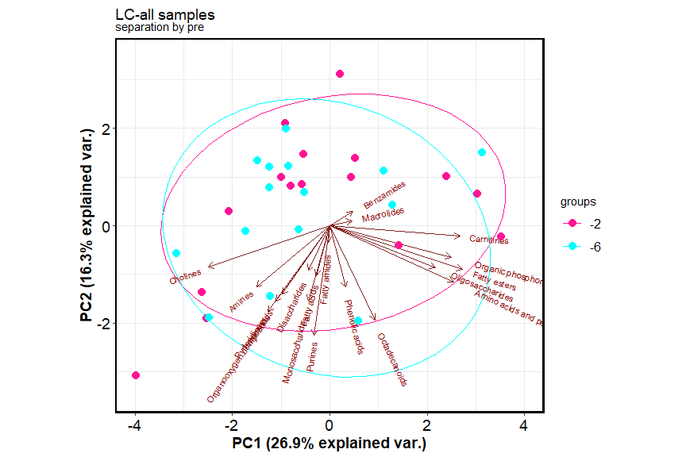<!-- -->

    ## 
    ## $gg_pca_inc1

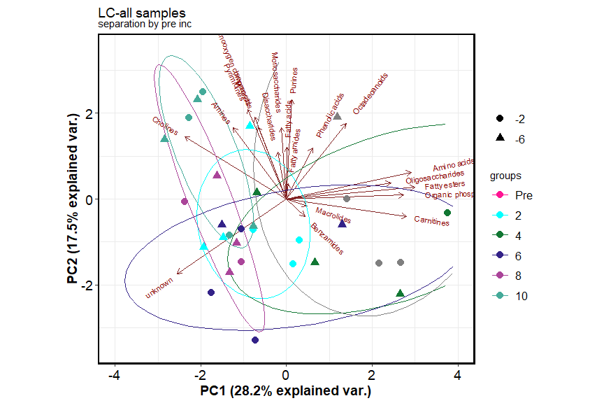<!-- -->

    ## 
    ## $permanova_LC_all
    ## 
    ## 
    ## Table: Permanova results all by Main class
    ## 
    ## |         | Df|  SumOfSqs|        R2|        F| Pr(>F)|
    ## |:--------|--:|---------:|---------:|--------:|------:|
    ## |pre      |  1| 0.0001455| 0.0358253| 1.929872|  0.114|
    ## |inc      |  5| 0.0014038| 0.3457389| 3.724922|  0.001|
    ## |pre:inc  |  5| 0.0007774| 0.1914741| 2.062904|  0.021|
    ## |Residual | 23| 0.0017335| 0.4269617|       NA|     NA|
    ## |Total    | 34| 0.0040602| 1.0000000|       NA|     NA|
    ## 
    ## $gg_pca_pre2

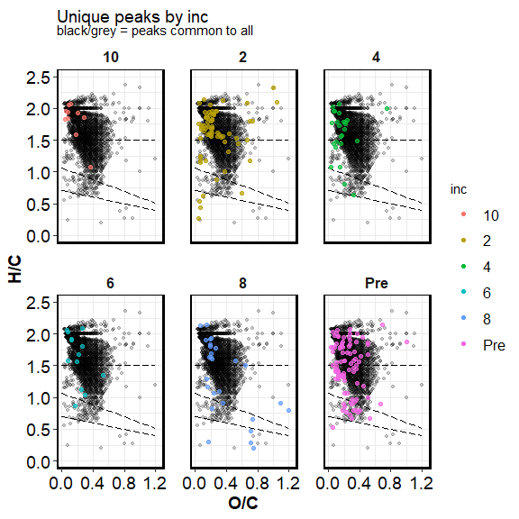<!-- -->

    ## 
    ## $gg_pca_inc2

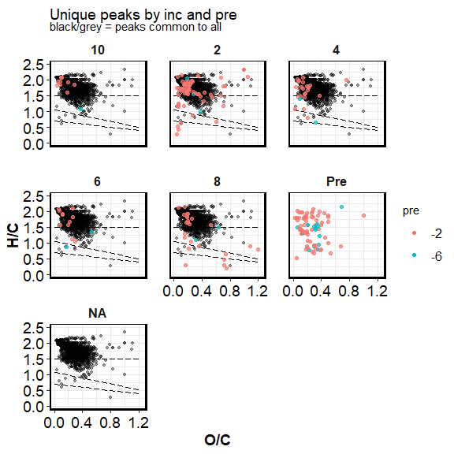<!-- -->

    ## 
    ## $permanova_LC_all2
    ## 
    ## 
    ## Table: Permanova results saccharides
    ## 
    ## |         | Df|  SumOfSqs|        R2|        F| Pr(>F)|
    ## |:--------|--:|---------:|---------:|--------:|------:|
    ## |pre      |  1| 0.0001863| 0.0273047| 1.412979|  0.212|
    ## |inc      |  5| 0.0023910| 0.3503736| 3.626269|  0.005|
    ## |pre:inc  |  5| 0.0012138| 0.1778652| 1.840855|  0.105|
    ## |Residual | 23| 0.0030331| 0.4444564|       NA|     NA|
    ## |Total    | 34| 0.0068243| 1.0000000|       NA|     NA|

------------------------------------------------------------------------

## Lipids

click to open

<!-- -->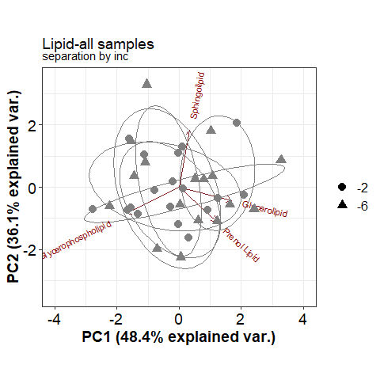<!-- -->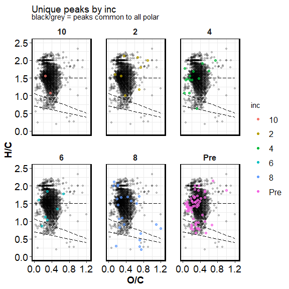<!-- -->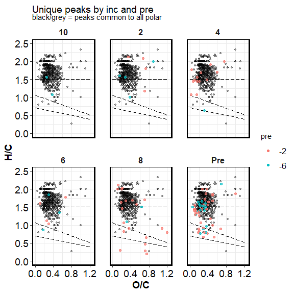<!-- -->

|          |  Df |  SumOfSqs |        R2 |        F | Pr(\>F) |
|:---------|----:|----------:|----------:|---------:|--------:|
| Pre      |   1 | 0.0000127 | 0.0312988 | 1.259669 |   0.302 |
| Inc      |   5 | 0.0000742 | 0.1823599 | 1.467871 |   0.175 |
| Pre:Inc  |   5 | 0.0000773 | 0.1900165 | 1.529501 |   0.168 |
| Residual |  24 | 0.0002427 | 0.5963247 |       NA |      NA |
| Total    |  35 | 0.0004071 | 1.0000000 |       NA |      NA |

Permanova results all

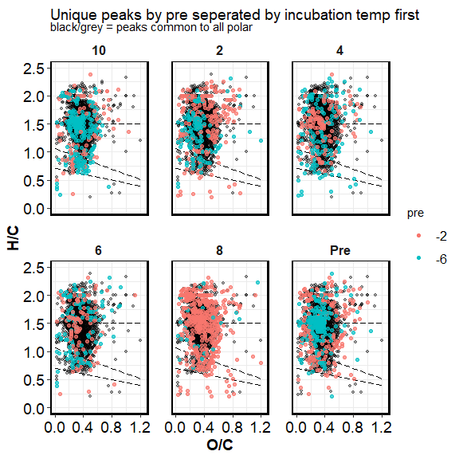<!-- -->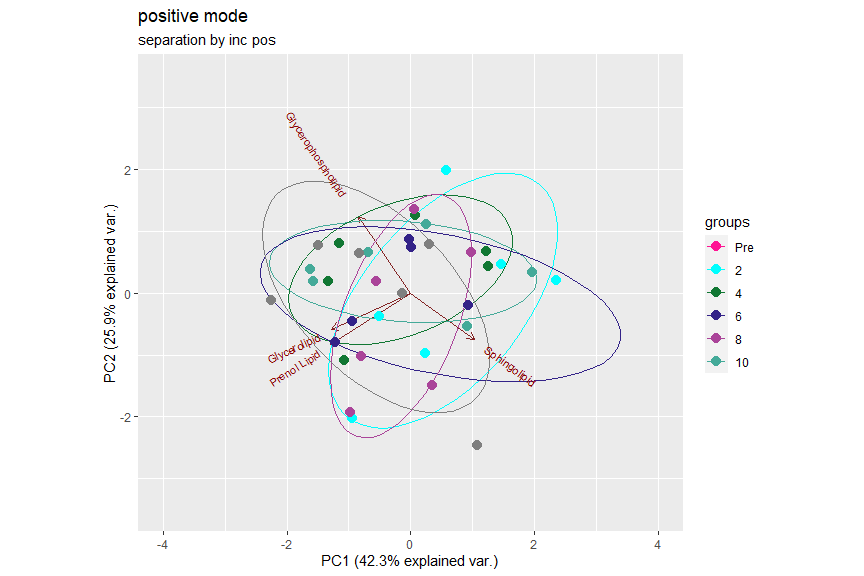<!-- -->

|          |  Df |  SumOfSqs |        R2 |         F | Pr(\>F) |
|:---------|----:|----------:|----------:|----------:|--------:|
| Pre      |   1 | 0.0000064 | 0.0153686 | 0.5551514 |   0.594 |
| Inc      |   5 | 0.0000636 | 0.1537306 | 1.1106287 |   0.366 |
| Pre:Inc  |   5 | 0.0000689 | 0.1664960 | 1.2028526 |   0.328 |
| Residual |  24 | 0.0002749 | 0.6644048 |        NA |      NA |
| Total    |  35 | 0.0004138 | 1.0000000 |        NA |      NA |

Permanova results pos

<!-- -->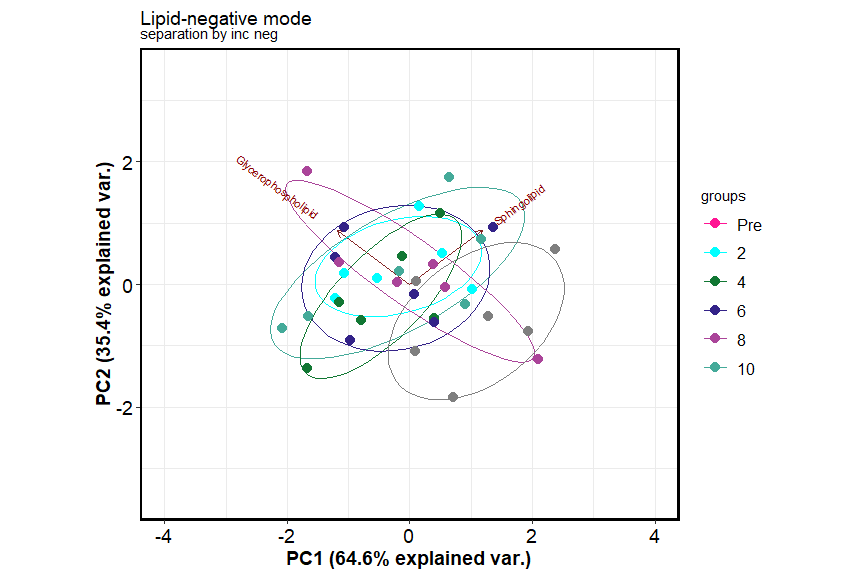<!-- -->

|          |  Df |  SumOfSqs |        R2 |        F | Pr(\>F) |
|:---------|----:|----------:|----------:|---------:|--------:|
| Pre      |   1 | 0.0000268 | 0.0346902 | 1.933659 |   0.170 |
| Inc      |   5 | 0.0002308 | 0.2982330 | 3.324750 |   0.009 |
| Pre:Inc  |   5 | 0.0001830 | 0.2365126 | 2.636681 |   0.035 |
| Residual |  24 | 0.0003332 | 0.4305642 |       NA |      NA |
| Total    |  35 | 0.0007739 | 1.0000000 |       NA |      NA |

Permanova results neg

click to open ANOVA table

| Name2                                            | Count\_-2_T0 | Count\_-6_6 | Count\_-6_4 | Count\_-2_4 | Count\_-2_10 | Count\_-6_8 | Count\_-2_8 | Count\_-6_T0 | Count\_-2_2 | Count\_-6_2 | Count\_-2_6 | Count\_-6_10 | Mean\_-2_T0 | Mean\_-6_6 | Mean\_-6_4 | Mean\_-2_4 | Mean\_-2_10 | Mean\_-6_8 | Mean\_-2_8 | Mean\_-6_T0 | Mean\_-2_2 | Mean\_-6_2 | Mean\_-2_6 | Mean\_-6_10 | Fold_change\_-2_T0_vs\_-6_6 | Fold_change\_-2_T0_vs\_-6_4 | Fold_change\_-2_T0_vs\_-2_4 | Fold_change\_-2_T0_vs\_-2_10 | Fold_change\_-2_T0_vs\_-6_8 | Fold_change\_-2_T0_vs\_-2_8 | Fold_change\_-2_T0_vs\_-6_T0 | Fold_change\_-2_T0_vs\_-2_2 | Fold_change\_-2_T0_vs\_-6_2 | Fold_change\_-2_T0_vs\_-2_6 | Fold_change\_-2_T0_vs\_-6_10 | Fold_change\_-6_6\_vs\_-6_4 | Fold_change\_-6_6\_vs\_-2_4 | Fold_change\_-6_6\_vs\_-2_10 | Fold_change\_-6_6\_vs\_-6_8 | Fold_change\_-6_6\_vs\_-2_8 | Fold_change\_-6_6\_vs\_-6_T0 | Fold_change\_-6_6\_vs\_-2_2 | Fold_change\_-6_6\_vs\_-6_2 | Fold_change\_-6_6\_vs\_-2_6 | Fold_change\_-6_6\_vs\_-6_10 | Fold_change\_-6_4\_vs\_-2_4 | Fold_change\_-6_4\_vs\_-2_10 | Fold_change\_-6_4\_vs\_-6_8 | Fold_change\_-6_4\_vs\_-2_8 | Fold_change\_-6_4\_vs\_-6_T0 | Fold_change\_-6_4\_vs\_-2_2 | Fold_change\_-6_4\_vs\_-6_2 | Fold_change\_-6_4\_vs\_-2_6 | Fold_change\_-6_4\_vs\_-6_10 | Fold_change\_-2_4\_vs\_-2_10 | Fold_change\_-2_4\_vs\_-6_8 | Fold_change\_-2_4\_vs\_-2_8 | Fold_change\_-2_4\_vs\_-6_T0 | Fold_change\_-2_4\_vs\_-2_2 | Fold_change\_-2_4\_vs\_-6_2 | Fold_change\_-2_4\_vs\_-2_6 | Fold_change\_-2_4\_vs\_-6_10 | Fold_change\_-2_10_vs\_-6_8 | Fold_change\_-2_10_vs\_-2_8 | Fold_change\_-2_10_vs\_-6_T0 | Fold_change\_-2_10_vs\_-2_2 | Fold_change\_-2_10_vs\_-6_2 | Fold_change\_-2_10_vs\_-2_6 | Fold_change\_-2_10_vs\_-6_10 | Fold_change\_-6_8\_vs\_-2_8 | Fold_change\_-6_8\_vs\_-6_T0 | Fold_change\_-6_8\_vs\_-2_2 | Fold_change\_-6_8\_vs\_-6_2 | Fold_change\_-6_8\_vs\_-2_6 | Fold_change\_-6_8\_vs\_-6_10 | Fold_change\_-2_8\_vs\_-6_T0 | Fold_change\_-2_8\_vs\_-2_2 | Fold_change\_-2_8\_vs\_-6_2 | Fold_change\_-2_8\_vs\_-2_6 | Fold_change\_-2_8\_vs\_-6_10 | Fold_change\_-6_T0_vs\_-2_2 | Fold_change\_-6_T0_vs\_-6_2 | Fold_change\_-6_T0_vs\_-2_6 | Fold_change\_-6_T0_vs\_-6_10 | Fold_change\_-2_2\_vs\_-6_2 | Fold_change\_-2_2\_vs\_-2_6 | Fold_change\_-2_2\_vs\_-6_10 | Fold_change\_-6_2\_vs\_-2_6 | Fold_change\_-6_2\_vs\_-6_10 | Fold_change\_-2_6\_vs\_-6_10 | P_value_A\_-2_T0_vs\_-6_6 | P_value_A\_-2_T0_vs\_-6_4 | P_value_A\_-2_T0_vs\_-2_4 | P_value_A\_-2_T0_vs\_-2_10 | P_value_A\_-2_T0_vs\_-6_8 | P_value_A\_-2_T0_vs\_-2_8 | P_value_A\_-2_T0_vs\_-6_T0 | P_value_A\_-2_T0_vs\_-2_2 | P_value_A\_-2_T0_vs\_-6_2 | P_value_A\_-2_T0_vs\_-2_6 | P_value_A\_-2_T0_vs\_-6_10 | P_value_A\_-6_6\_vs\_-6_4 | P_value_A\_-6_6\_vs\_-2_4 | P_value_A\_-6_6\_vs\_-2_10 | P_value_A\_-6_6\_vs\_-6_8 | P_value_A\_-6_6\_vs\_-2_8 | P_value_A\_-6_6\_vs\_-6_T0 | P_value_A\_-6_6\_vs\_-2_2 | P_value_A\_-6_6\_vs\_-6_2 | P_value_A\_-6_6\_vs\_-2_6 | P_value_A\_-6_6\_vs\_-6_10 | P_value_A\_-6_4\_vs\_-2_4 | P_value_A\_-6_4\_vs\_-2_10 | P_value_A\_-6_4\_vs\_-6_8 | P_value_A\_-6_4\_vs\_-2_8 | P_value_A\_-6_4\_vs\_-6_T0 | P_value_A\_-6_4\_vs\_-2_2 | P_value_A\_-6_4\_vs\_-6_2 | P_value_A\_-6_4\_vs\_-2_6 | P_value_A\_-6_4\_vs\_-6_10 | P_value_A\_-2_4\_vs\_-2_10 | P_value_A\_-2_4\_vs\_-6_8 | P_value_A\_-2_4\_vs\_-2_8 | P_value_A\_-2_4\_vs\_-6_T0 | P_value_A\_-2_4\_vs\_-2_2 | P_value_A\_-2_4\_vs\_-6_2 | P_value_A\_-2_4\_vs\_-2_6 | P_value_A\_-2_4\_vs\_-6_10 | P_value_A\_-2_10_vs\_-6_8 | P_value_A\_-2_10_vs\_-2_8 | P_value_A\_-2_10_vs\_-6_T0 | P_value_A\_-2_10_vs\_-2_2 | P_value_A\_-2_10_vs\_-6_2 | P_value_A\_-2_10_vs\_-2_6 | P_value_A\_-2_10_vs\_-6_10 | P_value_A\_-6_8\_vs\_-2_8 | P_value_A\_-6_8\_vs\_-6_T0 | P_value_A\_-6_8\_vs\_-2_2 | P_value_A\_-6_8\_vs\_-6_2 | P_value_A\_-6_8\_vs\_-2_6 | P_value_A\_-6_8\_vs\_-6_10 | P_value_A\_-2_8\_vs\_-6_T0 | P_value_A\_-2_8\_vs\_-2_2 | P_value_A\_-2_8\_vs\_-6_2 | P_value_A\_-2_8\_vs\_-2_6 | P_value_A\_-2_8\_vs\_-6_10 | P_value_A\_-6_T0_vs\_-2_2 | P_value_A\_-6_T0_vs\_-6_2 | P_value_A\_-6_T0_vs\_-2_6 | P_value_A\_-6_T0_vs\_-6_10 | P_value_A\_-2_2\_vs\_-6_2 | P_value_A\_-2_2\_vs\_-2_6 | P_value_A\_-2_2\_vs\_-6_10 | P_value_A\_-6_2\_vs\_-2_6 | P_value_A\_-6_2\_vs\_-6_10 | P_value_A\_-2_6\_vs\_-6_10 | Flag_A\_-2_T0_vs\_-6_6 | Flag_A\_-2_T0_vs\_-6_4 | Flag_A\_-2_T0_vs\_-2_4 | Flag_A\_-2_T0_vs\_-2_10 | Flag_A\_-2_T0_vs\_-6_8 | Flag_A\_-2_T0_vs\_-2_8 | Flag_A\_-2_T0_vs\_-6_T0 | Flag_A\_-2_T0_vs\_-2_2 | Flag_A\_-2_T0_vs\_-6_2 | Flag_A\_-2_T0_vs\_-2_6 | Flag_A\_-2_T0_vs\_-6_10 | Flag_A\_-6_6\_vs\_-6_4 | Flag_A\_-6_6\_vs\_-2_4 | Flag_A\_-6_6\_vs\_-2_10 | Flag_A\_-6_6\_vs\_-6_8 | Flag_A\_-6_6\_vs\_-2_8 | Flag_A\_-6_6\_vs\_-6_T0 | Flag_A\_-6_6\_vs\_-2_2 | Flag_A\_-6_6\_vs\_-6_2 | Flag_A\_-6_6\_vs\_-2_6 | Flag_A\_-6_6\_vs\_-6_10 | Flag_A\_-6_4\_vs\_-2_4 | Flag_A\_-6_4\_vs\_-2_10 | Flag_A\_-6_4\_vs\_-6_8 | Flag_A\_-6_4\_vs\_-2_8 | Flag_A\_-6_4\_vs\_-6_T0 | Flag_A\_-6_4\_vs\_-2_2 | Flag_A\_-6_4\_vs\_-6_2 | Flag_A\_-6_4\_vs\_-2_6 | Flag_A\_-6_4\_vs\_-6_10 | Flag_A\_-2_4\_vs\_-2_10 | Flag_A\_-2_4\_vs\_-6_8 | Flag_A\_-2_4\_vs\_-2_8 | Flag_A\_-2_4\_vs\_-6_T0 | Flag_A\_-2_4\_vs\_-2_2 | Flag_A\_-2_4\_vs\_-6_2 | Flag_A\_-2_4\_vs\_-2_6 | Flag_A\_-2_4\_vs\_-6_10 | Flag_A\_-2_10_vs\_-6_8 | Flag_A\_-2_10_vs\_-2_8 | Flag_A\_-2_10_vs\_-6_T0 | Flag_A\_-2_10_vs\_-2_2 | Flag_A\_-2_10_vs\_-6_2 | Flag_A\_-2_10_vs\_-2_6 | Flag_A\_-2_10_vs\_-6_10 | Flag_A\_-6_8\_vs\_-2_8 | Flag_A\_-6_8\_vs\_-6_T0 | Flag_A\_-6_8\_vs\_-2_2 | Flag_A\_-6_8\_vs\_-6_2 | Flag_A\_-6_8\_vs\_-2_6 | Flag_A\_-6_8\_vs\_-6_10 | Flag_A\_-2_8\_vs\_-6_T0 | Flag_A\_-2_8\_vs\_-2_2 | Flag_A\_-2_8\_vs\_-6_2 | Flag_A\_-2_8\_vs\_-2_6 | Flag_A\_-2_8\_vs\_-6_10 | Flag_A\_-6_T0_vs\_-2_2 | Flag_A\_-6_T0_vs\_-6_2 | Flag_A\_-6_T0_vs\_-2_6 | Flag_A\_-6_T0_vs\_-6_10 | Flag_A\_-2_2\_vs\_-6_2 | Flag_A\_-2_2\_vs\_-2_6 | Flag_A\_-2_2\_vs\_-6_10 | Flag_A\_-6_2\_vs\_-2_6 | Flag_A\_-6_2\_vs\_-6_10 | Flag_A\_-2_6\_vs\_-6_10 |
|:-------------------------------------------------|-------------:|------------:|------------:|------------:|-------------:|------------:|------------:|-------------:|------------:|------------:|------------:|-------------:|------------:|-----------:|-----------:|-----------:|------------:|-----------:|-----------:|------------:|-----------:|-----------:|-----------:|------------:|----------------------------:|----------------------------:|----------------------------:|-----------------------------:|----------------------------:|----------------------------:|-----------------------------:|----------------------------:|----------------------------:|----------------------------:|-----------------------------:|----------------------------:|----------------------------:|-----------------------------:|----------------------------:|----------------------------:|-----------------------------:|----------------------------:|----------------------------:|----------------------------:|-----------------------------:|----------------------------:|-----------------------------:|----------------------------:|----------------------------:|-----------------------------:|----------------------------:|----------------------------:|----------------------------:|-----------------------------:|-----------------------------:|----------------------------:|----------------------------:|-----------------------------:|----------------------------:|----------------------------:|----------------------------:|-----------------------------:|----------------------------:|----------------------------:|-----------------------------:|----------------------------:|----------------------------:|----------------------------:|-----------------------------:|----------------------------:|-----------------------------:|----------------------------:|----------------------------:|----------------------------:|-----------------------------:|-----------------------------:|----------------------------:|----------------------------:|----------------------------:|-----------------------------:|----------------------------:|----------------------------:|----------------------------:|-----------------------------:|----------------------------:|----------------------------:|-----------------------------:|----------------------------:|-----------------------------:|-----------------------------:|--------------------------:|--------------------------:|--------------------------:|---------------------------:|--------------------------:|--------------------------:|---------------------------:|--------------------------:|--------------------------:|--------------------------:|---------------------------:|--------------------------:|--------------------------:|---------------------------:|--------------------------:|--------------------------:|---------------------------:|--------------------------:|--------------------------:|--------------------------:|---------------------------:|--------------------------:|---------------------------:|--------------------------:|--------------------------:|---------------------------:|--------------------------:|--------------------------:|--------------------------:|---------------------------:|---------------------------:|--------------------------:|--------------------------:|---------------------------:|--------------------------:|--------------------------:|--------------------------:|---------------------------:|--------------------------:|--------------------------:|---------------------------:|--------------------------:|--------------------------:|--------------------------:|---------------------------:|--------------------------:|---------------------------:|--------------------------:|--------------------------:|--------------------------:|---------------------------:|---------------------------:|--------------------------:|--------------------------:|--------------------------:|---------------------------:|--------------------------:|--------------------------:|--------------------------:|---------------------------:|--------------------------:|--------------------------:|---------------------------:|--------------------------:|---------------------------:|---------------------------:|-----------------------:|-----------------------:|-----------------------:|------------------------:|-----------------------:|-----------------------:|------------------------:|-----------------------:|-----------------------:|-----------------------:|------------------------:|-----------------------:|-----------------------:|------------------------:|-----------------------:|-----------------------:|------------------------:|-----------------------:|-----------------------:|-----------------------:|------------------------:|-----------------------:|------------------------:|-----------------------:|-----------------------:|------------------------:|-----------------------:|-----------------------:|-----------------------:|------------------------:|------------------------:|-----------------------:|-----------------------:|------------------------:|-----------------------:|-----------------------:|-----------------------:|------------------------:|-----------------------:|-----------------------:|------------------------:|-----------------------:|-----------------------:|-----------------------:|------------------------:|-----------------------:|------------------------:|-----------------------:|-----------------------:|-----------------------:|------------------------:|------------------------:|-----------------------:|-----------------------:|-----------------------:|------------------------:|-----------------------:|-----------------------:|-----------------------:|------------------------:|-----------------------:|-----------------------:|------------------------:|-----------------------:|------------------------:|------------------------:|
| Cer(d16:0/16:3)\_\_pos                           |            3 |           3 |           3 |           3 |            3 |           3 |           3 |            3 |           3 |           3 |           3 |            3 |    21.58175 |   20.88077 |   21.32322 |   21.32678 |    21.11058 |   21.15001 |   20.74677 |    21.44771 |   20.89107 |   21.30018 |   21.26713 |    21.23632 |                   0.7009766 |                   0.2585335 |                   0.2549716 |                    0.4711686 |                   0.4317367 |                   0.8349844 |                    0.1340371 |                   0.6906835 |                   0.2815699 |                   0.3146253 |                    0.3454303 |                  -0.4424430 |                  -0.4460050 |                   -0.2298079 |                  -0.2692398 |                   0.1340078 |                   -0.5669395 |                  -0.0102930 |                  -0.4194066 |                  -0.3863513 |                   -0.3555463 |                  -0.0035620 |                    0.2126351 |                   0.1732032 |                   0.5764508 |                   -0.1244965 |                   0.4321500 |                   0.0230364 |                   0.0560917 |                    0.0868967 |                    0.2161971 |                   0.1767652 |                   0.5800128 |                   -0.1209345 |                   0.4357119 |                   0.0265984 |                   0.0596537 |                    0.0904587 |                  -0.0394319 |                   0.3638157 |                   -0.3371316 |                   0.2195149 |                  -0.1895987 |                  -0.1565434 |                   -0.1257384 |                   0.4032476 |                   -0.2976997 |                   0.2589468 |                  -0.1501668 |                  -0.1171115 |                   -0.0863065 |                   -0.7009473 |                  -0.1443009 |                  -0.5534144 |                  -0.5203591 |                   -0.4895541 |                   0.5566464 |                   0.1475329 |                   0.1805882 |                    0.2113932 |                  -0.4091136 |                  -0.3760583 |                   -0.3452532 |                   0.0330553 |                    0.0638603 |                    0.0308050 |                 0.0530675 |                 0.4602775 |                 0.4664110 |                  0.1840863 |                 0.2222006 |                 0.0232666 |                  0.7006530 |                 0.0563831 |                 0.4217856 |                 0.3701842 |                  0.3260140 |                 0.2113000 |                 0.2077659 |                  0.5110912 |                 0.4421335 |                 0.7007150 |                  0.1128670 |                 0.9764115 |                 0.2352791 |                 0.2731833 |                  0.3123361 |                 0.9918359 |                  0.5429010 |                 0.6197148 |                 0.1072591 |                  0.7209782 |                 0.2217721 |                 0.9472405 |                 0.8720243 |                  0.8030054 |                  0.5362177 |                 0.6125720 |                 0.1052202 |                  0.7286216 |                 0.2181042 |                 0.9390983 |                 0.8639792 |                  0.7951177 |                 0.9098254 |                 0.3014575 |                  0.3375398 |                 0.5300324 |                 0.5871639 |                 0.6536225 |                  0.7183202 |                 0.2532851 |                  0.3960657 |                 0.4595691 |                 0.6668102 |                 0.7368572 |                  0.8043145 |                  0.0530767 |                 0.6790393 |                 0.1212626 |                 0.1439815 |                  0.1681687 |                 0.1192105 |                 0.6722899 |                 0.6049491 |                  0.5452415 |                 0.2466339 |                 0.2858495 |                  0.3262570 |                 0.9243566 |                  0.8544974 |                  0.9294914 |                      0 |                      0 |                      0 |                       0 |                      0 |                      1 |                       0 |                      0 |                      0 |                      0 |                       0 |                      0 |                      0 |                       0 |                      0 |                      0 |                       0 |                      0 |                      0 |                      0 |                       0 |                      0 |                       0 |                      0 |                      0 |                       0 |                      0 |                      0 |                      0 |                       0 |                       0 |                      0 |                      0 |                       0 |                      0 |                      0 |                      0 |                       0 |                      0 |                      0 |                       0 |                      0 |                      0 |                      0 |                       0 |                      0 |                       0 |                      0 |                      0 |                      0 |                       0 |                       0 |                      0 |                      0 |                      0 |                       0 |                      0 |                      0 |                      0 |                       0 |                      0 |                      0 |                       0 |                      0 |                       0 |                       0 |
| Cer(d16:0/18:2)\_\_pos                           |            3 |           3 |           3 |           3 |            3 |           3 |           3 |            3 |           3 |           3 |           3 |            3 |    19.62536 |   19.54814 |   19.48781 |   19.42656 |    19.64759 |   19.73119 |   19.66994 |    19.68661 |   19.55749 |   19.61874 |   19.48689 |    19.70884 |                   0.0772265 |                   0.1375568 |                   0.1988028 |                   -0.0222305 |                  -0.1058215 |                  -0.0445755 |                   -0.0612459 |                   0.0678692 |                   0.0066233 |                   0.1384724 |                   -0.0834764 |                   0.0603304 |                   0.1215763 |                   -0.0994570 |                  -0.1830479 |                  -0.1218020 |                   -0.1384724 |                  -0.0093573 |                  -0.0706032 |                   0.0612459 |                   -0.1607029 |                   0.0612459 |                   -0.1597873 |                  -0.2433783 |                  -0.1821324 |                   -0.1988028 |                  -0.0696876 |                  -0.1309335 |                   0.0009156 |                   -0.2210332 |                   -0.2210332 |                  -0.3046242 |                  -0.2433783 |                   -0.2600487 |                  -0.1309335 |                  -0.1921795 |                  -0.0603304 |                   -0.2822792 |                  -0.0835910 |                  -0.0223450 |                   -0.0390154 |                   0.0900997 |                   0.0288538 |                   0.1607029 |                   -0.0612459 |                   0.0612459 |                    0.0445755 |                   0.1736907 |                   0.1124447 |                   0.2442939 |                    0.0223450 |                   -0.0166704 |                   0.1124447 |                   0.0511988 |                   0.1830479 |                   -0.0389009 |                   0.1291151 |                   0.0678692 |                   0.1997183 |                   -0.0222305 |                  -0.0612459 |                   0.0706032 |                   -0.1513456 |                   0.1318491 |                   -0.0900997 |                   -0.2219488 |                 0.8919687 |                 0.8089272 |                 0.7269101 |                  0.9688087 |                 0.8523900 |                 0.9375079 |                  0.9142199 |                 0.9049880 |                 0.9907047 |                 0.8076819 |                  0.8832898 |                 0.9154971 |                 0.8307443 |                  0.8611689 |                 0.7477366 |                 0.8304351 |                  0.8076819 |                 0.9868681 |                 0.9011811 |                 0.9142199 |                  0.7776102 |                 0.9142199 |                  0.7788421 |                 0.6691825 |                 0.7489531 |                  0.7269101 |                 0.9024557 |                 0.8179515 |                 0.9987150 |                  0.6978880 |                  0.6978880 |                 0.5931969 |                 0.6691825 |                  0.6480939 |                 0.8179515 |                 0.7356404 |                 0.9154971 |                  0.6204348 |                 0.8831309 |                 0.9686481 |                  0.9452889 |                 0.8741088 |                 0.9595232 |                 0.7776102 |                  0.9142199 |                 0.9142199 |                  0.9375079 |                 0.7602006 |                 0.8432747 |                 0.6680168 |                  0.9686481 |                  0.9766072 |                 0.8432747 |                 0.9282474 |                 0.7477366 |                  0.9454492 |                 0.8204336 |                 0.9049880 |                 0.7257062 |                  0.9688087 |                 0.9142199 |                 0.9011811 |                  0.7902278 |                 0.8167024 |                  0.8741088 |                  0.6967024 |                      0 |                      0 |                      0 |                       0 |                      0 |                      0 |                       0 |                      0 |                      0 |                      0 |                       0 |                      0 |                      0 |                       0 |                      0 |                      0 |                       0 |                      0 |                      0 |                      0 |                       0 |                      0 |                       0 |                      0 |                      0 |                       0 |                      0 |                      0 |                      0 |                       0 |                       0 |                      0 |                      0 |                       0 |                      0 |                      0 |                      0 |                       0 |                      0 |                      0 |                       0 |                      0 |                      0 |                      0 |                       0 |                      0 |                       0 |                      0 |                      0 |                      0 |                       0 |                       0 |                      0 |                      0 |                      0 |                       0 |                      0 |                      0 |                      0 |                       0 |                      0 |                      0 |                       0 |                      0 |                       0 |                       0 |
| Cer(d16:0/20:0)\_\_pos                           |            3 |           3 |           3 |           3 |            3 |           3 |           3 |            3 |           3 |           3 |           3 |            3 |    24.96710 |   24.74749 |   24.54304 |   24.83153 |    24.86496 |   24.76097 |   24.70015 |    24.92363 |   24.89063 |   24.53381 |   24.66527 |    24.40561 |                   0.2196109 |                   0.4240646 |                   0.1355654 |                    0.1021386 |                   0.2061275 |                   0.2669503 |                    0.0434729 |                   0.0764732 |                   0.4332850 |                   0.3018266 |                    0.5614887 |                   0.2044536 |                  -0.0840455 |                   -0.1174723 |                  -0.0134834 |                   0.0473394 |                   -0.1761380 |                  -0.1431377 |                   0.2136740 |                   0.0822157 |                    0.3418778 |                  -0.2884992 |                   -0.3219259 |                  -0.2179371 |                  -0.1571143 |                   -0.3805916 |                  -0.3475914 |                   0.0092204 |                  -0.1222380 |                    0.1374242 |                   -0.0334267 |                   0.0705621 |                   0.1313849 |                   -0.0920924 |                  -0.0590922 |                   0.2977196 |                   0.1662612 |                    0.4259234 |                   0.1039888 |                   0.1648117 |                   -0.0586657 |                  -0.0256655 |                   0.3311463 |                   0.1996879 |                    0.4593501 |                   0.0608228 |                   -0.1626546 |                  -0.1296543 |                   0.2271575 |                   0.0956991 |                    0.3553612 |                   -0.2234774 |                  -0.1904771 |                   0.1663347 |                   0.0348763 |                    0.2945384 |                   0.0330003 |                   0.3898120 |                   0.2583537 |                    0.5180158 |                   0.3568118 |                   0.2253534 |                    0.4850155 |                  -0.1314584 |                    0.1282038 |                    0.2596621 |                 0.3481793 |                 0.0770121 |                 0.5602658 |                  0.6602903 |                 0.3780493 |                 0.2562162 |                  0.8513611 |                 0.7418781 |                 0.0711955 |                 0.2009116 |                  0.0221315 |                 0.3818714 |                 0.7174306 |                  0.6134452 |                 0.9536391 |                 0.8383273 |                  0.4503026 |                 0.5387341 |                 0.3611297 |                 0.7233115 |                  0.1493595 |                 0.2208469 |                  0.1735253 |                 0.3517984 |                 0.5001821 |                  0.1102797 |                 0.1429651 |                 0.9682869 |                 0.5992090 |                  0.5549395 |                  0.8854202 |                 0.7611581 |                 0.5723401 |                  0.6917848 |                 0.7990121 |                 0.2069006 |                 0.4758175 |                  0.0758074 |                 0.6545570 |                 0.4796319 |                  0.8004300 |                 0.9118915 |                 0.1619956 |                 0.3928911 |                  0.0567774 |                 0.7932657 |                  0.4853410 |                 0.5773769 |                 0.3321762 |                 0.6804089 |                  0.1346297 |                  0.3399161 |                 0.4147634 |                 0.4756247 |                 0.8804903 |                  0.2116335 |                 0.8868715 |                 0.1023555 |                 0.2714398 |                  0.0333849 |                 0.1331187 |                 0.3359552 |                  0.0451676 |                 0.5721268 |                  0.5816155 |                  0.2690810 |                      0 |                      0 |                      0 |                       0 |                      0 |                      0 |                       0 |                      0 |                      0 |                      0 |                       1 |                      0 |                      0 |                       0 |                      0 |                      0 |                       0 |                      0 |                      0 |                      0 |                       0 |                      0 |                       0 |                      0 |                      0 |                       0 |                      0 |                      0 |                      0 |                       0 |                       0 |                      0 |                      0 |                       0 |                      0 |                      0 |                      0 |                       0 |                      0 |                      0 |                       0 |                      0 |                      0 |                      0 |                       0 |                      0 |                       0 |                      0 |                      0 |                      0 |                       0 |                       0 |                      0 |                      0 |                      0 |                       0 |                      0 |                      0 |                      0 |                       1 |                      0 |                      0 |                       1 |                      0 |                       0 |                       0 |
| Cer(d18:0/14:0)\_A\_\_pos                        |            3 |           3 |           3 |           3 |            3 |           3 |           3 |            3 |           3 |           3 |           3 |            3 |    19.88400 |   19.59920 |   19.64120 |   19.70710 |    19.64444 |   19.74927 |   19.81518 |    19.81810 |   19.62910 |   19.56319 |   19.66510 |    19.57853 |                   0.2848045 |                   0.2428029 |                   0.1768973 |                    0.2395638 |                   0.1347285 |                   0.0688230 |                    0.0659055 |                   0.2549060 |                   0.3208115 |                   0.2188990 |                    0.3054694 |                  -0.0420016 |                  -0.1079072 |                   -0.0452407 |                  -0.1500760 |                  -0.2159815 |                   -0.2188990 |                  -0.0298985 |                   0.0360070 |                  -0.0659055 |                    0.0206648 |                  -0.0659055 |                   -0.0032390 |                  -0.1080744 |                  -0.1739799 |                   -0.1768973 |                   0.0121031 |                   0.0780087 |                  -0.0239039 |                    0.0626665 |                    0.0626665 |                  -0.0421689 |                  -0.1080744 |                   -0.1109918 |                   0.0780087 |                   0.1439142 |                   0.0420016 |                    0.1285720 |                  -0.1048354 |                  -0.1707409 |                   -0.1736583 |                   0.0153422 |                   0.0812477 |                  -0.0206648 |                    0.0659055 |                  -0.0659055 |                   -0.0688230 |                   0.1201775 |                   0.1860830 |                   0.0841705 |                    0.1707409 |                   -0.0029175 |                   0.1860830 |                   0.2519885 |                   0.1500760 |                    0.2366464 |                   0.1890005 |                   0.2549060 |                   0.1529935 |                    0.2395638 |                   0.0659055 |                  -0.0360070 |                    0.0505634 |                  -0.1019125 |                   -0.0153422 |                    0.0865704 |                 0.2624499 |                 0.3376622 |                 0.4828500 |                  0.3440234 |                 0.5922234 |                 0.7839133 |                  0.7928467 |                 0.3146074 |                 0.2084306 |                 0.3865099 |                  0.2303040 |                 0.8670255 |                 0.6675923 |                  0.8568844 |                 0.5510435 |                 0.3927723 |                  0.3865099 |                 0.9051116 |                 0.8858544 |                 0.7928467 |                  0.9343301 |                 0.7928467 |                  0.9896948 |                 0.6671100 |                 0.4900244 |                  0.4828500 |                 0.9615076 |                 0.7559887 |                 0.9240678 |                  0.8027987 |                  0.8027987 |                 0.8665013 |                 0.6671100 |                  0.6587197 |                 0.7559887 |                 0.5673960 |                 0.8670255 |                  0.6091550 |                 0.6764772 |                 0.4980606 |                  0.4908189 |                 0.9512185 |                 0.7462201 |                 0.9343301 |                  0.7928467 |                 0.7928467 |                  0.7839133 |                 0.6326038 |                 0.4606620 |                 0.7374421 |                  0.4980606 |                  0.9907178 |                 0.4606620 |                 0.3200617 |                 0.5510435 |                  0.3498223 |                 0.4537436 |                 0.3146074 |                 0.5433880 |                  0.3440234 |                 0.7928467 |                 0.8858544 |                  0.8402748 |                 0.6849759 |                  0.9512185 |                  0.7302619 |                      0 |                      0 |                      0 |                       0 |                      0 |                      0 |                       0 |                      0 |                      0 |                      0 |                       0 |                      0 |                      0 |                       0 |                      0 |                      0 |                       0 |                      0 |                      0 |                      0 |                       0 |                      0 |                       0 |                      0 |                      0 |                       0 |                      0 |                      0 |                      0 |                       0 |                       0 |                      0 |                      0 |                       0 |                      0 |                      0 |                      0 |                       0 |                      0 |                      0 |                       0 |                      0 |                      0 |                      0 |                       0 |                      0 |                       0 |                      0 |                      0 |                      0 |                       0 |                       0 |                      0 |                      0 |                      0 |                       0 |                      0 |                      0 |                      0 |                       0 |                      0 |                      0 |                       0 |                      0 |                       0 |                       0 |
| Cer(d18:0/14:0)\_B\_\_pos                        |            3 |           3 |           3 |           3 |            3 |           3 |           3 |            3 |           3 |           3 |           3 |            3 |    23.54480 |   22.89169 |   22.85624 |   23.09972 |    23.39934 |   22.98222 |   23.22569 |    23.30132 |   23.36036 |   23.11689 |   23.13516 |    23.15586 |                   0.6531084 |                   0.6885539 |                   0.4450795 |                    0.1454594 |                   0.5625803 |                   0.3191058 |                    0.2434745 |                   0.1844352 |                   0.4279097 |                   0.4096340 |                    0.3889339 |                   0.0354455 |                  -0.2080290 |                   -0.5076490 |                  -0.0905282 |                  -0.3340026 |                   -0.4096340 |                  -0.4686732 |                  -0.2251988 |                  -0.2434745 |                   -0.2641746 |                  -0.2434745 |                   -0.5430945 |                  -0.1259737 |                  -0.3694481 |                   -0.4450795 |                  -0.5041187 |                  -0.2606443 |                  -0.2789200 |                   -0.2996201 |                   -0.2996201 |                   0.1175008 |                  -0.1259737 |                   -0.2016050 |                  -0.2606443 |                  -0.0171698 |                  -0.0354455 |                   -0.0561456 |                   0.4171209 |                   0.1736464 |                    0.0980151 |                   0.0389758 |                   0.2824503 |                   0.2641746 |                    0.2434745 |                  -0.2434745 |                   -0.3191058 |                  -0.3781450 |                  -0.1346706 |                  -0.1529463 |                   -0.1736464 |                   -0.0756313 |                  -0.1346706 |                   0.1088039 |                   0.0905282 |                    0.0698281 |                  -0.0590392 |                   0.1844352 |                   0.1661595 |                    0.1454594 |                   0.2434745 |                   0.2251988 |                    0.2044986 |                  -0.0182757 |                   -0.0389758 |                   -0.0207001 |                 0.1808029 |                 0.1591251 |                 0.3569188 |                  0.7614993 |                 0.2467224 |                 0.5070847 |                  0.6120569 |                 0.7005257 |                 0.3754507 |                 0.3958586 |                  0.4198177 |                 0.9409883 |                 0.6645591 |                  0.2946531 |                 0.8500872 |                 0.4876537 |                  0.3958586 |                 0.3324695 |                 0.6388861 |                 0.6120569 |                  0.5823250 |                 0.6120569 |                  0.2630162 |                 0.7926137 |                 0.4431813 |                  0.3569188 |                 0.2979470 |                 0.5873447 |                 0.5615923 |                  0.5331416 |                  0.5331416 |                 0.8062569 |                 0.7926137 |                  0.6742753 |                 0.5873447 |                 0.9713935 |                 0.9409883 |                  0.9066622 |                 0.3874134 |                 0.7172199 |                  0.8378650 |                 0.9351240 |                 0.5566854 |                 0.5823250 |                  0.6120569 |                 0.6120569 |                  0.5070847 |                 0.4326573 |                 0.7786798 |                 0.7496495 |                  0.7172199 |                  0.8745173 |                 0.7786798 |                 0.8203262 |                 0.8500872 |                  0.8840704 |                 0.9018770 |                 0.7005257 |                 0.7288904 |                  0.7614993 |                 0.6120569 |                 0.6388861 |                  0.6698914 |                 0.9695519 |                  0.9351240 |                  0.9655152 |                      0 |                      0 |                      0 |                       0 |                      0 |                      0 |                       0 |                      0 |                      0 |                      0 |                       0 |                      0 |                      0 |                       0 |                      0 |                      0 |                       0 |                      0 |                      0 |                      0 |                       0 |                      0 |                       0 |                      0 |                      0 |                       0 |                      0 |                      0 |                      0 |                       0 |                       0 |                      0 |                      0 |                       0 |                      0 |                      0 |                      0 |                       0 |                      0 |                      0 |                       0 |                      0 |                      0 |                      0 |                       0 |                      0 |                       0 |                      0 |                      0 |                      0 |                       0 |                       0 |                      0 |                      0 |                      0 |                       0 |                      0 |                      0 |                      0 |                       0 |                      0 |                      0 |                       0 |                      0 |                       0 |                       0 |
| Cer(d18:0/15:0)\_\_pos                           |            3 |           3 |           3 |           3 |            3 |           3 |           3 |            3 |           3 |           3 |           3 |            3 |    23.39093 |   23.44553 |   22.95856 |   23.48724 |    23.64349 |   23.45874 |   23.25434 |    23.60125 |   23.57632 |   22.86175 |   23.23968 |    22.58478 |                  -0.0545936 |                   0.4323702 |                  -0.0963067 |                   -0.2525547 |                  -0.0678007 |                   0.1365933 |                   -0.2103137 |                  -0.1853811 |                   0.5291813 |                   0.1512534 |                    0.8061533 |                   0.4869639 |                  -0.0417131 |                   -0.1979610 |                  -0.0132071 |                   0.1911869 |                   -0.1557201 |                  -0.1307875 |                   0.5837749 |                   0.2058470 |                    0.8607469 |                  -0.5286770 |                   -0.6849249 |                  -0.5001709 |                  -0.2957770 |                   -0.6426839 |                  -0.6177514 |                   0.0968110 |                  -0.2811168 |                    0.3737831 |                   -0.1562479 |                   0.0285060 |                   0.2329000 |                   -0.1140070 |                  -0.0890744 |                   0.6254880 |                   0.2475601 |                    0.9024600 |                   0.1847540 |                   0.3891479 |                    0.0422410 |                   0.0671736 |                   0.7817360 |                   0.4038081 |                    1.0587080 |                   0.2043940 |                   -0.1425130 |                  -0.1175804 |                   0.5969820 |                   0.2190541 |                    0.8739540 |                   -0.3469070 |                  -0.3219744 |                   0.3925880 |                   0.0146601 |                    0.6695600 |                   0.0249326 |                   0.7394950 |                   0.3615671 |                    1.0164670 |                   0.7145624 |                   0.3366345 |                    0.9915344 |                  -0.3779279 |                    0.2769720 |                    0.6548999 |                 0.9082325 |                 0.3654048 |                 0.8389158 |                  0.5949208 |                 0.8861775 |                 0.7732027 |                  0.6576268 |                 0.6959207 |                 0.2699899 |                 0.7496848 |                  0.0982740 |                 0.3091237 |                 0.9298149 |                  0.6764880 |                 0.9777507 |                 0.6869249 |                  0.7425670 |                 0.7825795 |                 0.2249158 |                 0.6644210 |                  0.0786780 |                 0.2704351 |                  0.1568527 |                 0.2964730 |                 0.5339232 |                  0.1829518 |                 0.1998958 |                 0.8380847 |                 0.5542317 |                  0.4329381 |                  0.7417274 |                 0.9520016 |                 0.6237393 |                  0.8098658 |                 0.8508558 |                 0.1945121 |                 0.6021826 |                  0.0660743 |                 0.6968952 |                 0.4145193 |                  0.9289292 |                 0.8872228 |                 0.1083004 |                 0.3974122 |                  0.0332402 |                 0.6666377 |                  0.7636781 |                 0.8040332 |                 0.2149205 |                 0.6444188 |                  0.0744788 |                  0.4663427 |                 0.4986519 |                 0.4104640 |                 0.9753036 |                  0.1659768 |                 0.9580122 |                 0.1276734 |                 0.4479358 |                  0.0402200 |                 0.1403979 |                 0.4795027 |                  0.0449356 |                 0.4279204 |                  0.5600456 |                  0.1750734 |                      0 |                      0 |                      0 |                       0 |                      0 |                      0 |                       0 |                      0 |                      0 |                      0 |                       0 |                      0 |                      0 |                       0 |                      0 |                      0 |                       0 |                      0 |                      0 |                      0 |                       0 |                      0 |                       0 |                      0 |                      0 |                       0 |                      0 |                      0 |                      0 |                       0 |                       0 |                      0 |                      0 |                       0 |                      0 |                      0 |                      0 |                       0 |                      0 |                      0 |                       0 |                      0 |                      0 |                      0 |                       1 |                      0 |                       0 |                      0 |                      0 |                      0 |                       0 |                       0 |                      0 |                      0 |                      0 |                       0 |                      0 |                      0 |                      0 |                       1 |                      0 |                      0 |                       1 |                      0 |                       0 |                       0 |
| Cer(d18:0/16:0(2OH))\_A\_\_pos                   |            3 |           3 |           3 |           3 |            3 |           3 |           3 |            3 |           3 |           3 |           3 |            3 |    24.99907 |   24.87061 |   24.36858 |   25.05630 |    25.44286 |   25.02430 |   24.55701 |    24.66919 |   24.69950 |   24.70090 |   24.63294 |    24.84355 |                   0.1284652 |                   0.6304953 |                  -0.0572277 |                   -0.4437892 |                  -0.0252253 |                   0.4420583 |                    0.3298848 |                   0.2995716 |                   0.2981719 |                   0.3661319 |                    0.1555260 |                   0.5020301 |                  -0.1856929 |                   -0.5722543 |                  -0.1536905 |                   0.3135931 |                    0.2014196 |                   0.1711064 |                   0.1697067 |                   0.2376668 |                    0.0270608 |                  -0.6877230 |                   -1.0742845 |                  -0.6557206 |                  -0.1884370 |                   -0.3006105 |                  -0.3309237 |                  -0.3323234 |                  -0.2643634 |                   -0.4749693 |                   -0.3865614 |                   0.0320024 |                   0.4992860 |                    0.3871125 |                   0.3567994 |                   0.3553996 |                   0.4233597 |                    0.2127537 |                   0.4185638 |                   0.8858474 |                    0.7736739 |                   0.7433608 |                   0.7419610 |                   0.8099211 |                    0.5993151 |                   0.4672836 |                    0.3551101 |                   0.3247969 |                   0.3233972 |                   0.3913573 |                    0.1807513 |                   -0.1121735 |                  -0.1424866 |                  -0.1438864 |                  -0.0759263 |                   -0.2865323 |                  -0.0303131 |                  -0.0317129 |                   0.0362472 |                   -0.1743588 |                  -0.0013998 |                   0.0665603 |                   -0.1440456 |                   0.0679601 |                   -0.1426459 |                   -0.2106060 |                 0.7223381 |                 0.0903608 |                 0.8740925 |                  0.2262240 |                 0.9443025 |                 0.2279850 |                  0.3650661 |                 0.4100716 |                 0.4122315 |                 0.3157246 |                  0.6672547 |                 0.1728230 |                 0.6080331 |                  0.1223321 |                 0.6709354 |                 0.3888325 |                  0.5781784 |                 0.6363605 |                 0.6391098 |                 0.5122904 |                  0.9402575 |                 0.0661956 |                  0.0061090 |                 0.0789047 |                 0.6027714 |                  0.4084731 |                 0.3635839 |                 0.3615932 |                 0.4665519 |                  0.1962477 |                  0.2900604 |                 0.9293758 |                 0.1750924 |                  0.2893894 |                 0.3279620 |                 0.3298253 |                 0.2476737 |                  0.5571262 |                 0.2529220 |                 0.0205828 |                  0.0405280 |                 0.0483300 |                 0.0487207 |                 0.0327002 |                  0.1064605 |                 0.2033338 |                  0.3302116 |                 0.3723826 |                 0.3744124 |                 0.2842580 |                  0.6175630 |                  0.7562786 |                 0.6935825 |                 0.6907366 |                 0.8335150 |                  0.4304684 |                 0.9330943 |                 0.9300130 |                 0.9200398 |                  0.6299931 |                 0.9969067 |                 0.8537886 |                  0.6904131 |                 0.8507518 |                  0.6932585 |                  0.5610848 |                      0 |                      0 |                      0 |                       0 |                      0 |                      0 |                       0 |                      0 |                      0 |                      0 |                       0 |                      0 |                      0 |                       0 |                      0 |                      0 |                       0 |                      0 |                      0 |                      0 |                       0 |                      0 |                      -1 |                      0 |                      0 |                       0 |                      0 |                      0 |                      0 |                       0 |                       0 |                      0 |                      0 |                       0 |                      0 |                      0 |                      0 |                       0 |                      0 |                      1 |                       1 |                      1 |                      1 |                      1 |                       0 |                      0 |                       0 |                      0 |                      0 |                      0 |                       0 |                       0 |                      0 |                      0 |                      0 |                       0 |                      0 |                      0 |                      0 |                       0 |                      0 |                      0 |                       0 |                      0 |                       0 |                       0 |
| Cer(d18:0/16:0(2OH))\_B\_\_pos                   |            3 |           3 |           3 |           3 |            3 |           3 |           3 |            3 |           3 |           3 |           3 |            3 |    23.20670 |   23.11391 |   22.91771 |   22.90470 |    23.44691 |   23.18818 |   22.97999 |    23.29200 |   23.01092 |   23.34083 |   22.66289 |    22.60528 |                   0.0927952 |                   0.2889947 |                   0.3020032 |                   -0.2402090 |                   0.0185215 |                   0.2267076 |                   -0.0852978 |                   0.1957851 |                  -0.1341283 |                   0.5438089 |                    0.6014229 |                   0.1961995 |                   0.2092080 |                   -0.3330042 |                  -0.0742737 |                   0.1339124 |                   -0.1780930 |                   0.1029899 |                  -0.2269234 |                   0.4510137 |                    0.5086277 |                   0.0130085 |                   -0.5292037 |                  -0.2704732 |                  -0.0622872 |                   -0.3742926 |                  -0.0932097 |                  -0.4231230 |                   0.2548142 |                    0.3124282 |                   -0.5422123 |                  -0.2834817 |                  -0.0752957 |                   -0.3873011 |                  -0.1062182 |                  -0.4361315 |                   0.2418056 |                    0.2994197 |                   0.2587305 |                   0.4669166 |                    0.1549112 |                   0.4359941 |                   0.1060808 |                   0.7840179 |                    0.8416319 |                   0.2081861 |                   -0.1038193 |                   0.1772636 |                  -0.1526498 |                   0.5252874 |                    0.5829014 |                   -0.3120054 |                  -0.0309225 |                  -0.3608358 |                   0.3171013 |                    0.3747154 |                   0.2810829 |                  -0.0488304 |                   0.6291067 |                    0.6867208 |                  -0.3299133 |                   0.3480238 |                    0.4056379 |                   0.6779371 |                    0.7355512 |                    0.0576140 |                 0.7961179 |                 0.4238380 |                 0.4035686 |                  0.5053121 |                 0.9588431 |                 0.5293270 |                  0.8122493 |                 0.5865710 |                 0.7090195 |                 0.1388234 |                  0.1033404 |                 0.5857839 |                 0.5613494 |                  0.3578052 |                 0.8361218 |                 0.7094652 |                  0.6206445 |                 0.7743319 |                 0.5289383 |                 0.2163215 |                  0.1650293 |                 0.9710867 |                  0.1492583 |                 0.4537680 |                 0.8622609 |                  0.3024608 |                 0.7952287 |                 0.2451847 |                 0.4800358 |                  0.3877781 |                  0.1399342 |                 0.4326161 |                 0.8339016 |                  0.2863456 |                 0.7674714 |                 0.2313825 |                 0.5025130 |                  0.4075444 |                 0.4733845 |                 0.2010693 |                  0.6666254 |                 0.2315252 |                 0.7677630 |                 0.0370933 |                  0.0261916 |                 0.5632499 |                  0.7725674 |                 0.6222643 |                 0.6711869 |                 0.1521622 |                  0.1138071 |                  0.3884106 |                 0.9313445 |                 0.3197956 |                 0.3808315 |                  0.3019272 |                 0.4364704 |                 0.8917970 |                 0.0892202 |                  0.0650595 |                 0.3622062 |                 0.3369310 |                  0.2646916 |                 0.0683265 |                  0.0492835 |                  0.8724970 |                      0 |                      0 |                      0 |                       0 |                      0 |                      0 |                       0 |                      0 |                      0 |                      0 |                       0 |                      0 |                      0 |                       0 |                      0 |                      0 |                       0 |                      0 |                      0 |                      0 |                       0 |                      0 |                       0 |                      0 |                      0 |                       0 |                      0 |                      0 |                      0 |                       0 |                       0 |                      0 |                      0 |                       0 |                      0 |                      0 |                      0 |                       0 |                      0 |                      0 |                       0 |                      0 |                      0 |                      1 |                       1 |                      0 |                       0 |                      0 |                      0 |                      0 |                       0 |                       0 |                      0 |                      0 |                      0 |                       0 |                      0 |                      0 |                      0 |                       0 |                      0 |                      0 |                       0 |                      0 |                       1 |                       0 |
| Cer(d18:0/16:0)\_A\_\_pos                        |            3 |           3 |           3 |           3 |            3 |           3 |           3 |            3 |           3 |           3 |           3 |            3 |    24.79653 |   25.16308 |   24.60513 |   24.82965 |    24.73286 |   24.94612 |   24.56380 |    24.88538 |   24.75737 |   24.64214 |   24.44456 |    24.96226 |                  -0.3665520 |                   0.1914005 |                  -0.0331199 |                    0.0636736 |                  -0.1495932 |                   0.2327275 |                   -0.0888476 |                   0.0391604 |                   0.1543849 |                   0.3519645 |                   -0.1657353 |                   0.5579525 |                   0.3334321 |                    0.4302256 |                   0.2169588 |                   0.5992794 |                    0.2777044 |                   0.4057123 |                   0.5209368 |                   0.7185165 |                    0.2008167 |                  -0.2245204 |                   -0.1277269 |                  -0.3409937 |                   0.0413269 |                   -0.2802481 |                  -0.1522401 |                  -0.0370157 |                   0.1605640 |                   -0.3571358 |                    0.0967935 |                  -0.1164733 |                   0.2658474 |                   -0.0557277 |                   0.0722803 |                   0.1875048 |                   0.3850844 |                   -0.1326154 |                  -0.2132668 |                   0.1690538 |                   -0.1525212 |                  -0.0245133 |                   0.0907112 |                   0.2882909 |                   -0.2294090 |                   0.3823206 |                    0.0607456 |                   0.1887536 |                   0.3039780 |                   0.5015577 |                   -0.0161421 |                   -0.3215751 |                  -0.1935671 |                  -0.0783426 |                   0.1192371 |                   -0.3984628 |                   0.1280080 |                   0.2432325 |                   0.4408121 |                   -0.0768877 |                   0.1152245 |                   0.3128041 |                   -0.2048957 |                   0.1975797 |                   -0.3201202 |                   -0.5176998 |                 0.3384170 |                 0.6146787 |                 0.9304039 |                  0.8666856 |                 0.6936854 |                 0.5409881 |                  0.8148509 |                 0.9177550 |                 0.6844259 |                 0.3576306 |                  0.6626945 |                 0.1500789 |                 0.3830739 |                  0.2629040 |                 0.5685466 |                 0.1233585 |                  0.4664610 |                 0.2903773 |                 0.1778299 |                 0.0675236 |                  0.5974789 |                 0.5552425 |                  0.7365412 |                 0.3725531 |                 0.9132234 |                  0.4624341 |                 0.6885643 |                 0.9222437 |                 0.6725594 |                  0.3507373 |                  0.7986552 |                 0.7589524 |                 0.4855018 |                  0.8831861 |                 0.8488827 |                 0.6218620 |                 0.3150413 |                  0.7268782 |                 0.5751008 |                 0.6563965 |                  0.6880213 |                 0.9484578 |                 0.8110446 |                 0.4498387 |                  0.5467284 |                 0.3184540 |                  0.8727593 |                 0.6195551 |                 0.4258751 |                 0.1939019 |                  0.9660449 |                  0.3999569 |                 0.6107006 |                 0.8363912 |                 0.7534275 |                  0.2988833 |                 0.7359843 |                 0.5230302 |                 0.2516471 |                  0.8393852 |                 0.7614531 |                 0.4127472 |                  0.5901009 |                 0.6033654 |                  0.4020608 |                  0.1804387 |                      0 |                      0 |                      0 |                       0 |                      0 |                      0 |                       0 |                      0 |                      0 |                      0 |                       0 |                      0 |                      0 |                       0 |                      0 |                      0 |                       0 |                      0 |                      0 |                      0 |                       0 |                      0 |                       0 |                      0 |                      0 |                       0 |                      0 |                      0 |                      0 |                       0 |                       0 |                      0 |                      0 |                       0 |                      0 |                      0 |                      0 |                       0 |                      0 |                      0 |                       0 |                      0 |                      0 |                      0 |                       0 |                      0 |                       0 |                      0 |                      0 |                      0 |                       0 |                       0 |                      0 |                      0 |                      0 |                       0 |                      0 |                      0 |                      0 |                       0 |                      0 |                      0 |                       0 |                      0 |                       0 |                       0 |
| Cer(d18:0/16:0)\_B\_\_pos                        |            3 |           3 |           3 |           3 |            3 |           3 |           3 |            3 |           3 |           3 |           3 |            3 |    25.04245 |   24.72069 |   24.77133 |   24.77385 |    24.76684 |   24.71721 |   24.71973 |    25.03993 |   24.61165 |   24.60913 |   24.72320 |    24.76432 |                   0.3217578 |                   0.2711161 |                   0.2686015 |                    0.2756100 |                   0.3252348 |                   0.3227202 |                    0.0025146 |                   0.4307985 |                   0.4333131 |                   0.3192432 |                    0.2781247 |                  -0.0506417 |                  -0.0531563 |                   -0.0461478 |                   0.0034770 |                   0.0009623 |                   -0.3192432 |                   0.1090407 |                   0.1115553 |                  -0.0025146 |                   -0.0436332 |                  -0.0025146 |                    0.0044939 |                   0.0541187 |                   0.0516040 |                   -0.2686015 |                   0.1596824 |                   0.1621970 |                   0.0481271 |                    0.0070085 |                    0.0070085 |                   0.0566333 |                   0.0541187 |                   -0.2660869 |                   0.1621970 |                   0.1647116 |                   0.0506417 |                    0.0095231 |                   0.0496248 |                   0.0471101 |                   -0.2730954 |                   0.1551885 |                   0.1577031 |                   0.0436332 |                    0.0025146 |                  -0.0025146 |                   -0.3227202 |                   0.1055637 |                   0.1080783 |                  -0.0059916 |                   -0.0471101 |                   -0.3202055 |                   0.1080783 |                   0.1105929 |                  -0.0034770 |                   -0.0445955 |                   0.4282839 |                   0.4307985 |                   0.3167286 |                    0.2756100 |                   0.0025146 |                  -0.1115553 |                   -0.1526738 |                  -0.1140699 |                   -0.1551885 |                   -0.0411185 |                 0.2741443 |                 0.3550662 |                 0.3594670 |                  0.3472918 |                 0.2691220 |                 0.2727475 |                  0.9930936 |                 0.1470565 |                 0.1448125 |                 0.2778187 |                  0.3429922 |                 0.8616565 |                 0.8548661 |                  0.8738182 |                 0.9904506 |                 0.9973569 |                  0.2778187 |                 0.7078180 |                 0.7014197 |                 0.9930936 |                  0.8806376 |                 0.9930936 |                  0.9876579 |                 0.8522705 |                 0.8590565 |                  0.3594670 |                 0.5837462 |                 0.5778736 |                 0.8684577 |                  0.9807529 |                  0.9807529 |                 0.8454961 |                 0.8522705 |                  0.3639042 |                 0.5778736 |                 0.5720307 |                 0.8616565 |                  0.9738494 |                 0.8644056 |                 0.8712111 |                  0.3516278 |                 0.5943143 |                 0.5883893 |                 0.8806376 |                  0.9930936 |                 0.9930936 |                  0.2727475 |                 0.7167012 |                 0.7102725 |                 0.9835451 |                  0.8712111 |                  0.2764083 |                 0.7102725 |                 0.7038657 |                 0.9904506 |                  0.8780267 |                 0.1493288 |                 0.1470565 |                 0.2815286 |                  0.3472918 |                 0.9930936 |                 0.7014197 |                  0.6002681 |                 0.6950439 |                  0.5943143 |                  0.8874664 |                      0 |                      0 |                      0 |                       0 |                      0 |                      0 |                       0 |                      0 |                      0 |                      0 |                       0 |                      0 |                      0 |                       0 |                      0 |                      0 |                       0 |                      0 |                      0 |                      0 |                       0 |                      0 |                       0 |                      0 |                      0 |                       0 |                      0 |                      0 |                      0 |                       0 |                       0 |                      0 |                      0 |                       0 |                      0 |                      0 |                      0 |                       0 |                      0 |                      0 |                       0 |                      0 |                      0 |                      0 |                       0 |                      0 |                       0 |                      0 |                      0 |                      0 |                       0 |                       0 |                      0 |                      0 |                      0 |                       0 |                      0 |                      0 |                      0 |                       0 |                      0 |                      0 |                       0 |                      0 |                       0 |                       0 |
| Cer(d18:0/17:0)\_\_pos                           |            3 |           3 |           3 |           3 |            3 |           3 |           3 |            3 |           3 |           3 |           3 |            3 |    23.20997 |   23.43113 |   23.00344 |   23.33437 |    23.48624 |   23.29576 |   23.14981 |    23.51684 |   22.96894 |   23.00204 |   22.70925 |    22.76883 |                  -0.2211590 |                   0.2065269 |                  -0.1243944 |                   -0.2762665 |                  -0.0857894 |                   0.0601624 |                   -0.3068728 |                   0.2410271 |                   0.2079355 |                   0.5007240 |                    0.4411427 |                   0.4276859 |                   0.0967646 |                   -0.0551075 |                   0.1353695 |                   0.2813214 |                   -0.0857138 |                   0.4621861 |                   0.4290944 |                   0.7218829 |                    0.6623016 |                  -0.3309213 |                   -0.4827934 |                  -0.2923163 |                  -0.1463645 |                   -0.5133997 |                   0.0345002 |                   0.0014085 |                   0.2941970 |                    0.2346158 |                   -0.1518721 |                   0.0386049 |                   0.1845568 |                   -0.1824784 |                   0.3654215 |                   0.3323298 |                   0.6251183 |                    0.5655370 |                   0.1904770 |                   0.3364289 |                   -0.0306063 |                   0.5172936 |                   0.4842019 |                   0.7769904 |                    0.7174091 |                   0.1459518 |                   -0.2210834 |                   0.3268165 |                   0.2937249 |                   0.5865134 |                    0.5269321 |                   -0.3670352 |                   0.1808647 |                   0.1477731 |                   0.4405615 |                    0.3809803 |                   0.5478999 |                   0.5148082 |                   0.8075967 |                    0.7480155 |                  -0.0330916 |                   0.2596968 |                    0.2001156 |                   0.2927885 |                    0.2332072 |                   -0.0595813 |                 0.5326932 |                 0.5599414 |                 0.7249037 |                  0.4368179 |                 0.8081092 |                 0.8647182 |                  0.3884437 |                 0.4968678 |                 0.5572874 |                 0.1646826 |                  0.2188221 |                 0.2327590 |                 0.7841694 |                  0.8759825 |                 0.7018167 |                 0.4285824 |                  0.8082748 |                 0.1983187 |                 0.2312695 |                 0.0497543 |                  0.0700963 |                 0.3529661 |                  0.1797195 |                 0.4110041 |                 0.6789780 |                  0.1546731 |                 0.9221549 |                 0.9968164 |                 0.4080436 |                  0.5082775 |                  0.6676527 |                 0.9129301 |                 0.6021621 |                  0.6062341 |                 0.3059936 |                 0.3509578 |                 0.0861912 |                  0.1185625 |                 0.5906354 |                 0.3451572 |                  0.9309160 |                 0.1516988 |                 0.1785002 |                 0.0358099 |                  0.0510757 |                 0.6798298 |                  0.5328322 |                 0.3588628 |                 0.4087855 |                 0.1061614 |                  0.1445355 |                  0.3039094 |                 0.6094047 |                 0.6760741 |                 0.2194105 |                  0.2863166 |                 0.1299035 |                 0.1535918 |                 0.0296956 |                  0.0426276 |                 0.9253230 |                 0.4644846 |                  0.5721036 |                 0.4102596 |                  0.5108036 |                  0.8660118 |                      0 |                      0 |                      0 |                       0 |                      0 |                      0 |                       0 |                      0 |                      0 |                      0 |                       0 |                      0 |                      0 |                       0 |                      0 |                      0 |                       0 |                      0 |                      0 |                      1 |                       0 |                      0 |                       0 |                      0 |                      0 |                       0 |                      0 |                      0 |                      0 |                       0 |                       0 |                      0 |                      0 |                       0 |                      0 |                      0 |                      0 |                       0 |                      0 |                      0 |                       0 |                      0 |                      0 |                      1 |                       0 |                      0 |                       0 |                      0 |                      0 |                      0 |                       0 |                       0 |                      0 |                      0 |                      0 |                       0 |                      0 |                      0 |                      1 |                       1 |                      0 |                      0 |                       0 |                      0 |                       0 |                       0 |
| Cer(d18:0/18:0);Cer(d20:0/16:0)\_\_pos           |            3 |           3 |           3 |           3 |            3 |           3 |           3 |            3 |           3 |           3 |           3 |            3 |    24.31525 |   24.11595 |   24.05209 |   24.26365 |    24.17896 |   24.17047 |   24.27993 |    24.62339 |   24.28545 |   23.88713 |   23.95348 |    23.90574 |                   0.1992981 |                   0.2631614 |                   0.0516059 |                    0.1362919 |                   0.1447855 |                   0.0353205 |                   -0.3081418 |                   0.0297973 |                   0.4281242 |                   0.3617746 |                    0.4095136 |                   0.0638633 |                  -0.1476922 |                   -0.0630062 |                  -0.0545126 |                  -0.1639776 |                   -0.5074399 |                  -0.1695008 |                   0.2288261 |                   0.1624765 |                    0.2102155 |                  -0.2115556 |                   -0.1268695 |                  -0.1183760 |                  -0.2278409 |                   -0.5713032 |                  -0.2333642 |                   0.1649628 |                   0.0986132 |                    0.1463522 |                    0.0846860 |                   0.0931796 |                  -0.0162854 |                   -0.3597477 |                  -0.0218086 |                   0.3765183 |                   0.3101688 |                    0.3579078 |                   0.0084936 |                  -0.1009714 |                   -0.4444337 |                  -0.1064946 |                   0.2918323 |                   0.2254827 |                    0.2732217 |                  -0.1094650 |                   -0.4529273 |                  -0.1149882 |                   0.2833387 |                   0.2169892 |                    0.2647282 |                   -0.3434623 |                  -0.0055232 |                   0.3928037 |                   0.3264542 |                    0.3741932 |                   0.3379391 |                   0.7362660 |                   0.6699164 |                    0.7176554 |                   0.3983269 |                   0.3319774 |                    0.3797164 |                  -0.0663495 |                   -0.0186106 |                    0.0477390 |                 0.4807267 |                 0.3536691 |                 0.8544160 |                  0.6286953 |                 0.6075763 |                 0.9000427 |                  0.2790647 |                 0.9156056 |                 0.1369595 |                 0.2058691 |                  0.1540644 |                 0.8204036 |                 0.6004266 |                  0.8227712 |                 0.8463214 |                 0.5611384 |                  0.0806662 |                 0.5481199 |                 0.4189390 |                 0.5647038 |                  0.4572858 |                 0.4544564 |                  0.6525071 |                 0.6743003 |                 0.4209172 |                  0.0510973 |                 0.4099018 |                 0.5588047 |                 0.7261190 |                  0.6037176 |                  0.7634729 |                 0.7406161 |                 0.9538108 |                  0.2083369 |                 0.9381747 |                 0.1885939 |                 0.2759918 |                  0.2105966 |                 0.9758998 |                 0.7198591 |                  0.1232798 |                 0.7052765 |                 0.3046911 |                 0.4256761 |                  0.3359100 |                 0.6974809 |                  0.1166170 |                 0.6830760 |                 0.3186762 |                 0.4430913 |                  0.3508626 |                  0.2289973 |                 0.9843266 |                 0.1708566 |                 0.2521922 |                  0.1912404 |                 0.2363461 |                 0.0141429 |                 0.0240993 |                  0.0164560 |                 0.1651516 |                 0.2444758 |                  0.1850010 |                 0.8135461 |                  0.9472256 |                  0.8652092 |                      0 |                      0 |                      0 |                       0 |                      0 |                      0 |                       0 |                      0 |                      0 |                      0 |                       0 |                      0 |                      0 |                       0 |                      0 |                      0 |                       0 |                      0 |                      0 |                      0 |                       0 |                      0 |                       0 |                      0 |                      0 |                       0 |                      0 |                      0 |                      0 |                       0 |                       0 |                      0 |                      0 |                       0 |                      0 |                      0 |                      0 |                       0 |                      0 |                      0 |                       0 |                      0 |                      0 |                      0 |                       0 |                      0 |                       0 |                      0 |                      0 |                      0 |                       0 |                       0 |                      0 |                      0 |                      0 |                       0 |                      0 |                      1 |                      1 |                       1 |                      0 |                      0 |                       0 |                      0 |                       0 |                       0 |
| Cer(d18:0/20:0)\_\_pos                           |            3 |           3 |           3 |           3 |            3 |           3 |           3 |            3 |           3 |           3 |           3 |            3 |    23.40511 |   23.64518 |   23.29514 |   23.35202 |    23.33368 |   23.24755 |   23.44011 |    23.38938 |   23.12313 |   23.02062 |   23.15805 |    23.02095 |                  -0.2400679 |                   0.1099671 |                   0.0530916 |                    0.0714277 |                   0.1575633 |                  -0.0349989 |                    0.0157324 |                   0.2819751 |                   0.3844884 |                   0.2470617 |                    0.3841637 |                   0.3500350 |                   0.2931594 |                    0.3114956 |                   0.3976312 |                   0.2050689 |                    0.2558002 |                   0.5220430 |                   0.6245562 |                   0.4871295 |                    0.6242316 |                  -0.0568755 |                   -0.0385394 |                   0.0475962 |                  -0.1449660 |                   -0.0942348 |                   0.1720080 |                   0.2745213 |                   0.1370946 |                    0.2741966 |                    0.0183361 |                   0.1044717 |                  -0.0880905 |                   -0.0373592 |                   0.2288836 |                   0.3313968 |                   0.1939701 |                    0.3310721 |                   0.0861356 |                  -0.1064266 |                   -0.0556954 |                   0.2105474 |                   0.3130607 |                   0.1756340 |                    0.3127360 |                  -0.1925622 |                   -0.1418309 |                   0.1244118 |                   0.2269251 |                   0.0894984 |                    0.2266004 |                    0.0507313 |                   0.3169740 |                   0.4194873 |                   0.2820606 |                    0.4191626 |                   0.2662428 |                   0.3687560 |                   0.2313293 |                    0.3684313 |                   0.1025133 |                  -0.0349135 |                    0.1021886 |                  -0.1374267 |                   -0.0003247 |                    0.1371020 |                 0.3785466 |                 0.6847495 |                 0.8443965 |                  0.7918014 |                 0.5614771 |                 0.8970281 |                  0.9536035 |                 0.3024824 |                 0.1636640 |                 0.3650439 |                  0.1640058 |                 0.2032249 |                 0.2841413 |                  0.2558296 |                 0.1503015 |                 0.4509328 |                  0.3486277 |                 0.0628348 |                 0.0282946 |                 0.0811837 |                  0.0283689 |                 0.8334732 |                  0.8866828 |                 0.8603165 |                 0.5929834 |                  0.7277883 |                 0.5264407 |                 0.3151620 |                 0.6130987 |                  0.3157227 |                  0.9459362 |                 0.6996689 |                 0.7448579 |                  0.8901291 |                 0.4008103 |                 0.2275217 |                 0.4755307 |                  0.2279637 |                 0.7503175 |                 0.6943470 |                  0.8368765 |                 0.4390786 |                 0.2535129 |                 0.5178356 |                  0.2539923 |                 0.4787060 |                  0.6009565 |                 0.6461656 |                 0.4047934 |                 0.7409345 |                  0.4054561 |                  0.8512264 |                 0.2477885 |                 0.1300507 |                 0.3023392 |                  0.1303342 |                 0.3296744 |                 0.1808928 |                 0.3958715 |                  0.1812629 |                 0.7050162 |                 0.8972780 |                  0.7059042 |                 0.6122434 |                  0.9990419 |                  0.6130795 |                      0 |                      0 |                      0 |                       0 |                      0 |                      0 |                       0 |                      0 |                      0 |                      0 |                       0 |                      0 |                      0 |                       0 |                      0 |                      0 |                       0 |                      0 |                      1 |                      0 |                       1 |                      0 |                       0 |                      0 |                      0 |                       0 |                      0 |                      0 |                      0 |                       0 |                       0 |                      0 |                      0 |                       0 |                      0 |                      0 |                      0 |                       0 |                      0 |                      0 |                       0 |                      0 |                      0 |                      0 |                       0 |                      0 |                       0 |                      0 |                      0 |                      0 |                       0 |                       0 |                      0 |                      0 |                      0 |                       0 |                      0 |                      0 |                      0 |                       0 |                      0 |                      0 |                       0 |                      0 |                       0 |                       0 |
| Cer(d18:0/22:0)\_\_pos                           |            3 |           3 |           3 |           3 |            3 |           3 |           3 |            3 |           3 |           3 |           3 |            3 |    22.07428 |   21.99183 |   21.75846 |   21.68941 |    22.02278 |   22.08818 |   21.52981 |    21.98424 |   21.67224 |   21.65675 |   21.51684 |    21.52726 |                   0.0824500 |                   0.3158227 |                   0.3848668 |                    0.0515014 |                  -0.0139058 |                   0.5444700 |                    0.0900401 |                   0.4020389 |                   0.4175335 |                   0.5574382 |                    0.5470223 |                   0.2333727 |                   0.3024167 |                   -0.0309486 |                  -0.0963558 |                   0.4620199 |                    0.0075901 |                   0.3195889 |                   0.3350835 |                   0.4749882 |                    0.4645723 |                   0.0690440 |                   -0.2643213 |                  -0.3297285 |                   0.2286472 |                   -0.2257827 |                   0.0862162 |                   0.1017108 |                   0.2416154 |                    0.2311996 |                   -0.3333654 |                  -0.3987725 |                   0.1596032 |                   -0.2948267 |                   0.0171722 |                   0.0326668 |                   0.1725714 |                    0.1621556 |                  -0.0654072 |                   0.4929686 |                    0.0385387 |                   0.3505376 |                   0.3660321 |                   0.5059368 |                    0.4955210 |                   0.5583757 |                    0.1039459 |                   0.4159447 |                   0.4314393 |                   0.5713439 |                    0.5609281 |                   -0.4544299 |                  -0.1424310 |                  -0.1269364 |                   0.0129682 |                    0.0025524 |                   0.3119989 |                   0.3274935 |                   0.4673981 |                    0.4569823 |                   0.0154946 |                   0.1553992 |                    0.1449834 |                   0.1399046 |                    0.1294888 |                   -0.0104158 |                 0.8335431 |                 0.4237499 |                 0.3312219 |                  0.8955292 |                 0.9717121 |                 0.1734215 |                  0.8184916 |                 0.3105365 |                 0.2926651 |                 0.1637915 |                  0.1714913 |                 0.5532386 |                 0.4434352 |                  0.9370981 |                 0.8060210 |                 0.2454760 |                  0.9845575 |                 0.4183189 |                 0.3964371 |                 0.2328477 |                  0.2429509 |                 0.8602836 |                  0.5023220 |                 0.4039152 |                 0.5612440 |                  0.5661257 |                 0.8260660 |                 0.7954880 |                 0.5394187 |                  0.5569126 |                  0.3988267 |                 0.3143998 |                 0.6845247 |                  0.4548228 |                 0.9650715 |                 0.9336144 |                 0.6605313 |                  0.6797745 |                 0.8675688 |                 0.2161580 |                  0.9217191 |                 0.3753585 |                 0.3549776 |                 0.2047003 |                  0.2138648 |                 0.1631122 |                  0.7911034 |                 0.2944631 |                 0.2772622 |                 0.1539464 |                  0.1612744 |                  0.2531005 |                 0.7168209 |                 0.7464337 |                 0.9736186 |                  0.9948067 |                 0.4293088 |                 0.4070628 |                 0.2401781 |                  0.2505172 |                 0.9684818 |                 0.6923776 |                  0.7119846 |                 0.7216199 |                  0.7415267 |                  0.9788095 |                      0 |                      0 |                      0 |                       0 |                      0 |                      0 |                       0 |                      0 |                      0 |                      0 |                       0 |                      0 |                      0 |                       0 |                      0 |                      0 |                       0 |                      0 |                      0 |                      0 |                       0 |                      0 |                       0 |                      0 |                      0 |                       0 |                      0 |                      0 |                      0 |                       0 |                       0 |                      0 |                      0 |                       0 |                      0 |                      0 |                      0 |                       0 |                      0 |                      0 |                       0 |                      0 |                      0 |                      0 |                       0 |                      0 |                       0 |                      0 |                      0 |                      0 |                       0 |                       0 |                      0 |                      0 |                      0 |                       0 |                      0 |                      0 |                      0 |                       0 |                      0 |                      0 |                       0 |                      0 |                       0 |                       0 |
| Cer(d18:0/24:0)\_\_pos                           |            3 |           3 |           3 |           3 |            3 |           3 |           3 |            3 |           3 |           3 |           3 |            3 |    21.90300 |   21.85371 |   21.43903 |   21.55637 |    22.07632 |   21.91279 |   21.49730 |    21.88887 |   21.63954 |   21.63150 |   21.37766 |    21.41266 |                   0.0492921 |                   0.4639718 |                   0.3466291 |                   -0.1733225 |                  -0.0097930 |                   0.4057063 |                    0.0141358 |                   0.2634633 |                   0.2715016 |                   0.5253389 |                    0.4903446 |                   0.4146797 |                   0.2973370 |                   -0.2226147 |                  -0.0590851 |                   0.3564141 |                   -0.0351564 |                   0.2141712 |                   0.2222094 |                   0.4760468 |                    0.4410525 |                  -0.1173427 |                   -0.6372943 |                  -0.4737648 |                  -0.0582655 |                   -0.4498360 |                  -0.2005085 |                  -0.1924702 |                   0.0613671 |                    0.0263728 |                   -0.5199517 |                  -0.3564221 |                   0.0590772 |                   -0.3324934 |                  -0.0831658 |                  -0.0751276 |                   0.1787098 |                    0.1437155 |                   0.1635295 |                   0.5790288 |                    0.1874583 |                   0.4367859 |                   0.4448241 |                   0.6986615 |                    0.6636671 |                   0.4154993 |                    0.0239287 |                   0.2732563 |                   0.2812946 |                   0.5351319 |                    0.5001376 |                   -0.3915705 |                  -0.1422429 |                  -0.1342047 |                   0.1196327 |                    0.0846383 |                   0.2493276 |                   0.2573658 |                   0.5112032 |                    0.4762088 |                   0.0080382 |                   0.2618756 |                    0.2268813 |                   0.2538374 |                    0.2188430 |                   -0.0349943 |                 0.8982662 |                 0.2357212 |                 0.3725744 |                  0.6536658 |                 0.9797320 |                 0.2981378 |                  0.9707477 |                 0.4964219 |                 0.4835091 |                 0.1811899 |                  0.2109283 |                 0.2878225 |                 0.4433461 |                  0.5649649 |                 0.8782083 |                 0.3594596 |                  0.9273378 |                 0.5797162 |                 0.5656685 |                 0.2241093 |                  0.2589961 |                 0.7610420 |                  0.1077966 |                 0.2262699 |                 0.8798840 |                  0.2498832 |                 0.6039853 |                 0.6184870 |                 0.8735457 |                  0.9454568 |                  0.1855404 |                 0.3594490 |                 0.8782246 |                  0.3920702 |                 0.8292661 |                 0.8455354 |                 0.6436803 |                  0.7096843 |                 0.6719862 |                 0.1421172 |                  0.6276102 |                 0.2635100 |                 0.2550535 |                 0.0794762 |                  0.0947206 |                 0.2868932 |                  0.9505042 |                 0.4807163 |                 0.4680427 |                 0.1734884 |                  0.2022498 |                  0.3149152 |                 0.7125178 |                 0.7280590 |                 0.7565338 |                  0.8262939 |                 0.5195971 |                 0.5063462 |                 0.1927795 |                  0.2239565 |                 0.9833631 |                 0.4989954 |                  0.5575846 |                 0.5121394 |                  0.5715305 |                  0.9276717 |                      0 |                      0 |                      0 |                       0 |                      0 |                      0 |                       0 |                      0 |                      0 |                      0 |                       0 |                      0 |                      0 |                       0 |                      0 |                      0 |                       0 |                      0 |                      0 |                      0 |                       0 |                      0 |                       0 |                      0 |                      0 |                       0 |                      0 |                      0 |                      0 |                       0 |                       0 |                      0 |                      0 |                       0 |                      0 |                      0 |                      0 |                       0 |                      0 |                      0 |                       0 |                      0 |                      0 |                      0 |                       0 |                      0 |                       0 |                      0 |                      0 |                      0 |                       0 |                       0 |                      0 |                      0 |                      0 |                       0 |                      0 |                      0 |                      0 |                       0 |                      0 |                      0 |                       0 |                      0 |                       0 |                       0 |
| Cer(d18:1/16:0(2OH))\_\_pos                      |            3 |           3 |           3 |           3 |            3 |           3 |           3 |            3 |           3 |           3 |           3 |            3 |    26.01134 |   25.98366 |   25.72359 |   25.66065 |    26.10290 |   25.45951 |   25.92116 |    25.66181 |   25.63901 |   25.90898 |   25.69192 |    25.39109 |                   0.0276820 |                   0.2877465 |                   0.3506898 |                   -0.0915617 |                   0.5518249 |                   0.0901795 |                    0.3495272 |                   0.3723304 |                   0.1023564 |                   0.3194216 |                    0.6202518 |                   0.2600645 |                   0.3230078 |                   -0.1192437 |                   0.5241429 |                   0.0624974 |                    0.3218452 |                   0.3446484 |                   0.0746744 |                   0.2917396 |                    0.5925698 |                   0.0629433 |                   -0.3793081 |                   0.2640784 |                  -0.1975670 |                    0.0617807 |                   0.0845840 |                  -0.1853901 |                   0.0316751 |                    0.3325053 |                   -0.4422515 |                   0.2011351 |                  -0.2605103 |                   -0.0011626 |                   0.0216407 |                  -0.2483334 |                  -0.0312682 |                    0.2695620 |                   0.6433865 |                   0.1817411 |                    0.4410889 |                   0.4638921 |                   0.1939181 |                   0.4109832 |                    0.7118135 |                  -0.4616454 |                   -0.2022977 |                  -0.1794944 |                  -0.4494685 |                  -0.2324033 |                    0.0684269 |                    0.2593478 |                   0.2821510 |                   0.0121770 |                   0.2292421 |                    0.5300723 |                   0.0228032 |                  -0.2471708 |                  -0.0301056 |                    0.2707246 |                  -0.2699740 |                  -0.0529089 |                    0.2479213 |                   0.2170652 |                    0.5178954 |                    0.3008302 |                 0.9410603 |                 0.4449545 |                 0.3533090 |                  0.8069086 |                 0.1494037 |                 0.8097636 |                  0.3548784 |                 0.3249486 |                 0.7847082 |                 0.3971432 |                  0.1070955 |                 0.4894738 |                 0.3919450 |                  0.7503554 |                 0.1700013 |                 0.8674581 |                  0.3936254 |                 0.3615154 |                 0.8419661 |                 0.4387410 |                  0.1228181 |                 0.8665220 |                  0.3161492 |                 0.4828640 |                 0.5987668 |                  0.8689634 |                 0.8213487 |                 0.6213650 |                 0.9325785 |                  0.3783916 |                  0.2442744 |                 0.5922209 |                 0.4887370 |                  0.9975223 |                 0.9539060 |                 0.5090854 |                 0.9334424 |                  0.4739179 |                 0.0952890 |                 0.6282128 |                  0.2454816 |                 0.2226073 |                 0.6054969 |                 0.2783051 |                  0.0666568 |                 0.2247864 |                  0.5900956 |                 0.6324461 |                 0.2368797 |                 0.5364035 |                  0.8550249 |                  0.4906594 |                 0.4537507 |                 0.9740529 |                 0.5419165 |                  0.1654082 |                 0.9514329 |                 0.5110526 |                 0.9359113 |                  0.4720338 |                 0.4732497 |                 0.8876367 |                  0.5097821 |                 0.5634301 |                  0.1749501 |                  0.4247946 |                      0 |                      0 |                      0 |                       0 |                      0 |                      0 |                       0 |                      0 |                      0 |                      0 |                       0 |                      0 |                      0 |                       0 |                      0 |                      0 |                       0 |                      0 |                      0 |                      0 |                       0 |                      0 |                       0 |                      0 |                      0 |                       0 |                      0 |                      0 |                      0 |                       0 |                       0 |                      0 |                      0 |                       0 |                      0 |                      0 |                      0 |                       0 |                      0 |                      0 |                       0 |                      0 |                      0 |                      0 |                       0 |                      0 |                       0 |                      0 |                      0 |                      0 |                       0 |                       0 |                      0 |                      0 |                      0 |                       0 |                      0 |                      0 |                      0 |                       0 |                      0 |                      0 |                       0 |                      0 |                       0 |                       0 |
| Cer(d18:1/22:0(2OH))\_\_pos                      |            3 |           3 |           3 |           3 |            3 |           3 |           3 |            3 |           3 |           3 |           3 |            3 |    25.46488 |   25.49154 |   25.38358 |   25.32261 |    25.44416 |   25.63606 |   25.20977 |    25.34251 |   25.69366 |   25.48592 |   25.38297 |    24.98277 |                  -0.0266611 |                   0.0813032 |                   0.1422749 |                    0.0207180 |                  -0.1711760 |                   0.2551124 |                    0.1223709 |                  -0.2287755 |                  -0.0210366 |                   0.0819102 |                    0.4821126 |                   0.1079643 |                   0.1689360 |                    0.0473791 |                  -0.1445149 |                   0.2817736 |                    0.1490321 |                  -0.2021143 |                   0.0056246 |                   0.1085713 |                    0.5087738 |                   0.0609717 |                   -0.0605852 |                  -0.2524792 |                   0.1738092 |                    0.0410677 |                  -0.3100787 |                  -0.1023398 |                   0.0006070 |                    0.4008094 |                   -0.1215569 |                  -0.3134509 |                   0.1128376 |                   -0.0199039 |                  -0.3710503 |                  -0.1633114 |                  -0.0603647 |                    0.3398378 |                  -0.1918940 |                   0.2343945 |                    0.1016530 |                  -0.2494934 |                  -0.0417545 |                   0.0611922 |                    0.4613947 |                   0.4262885 |                    0.2935470 |                  -0.0575994 |                   0.1501395 |                   0.2530862 |                    0.6532887 |                   -0.1327415 |                  -0.4838879 |                  -0.2761490 |                  -0.1732022 |                    0.2270002 |                  -0.3511464 |                  -0.1434075 |                  -0.0404607 |                    0.3597417 |                   0.2077389 |                   0.3106857 |                    0.7108881 |                   0.1029468 |                    0.5031492 |                    0.4002024 |                 0.9402833 |                 0.8193842 |                 0.6898048 |                  0.9535768 |                 0.6313452 |                 0.4758388 |                  0.7312715 |                 0.5221247 |                 0.9528638 |                 0.8180607 |                  0.1836993 |                 0.7618241 |                 0.6357959 |                  0.8941055 |                 0.6851965 |                 0.4315149 |                  0.6759418 |                 0.5713820 |                 0.9873899 |                 0.7605284 |                  0.1614924 |                 0.8640051 |                  0.8648582 |                 0.4803565 |                 0.6261316 |                  0.9081402 |                 0.3873489 |                 0.7738636 |                 0.9986391 |                  0.2663247 |                  0.7329864 |                 0.3822890 |                 0.7514421 |                  0.9553988 |                 0.3025709 |                 0.6470326 |                 0.8653452 |                  0.3441949 |                 0.5908707 |                 0.5120469 |                  0.7753377 |                 0.4855091 |                 0.9066114 |                 0.8635183 |                  0.2025638 |                 0.2379052 |                  0.4127779 |                 0.8714552 |                 0.6736807 |                 0.4793128 |                  0.0759263 |                  0.7095522 |                 0.1821493 |                 0.4406485 |                 0.6273317 |                  0.5253312 |                 0.3286843 |                 0.6874732 |                 0.9094917 |                  0.3172222 |                 0.5607971 |                 0.3864349 |                  0.0548457 |                 0.7725614 |                  0.1659889 |                  0.2670309 |                      0 |                      0 |                      0 |                       0 |                      0 |                      0 |                       0 |                      0 |                      0 |                      0 |                       0 |                      0 |                      0 |                       0 |                      0 |                      0 |                       0 |                      0 |                      0 |                      0 |                       0 |                      0 |                       0 |                      0 |                      0 |                       0 |                      0 |                      0 |                      0 |                       0 |                       0 |                      0 |                      0 |                       0 |                      0 |                      0 |                      0 |                       0 |                      0 |                      0 |                       0 |                      0 |                      0 |                      0 |                       0 |                      0 |                       0 |                      0 |                      0 |                      0 |                       0 |                       0 |                      0 |                      0 |                      0 |                       0 |                      0 |                      0 |                      0 |                       0 |                      0 |                      0 |                       0 |                      0 |                       0 |                       0 |
| Cer(d18:1/22:0)\_\_pos                           |            3 |           3 |           3 |           3 |            3 |           3 |           3 |            3 |           3 |           3 |           3 |            3 |    22.27963 |   22.14876 |   21.77535 |   21.88582 |    22.14933 |   21.95633 |   21.87898 |    22.06143 |   21.83696 |   21.76613 |   21.50351 |    21.64080 |                   0.1308706 |                   0.5042819 |                   0.3938097 |                    0.1302986 |                   0.3232992 |                   0.4006483 |                    0.2182044 |                   0.4426749 |                   0.5135030 |                   0.7761242 |                    0.6388301 |                   0.3734113 |                   0.2629390 |                   -0.0005720 |                   0.1924286 |                   0.2697776 |                    0.0873338 |                   0.3118042 |                   0.3826324 |                   0.6452536 |                    0.5079595 |                  -0.1104723 |                   -0.3739833 |                  -0.1809827 |                  -0.1036337 |                   -0.2860775 |                  -0.0616071 |                   0.0092210 |                   0.2718423 |                    0.1345481 |                   -0.2635111 |                  -0.0705104 |                   0.0068386 |                   -0.1756052 |                   0.0488652 |                   0.1196933 |                   0.3823145 |                    0.2450204 |                   0.1930006 |                   0.2703497 |                    0.0879058 |                   0.3123763 |                   0.3832044 |                   0.6458256 |                    0.5085315 |                   0.0773490 |                   -0.1050948 |                   0.1193756 |                   0.1902037 |                   0.4528249 |                    0.3155308 |                   -0.1824439 |                   0.0420266 |                   0.1128547 |                   0.3754759 |                    0.2381818 |                   0.2244704 |                   0.2952986 |                   0.5579198 |                    0.4206257 |                   0.0708281 |                   0.3334493 |                    0.1961552 |                   0.2626212 |                    0.1253271 |                   -0.1372941 |                 0.7416158 |                 0.2109651 |                 0.3255347 |                  0.7427025 |                 0.4180572 |                 0.3173750 |                  0.5832650 |                 0.2703688 |                 0.2030080 |                 0.0595064 |                  0.1165434 |                 0.3507291 |                 0.5091577 |                  0.9988488 |                 0.6282744 |                 0.4983073 |                  0.8257398 |                 0.4345791 |                 0.3391811 |                 0.1130975 |                  0.2077633 |                 0.7806937 |                  0.3500051 |                 0.6487576 |                 0.7939336 |                  0.4729805 |                 0.8765441 |                 0.9814444 |                 0.4950574 |                  0.7346419 |                  0.5082451 |                 0.8588889 |                 0.9862380 |                  0.6584806 |                 0.9019228 |                 0.7629485 |                 0.3395748 |                  0.5382017 |                 0.6272585 |                 0.4974057 |                  0.8246181 |                 0.4337476 |                 0.3384734 |                 0.1127949 |                  0.2072687 |                 0.8453784 |                  0.7910993 |                 0.7635578 |                 0.6322329 |                 0.2598163 |                  0.4291794 |                  0.6461265 |                 0.9155895 |                 0.7760968 |                 0.3481207 |                  0.5495154 |                 0.5725691 |                 0.4589926 |                 0.1679012 |                  0.2943602 |                 0.8582603 |                 0.4038000 |                  0.6216696 |                 0.5096651 |                  0.7521708 |                  0.7294497 |                      0 |                      0 |                      0 |                       0 |                      0 |                      0 |                       0 |                      0 |                      0 |                      0 |                       0 |                      0 |                      0 |                       0 |                      0 |                      0 |                       0 |                      0 |                      0 |                      0 |                       0 |                      0 |                       0 |                      0 |                      0 |                       0 |                      0 |                      0 |                      0 |                       0 |                       0 |                      0 |                      0 |                       0 |                      0 |                      0 |                      0 |                       0 |                      0 |                      0 |                       0 |                      0 |                      0 |                      0 |                       0 |                      0 |                       0 |                      0 |                      0 |                      0 |                       0 |                       0 |                      0 |                      0 |                      0 |                       0 |                      0 |                      0 |                      0 |                       0 |                      0 |                      0 |                       0 |                      0 |                       0 |                       0 |
| Cer(d18:1/24:0(2OH))\_A\_\_pos                   |            3 |           3 |           3 |           3 |            3 |           3 |           3 |            3 |           3 |           3 |           3 |            3 |    24.36500 |   24.80969 |   24.39028 |   24.43822 |    24.54206 |   24.57124 |   24.59547 |    24.43230 |   24.48988 |   24.40815 |   24.52433 |    23.98213 |                  -0.4446882 |                  -0.0252794 |                  -0.0732258 |                   -0.1770661 |                  -0.2062416 |                  -0.2304726 |                   -0.0672991 |                  -0.1248817 |                  -0.0431546 |                  -0.1593352 |                    0.3828715 |                   0.4194088 |                   0.3714624 |                    0.2676221 |                   0.2384466 |                   0.2142156 |                    0.3773891 |                   0.3198065 |                   0.4015336 |                   0.2853531 |                    0.8275597 |                  -0.0479464 |                   -0.1517867 |                  -0.1809622 |                  -0.2051932 |                   -0.0420197 |                  -0.0996023 |                  -0.0178752 |                  -0.1340558 |                    0.4081509 |                   -0.1038402 |                  -0.1330158 |                  -0.1572468 |                    0.0059267 |                  -0.0516558 |                   0.0300712 |                  -0.0861093 |                    0.4560973 |                  -0.0291755 |                  -0.0534066 |                    0.1097670 |                   0.0521844 |                   0.1339115 |                   0.0177309 |                    0.5599376 |                  -0.0242311 |                    0.1389425 |                   0.0813599 |                   0.1630870 |                   0.0469064 |                    0.5891131 |                    0.1631735 |                   0.1055910 |                   0.1873180 |                   0.0711375 |                    0.6133441 |                  -0.0575826 |                   0.0241445 |                  -0.0920360 |                    0.4501706 |                   0.0817271 |                  -0.0344535 |                    0.5077532 |                  -0.1161805 |                    0.4260261 |                    0.5422067 |                 0.1624540 |                 0.9353837 |                 0.8144254 |                  0.5714080 |                 0.5102530 |                 0.4623580 |                  0.8291883 |                 0.6892627 |                 0.8899384 |                 0.6103098 |                  0.2266569 |                 0.1867018 |                 0.2403809 |                  0.3943494 |                 0.4471981 |                 0.4941928 |                  0.2331757 |                 0.3103201 |                 0.2055021 |                 0.3642777 |                  0.0130322 |                 0.8778143 |                  0.6272431 |                 0.5630307 |                 0.5123858 |                  0.8928140 |                 0.7496425 |                 0.9542828 |                 0.6678362 |                  0.1983782 |                  0.7393929 |                 0.6702512 |                 0.6149729 |                  0.9848341 |                 0.8684496 |                 0.9231725 |                 0.7825815 |                  0.1523702 |                 0.9254537 |                 0.8640365 |                  0.7251416 |                 0.8671168 |                 0.6681710 |                 0.9546514 |                  0.0820908 |                 0.9380575 |                  0.6565380 |                 0.7942788 |                 0.6019744 |                 0.8804432 |                  0.0682562 |                  0.6017828 |                 0.7351730 |                 0.5495012 |                 0.8196196 |                  0.0583605 |                 0.8535283 |                 0.9382783 |                 0.7680580 |                  0.1575435 |                 0.7933727 |                 0.9120218 |                  0.1128876 |                 0.7098330 |                  0.1800946 |                  0.0916303 |                      0 |                      0 |                      0 |                       0 |                      0 |                      0 |                       0 |                      0 |                      0 |                      0 |                       0 |                      0 |                      0 |                       0 |                      0 |                      0 |                       0 |                      0 |                      0 |                      0 |                       1 |                      0 |                       0 |                      0 |                      0 |                       0 |                      0 |                      0 |                      0 |                       0 |                       0 |                      0 |                      0 |                       0 |                      0 |                      0 |                      0 |                       0 |                      0 |                      0 |                       0 |                      0 |                      0 |                      0 |                       0 |                      0 |                       0 |                      0 |                      0 |                      0 |                       0 |                       0 |                      0 |                      0 |                      0 |                       0 |                      0 |                      0 |                      0 |                       0 |                      0 |                      0 |                       0 |                      0 |                       0 |                       0 |
| Cer(d18:1/24:0(2OH))\_B\_\_pos                   |            3 |           3 |           3 |           3 |            3 |           3 |           3 |            3 |           3 |           3 |           3 |            3 |    26.11370 |   26.69290 |   26.00819 |   26.29617 |    26.28442 |   26.52985 |   26.02288 |    26.07089 |   26.15767 |   26.39401 |   26.17961 |    25.79712 |                  -0.5792000 |                   0.1055161 |                  -0.1824718 |                   -0.1707202 |                  -0.4161454 |                   0.0908186 |                    0.0428103 |                  -0.0439661 |                  -0.2803104 |                  -0.0659121 |                    0.3165805 |                   0.6847161 |                   0.3967283 |                    0.4084799 |                   0.1630546 |                   0.6700186 |                    0.6220104 |                   0.5352339 |                   0.2988896 |                   0.5132879 |                    0.8957806 |                  -0.2879878 |                   -0.2762363 |                  -0.5216615 |                  -0.0146975 |                   -0.0627057 |                  -0.1494822 |                  -0.3858265 |                  -0.1714282 |                    0.2110645 |                    0.0117516 |                  -0.2336737 |                   0.2732904 |                    0.2252821 |                   0.1385057 |                  -0.0978386 |                   0.1165597 |                    0.4990523 |                  -0.2454253 |                   0.2615388 |                    0.2135305 |                   0.1267541 |                  -0.1095902 |                   0.1048081 |                    0.4873007 |                   0.5069640 |                    0.4589558 |                   0.3721793 |                   0.1358350 |                   0.3502333 |                    0.7327260 |                   -0.0480083 |                  -0.1347847 |                  -0.3711290 |                  -0.1567307 |                    0.2257619 |                  -0.0867765 |                  -0.3231208 |                  -0.1087224 |                    0.2737702 |                  -0.2363443 |                  -0.0219460 |                    0.3605467 |                   0.2143983 |                    0.5968910 |                    0.3824926 |                 0.0530388 |                 0.7140919 |                 0.5275260 |                  0.5542465 |                 0.1566808 |                 0.7524195 |                  0.8816956 |                 0.8785277 |                 0.3345157 |                 0.8188267 |                  0.2770275 |                 0.0242039 |                 0.1761221 |                  0.1641391 |                 0.5720487 |                 0.0270901 |                  0.0388514 |                 0.0722251 |                 0.3041126 |                 0.0838907 |                  0.0043620 |                 0.3217079 |                  0.3414527 |                 0.0792607 |                 0.9592435 |                  0.8274890 |                 0.6042610 |                 0.1878490 |                 0.5526169 |                  0.4655429 |                  0.9674071 |                 0.4197228 |                 0.3465291 |                  0.4363917 |                 0.6309303 |                 0.7340247 |                 0.6857829 |                  0.0922967 |                 0.3970590 |                 0.3672858 |                  0.4604054 |                 0.6600596 |                 0.7035968 |                 0.7159216 |                  0.0997681 |                 0.0875401 |                  0.1199201 |                 0.2033824 |                 0.6374991 |                 0.2304206 |                  0.0166375 |                  0.8674650 |                 0.6400907 |                 0.2046179 |                 0.5869497 |                  0.4354277 |                 0.7630803 |                 0.2674698 |                 0.7058273 |                  0.3456988 |                 0.4145024 |                 0.9391779 |                  0.2173925 |                 0.4586056 |                  0.0466941 |                  0.1915551 |                      0 |                      0 |                      0 |                       0 |                      0 |                      0 |                       0 |                      0 |                      0 |                      0 |                       0 |                      1 |                      0 |                       0 |                      0 |                      1 |                       1 |                      0 |                      0 |                      0 |                       1 |                      0 |                       0 |                      0 |                      0 |                       0 |                      0 |                      0 |                      0 |                       0 |                       0 |                      0 |                      0 |                       0 |                      0 |                      0 |                      0 |                       0 |                      0 |                      0 |                       0 |                      0 |                      0 |                      0 |                       0 |                      0 |                       0 |                      0 |                      0 |                      0 |                       1 |                       0 |                      0 |                      0 |                      0 |                       0 |                      0 |                      0 |                      0 |                       0 |                      0 |                      0 |                       0 |                      0 |                       1 |                       0 |
| Cer(d18:1/24:1(2OH))\_\_pos                      |            3 |           3 |           3 |           3 |            3 |           3 |           3 |            3 |           3 |           3 |           3 |            3 |    24.84905 |   24.61287 |   24.95168 |   24.73547 |    24.60296 |   25.01184 |   24.72424 |    24.71726 |   24.90008 |   24.62690 |   24.63358 |    24.32488 |                   0.2361818 |                  -0.1026227 |                   0.1135806 |                    0.2460956 |                  -0.1627865 |                   0.1248111 |                    0.1317889 |                  -0.0510264 |                   0.2221517 |                   0.2154764 |                    0.5241733 |                  -0.3388045 |                  -0.1226012 |                    0.0099138 |                  -0.3989683 |                  -0.1113707 |                   -0.1043929 |                  -0.2872082 |                  -0.0140301 |                  -0.0207054 |                    0.2879915 |                   0.2162033 |                    0.3487184 |                  -0.0601637 |                   0.2274338 |                    0.2344116 |                   0.0515964 |                   0.3247744 |                   0.3180991 |                    0.6267960 |                    0.1325150 |                  -0.2763671 |                   0.0112305 |                    0.0182083 |                  -0.1646070 |                   0.1085711 |                   0.1018958 |                    0.4105927 |                  -0.4088821 |                  -0.1212846 |                   -0.1143067 |                  -0.2971220 |                  -0.0239440 |                  -0.0306192 |                    0.2780777 |                   0.2875975 |                    0.2945754 |                   0.1117601 |                   0.3849381 |                   0.3782629 |                    0.6869598 |                    0.0069778 |                  -0.1758374 |                   0.0973406 |                   0.0906653 |                    0.3993622 |                  -0.1828153 |                   0.0903628 |                   0.0836875 |                    0.3923844 |                   0.2731780 |                   0.2665028 |                    0.5751997 |                  -0.0066753 |                    0.3020216 |                    0.3086969 |                 0.4294952 |                 0.7299950 |                 0.7025528 |                  0.4106465 |                 0.5847717 |                 0.6748500 |                  0.6578673 |                 0.8636177 |                 0.4570665 |                 0.4705478 |                  0.0871472 |                 0.2603367 |                 0.6802658 |                  0.9733690 |                 0.1872397 |                 0.7080554 |                  0.7255357 |                 0.3381893 |                 0.9623192 |                 0.9444173 |                  0.3368987 |                 0.4690685 |                  0.2470166 |                 0.8395216 |                 0.4465641 |                  0.4329163 |                 0.8621104 |                 0.2800794 |                 0.2898438 |                  0.0433756 |                  0.6561106 |                 0.3563963 |                 0.9698340 |                  0.9511111 |                 0.5806059 |                 0.7150499 |                 0.7318290 |                  0.1751712 |                 0.1769075 |                 0.6835009 |                  0.7007483 |                 0.3221047 |                 0.9357421 |                 0.9178879 |                  0.3534806 |                 0.3375474 |                  0.3261850 |                 0.7070847 |                 0.2026642 |                 0.2103405 |                  0.0280852 |                  0.9812540 |                 0.5552398 |                 0.7433583 |                 0.7603642 |                  0.1868203 |                 0.5397739 |                 0.7611380 |                 0.7782734 |                  0.1943594 |                 0.3618751 |                 0.3735240 |                  0.0620544 |                 0.9820667 |                  0.3143545 |                  0.3040069 |                      0 |                      0 |                      0 |                       0 |                      0 |                      0 |                       0 |                      0 |                      0 |                      0 |                       0 |                      0 |                      0 |                       0 |                      0 |                      0 |                       0 |                      0 |                      0 |                      0 |                       0 |                      0 |                       0 |                      0 |                      0 |                       0 |                      0 |                      0 |                      0 |                       1 |                       0 |                      0 |                      0 |                       0 |                      0 |                      0 |                      0 |                       0 |                      0 |                      0 |                       0 |                      0 |                      0 |                      0 |                       0 |                      0 |                       0 |                      0 |                      0 |                      0 |                       1 |                       0 |                      0 |                      0 |                      0 |                       0 |                      0 |                      0 |                      0 |                       0 |                      0 |                      0 |                       0 |                      0 |                       0 |                       0 |
| Cer(d18:1/26:1(2OH))\_\_pos                      |            3 |           3 |           3 |           3 |            3 |           3 |           3 |            3 |           3 |           3 |           3 |            3 |    23.99909 |   23.97865 |   23.74726 |   24.09176 |    24.09589 |   24.08279 |   24.05909 |    23.87557 |   24.17089 |   24.05478 |   24.09111 |    23.33209 |                   0.0204423 |                   0.2518272 |                  -0.0926698 |                   -0.0967992 |                  -0.0837015 |                  -0.0599962 |                    0.1235217 |                  -0.1718008 |                  -0.0556881 |                  -0.0920240 |                    0.6669992 |                   0.2313849 |                  -0.1131121 |                   -0.1172415 |                  -0.1041438 |                  -0.0804384 |                    0.1030794 |                  -0.1922431 |                  -0.0761304 |                  -0.1124663 |                    0.6465569 |                  -0.3444970 |                   -0.3486264 |                  -0.3355287 |                  -0.3118233 |                   -0.1283055 |                  -0.4236280 |                  -0.3075153 |                  -0.3438512 |                    0.4151720 |                   -0.0041294 |                   0.0089683 |                   0.0326737 |                    0.2161915 |                  -0.0791310 |                   0.0369817 |                   0.0006458 |                    0.7596690 |                   0.0130977 |                   0.0368031 |                    0.2203209 |                  -0.0750016 |                   0.0411111 |                   0.0047752 |                    0.7637984 |                   0.0237053 |                    0.2072232 |                  -0.0880993 |                   0.0280134 |                  -0.0083225 |                    0.7507006 |                    0.1835178 |                  -0.1118047 |                   0.0043080 |                  -0.0320279 |                    0.7269953 |                  -0.2953225 |                  -0.1792098 |                  -0.2155457 |                    0.5434775 |                   0.1161127 |                   0.0797768 |                    0.8388000 |                  -0.0363359 |                    0.7226873 |                    0.7590232 |                 0.9436115 |                 0.3873184 |                 0.7487322 |                  0.7379634 |                 0.7722979 |                 0.8356143 |                  0.6696773 |                 0.5536739 |                 0.8472576 |                 0.7504212 |                  0.0284105 |                 0.4264465 |                 0.6959731 |                  0.6854930 |                 0.7189457 |                 0.7809292 |                  0.7216906 |                 0.5078947 |                 0.7923686 |                 0.6976178 |                  0.0331268 |                 0.2401326 |                  0.2347055 |                 0.2522423 |                 0.2864162 |                  0.6577333 |                 0.1515638 |                 0.2929690 |                 0.2409898 |                  0.1595510 |                  0.9885997 |                 0.9752438 |                 0.9099961 |                  0.4570613 |                 0.7843957 |                 0.8981937 |                 0.9982170 |                  0.0138251 |                 0.9638520 |                 0.8986827 |                  0.4486129 |                 0.7953738 |                 0.8869032 |                 0.9868170 |                  0.0133771 |                 0.9346305 |                  0.4757339 |                 0.7607123 |                 0.9227872 |                 0.9770259 |                  0.0148468 |                  0.5271731 |                 0.6993043 |                 0.9881065 |                 0.9117672 |                  0.0178978 |                 0.3120921 |                 0.5368362 |                 0.4583912 |                  0.0694789 |                 0.6883514 |                 0.7826828 |                  0.0072754 |                 0.8999615 |                  0.0185115 |                  0.0138964 |                      0 |                      0 |                      0 |                       0 |                      0 |                      0 |                       0 |                      0 |                      0 |                      0 |                       1 |                      0 |                      0 |                       0 |                      0 |                      0 |                       0 |                      0 |                      0 |                      0 |                       1 |                      0 |                       0 |                      0 |                      0 |                       0 |                      0 |                      0 |                      0 |                       0 |                       0 |                      0 |                      0 |                       0 |                      0 |                      0 |                      0 |                       1 |                      0 |                      0 |                       0 |                      0 |                      0 |                      0 |                       1 |                      0 |                       0 |                      0 |                      0 |                      0 |                       1 |                       0 |                      0 |                      0 |                      0 |                       1 |                      0 |                      0 |                      0 |                       0 |                      0 |                      0 |                       1 |                      0 |                       1 |                       1 |
| Cer(d18:2/24:1)\_\_pos                           |            3 |           3 |           3 |           3 |            3 |           3 |           3 |            3 |           3 |           3 |           3 |            3 |    22.37924 |   22.39418 |   22.27317 |   22.13265 |    22.38457 |   22.41981 |   22.02284 |    22.19610 |   22.59015 |   22.29075 |   22.28468 |    21.83285 |                  -0.0149443 |                   0.1060675 |                   0.2465907 |                   -0.0053277 |                  -0.0405698 |                   0.3564006 |                    0.1831354 |                  -0.2109118 |                   0.0884926 |                   0.0945610 |                    0.5463915 |                   0.1210117 |                   0.2615349 |                    0.0096165 |                  -0.0256256 |                   0.3713448 |                    0.1980797 |                  -0.1959675 |                   0.1034369 |                   0.1095053 |                    0.5613357 |                   0.1405232 |                   -0.1113952 |                  -0.1466373 |                   0.2503331 |                    0.0770679 |                  -0.3169792 |                  -0.0175749 |                  -0.0115065 |                    0.4403240 |                   -0.2519184 |                  -0.2871605 |                   0.1098099 |                   -0.0634553 |                  -0.4575024 |                  -0.1580980 |                  -0.1520297 |                    0.2998008 |                  -0.0352421 |                   0.3617283 |                    0.1884631 |                  -0.2055840 |                   0.0938204 |                   0.0998887 |                    0.5517192 |                   0.3969704 |                    0.2237052 |                  -0.1703420 |                   0.1290624 |                   0.1351308 |                    0.5869613 |                   -0.1732652 |                  -0.5673123 |                  -0.2679079 |                  -0.2618395 |                    0.1899909 |                  -0.3940472 |                  -0.0946428 |                  -0.0885744 |                    0.3632560 |                   0.2994044 |                   0.3054728 |                    0.7573032 |                   0.0060684 |                    0.4578988 |                    0.4518304 |                 0.9641890 |                 0.7502369 |                 0.4613649 |                  0.9872291 |                 0.9030029 |                 0.2900139 |                  0.5833768 |                 0.5280460 |                 0.7904946 |                 0.7765203 |                  0.1101774 |                 0.7165601 |                 0.4349872 |                  0.9769510 |                 0.9386358 |                 0.2707408 |                  0.5532514 |                 0.5574596 |                 0.7562200 |                 0.7424420 |                  0.1012716 |                 0.6734676 |                  0.7381686 |                 0.6601870 |                 0.4546714 |                  0.8169951 |                 0.3454942 |                 0.9578910 |                 0.9724229 |                  0.1938362 |                  0.4518536 |                 0.3919682 |                 0.7417526 |                  0.8488612 |                 0.1776153 |                 0.6355998 |                 0.6485677 |                  0.3717938 |                 0.9156865 |                 0.2830330 |                  0.5725439 |                 0.5384351 |                 0.7782219 |                 0.7643145 |                  0.1069296 |                 0.2398971 |                  0.5035494 |                 0.6097969 |                 0.6986529 |                 0.6852712 |                  0.0874198 |                  0.6037104 |                 0.0978845 |                 0.4240254 |                 0.4344593 |                  0.5694563 |                 0.2432767 |                 0.7763325 |                 0.7903058 |                  0.2810537 |                 0.3724159 |                 0.3629675 |                  0.0305112 |                 0.9854539 |                  0.1772541 |                  0.1828482 |                      0 |                      0 |                      0 |                       0 |                      0 |                      0 |                       0 |                      0 |                      0 |                      0 |                       0 |                      0 |                      0 |                       0 |                      0 |                      0 |                       0 |                      0 |                      0 |                      0 |                       0 |                      0 |                       0 |                      0 |                      0 |                       0 |                      0 |                      0 |                      0 |                       0 |                       0 |                      0 |                      0 |                       0 |                      0 |                      0 |                      0 |                       0 |                      0 |                      0 |                       0 |                      0 |                      0 |                      0 |                       0 |                      0 |                       0 |                      0 |                      0 |                      0 |                       0 |                       0 |                      0 |                      0 |                      0 |                       0 |                      0 |                      0 |                      0 |                       0 |                      0 |                      0 |                       1 |                      0 |                       0 |                       0 |
| Cer(d20:0/16:0(2OH));Cer(d18:0/18:0(2OH))\_\_pos |            3 |           3 |           3 |           3 |            3 |           3 |           3 |            3 |           3 |           3 |           3 |            3 |    23.90705 |   23.70074 |   23.63622 |   23.62447 |    23.92097 |   23.89386 |   23.54526 |    23.97365 |   23.59290 |   23.63666 |   23.56302 |    23.54720 |                   0.2063028 |                   0.2708215 |                   0.2825766 |                   -0.0139217 |                   0.0131910 |                   0.3617883 |                   -0.0666020 |                   0.3141425 |                   0.2703911 |                   0.3440284 |                    0.3598489 |                   0.0645188 |                   0.0762739 |                   -0.2202245 |                  -0.1931118 |                   0.1554855 |                   -0.2729048 |                   0.1078397 |                   0.0640883 |                   0.1377256 |                    0.1535461 |                   0.0117551 |                   -0.2847433 |                  -0.2576305 |                   0.0909668 |                   -0.3374235 |                   0.0433209 |                  -0.0004305 |                   0.0732069 |                    0.0890274 |                   -0.2964984 |                  -0.2693856 |                   0.0792117 |                   -0.3491786 |                   0.0315658 |                  -0.0121856 |                   0.0614518 |                    0.0772723 |                   0.0271128 |                   0.3757101 |                   -0.0526803 |                   0.3280642 |                   0.2843128 |                   0.3579502 |                    0.3737706 |                   0.3485973 |                   -0.0797930 |                   0.3009514 |                   0.2572000 |                   0.3308374 |                    0.3466579 |                   -0.4283903 |                  -0.0476458 |                  -0.0913972 |                  -0.0177599 |                   -0.0019394 |                   0.3807445 |                   0.3369931 |                   0.4106304 |                    0.4264509 |                  -0.0437514 |                   0.0298859 |                    0.0457064 |                   0.0736373 |                    0.0894578 |                    0.0158205 |                 0.4543700 |                 0.3280832 |                 0.3079522 |                  0.9594959 |                 0.9616200 |                 0.1948384 |                  0.8081466 |                 0.2582527 |                 0.3288373 |                 0.2168976 |                  0.1971589 |                 0.8140289 |                 0.7809929 |                  0.4248812 |                 0.4834130 |                 0.5718670 |                  0.3244508 |                 0.6944930 |                 0.8152458 |                 0.6163021 |                  0.5766399 |                 0.9657950 |                  0.3043386 |                 0.3517330 |                 0.7402910 |                  0.2255729 |                 0.8744595 |                 0.9987471 |                 0.7895745 |                  0.7456224 |                  0.2852554 |                 0.3306033 |                 0.7727991 |                  0.2103120 |                 0.9083352 |                 0.9645433 |                 0.8227091 |                  0.7782053 |                 0.9212182 |                 0.1788022 |                  0.8476586 |                 0.2383135 |                 0.3050541 |                 0.1994515 |                  0.1809716 |                 0.2110476 |                  0.7711809 |                 0.2782556 |                 0.3525237 |                 0.2344832 |                  0.2135159 |                  0.1273897 |                 0.8620538 |                 0.7391095 |                 0.9483439 |                  0.9943549 |                 0.1732667 |                 0.2261473 |                 0.1431623 |                  0.1290391 |                 0.8732233 |                 0.9131924 |                  0.8676127 |                 0.7883684 |                  0.7444380 |                  0.9539778 |                      0 |                      0 |                      0 |                       0 |                      0 |                      0 |                       0 |                      0 |                      0 |                      0 |                       0 |                      0 |                      0 |                       0 |                      0 |                      0 |                       0 |                      0 |                      0 |                      0 |                       0 |                      0 |                       0 |                      0 |                      0 |                       0 |                      0 |                      0 |                      0 |                       0 |                       0 |                      0 |                      0 |                       0 |                      0 |                      0 |                      0 |                       0 |                      0 |                      0 |                       0 |                      0 |                      0 |                      0 |                       0 |                      0 |                       0 |                      0 |                      0 |                      0 |                       0 |                       0 |                      0 |                      0 |                      0 |                       0 |                      0 |                      0 |                      0 |                       0 |                      0 |                      0 |                       0 |                      0 |                       0 |                       0 |
| Cer(d20:0/18:0(2OH))\_\_pos                      |            3 |           3 |           3 |           3 |            3 |           3 |           3 |            3 |           3 |           3 |           3 |            3 |    23.58937 |   23.56725 |   23.40887 |   23.32126 |    23.80652 |   23.57134 |   23.38900 |    23.78035 |   23.30927 |   23.06047 |   23.08910 |    23.25704 |                   0.0221279 |                   0.1804995 |                   0.2681120 |                   -0.2171492 |                   0.0180348 |                   0.2003734 |                   -0.1909807 |                   0.2800983 |                   0.5289039 |                   0.5002749 |                    0.3323302 |                   0.1583715 |                   0.2459841 |                   -0.2392771 |                  -0.0040931 |                   0.1782454 |                   -0.2131086 |                   0.2579703 |                   0.5067759 |                   0.4781470 |                    0.3102022 |                   0.0876125 |                   -0.3976487 |                  -0.1624647 |                   0.0198739 |                   -0.3714802 |                   0.0995988 |                   0.3484044 |                   0.3197754 |                    0.1518307 |                   -0.4852612 |                  -0.2500772 |                  -0.0677387 |                   -0.4590927 |                   0.0119863 |                   0.2607918 |                   0.2321629 |                    0.0642181 |                   0.2351840 |                   0.4175226 |                    0.0261685 |                   0.4972475 |                   0.7460531 |                   0.7174241 |                    0.5494794 |                   0.1823385 |                   -0.2090155 |                   0.2620635 |                   0.5108690 |                   0.4822401 |                    0.3142953 |                   -0.3913540 |                   0.0797249 |                   0.3285305 |                   0.2999016 |                    0.1319568 |                   0.4710790 |                   0.7198845 |                   0.6912556 |                    0.5233108 |                   0.2488056 |                   0.2201766 |                    0.0522319 |                  -0.0286289 |                   -0.1965737 |                   -0.1679448 |                 0.9458440 |                 0.5807289 |                 0.4137849 |                  0.5070021 |                 0.9558494 |                 0.5400908 |                  0.5591075 |                 0.3935257 |                 0.1139092 |                 0.1337844 |                  0.3128692 |                 0.6276980 |                 0.4528720 |                  0.4651447 |                 0.9899746 |                 0.5854327 |                  0.5148670 |                 0.4314298 |                 0.1290366 |                 0.1510310 |                  0.3455194 |                 0.7881193 |                  0.2293300 |                 0.6188796 |                 0.9513529 |                  0.2605327 |                 0.7600207 |                 0.2905476 |                 0.3311198 |                  0.6419076 |                  0.1452993 |                 0.4454787 |                 0.8353430 |                  0.1672875 |                 0.9706478 |                 0.4264748 |                 0.4783751 |                  0.8437802 |                 0.4727301 |                 0.2075860 |                  0.9359759 |                 0.1360440 |                 0.0295286 |                 0.0357026 |                  0.1012036 |                 0.5769052 |                  0.5229025 |                 0.4242531 |                 0.1261193 |                 0.1477113 |                  0.3393115 |                  0.2365651 |                 0.8067736 |                 0.3183170 |                 0.3614807 |                  0.6859267 |                 0.1569056 |                 0.0351292 |                 0.0423462 |                  0.1175855 |                 0.4477678 |                 0.5011535 |                  0.8726435 |                 0.9299720 |                  0.5477421 |                  0.6071641 |                      0 |                      0 |                      0 |                       0 |                      0 |                      0 |                       0 |                      0 |                      0 |                      0 |                       0 |                      0 |                      0 |                       0 |                      0 |                      0 |                       0 |                      0 |                      0 |                      0 |                       0 |                      0 |                       0 |                      0 |                      0 |                       0 |                      0 |                      0 |                      0 |                       0 |                       0 |                      0 |                      0 |                       0 |                      0 |                      0 |                      0 |                       0 |                      0 |                      0 |                       0 |                      0 |                      1 |                      1 |                       0 |                      0 |                       0 |                      0 |                      0 |                      0 |                       0 |                       0 |                      0 |                      0 |                      0 |                       0 |                      0 |                      1 |                      1 |                       0 |                      0 |                      0 |                       0 |                      0 |                       0 |                       0 |
| CoQ10\_\_pos                                     |            3 |           3 |           3 |           3 |            3 |           3 |           3 |            3 |           3 |           3 |           3 |            3 |    21.36639 |   21.36885 |   21.34347 |   21.31949 |    21.32117 |   21.47345 |   21.44947 |    21.39037 |   21.26539 |   21.28937 |   21.34487 |    21.34515 |                  -0.0024617 |                   0.0229224 |                   0.0469008 |                    0.0452188 |                  -0.1070613 |                  -0.0830830 |                   -0.0239784 |                   0.1009985 |                   0.0770201 |                   0.0215167 |                    0.0212405 |                   0.0253841 |                   0.0493624 |                    0.0476805 |                  -0.1045997 |                  -0.0806213 |                   -0.0215167 |                   0.1034601 |                   0.0794818 |                   0.0239784 |                    0.0237021 |                   0.0239784 |                    0.0222964 |                  -0.1299837 |                  -0.1060054 |                   -0.0469008 |                   0.0780760 |                   0.0540977 |                  -0.0014057 |                   -0.0016819 |                   -0.0016819 |                  -0.1539621 |                  -0.1299837 |                   -0.0708791 |                   0.0540977 |                   0.0301193 |                  -0.0253841 |                   -0.0256603 |                  -0.1522802 |                  -0.1283018 |                   -0.0691972 |                   0.0557796 |                   0.0318013 |                  -0.0237021 |                   -0.0239784 |                   0.0239784 |                    0.0830830 |                   0.2080598 |                   0.1840814 |                   0.1285780 |                    0.1283018 |                    0.0591046 |                   0.1840814 |                   0.1601031 |                   0.1045997 |                    0.1043234 |                   0.1249768 |                   0.1009985 |                   0.0454951 |                    0.0452188 |                  -0.0239784 |                  -0.0794818 |                   -0.0797580 |                  -0.0555034 |                   -0.0557796 |                   -0.0002762 |                 0.9912450 |                 0.9186241 |                 0.8344740 |                  0.8403236 |                 0.6340118 |                 0.7115227 |                  0.9148902 |                 0.6532545 |                 0.7316774 |                 0.9235977 |                  0.9245753 |                 0.9099227 |                 0.8259304 |                  0.8317655 |                 0.6417941 |                 0.7196811 |                  0.9235977 |                 0.6454109 |                 0.7234693 |                 0.9148902 |                  0.9158667 |                 0.9148902 |                  0.9208385 |                 0.5636920 |                 0.6373449 |                  0.8344740 |                 0.7281524 |                 0.8095582 |                 0.9950004 |                  0.9940180 |                  0.9940180 |                 0.4946648 |                 0.5636920 |                  0.7522944 |                 0.8095582 |                 0.8932179 |                 0.9099227 |                  0.9089470 |                 0.4993454 |                 0.5687136 |                  0.7579748 |                 0.8037637 |                 0.8872962 |                 0.9158667 |                  0.9148902 |                 0.9148902 |                  0.7115227 |                 0.3580168 |                 0.4151924 |                 0.5678874 |                  0.5687136 |                  0.7923428 |                 0.4151924 |                 0.4777888 |                 0.6417941 |                  0.6426700 |                 0.5787072 |                 0.6532545 |                 0.8393623 |                  0.8403236 |                 0.9148902 |                 0.7234693 |                  0.7225504 |                 0.8047145 |                  0.8037637 |                  0.9990176 |                      0 |                      0 |                      0 |                       0 |                      0 |                      0 |                       0 |                      0 |                      0 |                      0 |                       0 |                      0 |                      0 |                       0 |                      0 |                      0 |                       0 |                      0 |                      0 |                      0 |                       0 |                      0 |                       0 |                      0 |                      0 |                       0 |                      0 |                      0 |                      0 |                       0 |                       0 |                      0 |                      0 |                       0 |                      0 |                      0 |                      0 |                       0 |                      0 |                      0 |                       0 |                      0 |                      0 |                      0 |                       0 |                      0 |                       0 |                      0 |                      0 |                      0 |                       0 |                       0 |                      0 |                      0 |                      0 |                       0 |                      0 |                      0 |                      0 |                       0 |                      0 |                      0 |                       0 |                      0 |                       0 |                       0 |
| DG(18:2/0:0/18:2)\_\_pos                         |            3 |           3 |           3 |           3 |            3 |           3 |           3 |            3 |           3 |           3 |           3 |            3 |    22.64868 |   23.09247 |   22.95806 |   22.75397 |    22.63502 |   23.40567 |   22.66052 |    23.30271 |   22.60764 |   22.82276 |   22.45657 |    23.12490 |                  -0.4437902 |                  -0.3093741 |                  -0.1052855 |                    0.0136654 |                  -0.7569872 |                  -0.0118372 |                   -0.6540313 |                   0.0410456 |                  -0.1740792 |                   0.1921157 |                   -0.4762191 |                   0.1344160 |                   0.3385047 |                    0.4574556 |                  -0.3131970 |                   0.4319530 |                   -0.2102412 |                   0.4848357 |                   0.2697109 |                   0.6359058 |                   -0.0324290 |                   0.2040887 |                    0.3230395 |                  -0.4476130 |                   0.2975370 |                   -0.3446572 |                   0.3504197 |                   0.1352949 |                   0.5014898 |                   -0.1668450 |                    0.1189509 |                  -0.6517017 |                   0.0934483 |                   -0.5487459 |                   0.1463310 |                  -0.0687938 |                   0.2974012 |                   -0.3709337 |                  -0.7706526 |                  -0.0255026 |                   -0.6676967 |                   0.0273801 |                  -0.1877446 |                   0.1784503 |                   -0.4898845 |                   0.7451500 |                    0.1029558 |                   0.7980327 |                   0.5829079 |                   0.9491029 |                    0.2807680 |                   -0.6421942 |                   0.0528827 |                  -0.1622421 |                   0.2039529 |                   -0.4643820 |                   0.6950769 |                   0.4799521 |                   0.8461470 |                    0.1778122 |                  -0.2151248 |                   0.1510701 |                   -0.5172647 |                   0.3661949 |                   -0.3021399 |                   -0.6683348 |                 0.1681802 |                 0.3317613 |                 0.7389566 |                  0.9654608 |                 0.0232607 |                 0.9700792 |                  0.0469819 |                 0.8965335 |                 0.5824191 |                 0.5442465 |                  0.1403704 |                 0.6707484 |                 0.2891870 |                  0.1559651 |                 0.3259398 |                 0.1793679 |                  0.5072609 |                 0.1336486 |                 0.3963539 |                 0.0529158 |                  0.9181620 |                 0.5196562 |                  0.3112781 |                 0.1646884 |                 0.3502379 |                  0.2807180 |                 0.2729497 |                 0.6687312 |                 0.1214074 |                  0.5980956 |                  0.7066455 |                 0.0477098 |                 0.7673494 |                  0.0916589 |                 0.6436215 |                 0.8275199 |                 0.3504539 |                  0.2465672 |                 0.0211200 |                 0.9355956 |                  0.0429093 |                 0.9308662 |                 0.5533750 |                 0.5730470 |                  0.1298345 |                 0.0252749 |                  0.7445162 |                 0.0173694 |                 0.0742441 |                 0.0056556 |                  0.3775794 |                  0.0507856 |                 0.8669573 |                 0.6081751 |                 0.5199316 |                  0.1500528 |                 0.0356909 |                 0.1374251 |                 0.0122417 |                  0.5744103 |                 0.4975408 |                 0.6329680 |                  0.1106866 |                 0.2524865 |                  0.3429722 |                  0.0427271 |                      0 |                      0 |                      0 |                       0 |                     -1 |                      0 |                      -1 |                      0 |                      0 |                      0 |                       0 |                      0 |                      0 |                       0 |                      0 |                      0 |                       0 |                      0 |                      0 |                      0 |                       0 |                      0 |                       0 |                      0 |                      0 |                       0 |                      0 |                      0 |                      0 |                       0 |                       0 |                     -1 |                      0 |                       0 |                      0 |                      0 |                      0 |                       0 |                     -1 |                      0 |                      -1 |                      0 |                      0 |                      0 |                       0 |                      1 |                       0 |                      1 |                      0 |                      1 |                       0 |                       0 |                      0 |                      0 |                      0 |                       0 |                      1 |                      0 |                      1 |                       0 |                      0 |                      0 |                       0 |                      0 |                       0 |                      -1 |
| DG(18:2/18:3/0:0)\_\_pos                         |            3 |           3 |           3 |           3 |            3 |           3 |           3 |            3 |           3 |           3 |           3 |            3 |    21.57557 |   21.91911 |   22.38555 |   21.74948 |    21.39674 |   21.72395 |   21.08788 |    22.21165 |   21.28731 |   21.92338 |   21.28304 |    22.03281 |                  -0.3435359 |                  -0.8099804 |                  -0.1739089 |                    0.1788365 |                  -0.1483767 |                   0.4876948 |                   -0.6360715 |                   0.2882642 |                  -0.3478073 |                   0.2925356 |                   -0.4572350 |                  -0.4664445 |                   0.1696270 |                    0.5223724 |                   0.1951591 |                   0.8312306 |                   -0.2925356 |                   0.6318001 |                  -0.0042714 |                   0.6360715 |                   -0.1136991 |                   0.6360715 |                    0.9888169 |                   0.6616037 |                   1.2976752 |                    0.1739089 |                   1.0982447 |                   0.4621731 |                   1.1025161 |                    0.3527454 |                    0.3527454 |                   0.0255322 |                   0.6616037 |                   -0.4621626 |                   0.4621731 |                  -0.1738984 |                   0.4664445 |                   -0.2833261 |                  -0.3272132 |                   0.3088583 |                   -0.8149080 |                   0.1094277 |                  -0.5266438 |                   0.1136991 |                   -0.6360715 |                   0.6360715 |                   -0.4876948 |                   0.4366410 |                  -0.1994305 |                   0.4409124 |                   -0.3088583 |                   -1.1237663 |                  -0.1994305 |                  -0.8355020 |                  -0.1951591 |                   -0.9449298 |                   0.9243357 |                   0.2882642 |                   0.9286071 |                    0.1788365 |                  -0.6360715 |                   0.0042714 |                   -0.7454992 |                   0.6403429 |                   -0.1094277 |                   -0.7497706 |                 0.4039863 |                 0.0565982 |                 0.6709926 |                  0.6622751 |                 0.7168962 |                 0.2395695 |                  0.1288278 |                 0.4828178 |                 0.3982534 |                 0.4764238 |                  0.2693608 |                 0.2600804 |                 0.6786064 |                  0.2087417 |                 0.6337496 |                 0.0508639 |                  0.4764238 |                 0.1312937 |                 0.9916597 |                 0.1288278 |                  0.7809947 |                 0.1288278 |                  0.0221911 |                 0.1148749 |                 0.0037580 |                  0.6709926 |                 0.0120607 |                 0.2643551 |                 0.0117713 |                  0.3916909 |                  0.3916909 |                 0.9501796 |                 0.1148749 |                  0.2643657 |                 0.2643551 |                 0.6710114 |                 0.2600804 |                  0.4902714 |                 0.4263742 |                 0.4524493 |                  0.0552198 |                 0.7890114 |                 0.2051656 |                 0.7809947 |                  0.1288278 |                 0.1288278 |                  0.2395695 |                 0.2909819 |                 0.6263772 |                 0.2863982 |                  0.4524493 |                  0.0104264 |                 0.6263772 |                 0.0497758 |                 0.6337496 |                  0.0281319 |                 0.0313946 |                 0.4828178 |                 0.0306908 |                  0.6622751 |                 0.1288278 |                 0.9916597 |                  0.0776355 |                 0.1264003 |                  0.7890114 |                  0.0760566 |                      0 |                      0 |                      0 |                       0 |                      0 |                      0 |                       0 |                      0 |                      0 |                      0 |                       0 |                      0 |                      0 |                       0 |                      0 |                      0 |                       0 |                      0 |                      0 |                      0 |                       0 |                      0 |                       1 |                      0 |                      1 |                       0 |                      1 |                      0 |                      1 |                       0 |                       0 |                      0 |                      0 |                       0 |                      0 |                      0 |                      0 |                       0 |                      0 |                      0 |                       0 |                      0 |                      0 |                      0 |                       0 |                      0 |                       0 |                      0 |                      0 |                      0 |                       0 |                      -1 |                      0 |                     -1 |                      0 |                      -1 |                      1 |                      0 |                      1 |                       0 |                      0 |                      0 |                       0 |                      0 |                       0 |                       0 |
| DGDG(14:0/16:1)\_\_pos                           |            3 |           3 |           3 |           3 |            3 |           3 |           3 |            3 |           3 |           3 |           3 |            3 |    18.85626 |   16.17093 |   16.46240 |   16.83481 |    16.42871 |   15.98016 |   16.35257 |    18.48385 |   16.57343 |   16.20102 |   16.54333 |    16.05630 |                   2.6853356 |                   2.3938602 |                   2.0214522 |                    2.4275534 |                   2.8761040 |                   2.5036960 |                    0.3724080 |                   2.2828337 |                   2.6552417 |                   2.3129276 |                    2.7999614 |                  -0.2914754 |                  -0.6638834 |                   -0.2577822 |                   0.1907684 |                  -0.1816396 |                   -2.3129276 |                  -0.4025019 |                  -0.0300940 |                  -0.3724080 |                    0.1146258 |                  -0.3724080 |                    0.0336931 |                   0.4822437 |                   0.1098358 |                   -2.0214522 |                  -0.1110266 |                   0.2613814 |                  -0.0809326 |                    0.4061011 |                    0.4061011 |                   0.8546517 |                   0.4822437 |                   -1.6490443 |                   0.2613814 |                   0.6337894 |                   0.2914754 |                    0.7785091 |                   0.4485506 |                   0.0761426 |                   -2.0551454 |                  -0.1447197 |                   0.2276883 |                  -0.1146258 |                    0.3724080 |                  -0.3724080 |                   -2.5036960 |                  -0.5932703 |                  -0.2208623 |                  -0.5631763 |                   -0.0761426 |                   -2.1312880 |                  -0.2208623 |                   0.1515457 |                  -0.1907684 |                    0.2962654 |                   1.9104257 |                   2.2828337 |                   1.9405196 |                    2.4275534 |                   0.3724080 |                   0.0300940 |                    0.5171277 |                  -0.3423140 |                    0.1447197 |                    0.4870337 |                 0.0000026 |                 0.0000136 |                 0.0001157 |                  0.0000112 |                 0.0000009 |                 0.0000073 |                  0.4054125 |                 0.0000256 |                 0.0000031 |                 0.0000215 |                  0.0000014 |                 0.5137391 |                 0.1441579 |                  0.5631923 |                 0.6682838 |                 0.6832197 |                  0.0000215 |                 0.3691158 |                 0.9460041 |                 0.4054125 |                  0.7965667 |                 0.4054125 |                  0.9395587 |                 0.2836594 |                 0.8048815 |                  0.0001157 |                 0.8028122 |                 0.5577950 |                 0.8555188 |                  0.3649229 |                  0.3649229 |                 0.0637597 |                 0.2836594 |                  0.0009881 |                 0.5577950 |                 0.1624140 |                 0.5137391 |                  0.0893571 |                 0.3178697 |                 0.8639785 |                  0.0000952 |                 0.7449251 |                 0.6093415 |                 0.7965667 |                  0.4054125 |                 0.4054125 |                  0.0000073 |                 0.1898710 |                 0.6200535 |                 0.2125231 |                  0.8639785 |                  0.0000613 |                 0.6200535 |                 0.7333697 |                 0.6682838 |                  0.5069083 |                 0.0002199 |                 0.0000256 |                 0.0001848 |                  0.0000112 |                 0.4054125 |                 0.9460041 |                  0.2511205 |                 0.4438996 |                  0.7449251 |                  0.2790192 |                      1 |                      1 |                      1 |                       1 |                      1 |                      1 |                       0 |                      1 |                      1 |                      1 |                       1 |                      0 |                      0 |                       0 |                      0 |                      0 |                      -1 |                      0 |                      0 |                      0 |                       0 |                      0 |                       0 |                      0 |                      0 |                      -1 |                      0 |                      0 |                      0 |                       0 |                       0 |                      0 |                      0 |                      -1 |                      0 |                      0 |                      0 |                       0 |                      0 |                      0 |                      -1 |                      0 |                      0 |                      0 |                       0 |                      0 |                      -1 |                      0 |                      0 |                      0 |                       0 |                      -1 |                      0 |                      0 |                      0 |                       0 |                      1 |                      1 |                      1 |                       1 |                      0 |                      0 |                       0 |                      0 |                       0 |                       0 |
| DGDG(16:0/18:1)\_\_pos                           |            3 |           3 |           3 |           3 |            3 |           3 |           3 |            3 |           3 |           3 |           3 |            3 |    20.33972 |   19.89872 |   19.80918 |   19.73944 |    20.08401 |   20.21302 |   20.14328 |    20.40946 |   20.08549 |   20.15523 |   19.82898 |    20.15375 |                   0.4409992 |                   0.5305365 |                   0.6002773 |                    0.2557077 |                   0.1266987 |                   0.1964395 |                   -0.0697409 |                   0.2542350 |                   0.1844941 |                   0.5107401 |                    0.1859668 |                   0.0895372 |                   0.1592781 |                   -0.1852915 |                  -0.3143006 |                  -0.2445597 |                   -0.5107401 |                  -0.1867642 |                  -0.2565051 |                   0.0697409 |                   -0.2550324 |                   0.0697409 |                   -0.2748288 |                  -0.4038378 |                  -0.3340969 |                   -0.6002773 |                  -0.2763015 |                  -0.3460423 |                  -0.0197963 |                   -0.3445696 |                   -0.3445696 |                  -0.4735787 |                  -0.4038378 |                   -0.6700182 |                  -0.3460423 |                  -0.4157832 |                  -0.0895372 |                   -0.4143105 |                  -0.1290090 |                  -0.0592682 |                   -0.3254486 |                  -0.0014727 |                  -0.0712136 |                   0.2550324 |                   -0.0697409 |                   0.0697409 |                   -0.1964395 |                   0.1275363 |                   0.0577955 |                   0.3840415 |                    0.0592682 |                   -0.2661804 |                   0.0577955 |                  -0.0119454 |                   0.3143006 |                   -0.0104727 |                   0.3239759 |                   0.2542350 |                   0.5804810 |                    0.2557077 |                  -0.0697409 |                   0.2565051 |                   -0.0682682 |                   0.3262460 |                    0.0014727 |                   -0.3247733 |                 0.3039846 |                 0.2184759 |                 0.1656598 |                  0.5481965 |                 0.7654143 |                 0.6440744 |                  0.8694560 |                 0.5504856 |                 0.6642663 |                 0.2356068 |                  0.6617624 |                 0.8329170 |                 0.7077356 |                  0.6629100 |                 0.4613485 |                 0.5656478 |                  0.2356068 |                 0.6604084 |                 0.5469591 |                 0.8694560 |                  0.5492455 |                 0.8694560 |                  0.5189365 |                 0.3456863 |                 0.4339529 |                  0.1656598 |                 0.5167190 |                 0.4179160 |                 0.9627812 |                  0.4198729 |                  0.4198729 |                 0.2704587 |                 0.3456863 |                  0.1235889 |                 0.4179160 |                 0.3318765 |                 0.8329170 |                  0.3335583 |                 0.7612734 |                 0.8889121 |                  0.4457964 |                 0.9972301 |                 0.8667264 |                 0.5492455 |                  0.8694560 |                 0.8694560 |                  0.6440744 |                 0.7639121 |                 0.8916541 |                 0.3694184 |                  0.8889121 |                  0.5320637 |                 0.8916541 |                 0.9775361 |                 0.4613485 |                  0.9803049 |                 0.4478325 |                 0.5504856 |                 0.1795000 |                  0.5481965 |                 0.8694560 |                 0.5469591 |                  0.8721872 |                 0.4446962 |                  0.9972301 |                  0.4467293 |                      0 |                      0 |                      0 |                       0 |                      0 |                      0 |                       0 |                      0 |                      0 |                      0 |                       0 |                      0 |                      0 |                       0 |                      0 |                      0 |                       0 |                      0 |                      0 |                      0 |                       0 |                      0 |                       0 |                      0 |                      0 |                       0 |                      0 |                      0 |                      0 |                       0 |                       0 |                      0 |                      0 |                       0 |                      0 |                      0 |                      0 |                       0 |                      0 |                      0 |                       0 |                      0 |                      0 |                      0 |                       0 |                      0 |                       0 |                      0 |                      0 |                      0 |                       0 |                       0 |                      0 |                      0 |                      0 |                       0 |                      0 |                      0 |                      0 |                       0 |                      0 |                      0 |                       0 |                      0 |                       0 |                       0 |
| DGDG(16:0/18:2)\_\_pos                           |            3 |           3 |           3 |           3 |            3 |           3 |           3 |            3 |           3 |           3 |           3 |            3 |    22.25064 |   22.50803 |   22.24167 |   22.01975 |    22.30625 |   21.74053 |   22.13540 |    22.53293 |   21.78485 |   22.45980 |   21.88423 |    22.73241 |                  -0.2573883 |                   0.0089670 |                   0.2308868 |                   -0.0556138 |                   0.5101140 |                   0.1152409 |                   -0.2822941 |                   0.4657862 |                  -0.2091643 |                   0.3664062 |                   -0.4817708 |                   0.2663553 |                   0.4882751 |                    0.2017744 |                   0.7675023 |                   0.3726292 |                   -0.0249059 |                   0.7231744 |                   0.0482240 |                   0.6237945 |                   -0.2243826 |                   0.2219198 |                   -0.0645809 |                   0.5011470 |                   0.1062739 |                   -0.2912612 |                   0.4568191 |                  -0.2181313 |                   0.3574392 |                   -0.4907379 |                   -0.2865006 |                   0.2792272 |                  -0.1156459 |                   -0.5131809 |                   0.2348993 |                  -0.4400511 |                   0.1355194 |                   -0.7126576 |                   0.5657278 |                   0.1708548 |                   -0.2266803 |                   0.5214000 |                  -0.1535505 |                   0.4220200 |                   -0.4261570 |                  -0.3948731 |                   -0.7924081 |                  -0.0443279 |                  -0.7192783 |                  -0.1437078 |                   -0.9918849 |                   -0.3975351 |                   0.3505452 |                  -0.3244052 |                   0.2511653 |                   -0.5970118 |                   0.7480803 |                   0.0731298 |                   0.6487003 |                   -0.1994767 |                  -0.6749504 |                  -0.0993799 |                   -0.9475570 |                   0.5755705 |                   -0.2726066 |                   -0.8481771 |                 0.4892418 |                 0.9806820 |                 0.5346483 |                  0.8806541 |                 0.1767191 |                 0.7558990 |                  0.4486569 |                 0.2159293 |                 0.5734907 |                 0.3273926 |                  0.2010820 |                 0.4743919 |                 0.1952721 |                  0.5870224 |                 0.0469797 |                 0.3194100 |                  0.9463819 |                 0.0600890 |                 0.8964101 |                 0.1016594 |                  0.5461293 |                 0.5505102 |                  0.8616031 |                 0.1841610 |                 0.7743228 |                  0.4345563 |                 0.2246184 |                 0.5572850 |                 0.3391355 |                  0.1931066 |                  0.4420081 |                 0.4535424 |                 0.7550705 |                  0.1742292 |                 0.5276306 |                 0.2415753 |                 0.7147904 |                  0.0636377 |                 0.1357584 |                 0.6452798 |                  0.5420587 |                 0.1676938 |                 0.6789582 |                 0.2608592 |                  0.2563375 |                 0.2919898 |                  0.0407935 |                 0.9047351 |                 0.0613828 |                 0.6984290 |                  0.0123227 |                  0.2888243 |                 0.3483569 |                 0.3848463 |                 0.4997021 |                  0.1163686 |                 0.0523725 |                 0.8435196 |                 0.0894242 |                  0.5912617 |                 0.0779156 |                 0.7885803 |                  0.0162269 |                 0.1293898 |                  0.4641970 |                  0.0295239 |                      0 |                      0 |                      0 |                       0 |                      0 |                      0 |                       0 |                      0 |                      0 |                      0 |                       0 |                      0 |                      0 |                       0 |                      1 |                      0 |                       0 |                      0 |                      0 |                      0 |                       0 |                      0 |                       0 |                      0 |                      0 |                       0 |                      0 |                      0 |                      0 |                       0 |                       0 |                      0 |                      0 |                       0 |                      0 |                      0 |                      0 |                       0 |                      0 |                      0 |                       0 |                      0 |                      0 |                      0 |                       0 |                      0 |                      -1 |                      0 |                      0 |                      0 |                      -1 |                       0 |                      0 |                      0 |                      0 |                       0 |                      0 |                      0 |                      0 |                       0 |                      0 |                      0 |                      -1 |                      0 |                       0 |                      -1 |
| DGDG(16:0/18:3)\_\_pos                           |            3 |           3 |           3 |           3 |            3 |           3 |           3 |            3 |           3 |           3 |           3 |            3 |    20.47393 |   20.90932 |   21.29084 |   20.66395 |    20.59602 |   20.36086 |   20.59310 |    21.13088 |   20.28287 |   20.52749 |   19.97503 |    20.95574 |                  -0.4353835 |                  -0.8169090 |                  -0.1900162 |                   -0.1220858 |                   0.1130683 |                  -0.1191632 |                   -0.6569479 |                   0.1910664 |                  -0.0535543 |                   0.4989072 |                   -0.4818056 |                  -0.3815255 |                   0.2453673 |                    0.3132977 |                   0.5484518 |                   0.3162203 |                   -0.2215644 |                   0.6264499 |                   0.3818293 |                   0.9342907 |                   -0.0464221 |                   0.6268928 |                    0.6948232 |                   0.9299773 |                   0.6977458 |                    0.1599611 |                   1.0079754 |                   0.7633547 |                   1.3158162 |                    0.3351034 |                    0.0679304 |                   0.3030845 |                   0.0708530 |                   -0.4669317 |                   0.3810826 |                   0.1364619 |                   0.6889234 |                   -0.2917894 |                   0.2351541 |                   0.0029226 |                   -0.5348621 |                   0.3131522 |                   0.0685316 |                   0.6209930 |                   -0.3597198 |                  -0.2322315 |                   -0.7700162 |                   0.0779981 |                  -0.1666226 |                   0.3858389 |                   -0.5948739 |                   -0.5377847 |                   0.3102296 |                   0.0656090 |                   0.6180704 |                   -0.3626424 |                   0.8480143 |                   0.6033937 |                   1.1558551 |                    0.1751423 |                  -0.2446206 |                   0.3078408 |                   -0.6728720 |                   0.5524615 |                   -0.4282513 |                   -0.9807128 |                 0.2489954 |                 0.0363655 |                 0.6108310 |                  0.7432986 |                 0.7616245 |                 0.7492217 |                  0.0872910 |                 0.6088718 |                 0.8856677 |                 0.1884008 |                  0.2034537 |                 0.3108440 |                 0.5118689 |                  0.4036344 |                 0.1496994 |                 0.3993274 |                  0.5533181 |                 0.1020683 |                 0.3104671 |                 0.0181650 |                  0.9008040 |                 0.1018394 |                  0.0715278 |                 0.0186468 |                 0.0704214 |                  0.6681139 |                 0.0115335 |                 0.0492323 |                 0.0015466 |                  0.3722134 |                  0.8552984 |                 0.4189164 |                 0.8491506 |                  0.2172885 |                 0.3113940 |                 0.7144041 |                 0.0738075 |                  0.4362328 |                 0.5294405 |                 0.9937378 |                  0.1596141 |                 0.4038496 |                 0.8540330 |                 0.1049245 |                  0.3387333 |                 0.5345282 |                  0.0474359 |                 0.8341625 |                 0.6552225 |                 0.3055233 |                  0.1195447 |                  0.1574384 |                 0.4081875 |                 0.8601882 |                 0.1064818 |                  0.3348990 |                 0.0303726 |                 0.1145993 |                 0.0044766 |                  0.6388934 |                 0.5131425 |                 0.4117549 |                  0.0803320 |                 0.1468714 |                  0.2566192 |                  0.0136649 |                      0 |                     -1 |                      0 |                       0 |                      0 |                      0 |                       0 |                      0 |                      0 |                      0 |                       0 |                      0 |                      0 |                       0 |                      0 |                      0 |                       0 |                      0 |                      0 |                      1 |                       0 |                      0 |                       0 |                      1 |                      0 |                       0 |                      1 |                      1 |                      1 |                       0 |                       0 |                      0 |                      0 |                       0 |                      0 |                      0 |                      0 |                       0 |                      0 |                      0 |                       0 |                      0 |                      0 |                      0 |                       0 |                      0 |                      -1 |                      0 |                      0 |                      0 |                       0 |                       0 |                      0 |                      0 |                      0 |                       0 |                      1 |                      0 |                      1 |                       0 |                      0 |                      0 |                       0 |                      0 |                       0 |                      -1 |
| DGDG(16:1/18:1)\_\_pos                           |            3 |           3 |           3 |           3 |            3 |           3 |           3 |            3 |           3 |           3 |           3 |            3 |    20.10066 |   19.34252 |   19.89412 |   20.00974 |    19.64797 |   19.94351 |   19.68274 |    19.91309 |   19.55276 |   19.44546 |   19.32607 |    20.44291 |                   0.7581410 |                   0.2065449 |                   0.0909229 |                    0.4526936 |                   0.1571528 |                   0.4179170 |                    0.1875740 |                   0.5479016 |                   0.6552053 |                   0.7745867 |                   -0.3422537 |                  -0.5515960 |                  -0.6672181 |                   -0.3054474 |                  -0.6009882 |                  -0.3402239 |                   -0.5705670 |                  -0.2102394 |                  -0.1029357 |                   0.0164457 |                   -1.1003946 |                  -0.1156220 |                    0.2461487 |                  -0.0493921 |                   0.2113721 |                   -0.0189710 |                   0.3413566 |                   0.4486604 |                   0.5680417 |                   -0.5487986 |                    0.3617707 |                   0.0662299 |                   0.3269941 |                    0.0966511 |                   0.4569786 |                   0.5642824 |                   0.6836638 |                   -0.4331766 |                  -0.2955408 |                  -0.0347766 |                   -0.2651197 |                   0.0952079 |                   0.2025117 |                   0.3218931 |                   -0.7949473 |                   0.2607642 |                    0.0304211 |                   0.3907487 |                   0.4980525 |                   0.6174339 |                   -0.4994065 |                   -0.2303431 |                   0.1299845 |                   0.2372883 |                   0.3566697 |                   -0.7601707 |                   0.3603276 |                   0.4676313 |                   0.5870127 |                   -0.5298276 |                   0.1073038 |                   0.2266851 |                   -0.8901552 |                   0.1193814 |                   -0.9974590 |                   -1.1168403 |                 0.0368514 |                 0.5526768 |                 0.7931949 |                  0.1993179 |                 0.6509261 |                 0.2348731 |                  0.5894937 |                 0.1232380 |                 0.0681056 |                 0.0332841 |                  0.3282833 |                 0.1208523 |                 0.0635324 |                  0.3819930 |                 0.0924936 |                 0.3311028 |                  0.1092000 |                 0.5456487 |                 0.7666646 |                 0.9621526 |                  0.0037634 |                 0.7389597 |                  0.4798769 |                 0.8866939 |                 0.5435035 |                  0.9563468 |                 0.3295273 |                 0.2032143 |                 0.1106945 |                  0.1226552 |                  0.3020177 |                 0.8485017 |                 0.3498877 |                  0.7805102 |                 0.1952422 |                 0.1129511 |                 0.0577100 |                  0.2187216 |                 0.3973803 |                 0.9200775 |                  0.4470676 |                 0.7837002 |                 0.5604030 |                 0.3573194 |                  0.0293038 |                 0.4544780 |                  0.9300578 |                 0.2658237 |                 0.1594063 |                 0.0844065 |                  0.1583214 |                  0.5082486 |                 0.7080257 |                 0.4956675 |                 0.3087350 |                  0.0363932 |                 0.3039075 |                 0.1853915 |                 0.0998772 |                  0.1354785 |                 0.7570874 |                 0.5149458 |                  0.0158684 |                 0.7308167 |                  0.0077089 |                  0.0033499 |                      1 |                      0 |                      0 |                       0 |                      0 |                      0 |                       0 |                      0 |                      0 |                      1 |                       0 |                      0 |                      0 |                       0 |                      0 |                      0 |                       0 |                      0 |                      0 |                      0 |                      -1 |                      0 |                       0 |                      0 |                      0 |                       0 |                      0 |                      0 |                      0 |                       0 |                       0 |                      0 |                      0 |                       0 |                      0 |                      0 |                      0 |                       0 |                      0 |                      0 |                       0 |                      0 |                      0 |                      0 |                      -1 |                      0 |                       0 |                      0 |                      0 |                      0 |                       0 |                       0 |                      0 |                      0 |                      0 |                      -1 |                      0 |                      0 |                      0 |                       0 |                      0 |                      0 |                      -1 |                      0 |                      -1 |                      -1 |
| DGDG(18:0/18:2);DGDG(18:1/18:1)\_B\_\_pos        |            3 |           3 |           3 |           3 |            3 |           3 |           3 |            3 |           3 |           3 |           3 |            3 |    19.87627 |   19.90058 |   19.94022 |   19.69210 |    19.69744 |   19.75804 |   19.50992 |    20.12439 |   19.40923 |   19.65735 |   19.65246 |    19.94557 |                  -0.0243143 |                  -0.0639547 |                   0.1841691 |                    0.1788211 |                   0.1182246 |                   0.3663484 |                   -0.2481238 |                   0.4670375 |                   0.2189137 |                   0.2238095 |                   -0.0693027 |                  -0.0396404 |                   0.2084834 |                    0.2031354 |                   0.1425390 |                   0.3906628 |                   -0.2238095 |                   0.4913518 |                   0.2432280 |                   0.2481238 |                   -0.0449884 |                   0.2481238 |                    0.2427758 |                   0.1821793 |                   0.4303032 |                   -0.1841691 |                   0.5309922 |                   0.2828684 |                   0.2877642 |                   -0.0053480 |                   -0.0053480 |                  -0.0659445 |                   0.1821793 |                   -0.4322929 |                   0.2828684 |                   0.0347446 |                   0.0396404 |                   -0.2534718 |                  -0.0605965 |                   0.1875274 |                   -0.4269449 |                   0.2882164 |                   0.0400926 |                   0.0449884 |                   -0.2481238 |                   0.2481238 |                   -0.3663484 |                   0.3488129 |                   0.1006891 |                   0.1055849 |                   -0.1875274 |                   -0.6144722 |                   0.1006891 |                  -0.1474347 |                  -0.1425390 |                   -0.4356512 |                   0.7151613 |                   0.4670375 |                   0.4719333 |                    0.1788211 |                  -0.2481238 |                  -0.2432280 |                   -0.5363402 |                   0.0048958 |                   -0.2882164 |                   -0.2931122 |                 0.9370535 |                 0.8355054 |                 0.5511908 |                  0.5627279 |                 0.7014048 |                 0.2409197 |                  0.4234207 |                 0.1383694 |                 0.4793681 |                 0.4697009 |                  0.8219856 |                 0.8975640 |                 0.5003438 |                  0.5112967 |                 0.6441134 |                 0.2120014 |                  0.4697009 |                 0.1198745 |                 0.4325049 |                 0.4234207 |                  0.8838421 |                 0.4234207 |                  0.4333500 |                 0.5554687 |                 0.1706793 |                  0.5511908 |                 0.0941605 |                 0.3624208 |                 0.3543191 |                  0.9861402 |                  0.9861402 |                 0.8304691 |                 0.5554687 |                  0.1687869 |                 0.3624208 |                 0.9101543 |                 0.8975640 |                  0.4136342 |                 0.8440219 |                 0.5440099 |                  0.1739117 |                 0.3535769 |                 0.8964024 |                 0.8838421 |                  0.4234207 |                 0.4234207 |                  0.2409197 |                 0.2635435 |                 0.7438999 |                 0.7319449 |                  0.5440099 |                  0.0550312 |                 0.7438999 |                 0.6328304 |                 0.6441134 |                  0.1656308 |                 0.0274903 |                 0.1383694 |                 0.1344678 |                  0.5627279 |                 0.4234207 |                 0.4325049 |                  0.0910795 |                 0.9873120 |                  0.3535769 |                  0.3456090 |                      0 |                      0 |                      0 |                       0 |                      0 |                      0 |                       0 |                      0 |                      0 |                      0 |                       0 |                      0 |                      0 |                       0 |                      0 |                      0 |                       0 |                      0 |                      0 |                      0 |                       0 |                      0 |                       0 |                      0 |                      0 |                       0 |                      0 |                      0 |                      0 |                       0 |                       0 |                      0 |                      0 |                       0 |                      0 |                      0 |                      0 |                       0 |                      0 |                      0 |                       0 |                      0 |                      0 |                      0 |                       0 |                      0 |                       0 |                      0 |                      0 |                      0 |                       0 |                       0 |                      0 |                      0 |                      0 |                       0 |                      1 |                      0 |                      0 |                       0 |                      0 |                      0 |                       0 |                      0 |                       0 |                       0 |
| DGDG(18:0/18:3)\_\_pos                           |            3 |           3 |           3 |           3 |            3 |           3 |           3 |            3 |           3 |           3 |           3 |            3 |    19.29639 |   19.10692 |   19.94269 |   19.39544 |    18.92676 |   19.60784 |   19.06059 |    19.84364 |   18.74042 |   19.28767 |   18.55967 |    19.47401 |                   0.1894731 |                  -0.6462930 |                  -0.0990458 |                    0.3696298 |                  -0.3114453 |                   0.2358019 |                   -0.5472472 |                   0.5559696 |                   0.0087224 |                   0.7367203 |                   -0.1776174 |                  -0.8357661 |                  -0.2885189 |                    0.1801567 |                  -0.5009184 |                   0.0463289 |                   -0.7367203 |                   0.3664966 |                  -0.1807507 |                   0.5472472 |                   -0.3670905 |                   0.5472472 |                    1.0159228 |                   0.3348477 |                   0.8820950 |                    0.0990458 |                   1.2022626 |                   0.6550154 |                   1.3830133 |                    0.4686756 |                    0.4686756 |                  -0.2123995 |                   0.3348477 |                   -0.4482015 |                   0.6550154 |                   0.1077682 |                   0.8357661 |                   -0.0785717 |                  -0.6810751 |                  -0.1338279 |                   -0.9168770 |                   0.1863398 |                  -0.3609074 |                   0.3670905 |                   -0.5472472 |                   0.5472472 |                   -0.2358019 |                   0.8674149 |                   0.3201677 |                   1.0481656 |                    0.1338279 |                   -0.7830492 |                   0.3201677 |                  -0.2270796 |                   0.5009184 |                   -0.4134194 |                   1.1032169 |                   0.5559696 |                   1.2839676 |                    0.3696298 |                  -0.5472472 |                   0.1807507 |                   -0.7335871 |                   0.7279979 |                   -0.1863398 |                   -0.9143378 |                 0.7936563 |                 0.3759192 |                 0.8911859 |                  0.6105856 |                 0.6676187 |                 0.7448837 |                  0.4523536 |                 0.4452670 |                 0.9903858 |                 0.3140029 |                  0.8062856 |                 0.2547978 |                 0.6906909 |                  0.8035760 |                 0.4911125 |                 0.9489701 |                  0.3140029 |                 0.6135979 |                 0.8029425 |                 0.4523536 |                  0.6130264 |                 0.4523536 |                  0.1689929 |                 0.6444074 |                 0.2301173 |                  0.8911859 |                 0.1062642 |                 0.3696176 |                 0.0654269 |                  0.5191721 |                  0.5191721 |                 0.7693992 |                 0.6444074 |                  0.5374375 |                 0.3696176 |                 0.8816753 |                 0.2547978 |                  0.9135733 |                 0.3512089 |                 0.8533740 |                  0.2128084 |                 0.7969886 |                 0.6189885 |                 0.6130264 |                  0.4523536 |                 0.4523536 |                  0.7448837 |                 0.2377346 |                 0.6589264 |                 0.1563898 |                  0.8533740 |                  0.2852009 |                 0.6589264 |                 0.7539904 |                 0.4911125 |                  0.5692370 |                 0.1366332 |                 0.4452670 |                 0.0856919 |                  0.6105856 |                 0.4523536 |                 0.8029425 |                  0.3160219 |                 0.3196460 |                  0.7969886 |                  0.2140373 |                      0 |                      0 |                      0 |                       0 |                      0 |                      0 |                       0 |                      0 |                      0 |                      0 |                       0 |                      0 |                      0 |                       0 |                      0 |                      0 |                       0 |                      0 |                      0 |                      0 |                       0 |                      0 |                       0 |                      0 |                      0 |                       0 |                      0 |                      0 |                      0 |                       0 |                       0 |                      0 |                      0 |                       0 |                      0 |                      0 |                      0 |                       0 |                      0 |                      0 |                       0 |                      0 |                      0 |                      0 |                       0 |                      0 |                       0 |                      0 |                      0 |                      0 |                       0 |                       0 |                      0 |                      0 |                      0 |                       0 |                      0 |                      0 |                      0 |                       0 |                      0 |                      0 |                       0 |                      0 |                       0 |                       0 |
| DGDG(18:1/18:1)\_A\_\_pos                        |            3 |           3 |           3 |           3 |            3 |           3 |           3 |            3 |           3 |           3 |           3 |            3 |    21.03610 |   21.11100 |   21.22011 |   21.39516 |    21.07239 |   21.14345 |   21.02178 |    21.48348 |   20.97453 |   20.96585 |   20.96511 |    21.49314 |                  -0.0748938 |                  -0.1840079 |                  -0.3590561 |                   -0.0362827 |                  -0.1073471 |                   0.0143241 |                   -0.4473761 |                   0.0615711 |                   0.0702565 |                   0.0709926 |                   -0.4570396 |                  -0.1091141 |                  -0.2841622 |                    0.0386111 |                  -0.0324532 |                   0.0892179 |                   -0.3724823 |                   0.1364649 |                   0.1451503 |                   0.1458864 |                   -0.3821458 |                  -0.1750481 |                    0.1477252 |                   0.0766609 |                   0.1983320 |                   -0.2633682 |                   0.2455790 |                   0.2542644 |                   0.2550005 |                   -0.2730317 |                    0.3227733 |                   0.2517090 |                   0.3733801 |                   -0.0883201 |                   0.4206272 |                   0.4293126 |                   0.4300486 |                   -0.0979836 |                  -0.0710644 |                   0.0506068 |                   -0.4110934 |                   0.0978538 |                   0.1065392 |                   0.1072753 |                   -0.4207569 |                   0.1216712 |                   -0.3400290 |                   0.1689182 |                   0.1776036 |                   0.1783397 |                   -0.3496925 |                   -0.4617002 |                   0.0472470 |                   0.0559324 |                   0.0566685 |                   -0.4713637 |                   0.5089472 |                   0.5176326 |                   0.5183687 |                   -0.0096635 |                   0.0086854 |                   0.0094215 |                   -0.5186107 |                   0.0007361 |                   -0.5272961 |                   -0.5280322 |                 0.7628700 |                 0.4606805 |                 0.1564329 |                  0.8837043 |                 0.6657301 |                 0.9539405 |                  0.0807999 |                 0.8040413 |                 0.7771269 |                 0.7748584 |                  0.0748512 |                 0.6605904 |                 0.2583126 |                  0.8763031 |                 0.8959001 |                 0.7193897 |                  0.1421438 |                 0.5833254 |                 0.5597569 |                 0.5577823 |                  0.1325333 |                 0.4825625 |                  0.5528653 |                 0.7574596 |                 0.4269507 |                  0.2938824 |                 0.3269784 |                 0.3105097 |                 0.3091413 |                  0.2769382 |                  0.2008734 |                 0.3152937 |                 0.1412275 |                  0.7220887 |                 0.0994336 |                 0.0930179 |                 0.0924908 |                  0.6932398 |                 0.7746373 |                 0.8383697 |                  0.1069041 |                 0.6936242 |                 0.6680855 |                 0.6659393 |                  0.0993350 |                 0.6245672 |                  0.1786411 |                 0.4978734 |                 0.4762608 |                 0.4744546 |                  0.1670677 |                  0.0721207 |                 0.8489582 |                 0.8216501 |                 0.8193458 |                  0.0667342 |                 0.0489962 |                 0.0455492 |                 0.0452673 |                  0.9689168 |                 0.9720614 |                 0.9696948 |                  0.0451749 |                 0.9976317 |                  0.0419707 |                  0.0417088 |                      0 |                      0 |                      0 |                       0 |                      0 |                      0 |                       0 |                      0 |                      0 |                      0 |                       0 |                      0 |                      0 |                       0 |                      0 |                      0 |                       0 |                      0 |                      0 |                      0 |                       0 |                      0 |                       0 |                      0 |                      0 |                       0 |                      0 |                      0 |                      0 |                       0 |                       0 |                      0 |                      0 |                       0 |                      0 |                      0 |                      0 |                       0 |                      0 |                      0 |                       0 |                      0 |                      0 |                      0 |                       0 |                      0 |                       0 |                      0 |                      0 |                      0 |                       0 |                       0 |                      0 |                      0 |                      0 |                       0 |                      1 |                      1 |                      1 |                       0 |                      0 |                      0 |                      -1 |                      0 |                      -1 |                      -1 |
| DGDG(18:1/18:2)\_\_pos                           |            3 |           3 |           3 |           3 |            3 |           3 |           3 |            3 |           3 |           3 |           3 |            3 |    19.28646 |   19.67750 |   20.58517 |   19.71788 |    19.08835 |   19.18819 |   19.28237 |    19.96357 |   18.66524 |   19.36635 |   18.72046 |    19.65485 |                  -0.3910411 |                  -1.2987106 |                  -0.4314175 |                    0.1981154 |                   0.0982690 |                   0.0040898 |                   -0.6771094 |                   0.6212195 |                  -0.0798844 |                   0.5659985 |                   -0.3683846 |                  -0.9076695 |                  -0.0403765 |                    0.5891564 |                   0.4893101 |                   0.3951309 |                   -0.2860683 |                   1.0122605 |                   0.3111567 |                   0.9570396 |                    0.0226565 |                   0.8672930 |                    1.4968259 |                   1.3969796 |                   1.3028004 |                    0.6216012 |                   1.9199300 |                   1.2188262 |                   1.8647091 |                    0.9303260 |                    0.6295329 |                   0.5296866 |                   0.4355074 |                   -0.2456918 |                   1.0526370 |                   0.3515332 |                   0.9974160 |                    0.0630330 |                  -0.0998464 |                  -0.1940255 |                   -0.8752247 |                   0.4231041 |                  -0.2779997 |                   0.3678831 |                   -0.5664999 |                  -0.0941792 |                   -0.7753784 |                   0.5229504 |                  -0.1781534 |                   0.4677295 |                   -0.4666536 |                   -0.6811992 |                   0.6171296 |                  -0.0839742 |                   0.5619087 |                   -0.3724744 |                   1.2983288 |                   0.5972250 |                   1.2431079 |                    0.3087248 |                  -0.7011038 |                  -0.0552210 |                   -0.9896040 |                   0.6458829 |                   -0.2885002 |                   -0.9343831 |                 0.3586302 |                 0.0047901 |                 0.3120977 |                  0.6396591 |                 0.8160479 |                 0.9922707 |                  0.1181653 |                 0.1500744 |                 0.8499784 |                 0.1881347 |                  0.3866809 |                 0.0399239 |                 0.9238158 |                  0.1713360 |                 0.2530413 |                 0.3537151 |                  0.5001005 |                 0.0233149 |                 0.4636626 |                 0.0310696 |                  0.9572032 |                 0.0487925 |                  0.0015013 |                 0.0027075 |                 0.0046788 |                  0.1498348 |                 0.0001162 |                 0.0075487 |                 0.0001627 |                  0.0356101 |                  0.1449253 |                 0.2170410 |                 0.3076310 |                  0.5619928 |                 0.0188212 |                 0.4084440 |                 0.0252026 |                  0.8813425 |                 0.8131529 |                 0.6465545 |                  0.0469225 |                 0.3213168 |                 0.5121544 |                 0.3873175 |                  0.1877577 |                 0.8235669 |                  0.0758001 |                 0.2227595 |                 0.6736170 |                 0.2740133 |                  0.2750910 |                  0.1160705 |                 0.1526615 |                 0.8424021 |                 0.1912316 |                  0.3815145 |                 0.0048006 |                 0.1657714 |                 0.0065803 |                  0.4671245 |                 0.1063138 |                 0.8959531 |                  0.0262515 |                 0.1352186 |                  0.4964990 |                  0.0348838 |                      0 |                     -1 |                      0 |                       0 |                      0 |                      0 |                       0 |                      0 |                      0 |                      0 |                       0 |                     -1 |                      0 |                       0 |                      0 |                      0 |                       0 |                      1 |                      0 |                      1 |                       0 |                      1 |                       1 |                      1 |                      1 |                       0 |                      1 |                      1 |                      1 |                       1 |                       0 |                      0 |                      0 |                       0 |                      1 |                      0 |                      1 |                       0 |                      0 |                      0 |                      -1 |                      0 |                      0 |                      0 |                       0 |                      0 |                       0 |                      0 |                      0 |                      0 |                       0 |                       0 |                      0 |                      0 |                      0 |                       0 |                      1 |                      0 |                      1 |                       0 |                      0 |                      0 |                      -1 |                      0 |                       0 |                      -1 |
| DGDG(18:1/19:1)\_\_pos                           |            3 |           3 |           3 |           3 |            3 |           3 |           3 |            3 |           3 |           3 |           3 |            3 |    21.35052 |   21.39596 |   21.22120 |   21.07424 |    21.38944 |   21.35374 |   21.20679 |    21.49747 |   21.07586 |   21.22281 |   21.24901 |    21.53639 |                  -0.0454407 |                   0.1293205 |                   0.2762720 |                   -0.0389219 |                  -0.0032267 |                   0.1437248 |                   -0.1469515 |                   0.2746610 |                   0.1277095 |                   0.1015108 |                   -0.1858734 |                   0.1747613 |                   0.3217128 |                    0.0065188 |                   0.0422140 |                   0.1891655 |                   -0.1015108 |                   0.3201018 |                   0.1731503 |                   0.1469515 |                   -0.1404327 |                   0.1469515 |                   -0.1682424 |                  -0.1325472 |                   0.0144043 |                   -0.2762720 |                   0.1453405 |                  -0.0016110 |                  -0.0278097 |                   -0.3151939 |                   -0.3151939 |                  -0.2794988 |                  -0.1325472 |                   -0.4232235 |                  -0.0016110 |                  -0.1485625 |                  -0.1747613 |                   -0.4621454 |                   0.0356952 |                   0.1826467 |                   -0.1080296 |                   0.3135829 |                   0.1666314 |                   0.1404327 |                   -0.1469515 |                   0.1469515 |                   -0.1437248 |                   0.2778878 |                   0.1309363 |                   0.1047375 |                   -0.1826467 |                   -0.2906763 |                   0.1309363 |                  -0.0160153 |                  -0.0422140 |                   -0.3295982 |                   0.4216126 |                   0.2746610 |                   0.2484623 |                   -0.0389219 |                  -0.1469515 |                  -0.1731503 |                   -0.4605344 |                  -0.0261988 |                   -0.3135829 |                   -0.2873842 |                 0.8777224 |                 0.6620477 |                 0.3538490 |                  0.8951474 |                 0.9912809 |                 0.6272919 |                  0.6196216 |                 0.3566123 |                 0.6659853 |                 0.7313272 |                  0.5307353 |                 0.5553984 |                 0.2818335 |                  0.9823862 |                 0.8863402 |                 0.5235436 |                  0.7313272 |                 0.2841920 |                 0.5590229 |                 0.6196216 |                  0.6351620 |                 0.6196216 |                  0.5701393 |                 0.6541907 |                 0.9610929 |                  0.3538490 |                 0.6234457 |                 0.9956468 |                 0.9249698 |                  0.2914647 |                  0.2914647 |                 0.3483576 |                 0.6541907 |                  0.1604587 |                 0.9956468 |                 0.6158084 |                 0.5553984 |                  0.1268432 |                 0.9037929 |                 0.5378357 |                  0.7148500 |                 0.2938807 |                 0.5738126 |                 0.6351620 |                  0.6196216 |                 0.6196216 |                  0.6272919 |                 0.3510920 |                 0.6581084 |                 0.7231542 |                  0.5378357 |                  0.3297827 |                 0.6581084 |                 0.9567458 |                 0.8863402 |                  0.2704927 |                 0.1619919 |                 0.3566123 |                 0.4035703 |                  0.8951474 |                 0.6196216 |                 0.5590229 |                  0.1281091 |                 0.9293038 |                  0.2938807 |                  0.3351814 |                      0 |                      0 |                      0 |                       0 |                      0 |                      0 |                       0 |                      0 |                      0 |                      0 |                       0 |                      0 |                      0 |                       0 |                      0 |                      0 |                       0 |                      0 |                      0 |                      0 |                       0 |                      0 |                       0 |                      0 |                      0 |                       0 |                      0 |                      0 |                      0 |                       0 |                       0 |                      0 |                      0 |                       0 |                      0 |                      0 |                      0 |                       0 |                      0 |                      0 |                       0 |                      0 |                      0 |                      0 |                       0 |                      0 |                       0 |                      0 |                      0 |                      0 |                       0 |                       0 |                      0 |                      0 |                      0 |                       0 |                      0 |                      0 |                      0 |                       0 |                      0 |                      0 |                       0 |                      0 |                       0 |                       0 |
| DGDG(18:2/18:2)\_\_pos                           |            3 |           3 |           3 |           3 |            3 |           3 |           3 |            3 |           3 |           3 |           3 |            3 |    19.98502 |   20.25245 |   20.66309 |   20.07808 |    20.11173 |   19.96155 |   19.98585 |    20.70721 |   19.87713 |   19.79068 |   19.32665 |    20.25992 |                  -0.2674341 |                  -0.6780686 |                  -0.0930624 |                   -0.1267099 |                   0.0234642 |                  -0.0008365 |                   -0.7221872 |                   0.1078916 |                   0.1943380 |                   0.6583628 |                   -0.2749037 |                  -0.4106344 |                   0.1743717 |                    0.1407242 |                   0.2908984 |                   0.2665976 |                   -0.4547531 |                   0.3753258 |                   0.4617721 |                   0.9257970 |                   -0.0074696 |                   0.5850061 |                    0.5513586 |                   0.7015328 |                   0.6772320 |                   -0.0441187 |                   0.7859602 |                   0.8724065 |                   1.3364314 |                    0.4031648 |                   -0.0336475 |                   0.1165266 |                   0.0922259 |                   -0.6291248 |                   0.2009540 |                   0.2874004 |                   0.7514253 |                   -0.1818413 |                   0.1501741 |                   0.1258734 |                   -0.5954773 |                   0.2346015 |                   0.3210479 |                   0.7850728 |                   -0.1481938 |                  -0.0243008 |                   -0.7456515 |                   0.0844274 |                   0.1708737 |                   0.6348986 |                   -0.2983680 |                   -0.7213507 |                   0.1087282 |                   0.1951745 |                   0.6591994 |                   -0.2740672 |                   0.8300789 |                   0.9165252 |                   1.3805501 |                    0.4472835 |                   0.0864463 |                   0.5504712 |                   -0.3827954 |                   0.4640249 |                   -0.4692417 |                   -0.9332666 |                 0.5048135 |                 0.0989009 |                 0.8157257 |                  0.7511298 |                 0.9531189 |                 0.9983276 |                  0.0799340 |                 0.7870620 |                 0.6271640 |                 0.1085366 |                  0.4931033 |                 0.3088548 |                 0.6628140 |                  0.7247334 |                 0.4685565 |                 0.5061346 |                  0.2609210 |                 0.3514458 |                 0.2538274 |                 0.0276908 |                  0.9850677 |                 0.1515759 |                  0.1755061 |                 0.0883839 |                 0.0992947 |                  0.9119883 |                 0.0581066 |                 0.0369825 |                 0.0024542 |                  0.3175493 |                  0.9328164 |                 0.7705087 |                 0.8173509 |                  0.1242789 |                 0.6155467 |                 0.4738626 |                 0.0691707 |                  0.6493756 |                 0.7071263 |                 0.7527156 |                  0.1446917 |                 0.5580842 |                 0.4242952 |                 0.0583702 |                  0.7108027 |                 0.9514497 |                  0.0711901 |                 0.8325410 |                 0.6691474 |                 0.1210280 |                  0.4573436 |                  0.0802622 |                 0.7854537 |                 0.6256895 |                 0.1081120 |                  0.4944070 |                 0.0462641 |                 0.0291332 |                 0.0018636 |                  0.2686289 |                 0.8286018 |                 0.1761757 |                  0.3421195 |                 0.2515812 |                  0.2464363 |                  0.0265767 |                      0 |                      0 |                      0 |                       0 |                      0 |                      0 |                       0 |                      0 |                      0 |                      0 |                       0 |                      0 |                      0 |                       0 |                      0 |                      0 |                       0 |                      0 |                      0 |                      1 |                       0 |                      0 |                       0 |                      0 |                      0 |                       0 |                      0 |                      1 |                      1 |                       0 |                       0 |                      0 |                      0 |                       0 |                      0 |                      0 |                      0 |                       0 |                      0 |                      0 |                       0 |                      0 |                      0 |                      0 |                       0 |                      0 |                       0 |                      0 |                      0 |                      0 |                       0 |                       0 |                      0 |                      0 |                      0 |                       0 |                      1 |                      1 |                      1 |                       0 |                      0 |                      0 |                       0 |                      0 |                       0 |                      -1 |
| DGDG(18:2/18:4);DGDG(18:3/18:3)\_\_pos           |            3 |           3 |           3 |           3 |            3 |           3 |           3 |            3 |           3 |           3 |           3 |            3 |    19.45762 |   19.30428 |   19.93820 |   19.45879 |    19.03187 |   19.37998 |   18.90057 |    19.93703 |   18.97748 |   19.45688 |   18.82487 |    19.51128 |                   0.1533422 |                  -0.4805823 |                  -0.0011750 |                    0.4257499 |                   0.0776418 |                   0.5570492 |                   -0.4794073 |                   0.4801432 |                   0.0007359 |                   0.6327496 |                   -0.0536574 |                  -0.6339246 |                  -0.1545172 |                    0.2724077 |                  -0.0757004 |                   0.4037069 |                   -0.6327496 |                   0.3268010 |                  -0.1526064 |                   0.4794073 |                   -0.2069996 |                   0.4794073 |                    0.9063323 |                   0.5582242 |                   1.0376315 |                    0.0011750 |                   0.9607256 |                   0.4813182 |                   1.1133319 |                    0.4269249 |                    0.4269249 |                   0.0788168 |                   0.5582242 |                   -0.4782323 |                   0.4813182 |                   0.0019109 |                   0.6339246 |                   -0.0524824 |                  -0.3481081 |                   0.1312992 |                   -0.9051573 |                   0.0543933 |                  -0.4250141 |                   0.2069996 |                   -0.4794073 |                   0.4794073 |                   -0.5570492 |                   0.4025014 |                  -0.0769059 |                   0.5551077 |                   -0.1312992 |                   -1.0364565 |                  -0.0769059 |                  -0.5563133 |                   0.0757004 |                   -0.6107066 |                   0.9595506 |                   0.4801432 |                   1.1121569 |                    0.4257499 |                  -0.4794073 |                   0.1526064 |                   -0.5338006 |                   0.6320137 |                   -0.0543933 |                   -0.6864070 |                 0.7734958 |                 0.3707157 |                 0.9982389 |                  0.4269388 |                 0.8840637 |                 0.3008620 |                  0.3718670 |                 0.3711457 |                 0.9988970 |                 0.2414391 |                  0.9197201 |                 0.2405911 |                 0.7718111 |                  0.6098311 |                 0.8869417 |                 0.4509612 |                  0.2414391 |                 0.5408854 |                 0.7745514 |                 0.3718670 |                  0.6978427 |                 0.3718670 |                  0.0982309 |                 0.2998664 |                 0.0605278 |                  0.9982389 |                 0.0806845 |                 0.3699958 |                 0.0451600 |                  0.4256809 |                  0.4256809 |                 0.8823227 |                 0.2998664 |                  0.3730207 |                 0.3699958 |                 0.9971359 |                 0.2405911 |                  0.9214720 |                 0.5150484 |                 0.8053023 |                  0.0986432 |                 0.9186232 |                 0.4277278 |                 0.6978427 |                  0.3718670 |                 0.3718670 |                  0.3008620 |                 0.4522981 |                 0.8851544 |                 0.3025122 |                  0.8053023 |                  0.0607990 |                 0.8851544 |                 0.3014867 |                 0.8869417 |                  0.2577623 |                 0.0810329 |                 0.3711457 |                 0.0453691 |                  0.4269388 |                 0.3718670 |                 0.7745514 |                  0.3210438 |                 0.2419712 |                  0.9186232 |                  0.2049603 |                      0 |                      0 |                      0 |                       0 |                      0 |                      0 |                       0 |                      0 |                      0 |                      0 |                       0 |                      0 |                      0 |                       0 |                      0 |                      0 |                       0 |                      0 |                      0 |                      0 |                       0 |                      0 |                       0 |                      0 |                      0 |                       0 |                      0 |                      0 |                      1 |                       0 |                       0 |                      0 |                      0 |                       0 |                      0 |                      0 |                      0 |                       0 |                      0 |                      0 |                       0 |                      0 |                      0 |                      0 |                       0 |                      0 |                       0 |                      0 |                      0 |                      0 |                       0 |                       0 |                      0 |                      0 |                      0 |                       0 |                      0 |                      0 |                      1 |                       0 |                      0 |                      0 |                       0 |                      0 |                       0 |                       0 |
| DGDG(18:2/20:0);DGDG(19:1/19:1)\_\_pos           |            3 |           3 |           3 |           3 |            3 |           3 |           3 |            3 |           3 |           3 |           3 |            3 |    20.88537 |   21.04155 |   20.68735 |   20.86197 |    21.10244 |   20.94984 |   20.53421 |    21.01981 |   20.82870 |   20.73538 |   20.74416 |    20.63938 |                  -0.1561871 |                   0.1980179 |                   0.0233978 |                   -0.2170711 |                  -0.0644698 |                   0.3511606 |                   -0.1344448 |                   0.0566699 |                   0.1499875 |                   0.1412074 |                    0.2459847 |                   0.3542050 |                   0.1795849 |                   -0.0608840 |                   0.0917173 |                   0.5073477 |                    0.0217423 |                   0.2128570 |                   0.3061747 |                   0.2973946 |                    0.4021718 |                  -0.1746202 |                   -0.4150891 |                  -0.2624877 |                   0.1531426 |                   -0.3324627 |                  -0.1413480 |                  -0.0480304 |                  -0.0568105 |                    0.0479668 |                   -0.2404689 |                  -0.0878675 |                   0.3277628 |                   -0.1578426 |                   0.0332722 |                   0.1265898 |                   0.1178097 |                    0.2225870 |                   0.1526014 |                   0.5682317 |                    0.0826263 |                   0.2737410 |                   0.3670587 |                   0.3582786 |                    0.4630559 |                   0.4156303 |                   -0.0699750 |                   0.1211397 |                   0.2144573 |                   0.2056772 |                    0.3104545 |                   -0.4856054 |                  -0.2944906 |                  -0.2011730 |                  -0.2099531 |                   -0.1051758 |                   0.1911147 |                   0.2844323 |                   0.2756522 |                    0.3804295 |                   0.0933176 |                   0.0845375 |                    0.1893148 |                  -0.0087801 |                    0.0959972 |                    0.1047773 |                 0.5574200 |                 0.4579826 |                 0.9297160 |                  0.4164266 |                 0.8080838 |                 0.1935231 |                  0.6132188 |                 0.8309042 |                 0.5730604 |                 0.5955832 |                  0.3580579 |                 0.1898237 |                 0.5004517 |                  0.8185546 |                 0.7298411 |                 0.0651547 |                  0.9346765 |                 0.4254087 |                 0.2549288 |                 0.2684425 |                  0.1385851 |                 0.5122597 |                  0.1269080 |                 0.3273171 |                 0.5650730 |                  0.2174875 |                 0.5952193 |                 0.8563586 |                 0.8304915 |                  0.8565466 |                  0.3687507 |                 0.7407383 |                 0.2238548 |                  0.5532813 |                 0.9001951 |                 0.6340054 |                 0.6576084 |                  0.4048512 |                 0.5664392 |                 0.0405815 |                  0.7556629 |                 0.3074294 |                 0.1748134 |                 0.1849609 |                  0.0904604 |                 0.1264370 |                  0.7920795 |                 0.6486120 |                 0.4219837 |                 0.4409866 |                  0.2485268 |                  0.0766803 |                 0.2730253 |                 0.4509345 |                 0.4316678 |                  0.6922127 |                 0.4736308 |                 0.2893377 |                 0.3041381 |                  0.1602149 |                 0.7253282 |                 0.7502090 |                  0.4777617 |                 0.9735944 |                  0.7177945 |                  0.6933161 |                      0 |                      0 |                      0 |                       0 |                      0 |                      0 |                       0 |                      0 |                      0 |                      0 |                       0 |                      0 |                      0 |                       0 |                      0 |                      0 |                       0 |                      0 |                      0 |                      0 |                       0 |                      0 |                       0 |                      0 |                      0 |                       0 |                      0 |                      0 |                      0 |                       0 |                       0 |                      0 |                      0 |                       0 |                      0 |                      0 |                      0 |                       0 |                      0 |                      1 |                       0 |                      0 |                      0 |                      0 |                       0 |                      0 |                       0 |                      0 |                      0 |                      0 |                       0 |                       0 |                      0 |                      0 |                      0 |                       0 |                      0 |                      0 |                      0 |                       0 |                      0 |                      0 |                       0 |                      0 |                       0 |                       0 |
| DGDG(31:1)\_\_pos                                |            3 |           3 |           3 |           3 |            3 |           3 |           3 |            3 |           3 |           3 |           3 |            3 |    19.46666 |   17.60230 |   17.66631 |   18.21074 |    17.35026 |   17.63751 |   17.38015 |    18.88591 |   17.84876 |   17.77807 |   17.63957 |    17.76522 |                   1.8643578 |                   1.8003440 |                   1.2559136 |                    2.1163929 |                   1.8291495 |                   2.0865052 |                    0.5807403 |                   1.6178937 |                   1.6885813 |                   1.8270805 |                    1.7014357 |                  -0.0640138 |                  -0.6084442 |                    0.2520351 |                  -0.0352084 |                   0.2221473 |                   -1.2836175 |                  -0.2464641 |                  -0.1757766 |                  -0.0372773 |                   -0.1629222 |                  -0.5444304 |                    0.3160489 |                   0.0288054 |                   0.2861611 |                   -1.2196037 |                  -0.1824503 |                  -0.1117628 |                   0.0267365 |                   -0.0989084 |                    0.8604793 |                   0.5732359 |                   0.8305916 |                   -0.6751732 |                   0.3619802 |                   0.4326677 |                   0.5711669 |                    0.4455221 |                  -0.2872434 |                  -0.0298877 |                   -1.5356525 |                  -0.4984992 |                  -0.4278116 |                  -0.2893124 |                   -0.4149572 |                   0.2573557 |                   -1.2484091 |                  -0.2112557 |                  -0.1405682 |                  -0.0020689 |                   -0.1277138 |                   -1.5057648 |                  -0.4686114 |                  -0.3979239 |                  -0.2594246 |                   -0.3850695 |                   1.0371534 |                   1.1078409 |                   1.2463402 |                    1.1206953 |                   0.0706875 |                   0.2091868 |                    0.0835419 |                   0.1384993 |                    0.0128544 |                   -0.1256449 |                 0.0000213 |                 0.0000335 |                 0.0016398 |                  0.0000036 |                 0.0000273 |                 0.0000044 |                  0.1140141 |                 0.0001241 |                 0.0000747 |                 0.0000277 |                  0.0000681 |                 0.8580490 |                 0.0985986 |                  0.4834427 |                 0.9216167 |                 0.5363195 |                  0.0013499 |                 0.4930656 |                 0.6241010 |                 0.9170279 |                  0.6495609 |                 0.1372236 |                  0.3809316 |                 0.9358350 |                 0.4269175 |                  0.0021131 |                 0.6110660 |                 0.7549986 |                 0.9404341 |                  0.7823746 |                  0.0229368 |                 0.1185219 |                 0.0275817 |                  0.0685779 |                 0.3168211 |                 0.2335866 |                 0.1197905 |                  0.2203975 |                 0.4251943 |                 0.9334300 |                  0.0002241 |                 0.1719846 |                 0.2387212 |                 0.4219120 |                  0.2527207 |                 0.4743543 |                  0.0017282 |                 0.5563334 |                 0.6948747 |                 0.9953861 |                  0.7214811 |                  0.0002778 |                 0.1981451 |                 0.2721960 |                 0.4708474 |                  0.2876010 |                 0.0073381 |                 0.0045604 |                 0.0017534 |                  0.0041784 |                 0.8434439 |                 0.5601786 |                  0.8154777 |                 0.6991313 |                  0.9713401 |                  0.7257982 |                      1 |                      1 |                      1 |                       1 |                      1 |                      1 |                       0 |                      1 |                      1 |                      1 |                       1 |                      0 |                      0 |                       0 |                      0 |                      0 |                      -1 |                      0 |                      0 |                      0 |                       0 |                      0 |                       0 |                      0 |                      0 |                      -1 |                      0 |                      0 |                      0 |                       0 |                       1 |                      0 |                      1 |                       0 |                      0 |                      0 |                      0 |                       0 |                      0 |                      0 |                      -1 |                      0 |                      0 |                      0 |                       0 |                      0 |                      -1 |                      0 |                      0 |                      0 |                       0 |                      -1 |                      0 |                      0 |                      0 |                       0 |                      1 |                      1 |                      1 |                       1 |                      0 |                      0 |                       0 |                      0 |                       0 |                       0 |
| DGDG(34:1)\_\_pos                                |            3 |           3 |           3 |           3 |            3 |           3 |           3 |            3 |           3 |           3 |           3 |            3 |    22.10719 |   21.93282 |   21.93999 |   21.95571 |    21.66662 |   22.17153 |   22.18725 |    22.09147 |   22.07208 |   22.05636 |   21.94854 |    21.65090 |                   0.1743714 |                   0.1671929 |                   0.1514725 |                    0.4405711 |                  -0.0643399 |                  -0.0800602 |                    0.0157204 |                   0.0351091 |                   0.0508295 |                   0.1586511 |                    0.4562914 |                  -0.0071786 |                  -0.0228989 |                    0.2661996 |                  -0.2387113 |                  -0.2544317 |                   -0.1586511 |                  -0.1392623 |                  -0.1235420 |                  -0.0157204 |                    0.2819200 |                  -0.0157204 |                    0.2733782 |                  -0.2315327 |                  -0.2472531 |                   -0.1514725 |                  -0.1320838 |                  -0.1163634 |                  -0.0085418 |                    0.2890986 |                    0.2890986 |                  -0.2158124 |                  -0.2315327 |                   -0.1357521 |                  -0.1163634 |                  -0.1006430 |                   0.0071786 |                    0.3048189 |                  -0.5049109 |                  -0.5206313 |                   -0.4248507 |                  -0.4054620 |                  -0.3897416 |                  -0.2819200 |                    0.0157204 |                  -0.0157204 |                    0.0800602 |                   0.0994490 |                   0.1151693 |                   0.2229910 |                    0.5206313 |                    0.0957806 |                   0.1151693 |                   0.1308897 |                   0.2387113 |                    0.5363517 |                   0.0193887 |                   0.0351091 |                   0.1429307 |                    0.4405711 |                   0.0157204 |                   0.1235420 |                    0.4211823 |                   0.1078216 |                    0.4054620 |                    0.2976403 |                 0.6206265 |                 0.6350116 |                 0.6670239 |                  0.2173256 |                 0.8547648 |                 0.8198629 |                  0.9643160 |                 0.9204175 |                 0.8850066 |                 0.6523208 |                  0.2018746 |                 0.9837006 |                 0.9480418 |                  0.4514261 |                 0.4989964 |                 0.4714503 |                  0.6523208 |                 0.6923450 |                 0.7254881 |                 0.9643160 |                  0.4254900 |                 0.9643160 |                  0.4394662 |                 0.5118718 |                 0.4839172 |                  0.6670239 |                 0.7074067 |                 0.7408113 |                 0.9806060 |                  0.4139602 |                  0.4139602 |                 0.5407002 |                 0.5118718 |                  0.6996942 |                 0.7408113 |                 0.7747438 |                 0.9837006 |                  0.3894063 |                 0.1594535 |                 0.1473796 |                  0.2336650 |                 0.2550717 |                 0.2734667 |                 0.4254900 |                  0.9643160 |                 0.9643160 |                  0.8198629 |                 0.7773409 |                 0.7433709 |                 0.5274295 |                  0.1473796 |                  0.7853364 |                 0.7433709 |                 0.7099241 |                 0.4989964 |                  0.1360595 |                 0.9559971 |                 0.9204175 |                 0.6846974 |                  0.2173256 |                 0.9643160 |                 0.7254881 |                  0.2376080 |                 0.7591873 |                  0.2550717 |                  0.4004998 |                      0 |                      0 |                      0 |                       0 |                      0 |                      0 |                       0 |                      0 |                      0 |                      0 |                       0 |                      0 |                      0 |                       0 |                      0 |                      0 |                       0 |                      0 |                      0 |                      0 |                       0 |                      0 |                       0 |                      0 |                      0 |                       0 |                      0 |                      0 |                      0 |                       0 |                       0 |                      0 |                      0 |                       0 |                      0 |                      0 |                      0 |                       0 |                      0 |                      0 |                       0 |                      0 |                      0 |                      0 |                       0 |                      0 |                       0 |                      0 |                      0 |                      0 |                       0 |                       0 |                      0 |                      0 |                      0 |                       0 |                      0 |                      0 |                      0 |                       0 |                      0 |                      0 |                       0 |                      0 |                       0 |                       0 |
| DGDG(36:5)\_\_pos                                |            3 |           3 |           3 |           3 |            3 |           3 |           3 |            3 |           3 |           3 |           3 |            3 |    20.02445 |   19.69961 |   20.26260 |   19.87239 |    19.55012 |   19.88336 |   19.49316 |    20.41466 |   19.29276 |   19.68297 |   19.30940 |    19.94033 |                   0.3248415 |                  -0.2381509 |                   0.1520584 |                    0.4743287 |                   0.1410846 |                   0.5312939 |                   -0.3902092 |                   0.7316888 |                   0.3414796 |                   0.7150508 |                    0.0841195 |                  -0.5629924 |                  -0.1727832 |                    0.1494872 |                  -0.1837569 |                   0.2064523 |                   -0.7150508 |                   0.4068473 |                   0.0166380 |                   0.3902092 |                   -0.2407220 |                   0.3902092 |                    0.7124796 |                   0.3792355 |                   0.7694447 |                   -0.1520584 |                   0.9698397 |                   0.5796304 |                   0.9532016 |                    0.3222704 |                    0.3222704 |                  -0.0109737 |                   0.3792355 |                   -0.5422676 |                   0.5796304 |                   0.1894212 |                   0.5629924 |                   -0.0679389 |                  -0.3332441 |                   0.0569651 |                   -0.8645380 |                   0.2573600 |                  -0.1328492 |                   0.2407220 |                   -0.3902092 |                   0.3902092 |                   -0.5312939 |                   0.5906041 |                   0.2003949 |                   0.5739661 |                   -0.0569651 |                   -0.9215031 |                   0.2003949 |                  -0.1898143 |                   0.1837569 |                   -0.4471744 |                   1.1218980 |                   0.7316888 |                   1.1052600 |                    0.4743287 |                  -0.3902092 |                  -0.0166380 |                   -0.6475693 |                   0.3735712 |                   -0.2573600 |                   -0.6309313 |                 0.5057473 |                 0.6248870 |                 0.7545450 |                  0.3337229 |                 0.7717164 |                 0.2801187 |                  0.4250197 |                 0.1411334 |                 0.4844167 |                 0.1499911 |                  0.8625845 |                 0.2531270 |                 0.7224712 |                  0.7585571 |                 0.7056916 |                 0.6714757 |                  0.1499911 |                 0.4058188 |                 0.9726818 |                 0.4250197 |                  0.6211737 |                 0.4250197 |                  0.1513993 |                 0.4379876 |                 0.1226149 |                  0.7545450 |                 0.0550056 |                 0.2397538 |                 0.0589861 |                  0.5090900 |                  0.5090900 |                 0.9819800 |                 0.4379876 |                  0.2705478 |                 0.2397538 |                 0.6970890 |                 0.2531270 |                  0.8888124 |                 0.4949096 |                 0.9066760 |                  0.0847575 |                 0.5973954 |                 0.7846823 |                 0.6211737 |                  0.4250197 |                 0.4250197 |                  0.2801187 |                 0.2312277 |                 0.6805411 |                 0.2442459 |                  0.9066760 |                  0.0672776 |                 0.6805411 |                 0.6964935 |                 0.7056916 |                  0.3616126 |                 0.0283371 |                 0.1411334 |                 0.0305328 |                  0.3337229 |                 0.4250197 |                 0.9726818 |                  0.1906191 |                 0.4447750 |                  0.5973954 |                  0.2018593 |                      0 |                      0 |                      0 |                       0 |                      0 |                      0 |                       0 |                      0 |                      0 |                      0 |                       0 |                      0 |                      0 |                       0 |                      0 |                      0 |                       0 |                      0 |                      0 |                      0 |                       0 |                      0 |                       0 |                      0 |                      0 |                       0 |                      0 |                      0 |                      0 |                       0 |                       0 |                      0 |                      0 |                       0 |                      0 |                      0 |                      0 |                       0 |                      0 |                      0 |                       0 |                      0 |                      0 |                      0 |                       0 |                      0 |                       0 |                      0 |                      0 |                      0 |                       0 |                       0 |                      0 |                      0 |                      0 |                       0 |                      1 |                      0 |                      1 |                       0 |                      0 |                      0 |                       0 |                      0 |                       0 |                       0 |
| DGTSA(14:0/15:0)\_\_pos                          |            3 |           3 |           3 |           3 |            3 |           3 |           3 |            3 |           3 |           3 |           3 |            3 |    19.65609 |   19.31843 |   19.16420 |   19.61593 |    19.68476 |   19.26596 |   19.59822 |    19.64969 |   19.23472 |   19.20540 |   19.59401 |    19.35493 |                   0.3376626 |                   0.4918859 |                   0.0401584 |                   -0.0286661 |                   0.3901278 |                   0.0578709 |                    0.0064048 |                   0.4213711 |                   0.4506943 |                   0.0620835 |                    0.3011641 |                   0.1542233 |                  -0.2975042 |                   -0.3663287 |                   0.0524652 |                  -0.2797917 |                   -0.3312578 |                   0.0837085 |                   0.1130317 |                  -0.2755791 |                   -0.0364986 |                  -0.4517275 |                   -0.5205520 |                  -0.1017581 |                  -0.4340150 |                   -0.4854811 |                  -0.0705148 |                  -0.0411916 |                  -0.4298024 |                   -0.1907218 |                   -0.0688245 |                   0.3499694 |                   0.0177125 |                   -0.0337536 |                   0.3812127 |                   0.4105360 |                   0.0219251 |                    0.2610057 |                   0.4187939 |                   0.0865370 |                    0.0350709 |                   0.4500372 |                   0.4793604 |                   0.0907496 |                    0.3298302 |                  -0.3322569 |                   -0.3837230 |                   0.0312433 |                   0.0605665 |                  -0.3280443 |                   -0.0889638 |                   -0.0514661 |                   0.3635002 |                   0.3928234 |                   0.0042126 |                    0.2432932 |                   0.4149663 |                   0.4442895 |                   0.0556787 |                    0.2947593 |                   0.0293232 |                  -0.3592876 |                   -0.1202070 |                  -0.3886108 |                   -0.1495303 |                    0.2390806 |                 0.1857158 |                 0.0587248 |                 0.8726364 |                  0.9088816 |                 0.1285543 |                 0.8173531 |                  0.9795968 |                 0.1020244 |                 0.0814928 |                 0.8043346 |                  0.2361278 |                 0.5396335 |                 0.2417047 |                  0.1523908 |                 0.8341369 |                 0.2700910 |                  0.1938950 |                 0.7384872 |                 0.6524427 |                 0.2771872 |                  0.8841521 |                 0.0808394 |                  0.0463881 |                 0.6850243 |                 0.0926868 |                  0.0618490 |                 0.7784551 |                 0.8693905 |                 0.0957135 |                  0.4490846 |                  0.7836236 |                 0.1707636 |                 0.9436180 |                  0.8928065 |                 0.1370965 |                 0.1106484 |                 0.9302415 |                  0.3027744 |                 0.1040224 |                 0.7300113 |                  0.8886515 |                 0.0819107 |                 0.0649702 |                 0.7174529 |                  0.1957559 |                 0.1926009 |                  0.1346453 |                 0.9007331 |                 0.8090162 |                 0.1981034 |                  0.7227672 |                  0.8372480 |                 0.1554482 |                 0.1260597 |                 0.9865794 |                  0.3360646 |                 0.1070508 |                 0.0856455 |                 0.8241492 |                  0.2459518 |                 0.9068029 |                 0.1600931 |                  0.6320619 |                 0.1299760 |                  0.5519477 |                  0.3443383 |                      0 |                      0 |                      0 |                       0 |                      0 |                      0 |                       0 |                      0 |                      0 |                      0 |                       0 |                      0 |                      0 |                       0 |                      0 |                      0 |                       0 |                      0 |                      0 |                      0 |                       0 |                      0 |                      -1 |                      0 |                      0 |                       0 |                      0 |                      0 |                      0 |                       0 |                       0 |                      0 |                      0 |                       0 |                      0 |                      0 |                      0 |                       0 |                      0 |                      0 |                       0 |                      0 |                      0 |                      0 |                       0 |                      0 |                       0 |                      0 |                      0 |                      0 |                       0 |                       0 |                      0 |                      0 |                      0 |                       0 |                      0 |                      0 |                      0 |                       0 |                      0 |                      0 |                       0 |                      0 |                       0 |                       0 |
| DGTSA(14:0/16:1)\_\_pos                          |            3 |           3 |           3 |           3 |            3 |           3 |           3 |            3 |           3 |           3 |           3 |            3 |    22.40417 |   21.99503 |   22.20857 |   22.36404 |    22.35516 |   22.25064 |   22.40610 |    22.24870 |   21.91129 |   21.75583 |   22.15049 |    22.19969 |                   0.4091464 |                   0.1956050 |                   0.0401365 |                    0.0490152 |                   0.1535376 |                  -0.0019309 |                    0.1554686 |                   0.4928790 |                   0.6483476 |                   0.2536778 |                    0.2044838 |                  -0.2135413 |                  -0.3690099 |                   -0.3601312 |                  -0.2556087 |                  -0.4110773 |                   -0.2536778 |                   0.0837327 |                   0.2392012 |                  -0.1554686 |                   -0.2046626 |                  -0.1554686 |                   -0.1465898 |                  -0.0420674 |                  -0.1975360 |                   -0.0401365 |                   0.2972740 |                   0.4527425 |                   0.0580728 |                    0.0088787 |                    0.0088787 |                   0.1134011 |                  -0.0420674 |                    0.1153321 |                   0.4527425 |                   0.6082111 |                   0.2135413 |                    0.1643473 |                   0.1045224 |                  -0.0509461 |                    0.1064534 |                   0.4438638 |                   0.5993324 |                   0.2046626 |                    0.1554686 |                  -0.1554686 |                    0.0019309 |                   0.3393414 |                   0.4948099 |                   0.1001402 |                    0.0509461 |                    0.1573995 |                   0.4948099 |                   0.6502785 |                   0.2556087 |                    0.2064147 |                   0.3374105 |                   0.4928790 |                   0.0982092 |                    0.0490152 |                   0.1554686 |                  -0.2392012 |                   -0.2883953 |                  -0.3946698 |                   -0.4438638 |                   -0.0491940 |                 0.0461697 |                 0.3248149 |                 0.8383243 |                  0.8032686 |                 0.4378138 |                 0.9921646 |                  0.4321474 |                 0.0182610 |                 0.0027860 |                 0.2047137 |                  0.3037910 |                 0.2833535 |                 0.0700122 |                  0.0765541 |                 0.2014032 |                 0.0452317 |                  0.2047137 |                 0.6708109 |                 0.2308859 |                 0.4321474 |                  0.3033776 |                 0.4321474 |                  0.4585751 |                 0.8306686 |                 0.3201589 |                  0.8383243 |                 0.1396571 |                 0.0287480 |                 0.7679358 |                  0.9639840 |                  0.9639840 |                 0.5654796 |                 0.8306686 |                  0.5589258 |                 0.0287480 |                 0.0045955 |                 0.2833535 |                  0.4066792 |                 0.5961106 |                 0.7956973 |                  0.5893809 |                 0.0317137 |                 0.0051274 |                 0.3033776 |                  0.4321474 |                 0.4321474 |                  0.9921646 |                 0.0939738 |                 0.0178597 |                 0.6115203 |                  0.7956973 |                  0.4265264 |                 0.0178597 |                 0.0027192 |                 0.2014032 |                  0.2993488 |                 0.0957516 |                 0.0182610 |                 0.6183693 |                  0.8032686 |                 0.4321474 |                 0.2308859 |                  0.1513301 |                 0.0537742 |                  0.0317137 |                  0.8025665 |                      1 |                      0 |                      0 |                       0 |                      0 |                      0 |                       0 |                      1 |                      1 |                      0 |                       0 |                      0 |                      0 |                       0 |                      0 |                     -1 |                       0 |                      0 |                      0 |                      0 |                       0 |                      0 |                       0 |                      0 |                      0 |                       0 |                      0 |                      1 |                      0 |                       0 |                       0 |                      0 |                      0 |                       0 |                      1 |                      1 |                      0 |                       0 |                      0 |                      0 |                       0 |                      1 |                      1 |                      0 |                       0 |                      0 |                       0 |                      0 |                      1 |                      0 |                       0 |                       0 |                      1 |                      1 |                      0 |                       0 |                      0 |                      1 |                      0 |                       0 |                      0 |                      0 |                       0 |                      0 |                      -1 |                       0 |
| DGTSA(15:0/15:0)\_\_pos                          |            3 |           3 |           3 |           3 |            3 |           3 |           3 |            3 |           3 |           3 |           3 |            3 |    22.43595 |   22.25065 |   22.29748 |   22.40576 |    22.51032 |   22.42256 |   22.53084 |    22.32767 |   22.31158 |   22.20330 |   22.35893 |    22.40204 |                   0.1853043 |                   0.1384725 |                   0.0301914 |                   -0.0743642 |                   0.0133961 |                  -0.0948849 |                    0.1082811 |                   0.1243747 |                   0.2326557 |                   0.0770232 |                    0.0339168 |                  -0.0468318 |                  -0.1551129 |                   -0.2596685 |                  -0.1719082 |                  -0.2801892 |                   -0.0770232 |                  -0.0609296 |                   0.0473514 |                  -0.1082811 |                   -0.1513875 |                  -0.1082811 |                   -0.2128367 |                  -0.1250764 |                  -0.2333574 |                   -0.0301914 |                  -0.0140978 |                   0.0941832 |                  -0.0614492 |                   -0.1045556 |                   -0.1045556 |                  -0.0167953 |                  -0.1250764 |                    0.0780896 |                   0.0941832 |                   0.2024643 |                   0.0468318 |                    0.0037254 |                   0.0877603 |                  -0.0205207 |                    0.1826453 |                   0.1987389 |                   0.3070199 |                   0.1513875 |                    0.1082811 |                  -0.1082811 |                    0.0948849 |                   0.1109785 |                   0.2192596 |                   0.0636271 |                    0.0205207 |                    0.2031660 |                   0.2192596 |                   0.3275406 |                   0.1719082 |                    0.1288018 |                   0.0160936 |                   0.1243747 |                  -0.0312578 |                   -0.0743642 |                   0.1082811 |                  -0.0473514 |                   -0.0904578 |                  -0.1556325 |                   -0.1987389 |                   -0.0431064 |                 0.3830052 |                 0.5129745 |                 0.8860867 |                  0.7244869 |                 0.9493083 |                 0.6531710 |                  0.6083199 |                 0.5564512 |                 0.2755787 |                 0.7150838 |                  0.8721521 |                 0.8241987 |                 0.4641742 |                  0.2250470 |                 0.4178204 |                 0.1916122 |                  0.7150838 |                 0.7726450 |                 0.8222826 |                 0.6083199 |                  0.4748554 |                 0.6083199 |                  0.3175764 |                 0.5542428 |                 0.2741692 |                  0.8860867 |                 0.9466571 |                 0.6555595 |                 0.7707635 |                  0.6206464 |                  0.6206464 |                 0.9364716 |                 0.5542428 |                  0.7113257 |                 0.6555595 |                 0.3412547 |                 0.8241987 |                  0.9858935 |                 0.6775939 |                 0.9224233 |                  0.3897616 |                 0.3500457 |                 0.1539140 |                 0.4748554 |                  0.6083199 |                 0.6083199 |                  0.6531710 |                 0.5994676 |                 0.3035012 |                 0.7628933 |                  0.9224233 |                  0.3396159 |                 0.3035012 |                 0.1293246 |                 0.4178204 |                  0.5425947 |                 0.9391202 |                 0.5564512 |                 0.8820940 |                  0.7244869 |                 0.6083199 |                 0.8222826 |                  0.6683027 |                 0.4626958 |                  0.3500457 |                  0.8379685 |                      0 |                      0 |                      0 |                       0 |                      0 |                      0 |                       0 |                      0 |                      0 |                      0 |                       0 |                      0 |                      0 |                       0 |                      0 |                      0 |                       0 |                      0 |                      0 |                      0 |                       0 |                      0 |                       0 |                      0 |                      0 |                       0 |                      0 |                      0 |                      0 |                       0 |                       0 |                      0 |                      0 |                       0 |                      0 |                      0 |                      0 |                       0 |                      0 |                      0 |                       0 |                      0 |                      0 |                      0 |                       0 |                      0 |                       0 |                      0 |                      0 |                      0 |                       0 |                       0 |                      0 |                      0 |                      0 |                       0 |                      0 |                      0 |                      0 |                       0 |                      0 |                      0 |                       0 |                      0 |                       0 |                       0 |
| DGTSA(15:0/16:0)\_\_pos                          |            3 |           3 |           3 |           3 |            3 |           3 |           3 |            3 |           3 |           3 |           3 |            3 |    23.25478 |   23.24440 |   23.61608 |   23.66762 |    24.20681 |   23.56646 |   24.12504 |    23.91351 |   24.05908 |   24.26953 |   24.00974 |    24.03035 |                   0.0103853 |                  -0.3612956 |                  -0.4128426 |                   -0.9520266 |                  -0.3116790 |                  -0.8702543 |                   -0.6587259 |                  -0.8042961 |                  -1.0147489 |                  -0.7549631 |                   -0.7755718 |                  -0.3716809 |                  -0.4232279 |                   -0.9624119 |                  -0.3220644 |                  -0.8806396 |                   -0.6691113 |                  -0.8146814 |                  -1.0251343 |                  -0.7653485 |                   -0.7859572 |                  -0.0515470 |                   -0.5907310 |                   0.0496165 |                  -0.5089587 |                   -0.2974304 |                  -0.4430005 |                  -0.6534533 |                  -0.3936676 |                   -0.4142763 |                   -0.5391840 |                   0.1011635 |                  -0.4574117 |                   -0.2458834 |                  -0.3914535 |                  -0.6019063 |                  -0.3421206 |                   -0.3627293 |                   0.6403475 |                   0.0817723 |                    0.2933006 |                   0.1477305 |                  -0.0627224 |                   0.1970634 |                    0.1764547 |                  -0.5585752 |                   -0.3470469 |                  -0.4926170 |                  -0.7030699 |                  -0.4432841 |                   -0.4638928 |                    0.2115283 |                   0.0659582 |                  -0.1444946 |                   0.1152911 |                    0.0946824 |                  -0.1455701 |                  -0.3560230 |                  -0.0962372 |                   -0.1168459 |                  -0.2104529 |                   0.0493329 |                    0.0287242 |                   0.2597858 |                    0.2391771 |                   -0.0206087 |                 0.9782732 |                 0.3479294 |                 0.2848342 |                  0.0186846 |                 0.4170019 |                 0.0300587 |                  0.0936906 |                 0.0435128 |                 0.0128292 |                 0.0568817 |                  0.0509070 |                 0.3345073 |                 0.2731830 |                  0.0175681 |                 0.4018705 |                 0.0283255 |                  0.0889196 |                 0.0410863 |                 0.0120445 |                 0.0537974 |                  0.0481133 |                 0.8924946 |                  0.1305987 |                 0.8964961 |                 0.1900416 |                  0.4383347 |                 0.2519666 |                 0.0961953 |                 0.3072764 |                  0.2832048 |                  0.1659676 |                 0.7909408 |                 0.2372902 |                  0.5208867 |                 0.3099459 |                 0.1238124 |                 0.3736555 |                  0.3460551 |                 0.1026688 |                 0.8302885 |                  0.4446404 |                 0.6989134 |                 0.8693902 |                 0.6063318 |                  0.6443094 |                 0.1518509 |                  0.3669292 |                 0.2041534 |                 0.0747464 |                 0.2516714 |                  0.2309031 |                  0.5803277 |                 0.8627213 |                 0.7051769 |                 0.7626200 |                  0.8040346 |                 0.7030927 |                 0.3548812 |                 0.8008880 |                  0.7595230 |                 0.5822419 |                 0.8970843 |                  0.9399597 |                 0.4978129 |                  0.5322234 |                  0.9569020 |                      0 |                      0 |                      0 |                      -1 |                      0 |                     -1 |                       0 |                     -1 |                     -1 |                      0 |                       0 |                      0 |                      0 |                      -1 |                      0 |                     -1 |                       0 |                     -1 |                     -1 |                      0 |                      -1 |                      0 |                       0 |                      0 |                      0 |                       0 |                      0 |                      0 |                      0 |                       0 |                       0 |                      0 |                      0 |                       0 |                      0 |                      0 |                      0 |                       0 |                      0 |                      0 |                       0 |                      0 |                      0 |                      0 |                       0 |                      0 |                       0 |                      0 |                      0 |                      0 |                       0 |                       0 |                      0 |                      0 |                      0 |                       0 |                      0 |                      0 |                      0 |                       0 |                      0 |                      0 |                       0 |                      0 |                       0 |                       0 |
| DGTSA(15:0/16:1)\_\_pos                          |            3 |           3 |           3 |           3 |            3 |           3 |           3 |            3 |           3 |           3 |           3 |            3 |    22.52330 |   22.17574 |   22.26125 |   22.51793 |    22.50475 |   22.36695 |   22.42559 |    22.60734 |   22.26862 |   21.90839 |   22.31085 |    22.31642 |                   0.3475585 |                   0.2620457 |                   0.0053619 |                    0.0185457 |                   0.1563421 |                   0.0977074 |                   -0.0840400 |                   0.2546716 |                   0.6149023 |                   0.2124451 |                    0.2068739 |                  -0.0855128 |                  -0.3421966 |                   -0.3290128 |                  -0.1912165 |                  -0.2498512 |                   -0.4315985 |                  -0.0928870 |                   0.2673438 |                  -0.1351135 |                   -0.1406847 |                  -0.2566838 |                   -0.2435000 |                  -0.1057037 |                  -0.1643384 |                   -0.3460857 |                  -0.0073742 |                   0.3528566 |                  -0.0496007 |                   -0.0551719 |                    0.0131838 |                   0.1509801 |                   0.0923454 |                   -0.0894020 |                   0.2493096 |                   0.6095404 |                   0.2070831 |                    0.2015119 |                   0.1377963 |                   0.0791616 |                   -0.1025857 |                   0.2361259 |                   0.5963566 |                   0.1938993 |                    0.1883282 |                  -0.0586347 |                   -0.2403821 |                   0.0983295 |                   0.4585603 |                   0.0561030 |                    0.0505318 |                   -0.1817474 |                   0.1569642 |                   0.5171949 |                   0.1147377 |                    0.1091665 |                   0.3387116 |                   0.6989423 |                   0.2964851 |                    0.2909139 |                   0.3602307 |                  -0.0422265 |                   -0.0477977 |                  -0.4024573 |                   -0.4080284 |                   -0.0055712 |                 0.0951130 |                 0.2025882 |                 0.9788364 |                  0.9269002 |                 0.4420988 |                 0.6296568 |                  0.6781246 |                 0.2151556 |                 0.0052013 |                 0.2987790 |                  0.3113478 |                 0.6728282 |                 0.1000309 |                  0.1130456 |                 0.3486362 |                 0.2236884 |                  0.0411800 |                 0.6465728 |                 0.1939156 |                 0.5058385 |                  0.4886274 |                 0.2116684 |                  0.2353204 |                 0.6020494 |                 0.4194119 |                  0.0964429 |                 0.9708975 |                 0.0904576 |                 0.8062709 |                  0.7850501 |                  0.9479965 |                 0.4577221 |                 0.6484856 |                  0.6589254 |                 0.2246628 |                 0.0055455 |                 0.3108692 |                  0.3237905 |                 0.4975082 |                 0.6957880 |                  0.6127453 |                 0.2493905 |                 0.0064871 |                 0.3420406 |                  0.3558324 |                 0.7719440 |                  0.2411950 |                 0.6274882 |                 0.0309479 |                 0.7815193 |                  0.8027130 |                  0.3725976 |                 0.4403073 |                 0.0162244 |                 0.5715755 |                  0.5902764 |                 0.1033415 |                 0.0018691 |                 0.1513007 |                  0.1588052 |                 0.0843032 |                 0.8345916 |                  0.8131720 |                 0.0555778 |                  0.0525209 |                  0.9780108 |                      0 |                      0 |                      0 |                       0 |                      0 |                      0 |                       0 |                      0 |                      1 |                      0 |                       0 |                      0 |                      0 |                       0 |                      0 |                      0 |                      -1 |                      0 |                      0 |                      0 |                       0 |                      0 |                       0 |                      0 |                      0 |                       0 |                      0 |                      0 |                      0 |                       0 |                       0 |                      0 |                      0 |                       0 |                      0 |                      1 |                      0 |                       0 |                      0 |                      0 |                       0 |                      0 |                      1 |                      0 |                       0 |                      0 |                       0 |                      0 |                      1 |                      0 |                       0 |                       0 |                      0 |                      1 |                      0 |                       0 |                      0 |                      1 |                      0 |                       0 |                      0 |                      0 |                       0 |                      0 |                       0 |                       0 |
| DGTSA(15:0/17:0)\_\_pos                          |            3 |           3 |           3 |           3 |            3 |           3 |           3 |            3 |           3 |           3 |           3 |            3 |    21.76077 |   21.57420 |   21.71277 |   21.92241 |    22.05110 |   21.87860 |   21.73370 |    22.19781 |   21.44334 |   22.03527 |   21.51414 |    21.66925 |                   0.1865767 |                   0.0480026 |                  -0.1616395 |                   -0.2903257 |                  -0.1178239 |                   0.0270769 |                   -0.4370363 |                   0.3174362 |                  -0.2744959 |                   0.2466380 |                    0.0915300 |                  -0.1385741 |                  -0.3482162 |                   -0.4769024 |                  -0.3044006 |                  -0.1594998 |                   -0.6236130 |                   0.1308595 |                  -0.4610726 |                   0.0600613 |                   -0.0950467 |                  -0.2096422 |                   -0.3383284 |                  -0.1658265 |                  -0.0209257 |                   -0.4850389 |                   0.2694336 |                  -0.3224985 |                   0.1986353 |                    0.0435274 |                   -0.1286862 |                   0.0438157 |                   0.1887165 |                   -0.2753967 |                   0.4790757 |                  -0.1128564 |                   0.4082775 |                    0.2531695 |                   0.1725019 |                   0.3174026 |                   -0.1467106 |                   0.6077619 |                   0.0158298 |                   0.5369637 |                    0.3818557 |                   0.1449008 |                   -0.3192124 |                   0.4352601 |                  -0.1566720 |                   0.3644618 |                    0.2093538 |                   -0.4641132 |                   0.2903593 |                  -0.3015728 |                   0.2195610 |                    0.0644531 |                   0.7544725 |                   0.1625404 |                   0.6836743 |                    0.5285663 |                  -0.5919321 |                  -0.0707982 |                   -0.2259062 |                   0.5211339 |                    0.3660259 |                   -0.1551080 |                 0.5404448 |                 0.8743956 |                 0.5955243 |                  0.3435129 |                 0.6983922 |                 0.9289363 |                  0.1587190 |                 0.3012263 |                 0.3699895 |                 0.4197692 |                  0.7632560 |                 0.6487807 |                 0.2578490 |                  0.1255221 |                 0.3210780 |                 0.6003750 |                  0.0488070 |                 0.6670480 |                 0.1379458 |                 0.8432340 |                  0.7544651 |                 0.4920170 |                  0.2712530 |                 0.5860883 |                 0.9450490 |                  0.1195059 |                 0.3787344 |                 0.2937560 |                 0.5148138 |                  0.8860162 |                  0.6722329 |                 0.8852667 |                 0.5358476 |                  0.3684474 |                 0.1238911 |                 0.7104859 |                 0.1868021 |                  0.4077358 |                 0.5711985 |                 0.3012763 |                  0.6297551 |                 0.0543591 |                 0.9584159 |                 0.0865325 |                  0.2159133 |                 0.6339650 |                  0.2985900 |                 0.1603493 |                 0.6068142 |                 0.2368982 |                  0.4926067 |                  0.1354841 |                 0.3434581 |                 0.3255018 |                 0.4719761 |                  0.8319466 |                 0.0191685 |                 0.5934879 |                 0.0320872 |                  0.0912688 |                 0.0604558 |                 0.8157043 |                  0.4594105 |                 0.0956440 |                  0.2349506 |                  0.6103898 |                      0 |                      0 |                      0 |                       0 |                      0 |                      0 |                       0 |                      0 |                      0 |                      0 |                       0 |                      0 |                      0 |                       0 |                      0 |                      0 |                      -1 |                      0 |                      0 |                      0 |                       0 |                      0 |                       0 |                      0 |                      0 |                       0 |                      0 |                      0 |                      0 |                       0 |                       0 |                      0 |                      0 |                       0 |                      0 |                      0 |                      0 |                       0 |                      0 |                      0 |                       0 |                      0 |                      0 |                      0 |                       0 |                      0 |                       0 |                      0 |                      0 |                      0 |                       0 |                       0 |                      0 |                      0 |                      0 |                       0 |                      1 |                      0 |                      1 |                       0 |                      0 |                      0 |                       0 |                      0 |                       0 |                       0 |
| DGTSA(16:0/16:0)\_\_pos                          |            3 |           1 |           2 |           3 |            3 |           3 |           3 |            3 |           3 |           1 |           2 |            3 |    24.21832 |   24.96691 |   25.14940 |   24.74291 |    25.15028 |   24.36015 |   25.07689 |    24.51248 |   24.29122 |   25.37214 |   24.19399 |    24.08672 |                  -0.7485977 |                  -0.9310817 |                  -0.5245935 |                   -0.9319691 |                  -0.1418311 |                  -0.8585737 |                   -0.2941604 |                  -0.0729071 |                  -1.1538249 |                   0.0243253 |                    0.1315981 |                  -0.1824840 |                   0.2240042 |                   -0.1833714 |                   0.6067666 |                  -0.1099760 |                    0.4544373 |                   0.6756906 |                  -0.4052272 |                   0.7729230 |                    0.8801958 |                   0.4064882 |                   -0.0008874 |                   0.7892506 |                   0.0725080 |                    0.6369213 |                   0.8581746 |                  -0.2227432 |                   0.9554070 |                    1.0626799 |                   -0.4073756 |                   0.3827624 |                  -0.3339802 |                    0.2304331 |                   0.4516864 |                  -0.6292314 |                   0.5489188 |                    0.6561916 |                   0.7901380 |                   0.0733954 |                    0.6378087 |                   0.8590620 |                  -0.2218558 |                   0.9562944 |                    1.0635673 |                  -0.7167426 |                   -0.1523293 |                   0.0689240 |                  -1.0119938 |                   0.1661564 |                    0.2734292 |                    0.5644134 |                   0.7856666 |                  -0.2952512 |                   0.8828990 |                    0.9901719 |                   0.2212533 |                  -0.8596645 |                   0.3184857 |                    0.4257585 |                  -1.0809178 |                   0.0972324 |                    0.2045052 |                   1.1781502 |                    1.2854231 |                    0.1072729 |                 0.3963939 |                 0.1885048 |                 0.4005562 |                  0.1434916 |                 0.8185539 |                 0.1758270 |                  0.6350552 |                 0.9060765 |                 0.1972065 |                 0.9719067 |                  0.8314235 |                 0.8439747 |                 0.7978356 |                  0.8338627 |                 0.4903228 |                 0.8998531 |                  0.6043525 |                 0.4431294 |                 0.7054816 |                 0.4088068 |                  0.3205386 |                 0.5581183 |                  0.9989749 |                 0.2617473 |                 0.9164083 |                  0.3621580 |                 0.2238265 |                 0.8102004 |                 0.2166762 |                  0.1361615 |                  0.5122207 |                 0.5377469 |                 0.5903169 |                  0.7096995 |                 0.4680445 |                 0.4746255 |                 0.4308633 |                  0.2957027 |                 0.2110622 |                 0.9054507 |                  0.3090322 |                 0.1755938 |                 0.7997296 |                 0.1773800 |                  0.0979222 |                 0.2547654 |                  0.8054055 |                 0.9111841 |                 0.2555042 |                 0.8100511 |                  0.6589483 |                  0.3665101 |                 0.2135454 |                 0.7358238 |                 0.2113106 |                  0.1215087 |                 0.7207289 |                 0.3316492 |                 0.6457226 |                  0.4936116 |                 0.2257137 |                 0.8880822 |                  0.7410133 |                 0.2136755 |                  0.1530645 |                  0.8766210 |                      0 |                      0 |                      0 |                       0 |                      0 |                      0 |                       0 |                      0 |                      0 |                      0 |                       0 |                      0 |                      0 |                       0 |                      0 |                      0 |                       0 |                      0 |                      0 |                      0 |                       0 |                      0 |                       0 |                      0 |                      0 |                       0 |                      0 |                      0 |                      0 |                       0 |                       0 |                      0 |                      0 |                       0 |                      0 |                      0 |                      0 |                       0 |                      0 |                      0 |                       0 |                      0 |                      0 |                      0 |                       0 |                      0 |                       0 |                      0 |                      0 |                      0 |                       0 |                       0 |                      0 |                      0 |                      0 |                       0 |                      0 |                      0 |                      0 |                       0 |                      0 |                      0 |                       0 |                      0 |                       0 |                       0 |
| DGTSA(16:0/18:1)\_\_pos                          |            3 |           3 |           3 |           3 |            3 |           3 |           3 |            3 |           3 |           3 |           3 |            3 |    26.84324 |   26.77508 |   26.65810 |   26.73668 |    27.02160 |   26.67235 |   26.75092 |    26.76467 |   26.66755 |   26.58898 |   26.85365 |    26.94302 |                   0.0681659 |                   0.1851444 |                   0.1065669 |                   -0.1783547 |                   0.1708977 |                   0.0923202 |                    0.0785775 |                   0.1756886 |                   0.2542661 |                  -0.0104116 |                   -0.0997772 |                   0.1169785 |                   0.0384010 |                   -0.2465206 |                   0.1027318 |                   0.0241543 |                    0.0104116 |                   0.1075227 |                   0.1861002 |                  -0.0785775 |                   -0.1679431 |                  -0.0785775 |                   -0.3634991 |                  -0.0142467 |                  -0.0928242 |                   -0.1065669 |                  -0.0094558 |                   0.0691217 |                  -0.1955560 |                   -0.2849216 |                   -0.2849216 |                   0.0643308 |                  -0.0142467 |                   -0.0279894 |                   0.0691217 |                   0.1476992 |                  -0.1169785 |                   -0.2063441 |                   0.3492524 |                   0.2706749 |                    0.2569322 |                   0.3540433 |                   0.4326208 |                   0.1679431 |                    0.0785775 |                  -0.0785775 |                   -0.0923202 |                   0.0047909 |                   0.0833684 |                  -0.1813093 |                   -0.2706749 |                   -0.0137427 |                   0.0833684 |                   0.1619459 |                  -0.1027318 |                   -0.1920974 |                   0.0971111 |                   0.1756886 |                  -0.0889891 |                   -0.1783547 |                   0.0785775 |                  -0.1861002 |                   -0.2754658 |                  -0.2646777 |                   -0.3540433 |                   -0.0893656 |                 0.8149317 |                 0.5264616 |                 0.7146455 |                  0.5416145 |                 0.5585194 |                 0.7513525 |                  0.7873383 |                 0.5476271 |                 0.3861265 |                 0.9714644 |                  0.7320584 |                 0.6882512 |                 0.8950524 |                  0.4005383 |                 0.7244623 |                 0.9338649 |                  0.9714644 |                 0.7122067 |                 0.5243472 |                 0.7873383 |                  0.5652923 |                 0.7873383 |                  0.2190812 |                 0.9609610 |                 0.7500430 |                  0.7146455 |                 0.9740830 |                 0.8123878 |                 0.5036804 |                  0.3324428 |                  0.3324428 |                 0.8251597 |                 0.9609610 |                  0.9233962 |                 0.8123878 |                 0.6127946 |                 0.6882512 |                  0.4806709 |                 0.2371133 |                 0.3567234 |                  0.3812447 |                 0.2309287 |                 0.1461517 |                 0.5652923 |                  0.7873383 |                 0.7873383 |                  0.7513525 |                 0.9868669 |                 0.7747335 |                 0.5349922 |                  0.3567234 |                  0.9623410 |                 0.7747335 |                 0.5791673 |                 0.7244623 |                  0.5111863 |                 0.7389366 |                 0.5476271 |                 0.7600260 |                  0.5416145 |                 0.7873383 |                 0.5243472 |                  0.3484287 |                 0.3672916 |                  0.2309287 |                  0.7590441 |                      0 |                      0 |                      0 |                       0 |                      0 |                      0 |                       0 |                      0 |                      0 |                      0 |                       0 |                      0 |                      0 |                       0 |                      0 |                      0 |                       0 |                      0 |                      0 |                      0 |                       0 |                      0 |                       0 |                      0 |                      0 |                       0 |                      0 |                      0 |                      0 |                       0 |                       0 |                      0 |                      0 |                       0 |                      0 |                      0 |                      0 |                       0 |                      0 |                      0 |                       0 |                      0 |                      0 |                      0 |                       0 |                      0 |                       0 |                      0 |                      0 |                      0 |                       0 |                       0 |                      0 |                      0 |                      0 |                       0 |                      0 |                      0 |                      0 |                       0 |                      0 |                      0 |                       0 |                      0 |                       0 |                       0 |
| DGTSA(16:0/18:2)\_\_pos                          |            3 |           3 |           3 |           3 |            3 |           3 |           3 |            3 |           3 |           3 |           3 |            3 |    26.32155 |   26.38905 |   26.06694 |   26.44571 |    27.05445 |   26.14160 |   26.95301 |    26.52964 |   26.21118 |   27.05792 |   25.97610 |    26.38529 |                  -0.0675031 |                   0.2546078 |                  -0.1241586 |                   -0.7328992 |                   0.1799488 |                  -0.6314593 |                   -0.2080918 |                   0.1103648 |                  -0.7363718 |                   0.3454450 |                   -0.0637396 |                   0.3221109 |                  -0.0566555 |                   -0.6653961 |                   0.2474519 |                  -0.5639562 |                   -0.1405887 |                   0.1778680 |                  -0.6688687 |                   0.4129481 |                    0.0037635 |                  -0.3787664 |                   -0.9875070 |                  -0.0746590 |                  -0.8860672 |                   -0.4626996 |                  -0.1442430 |                  -0.9909797 |                   0.0908372 |                   -0.3183474 |                   -0.6087406 |                   0.3041074 |                  -0.5073007 |                   -0.0839332 |                   0.2345234 |                  -0.6122133 |                   0.4696036 |                    0.0604190 |                   0.9128480 |                   0.1014399 |                    0.5248074 |                   0.8432640 |                  -0.0034727 |                   1.0783442 |                    0.6691596 |                  -0.8114081 |                   -0.3880406 |                  -0.0695840 |                  -0.9163206 |                   0.1654962 |                   -0.2436884 |                    0.4233676 |                   0.7418242 |                  -0.1049125 |                   0.9769043 |                    0.5677197 |                   0.3184566 |                  -0.5282801 |                   0.5535368 |                    0.1443522 |                  -0.8467367 |                   0.2350801 |                   -0.1741045 |                   1.0818168 |                    0.6726322 |                   -0.4091846 |                 0.8909272 |                 0.6059420 |                 0.8009594 |                  0.1454353 |                 0.7150231 |                 0.2071376 |                  0.6730103 |                 0.8226569 |                 0.1436204 |                 0.4850024 |                  0.8969712 |                 0.5146921 |                 0.9083650 |                  0.1845545 |                 0.6160518 |                 0.2583033 |                  0.7753277 |                 0.7181683 |                 0.1823571 |                 0.4049007 |                  0.9938987 |                 0.4443654 |                  0.0538546 |                 0.8794540 |                 0.0813754 |                  0.3515853 |                 0.7696609 |                 0.0530793 |                 0.8536182 |                  0.5195732 |                  0.2234100 |                 0.5382697 |                 0.3079924 |                  0.8646250 |                 0.6345139 |                 0.2208615 |                 0.3445772 |                  0.9023093 |                 0.0731249 |                 0.8367744 |                  0.2919645 |                 0.0962271 |                 0.9943701 |                 0.0365789 |                  0.1821740 |                 0.1087253 |                  0.4334328 |                 0.8875884 |                 0.0721102 |                 0.7369713 |                  0.6214003 |                  0.3933273 |                 0.1408082 |                 0.8312745 |                 0.0562841 |                  0.2552242 |                 0.5194313 |                 0.2888573 |                 0.2669705 |                  0.7694918 |                 0.0949415 |                 0.6337138 |                  0.7238696 |                 0.0360311 |                  0.1799991 |                  0.4091338 |                      0 |                      0 |                      0 |                       0 |                      0 |                      0 |                       0 |                      0 |                      0 |                      0 |                       0 |                      0 |                      0 |                       0 |                      0 |                      0 |                       0 |                      0 |                      0 |                      0 |                       0 |                      0 |                       0 |                      0 |                      0 |                       0 |                      0 |                      0 |                      0 |                       0 |                       0 |                      0 |                      0 |                       0 |                      0 |                      0 |                      0 |                       0 |                      0 |                      0 |                       0 |                      0 |                      0 |                      1 |                       0 |                      0 |                       0 |                      0 |                      0 |                      0 |                       0 |                       0 |                      0 |                      0 |                      0 |                       0 |                      0 |                      0 |                      0 |                       0 |                      0 |                      0 |                       0 |                      1 |                       0 |                       0 |
| DGTSA(16:0/18:3)\_\_pos                          |            3 |           3 |           3 |           3 |            3 |           3 |           3 |            3 |           3 |           3 |           3 |            3 |    24.06162 |   24.32796 |   23.85797 |   24.01515 |    24.07850 |   23.70336 |   23.99301 |    24.76254 |   24.38092 |   24.28608 |   23.80945 |    24.25579 |                  -0.2663371 |                   0.2036511 |                   0.0464679 |                   -0.0168861 |                   0.3582587 |                   0.0686041 |                   -0.7009192 |                  -0.3193010 |                  -0.2244659 |                   0.2521689 |                   -0.1941694 |                   0.4699882 |                   0.3128050 |                    0.2494510 |                   0.6245959 |                   0.3349412 |                   -0.4345821 |                  -0.0529639 |                   0.0418712 |                   0.5185061 |                    0.0721677 |                  -0.1571832 |                   -0.2205372 |                   0.1546077 |                  -0.1350470 |                   -0.9045703 |                  -0.5229521 |                  -0.4281170 |                   0.0485179 |                   -0.3978205 |                   -0.0633540 |                   0.3117909 |                   0.0221362 |                   -0.7473871 |                  -0.3657689 |                  -0.2709338 |                   0.2057011 |                   -0.2406373 |                   0.3751448 |                   0.0854902 |                   -0.6840331 |                  -0.3024149 |                  -0.2075798 |                   0.2690550 |                   -0.1772833 |                  -0.2896547 |                   -1.0591780 |                  -0.6775598 |                  -0.5827247 |                  -0.1060898 |                   -0.5524282 |                   -0.7695233 |                  -0.3879051 |                  -0.2930700 |                   0.1835649 |                   -0.2627735 |                   0.3816182 |                   0.4764533 |                   0.9530882 |                    0.5067498 |                   0.0948351 |                   0.5714700 |                    0.1251316 |                   0.4766349 |                    0.0302965 |                   -0.4463384 |                 0.5604452 |                 0.6557278 |                 0.9188140 |                  0.9704504 |                 0.4348860 |                 0.8803983 |                  0.1333354 |                 0.4858869 |                 0.6233102 |                 0.5813495 |                  0.6707317 |                 0.3078719 |                 0.4947151 |                  0.5854036 |                 0.1789281 |                 0.4650081 |                  0.3449809 |                 0.9075153 |                 0.9268197 |                 0.2617245 |                  0.8742393 |                 0.7305547 |                  0.6293725 |                 0.7347916 |                 0.7672418 |                  0.0563475 |                 0.2577637 |                 0.3520725 |                 0.9152464 |                  0.3866020 |                  0.8894861 |                 0.4961014 |                 0.9612698 |                  0.1105882 |                 0.4254448 |                 0.5537472 |                 0.6525028 |                  0.5986454 |                 0.4138381 |                 0.8512887 |                  0.1425035 |                 0.5090229 |                 0.6495534 |                 0.5564798 |                  0.6977981 |                 0.5269057 |                  0.0274571 |                 0.1461519 |                 0.2087504 |                 0.8160710 |                  0.2326191 |                  0.1009531 |                 0.3983657 |                 0.5220861 |                 0.6876793 |                  0.5656665 |                 0.4059421 |                 0.3014103 |                 0.0452157 |                  0.2724127 |                 0.8352684 |                 0.2173876 |                  0.7838626 |                 0.3012302 |                  0.9470116 |                  0.3323354 |                      0 |                      0 |                      0 |                       0 |                      0 |                      0 |                       0 |                      0 |                      0 |                      0 |                       0 |                      0 |                      0 |                       0 |                      0 |                      0 |                       0 |                      0 |                      0 |                      0 |                       0 |                      0 |                       0 |                      0 |                      0 |                       0 |                      0 |                      0 |                      0 |                       0 |                       0 |                      0 |                      0 |                       0 |                      0 |                      0 |                      0 |                       0 |                      0 |                      0 |                       0 |                      0 |                      0 |                      0 |                       0 |                      0 |                      -1 |                      0 |                      0 |                      0 |                       0 |                       0 |                      0 |                      0 |                      0 |                       0 |                      0 |                      0 |                      1 |                       0 |                      0 |                      0 |                       0 |                      0 |                       0 |                       0 |
| DGTSA(16:0/19:1);DGTSA(16:1/19:0)\_\_pos         |            3 |           3 |           3 |           3 |            3 |           3 |           3 |            3 |           3 |           3 |           3 |            3 |    22.96204 |   22.76389 |   22.96333 |   23.06758 |    22.96317 |   22.69610 |   22.90457 |    23.05371 |   22.41023 |   22.81179 |   22.96846 |    22.76071 |                   0.1981534 |                  -0.0012877 |                  -0.1055386 |                   -0.0011275 |                   0.2659451 |                   0.0574677 |                   -0.0916708 |                   0.5518109 |                   0.1502473 |                  -0.0064163 |                    0.2013333 |                  -0.1994411 |                  -0.3036920 |                   -0.1992809 |                   0.0677916 |                  -0.1406858 |                   -0.2898243 |                   0.3536575 |                  -0.0479062 |                  -0.2045698 |                    0.0031799 |                  -0.1042509 |                    0.0001602 |                   0.2672328 |                   0.0587553 |                   -0.0903831 |                   0.5530986 |                   0.1515349 |                  -0.0051286 |                    0.2026210 |                    0.1044111 |                   0.3714837 |                   0.1630062 |                    0.0138677 |                   0.6573495 |                   0.2557858 |                   0.0991222 |                    0.3068719 |                   0.2670726 |                   0.0585952 |                   -0.0905433 |                   0.5529384 |                   0.1513748 |                  -0.0052888 |                    0.2024608 |                  -0.2084774 |                   -0.3576159 |                   0.2858658 |                  -0.1156978 |                  -0.2723614 |                   -0.0646117 |                   -0.1491385 |                   0.4943433 |                   0.0927796 |                  -0.0638840 |                    0.1438657 |                   0.6434818 |                   0.2419181 |                   0.0852545 |                    0.2930042 |                  -0.4015637 |                  -0.5582273 |                   -0.3504776 |                  -0.1566636 |                    0.0510861 |                    0.2077497 |                 0.3664259 |                 0.9952762 |                 0.6283632 |                  0.9958638 |                 0.2285878 |                 0.7917608 |                  0.6739843 |                 0.0170464 |                 0.4918695 |                 0.9764657 |                  0.3589179 |                 0.3633731 |                 0.1711040 |                  0.3637519 |                 0.7555220 |                 0.5195804 |                  0.1907279 |                 0.1134140 |                 0.8257575 |                 0.3513828 |                  0.9883351 |                 0.6325399 |                  0.9994124 |                 0.2264103 |                 0.7872127 |                  0.6782894 |                 0.0168186 |                 0.4882030 |                 0.9811877 |                  0.3559070 |                  0.6320196 |                 0.0972277 |                 0.4562405 |                  0.9491636 |                 0.0054573 |                 0.2463257 |                 0.6492981 |                  0.1668386 |                 0.2266803 |                 0.7877781 |                  0.6777532 |                 0.0168468 |                 0.4886582 |                 0.9806002 |                  0.3562806 |                 0.3424279 |                  0.1096366 |                 0.1966417 |                 0.5958618 |                 0.2178937 |                  0.7666275 |                  0.4950392 |                 0.0306702 |                 0.6702864 |                 0.7691764 |                  0.5102702 |                 0.0063622 |                 0.2721660 |                 0.6955460 |                  0.1860789 |                 0.0743672 |                 0.0159390 |                  0.1165269 |                 0.4737564 |                  0.8144088 |                  0.3440838 |                      0 |                      0 |                      0 |                       0 |                      0 |                      0 |                       0 |                      1 |                      0 |                      0 |                       0 |                      0 |                      0 |                       0 |                      0 |                      0 |                       0 |                      0 |                      0 |                      0 |                       0 |                      0 |                       0 |                      0 |                      0 |                       0 |                      1 |                      0 |                      0 |                       0 |                       0 |                      0 |                      0 |                       0 |                      1 |                      0 |                      0 |                       0 |                      0 |                      0 |                       0 |                      1 |                      0 |                      0 |                       0 |                      0 |                       0 |                      0 |                      0 |                      0 |                       0 |                       0 |                      1 |                      0 |                      0 |                       0 |                      1 |                      0 |                      0 |                       0 |                      0 |                     -1 |                       0 |                      0 |                       0 |                       0 |
| DGTSA(16:1/16:1)\_\_pos                          |            3 |           3 |           3 |           3 |            3 |           3 |           3 |            3 |           3 |           3 |           3 |            3 |    24.96309 |   24.81012 |   24.95970 |   25.00221 |    24.68336 |   24.85691 |   24.89942 |    24.92058 |   24.62594 |   24.58343 |   24.85263 |    24.64085 |                   0.1529724 |                   0.0033971 |                  -0.0391147 |                    0.2797313 |                   0.1061829 |                   0.0636711 |                    0.0425118 |                   0.3371495 |                   0.3796613 |                   0.1104606 |                    0.3222431 |                  -0.1495753 |                  -0.1920871 |                    0.1267589 |                  -0.0467895 |                  -0.0893013 |                   -0.1104606 |                   0.1841771 |                   0.2266889 |                  -0.0425118 |                    0.1692707 |                  -0.0425118 |                    0.2763342 |                   0.1027858 |                   0.0602740 |                    0.0391147 |                   0.3337524 |                   0.3762642 |                   0.1070635 |                    0.3188460 |                    0.3188460 |                   0.1452975 |                   0.1027858 |                    0.0816264 |                   0.3762642 |                   0.4187760 |                   0.1495753 |                    0.3613577 |                  -0.1735484 |                  -0.2160602 |                   -0.2372195 |                   0.0574182 |                   0.0999300 |                  -0.1692707 |                    0.0425118 |                  -0.0425118 |                   -0.0636711 |                   0.2309667 |                   0.2734784 |                   0.0042778 |                    0.2160602 |                   -0.0211594 |                   0.2734784 |                   0.3159902 |                   0.0467895 |                    0.2585719 |                   0.2946378 |                   0.3371495 |                   0.0679489 |                    0.2797313 |                   0.0425118 |                  -0.2266889 |                   -0.0149065 |                  -0.2692007 |                   -0.0574182 |                    0.2117824 |                 0.5399956 |                 0.9890986 |                 0.8750234 |                  0.2668132 |                 0.6699230 |                 0.7980184 |                  0.8642767 |                 0.1832953 |                 0.1359119 |                 0.6575082 |                  0.2027119 |                 0.5489629 |                 0.4426252 |                  0.6111462 |                 0.8507822 |                 0.7198292 |                  0.6575082 |                 0.4614142 |                 0.3660604 |                 0.8642767 |                  0.4980821 |                 0.8642767 |                  0.2725162 |                 0.6798510 |                 0.8085663 |                  0.8750234 |                 0.1875863 |                 0.1392879 |                 0.6673592 |                  0.2073525 |                  0.2073525 |                 0.5603651 |                 0.6798510 |                  0.7429618 |                 0.1392879 |                 0.1016795 |                 0.5489629 |                  0.1549210 |                 0.4873934 |                 0.3885918 |                  0.3446088 |                 0.8174622 |                 0.6882430 |                 0.4980821 |                  0.8642767 |                 0.8642767 |                  0.7980184 |                 0.3572415 |                 0.2773787 |                 0.9862727 |                  0.3885918 |                  0.9321835 |                 0.2773787 |                 0.2113167 |                 0.8507822 |                  0.3037792 |                 0.2428204 |                 0.1832953 |                 0.7847919 |                  0.2668132 |                 0.8642767 |                 0.3660604 |                  0.9521933 |                 0.2847794 |                  0.8174622 |                  0.3979086 |                      0 |                      0 |                      0 |                       0 |                      0 |                      0 |                       0 |                      0 |                      0 |                      0 |                       0 |                      0 |                      0 |                       0 |                      0 |                      0 |                       0 |                      0 |                      0 |                      0 |                       0 |                      0 |                       0 |                      0 |                      0 |                       0 |                      0 |                      0 |                      0 |                       0 |                       0 |                      0 |                      0 |                       0 |                      0 |                      0 |                      0 |                       0 |                      0 |                      0 |                       0 |                      0 |                      0 |                      0 |                       0 |                      0 |                       0 |                      0 |                      0 |                      0 |                       0 |                       0 |                      0 |                      0 |                      0 |                       0 |                      0 |                      0 |                      0 |                       0 |                      0 |                      0 |                       0 |                      0 |                       0 |                       0 |
| DGTSA(16:1/18:1)\_\_pos                          |            3 |           3 |           3 |           3 |            3 |           3 |           3 |            3 |           3 |           3 |           3 |            3 |    26.07785 |   25.82012 |   26.07143 |   26.08911 |    26.45636 |   26.02578 |   26.04347 |    26.06017 |   26.13842 |   26.12073 |   25.83781 |    26.43868 |                   0.2577317 |                   0.0064267 |                  -0.0112609 |                   -0.3785106 |                   0.0520731 |                   0.0343855 |                    0.0176876 |                  -0.0605620 |                  -0.0428744 |                   0.2400441 |                   -0.3608230 |                  -0.2513050 |                  -0.2689926 |                   -0.6362423 |                  -0.2056586 |                  -0.2233461 |                   -0.2400441 |                  -0.3182937 |                  -0.3006061 |                  -0.0176876 |                   -0.6185547 |                  -0.0176876 |                   -0.3849373 |                   0.0456465 |                   0.0279589 |                    0.0112609 |                  -0.0669887 |                  -0.0493011 |                   0.2336174 |                   -0.3672497 |                   -0.3672497 |                   0.0633340 |                   0.0456465 |                    0.0289485 |                  -0.0493011 |                  -0.0316135 |                   0.2513050 |                   -0.3495621 |                   0.4305837 |                   0.4128961 |                    0.3961982 |                   0.3179486 |                   0.3356362 |                   0.6185547 |                    0.0176876 |                  -0.0176876 |                   -0.0343855 |                  -0.1126351 |                  -0.0949475 |                   0.1879710 |                   -0.4128961 |                   -0.0166980 |                  -0.0949475 |                  -0.0772600 |                   0.2056586 |                   -0.3952086 |                  -0.0782496 |                  -0.0605620 |                   0.2223565 |                   -0.3785106 |                   0.0176876 |                   0.3006061 |                   -0.3002610 |                   0.2829185 |                   -0.3179486 |                   -0.6008671 |                 0.5889644 |                 0.9892166 |                 0.9811065 |                  0.4290931 |                 0.9128086 |                 0.9423557 |                  0.9703282 |                 0.8986706 |                 0.9281618 |                 0.6146402 |                  0.4507015 |                 0.5982326 |                 0.5728964 |                  0.1889692 |                 0.6659963 |                 0.6393501 |                  0.6146402 |                 0.5052640 |                 0.5290048 |                 0.9703282 |                  0.2011198 |                 0.9703282 |                  0.4214029 |                 0.9235318 |                 0.9531148 |                  0.9811065 |                 0.8879896 |                 0.9174319 |                 0.6240977 |                  0.4427753 |                  0.4427753 |                 0.8940610 |                 0.9235318 |                  0.9514574 |                 0.9174319 |                 0.9469952 |                 0.5982326 |                  0.4647941 |                 0.3692922 |                 0.3889594 |                  0.4081371 |                 0.5057214 |                 0.4825775 |                 0.2011198 |                  0.9703282 |                 0.9703282 |                  0.9423557 |                 0.8128641 |                 0.8417998 |                 0.6930986 |                  0.3889594 |                  0.9719875 |                 0.8417998 |                 0.8709645 |                 0.6659963 |                  0.4092922 |                 0.8693274 |                 0.8986706 |                 0.6408284 |                  0.4290931 |                 0.9703282 |                 0.5290048 |                  0.5294739 |                 0.5533366 |                  0.5057214 |                  0.2138678 |                      0 |                      0 |                      0 |                       0 |                      0 |                      0 |                       0 |                      0 |                      0 |                      0 |                       0 |                      0 |                      0 |                       0 |                      0 |                      0 |                       0 |                      0 |                      0 |                      0 |                       0 |                      0 |                       0 |                      0 |                      0 |                       0 |                      0 |                      0 |                      0 |                       0 |                       0 |                      0 |                      0 |                       0 |                      0 |                      0 |                      0 |                       0 |                      0 |                      0 |                       0 |                      0 |                      0 |                      0 |                       0 |                      0 |                       0 |                      0 |                      0 |                      0 |                       0 |                       0 |                      0 |                      0 |                      0 |                       0 |                      0 |                      0 |                      0 |                       0 |                      0 |                      0 |                       0 |                      0 |                       0 |                       0 |
| DGTSA(16:1/18:2)\_\_pos                          |            3 |           3 |           3 |           3 |            3 |           3 |           3 |            3 |           3 |           3 |           3 |            3 |    22.30406 |   22.26709 |   22.52015 |   22.12750 |    21.96405 |   22.08844 |   22.18352 |    22.45327 |   21.94886 |   22.39160 |   22.09853 |    21.93189 |                   0.0369690 |                  -0.2160903 |                   0.1765596 |                    0.3400111 |                   0.2156159 |                   0.1205363 |                   -0.1492110 |                   0.3551948 |                  -0.0875412 |                   0.2055310 |                    0.3721651 |                  -0.2530593 |                   0.1395906 |                    0.3030421 |                   0.1786469 |                   0.0835673 |                   -0.1861800 |                   0.3182258 |                  -0.1245102 |                   0.1685620 |                    0.3351961 |                   0.3926499 |                    0.5561014 |                   0.4317062 |                   0.3366267 |                    0.0668794 |                   0.5712851 |                   0.1285491 |                   0.4216214 |                    0.5882554 |                    0.1634515 |                   0.0390563 |                  -0.0560233 |                   -0.3257706 |                   0.1786352 |                  -0.2641008 |                   0.0289714 |                    0.1956055 |                  -0.1243953 |                  -0.2194748 |                   -0.4892221 |                   0.0151837 |                  -0.4275523 |                  -0.1344801 |                    0.0321539 |                  -0.0950795 |                   -0.3648268 |                   0.1395789 |                  -0.3031570 |                  -0.0100848 |                    0.1565492 |                   -0.2697473 |                   0.2346584 |                  -0.2080775 |                   0.0849947 |                    0.2516287 |                   0.5044057 |                   0.0616698 |                   0.3547420 |                    0.5213760 |                  -0.4427360 |                  -0.1496637 |                    0.0169703 |                   0.2930722 |                    0.4597062 |                    0.1666340 |                 0.8902506 |                 0.4229926 |                 0.5117349 |                  0.2118684 |                 0.4239980 |                 0.6534080 |                  0.5787406 |                 0.1928217 |                 0.7440873 |                 0.4457152 |                  0.1731466 |                 0.3492834 |                 0.6033158 |                  0.2642397 |                 0.5068030 |                 0.7553005 |                  0.4892266 |                 0.2416770 |                 0.6428123 |                 0.5308759 |                  0.2182016 |                 0.1515609 |                  0.0466322 |                 0.1164672 |                 0.2163050 |                  0.8029634 |                 0.0414021 |                 0.6321216 |                 0.1248094 |                  0.0361864 |                  0.5433067 |                 0.8840994 |                 0.8344070 |                  0.2310160 |                 0.5068306 |                 0.3290539 |                 0.9138809 |                  0.4677346 |                 0.6431176 |                 0.4158649 |                  0.0773361 |                 0.9547980 |                 0.1198452 |                 0.6165707 |                  0.9044666 |                 0.7229758 |                  0.1814499 |                 0.6033460 |                 0.2640633 |                 0.9699677 |                  0.5603374 |                  0.3190266 |                 0.3848253 |                 0.4401687 |                 0.7512664 |                  0.3519648 |                 0.0691314 |                 0.8180137 |                 0.1933697 |                  0.0608705 |                 0.1078818 |                 0.5775965 |                  0.9494863 |                 0.2798728 |                  0.0957166 |                  0.5355475 |                      0 |                      0 |                      0 |                       0 |                      0 |                      0 |                       0 |                      0 |                      0 |                      0 |                       0 |                      0 |                      0 |                       0 |                      0 |                      0 |                       0 |                      0 |                      0 |                      0 |                       0 |                      0 |                       1 |                      0 |                      0 |                       0 |                      1 |                      0 |                      0 |                       1 |                       0 |                      0 |                      0 |                       0 |                      0 |                      0 |                      0 |                       0 |                      0 |                      0 |                       0 |                      0 |                      0 |                      0 |                       0 |                      0 |                       0 |                      0 |                      0 |                      0 |                       0 |                       0 |                      0 |                      0 |                      0 |                       0 |                      0 |                      0 |                      0 |                       0 |                      0 |                      0 |                       0 |                      0 |                       0 |                       0 |
| DGTSA(17:0/17:0)\_\_pos                          |            3 |           3 |           3 |           3 |            3 |           3 |           3 |            3 |           3 |           3 |           3 |            3 |    22.93210 |   22.81690 |   22.83860 |   22.89502 |    22.87242 |   22.87228 |   22.87025 |    23.15753 |   22.57030 |   22.54535 |   22.57446 |    23.32529 |                   0.1152042 |                   0.0935022 |                   0.0370828 |                    0.0596859 |                   0.0598262 |                   0.0618485 |                   -0.2254309 |                   0.3617984 |                   0.3867489 |                   0.3576477 |                   -0.3931905 |                  -0.0217020 |                  -0.0781214 |                   -0.0555183 |                  -0.0553779 |                  -0.0533556 |                   -0.3406350 |                   0.2465943 |                   0.2715447 |                   0.2424436 |                   -0.5083946 |                  -0.0564194 |                   -0.0338163 |                  -0.0336759 |                  -0.0316536 |                   -0.3189330 |                   0.2682963 |                   0.2932467 |                   0.2641456 |                   -0.4866926 |                    0.0226031 |                   0.0227435 |                   0.0247658 |                   -0.2625136 |                   0.3247157 |                   0.3496661 |                   0.3205650 |                   -0.4302732 |                   0.0001404 |                   0.0021627 |                   -0.2851167 |                   0.3021126 |                   0.3270630 |                   0.2979619 |                   -0.4528763 |                   0.0020223 |                   -0.2852571 |                   0.3019722 |                   0.3269226 |                   0.2978215 |                   -0.4530167 |                   -0.2872794 |                   0.2999499 |                   0.3249003 |                   0.2957992 |                   -0.4550390 |                   0.5872293 |                   0.6121797 |                   0.5830786 |                   -0.1677596 |                   0.0249504 |                  -0.0041507 |                   -0.7549889 |                  -0.0291011 |                   -0.7799393 |                   -0.7508382 |                 0.6802739 |                 0.7378772 |                 0.8943036 |                  0.8307189 |                 0.8303272 |                 0.8246892 |                  0.4223663 |                 0.2025733 |                 0.1741852 |                 0.2076263 |                  0.1673935 |                 0.9380160 |                 0.7796965 |                  0.8423680 |                 0.8427610 |                 0.8484277 |                  0.2293566 |                 0.3807682 |                 0.3352877 |                 0.3887092 |                  0.0780333 |                 0.8398460 |                  0.9035633 |                 0.9039615 |                 0.9097018 |                  0.2595193 |                 0.3409897 |                 0.2988749 |                 0.3483711 |                  0.0907500 |                  0.9354482 |                 0.9350482 |                 0.9292883 |                  0.3513027 |                 0.2512097 |                 0.2176156 |                 0.2571540 |                  0.1323194 |                 0.9995987 |                 0.9938165 |                  0.3121740 |                 0.2848362 |                 0.2478935 |                 0.2913486 |                  0.1140771 |                 0.9942179 |                  0.3119409 |                 0.2850548 |                 0.2480908 |                 0.2915707 |                  0.1139707 |                  0.3085964 |                 0.2882163 |                 0.2509476 |                 0.2947837 |                  0.1124475 |                 0.0439557 |                 0.0363709 |                 0.0453472 |                  0.5492529 |                 0.9287625 |                 0.9881328 |                  0.0115718 |                 0.9169540 |                  0.0093866 |                  0.0119789 |                      0 |                      0 |                      0 |                       0 |                      0 |                      0 |                       0 |                      0 |                      0 |                      0 |                       0 |                      0 |                      0 |                       0 |                      0 |                      0 |                       0 |                      0 |                      0 |                      0 |                       0 |                      0 |                       0 |                      0 |                      0 |                       0 |                      0 |                      0 |                      0 |                       0 |                       0 |                      0 |                      0 |                       0 |                      0 |                      0 |                      0 |                       0 |                      0 |                      0 |                       0 |                      0 |                      0 |                      0 |                       0 |                      0 |                       0 |                      0 |                      0 |                      0 |                       0 |                       0 |                      0 |                      0 |                      0 |                       0 |                      1 |                      1 |                      1 |                       0 |                      0 |                      0 |                      -1 |                      0 |                      -1 |                      -1 |
| DGTSA(18:0/18:1)\_\_pos                          |            3 |           3 |           3 |           3 |            3 |           3 |           3 |            3 |           3 |           3 |           3 |            3 |    25.03915 |   24.93578 |   25.07641 |   25.23907 |    25.16138 |   24.99105 |   24.89834 |    25.24155 |   24.90641 |   25.15092 |   24.93400 |    25.28602 |                   0.1033757 |                  -0.0372560 |                  -0.1999113 |                   -0.1222219 |                   0.0481010 |                   0.1408150 |                   -0.2023930 |                   0.1327412 |                  -0.1117656 |                   0.1051588 |                   -0.2468613 |                  -0.1406318 |                  -0.3032871 |                   -0.2255976 |                  -0.0552748 |                   0.0374393 |                   -0.3057687 |                   0.0293654 |                  -0.2151414 |                   0.0017830 |                   -0.3502370 |                  -0.1626553 |                   -0.0849658 |                   0.0853570 |                   0.1780711 |                   -0.1651369 |                   0.1699972 |                  -0.0745096 |                   0.1424148 |                   -0.2096053 |                    0.0776894 |                   0.2480123 |                   0.3407263 |                   -0.0024817 |                   0.3326525 |                   0.0881457 |                   0.3050701 |                   -0.0469500 |                   0.1703229 |                   0.2630369 |                   -0.0801711 |                   0.2549631 |                   0.0104562 |                   0.2273807 |                   -0.1246394 |                   0.0927140 |                   -0.2504940 |                   0.0846402 |                  -0.1598666 |                   0.0570578 |                   -0.2949623 |                   -0.3432080 |                  -0.0080738 |                  -0.2525807 |                  -0.0356563 |                   -0.3876763 |                   0.3351342 |                   0.0906273 |                   0.3075517 |                   -0.0444683 |                  -0.2445068 |                  -0.0275824 |                   -0.3796025 |                   0.2169244 |                   -0.1350957 |                   -0.3520201 |                 0.5994214 |                 0.8494868 |                 0.3135768 |                  0.5350808 |                 0.8064932 |                 0.4754239 |                  0.3077356 |                 0.5008430 |                 0.5703193 |                 0.5931770 |                  0.2158752 |                 0.4759924 |                 0.1314640 |                  0.2568156 |                 0.7783826 |                 0.8487560 |                  0.1284825 |                 0.8810786 |                 0.2789389 |                 0.9927507 |                  0.0838972 |                 0.4105637 |                  0.6656656 |                 0.6642262 |                 0.3683194 |                  0.4035630 |                 0.3900743 |                 0.7046131 |                 0.4704780 |                  0.2911963 |                  0.6926753 |                 0.2138101 |                 0.0921208 |                  0.9899104 |                 0.0996332 |                 0.6540029 |                 0.1293162 |                  0.8110294 |                 0.3891810 |                 0.1882274 |                  0.6834144 |                 0.2016603 |                 0.9575085 |                 0.2531759 |                  0.5271025 |                 0.6374041 |                  0.2094092 |                 0.6668649 |                 0.4185213 |                 0.7714417 |                  0.1418839 |                  0.0899111 |                 0.9671833 |                 0.2057630 |                 0.8558729 |                  0.0573825 |                 0.0972706 |                 0.6449626 |                 0.1263751 |                  0.8208326 |                 0.2201470 |                 0.8882473 |                  0.0623768 |                 0.2750718 |                  0.4933520 |                  0.0824278 |                      0 |                      0 |                      0 |                       0 |                      0 |                      0 |                       0 |                      0 |                      0 |                      0 |                       0 |                      0 |                      0 |                       0 |                      0 |                      0 |                       0 |                      0 |                      0 |                      0 |                       0 |                      0 |                       0 |                      0 |                      0 |                       0 |                      0 |                      0 |                      0 |                       0 |                       0 |                      0 |                      0 |                       0 |                      0 |                      0 |                      0 |                       0 |                      0 |                      0 |                       0 |                      0 |                      0 |                      0 |                       0 |                      0 |                       0 |                      0 |                      0 |                      0 |                       0 |                       0 |                      0 |                      0 |                      0 |                       0 |                      0 |                      0 |                      0 |                       0 |                      0 |                      0 |                       0 |                      0 |                       0 |                       0 |
| DGTSA(18:1/18:1)\_\_pos                          |            3 |           3 |           3 |           3 |            3 |           3 |           3 |            3 |           3 |           3 |           3 |            3 |    27.60784 |   27.43411 |   27.34574 |   27.47498 |    27.76054 |   27.39854 |   27.52779 |    27.47859 |   27.32024 |   27.19100 |   27.56336 |    27.63129 |                   0.1737280 |                   0.2621031 |                   0.1328567 |                   -0.1527021 |                   0.2092977 |                   0.0800513 |                    0.1292464 |                   0.2875960 |                   0.4168424 |                   0.0444816 |                   -0.0234557 |                   0.0883752 |                  -0.0408712 |                   -0.3264301 |                   0.0355697 |                  -0.0936767 |                   -0.0444816 |                   0.1138680 |                   0.2431144 |                  -0.1292464 |                   -0.1971837 |                  -0.1292464 |                   -0.4148053 |                  -0.0528054 |                  -0.1820518 |                   -0.1328567 |                   0.0254928 |                   0.1547392 |                  -0.2176216 |                   -0.2855588 |                   -0.2855588 |                   0.0764410 |                  -0.0528054 |                   -0.0036103 |                   0.1547392 |                   0.2839857 |                  -0.0883752 |                   -0.1563124 |                   0.3619998 |                   0.2327534 |                    0.2819485 |                   0.4402981 |                   0.5695445 |                   0.1971837 |                    0.1292464 |                  -0.1292464 |                   -0.0800513 |                   0.0782983 |                   0.2075447 |                  -0.1648162 |                   -0.2327534 |                    0.0491951 |                   0.2075447 |                   0.3367911 |                  -0.0355697 |                   -0.1035070 |                   0.1583496 |                   0.2875960 |                  -0.0847648 |                   -0.1527021 |                   0.1292464 |                  -0.2431144 |                   -0.3110517 |                  -0.3723608 |                   -0.4402981 |                   -0.0679373 |                 0.5428174 |                 0.3609246 |                 0.6411112 |                  0.5923860 |                 0.4642483 |                 0.7784935 |                  0.6501640 |                 0.3169798 |                 0.1515460 |                 0.8757263 |                  0.9342639 |                 0.7562004 |                 0.8857360 |                  0.2574654 |                 0.9004694 |                 0.7421121 |                  0.8757263 |                 0.6893296 |                 0.3961854 |                 0.6501640 |                  0.4902279 |                 0.6501640 |                  0.1534708 |                 0.8527313 |                 0.5238175 |                  0.6411112 |                 0.9285703 |                 0.5874879 |                 0.4468788 |                  0.3203484 |                  0.3203484 |                 0.7882246 |                 0.8527313 |                  0.9898699 |                 0.5874879 |                 0.3229667 |                 0.7562004 |                  0.5837191 |                 0.2105811 |                 0.4163288 |                  0.3263793 |                 0.1307637 |                 0.0542499 |                 0.4902279 |                  0.6501640 |                 0.6501640 |                  0.7784935 |                 0.7832141 |                 0.4679567 |                 0.5635571 |                  0.4163288 |                  0.8626899 |                 0.4679567 |                 0.2430726 |                 0.9004694 |                  0.7162339 |                 0.5788567 |                 0.3169798 |                 0.7658444 |                  0.5923860 |                 0.6501640 |                 0.3961854 |                  0.2799721 |                 0.1982372 |                  0.1307637 |                  0.8112818 |                      0 |                      0 |                      0 |                       0 |                      0 |                      0 |                       0 |                      0 |                      0 |                      0 |                       0 |                      0 |                      0 |                       0 |                      0 |                      0 |                       0 |                      0 |                      0 |                      0 |                       0 |                      0 |                       0 |                      0 |                      0 |                       0 |                      0 |                      0 |                      0 |                       0 |                       0 |                      0 |                      0 |                       0 |                      0 |                      0 |                      0 |                       0 |                      0 |                      0 |                       0 |                      0 |                      0 |                      0 |                       0 |                      0 |                       0 |                      0 |                      0 |                      0 |                       0 |                       0 |                      0 |                      0 |                      0 |                       0 |                      0 |                      0 |                      0 |                       0 |                      0 |                      0 |                       0 |                      0 |                       0 |                       0 |
| DGTSA(18:1/18:2)\_\_pos                          |            3 |           3 |           3 |           3 |            3 |           3 |           3 |            3 |           3 |           3 |           3 |            3 |    25.01800 |   24.61875 |   24.30832 |   24.16909 |    25.18219 |   24.38234 |   25.18047 |    24.43460 |   24.45886 |   25.48493 |   24.40865 |    23.86076 |                   0.3992522 |                   0.7096738 |                   0.8489077 |                   -0.1641872 |                   0.6356544 |                  -0.1624712 |                    0.5834020 |                   0.5591345 |                  -0.4669349 |                   0.6093432 |                    1.1572359 |                   0.3104216 |                   0.4496555 |                   -0.5634395 |                   0.2364022 |                  -0.5617234 |                    0.1841497 |                   0.1598822 |                  -0.8661872 |                   0.2100910 |                    0.7579837 |                   0.1392339 |                   -0.8738610 |                  -0.0740194 |                  -0.8721450 |                   -0.1262718 |                  -0.1505394 |                  -1.1766087 |                  -0.1003306 |                    0.4475621 |                   -1.0130949 |                  -0.2132533 |                  -1.0113789 |                   -0.2655057 |                  -0.2897732 |                  -1.3158426 |                  -0.2395645 |                    0.3083282 |                   0.7998417 |                   0.0017160 |                    0.7475892 |                   0.7233217 |                  -0.3027477 |                   0.7735305 |                    1.3214232 |                  -0.7981256 |                   -0.0522525 |                  -0.0765200 |                  -1.1025894 |                  -0.0263112 |                    0.5215815 |                    0.7458732 |                   0.7216056 |                  -0.3044637 |                   0.7718144 |                    1.3197071 |                  -0.0242675 |                  -1.0503369 |                   0.0259413 |                    0.5738340 |                  -1.0260694 |                   0.0502088 |                    0.5981015 |                   1.0762782 |                    1.6241709 |                    0.5478927 |                 0.3383044 |                 0.0952674 |                 0.0486351 |                  0.6913960 |                 0.1329096 |                 0.6944480 |                  0.1662731 |                 0.1839003 |                 0.2644551 |                 0.1489519 |                  0.0092186 |                 0.4548661 |                 0.2820877 |                  0.1806700 |                 0.5683116 |                 0.1819523 |                  0.6562951 |                 0.6990625 |                 0.0445695 |                 0.6118698 |                  0.0759387 |                 0.7362764 |                  0.0428637 |                 0.8577826 |                 0.0432400 |                  0.7599854 |                 0.7158125 |                 0.0082513 |                 0.8081397 |                  0.2842802 |                  0.0205851 |                 0.6065522 |                 0.0207778 |                  0.5220392 |                 0.4850866 |                 0.0036587 |                 0.5631843 |                  0.4578777 |                 0.0620380 |                 0.9966841 |                  0.0797841 |                 0.0894214 |                 0.4659640 |                 0.0704877 |                  0.0035394 |                 0.0625607 |                  0.8993184 |                 0.8530353 |                 0.0125590 |                 0.9491955 |                  0.2140355 |                  0.0804348 |                 0.0901392 |                 0.4634684 |                 0.0710721 |                  0.0035757 |                 0.9531366 |                 0.0167921 |                 0.9499087 |                  0.1730550 |                 0.0191815 |                 0.9032352 |                  0.1562699 |                 0.0145467 |                  0.0005619 |                  0.1925503 |                      0 |                      0 |                      1 |                       0 |                      0 |                      0 |                       0 |                      0 |                      0 |                      0 |                       1 |                      0 |                      0 |                       0 |                      0 |                      0 |                       0 |                      0 |                     -1 |                      0 |                       0 |                      0 |                      -1 |                      0 |                     -1 |                       0 |                      0 |                     -1 |                      0 |                       0 |                      -1 |                      0 |                     -1 |                       0 |                      0 |                     -1 |                      0 |                       0 |                      0 |                      0 |                       0 |                      0 |                      0 |                      0 |                       1 |                      0 |                       0 |                      0 |                     -1 |                      0 |                       0 |                       0 |                      0 |                      0 |                      0 |                       1 |                      0 |                     -1 |                      0 |                       0 |                     -1 |                      0 |                       0 |                      1 |                       1 |                       0 |
| DGTSA(19:0/19:0)\_\_pos                          |            3 |           3 |           3 |           3 |            3 |           3 |           3 |            3 |           3 |           3 |           3 |            3 |    20.07968 |   19.74844 |   19.87935 |   19.96590 |    19.79814 |   19.70221 |   19.78876 |    19.99313 |   19.72507 |   19.63852 |   19.83500 |    19.71158 |                   0.3312423 |                   0.2003361 |                   0.1137787 |                    0.2815435 |                   0.3774778 |                   0.2909204 |                    0.0865574 |                   0.3546082 |                   0.4411657 |                   0.2446849 |                    0.3681009 |                  -0.1309062 |                  -0.2174636 |                   -0.0496989 |                   0.0462354 |                  -0.0403220 |                   -0.2446849 |                   0.0233659 |                   0.1099233 |                  -0.0865574 |                    0.0368585 |                  -0.0865574 |                    0.0812074 |                   0.1771417 |                   0.0905843 |                   -0.1137787 |                   0.1542721 |                   0.2408295 |                   0.0443488 |                    0.1677648 |                    0.1677648 |                   0.2636991 |                   0.1771417 |                   -0.0272213 |                   0.2408295 |                   0.3273870 |                   0.1309062 |                    0.2543222 |                   0.0959343 |                   0.0093769 |                   -0.1949861 |                   0.0730648 |                   0.1596222 |                  -0.0368585 |                    0.0865574 |                  -0.0865574 |                   -0.2909204 |                  -0.0228695 |                   0.0636879 |                  -0.1327928 |                   -0.0093769 |                   -0.2043630 |                   0.0636879 |                   0.1502453 |                  -0.0462354 |                    0.0771805 |                   0.2680508 |                   0.3546082 |                   0.1581275 |                    0.2815435 |                   0.0865574 |                  -0.1099233 |                    0.0134926 |                  -0.1964807 |                   -0.0730648 |                    0.1234159 |                 0.2483871 |                 0.4812069 |                 0.6880807 |                  0.3246753 |                 0.1901970 |                 0.3091533 |                  0.7598849 |                 0.2174979 |                 0.1282069 |                 0.3908414 |                  0.2010486 |                 0.6443395 |                 0.4449440 |                  0.8606067 |                 0.8702258 |                 0.8866959 |                  0.3908414 |                 0.9341854 |                 0.6980889 |                 0.7598849 |                  0.8963670 |                 0.7598849 |                  0.7742846 |                 0.5329399 |                 0.7491043 |                  0.6880807 |                 0.5867414 |                 0.3982359 |                 0.8754742 |                  0.5546758 |                  0.5546758 |                 0.3556822 |                 0.5329399 |                  0.9233590 |                 0.3982359 |                 0.2537838 |                 0.6443395 |                  0.3727484 |                 0.7348620 |                 0.9735613 |                  0.4928763 |                 0.7963581 |                 0.5739178 |                 0.8963670 |                  0.7598849 |                 0.7598849 |                  0.3091533 |                 0.9355803 |                 0.8219930 |                 0.6395970 |                  0.9735613 |                  0.4725301 |                 0.8219930 |                 0.5964857 |                 0.8702258 |                  0.7851779 |                 0.3479427 |                 0.2174979 |                 0.5774861 |                  0.3246753 |                 0.7598849 |                 0.6980889 |                  0.9619648 |                 0.4896000 |                  0.7963581 |                  0.6633197 |                      0 |                      0 |                      0 |                       0 |                      0 |                      0 |                       0 |                      0 |                      0 |                      0 |                       0 |                      0 |                      0 |                       0 |                      0 |                      0 |                       0 |                      0 |                      0 |                      0 |                       0 |                      0 |                       0 |                      0 |                      0 |                       0 |                      0 |                      0 |                      0 |                       0 |                       0 |                      0 |                      0 |                       0 |                      0 |                      0 |                      0 |                       0 |                      0 |                      0 |                       0 |                      0 |                      0 |                      0 |                       0 |                      0 |                       0 |                      0 |                      0 |                      0 |                       0 |                       0 |                      0 |                      0 |                      0 |                       0 |                      0 |                      0 |                      0 |                       0 |                      0 |                      0 |                       0 |                      0 |                       0 |                       0 |
| HexCer(d18:2/16:1)\_A\_\_pos                     |            3 |           3 |           3 |           3 |            3 |           3 |           3 |            3 |           3 |           3 |           3 |            3 |    24.97864 |   24.92974 |   24.60181 |   24.99230 |    25.08513 |   25.03167 |   25.09400 |    24.74418 |   24.89916 |   24.76319 |   24.73651 |    24.99811 |                   0.0488930 |                   0.3768216 |                  -0.0136598 |                   -0.1064979 |                  -0.0530331 |                  -0.1153685 |                    0.2344600 |                   0.0794734 |                   0.2154509 |                   0.2421237 |                   -0.0194766 |                   0.3279286 |                  -0.0625528 |                   -0.1553908 |                  -0.1019260 |                  -0.1642615 |                    0.1855671 |                   0.0305804 |                   0.1665579 |                   0.1932307 |                   -0.0683696 |                  -0.3904814 |                   -0.4833195 |                  -0.4298547 |                  -0.4921901 |                   -0.1423616 |                  -0.2973482 |                  -0.1613707 |                  -0.1346979 |                   -0.3962982 |                   -0.0928381 |                  -0.0393733 |                  -0.1017088 |                    0.2481198 |                   0.0931331 |                   0.2291107 |                   0.2557835 |                   -0.0058168 |                   0.0534648 |                  -0.0088707 |                    0.3409579 |                   0.1859712 |                   0.3219488 |                   0.3486215 |                    0.0870212 |                  -0.0623355 |                    0.2874931 |                   0.1325064 |                   0.2684840 |                   0.2951567 |                    0.0335564 |                    0.3498286 |                   0.1948419 |                   0.3308194 |                   0.3574922 |                    0.0958919 |                  -0.1549867 |                  -0.0190091 |                   0.0076636 |                   -0.2539367 |                   0.1359775 |                   0.1626503 |                   -0.0989500 |                   0.0266728 |                   -0.2349275 |                   -0.2616003 |                 0.8236494 |                 0.0953073 |                 0.9503308 |                  0.6280566 |                 0.8090114 |                 0.5998671 |                  0.2906925 |                 0.7174071 |                 0.3307002 |                 0.2755822 |                  0.9292301 |                 0.1438096 |                 0.7756294 |                  0.4808637 |                 0.6428174 |                 0.4564543 |                  0.4009428 |                 0.8891106 |                 0.4502579 |                 0.3820737 |                  0.7554423 |                 0.0845442 |                  0.0355711 |                 0.0591825 |                 0.0326065 |                  0.5180516 |                 0.1833009 |                 0.4643266 |                 0.5406440 |                  0.0802881 |                  0.6726041 |                 0.8575482 |                 0.6435227 |                  0.2641632 |                 0.6716281 |                 0.3015853 |                 0.2500789 |                  0.9788371 |                 0.8074888 |                 0.9677319 |                  0.1292332 |                 0.3999331 |                 0.1509350 |                 0.1212443 |                  0.6919644 |                 0.7763866 |                  0.1977125 |                 0.5471997 |                 0.2279789 |                 0.1864320 |                  0.8784042 |                  0.1200243 |                 0.3781816 |                 0.1404646 |                 0.1125146 |                  0.6625306 |                 0.4819936 |                 0.9309242 |                 0.9721206 |                  0.2534209 |                 0.5368355 |                 0.4608321 |                  0.6525078 |                 0.9032006 |                  0.2897541 |                  0.2397666 |                      0 |                      0 |                      0 |                       0 |                      0 |                      0 |                       0 |                      0 |                      0 |                      0 |                       0 |                      0 |                      0 |                       0 |                      0 |                      0 |                       0 |                      0 |                      0 |                      0 |                       0 |                      0 |                      -1 |                      0 |                     -1 |                       0 |                      0 |                      0 |                      0 |                       0 |                       0 |                      0 |                      0 |                       0 |                      0 |                      0 |                      0 |                       0 |                      0 |                      0 |                       0 |                      0 |                      0 |                      0 |                       0 |                      0 |                       0 |                      0 |                      0 |                      0 |                       0 |                       0 |                      0 |                      0 |                      0 |                       0 |                      0 |                      0 |                      0 |                       0 |                      0 |                      0 |                       0 |                      0 |                       0 |                       0 |
| HexCer(d18:2/16:1)\_B\_\_pos                     |            3 |           3 |           3 |           3 |            3 |           3 |           3 |            3 |           3 |           3 |           3 |            3 |    25.43490 |   25.41871 |   24.89331 |   25.27566 |    25.47415 |   25.31712 |   25.39213 |    25.20869 |   25.08803 |   25.20688 |   25.11041 |    25.11987 |                   0.0161889 |                   0.5415869 |                   0.1592359 |                   -0.0392550 |                   0.1177775 |                   0.0427647 |                    0.2262056 |                   0.3468662 |                   0.2280181 |                   0.3244862 |                    0.3150281 |                   0.5253980 |                   0.1430470 |                   -0.0554439 |                   0.1015886 |                   0.0265758 |                    0.2100167 |                   0.3306773 |                   0.2118291 |                   0.3082973 |                    0.2988392 |                  -0.3823510 |                   -0.5808419 |                  -0.4238094 |                  -0.4988222 |                   -0.3153813 |                  -0.1947207 |                  -0.3135689 |                  -0.2171008 |                   -0.2265588 |                   -0.1984909 |                  -0.0414584 |                  -0.1164712 |                    0.0669696 |                   0.1876302 |                   0.0687821 |                   0.1652502 |                    0.1557921 |                   0.1570325 |                   0.0820197 |                    0.2654605 |                   0.3861212 |                   0.2672730 |                   0.3637411 |                    0.3542830 |                  -0.0750128 |                    0.1084280 |                   0.2290886 |                   0.1102405 |                   0.2067086 |                    0.1972505 |                    0.1834408 |                   0.3041015 |                   0.1852533 |                   0.2817214 |                    0.2722634 |                   0.1206606 |                   0.0018125 |                   0.0982806 |                    0.0888225 |                  -0.1188481 |                  -0.0223800 |                   -0.0318381 |                   0.0964681 |                    0.0870100 |                   -0.0094581 |                 0.9468767 |                 0.0337103 |                 0.5141101 |                  0.8716788 |                 0.6286948 |                 0.8603258 |                  0.3561834 |                 0.1620507 |                 0.3524118 |                 0.1897549 |                  0.2025265 |                 0.0388740 |                 0.5574541 |                  0.8195856 |                 0.6764142 |                 0.9129085 |                  0.3910657 |                 0.1817424 |                 0.3870539 |                 0.2120141 |                  0.2259181 |                 0.1248756 |                  0.0236787 |                 0.0906942 |                 0.0489129 |                  0.2020378 |                 0.4259841 |                 0.2045550 |                 0.3755377 |                  0.3554462 |                  0.4172020 |                 0.8645479 |                 0.6324885 |                  0.7829924 |                 0.4428083 |                 0.7772818 |                 0.4984944 |                  0.5231722 |                 0.5198983 |                 0.7359800 |                  0.2805150 |                 0.1213774 |                 0.2773239 |                 0.1433860 |                  0.1536194 |                 0.7577498 |                  0.6560699 |                 0.3501966 |                 0.6507229 |                 0.3984570 |                  0.4200787 |                  0.4529361 |                 0.2180990 |                 0.4485375 |                 0.2528236 |                  0.2686738 |                 0.6203593 |                 0.9940478 |                 0.6863464 |                  0.7150577 |                 0.6255936 |                 0.9266134 |                  0.8957595 |                 0.6918128 |                  0.7206106 |                  0.9689476 |                      0 |                      1 |                      0 |                       0 |                      0 |                      0 |                       0 |                      0 |                      0 |                      0 |                       0 |                      1 |                      0 |                       0 |                      0 |                      0 |                       0 |                      0 |                      0 |                      0 |                       0 |                      0 |                      -1 |                      0 |                     -1 |                       0 |                      0 |                      0 |                      0 |                       0 |                       0 |                      0 |                      0 |                       0 |                      0 |                      0 |                      0 |                       0 |                      0 |                      0 |                       0 |                      0 |                      0 |                      0 |                       0 |                      0 |                       0 |                      0 |                      0 |                      0 |                       0 |                       0 |                      0 |                      0 |                      0 |                       0 |                      0 |                      0 |                      0 |                       0 |                      0 |                      0 |                       0 |                      0 |                       0 |                       0 |
| HexCer(d18:2/20:1)\_\_pos                        |            3 |           3 |           3 |           3 |            3 |           3 |           3 |            3 |           3 |           3 |           3 |            3 |    24.26643 |   24.99405 |   23.95621 |   24.18184 |    25.10067 |   24.63756 |   24.35995 |    24.30956 |   24.55124 |   24.30247 |   24.46503 |    23.58796 |                  -0.7276146 |                   0.3102201 |                   0.0845931 |                   -0.8342421 |                  -0.3711259 |                  -0.0935154 |                   -0.0431281 |                  -0.2848024 |                  -0.0360325 |                  -0.1985987 |                    0.6784765 |                   1.0378347 |                   0.8122076 |                   -0.1066276 |                   0.3564887 |                   0.6340992 |                    0.6844865 |                   0.4428122 |                   0.6915821 |                   0.5290159 |                    1.4060911 |                  -0.2256270 |                   -1.1444622 |                  -0.6813460 |                  -0.4037355 |                   -0.3533482 |                  -0.5950225 |                  -0.3462526 |                  -0.5088187 |                    0.3682565 |                   -0.9188352 |                  -0.4557189 |                  -0.1781084 |                   -0.1277212 |                  -0.3693955 |                  -0.1206256 |                  -0.2831917 |                    0.5938835 |                   0.4631163 |                   0.7407268 |                    0.7911140 |                   0.5494398 |                   0.7982096 |                   0.6356435 |                    1.5127187 |                   0.2776105 |                    0.3279978 |                   0.0863235 |                   0.3350933 |                   0.1725272 |                    1.0496024 |                    0.0503873 |                  -0.1912870 |                   0.0574829 |                  -0.1050833 |                    0.7719919 |                  -0.2416743 |                   0.0070956 |                  -0.1554705 |                    0.7216046 |                   0.2487699 |                   0.0862037 |                    0.9632789 |                  -0.1625661 |                    0.7145091 |                    0.8770752 |                 0.1758101 |                 0.5575854 |                 0.8725240 |                  0.1228231 |                 0.4836319 |                 0.8592208 |                  0.9347895 |                 0.5901006 |                 0.9454986 |                 0.7067437 |                  0.2056995 |                 0.0581373 |                 0.1325319 |                  0.8397485 |                 0.5008739 |                 0.2359374 |                  0.2018451 |                 0.4043058 |                 0.1973668 |                 0.3206032 |                  0.0126311 |                 0.6691967 |                  0.0381482 |                 0.2038522 |                 0.4464774 |                  0.5046180 |                 0.2652321 |                 0.5131348 |                 0.3390530 |                  0.4869848 |                  0.0908831 |                 0.3909514 |                 0.7357291 |                  0.8086463 |                 0.4856523 |                 0.8190755 |                 0.5921920 |                  0.2661243 |                 0.3834273 |                 0.1684449 |                  0.1424097 |                 0.3026680 |                 0.1390219 |                 0.2348317 |                  0.0078583 |                 0.5994669 |                  0.5354070 |                 0.8699408 |                 0.5266886 |                 0.7436963 |                  0.0555479 |                  0.9238464 |                 0.7170376 |                 0.9131648 |                 0.8420367 |                  0.1518761 |                 0.6473059 |                 0.9892589 |                 0.7682228 |                  0.1792702 |                 0.6377275 |                 0.8701195 |                  0.0771513 |                 0.7579881 |                  0.1834244 |                  0.1056388 |                      0 |                      0 |                      0 |                       0 |                      0 |                      0 |                       0 |                      0 |                      0 |                      0 |                       0 |                      0 |                      0 |                       0 |                      0 |                      0 |                       0 |                      0 |                      0 |                      0 |                       1 |                      0 |                      -1 |                      0 |                      0 |                       0 |                      0 |                      0 |                      0 |                       0 |                       0 |                      0 |                      0 |                       0 |                      0 |                      0 |                      0 |                       0 |                      0 |                      0 |                       0 |                      0 |                      0 |                      0 |                       1 |                      0 |                       0 |                      0 |                      0 |                      0 |                       0 |                       0 |                      0 |                      0 |                      0 |                       0 |                      0 |                      0 |                      0 |                       0 |                      0 |                      0 |                       0 |                      0 |                       0 |                       0 |
| PC(0:0/16:0)\_\_pos                              |            3 |           3 |           3 |           3 |            3 |           3 |           3 |            3 |           3 |           3 |           3 |            3 |    22.43982 |   21.80821 |   21.47532 |   22.07870 |    22.88570 |   21.92512 |   21.97328 |    22.70078 |   21.71947 |   22.84633 |   21.73904 |    21.45994 |                   0.6316054 |                   0.9645002 |                   0.3611234 |                   -0.4458767 |                   0.5146970 |                   0.4665425 |                   -0.2609593 |                   0.7203461 |                  -0.4065097 |                   0.7007796 |                    0.9798777 |                   0.3328948 |                  -0.2704820 |                   -1.0774821 |                  -0.1169084 |                  -0.1650629 |                   -0.8925647 |                   0.0887407 |                  -1.0381151 |                   0.0691742 |                    0.3482723 |                  -0.6033768 |                   -1.4103769 |                  -0.4498032 |                  -0.4979577 |                   -1.2254595 |                  -0.2441541 |                  -1.3710098 |                  -0.2637206 |                    0.0153775 |                   -0.8070001 |                   0.1535735 |                   0.1054191 |                   -0.6220827 |                   0.3592227 |                  -0.7676331 |                   0.3396562 |                    0.6187543 |                   0.9605737 |                   0.9124192 |                    0.1849174 |                   1.1662228 |                   0.0393670 |                   1.1466563 |                    1.4257544 |                  -0.0481544 |                   -0.7756563 |                   0.2056491 |                  -0.9212066 |                   0.1860826 |                    0.4651808 |                   -0.7275018 |                   0.2538036 |                  -0.8730522 |                   0.2342371 |                    0.5133352 |                   0.9813054 |                  -0.1455503 |                   0.9617389 |                    1.2408370 |                  -1.1268557 |                  -0.0195665 |                    0.2595316 |                   1.1072892 |                    1.3863874 |                    0.2790981 |                 0.0699114 |                 0.0079160 |                 0.2888413 |                  0.1930380 |                 0.1352018 |                 0.1739195 |                  0.4408123 |                 0.0406676 |                 0.2339464 |                 0.0459565 |                  0.0070999 |                 0.3273399 |                 0.4245341 |                  0.0035167 |                 0.7285412 |                 0.6245554 |                  0.0130651 |                 0.7920978 |                 0.0046796 |                 0.8371595 |                  0.3059476 |                 0.0824684 |                  0.0002896 |                 0.1892841 |                 0.1477736 |                  0.0011753 |                 0.4704512 |                 0.0003909 |                 0.4360534 |                  0.9635424 |                  0.0232569 |                 0.6487539 |                 0.7542557 |                  0.0739476 |                 0.2913274 |                 0.0300801 |                 0.3178096 |                  0.0754054 |                 0.0081383 |                 0.0113933 |                  0.5837475 |                 0.0018293 |                 0.9068588 |                 0.0021150 |                  0.0002576 |                 0.8862049 |                  0.0285562 |                 0.5425963 |                 0.0107197 |                 0.5813941 |                  0.1751312 |                  0.0388747 |                 0.4532915 |                 0.0149307 |                 0.4884780 |                  0.1361906 |                 0.0070284 |                 0.6658913 |                 0.0080717 |                  0.0010471 |                 0.0024482 |                 0.9536217 |                  0.4432853 |                 0.0028274 |                  0.0003477 |                  0.4101319 |                      0 |                      1 |                      0 |                       0 |                      0 |                      0 |                       0 |                      1 |                      0 |                      1 |                       1 |                      0 |                      0 |                      -1 |                      0 |                      0 |                      -1 |                      0 |                     -1 |                      0 |                       0 |                      0 |                      -1 |                      0 |                      0 |                      -1 |                      0 |                     -1 |                      0 |                       0 |                      -1 |                      0 |                      0 |                       0 |                      0 |                     -1 |                      0 |                       0 |                      1 |                      1 |                       0 |                      1 |                      0 |                      1 |                       1 |                      0 |                      -1 |                      0 |                     -1 |                      0 |                       0 |                      -1 |                      0 |                     -1 |                      0 |                       0 |                      1 |                      0 |                      1 |                       1 |                     -1 |                      0 |                       0 |                      1 |                       1 |                       0 |
| PC(0:0/18:1)\_A\_\_pos                           |            3 |           3 |           3 |           3 |            3 |           3 |           3 |            3 |           3 |           3 |           3 |            3 |    23.67749 |   23.17296 |   23.54141 |   24.09901 |    24.07306 |   23.83528 |   24.04290 |    24.27396 |   23.61447 |   24.78079 |   23.98740 |    23.45815 |                   0.5045293 |                   0.1360821 |                  -0.4215234 |                   -0.3955714 |                  -0.1577863 |                  -0.3654071 |                   -0.5964670 |                   0.0630193 |                  -1.1033012 |                  -0.3099100 |                    0.2193362 |                  -0.3684473 |                  -0.9260527 |                   -0.9001007 |                  -0.6623156 |                  -0.8699364 |                   -1.1009964 |                  -0.4415100 |                  -1.6078305 |                  -0.8144394 |                   -0.2851931 |                  -0.5576054 |                   -0.5316535 |                  -0.2938684 |                  -0.5014892 |                   -0.7325491 |                  -0.0730627 |                  -1.2393833 |                  -0.4459921 |                    0.0832542 |                    0.0259519 |                   0.2637371 |                   0.0561162 |                   -0.1749437 |                   0.4845427 |                  -0.6817779 |                   0.1116133 |                    0.6408596 |                   0.2377851 |                   0.0301643 |                   -0.2008956 |                   0.4585908 |                  -0.7077298 |                   0.0856614 |                    0.6149076 |                  -0.2076208 |                   -0.4386807 |                   0.2208056 |                  -0.9455149 |                  -0.1521237 |                    0.3771225 |                   -0.2310599 |                   0.4284264 |                  -0.7378941 |                   0.0554971 |                    0.5847433 |                   0.6594864 |                  -0.5068342 |                   0.2865570 |                    0.8158033 |                  -1.1663206 |                  -0.3729294 |                    0.1563169 |                   0.7933912 |                    1.3226374 |                    0.5292463 |                 0.2923395 |                 0.7740081 |                 0.3773129 |                  0.4069274 |                 0.7392606 |                 0.4431489 |                  0.2152655 |                 0.8941432 |                 0.0270713 |                 0.5146937 |                  0.6439660 |                 0.4394116 |                 0.0597382 |                  0.0667150 |                 0.1703882 |                 0.0757115 |                  0.0273619 |                 0.3554931 |                 0.0021841 |                 0.0950287 |                  0.5485105 |                 0.2457178 |                  0.2677751 |                 0.5365095 |                 0.2951901 |                  0.1310871 |                 0.8774048 |                 0.0141868 |                 0.3507183 |                  0.8604792 |                  0.9562936 |                 0.5787857 |                 0.9056775 |                  0.7121836 |                 0.3114427 |                 0.1586534 |                 0.8137633 |                  0.1841156 |                 0.6164864 |                 0.9492089 |                  0.6719605 |                 0.3375296 |                 0.1440276 |                 0.8564910 |                  0.2018659 |                 0.6616921 |                  0.3585294 |                 0.6417575 |                 0.0549363 |                 0.7482752 |                  0.4288533 |                  0.6264403 |                 0.3696792 |                 0.1284294 |                 0.9067131 |                  0.2241324 |                 0.1721503 |                 0.2901914 |                 0.5466144 |                  0.0945077 |                 0.0201455 |                 0.4339369 |                  0.7415963 |                 0.1033836 |                  0.0094235 |                  0.2698923 |                      0 |                      0 |                      0 |                       0 |                      0 |                      0 |                       0 |                      0 |                     -1 |                      0 |                       0 |                      0 |                      0 |                       0 |                      0 |                      0 |                      -1 |                      0 |                     -1 |                      0 |                       0 |                      0 |                       0 |                      0 |                      0 |                       0 |                      0 |                     -1 |                      0 |                       0 |                       0 |                      0 |                      0 |                       0 |                      0 |                      0 |                      0 |                       0 |                      0 |                      0 |                       0 |                      0 |                      0 |                      0 |                       0 |                      0 |                       0 |                      0 |                      0 |                      0 |                       0 |                       0 |                      0 |                      0 |                      0 |                       0 |                      0 |                      0 |                      0 |                       0 |                     -1 |                      0 |                       0 |                      0 |                       1 |                       0 |
| PC(0:0/18:1)\_B\_\_pos                           |            3 |           3 |           3 |           3 |            3 |           3 |           3 |            3 |           3 |           3 |           3 |            3 |    22.97356 |   22.03777 |   22.36769 |   22.54148 |    22.73775 |   22.51900 |   22.54604 |    23.59334 |   22.15013 |   23.02175 |   22.45642 |    22.08790 |                   0.9357920 |                   0.6058697 |                   0.4320890 |                    0.2358155 |                   0.4545601 |                   0.4275263 |                   -0.6197764 |                   0.8234344 |                  -0.0481863 |                   0.5171445 |                    0.8856671 |                  -0.3299224 |                  -0.5037030 |                   -0.6999765 |                  -0.4812319 |                  -0.5082657 |                   -1.5555684 |                  -0.1123576 |                  -0.9839783 |                  -0.4186475 |                   -0.0501249 |                  -0.1737807 |                   -0.3700541 |                  -0.1513095 |                  -0.1783434 |                   -1.2256461 |                   0.2175648 |                  -0.6540560 |                  -0.0887251 |                    0.2797975 |                   -0.1962734 |                   0.0224711 |                  -0.0045627 |                   -1.0518654 |                   0.3913454 |                  -0.4802753 |                   0.0850556 |                    0.4535781 |                   0.2187446 |                   0.1917107 |                   -0.8555920 |                   0.5876189 |                  -0.2840018 |                   0.2813290 |                    0.6498516 |                  -0.0270338 |                   -1.0743365 |                   0.3688743 |                  -0.5027464 |                   0.0625844 |                    0.4311070 |                   -1.0473027 |                   0.3959081 |                  -0.4757126 |                   0.0896183 |                    0.4581408 |                   1.4432109 |                   0.5715901 |                   1.1369210 |                    1.5054435 |                  -0.8716207 |                  -0.3062899 |                    0.0622327 |                   0.5653308 |                    0.9338534 |                    0.3685226 |                 0.0046436 |                 0.0545851 |                 0.1624426 |                  0.4392387 |                 0.1425366 |                 0.1667454 |                  0.0496575 |                 0.0112370 |                 0.8736557 |                 0.0973980 |                  0.0069186 |                 0.2820518 |                 0.1059118 |                  0.0282500 |                 0.1215427 |                 0.1029539 |                  0.0000258 |                 0.7111254 |                 0.0031468 |                 0.1753792 |                  0.8686208 |                 0.5675581 |                  0.2290380 |                 0.6183794 |                 0.5575040 |                  0.0004216 |                 0.4750507 |                 0.0391655 |                 0.7698208 |                  0.3599812 |                  0.5189082 |                 0.9408741 |                 0.9879834 |                  0.0018041 |                 0.2041583 |                 0.1222486 |                 0.7790725 |                  0.1433629 |                 0.4726852 |                 0.5285889 |                  0.0087590 |                 0.0617071 |                 0.3529360 |                 0.3574040 |                  0.0403349 |                 0.9288998 |                  0.0014981 |                 0.2304811 |                 0.1065409 |                 0.8364057 |                  0.1633611 |                  0.0018733 |                 0.1991087 |                 0.1256628 |                 0.7675742 |                  0.1395564 |                 0.0000667 |                 0.0686238 |                 0.0008893 |                  0.0000394 |                 0.0077269 |                 0.3171473 |                  0.8373114 |                 0.0715035 |                  0.0047163 |                  0.2309127 |                      1 |                      0 |                      0 |                       0 |                      0 |                      0 |                      -1 |                      1 |                      0 |                      0 |                       1 |                      0 |                      0 |                      -1 |                      0 |                      0 |                      -1 |                      0 |                     -1 |                      0 |                       0 |                      0 |                       0 |                      0 |                      0 |                      -1 |                      0 |                     -1 |                      0 |                       0 |                       0 |                      0 |                      0 |                      -1 |                      0 |                      0 |                      0 |                       0 |                      0 |                      0 |                      -1 |                      0 |                      0 |                      0 |                       1 |                      0 |                      -1 |                      0 |                      0 |                      0 |                       0 |                      -1 |                      0 |                      0 |                      0 |                       0 |                      1 |                      0 |                      1 |                       1 |                     -1 |                      0 |                       0 |                      0 |                       1 |                       0 |
| PC(15:0/16:1)\_\_pos                             |            3 |           3 |           3 |           3 |            3 |           3 |           3 |            3 |           3 |           3 |           3 |            3 |    24.04934 |   24.02237 |   23.87763 |   24.40084 |    24.19442 |   23.91691 |   24.01232 |    23.99664 |   24.00331 |   23.84967 |   24.17994 |    24.06515 |                   0.0269621 |                   0.1717103 |                  -0.3515019 |                   -0.1450832 |                   0.1324253 |                   0.0370212 |                    0.0527002 |                   0.0460303 |                   0.1996678 |                  -0.1306074 |                   -0.0158120 |                   0.1447482 |                  -0.3784640 |                   -0.1720453 |                   0.1054632 |                   0.0100591 |                    0.0257381 |                   0.0190682 |                   0.1727057 |                  -0.1575695 |                   -0.0427741 |                  -0.5232122 |                   -0.3167935 |                  -0.0392850 |                  -0.1346891 |                   -0.1190101 |                  -0.1256800 |                   0.0279575 |                  -0.3023177 |                   -0.1875223 |                    0.2064187 |                   0.4839272 |                   0.3885230 |                    0.4042021 |                   0.3975321 |                   0.5511697 |                   0.2208944 |                    0.3356898 |                   0.2775085 |                   0.1821043 |                    0.1977834 |                   0.1911134 |                   0.3447510 |                   0.0144757 |                    0.1292711 |                  -0.0954042 |                   -0.0797251 |                  -0.0863951 |                   0.0672425 |                  -0.2630328 |                   -0.1482374 |                    0.0156790 |                   0.0090091 |                   0.1626467 |                  -0.1676286 |                   -0.0528332 |                  -0.0066700 |                   0.1469676 |                  -0.1833076 |                   -0.0685122 |                   0.1536376 |                  -0.1766377 |                   -0.0618423 |                  -0.3302753 |                   -0.2154799 |                    0.1147954 |                 0.8936007 |                 0.3978266 |                 0.0907583 |                  0.4740309 |                 0.5130711 |                 0.8543131 |                  0.7938708 |                 0.8194464 |                 0.3267943 |                 0.5188211 |                  0.9374719 |                 0.4750412 |                 0.0698648 |                  0.3969206 |                 0.6018402 |                 0.9601960 |                  0.8984024 |                 0.9246331 |                 0.3951380 |                 0.4372764 |                  0.8320084 |                 0.0149028 |                  0.1253178 |                 0.8455203 |                 0.5059603 |                  0.5563213 |                 0.5345829 |                 0.8896987 |                 0.1426622 |                  0.3565086 |                  0.3110382 |                 0.0231415 |                 0.0632192 |                  0.0539668 |                 0.0577453 |                 0.0108105 |                 0.2790715 |                  0.1053431 |                 0.1768995 |                 0.3703314 |                  0.3312893 |                 0.3475396 |                 0.0967599 |                 0.9427462 |                  0.5230704 |                 0.6367570 |                  0.6929096 |                 0.6687782 |                 0.7389555 |                 0.1997082 |                  0.4645790 |                  0.9379967 |                 0.9643477 |                 0.4228435 |                 0.4089733 |                  0.7933631 |                 0.9736003 |                 0.4683705 |                 0.3672313 |                  0.7342223 |                 0.4486585 |                 0.3846325 |                  0.7592008 |                 0.1107724 |                  0.2907395 |                  0.5702906 |                      0 |                      0 |                      0 |                       0 |                      0 |                      0 |                       0 |                      0 |                      0 |                      0 |                       0 |                      0 |                      0 |                       0 |                      0 |                      0 |                       0 |                      0 |                      0 |                      0 |                       0 |                     -1 |                       0 |                      0 |                      0 |                       0 |                      0 |                      0 |                      0 |                       0 |                       0 |                      1 |                      0 |                       0 |                      0 |                      1 |                      0 |                       0 |                      0 |                      0 |                       0 |                      0 |                      0 |                      0 |                       0 |                      0 |                       0 |                      0 |                      0 |                      0 |                       0 |                       0 |                      0 |                      0 |                      0 |                       0 |                      0 |                      0 |                      0 |                       0 |                      0 |                      0 |                       0 |                      0 |                       0 |                       0 |
| PC(15:0/17:0)\_\_pos                             |            3 |           3 |           3 |           3 |            3 |           3 |           3 |            3 |           3 |           3 |           3 |            3 |    23.68585 |   23.45012 |   23.07394 |   23.43840 |    23.81358 |   23.11427 |   23.47874 |    23.32138 |   23.62346 |   23.25899 |   23.81459 |    23.44911 |                   0.2357292 |                   0.6119133 |                   0.2474455 |                   -0.1277261 |                   0.5715822 |                   0.2071144 |                    0.3644678 |                   0.0623882 |                   0.4268560 |                  -0.1287386 |                    0.2367417 |                   0.3761842 |                   0.0117164 |                   -0.3634553 |                   0.3358530 |                  -0.0286148 |                    0.1287386 |                  -0.1733410 |                   0.1911268 |                  -0.3644678 |                    0.0010125 |                  -0.3644678 |                   -0.7396395 |                  -0.0403312 |                  -0.4047990 |                   -0.2474455 |                  -0.5495251 |                  -0.1850573 |                  -0.7406520 |                   -0.3751717 |                   -0.3751717 |                   0.3241366 |                  -0.0403312 |                    0.1170223 |                  -0.1850573 |                   0.1794105 |                  -0.3761842 |                   -0.0107039 |                   0.6993083 |                   0.3348405 |                    0.4921939 |                   0.1901143 |                   0.5545821 |                  -0.0010125 |                    0.3644678 |                  -0.3644678 |                   -0.2071144 |                  -0.5091940 |                  -0.1447262 |                  -0.7003208 |                   -0.3348405 |                    0.1573534 |                  -0.1447262 |                   0.2197416 |                  -0.3358530 |                    0.0296273 |                  -0.3020796 |                   0.0623882 |                  -0.4932064 |                   -0.1277261 |                   0.3644678 |                  -0.1911268 |                    0.1743535 |                  -0.5555946 |                   -0.1901143 |                    0.3654803 |                 0.5574249 |                 0.1355592 |                 0.5381571 |                  0.7499556 |                 0.1620372 |                 0.6059361 |                  0.3667701 |                 0.8761934 |                 0.2920187 |                 0.7480446 |                  0.5557458 |                 0.3518356 |                 0.9766528 |                  0.3680802 |                 0.4049834 |                 0.9430223 |                  0.7480446 |                 0.6656513 |                 0.6338893 |                 0.3667701 |                  0.9979821 |                 0.3667701 |                  0.0741859 |                 0.9197644 |                 0.3171056 |                  0.5381571 |                 0.1781888 |                 0.6446518 |                 0.0738162 |                  0.3531099 |                  0.3531099 |                 0.4213366 |                 0.9197644 |                  0.7702557 |                 0.6446518 |                 0.6547366 |                 0.3518356 |                  0.9786699 |                 0.0902776 |                 0.4063805 |                  0.2261288 |                 0.6356790 |                 0.1743773 |                 0.9979821 |                  0.3667701 |                 0.3667701 |                  0.6059361 |                 0.2109848 |                 0.7180952 |                 0.0898397 |                  0.4063805 |                  0.6947592 |                 0.7180952 |                 0.5842811 |                 0.4049834 |                  0.9410101 |                 0.4532206 |                 0.8761934 |                 0.2252043 |                  0.7499556 |                 0.3667701 |                 0.6338893 |                  0.6638252 |                 0.1736220 |                  0.6356790 |                  0.3654632 |                      0 |                      0 |                      0 |                       0 |                      0 |                      0 |                       0 |                      0 |                      0 |                      0 |                       0 |                      0 |                      0 |                       0 |                      0 |                      0 |                       0 |                      0 |                      0 |                      0 |                       0 |                      0 |                       0 |                      0 |                      0 |                       0 |                      0 |                      0 |                      0 |                       0 |                       0 |                      0 |                      0 |                       0 |                      0 |                      0 |                      0 |                       0 |                      0 |                      0 |                       0 |                      0 |                      0 |                      0 |                       0 |                      0 |                       0 |                      0 |                      0 |                      0 |                       0 |                       0 |                      0 |                      0 |                      0 |                       0 |                      0 |                      0 |                      0 |                       0 |                      0 |                      0 |                       0 |                      0 |                       0 |                       0 |
| PC(16:0/16:1)\_\_pos                             |            3 |           3 |           3 |           3 |            3 |           3 |           3 |            3 |           3 |           3 |           3 |            3 |    25.89169 |   25.43563 |   25.81193 |   25.61012 |    25.66774 |   25.53161 |   25.77584 |    25.64164 |   25.68104 |   25.37178 |   25.66380 |    26.08361 |                   0.4560663 |                   0.0797655 |                   0.2815735 |                    0.2239542 |                   0.3600846 |                   0.1158558 |                    0.2500555 |                   0.2106505 |                   0.5199126 |                   0.2278991 |                   -0.1919161 |                  -0.3763008 |                  -0.1744928 |                   -0.2321121 |                  -0.0959817 |                  -0.3402105 |                   -0.2060108 |                  -0.2454158 |                   0.0638463 |                  -0.2281672 |                   -0.6479824 |                   0.2018081 |                    0.1441887 |                   0.2803191 |                   0.0360903 |                    0.1702900 |                   0.1308851 |                   0.4401471 |                   0.1481337 |                   -0.2716816 |                   -0.0576194 |                   0.0785111 |                  -0.1657178 |                   -0.0315180 |                  -0.0709230 |                   0.2383390 |                  -0.0536744 |                   -0.4734897 |                   0.1361304 |                  -0.1080984 |                    0.0261013 |                  -0.0133036 |                   0.2959584 |                   0.0039450 |                   -0.4158703 |                  -0.2442288 |                   -0.1100291 |                  -0.1494340 |                   0.1598280 |                  -0.1321855 |                   -0.5520007 |                    0.1341997 |                   0.0947948 |                   0.4040568 |                   0.1120434 |                   -0.3077719 |                  -0.0394050 |                   0.2698571 |                  -0.0221564 |                   -0.4419716 |                   0.3092620 |                   0.0172486 |                   -0.4025667 |                  -0.2920134 |                   -0.7118287 |                   -0.4198153 |                 0.0627644 |                 0.7358381 |                 0.2400114 |                  0.3474712 |                 0.1364515 |                 0.6245857 |                  0.2952731 |                 0.3763513 |                 0.0357611 |                 0.3392029 |                  0.4196147 |                 0.1204353 |                 0.4625287 |                  0.3305222 |                 0.6849351 |                 0.1584202 |                  0.3867843 |                 0.3041211 |                 0.7870401 |                 0.3386461 |                  0.0105783 |                 0.3963952 |                  0.5430591 |                 0.2420520 |                 0.8785629 |                  0.4732582 |                 0.5806346 |                 0.0718242 |                 0.5321689 |                  0.2564565 |                  0.8073524 |                 0.7398313 |                 0.4850948 |                  0.8938438 |                 0.7641420 |                 0.3179741 |                 0.8202940 |                  0.0540145 |                 0.5656653 |                 0.6478544 |                  0.9120008 |                 0.9550757 |                 0.2175260 |                 0.9866716 |                  0.0878275 |                 0.3064144 |                  0.6420276 |                 0.5286051 |                 0.5005906 |                 0.5769052 |                  0.0266295 |                  0.5711522 |                 0.6886132 |                 0.0966644 |                 0.6359735 |                  0.2002946 |                 0.8675147 |                 0.2595787 |                 0.9252560 |                  0.0707310 |                 0.1981984 |                 0.9417765 |                  0.0978311 |                 0.2235263 |                  0.0055633 |                  0.0850350 |                      0 |                      0 |                      0 |                       0 |                      0 |                      0 |                       0 |                      0 |                      1 |                      0 |                       0 |                      0 |                      0 |                       0 |                      0 |                      0 |                       0 |                      0 |                      0 |                      0 |                      -1 |                      0 |                       0 |                      0 |                      0 |                       0 |                      0 |                      0 |                      0 |                       0 |                       0 |                      0 |                      0 |                       0 |                      0 |                      0 |                      0 |                       0 |                      0 |                      0 |                       0 |                      0 |                      0 |                      0 |                       0 |                      0 |                       0 |                      0 |                      0 |                      0 |                      -1 |                       0 |                      0 |                      0 |                      0 |                       0 |                      0 |                      0 |                      0 |                       0 |                      0 |                      0 |                       0 |                      0 |                      -1 |                       0 |
| PC(16:0/18:1)\_\_pos                             |            3 |           3 |           3 |           3 |            3 |           3 |           3 |            3 |           3 |           3 |           3 |            3 |    25.85854 |   26.02155 |   26.30393 |   26.09066 |    26.45555 |   26.20369 |   26.14776 |    26.18295 |   25.83197 |   25.69567 |   25.82986 |    26.06872 |                  -0.1630095 |                  -0.4453857 |                  -0.2321105 |                   -0.5970089 |                  -0.3451411 |                  -0.2892115 |                   -0.3244032 |                   0.0265746 |                   0.1628705 |                   0.0286837 |                   -0.2101768 |                  -0.2823762 |                  -0.0691009 |                   -0.4339994 |                  -0.1821316 |                  -0.1262020 |                   -0.1613936 |                   0.1895841 |                   0.3258801 |                   0.1916933 |                   -0.0471673 |                   0.2132752 |                   -0.1516232 |                   0.1002446 |                   0.1561742 |                    0.1209825 |                   0.4719603 |                   0.6082562 |                   0.4740694 |                    0.2352089 |                   -0.3648984 |                  -0.1130307 |                  -0.0571010 |                   -0.0922927 |                   0.2586851 |                   0.3949810 |                   0.2607942 |                    0.0219336 |                   0.2518677 |                   0.3077974 |                    0.2726057 |                   0.6235835 |                   0.7598794 |                   0.6256926 |                    0.3868321 |                   0.0559297 |                    0.0207380 |                   0.3717157 |                   0.5080117 |                   0.3738249 |                    0.1349643 |                   -0.0351917 |                   0.3157861 |                   0.4520820 |                   0.3178952 |                    0.0790347 |                   0.3509778 |                   0.4872737 |                   0.3530869 |                    0.1142263 |                   0.1362959 |                   0.0021092 |                   -0.2367514 |                  -0.1341868 |                   -0.3730474 |                   -0.2388606 |                 0.4401520 |                 0.0423052 |                 0.2747494 |                  0.0083374 |                 0.1095167 |                 0.1764818 |                  0.1313420 |                 0.8992395 |                 0.4405372 |                 0.8912932 |                  0.3215847 |                 0.1865391 |                 0.7422090 |                  0.0473974 |                 0.3891539 |                 0.5490791 |                  0.4446415 |                 0.3703552 |                 0.1296770 |                 0.3651455 |                  0.8222438 |                 0.3146502 |                  0.4723730 |                 0.6336646 |                 0.4593314 |                  0.5656040 |                 0.0322846 |                 0.0073407 |                 0.0315901 |                  0.2685532 |                  0.0916422 |                 0.5912588 |                 0.7856935 |                  0.6607110 |                 0.2249016 |                 0.0692364 |                 0.2212594 |                  0.9167609 |                 0.2369854 |                 0.1513015 |                  0.2016899 |                 0.0061638 |                 0.0012405 |                 0.0060167 |                  0.0747780 |                 0.7899792 |                  0.9212824 |                 0.0860817 |                 0.0221373 |                 0.0844211 |                  0.5219180 |                  0.8668513 |                 0.1414114 |                 0.0395455 |                 0.1388901 |                  0.7068555 |                 0.1039535 |                 0.0275430 |                 0.1020027 |                  0.5873651 |                 0.5178555 |                 0.9919802 |                  0.2655068 |                 0.5242982 |                  0.0850301 |                  0.2613824 |                      0 |                     -1 |                      0 |                      -1 |                      0 |                      0 |                       0 |                      0 |                      0 |                      0 |                       0 |                      0 |                      0 |                      -1 |                      0 |                      0 |                       0 |                      0 |                      0 |                      0 |                       0 |                      0 |                       0 |                      0 |                      0 |                       0 |                      1 |                      1 |                      1 |                       0 |                       0 |                      0 |                      0 |                       0 |                      0 |                      0 |                      0 |                       0 |                      0 |                      0 |                       0 |                      1 |                      1 |                      1 |                       0 |                      0 |                       0 |                      0 |                      1 |                      0 |                       0 |                       0 |                      0 |                      1 |                      0 |                       0 |                      0 |                      1 |                      0 |                       0 |                      0 |                      0 |                       0 |                      0 |                       0 |                       0 |
| PC(16:0/18:3)\_\_pos                             |            3 |           3 |           3 |           3 |            3 |           3 |           3 |            3 |           3 |           3 |           3 |            3 |    22.91639 |   22.92423 |   23.10318 |   22.84925 |    22.67182 |   22.95235 |   22.69842 |    23.17033 |   22.58383 |   22.83777 |   22.67029 |    22.92575 |                  -0.0078319 |                  -0.1867864 |                   0.0671485 |                    0.2445767 |                  -0.0359576 |                   0.2179774 |                   -0.2539350 |                   0.3325624 |                   0.0786274 |                   0.2461031 |                   -0.0093583 |                  -0.1789546 |                   0.0749804 |                    0.2524086 |                  -0.0281257 |                   0.2258093 |                   -0.2461031 |                   0.3403943 |                   0.0864593 |                   0.2539350 |                   -0.0015264 |                   0.2539350 |                    0.4313631 |                   0.1508289 |                   0.4047638 |                   -0.0671485 |                   0.5193488 |                   0.2654139 |                   0.4328895 |                    0.1774282 |                    0.1774282 |                  -0.1031061 |                   0.1508289 |                   -0.3210835 |                   0.2654139 |                   0.0114789 |                   0.1789546 |                   -0.0765068 |                  -0.2805343 |                  -0.0265993 |                   -0.4985117 |                   0.0879857 |                  -0.1659493 |                   0.0015264 |                   -0.2539350 |                   0.2539350 |                   -0.2179774 |                   0.3685200 |                   0.1145850 |                   0.2820607 |                    0.0265993 |                   -0.4719124 |                   0.1145850 |                  -0.1393500 |                   0.0281257 |                   -0.2273357 |                   0.5864974 |                   0.3325624 |                   0.5000381 |                    0.2445767 |                  -0.2539350 |                  -0.0864593 |                   -0.3419207 |                   0.1674757 |                   -0.0879857 |                   -0.2554614 |                 0.9771930 |                 0.4974557 |                 0.8064913 |                  0.3759590 |                 0.8955925 |                 0.4292852 |                  0.3582759 |                 0.2318518 |                 0.7742947 |                 0.3730362 |                  0.9727497 |                 0.5154931 |                 0.7844825 |                  0.3611216 |                 0.9182367 |                 0.4131162 |                  0.3730362 |                 0.2213696 |                 0.7525582 |                 0.3582759 |                  0.9955544 |                 0.3582759 |                  0.1246794 |                 0.5831354 |                 0.1484765 |                  0.8064913 |                 0.0674027 |                 0.3373578 |                 0.1234155 |                  0.5190502 |                  0.5190502 |                 0.7070636 |                 0.5831354 |                  0.2478859 |                 0.3373578 |                 0.9665781 |                 0.5154931 |                  0.7802137 |                 0.3111013 |                 0.9226588 |                  0.0783580 |                 0.7483454 |                 0.5462262 |                 0.9955544 |                  0.3582759 |                 0.3582759 |                  0.4292852 |                 0.1866937 |                 0.6763167 |                 0.3085325 |                  0.9226588 |                  0.0945542 |                 0.6763167 |                 0.6119588 |                 0.9182367 |                  0.4100101 |                 0.0406978 |                 0.2318518 |                 0.0775061 |                  0.3759590 |                 0.3582759 |                 0.7525582 |                  0.2193693 |                 0.5425696 |                  0.7483454 |                  0.3554453 |                      0 |                      0 |                      0 |                       0 |                      0 |                      0 |                       0 |                      0 |                      0 |                      0 |                       0 |                      0 |                      0 |                       0 |                      0 |                      0 |                       0 |                      0 |                      0 |                      0 |                       0 |                      0 |                       0 |                      0 |                      0 |                       0 |                      0 |                      0 |                      0 |                       0 |                       0 |                      0 |                      0 |                       0 |                      0 |                      0 |                      0 |                       0 |                      0 |                      0 |                       0 |                      0 |                      0 |                      0 |                       0 |                      0 |                       0 |                      0 |                      0 |                      0 |                       0 |                       0 |                      0 |                      0 |                      0 |                       0 |                      1 |                      0 |                      0 |                       0 |                      0 |                      0 |                       0 |                      0 |                       0 |                       0 |
| PC(16:1/0:0)\_\_pos                              |            3 |           3 |           3 |           3 |            3 |           3 |           3 |            3 |           3 |           3 |           3 |            3 |    22.51350 |   21.56627 |   21.85518 |   22.53319 |    22.57303 |   22.83032 |   22.89085 |    22.69858 |   22.23936 |   22.15502 |   22.54290 |    22.23571 |                   0.9472333 |                   0.6583217 |                  -0.0196852 |                   -0.0595310 |                  -0.3168167 |                  -0.3773456 |                   -0.1850784 |                   0.2741440 |                   0.3584784 |                  -0.0293979 |                    0.2777882 |                  -0.2889115 |                  -0.9669184 |                   -1.0067642 |                  -1.2640500 |                  -1.3245789 |                   -1.1323117 |                  -0.6730893 |                  -0.5887549 |                  -0.9766312 |                   -0.6694451 |                  -0.6780069 |                   -0.7178527 |                  -0.9751384 |                  -1.0356674 |                   -0.8434002 |                  -0.3841777 |                  -0.2998434 |                  -0.6877197 |                   -0.3805335 |                   -0.0398458 |                  -0.2971316 |                  -0.3576605 |                   -0.1653933 |                   0.2938292 |                   0.3781635 |                  -0.0097128 |                    0.2974734 |                  -0.2572857 |                  -0.3178147 |                   -0.1255475 |                   0.3336750 |                   0.4180093 |                   0.0301330 |                    0.3373192 |                  -0.0605289 |                    0.1317383 |                   0.5909607 |                   0.6752951 |                   0.2874188 |                    0.5946049 |                    0.1922672 |                   0.6514897 |                   0.7358240 |                   0.3479477 |                    0.6551339 |                   0.4592224 |                   0.5435568 |                   0.1556805 |                    0.4628666 |                   0.0843344 |                  -0.3035420 |                    0.0036442 |                  -0.3878763 |                   -0.0806902 |                    0.3071862 |                 0.0341534 |                 0.1315684 |                 0.9631522 |                  0.8889089 |                 0.4597621 |                 0.3797454 |                  0.6646531 |                 0.5217855 |                 0.4036578 |                 0.9449969 |                  0.5163152 |                 0.4998153 |                 0.0309093 |                  0.0251880 |                 0.0062402 |                 0.0044265 |                  0.0129363 |                 0.1235253 |                 0.1754299 |                 0.0294145 |                  0.1254712 |                 0.1209392 |                  0.1016052 |                 0.0296399 |                 0.0216661 |                  0.0569277 |                 0.3713193 |                 0.4838936 |                 0.1159637 |                  0.3757983 |                  0.9255017 |                 0.4878157 |                 0.4047156 |                  0.6983523 |                 0.4926166 |                 0.3787301 |                 0.9818138 |                  0.4873203 |                 0.5474985 |                 0.4583659 |                  0.7684689 |                 0.4365181 |                 0.3314288 |                 0.9436240 |                  0.4315896 |                 0.8870597 |                  0.7574238 |                 0.1738792 |                 0.1223597 |                 0.5020122 |                  0.1713412 |                  0.6525195 |                 0.1354329 |                 0.0937801 |                 0.4174127 |                  0.1333601 |                 0.2869529 |                 0.2096730 |                 0.7152212 |                  0.2832362 |                 0.8431678 |                 0.4785736 |                  0.9931761 |                 0.3668096 |                  0.8498571 |                  0.4733653 |                      1 |                      0 |                      0 |                       0 |                      0 |                      0 |                       0 |                      0 |                      0 |                      0 |                       0 |                      0 |                     -1 |                      -1 |                     -1 |                     -1 |                      -1 |                      0 |                      0 |                     -1 |                       0 |                      0 |                       0 |                     -1 |                     -1 |                       0 |                      0 |                      0 |                      0 |                       0 |                       0 |                      0 |                      0 |                       0 |                      0 |                      0 |                      0 |                       0 |                      0 |                      0 |                       0 |                      0 |                      0 |                      0 |                       0 |                      0 |                       0 |                      0 |                      0 |                      0 |                       0 |                       0 |                      0 |                      0 |                      0 |                       0 |                      0 |                      0 |                      0 |                       0 |                      0 |                      0 |                       0 |                      0 |                       0 |                       0 |
| PC(16:1/16:1)\_\_pos                             |            3 |           3 |           3 |           3 |            3 |           3 |           3 |            3 |           3 |           3 |           3 |            3 |    25.67411 |   25.42547 |   25.59615 |   25.94088 |    25.94835 |   25.49025 |   25.62929 |    25.81905 |   25.58913 |   25.62342 |   25.65641 |    25.54405 |                   0.2486327 |                   0.0779532 |                  -0.2667703 |                   -0.2742421 |                   0.1838619 |                   0.0448167 |                   -0.1449439 |                   0.0849729 |                   0.0506891 |                   0.0176957 |                    0.1300526 |                  -0.1706795 |                  -0.5154029 |                   -0.5228748 |                  -0.0647708 |                  -0.2038160 |                   -0.3935766 |                  -0.1636598 |                  -0.1979436 |                  -0.2309370 |                   -0.1185801 |                  -0.3447235 |                   -0.3521953 |                   0.1059086 |                  -0.0331365 |                   -0.2228972 |                   0.0070197 |                  -0.0272642 |                  -0.0602576 |                    0.0520993 |                   -0.0074718 |                   0.4506321 |                   0.3115870 |                    0.1218263 |                   0.3517432 |                   0.3174593 |                   0.2844659 |                    0.3968228 |                   0.4581039 |                   0.3190588 |                    0.1292981 |                   0.3592150 |                   0.3249311 |                   0.2919377 |                    0.4042946 |                  -0.1390451 |                   -0.3288058 |                  -0.0988889 |                  -0.1331728 |                  -0.1661662 |                   -0.0538093 |                   -0.1897606 |                   0.0401562 |                   0.0058723 |                  -0.0271211 |                    0.0852358 |                   0.2299169 |                   0.1956330 |                   0.1626396 |                    0.2749965 |                  -0.0342839 |                  -0.0672773 |                    0.0450796 |                  -0.0329934 |                    0.0793635 |                    0.1123569 |                 0.3079058 |                 0.7467871 |                 0.2747376 |                  0.2618552 |                 0.4485977 |                 0.8526282 |                  0.5493509 |                 0.7249275 |                 0.8336008 |                 0.9415105 |                  0.5908419 |                 0.4814240 |                 0.0410210 |                  0.0384131 |                 0.7884149 |                 0.4015616 |                  0.1121646 |                 0.4994577 |                 0.4150671 |                 0.3428884 |                  0.6238199 |                 0.1615641 |                  0.1530307 |                 0.6611977 |                 0.8907350 |                  0.3596440 |                 0.9767791 |                 0.9100016 |                 0.8028232 |                  0.8290463 |                  0.9752841 |                 0.0711572 |                 0.2040893 |                  0.6144027 |                 0.1535365 |                 0.1959763 |                 0.2449552 |                  0.1093866 |                 0.0668955 |                 0.1938107 |                  0.5929841 |                 0.1453493 |                 0.1860196 |                 0.2331286 |                  0.1032114 |                 0.5656027 |                  0.1810152 |                 0.6823060 |                 0.5820221 |                 0.4929752 |                  0.8235320 |                  0.4343566 |                 0.8677948 |                 0.9805737 |                 0.9104719 |                  0.7241134 |                 0.3449846 |                 0.4204587 |                 0.5021099 |                  0.2605795 |                 0.8869782 |                 0.7804460 |                  0.8517743 |                 0.8912038 |                  0.7423774 |                  0.6420566 |                      0 |                      0 |                      0 |                       0 |                      0 |                      0 |                       0 |                      0 |                      0 |                      0 |                       0 |                      0 |                     -1 |                      -1 |                      0 |                      0 |                       0 |                      0 |                      0 |                      0 |                       0 |                      0 |                       0 |                      0 |                      0 |                       0 |                      0 |                      0 |                      0 |                       0 |                       0 |                      0 |                      0 |                       0 |                      0 |                      0 |                      0 |                       0 |                      0 |                      0 |                       0 |                      0 |                      0 |                      0 |                       0 |                      0 |                       0 |                      0 |                      0 |                      0 |                       0 |                       0 |                      0 |                      0 |                      0 |                       0 |                      0 |                      0 |                      0 |                       0 |                      0 |                      0 |                       0 |                      0 |                       0 |                       0 |
| PC(16:1/17:1)\_\_pos                             |            3 |           3 |           3 |           3 |            3 |           3 |           3 |            3 |           3 |           3 |           3 |            3 |    25.33113 |   25.18467 |   25.27655 |   25.43164 |    25.35958 |   25.18165 |   25.33674 |    25.17603 |   25.23655 |   25.08146 |   25.33976 |    25.20449 |                   0.1464560 |                   0.0545798 |                  -0.1005136 |                   -0.0284587 |                   0.1494785 |                  -0.0056149 |                    0.1550934 |                   0.0945736 |                   0.2496670 |                  -0.0086374 |                    0.1266346 |                  -0.0918762 |                  -0.2469695 |                   -0.1749147 |                   0.0030225 |                  -0.1520709 |                    0.0086374 |                  -0.0518824 |                   0.1032110 |                  -0.1550934 |                   -0.0198213 |                  -0.1550934 |                   -0.0830385 |                   0.0948987 |                  -0.0601947 |                    0.1005136 |                   0.0399938 |                   0.1950872 |                  -0.0632172 |                    0.0720548 |                    0.0720548 |                   0.2499920 |                   0.0948987 |                    0.2556069 |                   0.1950872 |                   0.3501805 |                   0.0918762 |                    0.2271482 |                   0.1779372 |                   0.0228438 |                    0.1835521 |                   0.1230323 |                   0.2781257 |                   0.0198213 |                    0.1550934 |                  -0.1550934 |                    0.0056149 |                  -0.0549049 |                   0.1001885 |                  -0.1581159 |                   -0.0228438 |                    0.1607083 |                   0.1001885 |                   0.2552819 |                  -0.0030225 |                    0.1322495 |                  -0.0605198 |                   0.0945736 |                  -0.1637308 |                   -0.0284587 |                   0.1550934 |                  -0.1032110 |                    0.0320610 |                  -0.2583044 |                   -0.1230323 |                    0.1352720 |                 0.5778306 |                 0.8352294 |                 0.7019936 |                  0.9136068 |                 0.5700588 |                 0.9829205 |                  0.5557632 |                 0.7187853 |                 0.3457103 |                 0.9737295 |                  0.6300690 |                 0.7264593 |                 0.3508501 |                  0.5068307 |                 0.9908055 |                 0.5634354 |                  0.9737295 |                 0.8432575 |                 0.6944184 |                 0.5557632 |                  0.9397630 |                 0.5557632 |                  0.7518028 |                 0.7178625 |                 0.8185778 |                  0.7019936 |                 0.8788355 |                 0.4596055 |                 0.8096495 |                  0.7836989 |                  0.7836989 |                 0.3450943 |                 0.7178625 |                  0.3345726 |                 0.4596055 |                 0.1898966 |                 0.7264593 |                  0.3901896 |                 0.4995859 |                 0.9306007 |                  0.4862837 |                 0.6397893 |                 0.2946010 |                 0.9397630 |                  0.5557632 |                 0.5557632 |                  0.9829205 |                 0.8342632 |                 0.7029086 |                 0.5481457 |                  0.9306007 |                  0.5416561 |                 0.7029086 |                 0.3351757 |                 0.9908055 |                  0.6150534 |                 0.8176163 |                 0.7187853 |                 0.5341416 |                  0.9136068 |                 0.5557632 |                 0.6944184 |                  0.9027258 |                 0.3295968 |                  0.6397893 |                  0.6070404 |                      0 |                      0 |                      0 |                       0 |                      0 |                      0 |                       0 |                      0 |                      0 |                      0 |                       0 |                      0 |                      0 |                       0 |                      0 |                      0 |                       0 |                      0 |                      0 |                      0 |                       0 |                      0 |                       0 |                      0 |                      0 |                       0 |                      0 |                      0 |                      0 |                       0 |                       0 |                      0 |                      0 |                       0 |                      0 |                      0 |                      0 |                       0 |                      0 |                      0 |                       0 |                      0 |                      0 |                      0 |                       0 |                      0 |                       0 |                      0 |                      0 |                      0 |                       0 |                       0 |                      0 |                      0 |                      0 |                       0 |                      0 |                      0 |                      0 |                       0 |                      0 |                      0 |                       0 |                      0 |                       0 |                       0 |
| PC(16:1/18:1)\_A\_\_pos                          |            3 |           3 |           3 |           3 |            3 |           3 |           3 |            3 |           3 |           3 |           3 |            3 |    27.27460 |   27.01735 |   27.34043 |   27.06838 |    27.29815 |   26.80544 |   27.06863 |    26.95685 |   27.04330 |   27.05608 |   27.03433 |    27.45435 |                   0.2572503 |                  -0.0658304 |                   0.2062211 |                   -0.0235486 |                   0.4691600 |                   0.2059699 |                    0.3177494 |                   0.2313000 |                   0.2185134 |                   0.2402662 |                   -0.1797495 |                  -0.3230807 |                  -0.0510292 |                   -0.2807988 |                   0.2119097 |                  -0.0512804 |                    0.0604991 |                  -0.0259503 |                  -0.0387369 |                  -0.0169841 |                   -0.4369998 |                   0.2720515 |                    0.0422819 |                   0.5349904 |                   0.2718003 |                    0.3835798 |                   0.2971304 |                   0.2843438 |                   0.3060966 |                   -0.1139191 |                   -0.2297696 |                   0.2629389 |                  -0.0002512 |                    0.1115283 |                   0.0250789 |                   0.0122923 |                   0.0340451 |                   -0.3859705 |                   0.4927085 |                   0.2295184 |                    0.3412979 |                   0.2548486 |                   0.2420620 |                   0.2638147 |                   -0.1562009 |                  -0.2631901 |                   -0.1514106 |                  -0.2378599 |                  -0.2506465 |                  -0.2288938 |                   -0.6489094 |                    0.1117795 |                   0.0253301 |                   0.0125435 |                   0.0342963 |                   -0.3857193 |                  -0.0864493 |                  -0.0992360 |                  -0.0774832 |                   -0.4974988 |                  -0.0127866 |                   0.0089662 |                   -0.4110495 |                   0.0217528 |                   -0.3982629 |                   -0.4200157 |                 0.2946345 |                 0.7862938 |                 0.3988968 |                  0.9226851 |                 0.0624490 |                 0.3994628 |                  0.1981721 |                 0.3449811 |                 0.3718250 |                 0.3269606 |                  0.4613478 |                 0.1910060 |                 0.8334865 |                  0.2536849 |                 0.3862149 |                 0.8326797 |                  0.8032068 |                 0.9148302 |                 0.8731793 |                 0.9441929 |                  0.0812440 |                 0.2683770 |                  0.8616926 |                 0.0354963 |                 0.2688079 |                  0.1232212 |                 0.2278640 |                 0.2479032 |                 0.2145610 |                  0.6394582 |                  0.3481231 |                 0.2843335 |                 0.9991739 |                  0.6464716 |                 0.9176789 |                 0.9595926 |                 0.8884254 |                  0.1210149 |                 0.0512228 |                 0.3486406 |                  0.1680431 |                 0.2990626 |                 0.3234309 |                 0.2827708 |                  0.5215081 |                 0.2838847 |                  0.5342533 |                 0.3317318 |                 0.3069230 |                 0.3499299 |                  0.0124308 |                  0.6457332 |                 0.9168575 |                 0.9587677 |                 0.8876080 |                  0.1212451 |                 0.7219558 |                 0.6830496 |                 0.7497088 |                  0.0491721 |                 0.9579694 |                 0.9705201 |                  0.0997932 |                 0.9285635 |                  0.1101838 |                  0.0930130 |                      0 |                      0 |                      0 |                       0 |                      0 |                      0 |                       0 |                      0 |                      0 |                      0 |                       0 |                      0 |                      0 |                       0 |                      0 |                      0 |                       0 |                      0 |                      0 |                      0 |                       0 |                      0 |                       0 |                      1 |                      0 |                       0 |                      0 |                      0 |                      0 |                       0 |                       0 |                      0 |                      0 |                       0 |                      0 |                      0 |                      0 |                       0 |                      0 |                      0 |                       0 |                      0 |                      0 |                      0 |                       0 |                      0 |                       0 |                      0 |                      0 |                      0 |                      -1 |                       0 |                      0 |                      0 |                      0 |                       0 |                      0 |                      0 |                      0 |                      -1 |                      0 |                      0 |                       0 |                      0 |                       0 |                       0 |
| PC(16:1/18:1)\_B\_\_pos                          |            3 |           3 |           3 |           3 |            3 |           3 |           3 |            3 |           3 |           3 |           3 |            3 |    25.35367 |   25.35706 |   25.83032 |   25.49904 |    25.44235 |   25.10832 |   25.46243 |    25.87920 |   25.35655 |   25.48921 |   25.17553 |    25.35657 |                  -0.0033901 |                  -0.4766567 |                  -0.1453739 |                   -0.0886843 |                   0.2453441 |                  -0.1087614 |                   -0.5255364 |                  -0.0028849 |                  -0.1355429 |                   0.1781324 |                   -0.0029063 |                  -0.4732666 |                  -0.1419838 |                   -0.0852942 |                   0.2487342 |                  -0.1053713 |                   -0.5221462 |                   0.0005053 |                  -0.1321528 |                   0.1815226 |                    0.0004838 |                   0.3312828 |                    0.3879724 |                   0.7220008 |                   0.3678953 |                   -0.0488797 |                   0.4737718 |                   0.3411138 |                   0.6547892 |                    0.4737504 |                    0.0566896 |                   0.3907180 |                   0.0366125 |                   -0.3801625 |                   0.1424890 |                   0.0098310 |                   0.3235063 |                    0.1424676 |                   0.3340284 |                  -0.0200771 |                   -0.4368520 |                   0.0857995 |                  -0.0468586 |                   0.2668168 |                    0.0857780 |                  -0.3541055 |                   -0.7708805 |                  -0.2482290 |                  -0.3808870 |                  -0.0672117 |                   -0.2482504 |                   -0.4167750 |                   0.1058765 |                  -0.0267815 |                   0.2868938 |                    0.1058551 |                   0.5226515 |                   0.3899935 |                   0.7036688 |                    0.5226301 |                  -0.1326580 |                   0.1810173 |                   -0.0000214 |                   0.3136753 |                    0.1326366 |                   -0.1810387 |                 0.9910179 |                 0.1228117 |                 0.6301181 |                  0.7685852 |                 0.4184723 |                 0.7183471 |                  0.0905573 |                 0.9923565 |                 0.6533317 |                 0.5556248 |                  0.9922998 |                 0.1253660 |                 0.6380809 |                  0.7771783 |                 0.4121606 |                 0.7267469 |                  0.0925342 |                 0.9986613 |                 0.6614218 |                 0.5481835 |                  0.9987180 |                 0.2773160 |                  0.2053299 |                 0.0233212 |                 0.2289797 |                  0.8710928 |                 0.1249826 |                 0.2636611 |                 0.0379050 |                  0.1249988 |                  0.8507357 |                 0.2022477 |                 0.9032467 |                  0.2142956 |                 0.6368913 |                 0.9739571 |                 0.2884747 |                  0.6369417 |                 0.2734518 |                 0.9468466 |                  0.1556691 |                 0.7758957 |                 0.8763764 |                 0.3795188 |                  0.7759501 |                 0.2463819 |                  0.0161841 |                 0.4130974 |                 0.2134514 |                 0.8234781 |                  0.4130577 |                  0.1747578 |                 0.7254928 |                 0.9291403 |                 0.3453140 |                  0.7255459 |                 0.0922373 |                 0.2030575 |                 0.0266781 |                  0.0922498 |                 0.6602133 |                 0.5492893 |                  0.9999433 |                 0.3030375 |                  0.6602645 |                  0.5492424 |                      0 |                      0 |                      0 |                       0 |                      0 |                      0 |                       0 |                      0 |                      0 |                      0 |                       0 |                      0 |                      0 |                       0 |                      0 |                      0 |                       0 |                      0 |                      0 |                      0 |                       0 |                      0 |                       0 |                      1 |                      0 |                       0 |                      0 |                      0 |                      1 |                       0 |                       0 |                      0 |                      0 |                       0 |                      0 |                      0 |                      0 |                       0 |                      0 |                      0 |                       0 |                      0 |                      0 |                      0 |                       0 |                      0 |                      -1 |                      0 |                      0 |                      0 |                       0 |                       0 |                      0 |                      0 |                      0 |                       0 |                      0 |                      0 |                      1 |                       0 |                      0 |                      0 |                       0 |                      0 |                       0 |                       0 |
| PC(16:1/18:1)\_C\_\_pos                          |            3 |           3 |           3 |           3 |            3 |           3 |           3 |            3 |           3 |           3 |           3 |            3 |    25.51468 |   25.80414 |   25.94419 |   25.91406 |    25.83320 |   25.79651 |   25.74157 |    25.91621 |   25.59060 |   25.56982 |   26.17450 |    26.00267 |                  -0.2894642 |                  -0.4295086 |                  -0.3993852 |                   -0.3185203 |                  -0.2818360 |                  -0.2268961 |                   -0.4015270 |                  -0.0759242 |                  -0.0551374 |                  -0.6598192 |                   -0.4879885 |                  -0.1400444 |                  -0.1099210 |                   -0.0290561 |                   0.0076282 |                   0.0625681 |                   -0.1120628 |                   0.2135400 |                   0.2343269 |                  -0.3703550 |                   -0.1985243 |                   0.0301234 |                    0.1109883 |                   0.1476726 |                   0.2026125 |                    0.0279816 |                   0.3535844 |                   0.3743713 |                  -0.2303106 |                   -0.0584799 |                    0.0808649 |                   0.1175492 |                   0.1724892 |                   -0.0021418 |                   0.3234610 |                   0.3442479 |                  -0.2604339 |                   -0.0886033 |                   0.0366843 |                   0.0916242 |                   -0.0830067 |                   0.2425961 |                   0.2633830 |                  -0.3412989 |                   -0.1694682 |                   0.0549399 |                   -0.1196910 |                   0.2059118 |                   0.2266986 |                  -0.3779832 |                   -0.2061525 |                   -0.1746309 |                   0.1509718 |                   0.1717587 |                  -0.4329231 |                   -0.2610924 |                   0.3256028 |                   0.3463896 |                  -0.2582922 |                   -0.0864615 |                   0.0207869 |                  -0.5838950 |                   -0.4120643 |                  -0.6046818 |                   -0.4328511 |                    0.1718307 |                 0.2702136 |                 0.1069858 |                 0.1325122 |                  0.2262694 |                 0.2827228 |                 0.3851133 |                  0.1305446 |                 0.7697546 |                 0.8315988 |                 0.0167045 |                  0.0691485 |                 0.5900833 |                 0.6720496 |                  0.9107432 |                 0.9765184 |                 0.8093404 |                  0.6660662 |                 0.4132834 |                 0.3699936 |                 0.1616636 |                  0.4464620 |                 0.9074800 |                  0.6690652 |                 0.5701269 |                 0.4372720 |                  0.9140300 |                 0.1807260 |                 0.1573464 |                 0.3781164 |                  0.8215675 |                  0.7552649 |                 0.6508425 |                 0.5076670 |                  0.9934062 |                 0.2193679 |                 0.1920841 |                 0.3200280 |                  0.7327551 |                 0.8874588 |                 0.7240322 |                  0.7490117 |                 0.3536353 |                 0.3146929 |                 0.1957854 |                  0.5150616 |                 0.8321923 |                  0.6449408 |                 0.4299409 |                 0.3855204 |                 0.1535436 |                  0.4294089 |                  0.5024606 |                 0.5616029 |                 0.5094495 |                 0.1043722 |                  0.3188313 |                 0.2164265 |                 0.1894304 |                 0.3239420 |                  0.7389618 |                 0.9360759 |                 0.0320169 |                  0.1212121 |                 0.0268816 |                  0.1044267 |                  0.5092737 |                      0 |                      0 |                      0 |                       0 |                      0 |                      0 |                       0 |                      0 |                      0 |                     -1 |                       0 |                      0 |                      0 |                       0 |                      0 |                      0 |                       0 |                      0 |                      0 |                      0 |                       0 |                      0 |                       0 |                      0 |                      0 |                       0 |                      0 |                      0 |                      0 |                       0 |                       0 |                      0 |                      0 |                       0 |                      0 |                      0 |                      0 |                       0 |                      0 |                      0 |                       0 |                      0 |                      0 |                      0 |                       0 |                      0 |                       0 |                      0 |                      0 |                      0 |                       0 |                       0 |                      0 |                      0 |                      0 |                       0 |                      0 |                      0 |                      0 |                       0 |                      0 |                     -1 |                       0 |                     -1 |                       0 |                       0 |
| PC(17:1/18:1)\_\_pos                             |            3 |           3 |           3 |           3 |            3 |           3 |           3 |            3 |           3 |           3 |           3 |            3 |    25.39025 |   25.34097 |   25.49550 |   25.41343 |    25.92696 |   25.65044 |   25.39397 |    25.60819 |   24.99803 |   25.38384 |   25.29816 |    25.64193 |                   0.0492838 |                  -0.1052513 |                  -0.0231789 |                   -0.5367130 |                  -0.2601874 |                  -0.0037209 |                   -0.2179391 |                   0.3922238 |                   0.0064077 |                   0.0920908 |                   -0.2516824 |                  -0.1545351 |                  -0.0724627 |                   -0.5859968 |                  -0.3094712 |                  -0.0530047 |                   -0.2672229 |                   0.3429400 |                  -0.0428761 |                   0.0428070 |                   -0.3009662 |                   0.0820724 |                   -0.4314617 |                  -0.1549361 |                   0.1015304 |                   -0.1126877 |                   0.4974751 |                   0.1116590 |                   0.1973421 |                   -0.1464311 |                   -0.5135341 |                  -0.2370085 |                   0.0194580 |                   -0.1947602 |                   0.4154027 |                   0.0295866 |                   0.1152697 |                   -0.2285035 |                   0.2765256 |                   0.5329921 |                    0.3187740 |                   0.9289368 |                   0.5431207 |                   0.6288038 |                    0.2850306 |                   0.2564665 |                    0.0422483 |                   0.6524112 |                   0.2665951 |                   0.3522782 |                    0.0085050 |                   -0.2142182 |                   0.3959447 |                   0.0101286 |                   0.0958117 |                   -0.2479615 |                   0.6101628 |                   0.2243467 |                   0.3100298 |                   -0.0337433 |                  -0.3858161 |                  -0.3001330 |                   -0.6439062 |                   0.0856831 |                   -0.2580901 |                   -0.3437732 |                 0.8298000 |                 0.6467578 |                 0.9194422 |                  0.0263630 |                 0.2625731 |                 0.9870453 |                  0.3461388 |                 0.0965643 |                 0.9776929 |                 0.6882891 |                  0.2780894 |                 0.5021316 |                 0.7520963 |                  0.0162849 |                 0.1850381 |                 0.8171831 |                  0.2502258 |                 0.1435458 |                 0.8516353 |                 0.8518716 |                  0.1969647 |                 0.7205978 |                  0.0691699 |                 0.5010336 |                 0.6583893 |                  0.6237868 |                 0.0381890 |                 0.6269423 |                 0.3928275 |                  0.5246118 |                  0.0328632 |                 0.3063994 |                 0.9323379 |                  0.3989550 |                 0.0794371 |                 0.8972894 |                 0.6159000 |                  0.3237094 |                 0.2345686 |                 0.0273200 |                  0.1726514 |                 0.0004132 |                 0.0247868 |                 0.0105785 |                  0.2209104 |                 0.2692815 |                  0.8537814 |                 0.0083005 |                 0.2513098 |                 0.1334273 |                  0.9703947 |                  0.3542839 |                 0.0936191 |                 0.9647467 |                 0.6764379 |                  0.2850827 |                 0.0127823 |                 0.3324118 |                 0.1842751 |                  0.8829628 |                 0.1018208 |                 0.1981646 |                  0.0090615 |                 0.7088884 |                  0.2663391 |                  0.1426183 |                      0 |                      0 |                      0 |                      -1 |                      0 |                      0 |                       0 |                      0 |                      0 |                      0 |                       0 |                      0 |                      0 |                      -1 |                      0 |                      0 |                       0 |                      0 |                      0 |                      0 |                       0 |                      0 |                       0 |                      0 |                      0 |                       0 |                      1 |                      0 |                      0 |                       0 |                      -1 |                      0 |                      0 |                       0 |                      0 |                      0 |                      0 |                       0 |                      0 |                      1 |                       0 |                      1 |                      1 |                      1 |                       0 |                      0 |                       0 |                      1 |                      0 |                      0 |                       0 |                       0 |                      0 |                      0 |                      0 |                       0 |                      1 |                      0 |                      0 |                       0 |                      0 |                      0 |                      -1 |                      0 |                       0 |                       0 |
| PC(18:1/18:1)\_\_pos                             |            3 |           3 |           3 |           3 |            3 |           3 |           3 |            3 |           3 |           3 |           3 |            3 |    29.29852 |   29.42036 |   29.70672 |   29.56646 |    29.89384 |   29.82194 |   29.55412 |    29.71953 |   29.09599 |   29.54531 |   29.45949 |    29.62250 |                  -0.1218434 |                  -0.4082069 |                  -0.2679389 |                   -0.5953221 |                  -0.5234223 |                  -0.2556019 |                   -0.4210104 |                   0.2025277 |                  -0.2467891 |                  -0.1609745 |                   -0.3239880 |                  -0.2863635 |                  -0.1460955 |                   -0.4734787 |                  -0.4015788 |                  -0.1337585 |                   -0.2991670 |                   0.3243712 |                  -0.1249456 |                  -0.0391311 |                   -0.2021446 |                   0.1402680 |                   -0.1871152 |                  -0.1152154 |                   0.1526050 |                   -0.0128035 |                   0.6107346 |                   0.1614178 |                   0.2472324 |                    0.0842189 |                   -0.3273832 |                  -0.2554834 |                   0.0123370 |                   -0.1530715 |                   0.4704666 |                   0.0211498 |                   0.1069644 |                   -0.0560491 |                   0.0718999 |                   0.3397203 |                    0.1743117 |                   0.7978499 |                   0.3485331 |                   0.4343476 |                    0.2713341 |                   0.2678204 |                    0.1024119 |                   0.7259500 |                   0.2766332 |                   0.3624477 |                    0.1994342 |                   -0.1654085 |                   0.4581296 |                   0.0088128 |                   0.0946274 |                   -0.0683862 |                   0.6235381 |                   0.1742213 |                   0.2600359 |                    0.0970224 |                  -0.4493168 |                  -0.3635023 |                   -0.5265158 |                   0.0858145 |                   -0.0771990 |                   -0.1630135 |                 0.6236667 |                 0.1088562 |                 0.2852156 |                  0.0230169 |                 0.0431442 |                 0.3074607 |                  0.0987617 |                 0.4168185 |                 0.3240818 |                 0.5176212 |                  0.1987225 |                 0.2541885 |                 0.5567541 |                  0.0653035 |                 0.1144142 |                 0.5903277 |                  0.2341462 |                 0.1982102 |                 0.6149031 |                 0.8745032 |                  0.4176882 |                 0.5724892 |                  0.4526979 |                 0.6425802 |                 0.5394462 |                  0.9587759 |                 0.0200288 |                 0.5164789 |                 0.3232311 |                  0.7341586 |                  0.1942185 |                 0.3076802 |                 0.9602765 |                  0.5382170 |                 0.0669146 |                 0.9319585 |                 0.6664725 |                  0.8210747 |                 0.7718005 |                 0.1785212 |                  0.4838702 |                 0.0033620 |                 0.1679353 |                 0.0891028 |                  0.2793017 |                 0.2854237 |                  0.6798131 |                 0.0067983 |                 0.2702495 |                 0.1522483 |                  0.4238737 |                  0.5062585 |                 0.0738815 |                 0.9716179 |                 0.7028714 |                  0.7826473 |                 0.0178245 |                 0.4840946 |                 0.2993288 |                  0.6957449 |                 0.0792367 |                 0.1511094 |                  0.0420245 |                 0.7293299 |                  0.7555323 |                  0.5123787 |                      0 |                      0 |                      0 |                      -1 |                     -1 |                      0 |                       0 |                      0 |                      0 |                      0 |                       0 |                      0 |                      0 |                       0 |                      0 |                      0 |                       0 |                      0 |                      0 |                      0 |                       0 |                      0 |                       0 |                      0 |                      0 |                       0 |                      1 |                      0 |                      0 |                       0 |                       0 |                      0 |                      0 |                       0 |                      0 |                      0 |                      0 |                       0 |                      0 |                      0 |                       0 |                      1 |                      0 |                      0 |                       0 |                      0 |                       0 |                      1 |                      0 |                      0 |                       0 |                       0 |                      0 |                      0 |                      0 |                       0 |                      1 |                      0 |                      0 |                       0 |                      0 |                      0 |                      -1 |                      0 |                       0 |                       0 |
| PC(18:1/18:2)\_\_pos                             |            3 |           3 |           3 |           3 |            3 |           3 |           3 |            3 |           3 |           3 |           3 |            3 |    26.04685 |   25.84477 |   25.88222 |   25.92627 |    25.97591 |   25.69724 |   25.74129 |    26.00280 |   25.69272 |   25.64868 |   25.88882 |    25.93186 |                   0.2020722 |                   0.1646235 |                   0.1205766 |                    0.0709411 |                   0.3496068 |                   0.3055599 |                    0.0440469 |                   0.3541234 |                   0.3981703 |                   0.1580253 |                    0.1149881 |                  -0.0374487 |                  -0.0814956 |                   -0.1311311 |                   0.1475346 |                   0.1034877 |                   -0.1580253 |                   0.1520512 |                   0.1960981 |                  -0.0440469 |                   -0.0870842 |                  -0.0440469 |                   -0.0936824 |                   0.1849833 |                   0.1409364 |                   -0.1205766 |                   0.1894999 |                   0.2335468 |                  -0.0065982 |                   -0.0496355 |                   -0.0496355 |                   0.2290302 |                   0.1849833 |                   -0.0765297 |                   0.2335468 |                   0.2775937 |                   0.0374487 |                   -0.0055886 |                   0.2786657 |                   0.2346188 |                   -0.0268942 |                   0.2831823 |                   0.3272292 |                   0.0870842 |                    0.0440469 |                  -0.0440469 |                   -0.3055599 |                   0.0045166 |                   0.0485635 |                  -0.1915815 |                   -0.2346188 |                   -0.2615130 |                   0.0485635 |                   0.0926104 |                  -0.1475346 |                   -0.1905719 |                   0.3100765 |                   0.3541234 |                   0.1139784 |                    0.0709411 |                   0.0440469 |                  -0.1960981 |                   -0.2391354 |                  -0.2401450 |                   -0.2831823 |                   -0.0430372 |                 0.5410381 |                 0.6180417 |                 0.7146189 |                  0.8295062 |                 0.2940152 |                 0.3577563 |                  0.8936078 |                 0.2879664 |                 0.2336266 |                 0.6321228 |                  0.7272720 |                 0.9094660 |                 0.8046504 |                  0.6909513 |                 0.6548040 |                 0.7535566 |                  0.6321228 |                 0.6449957 |                 0.5529742 |                 0.8936078 |                  0.7915721 |                 0.8936078 |                  0.7762111 |                 0.5755412 |                 0.6692471 |                  0.7146189 |                 0.5663152 |                 0.4804873 |                 0.9840130 |                  0.8802112 |                  0.8802112 |                 0.4889287 |                 0.5755412 |                  0.8163206 |                 0.4804873 |                 0.4027189 |                 0.9094660 |                  0.9864590 |                 0.4009315 |                 0.4784962 |                  0.9349098 |                 0.3934561 |                 0.3253173 |                 0.7915721 |                  0.8936078 |                 0.8936078 |                  0.3577563 |                 0.9890562 |                 0.8827782 |                 0.5620887 |                  0.4784962 |                  0.4301386 |                 0.8827782 |                 0.7787006 |                 0.6548040 |                  0.5641367 |                 0.3508218 |                 0.2879664 |                 0.7295666 |                  0.8295062 |                 0.8936078 |                 0.5529742 |                  0.4701602 |                 0.4683085 |                  0.3934561 |                  0.8960316 |                      0 |                      0 |                      0 |                       0 |                      0 |                      0 |                       0 |                      0 |                      0 |                      0 |                       0 |                      0 |                      0 |                       0 |                      0 |                      0 |                       0 |                      0 |                      0 |                      0 |                       0 |                      0 |                       0 |                      0 |                      0 |                       0 |                      0 |                      0 |                      0 |                       0 |                       0 |                      0 |                      0 |                       0 |                      0 |                      0 |                      0 |                       0 |                      0 |                      0 |                       0 |                      0 |                      0 |                      0 |                       0 |                      0 |                       0 |                      0 |                      0 |                      0 |                       0 |                       0 |                      0 |                      0 |                      0 |                       0 |                      0 |                      0 |                      0 |                       0 |                      0 |                      0 |                       0 |                      0 |                       0 |                       0 |
| PC(18:1/19:1)\_A\_\_pos                          |            3 |           3 |           3 |           3 |            3 |           3 |           3 |            3 |           3 |           3 |           3 |            3 |    24.73277 |   24.91106 |   25.01840 |   24.99217 |    25.00503 |   24.95495 |   24.92872 |    24.75901 |   24.91329 |   24.93952 |   24.88483 |    25.03127 |                  -0.1782838 |                  -0.2856302 |                  -0.2593973 |                   -0.2722601 |                  -0.2221758 |                  -0.1959428 |                   -0.0262330 |                  -0.1805173 |                  -0.2067503 |                  -0.1520508 |                   -0.2984930 |                  -0.1073465 |                  -0.0811135 |                   -0.0939763 |                  -0.0438920 |                  -0.0176591 |                    0.1520508 |                  -0.0022335 |                  -0.0284665 |                   0.0262330 |                   -0.1202093 |                   0.0262330 |                    0.0133702 |                   0.0634544 |                   0.0896874 |                    0.2593973 |                   0.1051129 |                   0.0788799 |                   0.1335794 |                   -0.0128628 |                   -0.0128628 |                   0.0372214 |                   0.0634544 |                    0.2331643 |                   0.0788799 |                   0.0526470 |                   0.1073465 |                   -0.0390958 |                   0.0500842 |                   0.0763172 |                    0.2460271 |                   0.0917428 |                   0.0655098 |                   0.1202093 |                   -0.0262330 |                   0.0262330 |                    0.1959428 |                   0.0416585 |                   0.0154255 |                   0.0701250 |                   -0.0763172 |                    0.1697099 |                   0.0154255 |                  -0.0108074 |                   0.0438920 |                   -0.1025502 |                  -0.1542843 |                  -0.1805173 |                  -0.1258178 |                   -0.2722601 |                  -0.0262330 |                   0.0284665 |                   -0.1179757 |                   0.0546995 |                   -0.0917428 |                   -0.1464422 |                 0.6046710 |                 0.4089389 |                 0.4527336 |                  0.4309162 |                 0.5194838 |                 0.5696014 |                  0.9391115 |                 0.6001788 |                 0.5486591 |                 0.6585893 |                  0.3884779 |                 0.7548324 |                 0.8133815 |                  0.7845107 |                 0.8983127 |                 0.9589889 |                  0.6585893 |                 0.9948105 |                 0.9339394 |                 0.9391115 |                  0.7266385 |                 0.9391115 |                  0.9689432 |                 0.8534527 |                 0.7941044 |                  0.4527336 |                 0.7597649 |                 0.8184235 |                 0.6977447 |                  0.9701211 |                  0.9701211 |                 0.9136969 |                 0.8534527 |                  0.4992309 |                 0.8184235 |                 0.8781840 |                 0.7548324 |                  0.9093704 |                 0.8840680 |                 0.8242186 |                  0.4761007 |                 0.7895026 |                 0.8487658 |                 0.7266385 |                  0.9391115 |                 0.9391115 |                  0.5696014 |                 0.9034596 |                 0.9641721 |                 0.8382625 |                  0.8242186 |                  0.6220625 |                 0.9641721 |                 0.9748936 |                 0.8983127 |                  0.7654373 |                 0.6539186 |                 0.6001788 |                 0.7144647 |                  0.4309162 |                 0.9391115 |                 0.9339394 |                  0.7315073 |                 0.8734765 |                  0.7895026 |                  0.6703798 |                      0 |                      0 |                      0 |                       0 |                      0 |                      0 |                       0 |                      0 |                      0 |                      0 |                       0 |                      0 |                      0 |                       0 |                      0 |                      0 |                       0 |                      0 |                      0 |                      0 |                       0 |                      0 |                       0 |                      0 |                      0 |                       0 |                      0 |                      0 |                      0 |                       0 |                       0 |                      0 |                      0 |                       0 |                      0 |                      0 |                      0 |                       0 |                      0 |                      0 |                       0 |                      0 |                      0 |                      0 |                       0 |                      0 |                       0 |                      0 |                      0 |                      0 |                       0 |                       0 |                      0 |                      0 |                      0 |                       0 |                      0 |                      0 |                      0 |                       0 |                      0 |                      0 |                       0 |                      0 |                       0 |                       0 |
| PC(18:1/19:1)\_B\_\_pos                          |            3 |           3 |           3 |           3 |            3 |           3 |           3 |            3 |           3 |           3 |           3 |            3 |    26.85105 |   27.20287 |   27.19396 |   27.22040 |    27.38145 |   27.05407 |   27.22707 |    27.38177 |   27.17945 |   27.06743 |   27.20213 |    26.91117 |                  -0.3518194 |                  -0.3429167 |                  -0.3693568 |                   -0.5304038 |                  -0.2030202 |                  -0.3760259 |                   -0.5307253 |                  -0.3284052 |                  -0.2163812 |                  -0.3510792 |                   -0.0601197 |                   0.0089027 |                  -0.0175374 |                   -0.1785844 |                   0.1487992 |                  -0.0242065 |                   -0.1789059 |                   0.0234142 |                   0.1354382 |                   0.0007402 |                    0.2916997 |                  -0.0264401 |                   -0.1874871 |                   0.1398965 |                  -0.0331092 |                   -0.1878086 |                   0.0145114 |                   0.1265355 |                  -0.0081625 |                    0.2827970 |                   -0.1610469 |                   0.1663366 |                  -0.0066691 |                   -0.1613684 |                   0.0409516 |                   0.1529756 |                   0.0182777 |                    0.3092371 |                   0.3273836 |                   0.1543779 |                   -0.0003215 |                   0.2019985 |                   0.3140226 |                   0.1793246 |                    0.4702841 |                  -0.1730057 |                   -0.3277051 |                  -0.1253850 |                  -0.0133610 |                  -0.1480590 |                    0.1429005 |                   -0.1546994 |                   0.0476207 |                   0.1596447 |                   0.0249467 |                    0.3159062 |                   0.2023200 |                   0.3143441 |                   0.1796461 |                    0.4706056 |                   0.1120241 |                  -0.0226739 |                    0.2682855 |                  -0.1346980 |                    0.1562615 |                    0.2909595 |                 0.1868389 |                 0.1978341 |                 0.1665895 |                  0.0515939 |                 0.4406427 |                 0.1593650 |                  0.0514632 |                 0.2168262 |                 0.4115558 |                 0.1877345 |                  0.8183530 |                 0.9728548 |                 0.9465585 |                  0.4969742 |                 0.5708421 |                 0.9262891 |                  0.4962073 |                 0.9286948 |                 0.6057029 |                 0.9977425 |                  0.2710426 |                 0.9195109 |                  0.4759900 |                 0.5939581 |                 0.8993123 |                  0.4752420 |                 0.9557684 |                 0.6294812 |                 0.9751110 |                  0.2855733 |                  0.5398034 |                 0.5266808 |                 0.9796636 |                  0.5390008 |                 0.8756496 |                 0.5601569 |                 0.9443066 |                  0.2440107 |                 0.2182142 |                 0.5565926 |                  0.9990195 |                 0.4429174 |                 0.2369958 |                 0.4952096 |                  0.0818277 |                 0.5103864 |                  0.2177767 |                 0.6325847 |                 0.9592717 |                 0.5727466 |                  0.5861074 |                  0.5557771 |                 0.8556188 |                 0.5433110 |                 0.9240422 |                  0.2342767 |                 0.4422008 |                 0.2365300 |                 0.4944444 |                  0.0816319 |                 0.6691208 |                 0.9309430 |                  0.3104427 |                 0.6076636 |                  0.5518234 |                  0.2722299 |                      0 |                      0 |                      0 |                       0 |                      0 |                      0 |                       0 |                      0 |                      0 |                      0 |                       0 |                      0 |                      0 |                       0 |                      0 |                      0 |                       0 |                      0 |                      0 |                      0 |                       0 |                      0 |                       0 |                      0 |                      0 |                       0 |                      0 |                      0 |                      0 |                       0 |                       0 |                      0 |                      0 |                       0 |                      0 |                      0 |                      0 |                       0 |                      0 |                      0 |                       0 |                      0 |                      0 |                      0 |                       0 |                      0 |                       0 |                      0 |                      0 |                      0 |                       0 |                       0 |                      0 |                      0 |                      0 |                       0 |                      0 |                      0 |                      0 |                       0 |                      0 |                      0 |                       0 |                      0 |                       0 |                       0 |
| PC(18:1/19:1)\_C\_\_pos                          |            3 |           3 |           3 |           3 |            3 |           3 |           3 |            3 |           3 |           3 |           3 |            3 |    23.68906 |   23.96717 |   23.97135 |   24.01877 |    23.79341 |   23.74056 |   23.90948 |    23.97184 |   23.79565 |   23.68137 |   24.01648 |    23.88738 |                  -0.2781126 |                  -0.2822844 |                  -0.3297063 |                   -0.1043518 |                  -0.0514941 |                  -0.2204179 |                   -0.2827777 |                  -0.1065848 |                   0.0076920 |                  -0.3274138 |                   -0.1983201 |                  -0.0041719 |                  -0.0515937 |                    0.1737608 |                   0.2266185 |                   0.0576947 |                   -0.0046652 |                   0.1715278 |                   0.2858046 |                  -0.0493013 |                    0.0797925 |                  -0.0474218 |                    0.1779326 |                   0.2307903 |                   0.0618666 |                   -0.0004933 |                   0.1756996 |                   0.2899765 |                  -0.0451294 |                    0.0839643 |                    0.2253544 |                   0.2782121 |                   0.1092884 |                    0.0469285 |                   0.2231215 |                   0.3373983 |                   0.0022924 |                    0.1313861 |                   0.0528577 |                  -0.1160661 |                   -0.1784259 |                  -0.0022330 |                   0.1120439 |                  -0.2230620 |                   -0.0939683 |                  -0.1689237 |                   -0.2312836 |                  -0.0550907 |                   0.0591862 |                  -0.2759197 |                   -0.1468260 |                   -0.0623599 |                   0.1138331 |                   0.2281099 |                  -0.1069960 |                    0.0220977 |                   0.1761929 |                   0.2904698 |                  -0.0446361 |                    0.0844576 |                   0.1142769 |                  -0.2208290 |                   -0.0917353 |                  -0.3351059 |                   -0.2060122 |                    0.1290937 |                 0.2288352 |                 0.2221385 |                 0.1561846 |                  0.6472964 |                 0.8210843 |                 0.3374966 |                  0.2213566 |                 0.6403089 |                 0.9730369 |                 0.1589635 |                  0.3872828 |                 0.9853742 |                 0.8207446 |                  0.4479264 |                 0.3243472 |                 0.8000000 |                  0.9836450 |                 0.4537125 |                 0.2166049 |                 0.8285748 |                  0.7262149 |                 0.8350080 |                  0.4372366 |                 0.3157022 |                 0.7858997 |                  0.9982705 |                 0.4429388 |                 0.2101841 |                 0.8428706 |                  0.7125588 |                  0.3269986 |                 0.2286736 |                 0.6318941 |                  0.8366985 |                 0.3317189 |                 0.1471456 |                 0.9919629 |                  0.5650835 |                 0.8164353 |                 0.6110223 |                  0.4359829 |                 0.9921712 |                 0.6233696 |                 0.3318452 |                  0.6802162 |                 0.4605163 |                  0.3146907 |                 0.8088368 |                 0.7949509 |                 0.2324159 |                  0.5206414 |                  0.7842373 |                 0.6178630 |                 0.3212379 |                 0.6390259 |                  0.9226539 |                 0.4416752 |                 0.2094346 |                 0.8445647 |                  0.7109504 |                 0.6165006 |                 0.3366135 |                  0.6873840 |                 0.1497939 |                  0.3694349 |                  0.5718442 |                      0 |                      0 |                      0 |                       0 |                      0 |                      0 |                       0 |                      0 |                      0 |                      0 |                       0 |                      0 |                      0 |                       0 |                      0 |                      0 |                       0 |                      0 |                      0 |                      0 |                       0 |                      0 |                       0 |                      0 |                      0 |                       0 |                      0 |                      0 |                      0 |                       0 |                       0 |                      0 |                      0 |                       0 |                      0 |                      0 |                      0 |                       0 |                      0 |                      0 |                       0 |                      0 |                      0 |                      0 |                       0 |                      0 |                       0 |                      0 |                      0 |                      0 |                       0 |                       0 |                      0 |                      0 |                      0 |                       0 |                      0 |                      0 |                      0 |                       0 |                      0 |                      0 |                       0 |                      0 |                       0 |                       0 |
| PC(18:2/18:2)\_A\_\_pos                          |            3 |           3 |           3 |           3 |            3 |           3 |           3 |            3 |           3 |           3 |           3 |            3 |    24.99135 |   24.89160 |   25.08514 |   24.84538 |    24.70208 |   24.98503 |   24.74528 |    25.23111 |   24.72140 |   24.96116 |   24.65185 |    24.94184 |                   0.0997488 |                  -0.0937877 |                   0.1459697 |                    0.2892730 |                   0.0063184 |                   0.2460759 |                   -0.2397575 |                   0.2699482 |                   0.0301908 |                   0.3395063 |                    0.0495155 |                  -0.1935365 |                   0.0462209 |                    0.1895241 |                  -0.0934304 |                   0.1463270 |                   -0.3395063 |                   0.1701994 |                  -0.0695580 |                   0.2397575 |                   -0.0502333 |                   0.2397575 |                    0.3830607 |                   0.1001061 |                   0.3398636 |                   -0.1459697 |                   0.3637360 |                   0.1239785 |                   0.4332940 |                    0.1433032 |                    0.1433032 |                  -0.1396514 |                   0.1001061 |                   -0.3857272 |                   0.1239785 |                  -0.1157790 |                   0.1935365 |                   -0.0964542 |                  -0.2829546 |                  -0.0431971 |                   -0.5290304 |                  -0.0193247 |                  -0.2590822 |                   0.0502333 |                   -0.2397575 |                   0.2397575 |                   -0.2460759 |                   0.2636299 |                   0.0238724 |                   0.3331879 |                    0.0431971 |                   -0.4858333 |                   0.0238724 |                  -0.2158851 |                   0.0934304 |                   -0.1965603 |                   0.5097057 |                   0.2699482 |                   0.5792637 |                    0.2892730 |                  -0.2397575 |                   0.0695580 |                   -0.2204327 |                   0.3093155 |                    0.0193247 |                   -0.2899908 |                 0.7068849 |                 0.7236149 |                 0.5827616 |                  0.2807098 |                 0.9809680 |                 0.3571868 |                  0.3694513 |                 0.3133369 |                 0.9092605 |                 0.2075574 |                  0.8517552 |                 0.4674567 |                 0.8615091 |                  0.4766374 |                 0.7246223 |                 0.5818453 |                  0.2075574 |                 0.5222950 |                 0.7929910 |                 0.3694513 |                  0.8496332 |                 0.3694513 |                  0.1568742 |                 0.7058868 |                 0.2070953 |                  0.5827616 |                 0.1779844 |                 0.6404953 |                 0.1113439 |                  0.5896232 |                  0.5896232 |                 0.5990842 |                 0.7058868 |                  0.1541264 |                 0.6404953 |                 0.6626563 |                 0.4674567 |                  0.7161133 |                 0.2910971 |                 0.8704812 |                  0.0548707 |                 0.9418400 |                 0.3328084 |                 0.8496332 |                  0.3694513 |                 0.3694513 |                  0.3571868 |                 0.3245601 |                 0.9281888 |                 0.2158618 |                  0.8704812 |                  0.0761449 |                 0.9281888 |                 0.4182659 |                 0.7246223 |                  0.4606074 |                 0.0636367 |                 0.3133369 |                 0.0368947 |                  0.2807098 |                 0.3694513 |                 0.7929910 |                  0.4086666 |                 0.2495398 |                  0.9418400 |                  0.2795469 |                      0 |                      0 |                      0 |                       0 |                      0 |                      0 |                       0 |                      0 |                      0 |                      0 |                       0 |                      0 |                      0 |                       0 |                      0 |                      0 |                       0 |                      0 |                      0 |                      0 |                       0 |                      0 |                       0 |                      0 |                      0 |                       0 |                      0 |                      0 |                      0 |                       0 |                       0 |                      0 |                      0 |                       0 |                      0 |                      0 |                      0 |                       0 |                      0 |                      0 |                       0 |                      0 |                      0 |                      0 |                       0 |                      0 |                       0 |                      0 |                      0 |                      0 |                       0 |                       0 |                      0 |                      0 |                      0 |                       0 |                      0 |                      0 |                      1 |                       0 |                      0 |                      0 |                       0 |                      0 |                       0 |                       0 |
| PC(18:2/18:2)\_B\_\_pos                          |            3 |           3 |           3 |           3 |            3 |           3 |           3 |            3 |           3 |           3 |           3 |            3 |    23.42420 |   23.14841 |   23.34402 |   23.45283 |    23.34529 |   23.30812 |   23.41694 |    23.31539 |   23.34730 |   23.23849 |   23.25722 |    23.23648 |                   0.2757896 |                   0.0801820 |                  -0.0286290 |                    0.0789081 |                   0.1160778 |                   0.0072667 |                    0.1088110 |                   0.0769011 |                   0.1857122 |                   0.1669785 |                    0.1877191 |                  -0.1956075 |                  -0.3044186 |                   -0.1968815 |                  -0.1597118 |                  -0.2685228 |                   -0.1669785 |                  -0.1988884 |                  -0.0900774 |                  -0.1088110 |                   -0.0880704 |                  -0.1088110 |                   -0.0012739 |                   0.0358957 |                  -0.0729153 |                    0.0286290 |                  -0.0032809 |                   0.1055302 |                   0.0867965 |                    0.1075371 |                    0.1075371 |                   0.1447068 |                   0.0358957 |                    0.1374401 |                   0.1055302 |                   0.2143412 |                   0.1956075 |                    0.2163482 |                   0.0371697 |                  -0.0716414 |                    0.0299029 |                  -0.0020070 |                   0.1068041 |                   0.0880704 |                    0.1088110 |                  -0.1088110 |                   -0.0072667 |                  -0.0391766 |                   0.0696344 |                   0.0509007 |                    0.0716414 |                    0.1015443 |                   0.0696344 |                   0.1784455 |                   0.1597118 |                    0.1804524 |                  -0.0319099 |                   0.0769011 |                   0.0581675 |                    0.0789081 |                   0.1088110 |                   0.0900774 |                    0.1108180 |                  -0.0187337 |                    0.0020070 |                    0.0207406 |                 0.3021498 |                 0.7618037 |                 0.9137430 |                  0.7654693 |                 0.6611371 |                 0.9780633 |                  0.6810698 |                 0.7712555 |                 0.4844911 |                 0.5292201 |                  0.4798315 |                 0.4617710 |                 0.2558745 |                  0.4588926 |                 0.5471549 |                 0.3147871 |                  0.5292201 |                 0.4543797 |                 0.7335298 |                 0.6810698 |                  0.7392348 |                 0.6810698 |                  0.9961538 |                 0.8919772 |                 0.7827870 |                  0.9137430 |                 0.9900946 |                 0.6901487 |                 0.7428640 |                  0.6845893 |                  0.6845893 |                 0.5851746 |                 0.8919772 |                  0.6040459 |                 0.6901487 |                 0.4205337 |                 0.4617710 |                  0.4162561 |                 0.8881698 |                 0.7864834 |                  0.9099217 |                 0.9939407 |                 0.6866177 |                 0.7392348 |                  0.6810698 |                 0.6810698 |                  0.9780633 |                 0.8821772 |                 0.7923172 |                 0.8473251 |                  0.7864834 |                  0.7012423 |                 0.7923172 |                 0.5015787 |                 0.5471549 |                  0.4968257 |                 0.9039063 |                 0.7712555 |                 0.8258769 |                  0.7654693 |                 0.6810698 |                 0.7335298 |                  0.6755402 |                 0.9434898 |                  0.9939407 |                  0.9374484 |                      0 |                      0 |                      0 |                       0 |                      0 |                      0 |                       0 |                      0 |                      0 |                      0 |                       0 |                      0 |                      0 |                       0 |                      0 |                      0 |                       0 |                      0 |                      0 |                      0 |                       0 |                      0 |                       0 |                      0 |                      0 |                       0 |                      0 |                      0 |                      0 |                       0 |                       0 |                      0 |                      0 |                       0 |                      0 |                      0 |                      0 |                       0 |                      0 |                      0 |                       0 |                      0 |                      0 |                      0 |                       0 |                      0 |                       0 |                      0 |                      0 |                      0 |                       0 |                       0 |                      0 |                      0 |                      0 |                       0 |                      0 |                      0 |                      0 |                       0 |                      0 |                      0 |                       0 |                      0 |                       0 |                       0 |
| PC(18:2/18:3)\_\_pos                             |            3 |           3 |           3 |           3 |            3 |           3 |           3 |            3 |           3 |           3 |           3 |            3 |    23.60681 |   23.17495 |   23.27119 |   23.31695 |    22.86264 |   22.92736 |   22.75910 |    23.59570 |   22.71475 |   23.18159 |   22.78580 |    23.42930 |                   0.4318546 |                   0.3356194 |                   0.2898555 |                    0.7441695 |                   0.6794422 |                   0.8477098 |                    0.0111022 |                   0.8920528 |                   0.4252112 |                   0.8210084 |                    0.1775022 |                  -0.0962352 |                  -0.1419991 |                    0.3123149 |                   0.2475876 |                   0.4158552 |                   -0.4207524 |                   0.4601982 |                  -0.0066434 |                   0.3891538 |                   -0.2543524 |                  -0.0457639 |                    0.4085501 |                   0.3438228 |                   0.5120904 |                   -0.3245172 |                   0.5564335 |                   0.0895918 |                   0.4853890 |                   -0.1581172 |                    0.4543140 |                   0.3895867 |                   0.5578543 |                   -0.2787533 |                   0.6021974 |                   0.1353557 |                   0.5311529 |                   -0.1123533 |                  -0.0647273 |                   0.1035403 |                   -0.7330673 |                   0.1478833 |                  -0.3189583 |                   0.0768389 |                   -0.5666673 |                   0.1682676 |                   -0.6683401 |                   0.2126106 |                  -0.2542310 |                   0.1415662 |                   -0.5019400 |                   -0.8366076 |                   0.0443431 |                  -0.4224986 |                  -0.0267014 |                   -0.6702076 |                   0.8809507 |                   0.4141090 |                   0.8099062 |                    0.1664000 |                  -0.4668416 |                  -0.0710444 |                   -0.7145506 |                   0.3957972 |                   -0.2477090 |                   -0.6435062 |                 0.2052056 |                 0.3216235 |                 0.3907674 |                  0.0343275 |                 0.0515707 |                 0.0173346 |                  0.9735709 |                 0.0128001 |                 0.2120293 |                 0.0207467 |                  0.5974116 |                 0.7741668 |                 0.6723374 |                  0.3557054 |                 0.4625742 |                 0.2219332 |                  0.2167061 |                 0.1779874 |                 0.9841832 |                 0.2521314 |                  0.4505795 |                 0.8913952 |                  0.2299081 |                 0.3101832 |                 0.1356376 |                  0.3375677 |                 0.1063519 |                 0.7893518 |                 0.1562700 |                  0.6378291 |                  0.1833902 |                 0.2516186 |                 0.1055091 |                  0.4088983 |                 0.0819074 |                 0.6867829 |                 0.1223199 |                  0.7377159 |                 0.8468971 |                 0.7575750 |                  0.0368528 |                 0.6596490 |                 0.3457509 |                 0.8187364 |                  0.1004065 |                 0.6165119 |                  0.0552049 |                 0.5275320 |                 0.4507931 |                 0.6732750 |                  0.1432016 |                  0.0186845 |                 0.8947459 |                 0.2148653 |                 0.9364955 |                  0.0545781 |                 0.0138174 |                 0.2238201 |                 0.0223407 |                  0.6204091 |                 0.1720398 |                 0.8321806 |                  0.0414405 |                 0.2443466 |                  0.4623573 |                  0.0641652 |                      0 |                      0 |                      0 |                       1 |                      0 |                      1 |                       0 |                      1 |                      0 |                      1 |                       0 |                      0 |                      0 |                       0 |                      0 |                      0 |                       0 |                      0 |                      0 |                      0 |                       0 |                      0 |                       0 |                      0 |                      0 |                       0 |                      0 |                      0 |                      0 |                       0 |                       0 |                      0 |                      0 |                       0 |                      0 |                      0 |                      0 |                       0 |                      0 |                      0 |                      -1 |                      0 |                      0 |                      0 |                       0 |                      0 |                       0 |                      0 |                      0 |                      0 |                       0 |                      -1 |                      0 |                      0 |                      0 |                       0 |                      1 |                      0 |                      1 |                       0 |                      0 |                      0 |                      -1 |                      0 |                       0 |                       0 |
| PC(18:2/19:1)\_\_pos                             |            3 |           3 |           3 |           3 |            3 |           3 |           3 |            3 |           3 |           3 |           3 |            3 |    25.68543 |   25.72231 |   25.62402 |   26.08116 |    25.71911 |   25.62564 |   25.82857 |    25.72343 |   25.64891 |   25.54762 |   25.56193 |    25.79448 |                  -0.0368736 |                   0.0614085 |                  -0.3957276 |                   -0.0336800 |                   0.0597964 |                  -0.1431358 |                   -0.0379931 |                   0.0365229 |                   0.1378139 |                   0.1234985 |                   -0.1090460 |                   0.0982821 |                  -0.3588540 |                    0.0031936 |                   0.0966700 |                  -0.1062621 |                   -0.0011195 |                   0.0733965 |                   0.1746875 |                   0.1603721 |                   -0.0721724 |                  -0.4571361 |                   -0.0950886 |                  -0.0016121 |                  -0.2045443 |                   -0.0994016 |                  -0.0248856 |                   0.0764054 |                   0.0620900 |                   -0.1704545 |                    0.3620476 |                   0.4555240 |                   0.2525918 |                    0.3577345 |                   0.4322505 |                   0.5335415 |                   0.5192261 |                    0.2866816 |                   0.0934765 |                  -0.1094557 |                   -0.0043130 |                   0.0702030 |                   0.1714939 |                   0.1571786 |                   -0.0753660 |                  -0.2029322 |                   -0.0977895 |                  -0.0232735 |                   0.0780175 |                   0.0637021 |                   -0.1688424 |                    0.1051427 |                   0.1796587 |                   0.2809496 |                   0.2666343 |                    0.0340898 |                   0.0745160 |                   0.1758069 |                   0.1614916 |                   -0.0710529 |                   0.1012909 |                   0.0869756 |                   -0.1455689 |                  -0.0143154 |                   -0.2468599 |                   -0.2325445 |                 0.8922826 |                 0.8216355 |                 0.1548767 |                  0.9015590 |                 0.8262374 |                 0.6001184 |                  0.8890346 |                 0.8933006 |                 0.6136670 |                 0.6508041 |                  0.6892559 |                 0.7184665 |                 0.1953956 |                  0.9906406 |                 0.7228806 |                 0.6967657 |                  0.9967192 |                 0.7876295 |                 0.5228998 |                 0.5572550 |                  0.7910836 |                 0.1026849 |                  0.7272204 |                 0.9952753 |                 0.4551318 |                  0.7154071 |                 0.9271742 |                 0.7791588 |                 0.8196920 |                  0.5329369 |                  0.1915868 |                 0.1038369 |                 0.3578290 |                  0.1967446 |                 0.1217177 |                 0.0592450 |                 0.0658772 |                  0.2978946 |                 0.7316539 |                 0.6881533 |                  0.9873601 |                 0.7966497 |                 0.5304628 |                 0.5650761 |                  0.7820819 |                 0.4586518 |                  0.7198144 |                 0.9318793 |                 0.7746316 |                 0.8150994 |                  0.5367866 |                  0.6997946 |                 0.5112453 |                 0.3074426 |                 0.3322217 |                  0.9003681 |                 0.7844748 |                 0.5202628 |                 0.5545268 |                  0.7942461 |                 0.7102548 |                 0.7496274 |                  0.5939722 |                 0.9580657 |                  0.3686521 |                  0.3966177 |                      0 |                      0 |                      0 |                       0 |                      0 |                      0 |                       0 |                      0 |                      0 |                      0 |                       0 |                      0 |                      0 |                       0 |                      0 |                      0 |                       0 |                      0 |                      0 |                      0 |                       0 |                      0 |                       0 |                      0 |                      0 |                       0 |                      0 |                      0 |                      0 |                       0 |                       0 |                      0 |                      0 |                       0 |                      0 |                      0 |                      0 |                       0 |                      0 |                      0 |                       0 |                      0 |                      0 |                      0 |                       0 |                      0 |                       0 |                      0 |                      0 |                      0 |                       0 |                       0 |                      0 |                      0 |                      0 |                       0 |                      0 |                      0 |                      0 |                       0 |                      0 |                      0 |                       0 |                      0 |                       0 |                       0 |
| PC(18:3/20:0)\_\_pos                             |            3 |           3 |           3 |           3 |            3 |           3 |           3 |            3 |           3 |           3 |           3 |            3 |    23.60486 |   24.06449 |   23.97812 |   24.27600 |    23.87057 |   24.01401 |   23.98978 |    23.94524 |   23.71724 |   24.05242 |   24.16488 |    23.97123 |                  -0.4596265 |                  -0.3732589 |                  -0.6711396 |                   -0.2657073 |                  -0.4091483 |                  -0.3849211 |                   -0.3403769 |                  -0.1123828 |                  -0.4475570 |                  -0.5600199 |                   -0.3663671 |                   0.0863676 |                  -0.2115132 |                    0.1939192 |                   0.0504782 |                   0.0747054 |                    0.1192496 |                   0.3472437 |                   0.0120695 |                  -0.1003934 |                    0.0932594 |                  -0.2978807 |                    0.1075516 |                  -0.0358894 |                  -0.0116622 |                    0.0328820 |                   0.2608761 |                  -0.0742981 |                  -0.1867610 |                    0.0068918 |                    0.4054323 |                   0.2619914 |                   0.2862185 |                    0.3307628 |                   0.5587568 |                   0.2235826 |                   0.1111198 |                    0.3047725 |                  -0.1434410 |                  -0.1192138 |                   -0.0746696 |                   0.1533245 |                  -0.1818497 |                  -0.2943126 |                   -0.1006598 |                   0.0242272 |                    0.0687714 |                   0.2967655 |                  -0.0384087 |                  -0.1508716 |                    0.0427812 |                    0.0445442 |                   0.2725383 |                  -0.0626359 |                  -0.1750987 |                    0.0185540 |                   0.2279941 |                  -0.1071801 |                  -0.2196430 |                   -0.0259902 |                  -0.3351742 |                  -0.4476371 |                   -0.2539843 |                  -0.1124628 |                    0.0811899 |                    0.1936528 |                 0.0365618 |                 0.0847446 |                 0.0035439 |                  0.2127693 |                 0.0603555 |                 0.0760199 |                  0.1141013 |                 0.5932240 |                 0.0413159 |                 0.0125680 |                  0.0902952 |                 0.6810551 |                 0.3183876 |                  0.3595080 |                 0.8099355 |                 0.7220778 |                  0.5709901 |                 0.1073486 |                 0.9541154 |                 0.6330251 |                  0.6572664 |                 0.1641846 |                  0.6091157 |                 0.8641837 |                 0.9556619 |                  0.8754612 |                 0.2209364 |                 0.7235267 |                 0.3772134 |                  0.9737890 |                  0.0625568 |                 0.2190301 |                 0.1806601 |                  0.1241497 |                 0.0127445 |                 0.2921449 |                 0.5973591 |                  0.1550283 |                 0.4961836 |                 0.5711049 |                  0.7222051 |                 0.4672926 |                 0.3896865 |                 0.1690928 |                  0.6321277 |                 0.9080586 |                  0.7432915 |                 0.1657063 |                 0.8547587 |                 0.4743691 |                  0.8384542 |                  0.8319003 |                 0.2016198 |                 0.7654457 |                 0.4072620 |                  0.9295193 |                 0.2829492 |                 0.6103458 |                 0.3005359 |                  0.9014030 |                 0.1194512 |                 0.0412826 |                  0.2329974 |                 0.5929624 |                  0.6991534 |                  0.3601568 |                     -1 |                      0 |                     -1 |                       0 |                      0 |                      0 |                       0 |                      0 |                     -1 |                     -1 |                       0 |                      0 |                      0 |                       0 |                      0 |                      0 |                       0 |                      0 |                      0 |                      0 |                       0 |                      0 |                       0 |                      0 |                      0 |                       0 |                      0 |                      0 |                      0 |                       0 |                       0 |                      0 |                      0 |                       0 |                      1 |                      0 |                      0 |                       0 |                      0 |                      0 |                       0 |                      0 |                      0 |                      0 |                       0 |                      0 |                       0 |                      0 |                      0 |                      0 |                       0 |                       0 |                      0 |                      0 |                      0 |                       0 |                      0 |                      0 |                      0 |                       0 |                      0 |                     -1 |                       0 |                      0 |                       0 |                       0 |
| PC(19:1/0:0)\_\_pos                              |            3 |           3 |           3 |           3 |            3 |           3 |           3 |            3 |           3 |           3 |           3 |            3 |    22.10887 |   21.78802 |   21.93325 |   22.47072 |    22.57848 |   22.21000 |   22.80076 |    22.77261 |   22.11815 |   22.39576 |   22.49960 |    21.65368 |                   0.3208473 |                   0.1756128 |                  -0.3618534 |                   -0.4696171 |                  -0.1011328 |                  -0.6918948 |                   -0.6637406 |                  -0.0092866 |                  -0.2868933 |                  -0.3907356 |                    0.4551886 |                  -0.1452345 |                  -0.6827007 |                   -0.7904644 |                  -0.4219801 |                  -1.0127421 |                   -0.9845879 |                  -0.3301339 |                  -0.6077406 |                  -0.7115829 |                    0.1343413 |                  -0.5374663 |                   -0.6452299 |                  -0.2767456 |                  -0.8675076 |                   -0.8393534 |                  -0.1848994 |                  -0.4625061 |                  -0.5663484 |                    0.2795758 |                   -0.1077636 |                   0.2607207 |                  -0.3300414 |                   -0.3018871 |                   0.3525669 |                   0.0749601 |                  -0.0288822 |                    0.8170420 |                   0.3684843 |                  -0.2222777 |                   -0.1941235 |                   0.4603305 |                   0.1827238 |                   0.0788815 |                    0.9248057 |                  -0.5907620 |                   -0.5626078 |                   0.0918462 |                  -0.1857605 |                  -0.2896028 |                    0.5563214 |                    0.0281543 |                   0.6826083 |                   0.4050015 |                   0.3011592 |                    1.1470834 |                   0.6544540 |                   0.3768472 |                   0.2730049 |                    1.1189291 |                  -0.2776068 |                  -0.3814491 |                    0.4644751 |                  -0.1038423 |                    0.7420819 |                    0.8459242 |                 0.4658656 |                 0.6886334 |                 0.4115469 |                  0.2888628 |                 0.8172950 |                 0.1231273 |                  0.1383598 |                 0.9830655 |                 0.5138952 |                 0.3757905 |                  0.3035905 |                 0.7402128 |                 0.1279411 |                  0.0803717 |                 0.3394783 |                 0.0279901 |                  0.0321959 |                 0.4532049 |                 0.1732346 |                 0.1133240 |                  0.7590307 |                 0.2264797 |                  0.1491922 |                 0.5287656 |                 0.0565280 |                  0.0644014 |                 0.6731546 |                 0.2960561 |                 0.2032512 |                  0.5245949 |                  0.8055630 |                 0.5527148 |                 0.4533300 |                  0.4923535 |                 0.4234866 |                 0.8640029 |                 0.9473682 |                  0.0713088 |                 0.4031530 |                 0.6123848 |                  0.6579243 |                 0.2982822 |                 0.6767681 |                 0.8569681 |                  0.0430894 |                 0.1850928 |                  0.2061516 |                 0.8337986 |                 0.6717265 |                 0.5099641 |                  0.2110976 |                  0.9486927 |                 0.1279903 |                 0.3589043 |                 0.4933872 |                  0.0140426 |                 0.1437111 |                 0.3927232 |                 0.5343054 |                  0.0162720 |                 0.5274946 |                 0.3870589 |                  0.2940516 |                 0.8124956 |                  0.0994339 |                  0.0624823 |                      0 |                      0 |                      0 |                       0 |                      0 |                      0 |                       0 |                      0 |                      0 |                      0 |                       0 |                      0 |                      0 |                       0 |                      0 |                     -1 |                      -1 |                      0 |                      0 |                      0 |                       0 |                      0 |                       0 |                      0 |                      0 |                       0 |                      0 |                      0 |                      0 |                       0 |                       0 |                      0 |                      0 |                       0 |                      0 |                      0 |                      0 |                       0 |                      0 |                      0 |                       0 |                      0 |                      0 |                      0 |                       1 |                      0 |                       0 |                      0 |                      0 |                      0 |                       0 |                       0 |                      0 |                      0 |                      0 |                       1 |                      0 |                      0 |                      0 |                       1 |                      0 |                      0 |                       0 |                      0 |                       0 |                       0 |
| PC(19:1/19:1)\_\_pos                             |            3 |           3 |           3 |           3 |            3 |           3 |           3 |            3 |           3 |           3 |           3 |            3 |    25.43428 |   25.55222 |   25.49558 |   25.84715 |    25.63078 |   25.40934 |   25.42602 |    25.69983 |   25.46422 |   25.40700 |   25.49516 |    25.58778 |                  -0.1179317 |                  -0.0612904 |                  -0.4128622 |                   -0.1964944 |                   0.0249460 |                   0.0082675 |                   -0.2655413 |                  -0.0299340 |                   0.0272837 |                  -0.0608706 |                   -0.1534936 |                   0.0566413 |                  -0.2949305 |                   -0.0785627 |                   0.1428777 |                   0.1261992 |                   -0.1476096 |                   0.0879977 |                   0.1452154 |                   0.0570611 |                   -0.0355619 |                  -0.3515718 |                   -0.1352040 |                   0.0862363 |                   0.0695579 |                   -0.2042510 |                   0.0313563 |                   0.0885741 |                   0.0004198 |                   -0.0922032 |                    0.2163678 |                   0.4378081 |                   0.4211297 |                    0.1473208 |                   0.3829281 |                   0.4401458 |                   0.3519916 |                    0.2593686 |                   0.2214404 |                   0.2047619 |                   -0.0690469 |                   0.1665604 |                   0.2237781 |                   0.1356238 |                    0.0430008 |                  -0.0166785 |                   -0.2904873 |                  -0.0548800 |                   0.0023377 |                  -0.0858165 |                   -0.1784395 |                   -0.2738088 |                  -0.0382015 |                   0.0190162 |                  -0.0691381 |                   -0.1617611 |                   0.2356073 |                   0.2928250 |                   0.2046708 |                    0.1120478 |                   0.0572177 |                  -0.0309365 |                   -0.1235595 |                  -0.0881542 |                   -0.1807772 |                   -0.0926230 |                 0.4133242 |                 0.6691185 |                 0.0075961 |                  0.1781539 |                 0.8616915 |                 0.9539427 |                  0.0730779 |                 0.8344262 |                 0.8488893 |                 0.6712434 |                  0.2893254 |                 0.6928037 |                 0.0481749 |                  0.5843002 |                 0.3232181 |                 0.3818370 |                  0.3077837 |                 0.5403209 |                 0.3155272 |                 0.6906513 |                  0.8039178 |                 0.0204628 |                  0.3493714 |                 0.5483958 |                 0.6278640 |                  0.1622606 |                 0.8266887 |                 0.5376922 |                 0.9976599 |                  0.5212994 |                  0.1397317 |                 0.0049986 |                 0.0066180 |                  0.3087105 |                 0.0124148 |                 0.0048045 |                 0.0203286 |                  0.0795495 |                 0.1310919 |                 0.1612549 |                  0.6303798 |                 0.2512054 |                 0.1272611 |                 0.3479045 |                  0.7640813 |                 0.9072545 |                  0.0513742 |                 0.7018627 |                 0.9869698 |                 0.5503297 |                  0.2199034 |                  0.0651305 |                 0.7897138 |                 0.8943311 |                 0.6299308 |                  0.2647508 |                 0.1092723 |                 0.0496681 |                 0.1614339 |                  0.4367018 |                 0.6898492 |                 0.8289707 |                  0.3917163 |                 0.5396061 |                  0.2141091 |                  0.5194209 |                      0 |                      0 |                     -1 |                       0 |                      0 |                      0 |                       0 |                      0 |                      0 |                      0 |                       0 |                      0 |                     -1 |                       0 |                      0 |                      0 |                       0 |                      0 |                      0 |                      0 |                       0 |                     -1 |                       0 |                      0 |                      0 |                       0 |                      0 |                      0 |                      0 |                       0 |                       0 |                      1 |                      1 |                       0 |                      1 |                      1 |                      1 |                       0 |                      0 |                      0 |                       0 |                      0 |                      0 |                      0 |                       0 |                      0 |                       0 |                      0 |                      0 |                      0 |                       0 |                       0 |                      0 |                      0 |                      0 |                       0 |                      0 |                      1 |                      0 |                       0 |                      0 |                      0 |                       0 |                      0 |                       0 |                       0 |
| PC(20:4/20:4)\_\_pos                             |            3 |           3 |           3 |           3 |            3 |           3 |           3 |            3 |           3 |           3 |           3 |            3 |    20.68600 |   20.65751 |   20.50828 |   20.83589 |    20.82248 |   20.66108 |   20.43631 |    20.81996 |   20.55009 |   20.62851 |   20.49787 |    20.56955 |                   0.0284929 |                   0.1777163 |                  -0.1498868 |                   -0.1364818 |                   0.0249200 |                   0.2496863 |                   -0.1339642 |                   0.1359102 |                   0.0574915 |                   0.1881261 |                    0.1164474 |                   0.1492234 |                  -0.1783798 |                   -0.1649747 |                  -0.0035729 |                   0.2211934 |                   -0.1624571 |                   0.1074173 |                   0.0289985 |                   0.1596332 |                    0.0879545 |                  -0.3276032 |                   -0.3141981 |                  -0.1527963 |                   0.0719700 |                   -0.3116805 |                  -0.0418061 |                  -0.1202248 |                   0.0104098 |                   -0.0612689 |                    0.0134051 |                   0.1748068 |                   0.3995731 |                    0.0159226 |                   0.2857971 |                   0.2073783 |                   0.3380130 |                    0.2663342 |                   0.1614018 |                   0.3861681 |                    0.0025176 |                   0.2723920 |                   0.1939733 |                   0.3246079 |                    0.2529292 |                   0.2247663 |                   -0.1588842 |                   0.1109902 |                   0.0325715 |                   0.1632061 |                    0.0915274 |                   -0.3836505 |                  -0.1137761 |                  -0.1921948 |                  -0.0615602 |                   -0.1332389 |                   0.2698744 |                   0.1914557 |                   0.3220903 |                    0.2504116 |                  -0.0784188 |                   0.0522159 |                   -0.0194628 |                   0.1306346 |                    0.0589559 |                   -0.0716787 |                 0.9284659 |                 0.5767443 |                 0.6375042 |                  0.6677612 |                 0.9374151 |                 0.4343988 |                  0.6735105 |                 0.6690647 |                 0.8562923 |                 0.5547843 |                  0.7140588 |                 0.6389872 |                 0.5753318 |                  0.6042035 |                 0.9910172 |                 0.4880309 |                  0.6097022 |                 0.7353118 |                 0.9272002 |                 0.6158980 |                  0.7818381 |                 0.3072945 |                  0.3270877 |                 0.6310188 |                 0.8206896 |                  0.3309012 |                 0.8952143 |                 0.7052366 |                 0.9738329 |                  0.8469702 |                  0.9663079 |                 0.5829591 |                 0.2154705 |                  0.9599855 |                 0.3718766 |                 0.5153483 |                 0.2925168 |                  0.4048054 |                 0.6120142 |                 0.2307743 |                  0.9936704 |                 0.3943626 |                 0.5426428 |                 0.3116425 |                  0.4285320 |                 0.4811033 |                  0.6175463 |                 0.7268757 |                 0.9182621 |                 0.6080639 |                  0.7732285 |                  0.2337380 |                 0.7203224 |                 0.5463208 |                 0.8462523 |                  0.6751706 |                 0.3986814 |                 0.5478532 |                 0.3153302 |                  0.4330824 |                 0.8049528 |                 0.8693469 |                  0.9510996 |                 0.6811452 |                  0.8526756 |                  0.8214023 |                      0 |                      0 |                      0 |                       0 |                      0 |                      0 |                       0 |                      0 |                      0 |                      0 |                       0 |                      0 |                      0 |                       0 |                      0 |                      0 |                       0 |                      0 |                      0 |                      0 |                       0 |                      0 |                       0 |                      0 |                      0 |                       0 |                      0 |                      0 |                      0 |                       0 |                       0 |                      0 |                      0 |                       0 |                      0 |                      0 |                      0 |                       0 |                      0 |                      0 |                       0 |                      0 |                      0 |                      0 |                       0 |                      0 |                       0 |                      0 |                      0 |                      0 |                       0 |                       0 |                      0 |                      0 |                      0 |                       0 |                      0 |                      0 |                      0 |                       0 |                      0 |                      0 |                       0 |                      0 |                       0 |                       0 |
| PC(34:2)\_\_pos                                  |            3 |           3 |           3 |           3 |            3 |           3 |           3 |            3 |           3 |           3 |           3 |            3 |    23.55100 |   23.24367 |   23.47600 |   23.52141 |    23.55923 |   23.14963 |   23.45654 |    23.55857 |   23.57879 |   23.05624 |   23.47584 |    23.55142 |                   0.3073248 |                   0.0749928 |                   0.0295875 |                   -0.0082354 |                   0.4013608 |                   0.0944603 |                   -0.0075715 |                  -0.0277953 |                   0.4947567 |                   0.0751575 |                   -0.0004240 |                  -0.2323320 |                  -0.2777374 |                   -0.3155602 |                   0.0940360 |                  -0.2128645 |                   -0.3148963 |                  -0.3351201 |                   0.1874319 |                  -0.2321674 |                   -0.3077488 |                  -0.0454054 |                   -0.0832282 |                   0.3263680 |                   0.0194675 |                   -0.0825643 |                  -0.1027881 |                   0.4197639 |                   0.0001646 |                   -0.0754168 |                   -0.0378229 |                   0.3717733 |                   0.0648729 |                   -0.0371590 |                  -0.0573827 |                   0.4651693 |                   0.0455700 |                   -0.0300115 |                   0.4095962 |                   0.1026957 |                    0.0006639 |                  -0.0195599 |                   0.5029921 |                   0.0833929 |                    0.0078114 |                  -0.3069005 |                   -0.4089323 |                  -0.4291561 |                   0.0933959 |                  -0.3262034 |                   -0.4017848 |                   -0.1020319 |                  -0.1222556 |                   0.4002964 |                  -0.0193029 |                   -0.0948843 |                  -0.0202237 |                   0.5023283 |                   0.0827290 |                    0.0071475 |                   0.5225520 |                   0.1029527 |                    0.0273713 |                  -0.4195993 |                   -0.4951807 |                   -0.0755814 |                 0.1585050 |                 0.7255771 |                 0.8897336 |                  0.9692118 |                 0.0694069 |                 0.6586353 |                  0.9716926 |                 0.8963714 |                 0.0277453 |                 0.7250006 |                  0.9984145 |                 0.2821224 |                 0.2008322 |                  0.1480939 |                 0.6600664 |                 0.3234678 |                  0.1489121 |                 0.1255855 |                 0.3835412 |                 0.2824553 |                  0.1579550 |                 0.8315592 |                  0.6969474 |                 0.1352813 |                 0.9273085 |                  0.6992391 |                 0.6308256 |                 0.0583426 |                 0.9993844 |                  0.7240927 |                  0.8593451 |                 0.0910362 |                 0.7613208 |                  0.8617873 |                 0.7881347 |                 0.0374422 |                 0.8309582 |                  0.8881645 |                 0.0642468 |                 0.6311310 |                  0.9975174 |                 0.9269648 |                 0.0254888 |                 0.6963796 |                  0.9707962 |                 0.1590570 |                  0.0646499 |                 0.0533200 |                 0.6622275 |                 0.1354694 |                  0.0691327 |                  0.6333289 |                 0.5679965 |                 0.0700996 |                 0.9279215 |                  0.6572068 |                 0.9244936 |                 0.0256643 |                 0.6986706 |                  0.9732771 |                 0.0207897 |                 0.6302813 |                  0.8979429 |                 0.0584343 |                  0.0276248 |                  0.7235166 |                      0 |                      0 |                      0 |                       0 |                      0 |                      0 |                       0 |                      0 |                      1 |                      0 |                       0 |                      0 |                      0 |                       0 |                      0 |                      0 |                       0 |                      0 |                      0 |                      0 |                       0 |                      0 |                       0 |                      0 |                      0 |                       0 |                      0 |                      0 |                      0 |                       0 |                       0 |                      0 |                      0 |                       0 |                      0 |                      1 |                      0 |                       0 |                      0 |                      0 |                       0 |                      0 |                      1 |                      0 |                       0 |                      0 |                       0 |                      0 |                      0 |                      0 |                       0 |                       0 |                      0 |                      0 |                      0 |                       0 |                      0 |                      1 |                      0 |                       0 |                      1 |                      0 |                       0 |                      0 |                      -1 |                       0 |
| PC(36:1)\_\_pos                                  |            3 |           3 |           3 |           3 |            3 |           3 |           3 |            3 |           3 |           3 |           3 |            3 |    24.21869 |   24.37618 |   24.50489 |   24.34931 |    24.16000 |   24.25225 |   24.42159 |    24.48987 |   24.16864 |   24.21330 |   24.44728 |    24.47670 |                  -0.1574880 |                  -0.2861984 |                  -0.1306166 |                    0.0586944 |                  -0.0335562 |                  -0.2028983 |                   -0.2711759 |                   0.0500473 |                   0.0053955 |                  -0.2285857 |                   -0.2580061 |                  -0.1287103 |                   0.0268715 |                    0.2161824 |                   0.1239319 |                  -0.0454103 |                   -0.1136879 |                   0.2075353 |                   0.1628835 |                  -0.0710977 |                   -0.1005180 |                   0.1555818 |                    0.3448928 |                   0.2526422 |                   0.0833001 |                    0.0150224 |                   0.3362457 |                   0.2915938 |                   0.0576127 |                    0.0281923 |                    0.1893110 |                   0.0970604 |                  -0.0722817 |                   -0.1405594 |                   0.1806639 |                   0.1360120 |                  -0.0979691 |                   -0.1273895 |                  -0.0922506 |                  -0.2615927 |                   -0.3298703 |                  -0.0086471 |                  -0.0532989 |                  -0.2872801 |                   -0.3167005 |                  -0.1693421 |                   -0.2376198 |                   0.0836035 |                   0.0389516 |                  -0.1950295 |                   -0.2244499 |                   -0.0682776 |                   0.2529456 |                   0.2082938 |                  -0.0256874 |                   -0.0551077 |                   0.3212232 |                   0.2765714 |                   0.0425902 |                    0.0131699 |                  -0.0446518 |                  -0.2786330 |                   -0.3080533 |                  -0.2339812 |                   -0.2634015 |                   -0.0294203 |                 0.4005598 |                 0.1329732 |                 0.4846694 |                  0.7525181 |                 0.8568387 |                 0.2811387 |                  0.1535784 |                 0.7879731 |                 0.9768518 |                 0.2261709 |                  0.1736998 |                 0.4910019 |                 0.8851212 |                  0.2516072 |                 0.5070818 |                 0.8071857 |                  0.5425232 |                 0.2705575 |                 0.3848622 |                 0.7026345 |                  0.5899462 |                 0.4062023 |                  0.0731244 |                 0.1824734 |                 0.6548520 |                  0.9356139 |                 0.0801274 |                 0.1261511 |                 0.7569251 |                  0.8795191 |                  0.3138518 |                 0.6027260 |                 0.6979388 |                  0.4524136 |                 0.3360097 |                 0.4670034 |                 0.5993544 |                  0.4954174 |                 0.6207211 |                 0.1680224 |                  0.0856549 |                 0.9629098 |                 0.7745811 |                 0.1315816 |                  0.0981165 |                 0.3666049 |                  0.2089074 |                 0.6536819 |                 0.8341507 |                 0.2997716 |                  0.2344270 |                  0.7138667 |                 0.1819680 |                 0.2688548 |                 0.8901482 |                  0.7671619 |                 0.0936733 |                 0.1458982 |                 0.8189317 |                  0.9435389 |                 0.8103404 |                 0.1430474 |                  0.1071105 |                 0.2157346 |                  0.1652159 |                  0.8743165 |                      0 |                      0 |                      0 |                       0 |                      0 |                      0 |                       0 |                      0 |                      0 |                      0 |                       0 |                      0 |                      0 |                       0 |                      0 |                      0 |                       0 |                      0 |                      0 |                      0 |                       0 |                      0 |                       0 |                      0 |                      0 |                       0 |                      0 |                      0 |                      0 |                       0 |                       0 |                      0 |                      0 |                       0 |                      0 |                      0 |                      0 |                       0 |                      0 |                      0 |                       0 |                      0 |                      0 |                      0 |                       0 |                      0 |                       0 |                      0 |                      0 |                      0 |                       0 |                       0 |                      0 |                      0 |                      0 |                       0 |                      0 |                      0 |                      0 |                       0 |                      0 |                      0 |                       0 |                      0 |                       0 |                       0 |
| TG(16:0/18:1/18:1)\_\_pos                        |            3 |           3 |           3 |           3 |            3 |           3 |           3 |            3 |           3 |           3 |           3 |            3 |    23.07699 |   22.71439 |   22.68887 |   22.70977 |    22.28356 |   22.86781 |   22.52191 |    22.79406 |   22.80810 |   22.51508 |   22.91642 |    22.84031 |                   0.3626081 |                   0.3881255 |                   0.3672233 |                    0.7934335 |                   0.2091800 |                   0.5550831 |                    0.2829349 |                   0.2688899 |                   0.5619114 |                   0.1605769 |                    0.2366880 |                   0.0255174 |                   0.0046152 |                    0.4308254 |                  -0.1534281 |                   0.1924749 |                   -0.0796732 |                  -0.0937183 |                   0.1993033 |                  -0.2020312 |                   -0.1259201 |                  -0.0209022 |                    0.4053080 |                  -0.1789455 |                   0.1669576 |                   -0.1051906 |                  -0.1192356 |                   0.1737859 |                  -0.2275486 |                   -0.1514375 |                    0.4262102 |                  -0.1580433 |                   0.1878597 |                   -0.0842884 |                  -0.0983334 |                   0.1946881 |                  -0.2066464 |                   -0.1305353 |                  -0.5842535 |                  -0.2383504 |                   -0.5104986 |                  -0.5245436 |                  -0.2315220 |                  -0.6328566 |                   -0.5567455 |                   0.3459030 |                    0.0737548 |                   0.0597098 |                   0.3527314 |                  -0.0486031 |                    0.0275079 |                   -0.2721482 |                  -0.2861932 |                   0.0068284 |                  -0.3945061 |                   -0.3183951 |                  -0.0140450 |                   0.2789766 |                  -0.1223580 |                   -0.0462469 |                   0.2930216 |                  -0.1083130 |                   -0.0322019 |                  -0.4013345 |                   -0.3252235 |                    0.0761111 |                 0.3501397 |                 0.3179205 |                 0.3441543 |                  0.0478727 |                 0.5876006 |                 0.1576101 |                  0.4643800 |                 0.4866083 |                 0.1527711 |                 0.6767947 |                  0.5398102 |                 0.9470916 |                 0.9904235 |                  0.2687486 |                 0.6903744 |                 0.6176070 |                  0.8359234 |                 0.8075574 |                 0.6052552 |                 0.6003538 |                  0.7435868 |                 0.9566497 |                  0.2974241 |                 0.6424202 |                 0.6647678 |                  0.7845835 |                 0.7567292 |                 0.6519979 |                 0.5554568 |                  0.6941748 |                  0.2737801 |                 0.6815950 |                 0.6260213 |                  0.8265752 |                 0.7982928 |                 0.6135907 |                 0.5921052 |                  0.7345588 |                 0.1377736 |                 0.5369895 |                  0.1923012 |                 0.1807788 |                 0.5486254 |                 0.1093007 |                  0.1564208 |                 0.3723879 |                  0.8479472 |                 0.8766268 |                 0.3631833 |                 0.8994311 |                  0.9429715 |                  0.4813977 |                 0.4593104 |                 0.9858316 |                 0.3101970 |                  0.4110082 |                 0.9708628 |                 0.4705832 |                 0.7505807 |                  0.9042810 |                 0.4487936 |                 0.7783643 |                  0.9332626 |                 0.3020785 |                  0.4011921 |                  0.8431556 |                      0 |                      0 |                      0 |                       1 |                      0 |                      0 |                       0 |                      0 |                      0 |                      0 |                       0 |                      0 |                      0 |                       0 |                      0 |                      0 |                       0 |                      0 |                      0 |                      0 |                       0 |                      0 |                       0 |                      0 |                      0 |                       0 |                      0 |                      0 |                      0 |                       0 |                       0 |                      0 |                      0 |                       0 |                      0 |                      0 |                      0 |                       0 |                      0 |                      0 |                       0 |                      0 |                      0 |                      0 |                       0 |                      0 |                       0 |                      0 |                      0 |                      0 |                       0 |                       0 |                      0 |                      0 |                      0 |                       0 |                      0 |                      0 |                      0 |                       0 |                      0 |                      0 |                       0 |                      0 |                       0 |                       0 |
| TG(16:1/16:1/16:1)\_\_pos                        |            3 |           3 |           3 |           3 |            3 |           3 |           3 |            3 |           3 |           3 |           3 |            3 |    23.39823 |   23.56644 |   23.49547 |   23.46300 |    23.26775 |   23.38446 |   23.04512 |    23.50057 |   23.28932 |   23.57606 |   23.93051 |    23.13102 |                  -0.1682118 |                  -0.0972402 |                  -0.0647706 |                    0.1304746 |                   0.0137700 |                   0.3531029 |                   -0.1023406 |                   0.1089120 |                  -0.1778377 |                  -0.5322811 |                    0.2672042 |                   0.0709716 |                   0.1034412 |                    0.2986864 |                   0.1819818 |                   0.5213147 |                    0.0658711 |                   0.2771237 |                  -0.0096259 |                  -0.3640694 |                    0.4354160 |                   0.0324696 |                    0.2277148 |                   0.1110102 |                   0.4503431 |                   -0.0051004 |                   0.2061522 |                  -0.0805975 |                  -0.4350409 |                    0.3644444 |                    0.1952452 |                   0.0785406 |                   0.4178735 |                   -0.0375701 |                   0.1736825 |                  -0.1130671 |                  -0.4675106 |                    0.3319748 |                  -0.1167046 |                   0.2226283 |                   -0.2328153 |                  -0.0215627 |                  -0.3083123 |                  -0.6627558 |                    0.1367296 |                   0.3393329 |                   -0.1161106 |                   0.0951419 |                  -0.1916077 |                  -0.5460512 |                    0.2534342 |                   -0.4554435 |                  -0.2441910 |                  -0.5309406 |                  -0.8853841 |                   -0.0858987 |                   0.2112526 |                  -0.0754970 |                  -0.4299405 |                    0.3695448 |                  -0.2867496 |                  -0.6411931 |                    0.1582923 |                  -0.3544435 |                    0.4450419 |                    0.7994853 |                 0.4992909 |                 0.6951955 |                 0.7939236 |                  0.5995512 |                 0.9556822 |                 0.1627828 |                  0.6801243 |                 0.6609060 |                 0.4753114 |                 0.0400687 |                  0.2866659 |                 0.7747356 |                 0.6768897 |                  0.2350297 |                 0.4651981 |                 0.0439878 |                  0.7905080 |                 0.2695800 |                 0.9690110 |                 0.1506317 |                  0.0884664 |                 0.8957590 |                  0.3623134 |                 0.6548184 |                 0.0786908 |                  0.9835769 |                 0.4088026 |                 0.7452415 |                 0.0887248 |                  0.1502295 |                  0.4336981 |                 0.7515123 |                 0.1012674 |                  0.8795084 |                 0.4855793 |                 0.6488745 |                 0.0686165 |                  0.1883985 |                 0.6384212 |                 0.3729510 |                  0.3518518 |                 0.9306571 |                 0.2207265 |                 0.0124260 |                  0.5822786 |                 0.1791395 |                  0.6401230 |                 0.7014335 |                 0.4422042 |                 0.0355949 |                  0.3116522 |                  0.0755717 |                 0.3292586 |                 0.0405303 |                 0.0013997 |                  0.7291631 |                 0.3974772 |                 0.7608232 |                 0.0923045 |                  0.1448457 |                 0.2537219 |                 0.0151842 |                  0.5247012 |                 0.1612565 |                  0.0820501 |                  0.0033168 |                      0 |                      0 |                      0 |                       0 |                      0 |                      0 |                       0 |                      0 |                      0 |                     -1 |                       0 |                      0 |                      0 |                       0 |                      0 |                      1 |                       0 |                      0 |                      0 |                      0 |                       0 |                      0 |                       0 |                      0 |                      0 |                       0 |                      0 |                      0 |                      0 |                       0 |                       0 |                      0 |                      0 |                       0 |                      0 |                      0 |                      0 |                       0 |                      0 |                      0 |                       0 |                      0 |                      0 |                     -1 |                       0 |                      0 |                       0 |                      0 |                      0 |                     -1 |                       0 |                       0 |                      0 |                     -1 |                     -1 |                       0 |                      0 |                      0 |                      0 |                       0 |                      0 |                     -1 |                       0 |                      0 |                       0 |                       1 |
| TG(16:1/18:1/18:1)\_\_pos                        |            3 |           3 |           3 |           3 |            3 |           3 |           3 |            3 |           3 |           3 |           3 |            3 |    24.27853 |   24.38782 |   24.24148 |   23.99065 |    24.03063 |   24.36813 |   23.91204 |    24.49175 |   24.17706 |   24.16439 |   24.93954 |    24.27421 |                  -0.1092929 |                   0.0370444 |                   0.2878745 |                    0.2478968 |                  -0.0896016 |                   0.3664867 |                   -0.2132184 |                   0.1014681 |                   0.1141368 |                  -0.6610082 |                    0.0043173 |                   0.1463373 |                   0.3971675 |                    0.3571897 |                   0.0196913 |                   0.4757796 |                   -0.1039254 |                   0.2107610 |                   0.2234297 |                  -0.5517153 |                    0.1136102 |                   0.2508302 |                    0.2108524 |                  -0.1266460 |                   0.3294423 |                   -0.2502627 |                   0.0644237 |                   0.0770925 |                  -0.6980526 |                   -0.0327270 |                   -0.0399777 |                  -0.3774762 |                   0.0786121 |                   -0.5010929 |                  -0.1864064 |                  -0.1737377 |                  -0.9488828 |                   -0.2835572 |                  -0.3374984 |                   0.1185899 |                   -0.4611152 |                  -0.1464287 |                  -0.1337600 |                  -0.9089050 |                   -0.2435795 |                   0.4560883 |                   -0.1236167 |                   0.1910697 |                   0.2037385 |                  -0.5714066 |                    0.0939190 |                   -0.5797050 |                  -0.2650186 |                  -0.2523498 |                  -1.0274949 |                   -0.3621693 |                   0.3146864 |                   0.3273552 |                  -0.4477899 |                    0.2175357 |                   0.0126687 |                  -0.7624763 |                   -0.0971508 |                  -0.7751450 |                   -0.1098195 |                    0.6653255 |                 0.6635897 |                 0.8825869 |                 0.2574600 |                  0.3278057 |                 0.7212195 |                 0.1527405 |                  0.3987481 |                 0.6862621 |                 0.6497152 |                 0.0135940 |                  0.9862639 |                 0.5609231 |                 0.1225935 |                  0.1629804 |                 0.9374149 |                 0.0671959 |                  0.6791083 |                 0.4041252 |                 0.3768981 |                 0.0358776 |                  0.6512174 |                 0.3222296 |                  0.4039243 |                 0.6144870 |                 0.1968347 |                  0.3233031 |                 0.7973887 |                 0.7587517 |                 0.0096377 |                  0.8961830 |                  0.8733699 |                 0.1413145 |                 0.7541576 |                  0.0547737 |                 0.4598772 |                 0.4906084 |                 0.0008220 |                  0.2644755 |                 0.1864825 |                 0.6370731 |                  0.0754680 |                 0.5606801 |                 0.5948595 |                 0.0012304 |                  0.3361332 |                 0.0785005 |                  0.6229359 |                 0.4488598 |                 0.4197444 |                 0.0302865 |                  0.7084244 |                  0.0281781 |                 0.2961907 |                 0.3193669 |                 0.0003694 |                  0.1574292 |                 0.2169487 |                 0.1995883 |                 0.0837371 |                  0.3894127 |                 0.9597090 |                 0.0052215 |                  0.6989031 |                 0.0046197 |                  0.6620753 |                  0.0130644 |                      0 |                      0 |                      0 |                       0 |                      0 |                      0 |                       0 |                      0 |                      0 |                     -1 |                       0 |                      0 |                      0 |                       0 |                      0 |                      0 |                       0 |                      0 |                      0 |                     -1 |                       0 |                      0 |                       0 |                      0 |                      0 |                       0 |                      0 |                      0 |                     -1 |                       0 |                       0 |                      0 |                      0 |                       0 |                      0 |                      0 |                     -1 |                       0 |                      0 |                      0 |                       0 |                      0 |                      0 |                     -1 |                       0 |                      0 |                       0 |                      0 |                      0 |                     -1 |                       0 |                      -1 |                      0 |                      0 |                     -1 |                       0 |                      0 |                      0 |                      0 |                       0 |                      0 |                     -1 |                       0 |                     -1 |                       0 |                       1 |
| TG(16:1/18:1/18:2)\_\_pos                        |            3 |           3 |           3 |           3 |            3 |           3 |           3 |            3 |           3 |           3 |           3 |            3 |    24.44218 |   24.46342 |   24.28687 |   23.98710 |    24.31810 |   24.62182 |   24.20281 |    24.27617 |   24.37925 |   24.61084 |   24.56647 |    24.56038 |                  -0.0212426 |                   0.1553064 |                   0.4550802 |                    0.1240737 |                  -0.1796429 |                   0.2393650 |                    0.1660025 |                   0.0629296 |                  -0.1686586 |                  -0.1242913 |                   -0.1182077 |                   0.1765490 |                   0.4763228 |                    0.1453163 |                  -0.1584003 |                   0.2606077 |                    0.1872452 |                   0.0841722 |                  -0.1474159 |                  -0.1030487 |                   -0.0969650 |                   0.2997738 |                   -0.0312327 |                  -0.3349493 |                   0.0840586 |                    0.0106962 |                  -0.0923768 |                  -0.3239650 |                  -0.2795977 |                   -0.2735141 |                   -0.3310066 |                  -0.6347231 |                  -0.2157152 |                   -0.2890777 |                  -0.3921506 |                  -0.6237388 |                  -0.5793715 |                   -0.5732879 |                  -0.3037166 |                   0.1152914 |                    0.0419289 |                  -0.0611441 |                  -0.2927322 |                  -0.2483650 |                   -0.2422813 |                   0.4190080 |                    0.3456455 |                   0.2425725 |                   0.0109844 |                   0.0553516 |                    0.0614353 |                   -0.0733625 |                  -0.1764354 |                  -0.4080236 |                  -0.3636563 |                   -0.3575727 |                  -0.1030730 |                  -0.3346611 |                  -0.2902939 |                   -0.2842102 |                  -0.2315882 |                  -0.1872209 |                   -0.1811372 |                   0.0443673 |                    0.0504509 |                    0.0060836 |                 0.9443192 |                 0.6105799 |                 0.1435983 |                  0.6838330 |                 0.5561963 |                 0.4342500 |                  0.5863685 |                 0.8361511 |                 0.5804305 |                 0.6833102 |                  0.6979808 |                 0.5629689 |                 0.1266148 |                  0.6336106 |                 0.6035282 |                 0.3951459 |                  0.5397364 |                 0.7821375 |                 0.6287377 |                 0.7350515 |                  0.7501215 |                 0.3291980 |                  0.9182153 |                 0.2767978 |                 0.7824236 |                  0.9719453 |                 0.7615551 |                 0.2924721 |                 0.3621682 |                  0.3725280 |                  0.2823526 |                 0.0455827 |                 0.4804775 |                  0.3464111 |                 0.2049747 |                 0.0491433 |                 0.0661715 |                  0.0688708 |                 0.3230040 |                 0.7050566 |                  0.8903710 |                 0.8407329 |                 0.3404625 |                 0.4173995 |                  0.4287445 |                 0.1766519 |                  0.2621287 |                 0.4281972 |                 0.9711897 |                 0.8556355 |                  0.8399852 |                  0.8095026 |                 0.5632183 |                 0.1878379 |                 0.2387329 |                  0.2464540 |                 0.7349915 |                 0.2772011 |                 0.3444237 |                  0.3544427 |                 0.4491423 |                 0.5397885 |                  0.5529404 |                 0.8840421 |                  0.8682871 |                  0.9840410 |                      0 |                      0 |                      0 |                       0 |                      0 |                      0 |                       0 |                      0 |                      0 |                      0 |                       0 |                      0 |                      0 |                       0 |                      0 |                      0 |                       0 |                      0 |                      0 |                      0 |                       0 |                      0 |                       0 |                      0 |                      0 |                       0 |                      0 |                      0 |                      0 |                       0 |                       0 |                     -1 |                      0 |                       0 |                      0 |                     -1 |                      0 |                       0 |                      0 |                      0 |                       0 |                      0 |                      0 |                      0 |                       0 |                      0 |                       0 |                      0 |                      0 |                      0 |                       0 |                       0 |                      0 |                      0 |                      0 |                       0 |                      0 |                      0 |                      0 |                       0 |                      0 |                      0 |                       0 |                      0 |                       0 |                       0 |
| TG(16:1/18:2/18:2)\_\_pos                        |            3 |           3 |           3 |           3 |            3 |           3 |           3 |            3 |           3 |           3 |           3 |            3 |    24.20738 |   24.44723 |   24.14862 |   24.05101 |    23.97293 |   24.20911 |   23.77641 |    23.89487 |   24.35672 |   24.47959 |   24.61401 |    24.13703 |                  -0.2398551 |                   0.0587589 |                   0.1563672 |                    0.2344423 |                  -0.0017351 |                   0.4309628 |                    0.3125069 |                  -0.1493397 |                  -0.2722180 |                  -0.4066363 |                    0.0703491 |                   0.2986140 |                   0.3962223 |                    0.4742974 |                   0.2381200 |                   0.6708179 |                    0.5523620 |                   0.0905154 |                  -0.0323629 |                  -0.1667812 |                    0.3102042 |                   0.0976084 |                    0.1756834 |                  -0.0604940 |                   0.3722039 |                    0.2537481 |                  -0.2080985 |                  -0.3309769 |                  -0.4653952 |                    0.0115903 |                    0.0780750 |                  -0.1581023 |                   0.2745956 |                    0.1561397 |                  -0.3057069 |                  -0.4285853 |                  -0.5630035 |                   -0.0860181 |                  -0.2361774 |                   0.1965205 |                    0.0780647 |                  -0.3837819 |                  -0.5066603 |                  -0.6410786 |                   -0.1640931 |                   0.4326979 |                    0.3142420 |                  -0.1476046 |                  -0.2704829 |                  -0.4049012 |                    0.0720842 |                   -0.1184559 |                  -0.5803025 |                  -0.7031808 |                  -0.8375991 |                   -0.3606137 |                  -0.4618466 |                  -0.5847250 |                  -0.7191432 |                   -0.2421578 |                  -0.1228784 |                  -0.2572967 |                    0.2196888 |                  -0.1344183 |                    0.3425672 |                    0.4769854 |                 0.5006156 |                 0.8683576 |                 0.6597214 |                  0.5102410 |                 0.9960938 |                 0.2310860 |                  0.3817767 |                 0.6740579 |                 0.4452553 |                 0.2577101 |                  0.8427215 |                 0.4029704 |                 0.2697759 |                  0.1888911 |                 0.5036898 |                 0.0678073 |                  0.1283818 |                 0.7985523 |                 0.9272488 |                 0.6387201 |                  0.3852384 |                 0.7831705 |                  0.6210077 |                 0.8645097 |                 0.2991618 |                  0.4763854 |                 0.5585209 |                 0.3547486 |                 0.1970287 |                  0.9739117 |                  0.8257290 |                 0.6562018 |                 0.4413394 |                  0.6601835 |                 0.3920579 |                 0.2335929 |                 0.1215307 |                  0.8083491 |                 0.5071444 |                 0.5804648 |                  0.8257518 |                 0.2847234 |                 0.1615136 |                 0.0800396 |                  0.6441124 |                 0.2292694 |                  0.3791818 |                 0.6776172 |                 0.4481262 |                 0.2596923 |                  0.8388982 |                  0.7385010 |                 0.1110440 |                 0.0563839 |                 0.0251561 |                  0.3141283 |                 0.2003475 |                 0.1084882 |                 0.0514033 |                  0.4965520 |                 0.7291385 |                 0.4703076 |                  0.5369912 |                 0.7049130 |                  0.3384596 |                  0.1864864 |                      0 |                      0 |                      0 |                       0 |                      0 |                      0 |                       0 |                      0 |                      0 |                      0 |                       0 |                      0 |                      0 |                       0 |                      0 |                      0 |                       0 |                      0 |                      0 |                      0 |                       0 |                      0 |                       0 |                      0 |                      0 |                       0 |                      0 |                      0 |                      0 |                       0 |                       0 |                      0 |                      0 |                       0 |                      0 |                      0 |                      0 |                       0 |                      0 |                      0 |                       0 |                      0 |                      0 |                      0 |                       0 |                      0 |                       0 |                      0 |                      0 |                      0 |                       0 |                       0 |                      0 |                      0 |                     -1 |                       0 |                      0 |                      0 |                      0 |                       0 |                      0 |                      0 |                       0 |                      0 |                       0 |                       0 |
| TG(16:1/18:2/18:3)\_\_pos                        |            3 |           3 |           3 |           3 |            3 |           3 |           3 |            3 |           3 |           3 |           3 |            3 |    22.52923 |   22.82548 |   22.99693 |   22.63065 |    22.35179 |   23.32930 |   22.46616 |    22.74771 |   22.65121 |   23.02519 |   22.94963 |    22.81911 |                  -0.2962476 |                  -0.4677014 |                  -0.1014173 |                    0.1774398 |                  -0.8000688 |                   0.0630744 |                   -0.2184820 |                  -0.1219747 |                  -0.4959601 |                  -0.4203997 |                   -0.2898812 |                  -0.1714538 |                   0.1948303 |                    0.4736874 |                  -0.5038212 |                   0.3593220 |                    0.0777656 |                   0.1742729 |                  -0.1997126 |                  -0.1241522 |                    0.0063663 |                   0.3662841 |                    0.6451412 |                  -0.3323674 |                   0.5307758 |                    0.2492194 |                   0.3457267 |                  -0.0282587 |                   0.0473017 |                    0.1778202 |                    0.2788571 |                  -0.6986515 |                   0.1644917 |                   -0.1170647 |                  -0.0205574 |                  -0.3945429 |                  -0.3189825 |                   -0.1884640 |                  -0.9775086 |                  -0.1143654 |                   -0.3959218 |                  -0.2994145 |                  -0.6734000 |                  -0.5978395 |                   -0.4673211 |                   0.8631432 |                    0.5815868 |                   0.6780941 |                   0.3041086 |                   0.3796690 |                    0.5101875 |                   -0.2815564 |                  -0.1850491 |                  -0.5590346 |                  -0.4834741 |                   -0.3529557 |                   0.0965073 |                  -0.2774781 |                  -0.2019177 |                   -0.0713992 |                  -0.3739855 |                  -0.2984251 |                   -0.1679066 |                   0.0755604 |                    0.2060789 |                    0.1305185 |                 0.3382269 |                 0.1359808 |                 0.7408871 |                  0.5638155 |                 0.0143739 |                 0.8369431 |                  0.4780742 |                 0.6909969 |                 0.1149008 |                 0.1782795 |                  0.3485133 |                 0.5769522 |                 0.5265411 |                  0.1312677 |                 0.1095472 |                 0.2475282 |                  0.7997415 |                 0.5707464 |                 0.5163219 |                 0.6857903 |                  0.9834197 |                 0.2387412 |                  0.0438040 |                 0.2838163 |                 0.0927578 |                  0.4191363 |                 0.2653766 |                 0.9265086 |                 0.8773175 |                  0.5629860 |                  0.3668207 |                 0.0301547 |                 0.5924217 |                  0.7027938 |                 0.9464993 |                 0.2054725 |                 0.3031989 |                  0.5400300 |                 0.0036207 |                 0.7093121 |                  0.2039454 |                 0.3331879 |                 0.0360237 |                 0.0602415 |                  0.1362849 |                 0.0088974 |                  0.0670342 |                 0.0348598 |                 0.3258141 |                 0.2225091 |                  0.1053665 |                  0.3622801 |                 0.5473405 |                 0.0775651 |                 0.1238528 |                  0.2557720 |                 0.7529864 |                 0.3691548 |                 0.5117423 |                  0.8158089 |                 0.2292962 |                 0.3347566 |                  0.5848087 |                 0.8052971 |                  0.5031623 |                  0.6706596 |                      0 |                      0 |                      0 |                       0 |                     -1 |                      0 |                       0 |                      0 |                      0 |                      0 |                       0 |                      0 |                      0 |                       0 |                      0 |                      0 |                       0 |                      0 |                      0 |                      0 |                       0 |                      0 |                       1 |                      0 |                      0 |                       0 |                      0 |                      0 |                      0 |                       0 |                       0 |                     -1 |                      0 |                       0 |                      0 |                      0 |                      0 |                       0 |                     -1 |                      0 |                       0 |                      0 |                     -1 |                      0 |                       0 |                      1 |                       0 |                      1 |                      0 |                      0 |                       0 |                       0 |                      0 |                      0 |                      0 |                       0 |                      0 |                      0 |                      0 |                       0 |                      0 |                      0 |                       0 |                      0 |                       0 |                       0 |
| TG(18:0/18:0/18:1)\_\_pos                        |            3 |           3 |           3 |           3 |            3 |           3 |           3 |            3 |           3 |           3 |           3 |            3 |    19.21050 |   19.35161 |   19.19868 |   19.18966 |    19.00920 |   19.57590 |   19.56689 |    19.21952 |   19.20679 |   19.21580 |   19.34259 |    19.01821 |                  -0.1411029 |                   0.0118278 |                   0.0208398 |                    0.2013071 |                  -0.3653935 |                  -0.3563815 |                   -0.0090120 |                   0.0037128 |                  -0.0052992 |                  -0.1320908 |                    0.1922951 |                   0.1529306 |                   0.1619427 |                    0.3424100 |                  -0.2242906 |                  -0.2152786 |                    0.1320908 |                   0.1448157 |                   0.1358036 |                   0.0090120 |                    0.3333979 |                   0.0090120 |                    0.1894793 |                  -0.3772213 |                  -0.3682092 |                   -0.0208398 |                  -0.0081150 |                  -0.0171270 |                  -0.1439186 |                    0.1804673 |                    0.1804673 |                  -0.3862333 |                  -0.3772213 |                   -0.0298518 |                  -0.0171270 |                  -0.0261390 |                  -0.1529306 |                    0.1714553 |                  -0.5667006 |                  -0.5576886 |                   -0.2103191 |                  -0.1975943 |                  -0.2066063 |                  -0.3333979 |                   -0.0090120 |                   0.0090120 |                    0.3563815 |                   0.3691063 |                   0.3600943 |                   0.2333027 |                    0.5576886 |                    0.3473694 |                   0.3600943 |                   0.3510822 |                   0.2242906 |                    0.5486765 |                   0.0127248 |                   0.0037128 |                  -0.1230788 |                    0.2013071 |                  -0.0090120 |                  -0.1358036 |                    0.1885823 |                  -0.1267916 |                    0.1975943 |                    0.3243859 |                 0.6456816 |                 0.9691889 |                 0.9457430 |                  0.5128349 |                 0.2396626 |                 0.2511197 |                  0.9765213 |                 0.9903259 |                 0.9861928 |                 0.6668147 |                  0.5317219 |                 0.6184030 |                 0.5979847 |                  0.2696772 |                 0.4663963 |                 0.4843040 |                  0.6668147 |                 0.6370615 |                 0.6580728 |                 0.9765213 |                  0.2821669 |                 0.9765213 |                  0.5376991 |                 0.2252266 |                 0.2361645 |                  0.9457430 |                 0.9788578 |                 0.9553976 |                 0.6391395 |                  0.5570679 |                  0.5570679 |                 0.2146778 |                 0.2252266 |                  0.9223470 |                 0.9553976 |                 0.9319784 |                 0.6184030 |                  0.5767920 |                 0.0737227 |                 0.0781209 |                  0.4943257 |                 0.5205708 |                 0.5019049 |                 0.2821669 |                  0.9765213 |                 0.9765213 |                  0.2511197 |                 0.2350581 |                 0.2463512 |                 0.4488856 |                  0.0781209 |                  0.2629783 |                 0.2463512 |                 0.2580438 |                 0.4663963 |                  0.0827444 |                 0.9668535 |                 0.9903259 |                 0.6882327 |                  0.5128349 |                 0.9765213 |                 0.6580728 |                  0.5396108 |                 0.6793753 |                  0.5205708 |                  0.2950685 |                      0 |                      0 |                      0 |                       0 |                      0 |                      0 |                       0 |                      0 |                      0 |                      0 |                       0 |                      0 |                      0 |                       0 |                      0 |                      0 |                       0 |                      0 |                      0 |                      0 |                       0 |                      0 |                       0 |                      0 |                      0 |                       0 |                      0 |                      0 |                      0 |                       0 |                       0 |                      0 |                      0 |                       0 |                      0 |                      0 |                      0 |                       0 |                      0 |                      0 |                       0 |                      0 |                      0 |                      0 |                       0 |                      0 |                       0 |                      0 |                      0 |                      0 |                       0 |                       0 |                      0 |                      0 |                      0 |                       0 |                      0 |                      0 |                      0 |                       0 |                      0 |                      0 |                       0 |                      0 |                       0 |                       0 |
| TG(18:1/18:1/18:1)\_\_pos                        |            3 |           3 |           3 |           3 |            3 |           3 |           3 |            3 |           3 |           3 |           3 |            3 |    24.93335 |   24.95437 |   24.71481 |   24.60032 |    24.71891 |   24.94333 |   24.73806 |    24.72065 |   25.18555 |   24.79470 |   24.91417 |    24.99013 |                  -0.0210245 |                   0.2185389 |                   0.3330243 |                    0.2144378 |                  -0.0099819 |                   0.1952906 |                    0.2126967 |                  -0.2522035 |                   0.1386436 |                   0.0191814 |                   -0.0567782 |                   0.2395634 |                   0.3540488 |                    0.2354623 |                   0.0110426 |                   0.2163151 |                    0.2337212 |                  -0.2311790 |                   0.1596681 |                   0.0402059 |                   -0.0357536 |                   0.1144854 |                   -0.0041011 |                  -0.2285208 |                  -0.0232483 |                   -0.0058422 |                  -0.4707424 |                  -0.0798953 |                  -0.1993575 |                   -0.2753170 |                   -0.1185865 |                  -0.3430062 |                  -0.1377337 |                   -0.1203276 |                  -0.5852278 |                  -0.1943807 |                  -0.3138429 |                   -0.3898025 |                  -0.2244197 |                  -0.0191472 |                   -0.0017411 |                  -0.4666413 |                  -0.0757942 |                  -0.1952564 |                   -0.2712160 |                   0.2052725 |                    0.2226786 |                  -0.2422216 |                   0.1486255 |                   0.0291633 |                   -0.0467963 |                    0.0174061 |                  -0.4474941 |                  -0.0566470 |                  -0.1761092 |                   -0.2520687 |                  -0.4649002 |                  -0.0740531 |                  -0.1935153 |                   -0.2694749 |                   0.3908471 |                   0.2713849 |                    0.1954254 |                  -0.1194623 |                   -0.1954218 |                   -0.0759595 |                 0.9478468 |                 0.4986300 |                 0.3055345 |                  0.5066467 |                 0.9752245 |                 0.5450107 |                  0.5100719 |                 0.4356054 |                 0.6668196 |                 0.9524129 |                  0.8598254 |                 0.4586789 |                 0.2766950 |                  0.4663190 |                 0.9725928 |                 0.5029681 |                  0.4695852 |                 0.4743783 |                 0.6202571 |                 0.9004662 |                  0.9114369 |                 0.7220482 |                  0.9898195 |                 0.4794206 |                 0.9423403 |                  0.9854978 |                 0.1518922 |                 0.8038119 |                 0.5367354 |                  0.3952989 |                  0.7125531 |                 0.2915873 |                 0.6688677 |                  0.7085361 |                 0.0781857 |                 0.5468714 |                 0.3336401 |                  0.2322798 |                 0.4872604 |                 0.9524974 |                  0.9956777 |                 0.1553406 |                 0.8136803 |                 0.5450805 |                  0.4022707 |                 0.5248206 |                  0.4906110 |                 0.4537668 |                 0.6445274 |                 0.9277086 |                  0.8842646 |                  0.9568123 |                 0.1722842 |                 0.8601458 |                 0.5849285 |                  0.4358476 |                 0.1568236 |                 0.8178796 |                 0.5486440 |                  0.4052542 |                 0.2310677 |                 0.4019820 |                  0.5447354 |                 0.7105315 |                  0.5447427 |                  0.8132818 |                      0 |                      0 |                      0 |                       0 |                      0 |                      0 |                       0 |                      0 |                      0 |                      0 |                       0 |                      0 |                      0 |                       0 |                      0 |                      0 |                       0 |                      0 |                      0 |                      0 |                       0 |                      0 |                       0 |                      0 |                      0 |                       0 |                      0 |                      0 |                      0 |                       0 |                       0 |                      0 |                      0 |                       0 |                      0 |                      0 |                      0 |                       0 |                      0 |                      0 |                       0 |                      0 |                      0 |                      0 |                       0 |                      0 |                       0 |                      0 |                      0 |                      0 |                       0 |                       0 |                      0 |                      0 |                      0 |                       0 |                      0 |                      0 |                      0 |                       0 |                      0 |                      0 |                       0 |                      0 |                       0 |                       0 |
| TG(18:1/18:1/18:2)\_\_pos                        |            3 |           3 |           3 |           3 |            3 |           3 |           3 |            3 |           3 |           3 |           3 |            3 |    25.31931 |   25.82550 |   25.45370 |   25.15242 |    25.85609 |   25.79371 |   25.36380 |    25.55570 |   25.97835 |   25.49371 |   25.35771 |    25.69260 |                  -0.5061849 |                  -0.1343820 |                   0.1668966 |                   -0.5367756 |                  -0.4744010 |                  -0.0444845 |                   -0.2363818 |                  -0.6590390 |                  -0.1743927 |                  -0.0383922 |                   -0.3732850 |                   0.3718029 |                   0.6730814 |                   -0.0305907 |                   0.0317839 |                   0.4617004 |                    0.2698031 |                  -0.1528541 |                   0.3317922 |                   0.4677927 |                    0.1328999 |                   0.3012786 |                   -0.4023936 |                  -0.3400189 |                   0.0898976 |                   -0.1019997 |                  -0.5246569 |                  -0.0400107 |                   0.0959899 |                   -0.2389030 |                   -0.7036721 |                  -0.6412975 |                  -0.2113810 |                   -0.4032783 |                  -0.8259355 |                  -0.3412893 |                  -0.2052887 |                   -0.5401816 |                   0.0623746 |                   0.4922911 |                    0.3003938 |                  -0.1222634 |                   0.3623828 |                   0.4983834 |                    0.1634906 |                   0.4299165 |                    0.2380192 |                  -0.1846380 |                   0.3000082 |                   0.4360088 |                    0.1011160 |                   -0.1918973 |                  -0.6145545 |                  -0.1299083 |                   0.0060923 |                   -0.3288006 |                  -0.4226572 |                   0.0619890 |                   0.1979896 |                   -0.1369032 |                   0.4846462 |                   0.6206468 |                    0.2857539 |                   0.1360006 |                   -0.1988923 |                   -0.3348929 |                 0.2144671 |                 0.7379125 |                 0.6779111 |                  0.1889174 |                 0.2437362 |                 0.9117068 |                  0.5571019 |                 0.1098869 |                 0.6643636 |                 0.9237565 |                  0.3564087 |                 0.3582876 |                 0.1029045 |                  0.9392135 |                 0.9368477 |                 0.2562332 |                  0.5032204 |                 0.7035869 |                 0.4114996 |                 0.2501806 |                  0.7406921 |                 0.4552696 |                  0.3208490 |                 0.4001677 |                 0.8227598 |                  0.7994083 |                 0.1987390 |                 0.9205533 |                 0.8109822 |                  0.5529350 |                  0.0889851 |                 0.1192736 |                 0.5992809 |                  0.3198081 |                 0.0483126 |                 0.3984359 |                 0.6097883 |                  0.1862266 |                 0.8764579 |                 0.2269132 |                  0.4565791 |                 0.7607432 |                 0.3703838 |                 0.2213897 |                  0.6841038 |                 0.2895661 |                  0.5543939 |                 0.6460355 |                 0.4571505 |                 0.2829466 |                  0.8011075 |                  0.6331851 |                 0.1346773 |                 0.7463134 |                 0.9878821 |                  0.4156701 |                 0.2975975 |                 0.8772151 |                 0.6224905 |                  0.7331927 |                 0.2339913 |                 0.1310312 |                  0.4785719 |                 0.7348813 |                  0.6209130 |                  0.4072050 |                      0 |                      0 |                      0 |                       0 |                      0 |                      0 |                       0 |                      0 |                      0 |                      0 |                       0 |                      0 |                      0 |                       0 |                      0 |                      0 |                       0 |                      0 |                      0 |                      0 |                       0 |                      0 |                       0 |                      0 |                      0 |                       0 |                      0 |                      0 |                      0 |                       0 |                       0 |                      0 |                      0 |                       0 |                     -1 |                      0 |                      0 |                       0 |                      0 |                      0 |                       0 |                      0 |                      0 |                      0 |                       0 |                      0 |                       0 |                      0 |                      0 |                      0 |                       0 |                       0 |                      0 |                      0 |                      0 |                       0 |                      0 |                      0 |                      0 |                       0 |                      0 |                      0 |                       0 |                      0 |                       0 |                       0 |
| TG(18:1/18:2/20:1)\_\_pos                        |            3 |           3 |           3 |           3 |            3 |           3 |           3 |            3 |           3 |           3 |           3 |            3 |    21.44479 |   21.20752 |   21.10673 |   20.97121 |    20.92029 |   21.35246 |   21.17245 |    20.89103 |   21.76311 |   21.11965 |   21.36490 |    21.17901 |                   0.2372694 |                   0.3380560 |                   0.4735770 |                    0.5244958 |                   0.0923304 |                   0.2723397 |                    0.5537586 |                  -0.3183250 |                   0.3251369 |                   0.0798849 |                    0.2657835 |                   0.1007866 |                   0.2363076 |                    0.2872263 |                  -0.1449390 |                   0.0350703 |                    0.3164891 |                  -0.5555945 |                   0.0878675 |                  -0.1573845 |                    0.0285140 |                   0.1355210 |                    0.1864398 |                  -0.2457256 |                  -0.0657163 |                    0.2157026 |                  -0.6563811 |                  -0.0129191 |                  -0.2581711 |                   -0.0722726 |                    0.0509188 |                  -0.3812466 |                  -0.2012373 |                    0.0801815 |                  -0.7919021 |                  -0.1484401 |                  -0.3936921 |                   -0.2077936 |                  -0.4321654 |                  -0.2521561 |                    0.0292628 |                  -0.8428208 |                  -0.1993589 |                  -0.4446109 |                   -0.2587123 |                   0.1800093 |                    0.4614281 |                  -0.4106555 |                   0.2328065 |                  -0.0124455 |                    0.1734530 |                    0.2814188 |                  -0.5906648 |                   0.0527972 |                  -0.1924548 |                   -0.0065563 |                  -0.8720836 |                  -0.2286217 |                  -0.4738736 |                   -0.2879751 |                   0.6434619 |                   0.3982100 |                    0.5841085 |                  -0.2452520 |                   -0.0593534 |                    0.1858985 |                 0.5013765 |                 0.3404549 |                 0.1856919 |                  0.1443548 |                 0.7927871 |                 0.4409807 |                  0.1242064 |                 0.3688669 |                 0.3588852 |                 0.8201705 |                  0.4519237 |                 0.7743329 |                 0.5030963 |                  0.4167407 |                 0.6803893 |                 0.9204694 |                  0.3715883 |                 0.1230241 |                 0.8025776 |                 0.6547598 |                  0.9352987 |                 0.7000508 |                  0.5966246 |                 0.4863997 |                 0.8516296 |                  0.5407234 |                 0.0711145 |                 0.9706580 |                 0.4648323 |                  0.8370379 |                  0.8847545 |                 0.2835877 |                 0.5680071 |                  0.8195150 |                 0.0318993 |                 0.6731378 |                 0.2685450 |                  0.5555544 |                 0.2257473 |                 0.4751847 |                  0.9336038 |                 0.0232109 |                 0.5716009 |                 0.2130711 |                  0.4639073 |                 0.6092751 |                  0.1968195 |                 0.2489923 |                 0.5093845 |                 0.9717332 |                  0.6223022 |                  0.4260962 |                 0.1021787 |                 0.8805363 |                 0.5849078 |                  0.9851067 |                 0.0192636 |                 0.5169577 |                 0.1854265 |                  0.4155440 |                 0.0764769 |                 0.2632310 |                  0.1058320 |                 0.4872316 |                  0.8658427 |                  0.5976845 |                      0 |                      0 |                      0 |                       0 |                      0 |                      0 |                       0 |                      0 |                      0 |                      0 |                       0 |                      0 |                      0 |                       0 |                      0 |                      0 |                       0 |                      0 |                      0 |                      0 |                       0 |                      0 |                       0 |                      0 |                      0 |                       0 |                      0 |                      0 |                      0 |                       0 |                       0 |                      0 |                      0 |                       0 |                     -1 |                      0 |                      0 |                       0 |                      0 |                      0 |                       0 |                     -1 |                      0 |                      0 |                       0 |                      0 |                       0 |                      0 |                      0 |                      0 |                       0 |                       0 |                      0 |                      0 |                      0 |                       0 |                     -1 |                      0 |                      0 |                       0 |                      0 |                      0 |                       0 |                      0 |                       0 |                       0 |
| TG(18:2/18:2/18:3)\_\_pos                        |            3 |           3 |           3 |           3 |            3 |           3 |           3 |            3 |           3 |           3 |           3 |            3 |    24.09135 |   24.34636 |   24.35922 |   23.79794 |    23.86647 |   24.73186 |   23.73651 |    24.19918 |   24.24769 |   24.08308 |   23.90876 |    24.89149 |                  -0.2550100 |                  -0.2678740 |                   0.2934129 |                    0.2248774 |                  -0.6405157 |                   0.3548375 |                   -0.1078262 |                  -0.1563367 |                   0.0082701 |                   0.1825868 |                   -0.8001395 |                  -0.0128640 |                   0.5484229 |                    0.4798874 |                  -0.3855057 |                   0.6098475 |                    0.1471838 |                   0.0986733 |                   0.2632801 |                   0.4375968 |                   -0.5451295 |                   0.5612870 |                    0.4927514 |                  -0.3726416 |                   0.6227115 |                    0.1600478 |                   0.1115373 |                   0.2761441 |                   0.4504608 |                   -0.5322655 |                   -0.0685355 |                  -0.9339286 |                   0.0614246 |                   -0.4012392 |                  -0.4497496 |                  -0.2851428 |                  -0.1108261 |                   -1.0935524 |                  -0.8653931 |                   0.1299601 |                   -0.3327036 |                  -0.3812141 |                  -0.2166073 |                  -0.0422906 |                   -1.0250169 |                   0.9953532 |                    0.5326894 |                   0.4841790 |                   0.6487858 |                   0.8231025 |                   -0.1596238 |                   -0.4626637 |                  -0.5111742 |                  -0.3465674 |                  -0.1722507 |                   -1.1549770 |                  -0.0485105 |                   0.1160963 |                   0.2904130 |                   -0.6923133 |                   0.1646068 |                   0.3389235 |                   -0.6438028 |                   0.1743167 |                   -0.8084096 |                   -0.9827263 |                 0.6341734 |                 0.6172565 |                 0.5843105 |                  0.6745909 |                 0.2378178 |                 0.5088250 |                  0.8402248 |                 0.7701575 |                 0.9876576 |                 0.7330177 |                  0.1435005 |                 0.9808028 |                 0.3102620 |                  0.3734015 |                 0.4732660 |                 0.2603926 |                  0.7832457 |                 0.8536170 |                 0.6232736 |                 0.4163235 |                  0.3131142 |                 0.2992963 |                  0.3609434 |                 0.4880022 |                 0.2507380 |                  0.7648703 |                 0.8348086 |                 0.6064930 |                 0.4029498 |                  0.3244305 |                  0.8980098 |                 0.0902470 |                 0.9085396 |                  0.4556017 |                 0.4036820 |                 0.5948837 |                 0.8358459 |                  0.0496891 |                 0.1149526 |                 0.8080496 |                  0.5353880 |                 0.4781530 |                 0.6858675 |                 0.9369524 |                  0.0645511 |                 0.0721118 |                  0.3240531 |                 0.3692142 |                 0.2319890 |                 0.1328547 |                  0.7654738 |                  0.3905195 |                 0.3435904 |                 0.5186634 |                 0.7475682 |                  0.0390462 |                 0.9277050 |                 0.8281663 |                 0.5881351 |                  0.2030790 |                 0.7583911 |                 0.5278491 |                  0.2354880 |                 0.7446520 |                  0.1395888 |                  0.0755574 |                      0 |                      0 |                      0 |                       0 |                      0 |                      0 |                       0 |                      0 |                      0 |                      0 |                       0 |                      0 |                      0 |                       0 |                      0 |                      0 |                       0 |                      0 |                      0 |                      0 |                       0 |                      0 |                       0 |                      0 |                      0 |                       0 |                      0 |                      0 |                      0 |                       0 |                       0 |                      0 |                      0 |                       0 |                      0 |                      0 |                      0 |                      -1 |                      0 |                      0 |                       0 |                      0 |                      0 |                      0 |                       0 |                      0 |                       0 |                      0 |                      0 |                      0 |                       0 |                       0 |                      0 |                      0 |                      0 |                      -1 |                      0 |                      0 |                      0 |                       0 |                      0 |                      0 |                       0 |                      0 |                       0 |                       0 |
| TG(18:2/18:2/24:1)\_\_pos                        |            3 |           3 |           3 |           3 |            3 |           3 |           3 |            3 |           3 |           3 |           3 |            3 |    18.49644 |   19.18048 |   18.91214 |   18.80229 |    18.39928 |   19.12635 |   18.24845 |    19.24135 |   20.38020 |   18.55000 |   18.65115 |    19.05846 |                  -0.6840462 |                  -0.4156978 |                  -0.3058571 |                    0.0971561 |                  -0.6299117 |                   0.2479862 |                   -0.7449104 |                  -1.8837609 |                  -0.0535642 |                  -0.1547138 |                   -0.5620233 |                   0.2683483 |                   0.3781890 |                    0.7812022 |                   0.0541344 |                   0.9320324 |                   -0.0608643 |                  -1.1997148 |                   0.6304820 |                   0.5293324 |                    0.1220229 |                   0.1098407 |                    0.5128539 |                  -0.2142139 |                   0.6636840 |                   -0.3292126 |                  -1.4680631 |                   0.3621336 |                   0.2609841 |                   -0.1463255 |                    0.4030132 |                  -0.3240546 |                   0.5538433 |                   -0.4390533 |                  -1.5779038 |                   0.2522929 |                   0.1511434 |                   -0.2561662 |                  -0.7270678 |                   0.1508301 |                   -0.8420665 |                  -1.9809170 |                  -0.1507203 |                  -0.2518698 |                   -0.6591794 |                   0.8778979 |                   -0.1149987 |                  -1.2538492 |                   0.5763475 |                   0.4751980 |                    0.0678884 |                   -0.9928967 |                  -2.1317471 |                  -0.3015504 |                  -0.4027000 |                   -0.8100095 |                  -1.1388505 |                   0.6913462 |                   0.5901967 |                    0.1828872 |                   1.8301967 |                   1.7290472 |                    1.3217376 |                  -0.1011496 |                   -0.5084591 |                   -0.4073095 |                 0.2950477 |                 0.5215230 |                 0.6365218 |                  0.8804240 |                 0.3340798 |                 0.7013760 |                  0.2551758 |                 0.0070201 |                 0.9338912 |                 0.8107464 |                  0.3878358 |                 0.6782593 |                 0.5594913 |                  0.2333773 |                 0.9331892 |                 0.1576474 |                  0.9249081 |                 0.0726593 |                 0.3336509 |                 0.4156226 |                  0.8501648 |                 0.8649624 |                  0.4300921 |                 0.7403635 |                 0.3093316 |                  0.6111287 |                 0.0306187 |                 0.5761695 |                 0.6865842 |                  0.8208169 |                  0.5342037 |                 0.6166957 |                 0.3946734 |                  0.4986121 |                 0.0210399 |                 0.6964612 |                 0.8150288 |                  0.6920526 |                 0.2664299 |                 0.8154048 |                  0.2000185 |                 0.0048874 |                 0.8155367 |                 0.6969434 |                  0.3125562 |                 0.1821840 |                  0.8586905 |                 0.0614359 |                 0.3760483 |                 0.4643044 |                  0.9162742 |                  0.1333165 |                 0.0027579 |                 0.6412556 |                 0.5345189 |                  0.2170975 |                 0.0873696 |                 0.2900429 |                 0.3648778 |                  0.7771759 |                 0.0085499 |                 0.0123401 |                  0.0495373 |                 0.8755507 |                  0.4340031 |                  0.5298902 |                      0 |                      0 |                      0 |                       0 |                      0 |                      0 |                       0 |                     -1 |                      0 |                      0 |                       0 |                      0 |                      0 |                       0 |                      0 |                      0 |                       0 |                      0 |                      0 |                      0 |                       0 |                      0 |                       0 |                      0 |                      0 |                       0 |                     -1 |                      0 |                      0 |                       0 |                       0 |                      0 |                      0 |                       0 |                     -1 |                      0 |                      0 |                       0 |                      0 |                      0 |                       0 |                     -1 |                      0 |                      0 |                       0 |                      0 |                       0 |                      0 |                      0 |                      0 |                       0 |                       0 |                     -1 |                      0 |                      0 |                       0 |                      0 |                      0 |                      0 |                       0 |                      1 |                      1 |                       1 |                      0 |                       0 |                       0 |
| TG(34:0)\_\_pos                                  |            3 |           3 |           3 |           3 |            3 |           3 |           3 |            3 |           3 |           3 |           3 |            3 |    21.57610 |   21.22047 |   20.92225 |   20.44140 |    21.05174 |   20.73502 |   21.33085 |    21.01199 |   20.76842 |   20.84093 |   20.53519 |    20.32056 |                   0.3556259 |                   0.6538500 |                   1.1346957 |                    0.5243623 |                   0.8410794 |                   0.2452469 |                    0.5641096 |                   0.8076762 |                   0.7351749 |                   1.0409118 |                    1.2555407 |                   0.2982241 |                   0.7790698 |                    0.1687363 |                   0.4854534 |                  -0.1103790 |                    0.2084837 |                   0.4520503 |                   0.3795490 |                   0.6852858 |                    0.8999148 |                   0.4808457 |                   -0.1294877 |                   0.1872294 |                  -0.4086031 |                   -0.0897403 |                   0.1538262 |                   0.0813250 |                   0.3870618 |                    0.6016908 |                   -0.6103334 |                  -0.2936163 |                  -0.8894488 |                   -0.5705861 |                  -0.3270195 |                  -0.3995208 |                  -0.0937840 |                    0.1208450 |                   0.3167171 |                  -0.2791154 |                    0.0397474 |                   0.2833139 |                   0.2108127 |                   0.5165495 |                    0.7311785 |                  -0.5958325 |                   -0.2769697 |                  -0.0334032 |                  -0.1059044 |                   0.1998324 |                    0.4144614 |                    0.3188627 |                   0.5624293 |                   0.4899280 |                   0.7956648 |                    1.0102938 |                   0.2435665 |                   0.1710653 |                   0.4768021 |                    0.6914311 |                  -0.0725012 |                   0.2332356 |                    0.4478646 |                   0.3057368 |                    0.5203658 |                    0.2146290 |                 0.4545053 |                 0.1749601 |                 0.0231634 |                  0.2733875 |                 0.0847600 |                 0.6048866 |                  0.2395901 |                 0.0970824 |                 0.1291218 |                 0.0357174 |                  0.0129706 |                 0.5298068 |                 0.1088156 |                  0.7214610 |                 0.3097056 |                 0.8154594 |                  0.6598112 |                 0.3434855 |                 0.4251104 |                 0.1558981 |                  0.0663135 |                 0.3142217 |                  0.7842894 |                 0.6925063 |                 0.3910409 |                  0.8494761 |                 0.7451217 |                 0.8634364 |                 0.4161281 |                  0.2106112 |                  0.2043440 |                 0.5361323 |                 0.0693128 |                  0.2343929 |                 0.4912083 |                 0.4014971 |                 0.8427856 |                  0.7983452 |                 0.5048311 |                 0.5562998 |                  0.9329886 |                 0.5504203 |                 0.6562688 |                 0.2804207 |                  0.1311171 |                 0.2149428 |                  0.5593170 |                 0.9436637 |                 0.8228056 |                 0.6730408 |                  0.3843906 |                  0.5019766 |                 0.2409526 |                 0.3053638 |                 0.1018714 |                  0.0409954 |                 0.6073492 |                 0.7177900 |                 0.3182228 |                  0.1523748 |                 0.8781229 |                 0.6225926 |                  0.3478889 |                 0.5195805 |                  0.2769690 |                  0.6504818 |                      0 |                      0 |                      1 |                       0 |                      0 |                      0 |                       0 |                      0 |                      0 |                      1 |                       1 |                      0 |                      0 |                       0 |                      0 |                      0 |                       0 |                      0 |                      0 |                      0 |                       0 |                      0 |                       0 |                      0 |                      0 |                       0 |                      0 |                      0 |                      0 |                       0 |                       0 |                      0 |                      0 |                       0 |                      0 |                      0 |                      0 |                       0 |                      0 |                      0 |                       0 |                      0 |                      0 |                      0 |                       0 |                      0 |                       0 |                      0 |                      0 |                      0 |                       0 |                       0 |                      0 |                      0 |                      0 |                       1 |                      0 |                      0 |                      0 |                       0 |                      0 |                      0 |                       0 |                      0 |                       0 |                       0 |
| TG(36:0)\_\_pos                                  |            3 |           3 |           3 |           3 |            3 |           3 |           3 |            3 |           3 |           3 |           3 |            3 |    21.42006 |   20.83420 |   20.49959 |   21.26022 |    21.33771 |   20.91128 |   20.88417 |    21.09147 |   20.96034 |   20.91173 |   20.76950 |    20.54700 |                   0.5858555 |                   0.9204663 |                   0.1598366 |                    0.0823488 |                   0.5087778 |                   0.5358861 |                    0.3285898 |                   0.4597148 |                   0.5083245 |                   0.6505576 |                    0.8730586 |                   0.3346109 |                  -0.4260188 |                   -0.5035067 |                  -0.0770777 |                  -0.0499694 |                   -0.2572657 |                  -0.1261407 |                  -0.0775309 |                   0.0647022 |                    0.2872032 |                  -0.7606297 |                   -0.8381175 |                  -0.4116885 |                  -0.3845802 |                   -0.5918765 |                  -0.4607515 |                  -0.4121418 |                  -0.2699087 |                   -0.0474077 |                   -0.0774879 |                   0.3489411 |                   0.3760494 |                    0.1687532 |                   0.2998781 |                   0.3484879 |                   0.4907210 |                    0.7132220 |                   0.4264290 |                   0.4535373 |                    0.2462410 |                   0.3773660 |                   0.4259757 |                   0.5682089 |                    0.7907098 |                   0.0271083 |                   -0.1801880 |                  -0.0490630 |                  -0.0004533 |                   0.1417799 |                    0.3642808 |                   -0.2072963 |                  -0.0761713 |                  -0.0275616 |                   0.1146716 |                    0.3371726 |                   0.1311250 |                   0.1797347 |                   0.3219678 |                    0.5444688 |                   0.0486097 |                   0.1908429 |                    0.4133438 |                   0.1422331 |                    0.3647341 |                    0.2225010 |                 0.0682466 |                 0.0062083 |                 0.6072015 |                  0.7907026 |                 0.1103081 |                 0.0935186 |                  0.2948737 |                 0.1471141 |                 0.1106091 |                 0.0445222 |                  0.0089345 |                 0.2863185 |                 0.1777664 |                  0.1138514 |                 0.8037992 |                 0.8719988 |                  0.4100593 |                 0.6846500 |                 0.8026706 |                 0.8347719 |                  0.3585954 |                 0.0205971 |                  0.0116349 |                 0.1922498 |                 0.2221489 |                  0.0656455 |                 0.1462436 |                 0.1917780 |                 0.3877777 |                  0.8785052 |                  0.8027779 |                 0.2666781 |                 0.2322573 |                  0.5874215 |                 0.3381643 |                 0.2672838 |                 0.1228433 |                  0.0288892 |                 0.1773649 |                 0.1523885 |                  0.4301359 |                 0.2306749 |                 0.1778086 |                 0.0763951 |                  0.0165431 |                 0.9303343 |                  0.5625287 |                 0.8742999 |                 0.9988335 |                 0.6481966 |                  0.2467666 |                  0.5057627 |                 0.8060572 |                 0.9291726 |                 0.7118954 |                  0.2827332 |                 0.6729416 |                 0.5635050 |                 0.3044914 |                  0.0886786 |                 0.8754510 |                 0.5398311 |                  0.1905310 |                 0.6471527 |                  0.2461955 |                  0.4753796 |                      0 |                      1 |                      0 |                       0 |                      0 |                      0 |                       0 |                      0 |                      0 |                      1 |                       1 |                      0 |                      0 |                       0 |                      0 |                      0 |                       0 |                      0 |                      0 |                      0 |                       0 |                     -1 |                      -1 |                      0 |                      0 |                       0 |                      0 |                      0 |                      0 |                       0 |                       0 |                      0 |                      0 |                       0 |                      0 |                      0 |                      0 |                       1 |                      0 |                      0 |                       0 |                      0 |                      0 |                      0 |                       1 |                      0 |                       0 |                      0 |                      0 |                      0 |                       0 |                       0 |                      0 |                      0 |                      0 |                       0 |                      0 |                      0 |                      0 |                       0 |                      0 |                      0 |                       0 |                      0 |                       0 |                       0 |
| TG(44:0)\_\_pos                                  |            3 |           3 |           3 |           3 |            3 |           3 |           3 |            3 |           3 |           3 |           3 |            3 |    19.91408 |   19.93912 |   19.68614 |   19.38420 |    19.95046 |   19.83309 |   20.26353 |    19.71885 |   19.67833 |   19.46268 |   19.58653 |    19.50691 |                  -0.0250358 |                   0.2279347 |                   0.5298837 |                   -0.0363774 |                   0.0809932 |                  -0.3494522 |                    0.1952294 |                   0.2357526 |                   0.4513989 |                   0.3275451 |                    0.4071739 |                   0.2529705 |                   0.5549194 |                   -0.0113416 |                   0.1060290 |                  -0.3244165 |                    0.2202652 |                   0.2607884 |                   0.4764347 |                   0.3525809 |                    0.4322097 |                   0.3019489 |                   -0.2643121 |                  -0.1469415 |                  -0.5773870 |                   -0.0327053 |                   0.0078179 |                   0.2234642 |                   0.0996104 |                    0.1792392 |                   -0.5662611 |                  -0.4488904 |                  -0.8793359 |                   -0.3346542 |                  -0.2941310 |                  -0.0784848 |                  -0.2023385 |                   -0.1227097 |                   0.1173706 |                  -0.3130748 |                    0.2316068 |                   0.2721300 |                   0.4877763 |                   0.3639225 |                    0.4435513 |                  -0.4304455 |                    0.1142362 |                   0.1547594 |                   0.3704056 |                   0.2465519 |                    0.3261807 |                    0.5446817 |                   0.5852049 |                   0.8008511 |                   0.6769974 |                    0.7566262 |                   0.0405232 |                   0.2561695 |                   0.1323157 |                    0.2119445 |                   0.2156463 |                   0.0917925 |                    0.1714213 |                  -0.1238537 |                   -0.0442250 |                    0.0796288 |                 0.9486125 |                 0.5587694 |                 0.1807912 |                  0.9253942 |                 0.8349066 |                 0.3723644 |                  0.6161877 |                 0.5454636 |                 0.2518173 |                 0.4026042 |                  0.3000526 |                 0.5167600 |                 0.1617962 |                  0.9767070 |                 0.7850486 |                 0.4070476 |                  0.5719838 |                 0.5040066 |                 0.2271910 |                 0.3681708 |                  0.2719940 |                 0.4398616 |                  0.4983165 |                 0.7056430 |                 0.1461452 |                  0.9329052 |                 0.9839426 |                 0.5664529 |                 0.7977513 |                  0.6452313 |                  0.1537348 |                 0.2543901 |                 0.0312809 |                  0.3926234 |                 0.4516489 |                 0.8399451 |                 0.6034740 |                  0.7523286 |                 0.7627534 |                 0.4234142 |                  0.5524988 |                 0.4858231 |                 0.2166542 |                 0.3532322 |                  0.2599307 |                 0.2739066 |                  0.7688951 |                 0.6908185 |                 0.3448786 |                 0.5273623 |                  0.4045382 |                  0.1693612 |                 0.1409968 |                 0.0480482 |                 0.0909582 |                  0.0606955 |                 0.9169227 |                 0.5115201 |                 0.7336941 |                  0.5864967 |                 0.5800177 |                 0.8133001 |                  0.6596475 |                 0.7501010 |                  0.9093669 |                  0.8376464 |                      0 |                      0 |                      0 |                       0 |                      0 |                      0 |                       0 |                      0 |                      0 |                      0 |                       0 |                      0 |                      0 |                       0 |                      0 |                      0 |                       0 |                      0 |                      0 |                      0 |                       0 |                      0 |                       0 |                      0 |                      0 |                       0 |                      0 |                      0 |                      0 |                       0 |                       0 |                      0 |                     -1 |                       0 |                      0 |                      0 |                      0 |                       0 |                      0 |                      0 |                       0 |                      0 |                      0 |                      0 |                       0 |                      0 |                       0 |                      0 |                      0 |                      0 |                       0 |                       0 |                      0 |                      1 |                      0 |                       0 |                      0 |                      0 |                      0 |                       0 |                      0 |                      0 |                       0 |                      0 |                       0 |                       0 |
| TG(45:0)\_\_pos                                  |            3 |           3 |           3 |           3 |            3 |           3 |           3 |            3 |           3 |           3 |           3 |            3 |    20.81774 |   21.11837 |   20.61257 |   20.46362 |    21.17435 |   20.90283 |   20.33929 |    20.83086 |   20.69711 |   21.04130 |   20.35609 |    20.50493 |                  -0.3006236 |                   0.2051683 |                   0.3541245 |                   -0.3566050 |                  -0.0850931 |                   0.4784489 |                   -0.0131203 |                   0.1206305 |                  -0.2235598 |                   0.4616493 |                    0.3128069 |                   0.5057919 |                   0.6547480 |                   -0.0559815 |                   0.2155304 |                   0.7790724 |                    0.2875032 |                   0.4212541 |                   0.0770637 |                   0.7622729 |                    0.6134305 |                   0.1489561 |                   -0.5617734 |                  -0.2902615 |                   0.2732805 |                   -0.2182887 |                  -0.0845378 |                  -0.4287282 |                   0.2564810 |                    0.1076386 |                   -0.7107295 |                  -0.4392176 |                   0.1243244 |                   -0.3672448 |                  -0.2334940 |                  -0.5776843 |                   0.1075248 |                   -0.0413175 |                   0.2715119 |                   0.8350539 |                    0.3434847 |                   0.4772355 |                   0.1330452 |                   0.8182543 |                    0.6694120 |                   0.5635420 |                    0.0719728 |                   0.2057236 |                  -0.1384667 |                   0.5467424 |                    0.3979001 |                   -0.4915692 |                  -0.3578184 |                  -0.7020087 |                  -0.0167996 |                   -0.1656419 |                   0.1337509 |                  -0.2104395 |                   0.4747697 |                    0.3259273 |                  -0.3441903 |                   0.3410188 |                    0.1921764 |                   0.6852091 |                    0.5363668 |                   -0.1488424 |                 0.4674859 |                 0.6189415 |                 0.3930783 |                  0.3898231 |                 0.8362258 |                 0.2515078 |                  0.9745611 |                 0.7695806 |                 0.5880464 |                 0.2680874 |                  0.4498441 |                 0.2261696 |                 0.1209102 |                  0.8917934 |                 0.6014415 |                 0.0677060 |                  0.4869330 |                 0.3111836 |                 0.8514785 |                 0.0734307 |                  0.1449792 |                 0.7177005 |                  0.1804074 |                 0.4828065 |                 0.5085297 |                  0.5968235 |                 0.8372786 |                 0.3028620 |                 0.5347131 |                  0.7937655 |                  0.0936904 |                 0.2914506 |                 0.7627464 |                  0.3760596 |                 0.5716794 |                 0.1688290 |                 0.7939782 |                  0.9200182 |                 0.5112523 |                 0.0513550 |                  0.4072382 |                 0.2526792 |                 0.7466904 |                 0.0558489 |                  0.1132086 |                 0.1790902 |                  0.8611804 |                 0.6179977 |                 0.7367670 |                 0.1919132 |                  0.3382122 |                  0.2390974 |                 0.3882373 |                 0.0975531 |                 0.9674312 |                  0.6877572 |                 0.7453963 |                 0.6100097 |                 0.2550723 |                  0.4313015 |                 0.4062892 |                 0.4105656 |                  0.6412108 |                 0.1053760 |                  0.2001848 |                  0.7179064 |                      0 |                      0 |                      0 |                       0 |                      0 |                      0 |                       0 |                      0 |                      0 |                      0 |                       0 |                      0 |                      0 |                       0 |                      0 |                      0 |                       0 |                      0 |                      0 |                      0 |                       0 |                      0 |                       0 |                      0 |                      0 |                       0 |                      0 |                      0 |                      0 |                       0 |                       0 |                      0 |                      0 |                       0 |                      0 |                      0 |                      0 |                       0 |                      0 |                      0 |                       0 |                      0 |                      0 |                      0 |                       0 |                      0 |                       0 |                      0 |                      0 |                      0 |                       0 |                       0 |                      0 |                      0 |                      0 |                       0 |                      0 |                      0 |                      0 |                       0 |                      0 |                      0 |                       0 |                      0 |                       0 |                       0 |
| TG(46:1)\_\_pos                                  |            3 |           3 |           3 |           3 |            3 |           3 |           3 |            3 |           3 |           3 |           3 |            3 |    21.64536 |   21.65747 |   21.65843 |   21.30355 |    21.57590 |   21.56629 |   21.16530 |    21.58874 |   21.38501 |   21.45065 |   21.39876 |    21.37327 |                  -0.0121014 |                  -0.0130640 |                   0.3418139 |                    0.0694661 |                   0.0790769 |                   0.4800674 |                    0.0566225 |                   0.2603561 |                   0.1947176 |                   0.2466069 |                    0.2720916 |                  -0.0009626 |                   0.3539153 |                    0.0815675 |                   0.0911783 |                   0.4921688 |                    0.0687239 |                   0.2724575 |                   0.2068190 |                   0.2587083 |                    0.2841930 |                   0.3548779 |                    0.0825302 |                   0.0921409 |                   0.4931314 |                    0.0696865 |                   0.2734201 |                   0.2077816 |                   0.2596710 |                    0.2851556 |                   -0.2723477 |                  -0.2627370 |                   0.1382535 |                   -0.2851914 |                  -0.0814578 |                  -0.1470963 |                  -0.0952070 |                   -0.0697223 |                   0.0096108 |                   0.4106013 |                   -0.0128437 |                   0.1908900 |                   0.1252514 |                   0.1771408 |                    0.2026254 |                   0.4009905 |                   -0.0224544 |                   0.1812792 |                   0.1156407 |                   0.1675300 |                    0.1930147 |                   -0.4234450 |                  -0.2197113 |                  -0.2853498 |                  -0.2334605 |                   -0.2079758 |                   0.2037336 |                   0.1380951 |                   0.1899845 |                    0.2154691 |                  -0.0656385 |                  -0.0137492 |                    0.0117355 |                   0.0518894 |                    0.0773740 |                    0.0254846 |                 0.9449773 |                 0.9406086 |                 0.0604939 |                  0.6924473 |                 0.6526822 |                 0.0107265 |                  0.7470101 |                 0.1465377 |                 0.2728892 |                 0.1681170 |                  0.1299516 |                 0.9956194 |                 0.0525398 |                  0.6425402 |                 0.6040783 |                 0.0091221 |                  0.6955582 |                 0.1294604 |                 0.2449464 |                 0.1489990 |                  0.1145029 |                 0.0519489 |                  0.6386390 |                 0.6002871 |                 0.0090048 |                  0.6915248 |                 0.1281755 |                 0.2428187 |                 0.1475571 |                  0.1133428 |                  0.1296076 |                 0.1430400 |                 0.4333972 |                  0.1132998 |                 0.6429856 |                 0.4049634 |                 0.5882888 |                  0.6913749 |                 0.9562881 |                 0.0263788 |                  0.9416085 |                 0.2821935 |                 0.4773695 |                 0.3174924 |                  0.2543781 |                 0.0297404 |                  0.8981139 |                 0.3065570 |                 0.5114807 |                 0.3439272 |                  0.2770008 |                  0.0224305 |                 0.2175878 |                 0.1131099 |                 0.1910532 |                  0.2423910 |                 0.2518599 |                 0.4339175 |                 0.2844276 |                  0.2263205 |                 0.7085471 |                 0.9375005 |                  0.9466383 |                 0.7674811 |                  0.6596563 |                  0.8844610 |                      0 |                      0 |                      0 |                       0 |                      0 |                      1 |                       0 |                      0 |                      0 |                      0 |                       0 |                      0 |                      0 |                       0 |                      0 |                      1 |                       0 |                      0 |                      0 |                      0 |                       0 |                      0 |                       0 |                      0 |                      1 |                       0 |                      0 |                      0 |                      0 |                       0 |                       0 |                      0 |                      0 |                       0 |                      0 |                      0 |                      0 |                       0 |                      0 |                      1 |                       0 |                      0 |                      0 |                      0 |                       0 |                      1 |                       0 |                      0 |                      0 |                      0 |                       0 |                      -1 |                      0 |                      0 |                      0 |                       0 |                      0 |                      0 |                      0 |                       0 |                      0 |                      0 |                       0 |                      0 |                       0 |                       0 |
| TG(46:2)\_\_pos                                  |            3 |           3 |           3 |           3 |            3 |           3 |           3 |            3 |           3 |           3 |           3 |            3 |    22.20977 |   22.30194 |   22.29288 |   22.08407 |    22.24628 |   22.23305 |   22.01666 |    22.28464 |   22.07753 |   22.54143 |   22.37385 |    22.26421 |                  -0.0921693 |                  -0.0831117 |                   0.1256975 |                   -0.0365151 |                  -0.0232844 |                   0.1931113 |                   -0.0748731 |                   0.1322430 |                  -0.3316580 |                  -0.1640856 |                   -0.0544464 |                   0.0090576 |                   0.2178669 |                    0.0556542 |                   0.0688849 |                   0.2852806 |                    0.0172963 |                   0.2244123 |                  -0.2394887 |                  -0.0719163 |                    0.0377230 |                   0.2088092 |                    0.0465966 |                   0.0598273 |                   0.2762230 |                    0.0082386 |                   0.2153547 |                  -0.2485463 |                  -0.0809739 |                    0.0286653 |                   -0.1622126 |                  -0.1489819 |                   0.0674138 |                   -0.2005706 |                   0.0065454 |                  -0.4573555 |                  -0.2897832 |                   -0.1801439 |                   0.0132307 |                   0.2296264 |                   -0.0383580 |                   0.1687581 |                  -0.2951429 |                  -0.1275705 |                   -0.0179313 |                   0.2163957 |                   -0.0515887 |                   0.1555274 |                  -0.3083736 |                  -0.1408012 |                   -0.0311620 |                   -0.2679844 |                  -0.0608683 |                  -0.5247693 |                  -0.3571969 |                   -0.2475577 |                   0.2071160 |                  -0.2567849 |                  -0.0892126 |                    0.0204267 |                  -0.4639010 |                  -0.2963286 |                   -0.1866893 |                   0.1675724 |                    0.2772116 |                    0.1096393 |                 0.6719438 |                 0.7024608 |                 0.5642149 |                  0.8665506 |                 0.9146515 |                 0.3779681 |                  0.7306701 |                 0.5442558 |                 0.1359826 |                 0.4527516 |                  0.8022245 |                 0.9667421 |                 0.3209697 |                  0.7979369 |                 0.7514224 |                 0.1969980 |                  0.9365431 |                 0.3069499 |                 0.2763155 |                 0.7408919 |                  0.8621825 |                 0.3410946 |                  0.8302382 |                 0.7831741 |                 0.2111032 |                  0.9697477 |                 0.3264672 |                 0.2590103 |                 0.7097407 |                  0.8950379 |                  0.4578664 |                 0.4949645 |                 0.7565509 |                  0.3601313 |                 0.9759628 |                 0.0438597 |                 0.1902647 |                  0.4103285 |                 0.9514364 |                 0.2960944 |                  0.8598879 |                 0.4401430 |                 0.1824860 |                 0.5584653 |                  0.9342189 |                 0.3241812 |                  0.8123939 |                 0.4764009 |                 0.1643575 |                 0.5187333 |                  0.8859599 |                  0.2245960 |                 0.7795039 |                 0.0223993 |                 0.1096188 |                  0.2608594 |                 0.3449500 |                 0.2439754 |                 0.6818458 |                  0.9250914 |                 0.0411632 |                 0.1807995 |                  0.3937803 |                 0.4433222 |                  0.2095268 |                  0.6147158 |                      0 |                      0 |                      0 |                       0 |                      0 |                      0 |                       0 |                      0 |                      0 |                      0 |                       0 |                      0 |                      0 |                       0 |                      0 |                      0 |                       0 |                      0 |                      0 |                      0 |                       0 |                      0 |                       0 |                      0 |                      0 |                       0 |                      0 |                      0 |                      0 |                       0 |                       0 |                      0 |                      0 |                       0 |                      0 |                     -1 |                      0 |                       0 |                      0 |                      0 |                       0 |                      0 |                      0 |                      0 |                       0 |                      0 |                       0 |                      0 |                      0 |                      0 |                       0 |                       0 |                      0 |                     -1 |                      0 |                       0 |                      0 |                      0 |                      0 |                       0 |                     -1 |                      0 |                       0 |                      0 |                       0 |                       0 |
| TG(47:0)\_\_pos                                  |            3 |           3 |           3 |           3 |            3 |           3 |           3 |            3 |           3 |           3 |           3 |            3 |    21.64273 |   21.79420 |   21.39650 |   21.40235 |    22.13673 |   21.78098 |   21.37079 |    21.66271 |   21.53612 |   21.89176 |   21.12588 |    21.17396 |                  -0.1514684 |                   0.2462304 |                   0.2403786 |                   -0.4940038 |                  -0.1382529 |                   0.2719407 |                   -0.0199765 |                   0.1066113 |                  -0.2490275 |                   0.5168508 |                    0.4687698 |                   0.3976988 |                   0.3918470 |                   -0.3425354 |                   0.0132155 |                   0.4234091 |                    0.1314919 |                   0.2580797 |                  -0.0975591 |                   0.6683191 |                    0.6202382 |                  -0.0058518 |                   -0.7402342 |                  -0.3844833 |                   0.0257103 |                   -0.2662068 |                  -0.1396191 |                  -0.4952579 |                   0.2706204 |                    0.2225394 |                   -0.7343824 |                  -0.3786315 |                   0.0315621 |                   -0.2603551 |                  -0.1337673 |                  -0.4894061 |                   0.2764722 |                    0.2283912 |                   0.3557509 |                   0.7659445 |                    0.4740273 |                   0.6006151 |                   0.2449763 |                   1.0108546 |                    0.9627736 |                   0.4101936 |                    0.1182764 |                   0.2448642 |                  -0.1107746 |                   0.6551036 |                    0.6070227 |                   -0.2919172 |                  -0.1653294 |                  -0.5209682 |                   0.2449101 |                    0.1968291 |                   0.1265878 |                  -0.2290511 |                   0.5368272 |                    0.4887463 |                  -0.3556388 |                   0.4102395 |                    0.3621585 |                   0.7658783 |                    0.7177973 |                   -0.0480810 |                 0.6989072 |                 0.5305549 |                 0.5402905 |                  0.2139102 |                 0.7239823 |                 0.4889280 |                  0.9592520 |                 0.7852646 |                 0.5259349 |                 0.1941493 |                  0.2374896 |                 0.3142730 |                 0.3212969 |                  0.3847935 |                 0.9730360 |                 0.2846899 |                  0.7369355 |                 0.5111349 |                 0.8030806 |                 0.0969726 |                  0.1220184 |                 0.9880585 |                  0.0677366 |                 0.3302895 |                 0.9475719 |                  0.4980467 |                 0.7213748 |                 0.2127869 |                 0.4910193 |                  0.5705454 |                  0.0697890 |                 0.3375582 |                 0.9356640 |                  0.5074514 |                 0.7325670 |                 0.2180675 |                 0.4817897 |                  0.5605268 |                 0.3670209 |                 0.0593330 |                  0.2324219 |                 0.1336855 |                 0.5326333 |                 0.0152657 |                  0.0201741 |                 0.2996369 |                  0.7624825 |                 0.5328193 |                 0.7771099 |                 0.1033798 |                  0.1297787 |                  0.4579177 |                 0.6729780 |                 0.1907443 |                 0.5327432 |                  0.6156079 |                 0.7463815 |                 0.5594028 |                 0.1780649 |                  0.2186692 |                 0.3671694 |                 0.2995841 |                  0.3586028 |                 0.0593534 |                  0.0759030 |                  0.9021413 |                      0 |                      0 |                      0 |                       0 |                      0 |                      0 |                       0 |                      0 |                      0 |                      0 |                       0 |                      0 |                      0 |                       0 |                      0 |                      0 |                       0 |                      0 |                      0 |                      0 |                       0 |                      0 |                       0 |                      0 |                      0 |                       0 |                      0 |                      0 |                      0 |                       0 |                       0 |                      0 |                      0 |                       0 |                      0 |                      0 |                      0 |                       0 |                      0 |                      0 |                       0 |                      0 |                      0 |                      1 |                       1 |                      0 |                       0 |                      0 |                      0 |                      0 |                       0 |                       0 |                      0 |                      0 |                      0 |                       0 |                      0 |                      0 |                      0 |                       0 |                      0 |                      0 |                       0 |                      0 |                       0 |                       0 |
| TG(47:1)\_\_pos                                  |            3 |           3 |           3 |           3 |            3 |           3 |           3 |            3 |           3 |           3 |           3 |            3 |    21.57311 |   21.60617 |   21.68743 |   21.67744 |    21.54815 |   21.54617 |   21.16379 |    21.52511 |   21.38165 |   21.48247 |   21.44893 |    21.38669 |                  -0.0330581 |                  -0.1143200 |                  -0.1043291 |                    0.0249597 |                   0.0269406 |                   0.4093217 |                    0.0480002 |                   0.1914563 |                   0.0906341 |                   0.1241750 |                    0.1864133 |                  -0.0812618 |                  -0.0712709 |                    0.0580179 |                   0.0599988 |                   0.4423799 |                    0.0810583 |                   0.2245144 |                   0.1236922 |                   0.1572331 |                    0.2194715 |                   0.0099909 |                    0.1392797 |                   0.1412606 |                   0.5236417 |                    0.1623202 |                   0.3057763 |                   0.2049541 |                   0.2384950 |                    0.3007333 |                    0.1292888 |                   0.1312697 |                   0.5136508 |                    0.1523293 |                   0.2957854 |                   0.1949632 |                   0.2285041 |                    0.2907424 |                   0.0019809 |                   0.3843620 |                    0.0230405 |                   0.1664966 |                   0.0656744 |                   0.0992153 |                    0.1614536 |                   0.3823811 |                    0.0210596 |                   0.1645157 |                   0.0636935 |                   0.0972344 |                    0.1594727 |                   -0.3613215 |                  -0.2178655 |                  -0.3186876 |                  -0.2851467 |                   -0.2229084 |                   0.1434561 |                   0.0426339 |                   0.0761748 |                    0.1384132 |                  -0.1008222 |                  -0.0672813 |                   -0.0050429 |                   0.0335409 |                    0.0957793 |                    0.0622383 |                 0.8826746 |                 0.6107041 |                 0.6420806 |                  0.9112695 |                 0.9042623 |                 0.0771331 |                  0.8303679 |                 0.3962198 |                 0.6862082 |                 0.5804816 |                  0.4085943 |                 0.7170893 |                 0.7505582 |                  0.7957266 |                 0.7889245 |                 0.0573984 |                  0.7177656 |                 0.3211585 |                 0.5819447 |                 0.4848882 |                  0.3319269 |                 0.9644172 |                  0.5356561 |                 0.5299177 |                 0.0265895 |                  0.4710224 |                 0.1804089 |                 0.3642982 |                 0.2925845 |                  0.1874348 |                  0.5650978 |                 0.5591951 |                 0.0293169 |                  0.4984747 |                 0.1945353 |                 0.3877578 |                 0.3128129 |                  0.2019864 |                 0.9929426 |                 0.0957027 |                  0.9180658 |                 0.4598146 |                 0.7695319 |                 0.6584125 |                  0.4733678 |                 0.0973276 |                  0.9250870 |                 0.4651107 |                 0.7762837 |                 0.6647863 |                  0.4787549 |                  0.1160962 |                 0.3354079 |                 0.1633680 |                 0.2105110 |                  0.3245613 |                 0.5235967 |                 0.8490748 |                 0.7340632 |                  0.5381768 |                 0.6532613 |                 0.7640685 |                  0.9820348 |                 0.8809746 |                  0.6694849 |                  0.7812548 |                      0 |                      0 |                      0 |                       0 |                      0 |                      0 |                       0 |                      0 |                      0 |                      0 |                       0 |                      0 |                      0 |                       0 |                      0 |                      0 |                       0 |                      0 |                      0 |                      0 |                       0 |                      0 |                       0 |                      0 |                      1 |                       0 |                      0 |                      0 |                      0 |                       0 |                       0 |                      0 |                      1 |                       0 |                      0 |                      0 |                      0 |                       0 |                      0 |                      0 |                       0 |                      0 |                      0 |                      0 |                       0 |                      0 |                       0 |                      0 |                      0 |                      0 |                       0 |                       0 |                      0 |                      0 |                      0 |                       0 |                      0 |                      0 |                      0 |                       0 |                      0 |                      0 |                       0 |                      0 |                       0 |                       0 |
| TG(47:2)\_\_pos                                  |            3 |           3 |           3 |           3 |            3 |           3 |           3 |            3 |           3 |           3 |           3 |            3 |    22.74692 |   22.75548 |   22.65861 |   22.47894 |    22.45555 |   22.61127 |   22.27284 |    22.44180 |   22.55884 |   22.51014 |   22.42814 |    22.36119 |                  -0.0085642 |                   0.0883075 |                   0.2679791 |                    0.2913670 |                   0.1356505 |                   0.4740815 |                    0.3051222 |                   0.1880791 |                   0.2367790 |                   0.3187781 |                    0.3857280 |                   0.0968717 |                   0.2765433 |                    0.2999312 |                   0.1442147 |                   0.4826457 |                    0.3136864 |                   0.1966433 |                   0.2453432 |                   0.3273423 |                    0.3942922 |                   0.1796715 |                    0.2030595 |                   0.0473429 |                   0.3857739 |                    0.2168147 |                   0.0997716 |                   0.1484715 |                   0.2304705 |                    0.2974204 |                    0.0233879 |                  -0.1323286 |                   0.2061024 |                    0.0371431 |                  -0.0799000 |                  -0.0312001 |                   0.0507990 |                    0.1177489 |                  -0.1557165 |                   0.1827145 |                    0.0137552 |                  -0.1032879 |                  -0.0545880 |                   0.0274111 |                    0.0943610 |                   0.3384310 |                    0.1694717 |                   0.0524286 |                   0.1011285 |                   0.1831276 |                    0.2500775 |                   -0.1689593 |                  -0.2860024 |                  -0.2373025 |                  -0.1553034 |                   -0.0883535 |                  -0.1170431 |                  -0.0683432 |                   0.0136559 |                    0.0806058 |                   0.0486999 |                   0.1306990 |                    0.1976489 |                   0.0819991 |                    0.1489490 |                    0.0669499 |                 0.9732454 |                 0.7298032 |                 0.2995053 |                  0.2602740 |                 0.5963564 |                 0.0728693 |                  0.2390398 |                 0.4639483 |                 0.3581098 |                 0.2192714 |                  0.1399881 |                 0.7048465 |                 0.2846771 |                  0.2468956 |                 0.5735238 |                 0.0681692 |                  0.2264914 |                 0.4440886 |                 0.3413037 |                 0.2075258 |                  0.1317876 |                 0.4839472 |                  0.4295536 |                 0.8529671 |                 0.1399430 |                  0.3993995 |                 0.6964706 |                 0.5623412 |                 0.3708378 |                  0.2507637 |                  0.9270300 |                 0.6053298 |                 0.4227642 |                  0.8843754 |                 0.7546032 |                 0.9027687 |                 0.8423781 |                  0.6454540 |                 0.5435693 |                 0.4766521 |                  0.9570423 |                 0.6863664 |                 0.8308038 |                 0.9145252 |                  0.7121297 |                 0.1930465 |                  0.5088641 |                 0.8373955 |                 0.6925645 |                 0.4756666 |                  0.3322474 |                  0.5101345 |                 0.2689217 |                 0.3570669 |                 0.5446307 |                  0.7296683 |                 0.6474258 |                 0.7891315 |                 0.9573521 |                  0.7525106 |                 0.8488060 |                 0.6097554 |                  0.4417911 |                 0.7483850 |                  0.5610938 |                  0.7933259 |                      0 |                      0 |                      0 |                       0 |                      0 |                      0 |                       0 |                      0 |                      0 |                      0 |                       0 |                      0 |                      0 |                       0 |                      0 |                      0 |                       0 |                      0 |                      0 |                      0 |                       0 |                      0 |                       0 |                      0 |                      0 |                       0 |                      0 |                      0 |                      0 |                       0 |                       0 |                      0 |                      0 |                       0 |                      0 |                      0 |                      0 |                       0 |                      0 |                      0 |                       0 |                      0 |                      0 |                      0 |                       0 |                      0 |                       0 |                      0 |                      0 |                      0 |                       0 |                       0 |                      0 |                      0 |                      0 |                       0 |                      0 |                      0 |                      0 |                       0 |                      0 |                      0 |                       0 |                      0 |                       0 |                       0 |
| TG(47:3)\_\_pos                                  |            3 |           3 |           3 |           3 |            3 |           3 |           3 |            3 |           3 |           3 |           3 |            3 |    21.42888 |   21.61836 |   21.69034 |   21.50822 |    21.19634 |   21.46014 |   21.27803 |    21.61100 |   21.39946 |   21.58158 |   21.43624 |    21.37846 |                  -0.1894754 |                  -0.2614514 |                  -0.0793336 |                    0.2325439 |                  -0.0312594 |                   0.1508584 |                   -0.1821178 |                   0.0294220 |                  -0.1526958 |                  -0.0073577 |                    0.0504261 |                  -0.0719759 |                   0.1101419 |                    0.4220193 |                   0.1582161 |                   0.3403339 |                    0.0073577 |                   0.2188975 |                   0.0367797 |                   0.1821178 |                    0.2399016 |                   0.1821178 |                    0.4939953 |                   0.2301920 |                   0.4123098 |                    0.0793336 |                   0.2908734 |                   0.1087556 |                   0.2540937 |                    0.3118775 |                    0.3118775 |                   0.0480742 |                   0.2301920 |                   -0.1027842 |                   0.1087556 |                  -0.0733622 |                   0.0719759 |                    0.1297597 |                  -0.2638033 |                  -0.0816855 |                   -0.4146617 |                  -0.2031219 |                  -0.3852397 |                  -0.2399016 |                   -0.1821178 |                   0.1821178 |                   -0.1508584 |                   0.0606814 |                  -0.1214364 |                   0.0239017 |                    0.0816855 |                   -0.3329762 |                  -0.1214364 |                  -0.3035542 |                  -0.1582161 |                   -0.1004323 |                   0.2115398 |                   0.0294220 |                   0.1747601 |                    0.2325439 |                  -0.1821178 |                  -0.0367797 |                    0.0210041 |                   0.1453381 |                    0.2031219 |                    0.0577838 |                 0.4920992 |                 0.3453140 |                 0.7727147 |                  0.4003389 |                 0.9093254 |                 0.5837192 |                  0.5089026 |                 0.9146326 |                 0.5791745 |                 0.9786112 |                  0.8542641 |                 0.7932597 |                 0.6886704 |                  0.1333016 |                 0.5656272 |                 0.2222357 |                  0.9786112 |                 0.4281664 |                 0.8934065 |                 0.5089026 |                  0.3858257 |                 0.5089026 |                  0.0814276 |                 0.4050508 |                 0.1420453 |                  0.7727147 |                 0.2948220 |                 0.6923748 |                 0.3588101 |                  0.2621465 |                  0.2621465 |                 0.8609859 |                 0.4050508 |                  0.7084212 |                 0.6923748 |                 0.7893767 |                 0.7932597 |                  0.6371317 |                 0.3410734 |                 0.7661822 |                  0.1398855 |                 0.4617880 |                 0.1689127 |                 0.3858257 |                  0.5089026 |                 0.5089026 |                  0.5837192 |                 0.8250918 |                 0.6587901 |                 0.9306017 |                  0.7661822 |                  0.2320842 |                 0.6587901 |                 0.2747629 |                 0.5656272 |                  0.7147796 |                 0.4436554 |                 0.9146326 |                 0.5260209 |                  0.4003389 |                 0.5089026 |                 0.8934065 |                  0.9389964 |                 0.5974791 |                  0.4617880 |                  0.8333104 |                      0 |                      0 |                      0 |                       0 |                      0 |                      0 |                       0 |                      0 |                      0 |                      0 |                       0 |                      0 |                      0 |                       0 |                      0 |                      0 |                       0 |                      0 |                      0 |                      0 |                       0 |                      0 |                       0 |                      0 |                      0 |                       0 |                      0 |                      0 |                      0 |                       0 |                       0 |                      0 |                      0 |                       0 |                      0 |                      0 |                      0 |                       0 |                      0 |                      0 |                       0 |                      0 |                      0 |                      0 |                       0 |                      0 |                       0 |                      0 |                      0 |                      0 |                       0 |                       0 |                      0 |                      0 |                      0 |                       0 |                      0 |                      0 |                      0 |                       0 |                      0 |                      0 |                       0 |                      0 |                       0 |                       0 |
| TG(48:0)\_\_pos                                  |            3 |           3 |           3 |           3 |            3 |           3 |           3 |            3 |           3 |           3 |           3 |            3 |    21.59759 |   21.80145 |   21.30555 |   21.83018 |    21.15579 |   21.50460 |   22.02922 |    21.07297 |   21.95950 |   21.43488 |   22.32607 |    20.63116 |                  -0.2038527 |                   0.2920401 |                  -0.2325877 |                    0.4418078 |                   0.0929983 |                  -0.4316295 |                    0.5246278 |                  -0.3619098 |                   0.1627180 |                  -0.7284805 |                    0.9664355 |                   0.4958928 |                  -0.0287350 |                    0.6456605 |                   0.2968510 |                  -0.2277768 |                    0.7284805 |                  -0.1580571 |                   0.3665707 |                  -0.5246278 |                    1.1702883 |                  -0.5246278 |                    0.1497677 |                  -0.1990418 |                  -0.7236696 |                    0.2325877 |                  -0.6539499 |                  -0.1293221 |                  -1.0205206 |                    0.6743955 |                    0.6743955 |                   0.3255860 |                  -0.1990418 |                    0.7572155 |                  -0.1293221 |                   0.3953057 |                  -0.4958928 |                    1.1990232 |                  -0.3488095 |                  -0.8734373 |                    0.0828200 |                  -0.8037176 |                  -0.2790898 |                  -1.1702883 |                    0.5246278 |                  -0.5246278 |                    0.4316295 |                  -0.4549081 |                   0.0697197 |                  -0.8214788 |                    0.8734373 |                    0.9562573 |                   0.0697197 |                   0.5943474 |                  -0.2968510 |                    1.3980650 |                  -0.8865376 |                  -0.3619098 |                  -1.2531083 |                    0.4418078 |                   0.5246278 |                  -0.3665707 |                    1.3283453 |                  -0.8911985 |                    0.8037176 |                    1.6949160 |                 0.6286824 |                 0.4895714 |                 0.5814026 |                  0.2989554 |                 0.8250572 |                 0.3099780 |                  0.2195429 |                 0.3930962 |                 0.6992386 |                 0.0928004 |                  0.0290183 |                 0.2450573 |                 0.9455218 |                  0.1338648 |                 0.4825192 |                 0.5891943 |                  0.0928004 |                 0.7074259 |                 0.3871250 |                 0.2195429 |                  0.0096515 |                 0.2195429 |                  0.7220758 |                 0.6367668 |                 0.0948522 |                  0.5814026 |                 0.1291719 |                 0.7586653 |                 0.0218465 |                  0.1181759 |                  0.1181759 |                 0.4416411 |                 0.6367668 |                  0.0813192 |                 0.7586653 |                 0.3516217 |                 0.2450573 |                  0.0082139 |                 0.4101950 |                 0.0465300 |                  0.8439263 |                 0.0653345 |                 0.5088449 |                 0.0096515 |                  0.2195429 |                 0.2195429 |                  0.3099780 |                 0.2851820 |                 0.8683518 |                 0.0599977 |                  0.0465300 |                  0.0305883 |                 0.8683518 |                 0.1661146 |                 0.4825192 |                  0.0026037 |                 0.0435924 |                 0.3930962 |                 0.0060424 |                  0.2989554 |                 0.2195429 |                 0.3871250 |                  0.0039156 |                 0.0425880 |                  0.0653345 |                  0.0004382 |                      0 |                      0 |                      0 |                       0 |                      0 |                      0 |                       0 |                      0 |                      0 |                      0 |                       1 |                      0 |                      0 |                       0 |                      0 |                      0 |                       0 |                      0 |                      0 |                      0 |                       1 |                      0 |                       0 |                      0 |                      0 |                       0 |                      0 |                      0 |                     -1 |                       0 |                       0 |                      0 |                      0 |                       0 |                      0 |                      0 |                      0 |                       1 |                      0 |                     -1 |                       0 |                      0 |                      0 |                     -1 |                       0 |                      0 |                       0 |                      0 |                      0 |                      0 |                       1 |                       1 |                      0 |                      0 |                      0 |                       1 |                     -1 |                      0 |                     -1 |                       0 |                      0 |                      0 |                       1 |                     -1 |                       0 |                       1 |
| TG(48:1)\_\_pos                                  |            3 |           3 |           3 |           3 |            3 |           3 |           3 |            3 |           3 |           3 |           3 |            3 |    21.87471 |   21.84059 |   21.86794 |   21.59279 |    21.66547 |   21.65394 |   21.54014 |    21.63025 |   21.75448 |   21.66553 |   21.76818 |    21.65342 |                   0.0341169 |                   0.0067676 |                   0.2819146 |                    0.2092366 |                   0.2207627 |                   0.3345660 |                    0.2444599 |                   0.1202295 |                   0.2091797 |                   0.1065271 |                    0.2212893 |                  -0.0273493 |                   0.2477978 |                    0.1751197 |                   0.1866458 |                   0.3004491 |                    0.2103430 |                   0.0861126 |                   0.1750629 |                   0.0724102 |                    0.1871724 |                   0.2751470 |                    0.2024690 |                   0.2139951 |                   0.3277984 |                    0.2376923 |                   0.1134619 |                   0.2024121 |                   0.0997595 |                    0.2145217 |                   -0.0726780 |                  -0.0611519 |                   0.0526514 |                   -0.0374547 |                  -0.1616852 |                  -0.0727349 |                  -0.1753875 |                   -0.0606253 |                   0.0115261 |                   0.1253294 |                    0.0352233 |                  -0.0890071 |                  -0.0000569 |                  -0.1027095 |                    0.0120527 |                   0.1138033 |                    0.0236972 |                  -0.1005332 |                  -0.0115830 |                  -0.1142356 |                    0.0005266 |                   -0.0901061 |                  -0.2143365 |                  -0.1253863 |                  -0.2280389 |                   -0.1132767 |                  -0.1242304 |                  -0.0352802 |                  -0.1379328 |                   -0.0231706 |                   0.0889503 |                  -0.0137024 |                    0.1010598 |                  -0.1026526 |                    0.0121096 |                    0.1147622 |                 0.8591724 |                 0.9719149 |                 0.1513619 |                  0.2822816 |                 0.2572588 |                 0.0913678 |                  0.2110310 |                 0.5333487 |                 0.2824093 |                 0.5806762 |                  0.2561559 |                 0.8868831 |                 0.2050665 |                  0.3664381 |                 0.3363036 |                 0.1273363 |                  0.2798059 |                 0.6548483 |                 0.3665912 |                 0.7068152 |                  0.3349684 |                 0.1610031 |                  0.2977685 |                 0.2717456 |                 0.0977211 |                  0.2235323 |                 0.5564631 |                 0.2979012 |                 0.6048009 |                  0.2705974 |                  0.7057846 |                 0.7506430 |                 0.7843213 |                  0.8455704 |                 0.4037561 |                 0.7055657 |                 0.3657183 |                  0.7527155 |                 0.9521874 |                 0.5162771 |                  0.8546586 |                 0.6440835 |                 0.9997639 |                 0.5942262 |                  0.9500059 |                 0.5552847 |                  0.9019007 |                 0.6020188 |                 0.9519518 |                 0.5537945 |                  0.9978141 |                  0.6400171 |                 0.2710008 |                 0.5160884 |                 0.2423279 |                  0.5571029 |                 0.5199302 |                 0.8544267 |                 0.4754123 |                  0.9040694 |                 0.6442944 |                 0.9431747 |                  0.6001286 |                 0.5944293 |                  0.9497702 |                  0.5519819 |                      0 |                      0 |                      0 |                       0 |                      0 |                      0 |                       0 |                      0 |                      0 |                      0 |                       0 |                      0 |                      0 |                       0 |                      0 |                      0 |                       0 |                      0 |                      0 |                      0 |                       0 |                      0 |                       0 |                      0 |                      0 |                       0 |                      0 |                      0 |                      0 |                       0 |                       0 |                      0 |                      0 |                       0 |                      0 |                      0 |                      0 |                       0 |                      0 |                      0 |                       0 |                      0 |                      0 |                      0 |                       0 |                      0 |                       0 |                      0 |                      0 |                      0 |                       0 |                       0 |                      0 |                      0 |                      0 |                       0 |                      0 |                      0 |                      0 |                       0 |                      0 |                      0 |                       0 |                      0 |                       0 |                       0 |
| TG(48:2)\_\_pos                                  |            3 |           3 |           3 |           3 |            3 |           3 |           3 |            3 |           3 |           3 |           3 |            3 |    22.91223 |   22.95353 |   22.98764 |   22.85532 |    22.89164 |   22.90973 |   22.77741 |    23.04455 |   22.79110 |   22.92342 |   22.82121 |    23.02396 |                  -0.0412932 |                  -0.0754039 |                   0.0569166 |                    0.0205890 |                   0.0025049 |                   0.1348253 |                   -0.1323204 |                   0.1211322 |                  -0.0111883 |                   0.0910272 |                   -0.1117314 |                  -0.0341106 |                   0.0982098 |                    0.0618822 |                   0.0437981 |                   0.1761186 |                   -0.0910272 |                   0.1624254 |                   0.0301050 |                   0.1323204 |                   -0.0704382 |                   0.1323204 |                    0.0959929 |                   0.0779088 |                   0.2102292 |                   -0.0569166 |                   0.1965360 |                   0.0642156 |                   0.1664311 |                   -0.0363276 |                   -0.0363276 |                  -0.0544117 |                   0.0779088 |                   -0.1892370 |                   0.0642156 |                  -0.0681049 |                   0.0341106 |                   -0.1686480 |                  -0.0180841 |                   0.1142363 |                   -0.1529094 |                   0.1005432 |                  -0.0317773 |                   0.0704382 |                   -0.1323204 |                   0.1323204 |                   -0.1348253 |                   0.1186273 |                  -0.0136932 |                   0.0885223 |                   -0.1142363 |                   -0.2671458 |                  -0.0136932 |                  -0.1460136 |                  -0.0437981 |                   -0.2465568 |                   0.2534526 |                   0.1211322 |                   0.2233476 |                    0.0205890 |                  -0.1323204 |                  -0.0301050 |                   -0.2328636 |                   0.1022155 |                   -0.1005432 |                   -0.2027586 |                 0.8762418 |                 0.7762486 |                 0.8300729 |                  0.9380943 |                 0.9924605 |                 0.6119929 |                  0.6185850 |                 0.6484229 |                 0.9663345 |                 0.7316253 |                  0.6739692 |                 0.8976292 |                 0.7114192 |                  0.8155201 |                 0.8688047 |                 0.5084102 |                  0.7316253 |                 0.5416508 |                 0.9095923 |                 0.6185850 |                  0.7906062 |                 0.6185850 |                  0.7176337 |                 0.7690364 |                 0.4307785 |                  0.8300729 |                 0.4610313 |                 0.8087048 |                 0.5318087 |                  0.8910187 |                  0.8910187 |                 0.8374379 |                 0.7690364 |                  0.4776613 |                 0.8087048 |                 0.7973793 |                 0.8976292 |                  0.5264033 |                 0.9456126 |                 0.6671214 |                  0.5654138 |                 0.7049003 |                 0.9045950 |                 0.7906062 |                  0.6185850 |                 0.6185850 |                  0.6119929 |                 0.6551887 |                 0.9588037 |                 0.7387198 |                  0.6671214 |                  0.3186756 |                 0.9588037 |                 0.5829610 |                 0.8688047 |                  0.3566580 |                 0.3436111 |                 0.6484229 |                 0.4029738 |                  0.9380943 |                 0.6185850 |                 0.9095923 |                  0.3835368 |                 0.7002422 |                  0.7049003 |                  0.4471294 |                      0 |                      0 |                      0 |                       0 |                      0 |                      0 |                       0 |                      0 |                      0 |                      0 |                       0 |                      0 |                      0 |                       0 |                      0 |                      0 |                       0 |                      0 |                      0 |                      0 |                       0 |                      0 |                       0 |                      0 |                      0 |                       0 |                      0 |                      0 |                      0 |                       0 |                       0 |                      0 |                      0 |                       0 |                      0 |                      0 |                      0 |                       0 |                      0 |                      0 |                       0 |                      0 |                      0 |                      0 |                       0 |                      0 |                       0 |                      0 |                      0 |                      0 |                       0 |                       0 |                      0 |                      0 |                      0 |                       0 |                      0 |                      0 |                      0 |                       0 |                      0 |                      0 |                       0 |                      0 |                       0 |                       0 |
| TG(49:0)\_\_pos                                  |            3 |           3 |           3 |           3 |            3 |           3 |           3 |            3 |           3 |           3 |           3 |            3 |    21.72631 |   22.02014 |   21.45933 |   21.35940 |    22.19408 |   21.73396 |   21.44848 |    21.67469 |   21.39873 |   21.85710 |   21.23270 |    21.32351 |                  -0.2938335 |                   0.2669774 |                   0.3669123 |                   -0.4677751 |                  -0.0076506 |                   0.2778312 |                    0.0516130 |                   0.3275802 |                  -0.1307955 |                   0.4936048 |                    0.4028024 |                   0.5608109 |                   0.6607458 |                   -0.1739416 |                   0.2861828 |                   0.5716647 |                    0.3454464 |                   0.6214137 |                   0.1630380 |                   0.7874383 |                    0.6966358 |                   0.0999349 |                   -0.7347525 |                  -0.2746280 |                   0.0108538 |                   -0.2153644 |                   0.0606028 |                  -0.3977729 |                   0.2266274 |                    0.1358250 |                   -0.8346874 |                  -0.3745629 |                  -0.0890811 |                   -0.3152993 |                  -0.0393321 |                  -0.4977078 |                   0.1266925 |                    0.0358901 |                   0.4601245 |                   0.7456063 |                    0.5193880 |                   0.7953553 |                   0.3369796 |                   0.9613799 |                    0.8705774 |                   0.2854819 |                    0.0592636 |                   0.3352308 |                  -0.1231449 |                   0.5012554 |                    0.4104530 |                   -0.2262183 |                   0.0497490 |                  -0.4086267 |                   0.2157736 |                    0.1249711 |                   0.2759673 |                  -0.1824084 |                   0.4419918 |                    0.3511894 |                  -0.4583757 |                   0.1660246 |                    0.0752221 |                   0.6244003 |                    0.5335978 |                   -0.0908024 |                 0.3876880 |                 0.4319025 |                 0.2828316 |                  0.1741213 |                 0.9819132 |                 0.4136700 |                  0.8784750 |                 0.3364495 |                 0.6987849 |                 0.1524199 |                  0.2395394 |                 0.1060866 |                 0.0594677 |                  0.6072623 |                 0.3999756 |                 0.0998464 |                  0.3112832 |                 0.0750880 |                 0.6298563 |                 0.0268742 |                  0.0477914 |                 0.7673411 |                  0.0376747 |                 0.4189998 |                 0.9743429 |                  0.5251391 |                 0.8575307 |                 0.2452891 |                 0.5038971 |                  0.6878377 |                  0.0196868 |                 0.2731580 |                 0.7919553 |                  0.3545355 |                 0.9072302 |                 0.1491828 |                 0.7077653 |                  0.9153146 |                 0.1810009 |                 0.0351713 |                  0.1329942 |                 0.0255221 |                 0.3230406 |                 0.0082651 |                  0.0154676 |                 0.4011137 |                  0.8606445 |                 0.3255069 |                 0.7155651 |                 0.1464292 |                  0.2309879 |                  0.5046602 |                 0.8828294 |                 0.2330080 |                 0.5243590 |                  0.7115459 |                 0.4167662 |                 0.5899874 |                 0.1981620 |                  0.3034811 |                 0.1826031 |                 0.6236296 |                  0.8237046 |                 0.0737876 |                  0.1231893 |                  0.7880361 |                      0 |                      0 |                      0 |                       0 |                      0 |                      0 |                       0 |                      0 |                      0 |                      0 |                       0 |                      0 |                      0 |                       0 |                      0 |                      0 |                       0 |                      0 |                      0 |                      1 |                       1 |                      0 |                      -1 |                      0 |                      0 |                       0 |                      0 |                      0 |                      0 |                       0 |                      -1 |                      0 |                      0 |                       0 |                      0 |                      0 |                      0 |                       0 |                      0 |                      1 |                       0 |                      1 |                      0 |                      1 |                       1 |                      0 |                       0 |                      0 |                      0 |                      0 |                       0 |                       0 |                      0 |                      0 |                      0 |                       0 |                      0 |                      0 |                      0 |                       0 |                      0 |                      0 |                       0 |                      0 |                       0 |                       0 |
| TG(49:1)\_\_pos                                  |            3 |           3 |           3 |           3 |            3 |           3 |           3 |            3 |           3 |           3 |           3 |            3 |    21.92152 |   21.92787 |   21.94618 |   21.65506 |    21.77219 |   21.96543 |   21.64821 |    21.85477 |   21.60196 |   21.73703 |   21.72103 |    21.50278 |                  -0.0063468 |                  -0.0246514 |                   0.2664593 |                    0.1493343 |                  -0.0439101 |                   0.2733133 |                    0.0667537 |                   0.3195684 |                   0.1844925 |                   0.2004980 |                    0.4187446 |                  -0.0183046 |                   0.2728061 |                    0.1556811 |                  -0.0375633 |                   0.2796601 |                    0.0731005 |                   0.3259152 |                   0.1908393 |                   0.2068448 |                    0.4250914 |                   0.2911107 |                    0.1739858 |                  -0.0192586 |                   0.2979647 |                    0.0914052 |                   0.3442198 |                   0.2091439 |                   0.2251494 |                    0.4433960 |                   -0.1171249 |                  -0.3103693 |                   0.0068540 |                   -0.1997055 |                   0.0531091 |                  -0.0819668 |                  -0.0659613 |                    0.1522853 |                  -0.1932444 |                   0.1239789 |                   -0.0825806 |                   0.1702340 |                   0.0351581 |                   0.0511637 |                    0.2694103 |                   0.3172233 |                    0.1106638 |                   0.3634784 |                   0.2284025 |                   0.2444081 |                    0.4626547 |                   -0.2065595 |                   0.0462551 |                  -0.0888208 |                  -0.0728153 |                    0.1454313 |                   0.2528146 |                   0.1177387 |                   0.1337443 |                    0.3519909 |                  -0.1350759 |                  -0.1190704 |                    0.0991762 |                   0.0160055 |                    0.2342521 |                    0.2182466 |                 0.9811448 |                 0.9268670 |                 0.3260504 |                  0.5793922 |                 0.8701536 |                 0.3140146 |                  0.8038164 |                 0.2409202 |                 0.4942262 |                 0.4579373 |                  0.1282050 |                 0.9456596 |                 0.3148945 |                  0.5634888 |                 0.8887810 |                 0.3031498 |                  0.7856266 |                 0.2319717 |                 0.4796434 |                 0.4439986 |                  0.1227926 |                 0.2842262 |                  0.5189121 |                 0.9428325 |                 0.2733139 |                  0.7338924 |                 0.2075712 |                 0.4390135 |                 0.4052671 |                  0.1082373 |                  0.6633683 |                 0.2543453 |                 0.9796383 |                  0.4596959 |                 0.8432934 |                 0.7604252 |                 0.8060957 |                  0.5719699 |                 0.4741832 |                 0.6450657 |                  0.7586902 |                 0.5278886 |                 0.8958576 |                 0.8489589 |                  0.3208298 |                 0.2442911 |                  0.6808199 |                 0.1840878 |                 0.3986148 |                 0.3669127 |                  0.0945189 |                  0.4446195 |                 0.8632899 |                 0.7411256 |                 0.7864415 |                  0.5892821 |                 0.3509493 |                 0.6617203 |                 0.6193815 |                  0.1978305 |                 0.6159160 |                 0.6581509 |                  0.7122958 |                 0.9524757 |                  0.3868300 |                  0.4196146 |                      0 |                      0 |                      0 |                       0 |                      0 |                      0 |                       0 |                      0 |                      0 |                      0 |                       0 |                      0 |                      0 |                       0 |                      0 |                      0 |                       0 |                      0 |                      0 |                      0 |                       0 |                      0 |                       0 |                      0 |                      0 |                       0 |                      0 |                      0 |                      0 |                       0 |                       0 |                      0 |                      0 |                       0 |                      0 |                      0 |                      0 |                       0 |                      0 |                      0 |                       0 |                      0 |                      0 |                      0 |                       0 |                      0 |                       0 |                      0 |                      0 |                      0 |                       0 |                       0 |                      0 |                      0 |                      0 |                       0 |                      0 |                      0 |                      0 |                       0 |                      0 |                      0 |                       0 |                      0 |                       0 |                       0 |
| TG(49:3)\_\_pos                                  |            3 |           3 |           3 |           3 |            3 |           3 |           3 |            3 |           3 |           3 |           3 |            3 |    22.41419 |   22.70014 |   22.75303 |   22.46651 |    22.41516 |   22.44366 |   21.91522 |    22.47362 |   22.21284 |   22.51035 |   22.62028 |    22.10591 |                  -0.2859460 |                  -0.3388384 |                  -0.0523150 |                   -0.0009647 |                  -0.0294684 |                   0.4989721 |                   -0.0594292 |                   0.2013487 |                  -0.0961583 |                  -0.2060864 |                    0.3082871 |                  -0.0528924 |                   0.2336310 |                    0.2849813 |                   0.2564776 |                   0.7849181 |                    0.2265168 |                   0.4872947 |                   0.1897877 |                   0.0798596 |                    0.5942331 |                   0.2865234 |                    0.3378738 |                   0.3093701 |                   0.8378106 |                    0.2794092 |                   0.5401872 |                   0.2426801 |                   0.1327520 |                    0.6471255 |                    0.0513504 |                   0.0228467 |                   0.5512872 |                   -0.0071142 |                   0.2536638 |                  -0.0438433 |                  -0.1537714 |                    0.3606021 |                  -0.0285037 |                   0.4999368 |                   -0.0584645 |                   0.2023134 |                  -0.0951937 |                  -0.2051218 |                    0.3092518 |                   0.5284405 |                   -0.0299608 |                   0.2308171 |                  -0.0666900 |                  -0.1766181 |                    0.3377554 |                   -0.5584013 |                  -0.2976234 |                  -0.5951304 |                  -0.7050586 |                   -0.1906850 |                   0.2607779 |                  -0.0367291 |                  -0.1466572 |                    0.3677163 |                  -0.2975071 |                  -0.4074352 |                    0.1069384 |                  -0.1099281 |                    0.4044454 |                    0.5143735 |                 0.4429768 |                 0.3645005 |                 0.8877054 |                  0.9979220 |                 0.9365934 |                 0.1860926 |                  0.8725652 |                 0.5878854 |                 0.7953116 |                 0.5791875 |                  0.4086413 |                 0.8864749 |                 0.5299301 |                  0.4444980 |                 0.4908557 |                 0.0426124 |                  0.5424328 |                 0.1962309 |                 0.6093759 |                 0.8293808 |                  0.1180659 |                 0.4420679 |                  0.3658441 |                 0.4070208 |                 0.0314081 |                  0.4533463 |                 0.1535738 |                 0.5142547 |                 0.7204089 |                  0.0902230 |                  0.8897618 |                 0.9508192 |                 0.1456475 |                  0.9846764 |                 0.4955778 |                 0.9057912 |                 0.6785878 |                  0.3350616 |                 0.9386646 |                 0.1852739 |                  0.8746154 |                 0.5861092 |                 0.7973172 |                 0.5809533 |                  0.4071976 |                 0.1623380 |                  0.9355361 |                 0.5348566 |                 0.8571642 |                 0.6342996 |                  0.3660091 |                  0.1407448 |                 0.4248156 |                 0.1175395 |                 0.0663689 |                  0.6076946 |                 0.4836890 |                 0.9210195 |                 0.6926331 |                  0.3258013 |                 0.4249942 |                 0.2773673 |                  0.7729995 |                 0.7668457 |                  0.2808216 |                  0.1733563 |                      0 |                      0 |                      0 |                       0 |                      0 |                      0 |                       0 |                      0 |                      0 |                      0 |                       0 |                      0 |                      0 |                       0 |                      0 |                      1 |                       0 |                      0 |                      0 |                      0 |                       0 |                      0 |                       0 |                      0 |                      1 |                       0 |                      0 |                      0 |                      0 |                       0 |                       0 |                      0 |                      0 |                       0 |                      0 |                      0 |                      0 |                       0 |                      0 |                      0 |                       0 |                      0 |                      0 |                      0 |                       0 |                      0 |                       0 |                      0 |                      0 |                      0 |                       0 |                       0 |                      0 |                      0 |                      0 |                       0 |                      0 |                      0 |                      0 |                       0 |                      0 |                      0 |                       0 |                      0 |                       0 |                       0 |
| TG(50:0)\_\_pos                                  |            3 |           3 |           3 |           3 |            3 |           3 |           3 |            3 |           3 |           3 |           3 |            3 |    20.03045 |   20.30580 |   20.16039 |   20.53291 |    19.79171 |   19.86983 |   20.24235 |    19.65794 |   20.26886 |   19.89635 |   20.67831 |    19.41920 |                  -0.2753462 |                  -0.1299416 |                  -0.5024550 |                    0.2387399 |                   0.1606183 |                  -0.2118951 |                    0.3725134 |                  -0.2384091 |                   0.1341043 |                  -0.6478596 |                    0.6112534 |                   0.1454046 |                  -0.2271088 |                    0.5140861 |                   0.4359644 |                   0.0634510 |                    0.6478596 |                   0.0369370 |                   0.4094505 |                  -0.3725134 |                    0.8865995 |                  -0.3725134 |                    0.3686815 |                   0.2905598 |                  -0.0819536 |                    0.5024550 |                  -0.1084676 |                   0.2640458 |                  -0.5179180 |                    0.7411949 |                    0.7411949 |                   0.6630732 |                   0.2905598 |                    0.8749684 |                   0.2640458 |                   0.6365593 |                  -0.1454046 |                    1.1137083 |                  -0.0781217 |                  -0.4506351 |                    0.1337735 |                  -0.4771491 |                  -0.1046357 |                  -0.8865995 |                    0.3725134 |                  -0.3725134 |                    0.2118951 |                  -0.3990274 |                  -0.0265140 |                  -0.8084779 |                    0.4506351 |                    0.5844086 |                  -0.0265140 |                   0.3459994 |                  -0.4359644 |                    0.8231485 |                  -0.6109225 |                  -0.2384091 |                  -1.0203730 |                    0.2387399 |                   0.3725134 |                  -0.4094505 |                    0.8496625 |                  -0.7819639 |                    0.4771491 |                    1.2591130 |                 0.4581751 |                 0.7250729 |                 0.1815471 |                  0.5194748 |                 0.6639879 |                 0.5671489 |                  0.3178548 |                 0.5200487 |                 0.7166626 |                 0.0887335 |                  0.1071413 |                 0.6940180 |                 0.5398581 |                  0.1720160 |                 0.2442019 |                 0.8635147 |                  0.0887335 |                 0.9202723 |                 0.2732761 |                 0.3178548 |                  0.0230550 |                 0.3178548 |                  0.3227552 |                 0.4340201 |                 0.8243273 |                  0.1815471 |                 0.7689991 |                 0.4766256 |                 0.1689645 |                  0.0536139 |                  0.0536139 |                 0.0819197 |                 0.4340201 |                  0.0247236 |                 0.4766256 |                 0.0941039 |                 0.6940180 |                  0.0055115 |                 0.8324086 |                 0.2291399 |                  0.7173297 |                 0.2037193 |                 0.7769261 |                 0.0230550 |                  0.3178548 |                 0.3178548 |                  0.5671489 |                 0.2853704 |                 0.9427209 |                 0.0365827 |                  0.2291399 |                  0.1226018 |                 0.9427209 |                 0.3528310 |                 0.2442019 |                  0.0335917 |                 0.1073213 |                 0.5200487 |                 0.0100635 |                  0.5194748 |                 0.3178548 |                 0.2732761 |                  0.0287444 |                 0.0426059 |                  0.2037193 |                  0.0020949 |                      0 |                      0 |                      0 |                       0 |                      0 |                      0 |                       0 |                      0 |                      0 |                      0 |                       0 |                      0 |                      0 |                       0 |                      0 |                      0 |                       0 |                      0 |                      0 |                      0 |                       1 |                      0 |                       0 |                      0 |                      0 |                       0 |                      0 |                      0 |                      0 |                       0 |                       0 |                      0 |                      0 |                       1 |                      0 |                      0 |                      0 |                       1 |                      0 |                      0 |                       0 |                      0 |                      0 |                     -1 |                       0 |                      0 |                       0 |                      0 |                      0 |                     -1 |                       0 |                       0 |                      0 |                      0 |                      0 |                       1 |                      0 |                      0 |                     -1 |                       0 |                      0 |                      0 |                       1 |                     -1 |                       0 |                       1 |
| TG(50:1)\_\_pos                                  |            3 |           3 |           3 |           3 |            3 |           3 |           3 |            3 |           3 |           3 |           3 |            3 |    22.05505 |   21.90689 |   21.88706 |   21.95175 |    21.86140 |   21.82150 |   21.88618 |    21.99036 |   21.85678 |   21.79209 |   21.97158 |    21.79671 |                   0.1481640 |                   0.1679914 |                   0.1033034 |                    0.1936494 |                   0.2335552 |                   0.1688672 |                    0.0646880 |                   0.1982746 |                   0.2629626 |                   0.0834760 |                    0.2583374 |                   0.0198274 |                  -0.0448606 |                    0.0454854 |                   0.0853912 |                   0.0207032 |                   -0.0834760 |                   0.0501106 |                   0.1147986 |                  -0.0646880 |                    0.1101734 |                  -0.0646880 |                    0.0256580 |                   0.0655638 |                   0.0008758 |                   -0.1033034 |                   0.0302832 |                   0.0949712 |                  -0.0845154 |                    0.0903460 |                    0.0903460 |                   0.1302518 |                   0.0655638 |                   -0.0386154 |                   0.0949712 |                   0.1596592 |                  -0.0198274 |                    0.1550340 |                   0.0399057 |                  -0.0247823 |                   -0.1289614 |                   0.0046252 |                   0.0693132 |                  -0.1101734 |                    0.0646880 |                  -0.0646880 |                   -0.1688672 |                  -0.0352806 |                   0.0294074 |                  -0.1500792 |                    0.0247823 |                   -0.1041792 |                   0.0294074 |                   0.0940954 |                  -0.0853912 |                    0.0894703 |                   0.1335866 |                   0.1982746 |                   0.0187880 |                    0.1936494 |                   0.0646880 |                  -0.1147986 |                    0.0600628 |                  -0.1794866 |                   -0.0046252 |                    0.1748614 |                 0.4286409 |                 0.3703802 |                 0.5797527 |                  0.3031332 |                 0.2165499 |                 0.3679329 |                  0.7282626 |                 0.2919890 |                 0.1658980 |                 0.6541769 |                  0.1731734 |                 0.9150936 |                 0.8094737 |                  0.8068753 |                 0.6468090 |                 0.9113594 |                  0.6541769 |                 0.7877140 |                 0.5386223 |                 0.7282626 |                  0.5549830 |                 0.7282626 |                  0.8902741 |                 0.7247415 |                 0.9962421 |                  0.5797527 |                 0.8706658 |                 0.6105157 |                 0.6501737 |                  0.6279185 |                  0.6279185 |                 0.4858824 |                 0.7247415 |                  0.8355623 |                 0.6105157 |                 0.3941995 |                 0.9150936 |                  0.4078381 |                 0.8301552 |                 0.8939954 |                  0.4901698 |                 0.9801561 |                 0.7097374 |                 0.5549830 |                  0.7282626 |                 0.7282626 |                  0.3679329 |                 0.8495745 |                 0.8743726 |                 0.4227765 |                  0.8939954 |                  0.5765646 |                 0.8743726 |                 0.6137934 |                 0.6468090 |                  0.6312391 |                 0.4749024 |                 0.2919890 |                 0.9195281 |                  0.3031332 |                 0.7282626 |                 0.5386223 |                  0.7469582 |                 0.3391126 |                  0.9801561 |                  0.3514706 |                      0 |                      0 |                      0 |                       0 |                      0 |                      0 |                       0 |                      0 |                      0 |                      0 |                       0 |                      0 |                      0 |                       0 |                      0 |                      0 |                       0 |                      0 |                      0 |                      0 |                       0 |                      0 |                       0 |                      0 |                      0 |                       0 |                      0 |                      0 |                      0 |                       0 |                       0 |                      0 |                      0 |                       0 |                      0 |                      0 |                      0 |                       0 |                      0 |                      0 |                       0 |                      0 |                      0 |                      0 |                       0 |                      0 |                       0 |                      0 |                      0 |                      0 |                       0 |                       0 |                      0 |                      0 |                      0 |                       0 |                      0 |                      0 |                      0 |                       0 |                      0 |                      0 |                       0 |                      0 |                       0 |                       0 |
| TG(50:2)\_\_pos                                  |            3 |           3 |           3 |           3 |            3 |           3 |           3 |            3 |           3 |           3 |           3 |            3 |    22.78020 |   22.68400 |   22.94827 |   22.73293 |    22.46766 |   22.89040 |   22.42401 |    23.06554 |   22.62634 |   22.65322 |   22.92664 |    22.83279 |                   0.0962005 |                  -0.1680657 |                   0.0472734 |                    0.3125447 |                  -0.1102040 |                   0.3561895 |                   -0.2853408 |                   0.1538610 |                   0.1269816 |                  -0.1464411 |                   -0.0525922 |                  -0.2642662 |                  -0.0489271 |                    0.2163442 |                  -0.2064044 |                   0.2599890 |                   -0.3815413 |                   0.0576605 |                   0.0307811 |                  -0.2426416 |                   -0.1487927 |                   0.2153391 |                    0.4806104 |                   0.0578617 |                   0.5242552 |                   -0.1172751 |                   0.3219267 |                   0.2950473 |                   0.0216246 |                    0.1154735 |                    0.2652713 |                  -0.1574774 |                   0.3089161 |                   -0.3326142 |                   0.1065876 |                   0.0797082 |                  -0.1937145 |                   -0.0998656 |                  -0.4227487 |                   0.0436448 |                   -0.5978855 |                  -0.1586837 |                  -0.1855631 |                  -0.4589858 |                   -0.3651370 |                   0.4663935 |                   -0.1751368 |                   0.2640650 |                   0.2371856 |                  -0.0362371 |                    0.0576117 |                   -0.6415303 |                  -0.2023285 |                  -0.2292079 |                  -0.5026306 |                   -0.4087818 |                   0.4392018 |                   0.4123224 |                   0.1388997 |                    0.2327485 |                  -0.0268794 |                  -0.3003021 |                   -0.2064533 |                  -0.2734227 |                   -0.1795738 |                    0.0938488 |                 0.7681461 |                 0.6072106 |                 0.8847363 |                  0.3423598 |                 0.7356521 |                 0.2805546 |                  0.3852666 |                 0.6377662 |                 0.6973780 |                 0.6539961 |                  0.8718808 |                 0.4208115 |                 0.8807358 |                  0.5089206 |                 0.5284117 |                 0.4282685 |                  0.2485752 |                 0.8596642 |                 0.9247875 |                 0.4593413 |                  0.6488329 |                 0.5108732 |                  0.1493568 |                 0.8591799 |                 0.1172536 |                  0.7194290 |                 0.3283445 |                 0.3695706 |                 0.9471187 |                  0.7235500 |                  0.4190710 |                 0.6299218 |                 0.3478881 |                  0.3128673 |                 0.7439983 |                 0.8069740 |                 0.5538717 |                  0.7595966 |                 0.2025113 |                 0.8935253 |                  0.0762075 |                 0.6273148 |                 0.5705568 |                 0.1677296 |                  0.2689437 |                 0.1612421 |                  0.5922633 |                 0.4211605 |                 0.4693855 |                 0.9115098 |                  0.8597817 |                  0.0582941 |                 0.5365197 |                 0.4843020 |                 0.1323612 |                  0.2173241 |                 0.1860793 |                 0.2134928 |                 0.6706718 |                  0.4776483 |                 0.9342965 |                 0.3612522 |                  0.5283150 |                 0.4051225 |                  0.5829766 |                  0.7736476 |                      0 |                      0 |                      0 |                       0 |                      0 |                      0 |                       0 |                      0 |                      0 |                      0 |                       0 |                      0 |                      0 |                       0 |                      0 |                      0 |                       0 |                      0 |                      0 |                      0 |                       0 |                      0 |                       0 |                      0 |                      0 |                       0 |                      0 |                      0 |                      0 |                       0 |                       0 |                      0 |                      0 |                       0 |                      0 |                      0 |                      0 |                       0 |                      0 |                      0 |                       0 |                      0 |                      0 |                      0 |                       0 |                      0 |                       0 |                      0 |                      0 |                      0 |                       0 |                       0 |                      0 |                      0 |                      0 |                       0 |                      0 |                      0 |                      0 |                       0 |                      0 |                      0 |                       0 |                      0 |                       0 |                       0 |
| TG(50:3)\_\_pos                                  |            3 |           3 |           3 |           3 |            3 |           3 |           3 |            3 |           3 |           3 |           3 |            3 |    23.98821 |   24.17375 |   23.85113 |   23.98330 |    23.89513 |   24.21059 |   23.58662 |    24.09814 |   23.98495 |   23.95163 |   24.67772 |    23.99684 |                  -0.1855433 |                   0.1370784 |                   0.0049146 |                    0.0930783 |                  -0.2223763 |                   0.4015940 |                   -0.1099268 |                   0.0032645 |                   0.0365850 |                  -0.6895110 |                   -0.0086304 |                   0.3226216 |                   0.1904579 |                    0.2786216 |                  -0.0368330 |                   0.5871373 |                    0.0756164 |                   0.1888078 |                   0.2221283 |                  -0.5039678 |                    0.1769129 |                  -0.1321637 |                   -0.0440001 |                  -0.3594547 |                   0.2645156 |                   -0.2470052 |                  -0.1338139 |                  -0.1004933 |                  -0.8265894 |                   -0.1457088 |                    0.0881637 |                  -0.2272909 |                   0.3966794 |                   -0.1148414 |                  -0.0016501 |                   0.0316704 |                  -0.6944256 |                   -0.0135450 |                  -0.3154546 |                   0.3085157 |                   -0.2030051 |                  -0.0898138 |                  -0.0564933 |                  -0.7825893 |                   -0.1017087 |                   0.6239703 |                    0.1124495 |                   0.2256408 |                   0.2589613 |                  -0.4671347 |                    0.2137459 |                   -0.5115208 |                  -0.3983295 |                  -0.3650090 |                  -1.0911050 |                   -0.4102244 |                   0.1131913 |                   0.1465118 |                  -0.5795842 |                    0.1012964 |                   0.0333205 |                  -0.6927755 |                   -0.0118949 |                  -0.7260960 |                   -0.0452154 |                    0.6808806 |                 0.5057571 |                 0.6222362 |                 0.9858706 |                  0.7376226 |                 0.4260635 |                 0.1566399 |                  0.6925046 |                 0.9906143 |                 0.8951364 |                 0.0191945 |                  0.9751907 |                 0.2516319 |                 0.4946609 |                  0.3204603 |                 0.8944299 |                 0.0429164 |                  0.7854180 |                 0.4983710 |                 0.4265729 |                 0.0789264 |                  0.5255754 |                 0.6347119 |                  0.8740554 |                 0.2029857 |                 0.3450799 |                  0.3773829 |                 0.6305105 |                 0.7176360 |                 0.0060636 |                  0.6006065 |                  0.7509754 |                 0.4160490 |                 0.1615633 |                  0.6795508 |                 0.9952558 |                 0.9091532 |                 0.0184427 |                  0.9610728 |                 0.2620318 |                 0.2723983 |                  0.4669696 |                 0.7464830 |                 0.8387592 |                 0.0088470 |                  0.7143792 |                 0.0323356 |                  0.6858431 |                 0.4193949 |                 0.3551176 |                 0.1018827 |                  0.4440077 |                  0.0748148 |                 0.1598966 |                 0.1963267 |                 0.0005643 |                  0.1482875 |                 0.6838891 |                 0.5986123 |                 0.0454378 |                  0.7154833 |                 0.9044434 |                 0.0186920 |                  0.9658117 |                 0.0142184 |                  0.8706088 |                  0.0205842 |                      0 |                      0 |                      0 |                       0 |                      0 |                      0 |                       0 |                      0 |                      0 |                     -1 |                       0 |                      0 |                      0 |                       0 |                      0 |                      1 |                       0 |                      0 |                      0 |                      0 |                       0 |                      0 |                       0 |                      0 |                      0 |                       0 |                      0 |                      0 |                     -1 |                       0 |                       0 |                      0 |                      0 |                       0 |                      0 |                      0 |                     -1 |                       0 |                      0 |                      0 |                       0 |                      0 |                      0 |                     -1 |                       0 |                      1 |                       0 |                      0 |                      0 |                      0 |                       0 |                       0 |                      0 |                      0 |                     -1 |                       0 |                      0 |                      0 |                     -1 |                       0 |                      0 |                     -1 |                       0 |                     -1 |                       0 |                       1 |
| TG(50:5)\_\_pos                                  |            3 |           3 |           3 |           3 |            3 |           3 |           3 |            3 |           3 |           3 |           3 |            3 |    21.97000 |   22.05579 |   22.28691 |   22.05982 |    21.37250 |   23.15364 |   21.58211 |    22.08119 |   21.96221 |   22.35931 |   22.69260 |    21.80483 |                  -0.0857850 |                  -0.3169022 |                  -0.0898174 |                    0.5975071 |                  -1.1836366 |                   0.3878896 |                   -0.1111856 |                   0.0077920 |                  -0.3893050 |                  -0.7225923 |                    0.1651773 |                  -0.2311172 |                  -0.0040324 |                    0.6832922 |                  -1.0978516 |                   0.4736746 |                   -0.0254006 |                   0.0935770 |                  -0.3035200 |                  -0.6368073 |                    0.2509624 |                   0.2270848 |                    0.9144094 |                  -0.8667344 |                   0.7047918 |                    0.2057166 |                   0.3246942 |                  -0.0724028 |                  -0.4056901 |                    0.4820795 |                    0.6873245 |                  -1.0938192 |                   0.4777070 |                   -0.0213683 |                   0.0976094 |                  -0.2994876 |                  -0.6327749 |                    0.2549947 |                  -1.7811437 |                  -0.2096176 |                   -0.7086928 |                  -0.5897151 |                  -0.9868122 |                  -1.3200995 |                   -0.4323298 |                   1.5715262 |                    1.0724509 |                   1.1914286 |                   0.7943316 |                   0.4610443 |                    1.3488139 |                   -0.4990752 |                  -0.3800976 |                  -0.7771946 |                  -1.1104819 |                   -0.2227123 |                   0.1189777 |                  -0.2781194 |                  -0.6114067 |                    0.2763630 |                  -0.3970970 |                  -0.7303843 |                    0.1573853 |                  -0.3332873 |                    0.5544824 |                    0.8877696 |                 0.8681984 |                 0.5413392 |                 0.8620676 |                  0.2541641 |                 0.0295241 |                 0.4555770 |                  0.8297354 |                 0.9879702 |                 0.4539534 |                 0.1705328 |                  0.7495171 |                 0.6554003 |                 0.9937744 |                  0.1940724 |                 0.0421418 |                 0.3635808 |                  0.9608002 |                 0.8563593 |                 0.5584220 |                 0.2251034 |                  0.6280950 |                 0.6610106 |                  0.0864231 |                 0.1030703 |                 0.1808977 |                  0.6910729 |                 0.5315217 |                 0.8886033 |                 0.4354128 |                  0.3552788 |                  0.1915458 |                 0.0428399 |                 0.3595819 |                  0.9670191 |                 0.8502458 |                 0.5636236 |                 0.2279639 |                  0.6226107 |                 0.0019232 |                 0.6855440 |                  0.1785846 |                 0.2602427 |                 0.0655741 |                 0.0163868 |                  0.4062789 |                 0.0052171 |                  0.0467160 |                 0.0285687 |                 0.1334791 |                 0.3762972 |                  0.0144311 |                  0.3388830 |                 0.4645768 |                 0.1416696 |                 0.0400207 |                  0.6671171 |                 0.8180180 |                 0.5915954 |                 0.2435831 |                  0.5939245 |                 0.4450778 |                 0.1661471 |                  0.7609413 |                 0.5208072 |                  0.2890629 |                  0.0954166 |                      0 |                      0 |                      0 |                       0 |                     -1 |                      0 |                       0 |                      0 |                      0 |                      0 |                       0 |                      0 |                      0 |                       0 |                     -1 |                      0 |                       0 |                      0 |                      0 |                      0 |                       0 |                      0 |                       0 |                      0 |                      0 |                       0 |                      0 |                      0 |                      0 |                       0 |                       0 |                     -1 |                      0 |                       0 |                      0 |                      0 |                      0 |                       0 |                     -1 |                      0 |                       0 |                      0 |                      0 |                     -1 |                       0 |                      1 |                       1 |                      1 |                      0 |                      0 |                       1 |                       0 |                      0 |                      0 |                     -1 |                       0 |                      0 |                      0 |                      0 |                       0 |                      0 |                      0 |                       0 |                      0 |                       0 |                       0 |
| TG(51:1)\_\_pos                                  |            3 |           3 |           3 |           3 |            3 |           3 |           3 |            3 |           3 |           3 |           3 |            3 |    21.09760 |   21.09418 |   20.89350 |   20.76344 |    20.77262 |   20.89108 |   20.63303 |    20.81262 |   20.76334 |   20.73758 |   20.85857 |    20.64019 |                   0.0034150 |                   0.2040977 |                   0.3341552 |                    0.3249759 |                   0.2065185 |                   0.4645653 |                    0.2849738 |                   0.3342602 |                   0.3600207 |                   0.2390304 |                    0.4574033 |                   0.2006827 |                   0.3307402 |                    0.3215609 |                   0.2031035 |                   0.4611503 |                    0.2815588 |                   0.3308451 |                   0.3566056 |                   0.2356153 |                    0.4539883 |                   0.1300575 |                    0.1208782 |                   0.0024208 |                   0.2604676 |                    0.0808761 |                   0.1301625 |                   0.1559230 |                   0.0349327 |                    0.2533056 |                   -0.0091793 |                  -0.1276367 |                   0.1304101 |                   -0.0491814 |                   0.0001049 |                   0.0258654 |                  -0.0951249 |                    0.1232481 |                  -0.1184574 |                   0.1395894 |                   -0.0400021 |                   0.0092843 |                   0.0350448 |                  -0.0859455 |                    0.1324274 |                   0.2580468 |                    0.0784553 |                   0.1277417 |                   0.1535022 |                   0.0325119 |                    0.2508848 |                   -0.1795915 |                  -0.1303052 |                  -0.1045447 |                  -0.2255350 |                   -0.0071620 |                   0.0492864 |                   0.0750469 |                  -0.0459434 |                    0.1724295 |                   0.0257605 |                  -0.0952298 |                    0.1231431 |                  -0.1209903 |                    0.0973826 |                    0.2183729 |                 0.9860478 |                 0.3014536 |                 0.0966496 |                  0.1056297 |                 0.2958846 |                 0.0243064 |                  0.1533333 |                 0.0965508 |                 0.0747667 |                 0.2281212 |                  0.0263552 |                 0.3094354 |                 0.0999118 |                  0.1091458 |                 0.3037622 |                 0.0252643 |                  0.1581115 |                 0.0998101 |                 0.0773850 |                 0.2346355 |                  0.0273869 |                 0.5074025 |                  0.5375708 |                 0.9901096 |                 0.1903272 |                  0.6793187 |                 0.5070632 |                 0.4277083 |                 0.8580795 |                  0.2023695 |                  0.9625104 |                 0.5152659 |                 0.5062628 |                  0.8012925 |                 0.9995712 |                 0.8946483 |                 0.6270463 |                  0.5296912 |                 0.5456839 |                 0.4771022 |                  0.8377689 |                 0.9620822 |                 0.8576293 |                 0.6605147 |                  0.4997699 |                 0.1943332 |                  0.6883744 |                 0.5149236 |                 0.4348233 |                 0.8678147 |                  0.2065708 |                  0.3620058 |                 0.5066019 |                 0.5935301 |                 0.2546797 |                  0.9707448 |                 0.8008780 |                 0.7012055 |                 0.8141116 |                  0.3811421 |                 0.8950731 |                 0.6266682 |                  0.5300387 |                 0.5371967 |                  0.6189342 |                  0.2696725 |                      0 |                      0 |                      0 |                       0 |                      0 |                      1 |                       0 |                      0 |                      0 |                      0 |                       1 |                      0 |                      0 |                       0 |                      0 |                      1 |                       0 |                      0 |                      0 |                      0 |                       1 |                      0 |                       0 |                      0 |                      0 |                       0 |                      0 |                      0 |                      0 |                       0 |                       0 |                      0 |                      0 |                       0 |                      0 |                      0 |                      0 |                       0 |                      0 |                      0 |                       0 |                      0 |                      0 |                      0 |                       0 |                      0 |                       0 |                      0 |                      0 |                      0 |                       0 |                       0 |                      0 |                      0 |                      0 |                       0 |                      0 |                      0 |                      0 |                       0 |                      0 |                      0 |                       0 |                      0 |                       0 |                       0 |
| TG(51:2)\_\_pos                                  |            3 |           3 |           3 |           3 |            3 |           3 |           3 |            3 |           3 |           3 |           3 |            3 |    22.39686 |   22.46617 |   22.37612 |   22.29157 |    22.04792 |   22.40875 |   22.32421 |    22.48141 |   22.19079 |   22.27534 |   22.38163 |    22.13247 |                  -0.0693103 |                   0.0207489 |                   0.1052959 |                    0.3489398 |                  -0.0118899 |                   0.0726570 |                   -0.0845470 |                   0.2060711 |                   0.1215242 |                   0.0152367 |                    0.2643929 |                   0.0900592 |                   0.1746062 |                    0.4182501 |                   0.0574204 |                   0.1419673 |                   -0.0152367 |                   0.2753814 |                   0.1908345 |                   0.0845470 |                    0.3337032 |                   0.0845470 |                    0.3281909 |                  -0.0326389 |                   0.0519081 |                   -0.1052959 |                   0.1853222 |                   0.1007752 |                  -0.0055123 |                    0.2436439 |                    0.2436439 |                  -0.1171858 |                  -0.0326389 |                   -0.1898429 |                   0.1007752 |                   0.0162283 |                  -0.0900592 |                    0.1590969 |                  -0.3608297 |                  -0.2762828 |                   -0.4334868 |                  -0.1428687 |                  -0.2274157 |                  -0.3337032 |                   -0.0845470 |                   0.0845470 |                   -0.0726570 |                   0.2179611 |                   0.1334141 |                   0.0271266 |                    0.2762828 |                   -0.1572040 |                   0.1334141 |                   0.0488671 |                  -0.0574204 |                    0.1917358 |                   0.2906181 |                   0.2060711 |                   0.0997836 |                    0.3489398 |                  -0.0845470 |                  -0.1908345 |                    0.0583217 |                  -0.1062875 |                    0.1428687 |                    0.2491562 |                 0.8093328 |                 0.9423847 |                 0.7141659 |                  0.2312726 |                 0.9669637 |                 0.8003283 |                  0.7685737 |                 0.4752551 |                 0.6726476 |                 0.9576731 |                  0.3613131 |                 0.7539872 |                 0.5446080 |                  0.1539640 |                 0.8415324 |                 0.6218323 |                  0.9576731 |                 0.3420600 |                 0.5081816 |                 0.7685737 |                  0.2516814 |                 0.7685737 |                  0.2593851 |                 0.9094924 |                 0.8565604 |                  0.7141659 |                 0.5204006 |                 0.7259007 |                 0.9846804 |                  0.3995996 |                  0.3995996 |                 0.6836499 |                 0.9094924 |                  0.5103678 |                 0.7259007 |                 0.9549214 |                 0.7539872 |                  0.5806690 |                 0.2162345 |                 0.3405122 |                  0.1401270 |                 0.6196330 |                 0.4312896 |                 0.2516814 |                  0.7685737 |                 0.7685737 |                  0.8003283 |                 0.4504479 |                 0.6428794 |                 0.9247247 |                  0.3405122 |                  0.5851507 |                 0.6428794 |                 0.8648751 |                 0.8415324 |                  0.5061990 |                 0.3165383 |                 0.4752551 |                 0.7284840 |                  0.2312726 |                 0.7685737 |                 0.5081816 |                  0.8390808 |                 0.7116014 |                  0.6196330 |                  0.3891826 |                      0 |                      0 |                      0 |                       0 |                      0 |                      0 |                       0 |                      0 |                      0 |                      0 |                       0 |                      0 |                      0 |                       0 |                      0 |                      0 |                       0 |                      0 |                      0 |                      0 |                       0 |                      0 |                       0 |                      0 |                      0 |                       0 |                      0 |                      0 |                      0 |                       0 |                       0 |                      0 |                      0 |                       0 |                      0 |                      0 |                      0 |                       0 |                      0 |                      0 |                       0 |                      0 |                      0 |                      0 |                       0 |                      0 |                       0 |                      0 |                      0 |                      0 |                       0 |                       0 |                      0 |                      0 |                      0 |                       0 |                      0 |                      0 |                      0 |                       0 |                      0 |                      0 |                       0 |                      0 |                       0 |                       0 |
| TG(52:0)\_\_pos                                  |            3 |           3 |           3 |           3 |            3 |           3 |           3 |            3 |           3 |           3 |           3 |            3 |    19.42967 |   19.93768 |   19.51032 |   19.74386 |    19.27890 |   19.52523 |   19.75877 |    19.19613 |   19.82523 |   19.59169 |   20.17122 |    19.04536 |                  -0.5080030 |                  -0.0806424 |                  -0.3141818 |                    0.1507698 |                  -0.0955545 |                  -0.3290939 |                    0.2335394 |                  -0.3955529 |                  -0.1620135 |                  -0.7415424 |                    0.3843092 |                   0.4273606 |                   0.1938212 |                    0.6587728 |                   0.4124485 |                   0.1789091 |                    0.7415424 |                   0.1124501 |                   0.3459895 |                  -0.2335394 |                    0.8923122 |                  -0.2335394 |                    0.2314122 |                  -0.0149121 |                  -0.2484515 |                    0.3141818 |                  -0.3149105 |                  -0.0813711 |                  -0.6609000 |                    0.4649517 |                    0.4649517 |                   0.2186273 |                  -0.0149121 |                    0.5477213 |                  -0.0813711 |                   0.1521683 |                  -0.4273606 |                    0.6984911 |                  -0.2463243 |                  -0.4798637 |                    0.0827696 |                  -0.5463228 |                  -0.3127833 |                  -0.8923122 |                    0.2335394 |                  -0.2335394 |                    0.3290939 |                  -0.2999984 |                  -0.0664590 |                  -0.6459879 |                    0.4798637 |                    0.5626333 |                  -0.0664590 |                   0.1670804 |                  -0.4124485 |                    0.7134031 |                  -0.6290923 |                  -0.3955529 |                  -0.9750818 |                    0.1507698 |                   0.2335394 |                  -0.3459895 |                    0.7798622 |                  -0.5795289 |                    0.5463228 |                    1.1258516 |                 0.2425038 |                 0.8507355 |                 0.4658230 |                  0.7252174 |                 0.8235792 |                 0.4451701 |                  0.5868090 |                 0.3600919 |                 0.7057047 |                 0.0930415 |                  0.3736737 |                 0.3234775 |                 0.6516460 |                  0.1332902 |                 0.3403104 |                 0.6767704 |                  0.0930415 |                 0.7930819 |                 0.4224534 |                 0.5868090 |                  0.0459626 |                 0.5868090 |                  0.5901999 |                 0.9722311 |                 0.5633111 |                  0.4658230 |                 0.4648008 |                 0.8494038 |                 0.1320993 |                  0.2836383 |                  0.2836383 |                 0.6107799 |                 0.9722311 |                  0.2086677 |                 0.8494038 |                 0.7227797 |                 0.3234775 |                  0.1124632 |                 0.5666333 |                 0.2688537 |                  0.8468493 |                 0.2097940 |                 0.4677885 |                 0.0459626 |                  0.5868090 |                 0.5868090 |                  0.4451701 |                 0.4859823 |                 0.8767412 |                 0.1406353 |                  0.2688537 |                  0.1969461 |                 0.8767412 |                 0.6969774 |                 0.3403104 |                  0.1053815 |                 0.1508460 |                 0.3600919 |                 0.0304465 |                  0.7252174 |                 0.5868090 |                 0.4224534 |                  0.0782360 |                 0.1842921 |                  0.2097940 |                  0.0138399 |                      0 |                      0 |                      0 |                       0 |                      0 |                      0 |                       0 |                      0 |                      0 |                      0 |                       0 |                      0 |                      0 |                       0 |                      0 |                      0 |                       0 |                      0 |                      0 |                      0 |                       1 |                      0 |                       0 |                      0 |                      0 |                       0 |                      0 |                      0 |                      0 |                       0 |                       0 |                      0 |                      0 |                       0 |                      0 |                      0 |                      0 |                       0 |                      0 |                      0 |                       0 |                      0 |                      0 |                     -1 |                       0 |                      0 |                       0 |                      0 |                      0 |                      0 |                       0 |                       0 |                      0 |                      0 |                      0 |                       0 |                      0 |                      0 |                     -1 |                       0 |                      0 |                      0 |                       0 |                      0 |                       0 |                       1 |
| TG(52:3)\_\_pos                                  |            3 |           3 |           3 |           3 |            3 |           3 |           3 |            3 |           3 |           3 |           3 |            3 |    24.27853 |   24.38782 |   24.24148 |   23.99065 |    24.03063 |   24.36813 |   23.91204 |    24.49175 |   24.17706 |   24.16439 |   24.93954 |    24.27421 |                  -0.1092929 |                   0.0370444 |                   0.2878745 |                    0.2478968 |                  -0.0896016 |                   0.3664867 |                   -0.2132184 |                   0.1014681 |                   0.1141368 |                  -0.6610082 |                    0.0043173 |                   0.1463373 |                   0.3971675 |                    0.3571897 |                   0.0196913 |                   0.4757796 |                   -0.1039254 |                   0.2107610 |                   0.2234297 |                  -0.5517153 |                    0.1136102 |                   0.2508302 |                    0.2108524 |                  -0.1266460 |                   0.3294423 |                   -0.2502627 |                   0.0644237 |                   0.0770925 |                  -0.6980526 |                   -0.0327270 |                   -0.0399777 |                  -0.3774762 |                   0.0786121 |                   -0.5010929 |                  -0.1864064 |                  -0.1737377 |                  -0.9488828 |                   -0.2835572 |                  -0.3374984 |                   0.1185899 |                   -0.4611152 |                  -0.1464287 |                  -0.1337600 |                  -0.9089050 |                   -0.2435795 |                   0.4560883 |                   -0.1236167 |                   0.1910697 |                   0.2037385 |                  -0.5714066 |                    0.0939190 |                   -0.5797050 |                  -0.2650186 |                  -0.2523498 |                  -1.0274949 |                   -0.3621693 |                   0.3146864 |                   0.3273552 |                  -0.4477899 |                    0.2175357 |                   0.0126687 |                  -0.7624763 |                   -0.0971508 |                  -0.7751450 |                   -0.1098195 |                    0.6653255 |                 0.6635897 |                 0.8825869 |                 0.2574600 |                  0.3278057 |                 0.7212195 |                 0.1527405 |                  0.3987481 |                 0.6862621 |                 0.6497152 |                 0.0135940 |                  0.9862639 |                 0.5609231 |                 0.1225935 |                  0.1629804 |                 0.9374149 |                 0.0671959 |                  0.6791083 |                 0.4041252 |                 0.3768981 |                 0.0358776 |                  0.6512174 |                 0.3222296 |                  0.4039243 |                 0.6144870 |                 0.1968347 |                  0.3233031 |                 0.7973887 |                 0.7587517 |                 0.0096377 |                  0.8961830 |                  0.8733699 |                 0.1413145 |                 0.7541576 |                  0.0547737 |                 0.4598772 |                 0.4906084 |                 0.0008220 |                  0.2644755 |                 0.1864825 |                 0.6370731 |                  0.0754680 |                 0.5606801 |                 0.5948595 |                 0.0012304 |                  0.3361332 |                 0.0785005 |                  0.6229359 |                 0.4488598 |                 0.4197444 |                 0.0302865 |                  0.7084244 |                  0.0281781 |                 0.2961907 |                 0.3193669 |                 0.0003694 |                  0.1574292 |                 0.2169487 |                 0.1995883 |                 0.0837371 |                  0.3894127 |                 0.9597090 |                 0.0052215 |                  0.6989031 |                 0.0046197 |                  0.6620753 |                  0.0130644 |                      0 |                      0 |                      0 |                       0 |                      0 |                      0 |                       0 |                      0 |                      0 |                     -1 |                       0 |                      0 |                      0 |                       0 |                      0 |                      0 |                       0 |                      0 |                      0 |                     -1 |                       0 |                      0 |                       0 |                      0 |                      0 |                       0 |                      0 |                      0 |                     -1 |                       0 |                       0 |                      0 |                      0 |                       0 |                      0 |                      0 |                     -1 |                       0 |                      0 |                      0 |                       0 |                      0 |                      0 |                     -1 |                       0 |                      0 |                       0 |                      0 |                      0 |                     -1 |                       0 |                      -1 |                      0 |                      0 |                     -1 |                       0 |                      0 |                      0 |                      0 |                       0 |                      0 |                     -1 |                       0 |                     -1 |                       0 |                       1 |
| TG(53:1)\_\_pos                                  |            3 |           3 |           3 |           3 |            3 |           3 |           3 |            3 |           3 |           3 |           3 |            3 |    19.03583 |   19.36552 |   19.24728 |   18.94981 |    18.67661 |   19.13433 |   18.83686 |    19.33329 |   18.69239 |   18.98986 |   19.06805 |    18.97408 |                  -0.3296883 |                  -0.2114526 |                   0.0860148 |                    0.3592145 |                  -0.0984987 |                   0.1989687 |                   -0.2974674 |                   0.3434332 |                   0.0459658 |                  -0.0322209 |                    0.0617471 |                   0.1182357 |                   0.4157031 |                    0.6889028 |                   0.2311895 |                   0.5286569 |                    0.0322209 |                   0.6731215 |                   0.3756541 |                   0.2974674 |                    0.3914354 |                   0.2974674 |                    0.5706671 |                   0.1129539 |                   0.4104213 |                   -0.0860148 |                   0.5548858 |                   0.2574184 |                   0.1792317 |                    0.2731997 |                    0.2731997 |                  -0.1845135 |                   0.1129539 |                   -0.3834822 |                   0.2574184 |                  -0.0400490 |                  -0.1182357 |                   -0.0242677 |                  -0.4577133 |                  -0.1602459 |                   -0.6566819 |                  -0.0157813 |                  -0.3132487 |                  -0.3914354 |                   -0.2974674 |                   0.2974674 |                   -0.1989687 |                   0.4419320 |                   0.1444646 |                   0.0662779 |                    0.1602459 |                   -0.4964361 |                   0.1444646 |                  -0.1530028 |                  -0.2311895 |                   -0.1372215 |                   0.6409006 |                   0.3434332 |                   0.2652465 |                    0.3592145 |                  -0.2974674 |                  -0.3756541 |                   -0.2816861 |                  -0.0781867 |                    0.0157813 |                    0.0939680 |                 0.3568458 |                 0.5524570 |                 0.8084572 |                  0.3162247 |                 0.7813603 |                 0.5759932 |                  0.4050015 |                 0.3375182 |                 0.8968799 |                 0.9276061 |                  0.8618062 |                 0.7391032 |                 0.2477806 |                  0.0613254 |                 0.5162981 |                 0.1450001 |                  0.9276061 |                 0.0670688 |                 0.2950597 |                 0.4050015 |                  0.2757104 |                 0.4050015 |                  0.1169743 |                 0.7503361 |                 0.2536733 |                  0.8084572 |                 0.1269232 |                 0.4703361 |                 0.6142011 |                  0.4438780 |                  0.4438780 |                 0.6038601 |                 0.7503361 |                  0.2853438 |                 0.4703361 |                 0.9100894 |                 0.7391032 |                  0.9454409 |                 0.2045032 |                 0.6520390 |                  0.0735469 |                 0.9645030 |                 0.3809180 |                 0.2757104 |                  0.4050015 |                 0.4050015 |                  0.5759932 |                 0.2200232 |                 0.6842383 |                 0.8517867 |                  0.6520390 |                  0.1700177 |                 0.6842383 |                 0.6667366 |                 0.5162981 |                  0.6992283 |                 0.0802706 |                 0.3375182 |                 0.4570975 |                  0.3162247 |                 0.4050015 |                 0.2950597 |                  0.4300314 |                 0.8255763 |                  0.9645030 |                  0.7911638 |                      0 |                      0 |                      0 |                       0 |                      0 |                      0 |                       0 |                      0 |                      0 |                      0 |                       0 |                      0 |                      0 |                       0 |                      0 |                      0 |                       0 |                      0 |                      0 |                      0 |                       0 |                      0 |                       0 |                      0 |                      0 |                       0 |                      0 |                      0 |                      0 |                       0 |                       0 |                      0 |                      0 |                       0 |                      0 |                      0 |                      0 |                       0 |                      0 |                      0 |                       0 |                      0 |                      0 |                      0 |                       0 |                      0 |                       0 |                      0 |                      0 |                      0 |                       0 |                       0 |                      0 |                      0 |                      0 |                       0 |                      0 |                      0 |                      0 |                       0 |                      0 |                      0 |                       0 |                      0 |                       0 |                       0 |
| TG(53:2)\_\_pos                                  |            3 |           3 |           3 |           3 |            3 |           3 |           3 |            3 |           3 |           3 |           3 |            3 |    21.22141 |   21.23816 |   21.01030 |   21.09762 |    20.89195 |   21.00562 |   21.09294 |    21.13409 |   21.03410 |   20.94677 |   21.32548 |    20.80462 |                  -0.0167449 |                   0.2111090 |                   0.1237869 |                    0.3294657 |                   0.2157891 |                   0.1284670 |                    0.0873221 |                   0.1873161 |                   0.2746382 |                  -0.1040670 |                    0.4167878 |                   0.2278539 |                   0.1405318 |                    0.3462107 |                   0.2325340 |                   0.1452119 |                    0.1040670 |                   0.2040611 |                   0.2913832 |                  -0.0873221 |                    0.4335328 |                  -0.0873221 |                    0.1183568 |                   0.0046801 |                  -0.0826420 |                   -0.1237869 |                  -0.0237928 |                   0.0635292 |                  -0.3151760 |                    0.2056788 |                    0.2056788 |                   0.0920021 |                   0.0046801 |                   -0.0364648 |                   0.0635292 |                   0.1508513 |                  -0.2278539 |                    0.2930009 |                  -0.1136767 |                  -0.2009988 |                   -0.2421437 |                  -0.1421496 |                  -0.0548275 |                  -0.4335328 |                    0.0873221 |                  -0.0873221 |                   -0.1284670 |                  -0.0284729 |                   0.0588492 |                  -0.3198561 |                    0.2009988 |                   -0.0411449 |                   0.0588492 |                   0.1461713 |                  -0.2325340 |                    0.2883209 |                   0.0999941 |                   0.1873161 |                  -0.1913891 |                    0.3294657 |                   0.0873221 |                  -0.2913832 |                    0.2294717 |                  -0.3787053 |                    0.1421496 |                    0.5208549 |                 0.9383864 |                 0.3345534 |                 0.5690175 |                  0.1373980 |                 0.3241600 |                 0.5546044 |                  0.6873671 |                 0.3908885 |                 0.2123860 |                 0.6317562 |                  0.0636779 |                 0.2984063 |                 0.5183448 |                  0.1193797 |                 0.2888177 |                 0.5046377 |                  0.6317562 |                 0.3506320 |                 0.1867031 |                 0.6873671 |                  0.0544205 |                 0.6873671 |                  0.5859757 |                 0.9827627 |                 0.7032550 |                  0.5690175 |                 0.9125477 |                 0.7695100 |                 0.1544858 |                  0.3468960 |                  0.3468960 |                 0.6716247 |                 0.9827627 |                  0.8663557 |                 0.7695100 |                 0.4883942 |                 0.2984063 |                  0.1843567 |                 0.6007889 |                 0.3577781 |                  0.2698262 |                 0.5135836 |                 0.8003149 |                 0.0544205 |                  0.6873671 |                 0.6873671 |                  0.5546044 |                 0.8954422 |                 0.7860334 |                 0.1487093 |                  0.3577781 |                  0.8494088 |                 0.7860334 |                 0.5018532 |                 0.2888177 |                  0.1912089 |                 0.6450963 |                 0.3908885 |                 0.3808310 |                  0.1373980 |                 0.6873671 |                 0.1867031 |                  0.2950665 |                 0.0900138 |                  0.5135836 |                  0.0229632 |                      0 |                      0 |                      0 |                       0 |                      0 |                      0 |                       0 |                      0 |                      0 |                      0 |                       0 |                      0 |                      0 |                       0 |                      0 |                      0 |                       0 |                      0 |                      0 |                      0 |                       0 |                      0 |                       0 |                      0 |                      0 |                       0 |                      0 |                      0 |                      0 |                       0 |                       0 |                      0 |                      0 |                       0 |                      0 |                      0 |                      0 |                       0 |                      0 |                      0 |                       0 |                      0 |                      0 |                      0 |                       0 |                      0 |                       0 |                      0 |                      0 |                      0 |                       0 |                       0 |                      0 |                      0 |                      0 |                       0 |                      0 |                      0 |                      0 |                       0 |                      0 |                      0 |                       0 |                      0 |                       0 |                       1 |
| TG(53:3)\_\_pos                                  |            3 |           3 |           3 |           3 |            3 |           3 |           3 |            3 |           3 |           3 |           3 |            3 |    21.75810 |   21.92037 |   21.88613 |   21.76296 |    21.53992 |   21.79311 |   21.66994 |    21.88127 |   21.76553 |   21.88870 |   21.79720 |    21.66309 |                  -0.1622649 |                  -0.1280241 |                  -0.0048536 |                    0.2181832 |                  -0.0350078 |                   0.0881627 |                   -0.1231705 |                  -0.0074237 |                  -0.1305942 |                  -0.0390944 |                    0.0950127 |                   0.0342408 |                   0.1574113 |                    0.3804481 |                   0.1272571 |                   0.2504276 |                    0.0390944 |                   0.1548411 |                   0.0316706 |                   0.1231705 |                    0.2572776 |                   0.1231705 |                    0.3462073 |                   0.0930163 |                   0.2161868 |                    0.0048536 |                   0.1206004 |                  -0.0025701 |                   0.0889297 |                    0.2230368 |                    0.2230368 |                  -0.0301542 |                   0.0930163 |                   -0.1183169 |                  -0.0025701 |                  -0.1257406 |                  -0.0342408 |                    0.0998663 |                  -0.2531910 |                  -0.1300205 |                   -0.3413537 |                  -0.2256069 |                  -0.3487774 |                  -0.2572776 |                   -0.1231705 |                   0.1231705 |                   -0.0881627 |                   0.0275841 |                  -0.0955864 |                  -0.0040866 |                    0.1300205 |                   -0.2113332 |                  -0.0955864 |                  -0.2187569 |                  -0.1272571 |                    0.0068500 |                   0.1157468 |                  -0.0074237 |                   0.0840761 |                    0.2181832 |                  -0.1231705 |                  -0.0316706 |                    0.1024364 |                   0.0914998 |                    0.2256069 |                    0.1341071 |                 0.3581519 |                 0.4669642 |                 0.9778751 |                  0.2198752 |                 0.8415208 |                 0.6153776 |                  0.4838402 |                 0.9661654 |                 0.4581702 |                 0.8233285 |                  0.5883591 |                 0.8449456 |                 0.3724616 |                  0.0379458 |                 0.4696077 |                 0.1611345 |                  0.8233285 |                 0.3801897 |                 0.8564442 |                 0.4838402 |                  0.1504388 |                 0.4838402 |                  0.0570634 |                 0.5961733 |                 0.2239925 |                  0.9778751 |                 0.4929173 |                 0.9882830 |                 0.6123236 |                  0.2101066 |                  0.2101066 |                 0.8632442 |                 0.5961733 |                  0.5010628 |                 0.9882830 |                 0.4748603 |                 0.8449456 |                  0.5695743 |                 0.1567482 |                 0.4601246 |                  0.0603732 |                 0.2050708 |                 0.0553765 |                 0.1504388 |                  0.4838402 |                 0.4838402 |                  0.6153776 |                 0.8747933 |                 0.5861228 |                 0.9813707 |                  0.4601246 |                  0.2342464 |                 0.5861228 |                 0.2187027 |                 0.4696077 |                  0.9687787 |                 0.5103209 |                 0.9661654 |                 0.6317681 |                  0.2198752 |                 0.4838402 |                 0.8564442 |                  0.5597518 |                 0.6021423 |                  0.2050708 |                  0.4463115 |                      0 |                      0 |                      0 |                       0 |                      0 |                      0 |                       0 |                      0 |                      0 |                      0 |                       0 |                      0 |                      0 |                       1 |                      0 |                      0 |                       0 |                      0 |                      0 |                      0 |                       0 |                      0 |                       0 |                      0 |                      0 |                       0 |                      0 |                      0 |                      0 |                       0 |                       0 |                      0 |                      0 |                       0 |                      0 |                      0 |                      0 |                       0 |                      0 |                      0 |                       0 |                      0 |                      0 |                      0 |                       0 |                      0 |                       0 |                      0 |                      0 |                      0 |                       0 |                       0 |                      0 |                      0 |                      0 |                       0 |                      0 |                      0 |                      0 |                       0 |                      0 |                      0 |                       0 |                      0 |                       0 |                       0 |
| TG(53:4)\_\_pos                                  |            3 |           3 |           3 |           3 |            3 |           3 |           3 |            3 |           3 |           3 |           3 |            3 |    21.61271 |   21.69753 |   21.79028 |   21.37115 |    21.49178 |   21.64820 |   21.36150 |    21.60210 |   21.65881 |   21.61505 |   21.54670 |    21.64347 |                  -0.0848239 |                  -0.1775779 |                   0.2415609 |                    0.1209221 |                  -0.0354932 |                   0.2512032 |                    0.0106076 |                  -0.0461038 |                  -0.0023405 |                   0.0660050 |                   -0.0307647 |                  -0.0927540 |                   0.3263848 |                    0.2057460 |                   0.0493307 |                   0.3360270 |                    0.0954315 |                   0.0387201 |                   0.0824834 |                   0.1508288 |                    0.0540592 |                   0.4191389 |                    0.2985000 |                   0.1420847 |                   0.4287811 |                    0.1881855 |                   0.1314742 |                   0.1752374 |                   0.2435829 |                    0.1468132 |                   -0.1206388 |                  -0.2770541 |                   0.0096422 |                   -0.2309533 |                  -0.2876647 |                  -0.2439014 |                  -0.1755560 |                   -0.2723256 |                  -0.1564153 |                   0.1302811 |                   -0.1103145 |                  -0.1670258 |                  -0.1232626 |                  -0.0549171 |                   -0.1516868 |                   0.2866964 |                    0.0461008 |                  -0.0106105 |                   0.0331527 |                   0.1014982 |                    0.0047285 |                   -0.2405956 |                  -0.2973069 |                  -0.2535437 |                  -0.1851982 |                   -0.2819679 |                  -0.0567113 |                  -0.0129481 |                   0.0553974 |                   -0.0413723 |                   0.0437633 |                   0.1121087 |                    0.0153391 |                   0.0683455 |                   -0.0284242 |                   -0.0967697 |                 0.6879125 |                 0.4030763 |                 0.2583050 |                  0.5675722 |                 0.8663331 |                 0.2402916 |                  0.9598692 |                 0.8269688 |                 0.9911416 |                 0.7544463 |                  0.8839964 |                 0.6605913 |                 0.1307978 |                  0.3338687 |                 0.8150833 |                 0.1203223 |                  0.6514722 |                 0.8543191 |                 0.6960616 |                 0.4766831 |                  0.7977492 |                 0.0559049 |                  0.1653767 |                 0.5023523 |                 0.0508885 |                  0.3760013 |                 0.5345184 |                 0.4092139 |                 0.2544473 |                  0.4883755 |                  0.5684737 |                 0.1966657 |                 0.9635185 |                  0.2792503 |                 0.1806502 |                 0.2538434 |                 0.4083751 |                  0.2041502 |                 0.4606912 |                 0.5382033 |                  0.6018182 |                 0.4312111 |                 0.5601516 |                 0.7946152 |                  0.4742064 |                 0.1820678 |                  0.8269797 |                 0.9598581 |                 0.8750677 |                 0.6310152 |                  0.9821046 |                  0.2601619 |                 0.1670062 |                 0.2360645 |                 0.3835029 |                  0.1891163 |                 0.7880723 |                 0.9510254 |                 0.7928624 |                  0.8444717 |                 0.8356161 |                 0.5959563 |                  0.9419974 |                 0.7460525 |                  0.8927626 |                  0.6469350 |                      0 |                      0 |                      0 |                       0 |                      0 |                      0 |                       0 |                      0 |                      0 |                      0 |                       0 |                      0 |                      0 |                       0 |                      0 |                      0 |                       0 |                      0 |                      0 |                      0 |                       0 |                      0 |                       0 |                      0 |                      0 |                       0 |                      0 |                      0 |                      0 |                       0 |                       0 |                      0 |                      0 |                       0 |                      0 |                      0 |                      0 |                       0 |                      0 |                      0 |                       0 |                      0 |                      0 |                      0 |                       0 |                      0 |                       0 |                      0 |                      0 |                      0 |                       0 |                       0 |                      0 |                      0 |                      0 |                       0 |                      0 |                      0 |                      0 |                       0 |                      0 |                      0 |                       0 |                      0 |                       0 |                       0 |
| TG(54:2)\_\_pos                                  |            3 |           3 |           3 |           3 |            3 |           3 |           3 |            3 |           3 |           3 |           3 |            3 |    20.77388 |   21.02570 |   20.76717 |   20.52648 |    20.32372 |   21.06290 |   20.36393 |    20.97948 |   20.58296 |   20.57044 |   20.50535 |    20.71599 |                  -0.2518262 |                   0.0067097 |                   0.2473985 |                    0.4501594 |                  -0.2890218 |                   0.4099491 |                   -0.2056042 |                   0.1909167 |                   0.2034382 |                   0.2685258 |                    0.0578870 |                   0.2585358 |                   0.4992247 |                    0.7019855 |                  -0.0371956 |                   0.6617753 |                    0.0462220 |                   0.4427429 |                   0.4552644 |                   0.5203520 |                    0.3097132 |                   0.2406888 |                    0.4434497 |                  -0.2957315 |                   0.4032395 |                   -0.2123139 |                   0.1842071 |                   0.1967285 |                   0.2618161 |                    0.0511773 |                    0.2027609 |                  -0.5364203 |                   0.1625506 |                   -0.4530027 |                  -0.0564818 |                  -0.0439603 |                   0.0211273 |                   -0.1895115 |                  -0.7391812 |                  -0.0402102 |                   -0.6557636 |                  -0.2592426 |                  -0.2467212 |                  -0.1816336 |                   -0.3922724 |                   0.6989709 |                    0.0834176 |                   0.4799385 |                   0.4924600 |                   0.5575476 |                    0.3469088 |                   -0.6155533 |                  -0.2190324 |                  -0.2065109 |                  -0.1414233 |                   -0.3520621 |                   0.3965209 |                   0.4090424 |                   0.4741300 |                    0.2634912 |                   0.0125215 |                   0.0776091 |                   -0.1330297 |                   0.0650876 |                   -0.1455512 |                   -0.2106388 |                 0.4606722 |                 0.9842267 |                 0.4685048 |                  0.1926996 |                 0.3980126 |                 0.2341034 |                  0.5461864 |                 0.5750218 |                 0.5503906 |                 0.4318399 |                  0.8646061 |                 0.4489523 |                 0.1501972 |                  0.0473811 |                 0.9127389 |                 0.0604389 |                  0.8916883 |                 0.1998745 |                 0.1878790 |                 0.1343995 |                  0.3656356 |                 0.4805225 |                  0.1991819 |                 0.3873173 |                 0.2416229 |                  0.5332714 |                 0.5884452 |                 0.5635205 |                 0.4432886 |                  0.8801652 |                  0.5517087 |                 0.1233211 |                 0.6327899 |                  0.1900029 |                 0.8678602 |                 0.8969558 |                 0.9503639 |                  0.5778203 |                 0.0376111 |                 0.9057004 |                  0.0626426 |                 0.4477283 |                 0.4697099 |                 0.5936343 |                  0.2543005 |                 0.0482647 |                  0.8059638 |                 0.1659023 |                 0.1555629 |                 0.1099191 |                  0.3119560 |                  0.0792771 |                 0.5205057 |                 0.5444315 |                 0.6774496 |                  0.3049770 |                 0.2493320 |                 0.2351091 |                 0.1708819 |                  0.4404133 |                 0.9705691 |                 0.8192173 |                  0.6955447 |                 0.8479705 |                  0.6686219 |                  0.5364802 |                      0 |                      0 |                      0 |                       0 |                      0 |                      0 |                       0 |                      0 |                      0 |                      0 |                       0 |                      0 |                      0 |                       1 |                      0 |                      0 |                       0 |                      0 |                      0 |                      0 |                       0 |                      0 |                       0 |                      0 |                      0 |                       0 |                      0 |                      0 |                      0 |                       0 |                       0 |                      0 |                      0 |                       0 |                      0 |                      0 |                      0 |                       0 |                     -1 |                      0 |                       0 |                      0 |                      0 |                      0 |                       0 |                      1 |                       0 |                      0 |                      0 |                      0 |                       0 |                       0 |                      0 |                      0 |                      0 |                       0 |                      0 |                      0 |                      0 |                       0 |                      0 |                      0 |                       0 |                      0 |                       0 |                       0 |
| TG(54:5)\_\_pos                                  |            3 |           3 |           3 |           3 |            3 |           3 |           3 |            3 |           3 |           3 |           3 |            3 |    25.42383 |   26.17336 |   25.81177 |   25.78813 |    25.91712 |   25.94742 |   25.41460 |    25.89005 |   26.41234 |   25.75483 |   25.71628 |    26.14218 |                  -0.7495329 |                  -0.3879397 |                  -0.3642956 |                   -0.4932887 |                  -0.5235889 |                   0.0092346 |                   -0.4662164 |                  -0.9885096 |                  -0.3310017 |                  -0.2924527 |                   -0.7183459 |                   0.3615932 |                   0.3852372 |                    0.2562442 |                   0.2259440 |                   0.7587675 |                    0.2833165 |                  -0.2389767 |                   0.4185311 |                   0.4570801 |                    0.0311869 |                   0.0236440 |                   -0.1053490 |                  -0.1356492 |                   0.3971742 |                   -0.0782767 |                  -0.6005699 |                   0.0569379 |                   0.0954869 |                   -0.3304063 |                   -0.1289931 |                  -0.1592933 |                   0.3735302 |                   -0.1019207 |                  -0.6242139 |                   0.0332939 |                   0.0718429 |                   -0.3540503 |                  -0.0303002 |                   0.5025233 |                    0.0270723 |                  -0.4952209 |                   0.1622870 |                   0.2008360 |                   -0.2250572 |                   0.5328235 |                    0.0573725 |                  -0.4649207 |                   0.1925872 |                   0.2311362 |                   -0.1947570 |                   -0.4754510 |                  -0.9977441 |                  -0.3402363 |                  -0.3016873 |                   -0.7275805 |                  -0.5222932 |                   0.1352146 |                   0.1737636 |                   -0.2521296 |                   0.6575078 |                   0.6960568 |                    0.2701636 |                   0.0385490 |                   -0.3873442 |                   -0.4258932 |                 0.0837955 |                 0.3597507 |                 0.3892839 |                  0.2467381 |                 0.2197121 |                 0.9824512 |                  0.2729147 |                 0.0256497 |                 0.4334515 |                 0.4882741 |                  0.0966621 |                 0.3927569 |                 0.3630486 |                  0.5432113 |                 0.5915856 |                 0.0802802 |                  0.5018293 |                 0.5705216 |                 0.3238184 |                 0.2821900 |                  0.9407872 |                 0.9550898 |                  0.8019951 |                 0.7468852 |                 0.3486327 |                  0.8521465 |                 0.1612540 |                 0.8921413 |                 0.8201766 |                  0.4342686 |                  0.7588855 |                 0.7048014 |                 0.3775669 |                  0.8083031 |                 0.1460403 |                 0.9367955 |                 0.8641679 |                  0.4025557 |                 0.9424677 |                 0.2382503 |                  0.9485870 |                 0.2449438 |                 0.6995376 |                 0.6332045 |                  0.5930325 |                 0.2119409 |                  0.8913234 |                 0.2742165 |                 0.6471613 |                 0.5831483 |                  0.6434768 |                  0.2637670 |                 0.0244335 |                 0.4209011 |                 0.4747889 |                  0.0926874 |                 0.2208197 |                 0.7476668 |                 0.6795020 |                  0.5496557 |                 0.1266197 |                 0.1068561 |                  0.5217105 |                 0.9268470 |                  0.3604756 |                  0.3155548 |                      0 |                      0 |                      0 |                       0 |                      0 |                      0 |                       0 |                     -1 |                      0 |                      0 |                       0 |                      0 |                      0 |                       0 |                      0 |                      0 |                       0 |                      0 |                      0 |                      0 |                       0 |                      0 |                       0 |                      0 |                      0 |                       0 |                      0 |                      0 |                      0 |                       0 |                       0 |                      0 |                      0 |                       0 |                      0 |                      0 |                      0 |                       0 |                      0 |                      0 |                       0 |                      0 |                      0 |                      0 |                       0 |                      0 |                       0 |                      0 |                      0 |                      0 |                       0 |                       0 |                     -1 |                      0 |                      0 |                       0 |                      0 |                      0 |                      0 |                       0 |                      0 |                      0 |                       0 |                      0 |                       0 |                       0 |
| TG(54:6)\_\_pos                                  |            3 |           3 |           3 |           3 |            3 |           3 |           3 |            3 |           3 |           3 |           3 |            3 |    25.08438 |   25.79052 |   25.42495 |   25.18227 |    25.36098 |   25.87547 |   25.08974 |    25.61590 |   26.49533 |   25.51603 |   25.77473 |    25.63239 |                  -0.7061349 |                  -0.3405626 |                  -0.0978830 |                   -0.2765942 |                  -0.7910892 |                  -0.0053546 |                   -0.5315184 |                  -1.4109478 |                  -0.4316492 |                  -0.6903457 |                   -0.5480114 |                   0.3655723 |                   0.6082519 |                    0.4295408 |                  -0.0849542 |                   0.7007803 |                    0.1746165 |                  -0.7048128 |                   0.2744858 |                   0.0157892 |                    0.1581236 |                   0.2426796 |                    0.0639685 |                  -0.4505265 |                   0.3352080 |                   -0.1909558 |                  -1.0703851 |                  -0.0910865 |                  -0.3497831 |                   -0.2074487 |                   -0.1787111 |                  -0.6932061 |                   0.0925285 |                   -0.4336354 |                  -1.3130647 |                  -0.3337661 |                  -0.5924627 |                   -0.4501283 |                  -0.5144950 |                   0.2712396 |                   -0.2549242 |                  -1.1343536 |                  -0.1550550 |                  -0.4137516 |                   -0.2714172 |                   0.7857346 |                    0.2595708 |                  -0.6198586 |                   0.3594400 |                   0.1007434 |                    0.2430778 |                   -0.5261638 |                  -1.4055932 |                  -0.4262946 |                  -0.6849911 |                   -0.5426568 |                  -0.8794294 |                   0.0998693 |                  -0.1588273 |                   -0.0164930 |                   0.9792986 |                   0.7206020 |                    0.8629364 |                  -0.2586966 |                   -0.1163622 |                    0.1423344 |                 0.0770369 |                 0.3817554 |                 0.8000575 |                  0.4762621 |                 0.0494007 |                 0.9889381 |                  0.1770937 |                 0.0011442 |                 0.2699110 |                 0.0834448 |                  0.1645306 |                 0.3483703 |                 0.1246044 |                  0.2721982 |                 0.8259832 |                 0.0791606 |                  0.6518792 |                 0.0775566 |                 0.4795946 |                 0.9673903 |                  0.6827606 |                 0.5314753 |                  0.8684850 |                 0.2500553 |                 0.3891665 |                  0.6218990 |                 0.0099172 |                 0.8136592 |                 0.3692110 |                  0.5922989 |                  0.6443071 |                 0.0822510 |                 0.8107683 |                  0.2677692 |                 0.0021606 |                 0.3911781 |                 0.1342050 |                  0.2504626 |                 0.1908457 |                 0.4847518 |                  0.5111499 |                 0.0066969 |                 0.6885712 |                 0.2897757 |                  0.4844688 |                 0.0508388 |                  0.5035513 |                 0.1179161 |                 0.3563683 |                 0.7943521 |                  0.5308075 |                  0.1813322 |                 0.0011849 |                 0.2757473 |                 0.0857198 |                  0.1685288 |                 0.0303900 |                 0.7960945 |                 0.6814308 |                  0.9659377 |                 0.0171010 |                 0.0715443 |                  0.0333327 |                 0.5049760 |                  0.7634121 |                  0.7128641 |                      0 |                      0 |                      0 |                       0 |                     -1 |                      0 |                       0 |                     -1 |                      0 |                      0 |                       0 |                      0 |                      0 |                       0 |                      0 |                      0 |                       0 |                      0 |                      0 |                      0 |                       0 |                      0 |                       0 |                      0 |                      0 |                       0 |                     -1 |                      0 |                      0 |                       0 |                       0 |                      0 |                      0 |                       0 |                     -1 |                      0 |                      0 |                       0 |                      0 |                      0 |                       0 |                     -1 |                      0 |                      0 |                       0 |                      0 |                       0 |                      0 |                      0 |                      0 |                       0 |                       0 |                     -1 |                      0 |                      0 |                       0 |                     -1 |                      0 |                      0 |                       0 |                      1 |                      0 |                       1 |                      0 |                       0 |                       0 |
| TG(54:8)\_\_pos                                  |            3 |           3 |           3 |           3 |            3 |           3 |           3 |            3 |           3 |           3 |           3 |            3 |    23.22320 |   23.40654 |   23.44901 |   22.97832 |    22.97245 |   23.89262 |   22.69594 |    23.34519 |   24.06830 |   23.01806 |   22.84843 |    24.72067 |                  -0.1833481 |                  -0.2258194 |                   0.2448771 |                    0.2507494 |                  -0.6694246 |                   0.5272582 |                   -0.1219935 |                  -0.8451049 |                   0.2051330 |                   0.3747607 |                   -1.4974741 |                  -0.0424714 |                   0.4282251 |                    0.4340975 |                  -0.4860766 |                   0.7106063 |                    0.0613546 |                  -0.6617568 |                   0.3884811 |                   0.5581088 |                   -1.3141260 |                   0.4706965 |                    0.4765688 |                  -0.4436052 |                   0.7530776 |                    0.1038260 |                  -0.6192854 |                   0.4309524 |                   0.6005801 |                   -1.2716547 |                    0.0058723 |                  -0.9143017 |                   0.2823812 |                   -0.3668705 |                  -1.0899819 |                  -0.0397441 |                   0.1298837 |                   -1.7423512 |                  -0.9201740 |                   0.2765088 |                   -0.3727429 |                  -1.0958542 |                  -0.0456164 |                   0.1240113 |                   -1.7482235 |                   1.1966829 |                    0.5474312 |                  -0.1756802 |                   0.8745577 |                   1.0441854 |                   -0.8280495 |                   -0.6492517 |                  -1.3723631 |                  -0.3221252 |                  -0.1524975 |                   -2.0247323 |                  -0.7231114 |                   0.3271265 |                   0.4967542 |                   -1.3754807 |                   1.0502379 |                   1.2198656 |                   -0.6523693 |                   0.1696277 |                   -1.7026071 |                   -1.8722348 |                 0.8278148 |                 0.7888384 |                 0.7715235 |                  0.7662120 |                 0.4299402 |                 0.5331375 |                  0.8848998 |                 0.3209086 |                 0.8077593 |                 0.6571354 |                  0.0851049 |                 0.9597977 |                 0.6122438 |                  0.6074019 |                 0.5653588 |                 0.4025051 |                  0.9419516 |                 0.4351734 |                 0.6454798 |                 0.5096618 |                  0.1281053 |                 0.5776432 |                  0.5729371 |                 0.5996013 |                 0.3754080 |                  0.9019406 |                 0.4648603 |                 0.6099928 |                 0.4783067 |                  0.1403013 |                  0.9944389 |                 0.2837255 |                 0.7378079 |                  0.6638789 |                 0.2035201 |                 0.9623772 |                 0.8775160 |                  0.0474254 |                 0.2807186 |                 0.7430537 |                  0.6588572 |                 0.2011769 |                 0.9568236 |                 0.8830104 |                  0.0467416 |                 0.1641350 |                  0.5177213 |                 0.8349032 |                 0.3046859 |                 0.2225244 |                  0.3305726 |                  0.4437915 |                 0.1128199 |                 0.7026564 |                 0.8564185 |                  0.0230343 |                 0.3943998 |                 0.6982786 |                 0.5569096 |                  0.1120466 |                 0.2199378 |                 0.1564404 |                  0.4416333 |                 0.8405084 |                  0.0522926 |                  0.0342220 |                      0 |                      0 |                      0 |                       0 |                      0 |                      0 |                       0 |                      0 |                      0 |                      0 |                       0 |                      0 |                      0 |                       0 |                      0 |                      0 |                       0 |                      0 |                      0 |                      0 |                       0 |                      0 |                       0 |                      0 |                      0 |                       0 |                      0 |                      0 |                      0 |                       0 |                       0 |                      0 |                      0 |                       0 |                      0 |                      0 |                      0 |                      -1 |                      0 |                      0 |                       0 |                      0 |                      0 |                      0 |                      -1 |                      0 |                       0 |                      0 |                      0 |                      0 |                       0 |                       0 |                      0 |                      0 |                      0 |                      -1 |                      0 |                      0 |                      0 |                       0 |                      0 |                      0 |                       0 |                      0 |                       0 |                      -1 |
| TG(54:9)\_\_pos                                  |            3 |           3 |           3 |           3 |            3 |           3 |           3 |            3 |           3 |           3 |           3 |            3 |    21.51973 |   22.07840 |   21.92473 |   21.54469 |    21.40695 |   22.51236 |   21.33243 |    21.90578 |   22.86709 |   21.58145 |   21.17218 |    23.32432 |                  -0.5586666 |                  -0.4049972 |                  -0.0249571 |                    0.1127828 |                  -0.9926233 |                   0.1873087 |                   -0.3860429 |                  -1.3473514 |                  -0.0617150 |                   0.3475516 |                   -1.8045810 |                   0.1536694 |                   0.5337095 |                    0.6714494 |                  -0.4339567 |                   0.7459754 |                    0.1726238 |                  -0.7886848 |                   0.4969516 |                   0.9062183 |                   -1.2459144 |                   0.3800401 |                    0.5177800 |                  -0.5876261 |                   0.5923060 |                    0.0189544 |                  -0.9423542 |                   0.3432822 |                   0.7525489 |                   -1.3995838 |                    0.1377399 |                  -0.9676662 |                   0.2122658 |                   -0.3610858 |                  -1.3223943 |                  -0.0367579 |                   0.3725087 |                   -1.7796239 |                  -1.1054061 |                   0.0745260 |                   -0.4988256 |                  -1.4601342 |                  -0.1744978 |                   0.2347689 |                   -1.9173637 |                   1.1799321 |                    0.6065805 |                  -0.3547281 |                   0.9309083 |                   1.3401750 |                   -0.8119577 |                   -0.5733516 |                  -1.5346602 |                  -0.2490238 |                   0.1602429 |                   -1.9918897 |                  -0.9613086 |                   0.3243278 |                   0.7335945 |                   -1.4185381 |                   1.2856364 |                   1.6949031 |                   -0.4572295 |                   0.4092667 |                   -1.7428660 |                   -2.1521326 |                 0.5537905 |                 0.6672083 |                 0.9788198 |                  0.9045169 |                 0.2965956 |                 0.8421291 |                  0.6818557 |                 0.1604769 |                 0.9476581 |                 0.7119911 |                  0.0642482 |                 0.8701849 |                 0.5715146 |                  0.4774222 |                 0.6450889 |                 0.4305035 |                  0.8543527 |                 0.4049435 |                 0.5981313 |                 0.3397210 |                  0.1930361 |                 0.6865215 |                  0.5829757 |                 0.5335887 |                 0.5303617 |                  0.9839133 |                 0.3211888 |                 0.7153645 |                 0.4265058 |                  0.1455182 |                  0.8835337 |                 0.3086332 |                 0.8214491 |                  0.7013373 |                 0.1680487 |                 0.9688094 |                 0.6923935 |                  0.0677600 |                 0.2463747 |                 0.9368149 |                  0.5967599 |                 0.1296194 |                 0.8527907 |                 0.8029147 |                  0.0502980 |                 0.2168480 |                  0.5205839 |                 0.7063343 |                 0.3269814 |                 0.1626256 |                  0.3914301 |                  0.5434968 |                 0.1120487 |                 0.7912337 |                 0.8646876 |                  0.0426273 |                 0.3117539 |                 0.7304114 |                 0.4380955 |                  0.1403786 |                 0.1797169 |                 0.0809614 |                  0.6275507 |                 0.6639272 |                  0.0732377 |                  0.0295867 |                      0 |                      0 |                      0 |                       0 |                      0 |                      0 |                       0 |                      0 |                      0 |                      0 |                       0 |                      0 |                      0 |                       0 |                      0 |                      0 |                       0 |                      0 |                      0 |                      0 |                       0 |                      0 |                       0 |                      0 |                      0 |                       0 |                      0 |                      0 |                      0 |                       0 |                       0 |                      0 |                      0 |                       0 |                      0 |                      0 |                      0 |                       0 |                      0 |                      0 |                       0 |                      0 |                      0 |                      0 |                       0 |                      0 |                       0 |                      0 |                      0 |                      0 |                       0 |                       0 |                      0 |                      0 |                      0 |                      -1 |                      0 |                      0 |                      0 |                       0 |                      0 |                      0 |                       0 |                      0 |                       0 |                      -1 |
| TG(55:2)\_\_pos                                  |            3 |           3 |           3 |           3 |            3 |           3 |           3 |            3 |           3 |           3 |           3 |            3 |    18.69304 |   18.40661 |   18.83480 |   18.72067 |    18.04695 |   18.93721 |   18.40161 |    18.67002 |   18.51058 |   18.32165 |   18.56588 |    18.60411 |                   0.2864365 |                  -0.1417610 |                  -0.0276272 |                    0.6460951 |                  -0.2441627 |                   0.2914309 |                    0.0230183 |                   0.1824644 |                   0.3713890 |                   0.1271654 |                    0.0889281 |                  -0.4281975 |                  -0.3140637 |                    0.3596586 |                  -0.5305992 |                   0.0049944 |                   -0.2634182 |                  -0.1039721 |                   0.0849525 |                  -0.1592711 |                   -0.1975084 |                   0.1141338 |                    0.7878561 |                  -0.1024016 |                   0.4331919 |                    0.1647793 |                   0.3242254 |                   0.5131500 |                   0.2689264 |                    0.2306891 |                    0.6737223 |                  -0.2165354 |                   0.3190581 |                    0.0506455 |                   0.2100916 |                   0.3990162 |                   0.1547926 |                    0.1165553 |                  -0.8902577 |                  -0.3546642 |                   -0.6230768 |                  -0.4636307 |                  -0.2747061 |                  -0.5189297 |                   -0.5571670 |                   0.5355935 |                    0.2671809 |                   0.4266270 |                   0.6155516 |                   0.3713280 |                    0.3330908 |                   -0.2684126 |                  -0.1089665 |                   0.0799581 |                  -0.1642655 |                   -0.2025028 |                   0.1594461 |                   0.3483707 |                   0.1041471 |                    0.0659099 |                   0.1889246 |                  -0.0552990 |                   -0.0935363 |                  -0.2442236 |                   -0.2824609 |                   -0.0382373 |                 0.4674768 |                 0.7180094 |                 0.9438188 |                  0.1088376 |                 0.5350604 |                 0.4598370 |                  0.9531788 |                 0.6423701 |                 0.3479612 |                 0.7459175 |                  0.8206381 |                 0.2806547 |                 0.4261606 |                  0.3631240 |                 0.1840836 |                 0.9898351 |                  0.5036392 |                 0.7909890 |                 0.8285210 |                 0.6850521 |                  0.6153304 |                 0.7711397 |                  0.0534957 |                 0.7940700 |                 0.2752189 |                  0.6748114 |                 0.4115508 |                 0.1983998 |                 0.4948450 |                  0.5576569 |                  0.0952792 |                 0.5819150 |                 0.4189401 |                  0.8972236 |                 0.5931306 |                 0.3139642 |                 0.6934242 |                  0.7664325 |                 0.0307955 |                 0.3697114 |                  0.1213410 |                 0.2437388 |                 0.4857118 |                 0.1935648 |                  0.1638635 |                 0.1801391 |                  0.4976223 |                 0.2823799 |                 0.1256795 |                 0.3480389 |                  0.3990661 |                  0.4956616 |                 0.7812143 |                 0.8384501 |                 0.6757640 |                  0.6064725 |                 0.6847258 |                 0.3781240 |                 0.7906459 |                  0.8665203 |                 0.6306938 |                 0.8878437 |                  0.8115250 |                 0.5349593 |                  0.4736113 |                  0.9223053 |                      0 |                      0 |                      0 |                       0 |                      0 |                      0 |                       0 |                      0 |                      0 |                      0 |                       0 |                      0 |                      0 |                       0 |                      0 |                      0 |                       0 |                      0 |                      0 |                      0 |                       0 |                      0 |                       0 |                      0 |                      0 |                       0 |                      0 |                      0 |                      0 |                       0 |                       0 |                      0 |                      0 |                       0 |                      0 |                      0 |                      0 |                       0 |                     -1 |                      0 |                       0 |                      0 |                      0 |                      0 |                       0 |                      0 |                       0 |                      0 |                      0 |                      0 |                       0 |                       0 |                      0 |                      0 |                      0 |                       0 |                      0 |                      0 |                      0 |                       0 |                      0 |                      0 |                       0 |                      0 |                       0 |                       0 |
| TG(55:3)\_\_pos                                  |            3 |           3 |           3 |           3 |            3 |           3 |           3 |            3 |           3 |           3 |           3 |            3 |    19.54005 |   19.28780 |   19.47700 |   19.23368 |    19.12365 |   19.68030 |   19.24867 |    19.29217 |   19.40098 |   19.34322 |   19.87088 |    19.21963 |                   0.2522577 |                   0.0630567 |                   0.3063687 |                    0.4164026 |                  -0.1402456 |                   0.2913873 |                    0.2478877 |                   0.1390754 |                   0.1968336 |                  -0.3308298 |                    0.3204253 |                  -0.1892010 |                   0.0541110 |                    0.1641449 |                  -0.3925033 |                   0.0391296 |                   -0.0043700 |                  -0.1131823 |                  -0.0554241 |                  -0.5830875 |                    0.0681677 |                   0.2433120 |                    0.3533459 |                  -0.2033023 |                   0.2283306 |                    0.1848310 |                   0.0760187 |                   0.1337770 |                  -0.3938864 |                    0.2573687 |                    0.1100339 |                  -0.4466143 |                  -0.0149814 |                   -0.0584810 |                  -0.1672933 |                  -0.1095351 |                  -0.6371985 |                    0.0140567 |                  -0.5566482 |                  -0.1250153 |                   -0.1685149 |                  -0.2773272 |                  -0.2195689 |                  -0.7472324 |                   -0.0959772 |                   0.4316329 |                    0.3881334 |                   0.2793210 |                   0.3370793 |                  -0.1905841 |                    0.4606710 |                   -0.0434996 |                  -0.1523119 |                  -0.0945536 |                  -0.6222170 |                    0.0290381 |                  -0.1088123 |                  -0.0510541 |                  -0.5787175 |                    0.0725376 |                   0.0577583 |                  -0.4699052 |                    0.1813500 |                  -0.5276634 |                    0.1235917 |                    0.6512551 |                 0.3884372 |                 0.8280608 |                 0.2966672 |                  0.1600090 |                 0.6297301 |                 0.3203916 |                  0.3965819 |                 0.6325766 |                 0.4996566 |                 0.2606685 |                  0.2755689 |                 0.5162792 |                 0.8521297 |                  0.5729235 |                 0.1843702 |                 0.8927562 |                  0.9879849 |                 0.6969744 |                 0.8485870 |                 0.0535387 |                  0.8143845 |                 0.4052267 |                  0.2304702 |                 0.4858085 |                 0.4343595 |                  0.5259320 |                 0.7934943 |                 0.6455364 |                 0.1828848 |                  0.3790498 |                  0.7049783 |                 0.1329933 |                 0.9588270 |                  0.8403521 |                 0.5656364 |                 0.7062496 |                 0.0362081 |                  0.9613663 |                 0.0644319 |                 0.6672188 |                  0.5628219 |                 0.3438281 |                 0.4519794 |                 0.0156345 |                  0.7411263 |                 0.1458821 |                  0.1891258 |                 0.3404354 |                 0.2520081 |                 0.5132445 |                  0.1217669 |                  0.8808696 |                 0.6007272 |                 0.7448231 |                 0.0404123 |                  0.9202993 |                 0.7080931 |                 0.8603894 |                 0.0552181 |                  0.8027384 |                 0.8422974 |                 0.1148294 |                  0.5336910 |                 0.0785639 |                  0.6707705 |                  0.0326280 |                      0 |                      0 |                      0 |                       0 |                      0 |                      0 |                       0 |                      0 |                      0 |                      0 |                       0 |                      0 |                      0 |                       0 |                      0 |                      0 |                       0 |                      0 |                      0 |                      0 |                       0 |                      0 |                       0 |                      0 |                      0 |                       0 |                      0 |                      0 |                      0 |                       0 |                       0 |                      0 |                      0 |                       0 |                      0 |                      0 |                     -1 |                       0 |                      0 |                      0 |                       0 |                      0 |                      0 |                     -1 |                       0 |                      0 |                       0 |                      0 |                      0 |                      0 |                       0 |                       0 |                      0 |                      0 |                     -1 |                       0 |                      0 |                      0 |                      0 |                       0 |                      0 |                      0 |                       0 |                      0 |                       0 |                       1 |
| TG(55:4)\_\_pos                                  |            3 |           3 |           3 |           3 |            3 |           3 |           3 |            3 |           3 |           3 |           3 |            3 |    20.23494 |   20.01757 |   20.15068 |   19.95314 |    19.75631 |   20.13581 |   20.00782 |    20.04093 |   20.05195 |   20.00885 |   19.97434 |    20.12665 |                   0.2173643 |                   0.0842626 |                   0.2817951 |                    0.4786252 |                   0.0991262 |                   0.2271175 |                    0.1940059 |                   0.1829867 |                   0.2260874 |                   0.2605946 |                    0.1082894 |                  -0.1331016 |                   0.0644308 |                    0.2612609 |                  -0.1182380 |                   0.0097532 |                   -0.0233583 |                  -0.0343775 |                   0.0087231 |                   0.0432303 |                   -0.1090749 |                   0.1975325 |                    0.3943626 |                   0.0148636 |                   0.1428549 |                    0.1097433 |                   0.0987241 |                   0.1418248 |                   0.1763319 |                    0.0240268 |                    0.1968301 |                  -0.1826688 |                  -0.0546776 |                   -0.0877892 |                  -0.0988084 |                  -0.0557077 |                  -0.0212005 |                   -0.1735057 |                  -0.3794990 |                  -0.2515077 |                   -0.2846193 |                  -0.2956385 |                  -0.2525378 |                  -0.2180306 |                   -0.3703358 |                   0.1279913 |                    0.0948797 |                   0.0838605 |                   0.1269611 |                   0.1614683 |                    0.0091631 |                   -0.0331116 |                  -0.0441308 |                  -0.0010301 |                   0.0334771 |                   -0.1188281 |                  -0.0110192 |                   0.0320815 |                   0.0665886 |                   -0.0857166 |                   0.0431007 |                   0.0776078 |                   -0.0746973 |                   0.0345072 |                   -0.1177980 |                   -0.1523052 |                 0.3538198 |                 0.7171782 |                 0.2321739 |                  0.0481788 |                 0.6701791 |                 0.3330389 |                  0.4070549 |                 0.4338501 |                 0.3351934 |                 0.2681758 |                  0.6418600 |                 0.5679981 |                 0.7816738 |                  0.2669852 |                 0.6117295 |                 0.9665104 |                  0.9199132 |                 0.8823779 |                 0.9700456 |                 0.8524203 |                  0.6394571 |                 0.3987058 |                  0.0991494 |                 0.9489840 |                 0.5401915 |                  0.6374156 |                 0.6714338 |                 0.5430939 |                 0.4505458 |                  0.9176300 |                  0.4003598 |                 0.4346388 |                 0.8140224 |                  0.7059151 |                 0.6711708 |                 0.8105887 |                 0.9272886 |                  0.4577520 |                 0.1118101 |                 0.2847995 |                  0.2276665 |                 0.2107130 |                 0.2828785 |                 0.3523728 |                  0.1202714 |                 0.5828537 |                  0.6834776 |                 0.7184668 |                 0.5858714 |                 0.4892045 |                  0.9685355 |                  0.8866778 |                 0.8493849 |                 0.9964618 |                 0.8854360 |                  0.6099634 |                 0.9621667 |                 0.8901791 |                 0.7745686 |                  0.7125265 |                 0.8528575 |                 0.7386097 |                  0.7480525 |                 0.8819378 |                  0.6130481 |                  0.5139554 |                      0 |                      0 |                      0 |                       1 |                      0 |                      0 |                       0 |                      0 |                      0 |                      0 |                       0 |                      0 |                      0 |                       0 |                      0 |                      0 |                       0 |                      0 |                      0 |                      0 |                       0 |                      0 |                       0 |                      0 |                      0 |                       0 |                      0 |                      0 |                      0 |                       0 |                       0 |                      0 |                      0 |                       0 |                      0 |                      0 |                      0 |                       0 |                      0 |                      0 |                       0 |                      0 |                      0 |                      0 |                       0 |                      0 |                       0 |                      0 |                      0 |                      0 |                       0 |                       0 |                      0 |                      0 |                      0 |                       0 |                      0 |                      0 |                      0 |                       0 |                      0 |                      0 |                       0 |                      0 |                       0 |                       0 |
| TG(56:3)\_\_pos                                  |            3 |           3 |           3 |           3 |            3 |           3 |           3 |            3 |           3 |           3 |           3 |            3 |    19.68679 |   19.79897 |   19.96046 |   19.70647 |    19.39656 |   20.12054 |   19.74369 |    19.69434 |   19.83316 |   19.76490 |   20.36806 |    19.78609 |                  -0.1121790 |                  -0.2736688 |                  -0.0196750 |                    0.2902299 |                  -0.4337459 |                  -0.0569008 |                   -0.0075424 |                  -0.1463698 |                  -0.0781039 |                  -0.6812637 |                   -0.0992990 |                  -0.1614897 |                   0.0925040 |                    0.4024089 |                  -0.3215668 |                   0.0552782 |                    0.1046367 |                  -0.0341908 |                   0.0340751 |                  -0.5690846 |                    0.0128800 |                   0.2539938 |                    0.5638986 |                  -0.1600771 |                   0.2167680 |                    0.2661264 |                   0.1272989 |                   0.1955649 |                  -0.4075949 |                    0.1743697 |                    0.3099049 |                  -0.4140708 |                  -0.0372258 |                    0.0121327 |                  -0.1266948 |                  -0.0584289 |                  -0.6615886 |                   -0.0796240 |                  -0.7239757 |                  -0.3471307 |                   -0.2977722 |                  -0.4365997 |                  -0.3683338 |                  -0.9714935 |                   -0.3895289 |                   0.3768451 |                    0.4262035 |                   0.2873760 |                   0.3556420 |                  -0.2475178 |                    0.3344468 |                    0.0493584 |                  -0.0894690 |                  -0.0212031 |                  -0.6243629 |                   -0.0423982 |                  -0.1388275 |                  -0.0705615 |                  -0.6737213 |                   -0.0917567 |                   0.0682659 |                  -0.5348938 |                    0.0470708 |                  -0.6031598 |                   -0.0211951 |                    0.5819646 |                 0.6896408 |                 0.3339270 |                 0.9440700 |                  0.3060896 |                 0.1311714 |                 0.8392807 |                  0.9785435 |                 0.6027558 |                 0.7807962 |                 0.0217294 |                  0.7236233 |                 0.5660716 |                 0.7417929 |                  0.1600109 |                 0.2579877 |                 0.8438000 |                  0.7094652 |                 0.9029770 |                 0.9033035 |                 0.0513855 |                  0.9633679 |                 0.3691932 |                  0.0533805 |                 0.5694502 |                 0.4424022 |                  0.3471642 |                 0.6505863 |                 0.4878021 |                 0.1549126 |                  0.5357460 |                  0.2751966 |                 0.1487311 |                 0.8944161 |                  0.9654919 |                 0.6521283 |                 0.8350296 |                 0.0253907 |                  0.7766490 |                 0.0154003 |                 0.2230686 |                  0.2939687 |                 0.1287721 |                 0.1969348 |                 0.0018401 |                  0.1732574 |                 0.1871395 |                  0.1376901 |                 0.3107665 |                 0.2122764 |                 0.3813222 |                  0.2399186 |                  0.8603339 |                 0.7499588 |                 0.9397346 |                 0.0339089 |                  0.8798566 |                 0.6214719 |                 0.8014690 |                 0.0230711 |                  0.7438009 |                 0.8077913 |                 0.0658544 |                  0.8667411 |                 0.0398515 |                  0.9397572 |                  0.0467150 |                      0 |                      0 |                      0 |                       0 |                      0 |                      0 |                       0 |                      0 |                      0 |                     -1 |                       0 |                      0 |                      0 |                       0 |                      0 |                      0 |                       0 |                      0 |                      0 |                      0 |                       0 |                      0 |                       0 |                      0 |                      0 |                       0 |                      0 |                      0 |                      0 |                       0 |                       0 |                      0 |                      0 |                       0 |                      0 |                      0 |                     -1 |                       0 |                     -1 |                      0 |                       0 |                      0 |                      0 |                     -1 |                       0 |                      0 |                       0 |                      0 |                      0 |                      0 |                       0 |                       0 |                      0 |                      0 |                     -1 |                       0 |                      0 |                      0 |                     -1 |                       0 |                      0 |                      0 |                       0 |                     -1 |                       0 |                       1 |
| TG(56:5)\_\_pos                                  |            3 |           3 |           3 |           3 |            3 |           3 |           3 |            3 |           3 |           3 |           3 |            3 |    21.47196 |   21.64015 |   21.68227 |   21.09820 |    21.50750 |   21.97693 |   21.25225 |    21.50868 |   22.18789 |   21.56007 |   21.50317 |    21.54415 |                  -0.1681847 |                  -0.2103016 |                   0.3737631 |                   -0.0355376 |                  -0.5049620 |                   0.2197155 |                   -0.0367139 |                  -0.7159254 |                  -0.0881028 |                  -0.0312019 |                   -0.0721863 |                  -0.0421169 |                   0.5419478 |                    0.1326471 |                  -0.3367773 |                   0.3879003 |                    0.1314708 |                  -0.5477406 |                   0.0800820 |                   0.1369828 |                    0.0959984 |                   0.5840647 |                    0.1747640 |                  -0.2946604 |                   0.4300172 |                    0.1735877 |                  -0.5056238 |                   0.1221989 |                   0.1790997 |                    0.1381153 |                   -0.4093007 |                  -0.8787251 |                  -0.1540475 |                   -0.4104770 |                  -1.0896885 |                  -0.4618658 |                  -0.4049650 |                   -0.4459494 |                  -0.4694244 |                   0.2552532 |                   -0.0011763 |                  -0.6803878 |                  -0.0525651 |                   0.0043357 |                   -0.0366487 |                   0.7246775 |                    0.4682481 |                  -0.2109634 |                   0.4168593 |                   0.4737601 |                    0.4327757 |                   -0.2564295 |                  -0.9356409 |                  -0.3078183 |                  -0.2509174 |                   -0.2919019 |                  -0.6792114 |                  -0.0513888 |                   0.0055120 |                   -0.0354724 |                   0.6278226 |                   0.6847235 |                    0.6437390 |                   0.0569009 |                    0.0159164 |                   -0.0409844 |                 0.6407549 |                 0.5600641 |                 0.3040336 |                  0.9212811 |                 0.1687558 |                 0.5427679 |                  0.9186849 |                 0.0555936 |                 0.8065660 |                 0.9308577 |                  0.8409606 |                 0.9067727 |                 0.1408434 |                  0.7126034 |                 0.3533848 |                 0.2865172 |                  0.7150334 |                 0.1368336 |                 0.8238535 |                 0.7036738 |                  0.7896457 |                 0.1137786 |                  0.6278115 |                 0.4158119 |                 0.2386661 |                  0.6301169 |                 0.1682201 |                 0.7342927 |                 0.6193476 |                  0.7013485 |                  0.2614007 |                 0.0210398 |                 0.6689590 |                  0.2600686 |                 0.0053513 |                 0.2066586 |                 0.2663543 |                  0.2222159 |                 0.1995712 |                 0.4801181 |                  0.9973899 |                 0.0678901 |                 0.8838023 |                 0.9903796 |                  0.9188289 |                 0.0528856 |                  0.2006617 |                 0.5588391 |                 0.2529276 |                 0.1955918 |                  0.2357542 |                  0.4781182 |                 0.0146972 |                 0.3956000 |                 0.4875308 |                  0.4201302 |                 0.0683350 |                 0.8863836 |                 0.9877697 |                  0.9214251 |                 0.0904153 |                 0.0662721 |                  0.0829990 |                 0.8742995 |                  0.9646950 |                  0.9092677 |                      0 |                      0 |                      0 |                       0 |                      0 |                      0 |                       0 |                      0 |                      0 |                      0 |                       0 |                      0 |                      0 |                       0 |                      0 |                      0 |                       0 |                      0 |                      0 |                      0 |                       0 |                      0 |                       0 |                      0 |                      0 |                       0 |                      0 |                      0 |                      0 |                       0 |                       0 |                     -1 |                      0 |                       0 |                     -1 |                      0 |                      0 |                       0 |                      0 |                      0 |                       0 |                      0 |                      0 |                      0 |                       0 |                      0 |                       0 |                      0 |                      0 |                      0 |                       0 |                       0 |                     -1 |                      0 |                      0 |                       0 |                      0 |                      0 |                      0 |                       0 |                      0 |                      0 |                       0 |                      0 |                       0 |                       0 |
| TG(58:10)\_\_pos                                 |            3 |           3 |           3 |           3 |            3 |           3 |           3 |            3 |           3 |           3 |           3 |            3 |    18.27279 |   18.77146 |   18.94272 |   18.62155 |    18.28933 |   18.33050 |   18.00933 |    18.59396 |   18.48502 |   18.80619 |   18.45029 |    18.61050 |                  -0.4986796 |                  -0.6699328 |                  -0.3487624 |                   -0.0165425 |                  -0.0577193 |                   0.2634511 |                   -0.3211704 |                  -0.2122380 |                  -0.5334084 |                  -0.1775092 |                   -0.3377129 |                  -0.1712532 |                   0.1499172 |                    0.4821371 |                   0.4409603 |                   0.7621307 |                    0.1775092 |                   0.2864416 |                  -0.0347288 |                   0.3211704 |                    0.1609667 |                   0.3211704 |                    0.6533903 |                   0.6122135 |                   0.9333839 |                    0.3487624 |                   0.4576948 |                   0.1365244 |                   0.4924236 |                    0.3322199 |                    0.3322199 |                   0.2910431 |                   0.6122135 |                    0.0275920 |                   0.1365244 |                  -0.1846460 |                   0.1712532 |                    0.0110495 |                  -0.0411768 |                   0.2799936 |                   -0.3046279 |                  -0.1956955 |                  -0.5168659 |                  -0.1609667 |                   -0.3211704 |                   0.3211704 |                   -0.2634511 |                  -0.1545187 |                  -0.4756891 |                  -0.1197899 |                   -0.2799936 |                   -0.5846215 |                  -0.4756891 |                  -0.7968595 |                  -0.4409603 |                   -0.6011640 |                   0.1089324 |                  -0.2122380 |                   0.1436612 |                   -0.0165425 |                  -0.3211704 |                   0.0347288 |                   -0.1254749 |                   0.3558992 |                    0.1956955 |                   -0.1602037 |                 0.3463115 |                 0.2091587 |                 0.5080983 |                  0.9748416 |                 0.9123913 |                 0.6164332 |                  0.5419468 |                 0.6862759 |                 0.3144107 |                 0.7353659 |                  0.5215104 |                 0.7443399 |                 0.7752173 |                  0.3622537 |                 0.4040236 |                 0.1550496 |                  0.7353659 |                 0.5861923 |                 0.9472151 |                 0.5419468 |                  0.7591756 |                 0.5419468 |                  0.2202554 |                 0.2498182 |                 0.0847627 |                  0.5080983 |                 0.3866899 |                 0.7947979 |                 0.3522838 |                  0.5282493 |                  0.5282493 |                 0.5802285 |                 0.2498182 |                  0.9580504 |                 0.7947979 |                 0.7251752 |                 0.7443399 |                  0.9831939 |                 0.9374344 |                 0.5945998 |                  0.5628005 |                 0.7094997 |                 0.3293414 |                 0.7591756 |                  0.5419468 |                 0.5419468 |                  0.6164332 |                 0.7685239 |                 0.3685982 |                 0.8194573 |                  0.5945998 |                  0.2712176 |                 0.3685982 |                 0.1378514 |                 0.4040236 |                  0.2582326 |                 0.8355606 |                 0.6862759 |                 0.7843457 |                  0.9748416 |                 0.5419468 |                 0.9472151 |                  0.8110574 |                 0.4995389 |                  0.7094997 |                  0.7602799 |                      0 |                      0 |                      0 |                       0 |                      0 |                      0 |                       0 |                      0 |                      0 |                      0 |                       0 |                      0 |                      0 |                       0 |                      0 |                      0 |                       0 |                      0 |                      0 |                      0 |                       0 |                      0 |                       0 |                      0 |                      0 |                       0 |                      0 |                      0 |                      0 |                       0 |                       0 |                      0 |                      0 |                       0 |                      0 |                      0 |                      0 |                       0 |                      0 |                      0 |                       0 |                      0 |                      0 |                      0 |                       0 |                      0 |                       0 |                      0 |                      0 |                      0 |                       0 |                       0 |                      0 |                      0 |                      0 |                       0 |                      0 |                      0 |                      0 |                       0 |                      0 |                      0 |                       0 |                      0 |                       0 |                       0 |
| TG(58:3)\_\_pos                                  |            3 |           3 |           3 |           3 |            3 |           3 |           3 |            3 |           3 |           3 |           3 |            3 |    18.43729 |   18.44958 |   18.72294 |   18.35002 |    18.29036 |   18.94131 |   18.27433 |    18.49100 |   18.86894 |   18.51012 |   18.87643 |    18.55065 |                  -0.0122924 |                  -0.2856551 |                   0.0872678 |                    0.1469303 |                  -0.5040277 |                   0.1629595 |                   -0.0537180 |                  -0.4316560 |                  -0.0728325 |                  -0.4391400 |                   -0.1133627 |                  -0.2733627 |                   0.0995602 |                    0.1592227 |                  -0.4917353 |                   0.1752519 |                   -0.0414256 |                  -0.4193636 |                  -0.0605401 |                  -0.4268476 |                   -0.1010703 |                   0.3729229 |                    0.4325854 |                  -0.2183726 |                   0.4486146 |                    0.2319371 |                  -0.1460009 |                   0.2128226 |                  -0.1534849 |                    0.1722924 |                    0.0596625 |                  -0.5912955 |                   0.0756917 |                   -0.1409858 |                  -0.5189238 |                  -0.1601003 |                  -0.5264077 |                   -0.2006305 |                  -0.6509580 |                   0.0160292 |                   -0.2006483 |                  -0.5785863 |                  -0.2197628 |                  -0.5860703 |                   -0.2602930 |                   0.6669872 |                    0.4503097 |                   0.0723717 |                   0.4311952 |                   0.0648878 |                    0.3906650 |                   -0.2166775 |                  -0.5946155 |                  -0.2357920 |                  -0.6020995 |                   -0.2763222 |                  -0.3779380 |                  -0.0191145 |                  -0.3854220 |                   -0.0596447 |                   0.3588235 |                  -0.0074840 |                    0.3182933 |                  -0.3663075 |                   -0.0405302 |                    0.3257773 |                 0.9729088 |                 0.4330095 |                 0.8095947 |                  0.6853139 |                 0.1722258 |                 0.6532510 |                  0.8820478 |                 0.2399388 |                 0.8405967 |                 0.2321204 |                  0.7543827 |                 0.4528205 |                 0.7834409 |                  0.6606678 |                 0.1825216 |                 0.6291119 |                  0.9088955 |                 0.2532062 |                 0.8672077 |                 0.2450653 |                  0.7802452 |                 0.3082174 |                  0.2389572 |                 0.5478422 |                 0.2225001 |                  0.5234624 |                 0.6871924 |                 0.5579870 |                 0.6721256 |                  0.6348865 |                  0.8691139 |                 0.1118291 |                 0.8344334 |                  0.6973638 |                 0.1603746 |                 0.6589228 |                 0.1546725 |                  0.5806088 |                 0.0816874 |                 0.9646785 |                  0.5805754 |                 0.1193365 |                 0.5453163 |                 0.1148664 |                  0.4744705 |                 0.0748929 |                  0.2208114 |                 0.8415909 |                 0.2404266 |                 0.8577757 |                  0.2862777 |                  0.5509304 |                 0.1099345 |                 0.5166434 |                 0.1057624 |                  0.4480017 |                 0.3018989 |                 0.9578860 |                 0.2926414 |                  0.8691527 |                 0.3264770 |                 0.9835040 |                  0.3830571 |                 0.3166936 |                  0.9108558 |                  0.3721526 |                      0 |                      0 |                      0 |                       0 |                      0 |                      0 |                       0 |                      0 |                      0 |                      0 |                       0 |                      0 |                      0 |                       0 |                      0 |                      0 |                       0 |                      0 |                      0 |                      0 |                       0 |                      0 |                       0 |                      0 |                      0 |                       0 |                      0 |                      0 |                      0 |                       0 |                       0 |                      0 |                      0 |                       0 |                      0 |                      0 |                      0 |                       0 |                      0 |                      0 |                       0 |                      0 |                      0 |                      0 |                       0 |                      0 |                       0 |                      0 |                      0 |                      0 |                       0 |                       0 |                      0 |                      0 |                      0 |                       0 |                      0 |                      0 |                      0 |                       0 |                      0 |                      0 |                       0 |                      0 |                       0 |                       0 |
| TG(58:5)\_\_pos                                  |            3 |           3 |           3 |           3 |            3 |           3 |           3 |            3 |           3 |           3 |           3 |            3 |    18.56236 |   18.95928 |   19.16663 |   18.63415 |    18.85888 |   19.92633 |   18.69602 |    19.52949 |   20.58628 |   18.83231 |   18.79741 |    18.81453 |                  -0.3969208 |                  -0.6042739 |                  -0.0717925 |                   -0.2965214 |                  -1.3639759 |                  -0.1336689 |                   -0.9671309 |                  -2.0239231 |                  -0.2699581 |                  -0.2350589 |                   -0.2521780 |                  -0.2073531 |                   0.3251283 |                    0.1003994 |                  -0.9670551 |                   0.2632520 |                   -0.5702100 |                  -1.6270023 |                   0.1269627 |                   0.1618620 |                    0.1447428 |                   0.5324814 |                    0.3077525 |                  -0.7597020 |                   0.4706051 |                   -0.3628569 |                  -1.4196492 |                   0.3343158 |                   0.3692151 |                    0.3520959 |                   -0.2247289 |                  -1.2921834 |                  -0.0618763 |                   -0.8953383 |                  -1.9521306 |                  -0.1981656 |                  -0.1632663 |                   -0.1803855 |                  -1.0674544 |                   0.1628526 |                   -0.6706094 |                  -1.7274017 |                   0.0265633 |                   0.0614626 |                    0.0443434 |                   1.2303070 |                    0.3968450 |                  -0.6599473 |                   1.0940177 |                   1.1289170 |                    1.1117979 |                   -0.8334620 |                  -1.8902543 |                  -0.1362893 |                  -0.1013900 |                   -0.1185091 |                  -1.0567923 |                   0.6971727 |                   0.7320720 |                    0.7149529 |                   1.7539650 |                   1.7888643 |                    1.7717451 |                   0.0348993 |                    0.0177801 |                   -0.0171192 |                 0.5221482 |                 0.3325846 |                 0.9074515 |                  0.6318969 |                 0.0352010 |                 0.8286965 |                  0.1265808 |                 0.0029241 |                 0.6626015 |                 0.7038691 |                  0.6835003 |                 0.7373122 |                 0.5995703 |                  0.8708691 |                 0.1266092 |                 0.6704523 |                  0.3600408 |                 0.0136245 |                 0.8371595 |                 0.7933599 |                  0.8147681 |                 0.3921703 |                  0.6191111 |                 0.2257873 |                 0.4487324 |                  0.5581949 |                 0.0289625 |                 0.5893595 |                 0.5513700 |                  0.5698446 |                  0.7162714 |                 0.0450368 |                 0.9201855 |                  0.1558427 |                 0.0038909 |                 0.7485240 |                 0.7916107 |                  0.7703810 |                 0.0934465 |                 0.7921259 |                  0.2833369 |                 0.0093275 |                 0.9656861 |                 0.9207173 |                  0.9427517 |                 0.0554198 |                  0.5222270 |                 0.2908787 |                 0.0860231 |                 0.0770446 |                  0.0813422 |                  0.1852398 |                 0.0049658 |                 0.8253952 |                 0.8696071 |                  0.8478561 |                 0.0965764 |                 0.2651631 |                 0.2426047 |                  0.2534848 |                 0.0084267 |                 0.0073683 |                  0.0078706 |                 0.9549287 |                  0.9770279 |                  0.9778816 |                      0 |                      0 |                      0 |                       0 |                     -1 |                      0 |                       0 |                     -1 |                      0 |                      0 |                       0 |                      0 |                      0 |                       0 |                      0 |                      0 |                       0 |                     -1 |                      0 |                      0 |                       0 |                      0 |                       0 |                      0 |                      0 |                       0 |                     -1 |                      0 |                      0 |                       0 |                       0 |                     -1 |                      0 |                       0 |                     -1 |                      0 |                      0 |                       0 |                      0 |                      0 |                       0 |                     -1 |                      0 |                      0 |                       0 |                      0 |                       0 |                      0 |                      0 |                      0 |                       0 |                       0 |                     -1 |                      0 |                      0 |                       0 |                      0 |                      0 |                      0 |                       0 |                      1 |                      1 |                       1 |                      0 |                       0 |                       0 |
| TG(59:5)\_\_pos                                  |            3 |           3 |           3 |           3 |            3 |           3 |           3 |            3 |           3 |           3 |           3 |            3 |    17.94828 |   18.46415 |   18.36361 |   18.19082 |    18.23358 |   18.37840 |   18.20561 |    18.12106 |   18.42918 |   18.60197 |   18.29136 |    18.40636 |                  -0.5158705 |                  -0.4153315 |                  -0.2425438 |                   -0.2852992 |                  -0.4301250 |                  -0.2573373 |                   -0.1727877 |                  -0.4809019 |                  -0.6536896 |                  -0.3430828 |                   -0.4580869 |                   0.1005391 |                   0.2733268 |                    0.2305713 |                   0.0857455 |                   0.2585332 |                    0.3430828 |                   0.0349686 |                  -0.1378191 |                   0.1727877 |                    0.0577836 |                   0.1727877 |                    0.1300323 |                  -0.0147935 |                   0.1579942 |                    0.2425438 |                  -0.0655704 |                  -0.2383581 |                   0.0722487 |                   -0.0427554 |                   -0.0427554 |                  -0.1875812 |                  -0.0147935 |                    0.0697561 |                  -0.2383581 |                  -0.4111458 |                  -0.1005391 |                   -0.2155431 |                  -0.1448258 |                   0.0279619 |                    0.1125115 |                  -0.1956027 |                  -0.3683904 |                  -0.0577836 |                   -0.1727877 |                   0.1727877 |                    0.2573373 |                  -0.0507769 |                  -0.2235646 |                   0.0870422 |                   -0.0279619 |                    0.0845496 |                  -0.2235646 |                  -0.3963523 |                  -0.0857455 |                   -0.2007496 |                  -0.3081142 |                  -0.4809019 |                  -0.1702951 |                   -0.2852992 |                  -0.1727877 |                   0.1378191 |                    0.0228150 |                   0.3106068 |                    0.1956027 |                   -0.1150041 |                 0.0728519 |                 0.1439753 |                 0.3864795 |                  0.3098070 |                 0.1308420 |                 0.3586533 |                  0.5356791 |                 0.0930799 |                 0.0257535 |                 0.2241679 |                  0.1087187 |                 0.7178354 |                 0.3301212 |                  0.4099990 |                 0.7578547 |                 0.3564637 |                  0.2241679 |                 0.8998619 |                 0.6207811 |                 0.5356791 |                  0.8353258 |                 0.5356791 |                  0.6405549 |                 0.9575388 |                 0.5709123 |                  0.3864795 |                 0.8135430 |                 0.3946009 |                 0.7949819 |                  0.8777327 |                  0.8777327 |                 0.5016453 |                 0.9575388 |                  0.8018958 |                 0.3946009 |                 0.1478806 |                 0.7178354 |                  0.4407728 |                 0.6032333 |                 0.9198458 |                  0.6860338 |                 0.4837120 |                 0.1928698 |                 0.8353258 |                  0.5356791 |                 0.5356791 |                  0.3586533 |                 0.8550426 |                 0.4241749 |                 0.7543174 |                  0.9198458 |                  0.7611220 |                 0.4241749 |                 0.1623768 |                 0.7578547 |                  0.4724027 |                 0.2735659 |                 0.0930799 |                 0.5415331 |                  0.3098070 |                 0.5356791 |                 0.6207811 |                  0.9345605 |                 0.2698010 |                  0.4837120 |                  0.6794843 |                      0 |                      0 |                      0 |                       0 |                      0 |                      0 |                       0 |                      0 |                     -1 |                      0 |                       0 |                      0 |                      0 |                       0 |                      0 |                      0 |                       0 |                      0 |                      0 |                      0 |                       0 |                      0 |                       0 |                      0 |                      0 |                       0 |                      0 |                      0 |                      0 |                       0 |                       0 |                      0 |                      0 |                       0 |                      0 |                      0 |                      0 |                       0 |                      0 |                      0 |                       0 |                      0 |                      0 |                      0 |                       0 |                      0 |                       0 |                      0 |                      0 |                      0 |                       0 |                       0 |                      0 |                      0 |                      0 |                       0 |                      0 |                      0 |                      0 |                       0 |                      0 |                      0 |                       0 |                      0 |                       0 |                       0 |
| TG(60:3)\_\_pos                                  |            3 |           3 |           3 |           3 |            3 |           3 |           3 |            3 |           3 |           3 |           3 |            3 |    18.02052 |   18.12782 |   18.25984 |   17.87630 |    17.79894 |   18.33504 |   17.97478 |    18.17307 |   18.67018 |   18.26904 |   18.32498 |    18.20097 |                  -0.1072993 |                  -0.2393219 |                   0.1442166 |                    0.2215710 |                  -0.3145240 |                   0.0457331 |                   -0.1525549 |                  -0.6496678 |                  -0.2485197 |                  -0.3044659 |                   -0.1804582 |                  -0.1320226 |                   0.2515159 |                    0.3288703 |                  -0.2072247 |                   0.1530324 |                   -0.0452556 |                  -0.5423685 |                  -0.1412204 |                  -0.1971666 |                   -0.0731589 |                   0.3835385 |                    0.4608929 |                  -0.0752021 |                   0.2850550 |                    0.0867670 |                  -0.4103459 |                  -0.0091978 |                  -0.0651440 |                    0.0588637 |                    0.0773544 |                  -0.4587406 |                  -0.0984835 |                   -0.2967715 |                  -0.7938844 |                  -0.3927363 |                  -0.4486826 |                   -0.3246748 |                  -0.5360949 |                  -0.1758379 |                   -0.3741258 |                  -0.8712388 |                  -0.4700907 |                  -0.5260369 |                   -0.4020292 |                   0.3602570 |                    0.1619691 |                  -0.3351438 |                   0.0660043 |                   0.0100580 |                    0.1340657 |                   -0.1982879 |                  -0.6954009 |                  -0.2942528 |                  -0.3501990 |                   -0.2261913 |                  -0.4971129 |                  -0.0959648 |                  -0.1519111 |                   -0.0279034 |                   0.4011481 |                   0.3452019 |                    0.4692096 |                  -0.0559462 |                    0.0680615 |                    0.1240077 |                 0.7687454 |                 0.5134908 |                 0.6929284 |                  0.5449556 |                 0.3920285 |                 0.9001994 |                  0.6762151 |                 0.0843682 |                 0.4975908 |                 0.4071193 |                  0.6215474 |                 0.7176569 |                 0.4924721 |                  0.3711370 |                 0.5711109 |                 0.6752630 |                  0.9012357 |                 0.1458573 |                 0.6989736 |                 0.5898199 |                  0.8410389 |                 0.2983930 |                  0.2137130 |                 0.8366651 |                 0.4372676 |                  0.8120128 |                 0.2666725 |                 0.9798745 |                 0.8582457 |                  0.8717794 |                  0.8320634 |                 0.2157907 |                 0.7872382 |                  0.4189094 |                 0.0376648 |                 0.2872196 |                 0.2257057 |                  0.3771692 |                 0.1503719 |                 0.6304584 |                  0.3101436 |                 0.0237416 |                 0.2050065 |                 0.1578456 |                  0.2762388 |                 0.3280426 |                  0.6575474 |                 0.3622362 |                 0.8563953 |                 0.9779927 |                  0.7134907 |                  0.5877193 |                 0.0658707 |                 0.4228147 |                 0.3414614 |                  0.5366686 |                 0.1810124 |                 0.7925457 |                 0.6774996 |                  0.9390016 |                 0.2772667 |                 0.3482654 |                  0.2058285 |                 0.8780801 |                  0.8519736 |                  0.7340858 |                      0 |                      0 |                      0 |                       0 |                      0 |                      0 |                       0 |                      0 |                      0 |                      0 |                       0 |                      0 |                      0 |                       0 |                      0 |                      0 |                       0 |                      0 |                      0 |                      0 |                       0 |                      0 |                       0 |                      0 |                      0 |                       0 |                      0 |                      0 |                      0 |                       0 |                       0 |                      0 |                      0 |                       0 |                     -1 |                      0 |                      0 |                       0 |                      0 |                      0 |                       0 |                     -1 |                      0 |                      0 |                       0 |                      0 |                       0 |                      0 |                      0 |                      0 |                       0 |                       0 |                      0 |                      0 |                      0 |                       0 |                      0 |                      0 |                      0 |                       0 |                      0 |                      0 |                       0 |                      0 |                       0 |                       0 |
| TG(60:4)\_\_pos                                  |            3 |           3 |           3 |           3 |            3 |           3 |           3 |            3 |           3 |           3 |           3 |            3 |    18.49238 |   18.93807 |   18.95596 |   18.70803 |    18.37473 |   19.34450 |   18.72279 |    19.26567 |   20.21661 |   19.15055 |   19.14644 |    19.16905 |                  -0.4456920 |                  -0.4635858 |                  -0.2156507 |                    0.1176511 |                  -0.8521211 |                  -0.2304115 |                   -0.7732899 |                  -1.7242289 |                  -0.6581689 |                  -0.6540663 |                   -0.6766726 |                  -0.0178938 |                   0.2300413 |                    0.5633431 |                  -0.4064291 |                   0.2152805 |                   -0.3275979 |                  -1.2785369 |                  -0.2124770 |                  -0.2083743 |                   -0.2309806 |                   0.2479351 |                    0.5812369 |                  -0.3885353 |                   0.2331743 |                   -0.3097041 |                  -1.2606431 |                  -0.1945832 |                  -0.1904805 |                   -0.2130868 |                    0.3333017 |                  -0.6364704 |                  -0.0147608 |                   -0.5576392 |                  -1.5085783 |                  -0.4425183 |                  -0.4384156 |                   -0.4610219 |                  -0.9697722 |                  -0.3480626 |                   -0.8909410 |                  -1.8418800 |                  -0.7758200 |                  -0.7717174 |                   -0.7943237 |                   0.6217096 |                    0.0788312 |                  -0.8721078 |                   0.1939522 |                   0.1980548 |                    0.1754485 |                   -0.5428784 |                  -1.4938174 |                  -0.4277575 |                  -0.4236548 |                   -0.4462611 |                  -0.9509390 |                   0.1151210 |                   0.1192236 |                    0.0966173 |                   1.0660600 |                   1.0701626 |                    1.0475563 |                   0.0041027 |                   -0.0185037 |                   -0.0226063 |                 0.3907295 |                 0.3722911 |                 0.6761076 |                  0.8194737 |                 0.1076753 |                 0.6554094 |                  0.1424343 |                 0.0024668 |                 0.2090672 |                 0.2118267 |                  0.1969647 |                 0.9722955 |                 0.6559251 |                  0.2801854 |                 0.4332128 |                 0.6766301 |                  0.5266470 |                 0.0193295 |                 0.6805928 |                 0.6864087 |                  0.6546168 |                 0.6311987 |                  0.2655660 |                 0.4534845 |                 0.6515657 |                  0.5492935 |                 0.0208974 |                 0.7061024 |                 0.7120024 |                  0.6797300 |                  0.5195361 |                 0.2239798 |                 0.9771446 |                  0.2849656 |                 0.0068451 |                 0.3940605 |                 0.3983934 |                  0.3748972 |                 0.0692497 |                 0.5013812 |                  0.0933675 |                 0.0013942 |                 0.1411906 |                 0.1432118 |                  0.1323626 |                 0.2345778 |                  0.8784260 |                 0.1000931 |                 0.7070087 |                 0.7011245 |                  0.7337743 |                  0.2976077 |                 0.0073296 |                 0.4097918 |                 0.4142338 |                  0.3901341 |                 0.0744563 |                 0.8232871 |                 0.8171059 |                  0.8513048 |                 0.0473143 |                 0.0465355 |                  0.0509735 |                 0.9936467 |                  0.9713517 |                  0.9650036 |                      0 |                      0 |                      0 |                       0 |                      0 |                      0 |                       0 |                     -1 |                      0 |                      0 |                       0 |                      0 |                      0 |                       0 |                      0 |                      0 |                       0 |                     -1 |                      0 |                      0 |                       0 |                      0 |                       0 |                      0 |                      0 |                       0 |                     -1 |                      0 |                      0 |                       0 |                       0 |                      0 |                      0 |                       0 |                     -1 |                      0 |                      0 |                       0 |                      0 |                      0 |                       0 |                     -1 |                      0 |                      0 |                       0 |                      0 |                       0 |                      0 |                      0 |                      0 |                       0 |                       0 |                     -1 |                      0 |                      0 |                       0 |                      0 |                      0 |                      0 |                       0 |                      1 |                      1 |                       0 |                      0 |                       0 |                       0 |
| Cer(d18:0/14:0)\_\_neg                           |            3 |           3 |           3 |           3 |            3 |           3 |           3 |            3 |           3 |           3 |           3 |            3 |    22.77760 |   22.56353 |   22.39009 |   22.42324 |    22.60119 |   22.51774 |   22.55089 |    22.74445 |   22.62270 |   22.58955 |   22.59667 |    22.56804 |                   0.2140681 |                   0.3875066 |                   0.3543597 |                    0.1764055 |                   0.2598552 |                   0.2267083 |                    0.0331469 |                   0.1548942 |                   0.1880411 |                   0.1809212 |                    0.2095523 |                   0.1734385 |                   0.1402917 |                   -0.0376626 |                   0.0457872 |                   0.0126403 |                   -0.1809212 |                  -0.0591738 |                  -0.0260269 |                  -0.0331469 |                   -0.0045157 |                  -0.0331469 |                   -0.2111012 |                  -0.1276514 |                  -0.1607983 |                   -0.3543597 |                  -0.2326124 |                  -0.1994655 |                  -0.2065854 |                   -0.1779543 |                   -0.1779543 |                  -0.0945045 |                  -0.1276514 |                   -0.3212128 |                  -0.1994655 |                  -0.1663186 |                  -0.1734385 |                   -0.1448074 |                   0.0834498 |                   0.0503029 |                   -0.1432586 |                  -0.0215112 |                   0.0116357 |                   0.0045157 |                    0.0331469 |                  -0.0331469 |                   -0.2267083 |                  -0.1049610 |                  -0.0718141 |                  -0.0789341 |                   -0.0503029 |                   -0.1935615 |                  -0.0718141 |                  -0.0386672 |                  -0.0457872 |                   -0.0171560 |                   0.1217473 |                   0.1548942 |                   0.1477743 |                    0.1764055 |                   0.0331469 |                   0.0260269 |                    0.0546581 |                  -0.0071199 |                    0.0215112 |                    0.0286312 |                 0.5161588 |                 0.2445482 |                 0.2861442 |                  0.5920896 |                 0.4315732 |                 0.4919280 |                  0.9195696 |                 0.6377838 |                 0.5680561 |                 0.5827035 |                  0.5249724 |                 0.5982963 |                 0.6696745 |                  0.9086602 |                 0.8890799 |                 0.9692812 |                  0.5827035 |                 0.8569802 |                 0.9368023 |                 0.9195696 |                  0.9890232 |                 0.9195696 |                  0.5219403 |                 0.6978035 |                 0.6250852 |                  0.2861442 |                 0.4808363 |                 0.5449517 |                 0.5308074 |                  0.5888620 |                  0.5888620 |                 0.7736000 |                 0.6978035 |                  0.3325942 |                 0.5449517 |                 0.6133179 |                 0.5982963 |                  0.6597410 |                 0.7994430 |                 0.8782272 |                  0.6631410 |                 0.9477488 |                 0.9717215 |                 0.9890232 |                  0.9195696 |                 0.9195696 |                  0.4919280 |                 0.7493980 |                 0.8268983 |                 0.8100691 |                  0.8782272 |                  0.5568298 |                 0.8268983 |                 0.9062356 |                 0.8890799 |                  0.9583161 |                 0.7110980 |                 0.6377838 |                 0.6532490 |                  0.5920896 |                 0.9195696 |                 0.9368023 |                  0.8677832 |                 0.9826938 |                  0.9477488 |                  0.9304951 |                      0 |                      0 |                      0 |                       0 |                      0 |                      0 |                       0 |                      0 |                      0 |                      0 |                       0 |                      0 |                      0 |                       0 |                      0 |                      0 |                       0 |                      0 |                      0 |                      0 |                       0 |                      0 |                       0 |                      0 |                      0 |                       0 |                      0 |                      0 |                      0 |                       0 |                       0 |                      0 |                      0 |                       0 |                      0 |                      0 |                      0 |                       0 |                      0 |                      0 |                       0 |                      0 |                      0 |                      0 |                       0 |                      0 |                       0 |                      0 |                      0 |                      0 |                       0 |                       0 |                      0 |                      0 |                      0 |                       0 |                      0 |                      0 |                      0 |                       0 |                      0 |                      0 |                       0 |                      0 |                       0 |                       0 |
| Cer(d18:0/16:0)\_A\_\_neg                        |            3 |           3 |           3 |           3 |            3 |           3 |           3 |            3 |           3 |           3 |           3 |            3 |    24.29802 |   24.15726 |   24.01208 |   23.83496 |    24.28291 |   24.19910 |   24.05619 |    24.04605 |   23.99634 |   23.97990 |   23.94605 |    23.86184 |                   0.1407569 |                   0.2859382 |                   0.4630538 |                    0.0151082 |                   0.0989160 |                   0.2418232 |                    0.2519641 |                   0.3016773 |                   0.3181165 |                   0.3519631 |                    0.4361823 |                   0.1451813 |                   0.3222970 |                   -0.1256486 |                  -0.0418409 |                   0.1010663 |                    0.1112072 |                   0.1609204 |                   0.1773597 |                   0.2112063 |                    0.2954255 |                   0.1771157 |                   -0.2708299 |                  -0.1870222 |                  -0.0441150 |                   -0.0339741 |                   0.0157391 |                   0.0321783 |                   0.0660250 |                    0.1502442 |                   -0.4479456 |                  -0.3641379 |                  -0.2212306 |                   -0.2110898 |                  -0.1613766 |                  -0.1449373 |                  -0.1110907 |                   -0.0268715 |                   0.0838077 |                   0.2267150 |                    0.2368558 |                   0.2865690 |                   0.3030083 |                   0.3368549 |                    0.4210741 |                   0.1429072 |                    0.1530481 |                   0.2027613 |                   0.2192006 |                   0.2530472 |                    0.3372664 |                    0.0101409 |                   0.0598541 |                   0.0762933 |                   0.1101400 |                    0.1943591 |                   0.0497132 |                   0.0661524 |                   0.0999991 |                    0.1842183 |                   0.0164393 |                   0.0502859 |                    0.1345051 |                   0.0338466 |                    0.1180658 |                    0.0842192 |                 0.6568204 |                 0.3698391 |                 0.1518676 |                  0.9618846 |                 0.7546115 |                 0.4471062 |                  0.4285252 |                 0.3445381 |                 0.3193939 |                 0.2717249 |                  0.1760423 |                 0.6467999 |                 0.3132084 |                  0.6915256 |                 0.8947268 |                 0.7494649 |                  0.7253574 |                 0.6117130 |                 0.5760514 |                 0.5060798 |                  0.3544442 |                 0.5765730 |                  0.3952532 |                 0.5555881 |                 0.8890435 |                  0.9144297 |                 0.9602944 |                 0.9189356 |                 0.8346418 |                  0.6354166 |                  0.1651070 |                 0.2559095 |                 0.4863038 |                  0.5063123 |                 0.6107095 |                 0.6473507 |                 0.7256329 |                  0.9322672 |                 0.7910855 |                 0.4756751 |                  0.4563830 |                 0.3688019 |                 0.3424535 |                 0.2923253 |                  0.1909202 |                 0.6519419 |                  0.6291512 |                 0.5230835 |                 0.4902726 |                 0.4265692 |                  0.2917499 |                  0.9744106 |                 0.8498914 |                 0.8094153 |                 0.7278814 |                  0.5403060 |                 0.8750791 |                 0.8343274 |                 0.7520177 |                  0.5614873 |                 0.9585297 |                 0.8736528 |                  0.6710917 |                 0.9147494 |                  0.7092136 |                  0.7900852 |                      0 |                      0 |                      0 |                       0 |                      0 |                      0 |                       0 |                      0 |                      0 |                      0 |                       0 |                      0 |                      0 |                       0 |                      0 |                      0 |                       0 |                      0 |                      0 |                      0 |                       0 |                      0 |                       0 |                      0 |                      0 |                       0 |                      0 |                      0 |                      0 |                       0 |                       0 |                      0 |                      0 |                       0 |                      0 |                      0 |                      0 |                       0 |                      0 |                      0 |                       0 |                      0 |                      0 |                      0 |                       0 |                      0 |                       0 |                      0 |                      0 |                      0 |                       0 |                       0 |                      0 |                      0 |                      0 |                       0 |                      0 |                      0 |                      0 |                       0 |                      0 |                      0 |                       0 |                      0 |                       0 |                       0 |
| Cer(d18:0/16:0)\_B\_\_neg                        |            3 |           3 |           3 |           3 |            3 |           3 |           3 |            3 |           3 |           3 |           3 |            3 |    24.46361 |   24.22112 |   24.24209 |   24.35717 |    24.43182 |   24.36704 |   24.48212 |    24.34854 |   24.45235 |   24.33727 |   24.33619 |    24.31674 |                   0.2424988 |                   0.2215262 |                   0.1064473 |                    0.0317986 |                   0.0965753 |                  -0.0185036 |                    0.1150789 |                   0.0112650 |                   0.1263438 |                   0.1274200 |                    0.1468775 |                  -0.0209726 |                  -0.1360515 |                   -0.2107002 |                  -0.1459235 |                  -0.2610024 |                   -0.1274200 |                  -0.2312339 |                  -0.1161550 |                  -0.1150789 |                   -0.0956213 |                  -0.1150789 |                   -0.1897275 |                  -0.1249509 |                  -0.2400297 |                   -0.1064473 |                  -0.2102612 |                  -0.0951824 |                  -0.0941062 |                   -0.0746487 |                   -0.0746487 |                  -0.0098720 |                  -0.1249509 |                    0.0086315 |                  -0.0951824 |                   0.0198965 |                   0.0209726 |                    0.0404302 |                   0.0647767 |                  -0.0503022 |                    0.0832802 |                  -0.0205337 |                   0.0945452 |                   0.0956213 |                    0.1150789 |                  -0.1150789 |                    0.0185036 |                  -0.0853103 |                   0.0297685 |                   0.0308447 |                    0.0503022 |                    0.1335824 |                   0.0297685 |                   0.1448474 |                   0.1459235 |                    0.1653811 |                  -0.1038139 |                   0.0112650 |                   0.0123411 |                    0.0317986 |                   0.1150789 |                   0.1161550 |                    0.1356125 |                   0.0010761 |                    0.0205337 |                    0.0194575 |                 0.3342864 |                 0.3769981 |                 0.6692212 |                  0.8982707 |                 0.6982166 |                 0.9406906 |                  0.6442901 |                 0.9638701 |                 0.6123858 |                 0.6093771 |                  0.5562262 |                 0.9327951 |                 0.5855023 |                  0.4003907 |                 0.5587752 |                 0.2994617 |                  0.6093771 |                 0.3567997 |                 0.6412107 |                 0.6442901 |                  0.7010444 |                 0.6442901 |                  0.4482798 |                 0.6162905 |                 0.3391358 |                  0.6692212 |                 0.4013584 |                 0.7023471 |                 0.7055446 |                  0.7642608 |                  0.7642608 |                 0.9683350 |                 0.6162905 |                  0.9723121 |                 0.7023471 |                 0.9362355 |                 0.9327951 |                  0.8708870 |                 0.7946384 |                 0.8397705 |                  0.7380110 |                 0.9341983 |                 0.7042397 |                 0.7010444 |                  0.6442901 |                 0.6442901 |                  0.9406906 |                 0.7318826 |                 0.9047314 |                 0.9013058 |                  0.8397705 |                  0.5922845 |                 0.9047314 |                 0.5616579 |                 0.5587752 |                  0.5080079 |                 0.6769070 |                 0.9638701 |                 0.9604215 |                  0.8982707 |                 0.6442901 |                 0.6412107 |                  0.5867052 |                 0.9965473 |                  0.9341983 |                  0.9376392 |                      0 |                      0 |                      0 |                       0 |                      0 |                      0 |                       0 |                      0 |                      0 |                      0 |                       0 |                      0 |                      0 |                       0 |                      0 |                      0 |                       0 |                      0 |                      0 |                      0 |                       0 |                      0 |                       0 |                      0 |                      0 |                       0 |                      0 |                      0 |                      0 |                       0 |                       0 |                      0 |                      0 |                       0 |                      0 |                      0 |                      0 |                       0 |                      0 |                      0 |                       0 |                      0 |                      0 |                      0 |                       0 |                      0 |                       0 |                      0 |                      0 |                      0 |                       0 |                       0 |                      0 |                      0 |                      0 |                       0 |                      0 |                      0 |                      0 |                       0 |                      0 |                      0 |                       0 |                      0 |                       0 |                       0 |
| Cer(d18:0/18:0)\_\_neg                           |            3 |           3 |           3 |           3 |            3 |           3 |           3 |            3 |           3 |           3 |           3 |            3 |    23.56394 |   23.45875 |   23.35341 |   23.19715 |    23.66410 |   23.40601 |   23.46134 |    23.51577 |   23.49280 |   23.35325 |   23.15362 |    23.19341 |                   0.1051833 |                   0.2105276 |                   0.3667818 |                   -0.1001595 |                   0.1579271 |                   0.1025958 |                    0.0481652 |                   0.0711361 |                   0.2106896 |                   0.4103156 |                    0.3705291 |                   0.1053443 |                   0.2615986 |                   -0.2053428 |                   0.0527438 |                  -0.0025875 |                   -0.0570181 |                  -0.0340472 |                   0.1055063 |                   0.3051323 |                    0.2653458 |                   0.1562543 |                   -0.3106871 |                  -0.0526005 |                  -0.1079318 |                   -0.1623623 |                  -0.1393914 |                   0.0001620 |                   0.1997881 |                    0.1600016 |                   -0.4669414 |                  -0.2088548 |                  -0.2641861 |                   -0.3186166 |                  -0.2956457 |                  -0.1560923 |                   0.0435338 |                    0.0037473 |                   0.2580866 |                   0.2027553 |                    0.1483247 |                   0.1712956 |                   0.3108491 |                   0.5104751 |                    0.4706886 |                  -0.0553313 |                   -0.1097619 |                  -0.0867910 |                   0.0527625 |                   0.2523885 |                    0.2126020 |                   -0.0544306 |                  -0.0314596 |                   0.1080938 |                   0.3077198 |                    0.2679334 |                   0.0229709 |                   0.1625244 |                   0.3621504 |                    0.3223639 |                   0.1395535 |                   0.3391795 |                    0.2993930 |                   0.1996260 |                    0.1598395 |                   -0.0397865 |                 0.7227411 |                 0.4793676 |                 0.2226965 |                  0.7354431 |                 0.5948484 |                 0.7292735 |                  0.8708024 |                 0.8102328 |                 0.4790329 |                 0.1741876 |                  0.2181519 |                 0.7223354 |                 0.3808103 |                  0.4901455 |                 0.8586524 |                 0.9930268 |                  0.8473418 |                 0.9084585 |                 0.7219271 |                 0.3080599 |                  0.3741365 |                 0.5987331 |                  0.2995291 |                 0.8590322 |                 0.7158257 |                  0.5846081 |                 0.6385593 |                 0.9995633 |                 0.5018448 |                  0.5900479 |                  0.1240959 |                 0.4828298 |                 0.3761937 |                  0.2876436 |                 0.3230213 |                 0.5991100 |                 0.8831258 |                  0.9899015 |                 0.3871353 |                 0.4955758 |                  0.6173123 |                 0.5642511 |                 0.2992828 |                 0.0942671 |                  0.1212513 |                 0.8518015 |                  0.7112348 |                 0.7696120 |                 0.8586028 |                 0.3975414 |                  0.4750940 |                  0.8541851 |                 0.9153866 |                 0.7154188 |                 0.3040650 |                  0.3695733 |                 0.9381601 |                 0.5842356 |                 0.2284124 |                  0.2821462 |                 0.6381710 |                 0.2584105 |                  0.3170522 |                 0.5021885 |                  0.5904222 |                  0.8931188 |                      0 |                      0 |                      0 |                       0 |                      0 |                      0 |                       0 |                      0 |                      0 |                      0 |                       0 |                      0 |                      0 |                       0 |                      0 |                      0 |                       0 |                      0 |                      0 |                      0 |                       0 |                      0 |                       0 |                      0 |                      0 |                       0 |                      0 |                      0 |                      0 |                       0 |                       0 |                      0 |                      0 |                       0 |                      0 |                      0 |                      0 |                       0 |                      0 |                      0 |                       0 |                      0 |                      0 |                      0 |                       0 |                      0 |                       0 |                      0 |                      0 |                      0 |                       0 |                       0 |                      0 |                      0 |                      0 |                       0 |                      0 |                      0 |                      0 |                       0 |                      0 |                      0 |                       0 |                      0 |                       0 |                       0 |
| Cer(d18:0/24:0)\_\_neg                           |            3 |           3 |           3 |           3 |            3 |           3 |           3 |            3 |           3 |           3 |           3 |            3 |    20.79388 |   20.36865 |   20.42073 |   20.09960 |    20.67693 |   20.87517 |   20.21479 |    20.47014 |   20.40461 |   20.50398 |   20.33473 |    20.39272 |                   0.4252287 |                   0.3731420 |                   0.6942777 |                    0.1169475 |                  -0.0812889 |                   0.5790821 |                    0.3237351 |                   0.3892650 |                   0.2898987 |                   0.4591429 |                    0.4011589 |                  -0.0520867 |                   0.2690491 |                   -0.3082812 |                  -0.5065176 |                   0.1538534 |                   -0.1014935 |                  -0.0359637 |                  -0.1353299 |                   0.0339142 |                   -0.0240698 |                   0.3211358 |                   -0.2561945 |                  -0.4544309 |                   0.2059401 |                   -0.0494068 |                   0.0161230 |                  -0.0832432 |                   0.0860009 |                    0.0280169 |                   -0.5773302 |                  -0.7755666 |                  -0.1151957 |                   -0.3705426 |                  -0.3050127 |                  -0.4043790 |                  -0.2351349 |                   -0.2931188 |                  -0.1982364 |                   0.4621346 |                    0.2067876 |                   0.2723175 |                   0.1729513 |                   0.3421954 |                    0.2842114 |                   0.6603710 |                    0.4050240 |                   0.4705539 |                   0.3711877 |                   0.5404318 |                    0.4824478 |                   -0.2553469 |                  -0.1898171 |                  -0.2891833 |                  -0.1199392 |                   -0.1779232 |                   0.0655299 |                  -0.0338364 |                   0.1354077 |                    0.0774238 |                  -0.0993663 |                   0.0698778 |                    0.0118939 |                   0.1692441 |                    0.1112602 |                   -0.0579840 |                 0.3415567 |                 0.4029194 |                 0.1262186 |                  0.7918531 |                 0.8543998 |                 0.1988216 |                  0.4672302 |                 0.3832113 |                 0.5145771 |                 0.3052019 |                  0.3690820 |                 0.9063774 |                 0.5450258 |                  0.4885304 |                 0.2591271 |                 0.7285909 |                  0.8188120 |                 0.9352747 |                 0.7601294 |                 0.9389553 |                  0.9566527 |                 0.4707742 |                  0.5642626 |                 0.3100835 |                 0.6426411 |                  0.9111725 |                 0.9709556 |                 0.8509425 |                 0.8460691 |                  0.9495536 |                  0.2001370 |                 0.0894695 |                 0.7948965 |                  0.4061563 |                 0.4931058 |                 0.3653167 |                 0.5965117 |                  0.5099596 |                 0.6550725 |                 0.3021308 |                  0.6412798 |                 0.5401903 |                 0.6965788 |                 0.4425183 |                  0.5227887 |                 0.1448837 |                  0.3645655 |                 0.2936056 |                 0.4053515 |                 0.2294359 |                  0.2818568 |                  0.5655431 |                 0.6687760 |                 0.5156061 |                 0.7866634 |                  0.6883354 |                 0.8823819 |                 0.9390951 |                 0.7599960 |                  0.8612463 |                 0.8225417 |                 0.8746443 |                  0.9785718 |                 0.7027502 |                  0.8017456 |                  0.8958385 |                      0 |                      0 |                      0 |                       0 |                      0 |                      0 |                       0 |                      0 |                      0 |                      0 |                       0 |                      0 |                      0 |                       0 |                      0 |                      0 |                       0 |                      0 |                      0 |                      0 |                       0 |                      0 |                       0 |                      0 |                      0 |                       0 |                      0 |                      0 |                      0 |                       0 |                       0 |                      0 |                      0 |                       0 |                      0 |                      0 |                      0 |                       0 |                      0 |                      0 |                       0 |                      0 |                      0 |                      0 |                       0 |                      0 |                       0 |                      0 |                      0 |                      0 |                       0 |                       0 |                      0 |                      0 |                      0 |                       0 |                      0 |                      0 |                      0 |                       0 |                      0 |                      0 |                       0 |                      0 |                       0 |                       0 |
| Cer(d18:1/16:0)\_A\_\_neg                        |            3 |           3 |           3 |           3 |            3 |           3 |           3 |            3 |           3 |           3 |           3 |            3 |    22.46013 |   22.51515 |   22.41006 |   22.48597 |    22.74033 |   22.42397 |   22.64360 |    22.58945 |   22.52186 |   22.44857 |   22.49774 |    22.31381 |                  -0.0550175 |                   0.0500750 |                  -0.0258384 |                   -0.2801990 |                   0.0361660 |                  -0.1834726 |                   -0.1293197 |                  -0.0617305 |                   0.0115651 |                  -0.0376072 |                    0.1463241 |                   0.1050925 |                   0.0291791 |                   -0.2251815 |                   0.0911835 |                  -0.1284551 |                   -0.0743022 |                  -0.0067130 |                   0.0665826 |                   0.0174103 |                    0.2013416 |                  -0.0759134 |                   -0.3302740 |                  -0.0139090 |                  -0.2335476 |                   -0.1793947 |                  -0.1118055 |                  -0.0385098 |                  -0.0876822 |                    0.0962491 |                   -0.2543606 |                   0.0620044 |                  -0.1576342 |                   -0.1034813 |                  -0.0358921 |                   0.0374035 |                  -0.0117688 |                    0.1721625 |                   0.3163650 |                   0.0967264 |                    0.1508793 |                   0.2184685 |                   0.2917641 |                   0.2425918 |                    0.4265231 |                  -0.2196386 |                   -0.1654857 |                  -0.0978965 |                  -0.0246008 |                  -0.0737732 |                    0.1101581 |                    0.0541529 |                   0.1217421 |                   0.1950377 |                   0.1458654 |                    0.3297967 |                   0.0675892 |                   0.1408848 |                   0.0917125 |                    0.2756438 |                   0.0732956 |                   0.0241233 |                    0.2080546 |                  -0.0491723 |                    0.1347590 |                    0.1839313 |                 0.8095028 |                 0.8263117 |                 0.9098172 |                  0.2264724 |                 0.8740453 |                 0.4243064 |                  0.5720293 |                 0.7868230 |                 0.9595612 |                 0.8690734 |                  0.5229763 |                 0.6457095 |                 0.8982207 |                  0.3284213 |                 0.6898153 |                 0.5745844 |                  0.7448773 |                 0.9765201 |                 0.7705477 |                 0.9391579 |                  0.3812530 |                 0.7395562 |                  0.1563883 |                 0.9513755 |                 0.3111352 |                  0.4345410 |                 0.6248750 |                 0.8659621 |                 0.7011050 |                  0.6736113 |                  0.2709344 |                 0.7859016 |                 0.4916650 |                  0.6507552 |                 0.8749908 |                 0.8697756 |                 0.9588498 |                  0.4530609 |                 0.1738425 |                 0.6720927 |                  0.5102358 |                 0.3427626 |                 0.2084603 |                 0.2931771 |                  0.0709503 |                 0.3402328 |                  0.4705726 |                 0.6683759 |                 0.9141183 |                 0.7466273 |                  0.6299592 |                  0.8124367 |                 0.5946159 |                 0.3961059 |                 0.5242689 |                  0.1569630 |                 0.7671846 |                 0.5384143 |                 0.6881158 |                  0.2338828 |                 0.7482081 |                 0.9157786 |                  0.3658412 |                 0.8293911 |                  0.5560879 |                  0.4231646 |                      0 |                      0 |                      0 |                       0 |                      0 |                      0 |                       0 |                      0 |                      0 |                      0 |                       0 |                      0 |                      0 |                       0 |                      0 |                      0 |                       0 |                      0 |                      0 |                      0 |                       0 |                      0 |                       0 |                      0 |                      0 |                       0 |                      0 |                      0 |                      0 |                       0 |                       0 |                      0 |                      0 |                       0 |                      0 |                      0 |                      0 |                       0 |                      0 |                      0 |                       0 |                      0 |                      0 |                      0 |                       0 |                      0 |                       0 |                      0 |                      0 |                      0 |                       0 |                       0 |                      0 |                      0 |                      0 |                       0 |                      0 |                      0 |                      0 |                       0 |                      0 |                      0 |                       0 |                      0 |                       0 |                       0 |
| Cer(d18:1/16:0)\_B\_\_neg                        |            3 |           3 |           3 |           3 |            3 |           3 |           3 |            3 |           3 |           3 |           3 |            3 |    24.40190 |   24.20097 |   23.98795 |   24.09380 |    24.26408 |   24.22223 |   24.32808 |    24.29605 |   24.24549 |   24.13964 |   24.30682 |    24.15823 |                   0.2009329 |                   0.4139473 |                   0.3080970 |                    0.1378199 |                   0.1796669 |                   0.0738166 |                    0.1058503 |                   0.1564126 |                   0.2622628 |                   0.0950827 |                    0.2436702 |                   0.2130143 |                   0.1071641 |                   -0.0631130 |                  -0.0212660 |                  -0.1271163 |                   -0.0950827 |                  -0.0445204 |                   0.0613299 |                  -0.1058503 |                    0.0427373 |                  -0.1058503 |                   -0.2761273 |                  -0.2342804 |                  -0.3401306 |                   -0.3080970 |                  -0.2575347 |                  -0.1516845 |                  -0.3188646 |                   -0.1702771 |                   -0.1702771 |                  -0.1284301 |                  -0.2342804 |                   -0.2022467 |                  -0.1516845 |                  -0.0458342 |                  -0.2130143 |                   -0.0644268 |                   0.0418470 |                  -0.0640033 |                   -0.0319697 |                   0.0185926 |                   0.1244429 |                  -0.0427373 |                    0.1058503 |                  -0.1058503 |                   -0.0738166 |                  -0.0232544 |                   0.0825959 |                  -0.0845842 |                    0.0640033 |                    0.0320336 |                   0.0825959 |                   0.1884462 |                   0.0212660 |                    0.1698535 |                   0.0505623 |                   0.1564126 |                  -0.0107676 |                    0.1378199 |                   0.1058503 |                  -0.0613299 |                    0.0872576 |                  -0.1671802 |                   -0.0185926 |                    0.1485875 |                 0.4856406 |                 0.1575329 |                 0.2883050 |                  0.6315447 |                 0.5325588 |                 0.7969498 |                  0.7123656 |                 0.5865324 |                 0.3644971 |                 0.7404414 |                  0.3989285 |                 0.4600800 |                 0.7089672 |                  0.8258483 |                 0.9408728 |                 0.6581489 |                  0.7404414 |                 0.8766240 |                 0.8306882 |                 0.7123656 |                  0.8815258 |                 0.7123656 |                  0.3401454 |                 0.4170849 |                 0.2423025 |                  0.2883050 |                 0.3730606 |                 0.5978286 |                 0.2721870 |                  0.5540281 |                  0.5540281 |                 0.6548576 |                 0.4170849 |                  0.4828219 |                 0.5978286 |                 0.8730155 |                 0.4600800 |                  0.8222867 |                 0.8839750 |                 0.8234344 |                  0.9112218 |                 0.9482939 |                 0.6648681 |                 0.8815258 |                  0.7123656 |                 0.7123656 |                  0.7969498 |                 0.9353568 |                 0.7734639 |                 0.7681744 |                  0.8234344 |                  0.9110450 |                 0.7734639 |                 0.5128977 |                 0.9408728 |                  0.5550070 |                 0.8600532 |                 0.5865324 |                 0.9700405 |                  0.6315447 |                 0.7123656 |                 0.8306882 |                  0.7610805 |                 0.5612067 |                  0.9482939 |                  0.6052842 |                      0 |                      0 |                      0 |                       0 |                      0 |                      0 |                       0 |                      0 |                      0 |                      0 |                       0 |                      0 |                      0 |                       0 |                      0 |                      0 |                       0 |                      0 |                      0 |                      0 |                       0 |                      0 |                       0 |                      0 |                      0 |                       0 |                      0 |                      0 |                      0 |                       0 |                       0 |                      0 |                      0 |                       0 |                      0 |                      0 |                      0 |                       0 |                      0 |                      0 |                       0 |                      0 |                      0 |                      0 |                       0 |                      0 |                       0 |                      0 |                      0 |                      0 |                       0 |                       0 |                      0 |                      0 |                      0 |                       0 |                      0 |                      0 |                      0 |                       0 |                      0 |                      0 |                       0 |                      0 |                       0 |                       0 |
| Cer(d18:1/17:0)\_A\_\_neg                        |            3 |           3 |           3 |           3 |            3 |           3 |           3 |            3 |           3 |           3 |           3 |            3 |    21.88550 |   21.74556 |   21.32620 |   21.51282 |    21.92776 |   21.71425 |   21.50885 |    21.62859 |   21.83683 |   21.50492 |   21.59484 |    21.31268 |                   0.1399410 |                   0.5593028 |                   0.3726792 |                   -0.0422568 |                   0.1712545 |                   0.3766465 |                    0.2569098 |                   0.0486701 |                   0.3805775 |                   0.2906627 |                    0.5728200 |                   0.4193618 |                   0.2327381 |                   -0.1821978 |                   0.0313134 |                   0.2367054 |                    0.1169688 |                  -0.0912710 |                   0.2406364 |                   0.1507217 |                    0.4328790 |                  -0.1866237 |                   -0.6015596 |                  -0.3880484 |                  -0.1826564 |                   -0.3023930 |                  -0.5106328 |                  -0.1787254 |                  -0.2686401 |                    0.0135171 |                   -0.4149360 |                  -0.2014247 |                   0.0039673 |                   -0.1157693 |                  -0.3240091 |                   0.0078983 |                  -0.0820165 |                    0.2001408 |                   0.2135113 |                   0.4189033 |                    0.2991666 |                   0.0909269 |                   0.4228342 |                   0.3329195 |                    0.6150768 |                   0.2053920 |                    0.0856553 |                  -0.1225844 |                   0.2093230 |                   0.1194082 |                    0.4015655 |                   -0.1197366 |                  -0.3279764 |                   0.0039310 |                  -0.0859837 |                    0.1961735 |                  -0.2082398 |                   0.1236676 |                   0.0337529 |                    0.3159102 |                   0.3319074 |                   0.2419927 |                    0.5241499 |                  -0.0899147 |                    0.1922425 |                    0.2821573 |                 0.6626724 |                 0.0902396 |                 0.2510293 |                  0.8950118 |                 0.5938230 |                 0.2461579 |                  0.4254136 |                 0.8791992 |                 0.2414009 |                 0.3680644 |                  0.0831656 |                 0.1981084 |                 0.4697180 |                  0.5706066 |                 0.9220926 |                 0.4622650 |                  0.7152321 |                 0.7757660 |                 0.4549499 |                 0.6385829 |                  0.1845241 |                 0.5613493 |                  0.0696984 |                 0.2325505 |                 0.5696439 |                  0.3493881 |                 0.1201095 |                 0.5779235 |                 0.4048791 |                  0.9663232 |                  0.2027215 |                 0.5309627 |                 0.9901130 |                  0.7180191 |                 0.3166757 |                 0.9803180 |                 0.7979496 |                  0.5335630 |                 0.5068225 |                 0.1985825 |                  0.3544601 |                 0.7765875 |                 0.1945465 |                 0.3038328 |                  0.0640507 |                 0.5229710 |                  0.7892051 |                 0.7022380 |                 0.5151177 |                 0.7095763 |                  0.2171633 |                  0.7088163 |                 0.3109114 |                 0.9902035 |                 0.7884173 |                  0.5416411 |                 0.5172752 |                 0.6997420 |                 0.9160464 |                  0.3286736 |                 0.3052728 |                 0.4524423 |                  0.1110824 |                 0.7790053 |                  0.5497089 |                  0.3820127 |                      0 |                      0 |                      0 |                       0 |                      0 |                      0 |                       0 |                      0 |                      0 |                      0 |                       0 |                      0 |                      0 |                       0 |                      0 |                      0 |                       0 |                      0 |                      0 |                      0 |                       0 |                      0 |                       0 |                      0 |                      0 |                       0 |                      0 |                      0 |                      0 |                       0 |                       0 |                      0 |                      0 |                       0 |                      0 |                      0 |                      0 |                       0 |                      0 |                      0 |                       0 |                      0 |                      0 |                      0 |                       0 |                      0 |                       0 |                      0 |                      0 |                      0 |                       0 |                       0 |                      0 |                      0 |                      0 |                       0 |                      0 |                      0 |                      0 |                       0 |                      0 |                      0 |                       0 |                      0 |                       0 |                       0 |
| Cer(d18:1/17:0)\_B\_\_neg                        |            3 |           3 |           3 |           3 |            3 |           3 |           3 |            3 |           3 |           3 |           3 |            3 |    22.82571 |   22.83435 |   22.58451 |   22.69077 |    23.07780 |   22.78067 |   22.89644 |    22.90749 |   22.83826 |   22.82057 |   22.91769 |    22.55547 |                  -0.0086434 |                   0.2411984 |                   0.1349388 |                   -0.2520871 |                   0.0450365 |                  -0.0707240 |                   -0.0817739 |                  -0.0125484 |                   0.0051363 |                  -0.0919785 |                    0.2702384 |                   0.2498418 |                   0.1435822 |                   -0.2434438 |                   0.0536799 |                  -0.0620806 |                   -0.0731305 |                  -0.0039050 |                   0.0137797 |                  -0.0833351 |                    0.2788818 |                  -0.1062596 |                   -0.4932856 |                  -0.1961619 |                  -0.3119224 |                   -0.3229723 |                  -0.2537468 |                  -0.2360621 |                  -0.3331769 |                    0.0290400 |                   -0.3870259 |                  -0.0899023 |                  -0.2056628 |                   -0.2167127 |                  -0.1474871 |                  -0.1298025 |                  -0.2269172 |                    0.1352996 |                   0.2971237 |                   0.1813632 |                    0.1703133 |                   0.2395388 |                   0.2572234 |                   0.1601087 |                    0.5223256 |                  -0.1157605 |                   -0.1268104 |                  -0.0575849 |                  -0.0399002 |                  -0.1370150 |                    0.2252019 |                   -0.0110499 |                   0.0581756 |                   0.0758603 |                  -0.0212545 |                    0.3409624 |                   0.0692255 |                   0.0869102 |                  -0.0102046 |                    0.3520123 |                   0.0176846 |                  -0.0794301 |                    0.2827868 |                  -0.0971148 |                    0.2651021 |                    0.3622169 |                 0.9704053 |                 0.3059155 |                 0.5638302 |                  0.2850827 |                 0.8467739 |                 0.7616790 |                  0.7259293 |                 0.9570464 |                 0.9824107 |                 0.6934670 |                  0.2526601 |                 0.2892930 |                 0.5393169 |                  0.3015339 |                 0.8178712 |                 0.7900298 |                  0.7538438 |                 0.9866269 |                 0.9528366 |                 0.7209270 |                  0.2382164 |                 0.6490349 |                  0.0427683 |                 0.4032835 |                 0.1886969 |                  0.1740644 |                 0.2819991 |                 0.3161068 |                 0.1613655 |                  0.9008168 |                  0.1061969 |                 0.7000258 |                 0.3812394 |                  0.3566103 |                 0.5284310 |                 0.5786631 |                 0.3348330 |                  0.5627954 |                 0.2097831 |                 0.4392006 |                  0.4672537 |                 0.3091829 |                 0.2756175 |                 0.4940760 |                  0.0327880 |                 0.6201819 |                  0.5873929 |                 0.8048966 |                 0.8640564 |                 0.5578901 |                  0.3384287 |                  0.9621714 |                 0.8029386 |                 0.7449886 |                 0.9273148 |                  0.1521859 |                 0.7665710 |                 0.7095199 |                 0.9650632 |                  0.1398883 |                 0.9394953 |                 0.7334624 |                  0.2318977 |                 0.6773467 |                  0.2615454 |                  0.1292652 |                      0 |                      0 |                      0 |                       0 |                      0 |                      0 |                       0 |                      0 |                      0 |                      0 |                       0 |                      0 |                      0 |                       0 |                      0 |                      0 |                       0 |                      0 |                      0 |                      0 |                       0 |                      0 |                      -1 |                      0 |                      0 |                       0 |                      0 |                      0 |                      0 |                       0 |                       0 |                      0 |                      0 |                       0 |                      0 |                      0 |                      0 |                       0 |                      0 |                      0 |                       0 |                      0 |                      0 |                      0 |                       1 |                      0 |                       0 |                      0 |                      0 |                      0 |                       0 |                       0 |                      0 |                      0 |                      0 |                       0 |                      0 |                      0 |                      0 |                       0 |                      0 |                      0 |                       0 |                      0 |                       0 |                       0 |
| Cer(d18:1/20:0)\_\_neg                           |            3 |           3 |           3 |           3 |            3 |           3 |           3 |            3 |           3 |           3 |           3 |            3 |    20.76804 |   20.56986 |   20.49968 |   20.53165 |    20.53264 |   20.62740 |   20.65937 |    20.73607 |   20.76887 |   20.73690 |   20.60183 |    20.50067 |                   0.1981869 |                   0.2683620 |                   0.2363897 |                    0.2354005 |                   0.1406469 |                   0.1086746 |                    0.0319723 |                  -0.0008306 |                   0.0311418 |                   0.1662146 |                    0.2673728 |                   0.0701751 |                   0.0382028 |                    0.0372136 |                  -0.0575400 |                  -0.0895123 |                   -0.1662146 |                  -0.1990175 |                  -0.1670452 |                  -0.0319723 |                    0.0691859 |                  -0.0319723 |                   -0.0329615 |                  -0.1277151 |                  -0.1596874 |                   -0.2363897 |                  -0.2691926 |                  -0.2372202 |                  -0.1021474 |                   -0.0009892 |                   -0.0009892 |                  -0.0957428 |                  -0.1277151 |                   -0.2044174 |                  -0.2372202 |                  -0.2052479 |                  -0.0701751 |                    0.0309831 |                  -0.0947536 |                  -0.1267259 |                   -0.2034281 |                  -0.2362310 |                  -0.2042587 |                  -0.0691859 |                    0.0319723 |                  -0.0319723 |                   -0.1086746 |                  -0.1414774 |                  -0.1095051 |                   0.0255677 |                    0.1267259 |                   -0.0767022 |                  -0.1095051 |                  -0.0775328 |                   0.0575400 |                    0.1586982 |                  -0.0328029 |                  -0.0008306 |                   0.1342423 |                    0.2354005 |                   0.0319723 |                   0.1670452 |                    0.2682033 |                   0.1350728 |                    0.2362310 |                    0.1011582 |                 0.4970382 |                 0.3596950 |                 0.4188505 |                  0.4207734 |                 0.6289934 |                 0.7086380 |                  0.9123395 |                 0.9977179 |                 0.9146074 |                 0.5683956 |                  0.3614376 |                 0.8091593 |                 0.8953531 |                  0.8980469 |                 0.8429929 |                 0.7581269 |                  0.5683956 |                 0.4952543 |                 0.5664777 |                 0.9123395 |                  0.8117955 |                 0.9123395 |                  0.9096395 |                 0.6607257 |                 0.5835814 |                  0.4188505 |                 0.3582362 |                 0.4172403 |                 0.7253616 |                  0.9972820 |                  0.9972820 |                 0.7419078 |                 0.6607257 |                  0.4837456 |                 0.4172403 |                 0.4819892 |                 0.8091593 |                  0.9150406 |                 0.7444751 |                 0.6631810 |                  0.4858423 |                 0.4191586 |                 0.4840815 |                 0.8117955 |                  0.9123395 |                 0.9123395 |                  0.7086380 |                 0.6269792 |                 0.7065204 |                 0.9298452 |                  0.6631810 |                  0.7918243 |                 0.7065204 |                 0.7896261 |                 0.8429929 |                  0.5859003 |                 0.9100725 |                 0.9977179 |                 0.6446232 |                  0.4207734 |                 0.9123395 |                 0.5664777 |                  0.3599741 |                 0.6425866 |                  0.4191586 |                  0.7279086 |                      0 |                      0 |                      0 |                       0 |                      0 |                      0 |                       0 |                      0 |                      0 |                      0 |                       0 |                      0 |                      0 |                       0 |                      0 |                      0 |                       0 |                      0 |                      0 |                      0 |                       0 |                      0 |                       0 |                      0 |                      0 |                       0 |                      0 |                      0 |                      0 |                       0 |                       0 |                      0 |                      0 |                       0 |                      0 |                      0 |                      0 |                       0 |                      0 |                      0 |                       0 |                      0 |                      0 |                      0 |                       0 |                      0 |                       0 |                      0 |                      0 |                      0 |                       0 |                       0 |                      0 |                      0 |                      0 |                       0 |                      0 |                      0 |                      0 |                       0 |                      0 |                      0 |                       0 |                      0 |                       0 |                       0 |
| Cer(d18:1/24:0)\_\_neg                           |            3 |           3 |           3 |           3 |            3 |           3 |           3 |            3 |           3 |           3 |           3 |            3 |    22.22704 |   21.94723 |   22.06700 |   21.76561 |    21.86832 |   22.48174 |   21.88633 |    22.00317 |   21.99833 |   22.01186 |   22.02231 |    22.12683 |                   0.2798095 |                   0.1600458 |                   0.4614341 |                    0.3587283 |                  -0.2546933 |                   0.3407115 |                    0.2238780 |                   0.2287159 |                   0.2151799 |                   0.2047352 |                    0.1002153 |                  -0.1197636 |                   0.1816247 |                    0.0789188 |                  -0.5345028 |                   0.0609020 |                   -0.0559314 |                  -0.0510936 |                  -0.0646296 |                  -0.0750742 |                   -0.1795941 |                   0.3013883 |                    0.1986825 |                  -0.4147391 |                   0.1806657 |                    0.0638322 |                   0.0686701 |                   0.0551340 |                   0.0446894 |                   -0.0598305 |                   -0.1027059 |                  -0.7161275 |                  -0.1207226 |                   -0.2375561 |                  -0.2327182 |                  -0.2462543 |                  -0.2566989 |                   -0.3612188 |                  -0.6134216 |                  -0.0180168 |                   -0.1348502 |                  -0.1300124 |                  -0.1435484 |                  -0.1539930 |                   -0.2585130 |                   0.5954048 |                    0.4785714 |                   0.4834092 |                   0.4698732 |                   0.4594286 |                    0.3549087 |                   -0.1168335 |                  -0.1119956 |                  -0.1255316 |                  -0.1359763 |                   -0.2404962 |                   0.0048379 |                  -0.0086982 |                  -0.0191428 |                   -0.1236627 |                  -0.0135361 |                  -0.0239807 |                   -0.1285006 |                  -0.0104446 |                   -0.1149645 |                   -0.1045199 |                 0.3773721 |                 0.6116469 |                 0.1510322 |                  0.2602331 |                 0.4210272 |                 0.2843126 |                  0.4787068 |                 0.4693574 |                 0.4957855 |                 0.5167428 |                  0.7501453 |                 0.7036555 |                 0.5647981 |                  0.8019088 |                 0.0986589 |                 0.8464455 |                  0.8588319 |                 0.8709233 |                 0.8371829 |                 0.8113607 |                  0.5691273 |                 0.3423230 |                  0.5291080 |                 0.1950102 |                 0.5668406 |                  0.8391623 |                 0.8271697 |                 0.8608225 |                 0.8869781 |                  0.8491124 |                  0.7441640 |                 0.0303263 |                 0.7014032 |                  0.4525537 |                 0.4617046 |                 0.4363778 |                 0.4174292 |                  0.2570260 |                 0.0602703 |                 0.9542980 |                  0.6685544 |                 0.6797315 |                 0.6486554 |                 0.6251099 |                  0.4141914 |                 0.0676392 |                  0.1370572 |                 0.1333096 |                 0.1440121 |                 0.1527407 |                  0.2652087 |                  0.7105547 |                 0.7220007 |                 0.6901507 |                 0.6659640 |                  0.4470461 |                 0.9877214 |                 0.9779260 |                 0.9514453 |                  0.6945153 |                 0.9656552 |                 0.9391971 |                  0.6832398 |                 0.9734956 |                  0.7149684 |                  0.7398176 |                      0 |                      0 |                      0 |                       0 |                      0 |                      0 |                       0 |                      0 |                      0 |                      0 |                       0 |                      0 |                      0 |                       0 |                      0 |                      0 |                       0 |                      0 |                      0 |                      0 |                       0 |                      0 |                       0 |                      0 |                      0 |                       0 |                      0 |                      0 |                      0 |                       0 |                       0 |                     -1 |                      0 |                       0 |                      0 |                      0 |                      0 |                       0 |                      0 |                      0 |                       0 |                      0 |                      0 |                      0 |                       0 |                      0 |                       0 |                      0 |                      0 |                      0 |                       0 |                       0 |                      0 |                      0 |                      0 |                       0 |                      0 |                      0 |                      0 |                       0 |                      0 |                      0 |                       0 |                      0 |                       0 |                       0 |
| Cer(d18:1/24:1)\_\_neg                           |            3 |           3 |           3 |           3 |            3 |           3 |           3 |            3 |           3 |           3 |           3 |            3 |    21.71084 |   21.84325 |   21.75575 |   21.62244 |    21.61837 |   21.74185 |   21.60854 |    21.84415 |   21.97043 |   22.10374 |   21.70993 |    21.75169 |                  -0.1324103 |                  -0.0449122 |                   0.0883995 |                    0.0924614 |                  -0.0310129 |                   0.1022988 |                   -0.1333117 |                  -0.2595969 |                  -0.3929086 |                   0.0009014 |                   -0.0408503 |                   0.0874981 |                   0.2208098 |                    0.2248718 |                   0.1013974 |                   0.2347091 |                   -0.0009014 |                  -0.1271866 |                  -0.2604983 |                   0.1333117 |                    0.0915601 |                   0.1333117 |                    0.1373736 |                   0.0138993 |                   0.1472110 |                   -0.0883995 |                  -0.2146847 |                  -0.3479964 |                   0.0458136 |                    0.0040619 |                    0.0040619 |                  -0.1194124 |                   0.0138993 |                   -0.2217112 |                  -0.3479964 |                  -0.4813081 |                  -0.0874981 |                   -0.1292498 |                  -0.1234743 |                   0.0098374 |                   -0.2257732 |                  -0.3520584 |                  -0.4853701 |                  -0.0915601 |                   -0.1333117 |                   0.1333117 |                   -0.1022988 |                  -0.2285840 |                  -0.3618957 |                   0.0319143 |                   -0.0098374 |                   -0.2356105 |                  -0.3618957 |                  -0.4952074 |                  -0.1013974 |                   -0.1431491 |                  -0.1262852 |                  -0.2595969 |                   0.1342131 |                    0.0924614 |                  -0.1333117 |                   0.2604983 |                    0.2187467 |                   0.3938100 |                    0.3520584 |                   -0.0417516 |                 0.7052085 |                 0.8977632 |                 0.8004448 |                  0.7914952 |                 0.9292952 |                 0.7699438 |                  0.7033024 |                 0.4602041 |                 0.2671647 |                 0.9979421 |                  0.9069628 |                 0.8024346 |                 0.5292394 |                  0.5217551 |                 0.7719110 |                 0.5038720 |                  0.9979421 |                 0.7162932 |                 0.4586658 |                 0.7033024 |                  0.7934788 |                 0.7033024 |                  0.6947376 |                 0.9682763 |                 0.6741679 |                  0.8004448 |                 0.5406340 |                 0.3243728 |                 0.8957237 |                  0.9907267 |                  0.9907267 |                 0.7329077 |                 0.9682763 |                  0.5275735 |                 0.3243728 |                 0.1768048 |                 0.8024346 |                  0.7119074 |                 0.7242096 |                 0.9775441 |                  0.5201022 |                 0.3188726 |                 0.1733170 |                 0.7934788 |                  0.7033024 |                 0.7033024 |                  0.7699438 |                 0.5149661 |                 0.3058222 |                 0.9272461 |                  0.9775441 |                  0.5022508 |                 0.3058222 |                 0.1650966 |                 0.7719110 |                  0.6826311 |                 0.7182124 |                 0.4602041 |                 0.7013982 |                  0.7914952 |                 0.7033024 |                 0.4586658 |                  0.5330630 |                 0.2660970 |                  0.3188726 |                  0.9049201 |                      0 |                      0 |                      0 |                       0 |                      0 |                      0 |                       0 |                      0 |                      0 |                      0 |                       0 |                      0 |                      0 |                       0 |                      0 |                      0 |                       0 |                      0 |                      0 |                      0 |                       0 |                      0 |                       0 |                      0 |                      0 |                       0 |                      0 |                      0 |                      0 |                       0 |                       0 |                      0 |                      0 |                       0 |                      0 |                      0 |                      0 |                       0 |                      0 |                      0 |                       0 |                      0 |                      0 |                      0 |                       0 |                      0 |                       0 |                      0 |                      0 |                      0 |                       0 |                       0 |                      0 |                      0 |                      0 |                       0 |                      0 |                      0 |                      0 |                       0 |                      0 |                      0 |                       0 |                      0 |                       0 |                       0 |
| Cer(d18:2/16:0)\_B\_\_neg                        |            3 |           3 |           3 |           3 |            3 |           3 |           3 |            3 |           3 |           3 |           3 |            3 |    23.67417 |   23.60805 |   23.56777 |   23.48340 |    23.96289 |   23.57172 |   23.91955 |    23.52273 |   23.65602 |   23.50192 |   23.44736 |    23.33187 |                   0.0661230 |                   0.1063976 |                   0.1907699 |                   -0.2887225 |                   0.1024505 |                  -0.2453762 |                    0.1514372 |                   0.0181513 |                   0.1722460 |                   0.2268058 |                    0.3423006 |                   0.0402746 |                   0.1246469 |                   -0.3548456 |                   0.0363274 |                  -0.3114993 |                    0.0853141 |                  -0.0479718 |                   0.1061229 |                   0.1606827 |                    0.2761776 |                   0.0843723 |                   -0.3951201 |                  -0.0039471 |                  -0.3517738 |                    0.0450396 |                  -0.0882463 |                   0.0658484 |                   0.1204082 |                    0.2359030 |                   -0.4794924 |                  -0.0883195 |                  -0.4361462 |                   -0.0393328 |                  -0.1726187 |                  -0.0185240 |                   0.0360358 |                    0.1515307 |                   0.3911730 |                   0.0433463 |                    0.4401597 |                   0.3068738 |                   0.4609685 |                   0.5155283 |                    0.6310232 |                  -0.3478267 |                    0.0489867 |                  -0.0842992 |                   0.0697955 |                   0.1243553 |                    0.2398502 |                    0.3968134 |                   0.2635275 |                   0.4176222 |                   0.4721820 |                    0.5876769 |                  -0.1332859 |                   0.0208088 |                   0.0753686 |                    0.1908635 |                   0.1540947 |                   0.2086545 |                    0.3241494 |                   0.0545598 |                    0.1700547 |                    0.1154949 |                 0.8549608 |                 0.7687857 |                 0.5988806 |                  0.4277083 |                 0.7771178 |                 0.4994921 |                  0.6759394 |                 0.9599675 |                 0.6346507 |                 0.5322209 |                  0.3483508 |                 0.9113301 |                 0.7306456 |                  0.3313019 |                 0.9199875 |                 0.3926830 |                  0.8135960 |                 0.8944806 |                 0.7693647 |                 0.6574562 |                  0.4478016 |                 0.8156141 |                  0.2804939 |                 0.9912909 |                 0.3354225 |                  0.9008937 |                 0.8073211 |                 0.8555562 |                 0.7394455 |                  0.5160445 |                  0.1928356 |                 0.8071647 |                 0.2347841 |                  0.9133948 |                 0.6339216 |                 0.9591462 |                 0.9206274 |                  0.6757513 |                 0.2852105 |                 0.9046004 |                  0.2306315 |                 0.3996425 |                 0.2099885 |                 0.1626255 |                  0.0905788 |                 0.3407689 |                  0.8922624 |                 0.8157710 |                 0.8470083 |                 0.7312497 |                  0.5091111 |                  0.2784879 |                 0.4686305 |                 0.2546806 |                 0.1994697 |                  0.1135929 |                 0.7128277 |                 0.9541128 |                 0.8349719 |                  0.5987025 |                 0.6706047 |                 0.5652949 |                  0.3740515 |                 0.8800989 |                  0.6389451 |                  0.7496915 |                      0 |                      0 |                      0 |                       0 |                      0 |                      0 |                       0 |                      0 |                      0 |                      0 |                       0 |                      0 |                      0 |                       0 |                      0 |                      0 |                       0 |                      0 |                      0 |                      0 |                       0 |                      0 |                       0 |                      0 |                      0 |                       0 |                      0 |                      0 |                      0 |                       0 |                       0 |                      0 |                      0 |                       0 |                      0 |                      0 |                      0 |                       0 |                      0 |                      0 |                       0 |                      0 |                      0 |                      0 |                       0 |                      0 |                       0 |                      0 |                      0 |                      0 |                       0 |                       0 |                      0 |                      0 |                      0 |                       0 |                      0 |                      0 |                      0 |                       0 |                      0 |                      0 |                       0 |                      0 |                       0 |                       0 |
| Cer(d20:0/18:0)\_\_neg                           |            3 |           3 |           3 |           3 |            3 |           3 |           3 |            3 |           3 |           3 |           3 |            3 |    22.81114 |   22.72592 |   22.68321 |   22.62419 |    22.72472 |   22.84129 |   22.78226 |    22.87016 |   22.64136 |   22.70039 |   22.66689 |    22.78374 |                   0.0852180 |                   0.1279220 |                   0.1869500 |                    0.0864195 |                  -0.0301547 |                   0.0288733 |                   -0.0590280 |                   0.1697714 |                   0.1107435 |                   0.1442460 |                    0.0273915 |                   0.0427040 |                   0.1017320 |                    0.0012014 |                  -0.1153727 |                  -0.0563448 |                   -0.1442460 |                   0.0845534 |                   0.0255255 |                   0.0590280 |                   -0.0578265 |                   0.0590280 |                   -0.0415026 |                  -0.1580767 |                  -0.0990488 |                   -0.1869500 |                   0.0418494 |                  -0.0171786 |                   0.0163239 |                   -0.1005305 |                   -0.1005305 |                  -0.2171047 |                  -0.1580767 |                   -0.2459779 |                  -0.0171786 |                  -0.0762065 |                  -0.0427040 |                   -0.1595585 |                  -0.1165742 |                  -0.0575462 |                   -0.1454474 |                   0.0833520 |                   0.0243240 |                   0.0578265 |                   -0.0590280 |                   0.0590280 |                   -0.0288733 |                   0.1999261 |                   0.1408982 |                   0.1744007 |                    0.0575462 |                   -0.0879012 |                   0.1408982 |                   0.0818702 |                   0.1153727 |                   -0.0014817 |                   0.2287994 |                   0.1697714 |                   0.2032739 |                    0.0864195 |                  -0.0590280 |                  -0.0255255 |                   -0.1423799 |                   0.0335025 |                   -0.0833520 |                   -0.1168545 |                 0.7091606 |                 0.5762553 |                 0.4158110 |                  0.7052625 |                 0.8948642 |                 0.8993060 |                  0.7959805 |                 0.4593955 |                 0.6282342 |                 0.5289461 |                  0.9044465 |                 0.8515712 |                 0.6563313 |                  0.9957982 |                 0.6140169 |                 0.8050512 |                  0.5289461 |                 0.7113205 |                 0.9109262 |                 0.7959805 |                  0.8000385 |                 0.7959805 |                  0.8556977 |                 0.4905672 |                 0.6648007 |                  0.4158110 |                 0.8545060 |                 0.9399809 |                 0.9429613 |                  0.6601179 |                  0.6601179 |                 0.3458435 |                 0.4905672 |                  0.2867629 |                 0.9399809 |                 0.7386510 |                 0.8515712 |                  0.4865518 |                 0.6103518 |                 0.8009861 |                  0.5255488 |                 0.7152312 |                 0.9151015 |                 0.8000385 |                  0.7959805 |                 0.7959805 |                  0.8993060 |                 0.3846707 |                 0.5384749 |                 0.4473893 |                  0.8009861 |                  0.7004662 |                 0.5384749 |                 0.7200653 |                 0.6140169 |                  0.9948179 |                 0.3209823 |                 0.4593955 |                 0.3768889 |                  0.7052625 |                 0.7959805 |                 0.9109262 |                  0.5342461 |                 0.8832763 |                  0.7152312 |                  0.6094982 |                      0 |                      0 |                      0 |                       0 |                      0 |                      0 |                       0 |                      0 |                      0 |                      0 |                       0 |                      0 |                      0 |                       0 |                      0 |                      0 |                       0 |                      0 |                      0 |                      0 |                       0 |                      0 |                       0 |                      0 |                      0 |                       0 |                      0 |                      0 |                      0 |                       0 |                       0 |                      0 |                      0 |                       0 |                      0 |                      0 |                      0 |                       0 |                      0 |                      0 |                       0 |                      0 |                      0 |                      0 |                       0 |                      0 |                       0 |                      0 |                      0 |                      0 |                       0 |                       0 |                      0 |                      0 |                      0 |                       0 |                      0 |                      0 |                      0 |                       0 |                      0 |                      0 |                       0 |                      0 |                       0 |                       0 |
| PE(14:0/15:0)\_\_neg                             |            3 |           3 |           3 |           3 |            3 |           3 |           3 |            3 |           3 |           3 |           3 |            3 |    20.24360 |   20.05821 |   20.04776 |   20.14672 |    20.38519 |   20.15087 |   20.54259 |    19.94763 |   20.43815 |   20.26867 |   20.56202 |    20.25012 |                   0.1853964 |                   0.1958381 |                   0.0968806 |                   -0.1415925 |                   0.0927304 |                  -0.2989877 |                    0.2959743 |                  -0.1945458 |                  -0.0250664 |                  -0.3184156 |                   -0.0065139 |                   0.0104417 |                  -0.0885158 |                   -0.3269889 |                  -0.0926660 |                  -0.4843841 |                    0.1105778 |                  -0.3799423 |                  -0.2104629 |                  -0.5038120 |                   -0.1919103 |                  -0.0989575 |                   -0.3374306 |                  -0.1031077 |                  -0.4948258 |                    0.1001361 |                  -0.3903840 |                  -0.2209046 |                  -0.5142537 |                   -0.2023520 |                   -0.2384731 |                  -0.0041502 |                  -0.3958683 |                    0.1990937 |                  -0.2914264 |                  -0.1219471 |                  -0.4152962 |                   -0.1033945 |                   0.2343229 |                  -0.1573952 |                    0.4375668 |                  -0.0529533 |                   0.1165261 |                  -0.1768231 |                    0.1350786 |                  -0.3917181 |                    0.2032439 |                  -0.2872762 |                  -0.1177968 |                  -0.4111460 |                   -0.0992443 |                    0.5949619 |                   0.1044418 |                   0.2739212 |                  -0.0194279 |                    0.2924738 |                  -0.4905201 |                  -0.3210407 |                  -0.6143899 |                   -0.3024881 |                   0.1694794 |                  -0.1238698 |                    0.1880319 |                  -0.2933492 |                    0.0185526 |                    0.3119017 |                 0.3765123 |                 0.3506844 |                 0.6419958 |                  0.4979490 |                 0.6562625 |                 0.1591398 |                  0.1632114 |                 0.3538147 |                 0.9040505 |                 0.1348171 |                  0.9750062 |                 0.9599461 |                 0.6708880 |                  0.1250994 |                 0.6564847 |                 0.0270851 |                  0.5959220 |                 0.0771763 |                 0.3165638 |                 0.0220259 |                  0.3602567 |                 0.6349084 |                  0.1140555 |                 0.6208522 |                 0.0242466 |                  0.6309019 |                 0.0698801 |                 0.2936648 |                 0.0196825 |                  0.3351910 |                  0.2578517 |                 0.9840739 |                 0.0662946 |                  0.3428816 |                 0.1695140 |                 0.5589378 |                 0.0548583 |                  0.6198863 |                 0.2660077 |                 0.4517493 |                  0.0439293 |                 0.7990935 |                 0.5764242 |                 0.3986294 |                  0.5177461 |                 0.0689927 |                  0.3331067 |                 0.1754335 |                 0.5723006 |                 0.0571432 |                  0.6339325 |                  0.0080167 |                 0.6163645 |                 0.1955987 |                 0.9255572 |                  0.1680456 |                 0.0253822 |                 0.1317777 |                 0.0064150 |                  0.1545130 |                 0.4182226 |                 0.5528020 |                  0.3698781 |                 0.1668261 |                  0.9289017 |                  0.1426083 |                      0 |                      0 |                      0 |                       0 |                      0 |                      0 |                       0 |                      0 |                      0 |                      0 |                       0 |                      0 |                      0 |                       0 |                      0 |                     -1 |                       0 |                      0 |                      0 |                     -1 |                       0 |                      0 |                       0 |                      0 |                     -1 |                       0 |                      0 |                      0 |                     -1 |                       0 |                       0 |                      0 |                      0 |                       0 |                      0 |                      0 |                      0 |                       0 |                      0 |                      0 |                       1 |                      0 |                      0 |                      0 |                       0 |                      0 |                       0 |                      0 |                      0 |                      0 |                       0 |                       1 |                      0 |                      0 |                      0 |                       0 |                     -1 |                      0 |                     -1 |                       0 |                      0 |                      0 |                       0 |                      0 |                       0 |                       0 |
| PE(15:0/0:0)\_\_neg                              |            3 |           3 |           3 |           3 |            3 |           3 |           3 |            3 |           3 |           3 |           3 |            3 |    20.53991 |   20.26267 |   20.30317 |   20.55001 |    20.57825 |   20.58760 |   20.83445 |    20.29307 |   20.77568 |   20.52884 |   20.50951 |    20.33141 |                   0.2772414 |                   0.2367456 |                  -0.0100961 |                   -0.0383346 |                  -0.0476896 |                  -0.2945312 |                    0.2468417 |                  -0.2357639 |                   0.0110778 |                   0.0303998 |                    0.2085070 |                  -0.0404959 |                  -0.2873375 |                   -0.3155761 |                  -0.3249310 |                  -0.5717727 |                   -0.0303998 |                  -0.5130053 |                  -0.2661636 |                  -0.2468417 |                   -0.0687344 |                  -0.2468417 |                   -0.2750802 |                  -0.2844351 |                  -0.5312768 |                    0.0100961 |                  -0.4725094 |                  -0.2256678 |                  -0.2063458 |                   -0.0282386 |                   -0.0282386 |                  -0.0375935 |                  -0.2844351 |                    0.2569377 |                  -0.2256678 |                   0.0211739 |                   0.0404959 |                    0.2186031 |                  -0.0093549 |                  -0.2561966 |                    0.2851763 |                  -0.1974292 |                   0.0494124 |                   0.0687344 |                    0.2468417 |                  -0.2468417 |                    0.2945312 |                  -0.1880743 |                   0.0587674 |                   0.0780893 |                    0.2561966 |                    0.5413729 |                   0.0587674 |                   0.3056090 |                   0.3249310 |                    0.5030382 |                  -0.4826055 |                  -0.2357639 |                  -0.2164419 |                   -0.0383346 |                   0.2468417 |                   0.2661636 |                    0.4442709 |                   0.0193220 |                    0.1974292 |                    0.1781072 |                 0.4399271 |                 0.5088497 |                 0.9774203 |                  0.9144281 |                 0.8936647 |                 0.4123185 |                  0.4911209 |                 0.5105925 |                 0.9752253 |                 0.9320890 |                  0.5602754 |                 0.9096251 |                 0.4236706 |                  0.3802243 |                 0.3664958 |                 0.1183643 |                  0.9320890 |                 0.1591130 |                 0.4581958 |                 0.4911209 |                  0.8472600 |                 0.4911209 |                  0.4434559 |                 0.4283053 |                 0.1453766 |                  0.9774203 |                 0.1932734 |                 0.5287060 |                 0.5643191 |                  0.9369059 |                  0.9369059 |                 0.9160759 |                 0.4283053 |                  0.4737504 |                 0.5287060 |                 0.9526677 |                 0.9096251 |                  0.5415851 |                 0.9790774 |                 0.4750133 |                  0.4271188 |                 0.5811590 |                 0.8898487 |                 0.8472600 |                  0.4911209 |                 0.4911209 |                  0.4123185 |                 0.5990913 |                 0.8691784 |                 0.8268011 |                  0.4750133 |                  0.1382102 |                 0.8691784 |                 0.3952162 |                 0.3664958 |                  0.1670357 |                 0.1842606 |                 0.5105925 |                 0.5455580 |                  0.9144281 |                 0.4911209 |                 0.4581958 |                  0.2203108 |                 0.9568030 |                  0.5811590 |                  0.6184857 |                      0 |                      0 |                      0 |                       0 |                      0 |                      0 |                       0 |                      0 |                      0 |                      0 |                       0 |                      0 |                      0 |                       0 |                      0 |                      0 |                       0 |                      0 |                      0 |                      0 |                       0 |                      0 |                       0 |                      0 |                      0 |                       0 |                      0 |                      0 |                      0 |                       0 |                       0 |                      0 |                      0 |                       0 |                      0 |                      0 |                      0 |                       0 |                      0 |                      0 |                       0 |                      0 |                      0 |                      0 |                       0 |                      0 |                       0 |                      0 |                      0 |                      0 |                       0 |                       0 |                      0 |                      0 |                      0 |                       0 |                      0 |                      0 |                      0 |                       0 |                      0 |                      0 |                       0 |                      0 |                       0 |                       0 |
| PE(15:0/15:0)\_\_neg                             |            3 |           3 |           3 |           3 |            3 |           3 |           3 |            3 |           3 |           3 |           3 |            3 |    23.37163 |   23.24966 |   23.04986 |   23.29573 |    23.59784 |   23.31234 |   23.55821 |    23.12577 |   23.59748 |   23.35162 |   23.49552 |    23.35198 |                   0.1219731 |                   0.3217671 |                   0.0759030 |                   -0.2262110 |                   0.0592892 |                  -0.1865749 |                    0.2458641 |                  -0.2258518 |                   0.0200123 |                  -0.1238910 |                    0.0196531 |                   0.1997940 |                  -0.0460700 |                   -0.3481840 |                  -0.0626839 |                  -0.3085479 |                    0.1238910 |                  -0.3478248 |                  -0.1019607 |                  -0.2458641 |                   -0.1023200 |                  -0.2458641 |                   -0.5479780 |                  -0.2624779 |                  -0.5083419 |                   -0.0759030 |                  -0.5476188 |                  -0.3017548 |                  -0.4456581 |                   -0.3021140 |                   -0.3021140 |                  -0.0166138 |                  -0.2624779 |                    0.1699610 |                  -0.3017548 |                  -0.0558907 |                  -0.1997940 |                   -0.0562499 |                   0.2855002 |                   0.0396361 |                    0.4720750 |                   0.0003592 |                   0.2462233 |                   0.1023200 |                    0.2458641 |                  -0.2458641 |                    0.1865749 |                  -0.2851410 |                  -0.0392769 |                  -0.1831802 |                   -0.0396361 |                    0.4324389 |                  -0.0392769 |                   0.2065872 |                   0.0626839 |                    0.2062280 |                  -0.4717158 |                  -0.2258518 |                  -0.3697551 |                   -0.2262110 |                   0.2458641 |                   0.1019607 |                    0.2455049 |                  -0.1439033 |                   -0.0003592 |                    0.1435441 |                 0.6018425 |                 0.1758457 |                 0.7449864 |                  0.3365731 |                 0.7993602 |                 0.4265867 |                  0.2971226 |                 0.3373261 |                 0.9315891 |                 0.5961753 |                  0.9328139 |                 0.3950200 |                 0.8433911 |                  0.1442663 |                 0.7881555 |                 0.1935913 |                  0.5961753 |                 0.1446625 |                 0.6624550 |                 0.2971226 |                  0.6613443 |                 0.2971226 |                  0.0258619 |                 0.2664311 |                 0.0373915 |                  0.7449864 |                 0.0259498 |                 0.2032395 |                 0.0652640 |                  0.2027202 |                  0.2027202 |                 0.9431837 |                 0.2664311 |                  0.4684089 |                 0.2032395 |                 0.8106218 |                 0.3950200 |                  0.8094295 |                 0.2278323 |                 0.8650212 |                  0.0518224 |                 0.9987705 |                 0.2964334 |                 0.6613443 |                  0.2971226 |                 0.2971226 |                  0.4265867 |                 0.2284003 |                 0.8662322 |                 0.4349392 |                  0.8650212 |                  0.0730737 |                 0.8662322 |                 0.3793974 |                 0.7881555 |                  0.3802132 |                 0.0519873 |                 0.3373261 |                 0.1220498 |                  0.3365731 |                 0.2971226 |                 0.6624550 |                  0.2978129 |                 0.5386405 |                  0.9987705 |                  0.5396467 |                      0 |                      0 |                      0 |                       0 |                      0 |                      0 |                       0 |                      0 |                      0 |                      0 |                       0 |                      0 |                      0 |                       0 |                      0 |                      0 |                       0 |                      0 |                      0 |                      0 |                       0 |                      0 |                      -1 |                      0 |                     -1 |                       0 |                     -1 |                      0 |                      0 |                       0 |                       0 |                      0 |                      0 |                       0 |                      0 |                      0 |                      0 |                       0 |                      0 |                      0 |                       0 |                      0 |                      0 |                      0 |                       0 |                      0 |                       0 |                      0 |                      0 |                      0 |                       0 |                       0 |                      0 |                      0 |                      0 |                       0 |                      0 |                      0 |                      0 |                       0 |                      0 |                      0 |                       0 |                      0 |                       0 |                       0 |
| PE(15:0/16:1)\_A\_\_neg                          |            3 |           3 |           3 |           3 |            3 |           3 |           3 |            3 |           3 |           3 |           3 |            3 |    23.11987 |   23.30601 |   23.21286 |   23.32159 |    23.37075 |   23.17848 |   23.58615 |    22.82741 |   23.18965 |   23.32106 |   23.53028 |    23.42099 |                  -0.1861425 |                  -0.0929867 |                  -0.2017139 |                   -0.2508802 |                  -0.0586077 |                  -0.4662773 |                    0.2924624 |                  -0.0697809 |                  -0.2011887 |                  -0.4104116 |                   -0.3011139 |                   0.0931559 |                  -0.0155713 |                   -0.0647377 |                   0.1275349 |                  -0.2801347 |                    0.4786049 |                   0.1163616 |                  -0.0150462 |                  -0.2242691 |                   -0.1149714 |                  -0.1087272 |                   -0.1578936 |                   0.0343790 |                  -0.3732906 |                    0.3854491 |                   0.0232057 |                  -0.1082020 |                  -0.3174249 |                   -0.2081272 |                   -0.0491664 |                   0.1431062 |                  -0.2645634 |                    0.4941763 |                   0.1319329 |                   0.0005251 |                  -0.2086977 |                   -0.0994001 |                   0.1922726 |                  -0.2153970 |                    0.5433426 |                   0.1810993 |                   0.0496915 |                  -0.1595314 |                   -0.0502337 |                  -0.4076696 |                    0.3510701 |                  -0.0111733 |                  -0.1425810 |                  -0.3518039 |                   -0.2425062 |                    0.7587397 |                   0.3964963 |                   0.2650885 |                   0.0558657 |                    0.1651634 |                  -0.3622434 |                  -0.4936511 |                  -0.7028740 |                   -0.5935763 |                  -0.1314078 |                  -0.3406307 |                   -0.2313330 |                  -0.2092229 |                   -0.0999252 |                    0.1092977 |                 0.3308011 |                 0.6245065 |                 0.2927793 |                  0.1934913 |                 0.7573385 |                 0.0202556 |                  0.1319521 |                 0.7130763 |                 0.2940087 |                 0.0385974 |                  0.1214181 |                 0.6238795 |                 0.9345126 |                  0.7329387 |                 0.5029583 |                 0.1482516 |                  0.0174903 |                 0.5407743 |                 0.9367161 |                 0.2434081 |                  0.5455834 |                 0.5674580 |                  0.4081141 |                 0.8560809 |                 0.0580309 |                  0.0508747 |                 0.9025472 |                 0.5693178 |                 0.1034594 |                  0.2780613 |                  0.7954183 |                 0.4528280 |                 0.1711358 |                  0.0144997 |                 0.4884901 |                 0.9977889 |                 0.2767784 |                  0.6009435 |                 0.3154443 |                 0.2620344 |                  0.0079083 |                 0.3438152 |                 0.7932857 |                 0.4033392 |                  0.7910856 |                 0.0398015 |                  0.0734286 |                 0.9529819 |                 0.4544683 |                 0.0728682 |                  0.2082600 |                  0.0004690 |                 0.0450653 |                 0.1703206 |                 0.7683384 |                  0.3871928 |                 0.0652895 |                 0.0145922 |                 0.0009932 |                  0.0041770 |                 0.4902049 |                 0.0818165 |                  0.2292994 |                 0.2756014 |                  0.5990332 |                  0.5654409 |                      0 |                      0 |                      0 |                       0 |                      0 |                     -1 |                       0 |                      0 |                      0 |                     -1 |                       0 |                      0 |                      0 |                       0 |                      0 |                      0 |                       1 |                      0 |                      0 |                      0 |                       0 |                      0 |                       0 |                      0 |                      0 |                       0 |                      0 |                      0 |                      0 |                       0 |                       0 |                      0 |                      0 |                       1 |                      0 |                      0 |                      0 |                       0 |                      0 |                      0 |                       1 |                      0 |                      0 |                      0 |                       0 |                     -1 |                       0 |                      0 |                      0 |                      0 |                       0 |                       1 |                      1 |                      0 |                      0 |                       0 |                      0 |                     -1 |                     -1 |                      -1 |                      0 |                      0 |                       0 |                      0 |                       0 |                       0 |
| PE(15:0/16:1)\_B\_\_neg                          |            3 |           3 |           3 |           3 |            3 |           3 |           3 |            3 |           3 |           3 |           3 |            3 |    22.70523 |   22.70294 |   22.60545 |   22.83688 |    23.08208 |   22.74762 |   22.97905 |    22.47380 |   22.99541 |   22.76399 |   22.93437 |    22.85066 |                   0.0022896 |                   0.0997789 |                  -0.1316477 |                   -0.3768538 |                  -0.0423880 |                  -0.2738146 |                    0.2314266 |                  -0.2901833 |                  -0.0587567 |                  -0.2291371 |                   -0.1454272 |                   0.0974893 |                  -0.1339373 |                   -0.3791433 |                  -0.0446776 |                  -0.2761042 |                    0.2291371 |                  -0.2924728 |                  -0.0610462 |                  -0.2314266 |                   -0.1477167 |                  -0.2314266 |                   -0.4766327 |                  -0.1421669 |                  -0.3735935 |                    0.1316477 |                  -0.3899622 |                  -0.1585356 |                  -0.3289159 |                   -0.2452060 |                   -0.2452060 |                   0.0892597 |                  -0.1421669 |                    0.3630744 |                  -0.1585356 |                   0.0728911 |                  -0.0974893 |                   -0.0137794 |                   0.3344658 |                   0.1030392 |                    0.6082804 |                   0.0866705 |                   0.3180971 |                   0.1477167 |                    0.2314266 |                  -0.2314266 |                    0.2738146 |                  -0.2477953 |                  -0.0163687 |                  -0.1867491 |                   -0.1030392 |                    0.5052412 |                  -0.0163687 |                   0.2150579 |                   0.0446776 |                    0.1283874 |                  -0.5216099 |                  -0.2901833 |                  -0.4605637 |                   -0.3768538 |                   0.2314266 |                   0.0610462 |                    0.1447561 |                  -0.1703804 |                   -0.0866705 |                    0.0837099 |                 0.9926342 |                 0.6879520 |                 0.5966330 |                  0.1377556 |                 0.8643323 |                 0.2756314 |                  0.3551200 |                 0.2486639 |                 0.8128313 |                 0.3598153 |                  0.5590426 |                 0.6947256 |                 0.5903029 |                  0.1354878 |                 0.8570860 |                 0.2717363 |                  0.3598153 |                 0.2450536 |                 0.8056901 |                 0.3551200 |                  0.5529169 |                 0.3551200 |                  0.0639665 |                 0.5678255 |                 0.1410385 |                  0.5966330 |                 0.1251834 |                 0.5244527 |                 0.1927561 |                  0.3277338 |                  0.3277338 |                 0.7192838 |                 0.5678255 |                  0.1520684 |                 0.5244527 |                 0.7690336 |                 0.6947256 |                  0.9556932 |                 0.1856175 |                 0.6783524 |                  0.0206227 |                 0.7270762 |                 0.2072866 |                 0.5529169 |                  0.3551200 |                 0.3551200 |                  0.2756314 |                 0.3227546 |                 0.9473795 |                 0.4541384 |                  0.6783524 |                  0.0505522 |                 0.9473795 |                 0.3895947 |                 0.8570860 |                  0.6057034 |                 0.0440588 |                 0.2486639 |                 0.0727981 |                  0.1377556 |                 0.3551200 |                 0.8056901 |                  0.5608446 |                 0.4942279 |                  0.7270762 |                  0.7360231 |                      0 |                      0 |                      0 |                       0 |                      0 |                      0 |                       0 |                      0 |                      0 |                      0 |                       0 |                      0 |                      0 |                       0 |                      0 |                      0 |                       0 |                      0 |                      0 |                      0 |                       0 |                      0 |                       0 |                      0 |                      0 |                       0 |                      0 |                      0 |                      0 |                       0 |                       0 |                      0 |                      0 |                       0 |                      0 |                      0 |                      0 |                       0 |                      0 |                      0 |                       1 |                      0 |                      0 |                      0 |                       0 |                      0 |                       0 |                      0 |                      0 |                      0 |                       0 |                       0 |                      0 |                      0 |                      0 |                       0 |                     -1 |                      0 |                      0 |                       0 |                      0 |                      0 |                       0 |                      0 |                       0 |                       0 |
| PE(15:0/17:0)\_\_neg                             |            3 |           3 |           3 |           3 |            3 |           3 |           3 |            3 |           3 |           3 |           3 |            3 |    21.42101 |   21.40082 |   21.29153 |   21.55733 |    21.77342 |   21.46298 |   21.72878 |    21.15521 |   21.70518 |   21.43938 |   21.66662 |    21.50762 |                   0.0201881 |                   0.1294770 |                  -0.1363231 |                   -0.3524056 |                  -0.0419682 |                  -0.3077684 |                    0.2658002 |                  -0.2841720 |                  -0.0183718 |                  -0.2456120 |                   -0.0866054 |                   0.1092889 |                  -0.1565113 |                   -0.3725937 |                  -0.0621564 |                  -0.3279565 |                    0.2456120 |                  -0.3043601 |                  -0.0385600 |                  -0.2658002 |                   -0.1067935 |                  -0.2658002 |                   -0.4818826 |                  -0.1714453 |                  -0.4372454 |                    0.1363231 |                  -0.4136490 |                  -0.1478489 |                  -0.3750891 |                   -0.2160824 |                   -0.2160824 |                   0.0943549 |                  -0.1714453 |                    0.4021233 |                  -0.1478489 |                   0.1179513 |                  -0.1092889 |                    0.0497178 |                   0.3104373 |                   0.0446372 |                    0.6182057 |                   0.0682335 |                   0.3340337 |                   0.1067935 |                    0.2658002 |                  -0.2658002 |                    0.3077684 |                  -0.2422038 |                   0.0235964 |                  -0.2036438 |                   -0.0446372 |                    0.5735686 |                   0.0235964 |                   0.2893966 |                   0.0621564 |                    0.2211630 |                  -0.5499722 |                  -0.2841720 |                  -0.5114122 |                   -0.3524056 |                   0.2658002 |                   0.0385600 |                    0.1975666 |                  -0.2272402 |                   -0.0682335 |                    0.1590067 |                 0.9440125 |                 0.6530954 |                 0.6361260 |                  0.2274002 |                 0.8839467 |                 0.2900544 |                  0.3594263 |                 0.3277904 |                 0.9490419 |                 0.3964696 |                  0.7634166 |                 0.7042287 |                 0.5872820 |                  0.2026754 |                 0.8288902 |                 0.2603245 |                  0.3964696 |                 0.2953048 |                 0.8933089 |                 0.3594263 |                  0.7106553 |                 0.3594263 |                  0.1032168 |                 0.5523778 |                 0.1373661 |                  0.6361260 |                 0.1588766 |                 0.6080145 |                 0.1997694 |                  0.4548991 |                  0.4548991 |                 0.7430084 |                 0.5523778 |                  0.1703291 |                 0.6080145 |                 0.6820960 |                 0.7042287 |                  0.8627257 |                 0.2859898 |                 0.8766274 |                  0.0398653 |                 0.8124766 |                 0.2518291 |                 0.7106553 |                  0.3594263 |                 0.3594263 |                  0.2900544 |                 0.4029577 |                 0.9345813 |                 0.4809849 |                  0.8766274 |                  0.0550993 |                 0.9345813 |                 0.3191551 |                 0.8288902 |                  0.4444924 |                 0.0650803 |                 0.3277904 |                 0.0848109 |                  0.2274002 |                 0.3594263 |                 0.8933089 |                  0.4940388 |                 0.4322360 |                  0.8124766 |                  0.5813747 |                      0 |                      0 |                      0 |                       0 |                      0 |                      0 |                       0 |                      0 |                      0 |                      0 |                       0 |                      0 |                      0 |                       0 |                      0 |                      0 |                       0 |                      0 |                      0 |                      0 |                       0 |                      0 |                       0 |                      0 |                      0 |                       0 |                      0 |                      0 |                      0 |                       0 |                       0 |                      0 |                      0 |                       0 |                      0 |                      0 |                      0 |                       0 |                      0 |                      0 |                       1 |                      0 |                      0 |                      0 |                       0 |                      0 |                       0 |                      0 |                      0 |                      0 |                       0 |                       0 |                      0 |                      0 |                      0 |                       0 |                      0 |                      0 |                      0 |                       0 |                      0 |                      0 |                       0 |                      0 |                       0 |                       0 |
| PE(15:0/17:1)\_\_neg                             |            3 |           3 |           3 |           3 |            3 |           3 |           3 |            3 |           3 |           3 |           3 |            3 |    22.00966 |   21.97324 |   21.80946 |   22.02096 |    22.39806 |   22.03038 |   22.24188 |    21.79816 |   22.20113 |   21.98963 |   22.18474 |    22.18656 |                   0.0364135 |                   0.2001990 |                  -0.0112998 |                   -0.3884027 |                  -0.0207289 |                  -0.2322277 |                    0.2114988 |                  -0.1914743 |                   0.0200245 |                  -0.1750853 |                   -0.1769039 |                   0.1637855 |                  -0.0477133 |                   -0.4248162 |                  -0.0571423 |                  -0.2686411 |                    0.1750853 |                  -0.2278878 |                  -0.0163890 |                  -0.2114988 |                   -0.2133174 |                  -0.2114988 |                   -0.5886017 |                  -0.2209278 |                  -0.4324266 |                    0.0112998 |                  -0.3916733 |                  -0.1801745 |                  -0.3752843 |                   -0.3771029 |                   -0.3771029 |                  -0.0094290 |                  -0.2209278 |                    0.2227986 |                  -0.1801745 |                   0.0313243 |                  -0.1637855 |                   -0.1656041 |                   0.3676739 |                   0.1561751 |                    0.5999015 |                   0.1969284 |                   0.4084272 |                   0.2133174 |                    0.2114988 |                  -0.2114988 |                    0.2322277 |                  -0.1707455 |                   0.0407533 |                  -0.1543565 |                   -0.1561751 |                    0.4437265 |                   0.0407533 |                   0.2522521 |                   0.0571423 |                    0.0553237 |                  -0.4029731 |                  -0.1914743 |                  -0.3865841 |                   -0.3884027 |                   0.2114988 |                   0.0163890 |                    0.0145704 |                  -0.1951098 |                   -0.1969284 |                   -0.0018186 |                 0.8881210 |                 0.4420219 |                 0.9651717 |                  0.1424284 |                 0.9361605 |                 0.3735351 |                  0.4170263 |                 0.4619318 |                 0.9383251 |                 0.5007377 |                  0.4963426 |                 0.5285312 |                 0.8537695 |                  0.1101716 |                 0.8253262 |                 0.3046408 |                  0.5007377 |                 0.3823852 |                 0.9495045 |                 0.4170263 |                  0.4130877 |                 0.4170263 |                  0.0305592 |                 0.3968615 |                 0.1042672 |                  0.9651717 |                 0.1392456 |                 0.4884939 |                 0.1557957 |                  0.1538842 |                  0.1538842 |                 0.9709348 |                 0.3968615 |                  0.3929363 |                 0.4884939 |                 0.9036698 |                 0.5285312 |                  0.5240022 |                 0.1640036 |                 0.5477113 |                  0.0277832 |                 0.4494236 |                 0.1238434 |                 0.4130877 |                  0.4170263 |                 0.4170263 |                  0.3735351 |                 0.5113138 |                 0.8748976 |                 0.5523483 |                  0.5477113 |                  0.0959950 |                 0.8748976 |                 0.3344625 |                 0.8253262 |                  0.8307946 |                 0.1286947 |                 0.4619318 |                 0.1442237 |                  0.1424284 |                 0.4170263 |                 0.9495045 |                  0.9551012 |                 0.4535716 |                  0.4494236 |                  0.9943927 |                      0 |                      0 |                      0 |                       0 |                      0 |                      0 |                       0 |                      0 |                      0 |                      0 |                       0 |                      0 |                      0 |                       0 |                      0 |                      0 |                       0 |                      0 |                      0 |                      0 |                       0 |                      0 |                      -1 |                      0 |                      0 |                       0 |                      0 |                      0 |                      0 |                       0 |                       0 |                      0 |                      0 |                       0 |                      0 |                      0 |                      0 |                       0 |                      0 |                      0 |                       1 |                      0 |                      0 |                      0 |                       0 |                      0 |                       0 |                      0 |                      0 |                      0 |                       0 |                       0 |                      0 |                      0 |                      0 |                       0 |                      0 |                      0 |                      0 |                       0 |                      0 |                      0 |                       0 |                      0 |                       0 |                       0 |
| PE(15:1/16:0)\_\_neg                             |            3 |           3 |           3 |           3 |            3 |           3 |           3 |            3 |           3 |           3 |           3 |            3 |    21.05992 |   20.97567 |   20.97554 |   20.89392 |    20.80867 |   21.04684 |   21.26727 |    20.64514 |   20.83731 |   21.08595 |   21.16623 |    21.32017 |                   0.0842427 |                   0.0843749 |                   0.1660001 |                    0.2512421 |                   0.0130735 |                  -0.2073514 |                    0.4147776 |                   0.2226034 |                  -0.0260310 |                  -0.1063116 |                   -0.2602506 |                   0.0001323 |                   0.0817574 |                    0.1669994 |                  -0.0711691 |                  -0.2915941 |                    0.3305349 |                   0.1383607 |                  -0.1102736 |                  -0.1905543 |                   -0.3444933 |                   0.0816252 |                    0.1668672 |                  -0.0713014 |                  -0.2917264 |                    0.3304026 |                   0.1382285 |                  -0.1104059 |                  -0.1906865 |                   -0.3446255 |                    0.0852420 |                  -0.1529266 |                  -0.3733515 |                    0.2487775 |                   0.0566033 |                  -0.1920311 |                  -0.2723117 |                   -0.4262507 |                  -0.2381685 |                  -0.4585935 |                    0.1635355 |                  -0.0286387 |                  -0.2772731 |                  -0.3575537 |                   -0.5114927 |                  -0.2204250 |                    0.4017040 |                   0.2095299 |                  -0.0391045 |                  -0.1193851 |                   -0.2733242 |                    0.6221290 |                   0.4299548 |                   0.1813204 |                   0.1010398 |                   -0.0528992 |                  -0.1921742 |                  -0.4408085 |                  -0.5210892 |                   -0.6750282 |                  -0.2486344 |                  -0.3289150 |                   -0.4828540 |                  -0.0802806 |                   -0.2342196 |                   -0.1539390 |                 0.6978885 |                 0.6974390 |                 0.4464097 |                  0.2528345 |                 0.9518896 |                 0.3431995 |                  0.0649502 |                 0.3095680 |                 0.9043891 |                 0.6245587 |                  0.2366827 |                 0.9995129 |                 0.7063550 |                  0.4437110 |                 0.7428496 |                 0.1865194 |                  0.1362931 |                 0.5248920 |                 0.6117750 |                 0.3830149 |                  0.1212352 |                 0.7068067 |                  0.4440677 |                 0.7423897 |                 0.1863268 |                  0.1364428 |                 0.5252849 |                 0.6113504 |                 0.3826900 |                  0.1210994 |                  0.6944952 |                 0.4826191 |                 0.0944702 |                  0.2573926 |                 0.7940582 |                 0.3793977 |                 0.2162892 |                  0.0583570 |                 0.2777053 |                 0.0428472 |                  0.4531076 |                 0.8948676 |                 0.2083013 |                 0.1084248 |                  0.0253088 |                 0.3142250 |                  0.0732512 |                 0.3382491 |                 0.8568297 |                 0.5828540 |                  0.2146404 |                  0.0078366 |                 0.0563583 |                 0.4061375 |                 0.6417557 |                  0.8072431 |                 0.3790485 |                 0.0508465 |                 0.0229437 |                  0.0043550 |                 0.2576591 |                 0.1381361 |                  0.0337606 |                 0.7114046 |                  0.2855555 |                  0.4797555 |                      0 |                      0 |                      0 |                       0 |                      0 |                      0 |                       0 |                      0 |                      0 |                      0 |                       0 |                      0 |                      0 |                       0 |                      0 |                      0 |                       0 |                      0 |                      0 |                      0 |                       0 |                      0 |                       0 |                      0 |                      0 |                       0 |                      0 |                      0 |                      0 |                       0 |                       0 |                      0 |                      0 |                       0 |                      0 |                      0 |                      0 |                       0 |                      0 |                     -1 |                       0 |                      0 |                      0 |                      0 |                      -1 |                      0 |                       0 |                      0 |                      0 |                      0 |                       0 |                       1 |                      0 |                      0 |                      0 |                       0 |                      0 |                      0 |                     -1 |                      -1 |                      0 |                      0 |                      -1 |                      0 |                       0 |                       0 |
| PE(15:1/16:1)\_\_neg                             |            3 |           3 |           3 |           3 |            3 |           3 |           3 |            3 |           3 |           3 |           3 |            3 |    20.88885 |   20.39823 |   20.84246 |   20.83922 |    20.84562 |   20.60493 |   21.03164 |    20.33621 |   20.96001 |   20.79998 |   21.23976 |    21.00672 |                   0.4906238 |                   0.0463924 |                   0.0496261 |                    0.0432284 |                   0.2839215 |                  -0.1427931 |                    0.5526413 |                  -0.0711598 |                   0.0888695 |                  -0.3509108 |                   -0.1178728 |                  -0.4442314 |                  -0.4409977 |                   -0.4473955 |                  -0.2067023 |                  -0.6334169 |                    0.0620175 |                  -0.5617836 |                  -0.4017543 |                  -0.8415346 |                   -0.6084966 |                   0.0032337 |                   -0.0031640 |                   0.2375291 |                  -0.1891854 |                    0.5062490 |                  -0.1175522 |                   0.0424772 |                  -0.3973032 |                   -0.1642652 |                   -0.0063977 |                   0.2342954 |                  -0.1924192 |                    0.5030152 |                  -0.1207859 |                   0.0392434 |                  -0.4005369 |                   -0.1674989 |                   0.2406932 |                  -0.1860214 |                    0.5094130 |                  -0.1143882 |                   0.0456412 |                  -0.3941392 |                   -0.1611012 |                  -0.4267146 |                    0.2687198 |                  -0.3550813 |                  -0.1950520 |                  -0.6348323 |                   -0.4017943 |                    0.6954344 |                   0.0716332 |                   0.2316626 |                  -0.2081177 |                    0.0249202 |                  -0.6238012 |                  -0.4637718 |                  -0.9035521 |                   -0.6705142 |                   0.1600294 |                  -0.2797510 |                   -0.0467130 |                  -0.4397803 |                   -0.2067424 |                    0.2330380 |                 0.1859089 |                 0.8986137 |                 0.8915915 |                  0.9054926 |                 0.4383733 |                 0.6953541 |                  0.1381235 |                 0.8450883 |                 0.8072611 |                 0.3397702 |                  0.7463735 |                 0.2295064 |                 0.2328131 |                  0.2263055 |                 0.5714870 |                 0.0914719 |                  0.8647719 |                 0.1320130 |                 0.2758380 |                 0.0281863 |                  0.1041774 |                 0.9929127 |                  0.9930655 |                 0.5159821 |                 0.6043233 |                  0.1727841 |                 0.7470383 |                 0.9071269 |                 0.2810617 |                  0.6525306 |                  0.9859788 |                 0.5216622 |                 0.5981940 |                  0.1754382 |                 0.7403426 |                 0.9141669 |                 0.2772596 |                  0.6461811 |                 0.5104577 |                 0.6103493 |                  0.1702182 |                 0.7536093 |                 0.9002461 |                 0.2848180 |                  0.6587693 |                 0.2478489 |                  0.4629889 |                 0.3341718 |                 0.5932260 |                 0.0907918 |                  0.2757913 |                  0.0654714 |                 0.8440717 |                 0.5263119 |                 0.5688735 |                  0.9454276 |                 0.0962087 |                 0.2102781 |                 0.0193096 |                  0.0750225 |                 0.6608884 |                 0.4450458 |                  0.8979170 |                 0.2340672 |                  0.5714129 |                  0.5238801 |                      0 |                      0 |                      0 |                       0 |                      0 |                      0 |                       0 |                      0 |                      0 |                      0 |                       0 |                      0 |                      0 |                       0 |                      0 |                      0 |                       0 |                      0 |                      0 |                     -1 |                       0 |                      0 |                       0 |                      0 |                      0 |                       0 |                      0 |                      0 |                      0 |                       0 |                       0 |                      0 |                      0 |                       0 |                      0 |                      0 |                      0 |                       0 |                      0 |                      0 |                       0 |                      0 |                      0 |                      0 |                       0 |                      0 |                       0 |                      0 |                      0 |                      0 |                       0 |                       0 |                      0 |                      0 |                      0 |                       0 |                      0 |                      0 |                     -1 |                       0 |                      0 |                      0 |                       0 |                      0 |                       0 |                       0 |
| PE(16:0/16:1)\_\_neg                             |            3 |           3 |           3 |           3 |            3 |           3 |           3 |            3 |           3 |           3 |           3 |            3 |    26.01781 |   26.02487 |   25.92035 |   25.99570 |    26.24221 |   26.05451 |   26.12986 |    25.94246 |   26.15986 |   26.08451 |   26.10022 |    26.16686 |                  -0.0070677 |                   0.0974587 |                   0.0221099 |                   -0.2244003 |                  -0.0367006 |                  -0.1120494 |                    0.0753488 |                  -0.1420563 |                  -0.0667074 |                  -0.0824165 |                   -0.1490514 |                   0.1045264 |                   0.0291776 |                   -0.2173326 |                  -0.0296329 |                  -0.1049817 |                    0.0824165 |                  -0.1349886 |                  -0.0596397 |                  -0.0753488 |                   -0.1419837 |                  -0.0753488 |                   -0.3218590 |                  -0.1341593 |                  -0.2095082 |                   -0.0221099 |                  -0.2395150 |                  -0.1641662 |                  -0.1798753 |                   -0.2465102 |                   -0.2465102 |                  -0.0588105 |                  -0.1341593 |                    0.0532389 |                  -0.1641662 |                  -0.0888173 |                  -0.1045264 |                   -0.1711613 |                   0.1876997 |                   0.1123509 |                    0.2997491 |                   0.0823440 |                   0.1576929 |                   0.1419837 |                    0.0753488 |                  -0.0753488 |                    0.1120494 |                  -0.1053557 |                  -0.0300068 |                  -0.0457160 |                   -0.1123509 |                    0.1873983 |                  -0.0300068 |                   0.0453420 |                   0.0296329 |                   -0.0370020 |                  -0.2174051 |                  -0.1420563 |                  -0.1577654 |                   -0.2244003 |                   0.0753488 |                   0.0596397 |                   -0.0069952 |                  -0.0157091 |                   -0.0823440 |                   -0.0666349 |                 0.9721695 |                 0.6312946 |                 0.9131027 |                  0.2740948 |                 0.8562893 |                 0.5814133 |                  0.7103426 |                 0.4854214 |                 0.7422267 |                 0.6846570 |                  0.4644227 |                 0.6068884 |                 0.8855038 |                  0.2891197 |                 0.8837306 |                 0.6053317 |                  0.6846570 |                 0.5071824 |                 0.7686618 |                 0.7103426 |                  0.4856419 |                 0.7103426 |                  0.1214844 |                 0.5097709 |                 0.3064313 |                  0.9131027 |                 0.2438859 |                 0.4209313 |                 0.3785238 |                  0.2307764 |                  0.2307764 |                 0.7717829 |                 0.5097709 |                  0.7928528 |                 0.4209313 |                 0.6617242 |                 0.6068884 |                  0.4016918 |                 0.3584813 |                 0.5804037 |                  0.1479168 |                 0.6849186 |                 0.4392390 |                 0.4856419 |                  0.7103426 |                 0.7103426 |                  0.5814133 |                 0.6040544 |                 0.8822746 |                 0.8215568 |                  0.5804037 |                  0.3592401 |                 0.8822746 |                 0.8229907 |                 0.8837306 |                  0.8551227 |                 0.2889626 |                 0.4854214 |                 0.4390313 |                  0.2740948 |                 0.7103426 |                 0.7686618 |                  0.9724550 |                 0.9381948 |                  0.6849186 |                  0.7424964 |                      0 |                      0 |                      0 |                       0 |                      0 |                      0 |                       0 |                      0 |                      0 |                      0 |                       0 |                      0 |                      0 |                       0 |                      0 |                      0 |                       0 |                      0 |                      0 |                      0 |                       0 |                      0 |                       0 |                      0 |                      0 |                       0 |                      0 |                      0 |                      0 |                       0 |                       0 |                      0 |                      0 |                       0 |                      0 |                      0 |                      0 |                       0 |                      0 |                      0 |                       0 |                      0 |                      0 |                      0 |                       0 |                      0 |                       0 |                      0 |                      0 |                      0 |                       0 |                       0 |                      0 |                      0 |                      0 |                       0 |                      0 |                      0 |                      0 |                       0 |                      0 |                      0 |                       0 |                      0 |                       0 |                       0 |
| PE(16:0/17:0)\_A\_\_neg                          |            3 |           3 |           3 |           3 |            3 |           3 |           3 |            3 |           3 |           3 |           3 |            3 |    21.32256 |   21.13961 |   21.29639 |   21.45984 |    21.43911 |   21.35067 |   21.80804 |    20.77703 |   21.68460 |   21.48050 |   21.65764 |    21.48906 |                   0.1829540 |                   0.0261710 |                  -0.1372752 |                   -0.1165459 |                  -0.0281096 |                  -0.4854774 |                    0.5455295 |                  -0.3620389 |                  -0.1579380 |                  -0.3350789 |                   -0.1664964 |                  -0.1567830 |                  -0.3202292 |                   -0.2994999 |                  -0.2110636 |                  -0.6684314 |                    0.3625755 |                  -0.5449929 |                  -0.3408920 |                  -0.5180329 |                   -0.3494505 |                  -0.1634462 |                   -0.1427169 |                  -0.0542807 |                  -0.5116484 |                    0.5193585 |                  -0.3882099 |                  -0.1841091 |                  -0.3612499 |                   -0.1926675 |                    0.0207293 |                   0.1091655 |                  -0.3482022 |                    0.6828047 |                  -0.2247637 |                  -0.0206629 |                  -0.1978037 |                   -0.0292213 |                   0.0884363 |                  -0.3689315 |                    0.6620754 |                  -0.2454930 |                  -0.0413921 |                  -0.2185330 |                   -0.0499505 |                  -0.4573677 |                    0.5736392 |                  -0.3339292 |                  -0.1298284 |                  -0.3069692 |                   -0.1383868 |                    1.0310069 |                   0.1234385 |                   0.3275393 |                   0.1503985 |                    0.3189809 |                  -0.9075684 |                  -0.7034675 |                  -0.8806084 |                   -0.7120260 |                   0.2041008 |                   0.0269600 |                    0.1955424 |                  -0.1771408 |                   -0.0085584 |                    0.1685824 |                 0.4176842 |                 0.9070766 |                 0.5418994 |                  0.6041743 |                 0.9002303 |                 0.0386182 |                  0.0215274 |                 0.1157573 |                 0.4833877 |                 0.1440056 |                  0.4602603 |                 0.4865597 |                 0.1618266 |                  0.1896141 |                 0.3509016 |                 0.0060176 |                  0.1152456 |                 0.0216429 |                 0.1374795 |                 0.0282336 |                  0.1283147 |                 0.4684266 |                  0.5261323 |                 0.8087921 |                 0.0300429 |                  0.0278706 |                 0.0929212 |                 0.4147914 |                 0.1165130 |                  0.3937517 |                  0.9263321 |                 0.6271462 |                 0.1296192 |                  0.0051555 |                 0.3211085 |                 0.9265674 |                 0.3814607 |                  0.8963081 |                 0.6936937 |                 0.1093279 |                  0.0064414 |                 0.2794542 |                 0.8535624 |                 0.3344340 |                  0.8237675 |                 0.0502381 |                  0.0162209 |                 0.1453257 |                 0.5638756 |                 0.1791978 |                  0.5386583 |                  0.0001018 |                 0.5830903 |                 0.1528436 |                 0.5043067 |                  0.1634021 |                 0.0004187 |                 0.0041209 |                 0.0005693 |                  0.0037538 |                 0.3667371 |                 0.9042894 |                  0.3868408 |                 0.4324341 |                  0.9695468 |                  0.4547246 |                      0 |                      0 |                      0 |                       0 |                      0 |                     -1 |                       1 |                      0 |                      0 |                      0 |                       0 |                      0 |                      0 |                       0 |                      0 |                     -1 |                       0 |                     -1 |                      0 |                     -1 |                       0 |                      0 |                       0 |                      0 |                     -1 |                       1 |                      0 |                      0 |                      0 |                       0 |                       0 |                      0 |                      0 |                       1 |                      0 |                      0 |                      0 |                       0 |                      0 |                      0 |                       1 |                      0 |                      0 |                      0 |                       0 |                      0 |                       1 |                      0 |                      0 |                      0 |                       0 |                       1 |                      0 |                      0 |                      0 |                       0 |                     -1 |                     -1 |                     -1 |                      -1 |                      0 |                      0 |                       0 |                      0 |                       0 |                       0 |
| PE(16:0/17:0)\_B\_\_neg                          |            3 |           3 |           3 |           3 |            3 |           3 |           3 |            3 |           3 |           3 |           3 |            3 |    21.46283 |   21.61589 |   21.74612 |   21.68629 |    21.91729 |   21.66669 |   22.04194 |    21.25383 |   21.70350 |   21.77584 |   21.87987 |    21.87707 |                  -0.1530537 |                  -0.2832880 |                  -0.2234584 |                   -0.4544535 |                  -0.2038604 |                  -0.5791068 |                    0.2090063 |                  -0.2406675 |                  -0.3130031 |                  -0.4170375 |                   -0.4142322 |                  -0.1302343 |                  -0.0704047 |                   -0.3013997 |                  -0.0508066 |                  -0.4260531 |                    0.3620600 |                  -0.0876137 |                  -0.1599494 |                  -0.2639837 |                   -0.2611785 |                   0.0598296 |                   -0.1711654 |                   0.0794277 |                  -0.2958188 |                    0.4922943 |                   0.0426206 |                  -0.0297151 |                  -0.1337494 |                   -0.1309442 |                   -0.2309950 |                   0.0195980 |                  -0.3556484 |                    0.4324647 |                  -0.0172090 |                  -0.0895447 |                  -0.1935791 |                   -0.1907738 |                   0.2505931 |                  -0.1246534 |                    0.6634597 |                   0.2137860 |                   0.1414504 |                   0.0374160 |                    0.0402213 |                  -0.3752465 |                    0.4128667 |                  -0.0368071 |                  -0.1091427 |                  -0.2131771 |                   -0.2103718 |                    0.7881131 |                   0.3384394 |                   0.2661037 |                   0.1620694 |                    0.1648747 |                  -0.4496738 |                  -0.5220094 |                  -0.6260438 |                   -0.6232385 |                  -0.0723356 |                  -0.1763700 |                   -0.1735647 |                  -0.1040344 |                   -0.1012291 |                    0.0028053 |                 0.2687894 |                 0.0468687 |                 0.1113909 |                  0.0025920 |                 0.1446412 |                 0.0002569 |                  0.1352080 |                 0.0877238 |                 0.0294726 |                 0.0050709 |                  0.0053291 |                 0.3450107 |                 0.6073111 |                  0.0354114 |                 0.7103712 |                 0.0043199 |                  0.0131528 |                 0.5231113 |                 0.2483672 |                 0.0626290 |                  0.0652713 |                 0.6620663 |                  0.2176525 |                 0.5623612 |                 0.0386380 |                  0.0012972 |                 0.7553001 |                 0.8278942 |                 0.3323934 |                  0.3424369 |                  0.1004345 |                 0.8859545 |                 0.0146535 |                  0.0038523 |                 0.8997733 |                 0.5140753 |                 0.1650914 |                  0.1710566 |                 0.0761401 |                 0.3657021 |                  0.0000526 |                 0.1269046 |                 0.3058713 |                 0.7843422 |                  0.7686457 |                 0.0105089 |                  0.0054593 |                 0.7877617 |                 0.4274338 |                 0.1279384 |                  0.1327914 |                  0.0000052 |                 0.0195109 |                 0.0606951 |                 0.2423263 |                  0.2345026 |                 0.0028263 |                 0.0007480 |                 0.0001062 |                  0.0001120 |                 0.5975490 |                 0.2044246 |                  0.2114752 |                 0.4491066 |                  0.4612857 |                  0.9836170 |                      0 |                     -1 |                      0 |                      -1 |                      0 |                     -1 |                       0 |                      0 |                     -1 |                     -1 |                      -1 |                      0 |                      0 |                      -1 |                      0 |                     -1 |                       1 |                      0 |                      0 |                      0 |                       0 |                      0 |                       0 |                      0 |                     -1 |                       1 |                      0 |                      0 |                      0 |                       0 |                       0 |                      0 |                     -1 |                       1 |                      0 |                      0 |                      0 |                       0 |                      0 |                      0 |                       1 |                      0 |                      0 |                      0 |                       0 |                     -1 |                       1 |                      0 |                      0 |                      0 |                       0 |                       1 |                      1 |                      0 |                      0 |                       0 |                     -1 |                     -1 |                     -1 |                      -1 |                      0 |                      0 |                       0 |                      0 |                       0 |                       0 |
| PE(16:0/17:1)\_\_neg                             |            3 |           3 |           3 |           3 |            3 |           3 |           3 |            3 |           3 |           3 |           3 |            3 |    24.49493 |   24.48689 |   24.24981 |   24.40378 |    24.67113 |   24.55304 |   24.70701 |    24.34096 |   24.73779 |   24.58382 |   24.64086 |    24.51716 |                   0.0080458 |                   0.2451214 |                   0.0911513 |                   -0.1762019 |                  -0.0581096 |                  -0.2120797 |                    0.1539701 |                  -0.2428619 |                  -0.0888917 |                  -0.1459243 |                   -0.0222318 |                   0.2370756 |                   0.0831055 |                   -0.1842477 |                  -0.0661553 |                  -0.2201255 |                    0.1459243 |                  -0.2509076 |                  -0.0969375 |                  -0.1539701 |                   -0.0302776 |                  -0.1539701 |                   -0.4213233 |                  -0.3032310 |                  -0.4572011 |                   -0.0911513 |                  -0.4879832 |                  -0.3340131 |                  -0.3910457 |                   -0.2673532 |                   -0.2673532 |                  -0.1492608 |                  -0.3032310 |                    0.0628188 |                  -0.3340131 |                  -0.1800430 |                  -0.2370756 |                   -0.1133831 |                   0.1180924 |                  -0.0358778 |                    0.3301720 |                  -0.0666599 |                   0.0873102 |                   0.0302776 |                    0.1539701 |                  -0.1539701 |                    0.2120797 |                  -0.1847523 |                  -0.0307822 |                  -0.0878148 |                    0.0358778 |                    0.3660498 |                  -0.0307822 |                   0.1231879 |                   0.0661553 |                    0.1898479 |                  -0.3968320 |                  -0.2428619 |                  -0.2998945 |                   -0.1762019 |                   0.1539701 |                   0.0969375 |                    0.2206301 |                  -0.0570326 |                    0.0666599 |                    0.1236925 |                 0.9736395 |                 0.3191733 |                 0.7085465 |                  0.4717087 |                 0.8114815 |                 0.3875118 |                  0.5288858 |                 0.3235625 |                 0.7154332 |                 0.5504698 |                  0.9272549 |                 0.3349925 |                 0.7331801 |                  0.4519415 |                 0.7860132 |                 0.3700501 |                  0.5504698 |                 0.3081230 |                 0.6910274 |                 0.5288858 |                  0.9010530 |                 0.5288858 |                  0.0931574 |                 0.2203439 |                 0.0698694 |                  0.7085465 |                 0.0541122 |                 0.1784398 |                 0.1176839 |                  0.2781966 |                  0.2781966 |                 0.5414634 |                 0.2203439 |                  0.7965469 |                 0.1784398 |                 0.4622090 |                 0.3349925 |                  0.6422141 |                 0.6285215 |                 0.8828810 |                  0.1832977 |                 0.7844237 |                 0.7202683 |                 0.9010530 |                  0.5288858 |                 0.5288858 |                  0.3875118 |                 0.4507185 |                 0.8994132 |                 0.7187243 |                  0.8828810 |                  0.1417964 |                 0.8994132 |                 0.6138575 |                 0.7860132 |                  0.4384812 |                 0.1126178 |                 0.3235625 |                 0.2253049 |                  0.4717087 |                 0.5288858 |                 0.6910274 |                  0.3689726 |                 0.8149074 |                  0.7844237 |                  0.6124141 |                      0 |                      0 |                      0 |                       0 |                      0 |                      0 |                       0 |                      0 |                      0 |                      0 |                       0 |                      0 |                      0 |                       0 |                      0 |                      0 |                       0 |                      0 |                      0 |                      0 |                       0 |                      0 |                       0 |                      0 |                      0 |                       0 |                      0 |                      0 |                      0 |                       0 |                       0 |                      0 |                      0 |                       0 |                      0 |                      0 |                      0 |                       0 |                      0 |                      0 |                       0 |                      0 |                      0 |                      0 |                       0 |                      0 |                       0 |                      0 |                      0 |                      0 |                       0 |                       0 |                      0 |                      0 |                      0 |                       0 |                      0 |                      0 |                      0 |                       0 |                      0 |                      0 |                       0 |                      0 |                       0 |                       0 |
| PE(16:1/0:0)\_\_neg                              |            3 |           3 |           3 |           3 |            3 |           3 |           3 |            3 |           3 |           3 |           3 |            3 |    21.39477 |   20.97325 |   21.43994 |   21.28882 |    21.62819 |   21.45729 |   21.80299 |    21.49651 |   21.35851 |   21.58270 |   21.39045 |    21.45606 |                   0.4215170 |                  -0.0451736 |                   0.1059518 |                   -0.2334224 |                  -0.0625208 |                  -0.4082179 |                   -0.1017383 |                   0.0362631 |                  -0.1879265 |                   0.0043180 |                   -0.0612852 |                  -0.4666906 |                  -0.3155653 |                   -0.6549394 |                  -0.4840378 |                  -0.8297349 |                   -0.5232553 |                  -0.3852539 |                  -0.6094435 |                  -0.4171990 |                   -0.4828023 |                   0.1511254 |                   -0.1882488 |                  -0.0173471 |                  -0.3630443 |                   -0.0565646 |                   0.0814368 |                  -0.1427529 |                   0.0494917 |                   -0.0161116 |                   -0.3393742 |                  -0.1684725 |                  -0.5141697 |                   -0.2076900 |                  -0.0696886 |                  -0.2938783 |                  -0.1016337 |                   -0.1672370 |                   0.1709016 |                  -0.1747955 |                    0.1316842 |                   0.2696856 |                   0.0454959 |                   0.2377404 |                    0.1721372 |                  -0.3456971 |                   -0.0392175 |                   0.0987839 |                  -0.1254057 |                   0.0668388 |                    0.0012355 |                    0.3064796 |                   0.4444810 |                   0.2202914 |                   0.4125359 |                    0.3469327 |                   0.1380014 |                  -0.0861883 |                   0.1060563 |                    0.0404530 |                  -0.2241897 |                  -0.0319451 |                   -0.0975484 |                   0.1922445 |                    0.1266413 |                   -0.0656033 |                 0.1121868 |                 0.8612133 |                 0.6822050 |                  0.3702524 |                 0.8088618 |                 0.1233659 |                  0.6941517 |                 0.8883749 |                 0.4693656 |                 0.9866625 |                  0.8125636 |                 0.0803689 |                 0.2289762 |                  0.0171053 |                 0.0704039 |                 0.0034362 |                  0.0517632 |                 0.1448370 |                 0.0253760 |                 0.1157197 |                  0.0710763 |                 0.5599168 |                  0.4686124 |                 0.9464583 |                 0.1684069 |                  0.8267476 |                 0.7528032 |                 0.5817152 |                 0.8481112 |                  0.9502663 |                  0.1967953 |                 0.5161334 |                 0.0556415 |                  0.4245060 |                 0.7874782 |                 0.2616206 |                 0.6944492 |                  0.5191883 |                 0.5101563 |                 0.5006559 |                  0.6111659 |                 0.3019317 |                 0.8602340 |                 0.3616166 |                  0.5071309 |                 0.1888690 |                  0.8793521 |                 0.7025770 |                 0.6281779 |                 0.7959606 |                  0.9961835 |                  0.2422577 |                 0.0948858 |                 0.3973430 |                 0.1196388 |                  0.1873498 |                 0.5942711 |                 0.7389237 |                 0.6819097 |                  0.8755835 |                 0.3891706 |                 0.9015899 |                  0.7061122 |                 0.4593324 |                  0.6248130 |                  0.7996462 |                      0 |                      0 |                      0 |                       0 |                      0 |                      0 |                       0 |                      0 |                      0 |                      0 |                       0 |                      0 |                      0 |                      -1 |                      0 |                     -1 |                       0 |                      0 |                     -1 |                      0 |                       0 |                      0 |                       0 |                      0 |                      0 |                       0 |                      0 |                      0 |                      0 |                       0 |                       0 |                      0 |                      0 |                       0 |                      0 |                      0 |                      0 |                       0 |                      0 |                      0 |                       0 |                      0 |                      0 |                      0 |                       0 |                      0 |                       0 |                      0 |                      0 |                      0 |                       0 |                       0 |                      0 |                      0 |                      0 |                       0 |                      0 |                      0 |                      0 |                       0 |                      0 |                      0 |                       0 |                      0 |                       0 |                       0 |
| PE(16:1/16:1)\_\_neg                             |            3 |           3 |           3 |           3 |            3 |           3 |           3 |            3 |           3 |           3 |           3 |            3 |    25.22345 |   25.28880 |   25.27888 |   25.28512 |    25.50753 |   25.13116 |   25.63493 |    25.06813 |   25.34799 |   25.34208 |   25.50669 |    25.55747 |                  -0.0653488 |                  -0.0554232 |                  -0.0616660 |                   -0.2840801 |                   0.0922950 |                  -0.4114761 |                    0.1553273 |                  -0.1245390 |                  -0.1186258 |                  -0.2832362 |                   -0.3340175 |                   0.0099256 |                   0.0036828 |                   -0.2187313 |                   0.1576438 |                  -0.3461273 |                    0.2206761 |                  -0.0591902 |                  -0.0532770 |                  -0.2178874 |                   -0.2686687 |                  -0.0062428 |                   -0.2286569 |                   0.1477183 |                  -0.3560528 |                    0.2107506 |                  -0.0691158 |                  -0.0632026 |                  -0.2278130 |                   -0.2785943 |                   -0.2224141 |                   0.1539610 |                  -0.3498100 |                    0.2169934 |                  -0.0628730 |                  -0.0569598 |                  -0.2215702 |                   -0.2723515 |                   0.3763752 |                  -0.1273959 |                    0.4394075 |                   0.1595411 |                   0.1654543 |                   0.0008439 |                   -0.0499373 |                  -0.5037711 |                    0.0630323 |                  -0.2168340 |                  -0.2109208 |                  -0.3755313 |                   -0.4263125 |                    0.5668034 |                   0.2869371 |                   0.2928503 |                   0.1282398 |                    0.0774586 |                  -0.2798663 |                  -0.2739531 |                  -0.4385636 |                   -0.4893448 |                   0.0059132 |                  -0.1586973 |                   -0.2094785 |                  -0.1646105 |                   -0.2153917 |                   -0.0507812 |                 0.7038498 |                 0.7470505 |                 0.7197699 |                  0.1074476 |                 0.5919174 |                 0.0233405 |                  0.3696103 |                 0.4705744 |                 0.4916829 |                 0.1084405 |                  0.0609325 |                 0.9538898 |                 0.9828825 |                  0.2101522 |                 0.3626361 |                 0.0527605 |                  0.2062581 |                 0.7305461 |                 0.7565100 |                 0.2118595 |                  0.1268300 |                 0.9709882 |                  0.1908599 |                 0.3931377 |                 0.0468044 |                  0.2267261 |                 0.6877075 |                 0.7131114 |                 0.1924444 |                  0.1140409 |                  0.2028255 |                 0.3737650 |                 0.0504761 |                  0.2136799 |                 0.7145377 |                 0.7403029 |                 0.2044867 |                  0.1219524 |                 0.0364514 |                 0.4605695 |                  0.0161827 |                 0.3569897 |                 0.3397716 |                 0.9960773 |                  0.7713064 |                 0.0067331 |                  0.7138481 |                 0.2140055 |                 0.2263624 |                 0.0368363 |                  0.0192371 |                  0.0027537 |                 0.1041430 |                 0.0975753 |                 0.4576385 |                  0.6525000 |                 0.1124826 |                 0.1198803 |                 0.0163650 |                  0.0082248 |                 0.9725192 |                 0.3594938 |                  0.2294571 |                 0.3421936 |                  0.2169709 |                  0.7675589 |                      0 |                      0 |                      0 |                       0 |                      0 |                     -1 |                       0 |                      0 |                      0 |                      0 |                       0 |                      0 |                      0 |                       0 |                      0 |                      0 |                       0 |                      0 |                      0 |                      0 |                       0 |                      0 |                       0 |                      0 |                     -1 |                       0 |                      0 |                      0 |                      0 |                       0 |                       0 |                      0 |                      0 |                       0 |                      0 |                      0 |                      0 |                       0 |                      1 |                      0 |                       1 |                      0 |                      0 |                      0 |                       0 |                     -1 |                       0 |                      0 |                      0 |                     -1 |                      -1 |                       1 |                      0 |                      0 |                      0 |                       0 |                      0 |                      0 |                     -1 |                      -1 |                      0 |                      0 |                       0 |                      0 |                       0 |                       0 |
| PE(16:1/17:0)\_\_neg                             |            3 |           3 |           3 |           3 |            3 |           3 |           3 |            3 |           3 |           3 |           3 |            3 |    24.00414 |   24.08220 |   23.79904 |   23.96925 |    24.31527 |   24.02197 |   24.19219 |    23.83393 |   24.28371 |   24.11350 |   24.25241 |    24.14505 |                  -0.0780566 |                   0.2051007 |                   0.0348897 |                   -0.3111264 |                  -0.0178352 |                  -0.1880461 |                    0.1702109 |                  -0.2795677 |                  -0.1093568 |                  -0.2482675 |                   -0.1409154 |                   0.2831572 |                   0.1129463 |                   -0.2330698 |                   0.0602213 |                  -0.1099896 |                    0.2482675 |                  -0.2015111 |                  -0.0313002 |                  -0.1702109 |                   -0.0628589 |                  -0.1702109 |                   -0.5162270 |                  -0.2229359 |                  -0.3931468 |                   -0.0348897 |                  -0.4846684 |                  -0.3144574 |                  -0.4533681 |                   -0.3460161 |                   -0.3460161 |                  -0.0527250 |                  -0.2229359 |                    0.1353212 |                  -0.3144574 |                  -0.1442465 |                  -0.2831572 |                   -0.1758052 |                   0.2932912 |                   0.1230802 |                    0.4813373 |                   0.0315587 |                   0.2017696 |                   0.0628589 |                    0.1702109 |                  -0.1702109 |                    0.1880461 |                  -0.2617325 |                  -0.0915216 |                  -0.2304323 |                   -0.1230802 |                    0.3582571 |                  -0.0915216 |                   0.0786894 |                  -0.0602213 |                    0.0471307 |                  -0.4497786 |                  -0.2795677 |                  -0.4184784 |                   -0.3111264 |                   0.1702109 |                   0.0313002 |                    0.1386523 |                  -0.1389107 |                   -0.0315587 |                    0.1073520 |                 0.8140327 |                 0.5379227 |                 0.9162242 |                  0.3525963 |                 0.9571128 |                 0.5720059 |                  0.6087807 |                 0.4027406 |                 0.7418793 |                 0.4567470 |                  0.6714971 |                 0.3968173 |                 0.7337430 |                  0.4844642 |                 0.8559573 |                 0.7404427 |                  0.4567470 |                 0.5450054 |                 0.9248144 |                 0.6087807 |                  0.8497268 |                 0.6087807 |                  0.1288383 |                 0.5034733 |                 0.2426644 |                  0.9162242 |                 0.1527518 |                 0.3475590 |                 0.1798958 |                  0.3022587 |                  0.3022587 |                 0.8737165 |                 0.5034733 |                  0.6837742 |                 0.3475590 |                 0.6642305 |                 0.3968173 |                  0.5971255 |                 0.3803982 |                 0.7109465 |                  0.1554734 |                 0.9241956 |                 0.5444938 |                 0.8497268 |                  0.6087807 |                 0.6087807 |                  0.5720059 |                 0.4329998 |                 0.7827450 |                 0.4893715 |                  0.7109465 |                  0.2858619 |                 0.7827450 |                 0.8125547 |                 0.8559573 |                  0.8870142 |                 0.1832390 |                 0.4027406 |                 0.2144966 |                  0.3525963 |                 0.6087807 |                 0.9248144 |                  0.6764529 |                 0.6758862 |                  0.9241956 |                  0.7464368 |                      0 |                      0 |                      0 |                       0 |                      0 |                      0 |                       0 |                      0 |                      0 |                      0 |                       0 |                      0 |                      0 |                       0 |                      0 |                      0 |                       0 |                      0 |                      0 |                      0 |                       0 |                      0 |                       0 |                      0 |                      0 |                       0 |                      0 |                      0 |                      0 |                       0 |                       0 |                      0 |                      0 |                       0 |                      0 |                      0 |                      0 |                       0 |                      0 |                      0 |                       0 |                      0 |                      0 |                      0 |                       0 |                      0 |                       0 |                      0 |                      0 |                      0 |                       0 |                       0 |                      0 |                      0 |                      0 |                       0 |                      0 |                      0 |                      0 |                       0 |                      0 |                      0 |                       0 |                      0 |                       0 |                       0 |
| PE(16:1/17:1)\_\_neg                             |            3 |           3 |           3 |           3 |            3 |           3 |           3 |            3 |           3 |           3 |           3 |            3 |    22.55863 |   22.54518 |   22.44899 |   22.62725 |    22.76754 |   22.41776 |   22.90887 |    22.07111 |   22.83028 |   22.57356 |   22.74691 |    22.72869 |                   0.0134520 |                   0.1096415 |                  -0.0686196 |                   -0.2089131 |                   0.1408662 |                  -0.3502412 |                    0.4875214 |                  -0.2716540 |                  -0.0149314 |                  -0.1882839 |                   -0.1700636 |                   0.0961894 |                  -0.0820717 |                   -0.2223651 |                   0.1274142 |                  -0.3636933 |                    0.4740693 |                  -0.2851061 |                  -0.0283835 |                  -0.2017360 |                   -0.1835156 |                  -0.1782611 |                   -0.3185545 |                   0.0312248 |                  -0.4598827 |                    0.3778799 |                  -0.3812955 |                  -0.1245729 |                  -0.2979254 |                   -0.2797050 |                   -0.1402934 |                   0.2094859 |                  -0.2816216 |                    0.5561410 |                  -0.2030344 |                   0.0536882 |                  -0.1196643 |                   -0.1014439 |                   0.3497793 |                  -0.1413282 |                    0.6964344 |                  -0.0627410 |                   0.1939816 |                   0.0206291 |                    0.0388495 |                  -0.4911075 |                    0.3466552 |                  -0.4125203 |                  -0.1557977 |                  -0.3291502 |                   -0.3109298 |                    0.8377626 |                   0.0785872 |                   0.3353098 |                   0.1619573 |                    0.1801777 |                  -0.7591754 |                  -0.5024528 |                  -0.6758053 |                   -0.6575849 |                   0.2567226 |                   0.0833701 |                    0.1015905 |                  -0.1733525 |                   -0.1551321 |                    0.0182204 |                 0.9420462 |                 0.5549383 |                 0.7111441 |                  0.2651677 |                 0.4492268 |                 0.0677901 |                  0.0136290 |                 0.1509460 |                 0.9356866 |                 0.3140872 |                  0.3622712 |                 0.6041919 |                 0.6580258 |                  0.2364221 |                 0.4932214 |                 0.0585487 |                  0.0161011 |                 0.1325597 |                 0.8781128 |                 0.2815153 |                  0.3262435 |                 0.3400114 |                  0.0947283 |                 0.8660286 |                 0.0191578 |                  0.0500252 |                 0.0481457 |                 0.5028190 |                 0.1167943 |                  0.1397080 |                  0.4510507 |                 0.2638935 |                 0.1371361 |                  0.0056804 |                 0.2785051 |                 0.7718908 |                 0.5196446 |                  0.5847050 |                 0.0681290 |                 0.4477593 |                  0.0008648 |                 0.7348544 |                 0.2999818 |                 0.9112384 |                  0.8337719 |                 0.0130328 |                  0.0704598 |                 0.0336849 |                 0.4032719 |                 0.0848456 |                  0.1024328 |                  0.0001223 |                 0.6716238 |                 0.0795182 |                 0.3852176 |                  0.3349444 |                 0.0003641 |                 0.0113042 |                 0.0011468 |                  0.0014696 |                 0.1737180 |                 0.6529891 |                  0.5841660 |                 0.3532261 |                  0.4052546 |                  0.9215646 |                      0 |                      0 |                      0 |                       0 |                      0 |                      0 |                       1 |                      0 |                      0 |                      0 |                       0 |                      0 |                      0 |                       0 |                      0 |                      0 |                       1 |                      0 |                      0 |                      0 |                       0 |                      0 |                       0 |                      0 |                     -1 |                       0 |                     -1 |                      0 |                      0 |                       0 |                       0 |                      0 |                      0 |                       1 |                      0 |                      0 |                      0 |                       0 |                      0 |                      0 |                       1 |                      0 |                      0 |                      0 |                       0 |                     -1 |                       0 |                     -1 |                      0 |                      0 |                       0 |                       1 |                      0 |                      0 |                      0 |                       0 |                     -1 |                     -1 |                     -1 |                      -1 |                      0 |                      0 |                       0 |                      0 |                       0 |                       0 |
| PE(16:1/18:1)\_\_neg                             |            3 |           3 |           3 |           3 |            3 |           3 |           3 |            3 |           3 |           3 |           3 |            3 |    25.52615 |   25.17023 |   25.21051 |   25.25001 |    25.29597 |   25.20380 |   25.32464 |    24.96955 |   25.30618 |   25.46783 |   25.36028 |    25.61034 |                   0.3559168 |                   0.3156363 |                   0.2761414 |                    0.2301813 |                   0.3223495 |                   0.2015078 |                    0.5565973 |                   0.2199690 |                   0.0583209 |                   0.1658688 |                   -0.0841887 |                  -0.0402805 |                  -0.0797754 |                   -0.1257355 |                  -0.0335673 |                  -0.1544090 |                    0.2006805 |                  -0.1359478 |                  -0.2975959 |                  -0.1900480 |                   -0.4401055 |                  -0.0394949 |                   -0.0854550 |                   0.0067132 |                  -0.1141285 |                    0.2409610 |                  -0.0956673 |                  -0.2573154 |                  -0.1497675 |                   -0.3998250 |                   -0.0459601 |                   0.0462081 |                  -0.0746336 |                    0.2804559 |                  -0.0561724 |                  -0.2178205 |                  -0.1102726 |                   -0.3603301 |                   0.0921682 |                  -0.0286734 |                    0.3264160 |                  -0.0102123 |                  -0.1718604 |                  -0.0643125 |                   -0.3143700 |                  -0.1208416 |                    0.2342478 |                  -0.1023805 |                  -0.2640286 |                  -0.1564807 |                   -0.4065382 |                    0.3550894 |                   0.0184611 |                  -0.1431869 |                  -0.0356391 |                   -0.2856966 |                  -0.3366283 |                  -0.4982763 |                  -0.3907285 |                   -0.6407860 |                  -0.1616480 |                  -0.0541002 |                   -0.3041577 |                   0.1075478 |                   -0.1425096 |                   -0.2500575 |                 0.0710932 |                 0.1069486 |                 0.1558256 |                  0.2337986 |                 0.1000785 |                 0.2955944 |                  0.0069298 |                 0.2545929 |                 0.7596389 |                 0.3875124 |                  0.6590785 |                 0.8325568 |                 0.6758404 |                  0.5110199 |                 0.8601267 |                 0.4206600 |                  0.2975366 |                 0.4776502 |                 0.1274007 |                 0.3233028 |                  0.0282166 |                 0.8357725 |                  0.6543020 |                 0.9718786 |                 0.5504698 |                  0.2132658 |                 0.6163438 |                 0.1847969 |                 0.4345755 |                  0.0443947 |                  0.8094001 |                 0.8083929 |                 0.6955866 |                  0.1497300 |                 0.7682193 |                 0.2591370 |                 0.5639199 |                  0.0678863 |                 0.6292344 |                 0.8803420 |                  0.0961017 |                 0.9572332 |                 0.3708742 |                 0.7358794 |                  0.1082881 |                 0.5274598 |                  0.2258840 |                 0.5919645 |                 0.1740129 |                 0.4145394 |                  0.0412204 |                  0.0717089 |                 0.9227783 |                 0.4547829 |                 0.8515972 |                  0.1425875 |                 0.0867035 |                 0.0142139 |                 0.0490453 |                  0.0023566 |                 0.3995193 |                 0.7765237 |                  0.1196146 |                 0.5735253 |                  0.4568941 |                  0.1970402 |                      0 |                      0 |                      0 |                       0 |                      0 |                      0 |                       1 |                      0 |                      0 |                      0 |                       0 |                      0 |                      0 |                       0 |                      0 |                      0 |                       0 |                      0 |                      0 |                      0 |                      -1 |                      0 |                       0 |                      0 |                      0 |                       0 |                      0 |                      0 |                      0 |                      -1 |                       0 |                      0 |                      0 |                       0 |                      0 |                      0 |                      0 |                       0 |                      0 |                      0 |                       0 |                      0 |                      0 |                      0 |                       0 |                      0 |                       0 |                      0 |                      0 |                      0 |                      -1 |                       0 |                      0 |                      0 |                      0 |                       0 |                      0 |                     -1 |                     -1 |                      -1 |                      0 |                      0 |                       0 |                      0 |                       0 |                       0 |
| PE(17:0/17:1)\_\_neg                             |            3 |           3 |           3 |           3 |            3 |           3 |           3 |            3 |           3 |           3 |           3 |            3 |    22.17193 |   22.08358 |   21.94442 |   22.04511 |    22.14774 |   22.14651 |   22.24720 |    22.07125 |   22.20055 |   22.09987 |   22.18426 |    22.04706 |                   0.0883526 |                   0.2275057 |                   0.1268210 |                    0.0241900 |                   0.0254153 |                  -0.0752694 |                    0.1006847 |                  -0.0286215 |                   0.0720632 |                  -0.0123321 |                    0.1248747 |                   0.1391531 |                   0.0384684 |                   -0.0641626 |                  -0.0629373 |                  -0.1636220 |                    0.0123321 |                  -0.1169741 |                  -0.0162894 |                  -0.1006847 |                    0.0365220 |                  -0.1006847 |                   -0.2033157 |                  -0.2020904 |                  -0.3027751 |                   -0.1268210 |                  -0.2561272 |                  -0.1554425 |                  -0.2398378 |                   -0.1026310 |                   -0.1026310 |                  -0.1014057 |                  -0.2020904 |                   -0.0261363 |                  -0.1554425 |                  -0.0547578 |                  -0.1391531 |                   -0.0019463 |                   0.0012253 |                  -0.0994594 |                    0.0764947 |                  -0.0528114 |                   0.0478733 |                  -0.0365220 |                    0.1006847 |                  -0.1006847 |                    0.0752694 |                  -0.0540368 |                   0.0466479 |                  -0.0377474 |                    0.0994594 |                    0.1759541 |                   0.0466479 |                   0.1473326 |                   0.0629373 |                    0.2001440 |                  -0.1293062 |                  -0.0286215 |                  -0.1130168 |                    0.0241900 |                   0.1006847 |                   0.0162894 |                    0.1534961 |                  -0.0843953 |                    0.0528114 |                    0.1372067 |                 0.6962332 |                 0.3190811 |                 0.5758620 |                  0.9147494 |                 0.9104499 |                 0.7393263 |                  0.6565445 |                 0.8992136 |                 0.7500274 |                 0.9564738 |                  0.5816962 |                 0.5395945 |                 0.8648483 |                  0.7766122 |                 0.7807614 |                 0.4714012 |                  0.9564738 |                 0.6056752 |                 0.9425290 |                 0.6565445 |                  0.8716216 |                 0.6565445 |                  0.3722441 |                 0.3750847 |                 0.1883225 |                  0.5758620 |                 0.2633105 |                 0.4936202 |                 0.2941112 |                  0.6503699 |                  0.6503699 |                 0.6542542 |                 0.3750847 |                  0.9079213 |                 0.4936202 |                 0.8086229 |                 0.5395945 |                  0.9931269 |                 0.9956729 |                 0.6604446 |                  0.7352505 |                 0.8152923 |                 0.8322766 |                 0.8716216 |                  0.6565445 |                 0.6565445 |                  0.7393263 |                 0.8110918 |                 0.8365043 |                 0.8673562 |                  0.6604446 |                  0.4390358 |                 0.8365043 |                 0.5162269 |                 0.7807614 |                  0.3796261 |                 0.5684557 |                 0.8992136 |                 0.6178606 |                  0.9147494 |                 0.6565445 |                 0.9425290 |                  0.4989938 |                 0.7091659 |                  0.8152923 |                  0.5452368 |                      0 |                      0 |                      0 |                       0 |                      0 |                      0 |                       0 |                      0 |                      0 |                      0 |                       0 |                      0 |                      0 |                       0 |                      0 |                      0 |                       0 |                      0 |                      0 |                      0 |                       0 |                      0 |                       0 |                      0 |                      0 |                       0 |                      0 |                      0 |                      0 |                       0 |                       0 |                      0 |                      0 |                       0 |                      0 |                      0 |                      0 |                       0 |                      0 |                      0 |                       0 |                      0 |                      0 |                      0 |                       0 |                      0 |                       0 |                      0 |                      0 |                      0 |                       0 |                       0 |                      0 |                      0 |                      0 |                       0 |                      0 |                      0 |                      0 |                       0 |                      0 |                      0 |                       0 |                      0 |                       0 |                       0 |
| PE(17:1/17:1)\_\_neg                             |            3 |           3 |           3 |           3 |            3 |           3 |           3 |            3 |           3 |           3 |           3 |            3 |    22.94426 |   22.79783 |   22.68455 |   22.85622 |    22.96186 |   22.83450 |   23.00618 |    22.77258 |   23.09906 |   22.92738 |   22.96951 |    22.79019 |                   0.1464298 |                   0.2597133 |                   0.0880376 |                   -0.0176036 |                   0.1097570 |                  -0.0619187 |                    0.1716757 |                  -0.1547952 |                   0.0168806 |                  -0.0252460 |                    0.1540722 |                   0.1132835 |                  -0.0583922 |                   -0.1640333 |                  -0.0366727 |                  -0.2083485 |                    0.0252460 |                  -0.3012249 |                  -0.1295492 |                  -0.1716757 |                    0.0076424 |                  -0.1716757 |                   -0.2773169 |                  -0.1499563 |                  -0.3216320 |                   -0.0880376 |                  -0.4145085 |                  -0.2428327 |                  -0.2849593 |                   -0.1056411 |                   -0.1056411 |                   0.0217195 |                  -0.1499563 |                    0.0836382 |                  -0.2428327 |                  -0.0711570 |                  -0.1132835 |                    0.0660346 |                   0.1273606 |                  -0.0443151 |                    0.1892793 |                  -0.1371916 |                   0.0344841 |                  -0.0076424 |                    0.1716757 |                  -0.1716757 |                    0.0619187 |                  -0.2645522 |                  -0.0928765 |                  -0.1350030 |                    0.0443151 |                    0.2335944 |                  -0.0928765 |                   0.0787993 |                   0.0366727 |                    0.2159909 |                  -0.3264709 |                  -0.1547952 |                  -0.1969217 |                   -0.0176036 |                   0.1716757 |                   0.1295492 |                    0.3088673 |                  -0.0421265 |                    0.1371916 |                    0.1793181 |                 0.5582295 |                 0.3027779 |                 0.7242240 |                  0.9436863 |                 0.6602692 |                 0.8038941 |                  0.4930360 |                 0.5361416 |                 0.9459953 |                 0.9193137 |                  0.5380320 |                 0.6501142 |                 0.8148411 |                  0.5123037 |                 0.8830295 |                 0.4065483 |                  0.9193137 |                 0.2337839 |                 0.6041883 |                 0.4930360 |                  0.9755345 |                 0.4930360 |                  0.2719259 |                 0.5488610 |                 0.2045405 |                  0.7242240 |                 0.1057745 |                 0.3346134 |                 0.2592680 |                  0.6722061 |                  0.6722061 |                 0.9305516 |                 0.5488610 |                  0.7374508 |                 0.3346134 |                 0.7754151 |                 0.6501142 |                  0.7911692 |                 0.6102772 |                 0.8589019 |                  0.4502649 |                 0.5831574 |                 0.8899615 |                 0.9755345 |                  0.4930360 |                 0.4930360 |                  0.8038941 |                 0.2940598 |                 0.7097766 |                 0.5891430 |                  0.8589019 |                  0.3529764 |                 0.7097766 |                 0.7520948 |                 0.8830295 |                  0.3898092 |                 0.1980390 |                 0.5361416 |                 0.4324130 |                  0.9436863 |                 0.4930360 |                 0.6041883 |                  0.2224822 |                 0.8657982 |                  0.5831574 |                  0.4741881 |                      0 |                      0 |                      0 |                       0 |                      0 |                      0 |                       0 |                      0 |                      0 |                      0 |                       0 |                      0 |                      0 |                       0 |                      0 |                      0 |                       0 |                      0 |                      0 |                      0 |                       0 |                      0 |                       0 |                      0 |                      0 |                       0 |                      0 |                      0 |                      0 |                       0 |                       0 |                      0 |                      0 |                       0 |                      0 |                      0 |                      0 |                       0 |                      0 |                      0 |                       0 |                      0 |                      0 |                      0 |                       0 |                      0 |                       0 |                      0 |                      0 |                      0 |                       0 |                       0 |                      0 |                      0 |                      0 |                       0 |                      0 |                      0 |                      0 |                       0 |                      0 |                      0 |                       0 |                      0 |                       0 |                       0 |
| PE(18:1/18:1)\_\_neg                             |            3 |           3 |           3 |           3 |            3 |           3 |           3 |            3 |           3 |           3 |           3 |            3 |    25.23321 |   25.18151 |   25.37516 |   25.28620 |    25.13719 |   25.33172 |   25.42492 |    24.98757 |   25.24354 |   25.24656 |   25.50871 |    25.57477 |                   0.0516987 |                  -0.1419521 |                  -0.0529918 |                    0.0960175 |                  -0.0985114 |                  -0.1917128 |                    0.2456372 |                  -0.0103284 |                  -0.0133529 |                  -0.2755037 |                   -0.3415559 |                  -0.1936507 |                  -0.1046905 |                    0.0443189 |                  -0.1502100 |                  -0.2434114 |                    0.1939385 |                  -0.0620271 |                  -0.0650515 |                  -0.3272023 |                   -0.3932545 |                   0.0889602 |                    0.2379696 |                   0.0434407 |                  -0.0497607 |                    0.3875893 |                   0.1316236 |                   0.1285992 |                  -0.1335516 |                   -0.1996038 |                    0.1490093 |                  -0.0455196 |                  -0.1387209 |                    0.2986290 |                   0.0426634 |                   0.0396390 |                  -0.2225119 |                   -0.2885641 |                  -0.1945289 |                  -0.2877303 |                    0.1496197 |                  -0.1063459 |                  -0.1093704 |                  -0.3715212 |                   -0.4375734 |                  -0.0932014 |                    0.3441486 |                   0.0881830 |                   0.0851585 |                  -0.1769923 |                   -0.2430445 |                    0.4373500 |                   0.1813843 |                   0.1783599 |                  -0.0837909 |                   -0.1498431 |                  -0.2559656 |                  -0.2589901 |                  -0.5211409 |                   -0.5871931 |                  -0.0030244 |                  -0.2651753 |                   -0.3312275 |                  -0.2621508 |                   -0.3282030 |                   -0.0660522 |                 0.8051161 |                 0.4999077 |                 0.8003496 |                  0.6472961 |                 0.6388194 |                 0.3641118 |                  0.2474883 |                 0.9606621 |                 0.9491575 |                 0.1961956 |                  0.1123430 |                 0.3593672 |                 0.6180330 |                  0.8324600 |                 0.4755535 |                 0.2516792 |                  0.3586660 |                 0.7672760 |                 0.7563016 |                 0.1274418 |                  0.0698323 |                 0.6715463 |                  0.2621467 |                 0.8357290 |                 0.8122738 |                  0.0736822 |                 0.5313348 |                 0.5407356 |                 0.5253884 |                  0.3450521 |                  0.4790511 |                 0.8279955 |                 0.5096253 |                  0.1624905 |                 0.8386250 |                 0.8499150 |                 0.2936147 |                  0.1765440 |                 0.3572309 |                 0.1777502 |                  0.4772713 |                 0.6125179 |                 0.6025024 |                 0.0856196 |                  0.0453271 |                 0.6569272 |                  0.1097820 |                 0.6742402 |                 0.6847643 |                 0.4015014 |                  0.2523750 |                  0.0454284 |                 0.3900966 |                 0.3979276 |                 0.6895447 |                  0.4766207 |                 0.2287199 |                 0.2234330 |                 0.0190165 |                  0.0091836 |                 0.9884762 |                 0.2129113 |                  0.1230469 |                 0.2180078 |                  0.1263372 |                  0.7526818 |                      0 |                      0 |                      0 |                       0 |                      0 |                      0 |                       0 |                      0 |                      0 |                      0 |                       0 |                      0 |                      0 |                       0 |                      0 |                      0 |                       0 |                      0 |                      0 |                      0 |                       0 |                      0 |                       0 |                      0 |                      0 |                       0 |                      0 |                      0 |                      0 |                       0 |                       0 |                      0 |                      0 |                       0 |                      0 |                      0 |                      0 |                       0 |                      0 |                      0 |                       0 |                      0 |                      0 |                      0 |                      -1 |                      0 |                       0 |                      0 |                      0 |                      0 |                       0 |                       1 |                      0 |                      0 |                      0 |                       0 |                      0 |                      0 |                     -1 |                      -1 |                      0 |                      0 |                       0 |                      0 |                       0 |                       0 |
| PE(18:1/18:2)\_\_neg                             |            3 |           3 |           3 |           3 |            3 |           3 |           3 |            3 |           3 |           3 |           3 |            3 |    22.42865 |   22.25088 |   22.62447 |   22.51520 |    22.20255 |   22.41181 |   22.67592 |    22.16246 |   22.34759 |   22.42957 |   22.66918 |    22.69650 |                   0.1777684 |                  -0.1958147 |                  -0.0865431 |                    0.2260988 |                   0.0168436 |                  -0.2472715 |                    0.2661927 |                   0.0810595 |                  -0.0009191 |                  -0.2405238 |                   -0.2678521 |                  -0.3735831 |                  -0.2643116 |                    0.0483304 |                  -0.1609248 |                  -0.4250399 |                    0.0884242 |                  -0.0967089 |                  -0.1786875 |                  -0.4182923 |                   -0.4456205 |                   0.1092716 |                    0.4219136 |                   0.2126583 |                  -0.0514568 |                    0.4620074 |                   0.2768742 |                   0.1948956 |                  -0.0447091 |                   -0.0720374 |                    0.3126420 |                   0.1033868 |                  -0.1607284 |                    0.3527358 |                   0.1676026 |                   0.0856241 |                  -0.1539807 |                   -0.1813089 |                  -0.2092552 |                  -0.4733703 |                    0.0400938 |                  -0.1450393 |                  -0.2270179 |                  -0.4666227 |                   -0.4939509 |                  -0.2641151 |                    0.2493491 |                   0.0642159 |                  -0.0177627 |                  -0.2573674 |                   -0.2846957 |                    0.5134642 |                   0.3283310 |                   0.2463524 |                   0.0067477 |                   -0.0205806 |                  -0.1851332 |                  -0.2671118 |                  -0.5067165 |                   -0.5340447 |                  -0.0819786 |                  -0.3215833 |                   -0.3489116 |                  -0.2396047 |                   -0.2669330 |                   -0.0273282 |                 0.5359763 |                 0.4957754 |                 0.7624703 |                  0.4323240 |                 0.9530489 |                 0.3910779 |                  0.3564432 |                 0.7770839 |                 0.9974365 |                 0.4039393 |                  0.3535067 |                 0.1994139 |                 0.3597918 |                  0.8658762 |                 0.5750183 |                 0.1463011 |                  0.7574777 |                 0.7356197 |                 0.5338874 |                 0.1525340 |                  0.1285617 |                 0.7029102 |                  0.1491628 |                 0.4598487 |                 0.8572960 |                  0.1157419 |                 0.3378262 |                 0.4977807 |                 0.8758356 |                  0.8013085 |                  0.2803900 |                 0.7181644 |                 0.5754820 |                  0.2247993 |                 0.5593694 |                 0.7649135 |                 0.5915214 |                  0.5279536 |                 0.4669802 |                 0.1074942 |                  0.8885589 |                 0.6131060 |                 0.4304795 |                 0.1123302 |                  0.0938152 |                 0.3601427 |                  0.3871718 |                 0.8224760 |                 0.9504903 |                 0.3723345 |                  0.3246225 |                  0.0822449 |                 0.2575505 |                 0.3928141 |                 0.9811813 |                  0.9426496 |                 0.5193616 |                 0.3548148 |                 0.0860989 |                  0.0713958 |                 0.7746285 |                 0.2672000 |                  0.2297121 |                 0.4057117 |                  0.3551311 |                  0.9238995 |                      0 |                      0 |                      0 |                       0 |                      0 |                      0 |                       0 |                      0 |                      0 |                      0 |                       0 |                      0 |                      0 |                       0 |                      0 |                      0 |                       0 |                      0 |                      0 |                      0 |                       0 |                      0 |                       0 |                      0 |                      0 |                       0 |                      0 |                      0 |                      0 |                       0 |                       0 |                      0 |                      0 |                       0 |                      0 |                      0 |                      0 |                       0 |                      0 |                      0 |                       0 |                      0 |                      0 |                      0 |                       0 |                      0 |                       0 |                      0 |                      0 |                      0 |                       0 |                       0 |                      0 |                      0 |                      0 |                       0 |                      0 |                      0 |                      0 |                       0 |                      0 |                      0 |                       0 |                      0 |                       0 |                       0 |
| PE(30:1)\_\_neg                                  |            3 |           3 |           3 |           3 |            3 |           3 |           3 |            3 |           3 |           3 |           3 |            3 |    22.99145 |   22.80141 |   22.89857 |   23.10609 |    23.06062 |   22.97001 |   23.25908 |    22.63245 |   22.96577 |   23.09890 |   23.35468 |    23.26804 |                   0.1900460 |                   0.0928798 |                  -0.1146365 |                   -0.0691673 |                   0.0214427 |                  -0.2676265 |                    0.3590041 |                   0.0256875 |                  -0.1074483 |                  -0.3632297 |                   -0.2765872 |                  -0.0971662 |                  -0.3046825 |                   -0.2592133 |                  -0.1686033 |                  -0.4576725 |                    0.1689581 |                  -0.1643585 |                  -0.2974943 |                  -0.5532757 |                   -0.4666332 |                  -0.2075163 |                   -0.1620471 |                  -0.0714371 |                  -0.3605063 |                    0.2661243 |                  -0.0671922 |                  -0.2003281 |                  -0.4561095 |                   -0.3694670 |                    0.0454692 |                   0.1360792 |                  -0.1529900 |                    0.4736406 |                   0.1403240 |                   0.0071882 |                  -0.2485932 |                   -0.1619507 |                   0.0906100 |                  -0.1984592 |                    0.4281714 |                   0.0948548 |                  -0.0382810 |                  -0.2940624 |                   -0.2074199 |                  -0.2890692 |                    0.3375614 |                   0.0042448 |                  -0.1288910 |                  -0.3846724 |                   -0.2980299 |                    0.6266306 |                   0.2933141 |                   0.1601782 |                  -0.0956032 |                   -0.0089607 |                  -0.3333165 |                  -0.4664524 |                  -0.7222338 |                   -0.6355913 |                  -0.1331358 |                  -0.3889172 |                   -0.3022747 |                  -0.2557814 |                   -0.1691389 |                    0.0866425 |                 0.4148512 |                 0.6886855 |                 0.6212712 |                  0.7652597 |                 0.9261874 |                 0.2540868 |                  0.1301010 |                 0.9116336 |                 0.6432098 |                 0.1258512 |                  0.2389639 |                 0.6751707 |                 0.1959305 |                  0.2689200 |                 0.4687798 |                 0.0571416 |                  0.4678551 |                 0.4799269 |                 0.2063221 |                 0.0236826 |                  0.0527841 |                 0.3739223 |                  0.4860607 |                 0.7578085 |                 0.1285768 |                  0.2566901 |                 0.7717623 |                 0.3904312 |                 0.0579335 |                  0.1197889 |                  0.8443076 |                 0.5579803 |                 0.5105253 |                  0.0495848 |                 0.5458566 |                 0.9752225 |                 0.2885337 |                  0.4863174 |                 0.6958853 |                 0.3947994 |                  0.0738111 |                 0.6824448 |                 0.8686609 |                 0.2114313 |                  0.3741405 |                 0.2190377 |                  0.1535240 |                 0.9853665 |                 0.5788232 |                 0.1060239 |                  0.2055334 |                  0.0115152 |                 0.2125582 |                 0.4910530 |                 0.6800863 |                  0.9691157 |                 0.1585437 |                 0.0528690 |                 0.0042989 |                  0.0105204 |                 0.5664678 |                 0.1024279 |                  0.1993649 |                 0.2751491 |                  0.4673843 |                  0.7085403 |                      0 |                      0 |                      0 |                       0 |                      0 |                      0 |                       0 |                      0 |                      0 |                      0 |                       0 |                      0 |                      0 |                       0 |                      0 |                      0 |                       0 |                      0 |                      0 |                     -1 |                       0 |                      0 |                       0 |                      0 |                      0 |                       0 |                      0 |                      0 |                      0 |                       0 |                       0 |                      0 |                      0 |                       1 |                      0 |                      0 |                      0 |                       0 |                      0 |                      0 |                       0 |                      0 |                      0 |                      0 |                       0 |                      0 |                       0 |                      0 |                      0 |                      0 |                       0 |                       1 |                      0 |                      0 |                      0 |                       0 |                      0 |                      0 |                     -1 |                      -1 |                      0 |                      0 |                       0 |                      0 |                       0 |                       0 |
| PE(33:2)\_\_neg                                  |            3 |           3 |           3 |           3 |            3 |           3 |           3 |            3 |           3 |           3 |           3 |            3 |    23.83680 |   23.78512 |   23.70930 |   23.89109 |    23.96866 |   23.76885 |   24.10250 |    23.39194 |   23.95569 |   23.91550 |   23.99917 |    23.98070 |                   0.0516798 |                   0.1274979 |                  -0.0542840 |                   -0.1318575 |                   0.0679534 |                  -0.2656940 |                    0.4448627 |                  -0.1188872 |                  -0.0787010 |                  -0.1623714 |                   -0.1439005 |                   0.0758181 |                  -0.1059637 |                   -0.1835372 |                   0.0162736 |                  -0.3173737 |                    0.3931829 |                  -0.1705670 |                  -0.1303808 |                  -0.2140512 |                   -0.1955803 |                  -0.1817818 |                   -0.2593553 |                  -0.0595445 |                  -0.3931918 |                    0.3173648 |                  -0.2463851 |                  -0.2061989 |                  -0.2898693 |                   -0.2713984 |                   -0.0775735 |                   0.1222373 |                  -0.2114100 |                    0.4991466 |                  -0.0646032 |                  -0.0244170 |                  -0.1080875 |                   -0.0896166 |                   0.1998108 |                  -0.1338365 |                    0.5767201 |                   0.0129703 |                   0.0531565 |                  -0.0305140 |                   -0.0120431 |                  -0.3336473 |                    0.3769093 |                  -0.1868406 |                  -0.1466544 |                  -0.2303248 |                   -0.2118539 |                    0.7105566 |                   0.1468067 |                   0.1869930 |                   0.1033225 |                    0.1217934 |                  -0.5637499 |                  -0.5235637 |                  -0.6072341 |                   -0.5887632 |                   0.0401862 |                  -0.0434842 |                   -0.0250133 |                  -0.0836704 |                   -0.0651995 |                    0.0184709 |                 0.8298349 |                 0.5968781 |                 0.8214101 |                  0.5844696 |                 0.7775698 |                 0.2750452 |                  0.0736919 |                 0.6217539 |                 0.7436135 |                 0.5013748 |                  0.5508706 |                 0.7526731 |                 0.6599602 |                  0.4478722 |                 0.9460208 |                 0.1946328 |                  0.1113545 |                 0.4802406 |                 0.5886584 |                 0.3771131 |                  0.4190299 |                 0.4521743 |                  0.2863776 |                 0.8044596 |                 0.1113468 |                  0.1946449 |                 0.3106018 |                 0.3945865 |                 0.2348195 |                  0.2651281 |                  0.7471523 |                 0.6120186 |                 0.3829330 |                  0.0465668 |                 0.7882510 |                 0.9190914 |                 0.6536129 |                  0.7096615 |                 0.4091798 |                 0.5788792 |                  0.0232212 |                 0.9569652 |                 0.8250550 |                 0.8989922 |                  0.9600387 |                 0.1735096 |                  0.1261508 |                 0.4398435 |                 0.5433318 |                 0.3425424 |                  0.3819508 |                  0.0063959 |                 0.5429163 |                 0.4394753 |                 0.6678905 |                  0.6133044 |                 0.0261642 |                 0.0375864 |                 0.0174621 |                  0.0207652 |                 0.8672528 |                 0.8564794 |                  0.9171230 |                 0.7280858 |                  0.7863467 |                  0.9387468 |                      0 |                      0 |                      0 |                       0 |                      0 |                      0 |                       0 |                      0 |                      0 |                      0 |                       0 |                      0 |                      0 |                       0 |                      0 |                      0 |                       0 |                      0 |                      0 |                      0 |                       0 |                      0 |                       0 |                      0 |                      0 |                       0 |                      0 |                      0 |                      0 |                       0 |                       0 |                      0 |                      0 |                       1 |                      0 |                      0 |                      0 |                       0 |                      0 |                      0 |                       1 |                      0 |                      0 |                      0 |                       0 |                      0 |                       0 |                      0 |                      0 |                      0 |                       0 |                       1 |                      0 |                      0 |                      0 |                       0 |                     -1 |                     -1 |                     -1 |                      -1 |                      0 |                      0 |                       0 |                      0 |                       0 |                       0 |
| PE(34:1)\_\_neg                                  |            3 |           3 |           3 |           3 |            3 |           3 |           3 |            3 |           3 |           3 |           3 |            3 |    22.99500 |   23.10156 |   22.95291 |   22.88592 |    22.96024 |   23.03713 |   23.21309 |    22.79075 |   23.03210 |   23.11612 |   23.19363 |    23.21976 |                  -0.1065601 |                   0.0420908 |                   0.1090855 |                    0.0347665 |                  -0.0421221 |                  -0.2180848 |                    0.2042564 |                  -0.0370963 |                  -0.1211103 |                  -0.1986251 |                   -0.2247602 |                   0.1486509 |                   0.2156455 |                    0.1413265 |                   0.0644380 |                  -0.1115248 |                    0.3108165 |                   0.0694637 |                  -0.0145502 |                  -0.0920650 |                   -0.1182002 |                   0.0669947 |                   -0.0073244 |                  -0.0842129 |                  -0.2601757 |                    0.1621656 |                  -0.0791871 |                  -0.1632011 |                  -0.2407159 |                   -0.2668511 |                   -0.0743190 |                  -0.1512076 |                  -0.3271703 |                    0.0951709 |                  -0.1461818 |                  -0.2301958 |                  -0.3077106 |                   -0.3338457 |                  -0.0768886 |                  -0.2528513 |                    0.1694900 |                  -0.0718628 |                  -0.1558768 |                  -0.2333915 |                   -0.2595267 |                  -0.1759627 |                    0.2463785 |                   0.0050258 |                  -0.0789882 |                  -0.1565030 |                   -0.1826381 |                    0.4223413 |                   0.1809885 |                   0.0969745 |                   0.0194598 |                   -0.0066754 |                  -0.2413527 |                  -0.3253667 |                  -0.4028815 |                   -0.4290167 |                  -0.0840140 |                  -0.1615287 |                   -0.1876639 |                  -0.0775148 |                   -0.1036499 |                   -0.0261352 |                 0.4738953 |                 0.7762725 |                 0.4635959 |                  0.8143697 |                 0.7761110 |                 0.1494836 |                  0.1758870 |                 0.8021954 |                 0.4164096 |                 0.1876481 |                  0.1379395 |                 0.3202278 |                 0.1538930 |                  0.3441722 |                 0.6638818 |                 0.4537748 |                  0.0443283 |                 0.6395688 |                 0.9216851 |                 0.5355290 |                  0.4275448 |                 0.6514641 |                  0.9605271 |                 0.5706331 |                 0.0883293 |                  0.2791459 |                 0.5936988 |                 0.2761625 |                 0.1132899 |                  0.0809276 |                  0.6164650 |                 0.3121485 |                 0.0350648 |                  0.5219692 |                 0.3281670 |                 0.1290882 |                 0.0463180 |                  0.0318168 |                 0.6043974 |                 0.0971106 |                  0.2585403 |                 0.6281046 |                 0.2977650 |                 0.1241069 |                  0.0890789 |                 0.2412829 |                  0.1054783 |                 0.9729085 |                 0.5946211 |                 0.2958723 |                  0.2244040 |                  0.0081651 |                 0.2284894 |                 0.5141819 |                 0.8954013 |                  0.9640219 |                 0.1123878 |                 0.0359926 |                 0.0111242 |                  0.0073350 |                 0.5715374 |                 0.2809922 |                  0.2122996 |                 0.6014736 |                  0.4859278 |                  0.8598644 |                      0 |                      0 |                      0 |                       0 |                      0 |                      0 |                       0 |                      0 |                      0 |                      0 |                       0 |                      0 |                      0 |                       0 |                      0 |                      0 |                       1 |                      0 |                      0 |                      0 |                       0 |                      0 |                       0 |                      0 |                      0 |                       0 |                      0 |                      0 |                      0 |                       0 |                       0 |                      0 |                     -1 |                       0 |                      0 |                      0 |                     -1 |                      -1 |                      0 |                      0 |                       0 |                      0 |                      0 |                      0 |                       0 |                      0 |                       0 |                      0 |                      0 |                      0 |                       0 |                       1 |                      0 |                      0 |                      0 |                       0 |                      0 |                     -1 |                     -1 |                      -1 |                      0 |                      0 |                       0 |                      0 |                       0 |                       0 |
| PE(35:1)\_\_neg                                  |            3 |           3 |           3 |           3 |            3 |           3 |           3 |            3 |           3 |           3 |           3 |            3 |    21.28415 |   21.08722 |   21.40019 |   21.38638 |    21.24416 |   21.48066 |   21.55332 |    20.98647 |   21.46416 |   21.46954 |   21.52971 |    21.52674 |                   0.1969336 |                  -0.1160390 |                  -0.1022216 |                    0.0399931 |                  -0.1965045 |                  -0.2691705 |                    0.2976786 |                  -0.1800075 |                  -0.1853815 |                  -0.2455611 |                   -0.2425822 |                  -0.3129727 |                  -0.2991553 |                   -0.1569405 |                  -0.3934382 |                  -0.4661041 |                    0.1007450 |                  -0.3769411 |                  -0.3823151 |                  -0.4424947 |                   -0.4395158 |                   0.0138174 |                    0.1560322 |                  -0.0804655 |                  -0.1531314 |                    0.4137177 |                  -0.0639684 |                  -0.0693425 |                  -0.1295220 |                   -0.1265432 |                    0.1422148 |                  -0.0942829 |                  -0.1669488 |                    0.3999003 |                  -0.0777858 |                  -0.0831599 |                  -0.1433394 |                   -0.1403606 |                  -0.2364977 |                  -0.3091636 |                    0.2576855 |                  -0.2200006 |                  -0.2253746 |                  -0.2855542 |                   -0.2825753 |                  -0.0726659 |                    0.4941832 |                   0.0164971 |                   0.0111230 |                  -0.0490565 |                   -0.0460777 |                    0.5668491 |                   0.0891630 |                   0.0837889 |                   0.0236094 |                    0.0265883 |                  -0.4776861 |                  -0.4830601 |                  -0.5432397 |                   -0.5402608 |                  -0.0053740 |                  -0.0655536 |                   -0.0625747 |                  -0.0601796 |                   -0.0572007 |                    0.0029789 |                 0.4683517 |                 0.6680377 |                 0.7054731 |                  0.8822987 |                 0.4693108 |                 0.3239132 |                  0.2763915 |                 0.5070480 |                 0.4945714 |                 0.3673404 |                  0.3730828 |                 0.2530806 |                 0.2740750 |                  0.5625422 |                 0.1539845 |                 0.0939561 |                  0.7095212 |                 0.1712566 |                 0.1654679 |                 0.1108095 |                  0.1131065 |                 0.9591957 |                  0.5647898 |                 0.7659511 |                 0.5719983 |                  0.1347118 |                 0.8128682 |                 0.7974965 |                 0.6323349 |                  0.6401489 |                  0.5995360 |                 0.7273374 |                 0.5380851 |                  0.1476144 |                 0.7735153 |                 0.7583691 |                 0.5966696 |                  0.6042761 |                 0.3849946 |                 0.2587458 |                  0.3445761 |                 0.4185183 |                 0.4074017 |                 0.2959493 |                  0.3009019 |                 0.7880314 |                  0.0768045 |                 0.9512920 |                 0.9671471 |                 0.8559064 |                  0.8645635 |                  0.0444513 |                 0.7415660 |                 0.7566024 |                 0.9303410 |                  0.9215803 |                 0.0865202 |                 0.0832452 |                 0.0532977 |                  0.0545185 |                 0.9841237 |                 0.8083258 |                  0.8168676 |                 0.8237524 |                  0.8323354 |                  0.9911991 |                      0 |                      0 |                      0 |                       0 |                      0 |                      0 |                       0 |                      0 |                      0 |                      0 |                       0 |                      0 |                      0 |                       0 |                      0 |                      0 |                       0 |                      0 |                      0 |                      0 |                       0 |                      0 |                       0 |                      0 |                      0 |                       0 |                      0 |                      0 |                      0 |                       0 |                       0 |                      0 |                      0 |                       0 |                      0 |                      0 |                      0 |                       0 |                      0 |                      0 |                       0 |                      0 |                      0 |                      0 |                       0 |                      0 |                       0 |                      0 |                      0 |                      0 |                       0 |                       1 |                      0 |                      0 |                      0 |                       0 |                      0 |                      0 |                      0 |                       0 |                      0 |                      0 |                       0 |                      0 |                       0 |                       0 |
| PE(36:1)\_\_neg                                  |            3 |           3 |           3 |           3 |            3 |           3 |           3 |            3 |           3 |           3 |           3 |            3 |    21.61430 |   21.26906 |   21.50602 |   21.44543 |    21.32958 |   21.41485 |   21.62514 |    21.22523 |   21.47033 |   21.40875 |   21.54510 |    21.42547 |                   0.3452399 |                   0.1082791 |                   0.1688661 |                    0.2847138 |                   0.1994475 |                  -0.0108449 |                    0.3890680 |                   0.1439693 |                   0.2055430 |                   0.0691983 |                    0.1888250 |                  -0.2369608 |                  -0.1763738 |                   -0.0605261 |                  -0.1457924 |                  -0.3560848 |                    0.0438281 |                  -0.2012706 |                  -0.1396969 |                  -0.2760416 |                   -0.1564149 |                   0.0605870 |                    0.1764347 |                   0.0911684 |                  -0.1191240 |                    0.2807890 |                   0.0356902 |                   0.0972639 |                  -0.0390808 |                    0.0805459 |                    0.1158477 |                   0.0305814 |                  -0.1797110 |                    0.2202019 |                  -0.0248968 |                   0.0366769 |                  -0.0996678 |                    0.0199589 |                  -0.0852663 |                  -0.2955587 |                    0.1043543 |                  -0.1407445 |                  -0.0791708 |                  -0.2155154 |                   -0.0958888 |                  -0.2102924 |                    0.1896206 |                  -0.0554782 |                   0.0060955 |                  -0.1302491 |                   -0.0106225 |                    0.3999129 |                   0.1548142 |                   0.2163879 |                   0.0800432 |                    0.1996699 |                  -0.2450987 |                  -0.1835250 |                  -0.3198697 |                   -0.2002430 |                   0.0615737 |                  -0.0747710 |                    0.0448557 |                  -0.1363447 |                   -0.0167180 |                    0.1196267 |                 0.0541403 |                 0.5313867 |                 0.3318443 |                  0.1079323 |                 0.2535690 |                 0.9498097 |                  0.0316520 |                 0.4067807 |                 0.2397435 |                 0.6884404 |                  0.2790569 |                 0.1773419 |                 0.3112303 |                  0.7256924 |                 0.4009517 |                 0.0475353 |                  0.7993233 |                 0.2493733 |                 0.4206499 |                 0.1185075 |                  0.3680593 |                 0.7254283 |                  0.3110668 |                 0.5977632 |                 0.4914648 |                  0.1126159 |                 0.8359574 |                 0.5736609 |                 0.8206432 |                  0.6408967 |                  0.5033423 |                 0.8591565 |                 0.3023615 |                  0.2088219 |                 0.8851217 |                 0.8314937 |                 0.5642921 |                  0.9077845 |                 0.6215573 |                 0.0958364 |                  0.5462551 |                 0.4172222 |                 0.6465807 |                 0.2183556 |                  0.5790554 |                 0.2293688 |                  0.2770859 |                 0.7477058 |                 0.9717763 |                 0.4523510 |                  0.9508377 |                  0.0275964 |                 0.3728985 |                 0.2165560 |                 0.6429720 |                  0.2530543 |                 0.1634731 |                 0.2924462 |                 0.0728560 |                  0.2517318 |                 0.7211535 |                 0.6649130 |                  0.7947288 |                 0.4317363 |                  0.9227036 |                  0.4896566 |                      0 |                      0 |                      0 |                       0 |                      0 |                      0 |                       1 |                      0 |                      0 |                      0 |                       0 |                      0 |                      0 |                       0 |                      0 |                     -1 |                       0 |                      0 |                      0 |                      0 |                       0 |                      0 |                       0 |                      0 |                      0 |                       0 |                      0 |                      0 |                      0 |                       0 |                       0 |                      0 |                      0 |                       0 |                      0 |                      0 |                      0 |                       0 |                      0 |                      0 |                       0 |                      0 |                      0 |                      0 |                       0 |                      0 |                       0 |                      0 |                      0 |                      0 |                       0 |                       1 |                      0 |                      0 |                      0 |                       0 |                      0 |                      0 |                      0 |                       0 |                      0 |                      0 |                       0 |                      0 |                       0 |                       0 |
| PG(14:0/15:0)\_\_neg                             |            3 |           3 |           3 |           3 |            3 |           3 |           3 |            3 |           3 |           3 |           3 |            3 |    19.12087 |   19.23640 |   19.47721 |   19.61994 |    19.40447 |   19.25690 |   19.80806 |    19.00698 |   19.51287 |   19.51534 |   19.68253 |    19.51273 |                  -0.1155257 |                  -0.3563394 |                  -0.4990704 |                   -0.2835966 |                  -0.1360328 |                  -0.6871852 |                    0.1138933 |                  -0.3919952 |                  -0.3944694 |                  -0.5616607 |                   -0.3918595 |                  -0.2408137 |                  -0.3835447 |                   -0.1680709 |                  -0.0205071 |                  -0.5716595 |                    0.2294190 |                  -0.2764696 |                  -0.2789438 |                  -0.4461350 |                   -0.2763338 |                  -0.1427310 |                    0.0727428 |                   0.2203066 |                  -0.3308458 |                    0.4702327 |                  -0.0356558 |                  -0.0381300 |                  -0.2053213 |                   -0.0355201 |                    0.2154738 |                   0.3630376 |                  -0.1881148 |                    0.6129637 |                   0.1070751 |                   0.1046009 |                  -0.0625904 |                    0.1072109 |                   0.1475638 |                  -0.4035886 |                    0.3974899 |                  -0.1083986 |                  -0.1108729 |                  -0.2780641 |                   -0.1082629 |                  -0.5511524 |                    0.2499261 |                  -0.2559625 |                  -0.2584367 |                  -0.4256279 |                   -0.2558267 |                    0.8010785 |                   0.2951900 |                   0.2927158 |                   0.1255245 |                    0.2953258 |                  -0.5058886 |                  -0.5083628 |                  -0.6755540 |                   -0.5057528 |                  -0.0024742 |                  -0.1696655 |                    0.0001358 |                  -0.1671913 |                    0.0026100 |                    0.1698013 |                 0.5143145 |                 0.0523139 |                 0.0086415 |                  0.1172331 |                 0.4433368 |                 0.0006170 |                  0.5202237 |                 0.0341736 |                 0.0331566 |                 0.0036749 |                  0.0342303 |                 0.1803623 |                 0.0378644 |                  0.3451424 |                 0.9074400 |                 0.0031972 |                  0.2010920 |                 0.1262556 |                 0.1230602 |                 0.0173303 |                  0.1264329 |                 0.4215034 |                  0.6805265 |                 0.2189631 |                 0.0701059 |                  0.0126696 |                 0.8398403 |                 0.8289034 |                 0.2509503 |                  0.8404415 |                  0.2289212 |                 0.0483605 |                 0.2918088 |                  0.0017877 |                 0.5453027 |                 0.5545591 |                 0.7230061 |                  0.5447972 |                 0.4061743 |                 0.0296416 |                  0.0319524 |                 0.5403850 |                 0.5312553 |                 0.1241885 |                  0.5408884 |                 0.0042509 |                  0.1650304 |                 0.1554611 |                 0.1516705 |                 0.0225088 |                  0.1556714 |                  0.0001178 |                 0.1037096 |                 0.1064797 |                 0.4789424 |                  0.1035593 |                 0.0078851 |                 0.0076265 |                 0.0007299 |                  0.0078995 |                 0.9888061 |                 0.3406708 |                  0.9993857 |                 0.3476260 |                  0.9881919 |                  0.3402919 |                      0 |                      0 |                     -1 |                       0 |                      0 |                     -1 |                       0 |                     -1 |                     -1 |                     -1 |                      -1 |                      0 |                     -1 |                       0 |                      0 |                     -1 |                       0 |                      0 |                      0 |                     -1 |                       0 |                      0 |                       0 |                      0 |                      0 |                       1 |                      0 |                      0 |                      0 |                       0 |                       0 |                      1 |                      0 |                       1 |                      0 |                      0 |                      0 |                       0 |                      0 |                     -1 |                       1 |                      0 |                      0 |                      0 |                       0 |                     -1 |                       0 |                      0 |                      0 |                     -1 |                       0 |                       1 |                      0 |                      0 |                      0 |                       0 |                     -1 |                     -1 |                     -1 |                      -1 |                      0 |                      0 |                       0 |                      0 |                       0 |                       0 |
| PG(14:0/16:0)\_\_neg                             |            3 |           3 |           3 |           3 |            3 |           3 |           3 |            3 |           3 |           3 |           3 |            3 |    19.11215 |   19.02438 |   18.99969 |   18.99019 |    18.74749 |   18.82895 |   19.20116 |    19.09220 |   19.02917 |   19.21507 |   19.02199 |    19.26949 |                   0.0877616 |                   0.1124597 |                   0.1219572 |                    0.3646523 |                   0.2831953 |                  -0.0890092 |                    0.0199498 |                   0.0829722 |                  -0.1029259 |                   0.0901516 |                   -0.1573473 |                   0.0246981 |                   0.0341956 |                    0.2768907 |                   0.1954337 |                  -0.1767708 |                   -0.0678118 |                  -0.0047894 |                  -0.1906875 |                   0.0023900 |                   -0.2451089 |                   0.0094975 |                    0.2521925 |                   0.1707356 |                  -0.2014690 |                   -0.0925099 |                  -0.0294876 |                  -0.2153857 |                  -0.0223081 |                   -0.2698071 |                    0.2426950 |                   0.1612381 |                  -0.2109665 |                   -0.1020074 |                  -0.0389851 |                  -0.2248832 |                  -0.0318056 |                   -0.2793046 |                  -0.0814570 |                  -0.4536615 |                   -0.3447025 |                  -0.2816801 |                  -0.4675782 |                  -0.2745007 |                   -0.5219996 |                  -0.3722045 |                   -0.2632455 |                  -0.2002231 |                  -0.3861212 |                  -0.1930437 |                   -0.4405426 |                    0.1089590 |                   0.1719814 |                  -0.0139167 |                   0.1791608 |                   -0.0683381 |                   0.0630224 |                  -0.1228757 |                   0.0702018 |                   -0.1772971 |                  -0.1858981 |                   0.0071794 |                   -0.2403195 |                   0.1930775 |                   -0.0544214 |                   -0.2474989 |                 0.6866731 |                 0.6056288 |                 0.5757177 |                  0.1027254 |                 0.2001001 |                 0.6824749 |                  0.9268217 |                 0.7028840 |                 0.6363788 |                 0.6786400 |                  0.4712331 |                 0.9094763 |                 0.8749283 |                  0.2099578 |                 0.3722686 |                 0.4189426 |                  0.7551194 |                 0.9824070 |                 0.3838018 |                 0.9912203 |                  0.2653972 |                 0.9651217 |                  0.2521905 |                 0.4347898 |                 0.3579362 |                  0.6707512 |                 0.8920271 |                 0.3263132 |                 0.9182017 |                  0.2214748 |                  0.2700115 |                 0.4604611 |                 0.3361394 |                  0.6393780 |                 0.8575976 |                 0.3058726 |                 0.8836011 |                  0.2061402 |                 0.7080431 |                 0.0454146 |                  0.1218635 |                 0.2024358 |                 0.0396819 |                 0.2137911 |                  0.0230217 |                 0.0961748 |                  0.2325668 |                 0.3608641 |                 0.0850332 |                 0.3780475 |                  0.0514869 |                  0.6168378 |                 0.4314887 |                 0.9489127 |                 0.4127681 |                  0.7532843 |                 0.7718865 |                 0.5728648 |                 0.7467974 |                  0.4175780 |                 0.3956735 |                 0.9736306 |                  0.2746094 |                 0.3779653 |                  0.8022784 |                  0.2608857 |                      0 |                      0 |                      0 |                       0 |                      0 |                      0 |                       0 |                      0 |                      0 |                      0 |                       0 |                      0 |                      0 |                       0 |                      0 |                      0 |                       0 |                      0 |                      0 |                      0 |                       0 |                      0 |                       0 |                      0 |                      0 |                       0 |                      0 |                      0 |                      0 |                       0 |                       0 |                      0 |                      0 |                       0 |                      0 |                      0 |                      0 |                       0 |                      0 |                     -1 |                       0 |                      0 |                     -1 |                      0 |                      -1 |                      0 |                       0 |                      0 |                      0 |                      0 |                       0 |                       0 |                      0 |                      0 |                      0 |                       0 |                      0 |                      0 |                      0 |                       0 |                      0 |                      0 |                       0 |                      0 |                       0 |                       0 |
| PG(14:0/16:1)\_A\_\_neg                          |            3 |           3 |           3 |           3 |            3 |           3 |           3 |            3 |           3 |           3 |           3 |            3 |    20.11745 |   20.12189 |   19.67220 |   19.26485 |    19.26155 |   18.93701 |   19.05026 |    19.97319 |   19.35016 |   20.16480 |   18.97013 |    18.98547 |                  -0.0044426 |                   0.4452464 |                   0.8526003 |                    0.8558937 |                   1.1804339 |                   1.0671847 |                    0.1442548 |                   0.7672860 |                  -0.0473583 |                   1.1473192 |                    1.1319761 |                   0.4496890 |                   0.8570429 |                    0.8603363 |                   1.1848764 |                   1.0716273 |                    0.1486974 |                   0.7717286 |                  -0.0429157 |                   1.1517618 |                    1.1364187 |                   0.4073539 |                    0.4106474 |                   0.7351875 |                   0.6219383 |                   -0.3009916 |                   0.3220396 |                  -0.4926047 |                   0.7020728 |                    0.6867297 |                    0.0032934 |                   0.3278336 |                   0.2145844 |                   -0.7083455 |                  -0.0853143 |                  -0.8999586 |                   0.2947189 |                    0.2793758 |                   0.3245401 |                   0.2112910 |                   -0.7116389 |                  -0.0886078 |                  -0.9032521 |                   0.2914255 |                    0.2760823 |                  -0.1132491 |                   -1.0361790 |                  -0.4131479 |                  -1.2277922 |                  -0.0331146 |                   -0.0484578 |                   -0.9229299 |                  -0.2998987 |                  -1.1145431 |                   0.0801345 |                    0.0647913 |                   0.6230312 |                  -0.1916132 |                   1.0030644 |                    0.9877212 |                  -0.8146443 |                   0.3800332 |                    0.3646901 |                   1.1946776 |                    1.1793344 |                   -0.0153432 |                 0.9919578 |                 0.3175407 |                 0.0623658 |                  0.0614314 |                 0.0123280 |                 0.0221219 |                  0.7437261 |                 0.0913078 |                 0.9144429 |                 0.0146608 |                  0.0158765 |                 0.3128374 |                 0.0611083 |                  0.0601905 |                 0.0120431 |                 0.0216298 |                  0.7361415 |                 0.0895561 |                 0.9224405 |                 0.0143254 |                  0.0155151 |                 0.3596555 |                  0.3558529 |                 0.1048530 |                 0.1667866 |                  0.4967783 |                 0.4674844 |                 0.2699122 |                 0.1205662 |                  0.1284860 |                  0.9940380 |                 0.4596027 |                 0.6272188 |                  0.1174474 |                 0.8465758 |                 0.0500662 |                 0.5057058 |                  0.5279166 |                 0.4640732 |                 0.6324881 |                  0.1158371 |                 0.8407358 |                 0.0492971 |                 0.5104290 |                  0.5327523 |                 0.7973589 |                  0.0258545 |                 0.3529840 |                 0.0095923 |                 0.9401129 |                  0.9124651 |                  0.0449178 |                 0.4983272 |                 0.0173718 |                 0.8557788 |                  0.8831567 |                 0.1660719 |                 0.6643785 |                 0.0304735 |                  0.0328594 |                 0.0740687 |                 0.3922404 |                  0.4113507 |                 0.0114362 |                  0.0123995 |                  0.9722304 |                      0 |                      0 |                      0 |                       0 |                      1 |                      1 |                       0 |                      0 |                      0 |                      1 |                       1 |                      0 |                      0 |                       0 |                      1 |                      1 |                       0 |                      0 |                      0 |                      1 |                       1 |                      0 |                       0 |                      0 |                      0 |                       0 |                      0 |                      0 |                      0 |                       0 |                       0 |                      0 |                      0 |                       0 |                      0 |                      0 |                      0 |                       0 |                      0 |                      0 |                       0 |                      0 |                     -1 |                      0 |                       0 |                      0 |                      -1 |                      0 |                     -1 |                      0 |                       0 |                      -1 |                      0 |                     -1 |                      0 |                       0 |                      0 |                      0 |                      1 |                       1 |                      0 |                      0 |                       0 |                      1 |                       1 |                       0 |
| PG(14:0/16:1)\_B\_\_neg                          |            3 |           3 |           3 |           3 |            3 |           3 |           3 |            3 |           3 |           3 |           3 |            3 |    20.25816 |   20.66451 |   20.97255 |   21.09341 |    20.52388 |   20.35992 |   21.02556 |    20.23391 |   20.80938 |   20.78138 |   21.24828 |    20.92851 |                  -0.4063510 |                  -0.7143855 |                  -0.8352429 |                   -0.2657175 |                  -0.1017539 |                  -0.7673971 |                    0.0242571 |                  -0.5512145 |                  -0.5232179 |                  -0.9901175 |                   -0.6703477 |                  -0.3080345 |                  -0.4288920 |                    0.1406335 |                   0.3045971 |                  -0.3610462 |                    0.4306081 |                  -0.1448635 |                  -0.1168670 |                  -0.5837666 |                   -0.2639967 |                  -0.1208574 |                    0.4486680 |                   0.6126316 |                  -0.0530117 |                    0.7386426 |                   0.1631710 |                   0.1911675 |                  -0.2757321 |                    0.0440378 |                    0.5695254 |                   0.7334890 |                   0.0678458 |                    0.8595000 |                   0.2840284 |                   0.3120250 |                  -0.1548746 |                    0.1648952 |                   0.1639636 |                  -0.5016796 |                    0.2899746 |                  -0.2854970 |                  -0.2575004 |                  -0.7244000 |                   -0.4046302 |                  -0.6656432 |                    0.1260110 |                  -0.4494606 |                  -0.4214640 |                  -0.8883636 |                   -0.5685938 |                    0.7916542 |                   0.2161827 |                   0.2441792 |                  -0.2227204 |                    0.0970494 |                  -0.5754716 |                  -0.5474750 |                  -1.0143746 |                   -0.6946048 |                   0.0279965 |                  -0.4389031 |                   -0.1191332 |                  -0.4668996 |                   -0.1471298 |                    0.3197698 |                 0.2363142 |                 0.0431348 |                 0.0197996 |                  0.4348189 |                 0.7636275 |                 0.0308524 |                  0.9427980 |                 0.1124511 |                 0.1309113 |                 0.0068290 |                  0.0565060 |                 0.3663344 |                 0.2120776 |                  0.6779495 |                 0.3716165 |                 0.2912125 |                  0.2103135 |                 0.6688653 |                 0.7298839 |                 0.0937821 |                  0.4377615 |                 0.7210630 |                  0.1924280 |                 0.0795043 |                 0.8754193 |                  0.0370514 |                 0.6301554 |                 0.5730192 |                 0.4179358 |                  0.8963690 |                  0.1015979 |                 0.0382749 |                 0.8409986 |                  0.0168343 |                 0.4042648 |                 0.3602653 |                 0.6475726 |                  0.6265624 |                 0.6285026 |                 0.1467567 |                  0.3946436 |                 0.4018748 |                 0.4489798 |                 0.0405219 |                  0.2382468 |                 0.0581322 |                  0.7097295 |                 0.1916711 |                 0.2198445 |                 0.0138466 |                  0.1021279 |                  0.0263756 |                 0.5242766 |                 0.4725195 |                 0.5119193 |                  0.7742332 |                 0.0982698 |                 0.1147833 |                 0.0057487 |                  0.0487444 |                 0.9339998 |                 0.2019455 |                  0.7248696 |                 0.1756011 |                  0.6640195 |                  0.3486789 |                      0 |                     -1 |                     -1 |                       0 |                      0 |                     -1 |                       0 |                      0 |                      0 |                     -1 |                       0 |                      0 |                      0 |                       0 |                      0 |                      0 |                       0 |                      0 |                      0 |                      0 |                       0 |                      0 |                       0 |                      0 |                      0 |                       1 |                      0 |                      0 |                      0 |                       0 |                       0 |                      1 |                      0 |                       1 |                      0 |                      0 |                      0 |                       0 |                      0 |                      0 |                       0 |                      0 |                      0 |                     -1 |                       0 |                      0 |                       0 |                      0 |                      0 |                     -1 |                       0 |                       1 |                      0 |                      0 |                      0 |                       0 |                      0 |                      0 |                     -1 |                      -1 |                      0 |                      0 |                       0 |                      0 |                       0 |                       0 |
| PG(15:0/16:0)\_A\_\_neg                          |            3 |           3 |           3 |           3 |            3 |           3 |           3 |            3 |           3 |           3 |           3 |            3 |    20.41290 |   20.60051 |   20.82520 |   20.86249 |    20.58661 |   20.58298 |   21.00772 |    20.20676 |   20.93981 |   20.70897 |   21.08598 |    21.11466 |                  -0.1876096 |                  -0.4122955 |                  -0.4495871 |                   -0.1737131 |                  -0.1700835 |                  -0.5948216 |                    0.2061351 |                  -0.5269092 |                  -0.2960754 |                  -0.6730788 |                   -0.7017610 |                  -0.2246859 |                  -0.2619775 |                    0.0138965 |                   0.0175261 |                  -0.4072120 |                    0.3937447 |                  -0.3392996 |                  -0.1084658 |                  -0.4854692 |                   -0.5141515 |                  -0.0372916 |                    0.2385824 |                   0.2422120 |                  -0.1825261 |                    0.6184306 |                  -0.1146137 |                   0.1162201 |                  -0.2607833 |                   -0.2894655 |                    0.2758740 |                   0.2795036 |                  -0.1452345 |                    0.6557222 |                  -0.0773221 |                   0.1535117 |                  -0.2234917 |                   -0.2521740 |                   0.0036296 |                  -0.4211085 |                    0.3798482 |                  -0.3531961 |                  -0.1223623 |                  -0.4993657 |                   -0.5280480 |                  -0.4247381 |                    0.3762186 |                  -0.3568257 |                  -0.1259919 |                  -0.5029953 |                   -0.5316776 |                    0.8009566 |                   0.0679124 |                   0.2987462 |                  -0.0782572 |                   -0.1069395 |                  -0.7330443 |                  -0.5022104 |                  -0.8792139 |                   -0.9078961 |                   0.2308338 |                  -0.1461696 |                   -0.1748519 |                  -0.3770034 |                   -0.4056857 |                   -0.0286823 |                 0.4335467 |                 0.0928208 |                 0.0683239 |                  0.4679634 |                 0.4772114 |                 0.0185738 |                  0.3901629 |                 0.0348372 |                 0.2208484 |                 0.0086819 |                  0.0065173 |                 0.3496361 |                 0.2770528 |                  0.9534419 |                 0.9413025 |                 0.0966831 |                  0.1075804 |                 0.1626414 |                 0.6493048 |                 0.0502890 |                  0.0390614 |                 0.8755266 |                  0.3212047 |                 0.3140505 |                 0.4459529 |                  0.0148205 |                 0.6309571 |                 0.6262018 |                 0.2791947 |                  0.2310079 |                  0.2530008 |                 0.2469809 |                 0.5433035 |                  0.0103071 |                 0.7455507 |                 0.5207606 |                 0.3521565 |                  0.2949906 |                 0.9878328 |                 0.0864371 |                  0.1198910 |                 0.1467813 |                 0.6081736 |                 0.0445316 |                  0.0344810 |                 0.0839196 |                  0.1232932 |                 0.1428525 |                 0.5976371 |                 0.0431285 |                  0.0333678 |                  0.0023547 |                 0.7755730 |                 0.2168413 |                 0.7425886 |                  0.6538957 |                 0.0047467 |                 0.0434285 |                 0.0010322 |                  0.0007604 |                 0.3368542 |                 0.5407310 |                  0.4650837 |                 0.1225508 |                  0.0978690 |                  0.9040934 |                      0 |                      0 |                      0 |                       0 |                      0 |                     -1 |                       0 |                     -1 |                      0 |                     -1 |                      -1 |                      0 |                      0 |                       0 |                      0 |                      0 |                       0 |                      0 |                      0 |                      0 |                      -1 |                      0 |                       0 |                      0 |                      0 |                       1 |                      0 |                      0 |                      0 |                       0 |                       0 |                      0 |                      0 |                       1 |                      0 |                      0 |                      0 |                       0 |                      0 |                      0 |                       0 |                      0 |                      0 |                     -1 |                      -1 |                      0 |                       0 |                      0 |                      0 |                     -1 |                      -1 |                       1 |                      0 |                      0 |                      0 |                       0 |                     -1 |                     -1 |                     -1 |                      -1 |                      0 |                      0 |                       0 |                      0 |                       0 |                       0 |
| PG(15:0/16:0)\_B\_\_neg                          |            3 |           3 |           3 |           3 |            3 |           3 |           3 |            3 |           3 |           3 |           3 |            3 |    21.67780 |   21.95707 |   22.06935 |   22.11971 |    22.12571 |   21.91197 |   22.47830 |    21.55355 |   22.08055 |   22.14777 |   22.29607 |    22.58548 |                  -0.2792684 |                  -0.3915488 |                  -0.4419062 |                   -0.4479086 |                  -0.2341680 |                  -0.8005001 |                    0.1242491 |                  -0.4027440 |                  -0.4699620 |                  -0.6182668 |                   -0.9076745 |                  -0.1122804 |                  -0.1626379 |                   -0.1686403 |                   0.0451003 |                  -0.5212318 |                    0.4035174 |                  -0.1234757 |                  -0.1906937 |                  -0.3389985 |                   -0.6284062 |                  -0.0503574 |                   -0.0563598 |                   0.1573808 |                  -0.4089514 |                    0.5157978 |                  -0.0111952 |                  -0.0784132 |                  -0.2267180 |                   -0.5161257 |                   -0.0060024 |                   0.2077382 |                  -0.3585939 |                    0.5661553 |                   0.0391622 |                  -0.0280558 |                  -0.1763606 |                   -0.4657683 |                   0.2137406 |                  -0.3525915 |                    0.5721577 |                   0.0451646 |                  -0.0220534 |                  -0.1703582 |                   -0.4597659 |                  -0.5663321 |                    0.3584171 |                  -0.1685760 |                  -0.2357940 |                  -0.3840988 |                   -0.6735065 |                    0.9247492 |                   0.3977561 |                   0.3305381 |                   0.1822333 |                   -0.1071744 |                  -0.5269931 |                  -0.5942111 |                  -0.7425159 |                   -1.0319236 |                  -0.0672180 |                  -0.2155228 |                   -0.5049305 |                  -0.1483048 |                   -0.4377125 |                   -0.2894077 |                 0.3271039 |                 0.1735419 |                 0.1265156 |                  0.1216874 |                 0.4098427 |                 0.0084824 |                  0.6602497 |                 0.1620311 |                 0.1052465 |                 0.0365223 |                  0.0033901 |                 0.6910912 |                 0.5655992 |                  0.5514469 |                 0.8730071 |                 0.0741442 |                  0.1612590 |                 0.6622250 |                 0.5010874 |                 0.2364283 |                  0.0338123 |                 0.8583619 |                  0.8417039 |                 0.5781449 |                 0.1559175 |                  0.0770120 |                 0.9683426 |                 0.7812026 |                 0.4246927 |                  0.0768363 |                  0.9830233 |                 0.4640081 |                 0.2112128 |                  0.0537932 |                 0.8896050 |                 0.9207818 |                 0.5335201 |                  0.1082204 |                 0.4513465 |                 0.2187075 |                  0.0514877 |                 0.8728277 |                 0.9376885 |                 0.5474308 |                  0.1125997 |                 0.0537240 |                  0.2114307 |                 0.5515975 |                 0.4066457 |                 0.1815557 |                  0.0238416 |                  0.0029206 |                 0.1670817 |                 0.2479907 |                 0.5200961 |                  0.7044205 |                 0.0712053 |                 0.0437544 |                 0.0137102 |                  0.0011301 |                 0.8117659 |                 0.4476275 |                  0.0830368 |                 0.6001265 |                  0.1299822 |                  0.3102056 |                      0 |                      0 |                      0 |                       0 |                      0 |                     -1 |                       0 |                      0 |                      0 |                     -1 |                      -1 |                      0 |                      0 |                       0 |                      0 |                      0 |                       0 |                      0 |                      0 |                      0 |                      -1 |                      0 |                       0 |                      0 |                      0 |                       0 |                      0 |                      0 |                      0 |                       0 |                       0 |                      0 |                      0 |                       0 |                      0 |                      0 |                      0 |                       0 |                      0 |                      0 |                       0 |                      0 |                      0 |                      0 |                       0 |                      0 |                       0 |                      0 |                      0 |                      0 |                      -1 |                       1 |                      0 |                      0 |                      0 |                       0 |                      0 |                     -1 |                     -1 |                      -1 |                      0 |                      0 |                       0 |                      0 |                       0 |                       0 |
| PG(15:0/16:1)\_A\_\_neg                          |            3 |           3 |           3 |           3 |            3 |           3 |           3 |            3 |           3 |           3 |           3 |            3 |    21.81988 |   22.12293 |   22.44971 |   22.47073 |    22.15520 |   22.00809 |   22.53707 |    21.59262 |   22.43402 |   22.61324 |   22.56843 |    22.59718 |                  -0.3030493 |                  -0.6298290 |                  -0.6508538 |                   -0.3353202 |                  -0.1882110 |                  -0.7171889 |                    0.2272603 |                  -0.6141390 |                  -0.7933601 |                  -0.7485577 |                   -0.7773067 |                  -0.3267797 |                  -0.3478045 |                   -0.0322709 |                   0.1148384 |                  -0.4141396 |                    0.5303096 |                  -0.3110896 |                  -0.4903108 |                  -0.4455083 |                   -0.4742574 |                  -0.0210248 |                    0.2945088 |                   0.4416181 |                  -0.0873599 |                    0.8570893 |                   0.0156901 |                  -0.1635311 |                  -0.1187286 |                   -0.1474777 |                    0.3155336 |                   0.4626429 |                  -0.0663351 |                    0.8781141 |                   0.0367149 |                  -0.1425063 |                  -0.0977039 |                   -0.1264529 |                   0.1471092 |                  -0.3818687 |                    0.5625805 |                  -0.2788188 |                  -0.4580399 |                  -0.4132375 |                   -0.4419866 |                  -0.5289779 |                    0.4154712 |                  -0.4259280 |                  -0.6051491 |                  -0.5603467 |                   -0.5890958 |                    0.9444492 |                   0.1030499 |                  -0.0761712 |                  -0.0313688 |                   -0.0601179 |                  -0.8413992 |                  -1.0206204 |                  -0.9758179 |                   -1.0045670 |                  -0.1792211 |                  -0.1344187 |                   -0.1631678 |                   0.0448024 |                    0.0160533 |                   -0.0287491 |                 0.1982536 |                 0.0111501 |                 0.0090102 |                  0.1561567 |                 0.4193070 |                 0.0045330 |                  0.3309766 |                 0.0130507 |                 0.0020142 |                 0.0032539 |                  0.0023937 |                 0.1665298 |                 0.1419383 |                  0.8891260 |                 0.6206590 |                 0.0831265 |                  0.0294566 |                 0.1870145 |                 0.0426584 |                 0.0635636 |                  0.0493110 |                 0.9276214 |                  0.2107597 |                 0.0657475 |                 0.7062447 |                  0.0010082 |                 0.9459514 |                 0.4821159 |                 0.6089371 |                  0.5257426 |                  0.1810207 |                 0.0546860 |                 0.7745889 |                  0.0008007 |                 0.8739851 |                 0.5396772 |                 0.6734823 |                  0.5859788 |                 0.5267688 |                 0.1084558 |                  0.0216550 |                 0.2353032 |                 0.0569561 |                 0.0837587 |                  0.0655379 |                 0.0298280 |                  0.0822008 |                 0.0752359 |                 0.0142728 |                 0.0221264 |                  0.0167259 |                  0.0003854 |                 0.6567995 |                 0.7423442 |                 0.8922049 |                  0.7951898 |                 0.0011965 |                 0.0001656 |                 0.0002723 |                  0.0001979 |                 0.4415727 |                 0.5627591 |                  0.4830795 |                 0.8465599 |                  0.9447021 |                  0.9011558 |                      0 |                     -1 |                     -1 |                       0 |                      0 |                     -1 |                       0 |                     -1 |                     -1 |                     -1 |                      -1 |                      0 |                      0 |                       0 |                      0 |                      0 |                       1 |                      0 |                     -1 |                      0 |                      -1 |                      0 |                       0 |                      0 |                      0 |                       1 |                      0 |                      0 |                      0 |                       0 |                       0 |                      0 |                      0 |                       1 |                      0 |                      0 |                      0 |                       0 |                      0 |                      0 |                       1 |                      0 |                      0 |                      0 |                       0 |                     -1 |                       0 |                      0 |                     -1 |                     -1 |                      -1 |                       1 |                      0 |                      0 |                      0 |                       0 |                     -1 |                     -1 |                     -1 |                      -1 |                      0 |                      0 |                       0 |                      0 |                       0 |                       0 |
| PG(15:0/16:1)\_B\_\_neg                          |            3 |           3 |           3 |           3 |            3 |           3 |           3 |            3 |           3 |           3 |           3 |            3 |    21.61875 |   22.27448 |   22.36010 |   22.56293 |    22.54517 |   22.06601 |   22.72326 |    21.34022 |   22.50422 |   22.51948 |   22.62931 |    22.45463 |                  -0.6557326 |                  -0.7413564 |                  -0.9441804 |                   -0.9264212 |                  -0.4472579 |                  -1.1045078 |                    0.2785329 |                  -0.8854740 |                  -0.9007351 |                  -1.0105654 |                   -0.8358802 |                  -0.0856238 |                  -0.2884478 |                   -0.2706887 |                   0.2084746 |                  -0.4487753 |                    0.9342654 |                  -0.2297414 |                  -0.2450026 |                  -0.3548328 |                   -0.1801476 |                  -0.2028240 |                   -0.1850649 |                   0.2940984 |                  -0.3631515 |                    1.0198892 |                  -0.1441176 |                  -0.1593788 |                  -0.2692090 |                   -0.0945238 |                    0.0177592 |                   0.4969225 |                  -0.1603274 |                    1.2227133 |                   0.0587064 |                   0.0434453 |                  -0.0663850 |                    0.1083002 |                   0.4791633 |                  -0.1780866 |                    1.2049541 |                   0.0409473 |                   0.0256861 |                  -0.0841442 |                    0.0905411 |                  -0.6572499 |                    0.7257908 |                  -0.4382160 |                  -0.4534772 |                  -0.5633075 |                   -0.3886222 |                    1.3830407 |                   0.2190339 |                   0.2037727 |                   0.0939424 |                    0.2686277 |                  -1.1640068 |                  -1.1792680 |                  -1.2890983 |                   -1.1144130 |                  -0.0152612 |                  -0.1250914 |                    0.0495938 |                  -0.1098303 |                    0.0648550 |                    0.1746852 |                 0.0349650 |                 0.0184981 |                 0.0036717 |                  0.0042506 |                 0.1404202 |                 0.0009518 |                  0.3518417 |                 0.0059393 |                 0.0052458 |                 0.0021111 |                  0.0088499 |                 0.7728873 |                 0.3352808 |                  0.3653280 |                 0.4841448 |                 0.1391390 |                  0.0039848 |                 0.4411964 |                 0.4118549 |                 0.2382232 |                  0.5449292 |                 0.4959501 |                  0.5340949 |                 0.3260852 |                 0.2277159 |                  0.0019518 |                 0.6276941 |                 0.5919351 |                 0.3679099 |                  0.7500777 |                  0.9522282 |                 0.1032182 |                 0.5897454 |                  0.0003443 |                 0.8430716 |                 0.8835023 |                 0.8228869 |                  0.7152310 |                 0.1154374 |                 0.5495045 |                  0.0004014 |                 0.8901541 |                 0.9309528 |                 0.7767004 |                  0.7602577 |                 0.0345829 |                  0.0208175 |                 0.1482562 |                 0.1352295 |                 0.0667890 |                  0.1977284 |                  0.0000858 |                 0.4625245 |                 0.4939568 |                 0.7515609 |                  0.3689276 |                 0.0005714 |                 0.0005010 |                 0.0001938 |                  0.0008745 |                 0.9589409 |                 0.6736036 |                  0.8671678 |                 0.7113979 |                  0.8268994 |                  0.5570992 |                     -1 |                     -1 |                     -1 |                      -1 |                      0 |                     -1 |                       0 |                     -1 |                     -1 |                     -1 |                      -1 |                      0 |                      0 |                       0 |                      0 |                      0 |                       1 |                      0 |                      0 |                      0 |                       0 |                      0 |                       0 |                      0 |                      0 |                       1 |                      0 |                      0 |                      0 |                       0 |                       0 |                      0 |                      0 |                       1 |                      0 |                      0 |                      0 |                       0 |                      0 |                      0 |                       1 |                      0 |                      0 |                      0 |                       0 |                     -1 |                       1 |                      0 |                      0 |                      0 |                       0 |                       1 |                      0 |                      0 |                      0 |                       0 |                     -1 |                     -1 |                     -1 |                      -1 |                      0 |                      0 |                       0 |                      0 |                       0 |                       0 |
| PG(15:0/17:0)\_\_neg                             |            3 |           3 |           3 |           3 |            3 |           3 |           3 |            3 |           3 |           3 |           3 |            3 |    20.26596 |   20.46851 |   20.57484 |   20.72238 |    20.47377 |   20.36086 |   20.75112 |    19.93970 |   20.61886 |   20.45328 |   20.78080 |    20.83102 |                  -0.2025467 |                  -0.3088800 |                  -0.4564185 |                   -0.2078035 |                  -0.0948917 |                  -0.4851540 |                    0.3262648 |                  -0.3528940 |                  -0.1873122 |                  -0.5148315 |                   -0.5650514 |                  -0.1063332 |                  -0.2538718 |                   -0.0052568 |                   0.1076551 |                  -0.2826073 |                    0.5288115 |                  -0.1503473 |                   0.0152346 |                  -0.3122848 |                   -0.3625047 |                  -0.1475385 |                    0.1010765 |                   0.2139883 |                  -0.1762740 |                    0.6351447 |                  -0.0440141 |                   0.1215678 |                  -0.2059515 |                   -0.2561714 |                    0.2486150 |                   0.3615268 |                  -0.0287355 |                    0.7826832 |                   0.1035244 |                   0.2691063 |                  -0.0584130 |                   -0.1086329 |                   0.1129119 |                  -0.2773505 |                    0.5340683 |                  -0.1450905 |                   0.0204913 |                  -0.3070280 |                   -0.3572479 |                  -0.3902623 |                    0.4211564 |                  -0.2580024 |                  -0.0924205 |                  -0.4199399 |                   -0.4701597 |                    0.8114187 |                   0.1322599 |                   0.2978418 |                  -0.0296775 |                   -0.0798974 |                  -0.6791588 |                  -0.5135769 |                  -0.8410963 |                   -0.8913161 |                   0.1655819 |                  -0.1619375 |                   -0.2121574 |                  -0.3275193 |                   -0.3777392 |                   -0.0502199 |                 0.3852037 |                 0.1899785 |                 0.0577353 |                  0.3731895 |                 0.6822760 |                 0.0446680 |                  0.1671020 |                 0.1363888 |                 0.4214219 |                 0.0340182 |                  0.0211243 |                 0.6465858 |                 0.2785775 |                  0.9818754 |                 0.6425157 |                 0.2291100 |                  0.0298491 |                 0.5177177 |                 0.9475090 |                 0.1853142 |                  0.1265084 |                 0.5255025 |                  0.6628828 |                 0.3593737 |                 0.4489487 |                  0.0105560 |                 0.8491994 |                 0.6003864 |                 0.3773937 |                  0.2743535 |                  0.2884095 |                 0.1274859 |                 0.9011853 |                  0.0022562 |                 0.6552719 |                 0.2514604 |                 0.8008326 |                  0.6395121 |                 0.6264429 |                 0.2376273 |                  0.0284061 |                 0.5323390 |                 0.9294405 |                 0.1925538 |                  0.1318368 |                 0.1012534 |                  0.0782997 |                 0.2710237 |                 0.6900883 |                 0.0791105 |                  0.0511140 |                  0.0016547 |                 0.5689386 |                 0.2057329 |                 0.8979644 |                  0.7302051 |                 0.0067300 |                 0.0344171 |                 0.0011986 |                  0.0006915 |                 0.4766217 |                 0.4862767 |                  0.3634277 |                 0.1655400 |                  0.1120660 |                  0.8282676 |                      0 |                      0 |                      0 |                       0 |                      0 |                     -1 |                       0 |                      0 |                      0 |                     -1 |                      -1 |                      0 |                      0 |                       0 |                      0 |                      0 |                       1 |                      0 |                      0 |                      0 |                       0 |                      0 |                       0 |                      0 |                      0 |                       1 |                      0 |                      0 |                      0 |                       0 |                       0 |                      0 |                      0 |                       1 |                      0 |                      0 |                      0 |                       0 |                      0 |                      0 |                       1 |                      0 |                      0 |                      0 |                       0 |                      0 |                       0 |                      0 |                      0 |                      0 |                       0 |                       1 |                      0 |                      0 |                      0 |                       0 |                     -1 |                     -1 |                     -1 |                      -1 |                      0 |                      0 |                       0 |                      0 |                       0 |                       0 |
| PG(15:0/17:1)\_\_neg                             |            3 |           3 |           3 |           3 |            3 |           3 |           3 |            3 |           3 |           3 |           3 |            3 |    19.40934 |   20.09462 |   20.25748 |   20.71770 |    20.23868 |   20.08015 |   20.90965 |    19.50972 |   20.55438 |   20.39714 |   20.80650 |    20.53062 |                  -0.6852783 |                  -0.8481391 |                  -1.3083527 |                   -0.8293355 |                  -0.6708085 |                  -1.5003105 |                   -0.1003806 |                  -1.1450364 |                  -0.9877940 |                  -1.3971565 |                   -1.1212789 |                  -0.1628608 |                  -0.6230744 |                   -0.1440572 |                   0.0144698 |                  -0.8150322 |                    0.5848978 |                  -0.4597581 |                  -0.3025157 |                  -0.7118782 |                   -0.4360005 |                  -0.4602136 |                    0.0188036 |                   0.1773306 |                  -0.6521714 |                    0.7477585 |                  -0.2968973 |                  -0.1396549 |                  -0.5490174 |                   -0.2731398 |                    0.4790172 |                   0.6375442 |                  -0.1919578 |                    1.2079721 |                   0.1633162 |                   0.3205587 |                  -0.0888038 |                    0.1870738 |                   0.1585270 |                  -0.6709750 |                    0.7289550 |                  -0.3157009 |                  -0.1584585 |                  -0.5678210 |                   -0.2919433 |                  -0.8295020 |                    0.5704279 |                  -0.4742280 |                  -0.3169855 |                  -0.7263480 |                   -0.4504704 |                    1.3999300 |                   0.3552741 |                   0.5125165 |                   0.1031540 |                    0.3790317 |                  -1.0446559 |                  -0.8874135 |                  -1.2967760 |                   -1.0208983 |                   0.1572424 |                  -0.2521201 |                    0.0237576 |                  -0.4093625 |                   -0.1334848 |                    0.2758777 |                 0.0195916 |                 0.0049357 |                 0.0000734 |                  0.0058158 |                 0.0220255 |                 0.0000125 |                  0.7172670 |                 0.0003343 |                 0.0014174 |                 0.0000323 |                  0.0004165 |                 0.5577534 |                 0.0321703 |                  0.6038221 |                 0.9583137 |                 0.0065840 |                  0.0431710 |                 0.1062786 |                 0.2804307 |                 0.0157567 |                  0.1245824 |                 0.1059510 |                  0.9458468 |                 0.5235816 |                 0.0255723 |                  0.0116872 |                 0.2892445 |                 0.6148654 |                 0.0564762 |                  0.3286984 |                  0.0931542 |                 0.0287160 |                 0.4902328 |                  0.0001865 |                 0.5566603 |                 0.2534426 |                 0.7486284 |                  0.5012311 |                 0.5682084 |                 0.0219960 |                  0.0136775 |                 0.2605125 |                 0.5683745 |                 0.0491071 |                  0.2971793 |                 0.0058074 |                  0.0481561 |                 0.0962817 |                 0.2586289 |                 0.0139773 |                  0.1131458 |                  0.0000315 |                 0.2070173 |                 0.0736139 |                 0.7098260 |                  0.1792287 |                 0.0008435 |                 0.0034918 |                 0.0000818 |                  0.0010484 |                 0.5713265 |                 0.3665745 |                  0.9316127 |                 0.1481370 |                  0.6305005 |                  0.3239705 |                     -1 |                     -1 |                     -1 |                      -1 |                     -1 |                     -1 |                       0 |                     -1 |                     -1 |                     -1 |                      -1 |                      0 |                     -1 |                       0 |                      0 |                     -1 |                       1 |                      0 |                      0 |                     -1 |                       0 |                      0 |                       0 |                      0 |                     -1 |                       1 |                      0 |                      0 |                      0 |                       0 |                       0 |                      1 |                      0 |                       1 |                      0 |                      0 |                      0 |                       0 |                      0 |                     -1 |                       1 |                      0 |                      0 |                     -1 |                       0 |                     -1 |                       1 |                      0 |                      0 |                     -1 |                       0 |                       1 |                      0 |                      0 |                      0 |                       0 |                     -1 |                     -1 |                     -1 |                      -1 |                      0 |                      0 |                       0 |                      0 |                       0 |                       0 |
| PG(16:0/16:0)\_\_neg                             |            3 |           3 |           3 |           3 |            3 |           3 |           3 |            3 |           3 |           3 |           3 |            3 |    21.60998 |   21.70792 |   21.47211 |   21.76419 |    21.42703 |   21.47961 |   21.73618 |    21.56245 |   21.39715 |   21.86452 |   21.55730 |    21.58143 |                  -0.0979393 |                   0.1378650 |                  -0.1542135 |                    0.1829533 |                   0.1303733 |                  -0.1262040 |                    0.0475267 |                   0.2128323 |                  -0.2545378 |                   0.0526738 |                    0.0285475 |                   0.2358044 |                  -0.0562742 |                    0.2808926 |                   0.2283126 |                  -0.0282647 |                    0.1454661 |                   0.3107716 |                  -0.1565985 |                   0.1506131 |                    0.1264869 |                  -0.2920786 |                    0.0450883 |                  -0.0074917 |                  -0.2640691 |                   -0.0903383 |                   0.0749672 |                  -0.3924029 |                  -0.0851912 |                   -0.1093175 |                    0.3371668 |                   0.2845868 |                   0.0280095 |                    0.2017402 |                   0.3670458 |                  -0.1003243 |                   0.2068873 |                    0.1827611 |                  -0.0525800 |                  -0.3091573 |                   -0.1354266 |                   0.0298790 |                  -0.4374911 |                  -0.1302795 |                   -0.1544058 |                  -0.2565773 |                   -0.0828466 |                   0.0824590 |                  -0.3849112 |                  -0.0776995 |                   -0.1018258 |                    0.1737307 |                   0.3390363 |                  -0.1283338 |                   0.1788778 |                    0.1547516 |                   0.1653056 |                  -0.3020646 |                   0.0051471 |                   -0.0189792 |                  -0.4673701 |                  -0.1601585 |                   -0.1842847 |                   0.3072116 |                    0.2830854 |                   -0.0241263 |                 0.6786243 |                 0.5604217 |                 0.5152580 |                  0.4409816 |                 0.5817808 |                 0.5938405 |                  0.8404281 |                 0.3711025 |                 0.2864934 |                 0.8234347 |                  0.9037114 |                 0.3226307 |                 0.8115995 |                  0.2407217 |                 0.3379338 |                 0.9046606 |                  0.5391715 |                 0.1957184 |                 0.5088409 |                 0.5250292 |                  0.5930185 |                 0.2230377 |                  0.8485071 |                 0.9746699 |                 0.2692640 |                  0.7022478 |                 0.7509444 |                 0.1058255 |                 0.7184220 |                  0.6438868 |                  0.1616751 |                 0.2347687 |                 0.9055171 |                  0.3961488 |                 0.1290575 |                 0.6712792 |                 0.3843940 |                  0.4414558 |                 0.8237437 |                 0.1979699 |                  0.5673293 |                 0.8992455 |                 0.0732091 |                 0.5820508 |                  0.5147391 |                 0.2827415 |                  0.7258351 |                 0.7270633 |                 0.1122921 |                 0.7422040 |                  0.6666722 |                  0.4640808 |                 0.1594559 |                 0.5876649 |                 0.4511018 |                  0.5138064 |                 0.4857964 |                 0.2081017 |                 0.9825957 |                  0.9358922 |                 0.0567573 |                 0.4993459 |                  0.4377055 |                 0.2007103 |                  0.2371747 |                  0.9185638 |                      0 |                      0 |                      0 |                       0 |                      0 |                      0 |                       0 |                      0 |                      0 |                      0 |                       0 |                      0 |                      0 |                       0 |                      0 |                      0 |                       0 |                      0 |                      0 |                      0 |                       0 |                      0 |                       0 |                      0 |                      0 |                       0 |                      0 |                      0 |                      0 |                       0 |                       0 |                      0 |                      0 |                       0 |                      0 |                      0 |                      0 |                       0 |                      0 |                      0 |                       0 |                      0 |                      0 |                      0 |                       0 |                      0 |                       0 |                      0 |                      0 |                      0 |                       0 |                       0 |                      0 |                      0 |                      0 |                       0 |                      0 |                      0 |                      0 |                       0 |                      0 |                      0 |                       0 |                      0 |                       0 |                       0 |
| PG(16:0/16:1)\_\_neg                             |            3 |           3 |           3 |           3 |            3 |           3 |           3 |            3 |           3 |           3 |           3 |            3 |    23.71559 |   24.20810 |   24.35369 |   24.36517 |    24.28998 |   24.06861 |   24.50121 |    23.50917 |   24.46896 |   24.31590 |   24.53341 |    24.55236 |                  -0.4925116 |                  -0.6380952 |                  -0.6495762 |                   -0.5743864 |                  -0.3530187 |                  -0.7856152 |                    0.2064199 |                  -0.7533631 |                  -0.6003121 |                  -0.8178210 |                   -0.8367704 |                  -0.1455836 |                  -0.1570646 |                   -0.0818748 |                   0.1394928 |                  -0.2931037 |                    0.6989315 |                  -0.2608516 |                  -0.1078005 |                  -0.3253094 |                   -0.3442588 |                  -0.0114810 |                    0.0637087 |                   0.2850764 |                  -0.1475201 |                    0.8445151 |                  -0.1152680 |                   0.0377830 |                  -0.1797258 |                   -0.1986753 |                    0.0751898 |                   0.2965574 |                  -0.1360391 |                    0.8559961 |                  -0.1037870 |                   0.0492641 |                  -0.1682448 |                   -0.1871942 |                   0.2213677 |                  -0.2112288 |                    0.7808063 |                  -0.1789767 |                  -0.0259257 |                  -0.2434345 |                   -0.2623840 |                  -0.4325965 |                    0.5594387 |                  -0.4003444 |                  -0.2472934 |                  -0.4648022 |                   -0.4837517 |                    0.9920352 |                   0.0322521 |                   0.1853031 |                  -0.0322057 |                   -0.0511552 |                  -0.9597831 |                  -0.8067320 |                  -1.0242409 |                   -1.0431903 |                   0.1530510 |                  -0.0644578 |                   -0.0834073 |                  -0.2175088 |                   -0.2364583 |                   -0.0189495 |                 0.0096698 |                 0.0012935 |                 0.0010982 |                  0.0031721 |                 0.0552243 |                 0.0001541 |                  0.2502286 |                 0.0002461 |                 0.0022075 |                 0.0000965 |                  0.0000733 |                 0.4141484 |                 0.3788559 |                  0.6444557 |                 0.4336859 |                 0.1072918 |                  0.0005408 |                 0.1495090 |                 0.5441125 |                 0.0756333 |                  0.0610769 |                 0.9482896 |                  0.7192911 |                 0.1167344 |                 0.4080544 |                  0.0000655 |                 0.5168131 |                 0.8310631 |                 0.3151579 |                  0.2679576 |                  0.6716038 |                 0.1034314 |                 0.4450125 |                  0.0000555 |                 0.5590947 |                 0.7809578 |                 0.3464375 |                  0.2959009 |                 0.2185015 |                 0.2396672 |                  0.0001652 |                 0.3171367 |                 0.8835864 |                 0.1774113 |                  0.1472343 |                 0.0210372 |                  0.0039023 |                 0.0314279 |                 0.1708970 |                 0.0139180 |                  0.0108586 |                  0.0000079 |                 0.8554790 |                 0.3006962 |                 0.8556843 |                  0.7727903 |                 0.0000124 |                 0.0001134 |                 0.0000050 |                  0.0000038 |                 0.3909640 |                 0.7161414 |                  0.6383011 |                 0.2263827 |                  0.1896854 |                  0.9147613 |                     -1 |                     -1 |                     -1 |                      -1 |                      0 |                     -1 |                       0 |                     -1 |                     -1 |                     -1 |                      -1 |                      0 |                      0 |                       0 |                      0 |                      0 |                       1 |                      0 |                      0 |                      0 |                       0 |                      0 |                       0 |                      0 |                      0 |                       1 |                      0 |                      0 |                      0 |                       0 |                       0 |                      0 |                      0 |                       1 |                      0 |                      0 |                      0 |                       0 |                      0 |                      0 |                       1 |                      0 |                      0 |                      0 |                       0 |                     -1 |                       1 |                     -1 |                      0 |                     -1 |                      -1 |                       1 |                      0 |                      0 |                      0 |                       0 |                     -1 |                     -1 |                     -1 |                      -1 |                      0 |                      0 |                       0 |                      0 |                       0 |                       0 |
| PG(16:0/17:0)\_\_neg                             |            3 |           3 |           3 |           3 |            3 |           3 |           3 |            3 |           3 |           3 |           3 |            3 |    19.99690 |   20.48237 |   20.54505 |   20.62128 |    20.36630 |   20.28447 |   20.59286 |    19.81804 |   20.44137 |   20.51715 |   20.70146 |    20.67093 |                  -0.4854723 |                  -0.5481460 |                  -0.6243764 |                   -0.3694050 |                  -0.2875705 |                  -0.5959578 |                    0.1788599 |                  -0.4444664 |                  -0.5202557 |                  -0.7045608 |                   -0.6740350 |                  -0.0626738 |                  -0.1389041 |                    0.1160673 |                   0.1979017 |                  -0.1104856 |                    0.6643321 |                   0.0410059 |                  -0.0347835 |                  -0.2190885 |                   -0.1885628 |                  -0.0762303 |                    0.1787410 |                   0.2605755 |                  -0.0478118 |                    0.7270059 |                   0.1036796 |                   0.0278903 |                  -0.1564147 |                   -0.1258890 |                    0.2549714 |                   0.3368059 |                   0.0284185 |                    0.8032362 |                   0.1799100 |                   0.1041207 |                  -0.0801844 |                   -0.0496587 |                   0.0818345 |                  -0.2265529 |                    0.5482649 |                  -0.0750614 |                  -0.1508507 |                  -0.3351558 |                   -0.3046300 |                  -0.3083873 |                    0.4664304 |                  -0.1568959 |                  -0.2326852 |                  -0.4169903 |                   -0.3864645 |                    0.7748177 |                   0.1514915 |                   0.0757021 |                  -0.1086029 |                   -0.0780772 |                  -0.6233263 |                  -0.6991156 |                  -0.8834207 |                   -0.8528949 |                  -0.0757893 |                  -0.2600944 |                   -0.2295686 |                  -0.1843051 |                   -0.1537793 |                    0.0305257 |                 0.0319271 |                 0.0167286 |                 0.0073297 |                  0.0958719 |                 0.1898238 |                 0.0100140 |                  0.4096162 |                 0.0478292 |                 0.0223923 |                 0.0029687 |                  0.0042032 |                 0.7712282 |                 0.5207482 |                  0.5910486 |                 0.3623482 |                 0.6089143 |                  0.0046902 |                 0.8490426 |                 0.8717198 |                 0.3141995 |                  0.3850601 |                 0.7237051 |                  0.4099230 |                 0.2333279 |                 0.8243908 |                  0.0022934 |                 0.6310381 |                 0.8969720 |                 0.4701046 |                  0.5602485 |                  0.2432384 |                 0.1271174 |                 0.8950328 |                  0.0009428 |                 0.4069117 |                 0.6295935 |                 0.7100449 |                  0.8177319 |                 0.7043733 |                 0.2983506 |                  0.0167076 |                 0.7277617 |                 0.4858765 |                 0.1289014 |                  0.1657848 |                 0.1608316 |                  0.0385949 |                 0.4687550 |                 0.2857612 |                 0.0621283 |                  0.0823025 |                  0.0013157 |                 0.4840449 |                 0.7255371 |                 0.6149975 |                  0.7173128 |                 0.0074153 |                 0.0031596 |                 0.0003649 |                  0.0005243 |                 0.7252346 |                 0.2341666 |                  0.2921109 |                 0.3957156 |                  0.4775373 |                  0.8873028 |                     -1 |                     -1 |                     -1 |                       0 |                      0 |                     -1 |                       0 |                     -1 |                     -1 |                     -1 |                      -1 |                      0 |                      0 |                       0 |                      0 |                      0 |                       1 |                      0 |                      0 |                      0 |                       0 |                      0 |                       0 |                      0 |                      0 |                       1 |                      0 |                      0 |                      0 |                       0 |                       0 |                      0 |                      0 |                       1 |                      0 |                      0 |                      0 |                       0 |                      0 |                      0 |                       1 |                      0 |                      0 |                      0 |                       0 |                      0 |                       1 |                      0 |                      0 |                      0 |                       0 |                       1 |                      0 |                      0 |                      0 |                       0 |                     -1 |                     -1 |                     -1 |                      -1 |                      0 |                      0 |                       0 |                      0 |                       0 |                       0 |
| PG(16:0/17:1)\_\_neg                             |            3 |           3 |           3 |           3 |            3 |           3 |           3 |            3 |           3 |           3 |           3 |            3 |    21.25205 |   21.88847 |   21.72611 |   21.82836 |    21.89946 |   21.63231 |   22.05791 |    20.95377 |   21.92505 |   21.95483 |   21.99971 |    22.01684 |                  -0.6364182 |                  -0.4740567 |                  -0.5763155 |                   -0.6474111 |                  -0.3802622 |                  -0.8058654 |                    0.2982747 |                  -0.6730039 |                  -0.7027848 |                  -0.7476567 |                   -0.7647869 |                   0.1623615 |                   0.0601027 |                   -0.0109929 |                   0.2561560 |                  -0.1694472 |                    0.9346929 |                  -0.0365857 |                  -0.0663666 |                  -0.1112384 |                   -0.1283687 |                  -0.1022587 |                   -0.1733543 |                   0.0937946 |                  -0.3318087 |                    0.7723315 |                  -0.1989471 |                  -0.2287280 |                  -0.2735999 |                   -0.2907301 |                   -0.0710956 |                   0.1960533 |                  -0.2295500 |                    0.8745902 |                  -0.0966884 |                  -0.1264693 |                  -0.1713412 |                   -0.1884714 |                   0.2671489 |                  -0.1584544 |                    0.9456858 |                  -0.0255928 |                  -0.0553737 |                  -0.1002456 |                   -0.1173758 |                  -0.4256032 |                    0.6785369 |                  -0.2927417 |                  -0.3225226 |                  -0.3673945 |                   -0.3845247 |                    1.1041402 |                   0.1328616 |                   0.1030806 |                   0.0582088 |                    0.0410786 |                  -0.9712786 |                  -1.0010595 |                  -1.0459314 |                   -1.0630616 |                  -0.0297809 |                  -0.0746528 |                   -0.0917830 |                  -0.0448719 |                   -0.0620021 |                   -0.0171302 |                 0.0289054 |                 0.0962509 |                 0.0459768 |                  0.0264963 |                 0.1776819 |                 0.0071036 |                  0.2868494 |                 0.0215851 |                 0.0169361 |                 0.0116635 |                  0.0100932 |                 0.5587735 |                 0.8281241 |                  0.9683096 |                 0.3588684 |                 0.5418723 |                  0.0022810 |                 0.8948266 |                 0.8105561 |                 0.6881701 |                  0.6434484 |                 0.7120988 |                  0.5326704 |                 0.7349336 |                 0.2374079 |                  0.0094671 |                 0.4745353 |                 0.4117892 |                 0.3276827 |                  0.2989288 |                  0.7973592 |                 0.4809180 |                 0.4101348 |                  0.0038975 |                 0.7270972 |                 0.6483438 |                 0.5374012 |                  0.4978742 |                 0.3389912 |                 0.5682080 |                  0.0020663 |                 0.9263117 |                 0.8414488 |                 0.7175060 |                  0.6720028 |                 0.1332092 |                  0.0206405 |                 0.2956734 |                 0.2504133 |                 0.1922524 |                  0.1730528 |                  0.0004857 |                 0.6319341 |                 0.7098955 |                 0.8334545 |                  0.8820058 |                 0.0016398 |                 0.0012511 |                 0.0008300 |                  0.0007092 |                 0.9142990 |                 0.7874726 |                  0.7403982 |                 0.8712068 |                  0.8227869 |                  0.9506364 |                     -1 |                      0 |                     -1 |                      -1 |                      0 |                     -1 |                       0 |                     -1 |                     -1 |                     -1 |                      -1 |                      0 |                      0 |                       0 |                      0 |                      0 |                       1 |                      0 |                      0 |                      0 |                       0 |                      0 |                       0 |                      0 |                      0 |                       1 |                      0 |                      0 |                      0 |                       0 |                       0 |                      0 |                      0 |                       1 |                      0 |                      0 |                      0 |                       0 |                      0 |                      0 |                       1 |                      0 |                      0 |                      0 |                       0 |                      0 |                       1 |                      0 |                      0 |                      0 |                       0 |                       1 |                      0 |                      0 |                      0 |                       0 |                     -1 |                     -1 |                     -1 |                      -1 |                      0 |                      0 |                       0 |                      0 |                       0 |                       0 |
| PG(16:0/18:1)\_\_neg                             |            3 |           3 |           3 |           3 |            3 |           3 |           3 |            3 |           3 |           3 |           3 |            3 |    23.32959 |   23.34494 |   23.80101 |   23.46568 |    23.28873 |   23.30293 |   23.65818 |    23.23395 |   23.37268 |   23.52060 |   23.55747 |    23.85380 |                  -0.0153434 |                  -0.4714147 |                  -0.1360841 |                    0.0408607 |                   0.0266610 |                  -0.3285900 |                    0.0956452 |                  -0.0430867 |                  -0.1910045 |                  -0.2278760 |                   -0.5242078 |                  -0.4560713 |                  -0.1207407 |                    0.0562041 |                   0.0420044 |                  -0.3132466 |                    0.1109885 |                  -0.0277433 |                  -0.1756611 |                  -0.2125327 |                   -0.5088644 |                   0.3353306 |                    0.5122754 |                   0.4980757 |                   0.1428248 |                    0.5670599 |                   0.4283280 |                   0.2804102 |                   0.2435387 |                   -0.0527931 |                    0.1769448 |                   0.1627451 |                  -0.1925059 |                    0.2317292 |                   0.0929974 |                  -0.0549204 |                  -0.0917920 |                   -0.3881237 |                  -0.0141997 |                  -0.3694507 |                    0.0547845 |                  -0.0839474 |                  -0.2318652 |                  -0.2687367 |                   -0.5650685 |                  -0.3552510 |                    0.0689841 |                  -0.0697477 |                  -0.2176655 |                  -0.2545371 |                   -0.5508688 |                    0.4242351 |                   0.2855033 |                   0.1375854 |                   0.1007139 |                   -0.1956178 |                  -0.1387318 |                  -0.2866497 |                  -0.3235212 |                   -0.6198529 |                  -0.1479178 |                  -0.1847894 |                   -0.4811211 |                  -0.0368715 |                   -0.3332033 |                   -0.2963317 |                 0.9681089 |                 0.2265117 |                 0.7232426 |                  0.9152178 |                 0.9446170 |                 0.3955046 |                  0.8033124 |                 0.9106191 |                 0.6196061 |                 0.5541288 |                  0.1802325 |                 0.2415301 |                 0.7533012 |                  0.8835899 |                 0.9128546 |                 0.4176172 |                  0.7726186 |                 0.9423729 |                 0.6478755 |                 0.5809366 |                  0.1928438 |                 0.3860322 |                  0.1899821 |                 0.2021170 |                 0.7101762 |                  0.1484476 |                 0.2705556 |                 0.4674762 |                 0.5274427 |                  0.8906060 |                  0.6454888 |                 0.6721010 |                 0.6168708 |                  0.5474990 |                 0.8086435 |                 0.8862291 |                 0.8110737 |                  0.3170024 |                 0.9704849 |                 0.3403708 |                  0.8865088 |                 0.8269350 |                 0.5472658 |                 0.4860161 |                  0.1498168 |                 0.3589088 |                  0.8573934 |                 0.8558333 |                 0.5718969 |                 0.5091282 |                  0.1598788 |                  0.2750449 |                 0.4595196 |                 0.7203247 |                 0.7931341 |                  0.6112193 |                 0.7180996 |                 0.4577399 |                 0.4027251 |                  0.1157156 |                 0.7003630 |                 0.6309885 |                  0.2173832 |                 0.9234664 |                  0.3890057 |                  0.4428736 |                      0 |                      0 |                      0 |                       0 |                      0 |                      0 |                       0 |                      0 |                      0 |                      0 |                       0 |                      0 |                      0 |                       0 |                      0 |                      0 |                       0 |                      0 |                      0 |                      0 |                       0 |                      0 |                       0 |                      0 |                      0 |                       0 |                      0 |                      0 |                      0 |                       0 |                       0 |                      0 |                      0 |                       0 |                      0 |                      0 |                      0 |                       0 |                      0 |                      0 |                       0 |                      0 |                      0 |                      0 |                       0 |                      0 |                       0 |                      0 |                      0 |                      0 |                       0 |                       0 |                      0 |                      0 |                      0 |                       0 |                      0 |                      0 |                      0 |                       0 |                      0 |                      0 |                       0 |                      0 |                       0 |                       0 |
| PG(16:0/19:1)\_\_neg                             |            3 |           3 |           3 |           3 |            3 |           3 |           3 |            3 |           3 |           3 |           3 |            3 |    21.84568 |   21.71883 |   21.88695 |   21.88340 |    21.66541 |   21.63944 |   22.04270 |    21.67192 |   21.71092 |   21.99822 |   22.05730 |    21.88686 |                   0.1268435 |                  -0.0412692 |                  -0.0377224 |                    0.1802676 |                   0.2062348 |                  -0.1970190 |                    0.1737597 |                   0.1347582 |                  -0.1525406 |                  -0.2116197 |                   -0.0411804 |                  -0.1681127 |                  -0.1645659 |                    0.0534241 |                   0.0793913 |                  -0.3238625 |                    0.0469161 |                   0.0079147 |                  -0.2793841 |                  -0.3384632 |                   -0.1680239 |                   0.0035468 |                    0.2215368 |                   0.2475041 |                  -0.1557498 |                    0.2150289 |                   0.1760274 |                  -0.1112714 |                  -0.1703505 |                    0.0000888 |                    0.2179900 |                   0.2439572 |                  -0.1592966 |                    0.2114820 |                   0.1724806 |                  -0.1148182 |                  -0.1738973 |                   -0.0034580 |                   0.0259673 |                  -0.3772866 |                   -0.0065079 |                  -0.0455094 |                  -0.3328082 |                  -0.3918873 |                   -0.2214480 |                  -0.4032538 |                   -0.0324752 |                  -0.0714767 |                  -0.3587755 |                  -0.4178545 |                   -0.2474153 |                    0.3707786 |                   0.3317772 |                   0.0444784 |                  -0.0146007 |                    0.1558386 |                  -0.0390015 |                  -0.3263003 |                  -0.3853793 |                   -0.2149401 |                  -0.2872988 |                  -0.3463779 |                   -0.1759386 |                  -0.0590791 |                    0.1113602 |                    0.1704392 |                 0.6874837 |                 0.8957102 |                 0.9046256 |                  0.5681977 |                 0.5142553 |                 0.5330711 |                  0.5821558 |                 0.6691762 |                 0.6288121 |                 0.5034334 |                  0.8959332 |                 0.5944037 |                 0.6021601 |                  0.8652707 |                 0.8010064 |                 0.3088711 |                  0.8815452 |                 0.9799404 |                 0.3787058 |                 0.2880488 |                  0.5945973 |                 0.9910098 |                  0.4838419 |                 0.4346825 |                 0.6216470 |                  0.4966486 |                 0.5772726 |                 0.7240689 |                 0.5895352 |                  0.9997749 |                  0.4907978 |                 0.4412111 |                 0.6137721 |                  0.5037084 |                 0.5849190 |                 0.7156729 |                 0.5818588 |                  0.9912349 |                 0.9342585 |                 0.2376367 |                  0.9835052 |                 0.8850704 |                 0.2959910 |                 0.2204938 |                  0.4840153 |                 0.2078138 |                  0.9178382 |                 0.8204651 |                 0.2607854 |                 0.1923603 |                  0.4348452 |                  0.2455930 |                 0.2974557 |                 0.8876556 |                 0.9630048 |                  0.6214493 |                 0.9014089 |                 0.3053227 |                 0.2280149 |                  0.4968246 |                 0.3655719 |                 0.2771913 |                  0.5774634 |                 0.8511781 |                  0.7238583 |                  0.5893424 |                      0 |                      0 |                      0 |                       0 |                      0 |                      0 |                       0 |                      0 |                      0 |                      0 |                       0 |                      0 |                      0 |                       0 |                      0 |                      0 |                       0 |                      0 |                      0 |                      0 |                       0 |                      0 |                       0 |                      0 |                      0 |                       0 |                      0 |                      0 |                      0 |                       0 |                       0 |                      0 |                      0 |                       0 |                      0 |                      0 |                      0 |                       0 |                      0 |                      0 |                       0 |                      0 |                      0 |                      0 |                       0 |                      0 |                       0 |                      0 |                      0 |                      0 |                       0 |                       0 |                      0 |                      0 |                      0 |                       0 |                      0 |                      0 |                      0 |                       0 |                      0 |                      0 |                       0 |                      0 |                       0 |                       0 |
| PG(16:1/16:1)\_\_neg                             |            3 |           3 |           3 |           3 |            3 |           3 |           3 |            3 |           3 |           3 |           3 |            3 |    22.77416 |   23.50808 |   23.44406 |   23.62057 |    23.72780 |   23.31961 |   23.49612 |    22.59765 |   23.66232 |   23.48581 |   23.68459 |    23.55130 |                  -0.7339293 |                  -0.6699070 |                  -0.8464139 |                   -0.9536468 |                  -0.5454584 |                  -0.7219654 |                    0.1765070 |                  -0.8881637 |                  -0.7116567 |                  -0.9104362 |                   -0.7771399 |                   0.0640223 |                  -0.1124846 |                   -0.2197176 |                   0.1884709 |                   0.0119639 |                    0.9104362 |                  -0.1542344 |                   0.0222725 |                  -0.1765070 |                   -0.0432106 |                  -0.1765070 |                   -0.2837399 |                   0.1244486 |                  -0.0520584 |                    0.8464139 |                  -0.2182568 |                  -0.0417498 |                  -0.2405293 |                   -0.1072329 |                   -0.1072329 |                   0.3009555 |                   0.1244486 |                    1.0229209 |                  -0.0417498 |                   0.1347572 |                  -0.0640223 |                    0.0692741 |                   0.4081884 |                   0.2316815 |                    1.1301538 |                   0.0654831 |                   0.2419901 |                   0.0432106 |                    0.1765070 |                  -0.1765070 |                    0.7219654 |                  -0.3427053 |                  -0.1661983 |                  -0.3649779 |                   -0.2316815 |                    0.8984723 |                  -0.1661983 |                   0.0103086 |                  -0.1884709 |                   -0.0551745 |                  -1.0646707 |                  -0.8881637 |                  -1.0869432 |                   -0.9536468 |                   0.1765070 |                  -0.0222725 |                    0.1110238 |                  -0.1987795 |                   -0.0654831 |                    0.1332964 |                 0.0285205 |                 0.0438904 |                 0.0128697 |                  0.0058059 |                 0.0961228 |                 0.0309533 |                  0.5803740 |                 0.0094763 |                 0.0331997 |                 0.0080321 |                  0.0211223 |                 0.8406284 |                 0.7240948 |                  0.4921056 |                 0.5551610 |                 0.9700119 |                  0.0080321 |                 0.6287780 |                 0.9442073 |                 0.5803740 |                  0.8920164 |                 0.5803740 |                  0.3765814 |                 0.6962256 |                 0.8700967 |                  0.0128697 |                 0.4949599 |                 0.8956444 |                 0.4524761 |                  0.7364552 |                  0.7364552 |                 0.3488086 |                 0.6962256 |                  0.0034190 |                 0.8956444 |                 0.6725556 |                 0.8406284 |                  0.8277648 |                 0.2072776 |                 0.4690856 |                  0.0014796 |                 0.8370456 |                 0.4497681 |                 0.8920164 |                  0.5803740 |                 0.5803740 |                  0.0309533 |                 0.2873367 |                 0.6025469 |                 0.2579113 |                  0.4690856 |                  0.0087796 |                 0.6025469 |                 0.9741593 |                 0.5551610 |                  0.8624011 |                 0.0024732 |                 0.0094763 |                 0.0020782 |                  0.0058059 |                 0.5803740 |                 0.9442073 |                  0.7275254 |                 0.5339019 |                  0.8370456 |                  0.6758896 |                     -1 |                     -1 |                     -1 |                      -1 |                      0 |                     -1 |                       0 |                     -1 |                     -1 |                     -1 |                      -1 |                      0 |                      0 |                       0 |                      0 |                      0 |                       1 |                      0 |                      0 |                      0 |                       0 |                      0 |                       0 |                      0 |                      0 |                       1 |                      0 |                      0 |                      0 |                       0 |                       0 |                      0 |                      0 |                       1 |                      0 |                      0 |                      0 |                       0 |                      0 |                      0 |                       1 |                      0 |                      0 |                      0 |                       0 |                      0 |                       1 |                      0 |                      0 |                      0 |                       0 |                       1 |                      0 |                      0 |                      0 |                       0 |                     -1 |                     -1 |                     -1 |                      -1 |                      0 |                      0 |                       0 |                      0 |                       0 |                       0 |
| PG(16:1/17:1)\_A\_\_neg                          |            3 |           3 |           3 |           3 |            3 |           3 |           3 |            3 |           3 |           3 |           3 |            3 |    20.02976 |   20.47904 |   20.47714 |   20.52682 |    20.56748 |   20.19247 |   20.63072 |    20.12812 |   20.65730 |   20.62613 |   20.66101 |    20.58521 |                  -0.4492783 |                  -0.4473805 |                  -0.4970663 |                   -0.5377247 |                  -0.1627145 |                  -0.6009614 |                   -0.0983664 |                  -0.6275454 |                  -0.5963715 |                  -0.6312559 |                   -0.5554546 |                   0.0018978 |                  -0.0477880 |                   -0.0884463 |                   0.2865639 |                  -0.1516831 |                    0.3509119 |                  -0.1782671 |                  -0.1470932 |                  -0.1819775 |                   -0.1061763 |                  -0.0496858 |                   -0.0903442 |                   0.2846660 |                  -0.1535809 |                    0.3490141 |                  -0.1801650 |                  -0.1489910 |                  -0.1838754 |                   -0.1080741 |                   -0.0406584 |                   0.3343518 |                  -0.1038951 |                    0.3986999 |                  -0.1304791 |                  -0.0993052 |                  -0.1341895 |                   -0.0583883 |                   0.3750102 |                  -0.0632367 |                    0.4393583 |                  -0.0898208 |                  -0.0586469 |                  -0.0935312 |                   -0.0177299 |                  -0.4382469 |                    0.0643481 |                  -0.4648310 |                  -0.4336571 |                  -0.4685414 |                   -0.3927401 |                    0.5025950 |                  -0.0265841 |                   0.0045899 |                  -0.0302945 |                    0.0455068 |                  -0.5291790 |                  -0.4980051 |                  -0.5328895 |                   -0.4570882 |                   0.0311739 |                  -0.0037104 |                    0.0720908 |                  -0.0348843 |                    0.0409169 |                    0.0758013 |                 0.0687546 |                 0.0698544 |                 0.0456365 |                  0.0317375 |                 0.4967294 |                 0.0176193 |                  0.6802333 |                 0.0136526 |                 0.0184045 |                 0.0131707 |                  0.0269844 |                 0.9936440 |                 0.8410879 |                  0.7108548 |                 0.2360243 |                 0.5260993 |                  0.1496808 |                 0.4569473 |                 0.5385922 |                 0.4477447 |                  0.6565109 |                 0.8348717 |                  0.7049560 |                 0.2390512 |                 0.5209800 |                  0.1518011 |                 0.4522262 |                 0.5334074 |                 0.4430813 |                  0.6508002 |                  0.8645315 |                 0.1690117 |                 0.6634034 |                  0.1037766 |                 0.5851002 |                 0.6773632 |                 0.5745429 |                  0.8065137 |                 0.1247954 |                 0.7908284 |                  0.0746749 |                 0.7065810 |                 0.8056750 |                 0.6950927 |                  0.9406793 |                 0.0753650 |                  0.7872455 |                 0.0602976 |                 0.0782740 |                 0.0584207 |                  0.1087618 |                  0.0434701 |                 0.9111640 |                 0.9846292 |                 0.8988314 |                  0.8485737 |                 0.0342910 |                 0.0452620 |                 0.0331602 |                  0.0643861 |                 0.8959121 |                 0.9875740 |                  0.7624200 |                 0.8836120 |                  0.8636789 |                  0.7506129 |                      0 |                      0 |                     -1 |                      -1 |                      0 |                     -1 |                       0 |                     -1 |                     -1 |                     -1 |                      -1 |                      0 |                      0 |                       0 |                      0 |                      0 |                       0 |                      0 |                      0 |                      0 |                       0 |                      0 |                       0 |                      0 |                      0 |                       0 |                      0 |                      0 |                      0 |                       0 |                       0 |                      0 |                      0 |                       0 |                      0 |                      0 |                      0 |                       0 |                      0 |                      0 |                       0 |                      0 |                      0 |                      0 |                       0 |                      0 |                       0 |                      0 |                      0 |                      0 |                       0 |                       1 |                      0 |                      0 |                      0 |                       0 |                     -1 |                     -1 |                     -1 |                       0 |                      0 |                      0 |                       0 |                      0 |                       0 |                       0 |
| PG(16:1/17:1)\_B\_\_neg                          |            3 |           3 |           3 |           3 |            3 |           3 |           3 |            3 |           3 |           3 |           3 |            3 |    19.77020 |   20.62039 |   20.66151 |   20.87261 |    20.69202 |   20.33920 |   20.99890 |    19.50168 |   20.92344 |   20.70787 |   20.95543 |    20.99573 |                  -0.8501853 |                  -0.8913080 |                  -1.1024117 |                   -0.9218241 |                  -0.5690019 |                  -1.2287003 |                    0.2685184 |                  -1.1532400 |                  -0.9376725 |                  -1.1852321 |                   -1.2255273 |                  -0.0411226 |                  -0.2522264 |                   -0.0716388 |                   0.2811835 |                  -0.3785150 |                    1.1187038 |                  -0.3030546 |                  -0.0874872 |                  -0.3350467 |                   -0.3753419 |                  -0.2111037 |                   -0.0305162 |                   0.3223061 |                  -0.3373923 |                    1.1598264 |                  -0.2619320 |                  -0.0463646 |                  -0.2939241 |                   -0.3342193 |                    0.1805876 |                   0.5334098 |                  -0.1262886 |                    1.3709301 |                  -0.0508283 |                   0.1647392 |                  -0.0828204 |                   -0.1231155 |                   0.3528223 |                  -0.3068762 |                    1.1903426 |                  -0.2314158 |                  -0.0158484 |                  -0.2634080 |                   -0.3037031 |                  -0.6596984 |                    0.8375203 |                  -0.5842381 |                  -0.3686707 |                  -0.6162302 |                   -0.6565254 |                    1.4972187 |                   0.0754603 |                   0.2910278 |                   0.0434682 |                    0.0031731 |                  -1.4217584 |                  -1.2061910 |                  -1.4537505 |                   -1.4940457 |                   0.2155674 |                  -0.0319921 |                   -0.0722873 |                  -0.2475596 |                   -0.2878547 |                   -0.0402952 |                 0.0015500 |                 0.0010076 |                 0.0001067 |                  0.0007304 |                 0.0251012 |                 0.0000278 |                  0.2707011 |                 0.0000620 |                 0.0006177 |                 0.0000441 |                  0.0000287 |                 0.8643635 |                 0.3001258 |                  0.7661622 |                 0.2493224 |                 0.1250826 |                  0.0000897 |                 0.2154027 |                 0.7165868 |                 0.1723108 |                  0.1281243 |                 0.3842124 |                  0.8991138 |                 0.1885750 |                 0.1694417 |                  0.0000578 |                 0.2823340 |                 0.8472871 |                 0.2291084 |                  0.1733321 |                  0.4556873 |                 0.0346425 |                 0.6008073 |                  0.0000062 |                 0.8328054 |                 0.4957636 |                 0.7310649 |                  0.6099348 |                 0.1515071 |                 0.2098560 |                  0.0000418 |                 0.3409121 |                 0.9474963 |                 0.2796963 |                  0.2144536 |                 0.0106465 |                  0.0017685 |                 0.0218097 |                 0.1347190 |                 0.0161577 |                  0.0109795 |                  0.0000017 |                 0.7541050 |                 0.2335913 |                 0.8567135 |                  0.9894803 |                 0.0000037 |                 0.0000353 |                 0.0000026 |                  0.0000017 |                 0.3744014 |                 0.8942641 |                  0.7641118 |                 0.3089582 |                  0.2385781 |                  0.8670655 |                     -1 |                     -1 |                     -1 |                      -1 |                     -1 |                     -1 |                       0 |                     -1 |                     -1 |                     -1 |                      -1 |                      0 |                      0 |                       0 |                      0 |                      0 |                       1 |                      0 |                      0 |                      0 |                       0 |                      0 |                       0 |                      0 |                      0 |                       1 |                      0 |                      0 |                      0 |                       0 |                       0 |                      1 |                      0 |                       1 |                      0 |                      0 |                      0 |                       0 |                      0 |                      0 |                       1 |                      0 |                      0 |                      0 |                       0 |                     -1 |                       1 |                     -1 |                      0 |                     -1 |                      -1 |                       1 |                      0 |                      0 |                      0 |                       0 |                     -1 |                     -1 |                     -1 |                      -1 |                      0 |                      0 |                       0 |                      0 |                       0 |                       0 |
| PG(16:1/18:1)\_\_neg                             |            3 |           3 |           3 |           3 |            3 |           3 |           3 |            3 |           3 |           3 |           3 |            3 |    22.96261 |   23.22018 |   23.46063 |   23.50386 |    23.00784 |   23.12104 |   23.56351 |    22.62963 |   23.28360 |   23.30753 |   23.62185 |    23.81803 |                  -0.2575715 |                  -0.4980169 |                  -0.5412492 |                   -0.0452317 |                  -0.1584292 |                  -0.6008987 |                    0.3329835 |                  -0.3209930 |                  -0.3449135 |                  -0.6592424 |                   -0.8554213 |                  -0.2404455 |                  -0.2836777 |                    0.2123398 |                   0.0991423 |                  -0.3433273 |                    0.5905550 |                  -0.0634216 |                  -0.0873420 |                  -0.4016709 |                   -0.5978498 |                  -0.0432322 |                    0.4527853 |                   0.3395878 |                  -0.1028818 |                    0.8310005 |                   0.1770239 |                   0.1531035 |                  -0.1612254 |                   -0.3574043 |                    0.4960175 |                   0.3828200 |                  -0.0596496 |                    0.8742327 |                   0.2202561 |                   0.1963357 |                  -0.1179932 |                   -0.3141721 |                  -0.1131975 |                  -0.5556671 |                    0.3782152 |                  -0.2757614 |                  -0.2996818 |                  -0.6140107 |                   -0.8101896 |                  -0.4424696 |                    0.4914127 |                  -0.1625639 |                  -0.1864843 |                  -0.5008132 |                   -0.6969921 |                    0.9338823 |                   0.2799057 |                   0.2559853 |                  -0.0583436 |                   -0.2545225 |                  -0.6539766 |                  -0.6778970 |                  -0.9922259 |                   -1.1884048 |                  -0.0239204 |                  -0.3382493 |                   -0.5344282 |                  -0.3143289 |                   -0.5105078 |                   -0.1961789 |                 0.3833934 |                 0.0988941 |                 0.0743317 |                  0.8773947 |                 0.5900026 |                 0.0492291 |                  0.2623264 |                 0.2794534 |                 0.2460638 |                 0.0322923 |                  0.0070047 |                 0.4153363 |                 0.3378685 |                  0.4712577 |                 0.7354963 |                 0.2481818 |                  0.0529513 |                 0.8287845 |                 0.7659362 |                 0.1788898 |                  0.0503012 |                 0.8827718 |                  0.1316416 |                 0.2532285 |                 0.7259387 |                  0.0085386 |                 0.5474292 |                 0.6024889 |                 0.5834978 |                  0.2298547 |                  0.1001804 |                 0.1993880 |                 0.8388143 |                  0.0060063 |                 0.4550737 |                 0.5049872 |                 0.6877907 |                  0.2895502 |                 0.6998118 |                 0.0674111 |                  0.2046629 |                 0.3512674 |                 0.3118594 |                 0.0448471 |                  0.0100927 |                 0.1402493 |                  0.1031970 |                 0.5803968 |                 0.5264053 |                 0.0971186 |                  0.0243633 |                  0.0036646 |                 0.3442087 |                 0.3862831 |                 0.8422934 |                  0.3889604 |                 0.0335686 |                 0.0281186 |                 0.0022417 |                  0.0004125 |                 0.9349642 |                 0.2550532 |                  0.0778156 |                 0.2893151 |                  0.0911716 |                  0.5053242 |                      0 |                      0 |                      0 |                       0 |                      0 |                     -1 |                       0 |                      0 |                      0 |                     -1 |                      -1 |                      0 |                      0 |                       0 |                      0 |                      0 |                       0 |                      0 |                      0 |                      0 |                       0 |                      0 |                       0 |                      0 |                      0 |                       1 |                      0 |                      0 |                      0 |                       0 |                       0 |                      0 |                      0 |                       1 |                      0 |                      0 |                      0 |                       0 |                      0 |                      0 |                       0 |                      0 |                      0 |                     -1 |                      -1 |                      0 |                       0 |                      0 |                      0 |                      0 |                      -1 |                       1 |                      0 |                      0 |                      0 |                       0 |                     -1 |                     -1 |                     -1 |                      -1 |                      0 |                      0 |                       0 |                      0 |                       0 |                       0 |
| PG(16:1/18:2)\_\_neg                             |            3 |           3 |           3 |           3 |            3 |           3 |           3 |            3 |           3 |           3 |           3 |            3 |    18.32400 |   19.05004 |   19.31636 |   19.24821 |    18.72205 |   18.77477 |   18.70661 |    18.39215 |   19.21813 |   19.28629 |   18.98188 |    18.79020 |                  -0.7260402 |                  -0.9923636 |                  -0.9242083 |                   -0.3980503 |                  -0.4507711 |                  -0.3826157 |                   -0.0681553 |                  -0.8941358 |                  -0.9622911 |                  -0.6578848 |                   -0.4662056 |                  -0.2663235 |                  -0.1981681 |                    0.3279899 |                   0.2752691 |                   0.3434244 |                    0.6578848 |                  -0.1680956 |                  -0.2362509 |                   0.0681553 |                    0.2598345 |                   0.0681553 |                    0.5943133 |                   0.5415926 |                   0.6097479 |                    0.9242083 |                   0.0982279 |                   0.0300725 |                   0.3344788 |                    0.5261580 |                    0.5261580 |                   0.4734372 |                   0.5415926 |                    0.8560530 |                   0.0300725 |                  -0.0380828 |                   0.2663235 |                    0.4580027 |                  -0.0527207 |                   0.0154346 |                    0.3298950 |                  -0.4960854 |                  -0.5642408 |                  -0.2598345 |                   -0.0681553 |                   0.0681553 |                    0.3826157 |                  -0.4433647 |                  -0.5115200 |                  -0.2071138 |                   -0.0154346 |                    0.3144604 |                  -0.5115200 |                  -0.5796753 |                  -0.2752691 |                   -0.0835899 |                  -0.8259804 |                  -0.8941358 |                  -0.5897295 |                   -0.3980503 |                  -0.0681553 |                   0.2362509 |                    0.4279301 |                   0.3044062 |                    0.4960854 |                    0.1916792 |                 0.0474754 |                 0.0087257 |                 0.0137255 |                  0.2633556 |                 0.2069438 |                 0.2818412 |                  0.8461744 |                 0.0166984 |                 0.0106713 |                 0.0704771 |                  0.1923260 |                 0.4509568 |                 0.5738343 |                  0.3546959 |                 0.4360836 |                 0.3329262 |                  0.0704771 |                 0.6329967 |                 0.5031415 |                 0.8461744 |                  0.4619341 |                 0.8461744 |                  0.1001496 |                 0.1322323 |                 0.0921068 |                  0.0137255 |                 0.7798746 |                 0.9317621 |                 0.3454295 |                  0.1430920 |                  0.1430920 |                 0.1857606 |                 0.1322323 |                  0.0213260 |                 0.9317621 |                 0.9136537 |                 0.4509568 |                  0.1999913 |                 0.8806921 |                 0.9649438 |                  0.3519582 |                 0.1663353 |                 0.1175346 |                 0.4619341 |                  0.8461744 |                 0.8461744 |                  0.2818412 |                 0.2142562 |                 0.1540530 |                 0.5567868 |                  0.9649438 |                  0.3745483 |                 0.1540530 |                 0.1083197 |                 0.4360836 |                  0.8119679 |                 0.0257907 |                 0.0166984 |                 0.1026500 |                  0.2633556 |                 0.8461744 |                 0.5031415 |                  0.2301291 |                 0.3897659 |                  0.1663353 |                  0.5863626 |                     -1 |                     -1 |                     -1 |                       0 |                      0 |                      0 |                       0 |                     -1 |                     -1 |                      0 |                       0 |                      0 |                      0 |                       0 |                      0 |                      0 |                       0 |                      0 |                      0 |                      0 |                       0 |                      0 |                       0 |                      0 |                      0 |                       1 |                      0 |                      0 |                      0 |                       0 |                       0 |                      0 |                      0 |                       1 |                      0 |                      0 |                      0 |                       0 |                      0 |                      0 |                       0 |                      0 |                      0 |                      0 |                       0 |                      0 |                       0 |                      0 |                      0 |                      0 |                       0 |                       0 |                      0 |                      0 |                      0 |                       0 |                     -1 |                     -1 |                      0 |                       0 |                      0 |                      0 |                       0 |                      0 |                       0 |                       0 |
| PG(16:1/19:1)\_\_neg                             |            3 |           3 |           3 |           3 |            3 |           3 |           3 |            3 |           3 |           3 |           3 |            3 |    18.66127 |   18.57643 |   18.89259 |   18.80943 |    18.61106 |   18.53319 |   19.10493 |    18.82205 |   18.94018 |   18.72229 |   18.88266 |    18.97107 |                   0.0848379 |                  -0.2313257 |                  -0.1481614 |                    0.0502058 |                   0.1280742 |                  -0.4436629 |                   -0.1607852 |                  -0.2789094 |                  -0.0610208 |                  -0.2213909 |                   -0.3098000 |                  -0.3161636 |                  -0.2329994 |                   -0.0346321 |                   0.0432362 |                  -0.5285008 |                   -0.2456232 |                  -0.3637474 |                  -0.1458587 |                  -0.3062289 |                   -0.3946379 |                   0.0831642 |                    0.2815314 |                   0.3593998 |                  -0.2123372 |                    0.0705404 |                  -0.0475838 |                   0.1703049 |                   0.0099347 |                   -0.0784743 |                    0.1983672 |                   0.2762356 |                  -0.2955014 |                   -0.0126238 |                  -0.1307480 |                   0.0871407 |                  -0.0732295 |                   -0.1616386 |                   0.0778684 |                  -0.4938687 |                   -0.2109910 |                  -0.3291152 |                  -0.1112265 |                  -0.2715967 |                   -0.3600058 |                  -0.5717370 |                   -0.2888594 |                  -0.4069836 |                  -0.1890949 |                  -0.3494651 |                   -0.4378742 |                    0.2828776 |                   0.1647534 |                   0.3826421 |                   0.2222719 |                    0.1338629 |                  -0.1181242 |                   0.0997645 |                  -0.0606057 |                   -0.1490148 |                   0.2178887 |                   0.0575185 |                   -0.0308906 |                  -0.1603702 |                   -0.2487792 |                   -0.0884091 |                 0.7734192 |                 0.4350106 |                 0.6157388 |                  0.8646364 |                 0.6641831 |                 0.1409000 |                  0.5861630 |                 0.3479834 |                 0.8358791 |                 0.4547483 |                  0.2982395 |                 0.2886508 |                 0.4317379 |                  0.9063739 |                 0.8832728 |                 0.0822189 |                  0.4075458 |                 0.2239160 |                 0.6212083 |                 0.3037186 |                  0.1882085 |                 0.7777632 |                  0.3435542 |                 0.2293310 |                 0.4731949 |                  0.8107564 |                 0.8716388 |                 0.5643328 |                 0.9730815 |                  0.7899745 |                  0.5025002 |                 0.3525397 |                 0.3206035 |                  0.9657997 |                 0.6576417 |                 0.7674549 |                 0.8036960 |                  0.5841892 |                 0.7915564 |                 0.1030092 |                  0.4759747 |                 0.2698226 |                 0.7060102 |                 0.3605394 |                  0.2285704 |                 0.0614256 |                  0.3313794 |                 0.1752510 |                 0.5225018 |                 0.2420762 |                  0.1459251 |                  0.3412951 |                 0.5770126 |                 0.2015072 |                 0.4529765 |                  0.6500563 |                 0.6887619 |                 0.7350269 |                 0.8369788 |                  0.6137177 |                 0.4618325 |                 0.8451683 |                  0.9164473 |                 0.5871242 |                  0.4016342 |                  0.7641758 |                      0 |                      0 |                      0 |                       0 |                      0 |                      0 |                       0 |                      0 |                      0 |                      0 |                       0 |                      0 |                      0 |                       0 |                      0 |                      0 |                       0 |                      0 |                      0 |                      0 |                       0 |                      0 |                       0 |                      0 |                      0 |                       0 |                      0 |                      0 |                      0 |                       0 |                       0 |                      0 |                      0 |                       0 |                      0 |                      0 |                      0 |                       0 |                      0 |                      0 |                       0 |                      0 |                      0 |                      0 |                       0 |                      0 |                       0 |                      0 |                      0 |                      0 |                       0 |                       0 |                      0 |                      0 |                      0 |                       0 |                      0 |                      0 |                      0 |                       0 |                      0 |                      0 |                       0 |                      0 |                       0 |                       0 |
| PG(17:1/18:1)\_\_neg                             |            3 |           3 |           3 |           3 |            3 |           3 |           3 |            3 |           3 |           3 |           3 |            3 |    20.12827 |   20.54389 |   20.53878 |   20.71437 |    20.37028 |   20.08058 |   20.65901 |    20.24588 |   20.64664 |   20.61166 |   20.63525 |    20.75711 |                  -0.4156225 |                  -0.4105108 |                  -0.5861072 |                   -0.2420119 |                   0.0476863 |                  -0.5307487 |                   -0.1176163 |                  -0.5183710 |                  -0.4833901 |                  -0.5069841 |                   -0.6288446 |                   0.0051117 |                  -0.1704847 |                    0.1736106 |                   0.4633088 |                  -0.1151262 |                    0.2980062 |                  -0.1027486 |                  -0.0677677 |                  -0.0913617 |                   -0.2132222 |                  -0.1755964 |                    0.1684989 |                   0.4581971 |                  -0.1202379 |                    0.2928945 |                  -0.1078602 |                  -0.0728793 |                  -0.0964733 |                   -0.2183338 |                    0.3440953 |                   0.6337935 |                   0.0553585 |                    0.4684909 |                   0.0677362 |                   0.1027171 |                   0.0791231 |                   -0.0427374 |                   0.2896982 |                  -0.2887368 |                    0.1243956 |                  -0.2763591 |                  -0.2413783 |                  -0.2649723 |                   -0.3868327 |                  -0.5784350 |                   -0.1653026 |                  -0.5660574 |                  -0.5310765 |                  -0.5546705 |                   -0.6765310 |                    0.4131324 |                   0.0123777 |                   0.0473586 |                   0.0237645 |                   -0.0980959 |                  -0.4007548 |                  -0.3657739 |                  -0.3893679 |                   -0.5112284 |                   0.0349809 |                   0.0113869 |                   -0.1104736 |                  -0.0235940 |                   -0.1454545 |                   -0.1218605 |                 0.1830525 |                 0.1882983 |                 0.0650657 |                  0.4325074 |                 0.8763210 |                 0.0927552 |                  0.7014478 |                 0.1001719 |                 0.1238936 |                 0.1074331 |                  0.0489357 |                 0.9866861 |                 0.5790707 |                  0.5721786 |                 0.1395044 |                 0.7074559 |                  0.3353940 |                 0.7376029 |                 0.8250016 |                 0.7657225 |                  0.4885981 |                 0.5678217 |                  0.5834707 |                 0.1437257 |                 0.6951436 |                  0.3435902 |                 0.7250976 |                 0.8120548 |                 0.7530561 |                  0.4783435 |                  0.2675524 |                 0.0473195 |                 0.8566357 |                  0.1353290 |                 0.8250815 |                 0.7376802 |                 0.7963149 |                  0.8890630 |                 0.3487839 |                 0.3503564 |                  0.6851914 |                 0.3710280 |                 0.4336977 |                 0.3907421 |                  0.2141473 |                 0.0684111 |                  0.5905874 |                 0.0741254 |                 0.0925653 |                 0.0797440 |                  0.0352336 |                  0.1855933 |                 0.9677687 |                 0.8771639 |                 0.9381656 |                  0.7490500 |                 0.1986369 |                 0.2393499 |                 0.2112557 |                  0.1046764 |                 0.9090941 |                 0.9703474 |                  0.7187339 |                 0.9386084 |                  0.6357030 |                  0.6912529 |                      0 |                      0 |                      0 |                       0 |                      0 |                      0 |                       0 |                      0 |                      0 |                      0 |                      -1 |                      0 |                      0 |                       0 |                      0 |                      0 |                       0 |                      0 |                      0 |                      0 |                       0 |                      0 |                       0 |                      0 |                      0 |                       0 |                      0 |                      0 |                      0 |                       0 |                       0 |                      1 |                      0 |                       0 |                      0 |                      0 |                      0 |                       0 |                      0 |                      0 |                       0 |                      0 |                      0 |                      0 |                       0 |                      0 |                       0 |                      0 |                      0 |                      0 |                      -1 |                       0 |                      0 |                      0 |                      0 |                       0 |                      0 |                      0 |                      0 |                       0 |                      0 |                      0 |                       0 |                      0 |                       0 |                       0 |
| PG(18:0/18:1)\_\_neg                             |            3 |           3 |           3 |           3 |            3 |           3 |           3 |            3 |           3 |           3 |           3 |            3 |    22.00155 |   22.05561 |   22.29416 |   22.28931 |    21.85879 |   22.05085 |   22.32193 |    21.83305 |   22.01339 |   22.33136 |   22.29220 |    22.48387 |                  -0.0540572 |                  -0.2926053 |                  -0.2877529 |                    0.1427625 |                  -0.0492912 |                  -0.3203781 |                    0.1685043 |                  -0.0118360 |                  -0.3298040 |                  -0.2906414 |                   -0.4823139 |                  -0.2385482 |                  -0.2336958 |                    0.1968197 |                   0.0047659 |                  -0.2663210 |                    0.2225614 |                   0.0422212 |                  -0.2757468 |                  -0.2365843 |                   -0.4282568 |                   0.0048524 |                    0.4353678 |                   0.2433141 |                  -0.0277728 |                    0.4611096 |                   0.2807693 |                  -0.0371986 |                   0.0019639 |                   -0.1897086 |                    0.4305154 |                   0.2384617 |                  -0.0326252 |                    0.4562572 |                   0.2759169 |                  -0.0420510 |                  -0.0028885 |                   -0.1945610 |                  -0.1920537 |                  -0.4631406 |                    0.0257418 |                  -0.1545985 |                  -0.4725665 |                  -0.4334039 |                   -0.6250764 |                  -0.2710869 |                    0.2177955 |                   0.0374552 |                  -0.2805127 |                  -0.2413502 |                   -0.4330227 |                    0.4888824 |                   0.3085421 |                  -0.0094258 |                   0.0297367 |                   -0.1619358 |                  -0.1803403 |                  -0.4983082 |                  -0.4591457 |                   -0.6508182 |                  -0.3179679 |                  -0.2788054 |                   -0.4704779 |                   0.0391625 |                   -0.1525100 |                   -0.1916725 |                 0.8764031 |                 0.4032349 |                 0.4109661 |                  0.6817163 |                 0.8872188 |                 0.3607884 |                  0.6285745 |                 0.9728275 |                 0.3470843 |                 0.4063527 |                  0.1735474 |                 0.4945296 |                 0.5032665 |                  0.5724051 |                 0.9890567 |                 0.4462191 |                  0.5236379 |                 0.9033040 |                 0.4304937 |                 0.4980552 |                  0.2250158 |                 0.9888582 |                  0.2176451 |                 0.4860330 |                 0.9362996 |                  0.1925029 |                 0.4222559 |                 0.9147569 |                 0.9954905 |                  0.5862716 |                  0.2226544 |                 0.4946845 |                 0.9252022 |                  0.1970607 |                 0.4302131 |                 0.9036916 |                 0.9933674 |                  0.5767915 |                 0.5816803 |                 0.1906198 |                  0.9409486 |                 0.6570513 |                 0.1820689 |                 0.2196620 |                  0.0816113 |                 0.4382248 |                  0.5324933 |                 0.9141713 |                 0.4226743 |                 0.4895240 |                  0.2200552 |                  0.1679858 |                 0.3785013 |                 0.9783590 |                 0.9318065 |                  0.6419561 |                 0.6047887 |                 0.1602547 |                 0.1943375 |                  0.0705351 |                 0.3643498 |                 0.4254653 |                  0.1839370 |                 0.9102762 |                  0.6613759 |                  0.5824255 |                      0 |                      0 |                      0 |                       0 |                      0 |                      0 |                       0 |                      0 |                      0 |                      0 |                       0 |                      0 |                      0 |                       0 |                      0 |                      0 |                       0 |                      0 |                      0 |                      0 |                       0 |                      0 |                       0 |                      0 |                      0 |                       0 |                      0 |                      0 |                      0 |                       0 |                       0 |                      0 |                      0 |                       0 |                      0 |                      0 |                      0 |                       0 |                      0 |                      0 |                       0 |                      0 |                      0 |                      0 |                       0 |                      0 |                       0 |                      0 |                      0 |                      0 |                       0 |                       0 |                      0 |                      0 |                      0 |                       0 |                      0 |                      0 |                      0 |                       0 |                      0 |                      0 |                       0 |                      0 |                       0 |                       0 |
| PG(18:1/18:1)\_\_neg                             |            3 |           3 |           3 |           3 |            3 |           3 |           3 |            3 |           3 |           3 |           3 |            3 |    24.67211 |   24.81194 |   25.10771 |   25.07780 |    24.59144 |   24.72399 |   25.12045 |    24.64079 |   24.87693 |   25.08623 |   25.18093 |    25.23220 |                  -0.1398357 |                  -0.4356067 |                  -0.4056917 |                    0.0806680 |                  -0.0518869 |                  -0.4483463 |                    0.0313228 |                  -0.2048195 |                  -0.4141254 |                  -0.5088202 |                   -0.5600904 |                  -0.2957710 |                  -0.2658560 |                    0.2205036 |                   0.0879488 |                  -0.3085107 |                    0.1711585 |                  -0.0649838 |                  -0.2742897 |                  -0.3689846 |                   -0.4202548 |                   0.0299150 |                    0.5162746 |                   0.3837198 |                  -0.0127397 |                    0.4669295 |                   0.2307872 |                   0.0214813 |                  -0.0732136 |                   -0.1244838 |                    0.4863596 |                   0.3538048 |                  -0.0426547 |                    0.4370145 |                   0.2008722 |                  -0.0084337 |                  -0.1031285 |                   -0.1543987 |                  -0.1325548 |                  -0.5290143 |                   -0.0493451 |                  -0.2854874 |                  -0.4947933 |                  -0.5894882 |                   -0.6407584 |                  -0.3964595 |                    0.0832097 |                  -0.1529326 |                  -0.3622385 |                  -0.4569333 |                   -0.5082035 |                    0.4796692 |                   0.2435269 |                   0.0342210 |                  -0.0604739 |                   -0.1117441 |                  -0.2361423 |                  -0.4454482 |                  -0.5401430 |                   -0.5914132 |                  -0.2093059 |                  -0.3040008 |                   -0.3552710 |                  -0.0946948 |                   -0.1459650 |                   -0.0512702 |                 0.6804912 |                 0.2064374 |                 0.2382982 |                  0.8120062 |                 0.8783704 |                 0.1939101 |                  0.9263817 |                 0.5472231 |                 0.2289623 |                 0.1423792 |                  0.1079844 |                 0.3866852 |                 0.4358212 |                  0.5172268 |                 0.7954223 |                 0.3668940 |                  0.6145536 |                 0.8480271 |                 0.4215937 |                 0.2822653 |                  0.2223529 |                 0.9296812 |                  0.1368802 |                 0.2639566 |                 0.9700199 |                  0.1767112 |                 0.4980610 |                 0.9494719 |                 0.8290787 |                  0.7138274 |                  0.1600446 |                 0.3020658 |                 0.8998777 |                  0.2050231 |                 0.5549142 |                 0.9801504 |                 0.7611696 |                  0.6494688 |                 0.6962237 |                 0.1278866 |                  0.8842828 |                 0.4031571 |                 0.1532147 |                 0.0916224 |                  0.0681397 |                 0.2488424 |                  0.8062061 |                 0.6525641 |                 0.2909465 |                 0.1858065 |                  0.1428421 |                  0.1656351 |                 0.4748851 |                 0.9195937 |                 0.8584513 |                  0.7419430 |                 0.4882419 |                 0.1967066 |                 0.1204352 |                  0.0906290 |                 0.5385499 |                 0.3738222 |                  0.3001115 |                 0.7801436 |                  0.6673601 |                  0.8798043 |                      0 |                      0 |                      0 |                       0 |                      0 |                      0 |                       0 |                      0 |                      0 |                      0 |                       0 |                      0 |                      0 |                       0 |                      0 |                      0 |                       0 |                      0 |                      0 |                      0 |                       0 |                      0 |                       0 |                      0 |                      0 |                       0 |                      0 |                      0 |                      0 |                       0 |                       0 |                      0 |                      0 |                       0 |                      0 |                      0 |                      0 |                       0 |                      0 |                      0 |                       0 |                      0 |                      0 |                      0 |                       0 |                      0 |                       0 |                      0 |                      0 |                      0 |                       0 |                       0 |                      0 |                      0 |                      0 |                       0 |                      0 |                      0 |                      0 |                       0 |                      0 |                      0 |                       0 |                      0 |                       0 |                       0 |
| PG(18:1/18:2)\_A\_\_neg                          |            3 |           3 |           3 |           3 |            3 |           3 |           3 |            3 |           3 |           3 |           3 |            3 |    19.20313 |   19.64666 |   20.07629 |   19.86400 |    19.09615 |   19.48958 |   19.59103 |    19.11914 |   19.62594 |   19.90642 |   19.76374 |    20.00508 |                  -0.4435284 |                  -0.8731616 |                  -0.6608744 |                    0.1069747 |                  -0.2864525 |                  -0.3878982 |                    0.0839923 |                  -0.4228113 |                  -0.7032937 |                  -0.5606098 |                   -0.8019525 |                  -0.4296332 |                  -0.2173460 |                    0.5505031 |                   0.1570759 |                   0.0556302 |                    0.5275207 |                   0.0207171 |                  -0.2597653 |                  -0.1170814 |                   -0.3584241 |                   0.2122872 |                    0.9801363 |                   0.5867091 |                   0.4852634 |                    0.9571539 |                   0.4503503 |                   0.1698679 |                   0.3125518 |                    0.0712091 |                    0.7678491 |                   0.3744219 |                   0.2729762 |                    0.7448667 |                   0.2380631 |                  -0.0424193 |                   0.1002646 |                   -0.1410781 |                  -0.3934272 |                  -0.4948729 |                   -0.0229824 |                  -0.5297860 |                  -0.8102684 |                  -0.6675845 |                   -0.9089272 |                  -0.1014457 |                    0.3704448 |                  -0.1363588 |                  -0.4168412 |                  -0.2741573 |                   -0.5155000 |                    0.4718905 |                  -0.0349131 |                  -0.3153955 |                  -0.1727116 |                   -0.4140543 |                  -0.5068036 |                  -0.7872860 |                  -0.6446021 |                   -0.8859447 |                  -0.2804824 |                  -0.1377985 |                   -0.3791412 |                   0.1426839 |                   -0.0986588 |                   -0.2413427 |                 0.3554340 |                 0.0759132 |                 0.1731137 |                  0.8221380 |                 0.5485224 |                 0.4179972 |                  0.8598720 |                 0.3779629 |                 0.1481643 |                 0.2452877 |                  0.1013399 |                 0.3704430 |                 0.6484132 |                  0.2536627 |                 0.7414949 |                 0.9069023 |                  0.2734913 |                 0.9652573 |                 0.5861341 |                 0.8056760 |                  0.4537871 |                 0.6560308 |                  0.0481436 |                 0.2246175 |                 0.3128396 |                  0.0532016 |                 0.3482165 |                 0.7213395 |                 0.5130034 |                  0.8810147 |                  0.1158778 |                 0.4341374 |                 0.5673564 |                  0.1266278 |                 0.6176308 |                 0.9289390 |                 0.8331143 |                  0.7669679 |                 0.4114854 |                 0.3035594 |                  0.9614613 |                 0.2714880 |                 0.0980386 |                 0.1689577 |                  0.0653723 |                 0.8311797 |                  0.4389730 |                 0.7745352 |                 0.3846253 |                 0.5656926 |                  0.2843008 |                  0.3260820 |                 0.9414868 |                 0.5092117 |                 0.7168861 |                  0.3877614 |                 0.2923105 |                 0.1073915 |                 0.1835298 |                  0.0719872 |                 0.5568254 |                 0.7722242 |                  0.4284421 |                 0.7643983 |                  0.8357463 |                  0.6128207 |                      0 |                      0 |                      0 |                       0 |                      0 |                      0 |                       0 |                      0 |                      0 |                      0 |                       0 |                      0 |                      0 |                       0 |                      0 |                      0 |                       0 |                      0 |                      0 |                      0 |                       0 |                      0 |                       1 |                      0 |                      0 |                       0 |                      0 |                      0 |                      0 |                       0 |                       0 |                      0 |                      0 |                       0 |                      0 |                      0 |                      0 |                       0 |                      0 |                      0 |                       0 |                      0 |                      0 |                      0 |                       0 |                      0 |                       0 |                      0 |                      0 |                      0 |                       0 |                       0 |                      0 |                      0 |                      0 |                       0 |                      0 |                      0 |                      0 |                       0 |                      0 |                      0 |                       0 |                      0 |                       0 |                       0 |
| PG(18:1/18:2)\_B\_\_neg                          |            3 |           3 |           3 |           3 |            3 |           3 |           3 |            3 |           3 |           3 |           3 |            3 |    20.05640 |   20.05200 |   20.52488 |   20.33016 |    19.75744 |   20.10117 |   20.39353 |    19.97998 |   20.05630 |   20.22582 |   20.45302 |    20.46389 |                   0.0044029 |                  -0.4684745 |                  -0.2737602 |                    0.2989592 |                  -0.0447637 |                  -0.3371235 |                    0.0764247 |                   0.0001036 |                  -0.1694186 |                  -0.3966129 |                   -0.4074884 |                  -0.4728774 |                  -0.2781630 |                    0.2945563 |                  -0.0491666 |                  -0.3415264 |                    0.0720218 |                  -0.0042992 |                  -0.1738215 |                  -0.4010158 |                   -0.4118913 |                   0.1947143 |                    0.7674337 |                   0.4237107 |                   0.1313510 |                    0.5448992 |                   0.4685781 |                   0.2990559 |                   0.0718616 |                    0.0609860 |                    0.5727194 |                   0.2289964 |                  -0.0633633 |                    0.3501848 |                   0.2738638 |                   0.1043415 |                  -0.1228527 |                   -0.1337283 |                  -0.3437230 |                  -0.6360827 |                   -0.2225346 |                  -0.2988556 |                  -0.4683779 |                  -0.6955721 |                   -0.7064477 |                  -0.2923598 |                    0.1211884 |                   0.0448674 |                  -0.1246549 |                  -0.3518491 |                   -0.3627247 |                    0.4135482 |                   0.3372271 |                   0.1677049 |                  -0.0594894 |                   -0.0703649 |                  -0.0763210 |                  -0.2458433 |                  -0.4730376 |                   -0.4839131 |                  -0.1695223 |                  -0.3967165 |                   -0.4075921 |                  -0.2271943 |                   -0.2380698 |                   -0.0108756 |                 0.9918412 |                 0.2824888 |                 0.5266608 |                  0.4896744 |                 0.9172072 |                 0.4365950 |                  0.8591645 |                 0.9998079 |                 0.6944428 |                 0.3612363 |                  0.3484537 |                 0.2780991 |                 0.5200906 |                  0.4960279 |                 0.9090997 |                 0.4307058 |                  0.8671956 |                 0.9920332 |                 0.6869428 |                 0.3560242 |                  0.3433667 |                 0.6518091 |                  0.0842779 |                 0.3299615 |                 0.7605461 |                  0.2132017 |                 0.2823849 |                 0.4895354 |                 0.8674881 |                  0.8873876 |                  0.1914944 |                 0.5959301 |                 0.8830308 |                  0.4192684 |                 0.5265056 |                 0.8086379 |                 0.7755821 |                  0.7563568 |                 0.4277861 |                 0.1485270 |                  0.6062845 |                 0.4898234 |                 0.2825857 |                 0.1156518 |                  0.1103516 |                 0.4992151 |                  0.7785375 |                 0.9170162 |                 0.7723859 |                 0.4170918 |                  0.4030443 |                  0.3414656 |                 0.4364558 |                 0.6973708 |                 0.8901324 |                  0.8702216 |                 0.8593534 |                 0.5693458 |                 0.2779403 |                  0.2673140 |                 0.6942659 |                 0.3611131 |                  0.3483334 |                 0.5988092 |                  0.5815374 |                  0.9798488 |                      0 |                      0 |                      0 |                       0 |                      0 |                      0 |                       0 |                      0 |                      0 |                      0 |                       0 |                      0 |                      0 |                       0 |                      0 |                      0 |                       0 |                      0 |                      0 |                      0 |                       0 |                      0 |                       0 |                      0 |                      0 |                       0 |                      0 |                      0 |                      0 |                       0 |                       0 |                      0 |                      0 |                       0 |                      0 |                      0 |                      0 |                       0 |                      0 |                      0 |                       0 |                      0 |                      0 |                      0 |                       0 |                      0 |                       0 |                      0 |                      0 |                      0 |                       0 |                       0 |                      0 |                      0 |                      0 |                       0 |                      0 |                      0 |                      0 |                       0 |                      0 |                      0 |                       0 |                      0 |                       0 |                       0 |
| PG(18:1/19:1)\_A\_\_neg                          |            3 |           3 |           3 |           3 |            3 |           3 |           3 |            3 |           3 |           3 |           3 |            3 |    20.00071 |   20.32827 |   20.54289 |   20.70935 |    20.20545 |   20.06419 |   20.51369 |    20.15183 |   20.31274 |   20.54240 |   20.72114 |    20.86983 |                  -0.3275612 |                  -0.5421854 |                  -0.7086420 |                   -0.2047443 |                  -0.0634841 |                  -0.5129781 |                   -0.1511271 |                  -0.3120338 |                  -0.5416933 |                  -0.7204317 |                   -0.8691257 |                  -0.2146242 |                  -0.3810808 |                    0.1228169 |                   0.2640771 |                  -0.1854169 |                    0.1764341 |                   0.0155274 |                  -0.2141321 |                  -0.3928705 |                   -0.5415646 |                  -0.1664565 |                    0.3374411 |                   0.4787013 |                   0.0292073 |                    0.3910583 |                   0.2301516 |                   0.0004921 |                  -0.1782463 |                   -0.3269403 |                    0.5038977 |                   0.6451578 |                   0.1956638 |                    0.5575148 |                   0.3966082 |                   0.1669487 |                  -0.0117898 |                   -0.1604838 |                   0.1412602 |                  -0.3082338 |                    0.0536172 |                  -0.1072895 |                  -0.3369490 |                  -0.5156874 |                   -0.6643814 |                  -0.4494940 |                   -0.0876430 |                  -0.2485496 |                  -0.4782092 |                  -0.6569476 |                   -0.8056416 |                    0.3618510 |                   0.2009444 |                  -0.0287152 |                  -0.2074536 |                   -0.3561476 |                  -0.1609066 |                  -0.3905662 |                  -0.5693046 |                   -0.7179986 |                  -0.2296595 |                  -0.4083980 |                   -0.5570920 |                  -0.1787384 |                   -0.3274324 |                   -0.1486940 |                 0.4293741 |                 0.1958426 |                 0.0948410 |                  0.6199290 |                 0.8774992 |                 0.2201843 |                  0.7139857 |                 0.4512937 |                 0.1962347 |                 0.0897780 |                  0.0433641 |                 0.6032381 |                 0.3590057 |                  0.7657068 |                 0.5231002 |                 0.6531831 |                  0.6688976 |                 0.9699192 |                 0.6040643 |                 0.3445994 |                  0.1963373 |                 0.6865344 |                  0.4157754 |                 0.2516173 |                 0.9434537 |                  0.3467880 |                 0.5774496 |                 0.9990464 |                 0.6657145 |                  0.4302377 |                  0.2282051 |                 0.1264552 |                 0.6354555 |                  0.1839336 |                 0.3401152 |                 0.6856602 |                 0.9771576 |                  0.6971805 |                 0.7318686 |                 0.4567590 |                  0.8964141 |                 0.7945719 |                 0.4164462 |                 0.2178333 |                  0.1160678 |                 0.2809313 |                  0.8315222 |                 0.5476258 |                 0.2520917 |                 0.1199970 |                  0.0596293 |                  0.3833547 |                 0.6264051 |                 0.9444048 |                 0.6153307 |                  0.3907789 |                 0.6964247 |                 0.3473839 |                 0.1751683 |                  0.0908035 |                 0.5782584 |                 0.3262323 |                  0.1842543 |                 0.6648513 |                  0.4295531 |                  0.7183805 |                      0 |                      0 |                      0 |                       0 |                      0 |                      0 |                       0 |                      0 |                      0 |                      0 |                      -1 |                      0 |                      0 |                       0 |                      0 |                      0 |                       0 |                      0 |                      0 |                      0 |                       0 |                      0 |                       0 |                      0 |                      0 |                       0 |                      0 |                      0 |                      0 |                       0 |                       0 |                      0 |                      0 |                       0 |                      0 |                      0 |                      0 |                       0 |                      0 |                      0 |                       0 |                      0 |                      0 |                      0 |                       0 |                      0 |                       0 |                      0 |                      0 |                      0 |                       0 |                       0 |                      0 |                      0 |                      0 |                       0 |                      0 |                      0 |                      0 |                       0 |                      0 |                      0 |                       0 |                      0 |                       0 |                       0 |
| PG(18:1/19:1)\_B\_\_neg                          |            3 |           3 |           3 |           3 |            3 |           3 |           3 |            3 |           3 |           3 |           3 |            3 |    21.83724 |   21.91938 |   22.02578 |   22.19288 |    21.71256 |   21.74303 |   22.14823 |    21.61779 |   21.89442 |   22.15486 |   22.22810 |    22.08345 |                  -0.0821396 |                  -0.1885385 |                  -0.3556394 |                    0.1246805 |                   0.0942138 |                  -0.3109878 |                    0.2194537 |                  -0.0571830 |                  -0.3176166 |                  -0.3908630 |                   -0.2462115 |                  -0.1063989 |                  -0.2734997 |                    0.2068201 |                   0.1763534 |                  -0.2288482 |                    0.3015933 |                   0.0249566 |                  -0.2354770 |                  -0.3087234 |                   -0.1640718 |                  -0.1671009 |                    0.3132190 |                   0.2827523 |                  -0.1224493 |                    0.4079922 |                   0.1313555 |                  -0.1290781 |                  -0.2023245 |                   -0.0576729 |                    0.4803199 |                   0.4498532 |                   0.0446515 |                    0.5750931 |                   0.2984563 |                   0.0380228 |                  -0.0352237 |                    0.1094279 |                  -0.0304667 |                  -0.4356683 |                    0.0947732 |                  -0.1818635 |                  -0.4422971 |                  -0.5155435 |                   -0.3708920 |                  -0.4052016 |                    0.1252399 |                  -0.1513968 |                  -0.4118304 |                  -0.4850768 |                   -0.3404252 |                    0.5304415 |                   0.2538048 |                  -0.0066288 |                  -0.0798752 |                    0.0647764 |                  -0.2766367 |                  -0.5370703 |                  -0.6103167 |                   -0.4656651 |                  -0.2604336 |                  -0.3336800 |                   -0.1890284 |                  -0.0732464 |                    0.0714051 |                    0.1446516 |                 0.8026172 |                 0.5672296 |                 0.2846808 |                  0.7046196 |                 0.7743843 |                 0.3481504 |                  0.5059627 |                 0.8618068 |                 0.3381633 |                 0.2408263 |                  0.4560664 |                 0.7462103 |                 0.4083394 |                  0.5305455 |                 0.5923795 |                 0.4881034 |                  0.3626426 |                 0.9394256 |                 0.4757224 |                 0.3516073 |                  0.6182669 |                 0.6118334 |                  0.3447668 |                 0.3929003 |                 0.7096486 |                  0.2214194 |                 0.6896570 |                 0.6947479 |                 0.5394465 |                  0.8606357 |                  0.1524246 |                 0.1790322 |                 0.8918657 |                  0.0895047 |                 0.3675701 |                 0.9078361 |                 0.9145922 |                  0.7392606 |                 0.9260886 |                 0.1926156 |                  0.7730836 |                 0.5809393 |                 0.1861707 |                 0.1257517 |                  0.2650290 |                 0.2244973 |                  0.7033609 |                 0.6455222 |                 0.2172387 |                 0.1485742 |                  0.3053062 |                  0.1156951 |                 0.4424601 |                 0.9838954 |                 0.8079440 |                  0.8436928 |                 0.4030624 |                 0.1114414 |                 0.0725908 |                  0.1647959 |                 0.4307864 |                 0.3147804 |                  0.5662299 |                 0.8235911 |                  0.8279511 |                  0.6602391 |                      0 |                      0 |                      0 |                       0 |                      0 |                      0 |                       0 |                      0 |                      0 |                      0 |                       0 |                      0 |                      0 |                       0 |                      0 |                      0 |                       0 |                      0 |                      0 |                      0 |                       0 |                      0 |                       0 |                      0 |                      0 |                       0 |                      0 |                      0 |                      0 |                       0 |                       0 |                      0 |                      0 |                       0 |                      0 |                      0 |                      0 |                       0 |                      0 |                      0 |                       0 |                      0 |                      0 |                      0 |                       0 |                      0 |                       0 |                      0 |                      0 |                      0 |                       0 |                       0 |                      0 |                      0 |                      0 |                       0 |                      0 |                      0 |                      0 |                       0 |                      0 |                      0 |                       0 |                      0 |                       0 |                       0 |
| PG(18:2/18:2)\_\_neg                             |            3 |           3 |           3 |           3 |            3 |           3 |           3 |            3 |           3 |           3 |           3 |            3 |    17.85057 |   18.44813 |   18.87318 |   18.69297 |    18.25871 |   18.35340 |   18.71014 |    18.36106 |   18.91424 |   18.92663 |   18.85151 |    18.68570 |                  -0.5975587 |                  -1.0226032 |                  -0.8423927 |                   -0.4081328 |                  -0.5028256 |                  -0.8595650 |                   -0.5104865 |                  -1.0636639 |                  -1.0760593 |                  -1.0009383 |                   -0.8351290 |                  -0.4250444 |                  -0.2448340 |                    0.1894260 |                   0.0947331 |                  -0.2620063 |                    0.0870723 |                  -0.4661052 |                  -0.4785005 |                  -0.4033795 |                   -0.2375702 |                   0.1802104 |                    0.6144704 |                   0.5197776 |                   0.1630381 |                    0.5121167 |                  -0.0410608 |                  -0.0534561 |                   0.0216649 |                    0.1874742 |                    0.4342600 |                   0.3395671 |                  -0.0171723 |                    0.3319063 |                  -0.2212712 |                  -0.2336665 |                  -0.1585455 |                    0.0072638 |                  -0.0946929 |                  -0.4514323 |                   -0.1023537 |                  -0.6555312 |                  -0.6679265 |                  -0.5928055 |                   -0.4269962 |                  -0.3567394 |                   -0.0076608 |                  -0.5608383 |                  -0.5732337 |                  -0.4981126 |                   -0.3323034 |                    0.3490786 |                  -0.2040989 |                  -0.2164943 |                  -0.1413732 |                    0.0244360 |                  -0.5531775 |                  -0.5655728 |                  -0.4904518 |                   -0.3246425 |                  -0.0123954 |                   0.0627257 |                    0.2285349 |                   0.0751210 |                    0.2409303 |                    0.1658093 |                 0.1018707 |                 0.0076615 |                 0.0246225 |                  0.2567541 |                 0.1652342 |                 0.0221145 |                  0.1591414 |                 0.0058090 |                 0.0053398 |                 0.0088536 |                  0.0257601 |                 0.2380974 |                 0.4925424 |                  0.5947100 |                 0.7897255 |                 0.4630238 |                  0.8063550 |                 0.1970652 |                 0.1858235 |                 0.2621874 |                  0.5053450 |                 0.6126574 |                  0.0930508 |                 0.1519960 |                 0.6467619 |                  0.1578684 |                 0.9079268 |                 0.8803287 |                 0.9513362 |                  0.5984898 |                  0.2283688 |                 0.3433880 |                 0.9614182 |                  0.3541837 |                 0.5347388 |                 0.5123016 |                 0.6558204 |                  0.9836746 |                 0.7898126 |                 0.2110486 |                  0.7732838 |                 0.0743099 |                 0.0693378 |                 0.1044736 |                  0.2360114 |                 0.3200085 |                  0.9827823 |                 0.1234732 |                 0.1157896 |                 0.1690744 |                  0.3536186 |                  0.3302985 |                 0.5666730 |                 0.5435244 |                 0.6909333 |                  0.9451216 |                 0.1284304 |                 0.1204898 |                 0.1754680 |                  0.3646284 |                 0.9721452 |                 0.8597887 |                  0.5215267 |                 0.8324818 |                  0.4993997 |                  0.6412020 |                      0 |                     -1 |                     -1 |                       0 |                      0 |                     -1 |                       0 |                     -1 |                     -1 |                     -1 |                      -1 |                      0 |                      0 |                       0 |                      0 |                      0 |                       0 |                      0 |                      0 |                      0 |                       0 |                      0 |                       0 |                      0 |                      0 |                       0 |                      0 |                      0 |                      0 |                       0 |                       0 |                      0 |                      0 |                       0 |                      0 |                      0 |                      0 |                       0 |                      0 |                      0 |                       0 |                      0 |                      0 |                      0 |                       0 |                      0 |                       0 |                      0 |                      0 |                      0 |                       0 |                       0 |                      0 |                      0 |                      0 |                       0 |                      0 |                      0 |                      0 |                       0 |                      0 |                      0 |                       0 |                      0 |                       0 |                       0 |
| PG(18:2/19:1)\_\_neg                             |            3 |           3 |           3 |           3 |            3 |           3 |           3 |            3 |           3 |           3 |           3 |            3 |    18.56524 |   18.78081 |   18.97515 |   18.92809 |    18.51893 |   18.50704 |   18.97108 |    18.57263 |   18.68067 |   18.70896 |   19.03031 |    18.83258 |                  -0.2155730 |                  -0.4099079 |                  -0.3628527 |                    0.0463117 |                   0.0581951 |                  -0.4058394 |                   -0.0073971 |                  -0.1154329 |                  -0.1437195 |                  -0.4650711 |                   -0.2673389 |                  -0.1943349 |                  -0.1472797 |                    0.2618847 |                   0.2737681 |                  -0.1902664 |                    0.2081759 |                   0.1001401 |                   0.0718535 |                  -0.2494981 |                   -0.0517659 |                   0.0470553 |                    0.4562196 |                   0.4681031 |                   0.0040685 |                    0.4025108 |                   0.2944750 |                   0.2661884 |                  -0.0551631 |                    0.1425690 |                    0.4091644 |                   0.4210478 |                  -0.0429867 |                    0.3554556 |                   0.2474198 |                   0.2191332 |                  -0.1022184 |                    0.0955138 |                   0.0118834 |                  -0.4521511 |                   -0.0537088 |                  -0.1617446 |                  -0.1900312 |                  -0.5113828 |                   -0.3136506 |                  -0.4640345 |                   -0.0655922 |                  -0.1736280 |                  -0.2019146 |                  -0.5232662 |                   -0.3255340 |                    0.3984423 |                   0.2904065 |                   0.2621199 |                  -0.0592316 |                    0.1385005 |                  -0.1080358 |                  -0.1363224 |                  -0.4576740 |                   -0.2599418 |                  -0.0282866 |                  -0.3496382 |                   -0.1519060 |                  -0.3213516 |                   -0.1236194 |                    0.1977321 |                 0.3835564 |                 0.1044075 |                 0.1481983 |                  0.8503744 |                 0.8126619 |                 0.1077060 |                  0.9759542 |                 0.6388761 |                 0.5595440 |                 0.0674953 |                  0.2819188 |                 0.4314624 |                 0.5499294 |                  0.2916172 |                 0.2707882 |                 0.4410453 |                  0.3998356 |                 0.6837616 |                 0.7698856 |                 0.3145214 |                  0.8330142 |                 0.8480030 |                  0.0725175 |                 0.0658463 |                 0.9867729 |                  0.1104695 |                 0.2371245 |                 0.2839449 |                 0.8222442 |                  0.5626695 |                  0.1050039 |                 0.0958100 |                 0.8609961 |                  0.1562842 |                 0.3184846 |                 0.3758773 |                 0.6775866 |                  0.6975879 |                 0.9613803 |                 0.0749331 |                  0.8268505 |                 0.5117754 |                 0.4416032 |                 0.0458869 |                  0.2088483 |                 0.0680673 |                  0.7894119 |                 0.4815623 |                 0.4139554 |                 0.0414497 |                  0.1926741 |                  0.1139278 |                 0.2434786 |                 0.2911941 |                 0.8093928 |                  0.5737936 |                 0.6604252 |                 0.5797942 |                 0.0716707 |                  0.2951289 |                 0.9082497 |                 0.1628902 |                  0.5375660 |                 0.1982515 |                  0.6154002 |                  0.4235599 |                      0 |                      0 |                      0 |                       0 |                      0 |                      0 |                       0 |                      0 |                      0 |                      0 |                       0 |                      0 |                      0 |                       0 |                      0 |                      0 |                       0 |                      0 |                      0 |                      0 |                       0 |                      0 |                       0 |                      0 |                      0 |                       0 |                      0 |                      0 |                      0 |                       0 |                       0 |                      0 |                      0 |                       0 |                      0 |                      0 |                      0 |                       0 |                      0 |                      0 |                       0 |                      0 |                      0 |                     -1 |                       0 |                      0 |                       0 |                      0 |                      0 |                     -1 |                       0 |                       0 |                      0 |                      0 |                      0 |                       0 |                      0 |                      0 |                      0 |                       0 |                      0 |                      0 |                       0 |                      0 |                       0 |                       0 |
| PG(19:1/19:1)\_\_neg                             |            3 |           3 |           3 |           3 |            3 |           3 |           3 |            3 |           3 |           3 |           3 |            3 |    20.72980 |   20.82465 |   20.86888 |   21.06763 |    20.49263 |   20.51864 |   21.00814 |    20.48696 |   20.87023 |   20.90843 |   21.04339 |    20.92742 |                  -0.0948486 |                  -0.1390739 |                  -0.3378314 |                    0.2371667 |                   0.2111575 |                  -0.2783409 |                    0.2428412 |                  -0.1404245 |                  -0.1786287 |                  -0.3135850 |                   -0.1976187 |                  -0.0442254 |                  -0.2429829 |                    0.3320152 |                   0.3060061 |                  -0.1834923 |                    0.3376898 |                  -0.0455759 |                  -0.0837801 |                  -0.2187365 |                   -0.1027701 |                  -0.1987575 |                    0.3762406 |                   0.3502314 |                  -0.1392669 |                    0.3819152 |                  -0.0013506 |                  -0.0395547 |                  -0.1745111 |                   -0.0585447 |                    0.5749981 |                   0.5489889 |                   0.0594906 |                    0.5806727 |                   0.1974069 |                   0.1592028 |                   0.0242464 |                    0.1402128 |                  -0.0260092 |                  -0.5155075 |                    0.0056746 |                  -0.3775912 |                  -0.4157953 |                  -0.5507517 |                   -0.4347854 |                  -0.4894984 |                    0.0316837 |                  -0.3515820 |                  -0.3897862 |                  -0.5247425 |                   -0.4087762 |                    0.5211821 |                   0.1379164 |                   0.0997122 |                  -0.0352441 |                    0.0807222 |                  -0.3832658 |                  -0.4214699 |                  -0.5564263 |                   -0.4404599 |                  -0.0382042 |                  -0.1731605 |                   -0.0571942 |                  -0.1349563 |                   -0.0189900 |                    0.1159663 |                 0.7002159 |                 0.5730646 |                 0.1779093 |                  0.3395946 |                 0.3942541 |                 0.2640999 |                  0.3283889 |                 0.5693701 |                 0.4701371 |                 0.2099175 |                  0.4248358 |                 0.8573491 |                 0.3281125 |                  0.1852127 |                 0.2207851 |                 0.4582711 |                  0.1780844 |                 0.8530447 |                 0.7336947 |                 0.3777685 |                  0.6766257 |                 0.4222079 |                  0.1352553 |                 0.1631009 |                 0.5725359 |                  0.1297296 |                 0.9956187 |                 0.8722688 |                 0.4803227 |                  0.8119679 |                  0.0266117 |                 0.0334978 |                 0.8089920 |                  0.0252934 |                 0.4253256 |                 0.5192910 |                 0.9214791 |                  0.5699486 |                 0.9157923 |                 0.0447347 |                  0.9815932 |                 0.1339229 |                 0.1004970 |                 0.0329842 |                  0.0866997 |                 0.0556838 |                  0.8975183 |                 0.1615494 |                 0.1223748 |                 0.0413378 |                  0.1060483 |                  0.0426189 |                 0.5762406 |                 0.6856938 |                 0.8860815 |                  0.7430432 |                 0.1284422 |                 0.0961910 |                 0.0313791 |                  0.0829058 |                 0.8765922 |                 0.4836912 |                  0.8162222 |                 0.5844022 |                  0.9384608 |                  0.6380764 |                      0 |                      0 |                      0 |                       0 |                      0 |                      0 |                       0 |                      0 |                      0 |                      0 |                       0 |                      0 |                      0 |                       0 |                      0 |                      0 |                       0 |                      0 |                      0 |                      0 |                       0 |                      0 |                       0 |                      0 |                      0 |                       0 |                      0 |                      0 |                      0 |                       0 |                       1 |                      1 |                      0 |                       1 |                      0 |                      0 |                      0 |                       0 |                      0 |                     -1 |                       0 |                      0 |                      0 |                     -1 |                       0 |                      0 |                       0 |                      0 |                      0 |                     -1 |                       0 |                       1 |                      0 |                      0 |                      0 |                       0 |                      0 |                      0 |                     -1 |                       0 |                      0 |                      0 |                       0 |                      0 |                       0 |                       0 |
| PG(30:0)\_\_neg                                  |            3 |           3 |           3 |           3 |            3 |           3 |           3 |            3 |           3 |           3 |           3 |            3 |    21.76984 |   21.92271 |   21.96146 |   22.17666 |    22.21845 |   21.88834 |   22.51507 |    21.76484 |   22.21333 |   22.00332 |   22.32174 |    22.35130 |                  -0.1528757 |                  -0.1916245 |                  -0.4068273 |                   -0.4486196 |                  -0.1185055 |                  -0.7452376 |                    0.0049993 |                  -0.4434962 |                  -0.2334835 |                  -0.5519029 |                   -0.5814640 |                  -0.0387488 |                  -0.2539516 |                   -0.2957439 |                   0.0343702 |                  -0.5923619 |                    0.1578750 |                  -0.2906205 |                  -0.0806078 |                  -0.3990272 |                   -0.4285883 |                  -0.2152028 |                   -0.2569950 |                   0.0731191 |                  -0.5536131 |                    0.1966239 |                  -0.2518716 |                  -0.0418590 |                  -0.3602783 |                   -0.3898395 |                   -0.0417923 |                   0.2883218 |                  -0.3384103 |                    0.4118266 |                  -0.0366688 |                   0.1733438 |                  -0.1450755 |                   -0.1746367 |                   0.3301141 |                  -0.2966180 |                    0.4536189 |                   0.0051234 |                   0.2151360 |                  -0.1032833 |                   -0.1328444 |                  -0.6267321 |                    0.1235048 |                  -0.3249907 |                  -0.1149781 |                  -0.4333974 |                   -0.4629585 |                    0.7502370 |                   0.3017415 |                   0.5117541 |                   0.1933348 |                    0.1637736 |                  -0.4484955 |                  -0.2384829 |                  -0.5569022 |                   -0.5864633 |                   0.2100126 |                  -0.1084067 |                   -0.1379679 |                  -0.3184193 |                   -0.3479805 |                   -0.0295612 |                 0.5598085 |                 0.4657338 |                 0.1286471 |                  0.0955006 |                 0.6507836 |                 0.0081849 |                  0.9847309 |                 0.0991287 |                 0.3754117 |                 0.0431824 |                  0.0339432 |                 0.8821041 |                 0.3357294 |                  0.2639025 |                 0.8953396 |                 0.0310176 |                  0.5471397 |                 0.2720514 |                 0.7578773 |                 0.1357859 |                  0.1103565 |                 0.4133588 |                  0.3300831 |                 0.7797231 |                 0.0425917 |                  0.4543111 |                 0.3396262 |                 0.8727238 |                 0.1761977 |                  0.1446085 |                  0.8729249 |                 0.2757663 |                 0.2029125 |                  0.1242367 |                 0.8883873 |                 0.5089183 |                 0.5798727 |                  0.5057923 |                 0.2138331 |                 0.2625302 |                  0.0920699 |                 0.9843519 |                 0.4135017 |                 0.6930400 |                  0.6120391 |                 0.0232349 |                  0.6371533 |                 0.2207991 |                 0.6604765 |                 0.1066231 |                  0.0859425 |                  0.0078215 |                 0.2545926 |                 0.0593298 |                 0.4618072 |                  0.5323884 |                 0.0955871 |                 0.3654448 |                 0.0414760 |                  0.0325713 |                 0.4245593 |                 0.6786951 |                  0.5984628 |                 0.2299855 |                  0.1908572 |                  0.9099119 |                      0 |                      0 |                      0 |                       0 |                      0 |                     -1 |                       0 |                      0 |                      0 |                     -1 |                      -1 |                      0 |                      0 |                       0 |                      0 |                     -1 |                       0 |                      0 |                      0 |                      0 |                       0 |                      0 |                       0 |                      0 |                     -1 |                       0 |                      0 |                      0 |                      0 |                       0 |                       0 |                      0 |                      0 |                       0 |                      0 |                      0 |                      0 |                       0 |                      0 |                      0 |                       0 |                      0 |                      0 |                      0 |                       0 |                     -1 |                       0 |                      0 |                      0 |                      0 |                       0 |                       1 |                      0 |                      0 |                      0 |                       0 |                      0 |                      0 |                     -1 |                      -1 |                      0 |                      0 |                       0 |                      0 |                       0 |                       0 |
| PG(33:1)\_\_neg                                  |            3 |           3 |           3 |           3 |            3 |           3 |           3 |            3 |           3 |           3 |           3 |            3 |    21.30927 |   21.74604 |   21.73608 |   21.84625 |    21.68406 |   21.44246 |   21.99134 |    21.16872 |   21.91960 |   21.73175 |   21.95035 |    21.92232 |                  -0.4367677 |                  -0.4268160 |                  -0.5369862 |                   -0.3747943 |                  -0.1331925 |                  -0.6820736 |                    0.1405483 |                  -0.6103303 |                  -0.4224792 |                  -0.6410789 |                   -0.6130539 |                   0.0099517 |                  -0.1002185 |                    0.0619734 |                   0.3035752 |                  -0.2453059 |                    0.5773160 |                  -0.1735626 |                   0.0142885 |                  -0.2043112 |                   -0.1762862 |                  -0.1101701 |                    0.0520217 |                   0.2936236 |                  -0.2552576 |                    0.5673644 |                  -0.1835143 |                   0.0043368 |                  -0.2142628 |                   -0.1862379 |                    0.1621918 |                   0.4037937 |                  -0.1450874 |                    0.6775345 |                  -0.0733441 |                   0.1145070 |                  -0.1040927 |                   -0.0760678 |                   0.2416019 |                  -0.3072793 |                    0.5153427 |                  -0.2355360 |                  -0.0476848 |                  -0.2662845 |                   -0.2382596 |                  -0.5488811 |                    0.2737408 |                  -0.4771378 |                  -0.2892867 |                  -0.5078864 |                   -0.4798615 |                    0.8226219 |                   0.0717433 |                   0.2595944 |                   0.0409947 |                    0.0690197 |                  -0.7508786 |                  -0.5630275 |                  -0.7816272 |                   -0.7536023 |                   0.1878511 |                  -0.0307486 |                   -0.0027236 |                  -0.2185997 |                   -0.1905748 |                    0.0280249 |                 0.0983038 |                 0.1057703 |                 0.0450347 |                  0.1529585 |                 0.6047319 |                 0.0129136 |                  0.5850530 |                 0.0243230 |                 0.1091708 |                 0.0186056 |                  0.0237577 |                 0.9690632 |                 0.6965774 |                  0.8092644 |                 0.2435764 |                 0.3436683 |                  0.0322316 |                 0.5008412 |                 0.9555938 |                 0.4289596 |                  0.4942105 |                 0.6682707 |                  0.8394070 |                 0.2589409 |                 0.3248236 |                  0.0350395 |                 0.4768584 |                 0.9865151 |                 0.4071287 |                  0.4704130 |                  0.5290572 |                 0.1248891 |                 0.5730696 |                  0.0134521 |                 0.7751909 |                 0.6560871 |                 0.6855011 |                  0.7670944 |                 0.3508685 |                 0.2380350 |                  0.0536439 |                 0.3628780 |                 0.8526246 |                 0.3047923 |                  0.3574522 |                 0.0408499 |                  0.2917511 |                 0.0724455 |                 0.2658558 |                 0.0569320 |                  0.0709361 |                  0.0034899 |                 0.7799620 |                 0.3168390 |                 0.8730997 |                  0.7880995 |                 0.0068721 |                 0.0363313 |                 0.0051514 |                  0.0066998 |                 0.4666196 |                 0.9046290 |                  0.9915310 |                 0.3978393 |                  0.4602562 |                  0.9130393 |                      0 |                      0 |                     -1 |                       0 |                      0 |                     -1 |                       0 |                     -1 |                      0 |                     -1 |                      -1 |                      0 |                      0 |                       0 |                      0 |                      0 |                       1 |                      0 |                      0 |                      0 |                       0 |                      0 |                       0 |                      0 |                      0 |                       1 |                      0 |                      0 |                      0 |                       0 |                       0 |                      0 |                      0 |                       1 |                      0 |                      0 |                      0 |                       0 |                      0 |                      0 |                       0 |                      0 |                      0 |                      0 |                       0 |                     -1 |                       0 |                      0 |                      0 |                      0 |                       0 |                       1 |                      0 |                      0 |                      0 |                       0 |                     -1 |                     -1 |                     -1 |                      -1 |                      0 |                      0 |                       0 |                      0 |                       0 |                       0 |
| PI(15:0/15:0)\_\_neg                             |            3 |           3 |           3 |           3 |            3 |           3 |           3 |            3 |           3 |           3 |           3 |            3 |    21.02603 |   20.70809 |   20.79647 |   20.92695 |    20.60086 |   20.65806 |   21.29180 |    20.52389 |   20.89822 |   20.97182 |   21.02514 |    20.81263 |                   0.3179380 |                   0.2295591 |                   0.0990765 |                    0.4251737 |                   0.3679700 |                  -0.2657672 |                    0.5021350 |                   0.1278088 |                   0.0542097 |                   0.0008884 |                    0.2134034 |                  -0.0883789 |                  -0.2188615 |                    0.1072357 |                   0.0500320 |                  -0.5837052 |                    0.1841970 |                  -0.1901292 |                  -0.2637283 |                  -0.3170496 |                   -0.1045346 |                  -0.1304826 |                    0.1956146 |                   0.1384109 |                  -0.4953263 |                    0.2725759 |                  -0.1017502 |                  -0.1753493 |                  -0.2286707 |                   -0.0161556 |                    0.3260972 |                   0.2688935 |                  -0.3648437 |                    0.4030585 |                   0.0287324 |                  -0.0448668 |                  -0.0981881 |                    0.1143269 |                  -0.0572037 |                  -0.6909408 |                    0.0769613 |                  -0.2973648 |                  -0.3709639 |                  -0.4242853 |                   -0.2117702 |                  -0.6337372 |                    0.1341650 |                  -0.2401612 |                  -0.3137603 |                  -0.3670816 |                   -0.1545666 |                    0.7679022 |                   0.3935760 |                   0.3199769 |                   0.2666556 |                    0.4791706 |                  -0.3743262 |                  -0.4479253 |                  -0.5012466 |                   -0.2887316 |                  -0.0735991 |                  -0.1269205 |                    0.0855946 |                  -0.0533213 |                    0.1591937 |                    0.2125150 |                 0.1068972 |                 0.2382643 |                 0.6064563 |                  0.0346109 |                 0.0643844 |                 0.1742397 |                  0.0141624 |                 0.5071398 |                 0.7776263 |                 0.9963042 |                  0.2719865 |                 0.6456735 |                 0.2602238 |                  0.5773268 |                 0.7943378 |                 0.0051852 |                  0.3414930 |                 0.3264713 |                 0.1774412 |                 0.1078284 |                  0.5868923 |                 0.4983797 |                  0.3129927 |                 0.4729138 |                 0.0153637 |                  0.1638800 |                 0.5968337 |                 0.3647590 |                 0.2400333 |                  0.9328735 |                  0.0986575 |                 0.1694200 |                 0.0665252 |                  0.0442105 |                 0.8809409 |                 0.8151384 |                 0.6096698 |                  0.5525920 |                 0.7657164 |                 0.0013003 |                  0.6887156 |                 0.1302745 |                 0.0623912 |                 0.0349568 |                  0.2755803 |                 0.0027385 |                  0.4864561 |                 0.2179030 |                 0.1113360 |                 0.0649865 |                  0.4234484 |                  0.0004693 |                 0.0490139 |                 0.1047856 |                 0.1728592 |                  0.0186058 |                 0.0602176 |                 0.0267474 |                 0.0143140 |                  0.1412711 |                 0.7016062 |                 0.5100693 |                  0.6560615 |                 0.7811711 |                  0.4098949 |                  0.2739371 |                      0 |                      0 |                      0 |                       1 |                      0 |                      0 |                       1 |                      0 |                      0 |                      0 |                       0 |                      0 |                      0 |                       0 |                      0 |                     -1 |                       0 |                      0 |                      0 |                      0 |                       0 |                      0 |                       0 |                      0 |                     -1 |                       0 |                      0 |                      0 |                      0 |                       0 |                       0 |                      0 |                      0 |                       1 |                      0 |                      0 |                      0 |                       0 |                      0 |                     -1 |                       0 |                      0 |                      0 |                     -1 |                       0 |                     -1 |                       0 |                      0 |                      0 |                      0 |                       0 |                       1 |                      1 |                      0 |                      0 |                       1 |                      0 |                     -1 |                     -1 |                       0 |                      0 |                      0 |                       0 |                      0 |                       0 |                       0 |
| PI(16:0/18:1)\_A\_\_neg                          |            3 |           3 |           3 |           3 |            3 |           3 |           3 |            3 |           3 |           3 |           3 |            3 |    18.74357 |   18.15723 |   18.19369 |   18.17832 |    17.96234 |   17.99802 |   18.17592 |    18.23743 |   17.88074 |   18.10645 |   18.23892 |    18.43651 |                   0.5863415 |                   0.5498788 |                   0.5652501 |                    0.7812287 |                   0.7455519 |                   0.5676500 |                    0.5061477 |                   0.8628313 |                   0.6371210 |                   0.5046484 |                    0.3070596 |                  -0.0364627 |                  -0.0210914 |                    0.1948872 |                   0.1592104 |                  -0.0186915 |                   -0.0801938 |                   0.2764898 |                   0.0507794 |                  -0.0816932 |                   -0.2792819 |                   0.0153713 |                    0.2313499 |                   0.1956731 |                   0.0177712 |                   -0.0437310 |                   0.3129525 |                   0.0872422 |                  -0.0452304 |                   -0.2428192 |                    0.2159786 |                   0.1803018 |                   0.0023999 |                   -0.0591024 |                   0.2975812 |                   0.0718709 |                  -0.0606017 |                   -0.2581905 |                  -0.0356768 |                  -0.2135787 |                   -0.2750810 |                   0.0816026 |                  -0.1441077 |                  -0.2765803 |                   -0.4741691 |                  -0.1779019 |                   -0.2394042 |                   0.1172794 |                  -0.1084309 |                  -0.2409035 |                   -0.4384923 |                   -0.0615022 |                   0.2951813 |                   0.0694710 |                  -0.0630016 |                   -0.2605904 |                   0.3566835 |                   0.1309732 |                  -0.0014994 |                   -0.1990881 |                  -0.2257103 |                  -0.3581829 |                   -0.5557717 |                  -0.1324726 |                   -0.3300613 |                   -0.1975887 |                 0.0377006 |                 0.0501015 |                 0.0444861 |                  0.0073098 |                 0.0099988 |                 0.0436623 |                  0.0696710 |                 0.0035114 |                 0.0250408 |                 0.0704469 |                  0.2606857 |                 0.8923359 |                 0.9375885 |                  0.4717765 |                 0.5559085 |                 0.9446771 |                  0.7661179 |                 0.3099483 |                 0.8505176 |                 0.7618841 |                  0.3051934 |                 0.9544917 |                  0.3940312 |                 0.4700107 |                 0.9473968 |                  0.8710577 |                 0.2518889 |                 0.7462824 |                 0.8666800 |                  0.3713793 |                  0.4257532 |                 0.5052446 |                 0.9928909 |                  0.8264025 |                 0.2753054 |                 0.7897508 |                 0.8220759 |                  0.3423957 |                 0.8946419 |                 0.4308455 |                  0.3123670 |                 0.7621397 |                 0.5937450 |                 0.3097932 |                  0.0879304 |                 0.5108764 |                  0.3780326 |                 0.6638872 |                 0.6877700 |                 0.3751019 |                  0.1129987 |                  0.8194801 |                 0.2790997 |                 0.7966047 |                 0.8151628 |                  0.3380131 |                 0.1933973 |                 0.6276388 |                 0.9955584 |                  0.4623831 |                 0.4054892 |                 0.1915971 |                  0.0478780 |                 0.6237252 |                  0.2276000 |                  0.4657229 |                      1 |                      0 |                      1 |                       1 |                      1 |                      1 |                       0 |                      1 |                      1 |                      0 |                       0 |                      0 |                      0 |                       0 |                      0 |                      0 |                       0 |                      0 |                      0 |                      0 |                       0 |                      0 |                       0 |                      0 |                      0 |                       0 |                      0 |                      0 |                      0 |                       0 |                       0 |                      0 |                      0 |                       0 |                      0 |                      0 |                      0 |                       0 |                      0 |                      0 |                       0 |                      0 |                      0 |                      0 |                       0 |                      0 |                       0 |                      0 |                      0 |                      0 |                       0 |                       0 |                      0 |                      0 |                      0 |                       0 |                      0 |                      0 |                      0 |                       0 |                      0 |                      0 |                      -1 |                      0 |                       0 |                       0 |
| PI(16:0/18:1)\_B\_\_neg                          |            3 |           3 |           3 |           3 |            3 |           3 |           3 |            3 |           3 |           3 |           3 |            3 |    18.35160 |   18.01900 |   18.12721 |   17.86696 |    17.69875 |   18.13099 |   18.04036 |    17.94720 |   18.05309 |   17.99292 |   18.08150 |    18.51825 |                   0.3326007 |                   0.2243935 |                   0.4846435 |                    0.6528522 |                   0.2206165 |                   0.3112421 |                    0.4044047 |                   0.2985126 |                   0.3586846 |                   0.2701054 |                   -0.1666451 |                  -0.1082072 |                   0.1520428 |                    0.3202516 |                  -0.1119842 |                  -0.0213586 |                    0.0718040 |                  -0.0340881 |                   0.0260839 |                  -0.0624953 |                   -0.4992458 |                   0.2602500 |                    0.4284587 |                  -0.0037770 |                   0.0868485 |                    0.1800112 |                   0.0741191 |                   0.1342910 |                   0.0457119 |                   -0.3910387 |                    0.1682088 |                  -0.2640270 |                  -0.1734014 |                   -0.0802388 |                  -0.1861309 |                  -0.1259589 |                  -0.2145380 |                   -0.6512886 |                  -0.4322357 |                  -0.3416102 |                   -0.2484476 |                  -0.3543396 |                  -0.2941677 |                  -0.3827468 |                   -0.8194974 |                   0.0906255 |                    0.1837882 |                   0.0778961 |                   0.1380680 |                   0.0494889 |                   -0.3872617 |                    0.0931626 |                  -0.0127294 |                   0.0474425 |                  -0.0411366 |                   -0.4778872 |                  -0.1058921 |                  -0.0457201 |                  -0.1342992 |                   -0.5710498 |                   0.0601719 |                  -0.0284072 |                   -0.4651578 |                  -0.0885791 |                   -0.5253297 |                   -0.4367506 |                 0.1764981 |                 0.3568033 |                 0.0536627 |                  0.0115783 |                 0.3648129 |                 0.2048690 |                  0.1033426 |                 0.2233849 |                 0.1461788 |                 0.2692462 |                  0.4920311 |                 0.6545637 |                 0.5303976 |                  0.1924973 |                 0.6433791 |                 0.9294815 |                  0.7662693 |                 0.8876944 |                 0.9139391 |                 0.7958048 |                  0.0473500 |                 0.2866676 |                  0.0854217 |                 0.9875129 |                 0.7193070 |                  0.4583442 |                 0.7589775 |                 0.5791316 |                 0.8498214 |                  0.1146096 |                  0.4880185 |                 0.2798975 |                 0.4748286 |                  0.7398137 |                 0.4433904 |                 0.6027546 |                 0.3779520 |                  0.0117541 |                 0.0828651 |                 0.1655046 |                  0.3085775 |                 0.1509139 |                 0.2299885 |                 0.1221031 |                  0.0021827 |                 0.7076834 |                  0.4490796 |                 0.7471303 |                 0.5685773 |                 0.8375894 |                  0.1179739 |                  0.6999160 |                 0.9579344 |                 0.8442119 |                 0.8646901 |                  0.0568286 |                 0.6614605 |                 0.8497948 |                 0.5791086 |                  0.0249944 |                 0.8032272 |                 0.9063096 |                  0.0632445 |                 0.7139724 |                  0.0377073 |                  0.0798957 |                      0 |                      0 |                      0 |                       1 |                      0 |                      0 |                       0 |                      0 |                      0 |                      0 |                       0 |                      0 |                      0 |                       0 |                      0 |                      0 |                       0 |                      0 |                      0 |                      0 |                      -1 |                      0 |                       0 |                      0 |                      0 |                       0 |                      0 |                      0 |                      0 |                       0 |                       0 |                      0 |                      0 |                       0 |                      0 |                      0 |                      0 |                      -1 |                      0 |                      0 |                       0 |                      0 |                      0 |                      0 |                      -1 |                      0 |                       0 |                      0 |                      0 |                      0 |                       0 |                       0 |                      0 |                      0 |                      0 |                       0 |                      0 |                      0 |                      0 |                      -1 |                      0 |                      0 |                       0 |                      0 |                      -1 |                       0 |
| PI(16:0/18:3)\_\_neg                             |            3 |           3 |           3 |           3 |            3 |           3 |           3 |            3 |           3 |           3 |           3 |            3 |    17.24845 |   17.30195 |   17.39093 |   16.85829 |    16.33500 |   16.70009 |   16.95773 |    17.96781 |   16.65539 |   17.13734 |   16.44328 |    17.40135 |                  -0.0535041 |                  -0.1424863 |                   0.3901616 |                    0.9134517 |                   0.5483558 |                   0.2907191 |                   -0.7193617 |                   0.5930620 |                   0.1111073 |                   0.8051636 |                   -0.1528994 |                  -0.0889822 |                   0.4436657 |                    0.9669558 |                   0.6018599 |                   0.3442232 |                   -0.6658575 |                   0.6465661 |                   0.1646115 |                   0.8586677 |                   -0.0993952 |                   0.5326479 |                    1.0559380 |                   0.6908421 |                   0.4332054 |                   -0.5768754 |                   0.7355483 |                   0.2535937 |                   0.9476499 |                   -0.0104130 |                    0.5232901 |                   0.1581942 |                  -0.0994425 |                   -1.1095233 |                   0.2029004 |                  -0.2790543 |                   0.4150020 |                   -0.5430610 |                  -0.3650959 |                  -0.6227326 |                   -1.6328133 |                  -0.3203897 |                  -0.8023443 |                  -0.1082881 |                   -1.0663510 |                  -0.2576367 |                   -1.2677175 |                   0.0447062 |                  -0.4372484 |                   0.2568078 |                   -0.7012552 |                   -1.0100808 |                   0.3023429 |                  -0.1796117 |                   0.5144445 |                   -0.4436185 |                   1.3124237 |                   0.8304690 |                   1.5245252 |                    0.5664623 |                  -0.4819547 |                   0.2121016 |                   -0.7459614 |                   0.6940562 |                   -0.2640067 |                   -0.9580629 |                 0.9106894 |                 0.7653416 |                 0.4165907 |                  0.0648197 |                 0.2567443 |                 0.5437312 |                  0.1405540 |                 0.2210241 |                 0.8158945 |                 0.1009399 |                  0.7487858 |                 0.8520502 |                 0.3565896 |                  0.0515816 |                 0.2144624 |                 0.4728764 |                  0.1711523 |                 0.1834088 |                 0.7303110 |                 0.0813733 |                  0.8349873 |                 0.2702589 |                  0.0348241 |                 0.1562583 |                 0.3678429 |                  0.2334945 |                 0.1322303 |                 0.5960181 |                 0.0560528 |                  0.9825810 |                  0.2785529 |                 0.7404139 |                 0.8349101 |                  0.0272890 |                 0.6711171 |                 0.5598960 |                 0.3879808 |                  0.2612430 |                 0.4467661 |                 0.1994939 |                  0.0020367 |                 0.5037559 |                 0.1020733 |                 0.8204802 |                  0.0332262 |                 0.5902071 |                  0.0129175 |                 0.9253250 |                 0.3634657 |                 0.5913962 |                  0.1503674 |                  0.0427221 |                 0.5278724 |                 0.7068918 |                 0.2865607 |                  0.3566399 |                 0.0103860 |                 0.0912361 |                 0.0035714 |                  0.2417928 |                 0.3173862 |                 0.6571926 |                  0.1270934 |                 0.1544204 |                  0.5811083 |                  0.0536003 |                      0 |                      0 |                      0 |                       0 |                      0 |                      0 |                       0 |                      0 |                      0 |                      0 |                       0 |                      0 |                      0 |                       0 |                      0 |                      0 |                       0 |                      0 |                      0 |                      0 |                       0 |                      0 |                       1 |                      0 |                      0 |                       0 |                      0 |                      0 |                      0 |                       0 |                       0 |                      0 |                      0 |                      -1 |                      0 |                      0 |                      0 |                       0 |                      0 |                      0 |                      -1 |                      0 |                      0 |                      0 |                      -1 |                      0 |                      -1 |                      0 |                      0 |                      0 |                       0 |                      -1 |                      0 |                      0 |                      0 |                       0 |                      1 |                      0 |                      1 |                       0 |                      0 |                      0 |                       0 |                      0 |                       0 |                       0 |
| PI(18:1/18:1)\_\_neg                             |            3 |           3 |           3 |           3 |            3 |           3 |           3 |            3 |           3 |           3 |           3 |            3 |    19.22452 |   18.78506 |   19.04435 |   18.75397 |    18.98572 |   18.87507 |   19.16557 |    18.84026 |   18.86868 |   19.01798 |   19.01800 |    19.26178 |                   0.4394588 |                   0.1801763 |                   0.4705538 |                    0.2387981 |                   0.3494536 |                   0.0589560 |                    0.3842592 |                   0.3558447 |                   0.2065411 |                   0.2065179 |                   -0.0372561 |                  -0.2592825 |                   0.0310950 |                   -0.2006607 |                  -0.0900052 |                  -0.3805027 |                   -0.0551996 |                  -0.0836140 |                  -0.2329177 |                  -0.2329409 |                   -0.4767148 |                   0.2903775 |                    0.0586218 |                   0.1692773 |                  -0.1212203 |                    0.2040829 |                   0.1756685 |                   0.0263648 |                   0.0263416 |                   -0.2174324 |                   -0.2317557 |                  -0.1211002 |                  -0.4115978 |                   -0.0862946 |                  -0.1147090 |                  -0.2640127 |                  -0.2640359 |                   -0.5078098 |                   0.1106555 |                  -0.1798420 |                    0.1454611 |                   0.1170467 |                  -0.0322570 |                  -0.0322802 |                   -0.2760541 |                  -0.2904976 |                    0.0348056 |                   0.0063911 |                  -0.1429125 |                  -0.1429357 |                   -0.3867097 |                    0.3253032 |                   0.2968887 |                   0.1475850 |                   0.1475618 |                   -0.0962121 |                  -0.0284144 |                  -0.1777181 |                  -0.1777413 |                   -0.4215152 |                  -0.1493037 |                  -0.1493269 |                   -0.3931008 |                  -0.0000232 |                   -0.2437971 |                   -0.2437739 |                 0.1329467 |                 0.5297088 |                 0.1088293 |                  0.4063597 |                 0.2281210 |                 0.8364724 |                  0.1864676 |                 0.2199831 |                 0.4718506 |                 0.4718999 |                  0.8961941 |                 0.3679188 |                 0.9132814 |                  0.4844263 |                 0.7528200 |                 0.1906543 |                  0.8467499 |                 0.7698256 |                 0.4178508 |                 0.4178051 |                  0.1045149 |                 0.3143237 |                  0.8373857 |                 0.5547055 |                 0.6717252 |                  0.4770842 |                 0.5399732 |                 0.9264298 |                 0.9264943 |                  0.4490712 |                  0.4201453 |                 0.6720303 |                 0.1581412 |                  0.7626782 |                 0.6883479 |                 0.3593952 |                 0.3593537 |                  0.0848857 |                 0.6987784 |                 0.5304662 |                  0.6113814 |                 0.6823611 |                 0.9100551 |                 0.9099908 |                  0.3382974 |                 0.3141278 |                  0.9029847 |                 0.9821403 |                 0.6176050 |                 0.6175482 |                  0.1837756 |                  0.2609326 |                 0.3038274 |                 0.6062175 |                 0.6062737 |                  0.7364256 |                 0.9207296 |                 0.5352930 |                 0.5352402 |                  0.1487632 |                 0.6020542 |                 0.6019981 |                  0.1768986 |                 0.9999352 |                  0.3967502 |                  0.3967944 |                      0 |                      0 |                      0 |                       0 |                      0 |                      0 |                       0 |                      0 |                      0 |                      0 |                       0 |                      0 |                      0 |                       0 |                      0 |                      0 |                       0 |                      0 |                      0 |                      0 |                       0 |                      0 |                       0 |                      0 |                      0 |                       0 |                      0 |                      0 |                      0 |                       0 |                       0 |                      0 |                      0 |                       0 |                      0 |                      0 |                      0 |                       0 |                      0 |                      0 |                       0 |                      0 |                      0 |                      0 |                       0 |                      0 |                       0 |                      0 |                      0 |                      0 |                       0 |                       0 |                      0 |                      0 |                      0 |                       0 |                      0 |                      0 |                      0 |                       0 |                      0 |                      0 |                       0 |                      0 |                       0 |                       0 |

------------------------------------------------------------------------

## FT-MS (FT-ICR)

click to open

### FTICR Van krevalin diagrams:

click to open

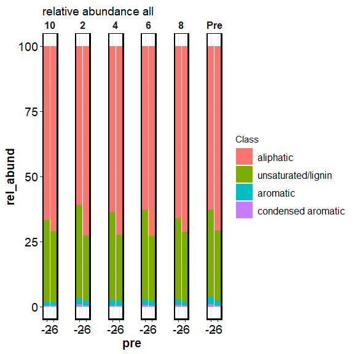<!-- -->

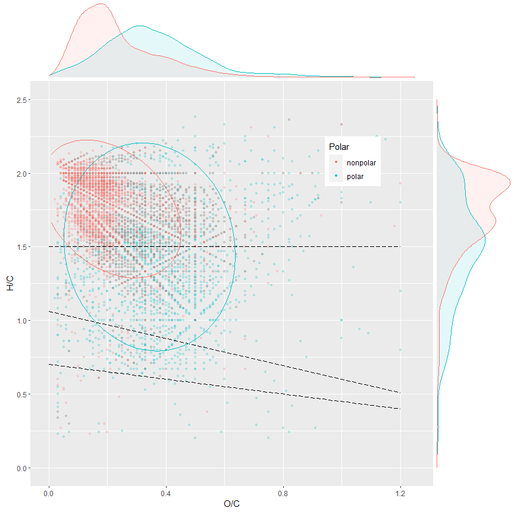<!-- -->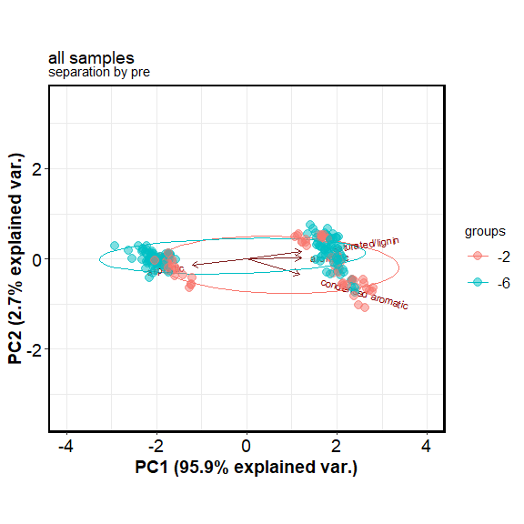<!-- --><!-- -->

### FTICR Common vs unique peaks by treatment:

click to open

#### All

click to open

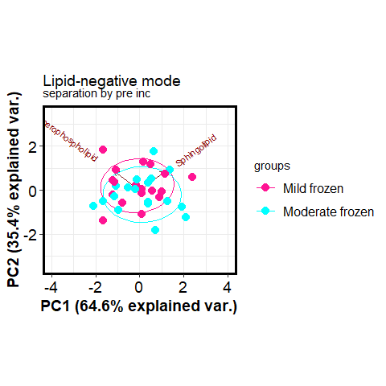<!-- -->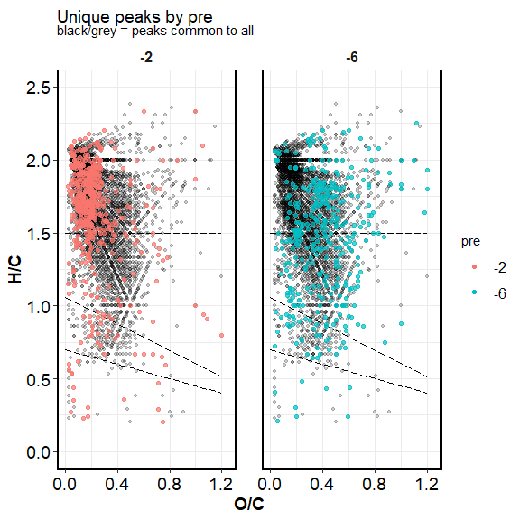<!-- -->

| Class              |  -2 |  -6 |
|:-------------------|----:|----:|
| aliphatic          | 465 | 230 |
| aromatic           |  29 |  33 |
| condensed aromatic |  16 |  12 |
| unsaturated/lignin | 103 | 166 |

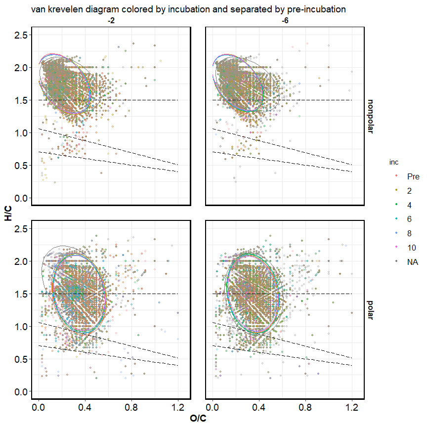<!-- -->

| Class              | Pre |   2 |   4 |   6 |   8 |  10 |
|:-------------------|----:|----:|----:|----:|----:|----:|
| aliphatic          |  55 |  57 |  17 |  10 |  14 |  11 |
| aromatic           |  14 |   2 |   3 |   1 |   2 |  NA |
| condensed aromatic |   2 |   4 |  NA |  NA |   4 |  NA |
| unsaturated/lignin |  39 |  11 |   8 |   4 |  10 |   2 |

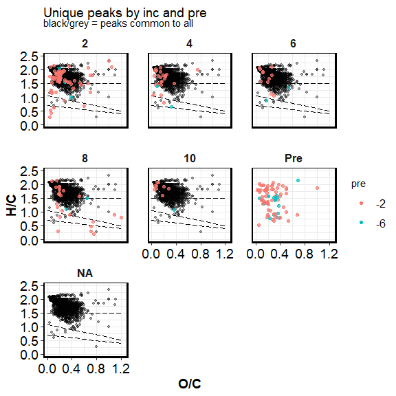<!-- -->

| Class              | -2_Pre | -6_Pre | -2_2 | -6_2 | -2_4 | -6_4 | -2_6 | -6_6 | -2_8 | -6_8 | -2_10 | -6_10 |
|:-------------------|-------:|-------:|-----:|-----:|-----:|-----:|-----:|-----:|-----:|-----:|------:|------:|
| aliphatic          |     38 |     10 |   54 |    3 |   17 |   NA |   10 |   NA |   13 |    1 |    11 |    NA |
| aromatic           |     11 |      3 |    2 |   NA |    1 |    2 |   NA |    1 |    2 |   NA |    NA |    NA |
| condensed aromatic |      2 |     NA |    4 |   NA |   NA |   NA |   NA |   NA |    4 |   NA |    NA |    NA |
| unsaturated/lignin |     25 |      8 |    9 |    2 |    7 |    1 |    3 |    1 |    8 |    2 |    NA |     2 |

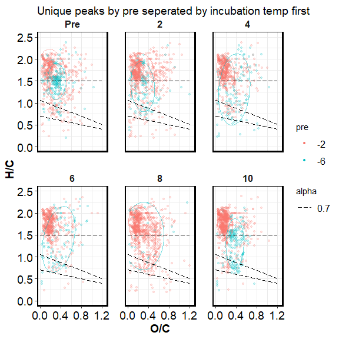<!-- -->
<table>
<caption>
Unique between preincubation temperatures at each incubation temperature
</caption>
<thead>
<tr>
<th style="text-align:left;">
Class
</th>
<th style="text-align:right;">
-2_Pre
</th>
<th style="text-align:right;">
-6_Pre
</th>
<th style="text-align:right;">
-2_2
</th>
<th style="text-align:right;">
-6_2
</th>
<th style="text-align:right;">
-2_4
</th>
<th style="text-align:right;">
-6_4
</th>
<th style="text-align:right;">
-2_6
</th>
<th style="text-align:right;">
-6_6
</th>
<th style="text-align:right;">
-2_8
</th>
<th style="text-align:right;">
-6_8
</th>
<th style="text-align:right;">
-2_10
</th>
<th style="text-align:right;">
-6_10
</th>
</tr>
</thead>
<tbody>
<tr>
<td style="text-align:left;">
aliphatic
</td>
<td style="text-align:right;width: 3em; background-color: lightgrey !important;">
338
</td>
<td style="text-align:right;width: 4em; font-style: italic;border-right:1px solid;">
175
</td>
<td style="text-align:right;width: 3em; background-color: lightgrey !important;">
508
</td>
<td style="text-align:right;width: 4em; font-style: italic;border-right:1px solid;">
62
</td>
<td style="text-align:right;width: 3em; background-color: lightgrey !important;">
437
</td>
<td style="text-align:right;width: 4em; font-style: italic;border-right:1px solid;">
66
</td>
<td style="text-align:right;width: 3em; background-color: lightgrey !important;">
446
</td>
<td style="text-align:right;width: 4em; font-style: italic;border-right:1px solid;">
50
</td>
<td style="text-align:right;width: 3em; background-color: lightgrey !important;">
613
</td>
<td style="text-align:right;width: 4em; font-style: italic;border-right:1px solid;">
15
</td>
<td style="text-align:right;width: 3em; background-color: lightgrey !important;">
627
</td>
<td style="text-align:right;width: 4em; font-style: italic;border-right:1px solid;">
101
</td>
</tr>
<tr>
<td style="text-align:left;">
aromatic
</td>
<td style="text-align:right;width: 3em; background-color: lightgrey !important;">
41
</td>
<td style="text-align:right;width: 4em; font-style: italic;border-right:1px solid;">
18
</td>
<td style="text-align:right;width: 3em; background-color: lightgrey !important;">
21
</td>
<td style="text-align:right;width: 4em; font-style: italic;border-right:1px solid;">
19
</td>
<td style="text-align:right;width: 3em; background-color: lightgrey !important;">
29
</td>
<td style="text-align:right;width: 4em; font-style: italic;border-right:1px solid;">
17
</td>
<td style="text-align:right;width: 3em; background-color: lightgrey !important;">
17
</td>
<td style="text-align:right;width: 4em; font-style: italic;border-right:1px solid;">
25
</td>
<td style="text-align:right;width: 3em; background-color: lightgrey !important;">
54
</td>
<td style="text-align:right;width: 4em; font-style: italic;border-right:1px solid;">
4
</td>
<td style="text-align:right;width: 3em; background-color: lightgrey !important;">
28
</td>
<td style="text-align:right;width: 4em; font-style: italic;border-right:1px solid;">
46
</td>
</tr>
<tr>
<td style="text-align:left;">
condensed aromatic
</td>
<td style="text-align:right;width: 3em; background-color: lightgrey !important;">
15
</td>
<td style="text-align:right;width: 4em; font-style: italic;border-right:1px solid;">
2
</td>
<td style="text-align:right;width: 3em; background-color: lightgrey !important;">
29
</td>
<td style="text-align:right;width: 4em; font-style: italic;border-right:1px solid;">
3
</td>
<td style="text-align:right;width: 3em; background-color: lightgrey !important;">
NA
</td>
<td style="text-align:right;width: 4em; font-style: italic;border-right:1px solid;">
19
</td>
<td style="text-align:right;width: 3em; background-color: lightgrey !important;">
10
</td>
<td style="text-align:right;width: 4em; font-style: italic;border-right:1px solid;">
3
</td>
<td style="text-align:right;width: 3em; background-color: lightgrey !important;">
25
</td>
<td style="text-align:right;width: 4em; font-style: italic;border-right:1px solid;">
NA
</td>
<td style="text-align:right;width: 3em; background-color: lightgrey !important;">
9
</td>
<td style="text-align:right;width: 4em; font-style: italic;border-right:1px solid;">
9
</td>
</tr>
<tr>
<td style="text-align:left;">
unsaturated/lignin
</td>
<td style="text-align:right;width: 3em; background-color: lightgrey !important;">
108
</td>
<td style="text-align:right;width: 4em; font-style: italic;border-right:1px solid;">
132
</td>
<td style="text-align:right;width: 3em; background-color: lightgrey !important;">
109
</td>
<td style="text-align:right;width: 4em; font-style: italic;border-right:1px solid;">
81
</td>
<td style="text-align:right;width: 3em; background-color: lightgrey !important;">
92
</td>
<td style="text-align:right;width: 4em; font-style: italic;border-right:1px solid;">
61
</td>
<td style="text-align:right;width: 3em; background-color: lightgrey !important;">
78
</td>
<td style="text-align:right;width: 4em; font-style: italic;border-right:1px solid;">
37
</td>
<td style="text-align:right;width: 3em; background-color: lightgrey !important;">
253
</td>
<td style="text-align:right;width: 4em; font-style: italic;border-right:1px solid;">
15
</td>
<td style="text-align:right;width: 3em; background-color: lightgrey !important;">
90
</td>
<td style="text-align:right;width: 4em; font-style: italic;border-right:1px solid;">
139
</td>
</tr>
</tbody>
</table>

#### Polar

click to open

    ## NULL

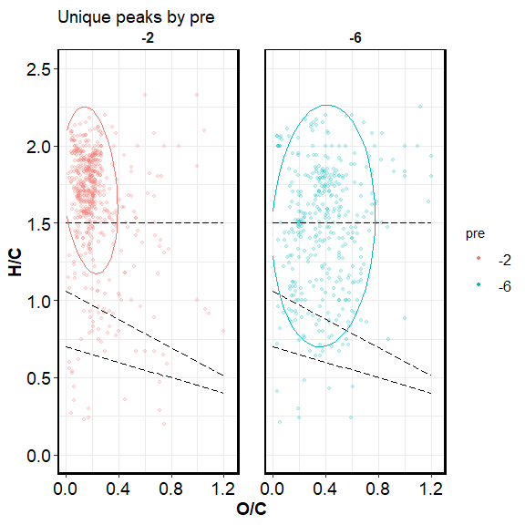<!-- --><!-- -->
<table>
<thead>
<tr>
<th style="text-align:left;">
Class
</th>
<th style="text-align:right;">
-2
</th>
<th style="text-align:right;">
-6
</th>
</tr>
</thead>
<tbody>
<tr>
<td style="text-align:left;">
aliphatic
</td>
<td style="text-align:right;">
183
</td>
<td style="text-align:right;">
152
</td>
</tr>
<tr>
<td style="text-align:left;">
aromatic
</td>
<td style="text-align:right;">
16
</td>
<td style="text-align:right;">
32
</td>
</tr>
<tr>
<td style="text-align:left;">
condensed aromatic
</td>
<td style="text-align:right;">
8
</td>
<td style="text-align:right;">
9
</td>
</tr>
<tr>
<td style="text-align:left;">
unsaturated/lignin
</td>
<td style="text-align:right;">
86
</td>
<td style="text-align:right;">
147
</td>
</tr>
</tbody>
</table>

    ## NULL

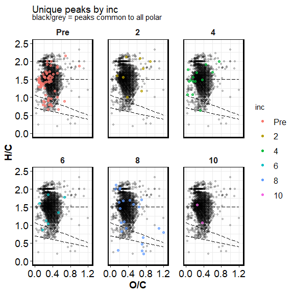<!-- -->
<table>
<thead>
<tr>
<th style="text-align:left;">
Class
</th>
<th style="text-align:right;">
Pre
</th>
<th style="text-align:right;">
2
</th>
<th style="text-align:right;">
4
</th>
<th style="text-align:right;">
6
</th>
<th style="text-align:right;">
8
</th>
<th style="text-align:right;">
10
</th>
</tr>
</thead>
<tbody>
<tr>
<td style="text-align:left;">
aliphatic
</td>
<td style="text-align:right;">
32
</td>
<td style="text-align:right;">
8
</td>
<td style="text-align:right;">
9
</td>
<td style="text-align:right;">
6
</td>
<td style="text-align:right;">
14
</td>
<td style="text-align:right;">
1
</td>
</tr>
<tr>
<td style="text-align:left;">
aromatic
</td>
<td style="text-align:right;">
11
</td>
<td style="text-align:right;">
NA
</td>
<td style="text-align:right;">
2
</td>
<td style="text-align:right;">
1
</td>
<td style="text-align:right;">
3
</td>
<td style="text-align:right;">
NA
</td>
</tr>
<tr>
<td style="text-align:left;">
condensed aromatic
</td>
<td style="text-align:right;">
1
</td>
<td style="text-align:right;">
NA
</td>
<td style="text-align:right;">
NA
</td>
<td style="text-align:right;">
NA
</td>
<td style="text-align:right;">
4
</td>
<td style="text-align:right;">
NA
</td>
</tr>
<tr>
<td style="text-align:left;">
unsaturated/lignin
</td>
<td style="text-align:right;">
33
</td>
<td style="text-align:right;">
3
</td>
<td style="text-align:right;">
9
</td>
<td style="text-align:right;">
4
</td>
<td style="text-align:right;">
8
</td>
<td style="text-align:right;">
2
</td>
</tr>
</tbody>
</table>

    ## NULL

<!-- -->
<table>
<thead>
<tr>
<th style="text-align:left;">
Class
</th>
<th style="text-align:right;">
-2_Pre
</th>
<th style="text-align:right;">
-6_Pre
</th>
<th style="text-align:right;">
-2_2
</th>
<th style="text-align:right;">
-6_2
</th>
<th style="text-align:right;">
-2_4
</th>
<th style="text-align:right;">
-6_4
</th>
<th style="text-align:right;">
-2_6
</th>
<th style="text-align:right;">
-6_6
</th>
<th style="text-align:right;">
-2_8
</th>
<th style="text-align:right;">
-6_8
</th>
<th style="text-align:right;">
-6_10
</th>
</tr>
</thead>
<tbody>
<tr>
<td style="text-align:left;">
aliphatic
</td>
<td style="text-align:right;">
15
</td>
<td style="text-align:right;">
13
</td>
<td style="text-align:right;">
3
</td>
<td style="text-align:right;">
5
</td>
<td style="text-align:right;">
9
</td>
<td style="text-align:right;">
NA
</td>
<td style="text-align:right;">
4
</td>
<td style="text-align:right;">
2
</td>
<td style="text-align:right;">
13
</td>
<td style="text-align:right;">
1
</td>
<td style="text-align:right;">
1
</td>
</tr>
<tr>
<td style="text-align:left;">
aromatic
</td>
<td style="text-align:right;">
8
</td>
<td style="text-align:right;">
3
</td>
<td style="text-align:right;">
NA
</td>
<td style="text-align:right;">
NA
</td>
<td style="text-align:right;">
NA
</td>
<td style="text-align:right;">
2
</td>
<td style="text-align:right;">
NA
</td>
<td style="text-align:right;">
1
</td>
<td style="text-align:right;">
3
</td>
<td style="text-align:right;">
NA
</td>
<td style="text-align:right;">
NA
</td>
</tr>
<tr>
<td style="text-align:left;">
condensed aromatic
</td>
<td style="text-align:right;">
1
</td>
<td style="text-align:right;">
NA
</td>
<td style="text-align:right;">
NA
</td>
<td style="text-align:right;">
NA
</td>
<td style="text-align:right;">
NA
</td>
<td style="text-align:right;">
NA
</td>
<td style="text-align:right;">
NA
</td>
<td style="text-align:right;">
NA
</td>
<td style="text-align:right;">
4
</td>
<td style="text-align:right;">
NA
</td>
<td style="text-align:right;">
NA
</td>
</tr>
<tr>
<td style="text-align:left;">
unsaturated/lignin
</td>
<td style="text-align:right;">
17
</td>
<td style="text-align:right;">
10
</td>
<td style="text-align:right;">
1
</td>
<td style="text-align:right;">
2
</td>
<td style="text-align:right;">
9
</td>
<td style="text-align:right;">
NA
</td>
<td style="text-align:right;">
3
</td>
<td style="text-align:right;">
1
</td>
<td style="text-align:right;">
6
</td>
<td style="text-align:right;">
2
</td>
<td style="text-align:right;">
2
</td>
</tr>
</tbody>
</table>

    ## NULL

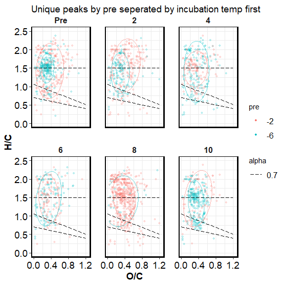<!-- -->
<table>
<caption>
Unique between preincubation temperatures at each incubation temperature
polar
</caption>
<thead>
<tr>
<th style="text-align:left;">
Class
</th>
<th style="text-align:right;">
-2_Pre
</th>
<th style="text-align:right;">
-6_Pre
</th>
<th style="text-align:right;">
-2_2
</th>
<th style="text-align:right;">
-6_2
</th>
<th style="text-align:right;">
-2_4
</th>
<th style="text-align:right;">
-6_4
</th>
<th style="text-align:right;">
-2_6
</th>
<th style="text-align:right;">
-6_6
</th>
<th style="text-align:right;">
-2_8
</th>
<th style="text-align:right;">
-6_8
</th>
<th style="text-align:right;">
-2_10
</th>
<th style="text-align:right;">
-6_10
</th>
</tr>
</thead>
<tbody>
<tr>
<td style="text-align:left;">
aliphatic
</td>
<td style="text-align:right;width: 3em; background-color: lightgrey !important;">
121
</td>
<td style="text-align:right;width: 4em; font-style: italic;border-right:1px solid;">
206
</td>
<td style="text-align:right;width: 3em; background-color: lightgrey !important;">
151
</td>
<td style="text-align:right;width: 4em; font-style: italic;border-right:1px solid;">
74
</td>
<td style="text-align:right;width: 3em; background-color: lightgrey !important;">
97
</td>
<td style="text-align:right;width: 4em; font-style: italic;border-right:1px solid;">
99
</td>
<td style="text-align:right;width: 3em; background-color: lightgrey !important;">
81
</td>
<td style="text-align:right;width: 4em; font-style: italic;border-right:1px solid;">
78
</td>
<td style="text-align:right;width: 3em; background-color: lightgrey !important;">
383
</td>
<td style="text-align:right;width: 4em; font-style: italic;border-right:1px solid;">
16
</td>
<td style="text-align:right;width: 3em; background-color: lightgrey !important;">
62
</td>
<td style="text-align:right;width: 4em; font-style: italic;border-right:1px solid;">
177
</td>
</tr>
<tr>
<td style="text-align:left;">
aromatic
</td>
<td style="text-align:right;width: 3em; background-color: lightgrey !important;">
33
</td>
<td style="text-align:right;width: 4em; font-style: italic;border-right:1px solid;">
19
</td>
<td style="text-align:right;width: 3em; background-color: lightgrey !important;">
11
</td>
<td style="text-align:right;width: 4em; font-style: italic;border-right:1px solid;">
20
</td>
<td style="text-align:right;width: 3em; background-color: lightgrey !important;">
17
</td>
<td style="text-align:right;width: 4em; font-style: italic;border-right:1px solid;">
17
</td>
<td style="text-align:right;width: 3em; background-color: lightgrey !important;">
10
</td>
<td style="text-align:right;width: 4em; font-style: italic;border-right:1px solid;">
27
</td>
<td style="text-align:right;width: 3em; background-color: lightgrey !important;">
47
</td>
<td style="text-align:right;width: 4em; font-style: italic;border-right:1px solid;">
4
</td>
<td style="text-align:right;width: 3em; background-color: lightgrey !important;">
12
</td>
<td style="text-align:right;width: 4em; font-style: italic;border-right:1px solid;">
51
</td>
</tr>
<tr>
<td style="text-align:left;">
condensed aromatic
</td>
<td style="text-align:right;width: 3em; background-color: lightgrey !important;">
13
</td>
<td style="text-align:right;width: 4em; font-style: italic;border-right:1px solid;">
4
</td>
<td style="text-align:right;width: 3em; background-color: lightgrey !important;">
20
</td>
<td style="text-align:right;width: 4em; font-style: italic;border-right:1px solid;">
3
</td>
<td style="text-align:right;width: 3em; background-color: lightgrey !important;">
NA
</td>
<td style="text-align:right;width: 4em; font-style: italic;border-right:1px solid;">
19
</td>
<td style="text-align:right;width: 3em; background-color: lightgrey !important;">
7
</td>
<td style="text-align:right;width: 4em; font-style: italic;border-right:1px solid;">
3
</td>
<td style="text-align:right;width: 3em; background-color: lightgrey !important;">
24
</td>
<td style="text-align:right;width: 4em; font-style: italic;border-right:1px solid;">
NA
</td>
<td style="text-align:right;width: 3em; background-color: lightgrey !important;">
4
</td>
<td style="text-align:right;width: 4em; font-style: italic;border-right:1px solid;">
10
</td>
</tr>
<tr>
<td style="text-align:left;">
unsaturated/lignin
</td>
<td style="text-align:right;width: 3em; background-color: lightgrey !important;">
87
</td>
<td style="text-align:right;width: 4em; font-style: italic;border-right:1px solid;">
144
</td>
<td style="text-align:right;width: 3em; background-color: lightgrey !important;">
62
</td>
<td style="text-align:right;width: 4em; font-style: italic;border-right:1px solid;">
91
</td>
<td style="text-align:right;width: 3em; background-color: lightgrey !important;">
67
</td>
<td style="text-align:right;width: 4em; font-style: italic;border-right:1px solid;">
63
</td>
<td style="text-align:right;width: 3em; background-color: lightgrey !important;">
50
</td>
<td style="text-align:right;width: 4em; font-style: italic;border-right:1px solid;">
38
</td>
<td style="text-align:right;width: 3em; background-color: lightgrey !important;">
226
</td>
<td style="text-align:right;width: 4em; font-style: italic;border-right:1px solid;">
15
</td>
<td style="text-align:right;width: 3em; background-color: lightgrey !important;">
41
</td>
<td style="text-align:right;width: 4em; font-style: italic;border-right:1px solid;">
157
</td>
</tr>
</tbody>
</table>

#### Non-Polar

click to open

    ## NULL

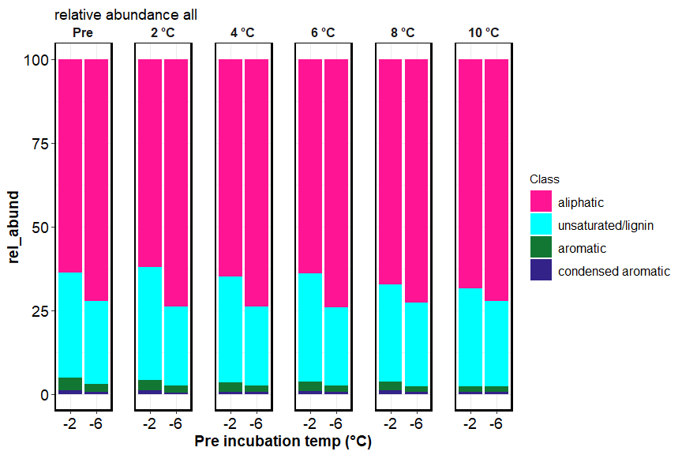<!-- -->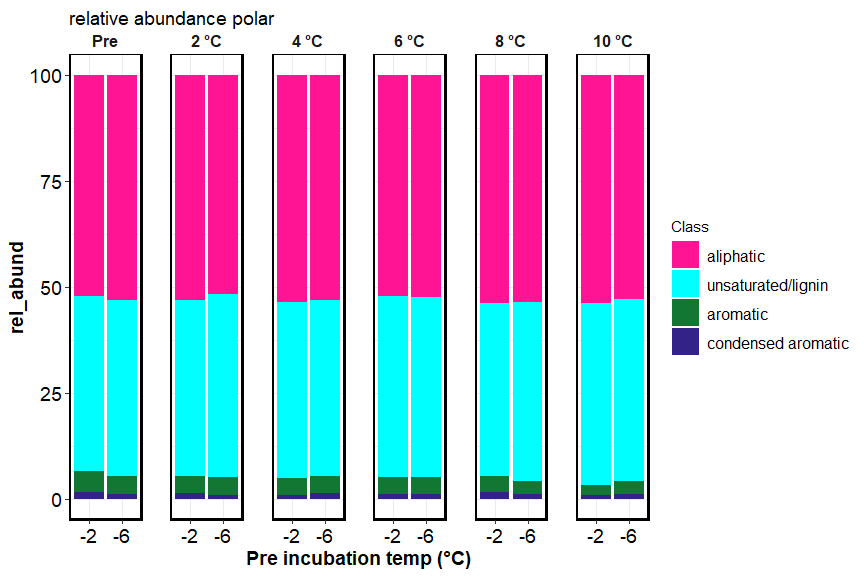<!-- -->
<table>
<thead>
<tr>
<th style="text-align:left;">
Class
</th>
<th style="text-align:right;">
-2
</th>
<th style="text-align:right;">
-6
</th>
</tr>
</thead>
<tbody>
<tr>
<td style="text-align:left;">
aliphatic
</td>
<td style="text-align:right;">
439
</td>
<td style="text-align:right;">
248
</td>
</tr>
<tr>
<td style="text-align:left;">
aromatic
</td>
<td style="text-align:right;">
27
</td>
<td style="text-align:right;">
5
</td>
</tr>
<tr>
<td style="text-align:left;">
condensed aromatic
</td>
<td style="text-align:right;">
18
</td>
<td style="text-align:right;">
4
</td>
</tr>
<tr>
<td style="text-align:left;">
unsaturated/lignin
</td>
<td style="text-align:right;">
118
</td>
<td style="text-align:right;">
76
</td>
</tr>
</tbody>
</table>

    ## NULL

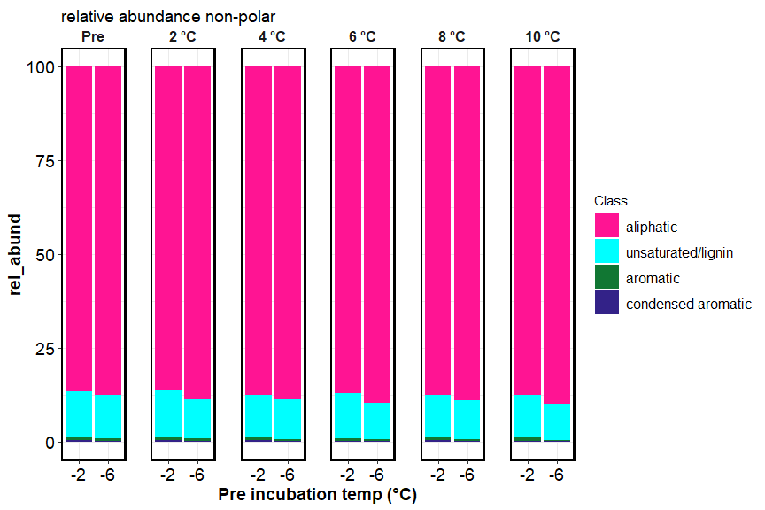<!-- -->
<table>
<thead>
<tr>
<th style="text-align:left;">
Class
</th>
<th style="text-align:right;">
Pre
</th>
<th style="text-align:right;">
2
</th>
<th style="text-align:right;">
4
</th>
<th style="text-align:right;">
6
</th>
<th style="text-align:right;">
8
</th>
<th style="text-align:right;">
10
</th>
</tr>
</thead>
<tbody>
<tr>
<td style="text-align:left;">
aliphatic
</td>
<td style="text-align:right;">
31
</td>
<td style="text-align:right;">
61
</td>
<td style="text-align:right;">
15
</td>
<td style="text-align:right;">
10
</td>
<td style="text-align:right;">
12
</td>
<td style="text-align:right;">
11
</td>
</tr>
<tr>
<td style="text-align:left;">
aromatic
</td>
<td style="text-align:right;">
10
</td>
<td style="text-align:right;">
4
</td>
<td style="text-align:right;">
1
</td>
<td style="text-align:right;">
NA
</td>
<td style="text-align:right;">
1
</td>
<td style="text-align:right;">
NA
</td>
</tr>
<tr>
<td style="text-align:left;">
condensed aromatic
</td>
<td style="text-align:right;">
4
</td>
<td style="text-align:right;">
6
</td>
<td style="text-align:right;">
NA
</td>
<td style="text-align:right;">
NA
</td>
<td style="text-align:right;">
NA
</td>
<td style="text-align:right;">
NA
</td>
</tr>
<tr>
<td style="text-align:left;">
unsaturated/lignin
</td>
<td style="text-align:right;">
24
</td>
<td style="text-align:right;">
29
</td>
<td style="text-align:right;">
5
</td>
<td style="text-align:right;">
2
</td>
<td style="text-align:right;">
3
</td>
<td style="text-align:right;">
3
</td>
</tr>
</tbody>
</table>

    ## NULL

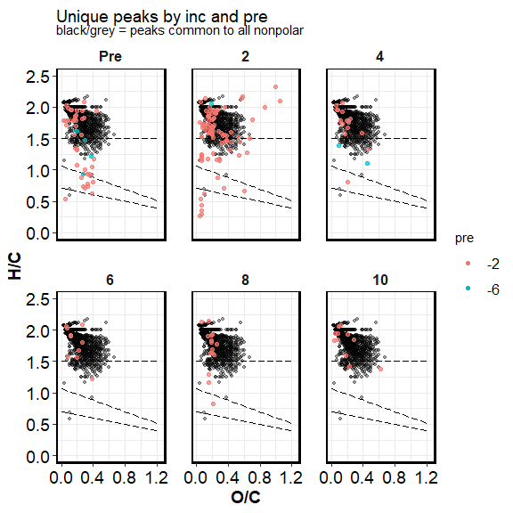<!-- -->
<table>
<thead>
<tr>
<th style="text-align:left;">
Class
</th>
<th style="text-align:right;">
-2_Pre
</th>
<th style="text-align:right;">
-6_Pre
</th>
<th style="text-align:right;">
-2_2
</th>
<th style="text-align:right;">
-6_2
</th>
<th style="text-align:right;">
-2_4
</th>
<th style="text-align:right;">
-6_4
</th>
<th style="text-align:right;">
-2_6
</th>
<th style="text-align:right;">
-2_8
</th>
<th style="text-align:right;">
-2_10
</th>
</tr>
</thead>
<tbody>
<tr>
<td style="text-align:left;">
aliphatic
</td>
<td style="text-align:right;">
26
</td>
<td style="text-align:right;">
2
</td>
<td style="text-align:right;">
60
</td>
<td style="text-align:right;">
1
</td>
<td style="text-align:right;">
15
</td>
<td style="text-align:right;">
NA
</td>
<td style="text-align:right;">
10
</td>
<td style="text-align:right;">
12
</td>
<td style="text-align:right;">
11
</td>
</tr>
<tr>
<td style="text-align:left;">
aromatic
</td>
<td style="text-align:right;">
8
</td>
<td style="text-align:right;">
2
</td>
<td style="text-align:right;">
4
</td>
<td style="text-align:right;">
NA
</td>
<td style="text-align:right;">
1
</td>
<td style="text-align:right;">
NA
</td>
<td style="text-align:right;">
NA
</td>
<td style="text-align:right;">
1
</td>
<td style="text-align:right;">
NA
</td>
</tr>
<tr>
<td style="text-align:left;">
condensed aromatic
</td>
<td style="text-align:right;">
4
</td>
<td style="text-align:right;">
NA
</td>
<td style="text-align:right;">
6
</td>
<td style="text-align:right;">
NA
</td>
<td style="text-align:right;">
NA
</td>
<td style="text-align:right;">
NA
</td>
<td style="text-align:right;">
NA
</td>
<td style="text-align:right;">
NA
</td>
<td style="text-align:right;">
NA
</td>
</tr>
<tr>
<td style="text-align:left;">
unsaturated/lignin
</td>
<td style="text-align:right;">
15
</td>
<td style="text-align:right;">
3
</td>
<td style="text-align:right;">
29
</td>
<td style="text-align:right;">
NA
</td>
<td style="text-align:right;">
2
</td>
<td style="text-align:right;">
3
</td>
<td style="text-align:right;">
2
</td>
<td style="text-align:right;">
3
</td>
<td style="text-align:right;">
3
</td>
</tr>
</tbody>
</table>

    ## NULL

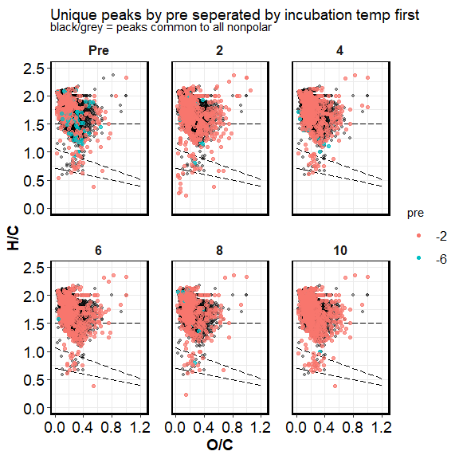<!-- -->
<table>
<caption>
Unique between preincubation temperatures at each incubation temperature
nonpolar
</caption>
<thead>
<tr>
<th style="text-align:left;">
Class
</th>
<th style="text-align:right;">
-2_Pre
</th>
<th style="text-align:right;">
-6_Pre
</th>
<th style="text-align:right;">
-2_2
</th>
<th style="text-align:right;">
-6_2
</th>
<th style="text-align:right;">
-2_4
</th>
<th style="text-align:right;">
-6_4
</th>
<th style="text-align:right;">
-2_6
</th>
<th style="text-align:right;">
-6_6
</th>
<th style="text-align:right;">
-2_8
</th>
<th style="text-align:right;">
-6_8
</th>
<th style="text-align:right;">
-2_10
</th>
<th style="text-align:right;">
-6_10
</th>
</tr>
</thead>
<tbody>
<tr>
<td style="text-align:left;">
aliphatic
</td>
<td style="text-align:right;width: 3em; background-color: lightgrey !important;">
311
</td>
<td style="text-align:right;width: 4em; font-style: italic;border-right:1px solid;">
43
</td>
<td style="text-align:right;width: 3em; background-color: lightgrey !important;">
531
</td>
<td style="text-align:right;width: 4em; font-style: italic;border-right:1px solid;">
16
</td>
<td style="text-align:right;width: 3em; background-color: lightgrey !important;">
518
</td>
<td style="text-align:right;width: 4em; font-style: italic;border-right:1px solid;">
15
</td>
<td style="text-align:right;width: 3em; background-color: lightgrey !important;">
526
</td>
<td style="text-align:right;width: 4em; font-style: italic;border-right:1px solid;">
3
</td>
<td style="text-align:right;width: 3em; background-color: lightgrey !important;">
480
</td>
<td style="text-align:right;width: 4em; font-style: italic;border-right:1px solid;">
10
</td>
<td style="text-align:right;width: 3em; background-color: lightgrey !important;">
750
</td>
<td style="text-align:right;width: 4em; font-style: italic;border-right:1px solid;">
3
</td>
</tr>
<tr>
<td style="text-align:left;">
aromatic
</td>
<td style="text-align:right;width: 3em; background-color: lightgrey !important;">
17
</td>
<td style="text-align:right;width: 4em; font-style: italic;border-right:1px solid;">
2
</td>
<td style="text-align:right;width: 3em; background-color: lightgrey !important;">
16
</td>
<td style="text-align:right;width: 4em; font-style: italic;border-right:1px solid;">
1
</td>
<td style="text-align:right;width: 3em; background-color: lightgrey !important;">
17
</td>
<td style="text-align:right;width: 4em; font-style: italic;border-right:1px solid;">
NA
</td>
<td style="text-align:right;width: 3em; background-color: lightgrey !important;">
12
</td>
<td style="text-align:right;width: 4em; font-style: italic;border-right:1px solid;">
NA
</td>
<td style="text-align:right;width: 3em; background-color: lightgrey !important;">
14
</td>
<td style="text-align:right;width: 4em; font-style: italic;border-right:1px solid;">
1
</td>
<td style="text-align:right;width: 3em; background-color: lightgrey !important;">
28
</td>
<td style="text-align:right;width: 4em; font-style: italic;border-right:1px solid;">
NA
</td>
</tr>
<tr>
<td style="text-align:left;">
condensed aromatic
</td>
<td style="text-align:right;width: 3em; background-color: lightgrey !important;">
7
</td>
<td style="text-align:right;width: 4em; font-style: italic;border-right:1px solid;">
NA
</td>
<td style="text-align:right;width: 3em; background-color: lightgrey !important;">
12
</td>
<td style="text-align:right;width: 4em; font-style: italic;border-right:1px solid;">
NA
</td>
<td style="text-align:right;width: 3em; background-color: lightgrey !important;">
3
</td>
<td style="text-align:right;width: 4em; font-style: italic;border-right:1px solid;">
NA
</td>
<td style="text-align:right;width: 3em; background-color: lightgrey !important;">
4
</td>
<td style="text-align:right;width: 4em; font-style: italic;border-right:1px solid;">
NA
</td>
<td style="text-align:right;width: 3em; background-color: lightgrey !important;">
5
</td>
<td style="text-align:right;width: 4em; font-style: italic;border-right:1px solid;">
NA
</td>
<td style="text-align:right;width: 3em; background-color: lightgrey !important;">
6
</td>
<td style="text-align:right;width: 4em; font-style: italic;border-right:1px solid;">
NA
</td>
</tr>
<tr>
<td style="text-align:left;">
unsaturated/lignin
</td>
<td style="text-align:right;width: 3em; background-color: lightgrey !important;">
76
</td>
<td style="text-align:right;width: 4em; font-style: italic;border-right:1px solid;">
36
</td>
<td style="text-align:right;width: 3em; background-color: lightgrey !important;">
175
</td>
<td style="text-align:right;width: 4em; font-style: italic;border-right:1px solid;">
6
</td>
<td style="text-align:right;width: 3em; background-color: lightgrey !important;">
124
</td>
<td style="text-align:right;width: 4em; font-style: italic;border-right:1px solid;">
11
</td>
<td style="text-align:right;width: 3em; background-color: lightgrey !important;">
172
</td>
<td style="text-align:right;width: 4em; font-style: italic;border-right:1px solid;">
NA
</td>
<td style="text-align:right;width: 3em; background-color: lightgrey !important;">
111
</td>
<td style="text-align:right;width: 4em; font-style: italic;border-right:1px solid;">
3
</td>
<td style="text-align:right;width: 3em; background-color: lightgrey !important;">
193
</td>
<td style="text-align:right;width: 4em; font-style: italic;border-right:1px solid;">
2
</td>
</tr>
</tbody>
</table>

### FTICR Permanova results and PCAs:

click to open

#### Relative Abundance

click to open

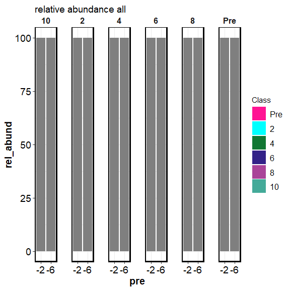<!-- -->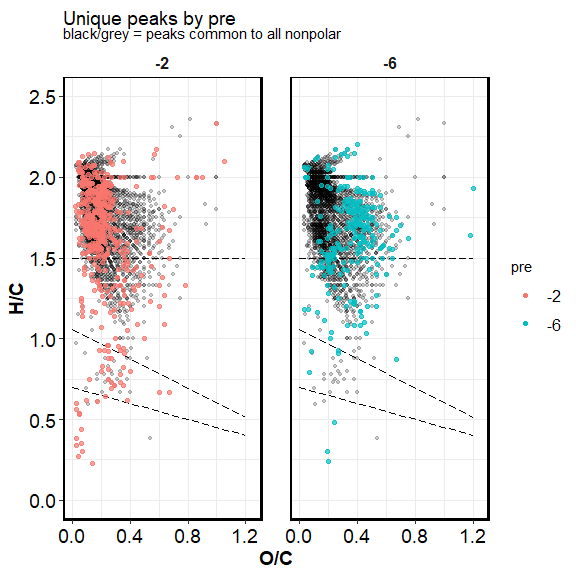<!-- -->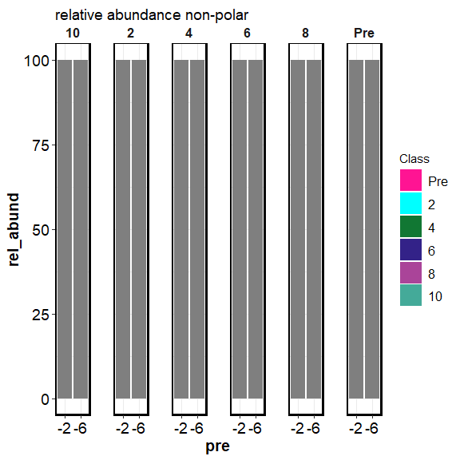<!-- -->

#### PCA results:

click to open

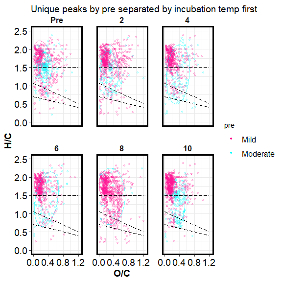<!-- --><!-- -->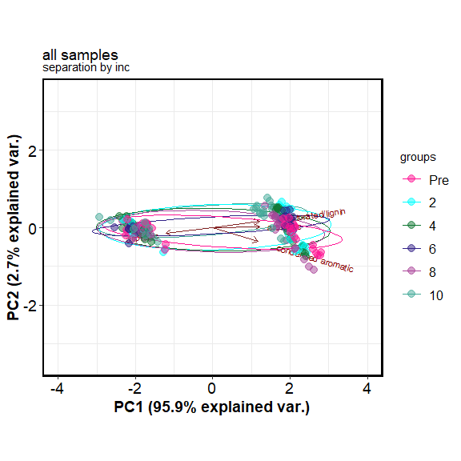<!-- -->

|               |  Df |  SumOfSqs |        R2 |            F | Pr(\>F) |
|:--------------|----:|----------:|----------:|-------------:|--------:|
| pre           |   1 | 0.2906302 | 0.0458303 |  1855.267633 |   0.001 |
| inc           |   5 | 0.0082554 | 0.0013018 |    10.539849 |   0.001 |
| Polar         |   1 | 5.9987677 | 0.9459622 | 38293.743275 |   0.001 |
| pre:inc       |   5 | 0.0014842 | 0.0002340 |     1.894917 |   0.092 |
| pre:Polar     |   1 | 0.0050891 | 0.0008025 |    32.486577 |   0.001 |
| inc:Polar     |   5 | 0.0054008 | 0.0008517 |     6.895341 |   0.001 |
| pre:inc:Polar |   5 | 0.0018979 | 0.0002993 |     2.423070 |   0.038 |
| Residual      | 191 | 0.0299204 | 0.0047182 |           NA |      NA |
| Total         | 214 | 6.3414458 | 1.0000000 |           NA |      NA |

Permanova results: Axis Class with Polar comparison

|          |  Df |  SumOfSqs |        R2 |         F | Pr(\>F) |
|:---------|----:|----------:|----------:|----------:|--------:|
| pre      |   1 | 0.2906302 | 0.0458303 | 9.8161099 |   0.001 |
| inc      |   5 | 0.0082554 | 0.0013018 | 0.0557657 |   0.995 |
| pre:inc  |   5 | 0.0322426 | 0.0050844 | 0.2178001 |   0.954 |
| Residual | 203 | 6.0103176 | 0.9477835 |        NA |      NA |
| Total    | 214 | 6.3414458 | 1.0000000 |        NA |      NA |

Permanova results: axis class all

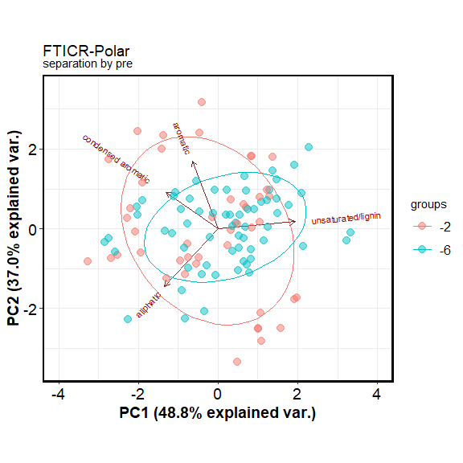<!-- -->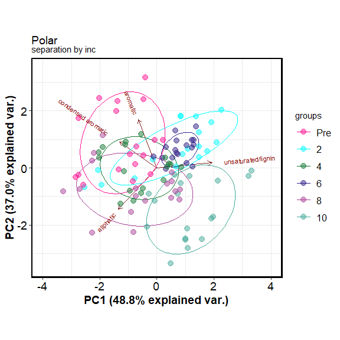<!-- -->

|          |  Df |  SumOfSqs |        R2 |         F | Pr(\>F) |
|:---------|----:|----------:|----------:|----------:|--------:|
| pre      |   1 | 0.0001709 | 0.0163378 |  4.023551 |   0.029 |
| inc      |   5 | 0.0046123 | 0.4408260 | 21.712725 |   0.001 |
| pre:inc  |   5 | 0.0016011 | 0.1530252 |  7.537202 |   0.001 |
| Residual |  96 | 0.0040785 | 0.3898110 |        NA |      NA |
| Total    | 107 | 0.0104629 | 1.0000000 |        NA |      NA |

Permanova results: Axis class Polar only

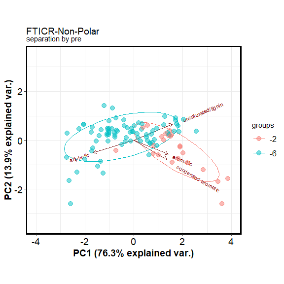<!-- -->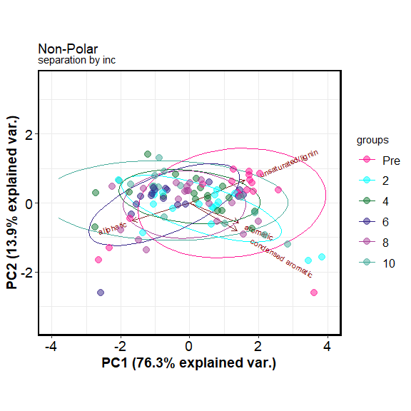<!-- -->

|          |  Df |  SumOfSqs |        R2 |          F | Pr(\>F) |
|:---------|----:|----------:|----------:|-----------:|--------:|
| pre      |   1 | 0.0066753 | 0.1654780 | 24.5398933 |   0.001 |
| inc      |   5 | 0.0066012 | 0.1636400 |  4.8534640 |   0.002 |
| pre:inc  |   5 | 0.0012213 | 0.0302756 |  0.8979562 |   0.485 |
| Residual |  95 | 0.0258419 | 0.6406064 |         NA |      NA |
| Total    | 106 | 0.0403397 | 1.0000000 |         NA |      NA |

Permanova results: Axis class Non-Polar only

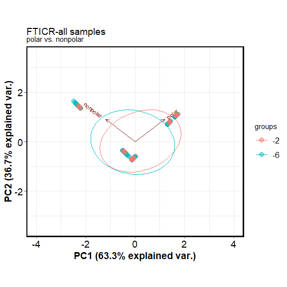<!-- -->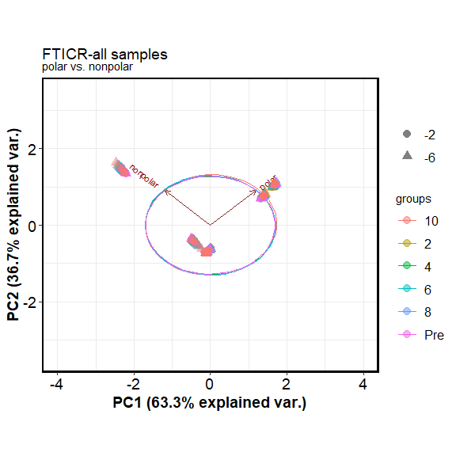<!-- -->

|          |  Df |    SumOfSqs |        R2 |          F | Pr(\>F) |
|:---------|----:|------------:|----------:|-----------:|--------:|
| pre      |   1 |   4.1848733 | 0.0128184 | 11.0350449 |   0.001 |
| inc      |   5 |   0.3147067 | 0.0009640 |  0.1659693 |   1.000 |
| pre:inc  |   5 |   0.7615321 | 0.0023326 |  0.4016150 |   0.995 |
| Residual | 847 | 321.2118936 | 0.9838850 |         NA |      NA |
| Total    | 858 | 326.4730056 | 1.0000000 |         NA |      NA |

Permanova results: Axis Polar

------------------------------------------------------------------------

## Session Info

Session Info

Date run: 2023-05-11

    ## R version 4.2.3 (2023-03-15 ucrt)
    ## Platform: x86_64-w64-mingw32/x64 (64-bit)
    ## Running under: Windows 10 x64 (build 19045)
    ## 
    ## Matrix products: default
    ## 
    ## locale:
    ## [1] LC_COLLATE=English_United States.utf8 
    ## [2] LC_CTYPE=English_United States.utf8   
    ## [3] LC_MONETARY=English_United States.utf8
    ## [4] LC_NUMERIC=C                          
    ## [5] LC_TIME=English_United States.utf8    
    ## 
    ## attached base packages:
    ## [1] grid      stats     graphics  grDevices utils     datasets  methods  
    ## [8] base     
    ## 
    ## other attached packages:
    ##  [1] pmartR_2.3.0      agricolae_1.3-5   knitr_1.42        nlme_3.1-162     
    ##  [5] cowplot_1.1.1     ggpubr_0.6.0      janitor_2.2.0     pracma_2.4.2     
    ##  [9] reshape2_1.4.4    ggbiplot_0.55     scales_1.2.1.9000 plyr_1.8.8       
    ## [13] vegan_2.6-4       lattice_0.20-45   permute_0.9-7     lubridate_1.9.2  
    ## [17] forcats_1.0.0     stringr_1.5.0     dplyr_1.1.1       purrr_1.0.1      
    ## [21] readr_2.1.4       tidyr_1.3.0       tibble_3.2.1      ggplot2_3.4.1    
    ## [25] tidyverse_2.0.0   tarchetypes_0.7.6 targets_0.14.3   
    ## 
    ## loaded via a namespace (and not attached):
    ##  [1] fs_1.6.2           future.callr_0.8.1 tools_4.2.3        backports_1.4.1   
    ##  [5] utf8_1.2.3         R6_2.5.1           AlgDesign_1.2.1    mgcv_1.8-42       
    ##  [9] questionr_0.7.8    colorspace_2.1-0   withr_2.5.0        tidyselect_1.2.0  
    ## [13] processx_3.8.0     klaR_1.7-2         compiler_4.2.3     cli_3.6.0         
    ## [17] labeling_0.4.2     callr_3.7.3        digest_0.6.31      rmarkdown_2.21    
    ## [21] pkgconfig_2.0.3    htmltools_0.5.4    parallelly_1.35.0  labelled_2.11.0   
    ## [25] highr_0.10         fastmap_1.1.1      rlang_1.1.0        rstudioapi_0.14   
    ## [29] shiny_1.7.4        farver_2.1.1       generics_0.1.3     combinat_0.0-8    
    ## [33] car_3.1-2          magrittr_2.0.3     Matrix_1.5-4       Rcpp_1.0.10       
    ## [37] munsell_0.5.0      fansi_1.0.4        abind_1.4-5        lifecycle_1.0.3   
    ## [41] furrr_0.3.1        stringi_1.7.12     yaml_2.3.7         snakecase_0.11.0  
    ## [45] carData_3.0-5      MASS_7.3-60        promises_1.2.0.1   parallel_4.2.3    
    ## [49] listenv_0.9.0      miniUI_0.1.1.1     haven_2.5.2        splines_4.2.3     
    ## [53] hms_1.1.3          ps_1.7.2           pillar_1.9.0       igraph_1.4.1      
    ## [57] ggsignif_0.6.4     base64url_1.4      codetools_0.2-19   glue_1.6.2        
    ## [61] evaluate_0.21      data.table_1.14.8  foreach_1.5.2      httpuv_1.6.9      
    ## [65] vctrs_0.6.0        tzdb_0.3.0         gtable_0.3.3       future_1.32.0     
    ## [69] ggExtra_0.10.0     xfun_0.38          mime_0.12          xtable_1.8-4      
    ## [73] broom_1.0.4        later_1.3.0        rstatix_0.7.2      iterators_1.0.14  
    ## [77] cluster_2.1.4      timechange_0.2.0   globals_0.16.2     ellipsis_0.3.2

