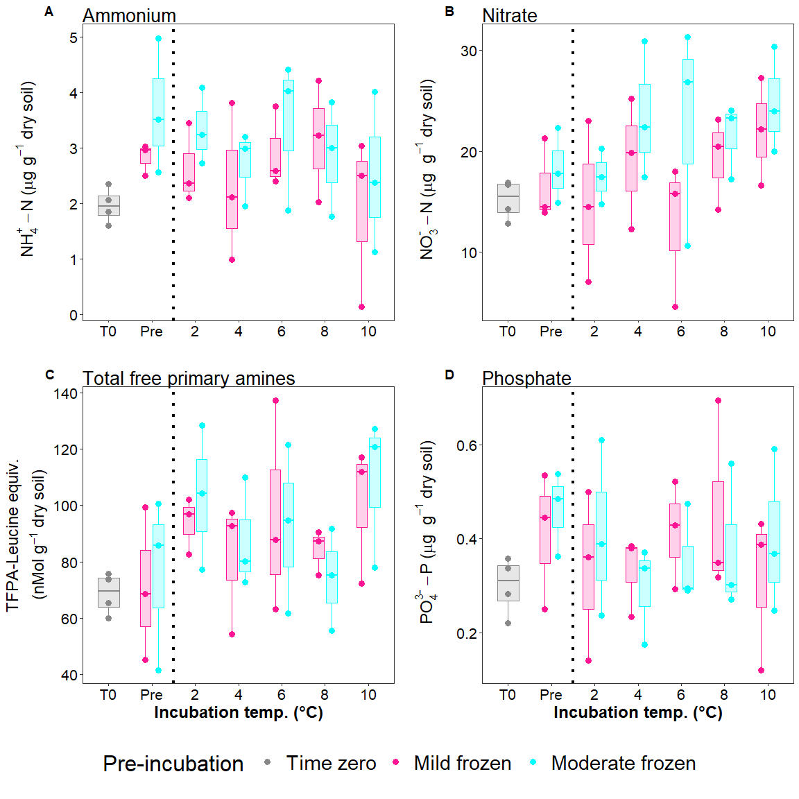
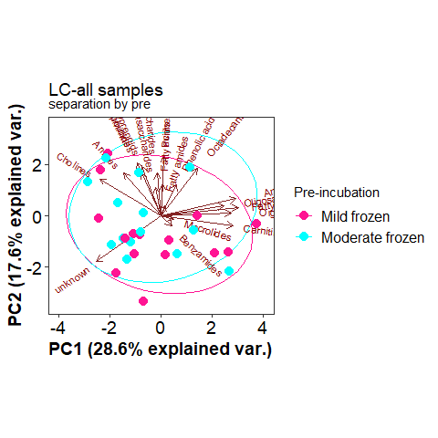
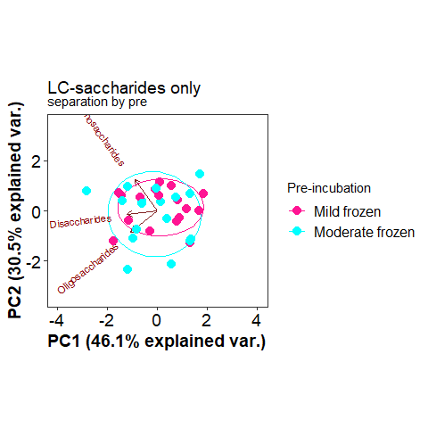
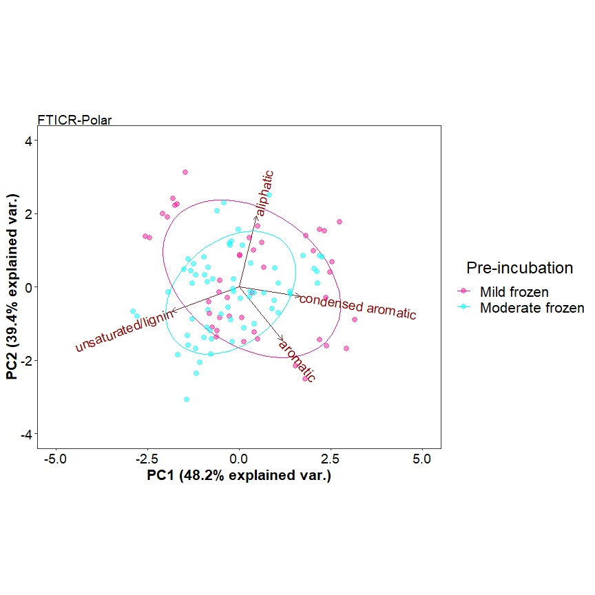

SCGSR final report
================
2023-05-03

## Sample Summary

click to open

Soils from northwest Alaska were homogenized and pre-incubated at -2 and
-6 degrees Celsius for three months after which they were incubated at
2,4,6,8,10 degrees Celsius for one week. After the week long incubation
soils were extracted using 0.5M K2SO4, and chloroform extracted to
measure microbial biomass and nutrient concentrations. Sub-samples were
also sent to PNNL for MPLEx (Methanol chloroform extraction) to provide
more comprehensive analysis of the molecular composition of organic
matter using FT-ICR, NMR, GC-MS and LC-MS techniques. Lipidomics were
also performed to ascertain if there were any significant shifts in
microbial biomass.

------------------------------------------------------------------------

## Respiration Results

click to open

Respiration measurements were taken daily during the incubation using a
Li-850 bench top respiration unit. Below are the respiration rates for
each sample, as well as the calculates total C respired. Respiration
varied significantly by incubation day, incubation temperature (LME, p
\< 0.001), and pre-incubation temperature (LME, p = 0. 0137). Asterisks
signify significant variation in ANOVA analysis (p\<0.05).

<!-- -->

------------------------------------------------------------------------

## Soil Nutrients

click to open

Soil K2SO4 extracts were utilized to measure ammonium, Nitrate, Total
free primary amines, phosphate, Total reducing sugars. Below are the
concentration data. An asterisks indicates a significant (p\<= 0.05,
ANOVA) difference in pre-incubation temperature. Overall ANOVA showed
that TRS changed significantly due to pre-incubation, incubation
temperature, and the interaction (ANOVA, p \< 0.001). Pre-incubated
moderate freeze soil TRS concentrations remained similar to
non-incubated soils which had significantly higher concentrations than
pre-incubated mild freeze soils (ANOVA, f = 18.18, p \< 0.013). Though
there was a trend for pre-incubated and incubated soils to have
increased concentrations of all N forms (Ammonium, Nitrate, and TFPA)
when compared to non-incubated soils, the pre-incubation temperatures
showed no significant differences after the incubation (ANOVA, p\>
0.0696405). Pre-incubation and incubation temperatures had little to no
effect on phosphate concentrations in incubated soils (ANOVA, p \> 0.49)

<!-- -->
<!-- -->

------------------------------------------------------------------------

## Microbial Biomass

click to open

Microbial biomass C and N was measures to identify changes in biomass
through the incubation. An asterisks indicates a significant (p\<= 0.05)
difference in pre-incubation temperature.Overall, MBC following the
incubation was significantly greater in soils that experienced the
moderate freeze compared to mild freeze (ANOVA, f = 5.19, p = 0.0138),
whereas incubation temperature and interaction did not affect MBC
significantly (ANOVA, p \> 0.071). For soils that experienced moderate
freeze, post-incubation MBC remained more or less unchanged compared to
T0 (Dunnett, p \> 0.25). On the other hand, soils that experienced mild
freeze had numerically lower MBC compared to T0; however, these values
were highly variable and therefore not significant overall (Dunnett, p
\> 0.25).

<!-- -->

------------------------------------------------------------------------

## GC-MS

click to open

Below is the relative quantification of compounds identified by gas
chromatography within the MPLEx extracts.Little to no variation was
identified that corresponds to the more broad metrics above in the soil
nutrient section.The statistics suggested that incubation temperature
induced significant variation for all compounds and saccharides only
(p\<0.022, PERMANOVA), though separation was not identifiable on the
PCAs. The majority of compounds measured were unidentified.

#### PCA

------------------------------------------------------------------------

## LC-MS

click to open

Below is the relative quantification of compounds identified by liquid
chromatography within the MPLEx extracts.Little to no variation was
identified that corresponds to the more broad metrics above in the soil
nutrient section.The statistics suggested that incubation temperature
induced significant variation for all compounds and saccharides only
(p\<0.005, PERMANOVA), though separation was not identifiable on the
PCAs. The majority of compounds measured were unidentified.

#### PCA

------------------------------------------------------------------------

## Lipids

click to open

Lipid analysis was done via liquid chrometography on MEPLEx extracts.
Some variation was identified between pre-incubation temperatures,
though little was biologically significant. Conclusion that small
changes in biomass were present but not significant. Incubation
temperature induced significant variation for lipids in the negative
mode only (p=0.009, PERMANOVA), though separation was not identifiable
on the PCAs. A big missing piece to this analysis would be community
composition.

------------------------------------------------------------------------

## FT-MS (FT-ICR)

click to open

FTICR was performed on MEPLEx extracts to gain a qualitative
understanding of the changes in organic matter composition after the
incubation. We identified differences in the total number of unique
compounds between mild and moderate freeze soils, before and after the
incubation. Unique compounds between mild and moderate freeze soils are
visualized on van krevelen diagrams corresponding to H/C (hydrogen to
carbon) vs. O/C (oxygen to carbon) content. This could be indicative of
microbial processing of organic matter and production of new organic
compounds. The PCA with both layers showed no separation based on pre
incubation and incubation temperature. When looking at non-polar layer
PCA we see a separation between the mild and moderate freeze driven by
the aromatics, and condensed aromatics in the mild freeze samples. The
pre incubation explains ~17% of the variation while the incubation
explains ~18% of the variation (PERMANOVA, F \> 5.54, p = 0.001).

#### FTICR Van krevelen diagrams:

<!-- -->

<!-- -->

#### Unique peaks at each incubation temperature

    ## NULL

| Class              | -2_Pre | -6_Pre | -2_2 | -6_2 | -2_4 | -6_4 | -2_6 | -6_6 | -2_8 | -6_8 | -2_10 | -6_10 |
|:-------------------|-------:|-------:|-----:|-----:|-----:|-----:|-----:|-----:|-----:|-----:|------:|------:|
| aliphatic          |    313 |    114 |  465 |   49 |  402 |   56 |  408 |   46 |  520 |   14 |   566 |    60 |
| aromatic           |     34 |     13 |   18 |   16 |   21 |   14 |   13 |   18 |   48 |    3 |    21 |    35 |
| condensed aromatic |     15 |      2 |   27 |    3 |   NA |   18 |    9 |    3 |   25 |   NA |     7 |     9 |
| unsaturated/lignin |     85 |     79 |   86 |   54 |   69 |   42 |   57 |   27 |  166 |    9 |    69 |    75 |

Unique between preincubation temperatures at each incubation temperature

#### Relative Abundance of each molecular class

<!-- -->

#### PCA results:

------------------------------------------------------------------------

## Session Info

Session Info

Date run: 2024-05-30

    ## R version 4.3.2 (2023-10-31 ucrt)
    ## Platform: x86_64-w64-mingw32/x64 (64-bit)
    ## Running under: Windows 11 x64 (build 22631)
    ## 
    ## Matrix products: default
    ## 
    ## 
    ## locale:
    ## [1] LC_COLLATE=English_United States.utf8 
    ## [2] LC_CTYPE=English_United States.utf8   
    ## [3] LC_MONETARY=English_United States.utf8
    ## [4] LC_NUMERIC=C                          
    ## [5] LC_TIME=English_United States.utf8    
    ## 
    ## time zone: America/Los_Angeles
    ## tzcode source: internal
    ## 
    ## attached base packages:
    ## [1] grid      stats     graphics  grDevices utils     datasets  methods  
    ## [8] base     
    ## 
    ## other attached packages:
    ##  [1] ropls_1.34.0        trelliscopejs_0.2.6 pmartR_2.4.1       
    ##  [4] agricolae_1.3-7     knitr_1.45          nlme_3.1-163       
    ##  [7] cowplot_1.1.1       ggpubr_0.6.0        janitor_2.2.0      
    ## [10] pracma_2.4.4        reshape2_1.4.4      ggbiplot_0.55      
    ## [13] scales_1.3.0        vegan_2.6-4         lattice_0.21-9     
    ## [16] permute_0.9-7       lubridate_1.9.3     forcats_1.0.0      
    ## [19] stringr_1.5.1       purrr_1.0.2         readr_2.1.4        
    ## [22] tidyr_1.3.0         tibble_3.2.1        ggplot2_3.4.4      
    ## [25] tidyverse_2.0.0     dplyr_1.1.4         plyr_1.8.9         
    ## [28] tarchetypes_0.7.9   targets_1.3.2      
    ## 
    ## loaded via a namespace (and not attached):
    ##   [1] rstudioapi_0.15.0           jsonlite_1.8.8             
    ##   [3] MultiAssayExperiment_1.28.0 magrittr_2.0.3             
    ##   [5] PNWColors_0.1.0             farver_2.1.1               
    ##   [7] rmarkdown_2.25              ragg_1.2.6                 
    ##   [9] fs_1.6.3                    zlibbioc_1.48.0            
    ##  [11] vctrs_0.6.4                 RCurl_1.98-1.14            
    ##  [13] MultiDataSet_1.30.0         base64enc_0.1-3            
    ##  [15] rstatix_0.7.2               webshot_0.5.5              
    ##  [17] polynom_1.4-1               htmltools_0.5.7            
    ##  [19] S4Arrays_1.2.0              progress_1.2.2             
    ##  [21] broom_1.0.5                 cellranger_1.1.0           
    ##  [23] SparseArray_1.2.3           htmlwidgets_1.6.4          
    ##  [25] plotly_4.10.3               rootSolve_1.8.2.4          
    ##  [27] qqman_0.1.9                 igraph_1.5.1               
    ##  [29] mime_0.12                   lifecycle_1.0.4            
    ##  [31] iterators_1.0.14            pkgconfig_2.0.3            
    ##  [33] Matrix_1.6-1.1              R6_2.5.1                   
    ##  [35] fastmap_1.1.1               shiny_1.8.0                
    ##  [37] GenomeInfoDbData_1.2.11     MatrixGenerics_1.14.0      
    ##  [39] snakecase_0.11.1            digest_0.6.33              
    ##  [41] Exact_3.2                   colorspace_2.1-0           
    ##  [43] S4Vectors_0.40.2            ps_1.7.5                   
    ##  [45] textshaping_0.3.7           GenomicRanges_1.54.1       
    ##  [47] base64url_1.4               labeling_0.4.3             
    ##  [49] fansi_1.0.5                 timechange_0.2.0           
    ##  [51] httr_1.4.7                  abind_1.4-5                
    ##  [53] mgcv_1.9-0                  compiler_4.3.2             
    ##  [55] proxy_0.4-27                withr_2.5.2                
    ##  [57] backports_1.4.1             carData_3.0-5              
    ##  [59] highr_0.10                  ggsignif_0.6.4             
    ##  [61] MASS_7.3-60                 DelayedArray_0.28.0        
    ##  [63] gld_2.6.6                   tools_4.3.2                
    ##  [65] httpuv_1.6.12               glue_1.6.2                 
    ##  [67] callr_3.7.3                 promises_1.2.1             
    ##  [69] checkmate_2.3.0             cluster_2.1.4              
    ##  [71] generics_0.1.3              gtable_0.3.4               
    ##  [73] tzdb_0.4.0                  class_7.3-22               
    ##  [75] data.table_1.14.8           lmom_3.0                   
    ##  [77] hms_1.1.3                   car_3.1-2                  
    ##  [79] utf8_1.2.4                  XVector_0.42.0             
    ##  [81] BiocGenerics_0.48.1         foreach_1.5.2              
    ##  [83] pillar_1.9.0                ggExtra_0.10.1             
    ##  [85] limma_3.58.1                later_1.3.1                
    ##  [87] splines_4.3.2               AlgDesign_1.2.1            
    ##  [89] tidyselect_1.2.0            miniUI_0.1.1.1             
    ##  [91] IRanges_2.36.0              SummarizedExperiment_1.32.0
    ##  [93] stats4_4.3.2                xfun_0.41                  
    ##  [95] expm_0.999-8                Biobase_2.62.0             
    ##  [97] statmod_1.5.0               matrixStats_1.2.0          
    ##  [99] stringi_1.8.2               lazyeval_0.2.2             
    ## [101] yaml_2.3.7                  boot_1.3-28.1              
    ## [103] evaluate_0.23               codetools_0.2-19           
    ## [105] DistributionUtils_0.6-1     cli_3.6.1                  
    ## [107] xtable_1.8-4                systemfonts_1.0.5          
    ## [109] DescTools_0.99.52           munsell_0.5.0              
    ## [111] processx_3.8.2              readxl_1.4.3               
    ## [113] Rcpp_1.0.11                 GenomeInfoDb_1.38.5        
    ## [115] parallel_4.3.2              ellipsis_0.3.2             
    ## [117] autocogs_0.1.4              prettyunits_1.2.0          
    ## [119] mclust_6.0.1                calibrate_1.7.7            
    ## [121] bitops_1.0-7                viridisLite_0.4.2          
    ## [123] mvtnorm_1.2-4               e1071_1.7-14               
    ## [125] crayon_1.5.2                rlang_1.1.2

